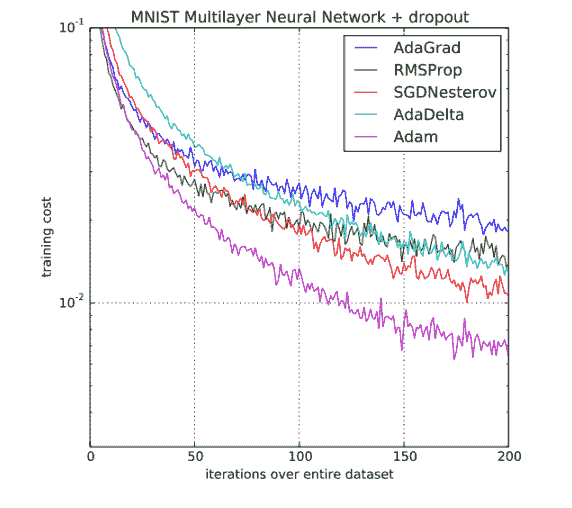

# 第三章：GAN 在游戏中的应用

到目前为止，在我们的深度学习探索中，我们所有的网络训练都采用了一种叫做**监督训练**的技术。当你花时间标记和识别数据时，这种训练方法非常有效。我们之前的所有示例练习都使用了监督训练，因为它是最简单的教学方法。然而，监督学习往往是最繁琐和冗长的方法，主要因为它在训练前需要一定的标签或数据识别。在机器学习或深度学习在游戏和仿真中的应用尝试中，尽管有人尝试使用这种训练方式，但结果都证明是失败的。

这就是为什么在本书的大部分内容中，我们将探讨其他形式的训练，首先从一种无监督训练方法开始，称为**生成对抗网络**（**GAN**）。GAN 通过本质上是一个双人游戏的方式进行自我训练，这使得它们成为我们学习的理想下一步，并且是实际开始为游戏生成内容的完美方法。

在本章中，我们将探索生成对抗网络（GAN）及其在游戏内容开发中的应用。在这个过程中，我们还将学习更多深度学习技术的基础知识。本章将涵盖以下内容：

+   介绍 GAN

+   在 Keras 中编写 GAN 代码

+   Wasserstein GAN

+   GAN 用于创建纹理

+   使用 GAN 生成音乐

+   练习

GAN 以其训练和构建的难度著称。因此，建议你花时间仔细阅读本章内容，并在需要时多做几次练习。我们学习的制作有效 GAN 的技术将帮助你更好地理解训练网络的整体概念以及其他可用的选项。同时，我们仍然需要涵盖许多关于训练网络的基础概念，所以请认真完成本章的内容。

# 介绍 GAN

GAN 的概念通常通过一个双人游戏类比来介绍。在这个游戏中，通常有一位艺术专家和一位艺术伪造者。艺术伪造者的目标是制作出足够逼真的假画来欺骗艺术专家，从而赢得游戏。以下是最早通过神经网络展示这一过程的示例：


Ian 及其他人提出的 GAN

在上面的图示中，生成器（Generator）扮演着艺术伪造者的角色，试图超越被称为判别器（Discriminator）的艺术专家。生成器使用随机噪声作为来源来生成图像，目标是让图像足够逼真，以至于能够欺骗判别器。判别器在真实和虚假图像上进行训练，任务就是将图像分类为真实或虚假。然后，生成器被训练去制作足够逼真的假图像来欺骗判别器。虽然这个概念作为一种自我训练网络的方式看起来简单，但在过去几年里，这种对抗技术的实现已在许多领域表现出卓越的效果。

GAN 最早由伊恩·古德费洛（Ian Goodfellow）及其团队在蒙特利尔大学于 2014 年开发。仅仅几年时间，这项技术已经迅速扩展到众多广泛而多样的应用领域，从生成图像和文本到为静态图像添加动画，几乎在短短几年内就完成了突破。以下是目前在深度学习领域引起关注的几项令人印象深刻的 GAN 改进/实现的简短总结：

+   **深度卷积 GAN**（**DCGAN**）：这是我们刚才讨论的标准架构的首次重大改进。我们将在本章的下一部分中，探讨它作为我们学习的第一个 GAN 形式。

+   **对抗自编码器 GAN**：这种自编码器变体利用对抗性 GAN 技术来隔离数据的属性或特征。它在发现数据中的潜在关系方面具有有趣的应用，例如能够区分手写数字的风格与内容之间的差异。

+   **辅助分类器 GAN**：这是另一种增强型 GAN，与条件 GAN 相关。它已被证明能够合成更高分辨率的图像，尤其在游戏领域非常值得进一步探索。

+   **CycleGAN**：这是一个变体，其令人印象深刻之处在于它允许将一种图像的风格转换为另一种图像。许多使用这种形式的 GAN 示例都很常见，例如将一张图片的风格转换成梵高的画风，或者交换名人的面孔。如果本章激发了你对 GAN 的兴趣，并且你想进一步探索这一形式，可以查看这篇文章：[`hardikbansal.github.io/CycleGANBlog/`](https://hardikbansal.github.io/CycleGANBlog/)。

+   **条件 GAN**：这些 GAN 使用一种半监督学习的形式。这意味着训练数据被标记，但带有元数据或属性。例如，不是将 MNIST 数据集中的手写数字标记为“9”，而是标记其书写风格（草书或印刷体）。然后，这种新的条件 GAN 形式不仅可以学习数字，还可以学习它们是草书还是印刷体。这种 GAN 形式已经展现出一些有趣的应用，并且我们将在探讨游戏领域的具体应用时进一步讨论。

+   **DiscoGAN**：这又是一种 GAN，展示了有趣的结果，从交换名人发型到性别转换。这种 GAN 提取特征或领域，并允许将它们转移到其他图像或数据空间。这在游戏中有很多应用，值得对感兴趣的读者进一步探索。

+   **DualGAN**：这使用双重 GAN，通过训练两个生成器与两个判别器进行对抗，以将图像或数据转换为其他风格。这对于重新设计多个资产非常有用，尤其是在为游戏生成不同风格的艺术内容时表现出色。

+   **最小二乘 GAN**（**LSGAN**）：这种 GAN 使用不同的损失计算方式，并且已被证明比 DCGAN 更有效。

+   **pix2pixGAN**：这是对条件 GAN 的扩展，使其能够从一张图片转换或生成多种特征到另一张图片。这允许将物体的草图转换为该物体的真实 3D 渲染图像，反之亦然。虽然这是一个非常强大的 GAN，但它仍然是研究驱动的，可能还不适合用于游戏开发。或许你得再等六个月或一年。

+   **InfoGANs**：这些类型的 GAN 迄今为止被广泛用于探索训练数据中的特征或信息。例如，它们可以用来识别 MNIST 数据集中数字的旋转方向。此外，它们通常被用作识别条件 GAN 训练属性的一种方式。

+   **Stacked 或 SGAN**：这是一种将自身分解为多个层次的 GAN，每个层都是一个生成器和判别器相互对抗。这使得整个 GAN 更容易训练，但也要求你理解每个阶段或层的细节。如果你是刚开始学习，这可能不是适合你的 GAN，但随着你构建更复杂的网络，稍后可以再次回顾这个模型。

+   **Wasserstein GANs**：这是一种最先进的 GAN，它将在本章的专门章节中获得关注。损失的计算是这种形式的 GAN 的改进之处。

+   **WassGANs**：这使用 Wasserstein 距离来确定损失，从而显著帮助模型的收敛。

在本章中，我们将继续探索具体 GAN 实现的其他实例。在这里，我们将学习如何使用 GAN 生成游戏纹理和音乐。暂时，我们先跳到下一部分，学习如何在 Keras 中编写 GAN。

# 在 Keras 中编写一个 GAN

当然，最好的学习方式是通过实践，所以让我们跳进来，开始编写第一个 GAN。在这个例子中，我们将构建基础的 DCGAN，并稍后根据我们的需求进行修改。打开`Chapter_3_2.py`，并按照以下步骤进行：

这段代码最初来自[`github.com/eriklindernoren/Keras-GAN`](https://github.com/eriklindernoren/Keras-GAN)，它是 Keras 中最好的 GAN 表示，感谢 Erik Linder-Norén 的辛勤工作。做得好，感谢你的努力，Erik。

一个备用的普通 GAN 列表已被添加为`Chapter_3_1.py`，供你学习使用。

1.  我们首先导入所需的库：

```py
from __future__ import print_function, division
from keras.datasets import mnist
from keras.layers import Input, Dense, Reshape, Flatten, Dropout
from keras.layers import BatchNormalization, Activation, ZeroPadding2D
from keras.layers.advanced_activations import LeakyReLU
from keras.layers.convolutional import UpSampling2D, Conv2D
from keras.models import Sequential, Model
from keras.optimizers import Adam
import matplotlib.pyplot as plt
import sys
import numpy as np
```

1.  在前面的代码中引入了一些新的重要类型：`Reshape`、`BatchNormalization`、`ZeroPadding2D`、`LeakyReLU`、`Model`和`Adam`。我们将更详细地探讨这些类型。

1.  我们之前的大多数示例使用的是基本的脚本。现在我们进入了一个阶段，需要为将来的进一步使用创建自定义的类型（类）。这意味着我们现在开始像这样定义我们的类：

```py
class DCGAN():
```

1.  因此，我们创建了一个新的类（类型），命名为`DCGAN`，用于实现深度卷积 GAN。

1.  接下来，我们通常会按照 Python 的约定定义`init`函数。然而，为了我们的目的，让我们先看看`generator`函数：

```py
def build_generator(self):
  model = Sequential()
  model.add(Dense(128 * 7 * 7, activation="relu", input_dim=self.latent_dim))
  model.add(Reshape((7, 7, 128)))
  model.add(UpSampling2D())
  model.add(Conv2D(128, kernel_size=3, padding="same"))
  model.add(BatchNormalization(momentum=0.8))
  model.add(Activation("relu"))
  model.add(UpSampling2D())
  model.add(Conv2D(64, kernel_size=3, padding="same")) 
  model.add(BatchNormalization(momentum=0.8))
  model.add(Activation("relu"))
  model.add(Conv2D(self.channels, kernel_size=3, padding="same"))
  model.add(Activation("tanh"))
  model.summary()

  noise = Input(shape=(self.latent_dim,))
  img = model(noise)
  return Model(noise, img)
```

1.  `build_generator`函数构建了伪造艺术模型，意味着它接受那一组噪声样本，并尝试将其转换为判别器认为是真的图像。在这个过程中，它利用卷积原理提高效率，然而在这种情况下，它生成了一张噪声特征图，然后将其转化为一张真实图像。从本质上讲，生成器做的是与识别图像相反的工作，它并不是识别图像，而是尝试基于特征图生成图像。

    在前面的代码块中，注意输入是如何以`128, 7x7`的噪声特征图开始，然后使用`Reshape`层将其转换为我们想要创建的正确图像布局。接着，它通过上采样（即池化或下采样的逆过程）将特征图放大到 2 倍大小（14 x 14），并训练另一个卷积层，之后继续进行更多的上采样（2 倍至 28 x 28），直到生成正确的图像尺寸（MNIST 的 28x28）。我们还看到了一个新的层类型`BatchNormalization`的使用，稍后我们会详细讨论它。

1.  接下来，我们将像这样构建`build_discriminator`函数：

```py
def build_discriminator(self):
  model = Sequential()
  model.add(Conv2D(32, kernel_size=3, strides=2, input_shape=self.img_shape, padding="same"))
  model.add(LeakyReLU(alpha=0.2))
  model.add(Dropout(0.25))
  model.add(Conv2D(64, kernel_size=3, strides=2, padding="same"))
  model.add(ZeroPadding2D(padding=((0,1),(0,1))))
  model.add(BatchNormalization(momentum=0.8))
  model.add(LeakyReLU(alpha=0.2))
  model.add(Dropout(0.25))
  model.add(Conv2D(128, kernel_size=3, strides=2, padding="same"))
  model.add(BatchNormalization(momentum=0.8))
  model.add(LeakyReLU(alpha=0.2))
  model.add(Dropout(0.25))
  model.add(Conv2D(256, kernel_size=3, strides=1, padding="same"))
  model.add(BatchNormalization(momentum=0.8))
  model.add(LeakyReLU(alpha=0.2))
  model.add(Dropout(0.25))
  model.add(Flatten())
  model.add(Dense(1, activation='sigmoid'))
  model.summary()

  img = Input(shape=self.img_shape)
  validity = model(img)
  return Model(img, validity)
```

1.  这次，判别器正在测试图像输入，并判断它们是否为伪造图像。它使用卷积来识别特征，但在这个示例中，它使用`ZeroPadding2D`将一层零填充放置在图像周围，以帮助识别。该层的相反形式是`Cropping2D`，它会裁剪图像。注意，模型没有在卷积中使用下采样或池化层。我们将在接下来的部分中探讨其他新的特殊层`LeakyReLU`和`BatchNormalization`。注意，我们在卷积中没有使用任何池化层。这是为了通过分数步幅卷积增加空间维度。看看在卷积层内部我们是如何使用奇数大小的卷积核和步幅的。

1.  现在，我们将回过头来像这样定义`init`函数：

```py
def __init__(self):
  self.img_rows = 28
  self.img_cols = 28
  self.channels = 1
  self.img_shape = (self.img_rows, self.img_cols, self.channels)
  self.latent_dim = 100
  optimizer = Adam(0.0002, 0.5)

  self.discriminator = self.build_discriminator()
  self.discriminator.compile(loss='binary_crossentropy',    
  optimizer=optimizer, metrics=['accuracy'])

  self.generator = self.build_generator() 
  z = Input(shape=(self.latent_dim,))
  img = self.generator(z)

  self.discriminator.trainable = False
  valid = self.discriminator(img)

  self.combined = Model(z, valid)
  self.combined.compile(loss='binary_crossentropy', optimizer=optimizer)
```

1.  这段初始化代码设置了我们输入图像的大小（28 x 28 x 1，表示一个通道的灰度图像）。然后设置一个`Adam`优化器，这是我们将在优化器章节中进一步回顾的内容。之后，它构建了`discriminator`，然后是`generator`。接着，它将这两个模型或子网络（`generator`和`discriminator`）组合在一起，使得网络能够协同工作，并在整个网络上优化训练。这个概念我们将在优化器部分更详细地讨论。

1.  在我们深入之前，花点时间运行这个示例。这个示例可能需要相当长的时间来运行，所以启动后可以回到书本，保持运行状态。

1.  在样本运行过程中，你将能够看到生成的输出被保存到与运行的 Python 文件同一个文件夹下的`images`文件夹中。可以观察到，每经过 50 次迭代，都会保存一张新图像，如下图所示：


GAN 生成的输出示例

上图展示了大约经过 3900 次迭代后的结果。当你开始训练时，会需要一些时间才能获得如此好的结果。

这涵盖了模型设置的基础知识，除了训练过程中所有的工作，这部分将在下一节中讲解。

# 训练一个 GAN

训练一个 GAN 需要更多的细节关注以及对更高级优化技术的理解。我们将详细讲解该函数的每个部分，以便理解训练过程的复杂性。让我们打开`Chapter_3_1.py`，查看`train`函数并按照以下步骤进行操作：

1.  在`train`函数的开头，你会看到以下代码：

```py
def train(self, epochs, batch_size=128, save_interval=50):  
  (X_train, _), (_, _) = mnist.load_data()
  X_train = X_train / 127.5 - 1.
  X_train = np.expand_dims(X_train, axis=3)

  valid = np.ones((batch_size, 1))
  fake = np.zeros((batch_size, 1))
```

1.  数据首先从 MNIST 训练集加载，然后重新缩放到`-1`到`1`的范围。我们这样做是为了更好地将数据围绕 0 进行中心化，并且适配我们的激活函数`tanh`。如果你回去查看生成器函数，你会看到底部的激活函数是`tanh`。

1.  接下来，我们构建一个`for`循环来迭代整个训练周期，代码如下：

```py
for epoch in range(epochs):
```

1.  然后，我们使用以下代码随机选择一半的*真实*训练图像：

```py
idx = np.random.randint(0, X_train.shape[0], batch_size)
imgs = X_train[idx]
```

1.  然后，我们采样`noise`并使用以下代码生成一组伪造图像：

```py
noise = np.random.normal(0, 1, (batch_size, self.latent_dim))
gen_imgs = self.generator.predict(noise)
```

1.  现在，图像中一半是真实的，另一半是我们`generator`生成的伪造图像。

1.  接下来，`discriminator`会对图像进行训练，产生错误预测的伪造图像损失和正确识别的真实图像损失，如下所示：

```py
d_loss_real = self.discriminator.train_on_batch(imgs, valid)
d_loss_fake = self.discriminator.train_on_batch(gen_imgs, fake)
d_loss = 0.5 * np.add(d_loss_real, d_loss_fake)
```

1.  记住，这段代码是针对一个批次的数据运行的。这就是为什么我们使用`numpy np.add`函数来将`d_loss_real`和`d_loss_fake`相加的原因。`numpy`是我们常用的一个库，用于处理数据集或张量。

1.  最后，我们使用以下代码训练生成器：

```py
g_loss = self.combined.train_on_batch(noise, valid)

print ("%d [D loss: %f, acc.: %.2f%%] [G loss: %f]" % (epoch, d_loss[0], 100*d_loss[1], g_loss))

if epoch % save_interval == 0:
  self.save_imgs(epoch)
```

1.  请注意，`g_loss`是如何基于训练合并模型来计算的。正如你可能记得的，合并模型会将真实和伪造图像的输入传入，并将训练的误差反向传播到整个模型中。这使得我们能够将`generator`和`discriminator`一起训练，作为一个合并模型。接下来展示了这一过程的一个示例，但请注意图像大小与我们不同：


DCGAN 的层架构图

现在我们对架构有了更好的理解，我们需要回过头来理解一些关于新层类型和合并模型优化的细节。我们将在下一节中探讨如何优化像我们的 GAN 这样的联合模型。

# 优化器

**优化器**实际上只是另一种通过网络训练误差反向传播的方式。正如我们在第一章*《深度学习与游戏》*中学到的那样，我们用于反向传播的基本算法是梯度下降法，以及更高级的**随机梯度下降法**（**SGD**）。

SGD 通过在每次训练迭代中随机选择批次顺序来改变梯度的评估。尽管 SGD 在大多数情况下表现良好，但它在生成对抗网络（GAN）中表现不佳，因为它存在一个被称为**梯度消失**/ **梯度爆炸**的问题，这通常出现在训练多个但组合的网络时。记住，我们将生成器的结果直接输入判别器中。为此，我们转向更高级的优化器。以下图示展示了典型最佳优化器的性能：



各种优化器的性能比较

图中的所有方法都源自 SGD，但你可以清楚地看到，在这个实例中，**Adam**是赢家。当然，也有例外情况，但目前最受欢迎的优化器是 Adam。你可能已经注意到，我们以前广泛使用过它，并且未来你可能会继续使用它。不过，接下来我们会更详细地了解每个优化器，如下所示：

+   **SGD**：这是我们最早研究的模型之一，通常它将是我们用来作为训练基准的模型。

+   **带有 Nesterov 的 SGD**：SGD 常面临的问题是我们在早期训练示例中看到的网络损失中的晃动效应。记住，在训练过程中，我们的网络损失会在两个值之间波动，几乎就像一个球在山坡上下滚动。实质上，这正是发生的情况，但我们可以通过引入一个我们称之为**动量**的项来纠正这一点。以下图示展示了动量对训练的影响：


带有和不带动量的 SGD

所以，现在，我们不再只是让球盲目地滚动，而是控制它的速度。我们给它一点推力，让它越过那些恼人的颠簸或晃动，更高效地到达最低点。

正如你可能记得，从反向传播的数学中我们控制 SGD 中的梯度，以训练网络最小化误差或损失。通过引入动量，我们试图通过近似值来更高效地控制梯度。**Nesterov 技术**，或者可以称之为**动量**，使用加速的动量项来进一步优化梯度。

+   **AdaGrad**：这种方法根据更新的频率优化个别训练参数，因此非常适合处理较小的数据集。另一个主要优点是它不需要调节学习率。然而，这种方法的一个大缺点是平方梯度导致学习率变得过小，从而使得网络停止学习。

+   **AdaDelta**：这种方法是 AdaGrad 的扩展，用于处理平方梯度和消失的学习率。它通过将学习率窗口固定为一个特定的最小值来解决这一问题。

+   **RMSProp**：由深度学习的祖师爷 Geoff Hinton 开发，这是一种用于解决 AdaGrad 中消失学习率问题的技术。如图所示，它与 AdaDelta 的表现相当。

+   **自适应矩估计（Adam）**：这是一种尝试通过更控制版本的动量来控制梯度的技术。它通常被描述为动量加上 RMSProp，因为它结合了两者的优点。

+   **AdaMax**：这种方法未在性能图表中显示，但值得一提。它是 Adam 的扩展，对每次更新迭代应用于动量进行了推广。

+   **Nadam**：这是一种未出现在图表中的方法，它是 Nesterov 加速动量和 Adam 的结合。普通的 Adam 仅使用了一个未加速的动量项。

+   **AMSGrad**：这是 Adam 的一种变种，在 Adam 无法收敛或出现震荡时效果最佳。这是由于算法未能适应学习率，通过取之前平方梯度的最大值而非平均值来修正这一问题。这个区别较为微妙，且更倾向于较小的数据集。在使用时可以将这个选项作为未来可能的工具记在心中。

这就完成了我们对优化器的简要概述；务必参考章节末尾的练习，以进一步探索它们。在下一节中，我们将构建自己的 GAN，生成可以在游戏中使用的纹理。

# Wasserstein GAN

正如你现在可以非常清楚地理解的，GAN 有着广泛而多样的应用，其中许多在游戏中应用得非常好。其中一个应用是生成纹理或纹理变化。我们经常需要对纹理做些微小变化，以便给我们的游戏世界增添更具说服力的外观。这可以通过**着色器**来完成，但出于性能考虑，通常最好创建**静态资源**。

因此，在本节中，我们将构建一个 GAN 项目，允许我们生成纹理或高度图。你也可以使用我们之前简要提到的其他一些酷炫的 GAN 扩展这个概念。我们将使用 Erik Linder-Norén 的 Wasserstein GAN 的默认实现，并将其转换为我们的用途。

在首次接触深度学习问题时，你将面临的一个主要障碍是如何将数据调整为所需的格式。在原始示例中，Erik 使用了 MNIST 数据集，但我们将把示例转换为使用 CIFAR100 数据集。CIFAR100 数据集是一组按类别分类的彩色图像，如下所示：


CIFAR 100 数据集

现在，让我们打开 `Chapter_3_wgan.py` 并按照以下步骤操作：

1.  打开 Python 文件并查看代码。大部分代码与我们之前查看的 DCGAN 相同。然而，我们想要查看几个关键的不同点，具体如下：

```py
def train(self, epochs, batch_size=128, sample_interval=50):
  (X_train, _), (_, _) = mnist.load_data()

  X_train = (X_train.astype(np.float32) - 127.5) / 127.5
  X_train = np.expand_dims(X_train, axis=3)

  valid = -np.ones((batch_size, 1))
  fake = np.ones((batch_size, 1))

  for epoch in range(epochs):
    for _ in range(self.n_critic):
      idx = np.random.randint(0, X_train.shape[0], batch_size)
      imgs = X_train[idx]
      noise = np.random.normal(0, 1, (batch_size, self.latent_dim))
      gen_imgs = self.generator.predict(noise)

      d_loss_real = self.critic.train_on_batch(imgs, valid)
      d_loss_fake = self.critic.train_on_batch(gen_imgs, fake)
      d_loss = 0.5 * np.add(d_loss_fake, d_loss_real)

      for l in self.critic.layers:
        weights = l.get_weights()
        weights = [np.clip(w, -self.clip_value, self.clip_value) for 
        w in weights]
        l.set_weights(weights)

    g_loss = self.combined.train_on_batch(noise, valid)
    print ("%d [D loss: %f] [G loss: %f]" % (epoch, 1 - d_loss[0], 1 
    - g_loss[0]))\

    if epoch % sample_interval == 0:
      self.sample_images(epoch)
```

1.  Wasserstein GAN 使用一种距离函数来确定每次训练迭代的成本或损失。除此之外，这种形式的 GAN 使用多个评判器而不是单一的判别器来确定成本或损失。训练多个评判器可以提高性能，并解决我们通常在 GAN 中看到的梯度消失问题。另一种 GAN 训练方式的示例如下：


GAN 实现的训练性能对比 ([`arxiv.org/pdf/1701.07875.pdf`](https://arxiv.org/pdf/1701.07875.pdf))

1.  WGAN 通过管理成本来克服梯度问题，采用距离函数来确定移动的成本，而不是依赖错误值的差异。一个线性成本函数可能像字符拼写一个单词所需的移动次数那样简单。例如，单词 *SOPT* 的成本为 2，因为 `T` 字符需要移动两次才能正确拼写成 *STOP*。单词 *OTPS* 的距离成本为 *3 (S) + 1 (T) = 4*，才能正确拼写成 *STOP*。

1.  Wasserstein 距离函数本质上确定了将一个概率分布转换为另一个概率分布的成本。如你所想，理解这些数学可能相当复杂，因此我们将这一部分留给对数学更感兴趣的读者。

1.  运行示例。这个示例可能需要较长时间才能运行，所以请耐心等待。此外，已知这个示例在某些 GPU 硬件上可能无法顺利训练。如果你遇到这种情况，只需禁用 GPU 的使用即可。

1.  当示例运行时，打开与 Python 文件相同文件夹中的 `images` 文件夹，查看训练图像的生成过程。

运行示例，直到你理解它是如何工作的为止。即使在高级硬件上，这个示例也可能需要几个小时。完成后，继续进行下一部分，我们将看到如何修改这个示例以生成纹理。

# 使用 GAN 生成纹理

在深度学习的高级书籍中，很少涉及如何调整数据以输入到网络中的具体细节。除了数据调整外，还需要修改网络内部结构以适应新的数据。这个示例的最终版本是 `Chapter_3_3.py`，但本练习从 `Chapter_3_wgan.py` 文件开始，并按以下步骤操作：

1.  我们将通过交换导入语句来将训练数据集从 MNIST 切换到 CIFAR，代码如下：

```py
from keras.datasets import mnist  #remove or leave
from keras.datasets import cifar100  #add
```

1.  在类的开始，我们将把图像尺寸的参数从 28 x 28 的灰度图像更改为 32 x 32 的彩色图像，代码如下：

```py
class WGAN():
  def __init__(self):
    self.img_rows = 32
    self.img_cols = 32
    self.channels = 3
```

1.  现在，移动到`train`函数并按如下方式修改代码：

```py
#(X_train, _), (_, _) = mnist.load_data() or delete me
(X_train, y), (_, _) = cifar100.load_data(label_mode='fine')
Z_train = []
cnt = 0
for i in range(0,len(y)):
  if y[i] == 33:  #forest images
  cnt = cnt + 1 
  z = X_train[i]
  Z_train.append(z)
#X_train = (X_train.astype(np.float32) - 127.5) / 127.5 or delete me
#X_train = np.expand_dims(X_train, axis=3)
Z_train = np.reshape(Z_train, [500, 32, 32, 3])
Z_train = (Z_train.astype(np.float32) - 127.5) / 127.5

#X_train = (X_train.astype(np.float32) - 127.5) / 127.5
#X_train = np.expand_dims(X_train, axis=3)
```

1.  这段代码加载 CIFAR100 数据集中的图像，并按标签进行分类。标签存储在`y`变量中，代码会遍历所有下载的图像，并将它们隔离到特定的集合中。在这个例子中，我们使用标签`33`，对应的是森林图像。CIFAR100 中有 100 个类别，我们选择其中一个类别，这个类别包含 500 张图像。你也可以尝试生成其他类别的纹理。

    其余的代码相当简单，除了`np.reshape`调用部分，在那里我们将数据重塑为包含 500 张`32x32`像素并且有三个通道的图像。你可能还需要注意，我们不再像之前那样需要扩展轴到三个通道，因为我们的图像已经是三通道的。

1.  接下来，我们需要返回生成器和判别器模型，并稍微修改代码。首先，我们将按如下方式修改生成器：

```py
def build_generator(self):
  model = Sequential()
  model.add(Dense(128 * 8 * 8, activation="relu", input_dim=self.latent_dim))
  model.add(Reshape((8, 8, 128)))
  model.add(UpSampling2D())
  model.add(Conv2D(128, kernel_size=4, padding="same"))
  model.add(BatchNormalization(momentum=0.8))
  model.add(Activation("relu"))
  model.add(UpSampling2D())
  model.add(Conv2D(64, kernel_size=4, padding="same"))
  model.add(BatchNormalization(momentum=0.8))
  model.add(Activation("relu"))
  model.add(Conv2D(self.channels, kernel_size=4, padding="same"))
  model.add(Activation("tanh"))
  model.summary()
  noise = Input(shape=(self.latent_dim,))
  img = model(noise)
  return Model(noise, img)
```

1.  粗体代码表示所做的更改。我们对这个模型所做的所有操作就是将`7x7`的原始特征图转换为`8x8`。回想一下，原始图像的完整尺寸是`28x28`。我们的卷积从`7x7`的特征图开始，经过两次放大，得到`28x28`的图像。由于我们的新图像尺寸是`32x32`，我们需要将网络调整为从`8x8`的特征图开始，经过两次放大得到`32x32`，与 CIFAR100 图像的尺寸相同。幸运的是，我们可以保持判别器模型不变。

1.  接下来，我们添加一个新函数来保存原始 CIFAR 图像的样本，代码如下：

```py
def save_images(self, imgs, epoch):
  r, c = 5, 5 
  gen_imgs = 0.5 * imgs + 1
  fig, axs = plt.subplots(r, c)
  cnt = 0
  for i in range(r):
    for j in range(c):
      axs[i,j].imshow(gen_imgs[cnt, :,:,0],cmap='gray')
      axs[i,j].axis('off')
      cnt += 1

  fig.savefig("images/cifar_%d.png" % epoch)
  plt.close()
```

1.  `save_images`函数输出原始图像样本，并通过以下代码在`train`函数中调用：

```py
idx = np.random.randint(0, Z_train.shape[0], batch_size)
imgs = Z_train[idx] 
if epoch % sample_interval == 0:
 self.save_images(imgs, epoch)
```

1.  新代码是粗体部分，输出的是原始图像的一个样本，如下所示：


原始图像示例

1.  运行示例并再次查看`images`文件夹中的输出，文件夹名称为`cifar`，展示训练结果。再次提醒，这个示例可能需要一些时间来运行，因此请继续阅读下一部分。

在样本运行时，你可以观察到 GAN 是如何训练以匹配这些图像的。这里的好处是，你可以通过多种技术轻松生成不同的纹理。你可以将这些纹理或高度图用作 Unity 或其他游戏引擎中的素材。在完成本节之前，我们先来讨论一些归一化和其他参数。

# 批量归一化

**批量归一化**，顾名思义，它会将一层中权重的分布标准化，使其围绕均值 0。这样可以让网络使用更高的学习率，同时避免梯度消失或爆炸的问题。这是因为权重被标准化，从而减少了训练过程中的偏移或震荡，正如我们之前看到的那样。

通过标准化一层中的权重，我们使网络能够使用更高的学习率，从而加速训练。此外，我们还可以避免或减少使用`DropOut`的需要。你会看到我们使用标准术语来标准化这些层，如下所示：

```py
model.add(BatchNormalization(momentum=0.8))
```

从我们对优化器的讨论中回忆一下，动量控制着我们希望训练梯度减少的快慢。在这里，动量指的是标准化分布的均值或中心变化的程度。

在接下来的部分，我们将讨论另一种特殊的层——LeakyReLU。

# Leaky 和其他 ReLU

**LeakyReLU**添加了一个激活层，允许负值有一个小的斜率，而不是像标准 ReLU 激活函数那样为 0。标准 ReLU 通过只允许正激活的神经元激活，鼓励网络的稀疏性。然而，这也会导致死神经元的状态，网络的某些部分实际上会“死亡”或变得无法训练。为了解决这个问题，我们引入了一种名为 LeakyReLU 的 ReLU 激活形式。以下是这种激活方式的示例：


Leaky 和参数化 ReLU 的示例

在前面的图示中是**参数化 ReLU**，它类似于 Leaky，但允许网络自行训练参数。这使得网络能够自我调整，但训练时间会更长。

你可以使用的其他 ReLU 变体总结如下：

+   **指数线性** (**ELU, SELU**): 这些 ReLU 形式的激活如图所示：


ELU 和 SELU

+   **连接 ReLU** (**CReLU**): 这一层将常规 ReLU 和 LeakyReLU 结合在一起，提供一种新的功能，生成两个输出值。对于正值，它产生* [0,x]*，而对于负值，它返回 *[x,0]*。需要注意的是，这一层的输出翻倍，因为每个神经元会生成两个值。

+   **ReLU-6**：6 的值是任意的，但它允许网络训练稀疏的神经元。稀疏性具有价值，因为它鼓励网络学习或建立更强的权重或连接。已经有研究表明，人脑在稀疏状态下工作，通常只有少数几个神经元同时被激活。你经常会听到一个神话，说我们大脑最多一次只使用 10%。这可能是真的，但其中的原因更多的是数学上的问题，而不是我们无法使用大脑的全部功能。我们确实使用大脑的全部，只不过不是同时使用所有部分。稀疏性鼓励的更强的单个权重，使网络能够做出更好、更强的决策。更少的权重也能减少过拟合或数据记忆的情况。这种情况常发生在具有成千上万神经元的深度网络中。

正则化是我们经常使用的另一种技术，用于修剪或减少不需要的权重，创建稀疏网络。在接下来的章节中，我们将有机会更深入地了解正则化和稀疏性。

在下一节中，我们将利用所学知识构建一个能生成游戏音乐的工作型音乐 GAN。

# 创建音乐的 GAN

在本章的最终示例中，我们将研究使用 GAN 为游戏生成音乐。音乐生成本身并不特别困难，但它让我们看到了使用 LSTM 层的 GAN 变体，该变体能够识别音乐中的序列和模式。然后，它尝试将随机噪音重建成可接受的音符序列和旋律。当你听到那些生成的音符并意识到这段旋律来自计算机的大脑时，这个示例会显得非常虚幻。

这个示例的来源来自 GitHub，[`github.com/megis7/musegen`](https://github.com/megis7/musegen)，并由 Michalis Megisoglou 开发。我们查看这些代码示例的原因是为了看到别人最优秀的作品，并从中学习。在某些情况下，这些示例接近原始版本，而在其他情况下则不完全相同。我们确实做了一些调整。Michalis 还在 GitHub 上发布了他为实现**museGAN**（基于 GAN 的音乐生成）编写的代码的详细 README。如果你有兴趣进一步扩展这个示例，务必查看 GitHub 网站。不同的库有几个 museGAN 的实现，其中之一是 TensorFlow。

在这个示例中，我们使用 Keras，目的是使示例更易于理解。如果你对使用 TensorFlow 非常认真，那么一定要查看 museGAN 的 TensorFlow 版本。

这个示例分别训练判别器和生成器，这意味着需要先训练判别器。对于我们的第一次运行，我们将使用作者之前生成的模型来运行这个示例，但我们仍然需要一些设置；让我们按照以下步骤进行：

1.  我们首先需要安装一些依赖项。以管理员身份打开 Anaconda 或 Python 窗口，并运行以下命令：

```py
pip install music21
pip install h5py
```

1.  `Music21`是一个用于加载 MIDI 文件的 Python 库。**MIDI**是一种音乐交换格式，用于描述音乐/音符，正如你所猜测的那样。原始模型是通过一组描述巴赫 300 首合唱音乐的 MIDI 文件进行训练的。你可以通过导航到`musegen`文件夹并运行脚本来找到该项目。

1.  导航到项目文件夹，并执行运行先前训练的模型的脚本，如下所示：

```py
cd musegen
python musegen.py or python3 musegen.py
```

1.  这将加载先前保存的模型，并使用这些模型来训练生成器并生成音乐。当然，您稍后可以根据需要使用您选择的其他 MIDI 文件训练这个 GAN。对于 MIDI 文件，有许多免费的来源，包括古典音乐、电视主题音乐、游戏和现代流行音乐。我们在这个例子中使用的是作者的原始模型，但可能性是无穷无尽的。

1.  加载音乐文件和训练可能会非常耗时，因为训练通常需要较长时间。所以，趁此机会查看一下代码。打开项目文件夹中的`musegen.py`文件。查看大约第 39 行，如下所示：

```py
print('loading networks...')
dir_path = os.path.dirname(os.path.realpath(__file__))
generator = loadModelAndWeights(os.path.join(dir_path, note_generator_dir, 'model.json'),
                               os.path.join(dir_path, note_generator_dir, 'weights-{:02d}.hdf5'.format(generator_epoch)))
```

1.  这一段代码加载了从`hdf5`或分层数据文件中训练的模型。前面的代码设置了多个变量，用于定义我们将在生成新音符时使用的音符词汇。

1.  找到项目文件夹中名为`notegenerator.py`的文件。查看模型创建的代码，如下所示：

```py
x_p = Input(shape=(sequence_length, pitch_dim,), name='pitches_input')
h = LSTM(256, return_sequences=True, name='h_lstm_p_1')(x_p)
h = LSTM(512, return_sequences=True, name='h_lstm_p_2')(h)
h = LSTM(256, return_sequences=True, name='h_lstm_p_3')(h)

# VAE for pitches
z_mean_p = TimeDistributed(Dense(latent_dim_p, kernel_initializer='uniform'))(h)
z_log_var_p = TimeDistributed(Dense(latent_dim_p, kernel_initializer='uniform'))(h)

z_p = Lambda(sampling)([z_mean_p, z_log_var_p])
z_p = TimeDistributed(Dense(pitch_dim, kernel_initializer='uniform', activation='softmax'))(z_p)

x_d = Input(shape=(sequence_length, duration_dim, ), name='durations_input')
h = LSTM(128, return_sequences=True)(x_d)
h = LSTM(256, return_sequences=True)(h)
h = LSTM(128, return_sequences=True)(h)

# VAE for durations
z_mean_d = TimeDistributed(Dense(latent_dim_d, kernel_initializer='uniform'))(h)
z_log_var_d = TimeDistributed(Dense(latent_dim_d, kernel_initializer='uniform'))(h)

z_d = Lambda(sampling)([z_mean_d, z_log_var_d])
z_d = TimeDistributed(Dense(duration_dim, kernel_initializer='uniform', activation='softmax'))(z_d)
conc = Concatenate(axis=-1)([z_p, z_d])
latent = TimeDistributed(Dense(pitch_dim + duration_dim, kernel_initializer='uniform'))(conc)
latent = LSTM(256, return_sequences=False)(latent)

o_p = Dense(pitch_dim, activation='softmax', name='pitches_output', kernel_initializer='uniform')(latent)
o_d = Dense(duration_dim, activation='softmax', name='durations_output', kernel_initializer='uniform')(latent)
```

1.  注意我们如何从使用`Conv2D`层改为使用`LSTM`层，因为我们已经从图像识别转向了序列或音符模式识别。我们还从使用更直接的层次结构转向了复杂的时间分布架构。此外，作者使用了一种称为**变分自编码**的概念，用于确定序列中音符的分布。这个网络是我们迄今为止看到的最复杂的，内容非常丰富。对于这个例子，不必过于担心，只需看看代码的流向。我们将在第四章*《构建深度学习游戏聊天机器人》*中详细探讨更多这种类型的高级时间分布网络[.](http://Chapter_4)

1.  让示例运行并生成一些音乐样本到`samples/note-generator`文件夹。随着我们进入更复杂的问题，训练时间将从几个小时变成几天，甚至更长。很可能你会轻松生成一个网络，但却没有足够的计算能力在合理时间内完成训练。

1.  打开文件夹，双击其中一个示例文件来听听生成的 MIDI 文件。记住，这段音乐是由计算机“大脑”生成的。

在这个示例中，我们没有涵盖很多代码。所以，请务必返回并查看`musegen.py`文件，以更好地理解用于构建网络生成器的流程和层类型。在下一部分，我们将探讨如何训练这个 GAN。

# 训练音乐 GAN

在开始训练这个网络之前，我们将查看作者原始 GitHub 源码中展示的整体架构：


museGAN 网络架构概述

这些网络几乎完全相同，直到你仔细观察并发现 LSTM 层的细微差异。注意，某一模型使用的单元数是另一个模型的两倍。

我们可以通过在 Python 或 Anaconda 提示符下运行以下命令来生成音乐模型：

```py
python note-generator.py 
or 
python3 note-generator.py
```

这个脚本加载示例数据并生成我们在稍后创建原创音乐时会在`musegen.py`文件中使用的模型。打开`note-generator.py`文件，主要部分如下所示：

代码已经从原始版本进行了修改，以使其更加兼容 Windows 并支持跨平台。再次强调，这绝不是对作者出色工作的批评。

```py
def loadChorales():
    notes = []
    iterator = getChoralesIterator()

    # load notes of chorales
    for chorale in iterator[1:maxChorales]: # iterator is 1-based 
        transpose_to_C_A(chorale.parts[0])
        notes = notes + parseToFlatArray(chorale.parts[0])
        notes.append((['end'], 0.0)) # mark the end of the piece

    return notes
```

该代码使用 Music21 库来读取 MIDI 音符和其他音乐形式，来自您可以用于自己测试的音乐语料库。这个训练数据集是生成其他音乐来源的一个很好的方式，包含以下内容：[`web.mit.edu/music21/doc/moduleReference/moduleCorpus.html`](http://web.mit.edu/music21/doc/moduleReference/moduleCorpus.html)。

您可以通过修改`config.py`文件中的内容或添加额外的配置选项来进一步修改此示例，文件示例如下：

```py
# latent dimension of VAE (used in pitch-generator)
latent_dim = 512

# latent dimensions for pitches and durations (used in note-generator)
latent_dim_p = 512
latent_dim_d = 256

# directory for saving the note embedding network model --- not used anymore
note_embedding_dir = "models/note-embedding"

# directory for saving the generator network model
pitch_generator_dir = 'models/pitch-generator'

# directory for saving the note generator network model
note_generator_dir = 'models/note-generator'

# directory for saving generated music samples
output_dir = 'samples'
```

上一个示例非常适合探索音乐生成。一个更实用且潜在有用的示例将在下一部分介绍。

# 通过另一种 GAN 生成音乐

另一个音乐生成示例也包含在`Chapter_3`源文件夹中，名为**Classical-Piano-Composer**，其源代码位于[`github.com/Skuldur/Classical-Piano-Composer`](https://github.com/Skuldur/Classical-Piano-Composer)，由 Sigurður Skúli 开发。这个示例使用了完整的《最终幻想》MIDI 文件作为音乐生成的灵感来源，是一个生成自己音乐的极好实用示例。

为了运行这个示例，您需要先运行`lstm.py`，并使用以下命令从`Classical-Piano-Composer`项目文件夹中执行：

```py
python lstm.py 
or
python3 lstm.py
```

这个示例可能需要相当长的时间来训练，所以请确保打开文件并阅读它的功能。

模型训练完成后，您可以通过运行以下命令来运行生成器：

```py
python predict.py
or
python3 predict.py
```

这个脚本加载了训练好的模型并生成音乐。它通过将 MIDI 音符编码为网络输入，按序列或音符集的形式进行处理。我们在这里做的就是将音乐文件分解成短序列，或者如果你愿意，可以称之为音乐快照。你可以通过调整代码文件中的`sequences_length`属性来控制这些序列的长度。

这个第二个示例的一个优点是可以下载你自己的 MIDI 文件并将其放入适当的输入文件夹进行训练。更有趣的是，两个项目都使用了类似的三层 LSTM 结构，但在其他执行方式上差异较大。

如果你想深入了解游戏中的音频或音乐开发，尤其是在 Unity 中的开发，可以阅读 Micheal Lanham 的书籍《*Game Audio Development with Unity 5.x*》。这本书可以向你展示更多在游戏中处理音频和音乐的技巧。

这两个音乐样本的训练和生成音乐可能需要一些时间，但毫无疑问，通过运行这两个示例并理解它们的工作原理，绝对值得付出努力。GAN 技术革新了我们对神经网络训练的理解，并改变了它们能够产生的输出类型。因此，它们在生成游戏内容方面无疑具有重要地位。

# 练习

花些时间通过进行以下练习来巩固你的学习：

1.  你会使用哪种类型的 GAN 来在图像上转移风格？

1.  你会使用哪种类型的 GAN 来隔离或提取风格？

1.  修改 Wasserstein GAN 示例中使用的评论者数量，看看它对训练的影响。

1.  修改第一个 GAN，即 DCGAN，使用你在本章中学到的任何技巧来提高训练性能。你是如何提高训练性能的？

1.  修改 BatchNormalization 动量参数，看看它对训练的影响。

1.  修改一些样本，将激活函数从 LeakyReLU 更改为另一种更高级的激活形式。

1.  修改 Wasserstein GAN 示例，使用你自己的纹理。在章节下载的代码示例中有一个示例数据加载器可供使用。

1.  从[`github.com/eriklindernoren/Keras-GAN`](https://github.com/eriklindernoren/Keras-GAN)下载其他参考 GAN 之一，并修改它以使用你自己的数据集。

1.  修改第一个音乐生成 GAN，使用不同的语料库。

1.  使用你自己的 MIDI 文件来训练第二个音乐生成 GAN 示例。

1.  （附加题）哪个音乐 GAN 生成的音乐更好？它是你预期的吗？

你当然不必完成所有这些练习，但可以尝试做几个。立刻将这些知识应用到实践中，能够大大提高你对材料的理解。毕竟，实践才能完美。

# 总结

在本章中，我们探讨了生成对抗网络（GAN），它是一种构建深度神经网络（DNN）的方法，可以通过复制或提取其他内容的特征来生成独特的内容。这也使我们能够探索无监督学习，这是一种无需先前数据分类或标记的训练方法。在上一章中，我们使用了监督学习。我们从研究当前在深度学习社区产生影响的各种 GAN 变种开始。然后，我们用 Keras 编写了一个深度卷积 GAN，接着介绍了最先进的 Wasserstein GAN。随后，我们探讨了如何利用样本图像生成游戏纹理或高度图。最后，我们通过研究两个能够从样本音乐生成原创 MIDI 音乐的音乐生成 GAN，结束了本章的内容。

在最后的示例中，我们研究了依赖于 RNN（LSTM）的生成对抗网络（GAN）在音乐生成中的应用。我们将在接下来的章节中继续探讨 RNN，重点讲解如何为游戏构建深度学习聊天机器人。
