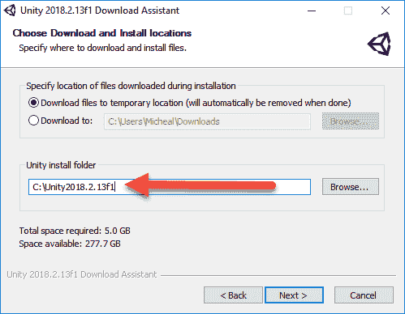

# 第四章：构建深度学习游戏聊天机器人

**聊天机器人**，或称对话代理，是人工智能领域一个迅速发展的趋势，被视为与计算机互动的下一个人类界面。从 Siri、Alexa 到 Google Home，这一领域的商业增长势不可挡，你很可能已经以这种方式与计算机进行了互动。因此，讨论如何为游戏构建对话代理似乎是理所当然的。然而，出于我们的目的，我们将关注一类被称为**神经对话代理**的机器人。它们的名字来源于它们是通过神经网络开发的。现在，聊天机器人不仅仅是聊天；我们还将探讨对话机器人在游戏中可以采取的其他应用方式。

在本章中，我们将学习如何构建神经对话代理，并将这些技术应用于游戏中。以下是我们将讨论的主要内容摘要：

+   神经对话代理

+   序列到序列学习

+   DeepPavlov

+   构建机器人服务器

+   在 Unity 中运行机器人

+   练习

我们现在将开始构建更实际的、能够在现实中工作的项目示例。虽然并非所有的训练都已完成，但现在是时候开始构建你可以使用的部分了。这意味着我们将在本章开始使用 Unity，事情可能很快变得复杂。只要记得慢慢来，如果需要的话，可以多看几遍材料。同样，本章末尾的练习是一个非常好的额外学习资源。

在接下来的章节中，我们将探讨神经对话代理的基础知识。

# 神经对话代理

通过自然语言与计算机进行交流的概念早在《星际迷航》（1966 至 1969 年）时期就已流行。在该系列中，我们经常看到柯克、斯科蒂（Scotty）等人向计算机发出指令。从那时起，许多人试图构建能够与人类自然对话的聊天机器人。在这条常常不成功的道路上，几种语言学方法被开发了出来。这些方法通常被归类为**自然语言处理**，或称**NLP**。现在，NLP 仍然是大多数聊天机器人的基础，包括我们稍后将介绍的深度学习类型。

我们通常根据目的或任务将对话代理分组。目前，我们将聊天机器人分为两种主要类型：

+   **目标导向**：这些机器人是柯克（Kirk）可能使用的那种，或者是你每天可能与之沟通的机器人，一个很好的例子是 Siri 或 Alexa。

+   **通用对话者**：这些聊天机器人旨在与人类就广泛的话题进行对话，一个好的例子是**微软 Tay**。不幸的是，Tay 机器人可能有些太容易受影响，学会了不良语言，类似于一个两岁孩子的行为。

游戏与聊天机器人并不陌生，已经尝试使用这两种形式，并取得了不同程度的成功。虽然你可能认为目标导向型的机器人非常合适，但实际上，语音/文本对于大多数重复性的游戏任务来说，速度太慢且枯燥。即使是简单的语音命令（咕哝或呻吟）也太慢了，至少现在是这样。因此，我们将探讨那些经常未被充分利用的对话型聊天机器人，以及它们如何在游戏中发挥作用。

以下是这些机器人可以承担的游戏任务总结：

+   **非玩家角色**（**NPCs**）：这是一个显而易见的首选。NPC 通常是预设脚本，容易变得单调重复。那么，如何设计一个能够自然对话的 NPC 呢？也许在使用正确的词语或短语组合时，它能透露信息？这里的可能性是无穷的，实际上，游戏中已经开始使用一些自然语言处理（NLP）技术来实现这一点。

+   **玩家角色**：如果有一个游戏，你可以和自己对话怎么样？也许角色失去了记忆，正在努力回忆信息或了解背景故事。

+   **推广**/**提示**：也许作为推广你的游戏的一种方式，你可以创建一个机器人，提示如何完成一些困难任务，或者仅仅作为一种谈论游戏的方式。

+   **MMO 虚拟角色**：如果在你离开你最喜欢的 MMO 游戏时，你的角色依然留在游戏中，无法进行任何操作，但仍能像你一样与人对话，那会怎么样？这是我们将在本章讨论的示例，我们稍后会介绍如何实现动作部分，当我们探讨**强化学习**时。

随着时间的推移，可能会出现更多的用途，但现在前面的列表应该能给你一些关于如何在游戏中使用聊天机器人的好点子。在下一部分，我们将讨论构建对话型机器人背后的背景。

# 一般的对话模型

对话型聊天机器人可以进一步分为两种主要形式：**生成型**和**选择型**。我们将要讨论的方法是生成型。生成型模型通过输入一系列带有上下文和回复的词语和对话来学习。内部，这些模型使用 RNN（LSTM）层来学习并预测这些序列，并将它们返回给对话者。以下是该系统如何工作的一个示例：


生成型对话模型的示例

请注意，图示中的每个块代表一个 LSTM 单元。每个单元会记住文本所在的序列。前面图示中可能不太清楚的是，对话文本的双方在训练前都被输入到模型中。因此，这个模型与我们在第三章*《游戏中的 GAN》*中讨论的 GAN 有些相似。在下一部分，我们将深入讨论如何搭建这种类型的模型。

# 序列到序列学习

在上一节中，我们看到我们的网络模型的概述。在这一节中，我们将介绍一个使用序列到序列学习的生成式对话模型的 Keras 实现。在我们深入探讨这种生成模型的理论之前，让我们先运行一个示例，因为这可能需要一些时间。我们将探索的示例是 Keras 提供的序列到序列机器翻译的参考示例。它当前配置为执行英法翻译。

打开 `Chapter_4_1.py` 示例代码并按照以下步骤运行：

1.  打开一个 shell 或 Anaconda 窗口。然后运行以下命令：

```py
python3 Chapter_4_1.py
```

1.  这将运行示例，可能需要几个小时才能完成。该示例还可能消耗大量内存，这可能会导致低内存系统进行内存分页。将内存分页到磁盘将花费额外的训练时间，特别是如果你没有使用 SSD。如果你发现无法完成这个示例的训练，可以减少 `epochs` 和/或 `num_samples` 参数，如下所示：

```py
batch_size = 64 # Batch size for training.
epochs = 100 # Number of epochs to train for.
latent_dim = 256 # Latent dimensionality of the encoding space.
num_samples = 10000 # Number of samples to train on.
```

1.  如果你无法使用原始值进行训练，可以减少 `epochs` 或 `num_samples` 参数。

1.  当示例完成训练后，它将运行一个测试数据集。在此过程中，它会输出结果，你可以看到它从英语翻译到法语的效果如何。

1.  打开位于章节源代码中的 `fra-eng` 文件夹。

1.  打开 `fra.txt` 文件，前几行如下：

```py
Go. Va !
Hi. Salut !
Run! Cours !
Run! Courez !
Wow! Ça alors !
Fire! Au feu !
Help! À l'aide !
Jump. Saute.
Stop! Ça suffit !
Stop! Stop !
Stop! Arrête-toi !
Wait! Attends !
Wait! Attendez !
Go on. Poursuis.
Go on. Continuez.
Go on. Poursuivez.
Hello! Bonjour !
Hello! Salut !
```

1.  请注意训练文本（英语/法语）是如何根据标点符号和空格进行拆分的。同时，也要注意序列的长度是如何变化的。我们输入的序列不必与输出的长度匹配，反之亦然。

我们刚才看的示例使用了序列到序列字符编码将文本从英语翻译成法语。通常，聊天生成是通过逐词编码完成的，但这个示例使用了更细粒度的字符到字符模型。这在游戏中有一个优势，因为我们尝试生成的语言不一定总是人类语言。请记住，尽管在这个示例中我们只是生成翻译文本，任何与输入配对的文本都可以是你认为合适的任何响应。在下一节中，我们将逐步解析代码，深入理解这个示例的工作原理。

# 逐步解析代码

随着我们继续深入本书，我们将开始只专注于重要的代码部分，这些部分有助于我们理解一个概念或方法是如何实现的。这样，你需要更重视自己打开代码并至少独立进行探索。在下一个练习中，我们将关注示例代码中的重要部分：

1.  打开 `Chapter_4_1.py` 并向下滚动到注释 `Vectorize the data`，如下所示：

```py
# Vectorize the data.
input_texts = []
target_texts = []
input_characters = set()
target_characters = set()
with open(data_path, 'r', encoding='utf-8') as f:
    lines = f.read().split('\n')
for line in lines[: min(num_samples, len(lines) - 1)]:
    input_text, target_text = line.split('\t')
    # We use "tab" as the "start sequence" character
    # for the targets, and "\n" as "end sequence" character.
    target_text = '\t' + target_text + '\n'
    input_texts.append(input_text)
    target_texts.append(target_text)
    for char in input_text:
        if char not in input_characters:
            input_characters.add(char)
    for char in target_text:
        if char not in target_characters:
            target_characters.add(char)

input_characters = sorted(list(input_characters))
target_characters = sorted(list(target_characters))
num_encoder_tokens = len(input_characters)
num_decoder_tokens = len(target_characters)
max_encoder_seq_length = max([len(txt) for txt in input_texts])
max_decoder_seq_length = max([len(txt) for txt in target_texts])

print('Number of samples:', len(input_texts))
print('Number of unique input tokens:', num_encoder_tokens)
print('Number of unique output tokens:', num_decoder_tokens)
print('Max sequence length for inputs:', max_encoder_seq_length)
print('Max sequence length for outputs:', max_decoder_seq_length)
```

1.  这一部分代码输入训练数据，并将其编码成用于向量化的字符序列。请注意，这里设置的`num_encoder_tokens`和`num_decoder_tokens`参数依赖于每个字符集中的字符数，而非样本数。最后，编码和解码序列的最大长度是根据这两者中编码字符的最大长度来设置的。

1.  接下来，我们要看看输入数据的向量化。数据的向量化减少了每个响应匹配的字符数量，同时也是内存密集型的部分，但当我们对齐这些数据时，我们希望保持响应或目标比原始输入提前一步。这一微妙的差异使得我们的序列学习 LSTM 层能够预测序列中的下一个模式。接下来是这一过程如何运作的示意图：


序列到序列模型

1.  在图示中，我们可以看到**HELLO**的开始是如何被翻译为与响应短语**SALUT**（法语中的*hello*）相对应的，这一步是在响应短语之前发生的。请注意在前面的代码中这如何实现。

1.  然后我们构建将映射到我们网络模型的层，代码如下：

```py
# Define an input sequence and process it.
encoder_inputs = Input(shape=(None, num_encoder_tokens))
encoder = LSTM(latent_dim, return_state=True)
encoder_outputs, state_h, state_c = encoder(encoder_inputs)
# We discard `encoder_outputs` and only keep the states.
encoder_states = [state_h, state_c]

# Set up the decoder, using `encoder_states` as initial state.
decoder_inputs = Input(shape=(None, num_decoder_tokens))
# We set up our decoder to return full output sequences,
# and to return internal states as well. We don't use the
# return states in the training model, but we will use them in inference.
decoder_lstm = LSTM(latent_dim, return_sequences=True, return_state=True)
decoder_outputs, _, _ = decoder_lstm(decoder_inputs,
                                     initial_state=encoder_states)
decoder_dense = Dense(num_decoder_tokens, activation='softmax')
decoder_outputs = decoder_dense(decoder_outputs)

# Define the model that will turn
# `encoder_input_data` & `decoder_input_data` into `decoder_target_data`
model = Model([encoder_inputs, decoder_inputs], decoder_outputs)

# Run training
model.compile(optimizer='rmsprop', loss='categorical_crossentropy')
model.fit([encoder_input_data, decoder_input_data], decoder_target_data,
          batch_size=batch_size,
          epochs=epochs,
          validation_split=0.2)
# Save model
model.save('s2s.h5')
```

1.  注意我们是如何创建编码器和解码器输入以及解码器输出的。此代码构建并训练了`model`，然后将其保存以供后续推理使用。我们使用术语*推理*来表示模型正在推断或生成对某些输入的答案或响应。接下来是该序列到序列模型在层级结构中的示意图：


编码器/解码器推理模型

1.  这个模型相当复杂，涉及了许多内容。我们刚刚讲解了模型的第一部分。接下来，我们需要讲解构建思维向量和生成采样模型。生成这部分代码如下：

```py
encoder_model = Model(encoder_inputs, encoder_states)

decoder_state_input_h = Input(shape=(latent_dim,))
decoder_state_input_c = Input(shape=(latent_dim,))
decoder_states_inputs = [decoder_state_input_h, decoder_state_input_c]
decoder_outputs, state_h, state_c = decoder_lstm(
    decoder_inputs, initial_state=decoder_states_inputs)
decoder_states = [state_h, state_c]
decoder_outputs = decoder_dense(decoder_outputs)
decoder_model = Model(
    [decoder_inputs] + decoder_states_inputs,
    [decoder_outputs] + decoder_states)

# Reverse-lookup token index to decode sequences back to
# something readable.
reverse_input_char_index = dict(
    (i, char) for char, i in input_token_index.items())
reverse_target_char_index = dict(
    (i, char) for char, i in target_token_index.items())
```

查看这段代码，看看你是否能理解其结构。我们仍然缺少一个关键部分，接下来将在下一节中讨论。

# 思维向量

在编码和解码文本处理的中间部分是生成思维向量。**思维向量**由“教父”Geoffrey Hinton 博士推广，代表了一个向量，显示了一个元素与许多其他元素之间的上下文关系。

例如，单词*hello*可能与许多单词或短语有较高的关联上下文，比如*hi*、*how are you?*、*hey*、*goodbye*等等。同样，单词如*red*、*blue*、*fire*和*old*在与单词*hello*关联时的上下文会较低，*至少*在日常口语中是如此。单词或字符的上下文是基于我们在机器翻译文件中的配对。在这个例子中，我们使用的是法语翻译配对，但这些配对可以是任何语言的。

这个过程是将第一个编码模型转换为思维向量的一部分，或者在这个例子中是一个概率向量。LSTM 层计算单词/字符之间如何关联的概率或上下文。你将经常遇到以下方程，它描述了这个转换过程：


请考虑以下内容：

+    = 输出序列

+    = 输入序列

+    = 向量表示

这个  表示 sigma 的乘法形式 ()，并用于将概率汇聚成思维向量。这是对整个过程的一个大大简化，感兴趣的读者可以自行在 Google 上查找更多关于序列到序列学习的资料。对于我们的目的，关键是要记住，每个词/字符都有一个概率或上下文，将其与另一个词/字符关联起来。生成这个思维向量可能会非常耗时且占用大量内存，正如你可能已经注意到的那样。因此，在我们的应用中，我们将查看一组更全面的自然语言工具，以便在接下来的章节中创建一个神经对话机器人。

# DeepPavlov

**DeepPavlov** 是一个全面的开源框架，用于构建聊天机器人和其他对话代理，适用于各种目的和任务。虽然这个机器人是为目标导向型的机器人设计的，但它非常适合我们，因为它功能全面，并且包含几种序列到序列模型的变体。接下来让我们看看如何在以下步骤中构建一个简单的模式（序列到序列）识别模型：

1.  到目前为止，我们一直保持 Python 环境比较宽松，但这必须改变。我们现在想要隔离我们的开发环境，以便稍后可以轻松地将其复制到其他系统。做到这一点的最佳方式是使用 Python 虚拟环境。创建一个新环境，然后在 Anaconda 窗口中使用以下命令激活它：

```py
#Anaconda virtual environment
conda create --name dlgames
#when prompted choose yes
activate dlgames
```

1.  如果你没有使用 Anaconda，过程就会稍微复杂一些，步骤如下：

```py
#Python virtual environment
pip install virtualenv
virutalenv dlgames

#on Mac
source dlgames/bin/activate

#on Windows
dlgames\Scripts\activate
```

1.  然后，我们需要在 shell 或 Anaconda 窗口中使用以下命令安装 DeepPavlov：

```py
pip install deeppavlov
```

1.  这个框架将尝试安装几个库，并可能会干扰现有的 Python 环境。这也是我们现在使用虚拟环境的另一个原因。

1.  对于我们的目的，我们将只查看基本的 `Hello World` 示例，现在我们已经涵盖了背景知识，它非常容易理解。我们首先按照标准导入库，代码如下：

```py
from deeppavlov.skills.pattern_matching_skill import PatternMatchingSkill
from deeppavlov.agents.default_agent.default_agent import DefaultAgent 
from deeppavlov.agents.processors.highest_confidence_selector import HighestConfidenceSelector
```

1.  目前，DeepPavlov 是基于 Keras 的，但正如你所见，我们在这里使用的类型包装了一个序列到序列的模式匹配模型的功能。`PatternMatchingSkill` 代表了我们想要赋予聊天机器人代理的序列到序列模型。接下来，我们导入 `DefaultAgent` 类型，它是一个基本代理。之后，我们引入一个名为 `HighestConfidenceSelector` 的置信度选择器。记住，我们生成的思维向量是一个概率向量。`HighestConfidenceSelector` 选择器始终选择与相应词匹配的最高值关系或上下文。

1.  接下来，我们生成三组模式和对应的响应，如下代码所示：

```py
hello = PatternMatchingSkill(responses=['Hello world!'], patterns=["hi", "hello", "good day"])
bye = PatternMatchingSkill(['Goodbye world!', 'See you around'], patterns=["bye", "ciao", "see you"])
fallback = PatternMatchingSkill(["I don't understand, sorry", 'I can say "Hello world!"'])
```

1.  每个 `PatternMatchingSkill` 代表一组模式/响应上下文对。注意，每个模式可能对应多个响应和模式。这个框架的另一个优点是可以互换和添加技能。在这个例子中，我们只使用了模式匹配，但读者可以探索更多其他技能。

1.  最后，我们通过简单地打印结果来构建代理并运行它，代码如下：

```py
HelloBot = DefaultAgent([hello, bye, fallback], skills_selector=HighestConfidenceSelector())

print(HelloBot(['Hello!', 'Boo...', 'Bye.']))
```

1.  这段代码的最后部分创建了一个 `DefaultAgent`，包含了三个技能（`hello`、`bye` 和 `fallback`），并使用 `HighestConfidenceSelector`。然后，通过将三组输入嵌套在 `print` 语句中，运行该代理。

1.  像往常一样运行代码并查看输出结果。它是你预期的结果吗？

DeepPavlov 的简洁性使它成为构建各种对话聊天机器人（用于游戏或其他目的）的一款优秀工具。该框架本身功能非常强大，并提供了多种自然语言处理工具，适用于多种任务，包括面向目标的聊天机器人。整个书籍可能会、也应该会围绕 Pavlov 写；如果你对此感兴趣，可以进一步查找 NLP 和 DeepPavlov 相关的资料。

有了新的工具，我们现在需要一个平台来提供具有出色对话能力的机器人。在接下来的部分，我们将探讨如何为我们的机器人构建一个服务器。

# 构建聊天机器人服务器

Python 是一个很棒的框架，提供了许多用于游戏开发的优秀工具。然而，我们将专注于使用 Unity 来满足我们的需求。Unity 是一个出色且非常用户友好的游戏引擎，它将使得在后续章节中设置复杂的示例变得轻松。即使你不懂 C#（Unity 的语言），也不用担心，因为我们在很多情况下将通过 Python 来操作引擎。这意味着我们希望能够在 Unity 之外运行我们的 Python 代码，并且希望能够在服务器上执行。

如果你在用 Python 开发游戏，那么是否使用服务器变得可选，除非有非常强烈的理由将你的 AI 机器人设置为服务或微服务。微服务是自包含的简洁应用或服务，通常通过一些知名的通信协议进行交互。**AI 微服务** 或 **AI 即服务**（**AIaaS**）正在迅速超过其他形式的 SaaS，并且这一商业模式迟早会扩展到游戏领域。无论如何，目前我们从将聊天机器人创建为微服务中获得的好处是 **解耦**。解耦将使你未来能够轻松地将这个机器人迁移到其他平台。

微服务还引入了一种新的通信模式。通常，当客户端应用连接到服务器时，通信是直接且即时的。但如果你的连接中断，或者需要对通信进行筛选、复制或存储以便以后分析或重用呢？这时，使用直接的通信协议就会被附加的功能所拖累，实际上这些功能本不需要在直接协议中实现。相反，微服务引入了 **消息中心** 的概念。它本质上是一个容器或邮局，所有的消息流量都通过这里。这带来了极大的灵活性，并将我们的通信协议从管理额外任务的负担中解放出来。接下来的部分，我们将看看如何安装一个非常易用的消息中心。

# 消息中心（RabbitMQ）

如果你之前从未接触过微服务或消息中心的概念，接下来的内容可能会让你有些担忧。但不必担心。消息中心和微服务的设计目的是使多个需要互相通信的服务更容易连接、路由和排除故障。因此，这些系统的设计是易于设置和使用的。让我们看看接下来的练习中，如何轻松地设置一个叫做 RabbitMQ 的优秀消息队列平台：

1.  打开浏览器访问 [`www.rabbitmq.com/#getstarted`](https://www.rabbitmq.com/#getstarted)。

1.  下载并为你的平台安装 RabbitMQ。通常，页面顶部会有一个下载按钮。你可能会被提示安装 Erlang，如下所示：


Erlang 警告对话框

1.  Erlang 是一种并发函数式编程语言，非常适合编写消息中心。如果你的系统没有安装它，只需下载并安装适合你平台的版本；接下来，重新启动 RabbitMQ 的安装。

1.  大部分情况下，按照默认选项进行安装，除了安装路径。确保将安装路径设置得简短且易于记忆，因为稍后我们需要找到它。以下是在 Windows 上的安装程序中设置路径的示例：


在 Windows 上设置安装路径的示例

1.  RabbitMQ 将作为一个服务安装在您的平台上。根据您的系统，您可能会收到一些安全提示，要求防火墙或管理员权限。只需允许所有这些例外，因为该中心需要完全访问权限。当安装完成后，RabbitMQ 应当在您的系统上运行。如果您对配置或设置有任何疑问，请务必查看您平台的文档。RabbitMQ 设计为使用安全通信，但为了开发目的，它保持了相当开放的状态。请避免在生产系统中安装该中心，并准备进行一些安全配置。

1.  接下来，我们需要激活 RabbitMQ 管理工具，以便我们能全面了解该中心的工作方式。打开命令提示符，导航到`RabbitMQ`安装服务器文件夹（标记为 server）。然后导航到`sbin`文件夹。当您到达那里时，运行以下命令以安装管理插件（Windows 或 macOS）：

```py
rabbitmq-plugins enable rabbitmq_management
```

1.  以下是 Windows 命令提示符中显示的示例：


安装 RabbitMQ 管理插件

这完成了您系统上中心的安装。在下一部分中，我们将看到如何使用管理界面检查该中心。

# 管理 RabbitMQ

RabbitMQ 是一个功能齐全的消息中心，具有非常强大和灵活的功能。RabbitMQ 有很多特性，可能会让一些对网络不太熟悉的用户感到有些畏惧。幸运的是，我们现在只需要使用其中的一些功能，未来我们将探索更多的功能。

目前，请打开浏览器，并按照以下步骤探索该中心的管理界面：

1.  在浏览器中导航到`http://localhost:15672/`，您应该能看到一个登录对话框。

1.  输入用户名`guest`和密码`guest`。这些是默认的凭据，除非您做了其他配置，否则应该有效。

1.  登录后，您将看到 RabbitMQ 界面：


RabbitMQ 管理界面

1.  这里有很多内容要了解，所以现在只需点击并探索各种选项。避免更改任何设置，至少在现在和未被要求之前不要更改。RabbitMQ 非常强大，但我们都知道，强大的能力伴随着巨大的责任。

目前，您的消息队列是空的，因此不会看到很多活动，但我们很快将在下一部分解决这个问题，届时我们将学习如何向队列发送和接收消息。

# 向 MQ 发送和接收消息

RabbitMQ 使用一种名为**高级消息队列协议**（**AMQP**）的协议进行通信，这是一种所有消息中间件的标准。这意味着我们可以在未来有效地将 RabbitMQ 替换为更强大的系统，例如 Kafka。也就是说，大部分我们在这里讲解的概念也适用于类似的消息系统。

我们要做的第一件事是通过一个非常简单的 Python 客户端将一条消息放到队列中。打开源文件`Chapter_4_3.py`，并按照以下步骤操作：

1.  打开源代码文件并查看：

```py
import pika

connection = pika.BlockingConnection(pika.ConnectionParameters(host='localhost'))
channel = connection.channel()
channel.queue_declare(queue='hello')
channel.basic_publish(exchange='',
                      routing_key='hello',
                      body='Hello World!')
print(" [x] Sent 'Hello World!'")
connection.close()
```

1.  这段代码来自 RabbitMQ 参考教程，展示了如何进行连接。它首先连接到中心并打开一个名为`hello`的`queue`（队列）。队列就像一个邮箱或一堆消息。一个中心可以有多个不同的队列。然后，代码将一条消息发布到`hello`队列，并且消息内容为`Hello World!`。

1.  在我们运行示例之前，首先需要安装`Pika`。Pika 是一个 AMQP 连接库，可以使用以下命令进行安装：

```py
pip install pika
```

1.  然后像平常一样运行代码文件，并观察输出结果。其实并不是很激动人心，是吗？

1.  再次访问 RabbitMQ 管理界面，地址为`http://localhost:15672/`，你会看到现在中心有一个消息，如下所示：


RabbitMQ 界面，显示添加了一条消息

1.  我们刚刚发送的消息会留在中心，直到我们稍后取回。这一单一特性将使我们能够运行独立的服务，并确保它们能正确地进行通信，而无需担心其他消费者或发布者。

对于 RabbitMQ 而言，我们刚刚写了一个发布者。在某些情况下，你可能只希望某个服务或应用发布消息，而在其他情况下，你可能希望它们去消费消息。在接下来的练习中，`Chapter_4_4_py`，我们将编写一个中心消费者或客户端：

1.  打开源文件`Chapter_4_4.py`，查看代码：

```py
import pika

connection = pika.BlockingConnection(pika.ConnectionParameters(host='localhost'))
channel = connection.channel()

channel.queue_declare(queue='hello')

def callback(ch, method, properties, body):
    print(" [x] Received %r" % body)

channel.basic_consume(callback,
                      queue='hello',
                      no_ack=True)

print(' [*] Waiting for messages. To exit press CTRL+C')
channel.start_consuming()
```

1.  上面的代码几乎与之前的示例相同，不同之处在于这次它仅通过内部的`callback`函数来接收响应并消费队列中的消息。在这个示例中，还可以注意到脚本如何阻塞自身并等待消息。在大多数情况下，客户端会注册一个回调函数到队列中，以注册一个事件。当新消息进入特定队列时，该事件会被触发。

1.  像平常一样运行代码，观察到第一个`Hello World`消息从队列中被取出并在客户端窗口输出。

1.  保持客户端运行，并运行另一个`Chapter_4_3.py`（发布）脚本，注意到客户端如何迅速消费并将其输出到窗口。

这就完成了与消息中心的简单发送和接收通信。正如你所看到的，代码相当简单，大多数配置开箱即用。如果在此设置过程中遇到任何问题，请务必查阅 RabbitMQ 教程，这是另一个极好的额外帮助资源。在下一部分，我们将学习如何构建一个工作的聊天机器人服务器示例。

# 编写消息队列聊天机器人

我们想要创建的聊天机器人服务器本质上是前面三个示例的结合体。打开`Chapter_4_5.py`，并按照接下来的练习进行操作：

1.  完整的服务器代码如下：

```py
import pika
from deeppavlov.skills.pattern_matching_skill import PatternMatchingSkill
from deeppavlov.agents.default_agent.default_agent import DefaultAgent 
from deeppavlov.agents.processors.highest_confidence_selector import HighestConfidenceSelector

hello = PatternMatchingSkill(responses=['Hello world!'], patterns=["hi", "hello", "good day"])
bye = PatternMatchingSkill(['Goodbye world!', 'See you around'], patterns=["bye", "chao", "see you"])
fallback = PatternMatchingSkill(["I don't understand, sorry", 'I can say "Hello world!"'])

HelloBot = DefaultAgent([hello, bye, fallback], skills_selector=HighestConfidenceSelector())

connection = pika.BlockingConnection(pika.ConnectionParameters(host='localhost'))
channelin = connection.channel()
channelin.exchange_declare(exchange='chat', exchange_type='direct', durable=True)
channelin.queue_bind(exchange='chat', queue='chatin')

channelout = connection.channel()
channelout.exchange_declare(exchange='chat', durable=True)

def callback(ch, method, properties, body):
    global HelloBot, channelout
    response = HelloBot([str(body)])[0].encode()
    print(body,response)
    channelout.basic_publish(exchange='chat',
                      routing_key='chatout',
                      body=response)
    print(" [x] Sent response %r" % response)

channelin.basic_consume(callback, 
                      queue='chatin',
                      no_ack=True)

print(' [*] Waiting for messages. To exit press CTRL+C')
channelin.start_consuming()
```

1.  我们基本上在不到 25 行代码的情况下完成了一个完整的 `Hello World` 聊天机器人服务器。当然，功能仍然有限，但到现在你肯定能理解如何为机器人添加其他模式匹配功能。

    这里需要注意的重点是，我们正在从一个名为`chatin`的队列中消费消息，并将其发布到一个名为`chatout`的队列中。这些队列现在被包装在一个名为`chat`的交换机中。你可以把交换机看作是一个路由服务。交换机为队列提供了额外的功能，最棒的是，它们是可选的。不过，出于使用上的考虑，我们希望使用交换机，因为它们提供了更好的全局控制。RabbitMQ 中有四种类型的交换机，下面总结了它们：

    +   **Direct**：消息直接发送到消息传输中标记的队列。

    +   **Fanout**：将消息复制到交换机所包装的所有队列。这在你想添加日志记录或历史归档时非常有用。

    +   **主题**：这允许你将消息发送到通过匹配消息队列标识的队列。例如，你可以将消息发送到`chat`队列，任何包含*chat*单词的队列都能收到这条消息。主题交换允许你将类似的消息分组。

    +   **头部**：这与主题交换类似，但它是基于消息本身的头部进行过滤。这是一个很好的交换方式，用于动态路由带有适当头部的消息。

1.  运行`Chapter_4_5.py`服务器示例并保持它在运行。

1.  接下来，打开`Chapter_4_6.py`文件并查看显示的代码：

```py
import pika

connection = pika.BlockingConnection(pika.ConnectionParameters(host='localhost'))
channelin = connection.channel()

channelin.exchange_declare(exchange='chat')

chat = 'boo'

channelin.basic_publish(exchange='chat',
                      routing_key='chatin',
                      body=chat)
print(" [x] Sent '{0}'".format(chat))
connection.close()
```

1.  上面的代码只是一个示例客户端，我们可以用它来测试聊天机器人服务器。注意变量`chat`被设置为`'boo'`。当你运行代码时，检查聊天机器人服务器的输出窗口；这就是我们之前运行的`Chapter_4_5.py`文件。你应该能在窗口中看到一个响应消息，它与我们刚发送的聊天消息相匹配。

此时，你可以编写一个完整的聊天客户端，使用 Python 与我们的聊天机器人进行通信。然而，我们想将我们的机器人连接到 Unity，并在下一节中看看如何将我们的机器人作为微服务使用。

# 在 Unity 中运行聊天机器人

**Unity**正迅速成为学习开发游戏、虚拟现实和增强现实应用的标准游戏引擎。现在，它也正在迅速成为开发 AI 和 ML 应用的标准平台，部分原因是 Unity 团队构建了出色的强化学习平台。这个 Unity ML 平台是我们希望使用该工具的关键组成部分，因为它目前处于游戏领域的先进 AI 技术前沿。

Unity 的 AI 团队，由丹尼·兰奇博士和高级开发者阿瑟·朱利安尼博士领导，直接和间接地为本书的内容创意提供了许多建议和贡献。当然，这对本书中大量使用 Unity 的部分产生了巨大影响。

安装 Unity 相当简单，但我们希望确保第一次安装时就能正确完成。因此，请按照以下步骤在系统上安装 Unity 版本：

1.  在浏览器中访问 [`store.unity.com/download`](https://store.unity.com/download)，接受条款后，下载 Unity 下载助手。这是用于下载和安装所需组件的工具。

1.  运行下载助手并选择以下最低配置组件进行安装，如下图所示：


选择 Unity 安装组件

1.  只需确保安装最新版本的 Unity，并选择与你的操作系统相匹配的组件，如前述截图所示。当然，你可以根据自己的需求选择其他组件，但这些是本书所需的最低配置。

1.  接下来，将 Unity 安装路径设置为一个众所周知的文件夹。一个不错的选择是将文件夹名称设置为版本号。这样，你可以在同一系统上安装多个版本的 Unity，且能够轻松找到它们。以下截图展示了在 Windows 上如何操作：



设置 Unity 安装路径

1.  这些就是安装过程中的关键部分，之后你可以使用默认设置继续安装软件。

1.  安装完后启动 Unity 编辑器，你将被提示登录。无论你使用的是免费版本，Unity 都要求你有一个账户。返回 [unity.com](http://unity.com)，创建一个账户。完成账户设置后，返回并登录编辑器。

1.  登录后，创建一个名为 `Chatbot` 的空项目，并让编辑器打开一个空白场景。

Unity 是一个功能齐全的游戏引擎，如果这是你第一次使用，可能会让你感到有些不知所措。网上有许多教程和视频，可以帮助你快速掌握界面。我们会尽量简单地演示概念，但如果你迷茫了，可以放慢节奏，反复练习几次。

安装完 Unity 后，我们需要安装一些组件或资源，以便轻松连接到刚才创建的聊天机器人服务器。在下一节中，我们将为 Unity 安装 AMQP 资源。

# 为 Unity 安装 AMQP

RabbitMQ 提供了丰富的跨平台库资源，允许您轻松连接到中心。C# 库在 Unity 外部运行良好，但设置起来有些问题。幸运的是，Cymantic Labs 的开发者们在 GitHub 上构建并开源了适用于 Unity 的版本。让我们在下一个练习中学习如何安装这段代码：

1.  使用 `git` 或 ZIP 文件下载并解压代码，地址为 [`github.com/CymaticLabs/Unity3D.Amqp`](https://github.com/CymaticLabs/Unity3D.Amqp.git)：

```py
git clone https://github.com/CymaticLabs/Unity3D.Amqp.git
```

1.  从菜单切换到 Unity，选择 文件 | 打开项目，并导航到您安装代码的 `Unity3D.Amqp\unity\CymaticLabs.UnityAmqp` 文件夹。这将打开该资源的独立项目。等待项目加载。

1.  在项目窗口中打开 `Assets/CymanticLabs/Amqp/Scenes` 文件夹（通常位于底部）。

1.  双击 **AmqpDemo** 场景以在编辑器中打开它。

1.  在编辑器顶部按下播放按钮运行场景。运行场景后，您应该会看到以下内容：


设置 Amqp 连接并发送消息

1.  按下连接按钮以连接到本地 RabbitMQ。

1.  接下来，在订阅下，将交换设置为 chat，将队列设置为 chatout，并点击订阅。这将订阅队列，以便我们可以在 Unity 控制台窗口中看到任何返回的消息。

1.  最后，在发布下，将交换设置为 chat，将队列设置为 chatin，并输入一条消息，例如 `hello`。点击发送按钮，您应该会在控制台窗口中看到机器人的回应。

这为我们的聊天机器人设置了工作环境。当然，这仅仅是可能性的开始，读者也应鼓励进行更深入的探索，但请记住，我们将在后续部分重新访问这段代码并加以利用。

本章内容已完成，现在您可以在下一部分继续学习并充分利用它。

# 练习

使用以下练习来扩展您的学习，并在本章中更加自信地掌握内容：

1.  返回到第一个练习并加载另一组翻译。对这些翻译进行训练，并查看训练后生成的回应。还有很多其他语言文件可以用来进行训练。

1.  使用英文/法文翻译文件作为示例，设置您自己的对话训练文件。记住，匹配的回应可以是任何内容，而不仅仅是翻译文本。

1.  向 DeepPavlov 机器人添加额外的模式匹配技能。可以选择简单的测试技能或聊天机器人服务器技能。

1.  DeepPavlov 聊天机器人使用最高价值选择标准来选择回应。DeepPavlov 也有一个随机选择器。将聊天机器人的回应选择器更改为使用随机选择。

1.  将示例中的交换类型更改为使用 Fanout，并创建一个日志队列来记录消息。

1.  将交换类型更改为 Topic，并查看如何对消息进行分组。警告：这可能会导致示例出现问题；看看你是否能够修复它。

1.  编写一个 Python 的 RabbitMQ 发布者，向一个或多个不同类型的队列发布消息。

1.  使用模式匹配技能创建一整套对话技能。然后，看看你的机器人与您对话的表现如何。

1.  为聊天机器人服务器添加其他类型的技能。这可能需要你做一些额外的功课。

1.  在 RabbitMQ 上编写或运行两个聊天机器人，并观察它们如何相互对话。

至少完成其中两个或三个练习。

# 总结

在本章中，我们探讨了使用神经网络和深度学习构建聊天机器人或神经对话代理。我们首先了解了什么构成了聊天机器人以及当前使用的主要形式：目标导向型和对话型机器人。然后，我们研究了如何构建一个基本的机器翻译对话聊天机器人，使用了序列到序列学习。

在了解了序列学习的背景后，我们研究了开源工具 DeepPavlov。DeepPavlov 是一个强大的聊天平台，基于 Keras 构建，旨在处理多种形式的神经网络代理对话和任务。这使得它成为我们使用聊天机器人服务器作为基础的理想选择。接着，我们安装了 RabbitMQ，这是一种微服务消息中心平台，未来将允许我们的机器人和其他各种服务进行交互。

最后，我们安装了 Unity，并迅速安装了 AMQP 插件资源，并连接到我们的聊天机器人服务器。

这完成了我们关于深度学习的介绍部分，在下一部分，我们将通过深入探讨**深度强化学习**，开始更加专注于游戏 AI。
