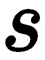
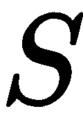

# 第五章：介绍 DRL

**深度强化学习**（**DRL**）目前正席卷全球，被视为机器学习技术中的“热点”，即达到某种形式的通用人工智能的目标。也许正是因为 DRL 接近了通用人工智能的边界，或者是我们所理解的通用智能。它也可能是你正在阅读本书的主要原因之一。幸运的是，本章以及本书大部分内容，都将深入探讨**强化学习**（**RL**）及其许多变体。在本章中，我们将开始学习 RL 的基础知识，以及它如何与**深度学习**（**DL**）相结合。我们还将探索**OpenAI Gym**环境，这是一个很棒的 RL 实验场，并学习如何利用一些简单的 DRL 技术进行实践。

请记住，这本书是一本实践性很强的书，因此我们将尽量减少技术理论的讨论，而是通过大量的工作实例进行探索。一些读者可能会觉得没有理论背景会感到迷茫，并且希望自己去深入探索 RL 的理论部分。

对于那些不熟悉 RL 理论背景的读者，我们将介绍几个核心概念，但这是简略版，因此建议您在准备好之后从其他来源学习更多的理论知识。

在本章中，我们将开始学习 DRL，这一主题将贯穿多个章节。我们将从基础开始，然后探索一些适应于 DL 的工作示例。以下是本章内容：

+   强化学习

+   Q 学习模型

+   运行 OpenAI gym

+   第一个深度 Q 网络（DQN）与 DRL

+   RL 实验

对于喜欢跳跃阅读的读者：是的，从本章开始阅读本书是完全可以的。不过，您可能需要回到前几章来完成一些练习。我们还假设您的 Python 环境已经配置好 TensorFlow 和 Keras，如果不确定，可以查看项目文件夹中的`requirements.txt`文件。

本书中的所有项目都是在 Visual Studio 2017（Python）中构建的，这是本书示例推荐的编辑器。如果您使用 VS 2017 与 Python，您可以通过打开章节解决方案文件轻松管理示例。当然，也有许多其他优秀的 Python 编辑器和工具，您可以使用自己习惯的工具。

# 强化学习

相较于其他机器学习方法，RL 目前在进展方面领先于其他技术。注意，这里使用的是“*方法论*”而非“*技术*”这个词。RL 是一种方法论或算法，它应用了一个我们可以与神经网络一起使用的原理，而神经网络是可以应用于多种方法论的机器学习技术。之前，我们讨论了与 DL 结合的其他方法论，但我们更专注于实际的实现。然而，RL 引入了一种新的方法论，它要求我们在理解如何应用之前，先了解更多的内在和外在机制。

强化学习（RL）由加拿大人理查德·萨顿（Richard Sutton）普及，他是阿尔伯塔大学的教授。萨顿还参与了 Google DeepMind 的 RL 开发，并且经常被视为 RL 的奠基人。

任何机器学习系统的核心都需要训练。通常，AI 代理/大脑一开始什么也不知道，我们通过某种自动化过程向其输入数据让它学习。正如我们所见，最常见的做法是**监督训练**。这是指我们首先给训练数据打上标签。我们还研究了**无监督训练**，在这种情况下，**生成对抗网络**（**GANs**）通过相互对抗进行训练。然而，这两种方法都没有复制我们在**生物学**中看到的那种学习或训练方式，这种方式通常被称为**奖励**或强化学习（RL）：一种让你教会狗狗为零食叫唤、捡报纸并在户外排泄的学习方式，一种让代理探索自己的环境并自我学习的方式。这与我们期望通用 AI 所使用的学习方式并无太大不同；毕竟，RL 可能与我们所使用的系统类似，或者说我们是这么认为的。

大卫·西尔弗（David Silver），前萨顿教授的学生，现在是 DeepMind 的负责人，拥有一系列关于强化学习（RL）理论背景的优秀视频。前五个视频非常有趣，推荐观看，但后续内容较为深奥，可能并不适合所有人。以下是视频链接：[`www.youtube.com/watch?v=2pWv7GOvuf0`](https://www.youtube.com/watch?v=2pWv7GOvuf0)

强化学习定义了一种名为自身的训练方式。这种基于奖励的训练在下图中显示：


强化学习

图中展示了一个代理在一个环境中。该代理读取环境的状态，然后决定并执行一个动作。这个动作可能会或不会带来奖励，而奖励可能是好是坏。在每次动作和可能的奖励后，代理会再次收集环境的状态。这个过程会重复，直到代理达到一个**终结状态**。也就是说，直到它达到目标；也许它死掉，或者只是累了。需要注意的是，前图中有一些细微的地方。首先，代理并不总是会获得奖励，这意味着奖励可能会延迟，直到某个未来的目标达到。这与我们之前探索的其他学习方式不同，后者会立即给训练网络反馈。奖励可以是好是坏，而负面训练代理同样有效，但对人类来说则不太适用。

现在，正如你所料，任何强大的学习模型，其数学可能会相当复杂，且对新手来说确实具有一定的挑战性。我们不会深入探讨理论细节，只会在下一节中描述一些强化学习的基础。

# 多臂老虎机

我们之前看到的图示描述了完整的强化学习（RL）问题，这也是我们在本书后续大部分内容中使用的模型。然而，我们经常讲授一个简化的单步变体问题，称为**多臂老虎机**。多臂老虎机这个名称源于拉斯维加斯的老虎机，而并非指某些其他不正当的含义。我们使用这些简化的场景来解释强化学习的基础知识，呈现为单步或单状态问题。

在多臂老虎机的情况下，可以想象一个虚构的多臂拉斯维加斯老虎机，根据拉动的臂不同奖励不同的奖品，但每个臂的奖品始终相同。智能体在这种情况下的目标是找出每次应拉动哪个臂。我们可以进一步将其建模为如下所示的方程：


考虑以下方程：

+    = 值的向量（1,2,3,4）

+    = 行动

+    = α = 学习率

+    = 奖励

该方程计算智能体所采取每个行动的值（*V*），这是一个向量。然后，它将这些值反馈到自身，从奖励中减去并乘以学习率。计算得出的值可以用来决定拉动哪个臂，但首先智能体需要至少拉动每个臂一次。让我们快速在代码中建模这一过程，作为游戏/仿真程序员，我们可以看到它是如何工作的。打开 `Chapter_5_1.py` 代码并按照以下步骤操作：

1.  本练习的代码如下：

```py
alpha = .9
arms = [['bronze' , 1],['gold', 3], ['silver' , 2], ['bronze' , 1]]
v = [0,0,0,0]

for i in range(10):
    for a in range(len(arms)):
        print('pulling arm '+ arms[a][0])
        v[a] = v[a] + alpha * (arms[a][1]-v[a])

print(v)
```

1.  这段代码创建了所需的设置变量，`arms`（`gold`、`silver` 和 `bronze`）以及值向量 `v`（全为零）。然后，代码会进行多次迭代（`10`次），每次都拉动一个臂并根据方程计算并更新值 `v`。请注意，奖励值被臂拉动的值所替代，即项 `arms[a][1]`。

1.  运行示例，你将看到生成的输出，显示每个行动的值，或者在这种情况下是一个臂的拉动。

正如我们所见，通过一个简单的方程式，我们能够建模多臂老虎机问题，并得出一个解决方案，使得智能体能够持续地选择正确的臂。这为强化学习奠定了基础，在接下来的章节中，我们将迈出下一步，探讨**上下文老虎机**。

# 上下文老虎机

现在，我们可以将单个多臂老虎机问题提升为包含多个多臂老虎机的问题，每个老虎机都有自己的一组臂。现在，我们的问题引入了上下文或状态到方程中。随着每个老虎机定义自己的上下文/状态，我们现在在质量和行动的角度来评估我们的方程。我们修改后的方程如下所示：


考虑以下方程：

+    = 值的表格/矩阵

[1,2,3,4

2,3,4,5

4,2,1,4]

+    = 状态

+    = 动作

+    = alpha = 学习率

+    = 回报

让我们打开`Chapter_5_2.py`并观察以下步骤：

1.  打开代码，如下所示，并按照与之前示例所做的更改进行操作：

```py
import random

alpha = .9
bandits = [[['bronze' , 1],['gold', 3], ['silver' , 2], ['bronze' , 1]],
           [['bronze' , 1],['gold', 3], ['silver' , 2], ['bronze' , 1]],
           [['bronze' , 1],['gold', 3], ['silver' , 2], ['bronze' , 1]],
           [['bronze' , 1],['gold', 3], ['silver' , 2], ['bronze' , 1]]]
q = [[0,0,0,0],
     [0,0,0,0],
     [0,0,0,0],
     [0,0,0,0]]

for i in range(10): 
    for b in range(len(bandits)):
        arm = random.randint(0,3)
        print('pulling arm {0} on bandit {1}'.format(arm,b))
        q[b][arm] = q[b][arm] + alpha * (bandits[b][arm][1]-q[b][arm])

print(q)
```

1.  这段代码设置了多个多臂老虎机，每个都有一组臂。然后，它会进行多次迭代，但这次在每次循环时，它还会循环遍历每个老虎机。在每次循环中，它会随机选择一个臂来拉动，并评估其质量。

1.  运行示例并查看`q`的输出。注意，即使在选择随机臂后，方程依然持续选择金臂，即回报最高的臂来拉动。

随意多玩这个示例，并查看练习以获取更多灵感。当我们讨论 Q-Learning 时，我们将扩展我们的 RL 问题的复杂度。然而，在进入那个部分之前，我们将稍作偏离，看看如何设置 OpenAI Gym，以便进行更多的 RL 实验。

# 使用 OpenAI Gym 进行强化学习（RL）

强化学习（RL）已经变得非常流行，现在有一场竞赛，专门开发帮助构建 RL 算法的工具。目前，这个领域的两个主要竞争者是**OpenAI Gym**和**Unity**。Unity 迅速成为了我们稍后将深入探索的 RL 竞速机器。现在，我们将启用辅助功能，使用 OpenAI Gym 来进一步探索 RL 的基本原理。

我们需要安装 OpenAI Gym 工具包才能继续，安装方法可能因操作系统的不同而有所差异。因此，我们将在这里专注于 Windows 的安装说明，其他操作系统用户可能会遇到较少的困难。按照以下步骤在 Windows 上安装 OpenAI Gym：

1.  安装一个 C++编译器；如果你已经安装了 Visual Studio 2017，可能已经有一个推荐的编译器了。你可以在这里找到其他支持的编译器：[`wiki.python.org/moin/WindowsCompilers`](https://wiki.python.org/moin/WindowsCompilers)。

1.  确保已安装 Anaconda，并打开 Anaconda 命令提示符，然后运行以下命令：

```py
conda create -n gym
conda activate gym
conda install python=3.5  # reverts Python, for use with TensorFlow later
pip install tensorflow
pip install keras pip install gym
```

1.  就我们目前的目的而言，短期内不需要安装任何其他 Gym 模块。Gym 有很多示例环境，其中 Atari 游戏和 MuJoCo（机器人仿真器）是最有趣的几种。我们将在本章稍后查看 Atari 游戏模块。

这应该会为你的系统安装 Gym 环境。我们需要的大多数功能将通过最小设置即可工作。如果你决定深入使用 Gym，那么你可能需要安装其他模块；有很多模块。在下一节中，我们将测试这个新环境，边学习 Q-Learning。

# 一个 Q-Learning 模型

RL 深深地与几种数学和动态编程概念交织在一起，这些概念可以填满一本教科书，实际上也确实有几本类似的书。然而，对于我们的目的来说，我们只需要理解关键概念，以便构建我们的 DRL 智能体。因此，我们将选择不去过多纠结于数学细节，但仍有一些关键概念是你需要理解的，才能取得成功。如果你在第一章《深度学习与游戏》中覆盖了数学内容，那么这一部分将会非常轻松。对于那些没有覆盖的朋友，慢慢来，但这个部分你不能错过。

为了理解 Q-Learning 模型，这是 RL 的一种形式，我们需要回到基础知识。在接下来的部分，我们将讨论 **马尔可夫决策过程** 和 **贝尔曼** 方程的重要性。

# 马尔可夫决策过程和贝尔曼方程

在 RL 的核心是 **马尔可夫决策过程** (**MDP**) 。一个 MDP 通常被描述为离散时间随机控制过程。简单来说，这意味着它是一个通过时间步来运作的控制程序，用于确定每个动作的概率，并且每个动作都会导致一个奖励。这个过程已经被广泛用于大多数机器人控制、无人机、网络控制，当然也包括 RL。我们通常通过下面的图示来描述这个过程：


马尔可夫决策过程

我们通过一个元组或向量来表示一个 MDP ，使用以下变量：

+    - 是一个有限的状态集合，

+    - 是一个有限的动作集合，

+    - 动作  在状态  时刻  导致状态  在时刻  的概率，

+    - 是即时奖励

+    - gamma 是一个折扣因子，用来折扣未来奖励的重要性或为未来奖励提供重要性

该图通过将你自己想象成一个处于某个状态的智能体来工作。然后你根据概率确定动作，总是采取一个随机动作。当你移动到下一个状态时，该动作会给你一个奖励，你根据这个奖励更新概率。同样，David Silver 在他的讲座中非常好地涵盖了这一部分内容。

现在，前面的过程是有效的，但随后出现了另一种变体，通过引入 **Bellman 方程** 和策略/价值迭代的概念，提供了更好的未来奖励评估。之前我们有一个值，，现在我们有一个策略（）来表示一个值（），这为我们提供了一个新的方程，如下所示：


我们不会进一步讲解这个方程，只是提醒大家牢记质量迭代的概念。在接下来的部分中，我们将看到如何将这个方程简化为每个动作的质量指标，并将其用于 Q-Learning。

# Q-learning

随着质量迭代方法的引入，一个称为 **Q-learning** 或 **质量学习** 的有限状态方法被提出。Q 使用质量迭代技术来解决给定的有限状态问题，确定智能体的最佳行动。我们在前面看到的方程现在可以表示为以下形式：


考虑以下方程：

+    当前状态

+    当前动作

+    下一个动作

+    当前奖励

+    学习率（alpha）

+    奖励折扣因子（gamma）

Q 值现在在智能体穿越其环境时被迭代更新。没有什么比一个例子更能展示这些概念了。打开 `Chapter_5_3.py`，并按照以下步骤操作：

1.  我们从各种导入开始，并按照以下代码设置：

```py
from collections import deque
import numpy as np
import os
clear = lambda: os.system('cls') #linux/mac use 'clear'
import time
import gym
from gym import wrappers, logger
```

1.  这些导入仅加载了我们这个示例所需的基本库。记住，运行这个示例前，你需要安装 `Gym`。

1.  接下来，我们设置一个新环境；在这个例子中，我们使用基础的 `FrozenLake-v0` 示例，这是一个测试 Q-learning 的完美示例：

```py
environment = 'FrozenLake-v0'
env = gym.make(environment)
```

1.  然后我们设置 AI 环境（`env`）以及其他一些参数：

```py
outdir = os.path.join('monitor','q-learning-{0}'.format(environment))
env = wrappers.Monitor(env, directory=outdir, force=True)
env.seed(0)
env.is_slippery = False
q_table = np.zeros([env.observation_space.n, env.action_space.n])

#parameters
wins = 0
episodes = 40000
delay = 1

epsilon = .8
epsilon_min = .1
epsilon_decay = .001
gamma = .9
learning_rate = .1
```

1.  在这部分代码中，我们设置了若干变量，稍后会详细说明。在这个示例中，我们使用了一个包装工具来监控环境，这对于确定潜在的训练问题非常有用。另一个需要注意的是 `q_table` 数组的设置，这个数组由环境的 `observation_space`（状态）和 `action_space`（动作）定义；空间定义的是数组而不仅仅是向量。在这个例子中，`action_space` 是一个向量，但它也可以是一个多维数组或张量。

1.  跳过下一个函数部分，直接跳到最后一部分，在那里训练迭代发生并显示在以下代码中：

```py
for episode in range(episodes): 
    state = env.reset()
    done = False
    while not done:
        action = act(env.action_space,state)
        next_state, reward, done, _ = env.step(action)
        clear()
        env.render()
        learn(state, action, reward, next_state)
        if done:
            if reward > 0:
                wins += 1
            time.sleep(3*delay)
        else:
            time.sleep(delay)

print("Goals/Holes: %d/%d" % (wins, episodes - wins))
env.close() 
```

1.  前面的代码大部分都比较直接，应该容易理解。看看 `env`（环境）是如何使用从 `act` 函数生成的 `action`；这会用于执行智能体的步骤或动作。`step` 函数的输出是 `next_state`，`reward` 和 `done`，我们用这些来通过 `learn` 函数来确定最佳的 Q 策略。

1.  在我们深入研究动作和学习函数之前，先运行样本，观察智能体如何进行训练。训练可能需要一些时间，所以可以随时返回书本继续阅读。

以下是 OpenAI Gym FrozenLake 环境运行我们 Q-learning 模型的示例：


FrozenLake Gym 环境

在样本运行时，你将看到一个简单的文本输出，显示环境的状态。`S` 代表起点，`G` 代表目标，`F` 代表冻结区域，`H` 代表陷阱。智能体的目标是找到一条通过环境的路径，避免掉入陷阱，并到达目标。特别注意智能体是如何移动的，如何在环境中找到自己的路径。在下一节中，我们将深入分析 `learn` 和 `act` 函数，并理解探索的重要性。

# Q-learning 和探索

我们在使用如 Q-learning 等策略迭代模型时，面临的一个问题是探索与利用的权衡。Q 模型方程假设通过最大化质量来决定一个行动，我们称之为利用（exploiting the model）。这个问题在于，它常常会将智能体局限于只追求最佳短期收益的解法。相反，我们需要允许智能体有一定的灵活性去探索环境并自主学习。我们通过引入一个逐渐消失的探索因子到训练中来实现这一点。让我们通过再次打开 `Chapter_5_3.py` 示例来看看这一过程是怎样的：

1.  向下滚动，查看 `act` 和 `is_explore` 函数，如下所示：

```py
def is_explore():
    global epsilon, epsilon_decay, epsilon_min
    epsilon = max(epsilon-epsilon_decay,epsilon_min)
    if np.random.rand() < epsilon:
        return True
    else:
        return False

def act(action_space, state):
    # 0 - left, 1 - Down, 2 - Right, 3 - Up
    global q_table
    if is_explore():
        return action_space.sample()
    else:
        return np.argmax(q_table[state])
```

1.  请注意，在 `act` 函数中，首先测试智能体是否希望或需要进行探索，使用的是 `is_explore()`。在 `is_explore` 函数中，我们可以看到，全局的 `epsilon` 值在每次迭代时都会通过 `epsilon_decay` 逐渐衰减，直到达到全局最小值 `epsilon_min`。当智能体开始一个回合时，他们的探索 `epsilon` 值较高，这使得他们更可能进行探索。随着时间的推移，回合的进行，`epsilon` 值会逐渐降低。我们这样做是基于假设，随着时间的推移，智能体将需要进行越来越少的探索。探索与利用之间的权衡非常重要，特别是在环境状态空间较大时，理解这一点至关重要。本书的后续内容将深入探讨这一权衡。

    请注意，智能体使用探索函数并随机选择一个动作。

1.  最后，我们来到了 `learn` 函数。这个函数是用来计算 `Q` 值的，具体如下：

```py
def learn(state, action, reward, next_state):
    # Q(s, a) += alpha * (reward + gamma * max_a' Q(s', a') - Q(s, a))
    global q_table
    q_value = gamma * np.amax(q_table[next_state])
    q_value += reward
    q_value -= q_table[state, action]
    q_value *= learning_rate
    q_value += q_table[state, action]
    q_table[state, action] = q_value
```

1.  在这里，方程被拆解并简化，但这是计算代理在利用时将使用的值的步骤。

保持代理继续运行，直到完成。我们刚刚完成了第一个完整的强化学习问题，尽管这是一个有限状态的问题。在下一节中，我们将大大扩展我们的视野，探索深度学习与强化学习的结合。

# 第一个深度强化学习与深度 Q-learning

现在我们已经详细了解了强化学习过程，我们可以着手将我们的 Q-learning 模型与深度学习结合。这正如你可能猜到的，是我们努力的巅峰所在，也是强化学习真正威力显现的地方。正如我们在前面的章节中所学，深度学习本质上是一个复杂的方程系统，可以通过非线性函数映射输入，从而生成训练输出。

神经网络只是一种更简单的求解非线性方程的方法。我们稍后会学习如何使用 DNN 来解决其他方程，但现在我们专注于使用它来解决我们在上一节看到的 Q-learning 方程。

我们将使用 OpenAI Gym 工具包中的**CartPole**训练环境。这个环境几乎是学习**深度 Q-learning**（**DQN**）的标准。

打开`Chapter_5_4.py`文件，按照以下步骤查看如何将我们的求解器转换为使用深度学习：

1.  像往常一样，我们查看导入的模块和一些初始的起始参数，如下所示：

```py
import random
import gym
import numpy as np
from collections import deque
from keras.models import Sequential
from keras.layers import Dense
from keras.optimizers import Adam

EPISODES = 1000
```

1.  接下来，我们将创建一个类来包含 DQN 代理的功能。`__init__`函数如下所示：

```py
class DQNAgent:
    def __init__(self, state_size, action_size):
        self.state_size = state_size
        self.action_size = action_size
        self.memory = deque(maxlen=2000)
        self.gamma = 0.95 # discount rate
        self.epsilon = 1.0 # exploration rate
        self.epsilon_min = 0.01
        self.epsilon_decay = 0.995
        self.learning_rate = 0.001
        self.model = self._build_model()
```

1.  大部分参数已经涵盖，但需要注意一个新参数叫做`memory`，它是一个**deque**集合，保存了最近的 2,000 步。这使得我们能够在一种回放模式下批量训练神经网络。

1.  接下来，我们查看神经网络模型是如何通过`_build_model`函数构建的，如下所示：

```py
def _build_model(self):
    # Neural Net for Deep-Q learning Model
    model = Sequential()
    model.add(Dense(24, input_dim=self.state_size, activation='relu'))
    model.add(Dense(24, activation='relu'))
    model.add(Dense(self.action_size, activation='linear'))
    model.compile(loss='mse',
                      optimizer=Adam(lr=self.learning_rate))
    return model
```

1.  这个模型比我们已经看到的其他模型要简单一些，包含三个**dense**层，为每个动作输出一个值。这个网络的输入是状态。

1.  跳到文件的底部，查看训练迭代循环，如下所示：

```py
if __name__ == "__main__":
    env = gym.make('CartPole-v1')
    state_size = env.observation_space.shape[0]
    action_size = env.action_space.n
    agent = DQNAgent(state_size, action_size)
    # agent.load("./save/cartpole-dqn.h5")
    done = False
    batch_size = 32

    for e in range(EPISODES):
        state = env.reset()
        state = np.reshape(state, [1, state_size]) 
        for time in range(500):
            # env.render()
            action = agent.act(state)
            env.render()
            next_state, reward, done, _ = env.step(action)
            reward = reward if not done else -10
            next_state = np.reshape(next_state, [1, state_size])
 agent.remember(state, action, reward, next_state, done)
            state = next_state
            if done:
                print("episode: {}/{}, score: {}, e: {:.2}"
                      .format(e, EPISODES, time, agent.epsilon))
                break
            if len(agent.memory) > batch_size:
                agent.replay(batch_size)
```

1.  在这个示例中，我们的训练发生在一个实时`render`循环中。代码中的重要部分被高亮显示，展示了状态的重塑和调用`agent.remember`函数。最后的`agent.replay`函数是网络进行训练的地方。`remember`函数如下所示：

```py
def remember(self, state, action, reward, next_state, done):
    self.memory.append((state, action, reward, next_state, done))
```

1.  这个函数只是存储`state`、`action`、`reward`、`next_state`和`done`参数，以供回放训练。向下滚动查看`replay`函数，具体如下：

```py
def replay(self, batch_size):
    minibatch = random.sample(self.memory, batch_size)
    for state, action, reward, next_state, done in minibatch:
        target = reward
        if not done:
            target = (reward+self.gamma*
                      np.amax(self.model.predict(next_state)[0]))
            target_f = self.model.predict(state)
            target_f[0][action] = target
            self.model.fit(state, target_f, epochs=1, verbose=0)
        if self.epsilon > self.epsilon_min:
            self.epsilon *= self.epsilon_decay
```

1.  `replay`函数是网络训练发生的地方。我们首先定义一个`minibatch`，它是通过从先前的经验中进行随机抽样并按`batch_size`分组定义的。然后，我们循环遍历批次，将`reward`设置为`target`，如果没有`done`，则根据模型对`next_state`的预测计算一个新的目标。之后，我们在`state`上使用`model.predict`函数来确定最终的目标。最后，我们使用`model.fit`函数将训练后的目标反向传播回网络。

    由于这一部分很重要，我们再强调一下。注意`target`变量计算并设置的那一行。这些代码行可能看起来很熟悉，因为它们与我们之前看到的 Q 值方程一致。这个`target`值是当前动作应该预测的值。这就是当前动作的回报值，并由返回的`reward`设置。

1.  运行示例并观察智能体训练如何使杆子在小车上保持平衡。以下是训练过程中环境的显示：


CartPole OpenAI Gym 环境

示例环境使用的是我们通常用于学习构建第一个 DRL 模型的典型第一个环境——CartPole。下一节中，我们将查看如何在其他场景和通过 Keras-RL API 提供的其他模型中使用 DQNAgent。

# 强化学习实验

强化学习正在迅速发展，我们刚刚看到的 DQN 模型很快就被更先进的算法所取代。RL 算法有许多变种和进展，足以填满几章内容，但大多数材料会被认为是学术性的。因此，我们将重点介绍 Keras RL API 提供的各种 RL 模型的更实际示例。

我们可以使用的第一个简单示例是将之前的示例修改为适应新的`gym`环境。打开`Chapter_5_5.py`并按照以下练习进行操作：

1.  在下面的代码中更改环境名称：

```py
if __name__ == "__main__":
    env = gym.make('MountainCar-v0')
```

1.  在本例中，我们将使用`MountainCar`环境，如下所示：


MountainCar 环境示例

1.  像平常一样运行代码，看看 DQNAgent 是如何解决爬山问题的。

你可以看到我们是如何快速切换环境并在另一个环境中测试 DQNAgent 的。在下一节中，我们将讨论如何使用 Keras-RL API 提供的不同 RL 算法来训练 Atari 游戏。

# Keras RL

Keras 提供了一个非常有用的 RL API，它封装了几种变体，如 DQN、DDQN、SARSA 等。我们现在不会详细讨论这些不同的 RL 变体，但随着我们进入更复杂的模型，稍后会介绍重要的部分。不过，目前，我们将看看如何快速构建一个 DRL 模型来玩 Atari 游戏。打开`Chapter_5_6.py`并按照这些步骤操作：

1.  我们首先需要通过 `pip` 安装几个依赖项；打开命令行或 Anaconda 窗口，并输入以下命令：

```py
pip install Pillow
pip install keras-rl

pip install gym[atari] # on Linux or Mac
pip install --no-index -f https://github.com/Kojoley/atari-py/releases atari_py  # on Windows thanks to Nikita Kniazev
```

1.  这将安装 Keras RL API、`Pillow`（一个图像框架）以及 `gym` 的 Atari 环境。

1.  按照平常的方式运行示例代码。这个示例确实需要脚本参数，但在这里我们不需要使用它们。以下是渲染的 Atari Breakout 环境示例：


Atari Breakout 环境

不幸的是，你无法看到智能体玩游戏的过程，因为所有的动作都在后台进行，但可以让智能体运行直到它完成并保存模型。以下是我们运行示例的方法：

1.  你可以使用 `--mode test` 作为参数重新运行示例，让智能体在 10 回合中运行并查看结果。

1.  在示例运行时，浏览代码并特别注意模型，如下所示：

```py
model = Sequential()
if K.image_dim_ordering() == 'tf':
    # (width, height, channels)
    model.add(Permute((2, 3, 1), input_shape=input_shape))
elif K.image_dim_ordering() == 'th':
    # (channels, width, height)
    model.add(Permute((1, 2, 3), input_shape=input_shape))
else:
    raise RuntimeError('Unknown image_dim_ordering.')
model.add(Convolution2D(32, (8, 8), strides=(4, 4)))
model.add(Activation('relu'))
model.add(Convolution2D(64, (4, 4), strides=(2, 2)))
model.add(Activation('relu'))
model.add(Convolution2D(64, (3, 3), strides=(1, 1)))
model.add(Activation('relu'))
model.add(Flatten())
model.add(Dense(512))
model.add(Activation('relu'))
model.add(Dense(nb_actions))
model.add(Activation('linear'))
print(model.summary())
```

1.  注意我们的模型如何使用 `Convolution`（卷积），并且带有池化。这是因为这个示例将每一帧游戏画面作为输入（状态）并做出响应。在这种情况下，模型的状态非常庞大，这展示了深度强化学习（DRL）的真正威力。在本例中，我们仍在训练一个状态模型，但在未来的章节中，我们将研究如何训练一个策略，而不是模型。

这只是强化学习（RL）的简单介绍，我们省略了一些可能让新手困惑的细节。由于我们计划在接下来的章节中更详细地讨论 RL，特别是在第八章中深入讲解 **近端策略优化**（**PPO**）和 *理解 PPO*，因此不必过于担心策略和基于模型的 RL 等差异。

这里有一个很好的 TensorFlow DQN 示例，位于 GitHub 链接：[`github.com/floodsung/DQN-Atari-Tensorflow`](https://github.com/floodsung/DQN-Atari-Tensorflow)。代码可能有点过时，但它是一个简单且优秀的示例，值得一看。

我们不会进一步查看代码，但读者可以自由地深入研究。现在让我们尝试一些练习。

# 练习

一如既往，使用本节中的练习来更好地理解你学到的内容。尽量做至少两到三个本节中的练习：

1.  返回 `Chapter_5_1.py` 示例，并更改 **alpha**（`learning_rate`）变量，看看这对计算结果的影响。

1.  返回 `Chapter_5_2.py` 示例并更改各个老虎机的位置。

1.  在示例 `Chapter_5_2.py` 中更改学习率，并查看这对 Q 值结果输出的影响。

1.  改变 `Chapter_5_3.py` 示例中的 gamma 奖励折扣因子，并查看这对智能体训练的影响。

1.  在 `Chapter_5_3.py` 中改变探索的 epsilon 值并重新运行示例，看看更改各种探索参数对训练智能体的影响。

1.  修改`Chapter_5_4.py`示例中的各种参数（**exploration**，**alpha**，和**gamma**），观察这些参数对训练的影响。

1.  修改`Chapter_5_4.py`示例中内存的大小，增加或减少，观察这对训练的影响。

1.  尝试在`Chapter_5_5.py`中的 DQNAgent 示例中使用不同的 Gym 环境。你可以通过快速 Google 搜索查看其他可选的环境。

1.  `Chapter_5_6.py`示例当前使用了一种叫做`LinearAnnealedPolicy`的形式探索策略；将策略更改为使用代码注释中提到的`BoltzmannQPolicy`策略。

1.  一定要从[`github.com/keras-rl/keras-rl`](https://github.com/keras-rl/keras-rl)下载并运行其他 Keras-RL 示例。同样，你可能需要安装其他 Gym 环境才能使它们正常工作。

还有大量关于 RL 的其他示例、视频和学习资料可供研究。尽可能多地学习，因为这些材料广泛且复杂，不是短时间内能够掌握的。

# 总结

RL（强化学习）是目前主导许多研究者兴趣的机器学习技术。它之所以吸引我们，通常是因为它非常适合游戏和仿真。在本章中，我们通过从多臂老虎机和上下文赌博机的基本入门问题开始，介绍了 RL 的一些基础知识。然后，我们快速了解了如何安装 OpenAI Gym RL 工具包。接着，我们研究了 Q 学习以及如何在代码中实现它并在 OpenAI Gym 环境中训练。最后，我们看到了如何通过加载其他环境（包括 Atari 游戏模拟器）来进行各种其他实验。

在下一章中，我们将探讨 Unity 目前正在开发的一个快速发展的前沿 RL 平台。
