# 第六章：Unity ML-Agents

Unity 已经坚定并充满活力地拥抱了机器学习，尤其是深度强化学习（**DRL**），目标是为游戏和仿真开发者提供一个有效的**深度强化学习**（**DRL**）SDK。幸运的是，Unity 团队在 Danny Lange 的带领下，成功开发了一个强大的前沿 DRL 引擎，能够实现令人印象深刻的效果。这个引擎在多个方面超越了我们之前介绍的 DQN 模型，是顶级的。Unity 使用**近端策略优化**（**PPO**）模型作为其 DRL 引擎的基础。这个模型显著更为复杂，且可能在某些方面有所不同，但幸运的是，这只是许多章节的开始，我们会有足够的时间介绍这些概念——毕竟这是一本实践性强的书籍。

在本章中，我们介绍了**Unity ML-Agents**工具和 SDK，用于构建 DRL 代理来玩游戏和仿真。虽然这个工具既强大又前沿，但它也很容易使用，并且提供了一些帮助我们边学边用的工具。在本章中，我们将涵盖以下主题：

+   安装 ML-Agents

+   训练一个代理

+   大脑里有什么？

+   使用 TensorBoard 监控训练过程

+   运行一个代理

我们想感谢 Unity 团队成员们在 ML-Agents 方面的卓越工作；以下是写作时的团队成员名单：

+   Danny Lange ([`arxiv.org/search/cs?searchtype=author&query=Lange%2C+D`](https://arxiv.org/search/cs?searchtype=author&query=Lange%2C+D))

+   Arthur Juliani ([`arxiv.org/search/cs?searchtype=author&query=Juliani%2C+A`](https://arxiv.org/search/cs?searchtype=author&query=Juliani%2C+A))

+   Vincent-Pierre Berges ([`arxiv.org/search/cs?searchtype=author&query=Berges%2C+V`](https://arxiv.org/search/cs?searchtype=author&query=Berges%2C+V))

+   Esh Vckay ([`arxiv.org/search/cs?searchtype=author&query=Vckay%2C+E`](https://arxiv.org/search/cs?searchtype=author&query=Vckay%2C+E))

+   Yuan Gao ([`arxiv.org/search/cs?searchtype=author&query=Gao%2C+Y`](https://arxiv.org/search/cs?searchtype=author&query=Gao%2C+Y))

+   Hunter Henry ([`arxiv.org/search/cs?searchtype=author&query=Henry%2C+H`](https://arxiv.org/search/cs?searchtype=author&query=Henry%2C+H))

+   Marwan Mattar ([`arxiv.org/search/cs?searchtype=author&query=Mattar%2C+M`](https://arxiv.org/search/cs?searchtype=author&query=Mattar%2C+M))

+   Adam Crespi ([`arxiv.org/search/cs?searchtype=author&query=Crespi%2C+A`](https://arxiv.org/search/cs?searchtype=author&query=Crespi%2C+A))

+   Jonathan Harper ([`arxiv.org/search/cs?searchtype=author&query=Harper%2C+J`](https://arxiv.org/search/cs?searchtype=author&query=Harper%2C+J))

在继续本章之前，请确保已按照第四章中的说明安装 Unity，*构建深度学习游戏聊天机器人*。

# 安装 ML-Agents

本节中，我们将概述成功安装 ML-Agents SDK 所需的高层步骤。这些材料仍然处于 beta 版本，并且在各版本之间已经发生了显著变化。因此，如果在执行这些高层步骤时遇到困难，只需返回到最新的 Unity 文档；它们写得非常清晰。

到你的计算机上操作并跟随这些步骤；可能会有很多子步骤，所以预计这会花费一些时间：

1.  确保你的计算机已安装 **Git**；它可以通过命令行使用。Git 是一个非常流行的源代码管理系统，关于如何安装和使用 Git 的资源非常丰富，适用于你的平台。安装 Git 后，确保它正常工作，可以通过克隆一个仓库来测试，任意一个仓库都可以。

1.  打开命令窗口或常规 shell。Windows 用户可以打开 Anaconda 窗口。

1.  切换到一个工作文件夹，放置新代码的文件夹，并输入以下命令（Windows 用户可以选择使用 `C:\ML-Agents`）：

```py
git clone https://github.com/Unity-Technologies/ml-agents
```

1.  这将把 `ml-agents` 仓库克隆到你的计算机上，并创建一个同名的文件夹。你可能还想额外为文件夹名称添加版本号。Unity，以及整个 AI 领域，至少在当前阶段，是在不断变化的。这意味着新的变化和持续的更新始终在发生。写作时，我们将仓库克隆到名为 `ml-agents.6` 的文件夹中，如下所示：

```py
git clone https://github.com/Unity-Technologies/ml-agents ml-agents.6
```

本书的作者曾经写过一本关于 ML-Agents 的书，并且在短时间内重新编写了几章，以适应重要的变更。实际上，本章也经历了几次重写，以应对更多的重大变化。

1.  为 `ml-agents` 创建一个新的虚拟环境并将其设置为 `3.6`，像这样：

```py
#Windows 
conda create -n ml-agents python=3.6

#Mac
Use the documentation for your preferred environment
```

1.  激活该环境，同样通过 Anaconda：

```py
activate ml-agents
```

1.  安装 TensorFlow。使用 Anaconda，我们可以通过以下命令进行安装：

```py
pip install tensorflow==1.7.1
```

1.  安装 Python 包。在 Anaconda 中，输入以下命令：

```py
cd ML-Agents #from root folder
cd ml-agents or cd ml-agents.6 #for example
cd ml-agents
pip install -e . or pip3 install -e .
```

1.  这将安装 Agents SDK 所需的所有软件包，可能需要几分钟时间。请确保保持此窗口打开，因为我们稍后会使用它。

这是 TensorFlow 的基本安装，不使用 GPU。请查阅 Unity 文档，了解如何安装 GPU 版本。这可能会对你的训练性能产生显著影响，具体取决于你的 GPU 性能。

这应该完成 Unity Python SDK for ML-Agents 的设置。在下一部分中，我们将学习如何设置并训练 Unity 提供的多个示例环境之一。

# 训练一个智能体

本书的大部分时间，我们都在研究代码以及 **深度学习** (**DL**) 和 **强化学习** (**RL**) 的内部知识。基于这些知识，我们现在可以进入并查看 **深度强化学习** (**DRL**) 的实际应用。幸运的是，新的代理工具包提供了多个示例，展示了引擎的强大功能。打开 Unity 或 Unity Hub 并按照以下步骤操作：

1.  点击项目对话框顶部的“打开项目”按钮。

1.  定位并打开`UnitySDK`项目文件夹，如下图所示：

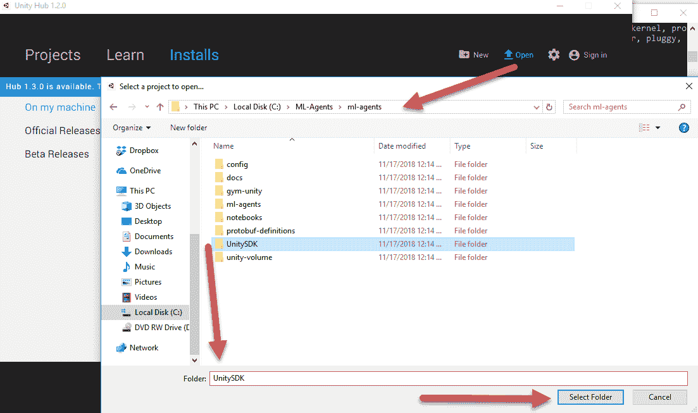

打开 UnitySDK 项目

1.  等待项目加载完成后，打开编辑器底部的项目窗口。如果系统提示更新项目，请确保选择“是”或“继续”。到目前为止，所有代理代码都已设计为向后兼容。

1.  定位并打开如截图所示的 GridWorld 场景：

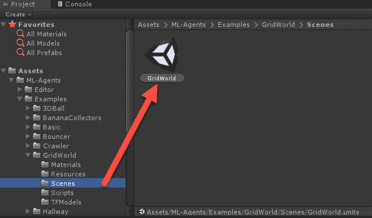

打开 GridWorld 示例场景

1.  在层级窗口中选择 GridAcademy 对象。

1.  然后将注意力集中在 Inspector 窗口，点击 Brains 旁边的目标图标以打开大脑选择对话框：

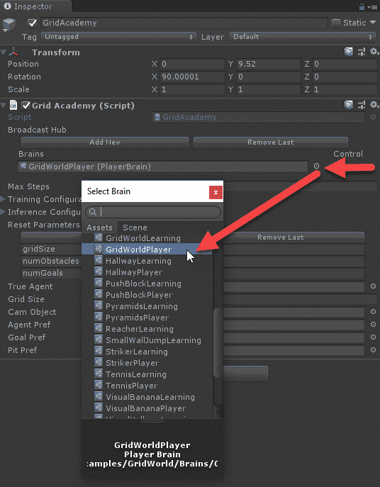

检查 GridWorld 示例环境

1.  选择 GridWorldPlayer 大脑。这个大脑是 *玩家* 大脑，意味着玩家（即你）可以控制游戏。我们将在下一部分详细探讨这个大脑概念。

1.  按下编辑器顶部的播放按钮，观察网格环境的形成。由于游戏当前设置为玩家控制，你可以使用 **WASD** 控制键来移动方块。目标与我们之前为 FrozenPond 环境构建的 DQN 类似。也就是说，你需要将蓝色方块移动到绿色的 + 符号处，并避免碰到红色的 X。

随时可以玩游戏，注意游戏运行的时间是有限的，并且不是回合制的。在下一部分中，我们将学习如何使用 DRL 代理运行这个示例。

# 大脑中有什么？

ML-Agents 平台的一个亮点是能够非常快速且无缝地从玩家控制切换到 AI/代理控制。为了实现这一点，Unity 引入了 **大脑** 的概念。大脑可以是玩家控制的，也可以是代理控制的，后者被称为学习大脑。亮点在于，你可以构建一个游戏并进行测试，之后玩家可以将游戏交给 RL 代理来控制。这一流程的额外好处是，让任何用 Unity 编写的游戏都能通过极少的努力由 AI 控制。事实上，这种强大的工作流让我们决定专门花一整章时间来讨论，第十二章，*使用 DRL 调试/测试游戏*，来学习如何使用 RL 测试和调试你的游戏。

使用 Unity 训练 RL 代理非常简单，设置和运行都很直接。Unity 在外部使用 Python 来构建学习脑模型。使用 Python 是更有意义的，因为正如我们之前所见，多个深度学习库都是基于 Python 构建的。按照以下步骤训练 GridWorld 环境中的代理：

1.  重新选择 GridAcademy，并将 Brains 从 GridWorldPlayer 切换为 GridWorldLearning，如下所示：

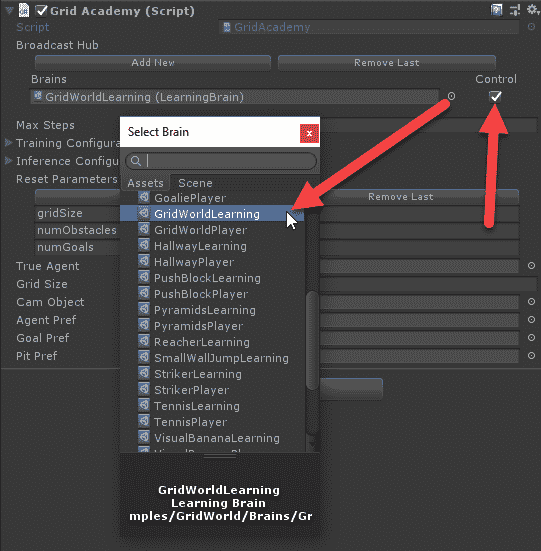

切换脑部使用 GridWorldLearning

1.  确保点击最后的 Control 选项。这个简单的设置告诉脑部它可以被外部控制。一定要再次确认该选项已启用。

1.  在层级窗口中选择`trueAgent`对象，然后在检查器窗口中，将 Grid Agent 组件下的 Brain 属性更改为 GridWorldLearning 脑：

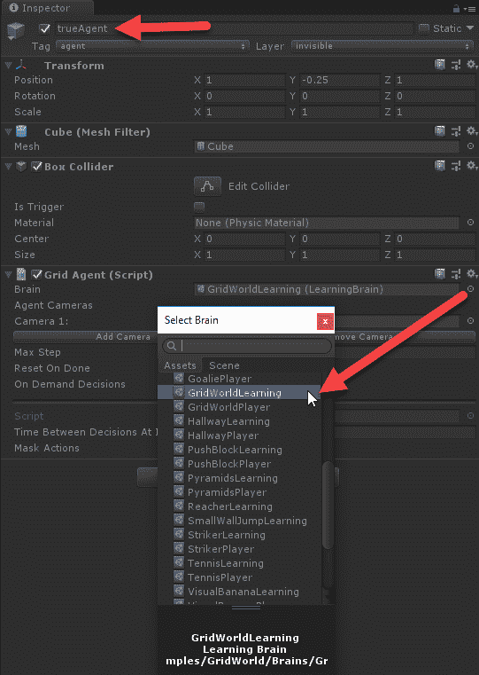

将代理的脑设置为 GridWorldLearning

1.  对于此示例，我们希望将 Academy 和 Agent 切换为使用相同的 brain，即 GridWorldLearning。在我们稍后探索的更高级用法中，情况不总是如此。当然，你也可以让一个玩家和一个代理脑同时运行，或者其他多种配置。

1.  确保你已打开 Anaconda 或 Python 窗口，并设置为`ML-Agents/ml-agents`文件夹或你的版本化`ml-agents`文件夹。

1.  在 Anaconda 或 Python 窗口中，使用`ml-agents`虚拟环境运行以下命令：

```py
mlagents-learn config/trainer_config.yaml --run-id=firstRun --train
```

1.  这将启动 Unity PPO 训练器，并根据配置运行代理示例。在某些时候，命令窗口将提示你运行已加载环境的 Unity 编辑器。

1.  在 Unity 编辑器中按下播放按钮，运行 GridWorld 环境。不久之后，你应该能看到代理正在训练，且结果会输出到 Python 脚本窗口中：

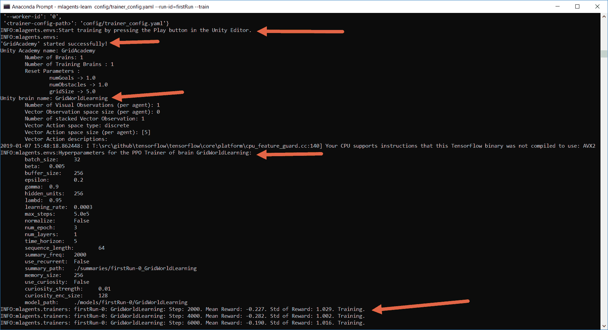

在训练模式下运行 GridWorld 环境

1.  注意`mlagents-learn`脚本是构建 RL 模型以运行代理的 Python 代码。从脚本的输出可以看出，有多个参数，或者我们称之为**超参数**，需要进行配置。部分参数可能会让你感到熟悉，没错，但也有一些可能不太明了。幸运的是，在本章和本书的后续内容中，我们将详细探讨如何调整这些参数。

1.  让代理训练几千次，并注意它学习的速度。这里的内部模型，称为**PPO**，已被证明在多种任务中非常有效，且非常适合游戏开发。根据你的硬件，代理可能在不到一小时的时间内就能完美完成此任务。

继续让代理训练，我们将在下一节中探讨更多检查代理训练进度的方法。

# 使用 TensorBoard 监控训练过程

使用强化学习（RL）或任何深度学习（DL）模型来训练智能体，虽然很有趣，但通常不是一件简单的任务，需要注意细节。幸运的是，TensorFlow 自带了一套名为**TensorBoard**的图形工具，我们可以用它来监控训练进度。按照以下步骤运行 TensorBoard：

1.  打开一个 Anaconda 或 Python 窗口。激活`ml-agents`虚拟环境。不要关闭运行训练器的窗口；我们需要保持它运行。

1.  导航到`ML-Agents/ml-agents`文件夹，并运行以下命令：

```py
tensorboard --logdir=summaries
```

1.  这将启动 TensorBoard 并运行它内置的 Web 服务器。你可以通过运行前述命令后显示的 URL 加载页面。

1.  输入窗口中显示的 TensorBoard URL，或者在浏览器中使用`localhost:6006`或`machinename:6006`。大约一个小时后，你应该会看到类似以下的内容：

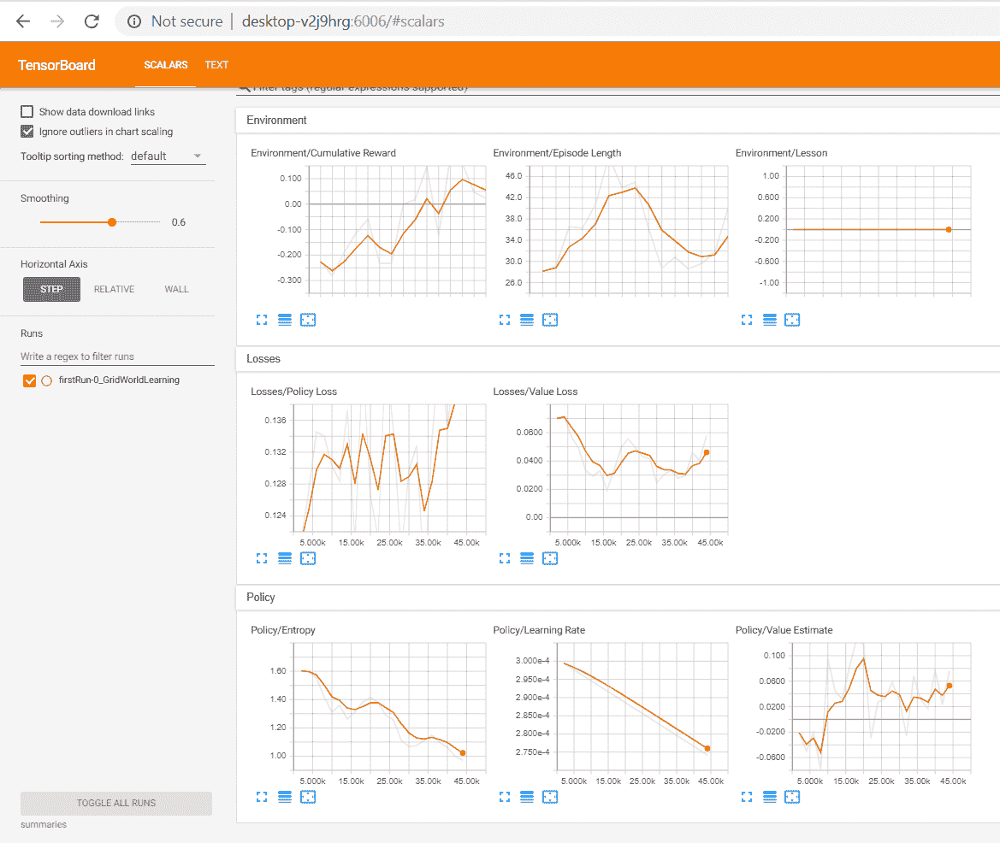

TensorBoard 图形窗口

1.  在上面的截图中，你可以看到每个不同的图表表示了训练的一个方面。理解这些图表对于了解智能体的训练过程非常重要，因此我们将逐个分析每个部分的输出：

    +   环境：这一部分展示了智能体在环境中的整体表现。接下来的截图展示了每个图表的更详细查看及其优选趋势：

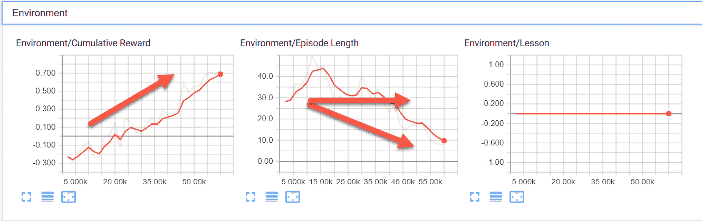

进一步查看环境部分的图表

+   累积奖励：这是智能体正在最大化的总奖励。通常你希望看到它上升，但也有可能出现下降的情况。最好将奖励最大化在 1 到-1 的范围内。如果你在图表中看到超出这个范围的奖励，也需要进行修正。

+   训练回合长度：如果这个值减小，通常是个好兆头。毕竟，较短的回合意味着更多的训练。然而，请记住，回合长度可能因需要而增加，因此这个值可能会有所波动。

+   课程：这表示智能体当前所在的课程，适用于课程学习。我们将在第九章中学习更多关于课程学习的内容，*奖励和强化学习*。

+   损失：这一部分显示了表示策略和价值计算损失或成本的图表。当然，我们并没有花太多时间解释 PPO 及其如何使用策略，所以在此时，只需理解训练时的优选方向。接下来是该部分的截图，箭头显示了最佳的偏好方向：

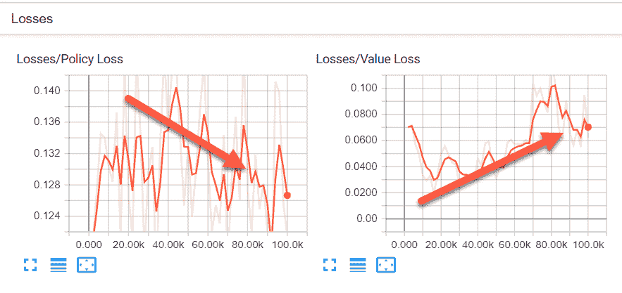

损失和优选训练方向

+   策略损失：这个值决定了策略随时间的变化程度。策略是决定行为的部分，通常这个图表应该显示出下降趋势，表明策略在做决策时越来越好。

+   值损失：这是`值`函数的平均损失。它基本上表示代理对下一个状态的价值预测得有多准确。最初，这个值应增加，奖励稳定后它应减少。

+   策略：PPO 使用策略的概念，而不是模型来确定行动的质量。同样，我们将在第八章《*理解 PPO*》中花更多时间讨论这一点，并揭示 PPO 的更多细节。下一张截图展示了策略图及其优先趋势：

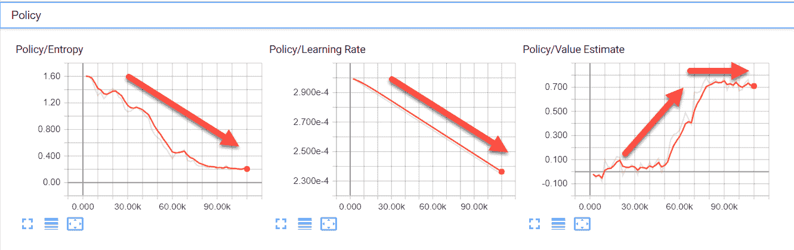

策略图和优先趋势

+   熵：表示代理探索的程度。随着代理对环境了解得更多，它需要探索的程度减少，因此该值应减少。

+   学习率：当前该值设置为随时间线性下降。

+   值估计：这是所有代理状态访问的平均值或均值。此值应增加，以代表代理知识的增长，然后稳定下来。

这些图表都旨在与 Unity 基于 PPO 方法的实现一起使用。暂时不用太担心理解这些新术语，我们将在第七章《*代理与环境*》中深入探讨 PPO 的基础知识。

1.  让代理运行到完成，并保持 TensorBoard 运行。

1.  返回到正在训练大脑的 Anaconda/Python 窗口，并运行以下命令：

```py
mlagents-learn config/trainer_config.yaml --run-id=secondRun --train
```

1.  你将再次被提示在编辑器中按下播放按钮；请确保这样做。让代理开始训练并运行几轮。在此过程中，监控 TensorBoard 窗口，并注意图表上如何显示 `secondRun`。你也可以让这个代理运行到完成，但如果你愿意，现在可以停止它。

在 ML-Agents 的早期版本中，你需要先构建一个 Unity 可执行文件作为游戏训练环境并运行它。外部 Python 大脑依旧按照相同的方式运行。这种方法使得调试代码问题或游戏中的问题变得非常困难。所有这些问题已经通过当前的方法得到解决；然而，对于某些自定义训练，我们可能需要以后再使用旧的可执行文件方法。

现在我们已经看到设置和训练代理是多么简单，接下来我们将通过下一部分来了解如何在没有外部 Python 大脑的情况下直接在 Unity 中运行该代理。

# 运行代理

使用 Python 进行训练效果很好，但它不是实际游戏中会使用的方式。理想情况下，我们希望能够构建一个 TensorFlow 图并在 Unity 中使用它。幸运的是，构建了一个名为 TensorFlowSharp 的库，它允许 .NET 使用 TensorFlow 图。这使我们能够构建离线的 TF 模型，并在之后将其注入到我们的游戏中。不幸的是，我们只能使用已训练的模型，暂时不能以这种方式进行训练。

让我们通过使用刚刚为 GridWorld 环境训练的图表并将其作为 Unity 中的内部大脑来看看它是如何工作的。请按下一个小节中的练习步骤来设置并使用内部大脑：

1.  从此链接下载 TFSharp 插件: [`s3.amazonaws.com/unity-ml-agents/0.5/TFSharpPlugin.unitypackage`](https://s3.amazonaws.com/unity-ml-agents/0.5/TFSharpPlugin.unitypackage)。

如果此链接无法使用，请查阅 Unity 文档或 Asset Store 获取新链接。当前版本被描述为实验性，并可能发生变化。

1.  从编辑器菜单中选择 Assets | Import Package | Custom Package...

1.  找到刚刚下载的资产包，并使用导入对话框将插件加载到项目中。如果您需要有关这些基础 Unity 任务的帮助，网上有大量的资料可以进一步指导您。

1.  从菜单中选择 Edit | Project Settings。这将打开设置窗口（2018.3 新增功能）

1.  在 Player 选项下找到 Scripting Define Symbols，并将文本设置为 `ENABLE_TENSORFLOW`，并启用 Allow Unsafe Code，如下图所示：

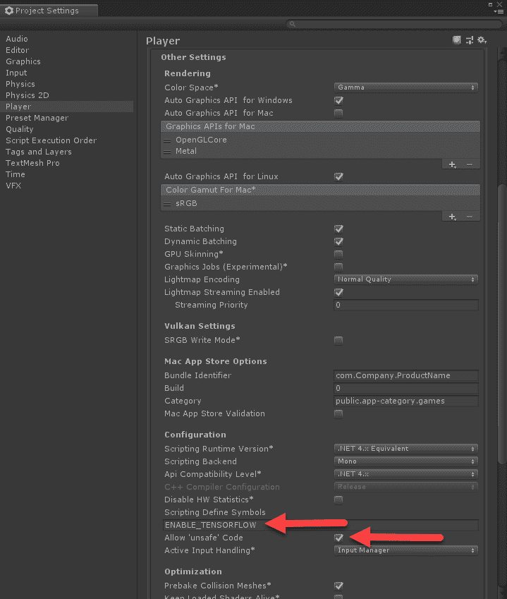

设置 `ENABLE_TENSORFLOW` 标志

1.  在 Hierarchy 窗口中找到 GridWorldAcademy 对象，并确保它使用的是 Brains | GridWorldLearning。然后关闭 Grid Academy 脚本中 Brains 部分下的 Control 选项。

1.  在 `Assets/Examples/GridWorld/Brains` 文件夹中找到 GridWorldLearning 大脑，并确保在 Inspector 窗口中设置了 Model 参数，如下图所示：

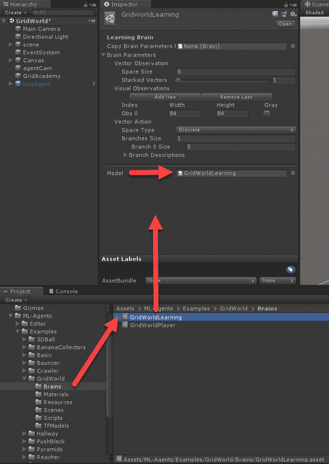

为大脑设置使用的模型

1.  `Model` 应该已经设置为 GridWorldLearning 模型。在这个例子中，我们使用的是与 GridWorld 示例一起提供的 TFModel。您也可以通过将我们在前一个示例中训练的模型导入到项目中并将其设置为模型来轻松使用它。

1.  按下 Play 运行编辑器并观察代理控制立方体。

目前，我们正在使用预训练的 Unity 大脑运行环境。在下一个小节中，我们将查看如何使用我们在前一节中训练的大脑。

# 加载已训练的大脑

所有 Unity 示例都带有预训练的大脑，您可以使用它们来探索示例。当然，我们希望能够将我们自己的 TF 图加载到 Unity 中并运行它们。请按照以下步骤加载已训练的图表：

1.  找到 `ML-Agents/ml-agents/models/firstRun-0` 文件夹。在此文件夹中，您应看到一个名为 `GridWorldLearning.bytes` 的文件。将该文件拖入 Unity 编辑器中的 `Project/Assets/ML-Agents/Examples/GridWorld/TFModels` 文件夹，如下所示：

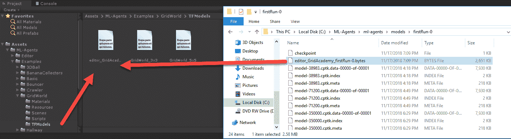

将字节图表拖入 Unity

1.  这将把图形导入 Unity 项目作为资源，并将其重命名为`GridWorldLearning 1`。这样做是因为默认模型已经有了相同的名称。

1.  在`brains`文件夹中找到`GridWorldLearning`，在 Inspector 窗口中选择它，并将新的`GridWorldLearning 1`模型拖动到大脑参数下的模型插槽中：

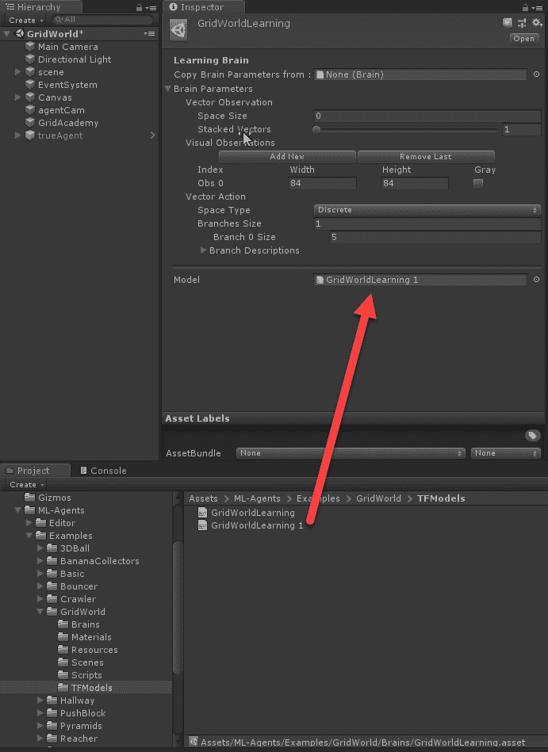

在大脑中加载图形模型插槽。

1.  在这一阶段，我们不需要更改其他参数，但请特别注意大脑的配置。默认设置目前是可行的。

1.  在 Unity 编辑器中按下播放按钮，观察智能体成功地完成游戏。

1.  训练智能体的时间将真正决定它在游戏中的表现。如果让它完成训练，智能体的表现应当与已经训练好的 Unity 智能体相当。

现在有很多 Unity 示例，您可以自行运行和探索。可以随意训练多个示例，或者按照下一节中的练习进行训练。

# 练习

使用本节中的练习来增强和巩固您的学习。至少尝试其中一些练习，记住这些练习对您有益：

1.  设置并运行 3DBall 示例环境以训练一个有效的智能体。这个环境使用多个游戏/智能体来进行训练。

1.  设置 3DBall 示例，让一半的游戏使用已经训练好的大脑，另一半使用训练或外部学习。

1.  使用外部学习训练 PushBlock 环境中的智能体。

1.  训练 VisualPushBlock 环境。注意这个示例如何使用视觉摄像头捕捉环境状态。

1.  作为玩家运行 Hallway 场景，然后使用外部学习大脑训练该场景。

1.  作为玩家运行 VisualHallway 场景，然后使用外部学习大脑训练该场景。

1.  运行 WallJump 场景，然后在训练条件下运行它。这个示例使用了课程训练，稍后我们将在第九章中深入探讨，*奖励与强化学习*。

1.  运行金字塔场景，然后为训练进行设置。

1.  运行 VisualPyramids 场景并为训练进行设置。

1.  运行 Bouncer 场景并为训练进行设置。

虽然您不必运行所有这些练习/示例，但熟悉它们是很有帮助的。它们往往可以作为创建新环境的基础，正如我们在下一章中所看到的那样。

# 总结

如你所学，Unity 中训练 RL 和 DRL 代理的工作流比在 OpenAI Gym 中更加集成和无缝。我们不需要写一行代码就能在网格世界环境中训练代理，而且视觉效果要好得多。对于本章，我们从安装 ML-Agents 工具包开始。然后我们加载了一个 GridWorld 环境，并设置它与 RL 代理进行训练。从那时起，我们查看了 TensorBoard 来监控代理的训练和进展。在训练完成后，我们首先加载了一个 Unity 预训练的大脑，并在 GridWorld 环境中运行它。接着，我们使用了一个刚刚训练好的大脑，并将其作为资产导入到 Unity 中，作为 GridWorldLearning 大脑的模型。

在下一章中，我们将探讨如何构建一个新的 RL 环境或游戏，我们可以使用代理来学习和玩耍。这将使我们进一步了解本章中略过的各种细节。
