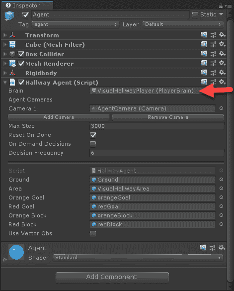
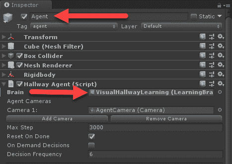
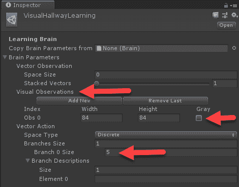
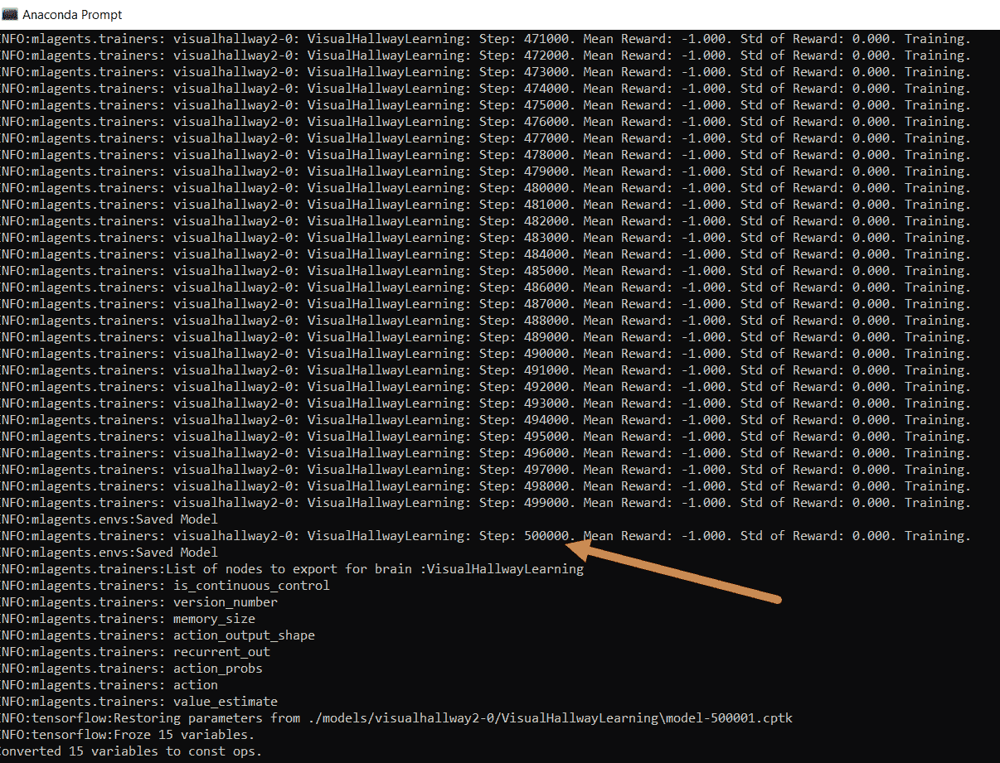
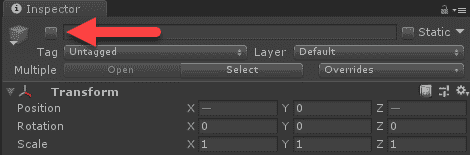
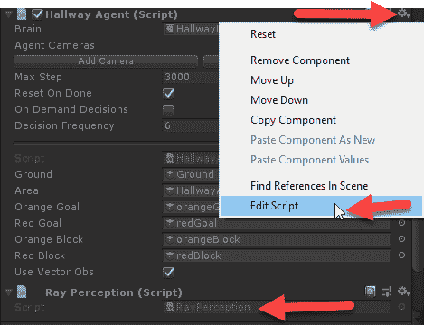
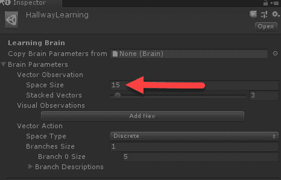
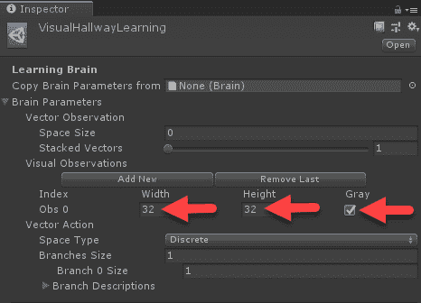
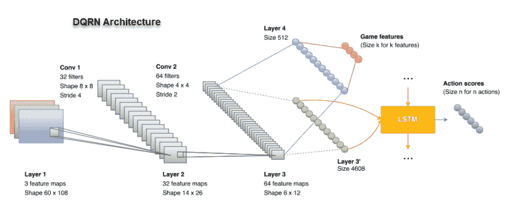

# 第七章：智能体与环境

玩转和探索实验性的强化学习环境是很有趣的，但最终，大多数游戏开发者希望开发自己的学习环境。为了做到这一点，我们需要更深入地了解训练深度强化学习环境，特别是一个智能体如何接收和处理输入。因此，在本章中，我们将仔细研究如何在 Unity 中训练一个更为复杂的示例环境。这将帮助我们理解输入和状态对训练智能体的重要性，以及 Unity ML-Agents 工具包中许多使我们能够探索多种选项的特性。本章对于任何希望在自己的游戏中构建环境并使用 ML-Agents 的人来说都至关重要。所以，如果你需要反复阅读本章以理解细节，请务必这样做。

在本章中，我们将涵盖许多与智能体如何处理输入/状态相关的细节，以及你如何调整这些内容以适应你的智能体训练。以下是本章内容的总结：

+   探索训练环境

+   理解状态

+   理解视觉状态

+   卷积与视觉状态

+   循环神经网络

确保你已经阅读、理解并运行了上一章的部分示例练习，第六章，*Unity ML-Agents*。在继续之前，确保你已经正确配置并运行了 Unity 和 ML-Agents 工具包。

# 探索训练环境

经常推动我们成功或推动我们学习的因素之一就是失败。作为人类，当我们失败时，通常会发生两件事：我们要么更加努力，要么选择放弃。有趣的是，这与强化学习中的负奖励很相似。在 RL 中，智能体如果获得负奖励，可能会因为看不到未来的价值或预测无法带来足够的好处而放弃探索某条路径。然而，如果智能体认为需要更多的探索，或者它没有完全探索完这条路径，它就会继续前进，并且通常这会引导它走上正确的道路。同样，这与我们人类的情况非常相似。因此，在本节中，我们将训练一个较为复杂的示例智能体，促使我们学习如何面对失败并修正训练中的问题。

Unity 目前正在构建一个多级基准塔环境，具有多个难度等级。这将允许深度强化学习爱好者、从业者和研究人员在基准环境上测试他们的技能和模型。作者获得的相对可靠的消息是，这个环境应该会在 2019 年年初或年中完成。

我们最终需要使用 Unity ML-Agents 工具包的许多高级功能来使这个示例正常工作。这要求你对本书的前五章有良好的理解。如果你跳过了这些章节来到这里，请根据需要回去复习。在本章的许多地方，我们提供了指向之前相关章节的有用链接。

我们将关注的训练示例环境是 VisualHallway，不要与标准的 Hallway 示例混淆。VisualHallway 的不同之处在于它使用摄像头作为模型的完整输入状态，而我们之前看到的其他 Unity 示例则使用某种形式的多传感器输入，通常允许代理在任何时候看到 90 度到 360 度的视角，并提供其他有用的信息。这对大多数游戏来说是可以接受的，事实上，许多游戏仍然允许这样的“作弊”或直觉作为 NPC 或计算机对手 AI 的一部分。将这些“作弊”加入游戏 AI 一直是一个被接受的做法，但也许这很快就会发生改变。

毕竟，好游戏是有趣的，并且对玩家来说是合乎逻辑的。过去不久的游戏可能能让 AI 作弊，但现在，玩家对 AI 的期望更高了，他们希望 AI 和他们遵循相同的规则。之前认为计算机 AI 受到技术限制的观念已经消失，现在游戏 AI 必须遵循与玩家相同的规则，这使得我们专注于使 VisualHallway 示例正常工作和训练变得更加有意义。

当然，教 AI 像玩家一样玩/学习还有另一个额外的好处，那就是能够将这种能力转移到其他环境中，这个概念叫做迁移学习。我们将在第十章《模仿与迁移学习》中探索迁移学习，学习如何调整预训练模型/参数，并将其应用于其他环境。

VisualHallway/Hallway 示例首先会将代理随机放入一个长房间或走廊。在这个空间的中央是一个彩色方块，每个走廊的两端角落都有一个覆盖地板的彩色方形区域。这个方块的颜色要么是红色，要么是金色（橙色/黄色），用来告诉代理目标方块的颜色与之相同。目标是让代理移动到正确的彩色方块。在标准的 Hallway 示例中，代理拥有 360 度的传感器感知。而在 VisualHallway 示例中，代理只能看到房间的摄像机视图，就像玩家在游戏中看到的一样。这使得我们的代理与玩家站在了同一起跑线。

在开始训练之前，让我们像玩家一样打开示例并玩一下，看看我们能做得怎么样。按照这个练习打开 VisualHallway 示例：

1.  在继续之前，确保你已经正确安装了 ML-Agents，并且能够在 Python 中外部训练大脑。如果需要帮助，请参考上一章。

1.  从项目窗口的 Assets | ML-Agents | Examples | Hallway | Scenes 文件夹中打开 VisualHallway 场景。

1.  确保 Agent | Hallway Agent | Brain 设置为 VisualHallwayPlayer，如下图所示：



Hallway Agent | Brain 设置为 player

1.  在编辑器中按下播放按钮运行场景，并使用 `W`、`A`、`S` 和 `D` 键来控制代理。记住，目标是移动到与中心方块颜色相同的方块。

1.  玩游戏并移动到两个颜色方块，观察在进入奖励方块时，正向或负向奖励给予时会发生什么。游戏画面在进入奖励方块时会闪烁绿色或红色。

这个游戏环境典型地模拟了第一人称射击游戏，非常适合训练代理以第一人称视角进行游戏。训练代理以类似人类的方式玩游戏是许多 AI 从业者的目标，虽然这可能是你是否会在游戏中实现的功能。正如我们所见，根据你游戏的复杂性，这种学习/训练可能甚至不是一个可行的选项。此时，我们应该了解如何设置并通过视觉训练代理。

# 直观地训练代理

幸运的是，设置代理进行视觉训练相当简单，特别是如果你已经完成了上一章的练习。打开 Unity 编辑器并加载 VisualHallway 场景，准备好 Python 命令行或 Anaconda 窗口，我们就可以开始了：

1.  在 Unity 中，将 Agent | Hallway Agent | Brain 更改为 VisualHallwayLearning，如下图所示：



将大脑更改为学习模式

1.  点击 VisualHallwayLearning 大脑，在项目窗口中定位它。

1.  点击 VisualHallwayLearning 大脑，在检查器窗口中查看其属性，如下图所示：



确认学习大脑的属性设置正确

1.  确保大脑参数设置为接受分辨率为 `84` x `84` 像素的单一视觉观察，并且不使用灰度。灰度仅是去除颜色通道，使输入变为一个通道，而非三个通道。回顾我们在第二章中讨论的卷积神经网络（CNN）层，*卷积和递归网络*。同时，确保 Vector Observation | Space Size 设置为 0，如前图所示。

1.  在菜单中选择文件 | 保存和文件 | 保存项目，以保存所有更改。

1.  切换到你的 Python 窗口或 Anaconda 提示符，确保你在 `ML-Agents/ml-agents` 目录下，并运行以下命令：

```py
mlagents-learn config/trainer_config.yaml --run-id=visualhallway --train
```

1.  在命令执行后，等待提示以启动编辑器。然后，在提示时运行编辑器，并让示例运行完成，或者运行到你有耐心的时长为止。

1.  在示例运行完成后，你应该会看到如下所示的内容：



完整的训练运行直到完成

假设你训练智能体直到运行结束，即训练了 500K 次迭代，那么你可以确认智能体确实什么也没学到。那么，为什么 Unity 会在他们的示例中加入这样的示例呢？嗯，你可以认为这是一个故意设计的挑战，或者只是他们的一次疏忽。无论如何，我们将其视为一个挑战，借此更好地理解强化学习。

在我们应对这个挑战之前，先回过头来重新确认我们对这个环境的理解，通过查看下一个部分中更易于训练的 Hallway 示例。

# 回归基础

当你在问题上卡住时，回到最基础的地方确认一切是否按预期工作是很有帮助的。公平地说，我们还没有深入探索 ML-Agents 的内部机制，也没有真正理解深度强化学习（DRL），因此我们实际上并没有从一开始就出发。但为了本示例的目的，我们将回过头来，详细查看 Hallway 示例。返回编辑器并执行以下操作：

1.  在编辑器中打开 Hallway 示例场景。记住，场景位于 Assets | ML-Agents | Examples | Hallway | Scenes 文件夹中。

1.  这个示例配置为使用多个并发训练环境。我们能够使用相同的大脑训练多个并发训练环境，因为 **近端策略优化**（**PPO**），支持这个智能体的强化学习算法，是基于策略进行训练，而不是基于模型。我们将在 第八章《理解 PPO》中详细讲解基于策略和基于模型的学习。为了简化操作，目前我们将暂时禁用这些额外的环境。

1.  按下 *Shift* 键，然后在层级面板中选择所有编号的 HallwayArea（1-15）对象。

1.  选中所有额外的 HallwayArea 对象，点击 "Active" 复选框将其禁用，如下图所示：



禁用所有额外的训练走廊

1.  打开层级窗口中剩下的活动 HallwayArea 并选择 Agent。

1.  将 Brain 智能体设置为使用 HallwayLearning brain。默认情况下，它可能设置为使用玩家的大脑。

1.  在层级窗口中重新选择 Academy 对象，确保 Hallway Academy 组件的大脑设置为 Learning，并且启用了 Control 复选框。

1.  打开 Python 或 Anaconda 窗口，进入 `ML-Agents/ml-agents` 文件夹。确保你的 ML-Agents 虚拟环境已激活，并运行以下命令：

```py
mlagents-learn config/trainer_config.yaml --run-id=hallway --train
```

1.  让训练器启动并提示你点击编辑器中的 Play 按钮。观察代理运行，并将其表现与 VisualHallway 示例进行对比。

通常，在 50,000 次迭代之前，你会注意到代理有一些训练活动，但这可能会有所不同。所谓训练活动，是指代理的平均奖励（Mean Reward）大于-1.0，标准奖励（Standard Reward）不等于零。即使你让示例运行完成，即 500,000 次迭代，它也不太可能训练到正的平均奖励。我们通常希望奖励范围从-1.0 到+1.0，并且有一定的变化来展示学习活动。如果你还记得 VisualHallway 示例，代理在整个训练过程中没有显示任何学习活动。我们本可以延长训练迭代次数，但不太可能看到任何稳定的训练成果。原因在于状态空间的增加和奖励的处理。我们将在下一节扩展对状态的理解，并讨论它与强化学习的关系。

# 理解状态

Hallway 和 VisualHallway 示例本质上是相同的游戏问题，但提供了不同的视角，或者我们在强化学习中所说的环境或游戏状态。在 Hallway 示例中，代理通过传感器输入进行学习，这一点我们将很快讨论，而在 VisualHallway 示例中，代理通过摄像头或玩家视角进行学习。此时，理解每个示例如何处理状态，以及我们如何修改状态，将会非常有帮助。

在接下来的练习中，我们将修改 Hallway 输入状态并查看结果：

1.  跳回到上一个练习结束时启用学习的 Hallway 场景。

1.  我们需要修改几行 C#代码，没什么难的，但安装 Visual Studio（Community 版或其他版本）会比较有用，因为这是我们推荐的编辑器。当然，你也可以使用任何你喜欢的代码编辑器，只要它与 Unity 兼容。

1.  在层级窗口中找到 Agent 对象，然后在检视窗口中点击 Hallway Agent 组件上的齿轮图标，如下图所示：



打开 HallwayAgent.cs 脚本

1.  从上下文菜单中选择编辑脚本选项，如上图所示。这将会在你选择的代码编辑器中打开脚本。

1.  在编辑器中找到以下 C#代码部分：

```py
public override void CollectObservations()
{
  if (useVectorObs)
  {
    float rayDistance = 12f;
    float[] rayAngles = { 20f, 60f, 90f, 120f, 160f };
    string[] detectableObjects = { "orangeGoal", "redGoal", "orangeBlock", "redBlock", "wall" };
    AddVectorObs(GetStepCount() / (float)agentParameters.maxStep);
    AddVectorObs(rayPer.Perceive(rayDistance, rayAngles, detectableObjects, 0f, 0f));
  }
}
```

1.  `CollectObservations` 方法是智能体收集观察或输入状态的地方。在 Hallway 示例中，智能体将 `useVectorObs` 设置为 `true`，意味着它通过 `if` 语句内部的代码块来检测状态。所有这些代码做的事情就是从智能体发射一束射线，角度分别为 `20f`、`60f`、`120f` 和 `160f` 度，距离由 `rayDistance` 定义，并检测在 `detectableObjects` 中定义的物体。这些射线感知是通过一个名为 `rayPer` 的辅助组件完成的，`rayPer` 的类型是 `RayPerception`，并执行 `rayPer.Percieve` 来收集它所感知到的环境状态。这些信息与步骤的比例一起，添加到智能体输入的向量观察或状态中。此时，状态是长度为 36 的向量。根据这个版本，必须在代码中构造它，但未来可能会有所变化。

1.  修改 `rayAngles` 这一行代码，使其与以下内容匹配：

```py
float[] rayAngles = { 20f, 60f };
```

1.  这样做的效果是显著缩小了智能体的视野或感知范围，从 180 度缩小到 60 度。换句话说，就是减少了输入状态。

1.  完成编辑后，保存文件并返回 Unity。当你返回编辑器时，Unity 会重新编译代码。

1.  在 Assets | ML-Agents | Examples | Hallway | Brains 文件夹中找到 HallwayLearning 大脑，并将 Vector Observation | Space Size 修改为 `15`，如以下截图所示：



设置向量观察空间大小

1.  我们将其减少到 15 的原因是：现在的输入由两个角度输入加一个步骤输入组成。每个角度输入包括五个可检测的物体，再加上两个边界，总共七个感知或输入。因此，两个角度乘以七个感知，再加上一个步骤，等于 15。之前，我们有五个角度乘以七个感知，再加上一个步骤，等于 35。

1.  在修改 Brain 可编程对象后，请确保保存项目。

1.  再次运行示例进行训练，并观察智能体如何训练。花些时间关注智能体采取的动作以及它是如何学习的。务必让这个示例运行的时间与其他 Hallway 示例相同，希望能够完整运行。

结果让你感到惊讶吗？是的，我们的智能体在较小的视野下实际上训练得更快。这个结果可能看起来完全不合常理，但从数学角度考虑，小的输入空间或状态意味着智能体有更少的路径可供探索，因此应该训练得更快。这正是我们在减少输入空间超过一半后在这个示例中看到的情况。在此时，我们肯定需要观察在 VisualHallway 示例中，减少视觉状态空间会发生什么。

# 理解视觉状态

强化学习（RL）是一种非常强大的算法，但当我们开始处理大量状态输入时，计算复杂性会变得非常高。为了应对庞大的状态，许多强大的强化学习算法使用无模型或基于策略的学习概念，这一点我们将在后面的章节中讨论。如我们所知，Unity 使用基于策略的算法，允许它通过推广到策略来学习任何大小的状态空间。这使得我们可以轻松地将我们刚才运行的示例中的 15 个向量输入转变为更大规模的状态空间，就像在 VisualHallway 示例中那样。

让我们打开 Unity 到 VisualHallway 示例场景，并看看如何在接下来的练习中减少视觉输入空间：

1.  在打开 VisualHallway 场景的同时，找到位于 Assets | ML-Agents | Examples | Hallway | Brains 文件夹中的 HallwayLearningBrain 并选择它。

1.  将 Brain 参数 **|** 视觉观察的第一个相机可观察输入修改为 `32` x `32` 灰度。如下截图所示：



设置代理的视觉观察空间

1.  当视觉观察设置在大脑上时，每一帧都会以所选的分辨率从相机中捕捉。之前，捕捉的图像大小为 84 x 84 像素，虽然远不如玩家模式下的游戏屏幕那么大，但仍然明显大于 35 个向量输入。通过减小图像大小并将其转换为灰度，我们将输入框架从 84 x 84 x 3 = 20,172 个输入，减少到 32 x 32 x 1 = 1,024 个输入。反过来，这大大减少了所需的模型输入空间以及学习所需的网络复杂度。

1.  保存项目和场景。

1.  使用以下命令再次以学习模式运行 VisualHallway：

```py
mlagents-learn config/trainer_config.yaml --run-id=vh_reduced --train
```

1.  注意我们在每次运行时都在更改 `--run-id` 参数。回想一下，如果我们要使用 TensorBoard，那么每次运行都需要一个唯一的名称，否则它会覆盖之前的运行。

1.  让示例训练的时间与之前运行 VisualHallway 练习的时间一样，因为这样你可以很好的比较我们在状态上所做的变化。

结果是否如你所预期？是的，代理仍然没有学会，即使在减少了状态后。原因在于，较小的视觉状态实际上在这种情况下对代理是有害的。就像我们人类在尝试通过针孔看事物时的效果一样。然而，还有另一种方法可以通过卷积将视觉状态减少为特征集。正如你可能记得的，我们在第二章《卷积神经网络和循环神经网络》中详细讨论了卷积。在接下来的章节中，我们将研究如何通过添加卷积层来减少示例的视觉状态。

# 卷积与视觉状态

在 ML-Agents 工具包中，代理使用的视觉状态是通过一个过程定义的，这个过程在特定的分辨率下截取截图，然后将截图输入到卷积网络中，以训练某种形式的嵌入状态。在接下来的练习中，我们将打开 ML-Agents 的训练代码，并增强卷积代码以获得更好的输入状态：

1.  使用文件浏览器打开 ML-Agents `trainers`文件夹，路径为`ml-agents.6\ml-agents\mlagents\trainers`**。**在这个文件夹中，你会找到几个用于训练代理的 Python 文件。我们感兴趣的文件叫做`models.py`。

1.  在你选择的 Python 编辑器中打开`models.py`文件。Visual Studio 与 Python 数据扩展是一个非常好的平台，并且还提供了交互式调试代码的功能。

1.  向下滚动文件，找到`create_visual_observation_encoder`函数，其内容如下：

```py
def create_visual_observation_encoder(self, image_input, h_size, activation, num_layers, scope,reuse):
  #comments removed        
  with tf.variable_scope(scope):
    conv1 = tf.layers.conv2d(image_input, 16, kernel_size=[8, 8], strides=[4, 4],activation=tf.nn.elu, reuse=reuse, name="conv_1")
 conv2 = tf.layers.conv2d(conv1, 32, kernel_size=[4, 4], strides=[2, 2],activation=tf.nn.elu, reuse=reuse, name="conv_2")
    hidden = c_layers.flatten(conv2)

    with tf.variable_scope(scope + '/' + 'flat_encoding'):
      hidden_flat = self.create_vector_observation_encoder(hidden, h_size, activation, num_layers, scope, reuse)
 return hidden_flat
```

1.  代码使用的是 Python 和 TensorFlow，但你应该能够识别`conv1`和`conv2`卷积层。注意层的卷积核和步幅是如何定义的，以及缺少的池化层。Unity 没有使用池化，以避免丢失数据中的空间关系。然而，正如我们之前讨论的，这并非总是那么简单，实际上，这取决于你要识别的视觉特征类型。

1.  在两个卷积层后添加以下代码行，并修改`hidden`层的设置，如下所示：

```py
conv1 = tf.layers.conv2d(image_input, 16, kernel_size=[8, 8], strides=[4, 4], activation=tf.nn.elu, reuse=reuse, name="conv_1")
conv2 = tf.layers.conv2d(conv1, 32, kernel_size=[4, 4], strides=[2, 2], activation=tf.nn.elu, reuse=reuse, name="conv_2")
conv3 = tf.layers.conv2d(image_input, 64, kernel_size=[2, 2], strides=[2, 2], activation=tf.nn.elu, reuse=reuse, name="conv_3")

hidden = c_layers.flatten(conv3)
```

1.  这将产生在代理的游戏视图中添加另一个卷积层的效果，以提取更细节的内容。正如我们在第二章中看到的，*卷积神经网络与递归网络*，增加额外的卷积层会增加训练时间，但确实会提高训练表现——至少在图像分类器上是这样。

1.  跳回你的命令行或 Anaconda 窗口，并使用以下命令以学习模式运行示例：

```py
mlagents-learn config/trainer_config.yaml --run-id=vh_conv1 --train
```

1.  观察训练过程并查看代理的表现——在示例运行时，一定要在游戏窗口中观察代理的动作。代理是否按你预期的方式执行？将结果与之前的运行进行比较，并注意其中的差异。

你一定会注意到，代理变得稍微更优雅，能够执行更精细的动作。虽然训练过程可能需要更长的时间，但这个代理能够观察到环境中的细微变化，因此会做出更精细的动作。当然，你也可以将整个 CNN 架构替换为使用更明确的架构。然而，需要注意的是，大多数图像分类网络忽略空间相关性，而正如我们在下一节中看到的，空间相关性对于游戏代理非常重要。

# 是否使用池化

正如我们在第二章中讨论的，*卷积和递归网络*，ML-Agents 不使用任何池化操作，以避免数据中的空间关系丢失。然而，正如我们在自动驾驶车辆的例子中看到的那样，实际上在更高特征级别的提取（卷积层）上，加入一个或两个池化层是有帮助的。虽然我们的例子在一个更复杂的网络上进行了测试，但它有助于了解这对更复杂的 ML-Agents CNN 嵌入的应用。让我们尝试一下，通过完成以下练习，在上一个例子中添加一个池化层：

1.  打开你选择的 Python 编辑器中的`models.py`文件。Visual Studio 配合 Python 数据扩展是一个很好的平台，同时也提供了交互式调试代码的功能。

1.  找到以下代码块，这是我们在上一个练习中留下的样子：

```py
conv1 = tf.layers.conv2d(image_input, 16, kernel_size=[8, 8], strides=[4, 4], activation=tf.nn.elu, reuse=reuse, name="conv_1")
conv2 = tf.layers.conv2d(conv1, 32, kernel_size=[4, 4], strides=[2, 2], activation=tf.nn.elu, reuse=reuse, name="conv_2")
conv3 = tf.layers.conv2d(image_input, 64, kernel_size=[2, 2], strides=[2, 2], activation=tf.nn.elu, reuse=reuse, name="conv_3")

hidden = c_layers.flatten(conv3)
```

1.  现在，我们将通过修改代码块来注入一个池化层，代码如下：

```py
conv1 = tf.layers.conv2d(image_input, 16, kernel_size=[8, 8], strides=[4, 4], activation=tf.nn.elu, reuse=reuse, name="conv_1")
#################### ADD POOLING
conv2 = tf.layers.conv2d(conv1, 32, kernel_size=[4, 4], strides=[2, 2], activation=tf.nn.elu, reuse=reuse, name="conv_2")
conv3 = tf.layers.conv2d(image_input, 64, kernel_size=[2, 2], strides=[2, 2], activation=tf.nn.elu, reuse=reuse, name="conv_3")

hidden = c_layers.flatten(conv3)
```

1.  现在，这将设置我们的前一个示例，使用单层池化。你可以将其视为提取所有上层特征，比如天空、墙壁或地板，并将结果池化在一起。仔细想想，代理需要知道多少空间信息才能区分一个天空区域和另一个天空区域？代理实际上只需要知道天空总是在上面。

1.  打开你的命令行窗口或 Anaconda 窗口，通过运行以下代码来训练示例：

```py
mlagents-learn config/trainer_config.yaml --run-id=vh_conv_wpool1 --train
```

1.  和往常一样，观察代理的表现，注意代理在训练过程中是如何移动的。观察训练直到完成，或者观察你之前看到的其他人的训练过程。

现在，根据你的机器或环境，你可能已经注意到训练时间有了显著的改进，但实际表现略有下降。这意味着每次训练迭代执行得更快了，可能快了两到三倍甚至更多，但代理需要更多的交互。在这种情况下，代理训练的时间会更短，但在其他环境中，高级别的池化可能会更具破坏性。最终，这取决于你环境中的视觉效果、你希望代理表现得有多好，以及你个人的耐心。

在接下来的部分，我们将探讨状态的另一个特征——记忆，或者序列。我们将了解如何使用递归网络来捕捉记住序列或事件系列的重要性。

# 记忆序列的递归网络

本章中我们运行的示例环境默认使用一种递归记忆形式来记住过去的事件序列。这种递归记忆由**长短期记忆**（**LSTM**）层构成，允许代理记住可能有助于未来奖励的有益序列。请记住，我们在第二章中深入讲解了 LSTM 网络，*卷积与递归网络*。例如，代理可能反复看到相同的帧序列，可能是朝着目标移动，然后将这一状态序列与增加的奖励关联起来。以下是摘自*Khan Aduil 等人*的论文*Training an Agent for FPS Doom Game using Visual Reinforcement Learning and VizDoom*中的图示，展示了这种网络的原始形式：



DQRN 架构

作者将该网络架构称为 DQRN，代表深度 Q 递归网络。可能有点奇怪的是，他们没有称之为 DQCRN，因为图示清楚地显示了卷积的加入。虽然 ML-Agents 的实现略有不同，但概念基本相同。无论如何，添加 LSTM 层对代理训练有很大帮助，但在这一阶段，我们还没有看到不使用 LSTM 的训练效果。

因此，在接下来的练习中，我们将学习如何禁用递归网络，并查看这对训练的影响：

1.  打开标准的走廊示例场景，即没有视觉学习的那个，位置在`Assets/ML-Agents/Examples/Hallway/Scenes`文件夹中。

1.  打开命令行窗口或 Anaconda 窗口，并确保你的 ML-Agent 虚拟 Python 环境已激活。

1.  找到并打开位于`ML-Agents/ml-agents/config`文件夹中的`trainer_config.xml`文件，使用你喜欢的文本或 XML 编辑器。

1.  找到如下所示的配置块：

```py
HallwayLearning:
    use_recurrent: true
    sequence_length: 64
    num_layers: 2
    hidden_units: 128
    memory_size: 256
    beta: 1.0e-2
    gamma: 0.99
    num_epoch: 3
    buffer_size: 1024
    batch_size: 128
    max_steps: 5.0e5
    summary_freq: 1000
    time_horizon: 64
```

1.  名为`HallwayLearning`的配置块与我们在场景中的 Academy 中设置的大脑名称相匹配。如果你需要确认这一点，可以继续检查。

1.  我们通常将所有这些配置参数称为超参数，它们对训练有很大的影响，尤其是在设置不正确时。如果你滚动到文件的顶部，你会注意到一组默认参数，接着是每个命名大脑的例外设置。每个大脑的参数部分将覆盖默认设置。

1.  通过如下修改代码来禁用`use_recurrent`网络：

```py
HallwayLearning:
    use_recurrent: false
```

1.  将`use_recurrent`设置为`false`可以禁用递归编码的使用。现在我们可以看到这对训练的影响。

1.  保存配置文件。

1.  按照平常的方式运行学习示例。现在你应该已经能够轻松地运行一个训练示例了。

1.  和往常一样，观察代理的表现，并确保关注代理的动作。

如你所见，在这个示例中，代理的表现显著较差，显然使用循环网络来捕捉重要动作序列起到了很大的作用。事实上，在大多数重复性游戏环境中，比如 Hallway 和 VisualHallway，增加循环状态非常有效。然而，也有一些环境可能不会受益，或者实际上会因使用状态序列而受到影响。那些需要广泛探索或包含新内容的环境，可能会受到影响。由于代理可能更倾向于使用较短的动作序列，这会受到为代理配置的内存量的限制。在开发新环境时，记得考虑这一点。

现在我们已经有了一个没有循环或 LSTM 层时样本运行的比较，我们可以通过在下一节调整一些相关的循环超参数，重新测试样本。

# 调整循环超参数

正如我们在讨论循环网络时了解到的，LSTM 层可能接收可变输入，但我们仍然需要定义希望网络记住的最大序列长度。使用循环网络时，我们需要调整两个关键的超参数。以下是这些参数的描述（截至本文撰写时，按 ML-Agents 文档中的列表）：

+   `sequence_length`：`C`对应于在训练过程中传递通过网络的经验序列的长度。这个长度应该足够长，以捕捉代理可能需要记住的任何信息。例如，如果你的代理需要记住物体的速度，那么这个值可以是一个小数值。如果你的代理需要记住一条在回合开始时只给定一次的信息，那么这个值应该更大：

    +   典型范围：4 – 128

+   `memory_size`：对应于用于存储循环神经网络隐藏状态的浮点数数组的大小。该值必须是四的倍数，并且应根据你预期代理需要记住的任务信息量进行缩放：

    +   典型范围：64 – 512

循环的`sequence_length`和`memory_size`超参数的描述直接来自 Unity ML-Agents 文档。

如果我们查看`trainer_config.yaml`文件中的 VisualHallway 示例配置，可以看到这些参数定义如下：

```py
VisualHallwayLearning:
    use_recurrent: true
    sequence_length: 64
    num_layers: 1
    hidden_units: 128
    memory_size: 256
    beta: 1.0e-2
    gamma: 0.99
    num_epoch: 3
    buffer_size: 1024
    batch_size: 64
    max_steps: 5.0e5
    summary_freq: 1000
    time_horizon: 64
```

这实际上意味着我们的代理将使用 256 的内存大小记住 64 帧或输入状态。文档并未明确说明单个输入占用多少内存，因此我们只能假设默认的视觉卷积编码网络——原始的两层模型——每帧需要四个内存单元。我们可以假设，通过增加我们之前示例中的卷积编码，代理可能无法记住每一帧状态。因此，让我们修改 VisualHallway 示例中的配置，以适应这种内存增加，并查看它在以下练习中的效果：

1.  打开 VisualHallway 示例，回到我们上次在之前的练习中离开的地方，无论是否启用池化。只要记住你是否启用了池化，因为这将影响所需的内存。

1.  打开位于 `ML-Agents/ml-agents/config` 文件夹中的 `trainer_config.yaml` 文件。

1.  修改 `VisualHallwayLearning` 配置部分，如下所示：

```py
VisualHallwayLearning:
    use_recurrent: true
    sequence_length: 128
    num_layers: 1
    hidden_units: 128
    memory_size: 2048 without pooling, 1024 with pooling
    beta: 1.0e-2
    gamma: 0.99
    num_epoch: 3
    buffer_size: 1024
    batch_size: 64
    max_steps: 5.0e5
    summary_freq: 1000
    time_horizon: 64
```

1.  我们将代理的记忆从 64 个序列增加到 128 个序列，从而使其记忆翻倍。接着，当不使用池化时，我们将记忆增加到 2,048，而使用池化时为 1,024。记住，池化会收集特征并减少每次卷积步骤中生成的特征图数量。

1.  编辑完成后，保存文件。

1.  打开你的命令行或 Anaconda 窗口，使用以下命令开始训练：

```py
mlagents-learn config/trainer_config.yaml --run-id=vh_recurrent --train
```

1.  当提示时，通过按下播放按钮开始编辑器中的训练会话，并观看操作的展开。

1.  等待代理训练完成，像我们之前运行的其他示例一样。你应该能注意到训练性能的再次提高，以及代理选择的动作，应该显得更加协调。

如我们所见，轻微调整超参数使得我们能够改善代理的性能。理解在训练中使用的众多参数的作用，对于你成功构建出色的代理至关重要。在下一部分，我们将介绍一些进一步的练习，帮助你提高理解和技能。

# 练习

一如既往，尽量独立完成两到三个练习，为了你自己的利益。虽然这是一本实践书籍，但花一些额外时间将你的知识应用于新问题总是有益的。

独立完成以下练习：

1.  浏览并探索 VisualPushBlock 示例。这个示例与走廊示例非常相似，是一个不错的类比，可以进行尝试。

1.  修改走廊示例中的 HallwayAgent 脚本，以使用更多的扫描角度，从而获得更多的向量观察。

1.  修改走廊示例，使用组合的传感器扫描和视觉观察输入。这将要求你通过添加相机来修改学习大脑配置，并可能需要更新一些超参数。

1.  修改其他视觉观测环境，以使用某种形式的向量观测。一个不错的例子是尝试在 VisualPushBlock 示例中应用此功能。

1.  修改视觉观测摄像头的空间，使其比 84 x 84 像素更大或更小，并选择是否使用灰度化。这是测试更复杂或更简单的 CNN 网络架构时一个很好的练习。

1.  修改`create_visual_observation_encoder`卷积编码函数，使其能够使用不同的 CNN 架构。这些架构可以根据你的需求是简单还是复杂。

1.  修改`create_visual_observation_encoder`卷积编码函数，以使用不同级别和数量的池化层。尝试在每个卷积层后使用池化，探索其对训练的影响。

1.  在其他一些示例环境中禁用并重新启用递归网络，探索其对结果的影响。

1.  在启用递归网络的情况下，调整`sequence_length`和`memory_size`参数，观察不同序列长度对智能体表现的影响。如果增加`sequence_length`，请务必相应地增加`memory_size`参数。

1.  考虑为智能体添加额外的向量或视觉观测。毕竟，智能体不一定只能有单一形式的感官输入。智能体可以始终检测其所处的方向，或者可能有其他感官输入方式，例如能够听到声音。我们将在后续章节中为智能体提供听觉能力，但也可以尝试自己实现这一功能。

记住，这些练习是为你的利益和享受而提供的，因此确保至少尝试几个。

# 总结

在这一章中，我们详细探讨了 ML-Agents 中的智能体如何感知环境并处理输入。智能体对环境的感知完全由开发者控制，这通常是关于给予智能体多少或多少输入/状态的微妙平衡。在本章中，我们进行了许多示例，并从深入分析 Hallway 示例及智能体如何使用射线感知环境中的物体开始。接着，我们研究了智能体如何使用视觉观测作为输入或状态，类似于我们人类，从中学习。随后，我们探讨了 ML-Agents 使用的卷积神经网络（CNN）架构，该架构用于编码提供给智能体的视觉观测。我们学习了如何通过添加或删除卷积层或池化层来修改这一架构。最后，我们研究了记忆的作用，或者说如何通过输入状态的递归序列化来帮助智能体训练。递归网络使得智能体能够为提供奖励的动作序列增加更多的价值。

在下一章，我们将更详细地探讨强化学习（RL）以及智能体如何使用 PPO 算法。我们将在过程中深入学习 RL 的基础知识，并了解在训练中使用的许多超参数的重要性。
