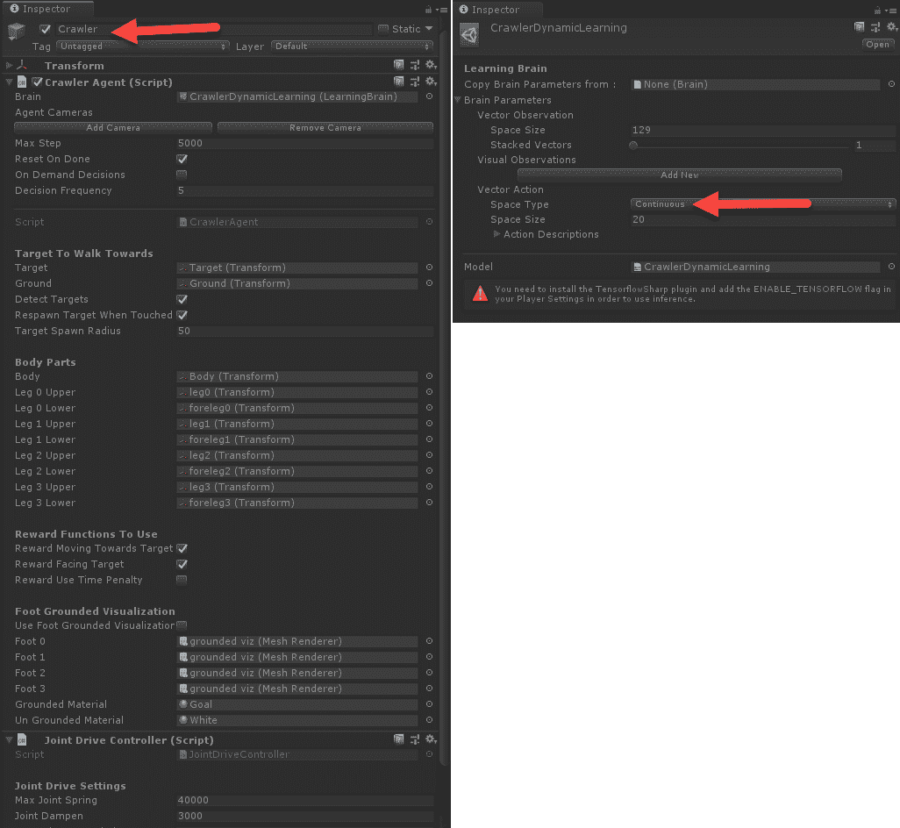
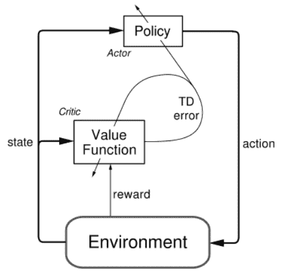
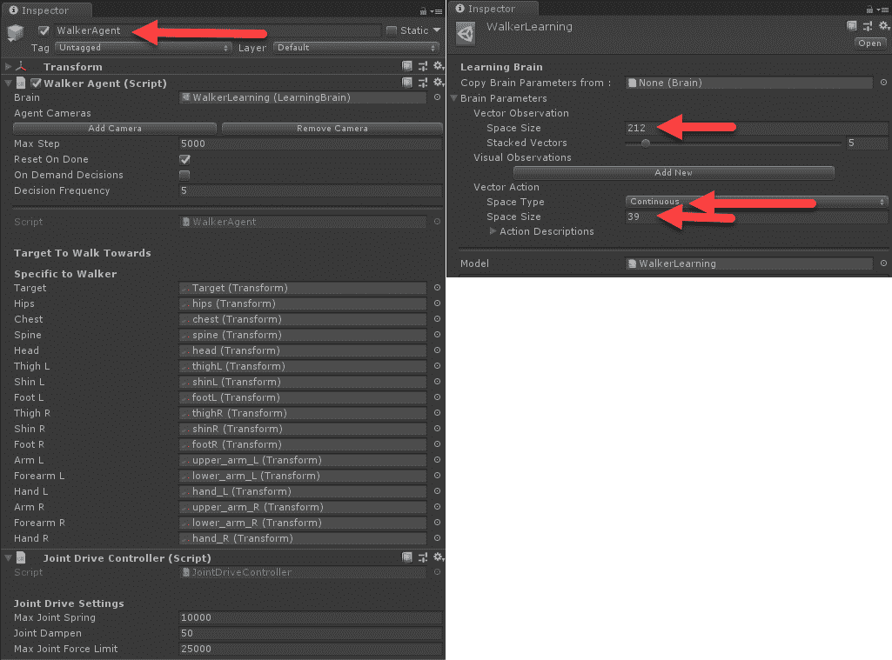
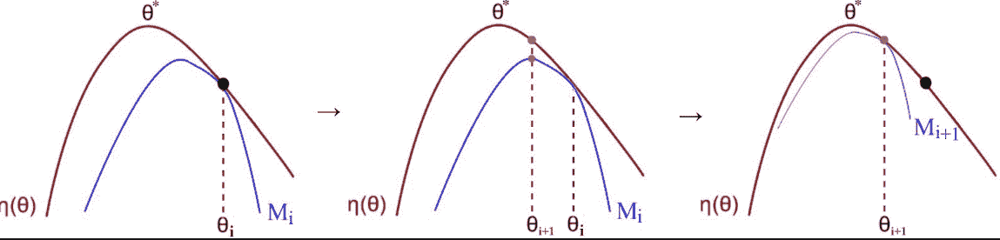
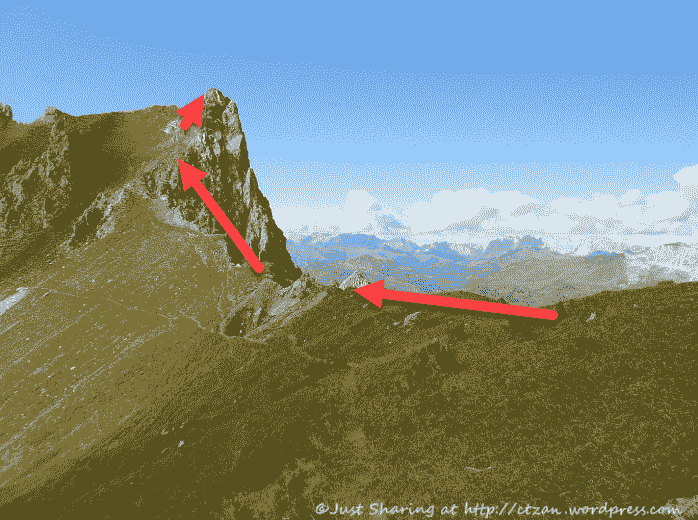
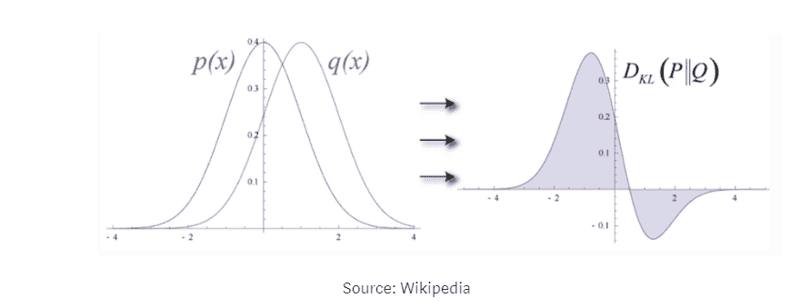
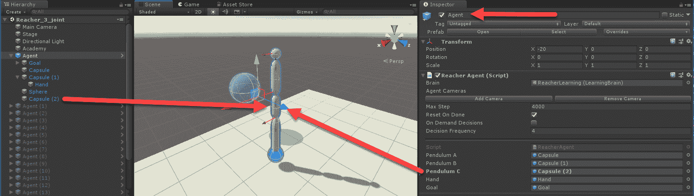
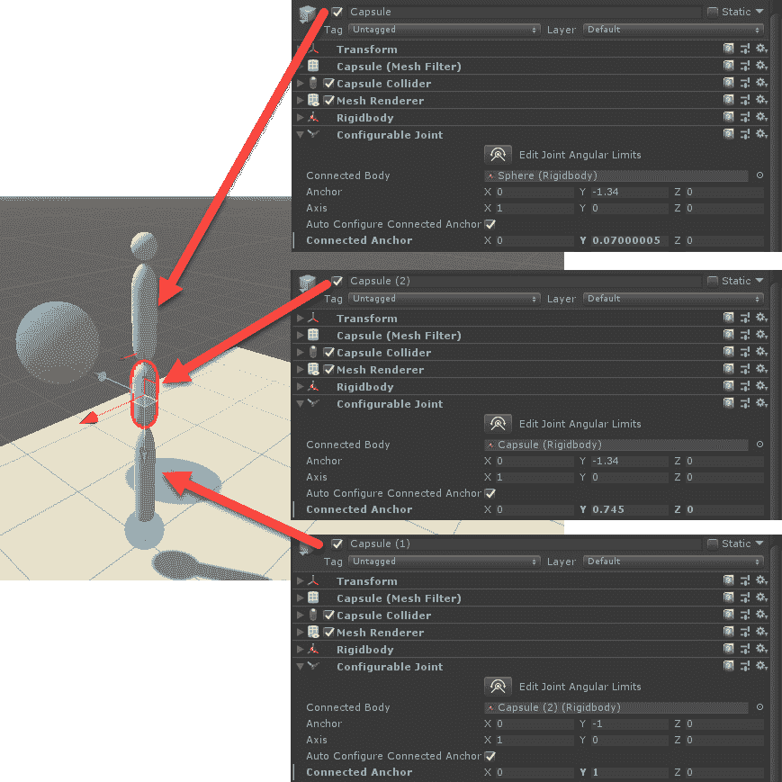
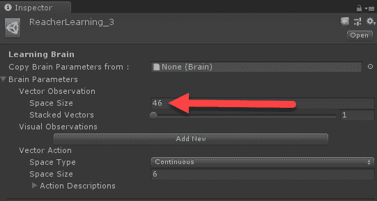

# 第八章：理解 PPO

我们避免深入探讨 **近端策略优化**（**PPO**）算法的更高级的内部工作原理，甚至避免讨论策略与模型的对比。如果你记得的话，PPO 是最早在 OpenAI 开发的 **简化级别**（**RL**）方法，支撑着 ML-Agents，并且是一种基于策略的算法。在本章中，我们将探讨基于策略和基于模型的强化学习算法之间的差异，以及 Unity 实现的更高级的内部工作原理。

以下是本章我们将覆盖的主要主题：

+   马拉松强化学习

+   部分可观察马尔可夫决策过程

+   Actor-Critic 和连续动作空间

+   理解 TRPO 和 PPO

+   使用超参数调优 PPO

本章内容属于高级内容，假设你已经学习过前几章和相关练习。为了本章的目的，我们还假设你能够在 Unity 中使用 ML-Agents 顺利打开并运行学习环境。

# 马拉松强化学习（RL）

到目前为止，我们的关注点一直在离散动作和情景化环境上，其中智能体通常学习解决谜题或完成某些任务。最典型的环境包括 GridWorld，以及当然的 Hallway/VisualHallway 示例，智能体在这些环境中离散地选择诸如上、左、下或右等动作，并且利用这些动作必须导航到某个目标。虽然这些是很好的环境，用来练习并学习强化学习的基本概念，但它们也可能是比较枯燥的学习环境，因为结果往往不是自动产生的，需要大量的探索。然而，在马拉松强化学习环境中，智能体始终通过控制反馈的奖励不断学习。事实上，这种形式的强化学习类似于机器人控制系统和仿真系统。由于这些环境充满了反馈奖励，因此当我们调整/调整超参数时，它们为我们提供了更好的即时反馈，这使得这些类型的环境非常适合我们的学习目的。

Unity 提供了几个马拉松强化学习（RL）环境示例，在撰写本文时，包含了 Crawler、Reacher、Walker 和 Humanoid 示例环境，但这些环境在未来可能会有所更改。

马拉松环境的构建方式不同，我们应该在深入之前了解这些差异。打开 Unity 编辑器和你选择的 Python 命令窗口，设置以运行 `mlagents-learn`，并完成以下练习：

1.  打开 `Assets/ML-Agents/Examples/Crawler/Scenes` 文件夹中的 `CrawlerDynamicTarget` 示例场景。这个示例展示了一个具有四个可移动肢体的智能体，每个肢体都有两个可以移动的关节。目标是让智能体朝着一个不断变化的动态目标移动。

1.  在层级窗口中选择 DynamicPlatform | Crawler 对象，并注意爬行者代理组件和 CrawlerDynamicLearning 脑部，如下所示。

    **截图：**



检查爬行者代理和脑部

1.  请注意，脑部的空间大小为 129 个向量观察和 20 个连续动作。一个连续动作返回一个值，确定关节可能旋转的程度，从而让智能体学习如何将这些关节动作协调成能够让它爬行到目标的动作。

1.  点击爬行者代理组件旁边的目标图标，在上下文菜单中选择**编辑脚本**。

1.  打开脚本后，向下滚动并寻找`CollectObservations`方法：

```py
public override void CollectObservations()
{
  jdController.GetCurrentJointForces();

  AddVectorObs(dirToTarget.normalized);
  AddVectorObs(body.transform.position.y);
  AddVectorObs(body.forward);
  AddVectorObs(body.up);
  foreach (var bodyPart in jdController.bodyPartsDict.Values)
  {
    CollectObservationBodyPart(bodyPart);
  }
}
```

1.  再次提醒，代码是用 C#编写的，但智能体感知的输入应该是相当直观的。我们首先看到智能体接收目标方向、向上和向前的方向，以及每个身体部位的观察作为输入。

1.  在场景中选择**Academy**，并确保**Brain**配置设置为**Control**（学习模式）。

1.  从你之前准备好的命令窗口或 Anaconda 窗口，按如下方式运行`mlagents-learn`脚本：

```py
mlagents-learn config/trainer_config.yaml --run-id=crawler --train
```

1.  训练开始后不久，你会看到智能体立即取得可度量的进展。

这个智能体能够非常快速地进行训练，并将在接下来的章节中极大地帮助我们测试对强化学习工作原理的理解。可以自由浏览和探索这个示例，但避免调整任何参数，因为我们将在下一部分开始做这件事。

# 部分可观察马尔可夫决策过程

在第五章《引入 DRL》中，我们了解到**马尔可夫决策过程**（**MDP**）用于定义智能体计算动作/价值所用的状态/模型。在 Q 学习的情况下，我们已经看到如何通过表格或网格来存储一个完整的 MDP，用于像 Frozen Pond 或 GridWorld 这样的环境。这些类型的强化学习是基于模型的，意味着它们完全建模环境中的每一个状态——例如，网格游戏中的每一个方格。然而，在大多数复杂的游戏和环境中，能够映射物理或视觉状态会变成一个部分可观察问题，或者我们可能称之为**部分可观察马尔可夫决策过程**（**POMDP**）。

POMDP 定义了一种过程，其中智能体永远无法完全看到其环境，而是学会基于派生的通用策略进行行动。这个过程在爬行者示例中得到了很好的展示，因为我们可以看到智能体只通过有限的信息——目标方向——来学习如何移动。下表概述了我们通常用于强化学习的马尔可夫模型定义：

|  | **否** | **是** |  |
| --- | --- | --- | --- |
| **所有状态可观察？** | **否** | 马尔可夫链 | MDP |
| **是** | 隐马尔可夫模型 | POMDP |

由于我们通过动作控制智能体的状态，因此我们研究的马尔可夫模型包括 MDP 和 POMDP。同样，这些过程也常常被称为开模型或关模型，如果一个强化学习算法完全了解状态，我们称之为基于模型的过程。相反，POMDP 则指的是关模型过程，或者我们所说的基于策略的方法。基于策略的算法提供了更好的泛化能力，并且能够在具有未知或无限可观察状态的环境中进行学习。部分可观察状态的示例包括走廊环境、视觉走廊环境，以及当然还有爬行者。

马尔可夫模型为机器学习的许多方面提供了基础，你可能会在更先进的深度学习方法中遇到它们的应用，这些方法被称为深度概率编程。深度 PPL，正如它所称，是变分推断和深度学习方法的结合。

无模型方法通常使用经验缓冲区来存储一组经验，这些经验将在以后用于学习通用策略。这个缓冲区由一些超参数定义，称为`time_horizon`、`batch_size`和`buffer_size`。以下是从 ML-Agents 文档中提取的这些参数的定义：

+   `time_horizon`：这对应于每个智能体在将经验添加到经验缓冲区之前收集的步数。当在一个回合结束之前达到了此限制时，将使用一个值估计来预测智能体当前状态的整体预期奖励。因此，该参数在较长时间跨度（较少偏差但较高方差的估计）和较短时间跨度（较大偏差但较少变化的估计）之间进行权衡。在回合内存在频繁奖励，或者回合过大时，较小的数字可能更为理想。这个数字应该足够大，以捕捉智能体动作序列中的所有重要行为：

    +   典型范围：32 – 2,048

+   `buffer_size`：这对应于在我们更新模型或进行任何学习之前，需要收集的经验数量（智能体的观察、动作和奖励）。它应该是`batch_size`的倍数。通常，较大的`buffer_size`参数对应于更稳定的训练更新。

    +   典型范围：2,048 – 409,600

+   `batch_size`：这是用于一次梯度下降更新的经验数量。它应该始终是`buffer_size`参数的一部分。如果你使用的是连续动作空间，那么这个值应该很大（通常在千级别）。如果你使用的是离散动作空间，那么这个值应该较小（通常在十级别）。

    +   典型范围（连续型）：512 – 5,120

    +   典型范围（离散型）：32 – 512

我们可以通过查看`CrawlerDynamicLearning`大脑配置来了解这些值是如何设置的，并通过修改它来观察它对训练的影响。打开编辑器并在正确配置的 Python 窗口中进入`CrawlerDynamicTarget`场景，按照以下步骤操作：

1.  打开位于`ML-Agents/ml-agents/config`文件夹中的`trainer_config.yaml`文件。

1.  向下滚动到`CrawlerDynamicLearning`大脑配置部分：

```py
CrawlerDynamicLearning:
  normalize: true
  num_epoch: 3
  time_horizon: 1000
 batch_size: 2024
 buffer_size: 20240
  gamma: 0.995
  max_steps: 1e6
  summary_freq: 3000
  num_layers: 3
  hidden_units: 512
```

1.  注意突出显示的行，显示了`time_horizon`、`batch_size`和`buffer_size`参数。如果你还记得我们早期的 Hallway/VisualHallway 示例，`time_horizon`参数仅为 32 或 64。由于这些示例使用了离散动作空间，我们可以为`time_horizon`设置一个较低的值。

1.  翻倍所有参数值，如以下代码片段所示：

```py
time_horizon: 2000
batch_size: 4048
buffer_size: 40480
```

1.  本质上，我们在这里做的是将智能体用于构建其周围环境策略的经验量翻倍。实际上，我们是在给智能体提供更多的经验快照来进行训练。

1.  按照之前的操作，运行智能体进行训练。

1.  让智能体训练的时间与运行之前的基础示例相同。这将为你提供一个良好的训练性能对比。

一件很明显的事情是，智能体训练的稳定性提高了，这意味着智能体的平均奖励将更加稳定地增长，且波动更小。回想一下，我们希望避免训练中的跳跃、尖峰或波动，因为这些可能表示网络优化方法的收敛性差。这意味着渐进的变化通常更好，并且表明训练表现良好。通过将`time_horizon`及相关参数翻倍，我们增加了智能体用于学习的经验量。反过来，这有助于稳定训练，但你可能会注意到，智能体需要更长的时间才能完成相同次数的迭代训练。

部分可观察的强化学习算法被归类为基于策略、无模型或离模型的算法，是 PPO 的基础。在接下来的章节中，我们将探讨强化学习中的改进，重点是更好地管理连续动作空间带来的额外复杂性。

# Actor-Critic 和连续动作空间

我们在查看马拉松强化学习或控制学习时引入的另一个复杂性是连续动作空间的引入。连续动作空间表示智能体可以采取的无限可能动作的集合。在之前，我们的智能体可能会选择一个离散动作，比如是或否，现在它必须从一个无限的动作空间中为每个关节选择一个点作为动作。将无限动作空间映射到一个具体动作并不容易解决——然而，我们有神经网络可供使用，这为我们提供了一个非常好的解决方案，采用的架构与我们在第三章中看到的*生成对抗网络*（*GAN*）类似。

正如我们在生成对抗网络（GAN）章节中发现的那样，我们可以提出一种由两个竞争网络组成的网络架构。这些竞争网络将迫使每个网络通过相互竞争，寻找最佳解决方案，将一个随机空间映射到一个可信的伪造物。类似的概念也可以应用于这种情况，这被称为**演员-评论家模型**。该模型的示意图如下：



演员-评论家架构

这里发生的事情是，**演员**根据给定的**状态**从策略中选择一个**动作**。然后**状态**首先通过一个**评论家**，评论家根据当前**状态**评估最佳的动作，并给出一定的**误差**。更简单地说，**评论家**根据当前**状态**批评每一个动作，然后**演员**根据**状态**选择最佳动作。

这种动作选择方法最早在一种叫做**对抗双 Q 网络**（**DDQN**）的算法中进行了探索。现在它已成为大多数高级强化学习算法的基础。

演员-评论家模型本质上是为了解决连续动作空间问题，但鉴于其性能，这种方法也已被融入到一些高级离散算法中。ML-Agents 使用演员-评论家模型处理连续空间，但不使用离散动作空间的演员-评论家模型。

使用演员-评论家方法需要，或者在我们的网络中最有效的是，额外的层和神经元，这是我们可以在 ML-Agents 中配置的内容。这些超参数的定义来自 ML-Agents 文档，具体如下：

+   `num_layers`：这对应于在观测输入之后，或者在视觉观测的 CNN 编码之后存在的隐藏层数量。对于简单的问题，较少的层可能会训练得更快、更高效。对于更复杂的控制问题，可能需要更多的层：

    +   典型范围：1 – 3

+   `hidden_units`：这些对应于神经网络中每个全连接层的单元数。对于那些正确动作是观测输入的简单组合的问题，这个值应该较小。对于那些动作是观测变量间复杂交互的问题，这个值应该更大：

    +   典型范围：32 – 512

让我们打开一个新的 ML-Agents 马拉松或控制示例，看看修改这些参数对训练的影响。按照这个练习来理解向控制问题中添加层和神经元（单元）的效果：

1.  打开`Assets/ML-Agents/Examples/Walker/Scenes`文件夹中的 Walker 场景。这个示例展示了一个行走的类人动画。

1.  在层次窗口中找到并选择 WalkerAgent 对象，然后查看检查器窗口并检查 Agent 和 Brain 设置，如下图所示：



WalkerAgent 和 WalkerLearning 属性

1.  在层级窗口中选择`WalkerAcademy`，并确保为`Brains`参数启用了 Control 选项。

1.  打开位于`ML-Agents/ml-agents/config`文件夹中的`trainer_config.yaml`文件，向下滚动至`WalkerLearning`部分，如下所示：

```py
WalkerLearning:
    normalize: true
    num_epoch: 3
    time_horizon: 1000
    batch_size: 2048
    buffer_size: 20480
    gamma: 0.995
    max_steps: 2e6
    summary_freq: 3000
    num_layers: 3
 hidden_units: 512
```

1.  注意这个示例使用了多少层和单位。是更多还是更少于我们为离散动作问题使用的数量？

1.  保存所有内容并为训练设置样本。

1.  从 Python 控制台启动训练会话，使用以下命令：

```py
mlagents-learn config/trainer_config.yaml --run-id=walker --train
```

1.  这个代理可能需要更长的训练时间，但请尝试等待大约 100,000 次迭代，以便更好地了解它的训练进度。

现在我们更好地理解了 Actor-Critic 及其在连续动作空间中的应用，我们可以继续探索改变网络大小对训练这些更复杂网络的影响，接下来会讲到这一部分。

# 扩展网络架构

Actor-Critic 架构增加了问题的复杂性，因此也增加了解决这些问题所需的网络的复杂性和规模。这与我们之前对 PilotNet 的分析没有太大区别，PilotNet 是 Nvidia 用于自驾的多层 CNN 架构。

我们想要看到的是，增加网络大小对复杂示例（如 Walker 示例）产生的即时效果。打开 Unity 中的`Walker`示例并完成以下练习：

1.  打开通常存放的`trainer_config.yaml`文件。

1.  修改`WalkerLearning`配置，如下所示的代码：

```py
WalkerLearning:
    normalize: true
    num_epoch: 3
    time_horizon: 1000
    batch_size: 2048
    buffer_size: 20480
    gamma: 0.995
    max_steps: 2e6
    summary_freq: 3000
    num_layers: 1
 hidden_units: 128
```

1.  设置`num_layers: 1`和`hidden_units: 128`。这些是我们在离散动作空间问题中常用的典型值。你可以通过查看另一个离散样本，如`VisualHallwayLearning`配置，来确认这一点，具体如下：

```py
VisualHallwayLearning:
    use_recurrent: false
    sequence_length: 64
    num_layers: 1
 hidden_units: 128
    memory_size: 256
    beta: 1.0e-2
    gamma: 0.99
    num_epoch: 3
    buffer_size: 1024
    batch_size: 64
    max_steps: 5.0e5
    summary_freq: 1000
    time_horizon: 64
```

1.  这个样本使用了我们刚才为连续动作问题设置的相同设置。

1.  编辑完成后，保存所有内容并准备开始训练。

1.  启动一个新的训练会话，并使用新的`run-id`参数。记住，每次运行时都更改`run-id`参数，这样在 TensorBoard 中更容易区分每次运行。

1.  和往常一样，让样本运行的时间与之前未经修改的运行时间相同，以便进行良好的比较。

你可能会立即注意到运行这个示例时，训练的稳定性非常好。第二个你可能会注意到的是，虽然训练稳定性增加了，但性能略微下降。请记住，较小的网络有更少的权重，通常会更稳定且训练速度更快。然而，在这个问题中，虽然网络的训练更稳定且速度更快，但你可能会注意到训练会遇到瓶颈。现在，受限于网络规模，智能体能够更快地优化较小的网络，但却没有以前看到的精细控制。事实上，这个智能体永远不会像第一次未修改的运行那样好，因为它现在受限于一个较小的网络。这是构建深度强化学习（DRL）智能体时需要平衡的另一个权衡点，尤其是在游戏和仿真中。

在下一部分，我们将进一步探讨我们所说的优势函数，或者像演员-评论家中使用的那些，并首先探索 TRPO，当然还有 PPO。

# 理解 TRPO 和 PPO

有许多变体的策略和无模型算法已经变得流行，用于解决强化学习（RL）问题，优化未来奖励的预测。正如我们所见，许多算法使用优势函数，例如演员-评论家（Actor-Critic），其中有两方试图收敛到最优解。在这种情况下，优势函数试图找到最大期望的折扣奖励。TRPO 和 PPO 通过使用一种叫做**最小化最大化（MM）**的优化方法来实现这一目标。下面的图表展示了 MM 算法如何解决这个问题：



使用 MM 算法

这个图表摘自 Jonathon Hui 的一系列博客，这些博客优雅地描述了 MM 算法，并且详细讲解了 TRPO 和 PPO 方法*。* 详细来源请见以下链接：[`medium.com/@jonathan_hui/rl-proximal-policy-optimization-ppo-explained-77f014ec3f12`](https://medium.com/@jonathan_hui/rl-proximal-policy-optimization-ppo-explained-77f014ec3f12)。

本质上，MM 算法通过交互式地最大化和最小化函数参数，直到达到收敛的解，从而找到最优配对函数。在图表中，红线表示我们希望逼近的函数，蓝线表示收敛的函数。你可以看到算法如何通过选择最小值/最大值来找到一个解的过程。

使用 MM 时我们遇到的问题是函数逼近有时会偏离，或者掉入一个谷底。为了更好地理解这个问题，我们可以将其视为使用直线爬升不平的山丘。以下是这种情况的示例：



尝试使用线性方法爬升山丘

你可以看到，仅仅使用线性路径来尝试穿越这条危险的山脊实际上是非常危险的。虽然危险可能不那么明显，但当使用线性方法来解决 MM 问题时，它仍然是一个大问题，就像你在陡峭的山脊上只使用直线固定路径进行徒步旅行一样。

TRPO 通过使用二次方法解决了使用线性方法的问题，并通过限制每次迭代可以采取的步骤数，形成一个信任区域。也就是说，算法确保每个位置都是正的且安全的。如果我们再次考虑我们的爬坡示例，我们可以将 TRPO 看作是设置一条路径或信任区域，如下图所示：


一条信任区域路径沿着山坡

在前面的照片中，路径仅作为示例展示，表示一组连接的圆圈或区域；真实的信任路径可能靠近实际的峰顶或山脊，也可能不靠近。不管怎样，这种方式的效果是使代理能够以更渐进和逐步的速度学习。通过 TRPO，信任区域的大小可以调整，使其变大或变小，以配合我们偏好的策略收敛。TRPO 的问题在于它相当复杂，因为它需要对一些复杂方程进行二次导数计算。

PPO 通过限制或裁剪两种策略之间的 Kulbach-Leibler（**KL**）散度来解决这个问题，KL 散度在每次迭代中进行测量。KL 散度衡量的是概率分布之间的差异，可以通过以下图示描述：



理解 KL 散度

在前面的图示中，**p(x)** 和 **q(x)** 各自代表不同的策略，其中 KL 散度被衡量。算法随后使用这种散度的度量来限制或裁剪每次迭代中可能发生的策略变化量。ML-Agents 使用两个超参数，允许你控制应用于目标或确定每次迭代中策略变化量的函数的裁剪量。以下是 Unity 文档中描述的 beta 和 epsilon 参数的定义：

+   **Beta**：这对应于熵正则化的强度，使策略变得*更加随机*。这确保了代理在训练过程中能正确地探索动作空间。增加这个值将确保采取更多的随机动作。应该调整此值，使得熵（可以从 TensorBoard 中衡量）随着奖励的增加而缓慢减少。如果熵下降得太快，请增加 beta。如果熵下降得太慢，请减少 beta：

+   典型范围：1e-4 – 1e-2

+   **Epsilon**：这对应于梯度下降更新过程中，旧策略和新策略之间可接受的散度阈值。将此值设置为较小将导致更稳定的更新，但也会减慢训练过程：

+   典型范围：0.1 – 0.3

需要记住的关键点是，这些参数控制了一个策略从一个迭代到下一个迭代的变化速度。如果你注意到一个智能体的训练表现有些不稳定，可能需要将这些参数调小。**epsilon**的默认值是**.2**，**beta**的默认值是**1.0e-2**，但是，当然，我们需要探索这些值如何影响训练，无论是正面还是负面的方式。在接下来的练习中，我们将修改这些策略变化参数，并观察它们在训练中的效果：

1.  对于这个示例，我们将打开`Assets/ML-Agents/Examples/Crawler/Scenes`文件夹中的`CrawlerDynamic`场景。

1.  打开位于`ML-Agents/ml-agents/config`文件夹中的`trainer_config.yaml`文件。由于我们已经评估了这个样本的表现，有几种方法可以将训练配置恢复，并对 beta 和 epsilon 参数进行一些修改。

1.  向下滚动到`CrawlerDynamicLearning`配置部分，并按照以下方式修改：

```py
CrawlerDynamicLearning:
    normalize: true
    num_epoch: 3
    time_horizon: 1000
    batch_size: 1024
    buffer_size: 20240
    gamma: 0.995
    max_steps: 1e6
    summary_freq: 3000
    num_layers: 3
    hidden_units: 512
    epsilon: .1
 beta: .1 
```

1.  我们将`epsilon`和`beta`参数修改为更高的值，这意味着训练将变得不那么稳定。然而，如果你还记得，这些马拉松示例通常会以更稳定的方式进行训练。

1.  打开一个配置正确的 Python 控制台，并运行以下命令以启动训练：

```py
mlagents-learn config/trainer_config.yaml --run-id=crawler_policy --train
```

1.  和往常一样，等待若干训练回合，以便从一个示例到下一个示例进行良好的比较。

你可能会发现意外的情况，那就是智能体似乎开始回退，实际上它确实在回退。这是因为我们将那些信任区间设置得太大（一个大的**beta**），而虽然我们允许变化速率较低（**epsilon**为.1），但是我们可以看到**beta**值对训练更为敏感。

请记住，Unity ML-Agents 实现使用了多个交叉特征，这些特征一起构成了一个强大的 RL 框架。在接下来的部分，我们将简要回顾 Unity 最近添加的一个优化参数。

# 泛化优势估计

RL 领域正在经历爆炸式增长，得益于不断推进的研究，推动了可能性的边界。每一次小的进展都会带来额外的超参数和小的调整，可以用来稳定和/或改善训练性能。Unity 最近添加了一个名为 lambda 的新参数，其定义来自文档，具体如下：

+   **lambda**：这对应于计算**广义优势估计**（**GAE**）时使用的 lambda 参数[`arxiv.org/abs/1506.02438`](https://arxiv.org/abs/1506.02438)。可以将其看作代理在计算更新后的价值估计时，依赖当前价值估计的程度。较低的值对应更多地依赖当前价值估计（这可能导致较高的偏差），较高的值则对应更多地依赖环境中实际收到的奖励（这可能导致较高的方差）。该参数提供了两者之间的折中，正确的值可以带来更稳定的训练过程：

    +   典型范围：0.9 – 0.95

GAE 论文描述了一个名为 lambda 的函数参数，可以用于调整奖励估计函数，并且最适用于控制或马拉松型强化学习任务。我们不会深入探讨细节，感兴趣的读者应该下载论文并自行查阅。然而，我们将探索改变此参数如何影响控制样本，如接下来的`Walker`场景练习：

1.  打开 Unity 编辑器，加载`Walker`示例场景。

1.  在层级结构中选择 Academy 对象，并确认场景仍然设置为训练/学习模式。如果是，你无需做其他操作。如果场景未设置为学习模式，你知道该怎么做。

1.  打开`trainer_config.yaml`文件，并按如下方式修改`WalkerLearning`：

```py
WalkerLearning:
    normalize: true
    num_epoch: 3
    time_horizon: 1000
    batch_size: 2048
    buffer_size: 20480
    gamma: 0.995
    max_steps: 2e6
    summary_freq: 3000
    num_layers: 3
    hidden_units: 512
    lambd: .99
```

1.  注意我们如何设置`lambda`参数，并确保`num_layers`和`hidden_units`被重置为原始值。论文中，作者描述了最优值在`.95`到`.99`之间，但这与 Unity 文档中的描述有所不同。

1.  编辑完成后保存文件。

1.  打开一个用于训练的 Python 控制台设置，并使用以下命令运行：

```py
mlagents-learn config/trainer_config.yaml --run-id=walker_lambd --train
```

1.  确保让样本运行的时间与之前一样，以便进行良好的比较。

经过大量训练后，你会注意到在这个示例中，代理的训练速度确实慢了大约 25%。这一结果告诉我们，通过增加 lambda，我们在要求代理更多地重视奖励。现在，这可能看起来有些反直觉，但在这个样本或这种类型的环境中，代理会收到持续的小的正向奖励。这导致每个奖励出现偏差，正如我们所见，这会扭曲训练并妨碍代理的进展。对于感兴趣的读者来说，尝试在 Hallway 环境中调整 lambda 参数可能会是一个有趣的练习，在该环境中代理只会收到一个正向的单次奖励。

强化学习优势函数有许多形式，并且它们的作用是解决许多与离线模型或策略驱动算法（如 PPO）相关的问题。在下一节中，我们将通过修改并创建一个新的样本控制/马拉松学习环境来结束本章内容。

# 学习调整 PPO

在这一部分，我们将学习如何调整一个修改过的/全新的控制学习环境。这将帮助我们深入了解 Unity 示例的内部工作原理，并向你展示如何稍后修改或创建新的示例。让我们首先打开 Unity 编辑器，开始进行以下练习：

1.  打开 `Reacher` 场景，将其设置为学习模式，并进行训练。你现在应该能轻松完成这一部分。让代理训练足够长的时间，以便像往常一样建立基准。

1.  从菜单中选择 `Assets/Import Package/Custom Package`。从下载的源代码中的 `Chapter08` 文件夹找到 `Chapter_8_Assets.unitypackage`。

1.  打开 `Assets/HoDLG/Scenes` 文件夹中的 `Reacher_3_joint` 场景。这是一个修改过的场景，我们将一起学习其构建过程。

1.  首先，注意只有一个 **Reacher** 臂部是活动的，但现在有三个关节，如下图所示：



检查 Agent 游戏对象

1.  注意现在这个手臂有三个部分，其中新的部分被称为 Capsule(2)，并标识为 Pendulum C。关节的顺序现在是错乱的，这意味着 Pendulum C 实际上是中间的摆，而不是底部的摆。

1.  选择每个 Capsule 对象，检查它们的配置和位置，如下图所示：



检查 Capsule 对象

1.  请务必注意每个 Capsule 的 Configurable Joint | Connected Body 对象。此属性设置对象将连接或铰接的物体。Configurable Joint 组件上还有许多其他属性，可以让你模拟这种关节交互的任何形式，甚至是生物学上的。例如，你可能希望使这个手臂的关节更具人类特征，只允许某些角度的运动。同样，如果你设计的是一个动作受限的机器人，那么也可以通过这个关节组件来模拟。

1.  在此阶段，我们可以设置并运行示例。打开并设置一个 Python 控制台或 Anaconda 窗口进行训练。

1.  运行示例进行训练并观察代理的进展。让代理运行足够多的迭代，以便将训练性能与基准进行比较。

在这个阶段，我们已经启动了示例，并准备开始调整新的参数以优化训练。然而，在这之前，我们将回顾一下为了使上一个示例可行所需的 C# 代码更改。下一部分将介绍 C# 代码更改，对于不感兴趣代码的开发者来说是可选的。如果你打算在 Unity 中构建自己的控制或马拉松环境，你将需要阅读下一部分。

# 控制项目所需的编码更改

正如我们之前提到的，这一部分是可选的，适用于那些对使用 Unity C#构建自己控制样本的细节感兴趣的人。未来可能不再需要任何编码更改来修改这些类型的样本，这也是该部分是可选的另一个原因。

完成以下练习，了解在 Reacher 控制示例中添加关节所需的编码更改：

1.  在层级窗口中选择 Agent 对象，然后在检查器窗口中注意到 Reacher Agent_3 组件。这是我们将要检查的修改后的脚本。

1.  点击 Reach Agent_3 组件旁边的目标图标，从上下文菜单中选择编辑脚本。

1.  这将会在你选择的 C#代码编辑器中打开`ReacherAgent_3.cs`脚本。

1.  在声明部分需要注意的第一件事是新增变量的添加，以下是以粗体显示的内容：

```py
public GameObject pendulumA;
public GameObject pendulumB;
public GameObject pendulumC;
public GameObject hand;
public GameObject goal;
private ReacherAcademy myAcademy;
float goalDegree;
private Rigidbody rbA;
private Rigidbody rbB;
private Rigidbody rbC;
private float goalSpeed;
private float goalSize;
```

1.  添加了两个新变量，`pendulumC`和`rbC`，用于保存新的关节 GameObject 和 RigidBody。现在，Unity 物理中的`Rigidbody`表示可以被物理引擎移动或操作的物体。

    Unity 正在对其物理引擎进行升级，这将改变这里的一些教学内容。当前版本的 ML-Agents 使用的是旧的物理系统，因此这个示例也将使用旧系统。

1.  接下来需要注意的重要事项是添加了额外的代理观察项，具体请参见以下`CollectObservations`方法：

```py
public override void CollectObservations()
    {
        AddVectorObs(pendulumA.transform.localPosition);
        AddVectorObs(pendulumA.transform.rotation);
        AddVectorObs(rbA.angularVelocity);
        AddVectorObs(rbA.velocity);

        AddVectorObs(pendulumB.transform.localPosition);
        AddVectorObs(pendulumB.transform.rotation);
        AddVectorObs(rbB.angularVelocity);
        AddVectorObs(rbB.velocity);

        AddVectorObs(pendulumC.transform.localPosition);
 AddVectorObs(pendulumC.transform.rotation);
 AddVectorObs(rbC.angularVelocity);
 AddVectorObs(rbC.velocity);

        AddVectorObs(goal.transform.localPosition);
        AddVectorObs(hand.transform.localPosition);

        AddVectorObs(goalSpeed);
  }
```

1.  粗体部分添加了新的观察项`pendulumC`和`rbC`，它们总共增加了 13 个向量。回顾一下，这意味着我们还需要将大脑的观察数从 33 个向量切换到 46 个向量，具体如下图所示：



检查更新的 ReacherLearning_3 大脑

1.  接下来，我们将查看`AgentAction`方法；这是 Python 训练器代码调用代理并告诉它进行什么动作的地方，代码如下：

```py
public override void AgentAction(float[] vectorAction, string textAction)
  {
        goalDegree += goalSpeed;
        UpdateGoalPosition();

        var torqueX = Mathf.Clamp(vectorAction[0], -1f, 1f) * 150f;
        var torqueZ = Mathf.Clamp(vectorAction[1], -1f, 1f) * 150f;
        rbA.AddTorque(new Vector3(torqueX, 0f, torqueZ));

        torqueX = Mathf.Clamp(vectorAction[2], -1f, 1f) * 150f;
        torqueZ = Mathf.Clamp(vectorAction[3], -1f, 1f) * 150f;
        rbB.AddTorque(new Vector3(torqueX, 0f, torqueZ));

        torqueX = Mathf.Clamp(vectorAction[3], -1f, 1f) * 150f;
 torqueZ = Mathf.Clamp(vectorAction[4], -1f, 1f) * 150f;
 rbC.AddTorque(new Vector3(torqueX, 0f, torqueZ));
    }
```

1.  在这种方法中，我们扩展了代码，允许代理以`rigidbody rbC`的形式移动新的关节。你注意到新的学习大脑也添加了更多的动作空间吗？

1.  最后，我们查看`AgentReset`方法，看看代理如何在新的肢体加入后重置自己，代码如下：

```py
public override void AgentReset()
    {
        pendulumA.transform.position = new Vector3(0f, -4f, 0f) + transform.position;
        pendulumA.transform.rotation = Quaternion.Euler(180f, 0f, 0f);
        rbA.velocity = Vector3.zero;
        rbA.angularVelocity = Vector3.zero;

        pendulumB.transform.position = new Vector3(0f, -10f, 0f) + transform.position;
        pendulumB.transform.rotation = Quaternion.Euler(180f, 0f, 0f);
        rbB.velocity = Vector3.zero;
        rbB.angularVelocity = Vector3.zero;

        pendulumC.transform.position = new Vector3(0f, -6f, 0f) + transform.position;
 pendulumC.transform.rotation = Quaternion.Euler(180f, 0f, 0f);
 rbC.velocity = Vector3.zero;
 rbC.angularVelocity = Vector3.zero;

        goalDegree = Random.Range(0, 360);
        UpdateGoalPosition();

        goalSize = myAcademy.goalSize;
        goalSpeed = Random.Range(-1f, 1f) * myAcademy.goalSpeed;

        goal.transform.localScale = new Vector3(goalSize, goalSize, goalSize);
    }
```

1.  这段代码的作用仅仅是将手臂的位置重置为初始位置并停止所有运动。

这涵盖了本示例所需的唯一代码更改。幸运的是，只有一个脚本需要修改。未来可能完全不需要再修改这些脚本了。在下一部分，我们将通过调整额外参数并引入另一种训练优化方法来进一步完善样本训练。

# 多重代理策略

在这一部分，我们将探讨如何通过引入多个智能体来训练相同的策略，从而改进基于策略或非模型方法（如 PPO）。你将在这一部分使用的示例练习完全由你决定，应该是你熟悉的和/或感兴趣的内容。为了我们的目的，我们将探索一个我们已 extensively 研究过的示例——Hallway/VisualHallway。如果你已经跟随本书的大多数练习，你应该完全有能力适应这个示例。不过，请注意，在本次练习中，我们希望使用一个已设置为使用多个智能体进行训练的示例。

之前，我们避免讨论多个智能体；我们避免探讨这个训练方面是因为它可能会让关于模型内与模型外方法的讨论更加复杂。现在，你已经理解了使用基于策略的方法的差异和原因，你可以更好地理解，由于我们的智能体使用的是基于策略的方法，我们可以同时训练多个智能体针对同一个策略。然而，这可能会对其他训练参数和配置产生影响，正如你可能已经想象的那样。

打开 Unity 编辑器，进入`Hallway`/`VisualHallway`示例场景，或者你选择的其他场景，并完成以下练习：

1.  打开一个 Python 或 Anaconda 控制台窗口，并准备开始训练。

1.  选择并启用 HallwayArea，选择区域（1）到（19），使它们变为激活状态并可在场景中查看。

1.  选择每个**HallwayArea**中的 Agent 对象，并确保**Hallway Agent** | **Brain**设置为 HallwayLearning，而不是 HallwayPlayer。这将启用所有额外的训练区域。

1.  根据你之前的经验，你可能会选择是否将示例修改回原始状态。回想一下，在早期的练习中，我们修改了 HallwayAgent 脚本，使它只扫描一个较小的角度范围。这可能还需要你调整脑参数。

1.  设置完场景后，保存它和项目。

1.  使用唯一的`run-id`运行场景并等待多个训练迭代。这个示例的训练速度可能会明显变慢，甚至加快，这取决于你的硬件配置。

现在我们已经为 Hallway 环境建立了一个新的基准线，我们可以确定修改一些超参数对离散动作样本的影响。我们将重新审视的两个参数是`num_epochs`（训练轮数）和`batch_size`（每个训练轮的经验数量），这些我们在之前的连续动作（控制）样本中也看过。在文档中，我们提到，在训练控制智能体时，更大的批处理大小更为理想。

在我们继续之前，打开`trainer_config.yaml`文件并检查如下的 HallwayLearning 配置部分：

```py
HallwayLearning:
    use_recurrent: true
    sequence_length: 64
    num_layers: 2
    hidden_units: 128
    memory_size: 256
    beta: 1.0e-2
    gamma: 0.99
    num_epoch: 3
    buffer_size: 1024
    batch_size: 128
    max_steps: 5.0e5
    summary_freq: 1000
    time_horizon: 64
```

在 Unity 文档中，专门提到只有在增加批量大小时才增加 epoch 数量，这是为了考虑额外的训练经验。我们了解到，控制示例通常从更大的批量大小中受益，因此需要更大的 epoch 数量。然而，我们还想确定的最后一件事是，在多个代理共同学习同一策略的离散动作示例中，修改`batch_size`和`num_epoch`参数的效果。

出于这个练习的目的，我们将只修改`batch_size`和`num_epoch`为如下值：

1.  更新你正在使用的`HallwayLearning`或大脑配置，使用以下参数：

```py
HallwayLearning:
    use_recurrent: true
    sequence_length: 64
    num_layers: 2
    hidden_units: 128
    memory_size: 256
    beta: 1.0e-2
    gamma: 0.99
    num_epoch: 10
    buffer_size: 1024
    batch_size: 1000
    max_steps: 5.0e5
    summary_freq: 1000
    time_horizon: 64
```

1.  我们将`num_epoch`设置为 10，`batch_size`设置为 1000。这些设置对于控制样本来说是典型的，正如我们之前看到的那样，但现在我们想要查看在多个代理训练相同策略的离散动作示例中的效果。

1.  为训练准备样本，并准备好 Python 控制台并打开。

1.  使用以下命令运行训练会话：

```py
mlagents-learn config/trainer_config.yaml --run-id=hallway_e10b1000 --train
```

1.  注意我们是如何使用帮助器前缀设置`run-id`来命名迭代的。我们使用`e10`来表示`num_epoch`参数被设置为`10`，`b1000`代表`batch_size`值为`1000`。这种命名方案很有帮助，也是我们在本书中将继续使用的方式。

在代理进行训练时，尝试回答以下问题：

+   代理的训练效果是否比你预期的更好或更差？

+   你认为这是为什么？

你需要运行样本来学习这些问题的答案。在接下来的部分中，我们将讨论一些有助于你理解这些复杂主题的练习。

# 练习

尝试自行完成以下一两个练习：

1.  运行 CrawlerStaticTarget 示例场景，并将其性能与动态示例进行比较。

1.  将另一个控制示例中的`time_horizon`、`batch_size`和`buffer_size`大脑超参数加倍：

```py
time_horizon: 2000
batch_size: 4048
buffer_size: 40480
```

1.  在另一个控制样本上执行相同的`time_horizon`、`batch_size`和`buffer_size`的修改，并观察它们的联合效果。

1.  修改`num_layers`和`hidden_units`大脑超参数为我们在控制样本中使用的值，并将其应用于离散动作示例，如 Hallway 示例，代码如下。它对训练有什么影响？

```py
num_layers: 3
hidden_units: 512
```

1.  修改另一个连续或离散动作示例中的`num_layers`和`hidden_units`超参数，并将其与其他参数修改结合使用。

1.  将离散动作示例中的`lambd`大脑超参数修改为`.99`。记住，这将加强奖励的效果：

```py
lambd: .99
```

1.  创建你自己的控制生物，带有关节和肢体。一个好的开始是使用爬行器示例并对其进行修改。

1.  通过添加新肢体或关节来修改其中一个控制样本。

1.  修改 Walker 控制示例，为代理添加武器和目标。你需要结合 Walker 和 Reacher 示例的元素。

1.  运行修改过`num_epoch`和`batch_size`参数的 VisualHallwayLearning 示例场景。结果如你所预期吗？

随着我们深入本书，这些练习可能会变得越来越繁琐，特别是在旧的、较慢的系统上运行时。然而，理解这些参数如何影响代理的训练是很重要的。

与深度学习和强化学习（RL）从业者交流时，他们常常将训练的微妙差别比作做饭的好与坏之间的区别。一个好的厨师可能能做出美味的菜肴，并提供一顿完全可以接受的饭菜，但只有伟大的厨师，凭借他们对细节的关注，才能做出一顿让你难以忘怀的杰出餐点。

# 总结

在这一章中，我们深入研究了强化学习（RL）的内部运作，通过理解基于模型和非基于模型和/或基于策略的算法之间的差异。正如我们所学，Unity ML-Agents 使用 PPO 算法，这是一种强大而灵活的策略学习模型，在训练控制任务时表现出色，有时这种任务被称为马拉松式强化学习。了解了更多基础知识后，我们跳入了其他形式的强化学习改进，例如 Actor-Critic（演员-评论家）或优势训练，并了解了 ML-Agents 所支持的选项。接下来，我们探讨了 PPO 的演变以及它的前身 TRPO 算法，了解了它们如何在基本层面上运作以及如何影响训练。在这一部分，我们学习了如何修改其中一个控制示例，创建 Reacher 手臂上的新关节。最后，我们通过调整超参数，探讨了如何改进多代理策略训练。

我们已经涵盖了强化学习（RL）的许多方面和细节，以及代理如何训练，但训练中最重要的部分——奖励，我们将留到下一章。在下一章中，我们将探讨奖励、奖励函数，以及奖励如何被模拟。
