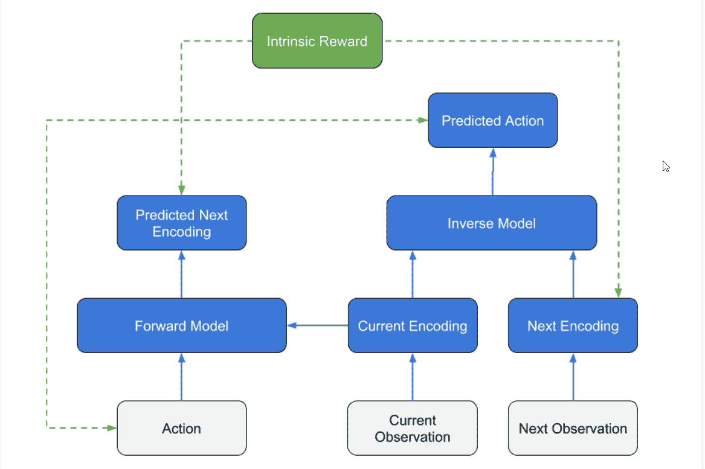

# 第九章：奖励和强化学习

奖励是强化学习的一个基本概念，且易于理解。毕竟，我们在一定程度上是通过奖励来训练和教导他人——比如训练狗或小孩。将奖励或`reward`函数实现到仿真中可能会有些困难，并且容易出现很多试错过程。这也是为什么我们要等到更后面、更高级的章节再讨论奖励、构建`reward`函数以及奖励辅助方法，如课程学习、反向播放、好奇心学习和模仿学习/行为克隆。

下面是本章将要讲解概念的简要总结：

+   奖励和`reward`函数

+   奖励的稀疏性

+   课程学习

+   理解反向播放

+   好奇心学习

虽然本章内容较为高级，但它也是至关重要的一章，不容错过。同样，许多顶级的强化学习示范，如 DeepMind 的 AlphaStar，都是利用本章中的高级算法来教导代理执行以前认为不可能完成的任务。

# 奖励和奖励函数

我们常常面对奖励学习或训练的先入为主的观念，即任务完成后会有奖励，可能是好的也可能是坏的。虽然这种基于奖励的强化学习概念对于单一动作的任务完全适用，比如之前提到的经典多臂赌博机问题，或是教狗做一个动作，但请记住，强化学习实际上是关于代理通过一系列动作预测未来奖励，进而学习动作的价值。在每个动作步骤中，当代理不再进行探索时，它会根据所感知到的最佳奖励来决定下一步的行动。并不是总能清楚地知道这些奖励应该在数值上表示什么，以及这一点有多重要。因此，通常需要绘制出一组简单的`reward`函数，描述我们希望代理训练的学习行为。

让我们打开 Unity 编辑器中的 GridWorld 示例，并学习如何创建一组`reward`函数和映射，描述该训练过程，如下所示：

1.  从 Assets | ML-Agents | Examples | GridWorld | Scenes 文件夹中打开`GridWorld`示例。

1.  在层级视图中选择 trueAgent 对象，然后将代理的脑部（Grid Agent | Brain）切换为 GridWorldLearning。

1.  选择 GridAcademy 并将 Grid Academy | Brains | Control 选项设置为启用。

1.  选择并禁用场景中的主摄像机。这样代理的摄像机将成为主要摄像机，且我们可以通过它来查看场景。

1.  打开并准备一个 Python 或 Anaconda 窗口用于训练。如果需要记起如何操作，请查看前几章或 Unity 文档。

1.  保存场景和项目。

1.  使用以下命令在 Python/Anaconda 窗口中启动示例进行训练：

```py
mlagents-learn config/trainer_config.yaml --run-id=gridworld --train
```

1.  你会很快感受到这个示例的训练速度。记住，代理训练如此快速的主要原因是状态空间非常小；在这个例子中是 5x5。以下截图展示了模拟运行的一个例子：


GridWorld 示例运行在 5x5 网格上

1.  运行示例直到完成。即使在较老的系统上运行，也不会花费太长时间。

注意，当代理学习将立方体放置到绿色+号上时，代理迅速从负奖励转变为正奖励。然而，你是否注意到代理从一个负的平均奖励开始训练？代理初始时的奖励值为零，所以让我们来看看负奖励是从哪里来的。在接下来的章节中，我们将通过查看代码来了解如何构建 `reward` 函数。

# 构建奖励函数

构建 `reward` 函数可以非常简单，像这个例子一样，或者非常复杂，正如你可能想象的那样。虽然在训练这些示例时这一步是可选的，但在你构建自己的环境时几乎是必需的。它还可以帮助你发现训练中的问题，以及提高或简化训练的方法。

打开 Unity 编辑器，并按照本练习构建这些示例 `reward` 函数：

1.  在层级窗口中选择 trueAgent 对象，然后点击网格代理组件旁边的目标图标。

1.  从联系菜单中选择编辑脚本。

1.  在脚本在编辑器中打开后，向下滚动到 `AgentAction` 方法，如下所示：

```py
public override void AgentAction(float[] vectorAction, string textAction)
{
  AddReward(-0.01f);
  int action = Mathf.FloorToInt(vectorAction[0]);

  ... // omitted for brevity

  Collider[] blockTest = Physics.OverlapBox(targetPos, new Vector3(0.3f, 0.3f, 0.3f));
  if (blockTest.Where(col => col.gameObject.CompareTag("wall")).ToArray().Length == 0)
  {
    transform.position = targetPos;
    if (blockTest.Where(col => col.gameObject.CompareTag("goal")).ToArray().Length == 1)
    {
      Done();
      SetReward(1f);
    }
    if (blockTest.Where(col => col.gameObject.CompareTag("pit")).ToArray().Length == 1)
    {
      Done();
      SetReward(-1f);
    }
  }
}
```

1.  我们要关注高亮显示的行，`AddReward` 和 `SetReward`：

    +   `AddReward(-.1f)`：这一行表示步骤奖励。代理每走一步都会受到负奖励。这也是我们看到代理展示负奖励，直到它找到正奖励的原因。

    +   `SetReward(1f)`：这是代理收到的最终正奖励，并且设置为最大值 `1`。在这类训练场景中，我们通常使用从 -1 到 +1 的奖励范围。

    +   `SetReward(-1f)`：这是死亡深渊奖励，也是最终的负奖励。

1.  使用之前的每个语句，我们可以将这些映射到 `reward` 函数，如下所示：

    +   `AddReward(-.1f)` = 

    +   `SetReward(1f)` = 

    +   `SetReward(-1f)` = 

1.  这里需要注意的一点是，`AddReward` 是增量奖励，而 `SetReward` 设置最终值。所以，代理只有通过达到最终目标才能看到正奖励。

通过映射这些`reward`函数，我们可以看到，代理要想学习到正奖励，唯一的办法就是找到目标。这就是为什么代理一开始会收到负奖励的原因，代理本质上是先学会避免浪费时间或行动，直到它随机遇到目标。从那时起，代理可以根据之前获得的正奖励快速给状态赋值。问题在于，代理首先需要遇到正奖励，然后我们才能开始实际的训练。我们将在下一节讨论这个问题。

# 奖励稀疏

我们称代理没有得到足够的正奖励，或者根本没有正奖励的情况为奖励稀疏。展示奖励稀疏如何发生的最简单方法是通过示例，幸运的是，GridWorld 示例能够轻松地为我们演示这一点。打开编辑器中的 GridWorld 示例，并按照本练习操作：

1.  打开上一个练习中我们离开的 GridWorld 示例场景。为了本次练习的目的，最好已经将原始示例训练完成。GridWorld 是一个紧凑的小示例，训练速度快，是测试基本概念甚至超参数的绝佳场所。

1.  选择 GridAcademy 并将 Grid Academy | Reset Parameters | gridSize 更改为`25`，如下图所示：


设置 GridAcademy 的 gridSize 参数

1.  保存场景和项目。

1.  从你的 Python/Anaconda 窗口使用以下命令启动示例进行训练：

```py
mlagents-learn config/trainer_config.yaml --run-id=grid25x25 --train
```

1.  这将启动示例，并且假设你仍然将 agentCam 作为主摄像机，你应该在游戏窗口中看到以下内容：


具有 25x25 网格大小的 GridWorld

1.  我们已经将游戏的空间从 5x5 的网格扩展到 25x25 的网格，使得代理随机找到目标（+）符号变得更加困难。

1.  你会很快注意到，在几轮训练后，代理在某些情况下的表现非常差，甚至报告的平均奖励小于-1。更糟糕的是，代理可能会继续这样训练很长时间。事实上，代理可能在 100、200、1,000 次甚至更多的迭代中都无法发现奖励。现在，这看起来像是状态的问题，从某种角度来看，你可能会这么认为。然而，记住，我们给代理的输入状态始终是相同的摄像机视图，84x84 像素的状态图像，我们并没有改变这一点。因此，在这个示例中，可以认为策略 RL 算法中的状态保持不变。因此，解决问题的最佳方法是增加奖励。

1.  在 Python/Anaconda 窗口中通过输入*Ctrl* + *C*停止训练示例。为了公平起见，我们将平等地增加目标和死亡的奖励数量。

1.  返回编辑器，选择 GridAcademy 并增加 Grid Academy | Reset Parameters 组件属性中的 numObstacles 和 numGoals，如下所示：


更新障碍物和目标的数量

1.  保存场景和项目。

1.  使用以下代码启动训练会话：

```py
mlagents-learn config/trainer_config.yaml --run-id=grid25x25x5 --train
```

1.  这表示我们正在用五倍数量的障碍物和目标运行示例。

1.  让智能体训练 25,000 次迭代，并观察性能的提高。让智能体训练直到完成，并将结果与我们的第一次训练进行比较。

奖励稀疏性问题通常更常见于离散动作任务中，例如 GridWorld/Hallway 等，因为`reward`函数通常是绝对的。在连续学习任务中，`reward`函数往往更为渐进，通常通过达到某个目标的进展来衡量，而不仅仅是目标本身。

通过增加障碍物和目标的数量——即负奖励和正奖励——我们能够更快速地训练智能体，尽管你可能会看到非常不稳定的训练周期，而且智能体的表现永远不会真正达到最初的水平。实际上，训练在某个点可能会发生偏离。造成这种情况的原因部分是由于其有限的视野，并且我们仅部分解决了稀疏奖励问题。当然，我们可以通过简单地增加目标和障碍物的数量来解决这个稀疏奖励问题。你可以返回并尝试将障碍物和奖励的数量设置为 25，看看能否得到更稳定的长期结果。

当然，在许多强化学习问题中，增加奖励的数量并不是一个选项，我们需要寻找更巧妙的方法，正如我们在下一节中将看到的那样。幸运的是，很多方法在非常短的时间内相继出现，旨在解决稀疏或困难奖励的问题。Unity 作为领先者，迅速采纳并实施了多种方法，其中我们将讨论的第一个方法叫做课程学习（Curriculum Learning），我们将在下一节中详细讨论。

# 课程学习

课程学习允许智能体通过逐步提升`reward`函数来逐步学习一个困难的任务。当奖励保持绝对时，智能体以更简单的方式找到或实现目标，从而学习到奖励的目的。然后，随着训练的进行和智能体的学习，获得奖励的难度增加，这反过来迫使智能体进行学习。

当然，Unity 有一些此类示例，我们将在接下来的练习中查看`WallJump`示例，了解如何设置一个课程学习样本：

1.  打开 WallJump 场景，路径为 Assets | ML-Agents | Examples | WallJump | Scenes 文件夹。

1.  在层次窗口中选择 Academy 对象。

1.  如下所示，点击 Wall Jump Academy | Brains | Control 参数中的两个控制选项：


设置多个大脑进行学习

1.  这个示例使用多个大脑来更好地按任务分离学习。实际上，所有大脑将同时进行训练。

1.  课程学习使用第二个配置文件来描述代理将经历的课程或学习步骤。

1.  打开`ML-Agents/ml-agents/config/curricul/wall-jump`文件夹。

1.  在文本编辑器中打开`SmallWallJumpLearning.json`文件。文件如下所示：

```py
      {
          "measure" : "progress",
          "thresholds" : [0.1, 0.3, 0.5],
          "min_lesson_length": 100,
          "signal_smoothing" : true, 
          "parameters" : 
          {
              "small_wall_height" : [1.5, 2.0, 2.5, 4.0]
          }
      }
```

1.  这个 JSON 文件定义了 SmallWallJumpLearning 大脑作为其课程或学习步骤的一部分所采取的配置。这些参数的定义在 Unity 文档中有详细说明，但我们将按照文档中的参数进行查看：

    +   `measure` *–* 衡量学习进展和课程进度的指标：

        +   reward – 使用衡量标准接收到的奖励。

        +   progress – 使用步骤与最大步骤数的比率。

    +   `thresholds`（浮动数组）– 衡量标准值的点，在这些点上课程应当提升。

    +   `min_lesson_length`（整数）*–* 在课程可以更改之前应完成的最小回合数。如果设置了奖励衡量标准，则将使用最近`min_lesson_length`回合的平均累积奖励来决定是否应更改课程。必须是非负数。

1.  通过阅读此文件我们可以看到，设定了三个课程，通过`progress`的`measure`来定义，`progress`由回合数来表示。回合边界定义为`.1`或 10%，`.3`或 30%，和`.5`或 50%总回合数。每个课程我们都通过边界定义参数，在这个例子中，参数是`small_wall_height`，第一个课程的边界是`1.5`到`2.0`，第二个课程的边界是`2.0`到`2.5`，第三个课程的边界是`2.5`到`4.0`。

1.  打开一个 Python/Anaconda 窗口并准备好进行训练。

1.  使用以下命令启动训练会话：

```py
mlagents-learn config/trainer_config.yaml --curriculum=config/curricula/wall-jump/ --run-id=wall-jump-curriculum --train
```

1.  高亮的额外部分将文件夹添加到辅助课程配置中。

1.  你需要等待至少一半的完整训练步骤才能看到所有三个训练阶段。

这个例子介绍了一种我们可以用来解决稀疏或难以获得奖励问题的技术。在接下来的部分中，我们将讨论一种专门的课程训练形式，叫做 Backplay。

# 理解 Backplay

2018 年末，Cinjon Resnick 发布了一篇创新论文，题为*Backplay:* *Man muss immer umkehren*，([`arxiv.org/abs/1807.06919`](https://arxiv.org/abs/1807.06919))，其中介绍了一种叫做 Backplay 的课程学习改进方法。基本前提是，训练时将代理从目标开始，然后逐步将其移回。这种方法可能并不适用于所有情况，但我们将使用这种方法结合课程训练，看看如何在以下练习中改进 VisualHallway 示例：

1.  从 Assets | ML-Agents | Examples | Hallway | Scenes 文件夹中打开 VisualHallway 场景。

1.  确保场景重置为默认的起始点。如果需要，可以再次从 ML-Agents 拉取源代码。

1.  使用 VisualHallwayLearning 大脑设置学习场景，并确保智能体仅使用默认的 84x84 视觉观察。

1.  选择 Academy 对象，在检查器窗口中添加一个新的 Hallway Academy | Reset Parameter，命名为`distance`，如下所示：


在 Academy 上设置新的重置参数

1.  你可以将重置参数用于不仅仅是课程学习，因为它们可以帮助你轻松配置编辑器中的训练参数。我们在这里定义的参数将设置智能体距离目标区域的距离。此示例旨在展示 Backplay 的概念，为了正确实现它，我们需要将智能体移动到目标的正前方——但我们暂时不进行这一操作。

1.  选择 VisualHallwayArea | Agent，并在你喜欢的代码编辑器中打开 Hallway Academy 脚本。

1.  向下滚动到`AgentReset`方法，并将顶部代码行调整为如下所示：

```py
public override void AgentReset()
{
  float agentOffset = academy.resetParameters["distance"];
  float blockOffset = 0f;
  // ... rest removed for brevity
```

1.  这一行代码将调整智能体的起始偏移量，以适应现在预设的 Academy 重置参数。同样，当 Academy 在训练过程中更新这些参数时，智能体也会看到更新的值。

1.  保存文件并返回编辑器。编辑器会重新编译你的代码更改，并告知你一切是否正常。如果控制台出现红色错误，通常意味着有编译错误，可能是由语法错误引起的。

1.  打开一个准备好的 Python/Anaconda 窗口，并运行以下命令来开始训练：

```py
mlagents-learn config/trainer_config.yaml --run-id=vh_backplay --train
```

1.  这将以常规模式运行会话，不使用课程学习，但它会将智能体的起始位置调整得更接近目标区域。让这个示例运行，并观察智能体在如此接近目标时的表现如何。

让训练运行一段时间，并观察与原始训练的区别。你会注意到的一点是，智能体现在不自觉地跑向奖励区域，这正是我们所期望的。接下来我们需要实现的是课程学习部分，即智能体在学习如何在下一部分找到奖励的过程中逐渐向后移动。

# 通过课程学习实现 Backplay

在上一节中，我们实现了 Backplay 的第一部分，即让智能体起始于目标附近或非常接近目标的位置。接下来我们需要完成的部分是使用课程学习（Curriculum Learning）将智能体逐步移回到它的预定起始点。请再次打开 Unity 编辑器并进入 VisualHallway 场景，按照以下步骤操作：

1.  使用文件浏览器或命令行打开`ML-Agents/ml-agents/config`文件夹。

1.  创建一个名为`hallway`的新文件夹并进入该文件夹。

1.  打开文本编辑器或在新目录下创建一个名为 `VisualHallwayLearning.json` 的新 JSON 文本文件。**JavaScript 对象表示法**（**JSON**）用于描述 JavaScript 中的对象，它也成为了一种配置设置的标准。

1.  在新文件中输入以下 JSON 文本：

```py
{
    "measure" : "rewards",
    "thresholds" : [0.1, 0.2, 0.3, 0.4, 0.5, 0.6, 0.7],
    "min_lesson_length": 100,
    "signal_smoothing" : true, 
    "parameters" : 
    {
        "distance" : [12, 8, 4, 2, -2, -4, -8, -12]
    }
```

1.  这个配置文件定义了我们将在 Backplay 上训练代理的课程。该文件定义了一个 `measure`，包括 `rewards` 和 `thresholds`，用于确定代理何时会晋级到下一个训练阶段。当奖励阈值达到最低 `100` 步长时，训练将进入下一个 `distance` 参数。注意，我们如何将距离参数定义为 `12`，表示距离目标较近，然后逐渐减少。当然，你也可以创建一个函数来映射不同的范围值，但这部分留给你自己完成。

1.  编辑完成后保存文件。

1.  从 Python/Anaconda 窗口启动训练会话，使用以下命令：

```py
mlagents-learn config/trainer_config.yaml --curriculum=config/curricula/hallway/ --run-id=hallway-curriculum --train
```

1.  训练开始后，注意 Python/Anaconda 窗口中课程如何被设置，如下图所示：


观看训练中课程参数的设置

1.  等待代理训练完成，看看它能在会话结束前完成多少个训练级别。

现在，我们需要澄清的一点是，这个示例更像是一个创新示例，而不是 Backplay 的真实示例。实际的 Backplay 是将代理放在目标位置，然后向后工作。在这个示例中，我们几乎将代理放置在目标位置并向后工作。这个差异是微妙的，但到现在为止，希望你能理解，从训练的角度来看，这可能是有意义的。

# 好奇心学习

到目前为止，我们只考虑了代理在环境中可能获得的外部奖励。例如，走廊示例当代理到达目标时会给出 +1 的外部奖励，而当它达到错误的目标时会给予 -1 的外部奖励。然而，像我们这样的真实动物其实可以基于内在动机进行学习，或者使用内在的 `reward` 函数。一个很好的例子是一个婴儿（猫、人类，或者其他任何东西），它通过玩耍有明显的自然动机去保持好奇心。玩耍的好奇心为婴儿提供了一个内在或固有的奖励，但实际上，这一行为本身会带来负面的外部奖励。毕竟，婴儿在消耗能量，这是一个负面的外部奖励，但它依然会继续玩耍，从而学习更多关于环境的一般信息。这反过来使它能够探索更多的环境，并最终达到一些非常困难的目标，比如打猎或上班。

这种内部或内在奖励建模属于强化学习（RL）的一类子类别，称为动机强化学习（Motivated Reinforcement Learning）。正如你可以想象的，这种学习模式在游戏中有着巨大的应用前景，从创建 NPC 到构建更具可信度的对手，这些对手实际上会受到某种性格特征或情绪的驱动。试想一下，拥有一个能生气甚至表现出同情心的电脑对手？当然，我们离这个目标还很远，但在此期间，Unity 已经添加了一个内在奖励系统，用于模拟智能体的好奇心，这就是所谓的好奇心学习。

**好奇心学习**（**CL**）最初由加利福尼亚大学伯克利分校的研究人员在一篇名为*由**自监督预测驱动的好奇心探索*的论文中提出，您可以在[`pathak22.github.io/noreward-rl/`](https://pathak22.github.io/noreward-rl/)中找到该论文。论文进一步描述了一个使用正向和反向神经网络解决稀疏奖励问题的系统。研究人员将该系统称为**内在好奇心模块**（**ICM**），旨在将其作为其他强化学习（RL）系统之上的一层或模块使用。这正是 Unity 所做的，他们将其作为模块添加到 ML-Agents 中。

Unity 的首席研究员 Arthur Juliani 博士在他们的实现上有一篇很棒的博客文章，您可以在[`blogs.unity3d.com/2018/06/26/solving-sparse-reward-tasks-with-curiosity/`](https://blogs.unity3d.com/2018/06/26/solving-sparse-reward-tasks-with-curiosity/)找到。

ICM 通过使用反向神经网络工作，该网络通过当前和下一个观察到的智能体状态进行训练。它使用编码器对两种状态之间的动作进行预测编码，当前状态和下一个状态。然后，正向网络在当前观察和动作的基础上进行训练，将其编码为下一个观察状态。接着，从反向和正向模型中分别计算实际和预测编码之间的差异。在这种情况下，差异越大，惊讶感越强，内在奖励也就越多。以下是从 Arthur Juliani 博士的博客中提取的图示，描述了这一过程如何工作：



好奇心学习模块的内部工作原理

该图表显示了两个模型和层的表示，分别是蓝色的正向和反向，蓝色线条表示网络流动，绿色框表示内在模型计算，而奖励输出则以绿色虚线的形式呈现。

好了，理论部分讲得差不多了，接下来是时候看看这个 CL 如何在实践中运作了。幸运的是，Unity 有一个非常完善的环境，展示了这个名为 Pyramids 的新模块。让我们打开 Unity 并按照接下来的练习查看这个环境的实际效果：

1.  打开 Assets | ML-Agents | Examples | Pyramids | Scenes 文件夹中的 Pyramid 场景。

1.  在层级视图窗口中选择 AreaPB(1)到 AreaPB(15)，然后在检查器窗口中禁用这些对象。

1.  离开玩家模式下的场景。第一次，我们希望你自己来体验这个场景并弄清楚目标。即使你已经阅读过博客或玩过这个场景，也请再试一次，不过这次需要思考应该设置哪些奖励函数。

1.  在编辑器中按下播放按钮，并开始以玩家模式玩游戏。如果你之前没有玩过游戏或者不了解前提，不要感到惊讶，如果你花了一段时间才能解开这个谜题。

对于那些没有提前阅读或玩过的同学，下面是前提。场景开始时，代理被随机放置在一个有多个房间的区域，里面有石质金字塔，其中一个有开关。代理的目标是激活开关，然后生成一个沙箱金字塔，上面放着一个大金盒子。开关在被激活后会从红色变为绿色。金字塔出现后，代理需要把金字塔推倒并取回金盒子。这并不是最复杂的谜题，但确实需要一些探索和好奇心。

假设我们尝试用一组`reward`函数来模拟这种好奇心或探索的需求。我们将需要一个用于激活按钮的`reward`函数，一个用于进入房间的函数，一个用于推倒积木的函数，当然还有一个用于获得金盒子的函数。然后我们需要确定每个目标的价值，或许可以使用某种形式的**逆向强化学习**（**IRL**）。然而，使用好奇心学习，我们可以只为获取盒子的最终目标创建奖励函数（+1），并可能设置一个小的负步长目标（.0001），然后利用内在的好奇心奖励让代理学习其余步骤。这个技巧相当巧妙，我们将在下一部分看到它是如何工作的。

# 好奇心内在模块正在运行

在我们理解金字塔任务的难度后，我们可以继续在接下来的练习中训练具有好奇心的代理：

1.  在编辑器中打开金字塔场景。

1.  在层次视图中选择 AreaRB | 代理对象。

1.  将金字塔代理 | 大脑切换为 PyramidsLearning 大脑。

1.  在层次视图中选择 Academy 对象。

1.  启用 Academy | Pyramid Academy | 大脑 | 控制属性中的控制选项，如下截图所示：


设置 Academy 为控制模式

1.  打开一个 Python 或 Anaconda 控制台，并为训练做准备。

1.  打开位于`ML-Agents/ml-agents/config`文件夹中的`trainer_config.yaml`文件。

1.  向下滚动到`PyramidsLearning`配置部分，如下所示：

```py
      PyramidsLearning:
          use_curiosity: true
          summary_freq: 2000
          curiosity_strength: 0.01
 curiosity_enc_size: 256
          time_horizon: 128
          batch_size: 128
          buffer_size: 2048
          hidden_units: 512
          num_layers: 2
          beta: 1.0e-2
          max_steps: 5.0e5
          num_epoch: 3
```

1.  这里有三个新的配置参数，已用粗体标出：

    +   `use_curiosity`：将其设置为`true`以使用该模块，但默认情况下通常为`false`。

    +   `curiosity_strength`：这是代理对好奇心内在奖励与外在奖励的重视程度。

    +   `curiosity_enc_size`：这是我们将网络压缩到的编码层的大小。如果你回想一下自编码器，你会发现 256 的大小相当大，但也要考虑你可能要编码的状态空间或观察空间的大小。

保持参数为已设置的值。

1.  使用以下命令启动训练会话：

```py
 mlagents-learn config/trainer_config.yaml --run-id=pyramids --train
```

虽然这次训练会话可能需要一些时间，但观察代理如何探索也许会很有趣。即使在当前的设置下，使用仅一个训练区域，你也许能够看到代理在几次迭代后解决这个难题。

由于 ICM 是一个模块，它可以快速激活到任何我们想要查看效果的其他示例中，这也是我们在下一部分将要做的。

# 在 Hallway/VisualHallway 上尝试 ICM

与我们训练的代理类似，我们通过试错学习得很好。这也是我们为何要不断练习那些非常困难的任务，比如跳舞、唱歌或演奏乐器。强化学习（RL）也不例外，要求从业者通过试验、错误和进一步探索的严峻考验中学习其中的技巧。因此，在接下来的练习中，我们将把 Backplay（课程学习）和好奇心学习结合在一起，应用到我们熟悉的 Hallway 场景中，看看它会带来什么效果，如下所示：

1.  打开 Hallway 或 VisualHallway 场景（你可以选择其一），如我们上次所留，启用了课程学习并设置为模拟 Backplay。

1.  打开`trainer_config.yaml`配置文件，位置在`ML-Agents/ml-agents/config`文件夹中。

1.  向下滚动至`HallwayLearning`或`VisualHallwayLearning`脑网络配置参数，并添加以下附加配置行：

```py
HallwayLearning:
    use_curiosity: true
 curiosity_strength: 0.01
 curiosity_enc_size: 256
    use_recurrent: true
    sequence_length: 64
    num_layers: 2
    hidden_units: 128
    memory_size: 256
    beta: 1.0e-2
    gamma: 0.99
    num_epoch: 10
    buffer_size: 1024
    batch_size: 1000
    max_steps: 5.0e5
    summary_freq: 1000
    time_horizon: 64
```

1.  这将启用本示例的好奇心模块。我们使用与上一个金字塔示例相同的好奇心设置。

1.  确保这个示例已为我们在该部分中配置的课程 Backplay 做好准备。如果需要，回去复习那部分内容，并在继续之前将其能力添加到此示例中。

这可能需要你创建一个新的课程文件，使用与我们之前相同的参数。记住，课程文件需要与其所使用的脑网络名称相同。

1.  打开一个准备好进行训练的 Python/Anaconda 窗口，并使用以下命令开始训练：

```py
mlagents-learn config/trainer_config.yaml --curriculum=config/curricula/hallway/ --run-id=hallway_bp_cl --train
```

1.  让训练运行直到完成，因为结果可能会很有趣，并展示叠加学习增强对外部和内部奖励的一些强大可能性。

这个练习展示了如何通过课程学习模拟 Backplay 以及好奇心学习为学习过程添加代理动机来运行一个代理。正如你可以想象的那样，内在奖励学习和整个动机强化学习领域可能会对我们的深度强化学习（DRL）带来一些有趣的进展和改进。

在下一节中，我们将回顾一些有助于你学习这些概念的练习。

# 练习

虽然你阅读本书的动机可能各不相同，但希望到目前为止你已经能够意识到亲自实践的价值。正如以往，我们呈现这些练习供你享受与学习，并希望你在完成它们时玩得开心：

1.  选择另一个使用离散动作的示例场景，并编写相应的奖励函数。是的，这意味着你需要打开代码并查看它。

1.  选择一个连续动作场景，并尝试为其编写奖励函数。虽然这可能有点困难，但如果你想要构建自己的控制训练智能体，这是必不可少的。

1.  在我们探索的另一个离散动作示例中添加课程学习。决定如何将训练分解成不同的难度等级，并创建控制训练进程的参数。

1.  在一个连续动作示例中添加课程学习。这更具挑战性，你可能希望先完成第二个练习。

1.  在 Hallway 环境中实际实现 Backplay，通过将智能体从目标位置开始，并在智能体训练过程中，使用课程学习将其移动回期望的起始位置。

1.  在另一个离散动作示例中实现 Backplay，并查看它对训练的影响。

1.  在 VisualPyramids 示例中实施好奇心学习，并注意训练中的差异。

1.  在一个连续动作示例中实施好奇心学习，并观察它对训练的效果。这是你预期的吗？

1.  禁用 Pyramids 示例中的好奇心学习，观察这对智能体训练的影响。

1.  想一想，如何将 Backplay 添加到 VisualPyramids 示例中。如果你真的实现了它，你将获得额外的积分。

如你所见，随着我们逐步深入本书，练习的难度也在增加。记住，即使只完成一两个练习，也会对你所掌握的知识产生重要影响。

# 摘要

在这一章，我们探讨了强化学习（RL）中的一个基础组成部分，那就是奖励。我们了解到，在构建训练环境时，最好定义一套`奖励`函数，让智能体遵循这些规则。通过理解这些方程式，我们能够更好地理解频繁或稀疏的奖励如何对训练产生负面影响。接着，我们介绍了几种方法，其中第一种叫做课程学习（Curriculum Learning），可以用来缓解或逐步推进智能体的外部奖励。之后，我们探讨了另一种技术，叫做反向播放（Backplay），它使用反向播放技术和课程训练来增强智能体的训练。最后，我们介绍了内在奖励或内在强化学习的概念。我们还了解到，最初开发的内在奖励系统是为了赋予智能体好奇心的动机。我们查看了如何在一些例子中应用好奇心学习，并通过课程学习将其与反向播放结合使用。

在下一章，我们将探索更多奖励辅助解决方案，形式为模仿学习和迁移学习，在这一章中，我们将学习如何将人类的游戏体验映射到一种叫做模仿学习或行为克隆的学习形式。
