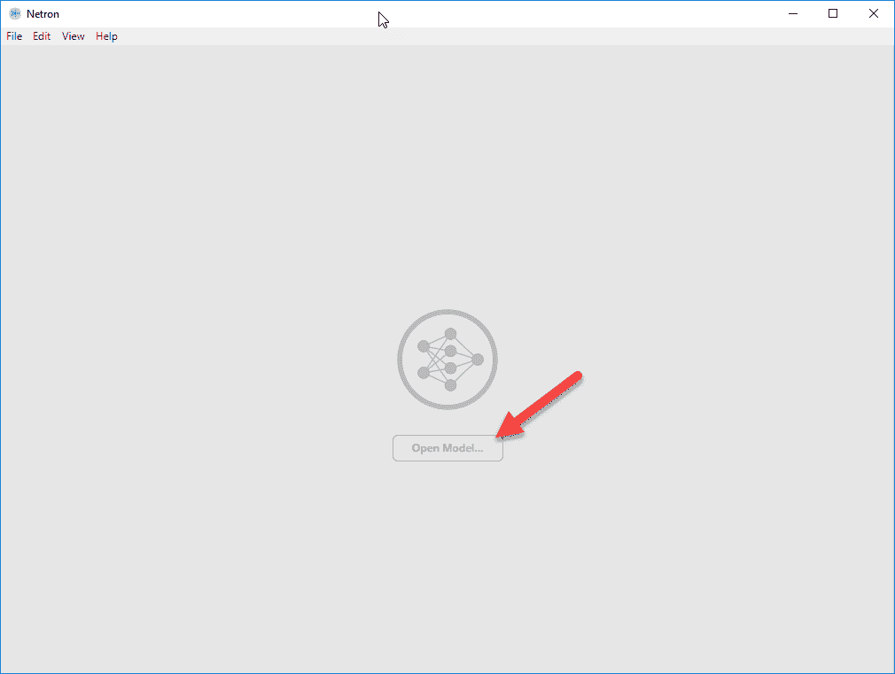

# 第十章：模仿与迁移学习

在本文撰写时，一种名为 AlphaStar 的新 AI，**深度强化学习**（**DRL**）代理，使用**模仿学习**（**IL**）在实时战略游戏《星际争霸 II》中以五比零击败了人类对手。AlphaStar 是 David Silver 和 Google DeepMind 为建立更智能、更强大 AI 的工作的延续。AlphaStar 使用的具体技术可以写成一本书，而 IL 和模仿人类游戏的学习方法如今受到高度关注。幸运的是，Unity 已经在离线和在线训练场景的形式中实现了 IL。尽管我们在这一章中不会达到 AlphaStar 的水平，但我们仍将了解 IL 和其他形式的迁移学习的基础技术。

在这一章中，我们将研究 ML-Agents 中 IL 的实现，然后探讨其他迁移学习的应用。我们将在本章中涵盖以下内容：

+   IL 或行为克隆

+   在线训练

+   离线训练

+   迁移学习

+   模仿迁移学习

尽管 AlphaStar 在一场实时战略游戏中对人类职业玩家取得了惊人的战术胜利，但它仍然因所使用的游戏方式和动作类型而受到审视。许多玩家表示，AI 的战术能力显然优于人类，但整体的战略规划则非常糟糕。看看 Google DeepMind 如何应对这一批评应该会很有趣。

这将是一个令人兴奋的章节，并将为你的未来开发提供大量的训练可能性，一切从下一节开始。

# IL 或行为克隆

IL 或行为克隆是通过从人类或可能是另一种 AI 捕捉观察和动作，并将其作为输入用于训练代理的过程。代理本质上由人类引导，并通过他们的动作和观察进行学习。一组学习观察可以通过实时游戏（在线）接收，或者从已保存的游戏中提取（离线）。这提供了捕捉多个代理的游戏并同时或单独训练它们的能力。IL 提供了训练代理的能力，或者实际上是为你可能无法通过常规 RL 训练的任务编程代理，正因如此，它很可能成为我们在不久的将来用于大多数任务的关键 RL 技术。

很难评估某个东西给你带来的价值，直到你看到没有它的情况。考虑到这一点，我们首先将通过一个没有使用 IL，但显然可以受益于 IL 的例子开始。打开 Unity 编辑器并按照以下步骤进行练习：

1.  打开位于 Assets | ML-Agents | Examples | Tennis | Scenes 文件夹中的 Tennis 场景。

1.  选择并禁用额外的代理训练区域，TennisArea(1) 到 TennisArea(17)。

1.  选择 AgentA，并确保 Tennis Agent | Brain 设置为 TennisLearning。我们希望每个代理在这个例子中互相对抗。

1.  选择 AgentB 并确保 Tennis Agent | Brain 设置为 TennisLearning。

    在这个示例中，短时间内我们正在同一环境中训练多个代理。我们将在第十一章《构建多代理环境》中讨论更多代理与其他代理进行学习的场景。

1.  选择 Academy 并确保 Tennis Academy | Brains 设置为 TennisLearning，并且控制选项已启用，如下图所示：


在 Academy 上将控制设置为启用

1.  打开 Python/Anaconda 窗口并为训练做准备。我们将通过以下命令启动训练：

```py
mlagents-learn config/trainer_config.yaml --run-id=tennis --train
```

1.  观看训练过程几千次，足以让你确信代理不会轻易学会这个任务。当你确信之后，停止训练并继续进行。

仅通过查看这个第一个示例，你就可以发现普通训练以及我们所讨论的其他高级方法，如课程学习和好奇心学习，都会很难实现，而且在这种情况下可能会适得其反。在接下来的部分中，我们将展示如何在在线训练模式下使用 IL 运行这个示例。

# 在线训练

在线模仿学习是指你教代理实时学习一个玩家或另一个代理的观察。它也是训练代理或机器人最有趣且吸引人的方式之一。接下来，我们将跳入并为在线模仿学习设置网球环境：

1.  选择 TennisArea | AgentA 对象，并将 Tennis Agent | Brain 设置为 TennisPlayer。在这个 IL 场景中，我们有一个大脑作为教师，即玩家，另一个大脑作为学生，即学习者。

1.  选择 AgentB 对象并确保 Tennis Agent | Brain 设置为 TennisLearning。这将是学生大脑。

1.  打开`ML-Agents/ml-agents/config`文件夹中的`online_bc_config.yaml`文件。IL 使用的配置与 PPO 不同，因此这些参数的名称可能相似，但可能不会像你所习惯的那样响应。

1.  在文件中向下滚动，找到**`TennisLearning`**大脑配置，如以下代码片段所示：

```py
 TennisLearning:
    trainer: online_bc
    max_steps: 10000
    summary_freq: 1000
    brain_to_imitate: TennisPlayer
    batch_size: 16
    batches_per_epoch: 5
    num_layers: 4
    hidden_units: 64
    use_recurrent: false
    sequence_length: 16
```

1.  仔细查看超参数，我们可以看到有两个新的参数需要关注。以下是这些参数的总结：

    +   `trainer`: `online_` *或* `offline_bc`—使用在线或离线行为克隆。在这种情况下，我们正在进行在线训练。

    +   `brain_to_imitate`: `TennisPlayer`—这设置了学习大脑应尝试模仿的目标大脑。

        *此时我们不会对文件进行任何更改。*

1.  打开你准备好的 Python/Anaconda 窗口，并通过以下命令启动训练：

```py
mlagents-learn config/online_bc_config.yaml --run-id=tennis_il --train --slow
```

1.  在编辑器中按下播放按钮后，你将能够用`W`、`A`、`S`、`D`键控制左边的挡板。玩游戏时，你可能会惊讶于代理学习的速度，它可能变得相当优秀。以下是游戏进行中的一个示例：


使用 IL 进行代理的播放和教学

1.  如果愿意，继续玩完示例。也可以有趣的是在游戏过程中切换玩家，甚至训练大脑并使用训练好的模型进行后续对战。你记得怎么运行训练好的模型吗？

在完成上一个练习的过程中，您可能会想，为什么我们不以这种方式训练所有的 RL 代理。这是一个很好的问题，但正如您可以想象的那样，这取决于情况。虽然 IL 非常强大，且是一个相当能干的学习者，但它并不总是会按预期工作。而且，IL 代理仅会学习它所看到的搜索空间（观察），并且只会停留在这些限制内。以 AlphaStar 为例，IL 是训练的主要输入，但团队也提到，AI 确实有很多时间进行自我对战，这可能是它许多获胜策略的来源。所以，虽然 IL 很酷且强大，但它并不是解决所有 RL 问题的“金蛋”。然而，在完成本练习后，您很可能会对 RL，尤其是 IL，产生新的更深的理解。在下一部分，我们将探索使用离线 IL。

# 离线训练

离线训练是通过玩家或代理在游戏中进行游戏或执行任务时生成的录制游戏文件，然后将其作为训练观察反馈给代理，帮助代理进行后续学习。虽然在线学习当然更有趣，在某些方面更适用于网球场景或其他多人游戏，但它不太实际。毕竟，通常您需要让代理实时玩好几个小时，代理才会变得优秀。同样，在在线训练场景中，您通常只能进行单代理训练，而在离线训练中，可以将演示播放提供给多个代理，以实现更好的整体学习。这还允许我们执行有趣的训练场景，类似于 AlphaStar 的训练，我们可以教一个代理，让它去教其他代理。

我们将在第十一章中深入学习多代理游戏玩法，*构建多代理环境*。

在接下来的练习中，我们将重新访问我们老朋友“Hallway/VisualHallway”示例。再次这么做是为了将我们的结果与之前使用该环境运行的示例练习进行比较。请按照本练习的步骤设置一个新的离线训练会话：

1.  克隆并下载 ML-Agents 代码到一个新的文件夹，可能选择`ml-agents_b`、`ml-agents_c`或其他名称。这样做的原因是为了确保我们在干净的环境中运行这些新练习。此外，有时返回到旧环境并回忆可能忘记更新的设置或配置也能有所帮助。

1.  启动 Unity 并打开**UnitySDK**项目以及 Hallway 或 VisualHallway 场景，您可以选择其中之一。

1.  场景应设置为以播放器模式运行。只需确认这一点。如果需要更改，请进行更改。

1.  如果场景中有其他活动的代理训练环境，请禁用它们。

1.  在层级视图中选择 HallwayArea | Agent。

1.  点击 Inspector 窗口底部的 Add Component 按钮，输入`demo`，并选择演示录制组件，如下图所示：


添加演示录制器

1.  如前面的截图所示，点击新建的演示录制组件上的“Record”按钮，确保检查所有选项。同时，填写录制的“演示名称”属性，如图所示。

1.  保存场景和项目。

1.  按下 Play 按钮并播放场景一段时间，至少几分钟，可能不到几个小时。当然，你的游戏表现也会决定代理的学习效果。如果你玩的不好，代理也会学得差。

1.  当你认为足够的时间已经过去，并且你已经尽力完成了游戏后，停止游戏。

在游戏播放结束后，你应该会看到一个名为 Demonstrations 的新文件夹，在项目窗口的 Assets 根文件夹中创建。文件夹内将包含你的演示录制。这就是我们在下一部分将喂入代理的数据。

# 设置训练环境

现在我们已经有了演示录制，可以继续进行训练部分。然而，这一次，我们将把观察文件回放给多个代理，在多个环境中进行训练。打开 Hallway/VisualHallway 示例场景，并按照以下练习设置训练：

1.  选择并启用所有 HallwayArea 训练环境，HallwayArea(1)到 HallwayArea(15)。

1.  在层级视图中选择 HallwayArea | Agent，然后将 Hallway Agent | Brain 切换为 HallwayLearning，如下图所示：


设置代理组件

1.  同时，选择并禁用演示录制组件，如前面的屏幕截图所示。

1.  确保场景中的所有代理都使用 HallwayLearning 大脑。

1.  在层级视图中选择 Academy，然后启用 Hallway Academy | Brains | Control 选项，如下图所示：


启用 Academy 控制大脑

1.  保存场景和项目

现在，我们已经为代理学习配置了场景，可以进入下一部分，开始喂入代理数据。

# 喂入代理数据

在执行在线 IL 时，我们每次只给一个代理喂入数据，场景是网球场。然而，这次我们将从同一个演示录制中训练多个代理，以提高训练效果。

我们已经为训练做好了准备，现在开始在接下来的练习中喂入代理数据：

1.  打开一个 Python/Anaconda 窗口，并从新的`ML-Agents`文件夹中设置训练环境。你已经重新克隆了源代码，对吧？

1.  从`ML-Agents/ml-agents_b/config`文件夹中打开`offline_bc_config.yaml`文件。文件内容如下，供参考：

```py
default:
    trainer: offline_bc
    batch_size: 64
    summary_freq: 1000
    max_steps: 5.0e4
    batches_per_epoch: 10
    use_recurrent: false
    hidden_units: 128
    learning_rate: 3.0e-4
    num_layers: 2
    sequence_length: 32
    memory_size: 256
    demo_path: ./UnitySDK/Assets/Demonstrations/<Your_Demo_File>.demo

HallwayLearning:
    trainer: offline_bc
    max_steps: 5.0e5
    num_epoch: 5
    batch_size: 64
    batches_per_epoch: 5
    num_layers: 2
    hidden_units: 128
    sequence_length: 16
    use_recurrent: true
    memory_size: 256
    sequence_length: 32
    demo_path: ./UnitySDK/Assets/Demonstrations/demo.demo
```

1.  将`HallwayLearning`或`VisualHallwayLearning`大脑的最后一行更改为以下内容：

```py
HallwayLearning:
    trainer: offline_bc
    max_steps: 5.0e5
    num_epoch: 5
    batch_size: 64
    batches_per_epoch: 5
    num_layers: 2
    hidden_units: 128
    sequence_length: 16
    use_recurrent: true
    memory_size: 256
    sequence_length: 32
    demo_path: ./UnitySDK/Assets/Demonstrations/AgentRecording.demo
```

1.  请注意，如果你使用的是`VisualHallwayLearning`大脑，你还需要在前面的配置脚本中更改相应的名称。

1.  完成编辑后，保存你的更改。

1.  返回你的 Python/Anaconda 窗口，使用以下命令启动训练：

```py
mlagents-learn config/offline_bc_config.yaml --run-id=hallway_il --train
```

1.  当提示时，在编辑器中按下 Play 并观看训练过程。你会看到代理使用与自己非常相似的动作进行游戏，如果你玩的不错，代理将很快开始学习，你应该会看到一些令人印象深刻的训练成果，这一切都得益于模仿学习。

强化学习可以被看作是一种蛮力学习方法，而模仿学习和通过观察训练的改进无疑将主导未来的代理训练。当然，难道这真的是令人惊讶的事情吗？毕竟，我们这些简单的人类就是这样学习的。

在下一部分，我们将探讨深度学习的另一个令人兴奋的领域——迁移学习，以及它如何应用于游戏和深度强化学习（DRL）。

# 迁移学习

模仿学习，按定义属于**迁移学习**（**TL**）的一种类型。我们可以将迁移学习定义为一个代理或深度学习网络通过将经验从一个任务转移到另一个任务来进行训练的过程。这可以像我们刚才进行的观察训练那样简单，或者像在代理的大脑中交换层/层权重，或者仅仅在一个相似的任务上训练代理那样复杂。

在迁移学习中，我们需要确保我们使用的经验或先前的权重是可以泛化的。通过本书的基础章节（第 1-3 章），我们学习了使用诸如 Dropout 和批量归一化等技术进行泛化的价值。我们了解到，这些技术对于更通用的训练非常重要；这种训练方式使得代理/网络能够更好地推理测试数据。这与我们使用一个在某个任务上训练的代理去学习另一个任务是一样的。一个更通用的代理，实际上比一个专门化的代理更容易转移知识，甚至可能完全不同。

我们可以通过一个快速的示例来演示这一点，开始训练以下简单的练习：

1.  在 Unity 编辑器中打开 VisualHallway 场景。

1.  禁用任何额外的训练区域。

1.  确认 Academy 控制大脑。

1.  从 Hallway/Brains 文件夹中选择 VisualHallwayLearning 大脑，并将 Vector Action | Branches Size | Branch 0 Size 设置为`7`，如下面的截图所示：


增加代理的向量动作空间

1.  我们增加了大脑的动作空间，使其与我们的迁移学习环境所需的动作空间兼容，稍后我们会详细介绍。

1.  保存场景和项目。

1.  打开一个准备好的 Python/Anaconda 窗口以进行训练。

1.  使用以下代码启动训练会话：

```py
mlagents-learn config/trainer_config.yaml --run-id=vishall --train  --save-freq=10000
```

1.  在这里，我们引入了一个新的参数，用于控制模型检查点创建的频率。目前，默认值设置为 50,000，但我们不想等这么久。

1.  在编辑器中运行代理进行训练，至少保存一个模型检查点，如下图所示：


ML-Agents 训练器正在创建一个检查点。

1.  检查点是一种获取大脑快照并将其保存以供后用的方法。这允许你返回并继续从上次停止的地方进行训练。

1.  让代理训练到一个检查点，然后通过按*Ctrl* + `C`（在 Python/Anaconda 窗口中）或在 Mac 上按*command* + `C`来终止训练。

当你终止训练后，是时候在下一个部分尝试将这个已保存的大脑应用到另一个学习环境中了。

# 转移大脑。

我们现在想将刚刚训练过的大脑带入一个新的、但相似的环境中重新使用。由于我们的代理使用视觉观察，这使得任务变得更简单，但你也可以尝试用其他代理执行这个示例。

让我们打开 Unity，进入 VisualPushBlock 示例场景并按照这个练习操作：

1.  选择 Academy 并启用它来控制大脑。

1.  选择代理并设置它使用 VisualPushBlockLearning 大脑。你还应该确认这个大脑的配置与我们刚才运行的 VisualHallwayLearning 大脑相同，即视觉观察和向量动作空间相匹配。

1.  在文件资源管理器或其他文件浏览器中打开`ML-Agents/ml-agents_b/models/vishall-0`文件夹。

1.  将文件和文件夹的名称从`VisualHallwayLearning`更改为`VisualPushBlockLearning`，如以下截图所示：


手动更改模型路径。

1.  通过更改文件夹的名称，我们实际上是在告诉模型加载系统将我们的 VisualHallway 大脑恢复为 VisualPushBlockBrain。这里的技巧是确保两个大脑具有相同的超参数和配置设置。

1.  说到超参数，打开`trainer_config.yaml`文件，确保 VisualHallwayLearning 和 VisualPushBlockLearning 参数相同。以下代码片段显示了这两个配置的参考示例：

```py
VisualHallwayLearning:
    use_recurrent: true
    sequence_length: 64
    num_layers: 1
    hidden_units: 128
    memory_size: 256
    beta: 1.0e-2
    gamma: 0.99
    num_epoch: 3
    buffer_size: 1024
    batch_size: 64
    max_steps: 5.0e5
    summary_freq: 1000
    time_horizon: 64

VisualPushBlockLearning:
    use_recurrent: true
    sequence_length: 64
    num_layers: 1
    hidden_units: 128
    memory_size: 256
    beta: 1.0e-2
    gamma: 0.99
    num_epoch: 3
    buffer_size: 1024
    batch_size: 64
    max_steps: 5.0e5
    summary_freq: 1000
    time_horizon: 64
```

1.  编辑完成后，保存配置文件。

1.  打开你的 Python/Anaconda 窗口，使用以下代码启动训练：

```py
mlagents-learn config/trainer_config.yaml --run-id=vishall --train --save-freq=10000 --load
```

1.  之前的代码不是打印错误；它是我们用来运行 VisualHallway 示例的完全相同的命令，只是在末尾加上了`--load`。这应该会启动训练并提示你运行编辑器。

1.  随时可以运行训练，只要你喜欢，但请记住，我们几乎没有训练原始代理。

现在，在这个示例中，即使我们已经训练了代理完成 VisualHallway，这可能也不太有效地将知识转移到 VisualPushBlock。为了这个示例，我们选择了这两个，因为它们非常相似，将一个训练好的大脑转移到另一个上要简单一些。对于你自己，能够转移训练过的大脑可能更多的是关于在新的或修改过的关卡上重新训练代理，甚至允许代理在逐渐更难的关卡上进行训练。

根据你使用的 ML-Agents 版本，这个示例可能效果不一。具体问题在于模型的复杂性、超参数的数量、输入空间以及我们正在运行的奖励系统。保持这些因素一致也需要非常注意细节。在接下来的章节中，我们将稍作偏离，探讨这些模型的复杂性。

# 探索 TensorFlow 检查点

TensorFlow 正迅速成为支撑大多数深度学习基础设施的底层图计算引擎。尽管我们没有详细介绍这些图引擎是如何构建的，但从视觉上查看这些 TensorFlow 模型是很有帮助的。我们不仅能更好地理解这些系统的复杂性，而且一个好的图像往往胜过千言万语。让我们打开浏览器，进行下一个练习：

1.  使用你最喜欢的搜索引擎在浏览器中搜索短语`netron tensorflow`。Netron 是一个开源的 TensorFlow 模型查看器，完美符合我们的需求。

1.  找到指向 GitHub 页面的链接，在页面中找到下载二进制安装程序的链接。选择适合你平台的安装程序并点击下载。这将带你到另一个下载页面，你可以选择下载的文件。

1.  使用适合你平台的安装程序安装 Netron 应用程序。在 Windows 上，下载安装 exe 安装程序并运行即可。

1.  运行 Netron 应用程序，启动后，你将看到以下内容：



Netron 应用程序

1.  点击窗口中间的“打开模型...”按钮

1.  使用文件资源管理器定位到 `ML-Agents/ml-agents/models/vishall-0\VisualHallwayLearning` 文件夹，并找到 `raw_graph.def` 文件，如下图所示：


选择要加载的模型图定义

1.  加载图形后，使用右上角的 - 按钮将视图缩放到最大，类似于以下截图：


我们代理大脑的 TensorFlow 图模型

1.  如插图所示，这个图形极其复杂，我们不太可能轻易理解它。然而，浏览并观察这个模型/图形是如何构建的还是很有趣的。

1.  向图表顶部滚动，找到一个名为 advantages 的节点，然后选择该节点，并查看图表和输入的模型属性，如下图所示：


优势图模型的属性

1.  在这个模型的属性视图中，你应该能够看到一些非常熟悉的术语和设置，例如 visual_observation_0，它显示该模型输入是形状为 [84,84,3] 的张量。

完成后，可以随意查看其他模型，甚至探索 Unity 之外的其他模型。虽然这个工具还不完全能够总结像我们这样的复杂模型，但它展示了这些工具变得越来越强大的潜力。更重要的是，如果你能找到合适的方式，你甚至可以导出变量以供以后检查或使用。

# 模仿迁移学习

模仿学习的一个问题是，它常常将代理引导到一个限制其未来可能行动的路径上。这和你被教导错误的方式执行任务，然后按照那个方式做，可能没有多想，最后才发现其实有更好的方法并无太大区别。事实上，人类在历史上一直容易犯这种问题。也许你小时候学到吃完饭后游泳很危险，但后来通过自己的实验，或只是凭常识，你才知道那只是个神话，这个神话曾经被认为是事实很长时间。通过观察训练代理也没有什么不同，它会限制代理的视野，将其狭隘化，只能局限于它所学的内容。然而，有一种方法可以让代理回到部分的蛮力或试错探索，从而扩展它的训练。

使用 ML-Agents，我们可以将 IL 与某种形式的迁移学习结合起来，让代理先通过观察学习，然后通过从曾经的学生身上继续学习进一步训练。这种 IL 链式学习，若你愿意，可以让你训练一个代理来自动训练多个代理。让我们打开 Unity，进入 TennisIL 场景，并按照下一个练习操作：

1.  选择 TennisArea | Agent 对象，在检查器中禁用 BC Teacher Helper 组件，然后添加一个新的演示记录器，如下图所示：


检查 BC Teacher 是否附加到代理上

1.  BC Teacher Helper 是一个记录器，功能与演示记录器类似。BC 记录器允许你在代理运行时打开和关闭录制，非常适合在线训练，但在编写本文时，该组件无法使用。

1.  确保 Academy 设置为控制 TennisLearning 大脑。

1.  保存场景和项目。

1.  打开一个 Python/Anaconda 窗口，并使用以下命令启动训练：

```py
mlagents-learn config/online_bc_config.yaml --run-id=tennis_il --train --slow
```

1.  当提示时点击播放，在编辑器中运行游戏。使用 `W`, `A`, `S`, `D` 键控制蓝色球拍，并玩几秒钟来热身。

1.  热身后，按 `R` 键开始录制演示观察。玩几分钟游戏，让智能体变得更有能力。在智能体能够回球后，停止训练。

这不仅会训练智能体，效果很好，而且还会创建一个演示录制回放，我们可以用它进一步训练智能体，让它们学习如何像 AlphaStar 训练一样互相对战。接下来，我们将在下一个部分设置我们的网球场景，以便在离线训练模式下运行多个智能体。

# 使用一个演示训练多个智能体

现在，通过录制我们打网球的过程，我们可以将此录制用于训练多个智能体，所有智能体的反馈都汇入一个策略。打开 Unity 到网球场景，即那个拥有多个环境的场景，并继续进行下一个练习：

1.  在层级窗口的过滤栏中输入 `agent`，如以下截图所示：


搜索场景中的所有智能体

1.  选择场景中所有智能体对象，并批量更改它们的大脑，使用 TennisLearning 而不是 TennisPlayer。

1.  选择 Academy 并确保启用它以控制智能体大脑。

1.  打开 `config/offline_bc_config.yaml` 文件。

1.  在底部为 `TennisLearning` 大脑添加以下新部分：

```py
TennisLearning:
    trainer: offline_bc
    max_steps: 5.0e5
    num_epoch: 5
    batch_size: 64
    batches_per_epoch: 5
    num_layers: 2
    hidden_units: 128
    sequence_length: 16
    use_recurrent: true
    memory_size: 256
    sequence_length: 32
    demo_path: ./UnitySDK/Assets/Demonstrations/TennisAgent.demo
```

1.  保存场景和项目。

1.  打开 Python/Anaconda 窗口并使用以下代码进行训练：

```py
mlagents-learn config/offline_bc_config.yaml --run-id=tennis_ma --train
```

1.  你可能希望添加 `--slow` 参数来观看训练过程，但这不是必需的。

1.  让智能体训练一段时间，并注意其进步。即使只有短暂的观察录制输入，智能体也能很快成为一个有能力的玩家。

有多种方法可以执行这种类型的 IL 和迁移学习链，使智能体在训练时具有一定的灵活性。你甚至可以不使用 IL，而是直接使用已训练的模型的检查点，并像我们之前那样通过迁移学习来运行智能体。可能性是无限的，最终哪些做法会成为最佳实践仍然有待观察。

在下一个部分，我们将提供一些练习，你可以用它们来进行个人学习。

# 练习

本章结尾的练习可能会提供数小时的乐趣。尽量只完成一到两个练习，因为我们还需要完成本书：

1.  设置并运行 PyramidsIL 场景以进行在线 IL 训练。

1.  设置并运行 PushBlockIL 场景以进行在线 IL 训练。

1.  设置并运行 WallJump 场景以进行在线 IL 训练。这需要你修改场景。

1.  设置并运行 VisualPyramids 场景以使用离线录制。录制训练过程，然后训练智能体。

1.  设置并运行 VisualPushBlock 场景以使用离线录制。使用离线 IL 训练智能体。

1.  设置 PushBlockIL 场景以录制观察演示。然后，使用此离线训练来训练多个代理在常规的 PushBlock 场景中。

1.  设置 PyramidsIL 场景以录制演示。然后，使用该数据进行离线训练，以训练多个代理在常规的 Pyramids 场景中。

1.  在 VisualHallway 场景中训练一个代理，使用任何你喜欢的学习方式。训练后，修改 VisualHallway 场景，改变墙壁和地板的材质。在 Unity 中更改物体材质非常容易。然后，使用交换模型检查点的技术，将之前训练好的大脑迁移到新环境中。

1.  完成第八个练习，但使用 VisualPyramids 场景。你也可以在此场景中添加其他物体或方块。

1.  完成第八个练习，但使用 VisualPushBlock 场景。尝试添加其他方块或代理可能需要避开的其他物体。

只需记住，如果你正在尝试任何迁移学习练习，匹配复杂图表时要特别注意细节。在下一节中，我们将总结本章所涵盖的内容。

# 摘要

在本章中，我们介绍了一种新兴的强化学习技术，叫做模仿学习（Imitation Learning）或行为克隆（Behavioral Cloning）。正如我们所学，这种技术通过捕捉玩家玩游戏时的观察数据，然后在在线或离线环境中使用这些观察数据进一步训练代理。我们还了解到，IL 只是迁移学习的一种形式。接着，我们介绍了使用 ML-Agents 的一种技术，它可以让你在不同的环境中迁移大脑。最后，我们探讨了如何将 IL 和迁移学习结合起来，作为激励代理自主开发新策略的训练方法。

在下一章中，我们将通过研究多个代理训练场景，进一步加深对游戏中深度强化学习（DRL）的理解。
