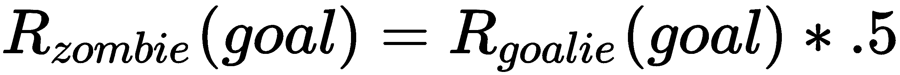

# 第十一章：构建多代理环境

在完成单代理的经验后，我们可以进入更加复杂但同样有趣的多代理环境中，在该环境中训练多个代理以合作或竞争的方式工作。这也为训练具有对抗性自我对抗、合作性自我对抗、竞争性自我对抗等的新机会打开了大门。在这里，可能性变得无穷无尽，这也许就是 AI 的真正“圣杯”。

在本章中，我们将介绍多代理训练环境的多个方面，主要的章节主题如下所示：

+   对抗性和合作性自我对抗

+   竞争性自我对抗

+   多大脑游戏

+   通过内在奖励增加个体性

+   个体化的外部奖励

本章假设你已经完成了前三章并做了一些练习。在下一节中，我们将开始介绍各种自我对抗场景。

最好从 ML-Agents 仓库的一个新克隆开始本章内容。我们这样做是为了清理我们的环境，确保没有不小心保存的错误配置。如果你需要帮助，可以查阅前面的章节。

# 对抗性和合作性自我对抗

术语*自我对抗*当然对不同的人来说有不同的含义，但在此案例中，我们的意思是大脑通过操控多个代理来与自己进行竞争（对抗性）或合作。在 ML-Agents 中，这可能意味着一个大脑在同一环境中操控多个代理。在 ML-Agents 中有一个很好的示例，所以打开 Unity 并按照下一个练习准备好这个场景以进行多代理训练：

1.  从 Assets | ML-Agents | Examples | Soccer | Scenes 文件夹中打开 SoccerTwos 场景。该场景默认设置为玩家模式运行，但我们需要将其转换回学习模式。

1.  选择并禁用所有 SoccerFieldTwos(1)到 SoccerFieldTwos(7)区域。我们暂时不使用这些区域。

1.  选择并展开剩余的活动 SoccerFieldTwos 对象。这将显示一个包含四个代理的游戏区，其中两个标记为 RedStriker 和 BlueStriker，另外两个标记为 RedGoalie 和 BlueGoalie。

1.  检查代理并将每个代理的大脑设置为 StrikerLearning 或 GoalieLearning，具体设置请参见下图：


在代理上设置学习大脑

1.  在这个环境中，我们有四个代理，由大脑控制，这些大脑既在合作又在竞争。说实话，这个示例非常出色，极好地展示了合作性和竞争性自我对抗的概念。如果你还在努力理解一些概念，可以参考这个图示，它展示了如何将这些内容结合起来：


SoccerTwos 的大脑架构

1.  如我们所见，我们有两个大脑控制四个代理：两个前锋和两个守门员。前锋的任务是进攻守门员，当然，守门员的任务是防守进球。

1.  选择“Academy”并启用“Soccer Academy | Brains | Control”以控制两个大脑，如下所示：


在 Academy 中设置大脑控制

1.  同时，注意一下“Striker”、“Goalie Reward”和“Punish”设置，这些都位于“Soccer Academy”组件的底部。还需要注意的是，每个大脑的 `reward` 函数是如何运作的。以下是该示例中 `reward` 函数的数学描述：


1.  这意味着，当进球时，每个四个代理会根据其位置和队伍获得奖励。因此，如果红队进球，红队的前锋将获得 `+1` 奖励，蓝队前锋将获得 `-0.1` 奖励，红队守门员将获得 `+0.1` 奖励，而可怜的蓝队守门员将获得 `-1` 奖励。现在，你可能会认为这可能会导致重叠，但请记住，每个代理对一个状态或观察的看法是不同的。因此，奖励将根据该状态或观察应用于该代理的策略。实质上，代理正在基于其当前对环境的看法进行学习，这种看法会根据哪个代理发送该观察而变化。

1.  编辑完毕后保存场景和项目。

这为我们的场景设置了多代理训练，使用两个大脑和四个代理，既包括竞争性又包括合作性的自我对战。在接下来的部分中，我们完成外部配置并开始训练场景。

# 训练自我对战环境

训练这种类型的自我对战环境不仅为增强训练提供了更多可能性，还为有趣的游戏环境开辟了新的可能性。在某些方面，这种类型的训练环境看起来和观看游戏一样有趣，正如我们将在本章结束时所看到的。

但现在，我们将回到前面，继续设置我们需要的配置，以便在下一步的练习中训练我们的 SoccerTwos 多代理环境：

1.  打开 `ML-Agents/ml-agents/config/trainer_config.yaml` 文件，查看 `StrikerLearning` 和 `GoalieLearning` 配置部分，如下所示：

```py
StrikerLearning:
    max_steps: 5.0e5
    learning_rate: 1e-3
    batch_size: 128
    num_epoch: 3
    buffer_size: 2000
    beta: 1.0e-2
    hidden_units: 256
    summary_freq: 2000
    time_horizon: 128
    num_layers: 2
    normalize: false

GoalieLearning:
    max_steps: 5.0e5
    learning_rate: 1e-3
    batch_size: 320
    num_epoch: 3
    buffer_size: 2000
    beta: 1.0e-2
    hidden_units: 256
    summary_freq: 2000
    time_horizon: 128
    num_layers: 2
    normalize: false
```

1.  显而易见的想法是大脑应该有类似的配置，你可能会从这种方式开始，没错。然而，请注意，即使在这个示例中，`batch_size` 参数对于每个大脑也设置得不同。

1.  打开 Python/Anaconda 窗口，切换到 ML-Agents 虚拟环境，然后从 `ML-Agents/ml-agents` 文件夹中启动以下命令：

```py
mlagents-learn config/trainer_config.yaml --run-id=soccer --train
```

1.  当提示时按下播放，你应该能看到以下训练会话正在运行：


在训练模式下运行的 SoccerTwos 场景

1.  如前所述，这可以是一个非常有趣的示例，观看时很有娱乐性，并且训练速度惊人地快。

1.  在进行了一些训练后，打开 Python/Anaconda 控制台，并注意到现在你得到了两个大脑的统计信息，分别是 StrikerLearning 和 GoalieLearning，如下图所示：


控制台输出显示来自两个大脑的统计信息

1.  注意到 StrikerLearning 和 GoalieLearning 互相返回相反的奖励。这意味着，为了训练这些代理，它们必须使两者的平均奖励都平衡到 0。当代理们进行训练时，你会注意到它们的奖励开始收敛到 0，这是这个示例的最佳奖励。

1.  让示例运行至完成。观看这些环境时很容易迷失其中，因此你甚至可能没有注意到时间流逝。

这个示例展示了我们如何通过自我游戏利用多代理训练的力量，同时教两个大脑如何同时进行竞争和合作。在接下来的部分，我们将看看多个代理如何在自我游戏中相互竞争。

# 对抗性自我游戏

在前面的示例中，我们看到了一个既有合作又有竞争的自我游戏示例，其中多个代理几乎是共生地运作的。虽然这是一个很好的示例，但它仍然将一个大脑的功能与另一个大脑通过奖励函数联系起来，因此我们观察到代理们几乎处于奖励对立的情境中。相反，我们现在想要查看一个能够仅通过对抗性自我游戏来训练大脑与多个代理的环境。当然，ML-Agents 就有这样一个环境，称为 Banana，它包括几个随机游走在场景中并收集香蕉的代理。这些代理还有一个激光指示器，如果击中对手，可以使其禁用几秒钟。接下来的练习中，我们将查看这个场景：

1.  打开位于 Assets | ML-Agents | Examples | BananaCollectors | Scenes 文件夹中的 Banana 场景。

1.  选择并禁用额外的训练区域 RLArea(1) 到 RLArea(3)。

1.  选择 RLArea 中的五个代理（Agent、Agent(1)、Agent(2)、Agent(3)、Agent(4)）。

1.  将 Banana Agent | Brain 从 BananaPlayer 切换到 BananaLearning。

1.  选择学院并将 Banana Academy | Brains | Control 属性设置为启用。

1.  在编辑器中选择 Banana Agent 组件（脚本），并在你选择的代码编辑器中打开。如果你向下滚动到页面底部，你会看到 `OnCollisionEnter` 方法，如下所示：

```py
void OnCollisionEnter(Collision collision)
{
  if (collision.gameObject.CompareTag("banana"))
  {
    Satiate();
    collision.gameObject.GetComponent<BananaLogic>().OnEaten();
    AddReward(1f);
    bananas += 1;
    if (contribute)
    {
      myAcademy.totalScore += 1;
    }
  }
 if (collision.gameObject.CompareTag("badBanana"))
 {
   Poison();
   collision.gameObject.GetComponent<BananaLogic>().OnEaten();

   AddReward(-1f);
   if (contribute)
   {
     myAcademy.totalScore -= 1;
   }
  }
}
```

1.  阅读上述代码后，我们可以将 `reward` 函数总结为以下内容：


这仅仅意味着代理们只会因吃香蕉而获得奖励。有趣的是，禁用对手（使用激光或被禁用）并没有奖励。

1.  保存场景和项目。

1.  打开准备好的 Python/Anaconda 控制台，并使用以下命令开始训练：

```py
mlagents-learn config/trainer_config.yaml --run-id=banana --train
```

1.  当提示时，按下编辑器中的 Play 按钮，并观察接下来截图中展示的动作：


香蕉收集器代理正在执行任务

1.  让场景运行尽可能长的时间。

这个场景是一个很好的例子，展示了代理如何学习使用一个不返回奖励的次要游戏机制，但像激光一样，它仍然被用来使对抗性的收集者无法动弹，从而获得更多的香蕉，同时仅仅因吃香蕉才获得奖励。这个例子展示了强化学习（RL）的真正力量，以及如何利用它来发现次要策略以解决问题。虽然这是一个非常有趣的方面，观看起来也很有趣，但请考虑其更深远的影响。研究表明，RL 已经被用来优化从网络到推荐系统的所有内容，通过**对抗性自我游戏**，因此未来看强化学习这种学习方法能够达成什么目标将会非常有趣。

# 多脑模式游戏

ML-Agents 工具包的一个真正伟大的特点是能够快速添加由多个大脑驱动的多个代理。这使我们能够构建更复杂的游戏环境或场景，拥有有趣的代理/人工智能，既可以与其互动也可以对抗。让我们看看将我们的足球示例转换为让所有代理使用独立大脑是多么容易：

1.  打开我们之前查看的 SoccerTwos 场景的编辑器。

1.  定位到示例中的`Brains`文件夹，路径为 Assets | ML-Agents | Examples | Soccer | Brains。

1.  点击窗口右上角的 Create 菜单，在上下文菜单中选择 ML-Agents | Learning Brain：


创建一个新的学习大脑

1.  将新大脑命名为`RedStrikerLearning`。在同一文件夹中创建三个新的大脑，分别命名为`RedGoalieLearning`、`BlueGoalieLearning`和`BlueStrikerLearning`。

1.  选择 RedStrikerLearning。然后选择并拖动 StrikerLearning 大脑，将其放入“从槽复制大脑参数”位置：


从另一个大脑复制大脑参数

1.  对于 BlueStrikerLearning，复制 StrikerLearning 的参数。然后对 RedGoalieLearning 和 BlueGoalieLearning 执行相同操作，复制 GoalieLearning 的参数。

1.  在 Hierarchy 窗口中选择 RedAgent，并将 Agent Soccer | Brain 设置为 RedStrikerLearning。对其他每个代理执行相同操作，将颜色与位置匹配。BlueGoalie **->** BlueGoalieLearning。

1.  选择 Academy，并从 Soccer Academy | Brains 列表中移除当前所有的大脑。然后使用添加新按钮将所有我们刚创建的新大脑添加回列表，并设置为控制：


将新的大脑添加到 Academy

1.  保存场景和项目。现在，我们只是将示例从使用两个并行大脑的自我游戏模式切换为让代理们分别在不同的队伍中。

1.  打开一个设置好用于训练的 Python/Anaconda 窗口，并用以下内容启动：

```py
mlagents-learn config/trainer_config.yaml --run-id=soccer_mb --train
```

1.  让训练运行并注意观察代理的表现，看看他们是否像之前一样发挥得那么好。同时也查看控制台输出。你会看到现在它为四个代理提供报告，但代理之间仍然有些共生关系，因为红色前锋与蓝色守门员相对。然而，现在他们的训练速度要慢得多，部分原因是每个大脑现在只能看到一半的观察数据。记得之前我们有两个前锋代理将数据输入到一个大脑，而正如我们所学，这种额外的状态输入可以显著加速训练。

此时，我们有四个代理，四个独立的大脑正在进行一场足球比赛。当然，由于代理仍通过共享奖励函数进行共生式训练，我们不能真正把它们称为独立个体。除了，如我们所知，队伍中的个体往往会受到其内在奖励系统的影响。我们将在下一部分中查看内在奖励的应用如何使最后的这个练习更加有趣。

# 通过内在奖励增加个体性

正如我们在第九章《奖励与强化学习》中学到的，内在奖励系统和代理动机的概念目前在 ML-Agents 中只是作为**好奇心学习**实现的。应用内在奖励或动机与强化学习结合的这一领域，在游戏和人际应用中有广泛的应用，例如**仆人代理**。

在下一个练习中，我们将为一些代理添加内在奖励，并观察这对游戏产生什么影响。打开上一个练习的场景并按以下步骤操作：

1.  打开`ML-Agents/ml-agents/config/trainer_config.yaml`文件，用文本编辑器进行编辑。我们之前没有为我们的代理添加任何专门的配置，但现在我们将纠正这一点并添加一些额外的配置。

1.  将以下四个新的大脑配置添加到文件中：

```py
BlueStrikerLearning:
    max_steps: 5.0e5
    learning_rate: 1e-3
    batch_size: 128
    num_epoch: 3
    buffer_size: 2000
    beta: 1.0e-2
    hidden_units: 256
    summary_freq: 2000
    time_horizon: 128
    num_layers: 2
    normalize: false
 BlueGoalieLearning:
 use_curiosity: true
 summary_freq: 1000
 curiosity_strength: 0.01
 curiosity_enc_size: 256
    max_steps: 5.0e5
    learning_rate: 1e-3
    batch_size: 320
    num_epoch: 3
    buffer_size: 2000
    beta: 1.0e-2
    hidden_units: 256 
    time_horizon: 128
    num_layers: 2
    normalize: false

RedStrikerLearning:
    use_curiosity: true
 summary_freq: 1000
 curiosity_strength: 0.01
 curiosity_enc_size: 256
    max_steps: 5.0e5
    learning_rate: 1e-3
    batch_size: 128
    num_epoch: 3
    buffer_size: 2000
    beta: 1.0e-2
    hidden_units: 256 
    time_horizon: 128
    num_layers: 2
    normalize: false

RedGoalieLearning:
    max_steps: 5.0e5
    learning_rate: 1e-3
    batch_size: 320
    num_epoch: 3
    buffer_size: 2000
    beta: 1.0e-2
    hidden_units: 256
    summary_freq: 2000
    time_horizon: 128
    num_layers: 2
    normalize: false
```

1.  注意我们已经在`BlueGoalieLearning`和`RedStrikerLearning`大脑上启用了`use_curiosity: true`。你可以从文件中原有的`GoalieLearning`和`StrikerLearning`大脑配置中复制并粘贴大部分内容；只需注意细节即可。

1.  编辑完成后保存文件。

1.  打开你的 Python/Anaconda 控制台并使用以下命令开始训练：

```py
mlagents-learn config/trainer_config.yaml --run-id=soccer_icl --train
```

1.  让代理训练一段时间，你会注意到，尽管它们确实表现得像更独立的个体，但它们的训练能力仍然较差，任何在训练中看到的进步很可能是因为给了几个代理好奇心奖励。

通过内在奖励或动机为代理添加个性化的能力，随着深度强化学习（DRL）在游戏和其他潜在应用中的发展，肯定会逐渐成熟，并希望能够提供其他不完全专注于学习的内在奖励模块。然而，内在奖励确实能鼓励个性化，因此，在下一节中，我们将为修改后的示例引入外在奖励。

迁移学习的另一个优秀应用是，在代理已经完成一般任务的训练后，能够添加内在奖励模块。

# 个性化的外在奖励

我们已经在多个章节中广泛讨论了外部或外在奖励，以及如何使用技术来优化和鼓励它们对代理的作用。现在，看似通过修改代理的行为来调整其外在奖励或本质上的奖励函数，似乎是一种简便的方法。然而，这可能会带来困难，并且通常会导致训练表现变差，这就是我们在前一节中为几个代理添加**课程学习**（**CL**）时所观察到的情况。当然，即使训练变差，我们现在手头上有许多技巧，比如**迁移学习**（**TL**），也叫做**模仿学习**（**IL**）；**好奇心**；和 CL，来帮助我们纠正问题。

在接下来的练习中，我们将通过添加额外的外在奖励来为我们的代理增添更多个性。打开我们刚才正在操作的前一个练习示例并跟着做：

1.  从菜单中选择窗口 | 资产商店。这将带你进入 Unity 资产商店，这是一个非常优秀的辅助资源库。虽然大多数这些资源是付费的，但老实说，与同类开发者工具相比，价格非常低廉，而且有几个免费的、非常优秀的资源，你可以开始使用它们来增强你的训练环境。资产商店是 Unity 最好与最糟糕的地方之一，所以如果你购买了资源，记得查看评论和论坛帖子。任何好的资源通常都会有自己的开发者论坛，而艺术资源则较少。

1.  在搜索栏中输入 `toony tiny people` 并按 *Enter* 键或点击搜索按钮。这将显示搜索结果。

我们要感谢**Polygon Blacksmith**，感谢他们的支持，使我们能够将他们的 Toony Tiny People Demo 资源与本书的源文件一起分发。此外，他们的角色资源包做得非常好，且易于使用。如果你决定构建一个完整的游戏或增强版演示，他们的一些较大资源包的价格也是一个很好的起点。

1.  选择名为 Toony Tiny People Demo 的结果，由 Polygon Blacksmith 提供，并点击选择它。它将显示在此截图中：


Polygon Blacksmith 的 Toony Tiny People Demo 资源

1.  点击红色的下载按钮，下载完成后，按钮会变为导入，如前面的截图所示。点击导入按钮导入资产。当导入对话框弹出时，确保选中所有内容，然后点击导入。

这些类型的低多边形或卡通资产非常适合让简单的游戏或模拟更具娱乐性和观看乐趣。虽然看起来不多，但你可以花费大量时间观看这些训练模拟的运行，若它们看起来更吸引人，那将大有帮助。

1.  选择并展开层级中的所有代理对象。这包括 RedStriker、BlueStriker、RedGoalie 和 BlueGoalie。

1.  打开项目窗口中的 Assets | TooyTinyPeople | TT_demo | prefabs 文件夹。

1.  从前面的文件夹中选择并拖动 TT_demo_Female 预设体，并将其拖放到层级窗口中的 RedStriker 代理对象上。选择位于代理对象下方的立方体对象，并在检查器中禁用它。继续按以下列表对其他代理执行相同操作：

    +   TT_demo_female -> RedStriker

    +   TT_demo_male_A -> BlueStriker

    +   TT_demo_police -> BlueGoalie

    +   TT_demo_zombie -> RedGoalie

这一点在下图中得到了进一步展示：


设置新的代理模型

1.  确保也将新代理模型的 Transform 位置和朝向重置为 `[0,0,0]`，如以下截图所示：


重置拖动的预设体的朝向和位置

1.  保存场景和项目。

此时，你可以在训练中运行场景，观看新的代理模型移动，但这并没有多大意义。代理的行为仍然是一样的，所以接下来我们需要做的是基于某些任意的个性设置额外的外在奖励，我们将在下一节定义这些个性。

# 通过自定义奖励函数创建独特性

尽管结果可能没有我们预期的那样独特，我们通过加入内在奖励成功地使我们的代理变得更具个性。这意味着我们现在希望通过修改代理的外在奖励来使其行为更具个性，最终使游戏更具娱乐性。

我们开始实现这一点的最佳方式是查看我们之前描述的 `SoccerTwos` 奖励函数；这些奖励函数在这里列出，供参考：


我们现在想做的是基于当前角色对奖励函数进行一些个性化修改。我们将通过简单地将函数链与基于角色类型的修改进行组合来实现，如下所示：

 或 

 或 

 或 

 或 

我们在这些奖励函数中所做的只是通过某些个性修改来调整奖励值。对于女孩，我们给她 1.25 倍的奖励，反映出她可能很兴奋。男孩则不那么兴奋，因此我们将他的奖励调整为 0.95 倍，稍微减少奖励。警察则始终冷静且掌控自如，奖励保持不变。最后，我们引入了一个变数——半死的僵尸。为了表现它是半死不活，我们还将它的奖励减少一半。

当然，你可以根据游戏机制修改这些函数，但需要注意的是，你所应用的个性修改可能会妨碍训练。在我们开始训练这个示例时，务必记住这一点。

一个女孩，一个男孩，一个僵尸和一个警察走进了足球场。

现在我们理解了新的奖励函数，我们想要在示例中添加一些内容，说明是时候打开 Unity 并编写代码了。这个示例将需要对 C# 文件做一些轻微的修改，但代码非常简单，任何有 C 语言经验的程序员都应该能轻松理解。

打开 Unity，进入我们在上一个示例中修改的场景，并跟随下一个练习：

1.  在层级窗口中找到 RedStriker 代理并选择它。

1.  从 Inspector 面板中，点击 Agent Soccer 组件旁边的齿轮图标，然后在上下文菜单中选择“编辑脚本”。这将会在你的编辑器中打开脚本和解决方案。

1.  在文件顶部的当前 `enum AgentRole` 后添加一个新的 `enum`，名为 `PersonRole`，如代码所示：

```py
public enum AgentRole
{
  striker,goalie
} *//after this line*
public enum PersonRole
{
 girl, boy, police, zombie
}
```

1.  这创建了一个新的角色，实际上是我们希望应用到每个大脑的个性。

1.  向类中添加另一个新变量，如下所示：

```py
public AgentRole agentRole; *//after this line*
public PersonRole playerRole;
```

1.  这将 `PersonRole` 新角色添加到代理中。现在，我们还想通过向 `InitializeAgent` 方法添加一行代码来将新类型添加到设置中，如下所示：

```py
public override void InitializeAgent()
{
  base.InitializeAgent();
  agentRenderer = GetComponent<Renderer>();
  rayPer = GetComponent<RayPerception>();
  academy = FindObjectOfType<SoccerAcademy>();
  PlayerState playerState = new PlayerState();
  playerState.agentRB = GetComponent<Rigidbody>();
  agentRB = GetComponent<Rigidbody>();
  agentRB.maxAngularVelocity = 500;
  playerState.startingPos = transform.position;
  playerState.agentScript = this;
  area.playerStates.Add(playerState);
  playerIndex = area.playerStates.IndexOf(playerState);
  playerState.playerIndex = playerIndex;
  playerState.personRole = personRole;  *//add this line*
}
```

1.  你现在可能会看到一行错误。这是因为我们还需要将新的 `personRole` 属性添加到 `PlayerState` 中。打开 `PlayerState` 类并按如下所示添加属性：

```py
[System.Serializable]
public class PlayerState
{
  public int playerIndex; 
  public Rigidbody agentRB; 
  public Vector3 startingPos; 
  public AgentSoccer agentScript; 
  public float ballPosReward;
  public string position;
  public AgentSoccer.PersonRole personRole { get; set; }  *//add me*
}
```

1.  你现在应该已经进入了 `SoccerFieldArea.cs` 文件。滚动到 `RewardOrPunishPlayer` 方法，并按如下所示修改：

```py
public void RewardOrPunishPlayer(PlayerState ps, float striker, float goalie)
{
  if (ps.agentScript.agentRole == AgentSoccer.AgentRole.striker)
  { 
    RewardOrPunishPerson(ps, striker);  *//new line*
  }
  if (ps.agentScript.agentRole == AgentSoccer.AgentRole.goalie)
  { 
    RewardOrPunishPerson(ps, striker); *//new line*
  }
  ps.agentScript.Done(); //all agents need to be reset
}
```

1.  我们在这里做的是注入另一个奖励函数，`RewardOrPunishPerson`，以便添加我们外部的个性奖励。接下来，添加一个新的 `RewardOrPunishPerson` 方法，如下所示：

```py
private void RewardOrPunishPerson(PlayerState ps, float reward)
{
  switch (ps.personRole)
  {
    case AgentSoccer.PersonRole.boy:
      ps.agentScript.AddReward(reward * .95f);
      break;

    case AgentSoccer.PersonRole.girl:
      ps.agentScript.AddReward(reward*1.25f);
      break;

    case AgentSoccer.PersonRole.police:
      ps.agentScript.AddReward(reward);
      break;

    case AgentSoccer.PersonRole.zombie:
      ps.agentScript.AddReward(reward * .5f);
      break;
  }
}
```

1.  这段代码的功能与我们之前定制的奖励函数完全相同。编辑完成后，保存所有文件并返回到 Unity 编辑器。如果有任何错误或编译警告，它们将在控制台中显示。如果需要返回并修复任何（红色）错误，进行修正即可。

如你所见，凭借很少的代码，我们就能够添加外在的个性奖励。当然，你可以以任何方式增强这个系统，甚至让它更通用、参数化。在接下来的部分，我们将把所有这些内容整合起来，开始训练我们的代理。

# 配置代理的个性

所有代码设置好后，我们现在可以继续回到编辑器，设置代理以匹配我们想要应用的个性。再次打开编辑器，按照接下来的练习将个性应用到代理上并开始训练：

1.  在层级视图中选择 RedStriker，并将我们刚刚创建的 Agent Soccer | Person Role 参数设置为 Girl，如下所示：


为每个代理设置个性

1.  更新所有代理，使其具备与我们之前分配的模型匹配的相关个性：BlueStriker -> 男孩，BlueGoalie -> 警察，RedGoalie -> 僵尸，如前面的截图所示。

1.  保存场景和项目。

1.  现在，在这一点上，如果你希望更详细些，你可能想回去更新每个代理的大脑名称以反映它们的个性，比如 GirlStrikerLearning 或 PoliceGoalieLearning，并且可以省略团队颜色。务必将新的大脑配置设置添加到你的 `trainer_config.yaml` 文件中。

1.  打开你的 Python/Anaconda 训练控制台，并使用以下命令开始训练：

```py
mlagents-learn config/trainer_config.yaml --run-id=soccer_peeps --train
```

1.  现在，这会非常有趣，正如你在下面的截图中看到的：


观看不同个性在踢足球

1.  请注意，我们保留了团队颜色的立方体，以显示每个代理所属的团队。

1.  让代理训练几千次迭代后，再打开控制台；注意代理们现在看起来不再那么共生了。在我们的示例中，它们仍然是成对出现的，因为我们仅对奖励应用了简单的线性变换。当然，你也可以应用更复杂的非线性函数，这些函数不是反相关的，可以描述代理的其他动机或个性。

1.  最后，让我们打开 TensorBoard，查看我们多代理训练的更好比较。在你当前工作的 `ML-Agents/ml-agents` 文件夹中，再次打开一个 Python/Anaconda 控制台，并运行以下命令：

```py
tensorboard --logdir=summaries
```

1.  使用浏览器打开 TensorBoard 界面并检查结果。确保禁用所有额外的结果，只专注于我们当前训练中四个大脑的表现。我们要关注的三个主要图表已合并在这个图示中：


TensorBoard 绘图，显示四个大脑训练的结果

从 TensorBoard 的结果中可以看出，代理的训练效果不佳。我们当然可以通过增加额外的训练区域并提供更多的观测值来改善这一点，从而训练策略。然而，如果你查看**策略损失**图，结果表明，代理之间的竞争导致了最小的策略变化，这在训练初期是一个不好的现象。如果有的话，僵尸代理似乎是从这些结果中学到最多的代理。

当然，你可以通过很多其他方式修改外部奖励函数，以鼓励在多智能体训练场景中某些行为方面的表现。这些技术中有些效果很好，有些则效果不佳。我们仍处于开发这项技术的初期阶段，最佳实践仍在逐步形成。

在下一部分中，我们将探讨你可以做的进一步练习，以巩固我们在本章中所涵盖的所有内容。

# 练习

和往常一样，尝试至少一个或两个以下练习，来获得个人的乐趣和学习：

1.  打开 BananaCollectors 示例中的 Banana 场景，并在训练模式下运行。

1.  修改 BananaCollectors | Banana 场景，使其使用五个独立的学习大脑，然后在训练模式下运行。

1.  修改最后一个 SoccerTwos 练习中的奖励函数，使用指数或对数函数。

1.  修改最后一个 SoccerTwos 练习中的奖励函数，使用非逆相关和非线性函数。这样，正负奖励的调整方式对于每个个性来说都是不同的。

1.  修改 SoccerTwos 场景，使用不同的角色和个性。也要建立新的奖励函数，然后训练代理。

1.  修改 BananaCollectors 示例中的 Banana 场景，使其使用与 SoccerTwos 示例相同的个性和自定义奖励函数。

1.  用 BananaCollectors 示例做练习 3。

1.  用 BananaCollectors 示例做练习 4。

1.  用 BananaCollectors 示例做练习 5。

1.  使用当前示例中的一个作为模板，或创建自己的，构建一个新的多智能体环境。这个最后的练习很有可能变成你自己的游戏。

你可能已经注意到，随着我们在书中的进展，练习变得更加耗时和困难。为了你自己的个人利益，请尽量完成至少几个练习。

# 总结

在本章中，我们探讨了多智能体训练环境中的无限可能性。我们首先研究了如何通过自我对弈设置环境，在这种环境中，一个大脑可以控制多个大脑，它们既相互竞争又相互合作。接着，我们探讨了如何通过使用 ML-Agents 好奇心学习系统，结合内在奖励的方式，增加个性化元素，激发智能体的好奇心。然后，我们研究了如何使用外在奖励来塑造智能体的个性并影响训练。我们通过添加免费的风格资产，并通过奖励函数链应用自定义的外部奖励来实现这一点。最后，我们训练了环境，并被男孩智能体彻底击败僵尸的结果逗乐；如果你观看完整的训练过程，你将看到这一点。

在下一章，我们将探讨深度强化学习（DRL）在调试和测试已构建游戏中的另一种新颖应用。
