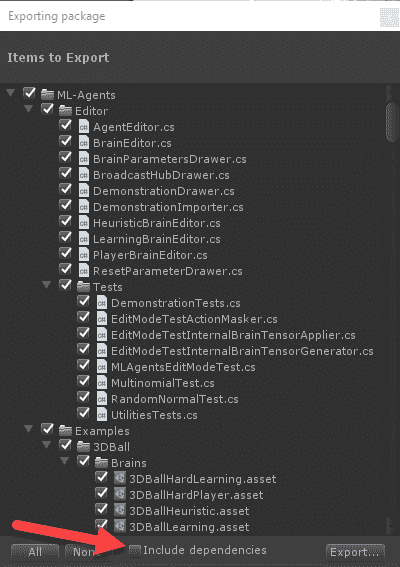

# 第十二章：使用 DRL 调试/测试游戏

虽然 ML-Agents 框架为构建游戏中的 AI 代理提供了强大的功能，但它也为调试和测试提供了自动化工具。任何复杂软件的开发都需要与广泛的产品测试和优秀的质量保证团队的审查相结合。测试每个方面、每种可能的组合和每个级别可能非常耗时且昂贵。因此，在本章中，我们将探讨使用 ML-Agents 作为自动化方式来测试一个简单的游戏。当我们修改或更改游戏时，我们的自动化测试系统可以通知我们是否存在问题或可能已经破坏了测试的变更。我们还可以进一步利用 ML-Agents，例如，评估训练性能。

以下是本章将涵盖内容的简要总结：

+   介绍游戏

+   设置 ML-Agents

+   重写 Unity 输入系统

+   通过模仿进行测试

+   分析测试过程

本章假设你对 ML-Agents 工具包有一定的了解，并且对 Unity 游戏引擎有一定的熟悉程度。你还应该对奖励函数以及如何使用 ML-Agents 进行模仿学习有较好的掌握。

在接下来的部分中，我们将从下载并导入游戏开始；我们将在接下来的部分中教你如何让 ML-Agents 玩游戏。即使是对于有经验的 Unity 用户来说，这一章也应视为进阶内容。因此，如果你对 Unity 和/或 C#相对较新，只需慢慢来，逐步完成练习。本章结束时，如果你完成了所有练习，你应该已经朝着成为 Unity 高手的方向迈进。

# 介绍游戏

我们将要介绍的游戏是一个免费的示范样本资产，它是典型游戏的优秀示例。我们测试的游戏将采用离散控制机制和第一人称视角，类似于我们过去看过的游戏。我们将在这里展示的技术是如何将游戏的控制器映射/破解到 ML-Agents 中，以便它可以由 ML-Agents 驱动。使用这种技术应该能让你将 ML-Agents 附加到任何现有的游戏中，尽管不同的控制器，比如第三人称或俯视视角，可能需要稍微调整方法。

如果你认为自己是有经验的 Unity 用户，并且有自己的项目使用 FPS 系统，那么你可以尝试将这个示例适应到自己的游戏或示例中。

由于某些被称为**资源翻转**的可疑技术，你通常很难找到好的 Unity 示范游戏项目。实际上，一些开发者会拿到一个示范项目，并快速为其换皮，作为他们自己的游戏进行转售。由于这一行为通常会给 Unity 这个优秀的游戏引擎带来负面影响，Unity 社区普遍对这种做法表示反对。这些快速制作的游戏通常质量很差，且没有任何支持，更不用说这些开发者通常仅使用免费许可证，这意味着这些设计不佳的游戏会标注上*Made with Unity*字样。

我们希望展示如何将 ML-Agents 集成到一个正在运行的游戏中，用于测试、调试和/或作为 AI 增强功能。让我们从导入基础项目并设置游戏在编辑器中运行开始。在此过程中，我们可能需要对一些内容进行调整，以确保一切正常运行，但这是我们的目标。打开 Unity 编辑器并按照下一部分中的练习设置基础游戏项目：

1.  创建一个名为`HoDLG`的新项目（或使用你自己喜欢的名字）。等待空项目加载完成。如果你觉得自己有足够资格，可以使用你自己的项目。

1.  从菜单中选择**Window** | **Asset Store**。

1.  在搜索面板中，输入`ms vehicle system`并按*Enter*或点击**Search**按钮。我们将查看一个免费的资源包，名为 MS Vehicle System，它有一个有趣的小环境可以玩耍。通常，像这样的免费环境比较难找到（如前所述），但一般来说，制作精良的商业（非免费）资源包会提供良好的演示环境，比如这个。Unity 也有一些教程环境，但它们通常会迅速过时，而且更新也不一定容易。

1.  点击**MS Vehicle System**卡片，等待资源页面加载，如下图所示：


选择要下载的资源包

1.  点击**下载**按钮下载资源，然后点击**导入**将资源导入项目中。按照导入对话框的提示将所有资源导入项目中。

1.  在**Assets** | **MSVehicleSystem (FreeVersion)** 文件夹中找到**MainScene**场景并打开它。

1.  按下**Play**按钮在编辑器中运行场景，使用控制来驾驶车辆。注意如何切换车辆和相机控制。当测试（游戏）完成后，通过按下 Play 停止场景。

1.  在**Hierarchy**筛选框中输入`canvas`，然后选择场景中的所有**Canvas**对象，如下图所示：


禁用场景中的 Canvas UI

1.  这将禁用场景中的 UI，我们在测试时不需要它，而且在这种情况下它并不重要。如果这是一个真正的游戏，可能会有更多颜色鲜艳的视觉效果来表示分数，当然，你也可以随时添加这些。

1.  点击过滤器输入框旁的*`X`*，清除它并将场景恢复正常。

1.  再次播放场景并探索多个区域。寻找一个你认为可能适合作为目标的地方；记住，最初不要设置太难的目标。以下是一个可能成为有趣目标的位置示例；看看你能否找到这个位置：


寻找适合放置目标的位置

即使你找不到具体的地方，也要找到一个不容易到达的区域。这样，代理必须广泛地探索该关卡才能找到目标（或目标点）。在我们的例子中，我们将随机放置目标方块在关卡中，并鼓励代理去寻找这些目标。这样，我们也可以通过探索的频率来绘制出探索的区域，然后决定如何覆盖其他区域进行测试。在进入下一部分之前，我们将添加 ML-Agents。

# 设置 ML-Agents

在写这本书时，ML-Agents 是作为一个 GitHub 项目进行开发和发布的。随着产品的成熟，可能会将其作为独立的资源包发布，但目前并不是这样。

因此，我们首先需要将 ML-Agents 导出为资源包。打开一个新的 Unity 编辑器会话，进入 ML-Agents 或 Unity SDK 项目，并按照以下步骤操作：

1.  定位到**项目**窗口中的**ML-Agents**文件夹，并选择它。

1.  从菜单中选择**资源** | **导出包**。

1.  确保所有文件夹内容都已高亮显示，如下所示的**导出包**对话框摘录：



将 ML-Agents 导出为资源包

1.  确保取消选中**包括依赖项**复选框，如上文摘录所示。只要选择了正确的根文件夹，所有我们需要的依赖项应该都会被打包。

1.  在对话框中点击**导出...**按钮，然后选择并保存资产文件到一个你稍后容易找到的位置。

1.  打开 Unity 编辑器，进入我们在上一个练习中开始的项目。

1.  从菜单中选择**资源** | **导入包** | **自定义包**。定位我们刚刚导出的包，并将其导入到新的测试项目中。

1.  定位到项目窗口，在**资源**根目录下创建一个名为`HoDLG`的新文件夹，然后在该新文件夹内创建名为`Brains`、`Prefabs`**、**和`Scripts`的新文件夹，如下图所示：


创建新的项目文件夹

1.  创建这些文件夹是为新的资源、示例或项目打基础的标准方式。现在你可以关闭旧的 ML-Agents Unity SDK 项目，因为我们不再需要它。

现在我们已经导入了 ML-Agents 并为测试游戏奠定了基础，接下来我们可以开始添加 ML-Agents 的学习部分进行测试。

# 向游戏中引入奖励

目前场景没有明确的目标。许多开放世界和探索类型的游戏目标定义较为松散。然而，对于我们的目的，我们只希望代理能够测试整个游戏关卡，并尽可能识别出任何游戏缺陷，或许还能发现一些我们从未预见的策略。当然，这并不意味着如果汽车驾驶代理变得足够强大，我们也能把它们作为游戏对手使用。底线是，我们的代理需要学习，而它通过奖励来实现这一点；因此，我们需要制定一些奖励函数。

让我们首先为目标定义一个奖励函数，如下所示：


这个过程非常简单；每当代理遇到目标时，它们将获得一个奖励值 1。为了避免代理花费过长时间，我们还会引入一个标准的步骤奖励，具体如下：


这意味着我们为每个代理的行动应用一个奖励，奖励值为-1 除以最大步骤数。这是相当标准的做法（例如我们的 Hallway 代理就使用了它），所以这里没有什么新东西。因此，我们的奖励函数将非常简单，这很好。

在许多情况下，您的游戏可能有明确的目标，您可以基于这些目标给予奖励。例如，一款驾驶游戏会有一个明确的目标，我们可以为代理设定目标。在这种情况下，在我们的开放世界游戏中，为代理设定目标是有意义的。当然，如何实现奖励结构非常重要，但请根据您的实际情况选择合适的方式。

在定义了奖励函数后，接下来是将目标的概念引入游戏中。我们希望保持这个系统的通用性，因此我们将在一个名为`TestingAcademy`的新对象中构建一个目标部署系统。这样，您可以将这个学院对象拖放到任何类似的 FPS 或第三人称控制的世界中，它就能正常工作。

**第一人称射击游戏**（**FPS**）指的是一种游戏类型，也是一种控制/摄像头系统。我们感兴趣的是后者，因为它是我们控制汽车的方式。

打开新的合并项目的编辑器，接着按照下一个练习来构建`TestingAcademy`对象：

1.  在**层级**窗口中点击，然后从菜单中选择**游戏对象** | **创建空物体**。将新对象命名为`TestingAcademy`。

1.  找到并点击**HoDLG | Scripts**文件夹，然后在**项目**窗口中打开**创建**子菜单。

1.  在**创建**菜单中，选择**C# 脚本**。将脚本重命名为`TestingAcademy`。

1.  打开新的**TestingAcademy**脚本并输入以下代码：

```py
using MLAgents;
using UnityEngine;

namespace Packt.HoDLG
{
  public class TestingAcademy : Academy
  {
    public GameObject goal;
    public int numGoals; 
    public Vector3 goalSize;
    public Vector3 goalCenter;
    public TestingAgent[] agents;
    public GameObject[] goals;
  }
}
```

本章练习的所有代码都包含在`Chapter_12_Code.assetpackage`中，该包随书籍的源代码一同提供。

1.  这段代码通过使用所需的命名空间来定义我们的类和导入内容。然后，我们定义了自己的命名空间`Packt.HoDLG`，并且类继承自 ML-Agents 的基类`Academy`。接下来声明了几个变量来定义目标部署的立方体。可以把它想象成一个虚拟的空间立方体，用来生成目标。其基本思路是让物理引擎处理剩余部分，让目标直接掉到地面上。

**命名空间**在 Unity 中是可选的，但强烈建议将代码放入命名空间中，以避免大多数命名问题。如果你使用了很多资源或修改了现有资源，就像我们在这里所做的那样，这些问题会很常见。

1.  接下来，我们将定义标准的`Academy`类设置方法`InitializeAcademy`。该方法会自动调用，具体如下所示：

```py
public override void InitializeAcademy()
{
  agents = FindObjectsOfType<TestingAgent>();
  goals = new GameObject[numGoals];
}
```

1.  这个方法是作为 ML-Agents 设置的一部分被调用的，它实际上启动了整个 SDK。通过添加`Academy`（`TestingAcademy`），我们实际上启用了 ML-Agents。接下来，我们将添加最后一个方法，该方法会在所有代理回合结束时重置学院，如下所示：

```py
public override void AcademyReset()
{
  if (goalSize.magnitude > 0)
  {
    for(int i = 0; i < numGoals; i++)
    {
    if(goals[i] != null && goals[i].activeSelf)
      Destroy(goals[i]);
    }
    for(int i = 0; i < numGoals; i++)
    {
      var x = Random.Range(-goalSize.x / 2 + goalCenter.x, goalSize.x / 2 + goalCenter.x);
      var y = Random.Range(-goalSize.y / 2 + goalCenter.y, goalSize.y / 2 + goalCenter.y);
      var z = Random.Range(-goalSize.z / 2 + goalCenter.z, goalSize.z / 2 + goalCenter.z);
     goals[i] = Instantiate(goal, new Vector3(x, y, z), Quaternion.identity, transform);
   }
  }
}
```

1.  这段代码会随机生成目标，并将其放置在虚拟立方体的范围内。然而，在此之前，它首先使用`Destroy`方法清除旧的目标。`Destroy`会将对象从游戏中移除。然后，代码再次循环并在虚拟立方体内的随机位置创建新的目标。实际创建目标的代码行被高亮显示，并使用了`Instantiate`方法。`Instantiate`会在指定的位置和旋转角度创建游戏中的对象。

1.  保存文件并返回编辑器。此时不必担心任何编译错误。如果你是从头开始编写代码，可能会缺少一些类型，稍后我们会定义这些类型。

创建好新的`TestingAcademy`脚本后，我们可以继续在下一节中将该组件添加到游戏对象并设置学院。

# 设置 TestingAcademy

创建好`TestingAcademy`脚本后，接下来通过以下步骤将其添加到游戏对象中：

1.  从**脚本**文件夹中拖动新的**TestingAcademy**脚本文件，并将其放到**层次结构**窗口中的**TestingAcademy**对象上。这会将该组件添加到对象中。在完成学院设置之前，我们还需要创建其他一些组件。

1.  在**层次结构**窗口中点击，菜单中选择**Game Object | 3D Object | Cube**。将新对象重命名为`goal`。

1.  选择该对象并将**Tag**更改为`goal`。然后，通过点击**Target**图标并选择**v46**或其他闪亮材质，来更换其材质，如下图所示：


更换目标对象的材质

1.  在菜单中选择**goal**对象，接着选择**Component | Physics | Rigidbody**。这将添加一个名为 Rigidbody 的物理系统组件。通过将**Rigidbody**添加到对象上，我们允许它受物理系统的控制。

1.  将**goal**对象拖放到**Project**窗口中的**HoDLG | Prefabs**文件夹中。这将使目标对象成为一个**Prefab**。预制件是自包含的对象，包含自己的层级结构。预制件可以包含一个完整的场景，或者只是一个对象，就像我们这里所做的一样。

1.  在**Hierarchy**窗口中选择并删除**goal**对象。未来，我们将通过使用它的 Prefab 从 Academy 中以编程方式实例化**goal**。

1.  点击**HoDLG | Brains**文件夹，点击打开**Create**菜单。在菜单中选择**ML-Agents | LearningBrain**。将新建的大脑命名为**`TestingLearningBrain`**，然后创建一个名为`TestingPlayerBrain`的新玩家大脑。暂时无需配置这些大脑。

1.  在**Hierarchy**窗口中选择**TestingAcademy**对象，然后更新**Testing Academy**组件的值，如下图所示：


设置 TestingAcademy

1.  请注意，我们正在**TestingAcademy**脚本中设置以下属性：

    +   **Brains**: TestingLearningBrain

    +   **Max Steps**: 3000

    +   **Goal**: 通过从文件夹中拖动预制件来设置目标

    +   **Num Goals**: 3（从盒子中丢出的目标数）

    +   **Goal Size**: (50, 50, 50)（确定目标框的最大边界）

    +   **Goal Center**: (85, 110, -37)（目标框的中心点）

此时你可能会想要运行项目；如果你刚刚下载了代码，倒是可以先运行，但等我们在下一节中定义`TestingAgent`时再开始吧。

# 编写 TestingAgent 脚本

当然，如果没有代理来与环境交互并进行学习，我们的测试（或者说我们想要推进的模拟程度）是没有意义的。在接下来的练习中，我们将定义描述`TestingAgent`组件的脚本：

1.  点击**HoDLG | Scripts**文件夹，点击**Create**按钮以打开菜单。

1.  在菜单中选择**C# Script**并将脚本命名为`TestingAgent`。

1.  在编辑器中打开脚本，并开始用以下代码进行编写：

```py
using MLAgents;
using UnityEngine;

namespace Packt.HoDLG
{
  public class TestingAgent : Agent
  {
    public string[] axisAction; 
    protected Vector3 resetPos;
    protected Quaternion resetRot;
  }
}
```

1.  这开始了我们的类；这次它是从`Agent`这个基类扩展而来。接着，我们定义了一些基本字段，用于设置变量和记录代理的起始位置和旋转。

1.  接下来，我们定义`InitializeAgent`方法。该方法会被调用一次，用于设置代理并确保动作长度一致；我们很快就会讲到。我们记住代理开始时的位置/旋转，以便稍后恢复。代码如下：

```py
public override void InitializeAgent()
{
  base.InitializeAgent();
  if (axisAction.Length != brain.brainParameters.vectorActionSize[0])
    throw new MLAgents.UnityAgentsException("Axis actions must match agent actions");

  resetPos = transform.position;
  resetRot = transform.rotation;
}
```

1.  接下来，我们定义一个空的方法，名为`CollectObservations`。通常，这是代理观察环境的地方；由于我们计划使用视觉观察，因此可以将其留空。代码如下：

```py
public override void CollectObservations(){  }
```

1.  接下来，我们定义另一个必需的方法：`AgentAction`。这是我们添加负面步骤奖励并移动代理的地方，如下方代码片段所示：

```py
public override void AgentAction(float[] vectorAction, string textAction)
{
  AddReward(-1f / agentParameters.maxStep);
  MoveAgent(vectorAction);
}

public void MoveAgent(float[] act)
{
  for(int i=0;i<act.Length;i++)
  {
    var val = Mathf.Clamp(act[i], -1f, 1f);
    TestingInput.Instance.setAxis(val,axisAction[i]);
  } 
}
```

1.  这里的代码解读来自大脑的动作，并将它们注入到一个新的类中（我们稍后将构建它），叫做`TestingInput`。`TestingInput`是一个辅助类，我们将用它来覆盖游戏的输入系统。

1.  保存脚本，并且再次忽略任何编译器错误。我们有一个新的依赖项，`TestingInput`，我们将在稍后定义它。

有了新的脚本，我们可以在下一部分开始设置`TestingAgent`组件。

# 设置 TestingAgent

现在，我们正在构建的系统是相当通用的，旨在用于多个环境。在设置过程中请记住这一点，特别是当某些概念看起来有点抽象时。打开编辑器，让我们将`TestingAgent`脚本添加到一个对象中：

1.  选择场景中的**Vehicle1**、**Vehicle3**、**Vehicle4**和**Vehicle5**，并禁用它们。我们当前只希望给代理提供驾驶能力，而不是切换车辆；因此，我们只需要默认的**Vehicle2**。

1.  从**HoDLG | Scripts**文件夹中选择**TestingAgent**脚本并将其拖动到**Vehicle2**对象上。这将把**TestingAgent**组件添加到我们的**Vehicle2**，使其成为一个代理（嗯，差不多）。

1.  打开**Vehicle2 | Cameras**在**Hierarchy**窗口中，并选择你希望代理使用的视图。我们将选择**Camera2**进行此练习，但每个五个摄像头的选项如以下截图所示：


选择作为输入的视觉观察摄像头

1.  最佳选择是**Camera1**或**Camera5**，如上面截图所示。请注意，摄像头的顺序是反向的，从右到左，编号从 1 开始。当然，这也留给我们很多机会在未来尝试其他视觉输入。

1.  选择**Vehicle2**并将选中的**TestingPlayerBrain**和**Camera1**拖到需要的插槽中，如下方截图所示：


设置 TestingAgent 组件

1.  你还需要定义其他属性，具体如下：

    +   **大脑**：TestingPlayerBrain。

    +   **摄像头 1**：点击**添加摄像头**以添加一个新摄像头，然后从**Vehicle2**的摄像头中选择**Camera1**。

    +   **决策频率**：`10`（这决定了代理做决策的频率；`10`是这个游戏的一个不错的起始值。它会有所变化，可能需要根据需要进行调整）

    +   **轴向动作**：2：

        +   **元素 0**：垂直（表示我们将要覆盖的轴，允许代理控制游戏。稍后我们会更详细地介绍轴的描述）

        +   **元素 1**：水平（与之前相同）

1.  保存项目和场景，并再次忽略任何编译错误。

这完成了 `TestingAgent` 的设置；正如你所看到的，启动这个功能所需的配置或代码并不多。未来，你可能会看到更多高级的测试/调试或构建代理的方式。不过，目前我们需要通过注入 Unity 输入系统来完成我们的示例，下一部分我们将会这样做。

# 覆盖 Unity 输入系统

Unity 最具吸引力的特点之一是其跨平台能力，能够在任何系统上运行，而这也带来了多个有助于我们将代码注入其中的抽象层。然而，所讨论的游戏需要遵循 Unity 的最佳实践，以便轻松实现这种注入。并不是说我们不能通过覆盖游戏的输入系统来实现，只是那样做起来不那么简单。

在我们开始描述注入如何工作之前，先回顾一下使用 Unity 输入系统的最佳实践。多年来，Unity 输入系统已经从最初的简单查询设备输入的方式，演变成现在更具跨平台特性的系统。然而，包括 Unity 本身在内的许多开发者，仍然使用查询特定按键代码的输入方法。最佳实践是定义一组轴（输入通道），来定义游戏的输入。

我们可以通过以下练习轻松查看它在游戏中的当前定义：

1.  从编辑器菜单中选择 **编辑 | 项目设置**。

1.  选择“输入”标签，然后展开 **轴 | 水平** 和 **轴 | 垂直**，如下面的截图所示：


检查输入轴设置

1.  **垂直** 和 **水平** 轴定义了将用于控制游戏的输入。通过在这个标签中定义它们，我们可以通过查询轴来跨平台控制输入。请注意，轴输入允许我们定义按钮和摇杆（触摸）输入。对输入系统的查询（使用 `getAxis`）返回一个从 `-1` 到 `+1` 的值，或者是连续的输出。这意味着我们可以将任何离散形式的输入（比如按键）立即转换为连续值。例如，当用户按下 `W` 键时，输入系统将其转换为 **垂直轴** 上的正 1 值，相反，按下 `S` 键则会生成负 1 值，同样是在 **垂直轴** 上。类似地，`A` 和 `D` 键控制 **水平轴**。

正如你在本书的几章中所看到的，使用.6 版本的 ML-Agents 时，当前的离散动作解决方案远不如连续动作。因此，未来我们更倾向于使用连续动作。

到这个阶段，你可能会想，为什么我们使用了离散动作？这是一个很好的问题。如何在未来处理这个二分法，Unity 还未明确。在下一节中，我们将探讨如何将其注入到输入系统中。

# 构建 TestingInput

我们将使用一种名为**单例模式**的设计模式，以实现一个可以在代码的任何地方访问的类，类似于当前使用的 Unity 输入类。Unity 的优点是能够让输入完全静态，但对于我们的目的，我们将使用定义良好的脚本版本。打开编辑器并按照接下来的练习构建`TestingInput`脚本和对象：

1.  选择**HoDLG | Scripts**文件夹并打开**创建**菜单。

1.  从**创建**菜单中，选择**C#脚本**。将新脚本命名为`Singleton`。这个脚本是来自[`wiki.unity3d.com/index.php/Singleton`](http://wiki.unity3d.com/index.php/Singleton)的标准模式脚本；脚本如下所示：

```py
using UnityEngine;

namespace Packt.HoDLG
{
  /// <summary>
  /// Inherit from this base class to create a singleton.
  /// e.g. public class MyClassName : Singleton<MyClassName> {}
  /// </summary>
  public class Singleton<T> : MonoBehaviour where T : MonoBehaviour
  {
    // Check to see if we're about to be destroyed.
    private static bool m_ShuttingDown = false;
    private static object m_Lock = new object();
    private static T m_Instance;
    /// <summary>
    /// Access singleton instance through this propriety.
    /// </summary>
    public static T Instance
    {
      get
      {
        if (m_ShuttingDown)
        {
          Debug.LogWarning("[Singleton] Instance '" + typeof(T) +
             "' already destroyed. Returning null.");
          return null;
        }
        lock (m_Lock)
        {
          if (m_Instance == null)
          {
            // Search for existing instance.
            m_Instance = (T)FindObjectOfType(typeof(T));
            // Create new instance if one doesn't already exist.
            if (m_Instance == null)
            {
              // Need to create a new GameObject to attach the singleton to.
              var singletonObject = new GameObject();
              m_Instance = singletonObject.AddComponent<T>();
              singletonObject.name = typeof(T).ToString() + " (Singleton)";
              // Make instance persistent.
              DontDestroyOnLoad(singletonObject);
            }
          }
          return m_Instance;
        }
      } 
    }
    private void OnApplicationQuit()
    {
      m_ShuttingDown = true;
    }
    private void OnDestroy()
    {
      m_ShuttingDown = true;
    }
  }
}
```

1.  输入上述代码，或者直接使用从书籍源代码下载的代码。单例模式允许我们定义一个线程安全的特定类实例，所有对象都可以引用。典型的静态类不是线程安全的，可能会导致数据损坏或内存问题。

1.  在**HoDLG | Scripts**文件夹中创建一个名为`TestingInput`的新脚本，并打开它进行编辑。

1.  我们将从以下代码开始该类：

```py
using System.Collections.Generic;
using System.Linq;
using UnityEngine;

namespace Packt.HoDLG
{
  public class TestingInput : Singleton<TestingInput>
  {
    public string[] axes;
    public bool isPlayer;    
  }
}
```

1.  请注意高亮显示的那一行，以及我们如何声明该类继承自`Singleton`类型，该类型包装了`TestingInput`类型。这个使用泛型的递归类型非常适合单例模式。如果这一点有点不清楚，别担心；你需要记住的唯一一点是，我们现在可以在代码的任何地方访问该类的实例。请注意我们提到的是实例而不是类，这意味着我们还可以在`TestingInput`类中保持状态。我们在这里声明的变量，`axes`和`isPlayer`，要么在编辑器中设置，要么在`Start`方法中定义，如下所示：

```py
void Start()
{
  axisValues = new Dictionary<string, float>();
  //reset the axes to zero
  foreach(var axis in axes)
  {
    axisValues.Add(axis, 0);
  }
}
```

1.  在`Start`方法中，我们定义了一个`Dictionary`来保存我们希望该组件覆盖的轴和值。这使我们能够控制希望覆盖哪些输入。然后，我们构建名称/值对集合。

1.  接下来，我们将定义几个方法，使我们能够模拟并设置输入系统的轴值。Unity 没有直接设置轴值的方式。目前，`Input`系统直接查询硬件以读取输入状态，并且没有提供覆盖此状态进行测试的方式。虽然这是社区长期以来的一个需求，但是否最终会实现仍然有待观察。

1.  然后我们输入`setAxis`和`getAxis`方法，如下所示：

```py
public void setAxis(float value, string axisName)
{
  if (isPlayer == false && axes.Contains(axisName)) //don't if player mode
  {
    axisValues[axisName] = value;
  }
}
public float getAxis(string axisName)
{
  if (isPlayer)
  {
    return Input.GetAxis(axisName);
  }
  else if(axes.Contains(axisName))
  {
    return axisValues[axisName];
  }
  else
  { return 0; }
}
```

1.  这完成了脚本的编写；如果你在过程中已经添加了代码，保存文件并返回 Unity。此时，你应该看不到编译错误，因为所有必需的类型应该已经存在并且是完整的。

这将设置`TestingInput`脚本；现在，我们需要继续下一部分，将它添加到场景中。

# 将 TestingInput 添加到场景

单例可以在任何地方被调用，实际上，它们并不需要场景中的游戏对象。然而，通过将对象添加到场景中，我们更清晰地意识到所需的依赖关系，因为它使我们能够为特定的场景设置所需的参数。打开 Unity 编辑器，按照接下来的练习将`TestingInput`组件添加到场景中：

1.  点击**层级**窗口，然后从菜单中选择**游戏对象 | 创建空对象**。重命名该对象为`TestingInput`。

1.  将**TestingInput**脚本从**HoDLG | 脚本**文件夹拖到**层级**窗口中的新**TestingInput**对象上。

1.  选择**TestingInput**对象，然后设置所需的**轴**，如下图所示：


设置要重写的轴

1.  我们需要定义两个要重写的轴。在这个例子中，我们只重写**垂直**（`S`和`W`）和**水平**（`A`和`D`）键。当然，你也可以重写任何你想要的轴，但在这个例子中，我们只重写了两个。

1.  保存项目和场景。

到此为止，你无法运行项目，因为实际的输入系统还没有重写任何内容。我们将在下一部分完成最终的注入。

# 重写游戏输入

到此为止，我们已经建立了一个完整的测试系统；接下来只需要完成注入的最后部分。这部分的操作可能需要敏锐的眼光和一些代码的挖掘。幸运的是，有一些清晰的指示器，可以帮助你找到注入的位置。打开编辑器，按照以下步骤完成注入：

1.  在**层级**窗口中选择**Control**对象。

1.  在**检查器**窗口中找到**MS Scene Controller Free**组件，然后使用**上下文**菜单打开代码编辑器中的脚本。

1.  找到以下代码块，大约在**286**行（大约中间位置），如下所示：

```py
case ControlTypeFree.windows:
  verticalInput = Input.GetAxis (_verticalInput);
  horizontalInput = Input.GetAxis (_horizontalInput);
  mouseXInput = Input.GetAxis (_mouseXInput);
  mouseYInput = Input.GetAxis (_mouseYInput);
  mouseScrollWheelInput = Input.GetAxis (_mouseScrollWheelInput);
  break;
}
```

1.  这里是游戏查询`GetAxis`方法的位置，用来返回相应输入轴的值。正如我们所讨论的，我们这里只关心垂直和水平轴。你当然可以根据需要重写其他轴。

1.  修改设置`verticalInput`和`horizontalInput`的代码行，如下所示：

```py
verticalInput = TestingInput.Instance.getAxis(_verticalInput);
horizontalInput = TestingInput.Instance.getAxis(_horizontalInput);
```

1.  请注意，我们调用 `TestingInput.Instance`，以便访问我们类的单例实例。这使我们能够查询该类当前的输入值。现在，`TestingInput` 对象可以作为该类在输入方面的真实来源。

1.  之前，我们快速浏览了设置输入的代理代码，但这里再次提供供参考：

```py
public void MoveAgent(float[] act)
{
  for(int i=0;i<act.Length;i++)
  {
    var val = Mathf.Clamp(act[i], -1f, 1f);
    TestingInput.Instance.setAxis(val,axisAction[i]);
  } 
}
```

1.  注意 `TestingAgent` `MoveAgent` 方法中的高亮行。这里是我们通过代理重写输入并将值注入到游戏中的地方。

1.  保存代码并返回编辑器。确保现在修复任何编译问题。

不幸的是，我们仍然无法运行场景，因为我们还有最后一个配置步骤需要处理。在下一部分，我们将通过设置脑模型来完成配置。

# 配置所需的脑模型

最后一块拼图是配置我们之前快速构建的脑模型。ML-Agents 要求脑模型配置所需的输入和观察空间，以便正常工作。我们将在下一个练习中设置 `TestingPlayerBrain` 和 `TestingLearningBrain`：

1.  打开 Unity 编辑器并从 **HoDLG | Brains** 文件夹中选择 **TestingLearningBrain**，以在 **Inspector** 中打开它。

1.  设置 **Brain** 参数，如下图所示：


设置 TestingPlayerBrain 的参数

1.  需要设置几个参数，它们总结如下：

    +   **视觉观察**：`84` x `84`，无灰度

    +   **向量动作**：

        +   **空间类型**：连续

        +   **空间大小**：`2`

        +   **动作描述：**

            +   **大小**：`2`

            +   **元素 0**：垂直

            +   **元素 1**：水平

    +   **轴向连续玩家动作**：

        +   **大小**：`2`

        +   **垂直：**

            +   **轴向**：垂直

            +   **索引**：`0`

            +   **缩放**：`1`

        +   **水平：**

            +   **轴向**：水平

            +   **索引**：`1`

            +   **缩放**：`1`

1.  选择 **TestingLearningBrain** 并以相同方式进行配置，但这是用于学习，如下图所示：


配置 TestingLearningBrain

1.  学习脑的配置要简单得多，但即使在以玩家模式运行示例时（如你记得的，它已被设置为这样做），这也是必须的。

1.  保存场景和项目。最终，我们已经完成了所需的配置。

1.  按下播放按钮运行场景并以玩家模式玩游戏。我们通过 ML-Agents 系统控制游戏。几秒钟后，你应该能看到附近掉落一些目标。

1.  控制车辆并驶入目标，如下图所示：


驾驶进入目标

1.  当你完成游戏后，停止游戏。

现在我们能够通过配置好的玩家脑模型通过 ML-Agents 玩游戏，我们将在下一部分切换到学习脑，让代理控制游戏。

# 训练时间

无论我们决定如何使用这个平台，无论是用于训练还是测试，我们现在需要做最后的脑配置步骤，以便设置任何我们可能决定用于训练的自定义超参数。打开 Python/Anaconda 控制台并准备进行训练，然后按照以下步骤进行：

1.  打开位于`ML-Agents/ml-agents/config`文件夹中的`trainer_config.yaml`文件。

1.  我们将向配置文件中添加一个新的配置部分，模仿其他视觉环境中的配置。按照以下方式添加新的配置：

```py
TestingLearningBrain:
    use_recurrent: true
    sequence_length: 64
    num_layers: 1
    hidden_units: 128
    memory_size: 256
    beta: 1.0e-2
    gamma: 0.99
    num_epoch: 3
    buffer_size: 1024
    batch_size: 64
    max_steps: 5.0e5
    summary_freq: 1000
    time_horizon: 64
```

1.  注意，我们添加了`brain`这个词，以便与其他脑区分开来。这个脑是基于我们之前花时间探索的`VisualHallwayBrain`模型制作的。然而，请记住，我们现在运行的是一个连续动作问题，这可能会影响某些参数。

1.  保存文件并返回到 Unity 编辑器。

1.  定位到`TestingAcademy`对象，将其`Brains`替换为`TestingLearningBrain`，并将其设置为`Control`，就像你之前做过的那样。

1.  保存场景和项目，并返回到 Python/Anaconda 控制台。

1.  通过运行以下命令开始训练/学习/测试会话：

```py
mlagents-learn config/trainer_config.yaml --run-id=testing --train
```

1.  观看训练过程和代理玩游戏的表现。代理将开始运行，取决于你训练的时间长度，它可能会变得擅长于寻找目标。

到此为止，你可以让代理自行运行并探索你的关卡。然而，我们要做的是通过使用模仿学习来控制或引导测试代理走向正确的路径，我们将在下一节中讨论这一方法。

# 通过模仿进行测试

在学习的这一阶段，你已经掌握了几种策略，我们可以应用它们来帮助测试代理学习并找到目标。我们可以轻松地使用好奇心或课程学习，我们将把这作为读者的练习。我们想要的是一种控制某些测试过程的方法，而且我们不希望代理随机地测试所有内容（至少在这个阶段不希望）。当然，有些地方完全随机测试效果很好。（顺便提一下，这种随机测试被称为**猴子测试**，因为它类似于猴子乱按键盘或输入。）然而，在像我们的游戏这样的空间中，探索每一个可能的组合可能需要很长时间。因此，最好的替代方法是捕捉玩家的录制并将其用作我们测试代理的模仿学习来源。

一切设置好后，并且我们现在能够通过 ML-Agents 将输入事件传递过去，我们可以以代理需要学习的形式捕捉玩家输入。接下来，让我们打开一个备份的 Unity 并设置场景来捕捉玩家的录制，步骤如下：

1.  在**Hierarchy**窗口中选择**Vehicle2**对象。回忆一下，这里是**TestingAgent**脚本附加的地方。

1.  使用**Inspector**窗口底部的**Add Component**按钮将**Demonstration Recorder**组件添加到代理上。

1.  将**Demonstration Recorder**设置为**Record**，并将**Demonstration Name**设置为**Testing**，然后将大脑切换到**TestingPlayerBrain**，如下面的截图所示：


向智能体添加演示记录器

1.  选择**TestingAcademy**对象，确保禁用**Brain**上的**Control**选项。我们希望玩家在录制时控制智能体。

1.  按下 Play 键并运行游戏。使用键盘上的*WASD*控制键驾驶车辆穿越目标。玩一会儿，以生成一个不错的录制。

1.  完成后，检查`Assets`文件夹中是否有一个名为`Demonstrations`的新文件夹，其中包含你的`Testing.demo`录制文件。

现在，随着玩家录制功能启用，我们可以设置并运行智能体，使用模仿学习来测试关卡。

# 配置智能体使用 IL

我们已经完成了设置和运行离线**模仿学习 (IL)** 会话的过程，但让我们在接下来的练习中回顾一下这个过程：

1.  打开 Unity 编辑器，进入相同项目，找到包含智能体的**Vehicle2**对象。

1.  将智能体的大脑从**TestingPlayerBrain**切换到**TestingLearningBrain**。

1.  选择**TestingAcademy**并启用**Testing Academy | Brains**组件上的**Control**属性。

1.  保存场景和项目。

1.  打开`config/offline_bc_config.yaml`文件，在文本或代码编辑器中编辑。

1.  添加以下部分（`HallwayLearning`的修改版）：

```py
TestingLearningBrain:
    trainer: offline_bc
    max_steps: 5.0e5
    num_epoch: 5
    batch_size: 64
    batches_per_epoch: 5
    num_layers: 2
    hidden_units: 128
    sequence_length: 16
    use_recurrent: true
    memory_size: 256
    sequence_length: 32
    demo_path: ./UnitySDK/Assets/Demonstrations/Testing.demo
```

1.  编辑完成后保存文件。

1.  打开一个准备好进行训练的 Python/Anaconda 控制台，并输入以下命令：

```py
mlagents-learn config/offline_bc_config.yaml --run-id=testing_il --train
```

1.  注意几个修改，已用粗体标出。训练开始后，观察智能体以你训练它的方式驾驶汽车（或者至少，它会尽力去做）。

1.  让智能体玩游戏，观察它的表现以及是否遇到问题。

这个演示/游戏相当稳定，不容易出现明显问题，这使得测试明显问题变得困难。然而，希望你能理解，如果在游戏早期实现这种类型的系统，即使只是为了测试，它也能提供快速发现 bug 和其他问题的能力。当然，目前我们唯一的识别问题的方法是观察智能体的游戏表现，这并没有节省时间。我们需要的是一种追踪智能体活动的方法，并确定智能体是否（以及何时）遇到问题。幸运的是，我们可以通过添加分析功能轻松地增加这种追踪方式，接下来我们将介绍这一部分。

# 分析测试过程

ML-Agents 当前缺少的一个关键功能是额外的训练分析（超出控制台和 TensorBoard 提供的内容）。一个可能至关重要的功能（而且不难添加）是训练分析。可以通过 Unity Analytics 服务来实现这个功能，所有游戏都可以免费试用。由于这不是 ML-Agents 的现有功能，因此我们将在下一个练习中通过添加我们自己的训练分析系统来实现：

1.  打开 Unity 编辑器，从菜单中选择**Window | General | Services**。这将打开一个名为**Services**的新窗口，通常会出现在**Inspector**窗口上方。

1.  点击新打开的**服务**窗口中的**Analytics**服务。你需要通过几屏设置，询问你的偏好和确认，如下图所示：


为你的项目设置分析

1.  点击按钮启用**Google Analytics**。然后，选择**Discover**玩家洞察开关，你将被提示按下编辑器中的**Play**。

1.  在编辑器中按下**Play**，让游戏运行几秒钟。

1.  返回到服务窗口和 Analytics 页面，在顶部，你应该看到一个叫做**Go to Dashboard**的按钮。点击该按钮，如下图所示：


使用仪表板探索你的数据

1.  这将打开你的默认网页浏览器，带你到你的项目分析页面，你应该能看到一些事件，如**appStart**和**appStop**。

这就完成了分析服务的设置，正如你所看到的，它其实非常简单。然而，像所有事情一样，我们需要自定义一些我们将要发送到分析服务的数据。你将在下一节学习如何发送你自己的自定义分析。

# 发送自定义分析

如果你之前使用过分析服务，你可能已经有了自己追踪游戏使用情况的最佳实践；如果是这样，随时可以使用这些方法。我们在这里展示的方法是作为起点，帮助你设置并发送自定义分析数据用于训练，或者用于跟踪玩家使用情况。

让我们开始，打开 Unity 编辑器并进行下一个练习：

1.  在`HoDLG`的`Scripts`文件夹中创建一个名为`TestingAnalytics`的新 C#脚本。

1.  打开并编辑`TestingAnalytics`脚本，在编辑器中输入以下代码：

```py
using UnityEngine;

namespace Packt.HoDLG
{
 public class TestingAnalytics : Singleton<TestingAnalytics>
 {
 private TestingAcademy academy;
 private TestingAgent[] agents;
 private void Start()
 {
 academy = FindObjectOfType<TestingAcademy>();
 agents = FindObjectsOfType<TestingAgent>();
 }
 public string CurrentGameState
 {
 get
 {
 var state = string.Empty;
 foreach (var agent in agents)
 {
 foreach (var goal in academy.goals)
 {
 var distance = Vector3.Distance(goal.transform.position, agent.transform.position);
 state += agent.name + " distance to goal " + distance + "/n";
 }
 }
 return state;
 }
 }
 }
}
```

1.  这段代码所做的就是收集目标的当前位置以及它们与代理的接近程度。那是我们目前关心的内容。此外，注意我们将其设为**public property**，以便像方法一样调用，而不仅仅是一个字段。这在后面会很重要。

1.  保存文件并返回编辑器。确认没有编译错误。

1.  在场景中创建一个新的空游戏对象，并命名为 `TestingAnalytics`。将新的 `TestingAnalytics` 脚本拖到该对象上，将其设置为场景组件。虽然这个类是单例，但我们仍然希望将其作为场景的依赖项添加（本质上是作为一个提醒）。然而，我们还可以使用另一个技巧来编程预制体。

1.  将 **TestingAnalytics** 对象拖入 **HoDLG | Prefabs** 文件夹。这将使该对象成为预制体，其他所有预制体现在都可以访问它。

1.  双击 **HoDLG | Prefabs** 文件夹中的 **goal** 预制体，以在其自己的迷你编辑器中打开该对象。

1.  使用 **添加组件** 按钮为对象添加 **Analytics Event Tracker** 组件并进行配置，如下图所示：


设置分析事件跟踪器

1.  配置组件如下：

    +   **何时**：生命周期

    +   **生命周期事件**：销毁时

    +   **发送事件：**

        +   **名称**：目标摧毁事件

        +   **参数：1/10：**

            +   **名称**：状态

            +   **值**：动态

            +   对象：TestingAnalytics（预制体）

            +   **方法**：CurrentGameState

1.  通过更改学院和代理配置，将场景切换回玩家模式。

1.  保存场景和项目。

1.  通过按 **播放** 运行场景，驾车经过一个目标。当你碰到目标时，查看 **Analytics** 仪表板并注意事件是如何被追踪的。

在这个阶段，分析数据只有在目标被摧毁时才会报告，并报告每个代理与目标的距离。因此，对于一个代理和三个目标，当目标被撞毁或物体重置时，它们会报告三个距离。通过这些统计数据，你可以大致了解每个代理测试会话的整体情况，不管是好是坏。当然，你可以添加任何你想要的分析数据；这很容易让人过度投入。谁知道呢；未来，Unity 可能会提供一个由 ML-Agents 驱动的自测平台，提供测试分析数据。

本章即将结束，当然，我们也接近你最喜欢的部分——练习。

# 练习

本章的练习是结合了使用 ML-Agents 和构建你自己的测试分析平台。因此，从下面的列表中选择一到两个你可以自己完成的练习：

1.  配置 **TestingAgent** 使用不同的相机进行视觉观察输入。

1.  启用代理大脑上的 **好奇心学习**。

1.  设置 **TestingAgent** 控制另一辆车。

1.  设置 **TestingAgent** 在另一辆车上运行，让 ML-Agents 同时控制两个代理。

1.  为代理添加额外的追踪分析自定义事件。也许可以跟踪代理的移动距离与其生命周期的关系。这将提供一个速度因子，也能表示代理的效率。一个更快撞到目标的代理会有更好的速度因子。

1.  通过添加带有学习代理的第二辆车，启用在线模仿学习。如果需要，回顾一下网球场景的设置。

1.  设置学院使用课程学习。也许允许虚拟目标部署框在训练迭代中增长（按 10%或其他因素）。这将使目标分散更远，使得代理更难找到。

1.  修改大脑使用的视觉观察输入为`184` x `184`，这是新的标准，看看这对代理训练有何影响。

1.  修改视觉观察卷积编码网络，就像我们在第七章中所做的那样，*Agents and the Environment*，使用更多层和/或不同的过滤器。

1.  将这个测试框架应用到你自己的游戏中。确保也添加分析功能，以便跟踪培训和玩家使用情况。

这些练习比前几章更复杂，因为这是一个重要的大章节。在下一节中，我们将回顾你在本章学到和涵盖的内容。

# 摘要

在本书的所有章节中，如果你正在开发自己的游戏，这可能是最有用的章节之一。游戏测试是需要大量时间和注意力的事情，必须部分自动化。虽然深度强化学习在几乎任何游戏中都表现良好是有意义的，但尚不清楚这是否是这种新学习现象的一个利基。然而，有一点可以肯定的是，ML-Agents 完全可以作为一个测试工具，并且我们确信随着时间的推移它会变得更加出色。

在本章中，我们看了建立一个通用测试平台，由 ML-Agents 提供支持，可以自动测试任何游戏。我们首先看了我们需要调整的每个组件，学院和代理，以及它们如何被泛化用于测试。然后，我们看了如何注入到 Unity 输入系统中，并使用我们的`TestingAgent`来覆盖游戏的输入并学习如何独立控制它。之后，我们看了如何通过使用离线 IL 来更好地设置我们的测试，并记录一个演示文件，以便稍后用来训练代理。最后，为了查看我们的测试效果如何，我们添加了分析功能，并根据我们的需求进行了定制。

下一章将是我们的最后一章，也是我们对游戏深度学习的最后讨论；适当地，我们将展望 ML-Agents 和 DRL 的未来。
