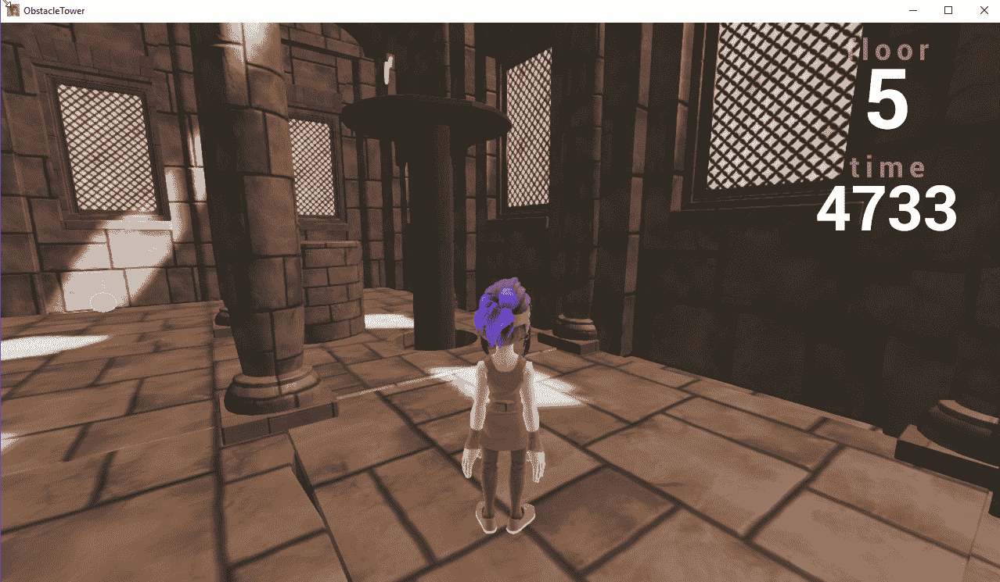

# 第十三章：障碍塔挑战及其后续

在本章中，我们的最后一章，我们将审视游戏中**深度学习（DL）**和**深度强化学习（DRL）**的当前和未来状态。我们诚实而坦率地看待这些技术是否已经准备好投入商业游戏，或者它们只是新奇玩意。几年后，我们是否会看到 DRL 代理在每一款游戏中击败人类玩家？尽管这还有待观察，而且事情变化迅速，但真正的问题是：DL 是否准备好为您的游戏服务？这可能是您此刻正在问自己的问题，希望我们在本章中能够回答。

本章将是一些实际练习和一般讨论的结合，不幸的是没有练习。好吧，有一个大练习，但我们很快就会谈到。以下是本章将涵盖的内容：

+   **Unity 障碍塔挑战**

+   您的游戏的深度学习？

+   制作你的游戏

+   更多学习的基础知识

本章假定您已经完成了本书中的众多练习，以便理解上下文。我们将提到这些部分以提醒读者，请不要跳到本章。

# **Unity 障碍塔挑战**

**Unity 障碍塔挑战**于 2019 年 2 月引入，作为一个离散的视觉学习问题。正如我们之前所见，这是游戏、机器人和其他模拟学习的圣杯。更有趣的是，这一挑战是在 ML-Agents 之外引入的，并且要求挑战者从头开始编写他们自己的 Python 代码来控制游戏——这是我们在本书中接近学习如何做到的，但我们省略了技术细节。相反，我们专注于调整超参数、理解奖励和代理状态的基础知识。如果您决定挑战这个塔，所有这些基础知识都将派上用场。

在撰写本书时，用于开发的 ML-Agents 版本是`0.6`。如果您已经完成了所有的练习，您会注意到，所有使用离散动作空间的视觉学习环境都存在梯度消失或梯度爆炸问题。您将看到的情况是代理基本上学不到东西，并执行随机动作；通常需要数十万次迭代才能看到结果。但在使用矢量观察的状态空间较小的环境中，我们并不会看到这个问题。然而，在具有大输入状态的视觉环境中，这个问题经常会出现。这意味着，基本上在撰写本书时，您不会希望使用 Unity 代码；它目前是离散动作的可视学习者。

在写这篇文章时，Unity Obstacle Tower Challenge 刚刚启动，早期的度量指标已经开始报告。目前，谷歌 DeepMind 提出的领先算法毫不奇怪，就是一个名为**Rainbow**的算法。简而言之，Rainbow 是许多不同的深度强化学习（DRL）算法和技术的结合，旨在更好地学习障碍塔所定义的离散动作视觉学习空间。

既然我们已经确认你可能想要编写自己的代码，那么接下来我们将理解你的代理需要解决的高层关键问题。解释如何编写代码以及其他技术细节可能需要另一本书，因此我们将讨论整体挑战和你需要解决的关键要素。此外，获胜者更可能需要使用更多的概率方法来解决问题，而这一点目前在任何地方的讨论都不充分。

让我们在接下来的练习中设置挑战并启动它：

1.  从[`github.com/Unity-Technologies/obstacle-tower-env`](https://github.com/Unity-Technologies/obstacle-tower-env)下载 Obstacle Tower 环境的二进制文件。

1.  按照指示操作，下载适合你环境的压缩文件。在大多数系统上，这只需要下载并解压到一个文件夹，稍后你将在该文件夹中执行文件。

1.  将文件解压到一个常用的文件夹中。

1.  通过双击程序（Windows）或在控制台中输入名称来启动程序。启动挑战后，你实际上可以像人类一样参与其中。玩这个游戏，看看你能爬到多少楼层。以下截图展示了正在运行的挑战示例：

玩家模式下的 Obstacle Tower 挑战

你在游戏过程中会学到的第一件事之一是，游戏开始时相对简单，但在后面的楼层，难度会增加，甚至对人类来说也很困难。

如前所述，解决这个挑战超出了本书的范围，但希望你现在能理解一些目前制约深度强化学习领域的复杂性。我们已经在下表中回顾了你在进行此方法时将面临的主要挑战：

| **问题** | **章节** | **当前** **状态** | **未来** |
| --- | --- | --- | --- |
| 视觉观测状态——你需要构建一个足够复杂的卷积神经网络（CNN），并可能需要递归神经网络（RNN）来编码视觉状态中的足够细节。 | 第七章，*代理与环境* | 当前的 Unity 视觉编码器远未达标。 | 幸运的是，CNN 和递归网络在视频分析中已有大量研究。记住，你不仅仅是想捕捉静态图像；你还需要编码图像的序列。 |
| DQN, DDQN 或 Rainbow | 第五章, *介绍深度强化学习* | Rainbow 目前是最好的，并且可以在 GCP 上使用。 | 正如我们在本书中看到的，PPO 仅在连续动作空间上表现良好。为了应对离散动作空间的问题，我们回顾了更基础的方法，如 DQN 或新兴的 Rainbow，它是所有基本方法的汇总。我们还将讨论未来可能通过进一步使用深度概率方法来解决当前问题的途径。 |
| 内在奖励 | 第九章, *奖励与强化学习* | 使用内在奖励系统在探索方面表现出色。 | 引入像**好奇心学习**这样的内在奖励系统，可以让智能体根据某种对状态的期望来探索新环境。这种方法将对任何计划达到塔楼更高层次的算法至关重要。 |
| 理解 | 第六章, *Unity ML-Agents* | Unity 提供了一个出色的示范环境，用于构建和测试模型。 | 你可以很容易地在 Unity 中快速构建并独立测试一个类似的环境。难怪 Unity 从未发布过原始的 Unity 环境作为项目。这很可能是因为这会吸引许多初学者，他们以为仅凭训练就能解决问题。但有时候，训练并不是答案。 |
| 稀疏奖励 | 第九章, *奖励与强化学习* 第十章, *模仿与迁移学习* | 可以实施课程学习或模仿学习。 | 我们已经讨论了许多管理稀疏奖励问题的示例。看看获胜者是否依赖这些方法中的一种，如模仿学习（IL）来取得胜利，将会非常有趣。 |
| 离散动作 | 第八章, *理解 PPO* | 我们学会了如何利用 PPO 通过随机方法解决连续动作问题。 | 正如我们之前提到的，可能需要通过深度概率方法和技术来解决当前的一些问题。这可能需要新算法的开发，而开发所需的时间仍然需要观察。 |

前表中突出的每个问题可能需要部分或全部解决，才能让智能体从 1 层到 100 层，完成整个挑战。如何在 Unity、DRL 以及整个深度强化学习领域中发挥作用，还需要进一步观察。在接下来的部分，我们将讨论深度学习和深度强化学习的实际应用，以及它们如何用于你的游戏。

# 深度学习在你的游戏中的应用？

你可能是因为希望通过学习深度学习（DL）和深度强化学习（DRL）在游戏中的应用，进而获得理想的工作或完成理想的游戏，才开始阅读这本书。无论如何，你会面临一个问题：决定这项技术是否值得加入自己的游戏，以及在什么程度上加入。以下是十个问题，可以帮助你判断深度学习（DL）是否适合你的游戏：

1.  你是否已经决定并需要使用深度学习（DL）或深度强化学习（DRL）来构建游戏？

    +   是的 – 10 分

    +   不是 – 0 分

1.  你的游戏是否能从某种形式的自动化中受益，无论是通过测试还是管理重复性的玩家任务？

    +   是的 – 10 分

    +   不是 – 0 分

1.  你是否希望将训练、人工智能或其他类似活动作为游戏的一部分？

    +   是的 – (-5)分。*你可能更适合使用一种更强大的人工智能来模拟训练。训练 DRL 需要太多的迭代和样本，至少目前，它作为游戏内训练工具并不高效。*

    +   不是 – 0 分。

1.  你是否希望在你的游戏中加入前沿的人工智能技术？

    +   是的 – 10 分。*确实有很多方法可以将人工智能技术叠加，并让深度强化学习（DRL）解决方案奏效。谈到当前的人工智能技术，真的没有比这更前沿的技术了。*

    +   不是 – 0 分。

1.  你是否有足够的时间来训练人工智能？

    +   是的 – 10 分

    +   不是 – (-10)分

1.  你是否阅读了这本书的很大一部分，并完成了至少一些练习？

    +   是的 – 10 分，若完成超过 50%则加 5 分

    +   不是 – (-10)分；感谢你的诚实

1.  你是否有数学背景或对数学感兴趣？

    +   是的 – 10 分

    +   不是 – (-10)分

1.  你在学术层面阅读了多少关于强化学习的论文？

    +   10+ – 25 分

    +   5–10 – 10 分

    +   1–5 – 5 分

    +   0 – 0 分

1.  你的完成时间表是什么？

    +   1–3 个月 – (-10)分

    +   3–6 个月 – 0 分

    +   6–12 个月 – 10 分

    +   1–2 年 – 25 分

1.  你的团队规模是多少？

    +   单打独斗 – (-10)分

    +   2–5 – 0 分

    +   6–10 – 10 分

    +   11+ – 25 分

回答所有问题并评分，以确定你是否完全准备好。请参阅以下内容，了解你和/或你的团队的准备情况：

+   **<0 分** - 你是怎么走到这本书的这一部分的？你还没有准备好，最好放下这本书。

+   **0-50** - 你显然有潜力，但你还需要更多帮助；查看下一步和进一步学习领域的部分。

+   **50-100** - 你显然在构建知识基础和实现有趣的深度强化学习（DRL）方面有了进展，但你可能仍然需要一些帮助。查看下一步和进一步学习领域的部分。

+   **100+** - 你已经完全准备好了，非常感谢你抽出时间阅读这本书。也许可以利用一些个人时间，将你的知识传递给你认识的人或团队成员。

当然，前述测试结果没有绝对的规则，您可能会发现自己的得分很低，但随后可能会做出下一个伟大的人工智能游戏。您如何看待结果由您决定，下一步如何进行也完全由您决定。

在下一部分，我们将探讨您可以采取的下一步措施，以便深入了解 DRL，并如何在游戏中构建更好的自动化和人工智能。

# 构建您的游戏

现在您已经决定为您的游戏使用深度学习和/或深度强化学习，是时候确定如何在游戏中实现各种功能了。为了做到这一点，我们将通过一个表格，概述您需要经过的步骤来构建游戏的人工智能代理：

| **步骤** | **行动** | **总结** |
| --- | --- | --- |
| 启动 | 确定您希望游戏中的人工智能在什么层次上操作，从基础层次（也许只是用于测试和简单的自动化）到高级层次（人工智能与玩家对抗）。 | 确定人工智能的层次。 |
| 资源配置 | 确定资源的数量。基本的人工智能或自动化可以由团队内部处理，而更复杂的人工智能可能需要一个或多个经验丰富的团队成员。 | 团队需求。 |
| 知识 | 确定团队所拥有的知识水平以及所需的知识。显然，任何实施新人工智能的团队都需要学习新技能。 | 知识差距分析。 |
| 演示 | 始终从构建一个简单但可行的概念验证开始，展示系统的所有关键方面。 | 演示团队能够完成基本前提。 |
| 实施 | 以简洁且可维护的方式构建实际系统。保持所有已知的内容简单清晰。 | 构建系统。 |
| 测试 | 一遍又一遍地测试系统。系统必须彻底测试，当然，最好的测试方法就是使用 DRL 自动化测试系统。 | 测试系统。 |
| 修复 | 正如任何开发过软件超过几周的人所告诉你的那样，过程是构建、测试、修复并重复。这本质上就是软件开发的过程，因此尽量不要增加太多其他无关的功能，以免分散注意力。 | 修复系统。 |
| 发布 | 向用户/玩家发布软件对成功的游戏或任何类型的软件产品至关重要。您始终希望尽早发布并频繁发布，这意味着必须鼓励玩家进行测试并提供反馈。 | 发布错误。 |
| 重复 | 这一过程是无止境的，只要您的产品/游戏能带来利润，它就会持续进行。 | 支持系统。 |

前述过程是基本前提，适用于大多数开发需求。在大多数情况下，您可能希望在工作或任务板上跟踪单个工作项，如功能或错误。您可能希望使用更明确的流程，例如 Scrum，但通常保持简洁是最好的行动方式。

Scrum 及其他软件开发流程是很好的学习范例，但除非你有经过正式培训的员工，否则最好避免自己去实施这些流程。这些流程中往往有一些微妙的规则，需要执行才能像它们所声称的那样有效。即使是经过培训的 Scrum Master，也可能需要在许多组织中每天进行斗争，才能落实这些规则，最终它们的价值变得更多是由管理驱动，而非开发者主导。可以参考前面的表格作为你构建下一个游戏时的步骤指南，始终记住“构建、发布、修复、重复”是做好软件的关键。

在下一部分，我们将介绍你可以用来扩展学习的其他内容。

# 更多的学习基础

目前有着日益增长的学习机器学习、深度学习和深度学习回归（DLR）的资源。这个资源库正在不断扩大，选择材料的余地也越来越多。因此，我们现在总结出我们认为对游戏 AI 和深度学习最具前景的领域：

+   **基础数据科学课程**：如果你从未学习过数据科学的基础课程，那么你肯定应该学习一门。这些课程可以帮助你理解数据的特性、统计学、概率和变异性，这些基础知识多得无法一一列举。务必先打好这个基础。

+   **概率编程**：这是通过变分推断方法的结合，来回答给定事件的概率及某事件可能发生的概率。这些类型的模型和语言已经用于多年来分析金融信息和风险，但它们现在在机器学习技术中逐渐崭露头角。

+   **深度概率编程**：这是变分推断与深度学习模型的结合。变分推断是一个过程，你通过给定多个可能概率的输入来回答一个带有概率的问题。因此，我们不是用一系列权重来训练网络，而是使用一系列概率分布。这种方法已经证明非常有效，最近它已经用修改后的概率 CNN 模型执行了视觉图像分类任务。

+   **视觉状态分类与编码**：深度学习系统的一个关键方面是开发卷积神经网络（CNN）模型来分类图像。为了为你的游戏环境构建网络，你需要深入理解这个领域。请记住，不同的环境可能需要使用 CNN 模型。

+   **记忆**：记忆当然可以有多种形式，但最值得关注的主要形式是**递归神经网络**（**RNN**）。在本书的早期，我们介绍了目前使用的标准递归网络模型——**长短时记忆**（**LSTM**）**块**。即使在写作时，关于**门控递归单元**（**GRU**）的兴趣也在重新升温，这是一种更复杂的递归网络，已被证明能更好地解决梯度消失问题。人们始终对云技术或其他支持的技术以及它们如何与新的深度学习技术互动充满兴趣。

+   **深度学习即服务**：像 Google、Amazon、Microsoft、OpenAI 等公司，虽然声称注重开放性，但通常远非如此。在大多数情况下，如果你想将这些技术融入你的游戏，你需要订阅他们的服务——当然，这也有其优缺点。主要问题在于，如果你的游戏变得非常流行，并且你过度依赖深度学习服务，你的利润就会与其挂钩。幸运的是，Unity 至今还没有采取这种方式，但这一切还得看社区如何顺利解决障碍塔挑战。

+   **数学**：一般来说，无论你是否打算深入构建自己的模型，你都需要不断提升自己的数学技能。最终，你对数学的直觉理解将为你提供解决这些复杂技术所需的洞察力。

+   **毅力**：学会失败，然后继续前行。这是至关重要的，也是许多新开发者常常感到沮丧的地方，他们会选择转向更简单、更容易、更少回报的事情。当你失败时要高兴，因为失败是学习和理解的过程。如果你从未失败过，那你其实从未真正学习过，所以学会去失败。

硬编码的学习资源列表很可能在这本书还没有印刷或发布之前就已经过时。请利用前面的列表来概括你的学习，拓宽你在基础机器学习和数据科学方面的知识。最重要的是，深度学习是一项数据科学追求，必须尊重数据；永远不要忘记这一点。

在下一节的最终章中，我们将总结本章内容和整本书。

# 总结

在本章中，我们简要介绍了与深度学习（DL）和深度强化学习（DRL）相关的许多基本概念；也许你会决定参与 Unity 障碍塔挑战并完成它，或者仅在自己的项目中使用 DRL。我们通过简单的测验来评估你是否有潜力深入学习并在游戏中应用 DRL。之后，我们探讨了开发的下一步，并最终看到了可能想要专注的其他学习领域。

本书是一次了解深度学习（DL）在未来应用于游戏项目时如何有效的练习。我们一开始探讨了许多基础的 DL 原理，并研究了更具体的网络类型，如 CNN 和 LSTM。接着，我们考察了这些基础网络形式如何应用于自动驾驶和构建聊天机器人等应用。之后，我们研究了当前机器学习算法的“王者”——强化学习和深度强化学习。然后，我们研究了当前的领导者之一——Unity ML-Agents，并通过多个章节讲解如何实现这一技术，逐步从简单的环境构建到更复杂的多智能体环境。这也使我们有机会探索不同形式的内在/外在奖励和学习系统，包括课程学习、好奇心、模仿学习和迁移学习。

最后，在完成本章之前，我们进行了一个关于使用深度强化学习（DRL）进行自动化测试和调试的长期练习，并额外提供了使用内在学习（IL）增强测试的选项。
