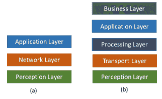
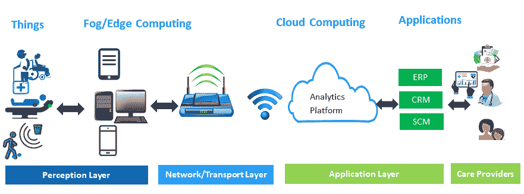
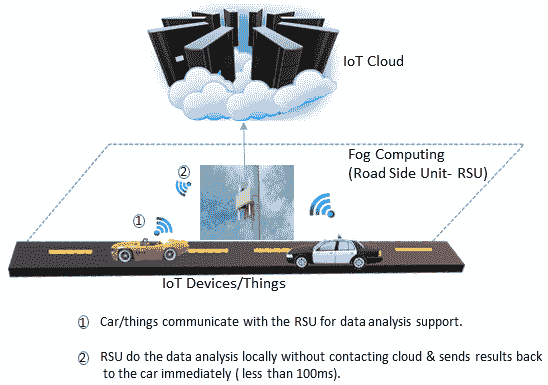
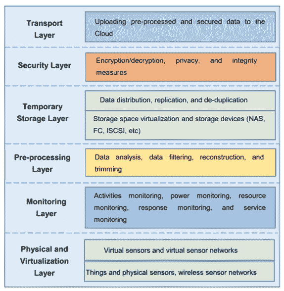
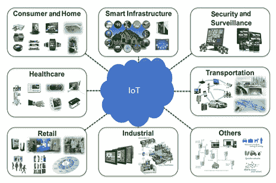
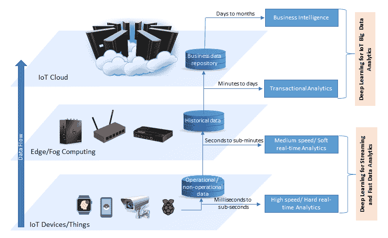
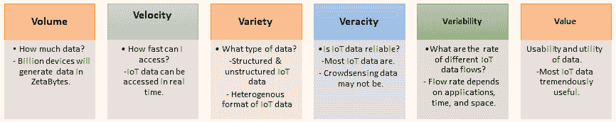
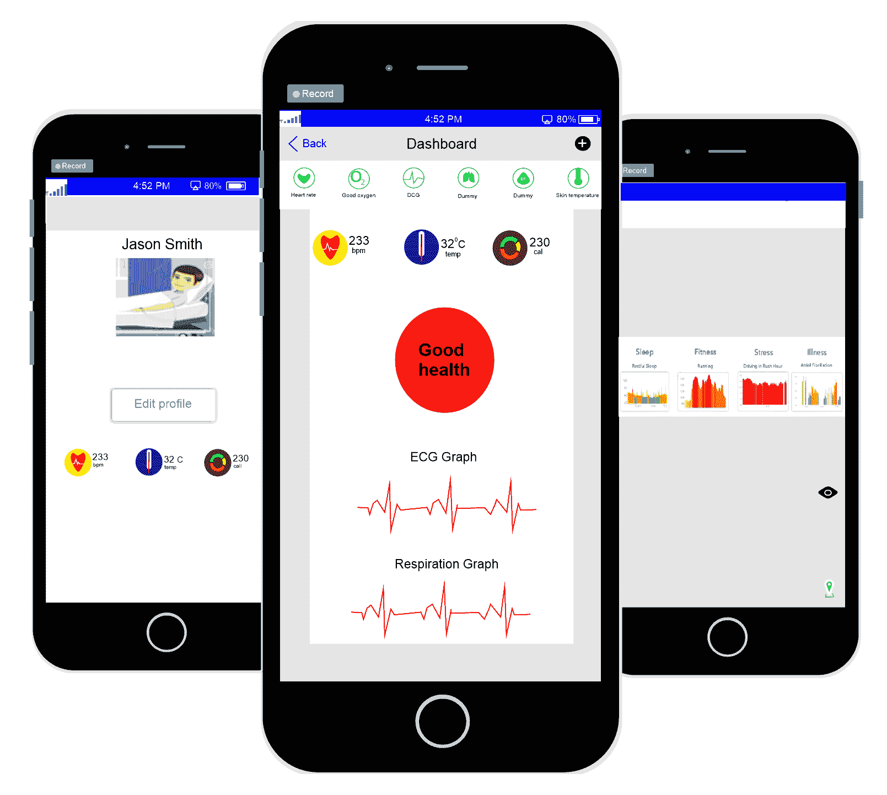
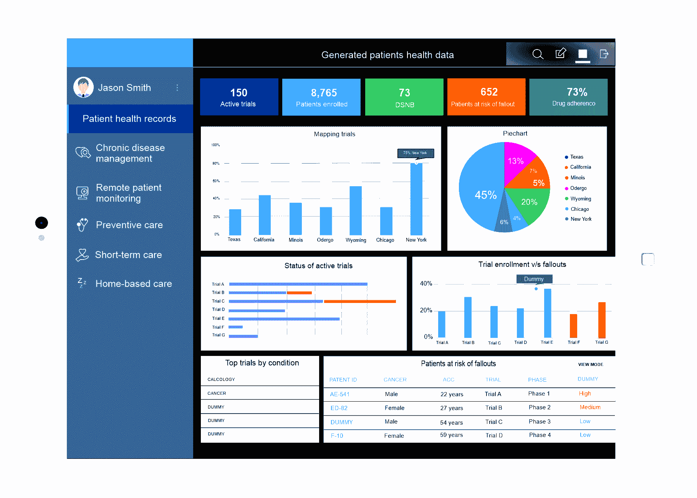

# 第一章：物联网的端到端生命周期

通过使人们能够轻松访问并与各种物理设备及其环境互动，**物联网**（**IoT**）将促进各个领域应用的开发，如健康医疗、智能能源管理和智能电网、交通、交通管理等。这些应用将产生大量实时/流数据，需要大数据分析工具，包括先进的机器学习，即**深度学习**（**DL**），以提取有用信息并做出明智决策。为了能够在物联网应用生成的数据上应用先进的机器学习技术，我们需要了解物联网的**端到端**（**E2E**）生命周期及其不同组件。

在本章中，我们将讨论物联网的 E2E 生命周期及其相关概念和组件。我们将探讨其关键特性以及物联网数据问题，这些问题要求在物联网中使用深度学习（DL）。我们将涵盖以下主题：

+   物联网的 E2E 生命周期：

    +   IoT 应用领域：

        +   分析在物联网中的重要性

        +   使用深度学习（DL）进行物联网数据分析的动机

+   物联网数据的关键特性和需求

# 物联网的 E2E 生命周期

不同的组织和行业对物联网有不同的描述。一种简单且直观的定义方法是将物联网视为一个智能物体网络，连接物理世界与数字世界。研究物联网解决方案的 E2E 生命周期，或更一般地说，研究物联网生态系统的生命周期，有助于我们更好地理解它，并展示它如何与机器学习和深度学习相关联。

与物联网的定义类似，关于 E2E 生命周期或物联网架构，并没有达成全球统一的共识。不同的研究者提出了不同的架构或层次。最常见的提议是三层和五层生命周期或架构，如下图所示：

在前面的图示中，**(a)** 展示了三层物联网生命周期或架构，**(b)** 展示了五层物联网生命周期或架构。

# 三层 E2E 物联网生命周期

这是物联网解决方案中最基本且广泛使用的 E2E 生命周期。它由三个层次组成：感知层、网络层和应用层。它们可以如下描述：

+   **感知层**：这是物理层或传感层，包括具有传感器的物体或设备，用于收集它们周围环境的信息。如以下图示所示，医疗保健领域的物联网 E2E 生命周期的感知层由配备传感器的患者、病床和轮椅组成。

+   **网络层**：网络负责连接其他智能设备、网络设备和服务器。它还负责传输和处理传感器数据。

+   **应用层**：该层负责根据传感器数据为用户提供特定应用的服务。它定义了物联网可以部署的各种应用，例如智能家居、智慧城市和健康连接。

下图展示了医疗健康领域的三层端到端物联网生命周期：

三层端到端物联网生命周期或架构定义了物联网的关键理念，但对于研发而言可能不足够，因为这些通常涉及物联网的更细微方面。这就是为什么提出了其他生命周期或架构，例如五层生命周期。

# 五层物联网端到端生命周期

五层物联网生命周期由感知、传输、处理、应用和业务层组成。感知层和应用层的作用与三层架构中的相同。我们简要概述剩余三层的功能如下：

+   **传输层**：这类似于三层生命周期中的网络层。它通过无线、3G、局域网、蓝牙、RFID 和 NFC 等网络将感知层收集到的数据传输到处理层，反之亦然。

+   **处理层**：这也被称为**中间件层**。它存储、分析和处理来自传输层的大量数据，并可以管理并为下层提供各种服务。它采用许多技术，如数据库、云计算和大数据处理模块。

+   **业务层**：该层管理整个物联网系统，包括应用程序、商业和利润模型以及用户隐私。

# 物联网系统架构

了解物联网系统的架构对于开发应用程序至关重要。同时，在不同的计算平台层次（包括雾层和云层）中考虑我们的数据处理需求也同样重要。考虑到许多物联网应用（如前图所示的医疗健康领域的物联网解决方案）的关键性和延迟敏感性，雾计算对于这些应用至关重要。下图简要展示了雾计算的工作原理：

如前图所示，在雾计算中，物体（如汽车）的数据不会移动到云端进行处理。通过这种方式，雾计算解决了云计算在物联网中面临的许多挑战（如高延迟、停机时间、安全性、隐私和信任），并提供了许多好处，如位置感知、低延迟、对移动性的支持、实时互动、可扩展性和业务敏捷性。下图展示了雾计算的协议层次架构：

如前图所示，雾计算或与物联网结合的雾计算架构由六层组成：物理和虚拟化、监控、预处理、临时存储、安全和传输。特别是，预处理层通过分析、过滤和修剪来自物理或虚拟传感器的收集数据，执行数据管理任务。

# 物联网应用领域

通过使各种物理设备或物品（如车辆、机器、医疗传感器等）的便捷访问和交互成为可能，物联网促进了许多不同领域应用的开发。以下图表突出了物联网的关键应用领域：

这些应用包括医疗保健、工业自动化（即工业 4.0）、能源管理和智能电网、交通运输、智能基础设施（如智能家居和智能城市）、零售以及许多其他将改善我们生活和社会的领域。这些应用到 2025 年将产生每年 4 万亿到 11 万亿美元的全球经济影响。此项资金的主要贡献者（按预计贡献的顺序）包括：

+   工厂或工业，包括运营管理和预测性维护

+   城市，包括公共安全、健康、交通控制和资源管理

+   医疗保健，包括监控和管理疾病以及改善健康

+   零售，包括自助结账和库存管理

+   能源，包括智能电网

这些应用程序的巨大需求意味着物联网（IoT）服务及其生成的大数据的惊人且迅猛的增长。

# 物联网中分析的重要性

物联网在各个应用领域的使用只有在这些应用能够从物联网设备生成和收集的数据中提取一些商业价值时才会有效。在这种背景下，物联网数据的分析在物联网解决方案中至关重要。Gartner 将物联网分析视为物联网中使用的两大核心技术之一。

物联网分析是将数据分析工具和程序应用于从物联网设备生成的大量数据中提取见解。物联网分析对于从物联网设备或物品生成的数据中提取洞察至关重要。更具体地说，物联网商业模型通过多种方式分析物品生成和收集的信息——例如，用于理解客户行为、提供服务、改善产品和服务以及识别和拦截商业时机。大多数物联网商业模型或应用程序在理解数据时的主要元素是智能学习或机器学习机制，用于预测、数据挖掘和模式识别。传统的机器学习机制或技术在处理结构化数据时效果很好，但在处理非结构化数据时则存在困难。

一个例子是谷歌的 Nest 智能学习温控器，它以结构化的方式记录温度数据，然后应用机器学习算法来理解用户的温度偏好和日程模式。然而，它无法理解非结构化数据，如多媒体数据，包括音频信号和视觉图像。此外，传统机器学习算法的训练依赖于手工制作的特征集，这在许多物联网应用中可能不容易实现，因为这些应用涉及到异构性和动态性。例如，在工厂中，故障可能是随机的，特征集可能无法用于分类。因此，物联网需要新的分析方法，包括深度学习（DL）。

# 在物联网数据分析中使用深度学习的动机

近年来，许多物联网应用积极采用复杂的深度学习技术，这些技术利用神经网络捕捉和理解环境。例如，亚马逊 Echo 被认为是一个物联网应用，它通过深度学习技术连接物理世界和人类世界与数字世界；它能够通过深度学习理解人类的语音命令。

此外，微软的 Windows 面部识别安全系统（一个物联网应用）利用深度学习技术执行任务，如在识别到用户面部时解锁门。深度学习和物联网是 2017 年三大战略技术趋势之一，并在 2016 年 Gartner Symposium/ITxpo 大会上宣布。深度学习的广泛宣传是因为传统机器学习算法未能满足物联网系统日益增长的分析需求。相反，深度学习算法或模型相比传统的机器学习方法，带来了两个重要的改进。首先，它们减少了使用手工制作的特征集来训练模型的需求。因此，物联网应用中的一些特征，即使人类难以察觉，也可以通过深度学习模型轻松提取。此外，深度学习模型还提高了预测准确性。

然而，在物联网应用中，尤其是在边缘计算设备、雾计算设备和终端设备中启用深度学习是困难的，因为这些设备资源有限。此外，物联网数据与一般的大数据有所不同。我们需要探讨物联网数据的特性以及它们与一般大数据的不同之处，以更好地理解物联网数据分析的需求。

# 物联网数据的关键特征和需求

物联网应用的数据展现出两个需要不同处理的特点。许多物联网应用，如远程病人监控或自动驾驶汽车，持续生成数据流，这会导致大量持续的数据。许多其他应用程序，如用于营销的消费者产品分析或森林或水下的居民监测，生成的数据会积累成为大数据的来源。流数据是在短时间间隔内生成或捕获的，需要快速分析以提取即时的、有用的洞察并做出快速决策。

相反，大数据一词指的是常用硬件和软件平台无法存储、管理、处理和分析的庞大数据集。这两种数据需要不同的处理方式，因为它们对分析响应的要求不同。

大数据分析的结果，例如商业智能和交易分析，可能需要几天的数据生成才能交付，但流数据分析的结果应该在几百毫秒到几秒钟内准备好。例如，在无人驾驶汽车中，紧急刹车情况下的响应时间需要大约 100 毫秒。以下图表突出显示了物联网数据的关键特征及其分析需求：

许多物联网（IoT）应用程序，例如用于监控实时平均温度的应用程序，依赖于多个数据源。数据融合、聚合和共享在这些应用中起着至关重要的作用。对于时间敏感的物联网应用，诸如远程病人监控或无人驾驶汽车等，数据的及时聚合至关重要，这有助于将所有数据汇聚在一起进行分析，并随后提供可靠、准确的可操作洞察。

一般来说，即使在高性能计算系统或云平台中，流数据的分析也是一项挑战。流数据分析的潜在解决方案是基于数据并行性和增量处理的框架。尽管这些技术可以减少时间延迟并从流数据分析框架中返回响应，但它们并不是实时物联网应用的最佳解决方案。在这种情况下，更好的方法是将流数据分析带到数据源的更接近位置，通过物联网设备或边缘设备，并借助雾计算或边缘计算的支持。然而，将数据分析添加到物联网设备或物体中会引入新的挑战，如数据源的计算、存储和电力资源的限制。

物联网通过将数十亿个智能设备连接起来，并频繁收集设备及其环境的状态数据，负责生成大数据。从原始传感器获得的海量数据中识别并挖掘有意义的模式是物联网应用中大数据分析的核心功能，因为它为决策制定和趋势预测提供了进一步的洞察。通过提取这些洞察，物联网大数据对许多企业具有极大的重要性，因为它使企业能够在竞争中占得先机。以下图表突出展示了物联网大数据的特点，使用了**六个 V**（**6Vs**）：

# 现实生活中快速流动的物联网数据实例

远程病人监测是物联网在医疗健康领域最明显且最受欢迎的应用之一。通过这一应用，有时也称为**远程健康**，病人将与护理提供者连接，必要时可获得实时反馈。此应用所产生的数据，如心率或血压的变化，是流数据，需要快速处理，以便护理提供者能及时回应病人的情况。

以下图表展示了一个市售的远程病人监测系统的快照：

# 物联网大数据的现实生活实例

智能电网是物联网大数据的重要来源。智能电表在智能电网系统中发挥着重要作用，它通过精确测量用户的能源消耗来生成和收集数据。目前，许多国家的能源供应商对学习本地能源消耗模式、预测客户需求并根据实时分析做出适当决策非常感兴趣。

物联网大数据的另一个例子是智能设备生成的数据。以下图表展示了使用物联网数据进行消费者产品分析和营销的过程：

如前图所示，支持物联网的远程病人监测系统可以生成大量数据，这些数据需要被处理、存储和分析。然而，智能设备，如智能咖啡机、智能冰箱和智能售货机，也能生成大数据，这些数据可用于消费者产品分析。

# 总结

在本章中，我们展示了物联网（IoT）端到端生命周期的两种不同层次视图。我们还探讨了物联网系统架构以及物联网的关键应用领域。接着，我们定义了物联网分析的含义及其在物联网应用中的重要性，特别强调了深度学习（DL）。我们讨论了物联网的关键特性及其在分析中的相应需求。最后，我们展示了一些真实的物联网示例，这些示例生成快速流式数据和大数据。在下一章中，您将了解几种常见的深度学习模型以及近年来出现的最前沿架构，并学习它们如何在分析物联网流数据和大数据中发挥作用。

要在不同的物联网应用中使用深度学习模型，了解不同深度学习模型的基础知识以及它们的不同实现框架至关重要。在下一章中，我们将介绍一些流行的深度学习模型，包括卷积神经网络、长短期记忆网络和自编码器。除此之外，我们还将讨论一些流行的深度学习开发框架，包括 TensorFlow 和 Keras。

# 参考文献

+   Pallavi Sethi 和 Smruti R. Sarangi，*物联网：架构、协议与应用*，《电气与计算机工程杂志》，第 2017 卷，文章编号 9324035，共 25 页，2017 年。

+   Atlam, H.F.; Walters, R.J.; Wills, G.B. *雾计算与物联网：综述*，《大数据认知计算》，2018 年，第 2 期，第 10 页。

+   James Manyika, Michael Chui, Peter Bisson, Jonathan Woetzel, Richard Dobbs, Jacques Bughin 和 Dan Aharon，*释放物联网的潜力*，在线获取链接：[`www.mckinsey.com/business-functions/digital-mckinsey/our-insights/the-internet-of-things-the-value-of-digitizing-the-physical-world`](https://www.mckinsey.com/business-functions/digital-mckinsey/our-insights/the-internet-of-things-the-value-of-digitizing-the-physical-world)。

+   Stamford, Conn，*Gartner 识别 2017 年和 2018 年十大物联网技术*，在线获取链接：[`www.gartner.com/newsroom/id/3221818`](https://www.gartner.com/newsroom/id/3221818)。

+   J. Tang, D. Sun, S. Liu 和 J. Gaudiot，*在物联网设备上实现深度学习*，《计算机》，第 50 卷，第 10 期，第 92-96 页，2017 年。

+   M. Mohammadi, A. Al-Fuqaha, S. Sorour 和 M. Guizani，*物联网大数据与流式分析的深度学习：一项调查*，IEEE《通信调查与教程》，DOI: 10.1109/COMST.2018.2844341。

+   K. Panetta（2016），*Gartner 的 2017 年十大战略技术趋势*，在线获取链接：[`www:gartner:com/smarterwithgartner/gartners-top-10-technology-trends-2017/`](http://www:gartner:com/smarterwithgartner/gartners-top-10-technology-trends-2017/)。

+   [`www.napierhealthcare.com/lp/remote-patient-telehealth-monitoring?gclid=CjwKCAjwxILdBRBqEiwAHL2R865Aep4MKgFknoctRLDOk3VtSNQWiRdTFyRR-e2es-yaz_e6Dp6hNhoCmV4QAvD_BwE`](https://www.napierhealthcare.com/lp/remote-patient-telehealth-monitoring?gclid=CjwKCAjwxILdBRBqEiwAHL2R865Aep4MKgFknoctRLDOk3VtSNQWiRdTFyRR-e2es-yaz_e6Dp6hNhoCmV4QAvD_BwE).

+   [`www.softwareadvice.com/resources/iot-data-analytics-use-cases/`](https://www.softwareadvice.com/resources/iot-data-analytics-use-cases/).
