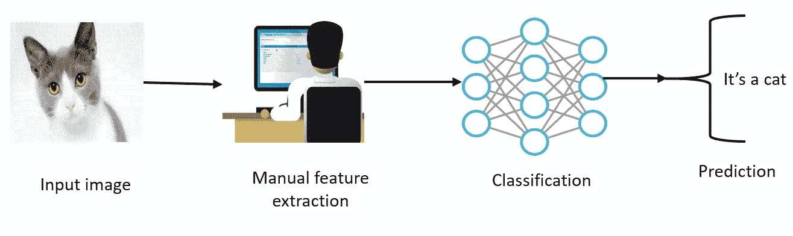
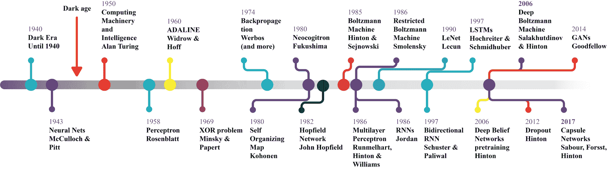
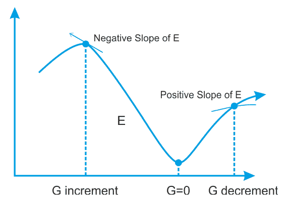

# 第二章：物联网的深度学习架构

在**物联网**（**IoT**）时代，来自众多传感设备的大量感知数据正被生成和收集，这些数据涵盖了广泛的领域和应用。对这些数据流进行分析，发现新信息、预测未来洞察并做出控制决策，是一项具有挑战性的任务，这使得物联网成为商业智能和提高生活质量技术的一个有价值的范式。然而，在物联网启用的设备上进行分析需要一个平台，该平台包括**机器学习**（**ML**）和**深度学习**（**DL**）框架、软件堆栈和硬件（例如，**图形处理单元**（**GPU**）和**张量处理单元**（**TPU**））。

本章将讨论一些深度学习（DL）架构和平台的基本概念，这些概念将在后续章节中使用。我们将从简要介绍机器学习（ML）开始。然后，我们将转向深度学习，深度学习是机器学习的一个分支，它基于一组算法，旨在对数据中的高级抽象进行建模。我们将简要讨论一些最著名且广泛使用的神经网络架构。接着，我们将探讨用于在物联网（IoT）设备上开发深度学习应用的各种深度学习框架和库的特性。简而言之，以下主题将被涵盖：

+   机器学习的软介绍

+   人工神经网络

+   深度神经网络架构

+   深度学习框架

# 机器学习的软介绍

机器学习方法基于一组统计和数学算法，执行分类、回归分析、概念学习、预测建模、聚类和有用模式挖掘等任务。通过使用机器学习，我们旨在自动改进整个学习过程，从而不再需要完全依赖人工干预，或者至少能够尽可能减少这种干预。

# 学习算法的工作原理

Tom M. Mitchell 从计算机科学的角度解释了学习的真正含义：

“一个计算机程序如果在某类任务 T 和性能衡量 P 下，随着经验 E 的积累，其在任务 T 上的表现（由 P 衡量）得到改进，则该程序被认为从经验 E 中学习。”

根据这一定义，我们可以得出结论，一个计算机程序或机器可以做到以下几点：

+   从数据和历史中学习

+   随经验改进

+   迭代地增强一个可用于预测问题结果的模型

由于前述要点是预测分析的核心，几乎我们使用的每个机器学习算法都可以视为一个优化问题。这涉及到寻找最小化目标函数的参数；例如，两个项的加权和，如代价函数和正则化。通常，目标函数有两个组成部分：

+   控制模型复杂度的正则化器

+   衡量模型在训练数据上误差的损失函数

另一方面，正则化参数定义了在最小化训练误差和模型复杂度之间的权衡，以避免过拟合问题。如果这两个组件都是凸的，那么它们的和也是凸的。因此，在使用机器学习算法时，目标是获得最佳超参数，使得在进行预测时返回最小误差。因此，通过使用凸优化技术，我们可以最小化该函数，直到它收敛到最小误差。

假设一个问题是凸的，通常更容易分析算法的渐进行为，这表明随着模型观察到越来越多的训练数据，它的收敛速度如何。机器学习的任务是训练一个模型，使其能够从给定的输入数据中识别复杂的模式，并以自动化的方式做出决策。因此，进行预测的关键是将模型应用于新的（即未观察到的）数据，并评估模型本身的性能。然而，在整个过程中，为了使预测模型成为成功的，数据在所有机器学习任务中都扮演着第一类公民的角色。实际上，我们馈送给机器学习系统的数据必须由数学对象组成，如向量，以便它们可以处理这些数据。

根据可用数据和特征类型，预测模型的性能可能会发生剧烈波动。因此，选择正确的特征是模型评估前最重要的步骤之一。这被称为**特征工程**，其中使用与数据相关的领域知识来创建仅对模型有用的选择性特征，以帮助准备特征向量供机器学习算法使用。

例如，比较酒店是相当困难的，除非我们已经有多次住酒店的个人经验。然而，在一个已经通过成千上万的评论和特征（例如酒店的星级、房间大小、位置、客房服务等）训练好的机器学习模型的帮助下，这变得相当可行。我们将在各章中看到几个例子。然而，在开发这样一个机器学习模型之前，了解一些机器学习概念也是很重要的。

# 通用机器学习经验法则

通用的机器学习经验法则是，数据越多，预测模型越好。然而，拥有更多特征往往会制造混乱，甚至会严重降低性能，特别是在数据集是多维的情况下。整个学习过程需要将输入数据集拆分为三种类型（或者已经提供为这种类型）：

+   **训练集**是来自历史或实时数据的知识库，用于拟合机器学习算法的参数。在训练阶段，机器学习模型利用训练集找到网络的最优权重，并通过最小化训练误差来达到目标函数。在这里，反向传播规则或优化算法被用来训练模型，但所有超参数必须在学习过程开始之前设置好。

+   **验证集**是一组用于调整机器学习模型参数的示例。它确保模型训练得当，并且能够避免过拟合。一些机器学习实践者也将其称为开发集（dev 集）。

+   **测试集**用于评估训练好的模型在未见数据上的表现。这个步骤也被称为**模型推理**。在测试集上评估最终模型之后（即，当我们完全满意模型的表现时），我们不再需要调整模型，训练好的模型可以部署到生产环境中。

一种常见的做法是将输入数据（经过必要的预处理和特征工程后）分为 60%用于训练，10%用于验证，20%用于测试，但这实际上取决于具体的使用场景。有时，我们还需要根据数据集的可用性和质量对数据进行上采样或下采样。这种关于不同类型训练集的经验法则在不同的机器学习任务中可能会有所不同，我们将在下一节讨论这一点。然而，在此之前，让我们快速回顾一下机器学习中的一些常见现象。

# 机器学习模型中的常见问题

当我们使用这些输入数据进行训练、验证和测试时，通常学习算法无法做到 100%准确，这涉及训练、验证和测试误差（或损失）。在机器学习模型中，你可能会遇到两种类型的误差：

+   不可约误差

+   可约误差

不可约误差即使使用最强大、最复杂的模型也无法减少。然而，可约误差有两个组成部分，分别称为偏差和方差，它们是可以减少的。因此，为了理解模型（即预测误差），我们需要专注于偏差和方差。偏差是指预测值与实际值之间的距离。通常，如果平均预测值与实际值（标签）之间的差距很大，则偏差较高。

一个机器学习模型可能会有较高的偏差，因为它无法建模输入和输出变量之间的关系（无法很好地捕捉数据的复杂性），因此变得非常简单。因此，一个过于简单且具有高方差的模型会导致数据的欠拟合。下图提供了一些高级的见解，并展示了一个恰到好处的拟合模型应该是什么样子：

方差表示预测值与实际值之间的变动性（它们的分散程度）。如果模型的训练误差很高，而且验证误差或测试误差与训练误差相同，则模型有很高的偏差。另一方面，如果模型的训练误差较低，但验证误差或测试误差较高，则模型具有较高的方差。一个机器学习模型通常在训练集上表现得非常好，但在测试集上表现不佳（因为错误率很高）。最终，这会导致欠拟合的模型。我们可以再次回顾过拟合和欠拟合：

+   **欠拟合**：如果你的训练误差和验证误差都相对较高且非常相似，那么你的模型很可能是在欠拟合你的训练数据。

+   **过拟合**：如果你的训练误差很低，而验证误差很高，那么你的模型很可能是在过拟合你的训练数据。恰到好处的拟合模型不仅能很好地学习，而且在未见过的数据上也表现更好。

偏差-方差权衡：高偏差和高方差问题通常被称为偏差-方差权衡，因为一个模型不能同时过于复杂或过于简单。理想情况下，我们努力寻找一个具有低偏差和低方差的最佳模型。

现在我们知道了机器学习（ML）算法的基本工作原理。然而，根据问题的类型和解决问题的方法，机器学习任务可能有所不同；例如，有监督学习、无监督学习和强化学习。我们将在下一节中更详细地讨论这些学习任务。

# 机器学习任务

尽管每个机器学习问题或多或少都是一个优化问题，但解决这些问题的方法可能有所不同。事实上，学习任务可以分为三种类型：有监督学习、无监督学习和强化学习。

# 有监督学习

有监督学习是最简单且最知名的自动学习任务。它基于一组预定义的示例，其中每个输入应属于的类别已经知道，如下图所示：

上面的图示展示了有监督学习的典型工作流程。一个执行者（例如，数据科学家或数据工程师）执行**提取**、**转换**、**加载**（**ETL**）以及必要的特征工程（包括特征提取、选择等），以获取包含特征和标签的适当数据，这样数据就可以被输入到模型中。然后，他们将数据分为训练集、开发集和测试集。训练集用于训练机器学习模型，验证集用于验证训练过程中的过拟合问题和正则化，然后执行者会评估模型在测试集（即未见过的数据）上的表现。

然而，如果性能不尽如人意，执行者可以通过超参数优化进行额外的调整，以获得最佳模型。最终，他们会将最佳模型部署到生产环境中。在整个生命周期中，可能会涉及许多执行者（例如，数据工程师、数据科学家或机器学习工程师），每个人独立或协作地执行每一步。监督学习的背景包括分类和回归任务；分类用于预测一个数据点属于哪个类别（离散值），也用于预测类别属性的标签。下图简要总结了这些步骤：

另一方面，回归用于预测连续值，并对类别属性进行数值预测。在监督学习的背景下，输入数据集的学习过程通常会随机划分成三个子集；例如，60% 用于训练集，10% 用于验证集，剩下的 30% 用于测试集。

# 无监督学习

如果没有给定标签，你将如何总结和归类一个数据集？你可能会通过找到数据集的潜在结构，并衡量其统计特性，如频率分布、均值和标准差来回答这个问题。如果问题是如何有效地以压缩格式表示数据，你可能会回答说你会使用某些软件进行压缩，尽管你可能不知道这些软件是如何实现压缩的。下图展示了一个典型的无监督学习任务的工作流程：

这正是无监督学习的两个主要目标，它在很大程度上是一个数据驱动的过程。我们称这种学习方式为无监督，因为你将不得不处理无标签数据。以下引述来自 AI 研究负责人 Yann LeCun（来源：*预测学习*，NIPS 2016，Yann LeCun，Facebook 研究）：

"大多数人类和动物的学习都是无监督学习。如果智力是一块蛋糕，那么无监督学习就是蛋糕本身，监督学习是蛋糕上的糖霜，强化学习则是蛋糕上的樱桃。我们知道如何制作糖霜和樱桃，但我们不知道如何做蛋糕。在我们甚至开始考虑实现真正的人工智能之前，我们需要解决无监督学习的问题。"

一些最广泛使用的无监督学习任务包括以下内容：

+   **聚类**：根据相似性（或统计特性）将数据点分组，例如，像 Airbnb 这样的公司通常会将其公寓和房屋按邻里分组，以便客户更容易地浏览列出的房源

+   **降维**：尽可能保留数据的结构和统计特性来压缩数据，例如，通常需要减少数据集的维度以便进行建模和可视化

+   **异常检测**：在多个应用中非常有用，例如识别信用卡欺诈、在工业工程过程中识别故障硬件以及识别大规模数据集中的异常值

+   **关联规则挖掘**：通常用于市场篮子分析，例如，询问哪些商品经常一起购买

# 强化学习

强化学习是一种人工智能方法，专注于通过与环境的互动来学习。在强化学习中，系统的参数会根据从环境中获得的反馈进行调整，而环境会根据系统做出的决策提供反馈。下面的图示展示了一个人为了到达目的地而做出决策的过程。让我们举一个你从家到公司通勤路线的例子：

我们可以通过一个建模象棋选手的系统来再举一个例子。为了提高其表现，系统会利用之前行动的结果；这样的系统被称为通过强化学习的系统。在这种情况下，你每天都走相同的路线去上班。然而，有一天，你突然产生了好奇心，决定尝试一条不同的路线，目的是找到最短的路径。类似地，基于你在不同路线上的经验和所花的时间，你会决定是否应该更频繁地走这条特定路线。我们可以再举一个关于建模象棋选手的系统的例子。

到目前为止，我们已经学习了机器学习的基本工作原理以及不同的学习任务。接下来，让我们通过一些示例用例来看看每个学习任务。

# 带应用的学习类型

我们已经了解了机器学习算法的基本工作原理，知道了基本的机器学习任务是什么，并且它们是如何构建领域特定问题的。然而，每个学习任务都可以通过不同的算法来解决。下面的图示给我们提供了一个简要的了解：

然而，上述图示仅列出了使用不同机器学习任务的一些用例和应用。实际上，机器学习在众多用例和应用中都有广泛的使用。我们将在本书中尽力覆盖其中的一些。

# 深入了解深度学习

在常规数据分析中使用的简单机器学习方法已经不再有效，应当用更强大的机器学习方法来替代。尽管经典的机器学习技术能够帮助研究者识别相关变量的组或簇，但随着数据量增大和维度增多，这些方法的准确性和有效性会降低。

# 深度学习是如何将机器学习提升到一个新水平的？

在小规模数据分析中使用的简单机器学习方法，在处理大规模和高维数据集时并不有效。然而，深度学习（DL）作为机器学习的一个分支，基于一组算法，试图对数据进行高层次抽象建模，能够解决这一问题。Ian Goodfellow 在他的书《*深度学习*，MIT 出版社，2016 年》中是这样定义深度学习的：

“深度学习是一种特殊的机器学习方式，通过学习将世界表示为概念的嵌套层次结构，每个概念是相对于更简单的概念来定义的，更抽象的表示通过更不抽象的表示来计算，从而实现了强大的能力和灵活性。”

与机器学习模型类似，深度学习模型也接受一个输入`X`，并从中学习高层次的抽象或模式，从而预测输出`Y`。例如，基于过去一周的股价，深度学习模型可以预测下一天的股价。当在这样的历史股数据上进行训练时，深度学习模型会尽量减少预测值和实际值之间的差异。通过这种方式，深度学习模型尝试对之前未见过的输入进行泛化，并对测试数据做出预测。

现在你可能会想，如果机器学习模型可以完成相同的任务，为什么我们还需要深度学习呢？其实，深度学习模型在处理大量数据时表现得很好，而传统的机器学习模型在达到某个点后就不再改进。深度学习的核心概念，受到大脑结构和功能的启发，被称为**人工神经网络**（**ANNs**）。

在深度学习的核心，人工神经网络（ANNs）帮助你学习输入和输出之间的关联，从而做出更强大、更准确的预测。然而，深度学习不仅限于人工神经网络；随着理论的进步、软件堆栈的完善和硬件的改进，深度学习已经普及到大众中。让我们来看一个例子，假设我们要开发一个预测分析模型，比如一个动物识别器，我们的系统必须解决两个问题：

+   判断一张图片是猫还是狗

+   对猫狗图片进行聚类。

如果我们使用典型的机器学习方法来解决第一个问题，我们必须定义面部特征（耳朵、眼睛、胡须等），并编写方法来识别哪些特征（通常是非线性的）在分类特定动物时更为重要。然而，同时我们无法解决第二个问题，因为经典的机器学习聚类算法（如 k-means）无法处理非线性特征。看看下面的图示，它展示了我们在分类给定图像是否为猫时需要遵循的工作流程：

DL 算法将这两个问题进一步推进，最重要的特征将在确定哪些特征对分类或聚类最为重要后自动提取。相比之下，使用经典的机器学习算法时，我们必须手动提供特征。而 DL 算法则采取更复杂的步骤。例如，首先，它识别出在聚类猫或狗时最相关的边缘。然后，它尝试以层次结构的方式找到各种形状和边缘的组合，这被称为 ETL。

然后，在经过几次迭代后，它进行复杂概念和特征的层次化识别。接着，基于已识别的特征，DL 算法将决定哪些特征对分类动物最为重要。这个步骤被称为特征提取。最后，它提取出标签列，并使用**自编码器**（**AEs**）进行无监督训练，提取潜在特征，然后将其重新分配给 k-means 进行聚类。接着，**聚类分配硬化损失**（**CAH 损失**）和重建损失被共同优化，以达到最佳的聚类分配。

然而，在实际应用中，DL 算法接收到的是原始图像表示，这并不像我们看到的图像那样理解图像，因为它只知道每个像素的位置和颜色。图像被分解成多个分析层次。例如，在较低层次，软件会分析一小块像素网格，任务是检测某种颜色或各种细微的色调变化。如果检测到某些信息，它会通知下一层，此时这一层检查该颜色是否属于更大的形态，如一条线。这个过程一直持续到更高层次，直到算法理解以下图所示的内容：

虽然区分狗与猫是一个非常简单的分类器示例，但能够做这些事情的软件现在已经广泛应用，并且出现在面部识别系统中，或例如在 Google 上搜索图像的系统中。这类软件是基于 DL 算法的。相反，如果我们使用线性机器学习算法，就无法构建这样的应用，因为这些算法无法处理非线性的图像特征。

此外，使用机器学习方法时，我们通常只需处理少量的超参数。然而，当神经网络介入时，情况变得非常复杂。每一层中都有成千上万甚至数十亿个超参数需要调整——如此之多，以至于成本函数变得非凸。另一个原因是，隐藏层中使用的激活函数是非线性的，因此成本也是非凸的。我们将在后面的章节中更详细地讨论这一现象，但现在先简要看看人工神经网络（ANNs）。

# 人工神经网络

人工神经网络（ANNs）受到人类大脑工作方式的启发，构成了深度学习（DL）的核心及其真正实现。今天围绕深度学习的革命，如果没有 ANNs，是不可能发生的。因此，要理解深度学习，我们需要理解神经网络的工作原理。

# 人工神经网络与人类大脑

人工神经网络代表了人类神经系统的一个方面，神经系统由大量相互沟通的神经元组成，神经元通过轴突进行信息传递。感受器接收来自内外部世界的刺激，然后将这些信息传递给生物神经元进行进一步处理。除了轴突，还有许多树突存在。在轴突的末端，有一些微小结构叫做突触末端，用来将一个神经元与其他神经元的树突连接起来。生物神经元接收到来自其他神经元的短电流脉冲，称为信号，作为回应，它们会触发自己的信号。

因此，我们可以总结出，神经元由一个细胞体（也称为**体 soma**）、一个或多个树突用于接收来自其他神经元的信号，以及一个轴突用于传递神经元生成的信号。当神经元向其他神经元发送信号时，它处于活动状态。然而，当它接收来自其他神经元的信号时，它处于非活动状态。在空闲状态下，神经元会积累接收到的所有信号，直到达到某个激活阈值。这个过程促使研究人员测试人工神经网络（ANNs）。

# 人工神经网络的简史

受生物神经元工作原理的启发，沃伦·麦卡洛克（Warren McCulloch）和沃尔特·皮茨（Walter Pitts）于 1943 年提出了第一个人工神经元模型，这一模型是神经活动的计算模型。这个简单的生物神经元模型，也被称为**人工神经元**（**AN**），具有一个或多个二进制（开/关）输入和仅一个输出。当超过某个数量的输入处于活动状态时，人工神经元便激活其输出。

这个例子听起来太简单，但即便是这样一个简化模型，也能构建起人工神经元网络。然而，这些网络也可以组合起来计算复杂的逻辑表达式。这个简化模型激发了约翰·冯·诺依曼（John von Neumann）、马文·明斯基（Marvin Minsky）、弗兰克·罗斯恩布拉特（Frank Rosenblatt）等人，于 1957 年提出了另一个模型——**感知器**（**perceptron**）。感知器是过去 60 年我们看到的最简单的人工神经网络架构之一。它基于一个略有不同的人工神经元，叫做**线性阈值单元**（**LTU**）。唯一的区别是，输入和输出现在是数字，而非二进制的开/关值。每个输入连接都关联一个权重。LTU 计算其输入的加权和，然后将一个阶跃函数（类似于激活函数的作用）应用于该和，并输出结果。

感知机的一个缺点是它的决策边界是线性的。因此，它们无法学习复杂的模式，也无法解决一些简单的问题，如**异或**（**XOR**）问题。然而，后来通过堆叠多个感知机，称为**MLP**，在一定程度上克服了感知机的局限性。因此，ANNs 和深度学习（DL）领域的最重要进展可以通过以下时间线来描述。我们已经讨论过，人工神经元和感知机分别为 1943 年和 1958 年提供了基础。1969 年，Marvin *Minsky* 和 Seymour *Papert* 将 XOR 问题定义为一个线性不可分的问题，随后在 1974 年，Paul *Werbos* 展示了用于训练感知机的反向传播算法。

然而，最重要的进展发生在 1982 年，当时 John Hopfield 提出了 Hopfield 网络。随后，神经网络和深度学习的奠基人之一——Hinton 及其团队——在 1985 年提出了 Boltzmann 机。1986 年，Geoffrey Hinton 成功地训练了 MLP，而 Jordan M.I.提出了 RNN。同年，Paul Smolensky 还提出了 Boltzmann 机的改进版——**限制玻尔兹曼机**（**RBM**）。接着，1990 年，Lecun 等人提出了 LeNet，这是一种深度神经网络架构。以下是简要概览，请参阅下图：

90 年代最重要的一年是 1997 年，当时 Jordan 等人提出了**递归神经网络**（**RNN**）。同年，Schuster 等人提出了**长短期记忆**（**LSTM**）的改进版，并提出了原始 RNN 的改进版本——双向 RNN。

尽管计算机技术取得了显著进展，但从 1997 年到 2005 年，我们并未看到太多进展。直到 2006 年，**Hinton**再次带来了突破，他和他的团队通过堆叠多个 RBM 提出了**深度置信网络**（**DBN**）。随后，在 2012 年，Hinton 发明了 dropout 技术，显著改善了深度神经网络中的正则化和过拟合问题。之后，Ian Goodfellow 等人介绍了 GANs——这是图像识别领域的一个重大里程碑。2017 年，Hinton 提出了 CapsNet，旨在克服传统 CNN 的局限性，这至今仍是一个非常重要的里程碑。我们将在本章后续部分讨论这些架构。

# 神经网络是如何学习的？

基于生物神经元的概念，人工神经网络（ANN）的术语和理念应运而生。与生物神经元类似，人工神经元由以下几个部分组成：

+   一个或多个输入连接，用于聚合来自其他神经元的信号

+   一个或多个输出连接，用于将信号传递到其他神经元

+   激活函数，决定输出信号的数值

除了神经元的状态，还考虑了突触权重，它影响网络中的连接。每个权重都有一个数值，表示为*W[ij]*，它是连接神经元`i`和神经元`j`的突触权重。现在，对于每个神经元`i`，输入

向量可以定义为*x[i] = (x[1],x[2],...x[n])*，权重向量可以定义为*w[i] = (w[i1],x[i2],...x[in])*。现在，根据神经元的位置，权重和输出函数决定了单个神经元的行为。然后，在前向传播过程中，隐含层中的每个单元接收到以下信号：

然而，在权重中，还有一种特殊类型的权重，称为偏置单元，`b`。从技术上讲，偏置单元没有连接到任何先前的层，因此它们没有真正的活动。但仍然，偏置`b`值使神经网络能够将激活函数向左或向右移动。考虑到偏置单元后，修改后的网络输出公式如下：

上述方程表示，每个隐含单元接收输入的总和，并乘以相应的权重——这被称为**求和结点**。然后，**求和结点**中的输出通过激活函数，该函数压缩输出，如下图所示：

然而，实际的神经网络架构由输入层、隐含层和输出层组成，这些层由节点组成，形成一个网络结构。它仍然遵循人工神经元模型的工作原理，如上图所示。输入层只接收数值数据，例如实数特征和具有像素值的图像。下图展示了一个用于解决多类分类问题（即 10 个类别）的神经网络架构，数据具有 784 个特征：

一个具有一个输入层、三个隐含层和一个输出层的神经网络

在这里，隐含层执行大部分计算以学习模式，网络评估其预测与实际输出相比的准确性，使用一种称为损失函数的特殊数学函数。它可以是一个复杂的函数，也可以是一个非常简单的均方误差，定义如下：

在上述方程中，是网络做出的预测，而`Y`表示实际或预期的输出。最后，当误差不再减少时，神经网络收敛，并通过输出层进行预测。

# 训练神经网络

神经网络的学习过程被配置为一个权重优化的迭代过程。每个 epoch 都会更新权重。一旦训练开始，目标就是通过最小化损失函数来生成预测。然后，网络的性能会在测试集上进行评估。我们已经了解了人工神经元的简单概念。然而，仅生成一些人工信号不足以学习复杂任务。因此，常用的监督学习算法是反向传播算法，它通常用于训练复杂的人工神经网络（ANN）。

最终，训练这样的神经网络也是一个优化问题，我们通过反向传播和**梯度下降**（**GD**）来迭代地调整网络的权重和偏置，以最小化误差。该方法迫使网络通过其所有层回溯，以更新跨节点的权重和偏置，方向与损失函数相反。

然而，使用梯度下降（GD）进行的这个过程并不能保证达到全局最小值。隐藏单元的存在和输出函数的非线性意味着误差的行为非常复杂，并且有许多局部最小值。这个反向传播步骤通常会执行成千上万次甚至数百万次，使用许多训练批次，直到模型参数收敛到最小化成本函数的值。当验证集上的误差开始增加时，训练过程结束，因为这可能标志着过拟合阶段的开始：

在寻找误差函数 E 的最小值时，我们沿着误差函数 E 的梯度 G 最小的方向前进

使用梯度下降（GD）的缺点是它收敛的时间太长，这使得无法满足处理大规模训练数据的需求。因此，提出了一种更快的梯度下降算法，称为**随机梯度下降**（**SGD**），它也是深度神经网络训练中广泛使用的优化器。在 SGD 中，我们每次迭代只使用训练集中的一个训练样本来更新网络参数，这是对真实成本梯度的随机近似。

现在有其他先进的优化器，如 Adam、RMSProp、ADAGrad 和 Momentum。它们中的每一个都是 SGD 的直接或间接优化版本。

# 权重和偏置初始化

现在，有一个棘手的问题：我们如何初始化权重呢？好吧，如果我们将所有权重初始化为相同的值（例如 0 或 1），那么每个隐藏神经元将获得相同的信号。让我们尝试分解这个问题：

+   如果所有权重初始化为 1，那么每个单元将获得等于输入总和的信号。

+   如果所有的权重都为 0，这甚至更糟，那么每个隐藏层中的神经元将会得到零信号。

对于网络权重初始化，Xavier 初始化方法被广泛使用。它与随机初始化类似，但通常效果更好，因为它可以根据默认的输入和输出神经元的总数来确定初始化速率。你可能会想，在训练常规 DNN 时，是否能够摆脱随机初始化。

近期，一些研究者讨论了随机正交矩阵初始化方法，它比普通的随机初始化方法在训练 DNN 时表现更好。至于偏置的初始化，我们可以将其初始化为零。但是，将偏置设置为一个小常数值，例如将所有偏置设为 0.01，能确保所有**修正线性单元**（**ReLU**）能够传播梯度。然而，这种方法既表现不佳，也没有持续的改善。因此，推荐坚持使用零值。

# 激活函数

为了让神经网络能够学习复杂的决策边界，我们对其部分层应用非线性激活函数。常用的激活函数包括 Tanh、ReLU、softmax 及其变种。从技术上讲，每个神经元接收来自与之相连的神经元的突触权重和激活值的加权总和作为输入。为此目的，最常用的函数之一是所谓的 Sigmoid 逻辑函数，其定义如下：

该函数的定义域包括所有实数，而共域为 (0, 1)。这意味着从神经元输出的任何值（根据其激活状态的计算）都将始终介于零和一之间。Sigmoid 函数如

下图所示，提供了神经元饱和度的解释，从不激活（等于 0）到完全饱和，这发生在预定的最大值（等于 1）时：

Sigmoid 与 Tanh 激活函数

另一方面，双曲正切（**Tanh**）是另一种形式的激活函数。**Tanh** 将实数值压缩到 **-1** 和 *`1`* 之间。前图展示了 **Tanh** 和 **Sigmoid** 激活函数的区别。特别地，从数学角度讲，*tanh* 激活函数可以表示如下：

一般来说，在**前馈神经网络**（**FFNN**）的最后一层，应用 softmax 函数作为决策边界。这是一个常见的情况，特别是在解决分类问题时。softmax 函数用于多类分类问题中可能类别的概率分布。总之，选择合适的激活函数和网络权重初始化是使网络表现最佳并帮助获得良好训练的两个关键问题。现在我们已经了解了神经网络的简要历史，接下来我们将深入探讨不同的架构，这将帮助我们理解它们的使用场景。

# 神经网络架构

到目前为止，已经提出并应用了许多神经网络架构。然而，或多或少，所有这些架构都基于少数几个核心神经网络架构。我们可以将深度学习（DL）架构分为四类：

+   深度神经网络（Deep neural networks）

+   卷积神经网络（Convolutional neural networks）

+   循环神经网络（Recurrent neural networks）

+   新兴架构（Emergent architectures）

然而，DNN、CNN 和 RNN 都有许多改进的变种。虽然大多数变种是为了应对特定领域的研究问题而提出或开发的，但其基本工作原理仍然遵循原始的 DNN、CNN 和 RNN 架构。接下来的小节将简要介绍这些架构。

# 深度神经网络（Deep neural networks）

DNN 是具有复杂和深层架构的神经网络，每一层有大量神经元，并且层与层之间有许多连接。虽然 DNN 通常指的是非常深的网络，但为了简单起见，我们将 MLP、**堆叠自编码器**（**SAE**）和**深度置信网络**（**DBNs**）视为 DNN 架构。这些架构大多作为 FFNN 工作，意味着信息从输入层传播到输出层。

多个感知器被堆叠在一起形成多层感知机（MLPs），其中层作为有向图连接。从根本上讲，MLP 是最简单的前馈神经网络（FFNN）之一，因为它有三层：输入层、隐藏层和输出层。这样，信号以单向传播的方式，从输入层经过隐藏层到输出层，如下图所示：

自编码器（Autoencoders）和限制玻尔兹曼机（RBMs）分别是堆叠自编码器（SAEs）和深度置信网络（DBNs）的基础构建模块。与多层感知机（MLP）不同，MLP 是一种以监督方式训练的前馈神经网络（FFNN），而 SAEs 和 DBNs 都是在两个阶段进行训练的：无监督预训练和监督微调。在无监督预训练阶段，层按顺序堆叠并以逐层的方式进行训练，使用的是未标记数据。

在监督式微调中，会叠加一个输出分类器层，并通过用标签数据重新训练来优化整个神经网络。MLP 的一个问题是它经常会发生过拟合，因此泛化能力较差。为了解决这个问题，Hinton 等人提出了深度信念网络（DBN）。DBN 使用了一种贪婪的逐层预训练算法。DBN 由一个可见层和多个隐藏单元层组成。DBN 的构建模块是限制玻尔兹曼机（RBM），如下图所示，其中几个 RBM 层被一个接一个地堆叠起来：

前两层具有无向对称连接，而下层则有来自前一层的有向连接。尽管自深度信念网络（DBNs）取得了许多成功，但现在它们正被自编码器所替代。

# 自编码器

自编码器（AEs）也是一种特殊类型的神经网络，可以从输入数据中自动学习。自编码器由两个组件组成：编码器和解码器。编码器将输入压缩成一个潜在空间表示。然后，解码器部分尝试从这个表示中重建原始输入数据：

+   **编码器**：使用一个称为*h = f(x)*的函数将输入编码或压缩成一个潜在空间表示

+   **解码器**：使用一个称为*r = g(h)*的函数从潜在空间表示中解码或重建输入

因此，AE 可以用* g(f(x)) = 0*的函数来描述，其中我们希望 0 尽可能接近原始输入`x`。以下图示展示了自编码器的典型工作方式：

自编码器在数据去噪和数据可视化的降维方面非常有用，因为它们比主成分分析（PCA）更有效地学习被称为表示的数据投影。

# 卷积神经网络

卷积神经网络（CNNs）取得了巨大成功，并已广泛应用于计算机视觉领域（例如，图像识别）。在卷积神经网络中，连接模式与多层感知机（MLP）或深度信念网络（DBN）有显著不同。几个卷积层以级联样式连接。每一层后面都有一个 ReLU 层、一个池化层、附加的卷积层（+ReLU），以及另一个池化层，接着是一个全连接层和一个 softmax 层。以下图示为面部识别用 CNN 架构的示意图，它接受面部图像作为输入，并预测愤怒、厌恶、恐惧、快乐和悲伤等情绪：

用于面部识别的 CNN 示意架构

重要的是，深度神经网络（DNNs）并没有预先了解像素如何组织，因为它们不知道相邻像素是相近的。卷积神经网络通过在图像的小区域内使用特征图，利用低层嵌入了这种先验知识，而高层则将低级特征组合成更大的特征。

这种设置在大多数自然图像中效果良好，给 CNN 带来了比 DNN 更具决定性的优势。每一层卷积层的输出是一组对象，称为特征图，它们是由单个卷积核滤波器生成的。然后，特征图可以用于定义下一个层的输入。CNN 网络中的每个神经元都会产生一个输出，接着是一个激活阈值，这个值与输入成比例并且不受限制。

# 递归神经网络

在 RNN 中，单元之间的连接形成了一个有向循环。RNN 架构最初是由 Hochreiter 和 Schmidhuber 在 1997 年提出的。RNN 架构包含标准的 MLP，并增加了循环，以便能够利用 MLP 强大的非线性映射能力。它们还具备某种形式的记忆。以下图示展示了一个非常基础的 RNN，它包含一个输入层、两个递归层和一个输出层：

然而，这种基本的 RNN 存在梯度消失和梯度爆炸问题，无法建模长期依赖关系。这些架构包括 LSTM、**门控递归单元**（**GRUs**）、双向 LSTM 和其他变种。因此，LSTM 和 GRU 能够克服常规 RNN 的缺点：梯度消失/爆炸问题以及长期和短期依赖问题。

# 新兴架构

许多其他新兴的深度学习架构也已经被提出，例如**深度时空神经网络**（**DST-NNs**）、**多维递归神经网络**（**MD-RNNs**）和**卷积自编码器**（**CAEs**）。然而，仍有一些新兴网络，如**CapsNets**（它是 CNN 的改进版本，旨在消除常规 CNN 的缺点）、用于图像识别的 RNN 和用于简单图像生成的**生成对抗网络**（**GANs**）。除此之外，个性化的因子分解机和深度强化学习也在广泛应用。

# 残差神经网络

由于有时会有数百万个超参数和其他实际问题，训练更深的神经网络真的很困难。为了克服这一限制，Kaiming H.等人（[`arxiv.org/abs/1512.03385v1`](https://arxiv.org/abs/1512.03385v1)）提出了一种残差学习框架，以简化训练远深于以前的网络。

他们还明确地将层重新表述为参考层输入的学习残差函数，而不是学习无参考的函数。这样，这些残差网络更容易优化，并且可以通过大幅增加网络深度来提高准确性。缺点是，仅仅通过堆叠残差块构建网络必然会限制优化能力。为克服这一局限性，Ke Zhang 等人还提出了使用多级残差网络（[`arxiv.org/abs/1608.02908`](https://arxiv.org/abs/1608.02908)）。

# 生成对抗网络

GAN 是深度神经网络架构，由两个网络相互对抗（因此得名*对抗性*）。Ian Goodfellow 等人通过一篇论文引入了 GAN（更多信息见[`arxiv.org/abs/1406.2661v1`](https://arxiv.org/abs/1406.2661v1)）。在 GAN 中，两个主要组件是**生成器和判别器**：

生成对抗网络的工作原理

在 GAN 架构中，生成器和判别器是相互对抗的—因此得名，对抗性：

+   生成器尝试从特定的概率分布中生成数据样本，并且这些样本与实际对象非常相似。

+   判别器将判断其输入是来自原始训练集还是来自生成器部分。

许多深度学习从业者认为 GAN 是最重要的进展之一，因为 GAN 可以用于模拟任何数据分布，并且基于数据分布，它们可以被训练来生成机器人艺术家图像、超分辨率图像、文本到图像合成、音乐、语音等。例如，由于对抗训练的概念，Facebook 的 AI 研究总监 Yann LeCun 建议，GAN 是过去 10 年机器学习领域最有趣的想法。

# 胶囊网络

在 CNN 中，每一层通过缓慢的感受野或最大池化操作在更精细的层次上理解图像。如果图像存在旋转、倾斜或非常不同的形状或方向，CNN 无法提取这些空间信息，在图像处理任务中表现非常差。即使是 CNN 中的池化操作，在面对这种位置不变性时也没有太大帮助。CNN 中的这个问题促使我们在 Geoffrey Hinton 等人发表的论文《*胶囊间动态路由*》中，推动了 CapsNet 的最新进展（更多信息见[`arxiv.org/abs/1710.09829`](https://arxiv.org/abs/1710.09829)）：

“胶囊是神经元的组，其活动向量表示特定类型实体的实例化参数，例如一个物体或物体的部分。”

与常规 DNN 不同，在 CapsNet 中，思想是将更多的层添加到单一层内部。这样，CapsNet 就成为了一组嵌套的神经层。在 CapsNet 中，胶囊的向量输入和输出是通过在物理学中使用的路由算法进行计算的，这一算法迭代地传递信息并处理**自洽场**（**SCF**）过程：

上图展示了一个简单的三层 CapsNet 的示意图。每个 Capsule 中 DigiCaps 层的活动向量长度表示每个类别实例的存在，用于计算损失。现在我们已经了解了神经网络的工作原理和不同的神经网络架构，动手实现一些东西会很有趣。不过，在此之前，让我们先看一下几个流行的 DL 库和框架，它们已经实现了这些网络架构。

# 聚类分析的神经网络

为了解决高维输入空间的问题，提出了几种 k-means 的变种。然而，它们本质上仅限于线性嵌入。因此，我们无法建模非线性关系。尽管如此，这些方法中的微调仅基于聚类分配硬化损失（见本节后文）。因此，无法实现精细的聚类准确性。由于聚类结果的质量依赖于数据分布，深度架构可以帮助模型学习从数据空间到较低维特征空间的映射，在该空间中模型可以迭代优化聚类目标。过去几年中，提出了几种方法，尝试利用深度神经网络的表征能力来预处理聚类输入。

一些值得注意的方法包括深度嵌入聚类、深度聚类网络、判别性增强聚类、聚类 CNN、深度嵌入网络、卷积深度嵌入聚类以及图像深度表示的联合无监督学习。其他方法包括基于 DL 的非参数聚类、基于 CNN 的联合聚类与特征漂移补偿学习、神经网络中的潜在表示学习用于聚类、使用卷积神经网络进行聚类，以及通过卷积自编码器嵌入进行深度聚类。

这些方法大多遵循相似的原理：即使用深度架构进行表示学习，将输入转换为潜在表示，并使用这些表示作为特定聚类方法的输入。这样的深度架构包括 MLP、CNN、DBN、GAN 和变分自编码器。下图展示了如何通过卷积自编码器优化重构和 CAH 损失联合来提高 DEC 网络的聚类性能。来自编码器层的潜在空间被输入到 K-means 进行软聚类分配。模糊的基因变异表明存在重构误差：

基于 DL 的聚类（来源：Karim 等人，《用于基因型聚类和族群预测的递归深度嵌入网络》，arXiv:1805.12218）

总结来说，在这些方法中，涉及三个重要步骤——使用深度架构提取聚类友好的深度特征、结合聚类和非聚类损失，最后，通过网络更新联合优化聚类和非聚类损失。

# 用于物联网的深度学习框架和云平台

有几个流行的深度学习框架，每个框架都有其优缺点。其中一些是桌面应用程序，另一些则是云平台，可以用来部署或运行你的深度学习应用程序。然而，大多数开源许可下发布的库对于使用图形处理器的用户有所帮助，这最终可以加速学习过程。这样的框架和库包括 TensorFlow、PyTorch、Keras、Deeplearning4j、H2O 和 **微软认知工具包** (**CNTK**)。即便是在几年前，其他实现方式，如 Theano、Caffee 和 Neon，也曾被广泛使用，但现在它们已经过时。

**Deeplearning4j** (**DL4J**) 是首批商业级开源分布式深度学习库之一，专为 Java 和 Scala 构建。它还提供对 Hadoop 和 Spark 的集成支持。DL4J 是为在分布式 GPU 和 CPU 上的商业环境中使用而构建的，旨在成为前沿的且*即插即用*，比配置更注重约定，这使得非研究人员能够快速原型开发。其众多的库可以与 DL4J 集成，使得无论你是在 Java 还是 Scala 中开发 ML 应用，都能简化 JVM 的使用体验。类似于 JVM 上的 NumPy，ND4J 提供了线性代数的基本操作（矩阵创建、加法和乘法）。然而，ND4S 是一个面向 JVM 的科学计算库。

线性代数和矩阵操作。它还为基于 JVM 的语言提供了 n 维数组。以下图表显示了去年 Google Trends，展示了 TensorFlow 的受欢迎程度：

除了这些框架，Chainer 也是一个强大、灵活且直观的深度学习框架，支持 CUDA 计算。它只需要几行代码就能利用 GPU，还能在多个 GPU 上轻松运行。最重要的是，Chainer 支持多种网络架构，包括前馈网络、卷积网络、循环网络和递归网络。它还支持每批次架构。Chainer 另一个有趣的特点是，它支持前向计算，因此 Python 中的任何控制流语句都可以包含其中，并且不会失去反向传播的能力。这使得代码更加直观，且易于调试。

2018 年深度学习框架的实力评分也显示，TensorFlow、Keras 和 PyTorch 远远领先于其他框架（参见[`towardsdatascience.com/deep-learning-framework-power-scores-2018-23607ddf297a`](https://towardsdatascience.com/deep-learning-framework-power-scores-2018-23607ddf297a)）。评分是根据以下来源的深度学习框架的使用情况、流行程度和兴趣计算的。除了前述的库，还有一些针对云中的深度学习的最新倡议。其理念是将深度学习能力引入具有数十亿数据点和高维数据的大数据。例如，**Amazon Web Services**（**AWS**）、Microsoft Azure、Google Cloud Platform 和**NVIDIA GPU Cloud**（**NGC**）都提供原生于其公共云的机器学习和深度学习服务。

2017 年 10 月，AWS 发布了**深度学习 AMI**（**DLAMIs**）用于**Amazon 弹性计算云**（**Amazon EC2**）P3 实例。这些 AMI 预装了深度学习框架，如 TensorFlow、Gluon 和 Apache MXNet，这些框架经过优化，适用于 Amazon EC2 P3 实例中的 NVIDIA Volta V100 GPU。目前，DL 服务提供三种类型的 AMI：Conda AMI、基础 AMI 和带源代码的 AMI。CNTK 是 Azure 的开源深度学习服务。与 AWS 的产品类似，它侧重于可以帮助开发者构建和部署深度学习应用的工具。Azure 还提供了一个模型库，其中包含帮助企业入门的资源，如代码示例等。

另一方面，NGC 通过 GPU 加速容器赋能 AI 科学家和研究人员（参见[`www.nvidia.com/en-us/data-center/gpu-cloud-computing/`](https://www.nvidia.com/en-us/data-center/gpu-cloud-computing/)）。NGC 包含了诸如 TensorFlow、PyTorch、MXNet 等容器化的深度学习框架，这些框架经过 NVIDIA 的调优、测试和认证，可以在参与的云服务提供商的最新 NVIDIA GPU 上运行。然而，第三方服务也可以通过各自的市场提供。

**在基于云的物联网系统开发市场方面，目前它分为三条明显的路线：** 现成平台（例如，AWS IoT Core、Azure IoT Suite 和 Google Cloud IoT Core），这些平台权衡了供应商锁定和更高的批量定价与具成本效益的可扩展性和较短的交付时间；基于 Linux 堆栈的相对成熟的 MQTT 配置（示例：Eclipse Mosquitto）；以及那些较为新颖的、正在开发并获得足够关注、兴趣和社区投资的协议和产品（例如，Nabto 的 P2P 协议），这些协议和产品将来有望在市场中占据强有力的地位。

作为一个深度学习框架，Chainer 神经网络是适用于所有由 Intel Atom、NVIDIA Jetson TX2 和 Raspberry Pi 驱动的设备的绝佳选择。因此，使用 Chainer 时，我们无需从零开始为设备构建和配置机器学习框架。它提供了三个流行机器学习框架的预构建包，包括 TensorFlow、Apache MXNet 和 Chainer。Chainer 的工作原理类似，它依赖于 Greengrass 库以及通过 Amazon SageMaker 生成并/或直接存储在 Amazon S3 桶中的一组模型文件。从 Amazon SageMaker 或 Amazon S3 中，机器学习模型可以部署到 AWS Greengrass，作为机器学习推理的本地资源使用。从概念上讲，AWS IoT Core 充当管理平面，将机器学习推理部署到边缘。

# 总结

在本章中，我们介绍了一些基础的深度学习主题。我们从基本的但全面的机器学习介绍开始了我们的旅程。然后，我们逐步进入了深度学习和不同的神经网络架构。接着，我们简要概述了可以用于开发基于深度学习的物联网设备应用程序的最重要的深度学习框架。

物联网应用程序，如智能家居、智能城市和智能医疗，严重依赖于视频或图像数据处理来进行决策。在下一章中，我们将介绍基于深度学习的物联网应用图像处理，包括图像识别、分类和目标检测。此外，我们还将介绍物联网应用中的视频数据处理实践。
