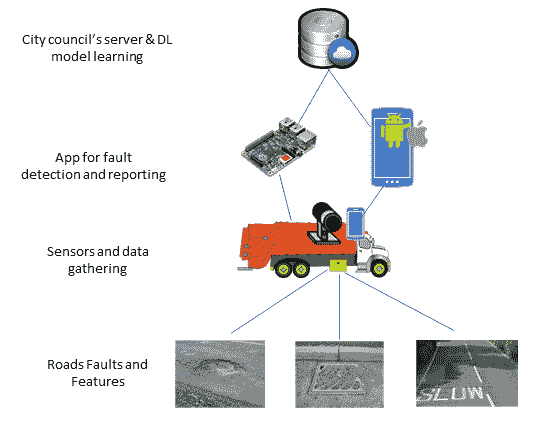

# 第三章：物联网中的图像识别

未来，许多物联网应用，包括智能家居、智能城市和智能健康等，将广泛使用基于图像识别的决策制定（如智能门锁的面部识别）。**机器学习**（**ML**）和**深度学习**（**DL**）算法对于图像识别和决策制定非常有用，因此它们在物联网应用中具有很大的潜力。本章将涉及基于深度学习的物联网应用图像数据处理的实际操作。

本章的第一部分将简要描述不同的物联网应用及其基于图像检测的决策制定。此外，还将简要讨论一个物联网应用及其在实际场景中的基于图像检测的实现。在本章的第二部分，我们将介绍使用深度学习算法的图像检测应用的实际操作。本章将涵盖以下主题：

+   物联网应用与图像识别

+   用例一：基于图像的道路故障检测

+   用例二：基于图像的智能固体废物分离

+   实现用例

+   物联网中图像识别的迁移学习

+   物联网应用中的 CNN 图像识别

+   数据收集

+   数据预处理

+   模型训练

+   模型评估

# 物联网应用与图像识别

物联网应用中的图像识别领域正在迅速变化。移动处理能力、边缘计算和机器学习的重大进展正在为图像识别在许多物联网应用中的广泛使用铺平道路。例如，普及的移动设备（它们是许多物联网应用的关键组件）配备高分辨率摄像头，能够让每个人在任何地方生成图像和视频。

此外，智能视频摄像头，如 IP 摄像头和带摄像头的树莓派，广泛应用于许多场所，如智能家居、校园和工厂，用于不同的应用。许多物联网应用——包括智能城市、智能家居、智能健康、智能教育、智能工厂和智能农业——都通过图像识别/分类做出决策。如下面的图示所示，这些应用使用以下一种或多种图像识别服务：


让我们详细讨论前面提到的图像：

+   **人员识别**：通常，家庭、办公室和其他场所的安全且友好的进入方式是一个具有挑战性的任务。使用包括物联网解决方案在内的智能设备可以为许多场所提供安全且友好的访问方式。以办公室或家庭的访问为例，我们通常使用一把或多把钥匙进入家庭或办公室。如果丢失了这些钥匙，除了给我们带来不便，还可能带来安全风险，特别是如果有人捡到它们。在这种情况下，基于图像识别的人员识别可以作为智能家居或办公室的无钥匙进入方式。

+   **物体识别**：基于物联网的自动物体识别在许多领域中非常有价值，包括无人驾驶汽车、智能城市和智能工厂。例如，智能城市应用程序，如智能车辆牌照识别和车辆检测，以及全市范围的公共资产监控，可以使用基于图像识别的物体检测服务。类似地，智能工厂可以使用物体检测服务进行库存管理。

+   **面部识别**：基于图像处理的面部检测和识别领域发展迅速，未来它将成为一种商品。配备生物识别功能的智能手机将成为常态。智能手机和基于物联网的面部识别可以应用于许多领域，如安全、智能教育等。例如，在智能课堂（教育）中，可以使用面部识别系统来识别学生对讲座的反应。

+   **事件检测**：许多人类疾病（如手足口病）、动物疾病（如口蹄疫和家禽疾病）以及植物疾病的症状是显而易见的，可以通过物联网解决方案和基于深度学习的图像分类进行数字化检测。

# 用例一 – 基于图像的自动故障检测

城市中的公共资产（如道路、公共建筑和旅游景点）是异质的，并且分布在城市各处。世界上大多数城市在监控、故障检测和报告这些资产方面面临挑战。例如，在许多英国城市，市民经常报告故障，但在许多情况下，报告的准确性和效率都是一个问题。在智能城市中，这些资产可以通过物联网应用进行监控，故障也可以被检测并报告。例如，一辆附有一个或多个传感器（如摄像头或麦克风）的车辆（例如市政车辆）可以用于道路故障监测和检测。

道路是城市中重要的资产，且存在许多故障。坑洼、颠簸和道路粗糙是通勤者和车辆常遇到的一些最令人沮丧的危害和异常情况。更重要的是，车辆可能经常面临悬挂问题、转向不对准和爆胎，这些问题也可能导致事故。与道路故障相关的损坏成本相当高。例如，仅坑洼造成的损害就让英国司机每年损失 17 亿英镑。支持适当深度学习算法的物联网应用可以自动检测这些故障并进行适当报告，从而以具有成本效益的方式减少与道路故障相关的损害数量。

# 实施用例一

如下图所示，实施此用例包括三个主要元素：



让我们详细了解这些组件：

+   **传感器和数据收集**：数据收集传感器的选择取决于资产和故障类型。如果我们使用智能手机作为边缘计算设备，其摄像头可以用于感知和收集道路故障数据。相反，如果使用树莓派作为边缘计算设备，则需要使用外部摄像头，因为树莓派没有内置摄像头。前面的图示展示了树莓派和摄像头如何用于用例实现。我们使用了一台树莓派 3 型 B+，配备 1GB RAM 和一款 500 万像素的 Omnivision OV5647 传感器，采用定焦镜头。相机的采样或拍照速率将取决于车辆的速度和道路故障的可用性。例如，如果智能手机摄像头或安装在车辆上的摄像头每秒钟能拍摄一张照片，当车辆速度为 40 公里/小时或以下时，手机或树莓派将在两秒内检测到故障。一旦图像被感知并捕捉到，它将被发送到检测方法。

+   **故障检测与报告**：在此阶段，边缘计算设备将安装一个应用程序。安装在智能手机或树莓派上的应用程序将加载预训练的故障检测和分类模型。一旦车辆的智能手机或树莓派摄像头拍摄到一张照片（按照采样率），这些模型将检测并分类潜在的故障，并向应用服务器（本地议会）报告。

+   **议会服务器和故障检测模型**：议会的服务器负责以下内容：

    +   使用参考数据集学习故障检测和分类模型

    +   传播和更新边缘计算设备的模型

    +   接收和存储故障数据

基于图像的模型学习和道路故障检测的验证是实现的核心。章节的第二部分（从*物联网中图像识别的迁移学习*开始的部分）将描述前述用例中基于深度学习的异常检测实现。所有必要的代码都可以在章节的代码文件夹中找到。

# 用例二 – 基于图像的智能固体废物分拣

固体废物是全球面临的挑战。固体废物的管理成本高昂，不当的废物管理也在严重影响全球经济、公共健康和环境。一般来说，塑料、玻璃瓶和纸张等固体废物是可回收的，它们需要有效的回收方法，才能在经济和环境上带来益处。然而，在大多数国家，现有的回收过程仍是手工操作。此外，市民或消费者往往会对回收方法感到困惑。

在这个背景下，物联网（IoT）借助机器学习和深度学习，尤其是基于图像的物体识别，能够识别废物类型并帮助将其进行分类，无需人工干预。

# 实现用例二

基于图像的智能固体废物分离的实现包括两个关键组件：

+   一个带有独立舱室、每种类型固体废物都有可控盖子的垃圾箱

+   带有深度学习模型的物联网基础设施，用于图像识别

实现的第一个组件不在本书的范围内，我们假设该组件已经可用。如以下图所示，用例的物联网实现由两个主要元素组成：


+   **传感器和数据收集**：选择传感器进行数据收集取决于固体废物的类型及其特性。例如，许多玻璃瓶和塑料瓶在颜色和外观上非常相似。然而，它们的重量通常差异显著。对于该用例，我们考虑使用两种传感器：

    +   一个或多个摄像头，用于捕捉垃圾进入垃圾箱的图像

    +   一个重量传感器，用于测量垃圾的重量

我们使用树莓派作为计算平台。该用例使用了 1 GB 内存的树莓派 3 型号 B+，并配备了 5 百万像素的 Omnivision OV5647 传感器和固定焦距镜头进行测试。一旦图像和重量被感知并捕获，它们将被发送到分类方法。

+   **垃圾检测与分类**：这是实现的关键元素。树莓派将加载一个经过预训练的垃圾检测与分类模型，采用深度学习技术。一旦检测算法识别出垃圾并进行分类，它将启动控制系统打开适当的盖子，并将垃圾移入垃圾箱。

该用例场景集中于城市公共区域的废物管理，包括公园、旅游景点、绿化带和其他休闲区域。通常，这些区域的市民和/或游客会单独处理他们的废物。值得注意的是，他们丢弃的废物数量较少，从单个物品到几个物品不等。

以下各节将描述所需的基于深度学习的图像识别实现，用于上述用例。所有必要的代码可以在本章的代码文件夹中找到。

# 物联网中的图像识别迁移学习

通常，迁移学习是指将预训练的机器学习模型表示迁移到另一个问题中。近年来，这种方法已成为应用深度学习模型解决问题的一种流行手段，尤其是在图像处理和识别中，因为它能够用相对较少的数据训练深度学习模型。

下图展示了两个模型：

+   标准深度学习模型架构（a）

+   迁移学习深度学习模型架构（b）：


如标准深度学习模型架构图所示，一个完全训练的神经网络在初始层接收输入值，然后将这些信息依次向前传递并进行必要的转换，直到倒数第二层（也称为 **瓶颈层**）构建了输入的高级表示，该表示可以更容易地转化为最终输出。模型的完整训练包括对每个连接（标记为蓝色）的权重和偏置项进行优化。在大型和异构数据集中，这些权重和偏置项的数量可能达到数百万。

在迁移学习中，我们可以使用前面和中间层，只重新训练后面的层。迁移学习的一种流行方法是复用整个网络中除最后一层外的预训练权重，并通过使用新数据集重新训练网络来重新学习最后一层或分类部分的权重。如迁移学习深度学习（DL）模型架构图所示，我们复用了橙色连接，并通过使用新数据集重新训练网络以学习最后一层的绿色连接。

许多预训练的深度学习模型，包括 Inception-v3 和 MobileNets 模型，已经可以用于迁移学习。Inception-v3 模型是为 **ImageNet 大规模视觉识别挑战赛**训练的，它将图像分类为 1,000 个类别，如 *斑马*、*达尔马提亚犬* 和 *洗碗机*。Inception-v3 由两个部分组成：

+   一个使用卷积神经网络（CNN）进行特征提取的部分，它从输入中提取特征

+   一个分类部分，包含全连接层和 softmax 层，它基于第一部分识别的特征对输入数据进行分类

如果我们想使用 Inception-v3，我们可以复用特征提取部分，并使用我们的数据集重新训练分类部分。

迁移学习提供了两个好处：

+   在新数据上的训练速度更快。

+   解决问题的能力是在 **较少的训练数据** 上进行训练，而不是从头开始学习。

迁移学习的这些特性对物联网（IoT）资源受限的边缘设备中深度学习模型的实现尤为重要，因为我们无需训练资源消耗大的特征提取部分。因此，模型可以使用更少的计算资源和时间进行训练。

# 物联网应用中的图像识别 CNN

**卷积神经网络**（**CNN**）有多种实现方式。**AlexNet** 就是其中一种实现，并且在 ImageNet 挑战赛：ILSVRC 2012 中获得了胜利。从那时起，CNN 已在计算机视觉和图像检测、分类中无处不在。直到 2017 年 4 月，普遍趋势是构建更深、更复杂的网络以实现更高的准确率。然而，这些更深、更复杂的网络提高了准确性，但并不总是使网络变得更加高效，特别是在网络的大小和速度方面。在许多实际应用中，尤其是在物联网应用（如自动驾驶汽车和病人监控）中，识别任务需要在资源受限（处理能力、内存）平台上及时完成。

在这种背景下，MobileNet V1 于 2017 年 4 月推出。这个版本的 MobileNet 相较于 2018 年 4 月推出的第二版（MobileNetV2）有所改进。**Mobilenets**及其变体是高效 CNN 深度学习模型在物联网（IoT）应用中的重要应用，尤其是在基于图像识别的物联网应用中。在接下来的段落中，我们将简要介绍 MobileNets。

MobileNets 是最流行和最广泛使用的深度学习（DL）模型的实现，即卷积神经网络（CNNs）。它们特别为资源受限的移动设备设计，以支持分类、检测和预测功能。安装了深度学习模型的个人移动设备，包括智能手机、可穿戴设备和智能手表，能够提升用户体验，提供随时随地的访问，并带来安全、隐私和节能的附加益处。值得注意的是，移动设备中的新兴应用将需要更高效的神经网络，以便实时与现实世界进行交互。

以下示意图展示了标准卷积滤波器（图 a）如何在 MobileNet V1 中被两层所替代。它使用深度卷积（图 b）和点卷积（图 c）来构建深度可分离滤波器：


MobileNet V1 的主要动机是卷积层计算代价高，它们可以被所谓的**深度可分离卷积**所替代。在 MobileNet V1 中，深度可分离卷积过程使用单个滤波器作用于每个输入通道，然后点卷积使用 1x1 的卷积过程处理早期深度卷积的输出。如标准卷积滤波器的示意图所示，标准卷积滤波器在一步中既进行滤波又合并输入，生成新的输出。与标准 CNN 不同，MobileNet 中的深度可分离卷积（分解形式）将这一过程分为两个层次（如 MobileNet V1 的示意图所示）：一个用于滤波，另一个用于合并。

下图展示了 MobileNet V1 的因式分解架构。这种因式分解大大减少了计算量和模型大小，因为模型需要计算的参数数量显著减少。例如，MobileNet V1 需要计算 420 万个参数，而全卷积网络需要计算 2930 万个参数：


MobileNet V2 是 MobileNet V1 的更新版，并且在多个方面有了显著改进。它极大地提高了现有的移动视觉识别，包括分类、检测和语义分割。与 MobileNet V1 一样，MobileNet V2 作为 TensorFlow-Slim 图像分类库的一部分发布。如果需要，你可以在 Google 的 Colaboratory 中进行探索。此外，MobileNet V2 作为模块可在 TF-Hub 上使用，预训练检查点或保存的模型可以在[`github.com/tensorflow/models/tree/master/research/slim/nets/mobilenet`](https://github.com/tensorflow/models/tree/master/research/slim/nets/mobilenet)找到，[并且可以用作迁移学习。](https://github.com/tensorflow/models/tree/master/research/slim/nets/mobilenet)

下图展示了 MobileNet V2 的简化架构。MobileNet V2 作为 MobileNet V1 的扩展进行了开发。它使用深度可分离卷积作为高效的构建模块。此外，MobileNet V2 在架构中引入了两个新特性。一个是层之间的线性瓶颈，另一个是瓶颈之间的捷径连接：


# 收集用例一的数据

我们可以使用智能手机相机或树莓派相机来收集数据，并自己准备数据集，或者从互联网上下载现有的图像（如通过 Google、Bing 等）并准备数据集。或者，我们可以使用现有的开源数据集。对于用例一，我们使用了两者的结合。我们从互联网上下载了现有的坑洞图像数据集（这是最常见的道路故障之一），并通过 Google 图像更新了数据集。该开源数据集（`PotDataset`）由英国克兰菲尔德大学发布，用于坑洞识别。数据集包含坑洞物体和非坑洞物体的图像，包括井盖、人行道、道路标记和阴影。这些图像经过手工标注，并整理到以下文件夹中：

+   井盖

+   人行道

+   坑洞

+   道路标记

+   阴影

# 探索用例一中的数据集

在将深度学习算法应用于数据之前，探索数据集是非常必要的。在探索过程中，我们可以通过运行`image_explorer.py`来探索数据集，如下所示：

```py
python image_explorer.py datset_original
```

下图展示了数据探索过程的快照：


如数据探索图所示，如果仅使用智能手机相机，坑洞和非坑洞物体之间的区别并不总是显而易见。结合红外线相机和智能手机相机可以改善这种情况。此外，我们发现我们使用的坑洞图像可能不足以覆盖各种类型的坑洞，例如以下内容：

+   已用数据集中的许多图片显示坑洞已经修复/维护。

+   已用数据集中有几张大尺寸坑洞的图片。

在这个背景下，我们决定通过从互联网收集更多的图像来更新坑洞图像数据集。接下来，我们简要讨论数据收集过程：

1.  **搜索**：使用任意浏览器（我们使用了 Chrome），访问 Google，并在 Google 图片中搜索*pothole images*。你的搜索窗口将显示如下截图：

你可以通过点击*工具*并将使用权限更改为*可修改再利用的标注*来选择无版权限制的图片。


1.  **收集图片 URLs**：此步骤是使用几行 JavaScript 代码收集图片的 URLs。收集到的 URLs 可以在 Python 中用于下载图片。如以下截图所示，选择 JavaScript 控制台（假设你使用 Chrome 浏览器，但你也可以使用 Firefox），通过点击**查看**|**开发者**|**JavaScript 控制台**（在 macOS 上）或者**Google Chrome** | **更多工具** | **开发者工具**（在 Windows 操作系统上）：


一旦你选择了 JavaScript 控制台，你将看到类似于以下截图的浏览器窗口，这将允许你像 REPL 一样执行 JavaScript：


1.  现在按以下顺序操作：

    +   滚动页面，直到找到所有有用的图片（注意：请使用没有版权限制的图片）作为数据集。之后，你需要收集已选图片的 URLs。

    +   现在进入 JavaScript 控制台，并将以下 JavaScript 代码复制并粘贴到控制台中：

```py
// Get the jquery into the JavaScript console
var scriptJs = document.createElement('scriptJs');
scriptJs.src = "https://ajax.googleapis.com/ajax/libs/jquery/2.2.0/jquery.min.js";
document.getElementsByTagName('head')[0].appendChild(scriptJs)
```

1.  +   前一行代码将加载 jQuery JavaScript 库。现在，你可以使用 CSS 选择器通过以下代码行收集网址列表：

```py
// Collect the selected URLs
var urls_images = $('.rg_di .rg_meta').map(function() { return JSON.parse($(this).text()).ou; });
```

1.  最后，使用以下代码行将网址写入文件（每行一个网址）：

```py
// write the URls to a file 
var text_url_Save = urls_images.toArray().join('\n');
var hiddenComponents = document.createElement('a');
hiddenComponents.href = 'data:attachment/text,' + encodeURI(text_url_Save);
hiddenComponents.target = '_blank';
hiddenComponents.download = 'imageurls.txt';
hiddenComponents.click();
```

执行前面的代码行后，你将在默认下载目录中获得一个名为`imageurls.txt`的文件。如果你想将其下载到特定文件夹，请在上述代码中将`hiddenComponents.download = 'imageurls.txt'`改为`hiddenComponents.download = 'your fooler/imageurls.txt'`。

1.  **下载图片**：现在你可以准备下载运行图片`download_images.py`（在章节的代码文件夹中可找到），并使用先前下载的`imageurls.txt`：

```py
python download_images.py  imageurls.txt
```

1.  **数据探索**：下载图像后，我们需要对其进行探索，以删除无关的图像。我们可以通过手动检查来完成这一过程。之后，我们需要调整图像大小，并将其转换为灰度图像，以匹配之前下载的数据集：


上面的截图显示了坑洞图像和非坑洞图像数据集的文件夹结构。

# 收集用例二的数据

与用例一类似，我们可以通过数码相机收集数据，或使用现有的开源数据集，或两者结合使用。我们正在使用现有的开源数据集来实现排序算法。该数据集是从美国的城市环境中收集的。由于固体垃圾种类可能因国家而异，因此最好根据实际使用用例的国家来更新数据集。该数据集包含六种类型的固体垃圾：玻璃、纸张、纸板、塑料、金属和垃圾。数据集共包含 2,527 张图像，这些图像已被注释并按以下文件夹结构整理，如下图所示：


# 用例二的数据探索

以下是用例二的数据探索快照。如图所示，玻璃和塑料图像可能会混淆排序算法。在这种情况下，重量传感器数据可以帮助解决这个问题：


# 数据预处理

这是深度学习管道中的一个关键步骤。现有的坑洞图像数据集以及用于用例中的固体垃圾图像数据集已被预处理，并准备好用于训练、验证和测试。如下面的图示所示，原始图像和修改后的图像（为坑洞类下载的附加图像）都被整理成子文件夹，每个文件夹以五个类别之一命名，并且只包含该类别的图像。在准备训练图像集时需要注意以下几个问题：

+   **数据大小**：我们需要为每个类别收集至少 100 张图像，以训练一个表现良好的模型。我们收集的数据越多，训练模型的准确率可能就越高。所使用数据集中的每个类别都有超过 1,000 张样本图像。我们还确保这些图像能够很好地代表我们应用在实际实施中将会遇到的情况。

+   **数据异质性**：用于训练的数据应该是异质的。例如，关于坑洞的图片需要尽可能在各种不同的环境、不同的时间和使用不同设备的情况下拍摄。

# 模型训练

如前所述，我们使用了迁移学习，这不需要从头开始训练；使用新数据集重新训练模型在许多情况下已经足够有效。我们在一台桌面计算机上重新训练了两种流行的 CNN 架构或模型，即 Incentive V3 和 Mobilenet V1，这台计算机模拟了市议会的服务器。在这两种模型中，重新训练模型的时间都不到一小时，这是迁移学习方法的优势。在运行 `retrain.py` 文件之前，我们需要了解关键参数的列表，该文件位于代码文件夹中。如果我们在终端（Linux 或 macOS）或命令提示符（Windows）中输入 `python retrain.py -h`，将会看到一个类似于下图的窗口，其中包含额外的信息（即每个参数的概述）。强制性参数是图像目录，它是之前图中所示的数据集目录之一：


下面，我们提供两个命令示例：一个用于重新训练 Incentive V3 模型，另一个用于在修改后的数据集（dataset-modified）上重新训练 Mobilenet V1。为了重新训练 Incentive V3，我们没有传递架构参数值，因为它是 `retrain.py` 中包含的默认架构。对于其余的参数，包括训练、验证和测试之间的数据划分比例，我们使用了默认值。在这个使用案例中，我们使用了数据拆分规则，将 80% 的图像放入主训练集，保留 10% 作为训练过程中的验证集，剩余的 10% 作为测试集。测试集用于测试分类器的真实世界分类性能：

```py
python retrain.py \
--output_graph=trained_model_incentive-modified-dataset/retrained_graph.pb \
--output_labels=trained_model_incentive-modified-dataset/retrained_labels.txt \
--image_dir=dataset-modified
```

要运行 Mobilenet V1 模型的训练和验证，请使用以下命令：

```py
python retrain.py \
--output_graph=trained_model_mobilenetv1-modified-dataset/retrained_graph.pb \
--output_labels=trained_model_mobilenetv1-modified-dataset/retrained_labels.txt \
--architecture mobilenet_1.0_224 \
--image_dir=dataset-modified
```

一旦运行上述命令，它将生成重新训练的模型（`retrained_graph.pb`）、标签文本（`retrained_labels.txt`）以及包含训练和验证摘要信息的目录。`(--summaries_dir` 参数，默认值为 `retrain_logs`)，TensorBoard 可以使用这些摘要信息来可视化模型的不同方面，包括网络结构和性能图表。如果我们在终端或命令提示符中输入以下命令，它将启动 TensorBoard：

```py
tensorboard --logdir retrain_logs

```

一旦 TensorBoard 启动，打开你的网页浏览器并访问`localhost:6006`，即可查看 TensorBoard 并查看相应模型的网络结构。下图 **(a)** 和 **(b)** 分别展示了 Incentive V3 和 Mobilenet V1 的网络结构。该图展示了与 Mobilenet V1 相比，Incentive V3 的复杂性：


在第二种使用情况下，我们只在固体废物数据集上重新训练了 Mobilenet V1。你可以通过仅提供图像或数据集目录来重新训练模型，如下所示：

```py
--image_dir=dataset-solidwaste
```

# 评估模型

首先，我们已经确定了重新训练模型的大小。如下面的截图所示，Mobilenet V1 仅需要 17.1 MB（适用于两种用例），是 Incentive V3（92.3 MB）大小的五分之一，并且该模型可以轻松部署到资源受限的物联网设备中，包括树莓派或智能手机。其次，我们评估了模型的性能。针对这些用例，进行了两级性能评估：(i) 在重新训练阶段，使用桌面 PC 平台/服务器对整个数据集进行评估或测试，(ii) 在树莓派 3 环境中对单个图像或样本（现实生活中的图像）进行了测试或评估：


# 模型性能（用例一）

用例一的所有评估性能都展示在以下截图中。接下来的六张截图展示了 Incentive V3 和 Mobilenet V1 模型在两组数据上的训练、验证和测试性能。前三张截图展示了重新训练模型后终端生成的结果，后三张截图则是从 TensorBoard 生成的结果。

以下截图展示了在原始数据集上对 Incentive V3 的评估结果：


以下截图展示了在修改后的数据集上对 Incentive V3 的评估结果：


以下截图展示了在原始数据集上对 Mobilenet V1 的评估结果：


以下截图展示了在修改后的数据集上对 Mobilenet V1 的评估结果：


以下截图展示了在原始数据集上对 Incentive V3 的评估结果，这些结果是通过 TensorBoard 生成的：


以下截图展示了在原始数据集上对 Mobilenet V1 的评估结果，这些结果是通过 TensorBoard 生成的：


从之前所有的模型性能截图中可以看出，训练和验证的准确率均远高于 90%，这对于故障检测已经足够。

以下图表展示了对单个样本的分类或目标检测性能。我们使用了两组不同的分类代码（代码在本章的代码文件夹中）。

第一张截图展示了运行 Mobilenet V1 分类器对两个样本进行分类的快照。从所有结果来看，测试或评估准确率均高于 94%，而且凭借这样的准确率，深度学习模型（CNN）具有检测物体的潜力，包括坑洞、井盖以及路上的其他物体。然而，在 Pi 3 上进行物体检测的时间大约为三到五秒，如果我们想要在实时检测和执行中使用这些模型，还需要进一步提高检测速度。此外，结果显示，使用修改过的数据集训练的模型在真实环境中有很大机会提供较高的检测或测试准确率（如前面截图所示），尤其是在坑洞检测方面，因为这一类数据通过加入来自谷歌图片的多样化图像得到了改善：


以下截图展示了使用 Incentive V3 模型在原始数据集（Pi 3 B+）上训练的坑洞检测评估结果：


以下图表展示了使用 Incentive V3 模型在原始数据集（Pi 3 B+）上训练的井盖检测评估结果：


以下图表展示了使用 Mobilenet V1 模型在原始数据集（Pi 3 B+）上训练的坑洞检测评估结果：


以下图表展示了使用 Mobilenet V1 模型在原始数据集（Pi 3 B+）上训练的井盖检测评估结果：


# 模型性能（用例二）

用例二的所有评估性能展示在下面的截图中。对于这个用例，我们只展示 Mobilenet V1 的结果。以下图表展示了在两个数据集上，Mobilenet V1 模型的训练、验证和测试性能。从以下截图可以看出，测试准确率并不是特别高（77.5%），但对于固体废物检测和分类来说，已经足够好：


以下截图展示了在 TensorBoard 生成的数据集上，Mobilenet V1 的评估结果：


以下三张截图展示了对单个样本的分类或物体（固体废物）检测性能。第一张截图展示了玻璃检测的评估结果：


以下截图展示了塑料检测的评估结果：


以下截图展示了使用 Mobilenet V1 进行金属检测的评估结果：


# 总结

在本章的第一部分，我们简要描述了不同的物联网应用及其基于图像检测的决策制定。此外，我们还简要讨论了两个使用案例：基于图像检测的道路故障检测和基于图像检测的固体废物分类。第一个应用可以使用智能手机摄像头或树莓派摄像头检测道路上的坑洼。第二个应用则检测不同类型的固体废物，并根据智能回收进行分类。

在本章的第二部分，我们简要讨论了迁移学习和几个示例网络，并研究了其在资源受限的物联网应用中的有效性。此外，我们还讨论了选择 CNN 的理由，包括两种流行的实现方式，即 Inception V3 和 Mobilenet V1。接下来的内容将介绍 Inception V3 和 Mobilenet V1 模型所需的所有深度学习流水线组件。

在许多物联网应用中，仅凭图像识别可能不足以进行物体和/或主体检测。在这种情况下，有时音频/语音/声音识别可能会有所帮助。第三章，物联网中的音频/语音/声音识别，将介绍基于深度学习的语音/声音数据分析和物联网应用中的识别。

# 参考文献

+   *智能巡逻：使用智能手机传感器和众包进行高效的道路表面监测*，Gurdit Singh，Divya Bansal，Sanjeev Sofat，Naveen Aggarwal，*普适计算与移动计算*，第 40 卷，2017 年，第 71-88 页

+   *使用智能手机拍摄图像的深度神经网络道路损伤检测*，Hiroya Maeda，Yoshihide Sekimoto，Toshikazu Seto，Takehiro Kashiyama，Hiroshi Omata，arXiv:1801.09454

+   *坑洼让英国司机每年损失 17 亿英镑：如果您的车受损，如何索赔*，Luke John Smith：[`www.express.co.uk/life-style/cars/938333/pothole-damage-cost-how-to-claim-UK`](https://www.express.co.uk/life-style/cars/938333/pothole-damage-cost-how-to-claim-UK)

+   *What a Waste: 全球固体废物管理回顾*，D Hoornweg 和 P Bhada-Tata，世界银行，华盛顿特区，美国，2012 年

+   *高效卷积神经网络在移动视觉应用中的应用*，Andrew G Howard，Menglong Zhu，Bo Chen，Dmitry Kalenichenko，Weijun Wang，Tobias Weyand，Marco Andreetto，Hartwig Adam，*MobileNets: arXiv:1704.04861*

+   *基于深度卷积神经网络的 Imagenet 分类*，A Krizhevsky，I Sutskever，G E Hinton，发表于*神经信息处理系统进展*，第 1,097-1,105 页，2012 年。1，6。

+   *MobileNetV2：倒残差和线性瓶颈*，Mark Sandler，Andrew Howard，Menglong Zhu，Andrey Zhmoginov，Liang-Chieh Chen，arXiv:1801.04381。

+   坑洼数据集：[`cord.cranfield.ac.uk/articles/PotDataset/5999699`](https://cord.cranfield.ac.uk/articles/PotDataset/5999699)

+   Trashnet: [`github.com/garythung/trashnet`](https://github.com/garythung/trashnet)
