# 第四章：IoT 中的音频/语音/语音识别

自动音频/语音/语音识别正成为人们与设备（包括智能手机、可穿戴设备和其他智能设备）交互的常见、便捷方式。机器学习和深度学习算法对于音频/语音/语音识别和决策制定非常有用。因此，它们对依赖音频/语音/语音识别进行活动和决策的 IoT 应用非常有前景。本章将总体介绍基于深度学习的 IoT 应用中的语音/语音数据分析和识别。

本章的第一部分将简要描述不同的 IoT 应用及其基于语音/语音识别的决策制定。此外，还将简要讨论两个 IoT 应用及其在实际场景中的基于语音/语音识别的实现。第二部分将介绍使用深度学习算法的应用的语音/语音检测实现。我们将涵盖以下主题：

+   IoT 应用与音频/语音识别

+   用例一 – 语音控制的智能灯

+   实现语音控制的智能灯

+   用例二 – 语音控制的家庭访问

+   实现语音控制的家庭访问

+   IoT 中的音频/语音识别的深度学习（DL）

+   IoT 应用中的音频/语音识别的深度学习算法

+   基于深度学习的音频/语音识别在 IoT 中的不同部署选项

+   数据收集与预处理

+   模型训练

+   模型评估

# IoT 中的语音/语音识别

像图像识别一样，IoT 应用中的语音/语音识别领域正在迅速变化。近年来，消费者已经开始依赖语音命令功能，这一趋势得到了亚马逊、谷歌、小米等公司语音启用搜索和/或设备的推动。这项技术正变得对用户极为有用。统计数据显示，约 50%的美国家庭（[`techcrunch.com/2017/11/08/voice-enabled-smart-speakers-to-reach-55-of-u-s-households-by-2022-says-report/`](https://techcrunch.com/2017/11/08/voice-enabled-smart-speakers-to-reach-55-of-u-s-households-by-2022-says-report/)）使用语音激活命令来访问在线内容。因此，IoT、机器学习和深度学习支持的语音/语音识别已经彻底改变了商业和消费者期望的焦点。许多行业——包括家庭自动化、医疗保健、汽车和娱乐——正在采用语音启用的 IoT 应用。如下图所示，这些应用使用了以下一种或多种语音/语音识别服务：

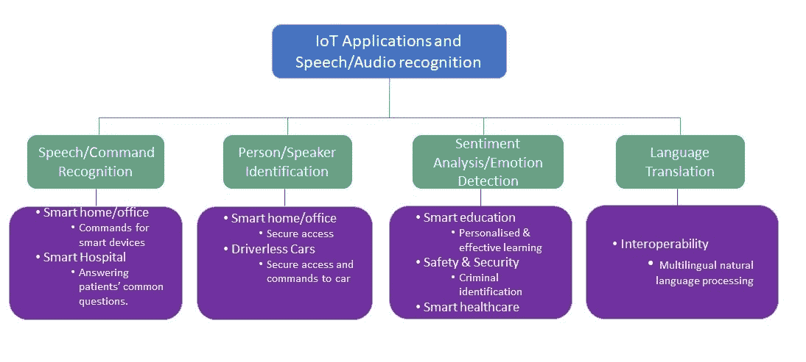

+   **语音/命令识别：** 语音控制的物联网应用在许多应用领域中越来越受欢迎，如智能家居/办公室、智能医院和智能汽车，因为它们的便利性。例如，行动不便的人可能会发现开关电视或灯光困难。语音控制/命令的电视/灯光可以通过简单地听取声音来打开电视/灯光，从而缓解这一困难。这将为许多残疾人士和/或有特殊需求的人提供独立的生活方式。语音激活的智能微波炉可以彻底改变烹饪方式。此外，语音启用的智能音响可以帮助并回答许多常见问题，服务于医院、机场、火车站等公共服务领域。例如，智能语音音响可以回答医院中患者的常见问题，比如探视时间是什么时候，病房医生是谁。

+   **人/说话人识别：** 说话人/人物识别是物联网应用提供的第二个重要服务，近年来备受关注。利用基于深度学习/机器学习的说话人识别服务的关键应用包括个性化语音助手、智能家电、安全服务中的生物认证、刑事调查和智能汽车[1,2]。语音控制的家庭/办公室访问是生物认证的一个例子。

+   **情感分析/情绪检测：** 用户情绪检测或情感分析对于提供个性化和高效的服务非常有用。物联网应用，如智能医疗[3]、智能教育以及安全和保障服务，可以通过基于深度学习的情绪检测或情感分析来提升其服务。例如，在智能教室中，教师可以实时或准实时分析学生的情绪，以提供个性化和/或小组教学。这将改善学生的学习体验。

+   **语言翻译：** 全球有 6500 种活跃的口语语言（[`www.infoplease.com/askeds/how-many-spoken-languages`](https://www.infoplease.com/askeds/how-many-spoken-languages)），这给有效沟通和互操作性带来了挑战。许多公共服务，如移民办公室，可以使用翻译器代替付费口译员。游客可以使用智能设备，如**ILI**（[`iamili.com/us/`](https://iamili.com/us/)），与他人有效沟通。

# 用例一 – 语音控制智能灯

根据**世界卫生组织**（**WHO**）的统计，全球有超过十亿人生活在某种形式的残疾中。 其中约 20%的人在功能和独立生活方面面临显著困难。 未来，由于残疾患病率的不断增加，残疾问题将变得更加严重。 得到机器学习/深度学习支持的物联网应用，如智能家居，能够为这一群体提供支持，并通过提高独立性改善他们的生活质量。 其中一个应用就是语音激活的智能灯/风扇控制。

面对残疾（如行动障碍）的个体，在日常生活中会面临各种困难。 其中一个困难是开关家里或办公室的灯/风扇/其他设备。 语音激活的家居/办公室灯/风扇/其他设备的智能控制是一种物联网应用。 然而，语音识别和准确检测给定命令并不是一件容易的事情。 一个人的口音、发音和周围噪音可能会使得语音识别变得困难。 适当的深度学习（DL）算法，经过在大规模语音数据集上训练，能够有效解决这些问题，并可以实现一个功能完备的语音控制智能灯应用。

# 实现用例一

以下图展示了实现语音激活灯光（在房间内）的关键组件：

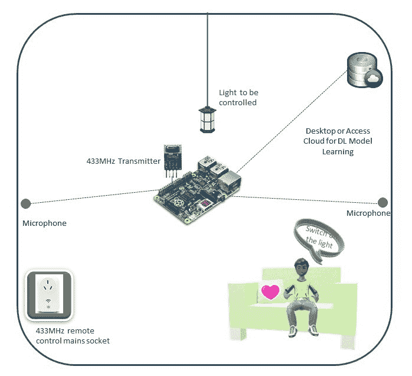

如前图所示，实施该用例将需要以下组件：

+   **传感器和计算平台**：对于这个用例，我们考虑在房间墙上安装两个全向麦克风。 这些麦克风通过无线方式与计算平台连接。 在这个用例中，我们使用树莓派 3 作为计算平台，它可以作为智能家居的边缘计算设备，控制家居中部署的物联网设备。 我们还需要另外两种设备：一台 433 MHz 无线发射器，通过树莓派连接，用于将处理后的命令传输到开关；以及一台 433 MHz 遥控器或无线控制的电源插座，用于控制灯光或目标设备。

+   **语音激活命令检测与控制**：在此阶段，边缘计算设备将安装一个应用程序。 安装在树莓派上的应用程序将加载一个预训练的语音命令检测与分类模型。 一旦某个麦克风接收到“关灯”命令或类似的指令，它将把收到的命令发送到树莓派进行处理和检测，使用深度学习模型进行分析。 最终，树莓派将检测到的命令传输给无线控制的电源插座，从而对灯光进行必要的操作。

+   **桌面或服务器用于模型学习**：我们还需要一台桌面计算机/服务器或访问云计算平台，用于通过参考数据集学习语音检测和分类的模型。该学习模型将预先安装在树莓派上。

本章第二部分（从*DL 用于物联网中的声音/音频识别*部分开始）将描述基于深度学习的前述用例的异常检测实现。所有必要的代码可以在本章的代码文件夹中找到。

# 用例二 – 语音控制家居访问

创建安全且友好的家居、办公室及其他场所的访问方式是一个具有挑战性的任务，因为它可能需要钥匙或访问卡（如酒店房间卡），而用户不一定总是记得随身携带。智能设备的使用，包括物联网解决方案，可以为许多场所提供安全且友好的访问方式。智能安全访问的一个潜在方法是基于图像识别对人员进行身份验证，并据此打开门/门禁。然而，这种方法的问题在于，任何入侵者都可以收集一个或多个被允许进入人员的照片，并将照片展示给已安装的摄像头，从而获得访问权限。解决这一问题的一个方法是结合使用图像识别和语音识别，或仅使用语音识别来允许进入家门/办公室。

声音生物识别（或声音指纹）对每个人来说都是独一无二的，模拟这一特征是一个具有挑战性的任务。然而，检测这一独特属性并非易事。基于深度学习的语音识别可以识别独特的属性和相应的人，并且仅允许该人访问。

# 实现用例二

如下图所示，语音激活灯光（在房间内）使用案例的实现包含三个主要元素：

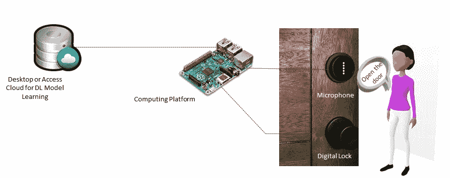

+   **传感器和计算平台**：对于此用例，我们考虑在家门口安装一台全向麦克风，且通过无线方式与计算平台连接，或将其隐藏在墙内。对于计算平台，我们使用树莓派，它将作为智能家居的边缘计算设备，控制家中部署的物联网设备。同时，门上安装了一个数字锁系统，可以通过计算机进行控制。

+   **语音激活命令检测与控制**：在这一阶段，边缘计算设备将安装一个应用程序。安装在树莓派上的应用程序将加载一个预训练的扬声器或人声检测与分类模型。一旦真实用户对门口的麦克风说话，设备便会收集音频信号，并将接收到的语音信号发送到树莓派进行处理和人脸检测，使用深度学习模型。如果检测到的人在智能家居控制器（此处为树莓派）的**白名单**（家中住户名单）中，控制器将命令门解锁，否则不会解锁。

+   **桌面或服务器用于模型学习**：我们还需要一个桌面/服务器或访问云计算平台，以便使用参考数据集学习语音检测和分类模型。该学习的模型将预安装在树莓派中。

以下所有章节描述了实现基于深度学习的命令/扬声器识别的过程，这些是上述应用场景所需的。所有必要的代码可以在章节的代码文件夹中找到。

# 物联网中的声音/音频识别的深度学习

在讨论有用的深度学习模型之前，理解**自动语音识别**（**ASR**）系统的工作原理是非常重要的。

# ASR 系统模型

**自动语音识别**（**ASR**）系统需要三个主要的知识来源。这些来源分别是**声学模型**、**语音词典**和**语言模型**[4]。通常，声学模型处理语言的声音，包括音素和额外的声音（如停顿、呼吸、背景噪音等）。另一方面，语音词典模型或字典包括系统可以理解的单词及其可能的发音。最后，语言模型包含有关语言潜在单词序列的知识。近年来，深度学习（DL）方法已广泛应用于 ASR 的声学和语言模型中。

以下图展示了一个**自动语音识别**（**ASR**）的系统模型。该模型由三个主要阶段组成：

+   数据收集

+   信号分析与特征提取（也称为**预处理**）

+   解码/识别/分类。如以下图所示，深度学习将用于识别阶段：

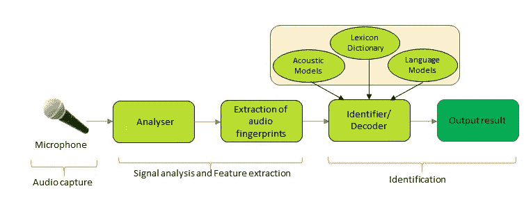

# ASR 中的特征提取

**特征提取**是自动语音识别（ASR）深度学习（DL）流程中的一个重要预处理阶段。这个阶段包括一个分析器和音频指纹或特征的提取。这个阶段主要计算一系列特征向量，提供了对采集到的语音信号的紧凑表示。通常，这个任务可以分为三个关键步骤。第一步称为语音分析。这一步对语音信号进行频谱时域分析，生成描述短语音间隔功率谱包络的原始特征。第二步提取一个扩展的特征向量，包含静态和动态特征。最后一步将这些扩展的特征向量转换为更紧凑、更鲁棒的向量。重要的是，这些向量是基于深度学习的命令/说话人/语言识别器的输入。

有多种特征提取方法可用于 ASR，**线性预测编码**（**LPC**）、**感知线性预测**（**PLP**）和**梅尔频率倒谱系数**（**MFCC**）是其中广泛使用的方法。MFCC 是最广泛使用的特征提取方法。下图展示了 MFCC 的关键组成部分：

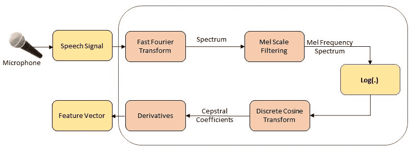

MFCC 的关键步骤如下：

1.  输入音频文件并将其转换为原始声音数据（时域信号）。

1.  通过短时傅里叶变换、加窗和帧分割将时域信号转换为频域信号。

1.  通过梅尔谱变换将频率转换为人类可感知的线性关系。

1.  通过梅尔倒谱分析采用离散余弦变换（DCT）将直流成分与正弦成分分离。

1.  提取声音频谱特征向量并将其转换为图像。

# ASR 的深度学习模型

许多深度学习算法或模型已被应用于自动语音识别（ASR）。**深度信念网络**（**DBN**）是深度学习在 ASR 中的早期实现之一。通常，它作为预训练层与一个单独的监督层的**深度神经网络**（**DNN**）一起使用。**长短期记忆**（**LSTM**）已被用于大规模声学建模。**时延神经网络**（**TDNN**）架构已被用于音频信号处理。CNN（卷积神经网络），它普及了深度学习，也被用作 ASR 的深度学习架构。深度学习架构的使用显著提高了 ASR 的语音识别准确性。然而，并非所有深度学习架构都显示出改进，特别是在不同类型的音频信号和环境中，如嘈杂和混响环境。CNN 可以用于减少频谱变化并建模语音信号中存在的频谱相关性。

**循环神经网络**（**RNNs**）和 LSTM 因其能够在演变过程中结合输入的时间特征，广泛应用于连续和/或自然语言处理。相反，CNN 更适合处理短小且非连续的音频信号，因为其具有平移不变性，比如发现结构模式的能力，不受位置的影响。此外，CNN 在噪声和回响环境中的语音识别表现最佳，而 LSTM 在干净条件下表现更好。这是因为 CNN 强调局部相关性，而非全局相关性。在这种背景下，我们将使用 CNN 来实现用例，因为用于灯光控制的语音和用于门禁的语音都很短且非连续。此外，它们的环境可能会有噪声和回响。

# CNN 和转移学习在物联网应用中的语音识别

CNN 是一种广泛应用的深度学习（DL）算法，主要用于图像识别。近年来，这种算法在音频/语音/说话人识别中变得越来越流行，因为这些信号可以转换为图像。CNN 有多种实现方式，包括两个版本的 Mobilenets 和 Incentive V3。Mobilenets 和 Incentive V3 的概述可以参见 第三章，*物联网中的图像识别*。

# 数据收集

自动语音识别（ASR）数据收集由于多种原因具有挑战性，包括隐私问题。因此，开源数据集的数量有限。更重要的是，这些数据集可能难以访问，可能缺乏足够的数据/说话人，或者可能包含噪声。在这种情况下，我们决定为两个用例使用两个不同的数据集。对于语音驱动的智能灯控制，我们使用 Google 的语音命令数据集；对于第二个用例，我们可以从三个流行的开放数据源中抓取数据，分别是 LibriVox、LibriSpeech ASR 语料库、VoxCeleb 和 YouTube。

Google 的语音命令数据集包含 65,000 条一秒钟长的 30 个简短单词的发音，由数千名来自公众的不同成员通过 AIY 网站贡献。该数据集提供了常见单词的基础音频数据，如 `On`、`Off`、`Yes`、数字和方向，这些数据对于测试第一个用例非常有用。例如，`switch on the light` 命令可以通过数据集中的 `On` 来表示，而 `switch off the light` 命令则可以通过 `Off` 数据来表示。类似地，通过抓取个人语音获得的数据可以代表家庭的住户。第二个用例将考虑一个典型的家庭，通常有三到五个住户。这些住户将是家庭的白名单，若被识别出来，将被授予访问权限。任何非白名单中的人员将无法自动进入家庭。我们在 Google 的语音命令数据集及其较小版本上测试了 CNN。以下截图展示了用于第一个用例的较小数据集的层次结构视图：

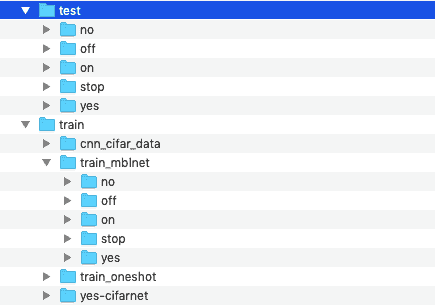

对于用例二，我们从 LibriVox 抓取了数据，并且还下载了 LibriSpeech ASR 语音识别语料库的音频文件。我们使用 BeautifulSoup 和 Selenium 编写了一个网页抓取器。你也可以使用其他 Python 模块或甚至其他语言（如 Node.js、C、C++ 和 PHP）编写类似的抓取器。该抓取器将解析 LibriVox 网站或任何其他给定的链接，并下载我们需要的音频书籍/文件。在以下代码中，我们简要展示了抓取器的脚本，它包含三个主要部分：

**第一部分**：导入所需的 Python 模块以进行音频文件抓取：

```py
# Import the required modules
import urllib
from bs4 import BeautifulSoup
from selenium import webdriver
import os, os.path
import simplejson
from selenium.webdriver.common.by import By
from selenium.webdriver.support.ui import WebDriverWait
from selenium.webdriver.support import expected_conditions as EC
```

**第二部分**：准备要下载的音频书籍链接。请注意，这些链接可能包含重复的读者，将对其进行清理，以生成一个非重复的读者/发言人/家庭成员数据集：

```py
# Create links book for the audio data to be downloaded: this may include repeated readers
book_links = []
browser = webdriver.PhantomJS(executable_path = '/usr/local/bin/phantomjs')

for i in range(1): ## testing first 0-1 (2) pages of the site : to minimise the time require to downloads   
    url = ("https://librivox.org/search?title=&author=&reader=&keywords=&genre_id=0&status=all&project_type=solo&recorded_language=&sort_order=catalog_date&search_page={}&search_form=advanced").format(i)
    print(url)
    browser.get(url)
    element = WebDriverWait(browser, 100).until(
    EC.presence_of_element_located((By.CLASS_NAME , "catalog-result")))
    html = browser.page_source
    soup = BeautifulSoup(html, 'html.parser')
    ul_tag = soup.find('ul', {'class': 'browse-list'})   
    for li_tag in ul_tag.find_all('li', {'class': 'catalog-result'}):
        result_data = li_tag.find('div', {'class': 'result-data'})
        book_meta = result_data.find('p', {'class': 'book-meta'})
        link = result_data.a["href"]
        print(link)
        if str(book_meta).find("Complete") and link not in book_links:
            book_links.append(link)      
    print(len(book_links)) # links per page could be different from regular browsers
browser.quit()
```

**第三部分**：从列出的书籍下载音频文件，并形成一个非重复读者/发言人的数据集：

```py
#  List of Links or pages for the audio books to be downloaded
f = open('audiodownload_links.txt', 'w')
simplejson.dump(download_links, f)
f.close()

# Record the file size of each reader's file
f = open('audiodownload_sizes.txt', 'w')
simplejson.dump(download_sizes, f)
f.close()

# Download the audio files and save them in local directory
 def count_files():
    dir = 'audio_files_downloaded'
    list = [file for file in os.listdir(dir) if file.endswith('.zip')] # dir is your directory path
    number_files = len(list)
    return number_files
counter = 100 # this is for naming each downloaded file
for link, size in zip(download_links, download_sizes):
    if size >= 50 and size <= 100:
        localDestination = 'audio_files_downloaded/audio{}.zip'.format(counter)
        resultFilePath, responseHeaders = urllib.request.urlretrieve(link, localDestination)
        counter += 1
cnt2 =  0
num = count_files()
if num < 200:
    for link, size in zip(download_links, download_sizes):
        if size > 100 and size <= 150:
            localDestination = 'audio_files_downloaded/audio{}.zip'.format(counter)
            resultFilePath, responseHeaders = urllib.request.urlretrieve(link, localDestination)
            counter += 1
        cnt2 += 1
num = count_files()
if num < 200:
    for link, size in zip(download_links, download_sizes):        if size > 150 and size <= 200:
            localDestination = 'audio_files_downloaded/audio{}.zip'.format(counter)
            resultFilePath, responseHeaders = urllib.request.urlretrieve(link, localDestination)
            counter += 1
num = count_files()
if num < 200:
    for link, size in zip(download_links, download_sizes):
        if size > 200 and size <= 250:
            localDestination = 'audio_files_downloaded/audio{}.zip'.format(counter)
            resultFilePath, responseHeaders = urllib.request.urlretrieve(link, localDestination)
            counter += 1
num = count_files()
if num < 200:
    for link, size in zip(download_links, download_sizes):
        if size > 250 and size <= 300:
            localDestination = 'audio_files_downloaded/audio{}.zip'.format(counter)
            resultFilePath, responseHeaders = urllib.request.urlretrieve(link, localDestination)
            counter += 1
num = count_files()
if num < 200:
    for link, size in zip(download_links, download_sizes):
        if size > 300 and size <= 350:
            localDestination = 
audio_files_downloaded/audio{}.zip'.format(counter)
            resultFilePath, responseHeaders = urllib.request.urlretrieve(link, localDestination)
            counter += 1
num = count_files()
if num < 200:
    for link, size in zip(download_links, download_sizes):
        if size > 350 and size <= 400:
            localDestination = 'audio_files_downloaded/audio{}.zip'.format(counter)
            resultFilePath, responseHeaders = urllib.request.urlretrieve(link, localDestination)
            counter += 1
```

下载所需数量的读者/发言人的音频文件或`.mp3`文件（例如五个发言人或家庭成员）后，我们处理这些`.mp3`文件并将它们转换为固定大小的五秒钟音频文件（`.wav`）。我们可以通过使用像 ffmpeg、sox 和 mp3splt 这样的工具，通过 shell 脚本来完成，也可以手动进行（如果读者/家庭成员和文件不多的话）。

由于实现基于卷积神经网络（CNN），我们需要将 WAV 音频文件转换为图像。音频文件转换为图像的过程根据输入数据格式的不同而有所变化。我们可以使用`convert_wav2spect.sh`（可在第四章，*音频/语音/物联网中的语音识别*代码文件夹中找到）将 WAV 文件转换为固定大小（503 x 800）的频谱图颜色图像：

```py
#!/bin/bash
#for file in test/*/*.wav
for file in train/*/*.wav
do
    outfile=${file%.*}
          sox "$file" -n spectrogram -r -o ${outfile}.png
done
```

通常，前面脚本中使用的工具 sox 支持`.png`格式，如果需要转换图像，可以通过 Windows 或命令提示符批量重命名文件来实现。以下截图展示了用于案例 2 的数据集的层次视图：

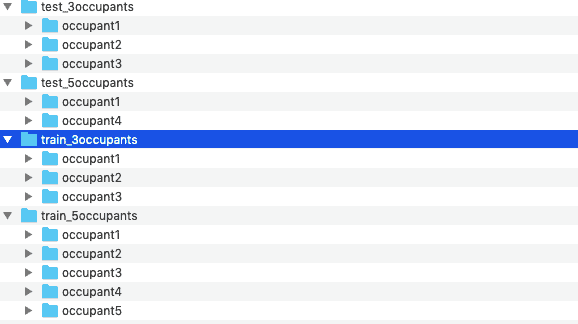

# 数据探索

在对数据应用深度学习算法之前，探索数据集是非常重要的。要进行探索，首先，我们可以将音频信号（`.wav`）传递给图像转换器`wav2image.py`（可在第四章，*音频/语音/物联网中的语音识别*代码目录中找到），以查看频谱图像的效果。这将生成图像，如下所示。以下截图展示了一个`on`命令的转换图像：

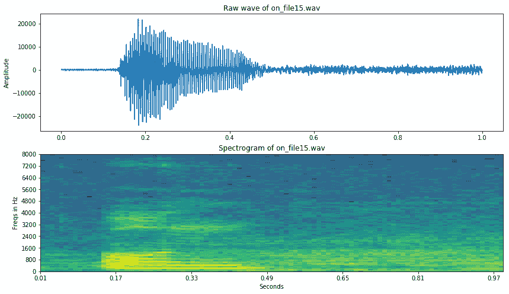

以下截图展示了一个`off`命令的转换图像。从截图中可以看出，它们的颜色分布不同，这将被深度学习算法利用来进行识别：

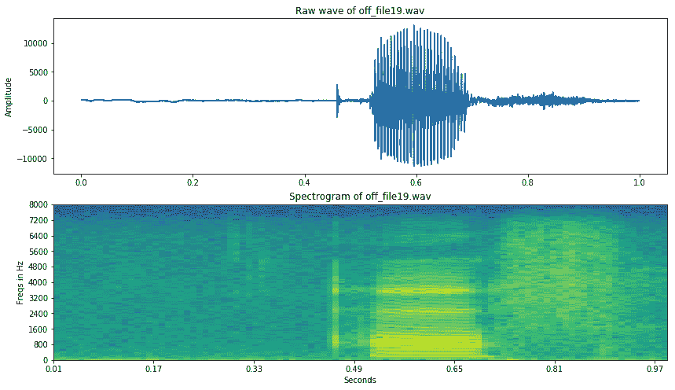

我们还可以对数据进行分组探索，为此我们可以在想要探索的数据集上运行`image_explorer.py`，如下所示：

```py
python image_explorer.py
```

下面的截图展示了在语音命令数据集中探索谱图像数据的过程。有趣的是，这些图像的颜色与之前展示的单独图像不同。这可能是由于我们用于它们的工具不同。对于组合图像，我们使用了 sox 工具；而对于单独的图像，我们使用了`ffmpegf`：

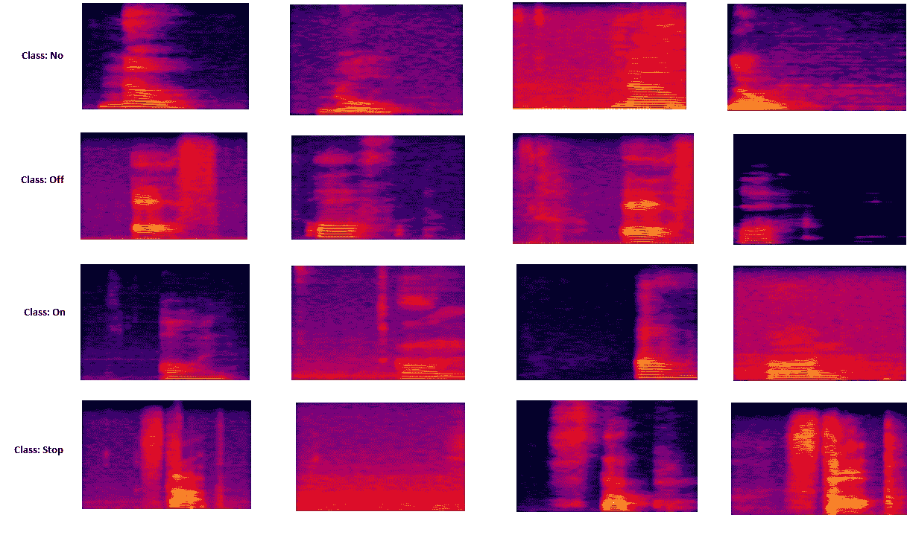

正如在前面的数据探索截图中所示，谱图像中四种不同语音命令之间的差异并不总是显著。这是音频信号识别中的一个挑战。

下面的截图展示了基于说话者/居住者语音（5 秒）数据集的谱图像数据探索过程的快照：

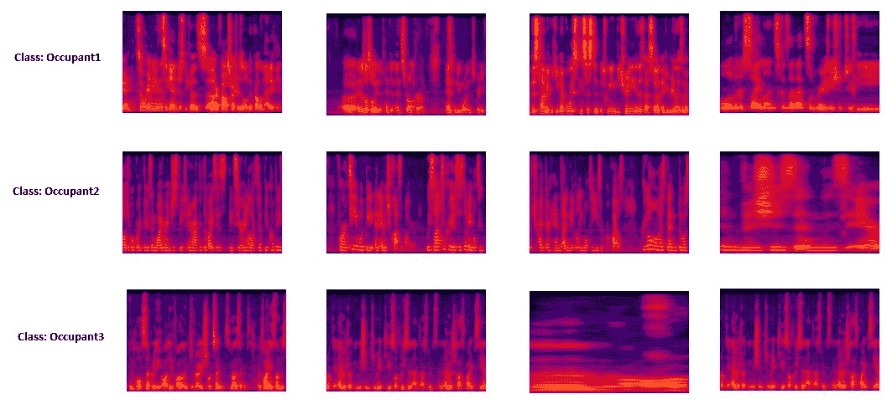

正如前面的截图所示，每个居住者的短语音谱图像呈现出一种模式，这将有助于对居住者进行分类，并相应地授予访问权限。

# 数据预处理

**数据预处理** 是深度学习流水线中的一个关键步骤。语音命令数据集由每个短语音命令的 1 秒`.wav`文件组成，这些文件只需转换为谱图像。然而，第二使用案例的下载音频文件长度不统一，因此需要进行两步预处理：

+   将`.mp3`转换为统一长度（如 5 秒）的 WAV 文件

+   `.wav`文件转换为谱图像。

数据集的预处理在数据收集部分有所讨论。在训练图像集准备过程中需要注意以下几个问题：

+   **数据规模**：我们需要为每个类别收集至少一百张图像，以便训练一个效果良好的模型。我们收集的图像数量越多，训练模型的准确性就可能越高。在这个使用案例中的每个数据集类别中，有超过 3,000 张样本图像。然而，少样本学习（使用较少样本进行学习）在少于 100 个训练样本时也能发挥良好效果。我们还确保这些图像能够很好地代表我们应用程序在实际实施中可能面临的情况。

+   **数据异质性**：用于训练的数据应该是异质的。例如，关于说话者的音频或语音信号应该在尽可能多的情况下采集，包括他们的不同语音状态和使用不同设备的情况。

# 模型训练

如前所述，我们对两个用例都采用迁移学习，无需从头开始训练；使用新数据集重新训练模型在很多情况下已经足够。另外，在第三章，*物联网中的图像识别*中，我们发现 Mobilenet V1 是一种轻量级（占用内存少且训练时间较短）的 CNN 架构。因此，我们在实现两个用例时都采用 Mobilenet V1 网络。重要的是，我们将使用 TensorFlow 的`retrain.py`模块，因为它专门为 CNN（如 Mobilenet V1）基于迁移学习设计。

在重新训练 Mobilenet V1 模型之前，我们需要了解`retrain.py`的关键参数列表。对于重新训练，如果我们在 Linux 或 macOS 的终端或 Windows 的命令提示符中键入`python retrain.py -h`，将会看到一个窗口，类似以下截屏，并包含额外的信息（如每个参数的概述）：

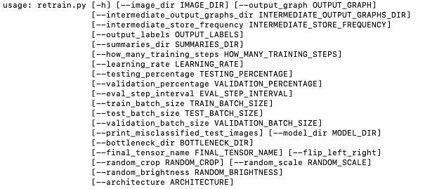

如前面的截屏所示，强制参数是`-–image directory`，它需要是一个数据集目录，其中我们希望训练或重新训练模型。对于 Mobilenet V1，我们必须明确提到 CNN 架构，例如`--architecture mobilenet_1.0_224`。对于其余的参数，包括在训练、验证和测试数据之间的数据分割比例，我们使用了默认值。数据的默认分割是将 80%的图像放入主训练集中，保留 10%作为验证集频繁用于训练，最后 10%的数据用于测试分类器在现实世界中的性能。

下面是运行 Mobilnet V1 模型重新训练的命令：

```py
python retrain.py \
--output_graph=trained_model_mobilenetv1/retrained_graph.pb \
--output_labels=trained_model_mobilenetv1/retrained_labels.txt   \
--architecture mobilenet_1.0_224 \
--image_dir= your dataset directory
```

一旦我们运行上述命令，它们将在给定目录中生成重新训练模型（`retrained_graph.pb`）和标签文本（`retrained_labels.txt`），而摘要目录包含了模型的训练和验证摘要信息。摘要信息（`--summaries_dir`参数默认值为`retrain_logs`）可以被 TensorBoard 用来可视化模型的不同方面，包括网络和性能图表。如果我们在终端或命令提示符中输入以下命令，将会运行`tensorboard`：

```py
tensorboard --logdir retrain_logs
```

一旦 TensorBoard 运行起来，请在浏览器中输入`localhost:6006`，可以查看 TensorBoard 并浏览相应模型的网络。以下图表展示了所使用的 Mobilnet V1 网络的结构。

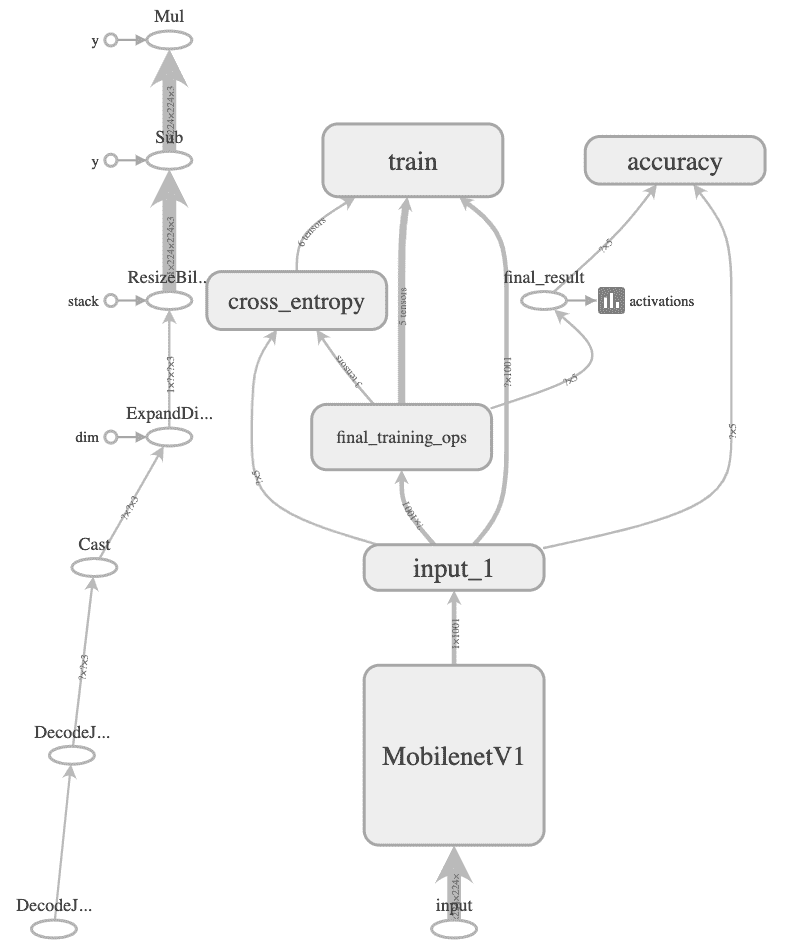

# 评估模型

我们可以从三个不同的角度评估模型：

+   学习/(重新)训练时间

+   存储需求

+   性能（准确性）

使用`retrain.py`模块进行的 Mobilnet V1 的重新训练和验证过程，在台式机（Intel Xenon CPU E5-1650 v3@3.5GHz 和 32 GB RAM）上，配备 GPU 支持，仅需不到一小时。

模型的存储/内存需求是资源受限的物联网设备中的一个重要考虑因素。为了评估 Mobilenet V1 的存储/内存占用，我们将其存储需求与另外两个类似网络（Incentive V3 和 CIFAR-10 CNN）的存储需求进行了比较。以下截图展示了三个模型的存储需求。如图所示，Mobilenet V1 仅需要 17.1 MB，少于 Incentive V3（87.5 MB）和 CIFAR-10 CNN（91.1 MB）的五分之一。在存储需求方面，Mobilenet V1 是许多资源受限物联网设备（如 Raspberry Pi 和智能手机）的更好选择：

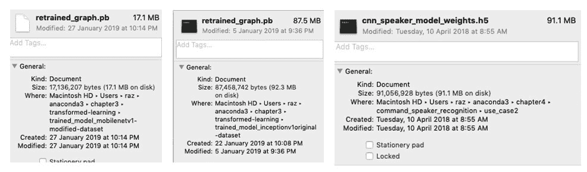

最后，我们对模型的性能进行了评估。两个层次的性能评估已经在不同的用例中完成：

+   数据集级别的评估或测试在桌面 PC 平台/服务器端的重训练阶段完成

+   个别音频和一组家庭成员样本在 Raspberry Pi 3 环境中进行测试或评估。所有的评估结果展示在以下图表中。

# 模型性能（用例 1）

以下截图展示了 Mobilenet V1 在语音命令数据集（自定义为仅包含五个命令，包括`on`，`no`，`off`，`yes`和`stop`）上的评估结果。请注意，由于缺乏真实数据集，在用例一中，`on`被认为是*打开灯光*：

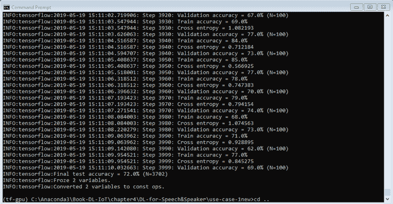

以下截图来自 TensorBoard 日志文件。橙色线表示训练准确度，蓝色线表示 Mobilenet V1 在指令数据集上的验证准确度：

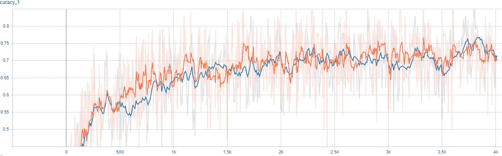

从前面的两张截图中可以看出，Mobilenet V1 的性能并不算很好，但通过增加更多的指令信息，如*打开主灯*而不仅仅是*开*，就足以用于指令检测。此外，我们可以使用更好的音频文件转图像转换器来提高图像质量和识别准确性。

# 模型性能（用例 2）

以下截图展示了 Mobilenet V1 在`三名成员`数据集上的评估结果。可以看出，数据集的性能相当不错，能够成功检测到占用者的概率超过 90%：

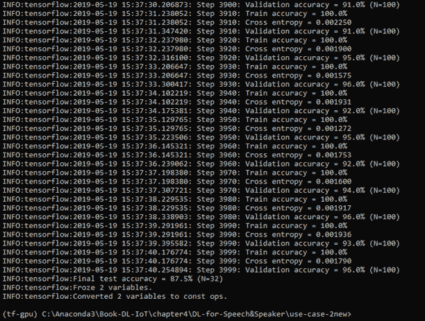

以下截图来自 TensorBoard 日志文件。橙色线表示训练准确度，蓝色线表示 Mobilenet V1 在`三名成员`数据集上的验证准确度：

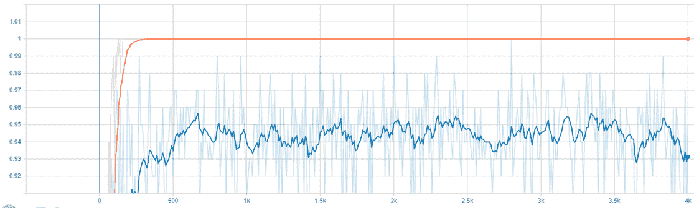

我们还在一个`五名居住者`数据集上测试了 Mobilenet V1，并且它在 85-94%的准确率范围内稳定表现。最后，我们可以将训练好的模型详细信息（如`retrained_mobilenet_graph.pb`和`retrained_labels.txt`）导出到物联网设备，包括智能手机或树莓派，然后使用提供的`label_image.py`代码或类似的工具，测试模型在新数据上的表现。

# 摘要

自动音频/语音/声音识别正成为人们与设备交互的流行方式，包括智能手机、可穿戴设备及其他智能设备。机器学习和深度学习算法在基于音频/语音/声音的决策中至关重要。

本章的第一部分，我们简要描述了不同的物联网应用及其基于音频/语音/声音检测的决策过程。我们还简要讨论了物联网中深度学习算法在基于语音/命令的决策中的潜在应用。第一个用例考虑了一个通过语音控制照明来使家庭智能化的物联网应用。第二个用例同样使家庭或办公室智能化，其中基于深度学习的物联网解决方案提供了自动化的智能家居或办公室访问控制。在本章的第二部分，我们简要讨论了这些用例的数据收集过程，并讨论了选择 CNN，特别是 Mobilenet V1 的理由。章中的其余部分描述了这些模型的深度学习管道的所有必要组件及其结果。

许多物联网设备和/或用户是移动的。在他们移动时，为其提供服务的前提是设备和用户的定位。GPS 可以支持户外定位，但在室内环境中无法使用。因此，室内定位需要其他替代技术。目前有多种室内定位技术，包括 WiFi 指纹识别，它们通常基于设备通信信号的分析。在下一章（第五章，*物联网中的室内定位*）中，我们将讨论并演示如何使用深度学习模型在物联网应用中进行室内定位。

# 参考文献

+   辅助技术: [`www.who.int/en/news-room/fact-sheets/detail/assistive-technology`](http://www.who.int/en/news-room/fact-sheets/detail/assistive-technology)

+   *用于上下文感知车载应用的智能且强健的说话人识别*，I Bisio，C Garibotto，A Grattarola，F Lavagetto，A Sciarrone，发表于《IEEE 车辆技术学报》，第 67 卷，第 9 期，第 8808-8821 页，2018 年 9 月。

+   *面向 5G 的情感感知连接健康大数据*，M S Hossain 和 G Muhammad，发表于《IEEE 物联网学报》，第 5 卷，第 4 期，第 2399-2406 页，2018 年 8 月。

+   *语音识别的机器学习范式*，L Deng，X Li（2013）。《IEEE 音频、语音与语言处理学报》，第 2 卷，第 5 期。

+   *关于深度学习架构在远距离语音识别中的比较*，R Sustika，A R Yuliani，E Zaenudin 和 H F Pardede，*2017 第二届信息技术、信息系统与电气工程国际会议（ICITISEE）*，日惹，2017 年，第 17-21 页。

+   *用于语音识别的声学建模的深度神经网络*，G Hinton，L Deng，D Yu，G E Dahl，A R Mohamed，N Jaitly，A Senior，V Vanhoucke，P Nguyen，T N Sainath 和 B Kingsbury，《IEEE 信号处理杂志》，卷 29，第 6 期，第 82–97 页，2012 年。

+   *长短期记忆递归神经网络架构用于大规模声学建模*，H Sak，A Senior 和 F Beaufays，发表于国际语音通信协会第十五届年会，2014 年。

+   *使用时延神经网络的音素识别*，《IEEE 声学、语音与信号处理学报》，G. H. K. S. K. J. L. Alexander Waibel，Toshiyuki Hanazawa，卷 37，第 3 期，1989 年。

+   *用于高效建模长时间上下文的时延神经网络架构*，V Peddinti，D Povey 和 S Khudanpur，发表于《Interspeech 论文集》，ISCA，2005 年。

+   *用于大词汇连续语音识别的深度卷积神经网络*，B. K. B. R. Tara N Sainath 和 Abdel Rahman Mohamed，发表于国际声学、语音与信号处理会议。IEEE，2013 年，第 8614–8618 页。

+   *用于音乐建模的梅尔频率倒谱系数*，Logan，Beth 等，ISMIR，卷 270，2000 年。

+   *发布语音命令数据集*，Pete Warden: [`ai.googleblog.com/2017/08/launching-speech-commands-dataset.html`](https://ai.googleblog.com/2017/08/launching-speech-commands-dataset.html)。
