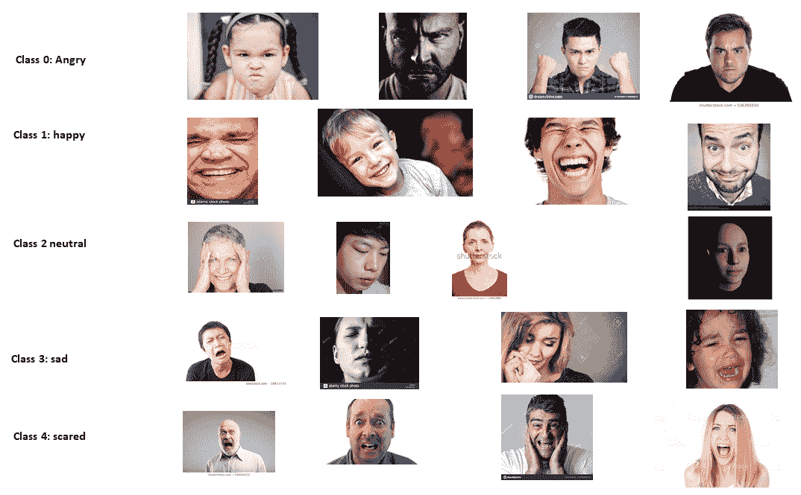

# 第六章：物联网中的生理和心理状态检测

人体生理和心理状态能够提供关于个人活动和情感的非常有用的信息。这些信息可以应用于多个领域，包括智能家居、智能汽车、娱乐、教育、康复与健康支持、体育和工业制造等，以改进现有服务和/或提供新服务。许多物联网应用都集成了用于人体姿态估计或活动和情感识别的传感器和处理器。然而，基于传感器数据检测活动或情感是一项具有挑战性的任务。近年来，基于深度学习的方法已成为解决这一挑战的流行且有效的方式。

本章介绍了基于深度学习的物联网应用中的人体生理和心理状态检测技术。章节的第一部分将简要描述不同的物联网应用及其基于生理和心理状态检测的决策制定。此外，还将简要讨论两个物联网应用及其在现实场景中的基于生理和心理状态检测的实现。在章节的第二部分，我们将展示这两个物联网应用的基于深度学习的实现。本章将涵盖以下主题：

+   基于物联网的人体生理和心理状态检测

+   用例一：基于物联网的远程物理治疗进度监控

+   基于物联网的远程物理治疗进度监控的实现

+   用例二：智能教室

+   智能教室的实现

+   基于深度学习的人体活动与情感检测在物联网中的应用

+   LSTM 和 CNN 以及转移学习在物联网应用中的人体活动/情感识别（HAR/FER）

+   数据收集

+   数据预处理

+   模型训练

+   模型评估

# 基于物联网的人体生理和心理状态检测

近年来，人体生理和心理状态检测已在多个应用领域得到广泛应用，旨在提升现有服务和/或提供新服务。物联网结合深度学习技术可用于检测人体的生理和心理状态。以下图表展示了这些检测方法的一些关键应用：


现在，我们将详细了解这两种状态检测变体：

+   **生理状态检测**：生理状态或活动检测在许多应用中都非常有用，包括对脆弱人群（如老年人）的辅助生活，以及远程物理治疗/康复系统。在老年人的辅助生活中，摔倒对受害者的健康有害，因为摔倒伴随的身体伤害风险。摔倒还可能带来经济后果，因其需要医疗费用和住院治疗。此外，摔倒还可能缩短一个人的预期寿命，特别是**长时间卧床不起**的情况下。值得注意的是，摔倒相关的医疗费用极为昂贵。例如，仅在美国，摔倒的年成本预计到 2020 年将达到 670 亿美元。在此背景下，使用深度学习支持的物联网（IoT）应用进行自动化和远程摔倒检测可以解决这一问题，从而提高老年人的生活质量并减少相关成本。人类活动检测应用的另一个关键领域是远程物理治疗监控系统。这是本章的第一个应用案例，我们将在下一节中概述它。

+   **心理状态检测：**面部表情是人类心理状态的良好反映，它们是人类交流中的重要因素，帮助我们理解他人的意图。通常，通过分析他人的面部表情和语音语调，我们可以推测他们的情感状态，如快乐、悲伤和愤怒。非语言交流的形式构成了所有人类互动的三分之二。面部表情作为情感表达的方式，是主要的非语言人际沟通渠道之一。因此，基于面部表情的情感检测可以在理解人们行为方面发挥作用。因此，它可以帮助改进现有服务和/或新服务，包括个性化的客户服务。物联网应用，如智能医疗、智能教育和安全保障，可以通过基于深度学习的情感检测或情绪分析来改善其服务。例如，在智能课堂中，教师可以实时或准实时地分析学生的情感，从而提供个性化或小组导向的教学。这将改善学生的学习体验。

# 用例一 - 远程物理治疗进展监控

物理治疗是医疗保健中的重要组成部分。物理治疗的需求与我们提供该治疗的能力之间存在巨大的差距。世界上大多数国家仍然严重依赖一对一的患者-治疗师互动（这是黄金标准），但这种方式不可扩展，也不具备成本效益，无论对患者还是医疗提供者而言。此外，大多数现有的治疗及其更新依赖于平均数据，而非个体的独特数据，有时这些数据是定性的（例如，*是的，我做了你告诉我做的事情*），而非定量的。这是有效治疗面临的一个挑战。最后，许多人，特别是老年人，正面临**多重慢性病**（**MCC**），这些病症通常是分开治疗的，这可能导致治疗效果不佳，甚至出现病症之间的冲突。例如，对于糖尿病和背痛的患者：糖尿病护理人员可能建议步行，而背痛护理人员则可能禁止此举。在这种情况下，物联网已经在改变医疗保健。它可以借助机器学习/深度学习和数据分析工具解决大多数挑战，通过提供实时或准实时的信息，提供有效的物理治疗。

# 用例一的实现

进展监测是传统治疗中的一个关键挑战。基于物联网的治疗可以解决这一进展监测问题。下图简要展示了基于物联网的远程物理治疗监控系统如何运作：


该应用的一个关键组成部分是对受试者（患者）活动的监控，帮助治疗师远程观察患者是否遵循建议的治疗方案，并了解其是否取得了进展。如前面的图示所示，基于物联网的远程物理治疗监控系统由四个主要元素组成：

+   **传感器和患者端计算平台**：对于这个用例，我们考虑使用两个传感器：加速度计和陀螺仪。它们都可以测量与受试者活动相关的三维数据。对于这些传感器，我们可以使用专用传感器或智能手机内置的传感器（这些传感器通常嵌入在大多数智能手机中）。对于客户端计算平台，我们可以考虑使用树莓派来配合专用传感器，或者使用智能手机（如果我们使用智能手机传感器）。传感器需要正确放置，才能准确测量信号。传感器可以用于受试者活动的连续或事件式监控（如运动期间）。

+   **护理人员和治疗师**：护理人员，如拥有医生和医疗/健康数据库的医院，通过云平台/HealthCloud 进行连接。治疗用例的主要护理提供者是治疗师，医院/医生将在需要时为治疗师提供支持。

+   **基于深度学习的人体活动检测**：在此阶段，边缘计算设备将安装一个应用程序。安装在智能手机或树莓派上的应用程序将加载一个预训练的人体活动检测与分类模型。一旦加速度计和陀螺仪检测到任何信号，它们将其发送到智能手机或树莓派进行处理，并使用深度学习模型进行检测，最后将结果告知治疗师，以便其根据需要提供反馈或干预。

+   **HealthCloud 进行模型学习**：HealthCloud 是一个主要为医疗健康相关服务设计的云计算平台。它将使用参考数据集训练选定的深度学习模型，以进行人体活动的检测和分类。训练后的模型将预装在智能手机或树莓派上。

# 用例二 — 基于物联网的智能教室

全球高等教育的辍学率正在增加。例如，英国大学生的辍学率已经连续第三年上升。辍学的前八个原因中有三个是：

+   缺乏与教师和辅导员的优质时间

+   沮丧的学校环境

+   学生支持不足

解决这些问题的关键挑战之一是了解学生（例如，了解学生是否跟得上某个话题）并据此提供讲座/辅导及其他支持。一种潜在的方法是了解学生的情感，这在大班、计算机实验室或电子学习环境中是非常具有挑战性的。利用技术（包括在深度学习模型支持下的物联网）可以帮助通过面部表情和/或语音识别情感。本章的第二个用例旨在通过检测情感并相应管理讲座/实验室，提升学生在教室中的表现。

# 用例二的实现

下图展示了基于物联网的智能教室应用的简化实现：


基于面部表情的情感分析实现包含三个主要元素：

+   **传感器和计算平台：**对于此用例，我们需要至少一台可以覆盖教室的闭路电视（CCTV）摄像头，并通过无线或墙内隐蔽的电缆连接到计算平台。教室内讲师的电脑可以充当计算平台。该电脑将持续处理视频信号并将其转化为图像，以便进行基于图像的面部表情分析。

+   **基于面部表情的情感检测**：讲师的电脑将安装一个应用程序。该应用程序将加载一个预训练的基于面部表情的检测和分类模型。一旦深度学习模型接收到学生的面部图像，它会识别学生的情感（如快乐/不开心/困惑）并通知讲师采取必要的行动。

+   **桌面或服务器用于模型学习：** 讲师的电脑将连接到大学服务器或云计算平台，这将用于基于面部表情的情感识别和分类的模型训练/重训，使用参考数据集。这一学习过的模型将预装在讲师的课堂电脑中。

以下各节将描述为实现上述使用案例所需的基于深度学习的人类活动和情感识别。所有必要的代码都可以在本章的代码文件夹中找到。

# 基于物联网的人类活动与情感检测深度学习

在讨论有用的深度学习模型之前，了解基于加速度计和陀螺仪的人类活动检测系统，以及基于面部表情的情感检测系统的工作原理是非常重要的。

# 自动人类活动识别系统

自动**人类活动识别**（**HAR**）系统基于原始的加速度计和陀螺仪信号来检测人类活动。下图展示了一个基于深度学习的 HAR 示意图，该系统包括三个不同的阶段。具体如下：

+   物联网部署或对受试者或人的仪器化

+   特征提取和模型开发

+   活动分类/识别


通常，经典的 HAR 方法主要依赖于启发式的手工特征提取方法，这一过程较为复杂，不太适合资源受限的物联网设备。较新的基于深度学习的 HAR 方法能够自动进行特征提取，并且能够在资源受限的物联网设备上良好工作。大多数 HAR 方法考虑了六种不同的活动，包括走路、跑步、坐着、站立、上楼和下楼。这些活动在加速度计和陀螺仪信号中表现出差异，分类器利用这些差异来识别当前活动——这可能是物理治疗的一部分（例如跑步）。

# 自动化人类情感识别系统

自动化**人类情感识别**（**HER**）可以通过使用以下信号/输入之一或其组合来完成：

+   面部表情

+   语音/音频

+   文本

本章讨论基于**面部表情识别**（**FER**）的 HER。基于深度学习的自动化面部表情识别包括三个主要步骤：预处理、深度特征学习和分类。下图突出显示了基于 FER 的 HER 中的这些主要步骤。

面部表情分析的图像处理需要预处理，因为不同类型的情感（如愤怒、厌恶、恐惧、快乐、悲伤、惊讶和中立）之间有微妙的差异。输入图像中与 FER 无关的变化，包括不同的背景、光照和头部姿势，可以通过预处理去除，从而提高模型预测/分类的准确性。面部对齐、数据增强和图像归一化是一些关键的预处理技术。大多数用于 FER 的开源数据集不足以泛化 FER 方法。数据增强对于改进现有数据集中的 FER 至关重要。面部对齐和图像归一化对于改善单个图像非常有用。FER 深度学习流程的最后阶段是让深度学习算法学习并分类特征，从而识别情感。大多数图像识别深度学习算法，包括 CNN 和 RNN，适用于这一最后阶段：


# 深度学习模型在 HAR 和情感检测中的应用

通常，人类活动识别系统使用加速度计和陀螺仪信号，这些信号是时间序列数据。有时，识别过程会结合时间序列和空间数据。在这种情况下，**循环神经网络**（**RNN**）和 LSTM 是处理前者类型信号的潜在候选模型，因为它们能够在演化过程中结合输入的时间特征。另一方面，CNN 对于加速度计和陀螺仪信号的空间特征非常有效。因此，CNN 与 LSTM/RNN 的组合或混合模型对于前者类型的信号是理想选择。我们将使用 LSTM 模型来处理 HAR 用例，因为它能够处理人类活动的时间特征。

与 HAR 系统不同，基于 FER 的人类情感检测系统通常依赖于面部表情图像，这些图像依赖于图像像素值之间的局部或空间相关性。任何能够很好地进行图像识别的深度学习模型都适用于 FER 任务，同样适用于情感检测。许多深度学习算法或模型已经被用于图像识别，其中**深度信念网络**（**DBN**）和 CNN 是最重要的两个候选模型。在本章中，我们将考虑 CNN，因为它在图像识别中的表现非常出色。

# LSTM、CNN 和迁移学习在物联网应用中的 HAR/FER 中的应用

LSTM 是广泛使用的深度学习模型，用于 HAR，包括物联网（IoT）基础的 HAR，因为其记忆能力可以比其他模型（包括 CNN）更好地处理时间序列数据（如 HAR 数据）。LSTM 实现的 HAR 可以支持迁移学习，并且适用于资源受限的物联网设备。通常，FER 依赖于图像处理，而 CNN 是处理图像的最佳模型。因此，我们使用 CNN 模型实现用例二（FER）。在第三章中，*物联网中的图像识别*，我们概述了两种流行的 CNN 实现（如 Incentive V3 和 Mobilenets）及其相应的迁移学习。在接下来的段落中，我们简要介绍基础 LSTM 的概述。

LSTM 是 RNN 的扩展。许多 LSTM 的变种已被提出，它们遵循基础 LSTM。以下是基础 LSTM 的示意图：


如前图所示，LSTM 主要由两个组件组成。它们具有一个记忆单元或神经元，每个单元或神经元都有一个乘法遗忘门、读取门和写入门。这些门控控制对记忆单元/神经元的访问，并防止它们受到无关输入的干扰。这些门控通过 0/1 或开/关进行控制。例如，如果遗忘门开启/1，神经元/单元将其数据写入自身；如果门关闭/0，神经元将遗忘其上次的内容。其他门控的控制方式类似。

与 RNN 不同，LSTM 使用遗忘门主动控制单元/神经元状态，并确保它们不会退化。重要的是，LSTM 模型在数据具有长期时间依赖性的情况下，比 RNN 模型表现更好。许多物联网应用，如基于环境监测的人体活动识别和灾难预测，都展示了这种长期时间依赖性。

由于用例二的 FER 是基于图像处理的，因此 CNN 是最佳选择。CNN 有不同的实现方式，包括一个简单的 CNN、两个版本的 Mobilenets 和 Incentive3。用例二将探索简单的 CNN 和 Mobilenet V1，用于实现 FER 部分。

# 数据收集

HAR 和/FER 的数据收集因多种原因而具有挑战性，其中包括隐私问题。因此，开源高质量数据集的数量有限。对于用例一中的 HAR 实现，我们使用了一个非常流行且开源的**无线传感器数据挖掘**(**WISDM**)实验室数据集。该数据集包含来自 36 个不同受试者的 54,901 个样本。出于隐私原因，用户名已被 ID 号（1-36）掩盖。数据收集涵盖了受试者进行的六种不同活动：站立、坐着、慢跑、走路、下楼和爬楼。数据集包含三个方向的加速度计数据，每个样本有超过 200 个时间步长。以下截图是数据集的一个样本：


在用例二中基于 FER 的情感检测，我们使用了两个不同的数据集。第一个是流行的开源 FER2013 数据集。该数据集包含 48 x 48 像素的灰度人脸图像。这些图像已经预处理，并且可以直接用于训练和验证。图像可以分为七类（*0=愤怒，1=恶心，2=恐惧，3=快乐，4=悲伤，5=惊讶，* 和 *6=中立*）。该数据集采用 CSV 格式，包含面部图像的像素值信息，而不是图像本身。以下截图显示了数据集中的一些值：


训练集与验证集的拆分比例为*80:20*。

我们还通过 Google 搜索准备了一个数据集，特别针对 Mobilenet V1。该数据集不大，包含五个情感类别，每个类别都有超过 100 张图像。这些图像未经预处理。以下图示显示了准备好的数据集文件夹视图：


对于数据收集（每个类别的数据集），我们可以遵循一个四步过程：

1.  **搜索：**使用任意浏览器（我们使用了 Chrome），访问 Google 并搜索与类别/情感相关的合适词组（例如*愤怒的人类*）的 Google 图片。

1.  **图像 URL 收集：**此步骤利用几行 JavaScript 代码来收集图像 URL。收集到的 URL 可以在 Python 中用于下载图像。为此，选择 JavaScript 控制台（假设你使用的是 Chrome 浏览器，也可以使用 Firefox），点击 View | Developer | JavaScript console（在 macOS 上），或自定义并控制**Google Chrome** | **更多工具** | **开发者工具**（Windows 操作系统）。一旦选择了 JavaScript 控制台，这将使你能够以 REPL 的方式执行 JavaScript。接下来，按照以下步骤操作：

    1.  向下滚动页面，直到找到与你的查询相关的所有图像。然后，你需要抓取这些图像的 URL。

切换回 JavaScript 控制台，然后将以下 JavaScript 代码片段复制并粘贴到控制台中：

```py
// Get the jquery into the JavaScript console
var script = document.createElement('script');
script.src = "https://ajax.googleapis.com/ajax/libs/jquery/2.2.0/jquery.min.js";
document.getElementsByTagName('head')[0].appendChild(script)
```

1.  1.  上述代码片段将下载 jQuery JavaScript 库，现在你可以使用 CSS 选择器通过以下代码片段抓取 URL 列表：

```py
// Grab the chosen URLs
var urls = $('.rg_di .rg_meta').map(function() { return JSON.parse($(this).text()).ou; });

```

1.  1.  最后，使用以下代码片段将 URL 写入文件（每行一个）：

```py
// write the URls to file (one per line)
var textToSave = urls.toArray().join('\n');
var hiddenElement = document.createElement('a');
hiddenElement.href = 'data:attachment/text,' + encodeURI(textToSave);
hiddenElement.target = '_blank';
hiddenElement.download = 'emotion_images_urls.txt';
hiddenElement.click();
```

执行上述代码片段后，你将在默认下载目录下得到一个名为`emotion_images_urls.txt`的文件。

1.  **下载图像：**现在，你已经准备好下载图像，运行`download_images.py`（位于章节代码文件夹中），使用之前下载的`emotion_images_urls.txt`文件：

```py
python download_images.py emotion_images_urls.txt
```

1.  **探索**：一旦我们下载了图像，就需要对图像进行探索，以便删除不相关的图像。我们可以通过手动检查来完成此过程。之后，我们需要调整图像的大小并裁剪以满足要求。

# 数据探索

在本节中，我们将更详细地检查我们将使用的数据集：

+   **HAR 数据集**：该数据集是一个文本文件，包含了六种活动中不同受试者的加速度数据。由于仅凭文本文件很难直观感知数据分布，我们可以对数据集进行数据分布检查。以下图表总结了训练集的分布情况：

^()

正如我们从前面的图表中看到的，训练数据集包含比其他四种活动更多的步行和慢跑数据。这对深度学习模型是有利的，因为步行和慢跑属于动态活动，涉及的加速度数据范围可能较广。为了可视化这一点，我们探索了每项活动的 200 个时间步加速度测量数据。以下截图显示了坐着活动的 200 个时间步加速度测量值：


以下截图显示了站立活动的 200 个时间步加速度测量值：


以下截图显示了步行活动的 200 个时间步加速度测量值：


以下截图显示了慢跑活动的 200 个时间步加速度测量值：


从前面的图示可以看出，步行和慢跑活动比其他活动更为活跃，因为它们反映了用户的运动状态。

+   **FER 数据集**：我们需要将 FER2013 数据集中面部图像的像素值转换为实际图像，以便进行进一步探索。我们可以使用以下代码将像素值转换为图像：

```py
import os
import csv
import argparse
import numpy as np
import scipy.misc
parser = argparse.ArgumentParser()
parser.add_argument('-f', '--file', *required*=True, *help*="path of the csv file")
parser.add_argument('-o', '--output', *required*=True, *help*="path of the output directory")
args = parser.parse_args()
w, h = 48, 48
image = np.zeros((h, w), dtype=np.uint8)
id = 1
with open(args.file) as csvfile:
    datareader = csv.reader(csvfile, delimiter =',')
    next(datareader,None)
    for row in datareader:       
        emotion = row[0]
        pixels = row[1].split()
        usage = row[2]
        pixels_array = np.asarray(pixels, dtype=np.int)
        image = pixels_array.reshape(w, h)
        stacked_image = np.dstack((image,) * 3)
        image_folder = os.path.join(args.output, usage)
        if not os.path.exists(image_folder):
            os.makedirs(image_folder)
        image_file =  os.path.join(image_folder , emotion +'_'+ str(id) +'.jpg')
        scipy.misc.imsave(image_file, stacked_image)
        id+=1
        if id % 100 == 0:
            print('Processed {} images'.format(id))
print("Finished conversion to {} images".format(id))
```

我们可以使用以下代码执行前面的代码：

```py
python imager_converter.py
```

一旦我们有了图表，就可以运行以下代码进行图像探索：

```py
python image_explorer.py
```

这将生成类似以下图像的结果：


如前图所示，FER 数据集经过良好的预处理。另一方面，第二个数据集（我们将其命名为 FER2019）没有进行预处理，包括图像大小，正如以下图像所示：



# 数据预处理

数据预处理是深度学习流程中的一个关键步骤。HAR 和 FER2013 数据集已经进行了良好的预处理。然而，用例二的第二个数据集的下载图像文件尚未经过预处理。如前图所示，这些图像在大小和像素上不统一，且数据集的大小也不大，因此需要进行数据增强。常见的增强技术包括翻转、旋转、缩放、裁剪、平移和高斯噪声。每个活动都有许多可用的工具。你可以使用这些工具或编写自己的脚本来进行数据增强。一款有用的工具是**Augmentor**，这是一个用于机器学习的 Python 库。我们可以在 Python 中安装该工具并使用它进行增强。以下代码（`data_augmentation.py`）是一个简单的数据增强过程，它执行图像的翻转、旋转、裁剪和调整大小：

```py
# Import the module
import Augmentor
da = Augmentor.Pipeline("data_augmentation_test")
# Define the augmentation
da.rotate90(probability=0.5)
da.rotate270(probability=0.5)
da.flip_left_right(probability=0.8)
da.flip_top_bottom(probability=0.3)
da.crop_random(probability=1, percentage_area=0.5)
da.resize(probability=1.0, width=120, height=120)
# Do the augmentation operation: sampling
da.sample(25)
```

下图展示了两张原始图像及其增强后的样本（25 个样本中的 3 个）：


如前图所示，增强后的图像大小一致，已进行翻转和旋转处理。

以下是在准备训练图像集时需要注意的两个关键问题：

+   **数据大小**：我们需要收集至少 100 张图像每个类别，以训练一个效果良好的模型。收集的越多，训练后模型的准确度越高。然而，一次性学习（对象分类技术）可以在少于 100 个训练样本的情况下工作。我们还确保图像能够很好地代表我们在实际应用中可能遇到的情况。

+   **数据异质性**：用于训练的数据应具有异质性。例如，FER 数据集中的图像应来自不同肤色或相同表情的不同视角。

# 模型训练

如前所述，我们在用例一中使用 LSTM，在用例二中使用 CNN（简单的 CNN 和 Mobilenet V1）。所有这些深度学习实现都支持迁移学习，适用于两个用例，无需从头开始训练。

# 用例一

我们考虑使用堆叠 LSTM，它是一个常用于序列预测（包括时间序列问题）的流行深度学习模型。堆叠 LSTM 架构由两层或更多 LSTM 层组成。我们为用例一实现了 HAR，采用了一个两层的堆叠 LSTM 架构。以下图示展示了一个两层的 LSTM，其中第一层向第二层 LSTM 提供一系列输出，而非单一的值输出：


我们可以通过运行 `LSTM -HAR.py` 代码来训练和测试模型，代码位于 `use-case-1` 文件夹中（在对你的环境做必要修改后，例如`data`目录）：

```py
python LSTM-HAR.py
```

# 用例二

我们使用了两种不同架构的卷积神经网络（CNN）来进行智能教室中的基于 FER 的情感检测。第一种是简单的 CNN 架构。为了在 FER2013 数据集上训练模型，我们需要运行`CNN-FER2013.py`，该文件可以在本章的`use-case-2`代码文件夹中找到，或者使用笔记本。要在`CNN-FER2013.py`的所有默认设置下运行*（在对设置做出必要更改后，比如`data`目录）*，我们需要在命令提示符下运行以下命令：

```py
python CNN-FER2013.py
```

在 FER2013 数据集上训练和测试模型可能需要几个小时。下图是通过 TensorBoard 日志文件生成的，展示了用于用例二的网络：


我们可以通过运行以下代码在 FER2019 数据集上重新训练 Mobilenet V1：

```py
python retrain.py \

--output_graph=trained_model_mobilenetv1/retrained_graph.pb \
--output_labels=trained_model_mobilenetv1/retrained_labels.txt   \
--architecture =mobilenet_1.0_224 \
--image_dir= your dataset directory
```

一旦我们运行前面的命令，它们将生成重新训练的模型（`retrained_graph.pb`）和标签文本（`retrained_labels.txt`）到指定目录中。这也会将模型的摘要信息存储在一个目录中。摘要信息（`--summaries_dir`参数默认值为`retrain_logs`）可以被 TensorBoard 用于可视化模型的不同方面，包括网络结构和性能图。如果我们在终端或命令窗口中输入以下命令，它将启动 TensorBoard：

```py
tensorboard --logdir retrain_logs
```

一旦 TensorBoard 启动，可以通过浏览器访问`localhost:6006`来查看 TensorBoard 和相应模型的网络。下图展示了在实现中使用的 Mobilenet V1 架构的网络：


# 模型评估

我们可以从三个不同的方面评估模型：

+   学习/(重新)训练时间

+   存储需求

+   性能（准确度）

在训练时间方面，在一台桌面电脑（Intel Xenon CPU E5-1650 v3@3.5 GHz，32 GB RAM）并支持 GPU 的环境下，LSTM 在 HAR 数据集上，CNN 在 FER2013 数据集上，以及 Mobilenet V1 在 FER2019 数据集上的训练/重新训练时间都少于一个小时。

模型的存储需求是资源受限的物联网设备中的一个重要考虑因素。下图展示了我们在两个用例中测试的三种模型的存储需求。如图所示，简单 CNN 只占用 2.6 MB，远小于 Mobilenet V1（17.1 MB）的一六分之一。此外，HAR 用的 LSTM 占用了 1.6 MB（图中未展示）的存储空间。在存储需求方面，所有模型都适合在许多资源受限的物联网设备中部署，包括树莓派或智能手机：


最后，我们评估了模型的性能。可以对用例执行两级性能评估：

+   数据集级别的评估或测试已经在桌面 PC 平台/服务器端的重新训练阶段完成。

+   人体活动的单独信号和面部图像情感检测已在树莓派 3 环境中进行测试或评估。

# 模型性能（用例一）

以下图表展示了 LSTM 模型在 HAR 数据集上的逐步训练和测试准确率。从图中可以看到，训练准确率接近 1.0 或 100%，而测试准确率在.90 或 90%以上。通过这个测试准确率，我们相信 LSTM 模型能够在大多数情况下检测人体活动，包括判断被试是否在进行指定的物理治疗活动：


以下图是该模型在 HAR 测试数据集上的混淆矩阵。从图中可以看到，模型在**下楼**和**上楼**、**坐下**和**站立**的活动之间产生了混淆，因为这些活动的移动性非常有限或没有移动，意味着没有显著的加速度来区分它们：


# 模型性能（用例二）

以下截图显示了简单 CNN 模型在 FER2013 数据集上的训练和验证表现。该数据集的准确率并不高（训练准确率为.83，验证准确率为.63），但测试或验证准确率应该能够检测到智能教室中必要且独特的情感（如开心、悲伤和困惑）：


以下图是该模型在 FER2013 测试数据集上的混淆矩阵。如预期，模型在所有表情（例如 156 个愤怒表情被误识为悲伤表情）上都表现出混淆。这是深度学习的一个应用，进一步研究仍然需要提升性能：


对于用例二，我们测试了 Mobilenet V1。以下图表展示了模型 Mobilenet V1 在 FER2019 数据集上的整体表现。从图中可以看到，这显示了更好的训练准确率，但验证和测试准确率没有提升。造成这一结果的一个潜在原因可能是数据的大小和质量，因为经过数据增强后，每个样本可能不包含面部表情图像。进一步的预处理，包括人工检查，可能会提高数据质量和模型性能：


为了在单个图像上测试该模型，并转移模型的学习，我们需要执行以下步骤：

+   将训练好的模型（例如`fer2013_trained.hdf5`）和`label_image.py`文件（图像分类器）导出到树莓派（已安装 TensorFlow）/智能手机中。

+   使用以下命令运行图像分类器（不要忘记更新`test_image`路径）：

```py
python label_image.py
```

这将生成你测试图像的测试结果。

# 总结

自动检测人体生理和心理状态正成为一种流行的方式，人们通过这种方式了解一个人的身心状态，从而进行相应的互动和反应。在智能教育、医疗保健和娱乐等领域，许多应用都可以利用这些状态检测技术。机器学习和深度学习算法对这些检测技术至关重要。在本章的第一部分，我们简要介绍了利用人体生理和心理状态检测的不同物联网应用。我们还简要讨论了两个潜在的物联网应用案例，其中深度学习算法可以在人类生理和心理状态检测中发挥作用。第一个应用案例考虑了基于物联网的远程物理治疗进度监控系统。第二个应用案例是基于物联网的智能课堂应用，利用学生的面部表情来了解他们的反馈。在本章的第二部分，我们简要讨论了这些应用案例的数据收集过程，并讨论了选择 LSTM 进行人体活动识别（HAR）和选择卷积神经网络（CNN）进行面部表情识别（FER）的理由。本章的其余部分描述了这些模型的深度学习流程的所有必要组件及其结果。

物联网应用中的一个关键挑战是安全性。许多物联网应用，如无人驾驶汽车、智能医疗和智能电网，都是关键任务应用。安全性是这些以及许多其他物联网应用的核心要素。在下一章中，我们将讨论物联网应用中的安全性，并展示深度学习如何用于物联网安全解决方案。

# 参考文献

+   K. Rapp, C. Becker, I.D. Cameron, H.H. König 和 G. Büchele, *老年护理机构跌倒流行病学：分析来自巴伐利亚养老院居民的超过 70,000 起跌倒事件*, J. Am. Med. Dir. Assoc. 13 (2) (2012) 187.e1–187.e6.

+   疾病控制与预防中心. *老年人跌倒的成本*, 2014\. [`www.cdc.gov/homeandrecreationalsafety/falls/fallcost.html`](http://www.cdc.gov/homeandrecreationalsafety/falls/fallcost.html)（访问时间：14.04.19）。

+   M. S. Hossain 和 G. Muhammad, *面向 5G 的情感感知连接健康大数据*，发表于 IEEE 物联网期刊，第 5 卷，第 4 期，页码 2399-2406，2018 年 8 月。

+   M. A. Razzaque, Muta Tah Hira 和 Mukta Dira. 2017\. 体域网中的 Q*oS：一项调查。ACM Trans*. Sen. Netw. 13, 3, 第 25 篇文章（2017 年 8 月），46 页。

+   Nigel Bosch, Sidney K. D'Mello, Ryan S. Baker, Jaclyn Ocumpaugh, Valerie Shute, Matthew Ventura, Lubin Wang 和 Weinan Zhao. 2016\. 在计算机辅助课堂中检测学生情绪。载于 *第二十五届国际人工智能联合会议论文集*（IJCAI'16），Gerhard Brewka（编）。AAAI Press 4125-4129。

+   Isabel Sagenmüller, *学生保持：8 个导致人们辍学的原因*, [`www.u-planner.com/en-us/blog/student-retention-8-reasons-people-drop-out-of-higher-education`](https://www.u-planner.com/en-us/blog/student-retention-8-reasons-people-drop-out-of-higher-education)。

+   Nikki Bardsley, *大学生辍学率连续第三年上升*, [`www.fenews.co.uk/featured-article/24449-drop-out-rates-among-university-students-increases-for-third-consecutive-year`](https://www.fenews.co.uk/featured-article/24449-drop-out-rates-among-university-students-increases-for-third-consecutive-year)。

+   S. Hochreiter 和 J. Schmidhuber, *长短期记忆*, 神经计算, 第 9 卷，第 8 期, 第 1735–1780 页, 1997 年。

+   [`www.cis.fordham.edu/wisdm/dataset.php`](http://www.cis.fordham.edu/wisdm/dataset.php)。

+   I. Goodfellow, D. Erhan, PL Carrier, A. Courville, M. Mirza, B. Hamner, W. Cukierski, Y. Tang, DH Lee, Y. Zhou, C. Ramaiah, F. Feng, R. Li, X. Wang, D. Athanasakis, J. Shawe-Taylor, M. Milakov, J. Park, R. Ionescu, M. Popescu, C. Grozea, J. Bergstra, J. Xie, L. Romaszko, B. Xu, Z. Chuang, 和 Y. Bengio, *表征学习中的挑战：三项机器学习竞赛报告*. arXiv 2013 年。
