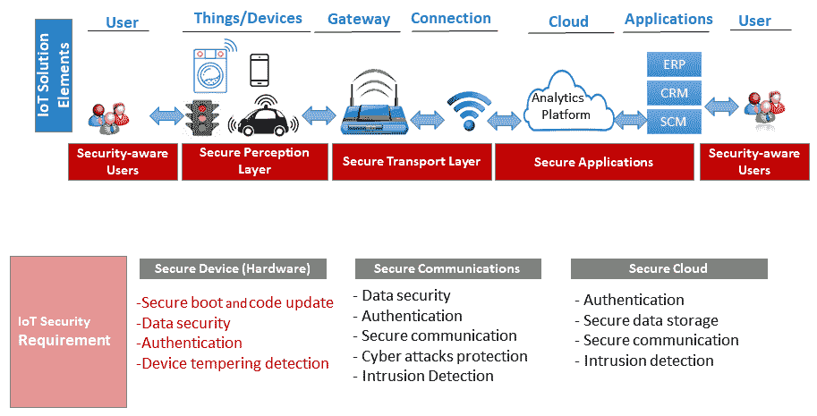

# 第七章：物联网安全

物联网的使用正在以危险的速度增长，研究人员和行业已经估计，活跃的无线连接设备数量将超过 200 亿。这种物联网设备的指数级增长正在增加对我们生命和财产的风险，也增加了整个 IT 行业的风险。更多连接的设备意味着更多的攻击向量，也给黑客提供了更多的利用机会。在这种背景下，物联网的安全性不仅对其应用至关重要，也对整个 IT 行业至关重要。

在物联网安全解决方案中，网络和设备可以分为基于签名的和基于行为的。与物联网相关的基于行为的解决方案，如异常检测，是更可取的，因为准备和维护动态且未知的物联网攻击签名非常困难。类似于人类行为分析，**深度学习**（**DL**）/**机器学习**（**ML**）模型可以在物联网中用于数据探索，以及学习物联网设备和网络在不同应用环境中的正常与异常行为（从安全角度来看）。

本章介绍基于深度学习（DL）技术的物联网网络和设备行为数据分析，以及物联网应用中的安全事件检测技术。在本章的第一部分，我们将简要描述不同的物联网安全攻击及其潜在的检测技术，包括基于深度学习/机器学习（DL/ML）的方法。此外，我们将简要讨论两个物联网用例，其中**拒绝服务攻击**（**DoS**）和**分布式拒绝服务攻击**（**DDoS**）等安全攻击可以通过基于深度学习的异常检测智能地和自动地进行检测。在本章的第二部分，我们将展示基于深度学习的安全事件检测实现。以下是本章将涉及的主题：

+   物联网安全攻击与潜在检测方法

+   用例一—物联网智能主机入侵检测

+   物联网智能主机入侵检测的实现

+   用例二—物联网智能网络入侵检测

+   物联网智能网络入侵检测的实现

+   用于物联网安全事件检测的深度学习（DL）

+   **深度神经网络**（**DNN**）、**自编码器**和**长短期记忆网络**（**LSTM**）在物联网安全事件检测中的应用

+   数据收集

+   数据预处理

+   模型训练

+   模型评估

# 物联网中的安全攻击与检测

根据统计数据，全球将有超过 260 亿个连接的物联网设备。这些设备包括智能电视、平板电脑、智能手机、笔记本电脑、可穿戴设备、传感器、恒温器等，将使我们的生活更高效、更节能、更舒适、更具成本效益。然而，只有当这些应用的安全性得到保障时，这些才能实现，因为在许多情况下，这些设备涉及的是关键任务应用。

现实情况是，物联网安全目前是物联网行业面临的首要挑战。如果没有合适的安全解决方案，特别是无线联网设备上通过公共互联网传输的数据就容易受到黑客攻击。在这种情况下，整个物联网管道或路径需要保持安全。换句话说，物联网需要**端到端**（**E2E**）安全，数据必须从终端设备或家电离开时开始得到保护，在它通过云端往返的过程中，直到它到达最终用户的移动应用或基于浏览器的应用程序。此外，一旦在用户设备/应用中处理并做出决策，它还必须遵循一个安全的反向路径，将控制指令传输到设备。以下图展示了物联网解决方案的 E2E（三层）视图及主要三层的安全要求：



以下图展示了从三层视角总结的物联网（IoT）主要攻击方式：


设计和开发物联网安全解决方案是一项非常具有挑战性的任务。例如，这些设备通常被称为“嵌入式”设备，它们具有固定的功能，专门用于执行特定的任务。它们在操作系统、处理能力和内存方面都受到资源限制。传统的 PC 安全解决方案并不适用，因为它们甚至无法在大多数嵌入式设备上运行。重要的是，有大量设备存在漏洞，可能会被攻击者利用。例如，在智能家居中，我们的物联网/智能设备比 PC/笔记本电脑还要多。

很快，我们的家中将配备大量联网设备，其数量可能与中型公司中的连接数相媲美。在这种情况下，仅仅管理这些联网设备的更新、密码和设置，没有 IT 安全团队的支持，也没有任何昂贵的企业级安全工具，将成为一场噩梦。基于**人工智能**（**AI**）——尤其是深度学习（DL）/机器学习（ML）——的自动化方法可以反应性地和/或主动地发现安全问题并帮助我们进行管理。基于 AI 的解决方案可以采取两种不同的形式：

+   **基于网络的解决方案**：基于网络的解决方案旨在通过在应用的网络周围建立保护屏障来保护物联网设备免受攻击。这种方法维护一个允许访问物联网应用网络的设备白名单，以防止入侵者进入网络。然而，物联网设备需要访问并从外部世界访问，例如从云端或智能手机应用程序。深度学习/机器学习引擎可以监控物联网设备的进出流量，并创建一个定义物联网应用正常行为的配置文件。该引擎将通过与已建立的正常行为进行比较，检测任何即将到来的威胁。与企业网络不同，基于 AI 的威胁检测在物联网中更为简单，因为通常物联网设备的功能非常有限，且很难在恶意请求中伪装物联网设备。此外，定义一个有限的规则集来确定物联网设备的正常行为和异常行为也更为容易。例如，在智能家居中，一个智能灯泡与智能冰箱进行通信并非正常行为，并且很容易检测到，因为灯泡是用来照明的，不需要与冰箱进行通信来产生光。

+   **基于设备的解决方案**：通常，物联网设备在处理能力和存储容量方面是受限的。因此，基于签名的安全解决方案不适合物联网设备，因为它们需要存储大量的威胁和恶意软件签名数据库。与基于网络的解决方案类似，支持深度学习/机器学习的自动化行为检测解决方案是更好的替代方案，因为它们对资源的需求较少。此外，这些解决方案可以在不拖慢小型处理器的情况下运行。

尽管许多人更倾向于使用基于网络的解决方案而非基于设备的解决方案，但我们的建议是同时选择两者，因为它们能够为您的物联网设备以及整个网络提供更强的保护。

# 异常检测与物联网安全

网络和设备级行为异常检测是发现潜在安全事件的重要手段，包括 DoS 或 DDoS 攻击，或任何一般性的入侵。异常检测机制可以划分为多个子类：

+   **统计方法**：这些方法使用过去的行为来近似传感器或设备的正常行为模型。如果事物或网络观察到新的行为，会将其与模型进行比较，并且如果在统计上不兼容，则标记为异常。

+   **概率方法**：这些方法围绕概率模型的定义（参数化或非参数化）展开。如果设备或网络中的某个事件发生的概率低于预定义的阈值，则该事件被标记为异常事件。

+   **基于接近度的方法**：这些方法基于正常行为与异常行为之间的距离。聚类方法也属于这一类。

+   **基于预测的方法**：这些方法利用过去的网络/设备行为数据来训练一个模型，该模型可以预测任何进出流量的行为并识别异常。这是我们在两个用例中将使用的方法。第一个是主机级别或设备级别的入侵检测异常检测，第二个是网络级别的入侵检测。

DoS 和 DDoS 入侵事件在物联网应用中非常常见。物联网设备可能成为这些攻击的目标，或者物联网设备可能被攻击者利用，生成洪水流量以发起和运行 DDoS 攻击。这些攻击可以在物联网协议栈的不同层次上发起，包括网络层、传输层和应用层。通常，在应用层发起的 DDoS 攻击检测非常具有挑战性，因为请求包看起来与正常的请求包相似。由于这种攻击，我们可能会观察到在资源消耗方面的明显行为，例如网络带宽、CPU 处理和内存。例如，2016 年 9 月，由 Mirai 恶意软件劫持的物联网设备群体向法国某网站主机发起了约 1 Tbps 的 DDoS 流量攻击^([3])。在这种背景下，检测主机/物联网设备级别的入侵以及物联网网络级别的入侵非常关键，以确保物联网应用能够按预期使用并/或不成为对他人发起 DDoS 攻击的工具。在接下来的部分，我们将展示一个关于物联网设备级别入侵检测的用例，以及一个关于物联网网络级别入侵检测的用例。

# 用例一：物联网中的智能主机入侵检测

很多时候，资源受限的物联网设备成为攻击者的目标，攻击者可以发起 DoS 或 DDoS 攻击，导致物联网应用无法提供给消费者。例如，考虑一个基于物联网的远程病人监护系统。如果在关键时刻（如心脏病发作期间）病人的传感器数据无法传输给医生或医院，病人可能会因此失去生命。在这种背景下，设备或主机级别的入侵检测对大多数物联网应用至关重要。在用例一中，我们将考虑物联网设备或主机级别的入侵检测。

在使用预测方法（包括深度学习）检测物联网设备和网络中的异常（例如 DoS 和 DDoS）时，选择一个好的特征或特征集至关重要。通常，我们需要时间序列数据进行实时或在线异常检测，如果可以利用任何已经是这种形式的数据源，就不需要额外的特征工程。物联网设备的 CPU 利用率数据无需进一步工程化即可进行主机/设备级别的异常检测。

# 用例一的实现

我们正在考虑一个基于 IoT 的远程病人监测应用，用于实现智能主机级入侵检测。物理治疗的监测是一项具有挑战性的任务。基于 IoT 的治疗可以解决进度监测的问题。下图简要展示了基于 IoT 的远程病人监测系统及其设备级入侵检测的工作原理：


如前图所示，基于 IoT 的远程病人监测系统由三个主要元素组成：

+   **传感器和病人端计算平台**：病人将连接多个传感器，包括心电图仪、血压传感器、加速度计和陀螺仪。这些传感器将收集生理和活动相关的信息，并将其发送给护理提供者，以便进行必要的实时反馈。然而，这些传感器或设备的数据可能会因 DoS 或 DDoS 攻击而无法获取。攻击者可以通过向这些传感器发送过多请求，发起 DoS 攻击，试图使其过载，从而阻止合法请求的处理。类似地，攻击者也可以通过来自多个分布式源的请求发起 DDoS 攻击。连接到家庭网络的树莓派 3 可以作为病人端计算平台和传感器级入侵检测器。

+   **基于 DL 的入侵检测**：树莓派 3 将预安装一个基于 DL 的异常检测器，该检测器将分析传感器和 CPU 的使用情况，以检测是否有潜在的入侵行为。如果传感器没有任何 MCU，我们将考虑对树莓派 3 进行入侵检测。该检测器将持续监控树莓派 3 的 CPU 使用率，如果发现异常，将报告给管理团队以采取对策。

+   **Healthcloud 模型学习**：Healthcloud 是一个云计算平台，主要用于医疗相关服务。它将使用参考数据集训练选定的 DL 模型，用于异常检测。

在本章的第二部分（即从*DL 用于 IoT 安全事件检测*开始的章节），我们将描述基于 DL 的异常检测在前述用例中的实现。所有必要的代码都可以在本章的代码文件夹中找到。

# 用例二：基于流量的 IoT 智能网络入侵检测

通常，主机入侵（包括设备级入侵）利用外部世界的通信，大多数时候，一次成功的主机入侵伴随着网络入侵的成功。例如，在僵尸网络中，远程指挥与控制服务器通过与被攻陷的机器通信，给出执行操作的指令。更重要的是，大量不安全的物联网设备导致了全球 IT 基础设施中物联网僵尸网络攻击的激增。2016 年 10 月的 Dyn**域名系统**（**DNS**）攻击就是一个例子，在该事件中，Mirai 僵尸网络指挥了 100,000 台物联网设备发起 DDoS 攻击。此事件影响了许多热门网站，包括 GitHub、Amazon、Netflix、Twitter、CNN 和 PayPal。在这种背景下，检测物联网中的网络级入侵不仅对物联网应用程序至关重要，而且对其他 IT 行业同样重要。

通常，网络入侵检测器通过检查在网络中主机之间传输的流量来识别入侵者。与主机入侵检测类似，网络入侵检测可以基于签名或基于异常检测。在基于签名的方法中，所有传入的流量将与已知的恶意流量签名列表进行比较；而在基于异常检测的方法中，它将传入的流量与先前建立的正常行为进行比较。考虑到前者方法对资源的高需求，我们将考虑基于异常检测的**入侵检测系统**（**IDS**）。

# 用例二的实现

与传统网络不同，物联网中的入侵检测系统（IDS）需要轻量级、分布式于不同层次，并且具有长久性。第一个条件对于资源受限的物联网设备来说显而易见。解决方案需要分布在多个层次，以优化检测过程的效果。更重要的是，解决方案需要适用于长期使用的物联网设备。例如，一个智能冰箱可能会在一个家庭中使用超过 10 年，找到一个能够经得起如此长时间考验的安全解决方案是一项困难的任务。

以下图展示了一个物联网基础设施，包括一个多层网络 IDS，它可以解决物联网中 IDS 的前两个要求。例如，物联网部署由不同的、分布式的、资源受限的组件组成。一个系统范围的整体 IDS 在实时响应方面可能不太适用。在这种情况下，多层 IDS 中的每一层都会实时或准实时地识别该层特有的异常以及相应的入侵者：


物联网的多层网络 IDS（特别是在智能家居应用中）由以下三个主要元素组成：

+   **传感器/物联网设备与边缘计算平台**：智能家居设备，如智能电视、智能冰箱、恒温器、智能灯泡和家庭物理安全摄像头，是该应用场景中的传感器或“物品”。这些设备通过家用路由器/网关连接到互联网。在这个应用场景中，我们考虑的是基于网络的安全解决方案，而非基于设备的解决方案。我们还假设家用路由器将作为边缘计算设备，允许我们安装多层入侵检测系统（IDS）。

+   **基于 DL 的入侵检测**：家用路由器/网关将预装三个（每层一个）基于 DL 的异常检测器，这些检测器将分析来自家庭中连接设备的流量/数据包。每个检测器将与该层的正常流量进行比较，寻找任何异常或入侵，一旦检测到，将报告给家庭用户和/或自动设置对策。

+   **模型学习平台**：学习和更新用于异常检测的 DL 模型需要一个家用桌面或云平台。这个平台将使用三个参考数据集训练选择的 DL 模型/模型进行异常检测。

以下各节将描述基于 DL 的网络级和节点级异常检测在上述应用场景中的实现。所有必要的代码都可以在本章的代码文件夹中找到。

# DL 在物联网安全事件检测中的应用

传统的安全解决方案（如加密、身份验证、访问控制和网络安全）对于物联网设备来说并不奏效。近年来，基于 DL/ML 的解决方案已成为传统解决方案的热门替代品。基于 DL/ML 的解决方案可以智能地监控物联网设备及其网络，并检测各种新的或零日攻击。重要的是，DL/ML 可以通过异常检测来检测和/或预测各种设备和网络级安全事件。通过收集、处理和分析设备/物品及其网络的正常与异常活动数据，这些 DL/ML 方法能够识别各种安全事件，包括物联网设备和网络级入侵。在以下各节中，我们将简要介绍几种在物联网设备和网络级入侵检测系统（IDS）中有用的 DL 模型。

# DNN、自编码器和 LSTM 在物联网安全事件检测中的应用

许多深度学习模型，包括简单的 DNN、自编码器和递归神经网络（RNNs）^([6])，已经用于物联网安全增强。这些方法可以是监督的或无监督的。在本章中，我们将使用监督和无监督方法。对于第一个用例，我们将使用基于 LSTM 的监督方法来进行设备级入侵检测。在第二个用例中，我们将分别使用 DNN 和自编码器进行监督和无监督的网络级入侵检测。我们在第一个用例中使用 LSTM，因为设备级入侵检测基于时间序列 CPU 利用率数据，而 LSTM 在处理时间数据时表现良好。另一方面，自编码器是一种轻量级模型，非常适合资源受限的物联网设备。我们已经在前一章节中简要介绍了 LSTM，因此在下图中，我们简要介绍了自编码器作为模型回顾。

正如其名称所示，自编码器是编码和解码算法。下图展示了自编码器模型的简单架构：


如前图所示，自编码器由一个输入层和一个输出层组成，通过一个或多个隐藏层连接 [7]。由于自编码器复制输入，它们具有相同数量的输入和输出神经元。通常，自编码器由两个组件组成：编码器和解码器。编码器连接输入层，一旦接收到输入（**X**），它将其转换为新的压缩表示（**Z**）。压缩码也称为编码或潜变量（**Z**）。在输出层，解码器接收生成的代码或压缩代码，并将其转换为原始输入的重建。自编码器训练过程的目标是在输出层中最小化重建错误。

自动编码器由于其在输出层的输入重构，适用于诊断和故障检测。特别是，自动编码器的这一特殊功能在物联网中非常有用，包括**工业物联网**（**IIoT**），用于硬件设备和机器的故障诊断，以及操作/数据收集/性能中的异常检测。自动编码器的异常检测能力激励我们在网络入侵检测的用例中使用该模型。此外，一旦自动编码器在云或服务器中可用，它们可以轻松地在各种 IoT 设备和网络之间迁移。可用的自动编码器类型包括去噪、收缩、堆叠、稀疏和变分自动编码器。在本用例中，我们将使用一个简单的自动编码器架构，并为入侵检测使用独立的深度学习模型，但自动编码器也可以与其他深度学习模型集成，包括**卷积神经网络**（**CNNs**）和 LSTMs。在接下来的部分中，我们将从数据收集开始，讨论基于深度学习的上述用例实现。

# 数据收集

对于这两个用例，我们可以生成自己的数据集并在其上训练和测试模型。接下来的段落中，我们简要介绍如何通过 DoS 攻击为设备级主机入侵检测创建数据集。

# CPU 使用率数据

对于 DoS 攻击，我们需要一台攻击机器和一台目标机器。我们使用 Kali Linux 机器作为攻击者，Windows 机器作为目标（可以是家庭网关/Raspberry Pi 3/传感器）。在 Kali Linux 中，可以通过多种方式实现 DoS 攻击。一种方式是使用`hping3`[.](https://tools.kali.org/information-gathering/hping3) `hping3`命令作为网络工具，发送自定义 TCP/IP 数据包，用于测试防火墙、端口扫描、地址伪造等。

这可以通过快速连续发送多个请求来执行 DoS 攻击，耗尽 IoT 服务器/传感器的资源，使其变慢或无法响应。以下截图显示了发送`hping3`命令或发起 DoS 攻击之前，目标 Windows 服务器的 CPU 使用率：


以下命令是使用 Kali Linux 的`hping3`工具进行 DoS 攻击的示例。

```py
hping3 -c 10000 -d 120 -S -w 64 -p 21 --flood --rand-source example.com

```

以下列表是前述命令的语法说明：

+   `hping3`: 二进制应用程序的名称

+   `-c 100000`: 数据包数量

+   `-d 120`: 每个数据包的大小

+   `-S`: 仅 SYN 数据包

+   `-w 64`: TCP 窗口大小

+   `-p 21`: 目标端口

+   `--flood`: 表示以最快的速度发送数据包，而不关心是否显示接收到的回复

+   `--rand-source`: 使用随机源 IP 地址；你也可以使用`-a`或`–spoof`来隐藏主机名

+   `example.com`: 网站或目标 IP 地址，或者目标机器的 IP 地址

以下截图展示了 DoS 攻击后 Windows 服务器的 CPU 利用率。我们可以清晰地看到，被攻击的机器 CPU 利用率增加了 30%：


我们可以对不同目标机器运行多个 `hping3` 会话，并保存 CPU 利用率数据。在 Windows 系统中，可以使用进程监控工具来保存数据。对于用例一，我们使用基于 LSTM（长短期记忆网络）的入侵检测算法所需的 CPU 利用率数据。

# KDD Cup 1999 IDS 数据集

基于流量的物联网智能网络入侵检测，我们可以使用 Wireshark 网络监控工具来记录并保存不同攻击类型下的网络流量，从而创建我们自己的数据集。此外，我们还可以使用现有的开源数据集。我们正在使用 KDD Cup 1999 IDS 数据集。该数据集非常适合用例二，因为它涉及的是网络级入侵检测。在接下来的段落中，我们将简要介绍该数据集的概况。更多细节请参考相关资料。

KDD Cup 1999 数据集由 **国防高级研究计划局** (**DARPA**) 在模拟空军模型上生成。数据集是通过两次不同的会话收集的：

+   训练数据收集时间为 7 周

+   测试数据收集时间为 2 周

完整数据集包括 39 种网络级攻击类型和 200 个背景流量实例。网络流量数据集被分类为某一攻击类型或“正常”。KDD Cup 1999 IDS 数据集有三个版本——完整的 KDD 数据集、修正的 KDD 数据集以及 10% KDD 数据集。10% KDD 数据集是这三个数据集中使用最频繁的，我们将在用例二中使用该数据集。在用例二中，我们将使用自编码器对正常流量和攻击或入侵流量进行聚类。此外，我们还将测试一个 DNN（深度神经网络）对正常流量和攻击流量进行分类。

# 数据探索

在接下来的段落中，我们将探讨用于两个用例的两个数据集（物联网设备级的 CPU 利用率数据集，以及用于网络级入侵检测的 KDD Cup 1999 IDS 数据集）。

+   **CPU 利用率数据集**：该数据集是一个 CSV 文件，包含日期和时间以及相应的 CPU 利用率（%）。数据集包含了每分钟记录的 700 个利用率值。以下截图展示了数据集的一个快照：


+   **KDD Cup 1999 IDS 数据集**：以下截图展示了 KDD Cup 1999 IDS 数据集的一个快照。从截图中可以明显看出，数据集尚未准备好用于模型。数据集包含协议类型、分类值，且数据值未进行标准化。此外，我们还需要将数据集划分为三个子集，以便实现一个三层网络级入侵检测系统（IDS）。

以下截图展示了正常通信的网络流量模式：


以下截图展示了异常或攻击（例如由 smurf-it 发起的网络级分布式 DoS 攻击）通信的网络流量模式：


# 数据预处理

数据预处理是深度学习流程中的一个重要步骤。CPU 利用率数据集已准备好用于训练，但 KDD Cup 1999 IDS 数据集需要多级预处理，包括以下三个步骤：

1.  将数据分为三个不同的协议集（应用层、传输层和网络层）

1.  重复数据删除、类别数据转换和归一化

1.  特征选择（可选）

使用以下代码行是将数据集拆分为三个数据集的一个潜在方法，即`Final_App_Layer`、`Final_Transport_Layer`和`Final_Network_Layer`：

```py
#Importing all the required Libraries
import pandas as pd
IDSdata = pd.read_csv("kddcup.data_10_percent.csv",header = None,engine = 'python',sep=",")

# Add column header
IDSdata.columns = ["duration","protocol_type","service","flag","src_bytes","dst_bytes","land","wrong_fragement","urgent",               "hot","num_failed_logins","logged_in","num_compressed","root_shell","su_attempted","num_root","num_file_creations", "num_shells","num_access_files","num_outbound_cmds","is_hot_login","is_guest_login","count","srv_count","serror_rate","srv_serror_rate","rerror_rate","srv_rerror_rate","same_srv_rate","diff_srv_rate","srv_diff_host_rate","dst_host_count","dst_host_srv_count","dst_host_same_srv_rate","dst_host_diff_srv_rate","dst_host_same_src_port_rate","dst_host_srv_diff_host_rate","dst_host_serror_rate","dst_host_srv_serror_rate","dst_host_rerror_rate","dst_host_srv_rerror_rate","labels"]

# Explore the Application Layer IDS Data
ApplicationLayer = IDSdata[(IDSdata['labels'].isin(['normal.','smurf.','back.','satan.','pod.','guess_passwd.','buffer_overflow.','warezmaster.','imap.','loadmodule.','ftp_write.','multihop.','perl.']))]
print (ApplicationLayer['labels'].value_counts())

# Save a Applayer data only into a text file
ApplicationLayer.to_csv('Final_App_Layer.txt',header = None,index = False)

# Explore the Transport Layer IDS Data
TransportLayer = IDSdata[(IDSdata['labels'].isin(['normal.','neptune.','portsweep.','teardrop.','buffer_overflow.','land.','nmap.']))]
print (TransportLayer['labels'].value_counts())
TransportLayer.to_csv('Final_Transport_Layer.txt',header = None,index = False)

# Explore the Network Layer IDS Data
NetworkLayer = IDSdata[(IDSdata['labels'].isin(['normal.','smurf.','ipsweep.','pod.','buffer_overflow.']))]
print (NetworkLayer['labels'].value_counts())
NetworkLayer.to_csv('Final_Network_Layer.txt',header = None,index = False)
```

一旦数据集准备好，我们就删除重复的数据条目并归一化其余条目的值。可以使用以下代码行或函数进行重复数据删除和归一化：

```py
def DataPreprocessing(IDSdataframe):
 # Duplicate entry removal
    recordcount = len(IDSdataframe)
    print ("Original number of records in the training dataset before removing duplicates is: " , recordcount)
    IDSdataframe.drop_duplicates(subset=None, inplace=True)  # Python command to drop duplicates
    newrecordcount = len(IDSdataframe)
    print ("Number of records in the training dataset after removing the duplicates is :", newrecordcount,"\n")

    #Dropping the labels to a different dataset which is used to train the recurrent neural network classifier
    df_X = IDSdataframe.drop(IDSdataframe.columns[41],axis=1,inplace = False)
    df_Y = IDSdataframe.drop(IDSdataframe.columns[0:41],axis=1, inplace = False)

    # Categorial data to numerical data conversion
    df_X[df_X.columns[1:4]] = df_X[df_X.columns[1:4]].stack().rank(method='dense').unstack()

    # Coding the normal as " 1 0" and attack as "0 1"
    df_Y[df_Y[41]!='normal.'] = 0
    df_Y[df_Y[41]=='normal.'] = 1

    #converting input data into float
    df_X = df_X.loc[:,df_X.columns[0:41]].astype(float)

    # Normal is "1 0" and the attack is "0 1"
    df_Y.columns = ["y1"]
    df_Y.loc[:,('y2')] = df_Y['y1'] ==0
    df_Y.loc[:,('y2')] = df_Y['y2'].astype(int)
    return df_X,df_Y
```

数据集的最终预处理是为分类器选择最优的特征集。这个过程是可选的，但对于资源受限的物联网设备很有用，因为这将最小化网络输入层或神经元的大小。可以使用以下代码行或利用随机森林的函数进行该预处理：

```py
def FeatureSelection(myinputX, myinputY):
    labels = np.array(myinputY).astype(int)
    inputX = np.array(myinputX)

    #Random Forest Model
    model = RandomForestClassifier(random_state = 0)
    model.fit(inputX,labels)
    importances = model.feature_importances

    #Plotting the Features agains their importance scores
    indices = np.argsort(importances)[::-1]
    std = np.std([tree.feature_importances_ for tree in model.estimators_],
axis=0)            
    plt.figure(figsize = (10,5))
    plt.title("Feature importances (y-axis) vs Features IDs(x-axis)")
    plt.bar(range(inputX.shape[1]), importances[indices],
       color="g", yerr=std[indices], align="center")
    plt.xticks(range(inputX.shape[1]), indices)
    plt.xlim([-1, inputX.shape[1]])
    plt.show()

    # Selecting top featueres which have higher importance values
    newX = myinputX.iloc[:,model.feature_importances_.argsort()[::-1][:10]]

   # Converting the dataframe into tensors
    myX = newX.as_matrix()
    myY = labels
    return myX,myY
```

以下两张图分别突出显示了应用层和网络层数据集的 41 个特征。特征按重要性排序，从图中可以明显看出，不同层数据集的重要特征集是不同的。我们用 8-12 个特征和 41 个特征对深度学习模型进行了测试：


以下图表突出显示了网络层数据集的 41 个特征：


# 模型训练

如我们在本章前面提到的，我们在用例一中使用 LSTM，在多层 IDS 数据集上使用自编码器，在整个 IDS 数据集上使用 DNN。在接下来的小节中，我们将展示这两个用例的深度学习模型训练过程。

# 用例一

我们考虑了一个三层 LSTM 网络架构用于基于 CPU 利用率的主机/设备级入侵检测。下图展示了我们使用的 LSTM 架构：


我们可以通过运行`lstm_anomaly_detection.py`文件（可在本章的代码文件夹中找到）来训练和测试模型，方法如下：

```py
python lstm_anomaly_detection.py 
```

# 用例二

我们使用自编码器进行多层 IDS 实现，使用的是 KDD Cup 1999 IDS 数据集，并且已经在这三个数据集上进行了训练和测试。为了在每个层的数据集上训练模型，我们需要运行`IDS_AutoEncoder_KDD.py`文件（可在本章的代码文件夹中找到），方法如下：

```py
python IDS_AutoEncoder_KDD.py
```

我们还在整体 KDD Cup 1999 IDS 数据集上训练并测试了一个 DNN 模型。为此，我们需要运行 `DNN-KDD-Overall.py` 文件（位于本章的代码文件夹中），方法如下：

```py
python DNN-KDD-Overall.py
```

对于所有模型，我们都保存了最佳的模型，以便在 IoT 设备中导入和使用。同时，我们使用 TensorBoard 保存了模型日志，以可视化模型的不同方面，包括网络和性能图表。我们可以通过运行以下命令生成性能图表和网络：

```py
tensorboard --logdir logs
```

一旦 TensorBoard 正在运行，可以通过浏览器访问 `localhost:6006` 来查看 TensorBoard 并查看相应模型的网络结构。以下图是用于物联网多层 IDS 中的自动编码器架构：


# 模型评估

我们可以评估模型的三个不同方面：

+   学习/（重新）训练时间

+   存储需求

+   性能（准确性）

在一台配有 GPU 支持的桌面电脑（Intel Xenon CPU E5-1650 v3@3.5GHz 和 32 GB RAM）上，LSTM 在 CPU 利用率数据集上的训练和自动编码器在 KDD 分层数据集（减少的数据集）上的训练仅花费了几分钟。DNN 模型在整体数据集上的训练花费了超过一个小时，这是可以预料的，因为它是基于更大的数据集（KDD 整体 10% 数据集）进行训练的。

模型的存储需求是资源受限的 IoT 设备中的一个重要考虑因素。以下截图展示了我们为两个用例测试的三种模型的存储需求：


如截图所示，自动编码器的存储需求在 KB 范围内。存储的自动编码器模型的最终版本仅占 85 KB，LSTM 占 1.5 MB，DNN 占 16.3 MB。在存储需求方面，所有模型都适合在许多资源受限的 IoT 设备中部署，包括 Raspberry Pi 和智能手机。此外，从截图中可以看出，由于优化的特征选择过程等原因，自动编码器是一个非常轻量的模型。

最后，我们评估了模型的性能。在这两个用例中，数据集范围的评估或测试是在 PC 平台/服务器端的训练阶段进行的。我们也可以在 Raspberry Pi 3 或任何 IoT 边缘计算设备上测试它们，因为这些模型已经保存并可导入使用。

# 模型性能（用例一）

以下图表展示了在 CPU 利用率数据集上使用 LSTM 的验证结果：


从图中可以看出，预测结果紧密跟随非异常或“正常”的 CPU 利用率数据系列，这表明模型运行良好。重要的是，当它发现异常观察值时，观察到的与预测的 CPU 利用率值（归一化后的）与正常行为之间存在显著差异。这表明可能存在对物联网设备的 DoS 或 DDoS 攻击。误差差异以均方根（RMS）值进行绘制，这是此类指标中最常用的度量标准之一。

# 模型性能（用例二）

我们已经在三个数据集上测试了自编码器模型，用于三个不同层次的 IDS。以下截图展示了应用层 IDS 的评估结果快照：


从截图中可以看出，当我们使用前 12 个最重要的特征进行训练时，训练准确率、验证准确率和测试准确率均高于 90%。如果使用不同的特征集，性能可能会有所不同。

以下图表展示了前述模型在应用层 IDS 数据集上的每个 epoch 的训练准确率：


我们获得了一些有趣的评估结果，关于网络和传输层 IDS 模型的训练。如果使用前 12 个最重要的特征，验证准确率在 50%左右；如果将特征集改为 8 到 10 之间，准确率则提高到 80%到 90%之间。以下两张截图展示了网络层 IDS 实验的评估快照：


有趣的是，从第二张截图可以看出，准确率在前 50 个 epoch 内约为 50%，然后迅速上升到 90%以上。最终的准确率，或保存模型的准确率，处于 91%到 98%之间。因此，它们足以检测网络和传输层的异常。


以下截图展示了 DNN 模型在整体 KDD 数据集上的训练表现：


从前面的图示可以看出，测试准确率接近 1 或 100%。我们还单独测试了保存的模型，测试准确率远高于 0.90 或 90%。因此，DNN 在检测物联网网络中的网络级入侵方面也足够优秀。

# 总结

安全性是物联网实现中的最重要问题。传统的 PC/桌面安全解决方案，特别是基于签名的解决方案，在物联网应用中效果不佳。基于行为的解决方案，如异常检测，更适用于物联网。深度学习（DL）/机器学习（ML）模型是物联网中非常有用的工具，不仅用于数据分析，还用于安全事件检测。在本章中，我们介绍了基于 DL 的网络和设备行为数据分析以及物联网应用中的安全事件检测技术。在本章的第一部分，我们简要描述了各种物联网安全攻击及其潜在检测技术，包括基于 DL/ML 的技术。我们考虑了物联网应用中的两种不同级别的入侵检测。第一个使用案例是设备级或主机级的入侵检测，第二个使用案例是网络级的入侵检测。在本章的第二部分，我们介绍了基于 DL 的异常或事件检测部分的实现。通过评估发现，所选的 DL 模型足以检测物联网应用中的设备级和网络级入侵。

物联网将被应用于各类场景，如基础设施和工业，以监控其健康状况。健康监控的潜在应用之一是被监控对象（如电机）的预测性维护，以避免服务中断或其他事故发生。

在下一章中，我们将简要介绍基于物联网的预测性维护的重要性及其使用深度学习模型的实现。

# 参考文献

+   *全球 2015 年至 2025 年物联网（IoT）连接设备安装基数（以十亿计）*，见[`www.statista.com/statistics/471264/iot-number-of-connected-devices-worldwide/.`](https://www.statista.com/statistics/471264/iot-number-of-connected-devices-worldwide/)

+   *利用时间序列分析实时检测应用层 DDoS 攻击*，T. Ni，X. Gu，H. Wang 和 Y. Li，《控制科学与工程学报》，第 2013 卷，第 1-6 页，2013 年。

+   *物联网中的 DDoS：**Mirai 和其他僵尸网络*，C. Kolias，G. Kambourakis，A. Stavrou，J. Voas，《IEEE 计算机》，第 50 卷，第 7 期，第 80-84 页，2017 年。

+   2016 年 Dyn 网络攻击，见[`en.wikipedia.org/wiki/2016_Dyn_cyberattack.`](https://en.wikipedia.org/wiki/2016_Dyn_cyberattack)

+   *基于 Fisher 和深度自编码器的大型网络流量数据融合**方法*，Tao X.，Kong D.，Wei Y. 和 Wang Y.（2016 年），《信息》，第 7 卷第 2 期，第 20 页。

+   *基于长短时记忆（LSTM）和梯度下降优化的有效入侵检测分类器*，Kim J. 和 Kim H.（2017 年 2 月），在平台技术与服务（PlatCon），2017 年国际会议（第 1-6 页），IEEE。

+   Pierre Baldi，*自编码器、无监督学习与深度架构*，Isabelle Guyon，Gideon Dror，Vincent Lemaire，Graham Taylor 和 Daniel Silver（编辑），见《2011 年无监督与迁移学习国际会议论文集——第 27 卷（UTLW'11）》，第 27 卷，JMLR.org 37-50，2011。

+   KDD Cup 1999 数据，来自 [`kdd.ics.uci.edu/databases/kddcup99/kddcup99.html`](http://kdd.ics.uci.edu/databases/kddcup99/kddcup99.html)
