# 第八章：物联网的预测性维护

在**物联网**（**IoT**）设备中，数据流是为每次事件生成的。基于深度学习的方法可以实时检查这些数据，以诊断整个设备群体的问题，并预测单个设备的未来健康状况，从而实现按需维护。这种策略被称为**预测性**（或**基于状态**）**维护**。这种方法现在已经成为物联网最有前景和最有利可图的工业应用之一。

考虑到这些动机，在本章中，我们将探讨如何使用**涡扇发动机退化仿真**数据集开发物联网的深度学习解决方案。预测性维护的核心思想是确定各种类型的故障模式是否可以预测。此外，我们还将讨论如何从物联网设备收集数据以进行预测性维护。简而言之，本章将涉及以下内容：

+   物联网的预测性维护

+   开发预测性维护应用程序

+   准备数据

+   训练机器学习基准模型

+   训练 LSTM 模型

+   评估模型

+   常见问题解答

# 物联网的预测性维护

随着实时数据捕获和流处理架构的进步，现在可以进行实时数据监控，组织可以实时了解单个组件和所有流程的情况。监控仍然需要积极参与和快速反应——例如，一个石油井传感器指示温度或体积增加，或者网络流量中出现了僵尸网络活动或内部威胁。

让我们考虑一个真实世界的例子，叫做**工业工程中的设备故障**，这一直被认为是一个高成本问题。定期进行预防性维护一直是传统策略。因此，维护计划往往非常保守，通常基于操作员的经验。这种人工干预有几个缺点。首先，它往往会增加维护成本。其次，无法将这种设置适应高度复杂或不断变化的工业场景。

# 在工业环境中收集物联网数据

根据**RT Insights**，单个喷气发动机可能价值 1600 万美元，在跨大西洋航班中，它可能消耗 36,000 加仑的燃料。今天的航空燃料价格约为每次航程 54,000 美元，或者每小时超过 5,000 美元。大多数喷气发动机都是燃气涡轮发动机，在这些发动机中，热能通过喷嘴膨胀转化为动能，然后转化为旋转的机械能。这种发动机产生大量的物联网数据。让我们尝试理解，机器学习驱动的预测性维护如何帮助我们降低维护成本。

第一步是收集代表健康和故障操作的传感器数据，涵盖不同的操作条件，例如温度、流量和压力。在实际场景中，这些数据可能在不同的环境和地点进行部署（假设你在西伯利亚，操作温度为-20 摄氏度，流体粘度较高，另一个则在中东国家，温度为 45 摄氏度，流体粘度也较高）。

尽管这两个引擎都应正常运行，但由于不同的操作条件，其中一个引擎可能会更早发生故障。遗憾的是，若没有足够的数据，就无法进一步调查故障的根本原因。一旦这类喷气涡轮发动机投入使用，可以通过流媒体技术在以下环境中收集传感器数据：

+   正常系统操作中的真实传感器数据

+   在故障条件下运行的系统中的真实传感器数据

+   系统故障中的真实传感器数据（*从运行到故障*数据）

然而，如果我们没有部署很多这类引擎，就没有足够的数据来代表健康和故障状态下的操作。有两种解决方法可以克服这种数据稀缺问题：

+   使用来自相似/相同引擎的历史数据，这些引擎可能与当前部署的引擎相似。

+   其次，我们可以建立引擎的数学模型，并根据可用的传感器数据估算其参数。基于统计分布和操作条件，我们可以生成故障数据。

如果选择第二种方法，在生成传感器数据后，我们可以将其与真实传感器数据结合，生成大规模的传感器数据，以用于开发预测性维护模型，如下图所示：

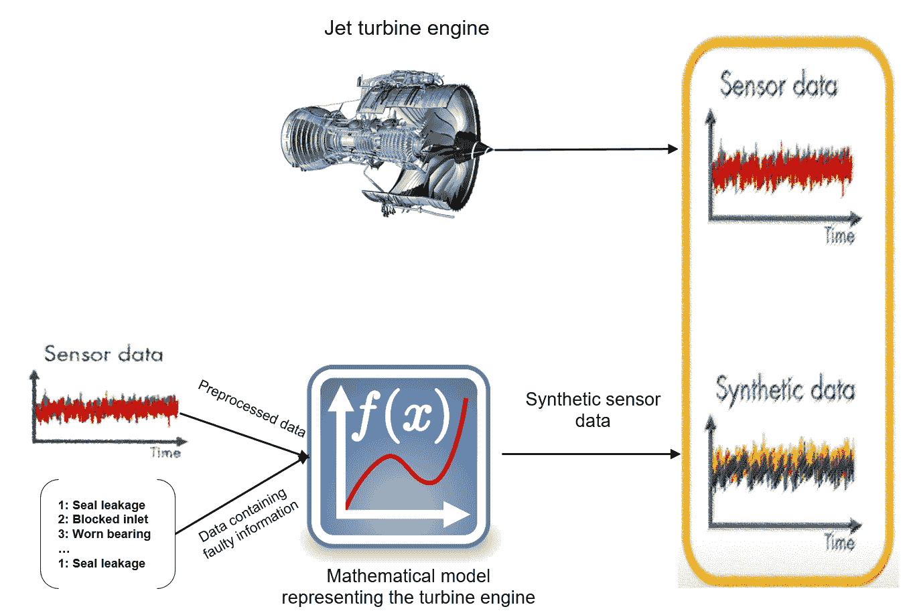

# 用于预测性维护的机器学习（ML）技术

**深度学习**（**DL**）技术可以应用于处理大量的物联网数据，并且可能成为经典机器学习算法的有力替代方案。其理念是，当设备配备传感器并联网时，会产生大量的传感器数据。在更复杂的工业环境中，传感器通道的数据通常非常嘈杂，并随着时间波动，但有些数据似乎根本没有变化。这几乎适用于每一个工业环境，因为在物联网环境下产生的数据是一系列多变量的传感器测量，每个数据都有自己的噪声，并包含许多缺失或无意义的值。

预测性维护应用开发中的关键步骤是识别**状态指标**（**CIs**）和从收集的传感器数据中提取特征，检查 CIs 在系统退化过程中可预测的行为变化。通常，CIs 包含帮助区分正常与故障操作的特征，并预测**剩余使用寿命**（**RUL**）。

发动机或机器的剩余使用寿命（RUL）是指在发动机需要修理或更换之前预期的剩余使用时间。因此，从传感器数据中预测 RUL 是许多预测性维护应用中的关键。在下图中，我们可以看到，随着涡轮发动机的退化，频率数据中的峰值向左移动。因此，峰值频率可以作为状态指示器：

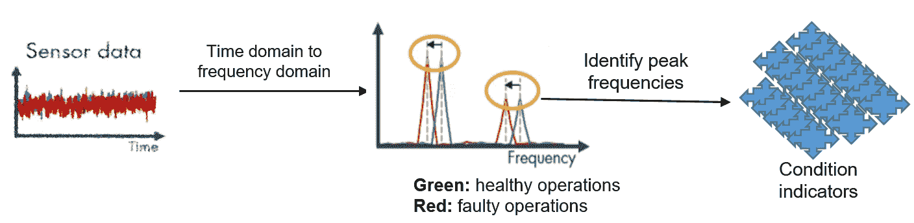

CI 可以帮助我们理解涡轮发动机的健康状态和故障状态。然而，它们并不能告诉我们哪些部件需要修理，或者在故障发生之前还有多少时间。我们可以在修理之前识别故障类型，或在计划维护之前预测 RUL。对于前者选项，使用提取的 CI 特征来训练 ML 或 DL 模型，并识别故障类型，如密封泄漏、进气阻塞或轴承磨损，如下图所示：

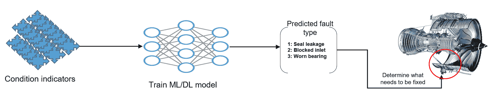

对于后一种策略，我们还可以训练 ML/DL 模型，预测泵在这两种状态（当前状态和故障状态）之间继续转换的趋势。DL 模型可以捕捉 CI 特征之间的关系，而涡轮发动机的退化路径将帮助我们预测距离下次故障还有多长时间，或者何时应安排维护，如下图所示：

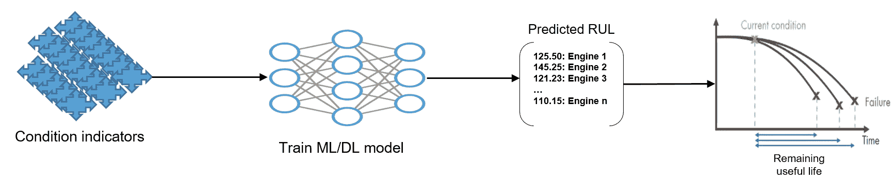

最后，稳定的模型可以在工业环境中部署。前述步骤可以通过以下图表进行总结：

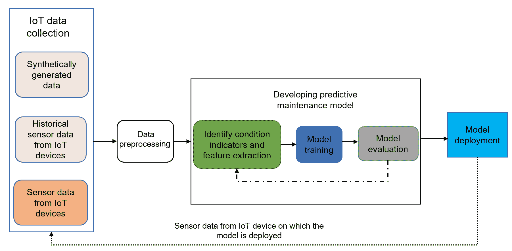

不幸的是，由于缺乏用于预测故障类型的传感器数据，在下一节中，我们将通过实际示例展示如何使用 ML 和 DL 技术预测 RUL。

# 示例 – 飞机燃气涡轮发动机的预测性维护

为了让大家更直观地了解预测性维护，我们将使用 2008 年由**NASA Ames 研究中心的预测卓越中心**发布的开源**涡扇发动机退化仿真**数据集。该数据集可以从[`ti.arc.nasa.gov/c/6/`](https://ti.arc.nasa.gov/c/6/)下载。我们感谢以下研究的作者提供此数据集：

涡扇发动机退化仿真数据集，A. Saxena 和 K. Goebel（2008），NASA Ames 预测数据存储库（[`ti.arc.nasa.gov/tech/dash/groups/pcoe/prognostic-data-repository/`](https://ti.arc.nasa.gov/tech/dash/groups/pcoe/prognostic-data-repository/)），NASA Ames 研究中心，莫菲特场，加利福尼亚州。

# 描述数据集

数据集由模拟的飞机燃气涡轮发动机的传感器读取数据组成，数据表示多元时间序列的多种操作条件。数据集包括单独的训练集和测试集。测试集与训练集相似，不同之处在于，每个引擎的测量值会在其故障前被截断一段（未知）时间。数据以 ZIP 压缩的文本文件形式提供，包含 26 列数字。每一行表示在单次操作周期内获取的数据快照，每一列代表不同的变量。列名对应以下属性：

+   单元号

+   时间，以循环为单位

+   操作设置 1

+   操作设置 2

+   操作设置 3

+   传感器测量 1

+   传感器测量 2

+   传感器测量 26

此外，数据集还包含一组真实的 RUL（剩余使用寿命）值，作为训练模型时的真实标签。

# 探索性分析

为了展示传感器读取值在引擎的物理状态方面的表现（例如，组件的温度、涡轮风扇的转速等），我们决定从第一个数据集中提取一个引擎的所有传感器数据。为此，我们编写了一个脚本（请参见`make_dataset.py`），它会从输入目录获取所有数据文件。然后，解析一组原始数据文件为一个单一的 DataFrame 对象，并返回所有文件的聚合表示，带有适当的列名：

```py
data_sets = []
    for data_file in glob(file_pattern):
        if label_data:
            # read in contents as a DataFrame
            subset_df = pd.read_csv(data_file, header=None)
            # need to create a unit_id column explicitly
            unit_id = range(1, subset_df.shape[0] + 1)
            subset_df.insert(0, 'unit_id', unit_id)
        else:
            # read in contents as a DataFrame
            subset_df = pd.read_csv(data_file, sep=' ', header=None, usecols=range(26))
        # extract the id of the dataset from the name and add as a column
        dataset_id = basename(data_file).split("_")[1][:5]
        subset_df.insert(0, 'dataset_id', dataset_id)
        # add to list
        data_sets.append(subset_df)
    # combine dataframes
    df = pd.concat(data_sets)
    df.columns = columns
    # return the result

    return df
```

要使用这个脚本，首先复制`data/raw/`目录下的所有文件，然后执行以下命令：

```py
$python3 make_dataset.py data/raw/ /data/processed/
```

该命令将生成三个文件——`train.csv`、`test.csv`和`RUL.csv`——分别对应训练集、测试集和标签。现在我们的数据集已经准备好进行探索性分析，我们可以将每个 CSV 文件作为 pandas DataFrame 读取：

```py
# load the processed data in CSV format
train_df = pd.read_csv('train.csv')
test_df = pd.read_csv('test.csv')
rul_df = pd.read_csv('RUL.csv')

# for convenience, identify the sensor and operational setting columns
sensor_columns = [col for col in train_df.columns if col.startswith("sensor")]
setting_columns = [col for col in train_df.columns if col.startswith("setting")]
```

然后，从第一个数据集中提取第一个单元：

```py
slice = train_df[(train_df.dataset_id == 'FD001') & (train_df.unit_id == 1)]
```

接着，我们将其传感器数据随时间变化的轨迹绘制在一个 7 * 3 = 21 个图的网格中，以查看所有传感器通道。我们需要绘制与该位置相对应的通道：

```py
fig, axes = plt.subplots(7, 3, figsize=(15, 10), sharex=True)

for index, ax in enumerate(axes.ravel()):
    sensor_col = sensor_columns[index]
    slice.plot(x='cycle', y=sensor_col, ax=ax, color='blue');
    # label formatting
    if index % 3 == 0:
        ax.set_ylabel("Sensor reading", size=10);
    else:
        ax.set_ylabel("");
    ax.set_xlabel("Time (cycle)");
    ax.set_title(sensor_col.title(), size=14);
    ax.legend_.remove();

# plot formatting
fig.suptitle("Sensor reading : unit 1, dataset 1", size=20, y=1.025)
fig.tight_layout();
```

如下图所示，传感器通道的数据相当嘈杂，并随着时间波动，而其他数据似乎完全没有变化。每个传感器的生命周期在*X*轴上的起始值和结束值都不同：

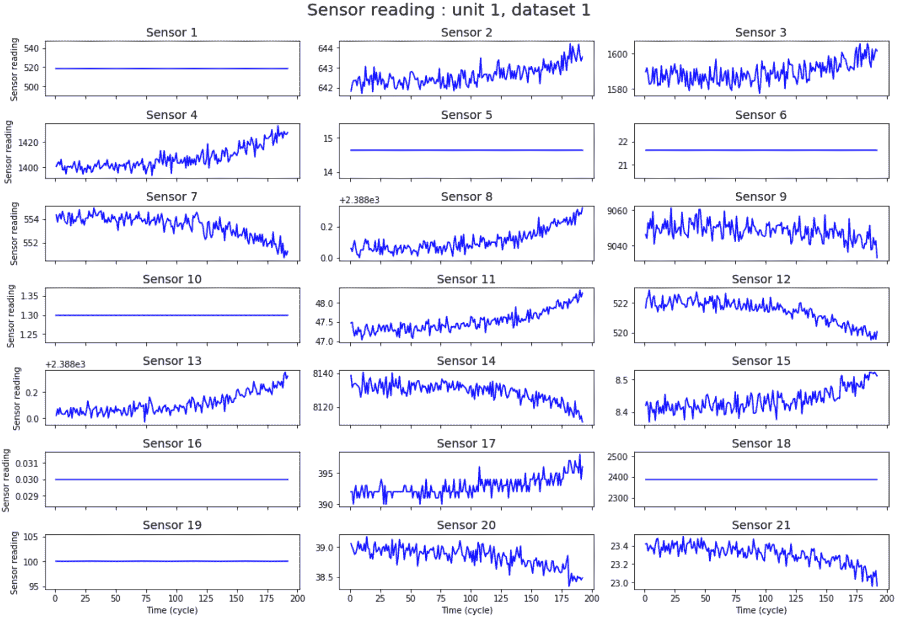

我们可以看到，每个引擎的生命周期和故障模式略有不同。接下来，我们可以将所有传感器通道的数据与时间进行可视化，选取训练集中的 10 个引擎作为随机样本：

```py
# randomly select 10 units from dataset 1 to plot
all_units = train_df[train_df['dataset_id'] == 'FD001']['unit_id'].unique()
units_to_plot = np.random.choice(all_units, size=10, replace=False)

# get the data for these units
plot_data = train_df[(train_df['dataset_id'] == 'FD001') &
                     (train_df['unit_id'].isin(units_to_plot))].copy()

# plot their sensor traces (overlaid)
fig, axes = plt.subplots(7, 3, figsize=(15, 10), sharex=True)

for index, ax in enumerate(axes.ravel()):
    sensor_col = sensor_columns[index]

    for unit_id, group in plot_data.groupby('unit_id'):
        # plot the raw sensor trace
        (group.plot(x='cycle', y=sensor_col, alpha=0.45, ax=ax, color='gray', legend=False));
        # overlay the 10-cycle rolling mean sensor trace for visual clarity
        (group.rolling(window=10, on='cycle')
             .mean()
             .plot(x='cycle', y=sensor_col, alpha=.75, ax=ax, color='black', legend=False));

    # label formatting
    if index % 3 == 0:
        ax.set_ylabel("Sensor Value", size=10);
    else:
        ax.set_ylabel("");
    ax.set_title(sensor_col.title());
    ax.set_xlabel("Time (Cycles)");

# plot formatting
fig.suptitle("All Sensor Traces: Dataset 1 (Random Sample of 10 Units)", size=20, y=1.025);
fig.tight_layout();
```

上述代码段展示了从数据集 1 中提取的 10 个随机样本的传感器读取图：

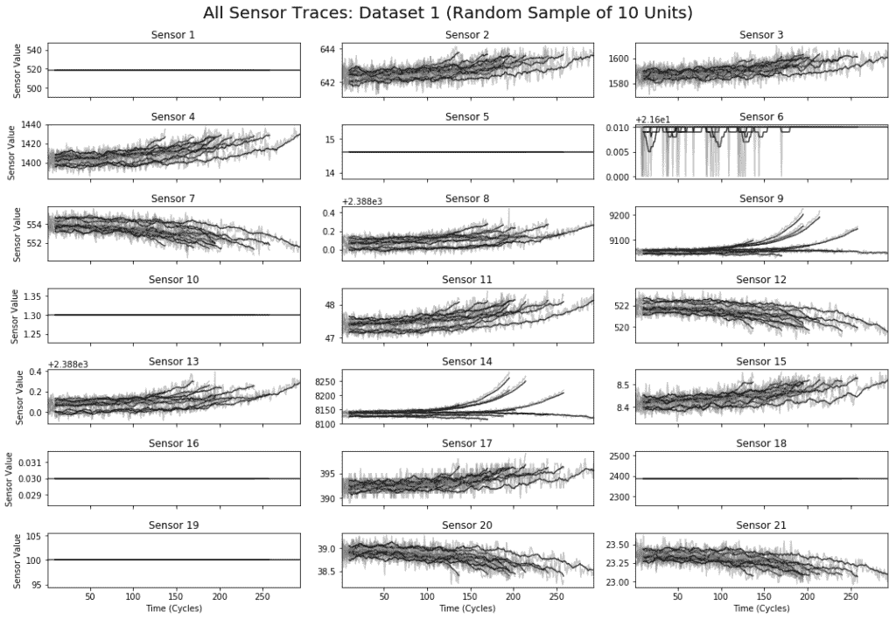

从前面的图中，我们可以观察到，一台发动机的进展与时间的关系与其他发动机并不完全一致。这种阻碍使得我们无法将一台发动机的第五周期与另一台发动机的第五周期进行比较。

# 检查故障模式

由于在训练集中已经知道每台发动机的故障时间，我们可以在每个时间步计算一个**故障前的时间**值，该值可以定义如下：

*故障前的时间（TBF） = 故障时的发动机经过使用的时间（EEL） - 总使用寿命（TOL）*

这个数字可以视为每台发动机的倒计时，允许我们将不同发动机的数据对齐到一个共同的结束点：

```py
# generate the lifetimes series
lifetimes = train_df.groupby(['dataset_id', 'unit_id'])['cycle'].max()

# apply the above function to the data we're plotting
plot_data['ctf'] = plot_data.apply(lambda r: cycles_until_failure(r, lifetimes), axis=1)

# plot the sensor traces (overlaid)
fig, axes = plt.subplots(7, 3, figsize=(15, 10), sharex=True)
for index, ax in enumerate(axes.ravel()):
    sensor_col = sensor_columns[index]
    # use the same subset of data as above
    for unit_id, group in plot_data.groupby('unit_id'):
        # plot the raw sensor trace, using ctf on the time axis
        (group.plot(x='ctf', y=sensor_col, alpha=0.45, ax=ax, color='gray', legend=False));

        # overlay the 10-cycle rolling mean sensor trace for visual clarity
        (group.rolling(window=10, on='ctf')
             .mean()
             .plot(x='ctf', y=sensor_col, alpha=.75, ax=ax, color='black', legend=False));

    # label formatting
    if index % 3 == 0:
        ax.set_ylabel("Sensor Value", size=10);
    else:
        ax.set_ylabel("");
    ax.set_title(sensor_col.title());
    ax.set_xlabel("Time Before Failure (Cycles)");

    # add a vertical red line to signal common time of failure
    ax.axvline(x=0, color='r', linewidth=3);

    # extend the x-axis to compensate
    ax.set_xlim([None, 10]);
fig.suptitle("All Sensor Traces: Dataset 1 (Random Sample of 10 Units)", size=20, y=1.025);
fig.tight_layout();
```

下图展示了相同发动机的传感器通道。唯一的不同是，前图是以故障前的时间为横轴绘制的，其中每台发动机的故障时间都在同一时刻结束（*t=0*）。它还为我们提供了不同发动机之间的共同模式，显示出在故障前，某些传感器读数始终上升或下降，而其他传感器——例如传感器 14——则表现出不同的故障行为<q>：</q>

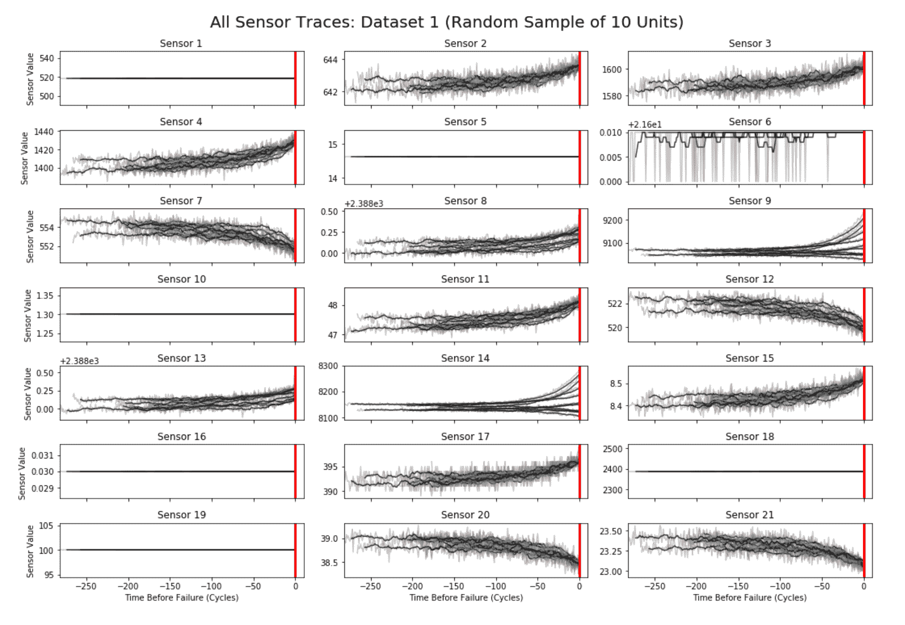

这种模式在许多预测性维护问题中非常常见：故障通常是多种不同过程的交汇，因此，现实世界中的事物可能表现出多种故障模式。由于这种数据的不可预测模式，预测 RUL 非常具有挑战性。

# 预测挑战

如下图所示，在观察了发动机的传感器数据和操作条件一段时间（图中的 133 个周期）后，挑战在于预测发动机在故障之前还能继续运行多长时间（即 RUL）：

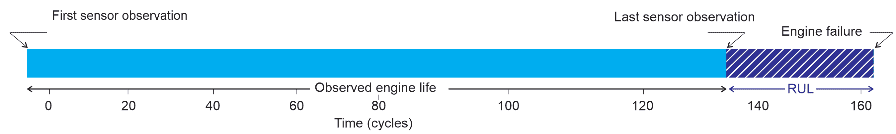

然而，对于一个机器学习/深度学习模型来说，做出错误的预测基本上是低估了某个发动机的真实剩余使用寿命（RUL）。这可能导致涡轮发动机过早进行维护，而实际上它还可以在没有出现问题的情况下运行一段时间。那么，如果我们的模型高估了真实的 RUL，会发生什么呢？在这种情况下，我们可能会允许一台性能下降的飞机继续飞行，进而冒着发生灾难性发动机故障的风险。显然，这两种结果的成本是不同的。考虑到这些挑战，在下一部分中，我们将重点讨论基于深度学习的 RUL 预测技术。

# 深度学习用于 RUL 预测

如我们所讨论的，我们正尝试计算发动机需要进行维护前的时间。这个数据集的特别之处在于，发动机一直运行到故障，这为我们提供了每台发动机在每个时间点的准确 RUL 信息。

# 计算截止时间

让我们考虑一下`FD004`数据集，它包含了最多 249 台发动机（`engine_no`），并在不同时间（`time_in_cycles`）进行监控。每台发动机都有每个周期的`operational_settings`和`sensor_measurements`数据记录：

```py
data_path = 'train_FD004.txt'
data = utils.load_data(data_path)
```

为了训练一个预测 RUL 的模型，我们可以通过选择引擎寿命中的一个随机点，并只使用该点之前的数据来模拟实际预测。我们可以通过使用截止时间轻松地创建带有此限制的特征：

```py
def make_cutoff_times(data):
    gb = data.groupby(['unit_id'])
    labels = []
    for engine_no_df in gb:
        instances = engine_no_df[1].shape[0]
        label = [instances - i - 1 for i in range(instances)]
        labels += label
    return new_labels(data, labels)
```

上面的函数通过对`cutoff_time`和`label`进行采样来生成截止时间，可以按如下方式调用：

```py
cutoff_times = utils.make_cutoff_times(data)
cutoff_times.head()
```

上面的代码行只显示了五个引擎的 RUL 和截止时间：

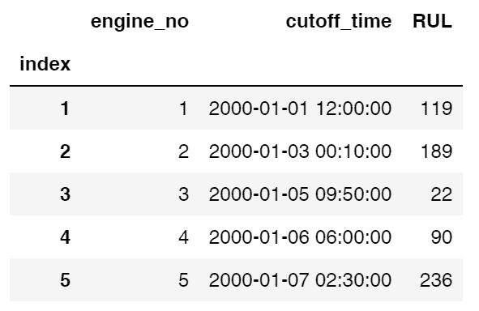

# 深度特征合成

然后，我们使用**深度特征合成**（**DFS**）生成特征。为此，我们需要为数据建立实体集结构。我们可以通过标准化原始数据中的`engine_no`列来创建引擎实体：

```py
def make_entityset(data):
    es = ft.EntitySet('Dataset')
    es.entity_from_dataframe(dataframe=data,
                             entity_id='recordings',
                             index='index',
                             time_index='time')
    es.normalize_entity(base_entity_id='recordings',
                        new_entity_id='engines',
                        index='engine_no')
    es.normalize_entity(base_entity_id='recordings',
                        new_entity_id='cycles',
                        index='time_in_cycles')
    return es
es = make_entityset(data)
```

上面的代码块将生成实体集的以下统计信息：

```py
Entityset: Dataset
 Entities:
 recordings [Rows: 20631, Columns: 28]
 engines [Rows: 100, Columns: 2]
 cycles [Rows: 362, Columns: 2]
 Relationships:
 recordings.engine_no -> engines.engine_no
 recordings.time_in_cycles -> cycles.time_in_cycles
```

`ft.dfs`函数接受一个实体集，并通过实体之间的原始操作（如`max`、`min`和`last`）进行穷举堆叠：

```py
fm, features = ft.dfs(entityset=es,
                      target_entity='engines',
                      agg_primitives=['last', 'max', 'min'],
                      trans_primitives=[],
                      cutoff_time=cutoff_times,
                      max_depth=3,
                      verbose=True)
fm.to_csv('FM.csv')
```

# 机器学习基准

现在我们已经生成了特征，可以开始训练第一个机器学习模型，称为`RandomForestRegressor`。然后，我们将逐步转向使用深度学习（DL），例如**长短期记忆**（**LSTM**）网络。**随机森林**（**RF**）是一种集成技术，通过构建多个决策树并将其整合在一起，来获得更准确、更稳定的预测。通常，较深的树表示更复杂的决策规则和更好的模型拟合，例如以下图像显示了大学录取数据的决策树：

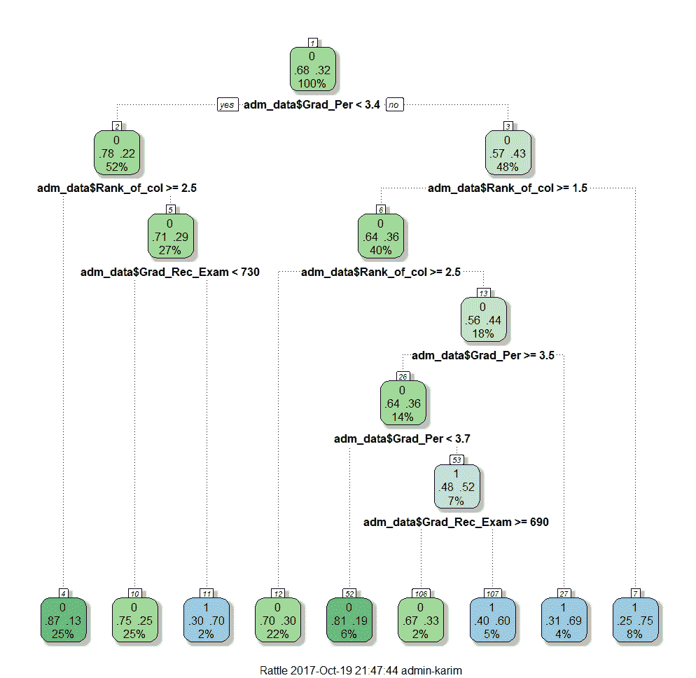

因此，树的深度越深，决策规则越复杂，模型拟合得越好。这是随机森林的直接结果。换句话说，基于独立评审团的多数投票的最终预测，总是比最佳评审团更好、更可靠。下图显示了随机森林及其集成技术：

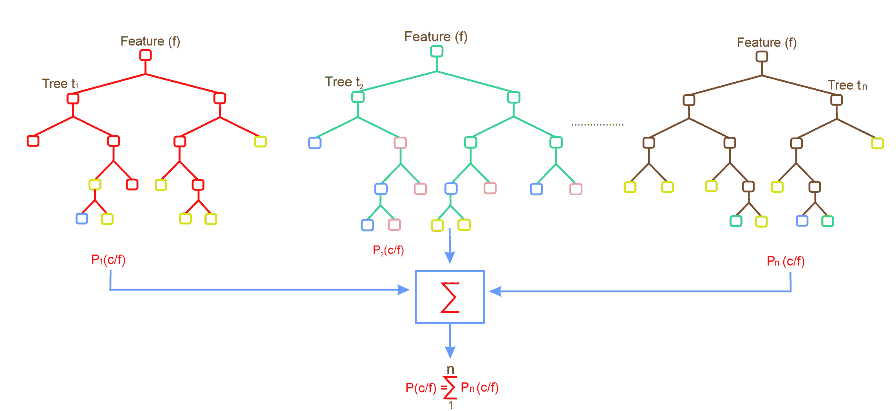

所以，让我们通过准备单独的训练集和测试集开始：

```py
fm = pd.read_csv('FM.csv', index_col='engine_no')
X = fm.copy().fillna(0)
y = X.pop('RUL')
X_train, X_test, y_train, y_test = train_test_split(X, y)
```

然后，使用训练集，我们将检查以下基准：

+   始终预测`y_train`的中位数值。

+   始终将 RUL 预测为每个引擎在`X_train`中具有中位数寿命的情况。

我们将通过计算绝对误差的平均值，即**平均绝对误差**（**MAE**），来检查这些预测，使用来自 scikit-learn 的`RandomForestRegressor`：

```py
from sklearn.model_selection import train_test_split
from sklearn.metrics import mean_absolute_error

yhat_median_predict = [np.median(y_train) for _ in y_test]
print('Baseline by median label: MAE = {:.2f}'.format(
    mean_absolute_error(yhat_median_predict, y_test)))

# Collect sensor readings from the sensor in training set
recordings_from_train = es['recordings'].df[es['recordings'].df['engine_no'].isin(y_train.index)]
median_life = np.median(recordings_from_train.groupby(['engine_no']).apply(lambda df: df.shape[0]))

# Collect sensor readings from the sensor in training set
recordings_from_test = es['recordings'].df[es['recordings'].df['engine_no'].isin(y_test.index)]
life_in_test = recordings_from_test.groupby(['engine_no']).apply(lambda df: df.shape[0])-y_test

# Compute mean absolute error as the baseline by meadian of the RUL
yhat_median_predict2 = (median_life - life_in_test).apply(lambda row: max(row, 0))
print('Baseline by median life: MAE = {:.2f}'.format(
    mean_absolute_error(yhat_median_predict2, y_test)))
```

上面的代码块应产生以下输出，显示基准`MAE`值：

```py
Baseline by median label: MAE = 66.72
Baseline by median life: MAE = 59.96
```

# 进行预测

现在我们可以使用我们创建的特征来拟合`RandomForestRegressor`模型，看看是否能够提高之前的分数：

```py
rf = RandomForestRegressor() # first we instantiate RandomForestRegressor from scikit-learn
rf.fit(X_train, y_train) # train the regressor model with traing set

preds = rf.predict(X_test) # making predictin on unseen observation 
scores = mean_absolute_error(preds, y_test) # Computing MAE

print('Mean Abs Error: {:.2f}'.format(scores))
high_imp_feats = utils.feature_importances(X, reg, feats=10) # Printing feature importance
```

上面的代码块应产生以下输出，显示基准 MAE 值和引擎记录周期的统计信息：

```py
Mean Abs Error: 31.04
 1: LAST(recordings.cycles.LAST(recordings.sensor_measurement_4)) [0.395]
 2: LAST(recordings.sensor_measurement_4) [0.192]
 3: MAX(recordings.sensor_measurement_4) [0.064]
 4: LAST(recordings.cycles.MIN(recordings.sensor_measurement_11)) [0.037]
 5: LAST(recordings.cycles.MAX(recordings.sensor_measurement_12)) [0.029]
 6: LAST(recordings.sensor_measurement_15) [0.020]
 7: LAST(recordings.cycles.MAX(recordings.sensor_measurement_11)) [0.020]
 8: LAST(recordings.cycles.LAST(recordings.sensor_measurement_15)) [0.018]
 9: MAX(recordings.cycles.MAX(recordings.sensor_measurement_20)) [0.016]
 10: LAST(recordings.time_in_cycles) [0.014]
```

然后，我们需要准备特征和标签，可以使用以下代码完成：

```py
data2 = utils.load_data('test_FD001.txt')
es2 = make_entityset(data2)
fm2 = ft.calculate_feature_matrix(entityset=es2, features=features, verbose=True)
fm2.head()
```

加载的数据应包含来自 249 个引擎的 41,214 条记录，其中使用了 21 个传感器测量值，涵盖了三种操作设置。然后，我们需要使用加载的数据准备特征和标签，以下是我们可以使用的代码：

```py
X = fm2.copy().fillna(0)
y = pd.read_csv('RUL_FD004.txt', sep=' ', header=-1, names=['RUL'], index_col=False)

preds2 = rf.predict(X)
print('Mean Abs Error: {:.2f}'.format(mean_absolute_error(preds2, y)))

yhat_median_predict = [np.median(y_train) for _ in preds2]
print('Baseline by median label: MAE = {:.2f}'.format(
    mean_absolute_error(yhat_median_predict, y)))

yhat_median_predict2 = (median_life - es2['recordings'].df.groupby(['engine_no']).apply(lambda df: df.shape[0])).apply(lambda row: max(row, 0))

print('Baseline by median life: MAE = {:.2f}'.format(
    mean_absolute_error(yhat_median_predict2 y)))
```

上面的代码块应该生成以下输出，显示预测的 MAE 和基线 MAE 值：

```py
Mean Abs Error: 40.33
Baseline by median label: Mean Abs Error = 52.08
Baseline by median life: Mean Abs Error = 49.55
```

如图所示，预测的 MAE 值低于基线的 MAE 值。接下来，我们尝试进一步使用 LSTM 网络改善 MAE。

# 使用 LSTM 改进 MAE

我们将使用基于 Keras 的 LSTM 网络来预测剩余使用寿命（RUL）。不过，为此，我们首先需要将数据转换成 LSTM 模型可以使用的三维格式：

```py
#Prepare data for Keras based LSTM model
def prepareData(X, y):
    X_train, X_test, y_train, y_test = train_test_split(X, y)
    X_train = X_train.as_matrix(columns=None)
    X_test = X_test.as_matrix(columns=None)
    y_train = y_train.as_matrix(columns=None)
    y_test = y_test.as_matrix(columns=None)
    y_train = y_train.reshape((y_train.shape[0], 1))
    y_test = y_test.reshape((y_test.shape[0], 1))
    X_train = np.reshape(X_train,(X_train.shape[0], 1, X_train.shape[1]))
    X_test = np.reshape(X_test,(X_test.shape[0], 1, X_test.shape[1]))    
    return X_train, X_test, y_train, y_test
```

现在我们拥有适合 LSTM 模型的数据，我们可以构建 LSTM 网络。为此，我们有一个简化的 LSTM 网络，只有一个 LSTM 层，接着是一个全连接层，在应用掉出层以进行更好的正则化之后。然后，我们再加一个全连接层，最后通过线性激活函数将这个全连接层的输出投射到激活层，以便输出实值结果。然后，我们使用 SGD 版本的`RMSProp`，它尝试优化**均方误差**（**MSE**）：

```py
#Create LSTM model
from keras.models import Sequential
from keras.layers.core import Dense, Activation
from keras.layers.recurrent import LSTM
from keras.layers import Dropout
from keras.layers import GaussianNoise

def createLSTMModel(X_train, hidden_neurons):
    model = Sequential()
    model.add(LSTM(hidden_neurons, input_shape=(X_train.shape[1], X_train.shape[2])))
    model.add(Dense(hidden_neurons))
    model.add(Dropout(0.7))
    model.add(Dense(1))
    model.add(Activation("linear"))
    model.compile(loss="mean_squared_error", optimizer="rmsprop")
    return model
```

然后，我们使用训练集来训练 LSTM 模型：

```py
X_train, X_test, y_train, y_test = prepareData(X, y)
hidden_neurons = 128
model = createLSTMModel(X_train, hidden_neurons)
history = model.fit(X_train, y_train, batch_size=32, nb_epoch=5000, validation_split=0.20)
```

上面的代码行应该生成一些日志，帮助我们了解训练和验证损失是否在迭代过程中减少：

```py
Train on 60 samples, validate on 15 samples
 Epoch 1/5000
 60/60 [==============================] - ETA: 0s - loss: 7996.37 - 1s 11ms/step - loss: 7795.0232 - val_loss: 8052.6118
 Epoch 2/5000
 60/60 [==============================] - ETA: 0s - loss: 6937.66 - 0s 301us/step - loss: 7466.3648 - val_loss: 7833.4321
 …
 60/60 [==============================] - ETA: 0s - loss: 1754.92 - 0s 259us/step - loss: 1822.5668 - val_loss: 1420.7977
 Epoch 4976/5000
 60/60 [==============================] - ETA: 0s - loss: 1862.04
```

现在训练已经完成，我们可以绘制训练和验证损失图：

```py
# plot history
plt.plot(history.history['loss'], label='Training')
plt.plot(history.history['val_loss'], label='Validation')
plt.legend()
plt.show()
```

上面的代码块应该生成以下图表，我们可以看到验证损失低于训练损失：

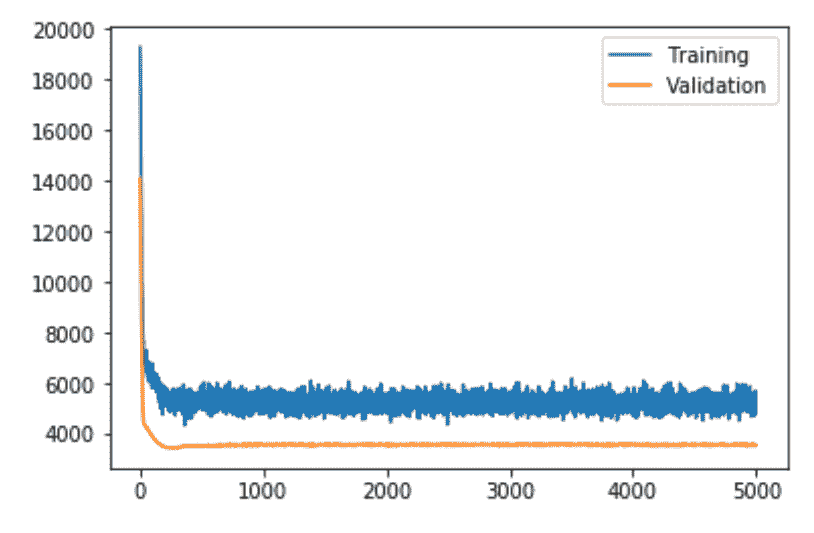

该模型可能存在过拟合训练数据的情况。在训练过程中测量并绘制 MAE 可能会对此提供更多的线索。让我们来看一下测试集上的 MAE：

```py
predicted = model.predict(X_test)
rmse = np.sqrt(((predicted - y_test) ** 2).mean(axis=0))
print('Mean Abs Error: {:.2f}'.format(mean_absolute_error(predicted, y_test)))
```

我们应该得到一个 MAE 为 38.32，这意味着 MAE 误差有所降低（而 RF 模型的 MAE 为 40.33），但仍然不令人信服。造成这种较高 MAE 的原因可能有多个。例如，我们可能没有足够的训练数据；其次，我们在生成实体集时使用了一种低效的方法。对于第一个问题，我们可以使用整个数据集来训练模型。我们还可以使用其他正则化技术，如高斯噪声层，并指定噪声阈值：

```py
def createLSTMModel(X_train, hidden_neurons):
    model = Sequential()
    model.add(LSTM(hidden_neurons, input_shape=(X_train.shape[1], X_train.shape[2])))
    model.add(GaussianNoise(0.2))
    model.add(Dense(hidden_neurons))
    model.add(Dropout(0.7))
    model.add(Dense(1))
    model.add(GaussianNoise(0.5))
    model.add(Activation("linear"))
    model.compile(loss="mean_squared_error", optimizer="rmsprop")
    return model    
```

高斯噪声层可以作为输入层直接向输入变量添加噪声。这是神经网络中使用噪声作为正则化方法的传统方式，噪声可以在激活函数使用之前或之后添加。尽管将噪声添加到激活函数之前可能更有意义，但两种方式都是可能的。在我们的案例中，我们在 LSTM 层后、全连接层前添加了一个掉出率为 0.2 的高斯噪声层。

然后，我们有另一个高斯噪声层，将噪声添加到密集层的线性输出之前，再使用修正线性激活函数。然后，使用引入噪声的相同数据训练 LSTM 模型应该产生略低的 MAE 值，约为 35.25。我们甚至可以检查显示训练和验证损失的图表：

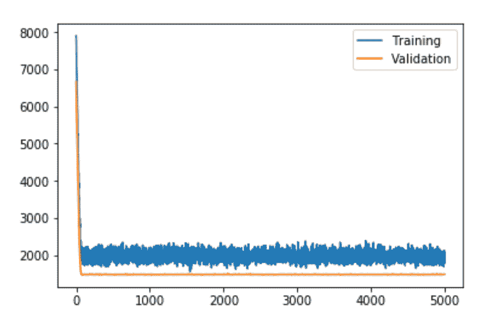

前面的图表显示训练损失和测试损失几乎相同，这表明模型的正则化效果更好。因此，模型在测试集上的表现也更好。然而，通过改进质量更好的特征，MAE 仍然可以降低。让我们探索一下使用更好的特征生成技术。

# 无监督深度特征合成

我们将看到实体集结构如何有助于提高预测准确性。我们将使用`tsfresh`库中的时间序列函数构建自定义原始功能。在此之前，我们将通过从每个引擎的生命周期中随机选择一个来制定截止时间。我们将制定五组截止时间用于交叉验证：

```py
from tqdm import tqdm
splits = 10
cutoff_time_list = []
for i in tqdm(range(splits)):
    cutoff_time_list.append(utils.make_cutoff_times(data))
cutoff_time_list[0].head()
```

前面的代码块应显示五个引擎的截止时间和 RUL 值，如下所示：

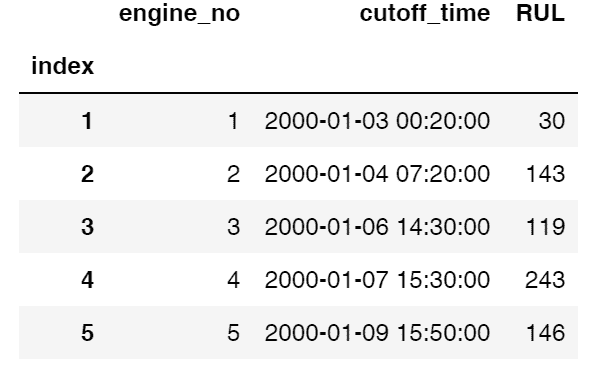

然后，我们将使用一种无监督的方式生成实体集。正如我们所见，操作设置`1`—`3`的值是连续的，但它们在不同引擎之间创建了隐含的关系。因此，如果两个引擎具有相似的操作设置，则传感器测量结果会给出相似的值。这个想法是通过 k-means 技术将这些设置进行聚类。然后，我们从具有相似值的簇中创建一个新的实体：

```py
from sklearn.cluster import KMeans
nclusters = 50
def make_entityset(data, nclusters, kmeans=None):
    X = data[['operational_setting_1', 'operational_setting_2', 'operational_setting_3']]
    if kmeans:
        kmeans=kmeans
    else:
        kmeans = KMeans(n_clusters=nclusters).fit(X)
    data['settings_clusters'] = kmeans.predict(X)
        es = ft.EntitySet('Dataset')
    es.entity_from_dataframe(dataframe=data,
                             entity_id='recordings',
                             index='index',
                             time_index='time')
    es.normalize_entity(base_entity_id='recordings', 
                        new_entity_id='engines',
                        index='engine_no')
    es.normalize_entity(base_entity_id='recordings', 
                        new_entity_id='settings_clusters',
                        index='settings_clusters')
    return es, kmeans
es, kmeans = make_entityset(data, nclusters)
```

前面的代码段生成一个实体集，显示以下关系：

```py
Entityset: Dataset
 Entities:
 settings_clusters [Rows: 50, Columns: 2]
 recordings [Rows: 61249, Columns: 29]
 engines [Rows: 249, Columns: 2]
 Relationships:
 recordings.engine_no -> engines.engine_no
 recordings.settings_clusters -> settings_clusters.settings_clusters
```

除了改变我们的实体集结构外，我们还将使用`tsfresh`包中的复杂时间序列原始功能。任何接收 Pandas 系列并输出浮点数的函数都可以使用`make_agg_primitive`函数转换为聚合原始功能，如下所示：

```py
from featuretools.primitives import make_agg_primitive
import featuretools.variable_types as vtypes
from tsfresh.feature_extraction.feature_calculators import (number_peaks, mean_abs_change, 
                                                            cid_ce, last_location_of_maximum, length)
Complexity = make_agg_primitive(lambda x: cid_ce(x, False),
                              input_types=[vtypes.Numeric],
                              return_type=vtypes.Numeric,
                              name="complexity")
fm, features = ft.dfs(entityset=es, 
                      target_entity='engines',
                      agg_primitives=['last', 'max', Complexity],
                      trans_primitives=[],
                      chunk_size=.26,
                      cutoff_time=cutoff_time_list[0],
                      max_depth=3,
                      verbose=True)
fm.to_csv('Advanced_FM.csv')
fm.head()
```

使用这种方法，我们成功生成了额外的 12 个特征（之前有 290 个）。然后，我们用相同的特征集构建了另外四个特征矩阵，但使用了不同的截止时间。这使我们能够在将其用于测试数据之前多次测试管道：

```py
fm_list = [fm]
for i in tqdm(range(1, splits)):
    fm = ft.calculate_feature_matrix(entityset=make_entityset(data, nclusters, kmeans=kmeans)[0], 
         features=features, chunk_size=.26, cutoff_time=cutoff_time_list[i])
    fm_list.append(fm)
```

然后，使用递归特征消除，我们再次对 RF 回归器建模，以便模型仅选择重要特征，从而进行更好的预测：

```py
from sklearn.ensemble import RandomForestRegressor
from sklearn.model_selection import train_test_split
from sklearn.metrics import mean_absolute_error
from sklearn.feature_selection import RFE

def pipeline_for_test(fm_list, hyperparams={'n_estimators':100, 'max_feats':50, 'nfeats':50}, do_selection=False):
    scores = []
    regs = []
    selectors = []
    for fm in fm_list:
        X = fm.copy().fillna(0)
        y = X.pop('RUL')
        reg = RandomForestRegressor(n_estimators=int(hyperparams['n_estimators']), 
              max_features=min(int(hyperparams['max_feats']), int(hyperparams['nfeats'])))
        X_train, X_test, y_train, y_test = train_test_split(X, y)

        if do_selection:
            reg2 = RandomForestRegressor(n_jobs=3)
            selector=RFE(reg2,int(hyperparams['nfeats']),step=25)
            selector.fit(X_train, y_train)
            X_train = selector.transform(X_train)
            X_test = selector.transform(X_test)
            selectors.append(selector)
        reg.fit(X_train, y_train)
        regs.append(reg)
        preds = reg.predict(X_test)
        scores.append(mean_absolute_error(preds, y_test))
    return scores, regs, selectors  

scores, regs, selectors = pipeline_for_test(fm_list)
print([float('{:.1f}'.format(score)) for score in scores])
print('Average MAE: {:.1f}, Std: {:.2f}\n'.format(np.mean(scores), np.std(scores)))
most_imp_feats = utils.feature_importances(fm_list[0], regs[0])
```

前面的代码块应生成以下输出，显示每次迭代中的预测 MAE 及其平均值。此外，它显示了基线 MAE 值和有关引擎记录周期的统计信息：

```py
[33.9, 34.5, 36.0, 32.1, 36.4, 30.1, 37.2, 34.7,38.6, 34.4]
 Average MAE: 33.1, Std: 4.63
 1: MAX(recordings.settings_clusters.LAST(recordings.sensor_measurement_13)) [0.055]
 2: MAX(recordings.sensor_measurement_13) [0.044]
 3: MAX(recordings.sensor_measurement_4) [0.035]
 4: MAX(recordings.settings_clusters.LAST(recordings.sensor_measurement_4)) [0.029]
 5: MAX(recordings.sensor_measurement_11) [0.028]
```

现在让我们再次尝试使用 LSTM，看看是否可以减少 MAE 误差：

```py
X = fm.copy().fillna(0)
y = X.pop('RUL')
X_train, X_test, y_train, y_test = prepareData(X, y)

hidden_neurons = 128
model = createLSTMModel(X_train, hidden_neurons)

history = model.fit(X_train, y_train, batch_size=32, nb_epoch=5000, validation_split=0.20)
# plot history
plt.plot(history.history['loss'], label='Training')
plt.plot(history.history['val_loss'], label='Validation')
plt.legend()
plt.show()
```

前面的代码行应生成以下图表，其中验证损失低于训练损失：

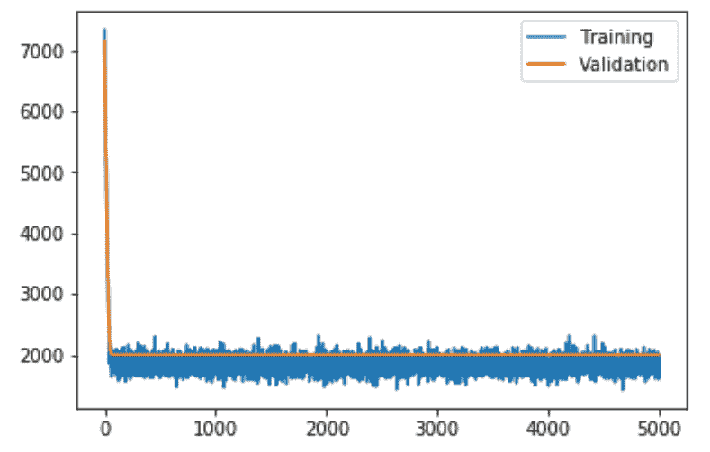

最后，我们可以根据 MAE 评估模型的表现：

```py
predicted = model.predict(X_test)
print('Mean Abs Error: {:.2f}'.format(mean_absolute_error(predicted, y_test)))
```

上面的代码块应该产生一个 MAE 为 52.40 的结果，低于我们在前一节中得到的结果。

# 常见问题解答

在本节中，我们将涵盖一些**常见问题**（**FAQ**），这些问题将帮助你扩展这个应用：

1.  **我们可以使用其他深度架构在类似的物联网环境中进行预测吗？**

**回答**：是的，使用其他深度架构可能是一个可行的选项。例如，通过结合 CNN 和 LSTM 层的预测能力，创建一个卷积-LSTM 网络，已经在许多应用场景中证明是有效的，如音频分类、**自然语言处理**（**NLP**）和时间序列预测。

1.  **有时我们没有足够的物联网数据来灵活地训练模型。我们如何增加训练数据的数量？**

**回答**：有很多方法可以做到这一点。例如，我们可以尝试通过将所有发动机数据结合起来生成训练集。为此，生成的训练、测试和 RUL 的 CSV 文件会很有帮助。另一个例子是尝试通过添加更多的样本来扩展数据集。

1.  **我可以在工业环境中进行异常检测吗？**

**回答**：是的，你可以。实际上，在工业环境中，这种做法非常常见，例如生产故障识别、实时时间序列异常检测、预测监控等。

1.  **我在哪里可以获得数据以在物联网环境中进行其他分析？**

**回答**：来自**预测数据仓库**的时间序列数据，从某一正常状态到失败状态，可以用于预测算法的开发。请参阅以下链接了解更多关于数据集的信息：[`ti.arc.nasa.gov/tech/dash/groups/pcoe/prognostic-data-repository/`](https://ti.arc.nasa.gov/tech/dash/groups/pcoe/prognostic-data-repository/)。

# 总结

在本章中，我们讨论了如何使用物联网和涡扇发动机退化仿真数据集开发用于预测性维护的深度学习解决方案。我们首先讨论了数据集的探索性分析，然后使用一种非常流行的基于树的集成技术——**随机森林**（RF）来建模预测性维护，RF 使用的是涡轮发动机的特征。接着，我们看到如何通过使用 LSTM 网络提高预测准确性。LSTM 网络确实有助于减少网络错误。尽管如此，我们仍然看到如何在 LSTM 网络中加入高斯噪声层，以实现泛化，同时进行 dropout 操作。

了解深度学习技术在物联网各层（包括传感器/感知层、网关层和云层）的潜力非常重要。因此，为物联网健康设备开发可扩展且高效的解决方案也不例外。在下一章中，我们将展示一个利用深度学习在生命周期各阶段进行数据分析的应用案例。
