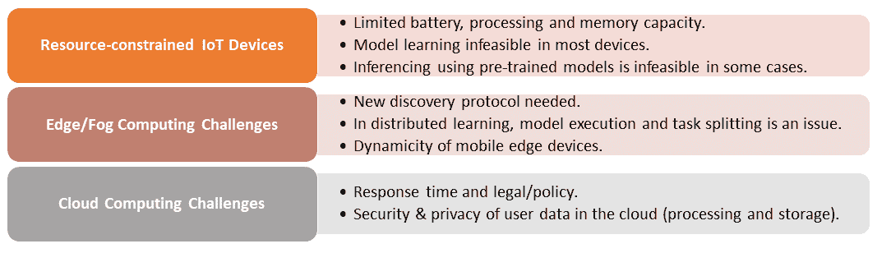

# 第十章：接下来 - 总结与未来方向

物联网的使用将通过各种应用无处不在地融入我们的生活，包括连接医疗、智能家居和智慧城市。尽管物联网应用令人兴奋，但在全面实现之前，仍面临重大的科学和技术挑战。物联网的一个关键技术挑战是设计和开发适用于资源受限的物联网设备或边缘/雾计算设备的**深度学习**（**DL**）模型，并满足实时响应的要求。在本章的最后，我们将首先总结前几章的内容，然后通过实例讨论现有深度学习技术在资源受限和嵌入式物联网环境中的开发和实施面临的主要挑战。最后，我们将总结一些现有解决方案，并指出一些潜在的解决方案，以填补深度学习驱动的物联网分析中的空白。

本章我们将涵盖的主题如下：

+   本书中我们做了什么？

+   在资源受限的物联网设备中设计和开发深度学习（**DL**）模型的挑战

+   支持资源受限物联网设备中深度学习的现有解决方案

+   潜在的未来解决方案

# 本书中我们涵盖了哪些内容？

大多数物联网应用正在生成——并且将生成——大量或快速/实时流数据。对这些大数据或数据流的分析对于获取新信息、预测未来趋势和做出明智决策至关重要。机器学习，包括深度学习（**DL**），是这一分析的关键技术。近年来，深度学习模型在物联网应用中的数据分析方面取得了进展。然而，在物联网领域，缺乏对深度学习模型的整体应用视角。本书努力填补这一空白，通过展示来自不同领域的物联网应用及其基于深度学习的实现，弥补了这一空白。

在本书的第一章，我们介绍了物联网的概述、关键应用以及物联网解决方案的三层端到端视图，这有助于了解和应用深度学习驱动的数据分析在物联网生态系统中的应用。我们概述了深度学习及其流行的模型和实现框架，包括 TensorFlow 和 Keras。在接下来的章节（3-9）中，我们展示了深度学习模型在不同物联网应用领域提供的各种通用服务（如图像处理），并通过各种用例进行了说明。下表总结了各章的关键活动：

从表格中可以看出，卷积神经网络（CNN）及其变种在大多数情况下被广泛应用。一个潜在的原因可能是，CNN 模型在图像数据集上表现非常出色，而大多数数据集要么是图像，要么可以转换为图像（如语音数据）。表格中呈现的模型性能，以及章节中展示的性能，并不是最终的性能值；它们只是指示性性能值，因为深度学习模型对数据的结构和大小非常敏感。数据集和/或深度学习架构的结构变化可能会改变模型的性能。一般来说，相比于浅层模型，深度学习模型在大数据集上通常能更好地工作，且这些数据集拥有广泛的特征。

# 资源受限的物联网设备中深度学习解决方案的部署挑战

尽管本文中展示的物联网应用案例及其基于深度学习的实现展示了深度学习在物联网中的潜力，但在许多方向上仍然存在一些未解决的研究挑战。特别是，许多领域仍需要研究和开发的支持。以下是一些关键的研究与开发领域，包括数据集预处理、安全和隐私感知的深度学习、大数据处理的各个方面，以及资源高效的训练与学习。在接下来的章节中，我们将简要地从机器学习的角度以及从物联网设备、边缘/雾计算和云计算的角度介绍这些剩余的挑战。

# 机器学习/深度学习的视角

近年来，机器学习和深度学习技术已被应用于多个领域，以做出更加明智的决策。然而，机器学习和深度学习也面临一些特有的挑战，具体如下：

+   **缺乏大型物联网数据集**：许多物联网应用领域正在采用深度学习进行数据分析。不幸的是，这些现有工作，包括本书，依赖于用于模型训练和测试的数据集，这些数据集并非来自物联网应用和/或真实生活应用。其后果之一是，许多物联网特有的问题未能在模型中得到显著体现。例如，物联网设备比通用计算设备更容易发生硬件故障。在这种情况下，使用通用计算数据进行物联网应用的预测可能会导致错误的事件预测。此外，硬件故障可能被误报告为安全事件。再者，这些数据集大多不足够大，无法有效地克服过拟合问题。

所有与数据集相关的问题都是基于 DL 的物联网分析部署和接受的重大障碍。数据集是经验验证和评估物联网系统在现实世界中能够无障碍或仅有最小问题地运行的关键需求。访问现有数据集的能力是另一个许多人（包括我们在本书中的作者）面临的大问题。医疗健康和人体活动检测是物联网的主要应用领域；然而，它们相关的数据通常受到版权或隐私保护的限制，无法让我们完全自由地使用这些数据。许多网络资源已经编制了有用数据集的一般列表。类似的集合将对物联网应用开发者和研究人员大有帮助。

+   **预处理**：预处理是深度学习（DL）中的一个关键步骤，它将原始数据处理成适合输入 DL 模型的表示。与 DL 的许多其他应用领域不同，在物联网（IoT）应用中，传感器和/或物品生成的数据格式各异，因此这是一个挑战。例如，考虑一个远程患者监测的物联网应用。该应用需要使用各种传感器，而这些传感器生成的数据格式不同。为了使用这些数据并对患者做出集体且正确的决策，我们需要在将数据应用到 DL 模型之前对其进行预处理。

+   **安全和隐私保护的 DL**：安全和隐私是物联网的头号挑战。因此，大多数物联网应用都在致力于确保数据在端到端生命周期中的安全和隐私。通常，物联网的大数据通过互联网传输到云端进行基于 DL 的分析，这些数据可能被全球范围内的人或设备查看。许多现有应用依赖于数据匿名化来保护隐私，但这些技术并非防黑客攻击的绝对保障。有趣的是，大多数人讨论的是物联网设备生成的数据的安全和隐私问题，但运行在这些数据上的操作（包括机器学习和深度学习）的安全性如何呢？事实上，DL 训练模型也可能遭受各种恶意攻击，包括**虚假数据注入**（**FDI**）或异常样本输入。通过这些攻击，物联网解决方案的许多功能性或非功能性要求可能会遭遇严重威胁，甚至使得解决方案对于预期目标变得无用或甚至危险。因此，机器学习和 DL 模型需要配备机制来发现异常或无效数据。在主模型之上添加一个数据监控 DL 模型，可能是一个潜在的解决方案。为了防御这些攻击并确保 DL 模型能够使物联网应用变得有用和可靠，还需要进一步的研究和开发来解决安全问题。

+   **大数据问题（六个 V）**：物联网应用是大数据生成的重要来源之一。因此，深度学习在大数据面临的挑战，也是深度学习在物联网中面临的挑战。物联网大数据的每一个特征（六个 V：体量、种类、真实性、速度、变异性和价值）都会对深度学习技术构成挑战。在接下来的几点中，我们简要讨论它们所面临的挑战。

+   数据量巨大给深度学习（DL）带来了巨大的压力，特别是在时间和结构复杂性方面。时间在实时物联网应用中是一个严重的问题。大量的输入数据、异质属性和分类变异性可能需要一个高度复杂的深度学习模型，这种模型可能需要更长的运行时间和巨大的计算资源，而这些资源在大多数物联网应用中是无法获得的。深度学习模型通常在模型学习过程中能很好地处理噪声和未标注数据。然而，物联网的大量噪声和未标注数据可能会面临一些问题。

+   来自异质源和/或设备的物联网数据格式的异质性（多样性）可能成为物联网应用中深度学习模型的一个问题。如果这些数据源彼此冲突，可能会成为一个严重的问题。许多物联网应用产生连续的实时数据，并且需要实时响应，而在物联网设备中，这并非总是可能的。基于流的在线学习是一个潜在的解决方案。然而，进一步的研究是必需的，以便整合在线学习和顺序学习方法，以解决物联网中数据流速度的问题。

+   许多应用中数据的真实性（准确性），例如医疗保健、无人驾驶汽车和智能电网，是一个强制性的要求，这可能会给物联网中的深度学习模型带来挑战。缺乏真实数据可能使物联网的大数据分析失去作用。因此，需要在数据分析的每个层级检查数据验证和真实性。数据的变异性，例如数据流速，可能会给在线流数据处理带来额外的挑战。

+   最后，清楚地理解物联网采纳及其相关大数据的商业价值至关重要。然而，大多数决策者未能理解这一价值。

# 深度学习的局限性

尽管在各个应用领域取得了巨大成功，深度学习模型在未来仍有许多问题需要解决。例如，任何深度学习模型做出的虚假声明，如果人类无法识别，也是一个问题。深度学习模型缺乏回归能力是许多物联网应用中的一个问题，因为它们需要某种回归作为核心分析组件。一些研究已经提出了将回归能力整合到深度学习模型中的解决方案。我们需要在这个方向上进行更多的研究。

下图总结了与深度学习视角相关的关键挑战：

# IoT 设备、边缘/雾计算和云视角

如我们在第一章《物联网的端到端生命周期》中提到的，*端到端物联网解决方案*由三个不同的关键组件或层次构成，主要包括物联网设备、边缘/雾计算和云平台。所有这些组件在深度学习（DL）实现方面都有各自的挑战。以下是我们将简要讨论的这些挑战：

+   **资源受限的物联网设备**：物联网设备在处理器、电池能量、内存和网络连接方面资源有限。为传统计算机开发的深度学习模型可能无法直接在物联网设备上使用。更重要的是，物联网设备无法进行深度学习模型的训练，因为训练过程是一个资源密集型操作。对于本书中的所有深度学习模型训练，都是在一台强大的桌面计算机或云平台上完成的。在某些情况下，资源稀缺到预训练模型无法在设备上进行推理。正如以下截图所示，在第三章《物联网中的图像识别》中讨论的两个 CNN 实现版本，图像分类需要大约 90 MB 的存储空间来存储其预训练模型，而许多物联网设备可能没有足够的存储空间。因此，我们需要轻量级的深度学习模型，特别是轻量级的预训练深度学习模型。有许多现有的解决方案可以解决物联网设备相关问题，接下来我们将简要介绍这些解决方案：

+   **边缘/雾计算**：边缘/雾计算正在成为物联网解决方案中一种流行的计算平台，特别是对于实时应用，因为这些应用中使用的数据不需要始终移动到云平台。然而，这项技术仍处于初期阶段，面临许多挑战，包括以下几点：

    +   **设备的深度学习服务发现**：边缘/雾路由器或网关将在地理上分布，并将向物联网最终用户/节点提供基于特定深度学习模型的服务。例如，一个**雾节点**可能通过卷积神经网络（CNN）提供图像分类服务，而另一个附近的节点可能通过长短期记忆网络（LSTM）提供入侵检测服务。在这种情况下，设备需要服务发现协议，能够根据它们的需求和上下文高效地发现适合的数据显示服务。

    +   **深度学习模型和任务分配**：雾计算可能依赖分布式学习方法，通过在不同的雾/边缘节点之间共享学习任务来分担学习责任。这将需要一些时间来拆分深度学习模型的执行过程以及任务分配，这可能会成为实时物联网应用的一个问题。

    +   **移动设备作为边缘设备**：智能手机无处不在，正成为物联网生态系统中的关键元素。然而，这些设备在加入/离开网络方面的动态特性对依赖它们的深度学习分析服务构成了挑战，因为它们随时可能离开网络。此外，它们的能耗和其他与资源相关的准确信息需要在任务分配器处可用，以便为它们分配适当的任务。

+   **云计算**：云计算是物联网大数据分析的一个重要平台。然而，其响应时间以及法律/政策限制（例如数据可能需要从安全边界迁移）可能成为许多物联网应用的问题。此外，物联网数据在处理和存储过程中的安全性与隐私性也是许多物联网应用所关注的问题。

以下图表总结了物联网设备、边缘/雾计算和云计算视角中的关键挑战：

# 支持深度学习在资源受限物联网设备中的现有解决方案

通常，深度学习模型需要计算超大规模（数百万到数十亿个）的参数，这需要一个强大的计算平台和巨大的存储支持，而这些在物联网设备或平台上并不可得。幸运的是，现有的一些方法和技术（本书中未使用，因为我们在桌面上进行了模型训练）可以解决物联网设备中的一些问题，从而支持深度学习在这些设备上的应用：

+   **深度学习网络压缩**：深度学习网络通常非常密集，需要大量的计算能力和内存，而这些在物联网设备中可能并不具备。这对于进行推理和/或分类是必需的。深度学习网络压缩通过将密集网络转化为稀疏网络，为资源受限的物联网设备提供了一种潜在的解决方案。许多现有的服务，包括 Mobilenet V1 和 V2，都已测试过这项技术。例如，CNN 的 Incentive V3 架构可以通过使用 Mobilenet V1 架构，将 87.0MB 的存储压缩到 17.0MB（如我们在第三章 *物联网中的图像识别* 中演示的那样）。然而，这种方法仍然不够通用，无法用于所有深度学习模型，压缩技术可能需要特定的硬件才能进行操作。

+   **深度学习的近似计算**：这种方法通过将预测视为一系列可接受值的一部分，而不是精确值（例如 95% 的准确率），因为许多物联网应用可能不需要精确的数值。例如，许多事件检测应用只需要检测到事件的发生，而不需要预测事件的准确度。近似计算能够节省能源，但不适用于对精确值有要求的关键应用（例如医疗护理）。

+   **加速器**：基于硬件的加速器在深度学习模型中已获得了一些研究和开发的关注。专用硬件和电路可以用来减少内存占用并提高能效，以在物联网设备上运行深度学习模型。此外，软件加速也可以用于此类任务。然而，加速器可能无法与传统的物联网硬件兼容。

+   **Tinymotes**：研究人员正在开发小型节点，这些节点通过硬件加速器支持，在电池供电的情况下执行基于板载的数据分析。它们对于实时应用非常有用。然而，它们主要用于特定目的的深度学习网络，安全性是其中的一个问题。

# 潜在的未来解决方案

在本节中，我们将简要讨论一些潜在的研究和开发解决方案，以应对前述问题。

+   **分布式学习**：在本书中，模型学习或训练是集中进行的，但在许多物联网应用中，这种方式可能不可行。在这种情况下，分布式学习可能是一个潜在的解决方案。然而，分布式计算存在安全问题，这可以通过*基于区块链的分布式学习*来最小化。

+   **物联网移动数据**：智能手机是物联网普及的关键推动力。通过深度学习模型进行移动大数据分析的高效解决方案，可以在各种应用领域提供更好的物联网服务，包括智慧城市。该领域需要进一步的研究。

+   **情境信息的集成**：情境信息对于正确使用和解读基于深度学习的数据分析至关重要。然而，通过物联网传感器数据来理解物联网应用的环境情境是非常困难的。将环境传感器数据与物联网应用传感器数据融合，可以提供情境信息。因此，开发集成情境信息的基于深度学习的解决方案可能是未来的另一个方向。

+   **边缘/雾计算中的在线资源调度**：对于实时数据分析流处理的物联网数据，边缘/雾计算资源的需求可能是动态的。因此，在线或按需的资源调度是必要的，以为各种物联网应用提供数据分析服务。虽然已有一些提案，但它们主要集中在特定的应用领域。还需要进一步的研究，以适应更广泛的物联网应用。

+   **半监督数据分析框架**：监督式数据分析需要大量标注数据，而对于许多物联网应用来说，标注数据并不总是能得到。通常，我们会有更多未标注的数据而非标注数据。因此，半监督框架可能是更好的选择。目前已有一些相关的举措，但还需要进一步的工作来支持这一解决方案的应用。

+   **安全的深度学习模型**：基于深度学习的数据分析只有在正确运行并且其非功能性属性（如可信度和可用性）得到保障时才会有用。然而，深度学习模型可能成为各种恶意攻击的目标，使其变得脆弱。在这一领域的研究和开发非常有限，这可能是未来的一个研究和开发方向。

# 总结

这是最后一章，在本章中，我们回顾了前几章的总结，并讨论了现有深度学习技术在资源受限和嵌入式物联网环境中的主要挑战。我们从机器学习的角度以及物联网解决方案的组成部分（如物联网设备、雾计算和云计算）的角度讨论了这些挑战。最后，我们总结了一些现有的解决方案，并指出了未来可能的解决方案方向，这些方向可以弥补基于深度学习的物联网分析现有的空白。

# 参考文献

+   *人工智能*：[`skymind.ai/wiki/open-datasets`](https://skymind.ai/wiki/open-datasets)

+   *机器学习研究的数据集列表*：[`en.wikipedia.org/wiki/List_of_datasets_for_machine-learning_research`](https://en.wikipedia.org/wiki/List_of_datasets_for_machine-learning_research)

+   *物联网大数据与流式分析的深度学习：综述*，M Mohammadi，A Al-Fuqaha，S Sorour 和 M Guizani，发表于 *IEEE 通信调查与教程*，第 20 卷，第 4 期，第 2,923-2,960 页，*2018 年第四季度*

+   *使用哈希技巧压缩神经网络*，W Chen，J T Wilson，S Tyree，K Q Weinberger 和 Y Chen，发表于第 32 届国际机器学习会议论文集，第 37 卷。JMLR: W&CP，2015 年

+   *集成深度学习用于回归和时间序列预测*，发表于《集成学习中的计算智能（CIEL）》2014 IEEE 研讨会。IEEE，2014 年，第 1–6 页
