# 第一章：机器学习基础

欢迎来到*R 语言深度学习实战*！本书将带领你完成使用 R 统计编程语言编写深度学习模型的所有必要步骤。它从简单的示例开始，为刚刚入门的人提供第一步，并回顾了深度学习的基础元素，以便有更多经验的人复习。在你逐步深入本书时，你将学习如何编写越来越复杂的深度学习解决方案，适用于各种任务。无论任务复杂度如何，每一章都将详细说明每一步。这样所有的主题和概念都能被充分理解，并且每一行代码的原因都能得到完全解释。

在本章中，我们将快速概述机器学习过程，因为它将为本书后续章节奠定基础。我们将学习如何处理数据集，以复习处理离群值和缺失值等技术。我们将学习如何对数据进行建模，以回顾预测结果的过程并评估结果，还将复习针对各种问题最合适的评估指标。我们将探讨如何通过参数调整、特征工程和集成方法来改进模型，并学习如何根据任务选择不同的机器学习算法。

本章将涵盖以下主题：

+   机器学习概述

+   准备数据以进行建模

+   在准备好的数据上训练模型

+   评估模型结果

+   改进模型结果

+   回顾不同的算法

# 机器学习概述

所有的深度学习都是机器学习，但并非所有机器学习都是深度学习。本书将重点介绍与 R 中深度学习相关的过程和技术。然而，理解机器学习的所有核心原理是非常重要的，只有这样我们才能继续探索深度学习。

深度学习被视为机器学习的一个特殊子集，基于使用模拟大脑活动的神经网络。学习被称为“深度”是因为在建模过程中，数据通过多个隐藏层进行处理。在这种建模方式中，每个层都会收集特定的信息。例如，一个层可能会找到图像的边缘，而另一个层则可能会找到特定的色调。

该类型机器学习的显著应用包括以下几个方面：

+   图像识别（包括人脸识别）

+   信号检测

+   推荐系统

+   文档摘要

+   主题建模

+   预测

+   解决游戏

+   在空间中移动物体，例如自动驾驶汽车

本书的整个过程中将涵盖所有这些主题。所有这些主题都实现了深度学习和神经网络，主要用于分类和回归。

# 准备数据以进行建模

深度学习的一个好处是，它大大减少了对特征工程的需求，这可能是你在机器学习中常见的。不过，数据在建模之前仍然需要准备。让我们回顾以下目标，以便为建模做好数据准备：

+   删除无信息和极低信息变量

+   识别日期并提取日期部分

+   处理缺失值

+   处理离群值

在本章中，我们将使用伦敦空气质量网络提供的数据，研究空气质量数据。具体来说，我们将查看 2018 年 Tower Hamlets（Mile End Road）地区的二氧化氮读数。这是一个非常小的数据集，只有几个特征和大约 35,000 个观测值。我们使用一个有限的数据集，以确保我们的所有代码，甚至包括建模，都能快速运行。也就是说，这个数据集非常适合我们要探索的过程。它需要一些初步的清理和准备，但不需要过多的工作。除此之外，这个数据集适合用于基于决策树的建模，这也是我们在未来章节中开始应用深度学习模型时，审查的一个有用的机器学习方法。

我们的第一步将是进行一些初步的数据探索，以便了解哪些数据清理和准备步骤是必要的。R 有一些非常有用的便捷包，可以用于这种类型的探索性数据分析。让我们通过查看以下代码块中的一些重要领域，快速回顾一下探索性数据分析：

1.  我们将从加载数据和库开始。为此，我们将使用基础 R 中的`library()`函数加载我们所需的所有库。如果列表中有你没有安装的库，可以使用`install.packages()`函数来安装它们。我们还将使用`readr`包中的`read_csv()`函数来加载数据。我们将使用以下代码来加载库和数据：

```py
library(tidyverse)
library(lubridate)
library(xgboost)
library(Metrics) 
library(DataExplorer)
library(caret)
la_no2 <- readr::read_csv("data/LondonAir_TH_MER_NO2.csv")
```

包会在调用函数之前包含；因此，这能帮助我们理解每个包的使用位置和原因。如前面的代码块所示，本章将使用以下包：

+   `tidyverse`：这一系列的包将会广泛使用。在本章中，`dplyr`包用于数据清理，例如，查看汇总值或添加和删除列和行。

+   `lubridate`：这个包将用于轻松提取包含日期数据类型的列中的详细信息。

+   `xgboost`：这是我们将用于数据建模的模型。

+   `Metrics`：这个包将用于评估我们的模型。

+   `DataExplorer`：这个包将用于生成探索性数据分析的图表。

+   `caret`：当我们调整模型时，将使用此包，它提供了一种方便的网格搜索超参数的方法。

1.  接下来，我们将使用`str`函数查看数据的结构，该函数提供有关数据对象类别和维度的详细信息，以及每列数据类型的详细信息，并显示一些示例值，如下代码所示：

```py
utils::str(la_no2)
```

运行代码后，我们将看到控制台输出如下内容：

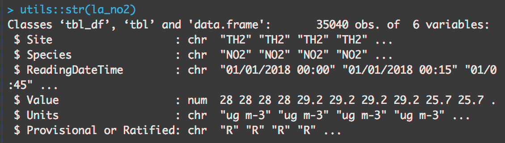

1.  所有这些数据来自同一站点，且污染物的物种读数相同，我们可以得出单位度量在整个数据中可能保持一致的结论。如果是这种情况，我们可以删除这些列，因为它们没有提供任何信息价值。即使我们不知道第一个变量总是相同的，通过`str`函数的结果，我们也可以开始看出这个模式。我们可以通过运行以下代码来确认这一点，使用`dplyr`包中的`group_by`和`summarise`函数：

```py
la_no2 %>% dplyr::group_by(Units, Site, Species) %>% dplyr::summarise(count = n())
```

运行上述代码后，我们将看到控制台输出如下内容：

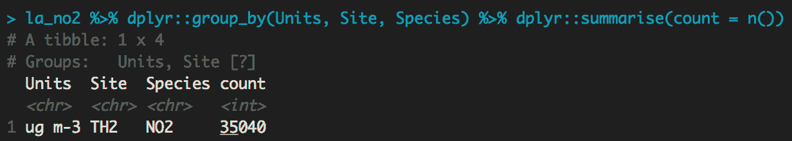

我们已经确认`Site`、`Species`和`Units`的值始终相同，因此可以将它们从数据中删除，因为它们不会提供任何有用信息。我们还可以看到，实际的读数值是以字符字符串的形式存储的，日期也以相同的方式存储。当前形式下，`date`字段表现出一种特征，称为高基数性，即存在大量唯一的值。当我们看到这种情况时，通常会希望对这些类型的列进行处理，以减少其独特值的数量。在这种情况下，方法是显而易见的，因为我们知道这应该是一个日期值。

1.  在接下来的代码中，我们将使用`dplyr`的`select`函数删除不需要保留的列。我们将使用`dplyr`的`mutate`函数，并结合`lubridate`包中的函数来转换我们已识别的变量。转换数据后，我们可以删除旧的字符字符串日期列和完整日期列，因为我们将使用原子化的日期值。我们删除不需要的列，并使用以下代码将转换后的日期字段拆分为其组成部分：

```py
la_no2 <- la_no2 %>%
dplyr::select(c(-Site,-Species,-Units)) %>%
  dplyr::mutate(
    Value = as.numeric(Value),
    reading_date = lubridate::dmy_hm(ReadingDateTime),
    reading_year = lubridate::year(reading_date),
    reading_month = lubridate::month(reading_date),
    reading_day = lubridate::day(reading_date),
    reading_hour = lubridate::hour(reading_date),
    reading_minute = lubridate::minute(reading_date)
  ) %>%
  dplyr::select(c(-ReadingDateTime, -reading_date)) 
```

在运行上述代码之前，我们应该注意到我们的环境面板中的`dataframe`如下所示：

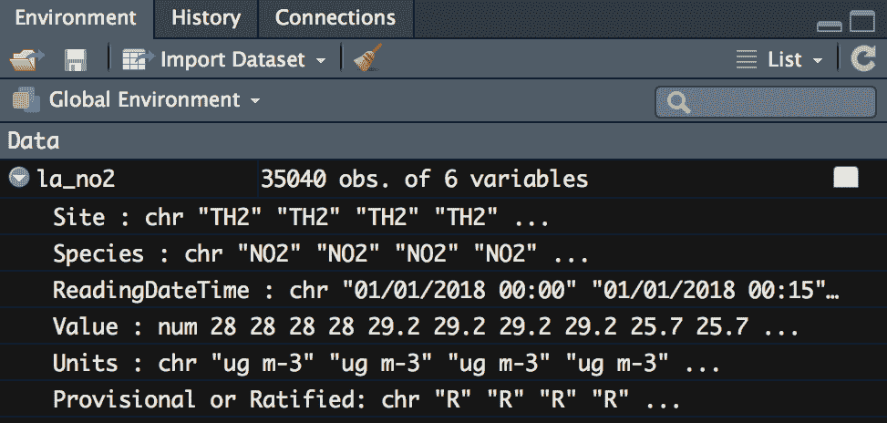

运行代码后，我们可以注意到`dataframe`的变化，现在应该如下所示：

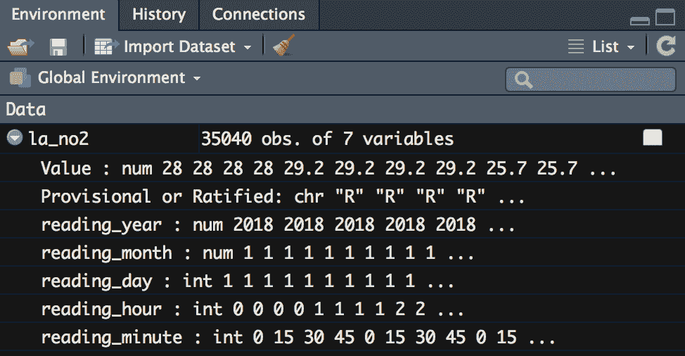

如您所见，只包含一个值的列已被删除，数据列现在占据了五个列，每个列对应一个日期和时间部分。

1.  接下来，我们将使用`DataExplorer`包来检查是否存在缺失值。有多种方法可以总结数据对象中缺失值的数量和比例。其中，`plot_missing()`函数可以一次性提供缺失值的计数、百分比及其可视化效果。我们通过以下代码行来绘制缺失值：

```py
DataExplorer::plot_missing(la_no2)
```

运行此代码后，会生成一个图表。在你的**查看器**面板中，你应该能看到如下图表：

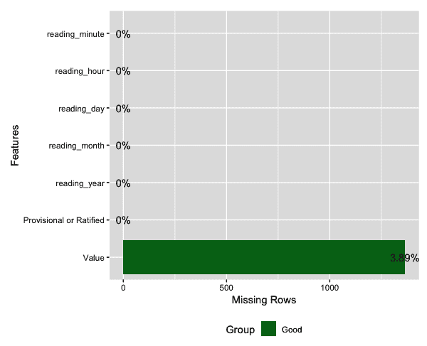

如你所见，独立变量中没有缺失值。然而，在目标变量类别中，约有 1,500 个缺失值，占该列的 3.89%。

1.  由于存在缺失值，我们应该考虑是否需要采取任何措施。在这种情况下，我们将简单地删除这些行，因为它们并不多，并且没有缺失值的数据部分仍然能够代表整个数据集。虽然在此案例中我们仅删除了缺失值，但处理缺失值的方式有很多种选择。本章稍后将介绍可能的处理方法。为了删除含有缺失值的行，我们运行以下代码：

```py
la_no2 <- la_no2 %>% filter(!is.na(Value))
```

1.  我们还将检查我们的离散变量，以查看该列中各类别的值分布。同样，`DataExplorer`包提供了一个方便的函数，可以为离散值生成图表，显示每个值的频率。我们通过以下代码行使用`plot_bar`函数生成此图表：

```py
DataExplorer::plot_bar(la_no2)
```

运行上述函数后，我们能够看到以下可视化结果，清晰地显示了**批准**结果比**临时**结果更多。从查阅该数据集的文档中，**批准**结果是经过验证的，可以信赖其准确性，而**临时**结果可能不如其准确。让我们来看一下输出：

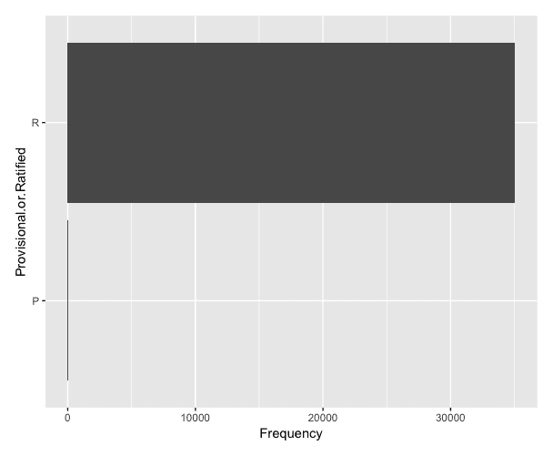

我们创建了一个图表，以便快速查看**临时**或**批准**列中离散项的值分布。我们还可以使用以下代码创建一个表格，以获取更具体的详细信息：

```py
la_no2 %>% dplyr::group_by(`Provisional or Ratified`) %>% dplyr::summarise(count = n())
```

上述代码使用`group_by`函数按`临时或批准`列中的值对行进行分组。接着，它使用`summarise`函数，并将`count`参数设置为`n()`，以计算包含每个离散值的行数。运行上述代码后，输出将显示在控制台中，如下所示：

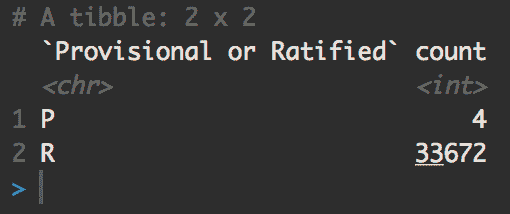

1.  由于标记为`Provisional`的值非常少，我们将删除这些行。为此，我们将首先使用`filter`函数，它用于根据特定条件删除行。在这种情况下，我们将过滤数据，使得`Provisional or Ratified`列中只有值为`'R'`的行保留下来，如下所示：

```py
la_no2 <- la_no2 %>%
  dplyr::filter(
    `Provisional or Ratified` == 'R'
  )
```

1.  接下来，我们将删除`Provisional or Ratified`列，因为它只包含一个唯一值。为此，我们将使用`select()`函数，删除列的方式与删除行的过滤器类似。在这里，调用`select()`函数，传递给函数的参数是`-Provisional or Ratified`，这样就会删除这一列。或者，可以将所有其他列名（除了`Provisional or Ratified`）作为参数传递给它。`select()`函数通过指定要包含或排除的列来工作。在这种情况下，指定要排除的列更为高效，这就是为什么做出这个选择的原因。请参考以下代码：

```py
la_no2 <- la_no2 %>%
  dplyr::select(-`Provisional or Ratified`)
```

1.  早些时候，我们提到所有数据都来自 2018 年。现在我们的日期数据已经被拆分成了各个组成部分，我们应该只在`reading_year`列中看到一个值。检验这一点的一个方法是使用`range()`函数。我们通过运行以下代码来检查`reading_year`列中的最小值和最大值：

```py
range(la_no2$reading_year)
```

运行上述代码将导致值被打印到控制台。您的控制台应该如下所示：

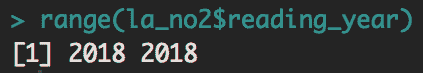

从我们调用`range()`函数的结果中，我们可以看到，实际上`reading_year`列只包含一个值。既然如此，我们可以使用`select()`函数在以下代码的帮助下删除`reading_year`列：

```py
la_no2 <- la_no2 %>%
  dplyr::select(-reading_year)
```

1.  接下来，我们可以对连续变量进行直方图检查，以寻找异常值。为了实现这一点，我们将再次使用`DataExplorer`包。这次，我们将使用`plot_histogram`函数来可视化所有具有这些类型值的列中的连续值，如下所示的代码块：

```py
DataExplorer::plot_histogram(la_no2)
```

运行上述代码后，会生成五个图表，显示这五个包含连续值的列的频率。您的**查看器**面板应该如下所示：

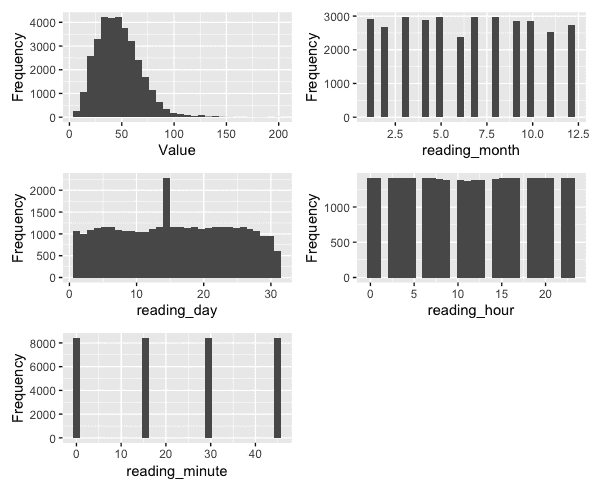

在上述输出中，我们确实看到我们的自变量稍微偏向右侧，因此，我们可以对异常值采取一些处理措施。如果存在更剧烈的偏斜，我们可以应用对数变换。由于异常值不多，我们也可以删除这些值，如果我们认为它们是噪声的话。然而，目前我们将这些值保留在数据中。如果最终我们的模型表现不佳，那么进行一些异常值处理，看看是否能改善性能，将是值得的。

1.  最后，让我们进行一次相关性检查。我们将再次使用`DataExplorer`包，这次我们将使用`plot_correlation()`函数。为了生成相关图，我们运行以下代码：

```py
DataExplorer::plot_correlation(la_no2)
```

运行前面一行代码将生成一个图表。该图表使用蓝色和红色分别表示负相关和正相关。这些颜色在本书中的图表中不会出现；然而，你仍然可以看到相关值。在运行前面的代码后，你将在查看器面板中看到一个图表，如下所示：

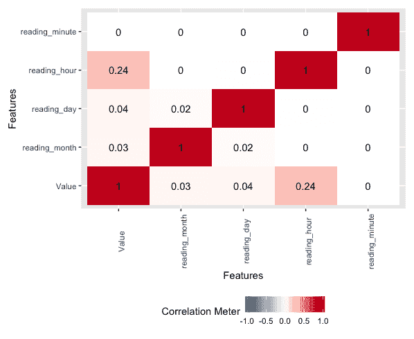

从这个图表中，我们可以看到污染物值确实与`reading_hour`特征有一定的相关性，而与`reading_day`和`reading_month`特征的相关性较小，这表明该污染物的产生在一天内有较高的趋势，而不是在一周、一个月或一年内。这个图表的主要目的是寻找高度相关的独立变量，因为这可能意味着这些变量传达了相同的信息，在这种情况下，我们可能希望删除其中一个或以某种方式将它们合并。

我们现在有一个已经适当预处理并准备好建模的数据集。相关图显示这些变量之间没有显著的相关性。当然，这并不令人惊讶，因为剩余的变量只是描述时间中的离散时刻。

日期值已从没有信息价值的字符串转换为日期值，进一步分割为以数字数据表示的日期部分。所有仅包含一个值的列都已被删除，因为它们没有提供任何信息。标记为临时值的少数行被删除，因为这些行不多，而且在数据描述中有关于这些污染物测量有效性的警告。最后，包含预测变量为空值的行被删除。之所以这样做，是因为这种行的数量不多；然而，我们在这种情况下本可以采取其他策略，我们将在下节中提到它们。

# 处理缺失值

在我们刚刚完成的预处理工作中，我们决定删除缺失值。当缺失值的情况非常少时，这是一个可行的选择，在这个例子中确实如此。然而，其他情况下可能需要不同的方法来处理缺失值。除了删除行和列外，以下是一些常见的其他选项：

+   **使用集中趋势度量进行插补**（**均值**/**中位数**/**众数**）：使用一种集中趋势度量来填充缺失值。如果你的数据是正态分布的数值数据，这种方法效果较好。对于非数值数据，也可以使用众数插补，通过选择最频繁的值来替换缺失值。

+   **调整缺失值**：你可以使用已知值来填补缺失值。此方法的例子包括使用回归分析处理线性数据或使用**k 近邻**（**KNN**）算法，根据特征空间中与已知值的相似度来分配一个值。

+   **用常数值替换**：缺失值也可以用一个常数值替换，该常数值不在已有数据的值范围内，也未出现在分类数据中。这样做的好处是，后来会更清楚这些缺失值是否具有信息价值，因为它们会被明确地放置在一边。与用集中趋势度量填补缺失值的方式不同，集中趋势填补后的最终结果会使一些缺失值包含填补后的值，而有些相同的值实际上已经存在于数据中。在这种情况下，便难以区分哪些是缺失值，哪些是原本已存在的数据值。

# 训练一个模型来拟合准备好的数据

现在数据准备好了，我们将其划分为训练集和测试集，并运行一个简单的模型。此时的目标不是尽力取得最佳性能，而是得到一种基准结果，以便未来在尝试提升模型时使用。

# 训练数据和测试数据

在构建预测模型时，我们需要通过以下几个部分创建两个独立的数据集。一个用来让模型学习任务，另一个用来测试模型是否学会了这个任务。以下是我们将要查看的数据类型：

+   **训练数据**：用于拟合模型的数据部分。模型可以访问解释变量或独立变量（即被选择的列，用来描述数据记录），以及目标变量或依赖变量。我们在训练过程中尝试预测的就是这个目标变量。这个数据部分通常应该占你总数据的 50%到 80%。

+   **测试数据**：用于评估模型结果的数据部分。在学习过程中，模型永远不能接触到这些数据，也永远不应看到目标变量。这个数据集用于测试模型在依赖变量上的学习情况。在训练阶段拟合模型后，我们现在使用这个模型来预测测试集中的值。在这一阶段，只有我们拥有正确答案；而独立变量，即模型，永远无法接触到这些值。模型做出预测后，我们可以通过将预测值与实际正确值进行比较来评估模型的表现。

+   **验证数据**：验证数据是训练数据集的一部分，模型利用它来调整超参数。随着超参数的不同值被选定，模型会对验证集进行检查，并使用在此过程中收集的结果来选择产生最佳性能模型的超参数值。

+   **交叉验证**：当我们只使用一个训练集和测试集时，可能会出现一个潜在问题，即模型会学习到一些特定的描述性特征，这些特征是该数据段特有的。模型所学到的内容在未来应用于其他数据时可能无法很好地推广。这种情况被称为过拟合。为了减轻这个问题，我们可以使用一种叫做交叉验证的过程。在一个简单的例子中，我们可以将数据按 80/20 的比例划分，其中 20%作为测试数据，模型在这个划分上进行建模和测试。然后，我们可以创建一个独立的 80/20 划分，进行相同的建模和测试。我们可以重复这个过程 5 次，使用 5 个不同的测试集——每个测试集由数据的五分之一组成。这种精确的交叉验证方法被称为 5 折交叉验证。在所有迭代完成后，我们可以检查每次迭代的结果是否一致。如果一致，我们可以更有信心地认为我们的模型没有过拟合，并可以利用这个模型在更多数据上进行推广。

# 选择算法

对于这个任务，我们将使用`xgboost`，这是一个非常流行的梯度树提升算法的实现。它之所以效果如此好，是因为每次模型迭代都会从前一个模型的结果中学习。与 bagging 相比，该模型使用提升方法进行迭代学习。这两种集成技术都可以用来弥补基于树的学习者在训练数据上过拟合的已知弱点。

bagging 和 boosting 之间的一个简单区别是，在 bagging 中，会生长完整的树，然后将结果进行平均，而在 boosting 中，每次树模型的迭代都会从前一个模型中学习。这是一个重要的概念，因为这个结合了加法函数的算法思想，在对前一个模型残差建模后获得信息，将在深度学习中得到应用。

在这里，我们将探索这种类型的机器学习算法在这个简单例子中的强大功能。此外，我们还将特别关注我们在这里学到的内容如何与后续章节中更复杂的例子相关。我们将使用以下代码来训练一个`xgboost`模型：

1.  我们通过以下代码开始将模型拟合到数据的过程，首先将数据划分为训练集和测试集：

```py
set.seed(1)
partition <- sample(nrow(la_no2), 0.75*nrow(la_no2), replace=FALSE)
train <- la_no2[partition,]
test <- la_no2[-partition,]

target <- train$Value

dtrain <- xgboost::xgb.DMatrix(data = as.matrix(train), label= target)
dtest <- xgboost::xgb.DMatrix(data = as.matrix(test))
```

在前面的代码中，我们从 `set.seed()` 函数开始。这是因为这个建模过程的一些部分涉及伪随机性，设置种子可以确保每次使用相同的值，从而我们能始终如一地产生相同的结果。

我们将数据分为训练数据（用于建模）和测试集（用于检查预测是否准确）。我们通过获取随机的行索引值样本，存储在名为 `partition` 的向量中，并用这些索引来子集化数据。此外，在分区后，我们将目标变量分离出来，并将其存储在一个向量中。

然后，我们将数据转换为稠密矩阵，以便将其传递给 `xgboost` 算法时符合正确的格式。

1.  接下来，我们将创建一个参数列表。该列表中的某些值是进行分析所需的，其他值则是随意选择的初始值。对于这些值，稍后我们将探讨更科学地选择它们的方法。我们使用以下代码准备初始参数列表：

```py
params <-list(
  objective = "reg:linear",
  booster = "gbtree",
  eval_metric = "rmse",
  eta=0.1, 
  subsample=0.8,
  colsample_bytree=0.75,
  print_every_n = 10,
  verbose = TRUE
)
```

在前面的代码中，以下是该列表中需要的值：

+   `objective = "reg:linear"`：用于将任务目标定义为线性回归。在这里，我们正在进行一个回归任务，目标是预测二氧化氮的值。

+   `booster = "gbtree"`：这告诉我们将使用梯度提升树来选择最适合预测结果的模型。

+   `eval_metric = "rmse"`：这告诉我们将使用**均方根误差**（**RMSE**）来评估模型的成功。稍后我们将探讨为什么这是最合适的选择，并讨论我们在其他任务中可以使用的一些其他选项。

接下来，这些是我们任意选择初始值的变量：

+   `eta=0.1`：用于定义学习率。起初，使用较大的数值是有意义的；但是，随着进展，我们将希望使用较小的学习率并增加轮次以提高性能。

+   `subsample=0.8`：这告诉我们，对于每棵树，我们将使用数据中 80% 的行。

+   `col_subsample=0.75`：这告诉我们，对于每棵树，我们将使用数据中的 75% 列。

这些是不会影响模型本身，仅影响我们查看模型结果的参数：

+   `print_every_n = 10`：用于指定每经过 10 轮后打印一次评估分数。

+   `verbose = TRUE`：用于表示评估分数应打印到控制台，以便在模型运行时，最终用户能够看到这些分数。

1.  现在我们已经定义了参数，我们将使用以下代码运行模型：

```py
xgb <- xgboost::xgb.train( 
  params = params, 
  data = dtrain,
  nrounds = 100
)
```

当我们运行模型时，我们会带入之前定义的参数列表，也就是说，模型应该在训练数据集上运行，我们选择运行模型 100 轮。这意味着我们将生成 100 棵树。这同样是一个任意值。稍后我们将探讨如何找到最优的轮次。接着，我们使用刚刚定义的模型来预测测试数据集。对于训练数据集，算法知道正确的值，并用它来调整模型。

1.  在下一节中，我们将把模型应用于测试数据，其中模型不再访问正确的值，没有这些知识，模型将使用自变量来预测目标变量。请参阅以下代码块：

```py
pred <- predict(xgb, dtest)
```

当我们运行前面的代码时，我们从密集矩阵中提取数据，标记为`dtest`，并通过我们标记为`xgb`的模型运行它。模型应用在训练过程中计算出的树分割，并将其应用于新数据来做出预测。预测结果将存储在一个名为`pred`的向量中。

1.  最后，我们将使用 RMSE 函数检查模型的表现。对于这个评估指标，越接近零越好，因为它衡量的是真实值与预测值之间的差异。为了评估我们模型的表现，我们运行以下代码：

```py
Metrics::rmse(test$Value,XGBpred) 
```

在运行前面的代码后，我们将看到一个值被打印到控制台。你的控制台应该显示如下输出：

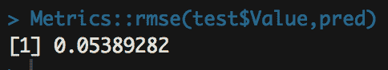

从我们的快速而简单的模型来看，我们已经获得了 0.054 的 RMSE 分数。很快，我们将对模型参数进行一些调整，以尝试提高分数。在此之前，让我们快速看一下除了 RMSE 之外，我们可以使用的所有不同评估指标，并深入解释 RMSE 是如何工作的。

# 评估模型结果

我们只有在能够衡量模型时，才知道模型是否成功，值得花点时间记住在不同场景下使用哪些评估指标。举个例子，假设有一个信用卡欺诈数据集，其中目标变量存在很大的不平衡，因为在许多非欺诈案例中，只有相对较少的欺诈案件。

如果我们使用一个仅仅衡量目标变量预测成功百分比的指标，那么我们就不会以一种非常有帮助的方式评估我们的模型。在这种情况下，为了简化数学计算，假设我们有 10,000 个案例，其中只有 10 个是欺诈账户。如果我们预测所有案件都不是欺诈，那么我们的准确率将是 99.9%。这个准确率很高，但其实用性不大。以下是各种评估指标的回顾以及何时使用它们。

# 机器学习评估指标

选择错误的指标会使得评估模型表现变得非常困难，从而也很难提升我们的模型。因此，选择正确的指标非常重要。让我们来看看以下的机器学习指标：

+   **准确率**：最简单的评估指标是准确率。准确率衡量预测值与实际值之间的差异。这个指标易于解释和沟通；然而，正如我们之前提到的，当用来评估一个高度不平衡的目标变量时，它并不能很好地反映模型表现。

+   **混淆矩阵**：混淆矩阵提供了一种方便的方式来展示分类准确性以及 I 型错误和 II 型错误。结合这四个相关指标的视图，在调优过程中决定集中精力的地方特别有帮助。它还可以帮助标出其他指标可能更有用的情况。当多数类别的值过多时，应该使用设计用于处理类别不平衡的指标，例如对数损失。

+   **平均绝对误差**（**MAE**）：该指标计算预测值与实际值之间的差异，并求出这些误差的平均值。这个指标简单易懂，适用于在不需要对大误差施加额外惩罚的情况。如果一个误差是另一个误差的三倍大，而三倍大的误差被认为是三倍糟糕的，那么这个指标非常适用。然而，很多情况下，三倍大的误差远不止是三倍糟糕，这时就需要加上额外的惩罚，而这一点可以通过下一个指标来实现。

+   **RMSE**：该指标对每个预测的误差进行平方处理，即预测值与实际值之间的差异，然后将这些平方误差相加，最后对和进行平方根运算。在这种情况下，如果平方误差中有一些预测非常不准确，它将导致较大的惩罚，从而使这个误差指标的值更高。我们可以看到这在前面的例子中如何发挥作用，也可以理解我们为什么选择使用 RMSE。这个指标用于回归问题。

+   **曲线下面积**（**AUC**）：AUC 指的是*接收者操作特征曲线下面积*。在这个模型中，你的目标变量需要表示一个值，表达某一行属于正目标条件或负目标条件的置信度或概率。为了让这个概念更加具体，AUC 可以用于预测某人进行某次购买的可能性。从这个解释中，我们可以清楚地看出 AUC 是一个分类问题的指标。

+   **对数损失**（**Log-Loss**）：对数损失评估指标相比 AUC 更加奖励自信的预测，同时惩罚中立的预测。当目标数据集不平衡，且发现少数类非常关键时，这一点尤为重要。对错误预测施加额外的惩罚有助于我们找到一个能够更好地正确预测少数类成员的模型。对数损失在多类别模型中也表现更好，尤其是当目标变量不是二元时。

# 改进模型结果

由于我们有一个回归问题，现在我们明白为什么选择 RMSE，并且有了一个性能基准指标，我们可以开始着手改进模型了。每个模型都有自己独特的改进方法；不过我们可以稍微概括一下。特征工程有助于提升模型性能；然而，由于深度学习对这类工作要求较低，我们在这里不再过多关注。此外，我们已经通过特征工程生成了日期和时间部分。我们还可以通过使用较慢的学习率运行模型更长时间，并且调优超参数。为了使用这种模型改进方法找到最佳的参数值，我们将使用一种叫做**网格搜索**（grid search）的方法，查看多个字段的不同值范围。

让我们来寻找最佳的轮次数。通过 R 接口使用`xgboost`的交叉验证版本，我们可以根据默认的超参数设置再次训练我们的模型。这一次，我们将不再选择 100 轮，而是利用`xgboost`中的功能来确定最佳的树木数量。通过交叉验证，模型可以在每轮结束时评估误差率，并且我们将使用`early_stopping_rounds`功能，使模型在误差率不再下降时，停止增加树木的数量。

让我们来看一下下面的代码，它确定了在默认设置下，哪一个轮次或树木数量能够产生最低的误差率：

```py
xgb_cv <- xgboost::xgb.cv( 
  params = params, 
  data = dtrain, 
  nrounds = 10000, 
  nfold = 5, 
  showsd = T, 
  stratified = T,
  print_every_n = 100,
  early_stopping_rounds = 25, 
  maximize = F)
```

在运行上述代码后，我们将看到模型性能指标在控制台上打印出来，随着模型的运行，报告的开头应该像以下截图一样：

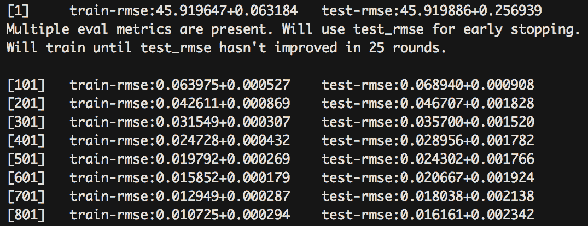

在这里，我们可以看到模型性能正在迅速提升，并且得到了确认，当模型在 25 轮内没有任何改进时，训练会停止。

当你的模型达到最佳的运行次数时，控制台应该显示如下截图：

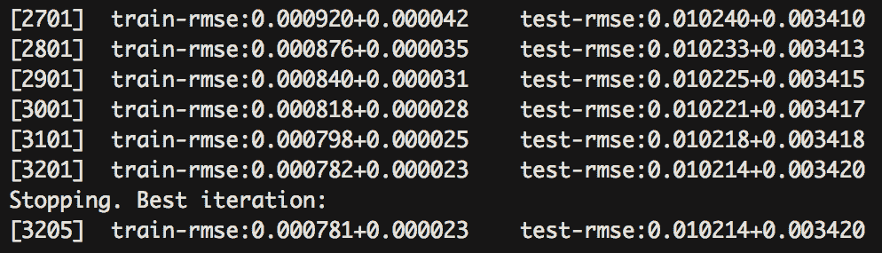

在这里，我们可以看到模型的表现提升较慢，且模型已经停止，因为不再有改善。控制台打印出的报告也标明了表现最好的轮次。

在分析前面的示例中发生的一切时，我们再次在相同的数据和相同的参数下训练`xgboost`模型，就像我们之前做的一样。然而，我们将轮次设置得更高。为了找到最佳迭代次数，我们需要足够多的轮次，这样模型在找到最佳的树木数量之前不会停止生长树木。在这种情况下，最佳的迭代发生在大约 3,205 次；所以，如果我们将轮次设置为 1,000 次，例如，建模过程将在生长 1,000 棵树后完成。然而，我们仍然无法知道产生最低错误率的轮次数，这就是为什么我们将轮次设置得如此之高的原因。

以下是前面代码中使用的设置列表。让我们来看看使用这些设置的目的：

+   `nfold`：这是折叠数或进行交叉验证时将数据划分成多少个部分。这里我们使用`5`，这利用了前面提到的交替 80/20 拆分。

+   `showsd`：这个选项显示标准差，以显示不同折叠组合之间结果的变化。这一点很重要，因为它能确保模型在所有数据集上都表现良好，并且在未来的数据上具有良好的泛化能力。

+   `stratified`：这确保每个折叠的数据包含相同比例的目标类。

+   `print_every_n`：这个选项告诉我们每隔多少次打印一次交叉验证的结果到控制台。

+   `early_stopping_rounds`：这是一个决定模型何时停止生长树木的值。你可以使用这个值来检查在给定轮次数内性能是否有所改善。当模型在达到设定的轮次限制后不再改善时，过程将停止。

+   `maximize`：这个选项标明评估指标是否是一个通过最大化分数或最小化分数来改进的指标。

现在，让我们对选定的超参数进行网格搜索。顾名思义，网格搜索会为所有定义的超参数值组合建模。使用这种技术，我们可以调整一些控制模型如何生长树木的设置，然后评估哪些设置提供了最佳的性能。`xgboost`的所有可调超参数的完整列表包含在软件包文档中。对于这个示例，我们将重点关注以下三个超参数：

+   `max_depth`：这是树的最大深度。由于我们只有 4 个特征，我们将尝试`2`、`3`和`4`的深度。

+   `gamma`：这是继续创建拆分所需的最小损失减少。将此级别设置得更高会创建更浅的树，因为对减少错误率贡献较小的节点不会进一步拆分。我们将尝试`0`、`0.5`和`1`的值。

+   `min_child_weight`：这是增长一个节点所需的实例数量。如果实例数少于此阈值，则树将停止从此节点分裂。这个数字越大，生成的树就越浅。在本例中，我们将尝试`1`、`3`和`5`这几个值。

我们现在将演示执行网格搜索所需的所有代码，以调整我们的参数到最佳值，从而提高模型性能：

1.  我们的第一步将是通过将之前提到的值向量分配给参数网格中的各个超参数来定义我们的搜索网格。我们通过运行以下代码来定义我们将尝试的超参数值：

```py
xgb_grid <- expand.grid(
  nrounds = 500,
  eta = 0.01,
  max_depth = c(2,3,4),
  gamma = c(0,0.5,1),
  colsample_bytree = 0.75,
  min_child_weight = c(1,3,5),
  subsample = 0.8
)
```

如前面的代码所示，为了提高效率，我们将设置轮次为 500。尽管在实际情况下，您可以使用之前通过搜索最佳迭代得到的轮次。

在将`eta`包含到网格搜索中时，记得同时包含`nrounds`，因为随着学习率的降低，您将需要更多的迭代轮次。

1.  接下来，我们将在`caret`中使用`trainControl`函数来定义如何处理此参数搜索。为此，我们将列出代码并逐步解释所选择的设置。`trainControl`有很多其他设置，然而我们这一章只专注于其中几个。我们使用以下代码来设置模型训练方式：

```py
xgb_tc = caret::trainControl(
  method = "cv",
  number = 5,
  search = "grid",
  returnResamp = "final",
  savePredictions = "final",
  verboseIter = TRUE,
  allowParallel = TRUE
)
```

该函数的`method`和`number`参数仅定义我们的交叉验证策略，这里将使用 5 折交叉验证，和之前使用的一样。我们将使用网格搜索遍历在上一节代码中定义的所有超参数组合。接下来的两个参数用于在对所有组合建模后，保存最佳迭代的重采样和预测细节。最后，我们将`verboseIter`设置为`TRUE`，以便将迭代详情打印到控制台，并将`allowParallel`设置为`TRUE`，以使用并行处理提高计算速度。

1.  在设置好网格搜索的值并定义搜索策略后，我们将再次运行模型，使用每一种可能的超参数组合。然后，我们在训练模型时会使用前两步设置中的网格搜索超参数：

```py
xgb_param_tune = caret::train(
  x = dtrain,
  y = target,
  trControl = xgb_tc,
  tuneGrid = xgb_grid,
  method = "xgbTree",
  verbose = TRUE
)
```

运行此代码后，我们将在控制台看到一个类似于第一次运行模型时的报告。您的控制台应类似于以下截图：

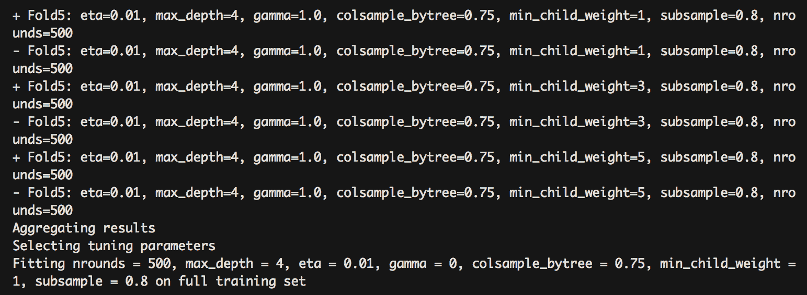

报告显示了当前的折叠和当前的参数设置，当模型遍历所有五个不同数据划分的所有组合时。在前面的截图中，我们看到在数据的第五次划分上，对所有`min_child_weight`选项进行测试，同时保持其他条件不变。最终，我们看到选择了最佳的调优参数。

在这种情况下，最好的深度是使用所有特征，这并不奇怪，考虑到特征的缺乏。最佳的最小子节点权重是`1`，这意味着即使稀疏的节点仍然包含了对我们模型重要的信息。最佳的 gamma 值是`0`，这是默认值。随着这个值的增加，它对每个节点在分裂之前需要改进的误差率施加了轻微的约束。在这种情况下，经过我们的网格搜索，我们基本上仍然使用默认值；然而，我们可以看到选择这些默认值之外的替代方案的过程，如果它们有助于改进模型性能的话。

1.  现在我们知道最佳的超参数设置，可以将它们重新插入之前运行的模型中，看看是否有任何改进。我们使用找到的参数和迭代次数训练我们的模型，优化性能，运行以下代码：

```py
params <-list(
  objective = "reg:linear",
  booster = "gbtree",
  eval_metric = "rmse",
  eta=0.01, 
  subsample=0.8,
  colsample_bytree=0.75,
  max_depth = 4,
  min_child_weight = 1,
  gamma = 1
)
xgb <- xgboost::xgb.train( 
  params = params, 
  data = dtrain,
  nrounds = 3162,
  print_every_n = 10,
  verbose = TRUE,
  maximize = FALSE
)

pred <- stats::predict(xgb, dtest)
Metrics::rmse(test$Value,pred) 
```

当我们运行上述代码时，我们训练我们的模型并进行预测，就像我们之前做的那样，我们还运行了一行代码来计算 RMSE 值。当我们运行这行代码时，我们将在控制台看到一个打印的值。您的控制台应该看起来像以下屏幕截图：

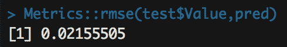

从计算错误率的结果来看，得分从 0.054 提高到了 0.022，这比我们第一次尝试有所改进。利用这些数据，即使特征有限，我们可能会认为时间序列模型是更好的选择；然而，只有 1 年的数据，时间序列方法不会捕捉到尚未存在的季节性影响。这种建模方式为未来几年创建了一张地图，并显示缺失数据可以通过简单使用日期和时间值来预测已知数据。这意味着我们可以估算未来几年的 NO2 值。在收集了几年的数据之后，可以使用时间序列方法进行预测，考虑到逐年趋势和此处捕获的季节性信息。

我们使用了`xgboost`，这是一种流行的树提升算法，用于预测伦敦某一地区的污染水平。早些时候，我们通过创建一个简单的模型来建立基准。然后，我们看了如何衡量性能。接着，我们采取了提高性能的步骤。虽然我们为这项任务选择了`xgboost`，但还有其他机器学习算法可供选择，我们将在接下来进行审查。

# 审查不同的算法

我们相对快速地介绍了机器学习，因为我们希望专注于随着我们进入深度学习而跟随的基本概念。因此，我们不能提供对所有机器学习技术的全面解释；然而，我们将快速回顾这里的不同算法类型，这将有助于未来记忆。

我们将快速审查以下几种机器学习算法：

+   **决策树**：决策树是一种简单的模型，它构成了许多更复杂算法的基本学习器。决策树简单地在给定的变量上将数据集进行划分，并记录每个分支中目标类别的比例。例如，如果我们要预测谁更可能喜欢玩婴儿玩具，那么基于年龄的划分可能会显示，包含 3 岁以下的数据显示出在`target`变量中高比例的正确结果，也就是说，喜欢这种活动的人占较大比例，而年龄较大的则可能不太喜欢。

+   **随机森林**：随机森林类似于`xgboost`，后者在本篇机器学习概述中有提到。随机森林与`xgboost`的显著区别在于，随机森林构建完整的决策树，这些树组成了基本学习器的集合。然后将这些简单的基本学习器模型的结果进行平均，得出比任何基本学习器更好的预测结果。这种技术被称为 bagging。相比之下，`xgboost`使用提升法（boosting），它会在构建先前基本学习器时学到的知识的基础上，应用额外的决策树来处理数据。尽管这两种方法都是有用且强大的集成结果和提升性能的方式，我们选择在本例中聚焦于`xgboost`，因为从前一次迭代中汲取的信息这一思想也同样体现在深度学习中。

+   **逻辑回归与支持向量机**（**SVM**）：SVM 通过一条距离该空间中最近的两个点最远的直线来划分特征。然后将这个边界应用于测试数据，一侧的点按一种方式分类，而另一侧的点则按另一种方式分类。这与逻辑回归类似，主要的区别在于，逻辑回归会评估所有数据点，而 SVM 只包括离用于划分数据的直线最近的点。此外，当解释变量较少时，逻辑回归效果较好，而当数据集的维度较大时，SVM 效果更佳。SVM 会寻找一条分隔所有特征的直线，而逻辑回归则会使用一系列拟合度最好的直线来估计数据点属于目标变量中特定类别的概率。

+   **KNN** **和 k-means**：这两种方法用于在数据中创建聚类。KNN 是一种监督学习技术。通过这种方法，模型将数据点绘制在*k*维特征空间中。当在训练过程中引入新点时，模型会识别出新点的最近邻，并将该类分配给这个记录。相对而言，*k*-means 是一种无监督学习技术，它在特征空间中找到质心，使得可以创建*k*个聚类，每个点根据与给定质心的最小距离来进行分类。

+   **GBM 和 LightGBM**：除了`xgboost`，GBM 和 LightGBM 也提供了一种使用提升机制生成预测的方法，以提高迭代之间的模型性能。**梯度提升机**（**GBM**）是`xgboost`和 LightGBM 的前身。它大体上以相同的方式运作，通过在决策树基学习器上使用提升集成技术；然而，它在方法上较为原始。GBM 使用所有特征生长完整的树，而`xgboost`和 LightGBM 则有不同的方式来减少分裂的数量，从而加快树的生长速度。

`xgboost`和 LightGBM 之间的最大区别在于，`xgboost`在计算特征划分后，会为每棵树生长一个新层级，而 LightGBM 则仅会在最具预测性的叶子下方生长新层级。这种按叶子划分的方式相比于`xgboost`使用的按层级划分，提供了更快的速度优势。此外，专注于单一叶子的划分，模型能够更好地找到最小化误差的值，相较于划分整个层级，这能带来更好的性能。LightGBM 可能会超越`xgboost`，成为从业者的首选模型；然而，目前`xgboost`仍然被更广泛地使用，这也是为何在此简要概述中选择了它。

# 摘要

在本章中，我们使用了一个原始数据集，探索了数据，并采取了必要的数据预处理步骤，为建模做好准备。我们进行了数据类型转换，将以字符字符串形式存储的数字和日期分别转换为数值型和日期型列。此外，我们通过将日期值拆分成其组成部分，进行了特征工程。在完成预处理后，我们对数据进行了建模。我们采用了包括创建基准模型，并调优超参数以提高初始得分的方法。我们使用了早停轮次和网格搜索，找到了能够产生最佳结果的超参数值。在根据调优过程修改了模型的结果后，我们注意到性能有了显著提升。

本章讨论的所有机器学习方面的内容将在后续章节中继续使用。我们需要为建模准备数据，并且需要了解如何通过调整设置来提高模型的性能。此外，我们一直专注于`xgboost`中的决策树集成模型，因为在接下来的章节中我们将进行与神经网络相关的工作，内容类似。我们将像在`xgboost`中一样，考虑效率和性能，通过调整树的生长方式来实现。

这段机器学习的回顾为进入深度学习奠定了基础。在下一章中，我们将开始安装和探索所用的包。
