# 第三章：人工神经网络

在本章中，你将学习关于人工神经网络的知识，它是所有深度学习的基础。我们将讨论是什么使深度学习与其他形式的机器学习不同，然后花时间深入探讨一些其特定和特殊的特点。

到本章结束时，我们将了解是什么使深度学习成为机器学习的一个特殊子集。我们将理解神经网络，它们如何模仿大脑，以及隐藏层在离散元素检测中的优势。我们将创建一个前馈神经网络，并注意激活函数在确定变量权重中的作用。

本章将涵盖以下主题：

+   将深度学习与机器学习进行对比

+   比较神经网络和人脑

+   理解隐藏层的作用

+   创建前馈网络

+   使用反向传播增强我们的神经网络

# 技术要求

本章的源代码请参考 GitHub 链接：[`github.com/PacktPublishing/Hands-on-Deep-Learning-with-R`](https://github.com/PacktPublishing/Hands-on-Deep-Learning-with-R)。

# 将深度学习与机器学习进行对比

深度学习的一个关键优势是其他机器学习方法所没有的，它能够考虑变量之间的关系。例如，如果我们回想起当初学习动物时，可以想象一个简单的任务，我们被给出了五张猫的照片和五张狗的照片；之后，当我们看到一张新图片时，我们能够通过之前学习到的模式来判断这是一只猫还是狗。在我们的例子中，图片是要被分类为猫或狗的对象。我们可以把这个例子看作是一个训练集，并且在分类图片时使用相同的术语。从心理上讲，我们的大脑试图将这些图片与形成这两种不同物种特征的模式匹配，从而帮助我们区分它们。这在深度学习中也是如此。

今天，我们会发现前面的任务相当简单；然而，想象一下计算机必须如何学习这个任务：

+   它需要考虑狗和猫的特征之间的关系，并且无论动物在照片中的占比多少，都会对每一张照片进行这种处理。

+   对此，我们不能使用标准的机器学习方法，其中所有输入都被直接使用，而不考虑它们之间的关系。必须考虑像素在二维空间中的位置和相对距离，因此我们已经可以看到，对人类来说是一个简单的任务，机器却变得更加复杂。

+   此外，仅以二维数组的形式评估输入数据是不够的。机器还需要深度学习中存在的多个隐藏层架构，以识别数据数组中的多种不同模式。换句话说，单纯的信号并不像相互接近的信号之间的关系那样有用。

+   每一层都会识别图像中不同方面的存在，从基本的形状检测到颜色渐变的长度和陡峭度。

在执行简单的回归或分类任务时，我们会为每个变量应用一个权重，然后用这个权重预测结果。对于深度学习，存在一个中间步骤，其中人工神经元或单元是基于所有变量创建的。这个步骤创建了新的特征，这些特征是所有变量的组合，并应用了不同的权重。这一过程发生在所谓的隐藏层中。之后，信号会传递到另一个隐藏层，重复相同的过程。

每一层都会学习输入的不同方面。让我们来看一个例子：

+   第一层通过对负空间和正空间应用不同的权重，根据图像中物体的整体大小来创建神经元。

+   在第二层，神经元可能会根据耳朵和鼻子的形状和大小来创建。

+   通过这种方式，猫和狗的不同特征会被捕捉到所有隐藏层中。

初始时，权重是随机分配的。然后会与实际答案进行比较。经过多次尝试，模型学会了通过调整权重的方向来获得更好的结果，因此它会继续沿着相同的方向调整权重，直到选定的误差率最小化。

一旦完成并且权重被学习到，可以引入新的输入。模型将把所有变量与每个神经元的学习权重相乘，每个神经元将使用一个激活函数来决定是否激活或发火，并将信号传递到下一层。我们将在本章稍后详细讨论各种激活函数。目前，我们可以简单地说，在每个神经元上都会进行计算，最终在输出节点产生一个值。在这种情况下，概率是图像是狗还是猫。

在这个图示中，我们可以开始看到神经网络和深度学习的强大力量。模型不是孤立地评估每个变量，而是将它们一起考虑。相比之下，回归模型为每个单独的变量计算权重。回归模型可以使用交互项来计算变量组合的权重；然而，即便如此，它也没有像神经网络那样，在所有神经元中评估所有变量。由所有变量创建的神经元随后用于定义下一层中神经元的集合。通过这种方式，整个特征空间都会被考虑，并根据评估所有变量后出现的主题进行划分。

# 比较神经网络与人脑

让我们考虑一下人类大脑是如何学习的，从而了解神经网络在某些方面的相似性和不同之处。

我们的大脑包含大量的神经元，每个神经元与成千上万个附近的神经元相连接。当这些神经元接收到信号时，如果输入包含一定量的某种颜色或某种纹理，它们会被激活。经过数百万个这样的互联神经元激活后，大脑会将传入的信号解读为某一类。

当然，这些连接不是永久设定的，而是随着我们不断获得经验、注意到模式并发现关系而动态变化的。如果我们第一次尝试一种新水果，发现它非常酸，那么所有帮助我们识别这种水果的特征就会与我们已知的酸味联系在一起。未来，是否愿意再次体验这种水果的味道将取决于我们是否愿意再体验这种酸味。

另一个展示我们大脑中的神经网络如何不断演变的例子聚焦于我们发现愉快的活动类型。例如，你有没有想过，为什么婴儿觉得摇动一个简单的玩具很有趣，而我们却不这么觉得？在我们的脑中，新奇会通过释放类鸦片物质来获得奖励；然而，随着某一刺激变得不再那么令人惊讶，解读这种体验所需的神经元数量会减少，导致反应不那么强烈，因为更少的神经元在激活。通过这种方式，我们看到了大脑中神经连接的动态性质，它们始终处于变化之中。

当我们讨论神经元之间的连接时，我们特指的是神经元之间的突触。人工神经网络试图通过创建一个由构造的神经元和一个或多个输出节点之间的巨大连接网络，模拟人脑的学习方式，粗略地近似大脑的神经元。就像大脑中连接神经元的突触可以变强或变弱一样，神经元之间的权重也可以在训练过程中发生变化。

然而，与人类大脑不同，我们在本章研究的简单人工神经网络并不以任何遗传的权重和连接开始。它们从权重和连接的随机分配开始。此外，虽然在训练过程中权重会发生变化，但这种变化在模型应用时并不会继续。此时，训练过程中得到的权重会被应用，并且没有持续的调整。这与人类大脑有所不同。我们大脑中的神经网络确实与人工神经网络类似；然而，神经元连接的调整会不断更新。最后，人类大脑拥有数十亿个神经元和万亿级的连接，而我们即将构建的人工神经网络的神经元和连接要少得多。

尽管大脑学习的方式和人工神经网络学习的方式存在一些显著的差异，通过共享相似的设计结构，人工神经网络能够解决一些极其复杂的任务。这个理念不断发展和改进，在本书的过程中，我们将看到这一理念对数据科学的巨大影响。

# 在隐藏层中利用偏置和激活函数

当我们之前描述深度学习时，我们提到其定义特征是存在由神经元组成的隐藏层，这些神经元包含数据集中所有预测变量的加权和。我们刚刚讨论了这种互联神经元的结构是如何模仿人类大脑的。现在，让我们更深入地了解这些隐藏层中神经元创建时所发生的事情。

在这一点上，我们可以推导出以下结论：

+   我们理解到，所有变量都会根据我们希望在每一层创建的神经元单元数量，随机为每个神经元分配一个系数。

+   算法随后继续调整这些系数，直到最小化误差率。

+   然而，在这个将加权值传递给神经元的过程中，还有一个附加的系数，这就是所谓的偏置函数。

偏置函数可以简单地理解为一种调节数据在横向上分隔的线形的方式。目前，我们可以假设在二维空间中绘制了一条直线，用于将数据点分开。在以下的示例中，不论我们如何调整直线的斜率，我们都无法找到一条能够将三角形和圆形数据点分开的直线：

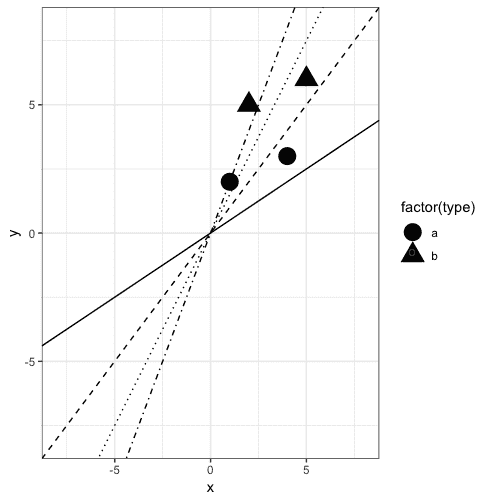

然而，如果我们稍微调整一下直线，使其与图形的 `y` 轴交点位于图中心的上方，那么我们就可以找到一条在两类数据点之间的最佳拟合线。这就是偏置函数的作用。它通过调整截距点，允许我们找到更合适的拟合线：

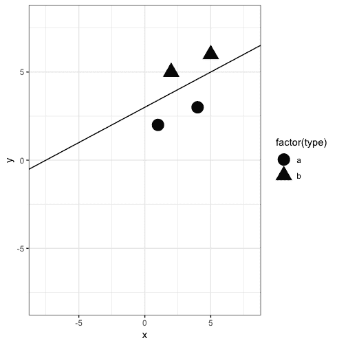

偏置函数是一个系数，它通过这种方式调整`x`轴上的直线，以应对数据要求直线与*`y`*等于*`0`*且*`x`*可能等于*`5`*的情况。

所有加权单元和偏置函数的值在神经元内被求和，并在一个线性划分的空间中绘制。计算一个点相对于这条直线的位置，决定了神经元是否激活或开关，并继续向前发送信号，或者关闭。如果使用这种类型的函数作为阈值来确定传入信号的处理方式，这种神经网络被称为感知器，是最早的人工神经网络形式。

然而，随着神经网络的发展，越来越明显的是，使用线性模型来分离数据并不适用于所有情况。因此，现在有许多可以在神经元内执行的函数，以决定信号在通过时是否继续传递。这些门控函数被称为激活函数，因为它们模拟了大脑中神经元被触发激活并向连接的神经元发送信号或不发送信号的过程。此时，让我们探索一下可用的各种激活函数。

# 调查激活函数

激活函数是我们尚未深入探讨的神经网络的最后一部分。回顾我们到目前为止所知道的，在神经网络中，我们从输入开始，就像我们在任何机器学习建模任务中一样。这些数据包括我们希望预测的目标变量（依赖变量），以及用于此预测任务的任意数量的独立预测变量。

在训练过程中，独立变量在模拟神经元中被加权并组合。此步骤还会应用偏置函数，并将此常数值与加权后的独立变量值结合。在此时，一个激活函数会评估这些值的聚合，如果聚合值超过设定的阈值限制，那么神经元就会被激活，信号将传递给其他隐藏层（如果存在），或者传递到输出节点。

我们来考虑最简单的激活函数——Heaviside 或二元阶跃函数。这可以通过视觉化的方式想象为两条水平线，它们作为阈值限制，位于一条垂直线的两侧，将数据分割，形成像阶梯一样的形状。如果值处于 1 的水平线上，那么信号会继续传递；否则，神经元就不会激活。我们之前也提到过，如何在这一步使用一条对角线来线性地分离点。当这些简单的激活函数无法分离数据点时，我们可以使用非线性的替代函数，接下来我们将介绍这些函数。

# 探索 sigmoid 函数

Sigmoid 函数是经典的 S 型函数。这种函数特别适用于逻辑回归任务。尽管大多数结果会通过曲线两侧的尾部进行分类，但曲线中间有一个区域，用于捕捉部分数据的不确定性。这种形状的缺点是，在极端位置，梯度几乎为零，因此随着数据点向两侧移动，模型可能无法继续学习。

Sigmoid 函数还包含一个导数值，这意味着我们可以将该函数与反向传播一起使用，在变量通过额外层之后更新权重。我们将在本章的最后部分更详细地探讨反向传播。

Sigmoid 函数的另一个优点是它将值限制在 0 和 1 之间，从而使值方便地被限定。

`sigmoid`函数可以通过 R 代码简单地定义：

```py
sigmoid = function(x) {
  1 / (1 + exp(-x))
}
```

在这个函数中，我们可以看到动态值是负`x`的指数。

让我们在`-10`到`10`之间的数值序列上使用这个 Sigmoid 函数：

1.  首先，我们将创建一个包含两列的`tibble`。一列将包含数值序列，另一列将使用将这些数值序列作为参数传递给`sigmoid`函数后的结果：

```py
vals <- tibble(x = seq(-10, 10, 1), sigmoid_x = sigmoid(seq(-10, 10, 1)))
```

1.  接下来，我们使用`ggplot()`函数设置图形的基础，通过传入数据对象并定义用于`X`轴和`Y`轴的值。在这个例子中，我们使用`-10`到`10`之间的数值序列作为`X`轴的值，使用将这些数值传递到 sigmoid 函数后的结果作为`Y`轴的值：

```py
p <- ggplot(vals, aes(x, sigmoid_x))
```

1.  现在我们将添加数据点，并使用`stat_function`特性将这些点连接起来，展示出 S 型曲线的形状：

```py
p <- p + geom_point()
p + stat_function(fun = sigmoid, n = 1000)
```

如果我们现在观察这个形状，我们可以理解为什么这种激活函数在逻辑回归中表现得如此出色。通过使用`sigmoid`函数来转换我们的数值，大多数数值已经被推近到`0`或`1`的极端位置：

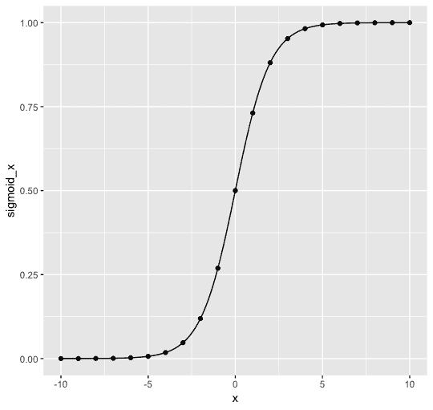

# 研究双曲正切函数

双曲正切函数，也称为**tanh**，与 sigmoid 函数非常相似；然而，曲线的下限位于负数区域，更适合处理包含负值的数据。

除了这一点，双曲正切函数与 sigmoid 函数其他方面完全相同，和 sigmoid 函数一样，双曲正切函数也包含导数元素，可以与反向传播一起使用。

由于 tanh 的值在`-1`到`1`之间，它的梯度较大，导数更加明显。被限定的特点使得 tanh 围绕`0`中心，这对于具有大量隐藏层的模型来说是有利的，因为层之间的结果更容易被下一个层使用。

让我们使用相同的数值序列，并绘制通过双曲正切函数转换后的值，该函数是 R 的基础函数之一，可以通过`tanh()`调用：

1.  如我们在前面的 sigmoid 示例中所做的，我们将创建一个`tibble`，其中包含我们的数值序列及其转换后的值：

```py
vals <- tibble(x = seq(-10, 10, 1), tanh_x = tanh(seq(-10, 10, 1)))
```

1.  然后，我们通过将数据集以及用于`x`轴和`y`轴的值传递给`ggplot()`函数，来设置我们绘图的基础：

```py
p <- ggplot(vals, aes(x, tanh_x))
```

1.  最后，我们再次添加我们的点，并使用`stat_function`功能来连接这些点并显示我们的形状：

```py
p <- p + geom_point()
p + stat_function(fun = tanh, n = 1000)
```

观察这个形状时，我们可以看到它与我们刚才绘制的 sigmoid 形状非常相似；然而，请注意，`y`轴现在的范围是`-1`到`1`，而不是 sigmoid 形状中的`0`到`1`。因此，值被推向极端，负值在转换后仍然是负值：

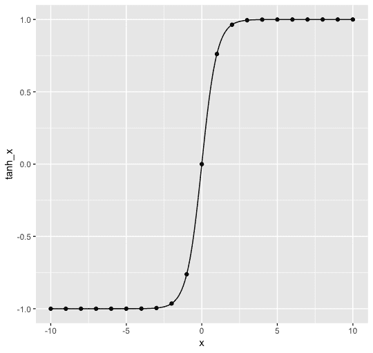

# 绘制整流线性单元激活函数

**整流线性单元**（**ReLU**）是一个混合函数，对于正值的`x`，它拟合一条直线，而对于任何负值的`x`，它将其赋值为 0。尽管该函数的一半是线性的，但它的形状是非线性的，并且具有非线性的所有优点，例如可以使用导数进行反向传播。

与前两个激活函数不同，ReLU 没有上限。这种没有约束的特性有助于避免 sigmoid 或 tanh 函数的问题，即在极值附近梯度变得非常平缓，提供的信息很少，无法帮助模型继续学习。ReLU 的另一个主要优点是它会导致神经网络的稀疏性，因为在中心点附近有掉头现象。使用 sigmoid 或 tanh 时，函数的零值输出非常少，这意味着激活函数会触发，从而导致网络密集。相比之下，ReLU 会产生更多的零输出值，导致更少的神经元触发，从而形成一个更稀疏的网络。

ReLU 比 sigmoid 和 tanh 学习得更快，因为它的简单性。ReLU 函数比 sigmoid 或 tanh 产生更多的零值，这将提高训练过程的速度；然而，由于我们不再知道这些点的未修改值，它们不能在之后的反向传播中更新。如果权重需要在反向传播过程中调整以传递相关信息，这可能会成为一个问题；然而，一旦导数被设置为零，就无法再进行调整。

让我们编写一些代码来可视化 ReLU 函数：

1.  首先，我们将定义这个函数。它简单地定义为，如果`x`的值大于 0，那么它将`x`设置为`y`，并创建一个斜率为`1`的直线；否则，它将`y`设置为`x`，并在`x`轴上创建一条水平线。可以这样编码：

```py
relu <- function(x){dplyr::if_else(x > 0, x, 0)}
```

1.  接下来，让我们再次使用之前相同的数字序列创建数据集，并将该序列通过我们的 ReLU 函数后得到的转换值：

```py
vals <- tibble(x = seq(-10, 10, 1), relu_x = relu(seq(-10, 10, 1)))
```

1.  最后，让我们绘制这些点并连接它们，以展示该激活函数的形状：

```py
p <- ggplot(vals, aes(x, relu_x))
p <- p + geom_point()
p + geom_line() 
```

现在，当我们观察这个形状时，可以看到它的优点。没有上界为模型提供了比 sigmoid 更多的信息，因为 sigmoid 在极端值附近的梯度变得非常微小。此外，将所有负值转换为`0`会导致神经网络更加稀疏，从而加快训练速度：

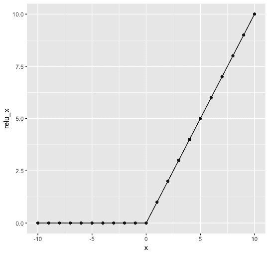

# 计算 Leaky ReLU 激活函数

ReLU 的一个潜在问题是**死亡 ReLU**，由于该函数对所有负值赋值为零，因此信号在到达输出节点之前可能会完全丢失。解决这个问题的一种方法是使用 Leaky ReLU，当数值为负时，赋一个小的 alpha 值，从而避免信号完全丢失。应用这个常数后，本应为零的值现在有了一个小的斜率。这可以防止神经元完全失效，使得信息仍然能够传递，从而改善模型。

让我们创建一个简单的 Leaky ReLU 激活函数示例：

1.  我们从定义函数开始。我们将以与 ReLU 函数完全相同的方式进行操作，不同之处在于，我们不是将所有负值赋值为`0`，而是乘以一个常数以提供一个小的斜率：

```py
leaky_relu <- function(x,a){dplyr::if_else(x > 0, x, x*a)}
```

1.  然后，我们创建包含我们在这些示例中使用的数值序列的数据集，以及转换后的值：

```py
vals <- tibble(x = seq(-10, 10, 1), leaky_relu_x = leaky_relu(seq(-10, 10, 1),0.01))
```

1.  最后，我们绘制这些点来展示这个激活函数的形状：

```py
p <- ggplot(vals, aes(x, leaky_relu_x))
p <- p + geom_point()
p + geom_line() 
```

当我们查看这个形状时，我们可以理解为什么有时这种替代 ReLU 的方法更可取。对于负值的*`x`*拥有轻微的斜率可以解决死亡 ReLU 问题，在该问题中，神经网络变得过于稀疏，缺乏足够的数据来围绕预测收敛：

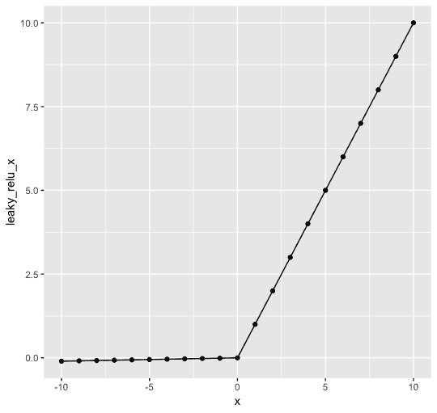

# 定义 swish 激活函数

Swish 是一种较新开发的激活函数，旨在发挥 ReLU 的优势，同时解决它的一些缺点。Swish 与 ReLU 一样，具有下界且没有上界，这是其优势，因为它仍然可以使神经元失效，同时防止数值被迫收敛到上界。然而，与 ReLU 不同的是，下界仍然是曲线形的，更值得注意的是，这条线是非单调的，这意味着当`x`值减小时，`y`值可以增加。这是一个重要的特点，可以防止死亡神经元问题，因为导数可以在迭代中继续调整。

让我们来研究这个激活函数的形状：

1.  让我们像在其他示例中一样，首先定义函数。这个公式简单地接受一个值，并将其乘以通过 sigmoid 函数传递相同值的结果：

```py
swish <- function(x){x * sigmoid(x)}
```

1.  接下来，我们将再次创建我们的数据集，使用之前已经使用过的相同值序列，并附上对应的转换值集合：

```py
vals <- tibble(x = seq(-10, 10, 1), swish_x = swish(seq(-10, 10, 1)))
```

1.  最后，我们可以绘制这些点，展示这个函数的形状：

```py
p <- ggplot(vals, aes(x, swish_x))
p <- p + geom_point()
p + geom_line()
```

当我们观察这个形状时，会发现它像 ReLU 一样有下界，但没有上界；然而，与 ReLU 及其他激活函数不同，它是非单调的——也就是说，我们可以看到当`x`为负时，`y`的值先减小后增大。这个特性已经证明在神经网络逐渐加深时尤其有益：

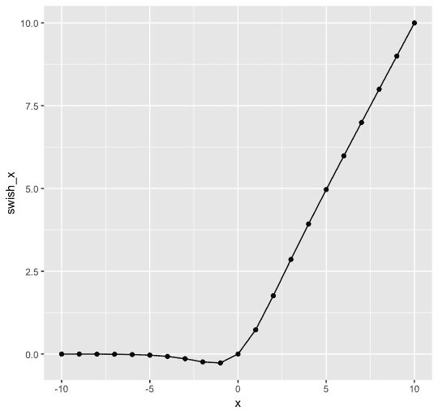

# 使用 softmax 预测类别概率

当有多个目标变量时，`softmax()`函数是必需的。Softmax 将计算输入变量属于每个类别的概率。计算出这些结果后，可以用来将输入行分配到可能的目标类别之一。让我们通过一个略有不同的示例来探索这个激活函数：

1.  我们将从定义函数开始：

```py
softmax <- function(x) {exp(x) / sum(exp(x))}
```

1.  接下来，让我们将一个值的向量传递给函数：

```py
results <- softmax(c(2,3,6,9))
results

[1] 0.0008658387 0.0023535935 0.0472731888 0.9495073791
```

1.  让我们确认这些转换后的值的总和等于`1`：

```py
sum(results)

[1] 1
```

我们可以看到这个函数将接受一组值，并计算每个值是我们试图预测的值的概率，以便所有概率的总和为`1`。这可以用来从多个可能的值中选择最可能的一个，作为给定目标的预测值。

# 创建一个前馈网络

在理解神经网络的基础上，我们将构建一些简单的示例。首先，我们将创建自己需要的函数，以便创建一个非常简单的神经网络，从而更好地理解建模过程中发生了什么。然后，我们将使用`neuralnet`包，利用一个简单的数据集构建一个神经网络来解决一个任务。

# 使用 Base R 编写神经网络

在这个示例中，我们将使用 Base R 从头开始创建一个非常简单的神经网络，以便更好地理解每个步骤发生了什么。为了完成这个任务，我们将执行以下操作：

+   定义我们模型中神经元的激活函数

+   创建一个函数，显示每次学习权重后的线条

+   制作一些测试数据并绘制这些数据值

+   使用前一次尝试的结果更新权重

我们将使用以下步骤来实现：

1.  首先，我们编写 Heaviside（二进制）阶跃激活函数作为开始。我们会回忆一下这个函数的工作原理，它评估输入值，如果该值大于零，则函数的输出值为`1`；否则，输出值为`0`。我们可以使用以下代码行将这个逻辑转化为代码：

```py
artificial_neuron <- function(input) {  as.vector(ifelse(input %*% weights > 0, 1, 0)) 
}
```

1.  接下来，我们可以创建一个绘制直线的函数，首先使用随机权重，然后随着迭代并更新传递给曲线函数的表达式部分的值，最终使用学习到的权重，如下所示：

```py
linear_fits <- function(w, to_add = TRUE, line_type = 1) {curve(-w[1] / w[2] * x - w[3] / w[2], xlim = c(-1, 2), ylim = c(-1, 2), col = "black",lty = line_type, lwd = 2, xlab = "Input Value A", ylab = "Input Value B", add = to_add)}
```

在表达式方程中，我们可以看到一切都相对于`x`。在这种情况下，如果我们仅仅运行`curve((x))`，那么我们将得到一条 45 度的直线，这样`x`和`y`总是相等，且直线的斜率为`1`。在前面的代码中，我们使用权重来改变相对于`x`的直线斜率。剩下的部分只是定义了图像和直线，`add`参数用于声明通过曲线函数生成的新直线是否应添加到现有的图像中。

1.  在定义了这些函数后，我们现在可以为输入、输出、学习率和权重分配一些初始值。输入值是一组`x`和`y`坐标，并且包含一个常数值。输出值只是二进制标志，在此情况下表示输入变量是否为目标类的成员。最后，一些随机权重被用来初始化模型，同时还包括一个学习率，用于在每次迭代时更新权重：

```py
input <- matrix(c(1, 0,
                 0, 0,
                  1, 1,
                  0, 1), ncol = 2, byrow = TRUE)  
input <- cbind(input, 1) 
output <- c(0, 1, 0, 1)
weights <- c(0.12, 0.18, 0.24)
learning_rate <- 0.2
```

1.  接下来，我们可以添加我们的第一条线，这条线是通过使用随机权重以及我们的输出点来进行猜测的。我们希望得到一条完全二分目标类的两个点和非目标类的两个点的直线。首先，我们将初始的随机权重应用到`linear_fits()`函数中的表达式方程，创建一个初始的斜率。`points()`函数通过为属于目标类的两个点绘制方形标记，为不属于该类的点绘制圆形标记，来添加我们的点：

```py
linear_fits(weights, to_add = FALSE)
points(input[ , 1:2], pch = (output + 21))
```

从下面这个由前面的代码生成的图像中我们可以看出，这第一条线与二分这两类数据相差甚远：

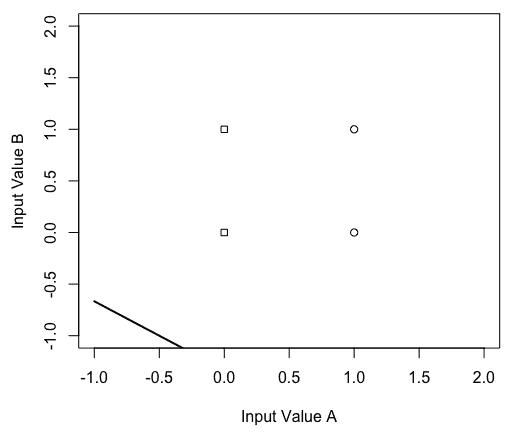

1.  现在，我们将开始通过使用相应的输入和输出值来更新权重。首先，权重通过学习率进行更新。这个数字越小，变化就越平缓。它与目标类值减去人工神经元函数结果的乘积相乘，该结果仍然是`0`或`1`，因为我们使用的是二值步进激活函数以及输入的初始值。然后，再次使用`linear_fits()`函数绘制一条新的直线：

```py
weights <- weights + learning_rate * (output[1] - artificial_neuron(input[1, ])) * input[1, ]
linear_fits(weights)
```

使用`linear_fits()`函数，我们创建了一条更接近于二分这两类数据的直线，但它还没有完全按照我们希望的方式划分这些点：

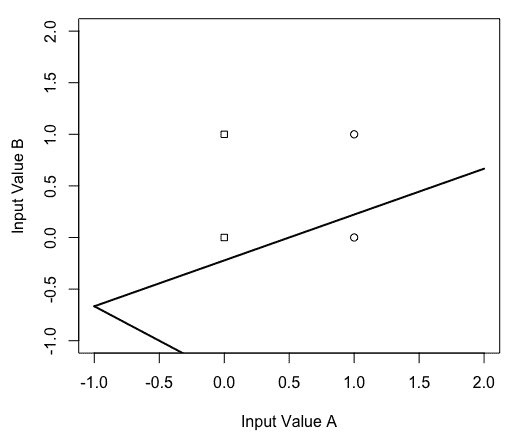

1.  这个相同的操作对剩余的输入和输出值重复进行。由于我们将看到，这条线解决了问题，并找到了一个能够分离两类的斜率，因此在最后的图表中使用了不同的线型。接下来绘制第三条线：

```py
weights <- weights + learning_rate * (output[2] - artificial_neuron(input[2, ])) * input[2, ]
linear_fits(weights)
```

在这里，第三行与第二行完全重合：


1.  下列代码用于绘制第四条线：

```py
weights <- weights + learning_rate * (output[3] - artificial_neuron(input[3, ])) * input[3, ]
linear_fits(weights)
```

第四条线偏离了第二条和第三条线更远，未能很好地将点分开：

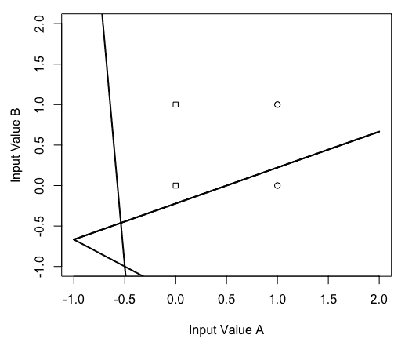

1.  最后一条线是通过以下代码生成的：

```py
weights <- weights + learning_rate * (output[4] - artificial_neuron(input[4, ])) * input[4, ]
linear_fits(weights, line_type = 2)
```

我们看到虚线成功地将方形点和圆形点分开：

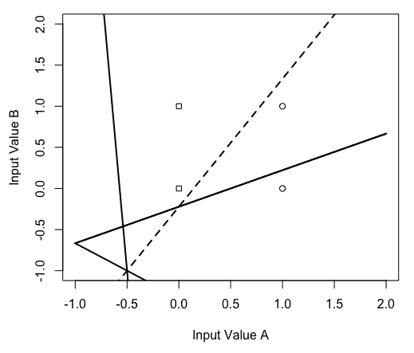

在这个最小示例中，我们可以看到在拟合神经网络时发生了什么。该模型试图像其他机器学习模型一样将不同类别的变量分开。在这个过程中，每次迭代时，权重会根据神经元是否激活以及学习率值引入的常数变化进行更新。通过这一过程，目标是减少错误率。在本示例中，我们没有定义正式的错误率，因为我们可以清楚地看到当线条成功地分开类别时的效果。在下一个示例中，我们将不再关注底层数学，而是着重于使用一个开源数据集优化一个稍微复杂一些的神经网络。

# 使用威斯康星癌症数据创建模型

在这个示例中，我们将使用来自威斯康星大学的乳腺癌数据集。有关该数据集的详细信息，可以在 UCI 机器学习库的[`archive.ics.uci.edu/ml/datasets/breast+cancer+wisconsin+%28diagnostic%29`](http://archive.ics.uci.edu/ml/datasets/breast+cancer+wisconsin+%28diagnostic%29)中找到。

1.  数据集可以通过以下代码加载：

```py
library(tidyverse)

wbdc <- readr::read_csv("http://archive.ics.uci.edu/ml/machine-learning-databases/breast-cancer-wisconsin/wdbc.data", col_names = FALSE)
```

1.  加载数据后，我们将通过将包含两个字符值的列转换为数值数据类型，来对目标变量进行编码，以表示是否存在恶性迹象。对于这种类型的神经网络，我们需要所有值都是数字类型，包括目标变量：

```py
wbdc <- wbdc %>%
  dplyr::mutate(target = dplyr::if_else(X2 == "M", 1, 0)) %>%
  dplyr::select(-X2)
```

1.  接下来，我们将对所有预测变量进行缩放和标准化。正如我们提到的，所有数据必须是数字类型，以便神经网络使用，通过缩放和标准化数据，我们将提高性能，因为这会将激活函数的值约束在相同的范围内：

```py
wbdc <- wbdc %>% dplyr::mutate_at(vars(-X1, -target), funs((. - min(.))/(max(.) - min(.)) ))
```

1.  接下来，我们将进行训练和测试数据的划分，就像在我们的机器学习示例中一样。我们将在此步骤中使用`X1`中的 ID 列来拆分数据；不过，之后我们可以删除这一列。这里，我们将采用`tidyverse`方法来简化过程：

```py
train <- wbdc %>% dplyr::sample_frac(.8)
test  <- dplyr::anti_join(wbdc, train, by = 'X1')

test <- test %>% dplyr::select(-X1)
train <- train  %>% dplyr::select(-X1)
```

1.  我们的最后一步数据准备是从测试数据集中提取所有实际的正确响应，然后将这一列从测试数据集中移除。这个值的向量将用于在建模后计算性能：

```py
actual <- test$target
test <- test %>% dplyr::select(-target)
```

数据现在已经完全准备好，可以用于神经网络建模。

1.  接下来，我们需要为`neuralnet`包创建公式语法，其中包含一个因变量`~`。这与 R 中拟合线性模型的语法类似。所有自变量可以通过`+`符号连接起来；然而，当自变量有很多时，写出每一列的名称会非常繁琐，即使在这个例子中，列名只是 X 后跟一个数字。幸运的是，有一种方法可以加速这个过程，我们将在接下来的步骤中使用它。首先，我们将获取训练集中所有列的名称，然后使用 paste 和 collapse 来创建自变量的字符串，将它们放在公式中因变量的另一侧：

```py
n <- names(train)
formula <- as.formula(paste("target ~", paste(n[!n == "target"], collapse = " + ", sep = "")))
```

1.  使用这组数据，我们现在可以拟合我们的模型。在这个例子中，我们将保持模型相对简单，只使用这个函数可用的一些参数。具体来说，我们包括了刚刚创建的公式，定义了因变量和自变量。接下来，我们指出模型将拟合训练数据。选择正确的层数和每层单元数涉及到尝试几种组合并比较性能。在这个例子中，我们从两层开始，每层的单元数大约是变量数的一半。最后，我们注意到激活函数应该是逻辑函数，也就是 sigmoid 函数，并且我们不进行线性运算：

```py
net <- neuralnet::neuralnet(formula,
                 data = train,
                 hidden = c(15,15),
                 linear.output = FALSE,
                 act.fct = "logistic"
                 )
```

1.  模型建模过程完成后，我们现在可以使用我们的模型进行预测。使用`neuralnet`包，我们通过`compute()`函数来生成这些预测值：

```py
prediction_list <- neuralnet::compute(net, test)
```

1.  当我们通过`compute()`函数传递模型和测试数据集时，返回的是一个列表。该列表包含了模型中神经元的详细信息以及预测值。在这种情况下，我们只需要预测值，因此我们将从列表中提取这些值。此外，我们还将创建一组二进制预测。二进制预测是通过将预测概率大于`0.5`的值设置为`1`来生成的；否则，值将设置为`0`。我们将使用每一组预测进行两种不同的模型评估方法：

```py
predictions <- as.vector(prediction_list$net.result)
binary_predictions <- dplyr::if_else(predictions > 0.5, 1, 0)
```

1.  使用我们的二进制预测，我们可以轻松计算基本的模型准确性——也就是说，我们将求出二进制预测值与实际值匹配的案例数，并将这个数字除以实际值的总数：

```py
sum(binary_predictions == actual)/length(actual)
```

在这里，我们看到准确率为 92.98%，所以我们的基本神经网络在这个数据上表现得相当好。

1.  我们还可以通过使用混淆矩阵来查看准确度值的分解。生成混淆矩阵的最简单方法是使用`confusionMatrix()`函数，它是`caret`包的一部分。该函数需要一个包含预测值和实际值的表作为参数。在这种情况下，我们需要使用我们的二元预测，因为结果需要适应四种类别之一，因此不允许更高的粒度级别。

```py
results_table <- table(binary_predictions, actual)
library(caret) 
caret::confusionMatrix(results_table)

# Confusion Matrix and Statistics
# 
# actual
# binary_predictions  0  1
# 0 67  2
# 1  1 44
# 
# Accuracy : 0.9737         
# 95% CI : (0.925, 0.9945)
# No Information Rate : 0.5965         
# P-Value [Acc > NIR] : <2e-16         
# 
# Kappa : 0.9451         
# Mcnemar's Test P-Value : 1              
# 
# Sensitivity : 0.9853         
# Specificity : 0.9565         
# Pos Pred Value : 0.9710         
# Neg Pred Value : 0.9778         
# Prevalence : 0.5965         
# Detection Rate : 0.5877         
# Detection Prevalence : 0.6053         
# Balanced Accuracy : 0.9709         
# 
# 'Positive' Class : 0        
```

1.  调用此函数后，我们会看到提供了一个包含结果的二维网格。混淆矩阵将我们的预测分为以下四种结果：

+   **真阳性**：值为`1`被正确预测为`1`。实际测试目标变量包含我们预测的值，我们正确地预测了它。

+   **I 型错误**：值为`0`被错误预测为`1`。实际测试目标变量不包含我们预测的值；然而，我们预测它会包含。也被称为假阳性。

+   **II 型错误**：值为`1`被错误预测为`0`。实际测试目标变量确实包含我们预测的值；然而，我们预测它不会包含。也被称为假阴性。

+   **真阴性**：值为`0`被正确预测为`0`。实际测试目标变量不包含我们预测的值，我们正确地预测了它不会包含。

它还包括一些其他的统计度量，这些超出了本章的范围；然而，我们可以注意到，准确度被包含在内，并且该值与我们刚才自己计算的值相匹配。

除了使用二元预测计算准确度外，我们还可以使用我们的概率值，从而考虑到每个结果的确定性程度。为了使用这些值衡量性能，我们将使用 AUC（曲线下面积）得分。它比较了真实阳性案例的概率与假阳性案例的概率。最终结果是一个衡量正值为正且负值为负的信心值，或者在本例中，衡量负值不会被高置信度错误标记为正值。

1.  为了计算 AUC 得分，我们可以使用`auc()`函数，它是`Metrics`包的一部分。该函数接受两个参数——一个实际值向量和一个预测概率向量，该向量表示根据模型对该行独立变量的解释，一个记录应被分类为目标变量的概率：

```py
library(Metrics)
Metrics::auc(actual, predictions)
```

AUC 得分为 0.987，甚至比之前计算的准确度得分还要强。

该模型已经在使用该数据集解决预测任务方面表现得非常好；然而，我们现在将尝试添加一个反向传播步骤，看看是否可以进一步提高性能。

# 增强我们的神经网络，采用反向传播

到此为止，我们已经有了一个可运行的神经网络。对于这个简单的示例，我们将加入神经网络的一个附加特性，这个特性可以提高性能，那就是反向传播。神经网络可以通过将变量与值相乘，从而在经过隐藏层时对变量进行加权，学习去解决任务。反向传播步骤允许模型回溯各层，并调整在先前步骤中学习到的权重。

1.  在实际操作中，这一步是相当直接的实现。我们只需声明将使用反向传播算法，并指明学习率，学习率控制着权重调整的幅度。通常，这个学习率值应该非常低。

在以下示例中，我们需要做以下几步：

+   `threshold` 值和 `stepmax` 值必须进行调整，因为使用默认值时模型未能收敛。

+   `threshold` 参数定义了误差率必须达到的值，模型才会停止；而 `stepmax` 参数定义了模型在停止前将运行的迭代次数。

通过更改这些值，你可以编程让模型运行得更久，或者更早停止，如果在收敛时遇到错误，这两者都会有所帮助：

```py
bp_net <- neuralnet::neuralnet(formula,
                    data = train,
                    hidden = c(15,15),
                    linear.output = FALSE,
                    act.fct = "logistic",
                    algorithm = "backprop",
                    learningrate = 0.00001,
                    threshold = 0.3,
                    stepmax = 1e6
)
```

1.  运行这个新版本的模型后，我们可以重新运行相同的步骤来评估性能。首先，我们将在新模型上运行 `compute` 以获得新的预测值。我们将再次创建一个包含概率和二元预测的向量，并且作为第一步，我们将创建二元预测值和实际值的表格，并将其传递给 `confusionMatrix()` 函数。由于 `confusionMatrix()` 函数的输出已经包括了准确率，因此这次我们跳过计算准确率：

```py
prediction_list <- neuralnet::compute(bp_net, test)
predictions <- as.vector(prediction_list$net.result)
binary_predictions <- dplyr::if_else(predictions > 0.5, 1, 0)
results_table <- table(binary_predictions, actual)
caret::confusionMatrix(results_table)
```

1.  我们的准确率有所提高，从 92.98% 增加到 94.74%。现在，让我们检查一下我们的 AUC 得分。同样，我们只需将实际值和预测概率传递给 `auc()` 函数：

```py
Metrics::auc(actual, predictions)
```

我们的 AUC 得分有所提高，从 0.987 增加到 0.993，因此我们可以看到，反向传播确实提高了模型性能。

话虽如此，在这一步骤中究竟发生了什么呢？

+   反向传播步骤取误差率的导数，并利用此导数根据结果更新权重。

+   导数只是当前权重对误差率影响的变化率。所以，如果导数率为 `7`，那么改变权重一个单位将导致误差率变化 7 倍。

+   仅使用前馈神经网络，我们可以根据最终的导数值更新初始权重；然而，使用反向传播时，我们可以在每个神经元上更新权重。

+   通过利用先前的变化如何影响导数的信息，这一步要么增加，要么减少权重。

+   学习率的应用确保了变化不会剧烈，而是平稳和逐步进行。这个过程可以持续，直到误差率最小化。

# 总结

在这一章中，我们了解到，深度学习与其他机器学习算法的区别在于使用了多个隐藏层。这个由人工神经元组成的隐藏层网络被设计成模拟我们大脑处理输入信号以解读环境的方式。隐藏层中的单元接收所有独立变量，并对这些变量应用一定的权重。通过这种方式，每个神经元以不同的方式对输入值的组合进行分类。

从高层次理解这种机器学习架构后，我们深入探讨了使用这种方法将输入转换为预测的实际过程。我们讨论了各种激活函数，它们作为每个神经元的“门”，决定是否将信号传递到下一层。随后，我们构建了两个前馈神经网络——一个使用基础 R 语言以便更好地理解发生了什么，另一个则在更大的数据集上使用`neuralnet`包。最后，我们应用了反向传播步骤，进一步改进了我们的模型。

如前所述，人工神经网络是更复杂的深度学习的基本构建块，现在我们已经掌握了这一理解，接下来将在下一章创建用于图像识别的卷积神经网络。
