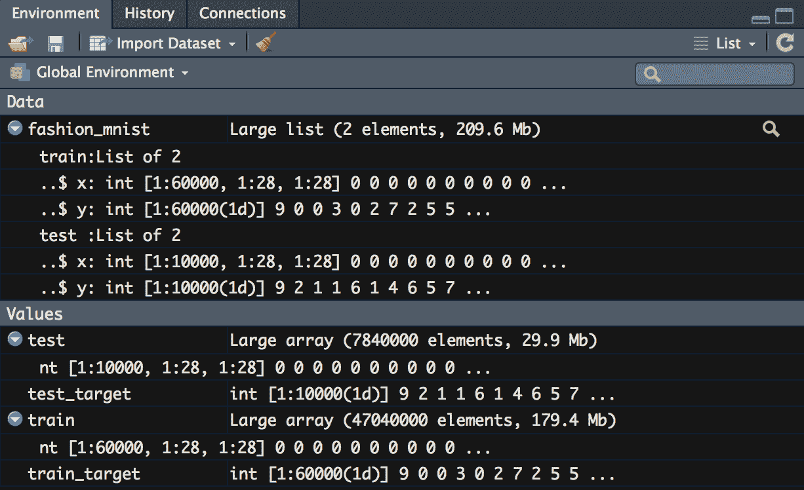

# 第四章：CNNs 用于图像识别

在本章中，您将学习如何使用**卷积神经网络**（**CNNs**）进行图像识别。卷积神经网络是神经网络的一种变体，特别适合图像识别，因为它们考虑了空间中数据点之间的关系。

本章将介绍卷积神经网络如何与我们在上一章创建的基本前馈全连接神经网络有所不同。主要区别在于，CNN 中的隐藏层并非全部是全连接的密集层——CNN 包括一些特殊层。其中之一是卷积层，它在图像空间周围卷积一个滤波器。另一个特殊层是池化层，它减少输入的大小，并仅保留特定的值。我们将在本章稍后的部分深入探讨这些层。

在我们学习这些概念时，我们会看到它们为何在图像识别中如此重要。当我们思考图像分类时，我们知道需要在像素阵列中检测模式，并且邻近的像素对于寻找特定形状非常重要。通过了解卷积层，您将知道如何根据您的图像数据调整滤波器或镜头以检测不同的模式。您还将学习如何根据数据的大小调整池化层，以帮助使模型运行得更高效。

具体来说，本章将覆盖以下主题：

+   使用浅层网络进行图像识别

+   使用卷积神经网络进行图像识别

+   通过适当的激活层增强模型

+   选择最合适的激活函数

+   使用 dropout 和早期停止选择最佳 epochs

# 技术要求

您可以在[`github.com/PacktPublishing/Hands-on-Deep-Learning-with-R`](https://github.com/PacktPublishing/Hands-on-Deep-Learning-with-R)上的 GitHub 链接找到本章的代码文件。

# 使用浅层网络进行图像识别

图像分类器可以在不使用深度学习算法和方法的情况下创建。为了演示，让我们使用**Fashion MNIST**数据集，它是 MNIST 手写数据集的替代品。MNIST 的名字代表**修改版国家标准与技术研究所**数据库，正如名称所示，它是由国家标准与技术研究所创建的原始数据集的修改版。MNIST 是一系列手绘数字，而 Fashion MNIST 使用的是不同类型服装的小图像。数据集中的服装被标注为十个类别之一。Fashion MNIST 与国家标准与技术研究所无关，但由于 MNIST 作为图像识别的数据库广为人知，所以名称得以延续。

由于这个数据集不大，而且每个图像只有 28 x 28 像素，因此我们可以使用机器学习算法，例如`RandomForest`，来训练分类器。我们将训练一个非常简单的`RandomForest`模型，并取得令人惊讶的好结果；然而，在本章的最后，我们将讨论为什么这些结果在数据集变大以及单个图像变大时无法扩展。我们现在将使用传统的机器学习方法编写我们的图像识别模型：

1.  我们将从加载`tidyverse`套件包开始，如下所示的代码。在此情况下，我们只需要`readr`来读取数据；不过，我们稍后还会使用其他包。我们还将加载`randomForest`来训练我们的模型，并加载`caret`来评估模型的表现：

```py
library(tidyverse)
library(caret)
library(randomForest)
```

这里的代码不会向控制台返回任何值；但是，在 RStudio 环境中，我们会看到在包窗口旁边出现一个勾选标记，表示这些包已准备好使用。你的 Packages 面板应显示如下图，表明三个包中的两个已经加载完毕：


1.  接下来，我们将借助以下代码读取 Fashion MNIST 数据集的训练数据和测试数据：

```py
fm <- readr::read_csv('fashionmnist/fashion-mnist_train.csv')
fm_test <- readr::read_csv('fashionmnist/fashion-mnist_test.csv')
```

这段代码将在我们的环境中创建两个数据对象，分别名为`fm`和`fm_test`。环境面板应显示如下截图：


我们将使用`fm`来训练我们的模型。`fm`中的数据将用于计算沿树模型的分割权重。然后，我们将使用包含自变量值与目标变量关系的模型，利用自变量值预测`fm_test`数据的目标变量。

1.  接下来，我们将训练我们的模型。我们设置一个种子值以确保结果可复现，这样每次运行模型时我们都会得到相同的伪随机数，因此每次结果都相同。我们将标签转换为因子。标签在这里是一个介于`0`和`9`之间的整数；然而，我们不希望模型将这些值当作数值处理。相反，它们应该被视为不同的类别。除标签外，剩余的列都是像素值。我们使用`~`来表示我们将使用所有剩余的列（所有像素值）作为模型的自变量。我们将生成 10 棵树，因为这只是一个示例，展示了图像分类可以通过这种方式完成。最后，我们将在每次分割时随机选择 5 个变量。我们将使用以下代码以这种方式训练我们的`RandomForest`模型：

```py
set.seed(0)

rf_model <- randomForest::randomForest(as.factor(label)~.,
data = fm,
ntree=10,
mtry=5)
```

当我们执行代码时，模型将开始运行，可能需要几分钟。在此期间，我们将无法在控制台执行任何代码。我们可以看到模型现在已经进入我们的环境。以下截图显示了模型对象中的一些细节：


我们可以使用这个模型对象来对新数据进行预测。

1.  然后，我们使用模型对测试数据集进行预测，并使用`ConfusionMatrix`函数来评估性能。以下代码将填充预测值的向量，并评估预测的准确性：

```py
pred <- predict(rf_model, fm_test, type="response")

caret::confusionMatrix(as.factor(fm_test$label), pred)

# Accuracy : 0.8457
```

上述代码将创建最后一个数据对象，它是一个向量，包含基于该数据集的独立变量训练的模型为每个案例预测的值。我们还在控制台打印了一些输出，包括性能指标。你收到的输出将如下所示：


这些指标是通过将测试数据集的实际目标变量与从测试数据中建模得到的预测值进行比较来计算的。

出乎意料的是，这个模型产生了不错的结果。我们已经达到了 84.6%的准确率。这表明，简单的方法可以适用于像这样的数据集；然而，随着数据量的增加，这种类型的模型表现会变得更差。

为了理解原因，我们首先需要解释图像如何作为数据存储用于建模。当我们查看灰度图像时，我们看到的是明暗不同的区域。实际上，每个像素都包含一个从 0 到 255 之间的整数，0 表示白色，255 表示黑色，中间的值则代表不同的灰度。这些数字被转换成音调，以便我们能可视化图像；然而，为了我们的目的，我们直接使用这些原始的像素值。在使用`RandomForest`进行建模时，每个像素值都会与其他图像进行单独比较；然而，这通常不是最理想的做法。通常，我们希望在每个图像内寻找更大的像素模式。

让我们来探讨如何创建一个只有一层的浅层神经网络。神经网络的隐藏层将使用所有输入值进行计算，以便考虑整个图像。为了演示，我们将这个问题设定为一个简单的二项分类问题，并使用与上一章类似的方法来创建我们的神经网络。如果你完成了上一章的内容，那么这将可能看起来很熟悉。完成上一章的内容不是先决条件，因为我们将在这里逐步讲解所有步骤：

1.  在开始之前，我们需要加载两个额外的库：`neuralnet`包用于训练我们的模型，`Metrics`包用于评估函数。特别是，我们稍后将使用 AUC 指标来评估我们的模型。通过运行以下代码行，可以加载这两个库：

```py
library(neuralnet)
library(Metrics)
```

这段代码不会在控制台中产生任何效果；但是，我们会在包面板中看到这些包的检查，表明它们已经准备好使用。你的包面板将显示如下截图：


1.  首先，我们将修改**target**列，使其成为一个简单的二元响应，而不是包含所有十个类别。这样做是为了保持这个神经网络的简洁，因为它只是为了创建一个基准，便于与后续的卷积神经网络（CNN）进行比较，并展示两种风格的神经网络编码方式的差异。这个筛选过程通过运行以下代码来实现：

```py
fm <- fm %>% dplyr::filter(label < 2)

fm_test <- fm_test %>% dplyr::filter(label < 2)
```

运行这段代码后，我们将看到数据对象的大小发生了变化，经过筛选后数据变小了。你应该能看到数据对象的观察值从原来的 60,000 和 10,000 分别减少到 12,000 和 2,000，如下图所示：


以这种格式的数据，我们现在可以继续编写代码，作为一个二分类任务。

1.  现在，使用以下代码，我们将从测试集中移除目标变量，并将其隔离到一个单独的向量中，以便稍后进行评估：

```py
test_label <- fm_test$label

fm_test <- fm_test %>% dplyr::select(-label)
```

运行这段代码后，你会注意到两个变化：`fm_test`对象中少了一个变量或列，并且新增了一个数据对象叫做`test_label`，它是一个包含`fm_test`对象中标签列值的向量。你的环境面板应该如下图所示：


我们之所以做出这个修改，是因为我们不希望在测试对象中包含标签。在这个对象中，我们需要将数据视为我们不知道真实类别的情况，这样我们可以尝试预测类别。然后，我们稍后会使用来自向量的标签来评估我们预测正确值的效果。

1.  接下来，我们将为我们的神经网络创建公式。使用`neuralnet`包中的`neuralnet`函数，我们需要将目标变量放在波浪号（`~`）的一侧，所有自变量则放在另一侧，并通过加号（`+`）连接。在以下代码中，我们将所有列名收集到一个向量`n`中，然后使用`paste`将这个向量中的每一项与加号连接起来：  

```py
n <- names(fm)
formula <- as.formula(paste("label ~", paste(n[!n == "label"], collapse = " + ", sep = "")))
```

运行这段代码后，我们可以在环境面板中看到变化。我们将看到向量`n`，它包含了所有列名，还有`formula`对象，它将因变量和自变量按照正确的格式放在一起。你的环境面板现在应该如下图所示：


我们运行前面的代码是为了创建这个`formula`对象，因为这是使用`neuralnet`包训练神经网络的要求。

1.  之后，我们可以编写代码来训练我们的模型。我们将设置一个种子以确保可复现性，就像我们在建模时总是做的那样。我们将包含一个隐藏层，单位数设为大约预测变量数量的三分之一。我们将`linear.output`参数设置为`false`，表示这是一个分类模型。我们还将激活函数设置为`logistic`，因为这是一个分类问题。我们将使用以下代码按照之前描述的方式训练我们的模型：

```py
set.seed(0)

net <- neuralnet::neuralnet(formula,
                            data = fm,
                            hidden = 250,
                            linear.output = FALSE,
                            act.fct = "logistic"
)
```

运行代码后，我们现在在环境面板中有一个新对象，包含了所有从训练模型中获得的细节，这些细节现在可以用来对新数据进行预测。你的环境面板中应该包含一个类似下面截图所示的模型对象：


现在我们已经运行了这段代码，我们有了一个模型，可以用它对我们的测试数据进行预测。

1.  最后，我们可以借助以下代码进行预测并评估我们的结果：

```py
prediction_list <- neuralnet::compute(net, fm_test)
predictions <- as.vector(prediction_list$net.result)

Metrics::auc(test_label, predictions)
```

运行这段代码将把准确度指标打印到控制台。你的控制台应该包含如下图像中的输出：


从这个输出结果来看，我们已经有了显著的提升。准确度现在达到了 97.487%。当像素值被联合考虑时，确实提高了结果。我们应该记住，这个模型只使用了两个目标变量，这些目标变量的选择可能也是准确度显著提升的原因之一。无论如何，在处理更大的图像时，将所有像素值输入激活函数并不高效。这就是卷积神经网络发挥作用的地方。它们能够通过观察较小的像素值组来寻找模式，并且还包含一种减少维度的方式。

现在，让我们来探索一下卷积神经网络与传统神经网络的区别。

# 使用卷积神经网络进行图像识别

卷积神经网络是一种特殊形式的神经网络。在传统神经网络中，输入作为向量传递到模型中；然而，对于图像数据，将数据以矩阵的形式排列更为有利，因为我们希望捕捉像素值在二维空间中的关系。

卷积神经网络能够通过一个滤波器来捕捉这些二维关系，滤波器在图像数据上进行卷积。滤波器是一个矩阵，具有固定的值和比图像数据更小的维度。这些常数值与底层值相乘，结果的乘积之和将通过激活函数进行处理。

激活函数步骤，也可以视为一个独立的层，用于评估图像中是否存在某个特定模式。在传统神经网络中，激活层决定输入值计算出的结果是否超过阈值，并将其传递到模型中。在卷积神经网络中，激活层的工作方式非常相似；然而，由于它使用矩阵乘法，因此能够评估数据中是否存在二维形状。

在激活层之后，数据会通过池化层进一步处理。池化层的功能是集中前一步骤捕获的信号，同时减少数据的维度。池化层将生成一个比输入数据更小的矩阵。通常会使用一个 2 x 2 的池化层，这样可以将输入数据的大小缩小一半。在这种情况下，每个 2 x 2 区域内的值通过某种聚合方式进行汇聚。这些值可以通过任何方式进行聚合，例如对值求和或取平均；然而，在大多数情况下，采用最大值，并将该值传递到池化层。

在前面的方法实现之后，处理并压缩后的图像数据会被扁平化，向前传递到一个基本上是传统神经网络的最后一步。让我们从这一最终步骤开始，因为我们已经熟悉使用传统神经网络进行建模。在这里，我们将看到两件事：首先，我们可以只通过最后这一步来训练图像数据模型；其次，尽管语法略有不同，但与使用 `neuralnet` 包训练这种模型相比，整体结构是可以识别的。

现在我们将使用 `keras` 包编写一个由全连接的密集隐藏层组成的神经网络：

1.  首先，我们将加载 `keras` 库以及该包自带的 Fashion MNIST 数据集。通过运行以下代码来完成这一操作：

```py
library(keras)

fashion_mnist <- dataset_fashion_mnist()
```

当我们运行前面的代码时，我们会看到将训练数据和测试数据一起存储在一个列表对象中。你的环境面板现在应该如下所示：


1.  接下来，我们可以将数据集拆分成各个部分。它被方便地设置为容易提取训练集、测试集和目标变量。在前面的代码中，我们使用的是已经预处理过的 Fashion MNIST 数据集，每个像素值都在单独的列中；然而，在接下来的代码中，我们将从一个 28 x 28 的大矩阵数组开始，演示如何将这些数据转换，使得每个图像的所有像素值都在同一行。这个过程的第一步是使用前面的代码将列表中的四个数据对象分离出来：

```py
train <- fashion_mnist$train$x
train_target <- fashion_mnist$train$y

test <- fashion_mnist$test$x
test_target <- fashion_mnist$test$y
```

当您现在查看环境窗格时，您将看到图像数据存储在 28 x 28 的矩阵中，目标变量存储在数组中的向量内。您的环境窗格将如下所示：



有了这种格式的数据，我们可以应用我们的卷积滤波器，我们很快就会这样做；然而，此时我们将编写一个密集的全连接神经网络，为了这样做，我们需要将所有数据转换为每个图像一行，而不是每个图像的二维矩阵。由于我们在编码卷积神经网络的不同阶段需要两种格式的数据，这是一个简单的转换过程，我们将在第六步完成。

1.  图像数据由介于`0`和`255`之间的像素值矩阵或矩阵组成。要用我们的神经网络处理这些数据，我们需要将这些值转换为介于`0`和`1`之间的浮点数。如下所示的代码，我们将使用`normalize()`便捷函数来实现这一结果，并使用`range()`函数来测试这些值现在是否在`0`和`1`之间：

```py
train <- normalize(train)
test <- normalize(test)

range(train)
```

运行此代码后，我们可能看不到环境窗格中数据对象的明显变化；然而，当我们运行`range()`函数时，我们可以看到所有值现在都在`0`和`1`之间。在对数据对象运行`range()`函数后，您的控制台输出将如下所示：


1.  现在我们可以开始使用`keras`语法来训练我们的模型。在下面的代码中，我们首先声明我们将创建一个序列模型，这意味着数据将依次通过每个后续层：

```py
set.seed(0)

model <- keras_model_sequential()
```

运行上述代码会初始化模型对象；然而，它尚未包含任何数据。您可以在环境窗格中看到这一点，它将如下所示：


1.  接下来我们要进行的步骤是卷积神经网络的最后步骤，代表了将数据转换为传统神经网络可以处理的方式的过程的一部分。第一步将是定义一个层，该层将从大量的矩阵中获取数据并将数据转换，使得给定图像的所有值都在一个单独的行中。为了做到这一点，我们使用`layer_flatten()`函数，并将矩阵形状作为参数传递，如下所示：

```py
model %>%
  layer_flatten(input_shape = c(28, 28))
```

前述代码和定义模型的其余步骤不会导致您的 R 环境中出现明显变化。此步骤向模型对象添加了一个层。该层将我们的数据展平，使得每个图像的数据都包含在一个单独的行中。

1.  我们将像之前一样包括一个隐藏层。在`keras`中实现这一点的方法是使用`layer_dense`函数。接着，我们指定隐藏层的单元数量，以及用于决定某个单元的信号是否应该传递的激活函数。在这种情况下，我们选择的单元数量大约是独立变量列总数的三分之一，并选择**整流线性单元**（**ReLU**）作为我们的激活函数：

```py
model %>%
  layer_dense(units = 256, activation = 'relu') 
```

同样，这一步也不会在环境中产生输出或显著变化。这将向模型中添加一个密集的全连接层，该层将包含 256 个单元或神经元，并将使用 ReLU 函数来确定哪些信号被传递。

1.  在以下代码中，我们有 10 个可能的目标类别，因此我们在输出层中包含了 10 个单元，每个类别对应一个单元。由于这是一个多项分类问题，我们使用`softmax`函数来计算任何给定的图像数据属于 10 个服装类别中的一个的概率：

```py
model %>%
  layer_dense(units = 10, activation = 'softmax')
```

这一行代码将向当前神经网络中添加最后一层。这将是我们的输出层，另一个密集的全连接层，其中单元数等于目标类别的数量。在这一步中，将使用`softmax`函数来确定给定数据集属于每个可能目标类别的概率。此步骤同样不会在 R 环境中产生输出或变化。

1.  在进入`compile`步骤之前，我们需要将目标向量转换为矩阵，这可以通过以下代码使用`to_categorical`函数简单实现：

```py
test_target <- to_categorical(test_target)
train_target <- to_categorical(train_target)
```

运行代码后，我们将在环境窗格中看到变化。之前是向量的`target`变量对象现在变成了矩阵，每行包含一个值，等于该行所属类别的索引点处的`1`。您的环境窗格现在将如下所示：


这一步是使用`keras`训练多项分类模型的要求。

1.  以下代码用于定义`compile`步骤的参数。在这里，我们选择了`optimizer`、`loss`和`evaluation`指标。`optimizer`是计算模型结果与实际值之间误差率的算法，用于调整权重。我们通过以下代码定义模型的编译部分：

```py
model %>% compile(
  optimizer = 'adam',   
  loss = 'categorical_crossentropy', 
  metrics = 'categorical_accuracy'   
)
```

在前面的代码中，我们做了以下操作：

+   我们选择了**自适应矩估计**（**Adam**）。损失函数是用于计算误差率的公式。

+   在处理像这样的多项分类问题时，最合适的损失函数是类别交叉熵，它是多类对数损失的另一种说法。

+   为了使用这个损失函数，目标变量必须以矩阵形式存储，这也是我们在上一步进行数据类型转换的原因。

+   metrics 参数存储用于评估模型性能的度量值，我们使用了类别准确率。

1.  此时，拟合模型的步骤只需要三个参数。我们传入训练数据集、训练数据的目标变量以及希望模型运行的次数。如下面的代码所示，我们此时选择 `10` 次周期，以便模型能快速运行；然而，如果您有时间让模型运行更长时间，您可能会得到更好的结果。使用以下代码在训练数据上训练神经网络：

```py
model %>% fit(train, train_target, epochs = 10
```

当我们运行这段代码时，控制台将打印出每个时期的结果。控制台输出将如下所示：


除了控制台输出外，前面的代码还生成了一张图，这是相同信息的图形表示。在您的**Viewer**窗格中，您将看到类似这样的图：


这两部分输出显示，我们的模型最初提升很大，随后在模型额外迭代后提升速度变得很慢。

1.  在此之后，我们可以在测试数据集上运行模型，并使用测试目标变量来评估我们的模型，如下截图所示。我们可以通过运行以下代码来计算损失和类别准确率度量，并打印出类别准确率度量：

```py
score <- model %>% evaluate(test, test_target)

score$categorical_accuracy
```

您应该会看到以下内容打印到控制台：


我们已经达到了 88.66% 的类别准确率。这比我们之前的准确率有所下降；然而，请记住，之前的准确率度量是针对二元响应的，而这个度量描述的是所有类别的预测。

1.  使用模型进行预测是通过 `predict()` 函数实现的。在以下代码中，`predict_classes` 可以用来选择基于概率分数最有可能的 10 个类别中的一个，而 `preds` 将计算这些概率：

```py
preds <- model %>% predict(test)

predicted_classes <- model %>% predict_classes(test)
```

运行前面的代码后，我们可以在**Environment**窗格中看到差异，其中包含两个新的数据对象。您的**Environment**窗格将如下所示：


我们可以看到，`preds` 是一个大型矩阵，包含每个类别的概率值，而 `predicted_classes` 是一个向量，其中每个值表示每个案例最可能的类别。

1.  最后，我们可以使用混淆矩阵来回顾我们的结果。为了运行这段代码，我们需要将测试目标标签以向量格式返回，而不是矩阵格式。为此，我们只需再次读取测试目标文件，如下所示：

```py
test_target_vector <- fashion_mnist$test$y

caret::confusionMatrix(as.factor(predicted_classes),as.factor(test_target_vector))
```

运行代码将生成一个评估度量输出并打印到控制台。您的控制台将如下所示：


我们的准确率实际上从 97.487%下降到了 88.66%。这部分是由于我们将模型的运行次数限制为 10 次，同时，也因为我们现在正在为 10 个类别构建分类器，而另一个得分是通过二分类器得到的。此时，改善准确率并不是首要任务。前面的代码只是用来展示如何使用`keras`语法编写神经网络。

在前面的代码中，在编译阶段，我们选择了一个优化器、损失函数和评估指标；然而，我们应该注意其他可选项以及它们之间的区别。我们将在接下来的部分中讨论这些内容。

# 优化器

让我们看看以下优化器：

+   **随机梯度下降**（**SGD**）：这是最简单的优化器。对于每个权重，模型会存储一个错误率。根据错误的方向（预测值是大于还是小于真实值），会应用一个小的学习率来调整权重，从而使下一轮结果的预测值朝着与错误方向相反的方向逐步调整。这个过程很简单，但对于深度神经网络来说，每次迭代的微调意味着模型可能需要很长时间才能收敛。

+   **动量**：动量本身并不是一个优化器，而是可以与不同优化器结合使用的一个方法。动量的概念是，它会取所有之前发生的修正的衰减平均值，并将这些值与当前步伐的修正结合使用。为此，我们可以想象动量就像一个物体从山坡上滚下来，然后利用自身的动量继续滚上另一座山。每一次的移动都会有一个力将物体拉回山坡下；然而，在一段时间内，继续上山的动量会强于将物体拉下山坡的力。

+   **Adagrad/Adadelta**：Adagrad 通过使用每个节点所有先前错误的矩阵来改进 SGD，而不是为所有节点使用统一的错误率；然而，使用这个值矩阵意味着学习率可能会在模型运行时间过长时被取消。Adadelta 是对 Adagrad 局限性的修正。Adadelta 利用动量来解决增长的错误率矩阵问题。

+   **RMSprop**：这是对 Adagrad 的另一种修正。它与 Adadelta 类似，然而，RMSprop 不仅通过每个节点的局部衰减平均错误率矩阵来除以学习率，还通过所有平方错误率的全局衰减平均来除以学习率。

+   **Adam**：该算法进一步修正并构建在之前的算法基础上。Adam 不仅包含 RMSprop 中看到的平方误差率的指数衰减平均值，还包含误差率（未平方）的指数衰减平均值，这就是动量。通过这种方式，Adam 或多或少就是带有动量的 RMSprop。两者的结合意味着存在类似于摩擦的动量修正，这减少了动量的效果，从而在许多情况下加速了收敛过程，使 Adam 成为撰写本文时非常流行的优化器。

# 损失函数

使用前述优化器时，你可以选择任意一个并尝试不同的算法，看看哪一个产生最好的结果。在损失函数方面，根据要解决的问题，有一些选择比其他选择更为合适：

+   `binary_crossentropy`：该损失函数用于分类问题，要求将输入数据分配给两个类别之一。如果输入数据可以属于多个类别而不仅仅是两个类别，这也可以使用。当一个案例可能属于多个类别时，每个目标类别将被视为一个独立的二元类别（针对每个目标类别，该案例是否属于该类别）。如果目标值在 0 和 1 之间，也可以用于回归问题。

+   `categorical_crossentropy`：分类交叉熵用于多类别分类问题，其中每一行输入数据只能属于两个以上的类别之一。如我们在二元交叉熵中提到的，为了使用分类交叉熵，目标向量必须转换为矩阵，以便每一行中与目标类别关联的索引的值为 1。如果目标向量包含应当被视为整数而非分类类别的整数，则可以使用`sparse_categorical_crossentropy`，无需执行分类交叉熵所需的矩阵转换。

+   MSE (**均方误差**)：均方误差是回归问题的适当选择，因为预测值和真实值可以是任意数字。该损失函数计算预测值与目标值之间差异的平方。

# 评估指标

评估指标用于衡量模型的表现。虽然它与损失函数类似，但并不用于在训练过程中进行修正。它只在模型训练完成后用于评估性能：

+   **准确度**：该度量衡量预测正确类别的频率。默认情况下，使用 0.5 作为阈值，这意味着如果预测概率低于 0.5，则预测类别为 0；否则，预测类别为 1。预测类别与目标类别匹配的案例总数除以目标变量的总数。

+   **余弦相似度**：通过评估* n *维空间中术语的相似性，比较两个向量之间的相似性。这通常用于评估文本数据的相似性。为此，我们可以想象一段文本中“cat”一词出现四次，“dog”一词出现一次，另一段文本中“cat”一词出现四次，“dog”一词出现两次。在这种情况下，在二维空间中，我们可以设想一条从原点到达* y * = 4 和* x * = 1 的点的直线，代表第一段文本；而另一条从原点到达* y * = 4 和* x * = 2 的点的直线，代表第二段文本。如果我们评估这两条直线之间的角度，就可以得出用于判断相似性的余弦值。如果两条直线重合，则文档具有完美的相似度分数 1，角度越大，相似度越低，分数也会越低。

+   **平均绝对误差**：所有绝对误差的平均值。绝对误差是预测变量与目标变量之间的差异。

+   **均方误差**：所有平方误差的平均值。平方误差是预测变量与目标变量之间差异的平方。通过对误差进行平方，相较于平均绝对误差，较大的误差将受到更大的惩罚。

+   **铰链损失**：使用铰链评估指标时，所有目标变量应为-1 或 1。公式是从 1 中减去预测值与目标变量的乘积，然后使用该值和 0 中较大的一个来进行评估。结果越接近 0，说明评估的正确性越高。

+   **KL 散度**：该指标比较真实结果的分布与预测结果的分布，并评估两者分布的相似性。

到目前为止，我们使用了基于树的分类器和传统神经网络来对图像数据进行分类。我们还回顾了`keras`语法，并探讨了在使用该框架时，建模管道中几个函数的选择。接下来，我们将在刚刚编写的神经网络之前添加额外的层，来创建卷积神经网络。对于这种特殊类型的神经网络，我们将包括卷积层和池化层。通常还会包括一个丢弃层；不过我们稍后再添加它，因为它与卷积层和池化层的功能稍有不同。当这些层一起使用时，它们可以在数据中找到更复杂的模式，并且还可以减小数据的大小，这在处理大型图像文件时尤为重要。

# 增强模型，添加额外的层

在本节中，我们添加了两个重要的层：卷积层和池化层：

1.  在开始之前，我们对数据结构进行了一些小的调整。我们将添加一个常数值作为第四个维度。我们使用以下代码添加这个额外的维度：

```py
dim(train) <- c(nrow(train), 28, 28, 1) 
dim(test) <- c(nrow(test), 28, 28, 1) 
```

当我们进行此更改时，可以在环境窗格中看到这些数据对象的新增维度，输出将类似于以下图像：


我们对结构进行此更改，是因为这是使用`keras`建模 CNN 的要求。

1.  如前所述，建模过程的第一步是通过调用`keras_model_sequential()`函数并不传递任何参数来确定我们将构建一个顺序模型，代码如下：

```py
set.seed(0)

model <- keras_model_sequential()
```

运行前面的代码将把模型对象放入我们的环境窗格中，但目前它没有数据，也不会在控制台上输出任何内容。

1.  接下来，我们将为二维对象添加卷积层。在以下代码中，我们将决定滤波器的数量或数据子集的数量，以及这些子集的大小，并选择激活函数来判断子集是否包含某种模式：

```py
model %>%
  layer_conv_2d(filters = 484, kernel_size = c(7,7), activation = 'relu',
                activation = 'relu', input_shape = c(28,28,1))
```

让我们更详细地看一下前面的代码：

+   我们选择包含 484 个滤波器，并且内核的大小为 7 个像素高和宽。

+   我们在图像上应用了与内核大小相同的滤波器，并且使用滤波器上的常量值，模型决定是否检测到模式。

+   本例中使用的步幅值为 1，这意味着每次滤波器评估后，内核会在图像表面滑动 1 个像素，尽管这个数字是可以改变的。

1.  之后，我们将在以下代码中使用最大池化层，创建数据的新下采样版本，该版本代表卷积轮次后池化大小内的最大值：

```py
model %>% layer_max_pooling_2d(pool_size = c(2, 2))
```

这行代码对环境窗格没有明显变化，也没有向控制台打印输出。它向我们的模型中添加了一个层，这个层将数据的大小减少到原始大小的四分之一。

1.  此后，步骤将继续按照我们在*卷积神经网络图像识别*部分中描述的方式进行。让我们看一下以下代码：

```py
model %>% 
layer_flatten() %>%
  layer_dense(units = 98, activation = 'relu') %>%
  layer_dense(units = 10, activation = 'softmax')

model %>% compile(
  loss = 'categorical_crossentropy',
  optimizer = 'adam',
  metrics = 'accuracy'
)

model %>% fit(
  train, train_target,
  batch_size = 100,
  epochs = 5,
  verbose = 1,
  validation_data = list(test, test_target)
)

scores <- model %>% evaluate(
  test, test_target, verbose = 1
)

preds <- model %>% predict(test)

predicted_classes <- model %>% predict_classes(test)

caret::confusionMatrix(as.factor(predicted_classes),as.factor(test_target_vector))
```

运行前面的代码后，我们将在控制台上看到模型诊断数据，输出将类似于以下图像：


您还将获得一个包含相同数据的图表，输出将类似于以下图像：


前面的代码还生成了性能指标，并将其打印到控制台。您的控制台将显示如下图像：


通过添加卷积层和池化层，我们已将准确度得分从 88.66%提高到 90.51%，而且我们减少了五轮，以避免使用长时间运行的模型进行学习。

如前所述，深度学习发生在信号需要通过多个层时，因此在以下方法中，我们将看到如何继续添加更多的层。通过这种方法，您可以根据需要继续添加任意数量的层来优化您的模型：

1.  我们从重新定义模型开始。在以下代码中，我们再次声明它是一个顺序模型：

```py
set.seed(0)

model <- keras_model_sequential()
```

上述代码将重置模型对象；然而，在“环境”面板中不会出现明显的变化，也不会有任何内容打印到控制台。

1.  在下一步中，我们将使用具有 128 个过滤器的卷积层，然后使用池化层。在此情况下，我们还添加了`padding = "same"`，以防止卷积层后维度发生缩减。这是为了使我们能够添加更多层。如果我们过快地减少数据的维度，那么以后就无法在数据上使用任何大小的过滤器。我们使用以下代码来定义第一个卷积层和池化层：

```py
model %>%
  layer_conv_2d(filters = 128, kernel_size = c(7,7), activation = 'relu',
                input_shape = c(28,28,1), padding = "same") %>%
  layer_max_pooling_2d(pool_size = c(2, 2)) 
```

上述代码不会对“环境”面板产生明显变化，也不会在控制台中打印任何内容。

1.  如下代码所示，我们将添加另一个卷积层，使用 64 个过滤器，并添加一个池化层。我们使用以下代码添加这两个额外的层：

```py
model %>%
  layer_conv_2d(filters = 64, kernel_size = c(7,7), activation = 'relu', padding = "same") %>%
  layer_max_pooling_2d(pool_size = c(2, 2))
```

上述代码不会对“环境”面板产生明显变化，也不会在控制台中打印任何内容。

1.  然后，我们再添加一个卷积层。这次，我们将使用 32 个过滤器和一个池化层，如以下代码所示。我们使用以下代码添加这两个额外的层：

```py
model %>%
  layer_conv_2d(filters = 32, kernel_size = c(7,7), activation = 'relu', padding = "same") %>%
  layer_max_pooling_2d(pool_size = c(2, 2))
```

上述代码不会对“环境”面板产生明显变化，也不会在控制台中打印任何内容。

1.  最后，在以下代码中，我们将数据展平，并按照之前的示例继续操作：

```py
model %>%
layer_flatten() %>%
  layer_dense(units = 128, activation = 'relu') %>%
  layer_dense(units = 10, activation = 'softmax')

model %>% compile(
  loss = 'categorical_crossentropy',
  optimizer = 'adam',
  metrics = 'accuracy'
)

model %>% fit(
  train, train_target,
  batch_size = 100,
  epochs = 5,
  verbose = 1,
  validation_data = list(test, test_target)
)

score <- model %>% evaluate(
  test, test_target, verbose = 1
)

preds <- model %>% predict(test)

predicted_classes <- model %>% predict_classes(test)

caret::confusionMatrix(as.factor(predicted_classes),as.factor(test_target_vector))
```

上述代码会在控制台中生成模型诊断信息。您的控制台将显示以下图像：


上述代码还生成了一个图表。您将在您的查看器面板中看到一个类似以下图像的图表：


我们还生成了额外的性能指标，并将其打印到我们的控制台。您将在控制台中看到以下输出：


我们的准确率保持几乎不变，仍为 89.97%。通过增加每层的过滤器数量，我们可能能够提高准确率；然而，这样做会显著增加运行时间，因此我们保持每层的过滤器数量不变。在这里，我们已经演示了如何编写代码来创建一个卷积神经网络（CNN）及其更深层结构，并注意到这种结构改善了性能。到目前为止，我们使用了 ReLU 激活函数，这是一种非常流行和常见的激活函数；然而，我们知道还有其他选项，因此接下来我们将编写代码来选择另一种激活函数。

# 选择最合适的激活函数

使用 `keras`，你可以使用多种不同的激活函数。我们在前面的章节中已经讨论了一些激活函数；然而，还有一些是之前没有涉及到的。我们可以先列出已经覆盖的函数，并简要说明每个函数：

+   **线性**：也叫做恒等函数，使用 *x* 的值。

+   **Sigmoid**：使用 1 除以 1 加上负 *x* 的指数。

+   **双曲正切** (**tanh**)：使用 *x* 的指数减去负 *x* 的指数，再除以 *x* 加上负 *x* 的指数。这与 Sigmoid 函数具有相同的形状；然而，*y* 轴上的范围是从 1 到 -1，而不是从 1 到 0。

+   **修正线性单元** (**ReLU**)：如果 *x* 大于 0，则使用 *x* 的值；否则，如果 *x* 小于或等于 0，则将值赋为 0。

+   **Leaky ReLU**：使用与 ReLU 相同的公式；然而，当 *x* 小于 0 时，它会应用一个小的 alpha 值。

+   **Softmax**：为每个可能的目标类别提供一个概率。

让我们来看看在前几章中没有提到的所有函数：

+   **指数线性单元** (**ELU**)：如果 *x* 小于 0，则使用 *x* 的指数减 1 乘以一个常数 alpha 值。

+   **缩放指数线性单元** (**SELU**)：使用 ELU 函数，然后将该函数的结果乘以一个常数缩放值。

+   **Thresholded ReLU**：使用与 ReLU 相同的公式；然而，它不是使用 0 作为 *x* 是否为 *x* 或 0 的阈值，而是使用用户定义的 theta 值来确定这个阈值。

+   **参数化修正线性单元** (**PReLU**)：与 Leaky ReLU 的公式相同；然而，它使用一组值作为 alpha，而不是单一值。

+   **Softplus**：使用 *x* 的指数加 1 的对数。

+   **Softsign**：使用 *x* 除以 *x* 的绝对值加 1。

+   **指数**：使用 *x* 的指数。

+   **硬 Sigmoid**：使用 Sigmoid 函数的修改版和更快版本。如果 *x* 小于 -2.5，则值为 0；如果 *x* 大于 2.5，则值为 1；否则，使用 0.2 * *x* + 0.5。

到目前为止，我们已经通过在层函数调用中将 `relu` 值赋给激活参数来使用 ReLU 激活函数。对于某些激活函数，如 Sigmoid 函数，我们可以简单地将 `relu` 值替换为 `sigmoid` 值；然而，更复杂的激活函数需要一个单独的激活函数层。让我们通过从层函数调用中移除激活参数并添加一个 Leaky ReLU 激活函数，将激活函数从 ReLU 切换为 Leaky ReLU：

```py
model <- keras_model_sequential()
model %>%
  layer_conv_2d(filters = 8, kernel_size = c(3,3), input_shape = c(28,28,1)) %>%
  layer_activation_leaky_relu() %>% 
  layer_max_pooling_2d(pool_size = c(2, 2)) %>%
  layer_conv_2d(filters = 16, kernel_size = c(3,3)) %>%
  layer_activation_leaky_relu() %>% 
  layer_max_pooling_2d(pool_size = c(2, 2)) %>%
  layer_conv_2d(filters = 32, kernel_size = c(3,3)) %>%
  layer_activation_leaky_relu() %>% 
  layer_max_pooling_2d(pool_size = c(2, 2)) %>%
  layer_flatten() %>%
  layer_dense(units = 128) %>%
  layer_activation_leaky_relu() %>% 
  layer_dense(units = 10, activation = 'softmax')

# compile model
model %>% compile(
  loss = loss_categorical_crossentropy,
  optimizer = 'rmsprop',
  metrics = c('accuracy')
)
# train and evaluate
model %>% fit(
  train, train_target,
  batch_size = 100,
  epochs = 5,
  verbose = 1,
  validation_data = list(test, test_target)
)
scores <- model %>% evaluate(
  test, test_target, verbose = 1
)
preds <- model %>% predict(test)
predicted_classes <- model %>% predict_classes(test)
caret::confusionMatrix(as.factor(predicted_classes),as.factor(test_target_vector))
```

上述代码会将模型诊断数据打印到我们的控制台。你的控制台将显示如下图像：


上述代码还会生成一个包含模型性能数据的图表。你将在查看器面板中看到类似下图的图表：


上述代码还会生成性能指标。输出打印到控制台时，会显示如下图所示的内容：


在切换激活函数后，我们的准确率为 90.95%，这与我们之前的得分非常相似。在这种情况下，切换激活函数并没有提高性能；然而，有时候这种方法会有所帮助，因此了解如何进行这种修改非常重要。

# 使用 dropout 和早停选择最佳 epochs

为了避免过拟合，我们可以使用两种技术。第一种是添加 dropout 层。dropout 层将移除一部分层的输出。这使得每次迭代的数据略有不同，从而使模型更好地泛化，而不是过于专门地拟合训练数据。在前面的代码中，我们在池化层之后添加了 dropout 层：

```py
model <- keras_model_sequential()
model %>%
  layer_conv_2d(filters = 128, kernel_size = c(7,7), input_shape = c(28,28,1), padding = "same") %>%
  layer_activation_leaky_relu() %>% 
  layer_max_pooling_2d(pool_size = c(2, 2)) %>%
  layer_dropout(rate = 0.2) %>%
  layer_conv_2d(filters = 64, kernel_size = c(7,7), padding = "same") %>%
  layer_activation_leaky_relu() %>% 
  layer_max_pooling_2d(pool_size = c(2, 2)) %>%
  layer_dropout(rate = 0.2) %>%
  layer_conv_2d(filters = 32, kernel_size = c(7,7), padding = "same") %>%
  layer_activation_leaky_relu() %>% 
  layer_max_pooling_2d(pool_size = c(2, 2)) %>%
  layer_dropout(rate = 0.2) %>%
  layer_flatten() %>%
  layer_dense(units = 128) %>%
  layer_activation_leaky_relu() %>% 
  layer_dropout(rate = 0.2) %>%
  layer_dense(units = 10, activation = 'softmax')

# compile model
model %>% compile(
  loss = 'categorical_crossentropy',
  optimizer = 'adam',
  metrics = 'accuracy'
)
# train and evaluate
model %>% fit(
  train, train_target,
  batch_size = 100,
  epochs = 5,
  verbose = 1,
  validation_data = list(test, test_target)
)
scores <- model %>% evaluate(
  test, test_target, verbose = 1
)
preds <- model %>% predict(test)
predicted_classes <- model %>% predict_classes(test)
caret::confusionMatrix(as.factor(predicted_classes),as.factor(test_target_vector))
```

上述代码会将模型诊断数据输出到我们的控制台。你的控制台将显示如下图所示的内容：


上述代码还会生成一个包含模型性能数据的图表。你将在查看面板中看到如下图所示的图表：


上述代码还会生成一些性能指标。输出到控制台的内容会显示如下图所示：


在这种情况下，使用这一策略导致我们的准确率略微下降，降至 90.07%。这可能是因为我们处理的数据集包含的是非常小的图像，模型在每次移除数据时受到了影响。对于更大的数据集，这种方法可能有助于提高模型效率并使其更好地泛化。

防止过拟合的另一种策略是使用早停。早停会监控进展，并在模型不再改进时停止继续训练数据。在以下代码中，我们将`patience`参数设置为`2`，这意味着评估指标必须连续两个 epoch 没有改进。

在下面的代码中，保持`5`个 epochs，模型将完成所有五轮；然而，如果你有时间，可以运行之前的所有代码，然后在拟合模型时，将 epochs 的数量增加，观察早停函数何时停止模型。我们通过以下代码将早停功能添加到模型中：

```py
model %>% fit(
  train, train_target,
  batch_size = 100,
  epochs = 5,
  verbose = 1,
  validation_data = list(test, test_target),
  callbacks = list(
    callback_early_stopping(patience = 2)
  )
)
```

从前面的代码中，我们可以推断出以下内容：

+   通过使用 dropout 和早停，我们展示了发现模型最佳 epochs 或轮次的方法。

+   在考虑我们应该使用多少 epochs 时，目标是双重的。

+   我们希望我们的模型能够高效运行，这样即使额外的训练轮次没有提高性能，我们也不需要等待模型完成训练。我们还希望避免过拟合问题，即模型在训练数据上训练得过于具体，无法泛化到新的数据。

    +   Dropout（丢弃法）通过在每一轮训练中随机移除部分数据来解决第二个问题。它还引入了随机性，防止模型对整个数据集学习过度。

    +   提前停止（Early stopping）通过监控性能来解决第一个问题，当模型在一定时间内不再产生更好的结果时，停止模型训练。

    +   将这两种技术结合使用，可以帮助你找到一个合适的训练轮次，使模型高效运行并且具有较好的泛化能力。

# 总结

在这一章中，我们首先展示了如何使用标准的机器学习技术创建图像分类模型；然而，随着图像尺寸的增大和复杂性的增加，这种方法会受到限制。为了解决这个问题，我们可以使用卷积神经网络（CNN）。通过这种方法，我们演示了如何进行降维处理，并提高训练图像数据分类模型的计算效率。我们构建了一个包含卷积层和池化层的模型，并展示了如何通过添加更多层来加深模型。最后，我们使用了丢弃法和提前停止策略来避免模型的过拟合。将这些方法结合使用，我们现在能够构建适用于任何类型图像数据的分类模型。

在下一章中，我们将学习如何编写一个多层感知器（Multilayer Perceptron）。多层感知器是一种前馈神经网络，只有稠密的完全连接的隐藏层。由于调节选项较少，我们将更深入地探讨可以调整的内容。此外，除了在第二章中的简要介绍外，我们将首次使用 MXNet 包，*卷积神经网络（CNN）用于图像识别*。
