# 第五章：用于信号检测的多层感知机

本章将展示如何为信号检测构建多层感知机神经网络。我们将首先讨论多层感知机神经网络的架构。然后，我们将介绍如何准备数据、如何决定隐藏层和神经元数量，以及如何训练和评估模型。

关于数据准备的部分将是未来学习中的关键，因为这些深度学习模型需要数据以特定的格式进行传递才能送入模型。隐藏层是神经网络与其他机器学习算法的区别所在，在本章中，我们将展示如何寻找隐藏层中的最佳节点数。此外，在本章的过程中，你将更加熟悉 MXNet 的语法，包括模型的训练和评估步骤。

本章将涵盖以下主题：

+   理解多层感知机

+   准备和处理数据

+   决定隐藏层和神经元数量

+   训练和评估模型

# 技术要求

你可以在相应的 GitHub 链接[`github.com/PacktPublishing/Hands-on-Deep-Learning-with-R`](https://github.com/PacktPublishing/Hands-on-Deep-Learning-with-R)找到本章的代码文件。

# 理解多层感知机

多层感知机是一个前馈神经网络的实例，只有使用由感知机组成的全连接层。感知机是一个节点，它接受输入值并将其与权重相乘，然后将这个聚合值传递给激活函数，该函数返回一个值，表示这一组输入和权重与我们尝试寻找的模式的匹配程度。

多层感知机可以被视为最基本的神经网络实现。如我们所述，所有层都是全连接的，这意味着没有卷积层或池化层。它也是一个前馈模型，这意味着来自反向传播的信息不会在每一步都回传，如同在递归神经网络中那样。

简单性在网络的可解释性和初始设置方面可能是一个优点；然而，主要的缺点是，由于有这么多全连接层，权重的数量会增加到一个程度，以至于在大数据集上训练模型的时间会非常长。它还存在梯度消失问题，这意味着模型会达到一个点，在这个点上，回传给模型以进行修正的值非常小，以至于它不再显著地影响结果。

# 准备和预处理数据

在这个例子中，我们将使用 Adult 数据集。我们将逐步展示如何将此数据集转换为合适的格式，以便我们可以在其上训练多层感知机：

1.  我们首先加载需要的库。我们将使用`mxnet`包来训练 MLP 模型，使用`tidyverse`系列包进行数据清理和操作，使用`caret`来评估我们的模型。我们使用以下代码加载这些库：

```py
library(mxnet)
library(tidyverse)
library(caret)
```

这段代码不会在控制台中输出任何内容；但是，你会在 Packages 面板中看到这些库旁边有一个勾号，表示这些库已经准备好使用。你的 Packages 面板应显示如下截图：

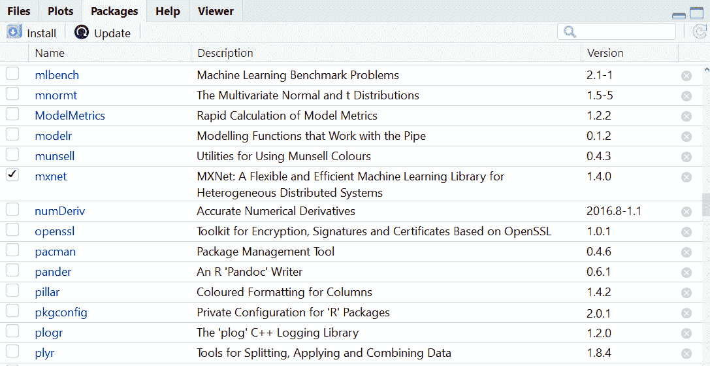

1.  接下来，我们将加载我们的训练数据和测试数据。此外，我们会添加一个名为`dataset`的列，并用`train`和`test`的值填充该列来标记数据。我们这样做是为了能够将数据合并，并对整个数据集进行一些操作，避免重复步骤，然后再将数据拆分。我们使用以下代码加载数据并添加标签：

```py
train <- read.csv("adult_processed_train.csv")
train <- train %>% mutate(dataset = "train")
test <- read.csv("adult_processed_test.csv")
test <- test %>% mutate(dataset = "test")
```

上面的代码会在你的环境面板中放置两个数据对象。这将是我们用来进行建模练习的训练数据和测试数据。你的环境面板应显示如下截图：

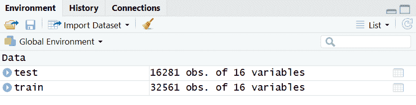

1.  在这一步，我们将使用行绑定（row bind）合并数据，并删除任何包含 NA 值的行。删除包含缺失值的行并不总是最合适的做法；有时，应该使用其他策略来处理缺失值。这些策略包括**插补**和**替代**。在这种情况下，由于我们仅仅是为了示范，我们希望移除这些行以便简化操作。我们使用以下代码合并数据并移除含缺失值的行：

```py
all <- rbind(train,test)

all <- all[complete.cases(all),]
```

上面的代码将向我们的环境面板中添加另一个数据对象。现在你的环境面板应显示如下截图：

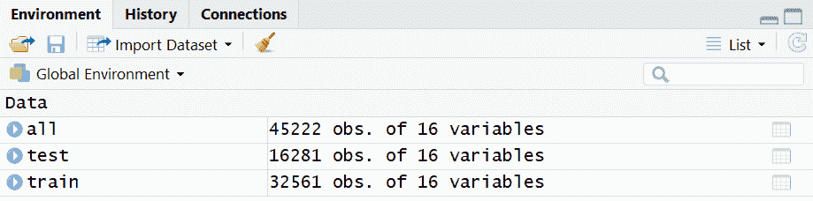

你可以看到，数据对象`all`包含了来自`test`和`train`的数据。现在我们可以同时修改`train`和`test`。

1.  在下一步中，我们会处理任何因子值并去除空格。这样做是因为有些值本应表示相同的内容，但由于空格问题，显示为不同的值，例如`Male`和` Male`。我们将演示空格是如何在准确定义类别时造成问题，并使用以下代码修正该问题：

```py
unique(all$sex)

all <- all %>%
  mutate_if(~is.factor(.),~trimws(.))
```

当我们运行前面的代码的第一行时，我们会将不同的因子水平打印到控制台。你的控制台应类似于以下截图：

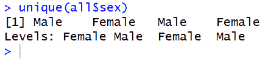

然而，在运行第二行并移除空格后，我们会发现问题已经被修正，输出也将有所不同。如果你再次运行`unique()`函数，控制台中的输出会显示如下截图：

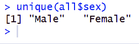

纠正这个问题将有助于算法在创建模型时使用正确数量的类别。

1.  接下来，我们仅筛选出训练数据。我们将目标变量提取为一个向量，并将值转换为数值型。之后，我们可以从数据集中删除目标变量和数据集变量。我们通过以下代码提取训练数据，创建目标变量向量，并删除不需要的列：

```py
train <- all %>% filter(dataset == "train")
train_target <- as.numeric(factor(train$target))
train <- train %>% select(-target, -dataset)
```

执行此代码后，我们会看到`train`数据已在`Environment`面板中更新，并且已添加了`train_target`向量。您的`Environment`面板将显示以下截图：

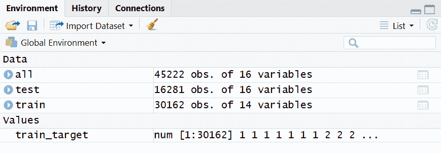

我们可以看到，训练数据减少了两个变量，因为我们已删除了目标和数据集。`target`列现在被提取到自己的向量中，我们将因变量和自变量分开，存放在不同的数据对象中，以便它们处于正确格式，准备传递给建模函数。

1.  下一步是按列分离数据，以便一个子集仅包含包含数值的列，而另一个子集仅包含包含字符串的列。如前所述，所有值都需要是数值型，因此我们将对字符串值进行独热编码，也称为创建虚拟变量。这将为每个可能的字段名称–值对创建一列，并用`1`或`0`填充该列，表示每行是否存在该字段名称的值。我们使用以下代码按描述的方式列分割数据：

```py
train_chars <- train %>%
  select_if(is.character)

train_ints <- train %>%
 select_if(is.integer)
```

执行上述代码后，我们将看到两个新的数据对象——一个包含 14 个总列中的 6 个数值列，另一个包含剩余的 8 列，这些列包含字符串值。您的环境面板现在将如下所示：

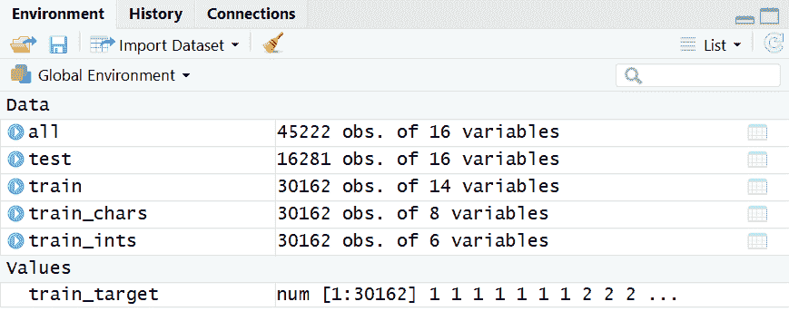

现在我们的数据已经是这种格式，我们可以对仅包含字符串的列进行独热编码。

1.  在这一步，我们实际上会创建虚拟变量。我们使用来自 caret 包的`dummyVars()`函数。这包含两个步骤。第一步，我们定义希望转换为虚拟变量的列。由于我们希望所有列都进行转换，因此我们只需在波浪号后加一个点。接下来，我们使用`predict()`函数，根据公式实际创建新的变量。我们通过以下代码创建新的虚拟变量列：

```py
ohe <- caret::dummyVars(" ~ .", data = train_chars)
train_ohe <- data.frame(predict(ohe, newdata = train_chars))
```

执行上述代码后，您将在环境面板中看到两个新的数据对象。一个是`ohe`对象，它是一个包含所有细节的列表，用于将字符串列转换为虚拟变量；另一个是`train_ohe`对象，包含虚拟变量。您的环境面板现在将如下所示：

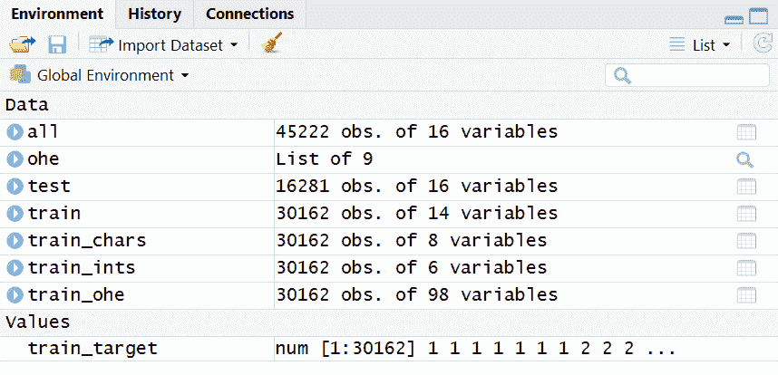

我们可以看到，创建虚拟变量会导致数据集的列数比原始数据多得多。如前所述，我们会为每个列名和对应值对创建一个新的列，这导致了列数的增加。

1.  在包含字符串值的列被转换为数值列后，我们可以将两个子集重新合并。我们使用以下代码将原本是数值型的数据和转换后的数值型数据合并：

```py
train <- cbind(train_ints,train_ohe)
```

我们可以看到，环境面板中的`train`对象发生了变化。你的环境面板现在会显示如下：

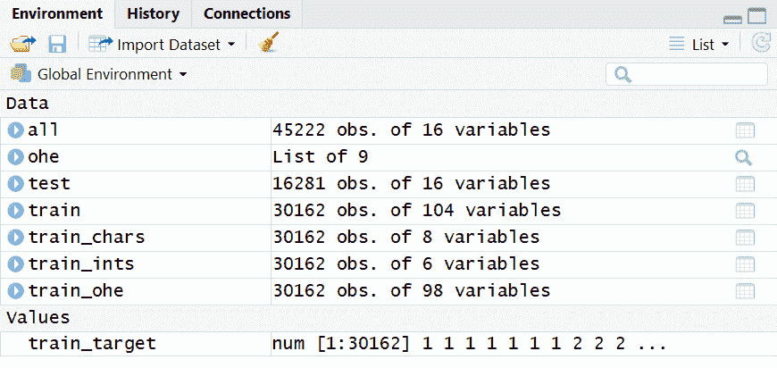

现在，训练数据包含了所有的数值型列，且已处于正确的格式，适用于神经网络。

1.  最后，对于原本包含数值的列，我们将对其进行缩放，使得所有值都在`0`到`1`之间，从而与我们的独热编码列处于同一尺度。我们通过以下代码将所有数据调整到相同的尺度：

```py
train <- train %>% mutate_all(funs(scales::rescale(.) %>% as.vector))
```

在运行上述代码之前，让我们先看看环境面板中`train`数据列的样子。你的界面在运行代码前将如下所示：

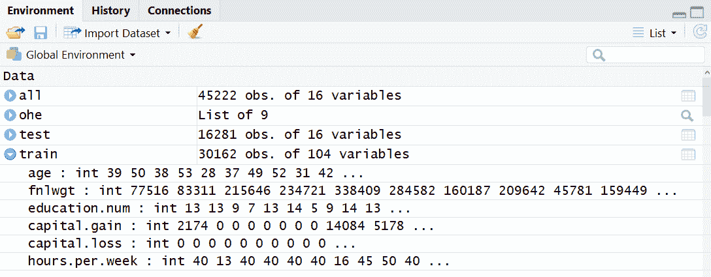

运行代码后，您的环境面板将显示如下截图：

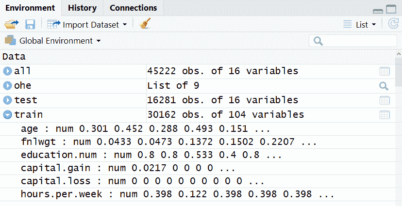

我们可以看到，原先在第一张图中处于不同尺度的所有值，现在已经重新缩放，使得所有值都在`0`到`1`之间。将所有值统一尺度有助于提高模型训练的效率。

1.  我们现在可以对测试数据集重复相同的步骤。通过运行以下代码行，我们使用与训练数据相同的步骤来准备测试数据进行建模：

```py
test <- all %>% filter(dataset == "test")
test_target <- as.numeric(factor(test$target))
test <- test %>% select(-target, -dataset)

test_chars <- test %>%
  select_if(is.character)

test_ints <- test %>%
  select_if(is.integer)

ohe <- caret::dummyVars(" ~ .", data = test_chars)
test_ohe <- data.frame(predict(ohe, newdata = test_chars))

test <- cbind(test_ints,test_ohe)

test <- test %>% mutate_all(funs(scales::rescale(.) %>% as.vector))
```

运行完此代码后，你会看到测试数据对象已按与训练数据对象相同的方式被修改。你的环境面板现在会显示如下截图：

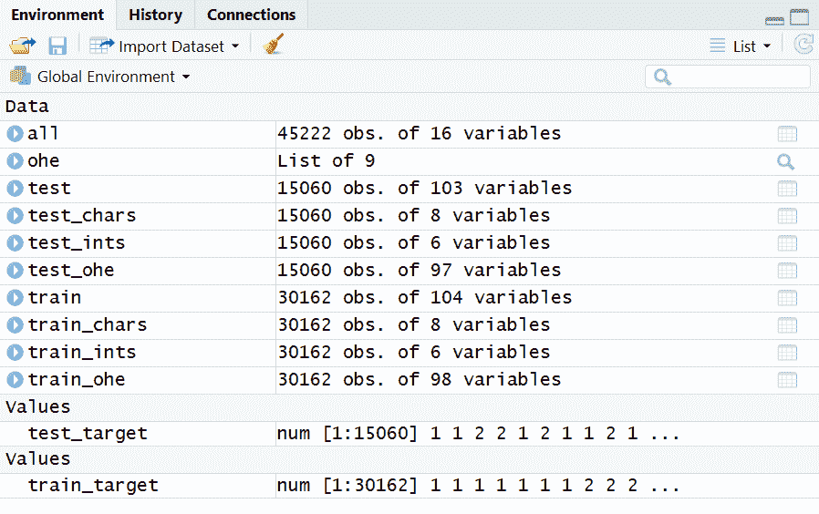

我们的所有数据现在都已经是正确的格式，并且可以用于训练我们的神经网络模型。

1.  还有最后一步清理。如果我们查看列的数量，可以发现`train`数据框比测试数据框多了一个列。我们可以使用`setdiff`函数查看哪些列在`train`中存在但在`test`集中不存在。一旦找到了该列，我们就可以从`train`数据集中删除它。我们需要确保数据具有相同的列数以进行建模。我们通过以下两行代码找出并删除在两个数据集中不存在的列：

```py
setdiff(names(train), names(test))

train <- train %>% select(-native.countryHoland.Netherlands)
```

当我们运行第一行代码时，输出的值会打印到我们的控制台。你的控制台输出将如下所示：

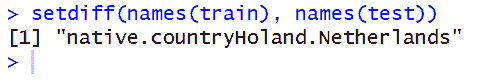

我们现在知道，`train` 数据集有列 `native.countryHoland.Netherlands`，而 `test` 数据集没有。我们使用第二行代码将该列从 `train` 数据集中移除。运行第二行代码后，我们会注意到环境面板发生了变化。你的环境面板现在将像下面的截图一样：

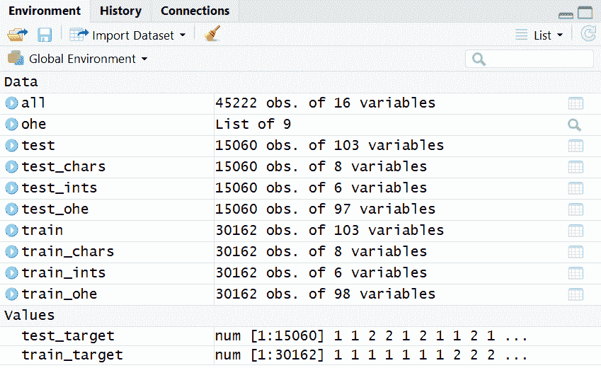

当我们现在查看 `train` 和 `test` 数据集时，我们可以看到这两个数据对象的列数相同，这是使用这两个数据对象来训练和测试模型所必需的。

1.  最后的数据准备步骤是对我们的目标变量向量中的所有值减去 `1`。当我们第一次将这些变量转换为数值格式时，我们取了它们的因子水平值，从而得到了编码为 `1` 或 `2` 的向量；然而，我们希望这些向量被编码为 `0` 或 `1`，这样它们与我们的自变量在同一尺度上。我们通过运行以下代码将目标变量调整到与自变量相同的尺度：

```py
train_target <- train_target-1
test_target <- test_target-1
```

运行以下代码后，你会注意到环境面板发生最后一次变化。你的环境面板现在将像下面的截图一样：

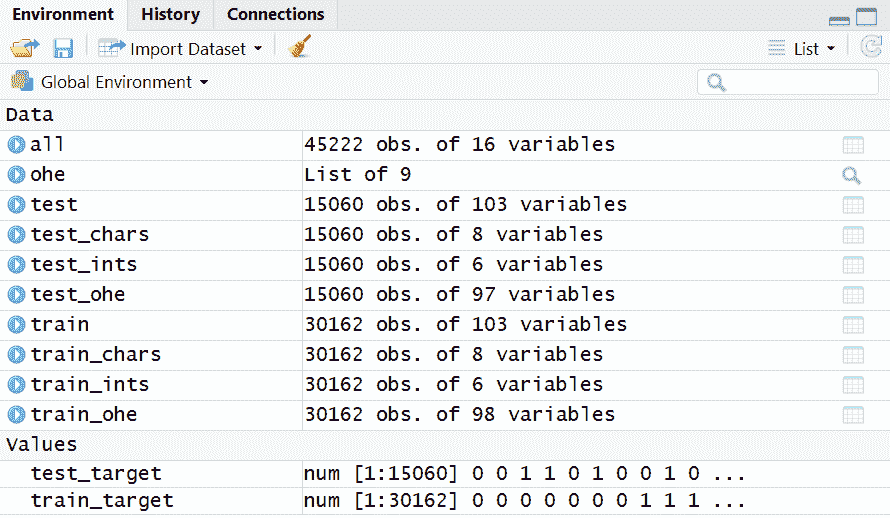

我们现在的所有数据都是数值型并且处于相同的尺度上，因此数据已经完全准备好用于建模。

我们从数据最初存储的状态开始，并采取了一些步骤将数据转换为正确的格式，以便用来训练神经网络。神经网络，特别是深度学习的实现，提供了不需要像其他机器学习技术那样进行特征工程的便利。尽管如此，仍然常常需要一些数据准备，因为神经网络要求所有数据必须存储为数值型数据，而且如果所有数值型数据处于相同的尺度下，模型的表现会更好。我们刚才进行的数据处理和转换步骤，代表了为其他数据进行神经网络训练时需要完成的数据准备工作。数据已经转换为正确的格式，现在我们可以设计一个系统来搜索我们模型中隐藏层的最优节点数。

# 决定隐藏层和神经元数量

多层感知器在模型设计过程中只有少数选择：隐藏层使用的激活函数、隐藏层的数量，以及每一层中节点或人工神经元的数量。本节将讨论选择最优层数和节点数的问题。我们可以从单层开始，使用一套启发式规则来指导我们选择该隐藏层中节点的数量。

在开始这一过程时，一个好的起始点是输入长度或独立变量列数的 66%。一般来说，这个值会位于输出大小与输入大小的两倍之间；然而，输入长度的 66%是这个范围内的一个好起始点。

这并不意味着这个起始值将始终是使用的最优节点数量。为了发现最优数量，我们可以编写一个函数，使用与起始点附近的不同节点数量来训练我们的模型，以观察趋势并尝试找到最优值。在这种情况下，我们将使用较大的学习率，进行少量的训练轮次以加快运行时间。如果你正在处理大型数据集，则可能需要在使用该策略时仅使用数据的子集，以避免每次迭代过长的运行时间成为问题。

现在，我们将逐步讲解如何创建一个函数来测试模型在不同节点数情况下的性能：

1.  首先，我们来看一下独立变量列的数量，然后获取该值的 66%，得到我们的起始点。我们通过运行以下代码来决定隐层中节点数量的起始值：

```py
length(train)*.66
```

上述代码将在控制台中打印以下输出：

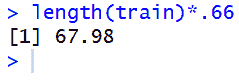

精确的数值是`67.98`，但我们将把它四舍五入到`70`作为起始值。请记住，你可以使用任何你喜欢的值，因为这只是一个启发式方法——使用整数是方便的，你也可以在之后深入挖掘，找到最优的神经元数量——然而，在做小幅度变化时，性能差异通常是最小的，甚至在后续泛化模型时可能不会出现。

1.  接下来，我们选择两个大于该起始点的值，以及两个小于该值的，存储在一个向量中。这些将作为参数传递给我们的函数。在此案例中，我们从`70`开始，因此我们还将包含`50`、`60`、`80`和`90`。我们通过运行以下代码来创建隐层可能节点的向量：

```py
possible_node_values <- c(50,60,70,80,90)
```

运行上述代码后，我们将看到这个数据对象现在出现在我们的环境面板中。你的环境面板现在应该类似于以下截图：

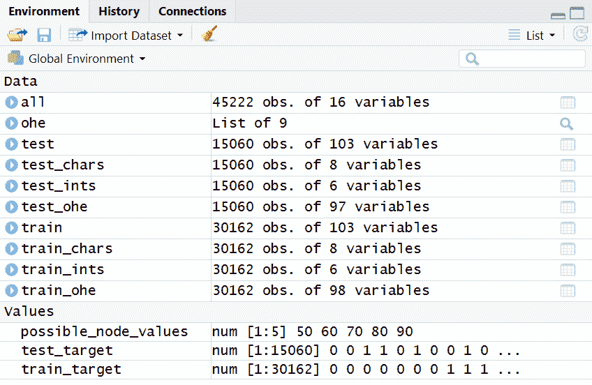

稍后我们将使用这个向量中的值来循环遍历这些选项，看看哪个性能最好。

1.  现在我们将设置种子，以确保结果的可复现性。这一点始终很重要，在使用任何引入准随机数的模型时都应这样做。在我们的示范中，重要的是展示我们创建的函数能产生与直接运行代码相同的结果。我们通过运行以下代码行，专门为我们的 MXNet 模型设置种子：

```py
mx.set.seed(0)
```

运行此代码后，控制台没有任何输出，RStudio 中也没有明显的变化；然而，使用此方法，我们确保了模型结果的一致性。

1.  在编写我们的函数之前，我们将首先定义并运行我们的模型，并查看使用`mxnet`包训练多层感知机的语法和选项。我们使用以下代码定义并运行我们的多层感知机模型：

```py
model <- mx.mlp(data.matrix(train), train_target, hidden_node=70,out_node=2, out_activation="softmax",num.round=10, array.batch.size=32, learning.rate=0.1, momentum=0.8, eval.metric=mx.metric.accuracy)
```

运行上述代码后，我们会看到每次运行时模型的详细信息被打印到控制台。控制台输出将如下图所示：

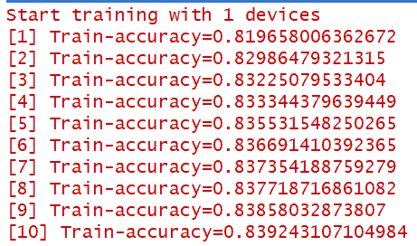

控制台输出列出了所有使用`train`数据中的保留集计算的准确度值。我们将在运行完这段代码后介绍更多 MXNet 建模的选项，以便更详细地说明每个参数。简而言之，此时我们使用一些值来使模型运行更快，同时我们正在准备测试最优节点数。

1.  除了训练这个模型之外，我们还希望有一个数据对象来保存性能结果，以便在尝试不同的隐藏层大小后进行比较。在这里，我们可以使用模型进行预测，并选择具有最高可能性的类别。最后，我们通过将预测正确的案例总数与测试目标变量的长度进行比较，来计算准确度。我们还可以看到现在如何将这两个值存储在表格中。我们这样做是为了演示函数内部的整个过程，该函数将包含所有不同的节点大小选择及其对应的准确度。我们使用以下代码进行预测并计算准确度：

```py
 preds = predict(model, data.matrix(test))

 pred.label = max.col(t(preds))-1

 acc = sum(pred.label == test_target)/length(test_target)

 vals <- tibble(
 nodes = 70,
 accuracy = acc
 )

vals
```

运行上述代码后，我们将在“环境”面板中看到四个新的数据对象。您的“环境”面板将如下图所示：

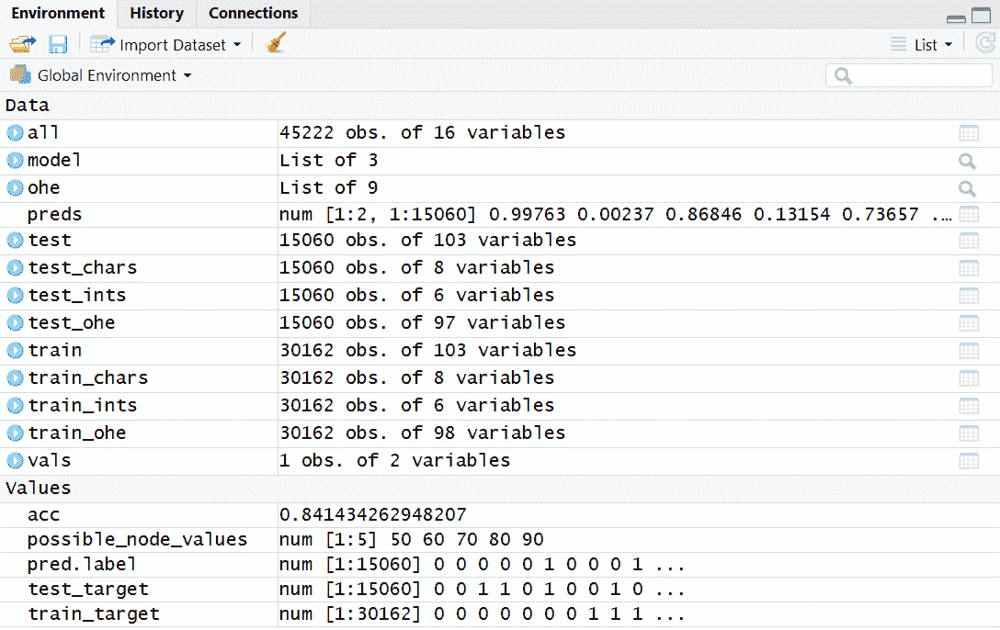

`preds`对象保存了我们通过模型进行预测的结果。MXNet 将这些预测结果存储在一个矩阵中，矩阵中包含每个类别的概率。如果我们转置这个矩阵或将其旋转 90 度，并选择每列的最大值，那么我们将得到与最可能类别对应的最高行号；然而，这样做时，矩阵中的行值为`1`和`2`，因此我们需要从所有值中减去 1，以便将预测值与我们真实的测试类别（即`0`或`1`）保持一致。对于准确度值，我们通过将预测值与真实值相同的情况总数与真实案例的总数相比，计算得到准确度。最后，我们可以将节点数和准确度分数放入一个表格中，这对比较不同节点数的结果非常有用。

1.  现在我们已经为单个案例编写了所有代码，我们可以通过将我们想要测试的参数的赋值替换为变量来创建我们的函数。然后，我们将这个变量移到我们的新函数中作为参数。我们可以看到，代码中的一切与之前完全相同，只是我们曾经将`hidden_node`参数的值设为`70`，并且后来在我们要创建的新表格中的`nodes`列下添加这个值的地方，现在它已被替换为`x`。然后，`x`被移到外部并作为我们新函数的参数传入。通过这种方式，我们现在可以将任何值传递给我们的新`mlp_loop()`函数，并让它替换代码中两个`x`的实例。我们编写自定义函数来尝试不同的`hidden_node`参数值，使用以下代码：

```py
mlp_loop <- function(x) {
  model <- mx.mlp(data.matrix(train), train_target, hidden_node=x, out_node=2, out_activation="softmax",
num.round=10, array.batch.size=32, learning.rate=0.1, momentum=0.8,eval.metric=mx.metric.accuracy)

  preds = predict(model, data.matrix(test))

  pred.label = max.col(t(preds))-1

  acc = sum(pred.label == test_target)/length(test_target)

  vals <- tibble(
    nodes = x,
    accuracy = acc
  )
}
```

在运行上述代码后，我们将看到我们的环境面板发生了变化。你的环境面板现在将像下面的截图一样：

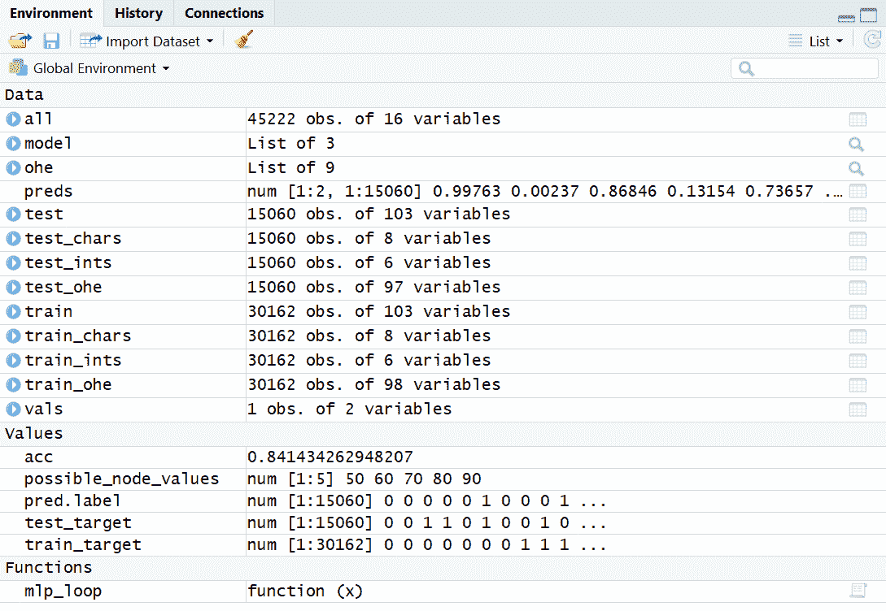

我们可以看到，现在我们的环境中已经定义并存储了一个自定义函数。

1.  现在我们可以首先使用之前运行时的值来测试我们的函数。我们通过向刚才创建的函数提供`70`这个值来测试我们的函数，代码如下：

```py
results <- mlp_loop(70)

results

all.equal(results$accuracy,acc)
```

在我们运行以下代码后，我们将会在控制台上得到一份打印输出，显示准确度值、我们在隐藏层中包含的节点数以及测试相等性结果。你的控制台将会像下面的截图一样：

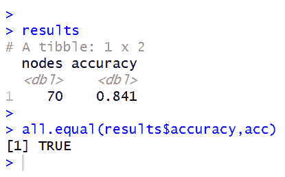

根据我们刚刚运行的代码结果，我们可以看到我们的函数生成的结果与直接将这些值传递给建模代码时生成的结果相同。这是合理的，因为我们只是将所有`x`的地方替换成了`70`。

1.  现在可以确认我们的新函数正常工作（因为当我们通过函数传递`70`时，得到的结果与直接在代码中使用`70`时相同），我们可以将整个数值向量传递给这个函数。为此，我们将使用`purrr`包中的`map()`函数，它使得迭代变得非常简单和直接。在这种情况下，我们将使用`map_df()`函数，以便在遍历所有值后获得一个数据框。我们通过以下代码循环遍历我们的函数，将之前创建的向量中的所有值传递进去：

```py
results <- map_df(possible_node_values, mlp_loop)

results
```

当我们运行前面的代码时，我们将在控制台看到一个类似于*步骤 4*的输出，显示所有五次模型运行的结果。之后，我们将得到一个`results`数据框，它现在包含了所有节点数尝试的准确度分数。在控制台中，你可能会注意到一些四舍五入的情况，这可能会妨碍我们立刻判断哪个模型表现最佳。让我们改为点击环境面板中的`results`，以表格形式查看数据。点击`results`后，你应该会看到类似以下截图的表格：

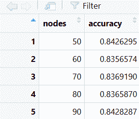

1.  虽然我们已经能够创建一个循环，将不同的节点数值传递给`mlp()`函数以确定最佳节点数，但在下一步中我们会看到，使用类似的循环技巧来寻找最佳层数并不像预期的那么简单。要添加层，我们必须放弃`mlp()`函数的便捷性，一次创建一个层来构建我们的多层感知器（MLP）。我们可以使用以下代码一次性创建一个 MLP 层：

```py
data <- mx.symbol.Variable("data")
fc1 <- mx.symbol.FullyConnected(data, num_hidden=90)
fc2 <- mx.symbol.FullyConnected(fc1, num_hidden=50)
smx <- mx.symbol.SoftmaxOutput(fc2)

model <- mx.model.FeedForward.create(smx, data.matrix(train), train_target,num.round=10, array.batch.size=32,
learning.rate=0.1, momentum=0.8, eval.metric=mx.metric.accuracy)

preds = predict(model, data.matrix(test))

pred.label = max.col(t(preds))-1

acc = sum(pred.label == test_target)/length(test_target)

acc
```

运行前面的代码后，我们将在环境面板中看到一些新的数据对象，并且控制台会打印出一个准确度分数。你的控制台将类似于以下截图：

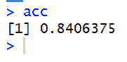

从输出结果中，我们可以看到，在两层不同节点数的测试中，选取两个最高得分值并没有改善我们的得分。虽然你可以继续使用前面的代码尝试不同的层数，但增加更多的层并不总是能带来更好的模型表现。让我们回顾一下前面的代码在做什么，以及它与我们使用`mlp()`函数创建的模型有何不同。

在这种情况下，我们通过创建一个符号变量来初始化模型。然后，我们创建了两个完全连接的层，分别包含 90 和 50 个节点。接着，我们定义了一个输出层，使用 softmax 激活函数。接下来，我们使用`FeedForward()`函数定义了之前使用的其他选项。通过这样做，我们可以看到大多数参数可以传递给`FeedForward`，而`hidden_node`参数则转移到`FullyConnected()`函数中，适用于任意数量的层，`out_node`和`out_activation`参数则传递给输出函数，在本例中为`SoftmaxOutput`。

使用我们准备的数据，我们查看了如何测试隐藏层的最佳节点数。我们还讨论了如何更改代码以添加更多的层。与其他神经网络实现相比，MLP 的选项较少，因此我们主要集中在调整隐藏层，以利用神经网络模型的主要优势来优化我们的模型。在下一步中，我们将利用我们在调整参数时学到的一切，运行一个能够最大化性能的模型，并使用 MXNet 提供更深入的模型选项解释。

# 训练和评估模型

调整参数后，我们现在可以运行模型以获得最佳性能。为了实现这一点，我们将对模型选项进行一些重要更改。在进行更改之前，让我们更深入地审查一下模型选项：

+   `hidden_node`：这是隐藏层中的节点数。我们使用循环函数来找到最佳的节点数。

+   `out_node`：这是输出层中的节点数，必须设置为目标类别的数量。在这种情况下，该数字是`2`。

+   `out_activation`：这是用于输出层的激活函数。

+   `num.round`：这是我们训练模型的迭代次数。在参数调整阶段，我们将此数字设置得较低，以便能够快速循环通过多个选项；为了获得最佳准确性，我们将允许模型运行更多轮次，同时降低学习率，稍后我们将讨论这一点。

+   `array.batch.size`：这是设置批次大小的参数，即每一轮训练时同时训练的行数。该值设置得越高，所需的内存也越多。

+   `learning.rate`：这是应用于损失函数梯度的常数值，用来调整权重。为了参数调整，我们将其设置为较大的数值，以便在较少的轮次内快速沿成本面移动。为了获得最佳性能，我们将其设置为较小的数值，以便在学习新权重时做出更细微的调整，从而避免不断过度调整数值。

+   `momentum`：这个参数利用先前梯度的衰减值，避免在成本面上出现突然的移动变化。作为启发式方法，`momentum`的一个良好起始值在`0.5`和`0.8`之间。

+   `eval.metric`：这是用来评估性能的度量标准。在我们的案例中，我们使用的是`accuracy`（准确率）。

现在，我们已经涵盖了使用`mlp()`函数包含的模型选项，我们将进行调整以提高准确性。为了提高准确性，我们将增加训练轮次，同时降低学习率。我们将保持其他值不变，并使用之前循环中获得最佳性能的节点数。你可以使用以下代码，根据我们在参数调整时学到的内容来设置模型以提高性能：

```py
model <- mx.mlp(data.matrix(train), train_target, hidden_node=90, out_node=2, out_activation="softmax",num.round=200, array.batch.size=32, learning.rate=0.005, momentum=0.8,eval.metric=mx.metric.accuracy)

preds = predict(model, data.matrix(test))

pred.label = max.col(t(preds))-1

acc = sum(pred.label == test_target)/length(test_target)

acc
```

运行此代码后，你将在控制台中看到模型在调整参数后运行的准确率得分。你的控制台输出将如下所示：

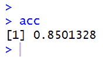

我们可以看到，通过我们的调整，准确率得到了提升。之前，当我们测试参数时，最佳准确率为 84.28%，现在我们可以看到准确率已经达到了 85.01%。

在将数据准备好以符合 MXNet 模型的格式，并进行参数调优以找到最佳模型值后，我们进一步调整了模型，利用之前学到的内容来提升性能。所有这些步骤一起描述了一个完整的数据操作和转换周期，优化参数，最后运行我们的最终模型。我们展示了如何使用 MXNet，它提供了一个简单的 MLP 便利函数，还可以通过激活、输出和前馈函数来构建带有额外隐藏层的 MLP。

# 总结

多层感知机是最简单的神经网络形式。它们是前馈式的，没有递归神经网络的反馈循环，所有隐藏层都是密集的完全连接层，不像卷积神经网络，它们包含卷积层和池化层。由于其简单性，调整的选项较少；然而，在本章中，我们专注于调整隐藏层中的节点数，并探索添加额外的层，因为这一点是区分神经网络模型和其他机器学习算法，进而区别深度学习方法的主要因素。通过本章中的所有代码，你已经学会了如何处理数据以使其准备好建模，如何选择最优的节点和层数，以及如何使用 `mxnet` 库在 R 中训练和评估模型。

在下一章，你将学习如何编写深度自编码器代码。这是一种无监督学习模型，用于自动分类输入数据。我们将使用这种聚类过程来编写一个基于协同过滤的推荐系统。
