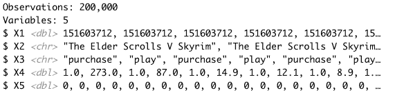
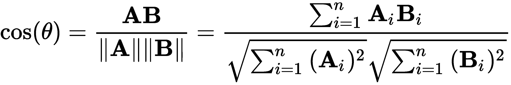

# 第六章：使用嵌入的神经协同过滤

在上一章中，你学习了如何实现**多层感知机**（**MLP**）神经网络进行信号检测。

本章将带你探索如何使用基于神经网络嵌入的协同过滤构建推荐系统。我们将简要介绍推荐系统，然后从概念讲解到实际实现。具体来说，你将学习如何使用自定义 Keras API 构建基于神经网络的推荐系统，通过嵌入层来预测用户评分。

本章涉及以下主题：

+   介绍推荐系统

+   使用神经网络的协同过滤

+   准备、预处理并探索数据

+   执行探索性数据分析

+   创建用户和物品嵌入

+   构建和训练神经推荐系统

+   评估结果和调整超参数

# 技术要求

本章将使用 Keras（TensorFlow API）库。

我们将使用`steam200k.csv`数据集。该数据集来源于公开的 Steam 数据，Steam 是全球最受欢迎的游戏平台之一。该数据包含了物品（`game-title`）、用户（`user-id`）以及两种用户行为（`own`和`value`），其中`value`表示每款游戏的游戏时长。你可以在以下网址找到该数据集：[`www.kaggle.com/tamber/steam-video-games/version/1#steam-200k.csv`](https://www.kaggle.com/tamber/steam-video-games/version/1#steam-200k.csv)。

你可以在 GitHub 上找到本章的代码文件：[`github.com/PacktPublishing/Hands-on-Deep-Learning-with-R`](https://github.com/PacktPublishing/Hands-on-Deep-Learning-with-R)。

# 介绍推荐系统

推荐系统是信息过滤系统，旨在基于可用数据为用户生成准确且相关的物品建议。Netflix、Amazon、YouTube 和 Spotify 等都是目前在商业中使用推荐系统的流行服务。

推荐系统有三种主要类型：

+   **协同过滤**：物品推荐基于与其他用户的相似性，反映了个性化的偏好。偏好可以是**显式的**（物品评分）或**隐式的**（通过用户-物品互动，如观看、购买等进行的物品评分）。

+   **基于内容的过滤**：物品推荐反映了上下文因素，如物品属性或用户人口统计信息；物品建议还可以使用时间因素，如适用的地理位置、日期和时间。

+   **混合**：物品推荐结合了多种（集成）协同过滤和基于内容的过滤方法，这些方法曾在 Netflix 奖（2009 年）等著名竞赛中使用。

有关 Netflix 奖（2009 年）及各种推荐系统方法的历史细节，请参见[`www.netflixprize.com`](https://www.netflixprize.com/)。

推荐系统通常使用用户和你希望推荐的物品的稀疏矩阵数据。顾名思义，稀疏矩阵是一个数据元素主要由零值组成的矩阵。

许多推荐系统算法旨在通过用户与物品之间的各种交互类型，填充用户-物品交互矩阵，并根据这些交互提供物品建议。如果没有可用的物品偏好或用户交互数据，这通常被称为**冷启动问题**，可以通过混合方法（协同过滤与基于内容的过滤）、上下文模型（时间、人口统计和元数据）以及随机物品和反馈采样策略等方法来解决。尽管这些干预措施超出了本章的范围，但重要的是要意识到可用的多种实验性和快速发展的技术类型。

为了便于说明，我们将重点关注协同过滤，这是一种基于用户-物品交互生成推荐的流行技术。此外，协同过滤特别适合我们的用户-物品数据集。在没有显式评分（例如，1 到 5，喜欢或不喜欢）时，我们将根据游戏时长创建隐式的用户-物品评分偏好，这些数据在我们的数据集中是可用的。

# 使用神经网络的协同过滤

**协同过滤**（**CF**）是推荐系统用于通过收集和分析其他相似用户的偏好来过滤建议的核心方法。CF 技术利用现有的信息和偏好模式数据，预测（过滤）特定用户的兴趣。

CF 的协同特性与以下观点相关：相关的推荐是从其他用户的偏好中得出的。CF 还假设，两个具有相似偏好的个体，比随机选择的两个个体，更可能对某一物品有共同的偏好。因此，CF 的主要任务是基于系统中其他（协同）相似用户生成物品建议（预测）。

为了识别相似的用户并找到未评分物品的评分（偏好），推荐系统*通常*需要基于可用输入数据，使用用户与用户-物品偏好之间的相似度索引。传统的基于记忆的方法包括使用距离度量（余弦相似度、杰卡德相似度）计算相似性，相关性（皮尔逊相关系数），或对用户偏好进行加权平均。其他用于确定未评分物品的用户-物品偏好的机器学习方法包括广义矩阵分解方法，如**主成分分析**（**PCA**）、**奇异值分解**（**SVD**）以及深度学习矩阵分解等。

# 探索嵌入表示

广义而言，深度神经网络旨在最小化与用于学习输入数据中重要特征的非线性数据表示相关的损失（误差）。

除了传统的降维方法（如聚类、KNN 或矩阵分解（PCA、聚类及其他概率技术））外，推荐系统还可以使用神经网络嵌入来支持降维和分布式非线性数据表示，以可扩展和高效的方式进行处理。

**嵌入**是通过神经网络从离散输入变量的表示（向量）中学习的低维连续数字表示（向量）。

神经网络嵌入提供了多个优势，如下所示：

+   减少计算时间和成本（可扩展性）

+   对某些学习激活函数所需的输入数据量减少（稀疏性）

+   复杂非线性关系的表示（灵活性）

+   自动特征重要性和选择（效率）

让我们看一个关于如何准备数据以实现基于神经网络嵌入的协同过滤的入门示例。

# 准备、预处理和探索数据

在构建模型之前，我们需要先探索输入数据，以了解有哪些数据可用于用户-物品推荐。在本节中，我们将通过以下步骤准备、处理和探索数据，这些数据包括用户、物品（游戏）和互动（游戏时长）：

1.  首先，让我们加载一些 R 包，用于准备和处理输入数据：

```py
library(keras)
library(tidyverse)
library(knitr)
```

1.  接下来，让我们将数据加载到 R 中：

```py
steamdata <- read_csv("data/steam-200k.csv", col_names=FALSE)
```

1.  让我们使用 `glimpse()` 检查输入数据：

```py
glimpse(steamdata)
```

这将产生以下输出：



1.  让我们手动添加列标签，以便整理这些数据：

```py
colnames(steamdata) <- c("user", "item", "interaction", "value", "blank")
```

1.  让我们删除任何空白列或多余的空白字符：

```py
steamdata <- steamdata %>% 
  filter(interaction == "play") %>%
  select(-blank) %>%
  select(-interaction) %>% 
  mutate(item = str_replace_all(item,'[ [:blank:][:space:] ]',""))
```

1.  现在，我们需要创建顺序的用户和物品 ID，以便稍后通过以下代码为我们的查找矩阵指定合适的大小：

```py
users <- steamdata %>% select(user) %>% distinct() %>% rowid_to_column()
steamdata <- steamdata %>% inner_join(users) %>% rename(userid=rowid)

items <- steamdata %>% select(item) %>% distinct() %>% rowid_to_column()
steamdata <- steamdata %>% inner_join(items) %>% rename(itemid=rowid)
```

1.  让我们重命名 `item` 和 `value` 字段，以明确我们正在探索用户-物品互动数据，并根据 `value` 字段（表示某个游戏的总游戏时长）隐式定义用户评分：

```py
steamdata <- steamdata %>% rename(title=item, rating=value)
```

1.  这个数据集包含用户、物品和互动数据。让我们使用以下代码来识别可用于分析的用户和物品数量：

```py
n_users <- steamdata %>% select(userid) %>% distinct() %>% nrow()
n_items <- steamdata %>% select(itemid) %>% distinct() %>% nrow()
```

我们已确定有 11,350 名用户（玩家）和 3,598 个物品（游戏）可供分析和推荐。由于我们没有明确的物品评分（例如，是否/否定、1-5 等），我们将基于隐式反馈（游戏时长）生成物品（游戏）推荐以作示范。或者，我们可以尝试获取额外的用户-物品数据（如上下文、时间或内容数据），但我们拥有足够的基础物品互动数据来构建基于神经网络嵌入的初步协同过滤推荐系统。

1.  在继续之前，我们需要对评分（用户-物品交互）数据进行归一化，这可以通过标准技术如最小-最大归一化来实现：

```py
# normalize data with min-max function
minmax <- function(x) {
  return ((x - min(x)) / (max(x) - min(x)))
}

# add scaled rating value
steamdata <- steamdata %>% mutate(rating_scaled = minmax(rating))
```

1.  接下来，我们将数据拆分为训练数据和测试数据：

```py
# split into training and test
index <- sample(1:nrow(steamdata), 0.8* nrow(steamdata))
train <- steamdata[index,] 
test <- steamdata[-index,] 
```

1.  现在我们将为训练数据和测试数据创建用户、物品和评分的矩阵：

```py
# create matrices of user, items, and ratings for training and test 
x_train <- train %>% select(c(userid, itemid)) %>% as.matrix()
y_train <- train %>% select(rating_scaled) %>% as.matrix()
x_test <- test %>% select(c(userid, itemid)) %>% as.matrix()
y_test <- test %>% select(rating_scaled) %>% as.matrix()
```

在构建我们的神经网络模型之前，我们将首先进行**探索性数据分析**（**EDA**），以更好地理解潜在数据的范围、类型和特征。

# 进行探索性数据分析

推荐系统试图利用可用信息和偏好模式数据来预测特定用户的兴趣。

作为起点，我们可以使用 EDA 来识别潜在数据中的重要模式和趋势，以帮助我们理解并进行后续分析：

1.  我们使用以下代码识别基于用户-物品交互数据构建的隐式评分的前 10 个物品：

```py
# user-item interaction exploratory data analysis (EDA)
item_interactions <- aggregate(
    rating ~ title, data = steamdata, FUN = 'sum')
item_interactions <- item_interactions[
    order(item_interactions$rating, decreasing = TRUE),]
item_top10 <- head(item_interactions, 10)
kable(item_top10)
```

*Dota 2*是按总游戏时间计算的最受欢迎物品（游戏）：


1.  我们使用以下代码生成用户-物品交互的汇总统计，以识别一些洞察：

```py
# average gamplay
steamdata %>% summarise(avg_gameplay = mean(rating))

# median gameplay
steamdata %>% summarise(median_gameplay = median(rating))

# top game by individual hours played
topgame <- steamdata %>% arrange(desc(rating)) %>% top_n(1,rating)

# show top game by individual hours played
kable(topgame)
```

根据这次探索性分析，Sid Meier 的*文明 V*是按个人游戏时间计算的最受欢迎游戏：


1.  现在，让我们识别并可视化按游戏时间排列的前 10 个游戏：

```py
# top 10 games by hours played
mostplayed <- 
  steamdata %>%
  group_by(item) %>%
  summarise(hours=sum(rating)) %>% 
  arrange(desc(hours)) %>%
  top_n(10, hours) %>%
  ungroup

# show top 10 games by hours played
kable(mostplayed)

# reset factor levels for items
mostplayed$item <- droplevels(mostplayed$item)

# top 10 games by collective hours played
ggplot(mostplayed, aes(x=item, y=hours, fill = hours)) +
  aes(x = fct_inorder(item)) +
  geom_bar(stat = "identity") +
  theme(axis.text.x = element_text(size=8, face="bold", angle=90)) +
  theme(axis.ticks = element_blank()) +
  scale_y_continuous(expand = c(0,0), limits = c(0,1000000)) + 
  labs(title="Top 10 games by collective hours played") +
  xlab("game") +
  ylab("hours")

```

这将产生以下输出：


1.  接下来，让我们识别按总用户数计算的最受欢迎游戏：

```py
# most popular games by total users
mostusers <-
  steamdata %>%
  group_by(item) %>%
  summarise(users=n()) %>% 
  arrange(desc(users)) %>% 
  top_n(10, users) %>% 
  ungroup

# reset factor levels for items
mostusers$item <- droplevels(mostusers$item)

# top 10 popular games by total users
ggplot(mostusers, aes(x=item, y=users, fill = users)) +
  aes(x = fct_inorder(item)) +
  geom_bar(stat = "identity") +
  theme(axis.text.x = element_text(size=8, face="bold", angle=90)) +
  theme(axis.ticks = element_blank()) +
  scale_y_continuous(expand = c(0,0), limits = c(0,5000)) + 
  labs(title="Top 10 popular games by total users") +
  xlab("game") +
  ylab("users")
```

这将产生以下输出：


1.  现在，让我们使用以下代码计算用户-物品交互的汇总统计：

```py
summary(steamdata$value)
```

这将产生以下输出：


整体用户-物品交互的汇总统计数据显示，平均（中位数）交互时间为`4.5`小时，平均（算术平均）交互时间为`48.88`小时，这在考虑到最大（离群值）交互值时是合理的：Sid Meier 的*文明 V*的交互时间为`11,754`小时！

1.  接下来，让我们查看按个人游戏时间分布的物品：

```py
# plot item iteraction
ggplot(steamdata, aes(x=steamdata$value)) +
  geom_histogram(stat = "bin", binwidth=50, fill="steelblue") +
  theme(axis.ticks = element_blank()) +
  scale_x_continuous(expand = c(0,0)) + 
  scale_y_continuous(expand = c(0,0), limits = c(0,60000)) + 
  labs(title="Item interaction distribution") +
  xlab("Hours played") +
  ylab("Count")
```

以下是按游戏时间排列的物品结果输出：


1.  由于这种方法很难确定明确的用户-物品交互模式，让我们通过对游戏时间进行对数变换，再次检查按游戏时间排列的物品，以揭示其他分布模式：

```py
# plot item iteraction with log transformation
ggplot(steamdata, aes(x=steamdata$value)) +
  geom_histogram(stat = "bin", binwidth=0.25, fill="steelblue") +
  theme(axis.ticks = element_blank()) +
  scale_x_log10() +
  labs(title="Item interaction distribution with log transformation") +
  xlab("log(Hours played)") +
  ylab("Count")
```

这将产生以下输出：


通过对游戏时间进行简单的对数变换，我们可以清楚地看到大多数数据集中的游戏与 1,000 小时或更少的游戏时间相关。

现在我们对潜在数据有了更好的理解，接下来让我们将注意力集中在构建一个神经网络模型，通过嵌入来预测用户评分。

# 创建用户和物品嵌入

推荐系统可以使用深度神经网络以灵活、可扩展且高效的方式支持复杂的非线性数据表示。

嵌入是从神经网络中离散输入变量的表示（向量）学习到的连续数字的低维表示（向量）。如本章前面所述，推荐系统*通常*需要一个用户和用户-物品偏好的相似度索引，以识别相似用户并找到未评分物品的评分（偏好）。

然而，与使用广义矩阵分解方法生成用户-物品亲和向量的传统协同过滤方法不同，神经网络可以通过使用分布式、低维表示（嵌入）在潜在（隐藏）空间中存储关于用户-物品亲和的重要信息。

因此，只要我们在同一个潜在空间中拥有用户和物品（游戏）的表示（嵌入），就可以使用点积函数确定用户和物品（游戏）之间关系的相互重要性。假设用户和物品向量已经被规范化，这实际上等同于使用**余弦相似度**，cos(Θ)，作为距离度量，其中 A[i]和 B[i]分别是向量 A 和 B 的分量：



通过为用户和物品创建神经网络嵌入，我们可以减少某些学习激活函数所需的输入数据量，这在协同过滤系统中遇到的典型用户-物品数据稀疏条件下尤为有用。在下一部分，我们将概述如何构建、编译和训练一个神经推荐系统。

# 构建和训练神经推荐系统

我们现在将使用我们的用户-物品评分数据来构建、编译和训练我们的模型。具体来说，我们将使用 Keras 构建一个定制的神经网络，具有嵌入层（一个用于用户，一个用于物品），并使用一个 lambda 函数计算点积来构建一个基于神经网络的推荐系统的工作原型：

1.  让我们通过以下代码开始：

```py
# create custom model with user and item embeddings
dot <- function(
  embedding_dim,
  n_users,
  n_items,
  name = "dot"
) {
  keras_model_custom(name = name, function(self) {
    self$user_embedding <- layer_embedding(
        input_dim = n_users+1,
        output_dim = embedding_dim,
        name = "user_embedding")
    self$item_embedding <- layer_embedding(
        input_dim = n_items+1,
        output_dim = embedding_dim,
        name = "item_embedding")
    self$dot <- layer_lambda(
        f = function(x)
        k_batch_dot(x[[1]],x[[2]],axes=2),
        name = "dot"
    )
    function(x, mask=NULL, training=FALSE) {
      users <- x[,1]
      items <- x[,2]
      user_embedding <- self$user_embedding(users) 
      item_embedding <- self$item_embedding(items) 
      dot <- self$dot(list(user_embedding, item_embedding))
    }
  })
}
```

在前面的代码中，我们使用`keras_model_custom`函数定义了一个带有用户和物品嵌入的自定义模型。您会注意到，每个嵌入层的输入大小被初始化为输入数据的大小（分别为`n_users`和`n_items`）。

1.  在以下代码中，我们定义了嵌入参数的大小（`embedding_dim`），并定义了我们神经协同过滤模型的架构和向量表示（嵌入），以预测用户评分：

```py
# initialize embedding parameter
embedding_dim <- 50

# define model 
model <- dot(
  embedding_dim,
  n_users,
  n_items
)
```

1.  现在，让我们编译我们的模型：

```py
# compile model 
model %>% compile(
  loss = "mse",
  optimizer = "adam"
)
```

1.  接下来，让我们使用以下代码训练我们的模型：

```py
# train model 
history <- model %>% fit(
  x_train,
  y_train,
  epochs = 10,
  batch_size = 500,
  validation_data = list(x_test,y_test),
  verbose = 1
)
```

这将产生以下输出：


1.  现在，让我们查看我们模型的基础架构以供参考：

```py
summary(model)
```

这是我们模型架构的打印输出：


在接下来的部分中，我们将评估模型结果，调整参数，并进行一些迭代调整，以在损失度量方面改善性能。

# 评估结果并调整超参数

构建推荐系统、评估其性能并调整超参数是一个高度迭代的过程。最终目标是最大化模型的性能和结果。现在我们已经构建并训练了基准模型，可以通过以下代码在训练过程中监控和评估其性能：

```py
# evaluate model results
plot(history)
```

这将产生以下模型性能输出：


在接下来的部分中，我们将尝试调整模型参数，以提高其性能。

# 超参数调整

让我们尝试将`embedding_dim`超参数更改为`32`，并将`batch_size`超参数更改为`50`，以查看是否能获得更好的结果：

```py
# initialize embedding parameter
embedding_dim <- 32

# train model 
history <- model %>% fit(
  x_train,
  y_train,
  epochs = 10,
  batch_size = 50,
  validation_data = list(x_test,y_test),
  verbose = 1)

# show model
summary(model)
```

以下是模型架构的打印输出：


现在，我们将绘制结果，如下所示：

```py
# evaluate results
plot(history)
```

这将产生以下输出：


不幸的是，这些模型性能结果与我们的基准模型没有显著区别，因此我们需要探索一些额外的模型配置。

# 添加丢弃层

在以下代码中，我们将添加丢弃层，并鼓励您尝试不同的丢弃率，以观察哪些配置在经验上能带来最佳结果：

```py
# initialize embedding parameter
embedding_dim <- 64

# create custom model with dropout layers
dot_with_dropout <- function(
  embedding_dim,
  n_users,
  n_items,
  name = "dot_with_dropout"
) {
  keras_model_custom(name = name, function(self) {
    self$user_embedding <- layer_embedding(
      input_dim = n_users+1,
      output_dim = embedding_dim,
      name = "user_embedding")
    self$item_embedding <- layer_embedding(
      input_dim = n_items+1,
      output_dim = embedding_dim,
      name = "item_embedding")
    self$user_dropout <- layer_dropout(
        rate = 0.2)
    self$item_dropout <- layer_dropout(
        rate = 0.4)
    self$dot <-
      layer_lambda(
        f = function(x)
        k_batch_dot(x[[1]],x[[2]],axes=2),
        name = "dot"
      )
    function(x, mask=NULL, training=FALSE) {
      users <- x[,1]
      items <- x[,2]
      user_embedding <- self$user_embedding(users) %>%           
          self$user_dropout()
      item_embedding <- self$item_embedding(items) %>%     
           self$item_dropout()
      dot <- self$dot(list(user_embedding,item_embedding))
    }
  })
}
```

在前面的代码中，我们使用`layer_dropout()`添加了丢弃层，这增加了我们初步模型的复杂性。在以下代码中，我们定义、编译并训练我们自定义的带有丢弃层的模型：

```py
# define model 
model <- dot_with_dropout(
  embedding_dim,
  n_users,
  n_items)

# compile model 
model %>% compile(
  loss = "mse",
  optimizer = "adam"
)

# train model 
history <- model %>% fit(
  x_train,
  y_train,
  epochs = 10,
  batch_size = 50,
  validation_data = list(x_test,y_test),
  verbose = 1
)
```

这将产生以下输出：


现在，我们将输出模型的摘要，如下所示：

```py
summary(model)
```

这是模型架构的摘要：


现在，我们将绘制结果，如下所示：

```py
# evaluate results
plot(history)
```

这将产生以下模型性能输出：


虽然我们添加了丢弃层，但观察到的模型改进非常有限。

让我们重新审视我们的基本假设并尝试另一种方法。

# 调整用户-项目偏差

重要的是要认识到，实际上，一些用户与项目（游戏）的互动可能与其他用户在游戏频率和偏好上有所不同。这个差异可能会导致根据用户与项目的互动（游戏时间）数据，推导出不同的隐式评分，这些数据是本分析中可用的。

基于我们之前的发现，我们将修改模型，通过为平均用户和项目（游戏）包含嵌入层来考虑用户和项目偏差，使用以下代码：

```py
# caculate minimum and max rating
min_rating <- steamdata %>% summarise(min_rating = min(rating_scaled)) %>% pull()
max_rating <- steamdata %>% summarise(max_rating = max(rating_scaled)) %>% pull()

# create custom model with user, item, and bias embeddings
dot_with_bias <- function(
  embedding_dim,
  n_users,
  n_items,
  min_rating,
  max_rating,
  name = "dot_with_bias"
) { 
keras_model_custom(name = name, function(self) {
  self$user_embedding <- layer_embedding(
    input_dim = n_users+1,
    output_dim = embedding_dim,
    name = "user_embedding")
  self$item_embedding <- layer_embedding(
    input_dim = n_items+1,
    output_dim = embedding_dim,
    name = "item_embedding")
  self$user_bias <- layer_embedding(
    input_dim = n_users+1,
    output_dim = 1,
    name = "user_bias")
  self$item_bias <- layer_embedding(
    input_dim = n_items+1,
    output_dim = 1,
    name = "item_bias")
```

在上述代码中，我们创建了一个自定义模型，包含用户和物品的嵌入（`user_embedding`和`item_embedding`），以及用户偏差和物品偏差的嵌入（`user_bias`和`item_bias`）。在下面的代码中，我们为用户和物品添加了 dropout 层，并鼓励你尝试不同的 dropout 率，以获得最佳结果：

```py
  self$user_dropout <- layer_dropout(
    rate = 0.3)
  self$item_dropout <- layer_dropout(
    rate = 0.5)
  self$dot <- layer_lambda(
    f = function(x)
    k_batch_dot(x[[1]],x[[2]],axes=2),
    name = "dot")
  self$dot_bias <- layer_lambda(
    f = function(x)
    k_sigmoid(x[[1]]+x[[2]]+x[[3]]),
    name = "dot_bias")
  self$min_rating <- min_rating
  self$max_rating <- max_rating
  self$pred <- layer_lambda(
    f = function(x)
    x * (self$max_rating - self$min_rating) + self$min_rating,
    name = "pred")
  function(x,mask=NULL,training=FALSE) {
    users <- x[,1]
    items <- x[,2]
    user_embedding <- self$user_embedding(users) %>% self$user_dropout()
    item_embedding <- self$item_embedding(items) %>% self$item_dropout()
    dot <- self$dot(list(user_embedding,item_embedding))
    dot_bias <- self$dot_bias(list(dot, self$user_bias(users), self$item_bias(items)))
    self$pred(dot_bias)
    }
  })
}
```

接下来，让我们定义、编译并训练我们修改后的神经网络模型：

```py
# define model 
model <- dot_with_bias(
  embedding_dim,
  n_users,
  n_items,
  min_rating,
  max_rating)

# compile model 
model %>% compile(
  loss = "mse",
  optimizer = "adam"
)

# train model 
history <- model %>% fit(
  x_train,
  y_train,
  epochs = 10,
  batch_size = 50,
  validation_data = list(x_test,y_test),
  verbose = 1)
)
```

这将产生如下输出：


现在，我们将打印出总结：

```py
# summary model
summary(model)
```

通过添加这些额外的嵌入层并调整超参数，我们几乎将训练参数的总数量翻倍，具体体现在以下的模型总结中：


最后，我们绘制了模型的结果如下：

```py
# evaluate results
plot(history)
```

这将产生如下输出：


通过一系列迭代配置和经验指导的调整，我们改善了相对于先前模型的过拟合问题，并在验证数据集上达到了显著低于 0.1 的 RMSE。通过进一步调优超参数和 dropout 层的比例配置，我们可能会进一步提升模型的性能。未来的推荐是基于此模型继续扩展，获取并实施显式评分数据，此外，尝试更多的上下文信息和用户人口统计数据，以更好地理解用户与物品交互之间的关系和相关因素。

# 总结

在本章中，你学习了如何使用自定义的 Keras API 和嵌入（embeddings）来构建一个深度神经网络推荐系统。我们简要介绍了协同过滤的概念，并展示了如何准备数据以构建自定义神经网络。在这一迭代过程中，我们创建了用户和物品的嵌入，使用嵌入层训练了深度神经网络，调优了超参数，并使用常见的性能指标评估了结果。在下一章中，你将继续将神经网络方法应用于其他领域，例如自然语言处理。
