# 第七章：自然语言处理中的深度学习

在本章中，您将学习如何创建文档摘要。我们将从删除不应被考虑的文档部分并标记化剩余文本开始。接下来，我们将应用嵌入并创建集群。这些集群将被用来生成文档摘要。我们还将学习如何使用**限制玻尔兹曼机**（**RBMs**）作为构建模块，创建用于主题建模的深度信念网络。我们将从编写 RBM 的代码并定义吉布斯采样率、对比散度和算法的自由能开始。最后，我们将通过编译多个 RBM 来创建深度信念网络。

本章涵盖以下主题：

+   使用标记化格式化数据

+   清理文本以去除噪声

+   应用词嵌入以增加可用数据

+   将数据聚类成主题组

+   使用模型结果总结文档

+   创建 RBM

+   定义吉布斯采样率

+   通过对比散度加速采样

+   计算自由能以进行模型评估

+   堆叠 RBM 创建深度信念网络

# 使用标记化格式化数据

我们开始分析文本的第一步是加载文本文件，然后通过将文本从句子转化为更小的片段（如单词或术语）来对数据进行标记化。文本对象可以通过多种方式进行标记化。在本章中，我们将文本标记化为单词，尽管也可以标记化为其他大小的术语。这些被称为 n-grams，因此我们可以获得由两个单词组成的术语（2-grams）、三个单词组成的术语，或者任何任意大小的术语。

为了开始从文本对象中创建单词标记的过程，我们将使用以下步骤：

1.  让我们加载将需要的库。对于这个项目，我们将使用`tidyverse`进行数据处理，使用`tidytext`来执行处理文本数据的特殊函数，使用`spacyr`提取文本元数据，使用`textmineR`进行词嵌入。要加载这些库，我们运行以下代码：

```py
library(tidyverse)
library(tidytext)
library(spacyr)
library(textmineR)
```

在本章中，我们将使用的数据是 20 个新闻组数据集。该数据集包含来自 20 个新闻组之一的文本片段。我们提取的数据格式具有唯一的 ID、文本所属的组以及该组的内容。

1.  我们通过以下代码读取数据：

```py
twenty_newsgroups <- read_csv("http://ssc.wisc.edu/~ahanna/20_newsgroups.csv")
```

运行此代码后，您应该会在`Environment`窗口中看到`twenty_newsgroups`对象。该对象有 11,314 行和 3 列。

1.  让我们来看一下数据的一个示例。在这种情况下，我们通过运行以下代码来打印第一行数据到控制台：

```py
twenty_newsgroups[1,]
```

运行此代码后，您将在控制台中看到以下内容：

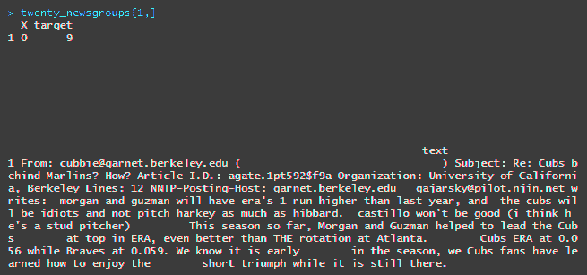

1.  现在，让我们把这段文本拆分成词元。词元是我们在前面截图中看到的文本字符串的一个基本部分。在这种情况下，我们将把这个字符串拆分成单词词元。最终结果将是每个单词列出一行，旁边是 ID 和新闻组 ID。我们使用以下代码对文本数据进行分词：

```py
word_tokens <- twenty_newsgroups %>%
  unnest_tokens(word, text)
```

运行这段代码后，我们可以看到数据对象已经大幅增长。现在，我们的数据有 350 万行，而之前只有 11,000 行，因为每个单词现在都有了自己的一行。

1.  现在，让我们快速查看一下词频情况，既然每个单词已经被分隔到各自的一行。在这一步中，我们可以开始观察某些词汇是否比其他词更频繁出现在数据集中。为了绘制数据中每个词的频率，我们将使用以下代码：

```py
word_tokens %>%
  group_by(word) %>%
  summarize(word_count = n()) %>%
  top_n(20) %>%
  ggplot(aes(x=reorder(word, word_count), word_count)) +
  xlab("word") +
 geom_col() +
  coord_flip() 
```

运行这段代码后，我们将看到生成的以下图表：

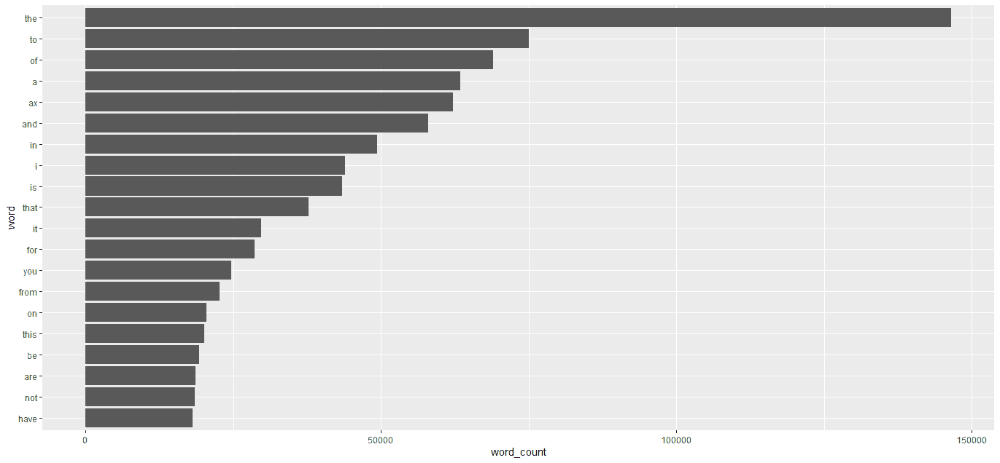

我们成功地将一些文本分割成了词元。然而，从图表中我们可以看到，像“the”、“to”、“of”和“a”这样的词汇最为常见。这类词通常会被打包成一组词汇，称为**停用词**。接下来，我们将学习如何移除这些没有信息价值的词汇。

# 清理文本以移除噪音

我们为文本分析做的下一步准备工作是进行一些初步的清理。这是一种常见的起步方式，无论后续将应用何种机器学习方法。当处理文本时，有一些词汇和模式无法提供有意义的信息。部分词汇通常没有用处，移除这些文本数据的步骤可以每次都用，而其他的则更多依赖于具体的上下文。

如前所述，有一些词组被称为停用词。这些词没有信息价值，通常可以移除。为了从我们的数据中移除停用词，我们使用以下代码：

```py
word_tokens <- word_tokens %>%
  filter(!word %in% stop_words$word)
```

运行前面的代码后，我们的行数从 350 万降到了 170 万。实际上，通过移除所有停用词，我们的数据（`word_tokens`）几乎减少了一半。接下来，我们运行之前的绘图代码，看看现在哪些词汇是最常见的。我们可以通过以下代码行来识别词频：

```py
word_tokens %>%
  group_by(word) %>%
  summarize(word_count = n()) %>%
  top_n(20) %>%
  ggplot(aes(x=reorder(word, word_count), word_count)) +
  xlab("word") +
  geom_col() +
  coord_flip() 
```

运行这段代码后，将生成以下图表：

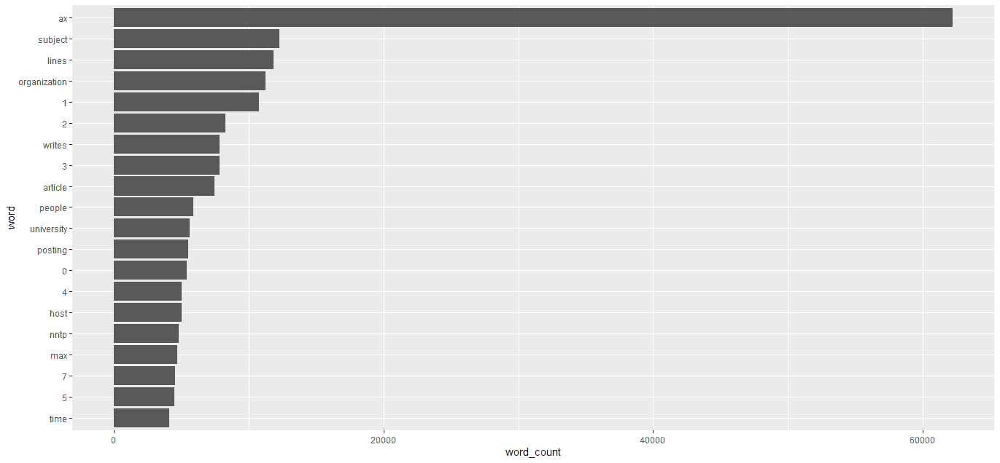

在这张图中，我们可以看到诸如 the、to、of 和 a 这样的词语已被移除。然而，我们也可以看到一些数字作为常见术语出现在图中。这可能是上下文相关的，并且在某些情况下，从文本中提取数字对项目来说非常重要。然而，在这里我们将重点关注实际的单词，并移除所有包含非字母字符的术语。我们可以使用一些正则表达式（regex）来完成这一点。通过使用以下代码，我们可以移除不包含字母表字符的术语：

```py
word_tokens <- word_tokens %>%
  filter(str_detect(word, "^[a-z]+[a-z]$"))
```

运行完这个正则表达式（regex）代码后，我们可以再次运行之前的绘图代码。当我们这么做时，会生成如下所示的图表：

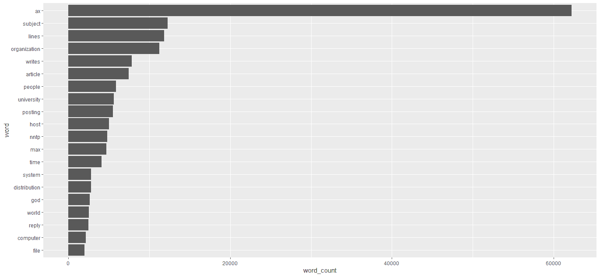

基于这个图表，我们可以看到我们的前二十个术语都是单词，其中包括一个可能的缩写词（nntp）。现在，我们的数据对象已减少至 140 万行，只包含以字母表中的字符开头和结尾的术语，接下来我们准备进入下一步，即使用嵌入（embeddings）为每个术语添加额外的上下文。

# 应用词嵌入以增加可用数据

从文本中提取术语是文本分析的良好起点。通过我们目前创建的文本词元，我们可以比较不同类别的术语频率，这开始讲述一个关于特定新闻组中占主导地位内容的故事。然而，单独的术语只是我们从某个术语中可以获得的整体信息的一部分。之前的图表中包含了`people`这个词，当然我们知道这个词的含义，尽管它与该术语相关的多个细微差别需要进一步解释。例如，`people`是一个名词。它与诸如*person*和*human*之类的术语相似，也与*household*之类的术语相关。所有这些与`people`相关的细节可能都很重要，但仅通过提取术语，我们无法直接推导出这些其他细节。这就是嵌入特别有用的地方。

在自然语言处理的背景下，嵌入（embeddings）是经过预训练的神经网络，执行如上所述的映射类型。我们可以使用这些嵌入将词性与术语匹配，并计算词语之间的词汇距离。让我们从查看词性嵌入开始。为了检查文本数据集中每个术语的词性，我们运行以下代码：

```py
spacy_install()

spacy_initialize(model = "en_core_web_sm")

spacy_parse(twenty_newsgroups$text[1], entity = TRUE, lemma = TRUE)
```

使用前面的代码，我们首先在机器上安装`spacy`。接下来，我们使用一个小型（`sm`）英语（`en`）模型来初始化`spacy`，该模型经过网络文本（`web`）的训练，涵盖`spacy`的核心元素：命名实体、词性标注和句法依赖。然后，我们将该模型应用于数据集中的第一条文本。这样做后，我们会在控制台中看到以下结果：

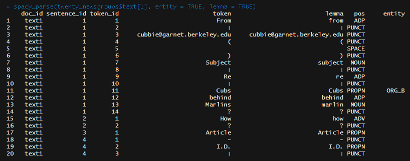

在前面的例子中，我们看到`spacy`将每个词汇分别存储，并为其分配一个词汇 ID 和句子 ID。每个词汇旁边列出了三项附加数据。我们来看一下`11`词汇 ID 的例子。在这个例子中，`Cubs`被模型识别为一个词性，它是一个专有名词，命名实体类型是**组织**。我们看到`ORG_B`代码，这意味着这个词汇以一个组织的名字开始。在这个例子中，这个单一的词汇就代表着组织名称的开始和结束。

我们来看几个其他例子。如果你在控制台中向下滚动结果，你应该能找到类似以下输出的部分：

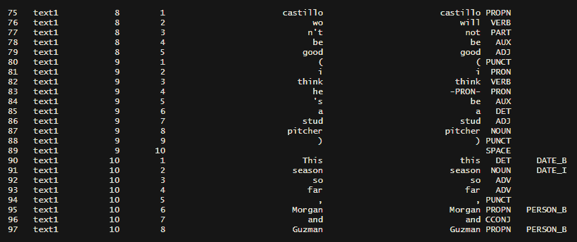

在前面的截图中，我们看到了`spacy`可以识别的额外信息。我们来看一下`76`和`77`行。我们看到文本中使用的词是`won't`。然而，`spacy`模型使用了词形还原来拆分这个缩写。自然，`won't`只是`will not`的缩写形式，模型已经将构成这个缩写的两个词分开了。另外，每个词的词性也被包含在内。另一个例子是`90`和`91`行。这里，`this`和`season`是相邻的，模型正确地将这两个词一起识别为指向特定日期部分的词性，这意味着它不是`last season`或者`next season`，而是`this season`。在命名实体列中，`this`具有`DATE_B`标签，这意味着该词表示日期，并且它是这个特定日期类型的开始部分。类似地，`season`具有`DATE_I`标签，这意味着它表示一个日期类型的数据，并且该词在实体内部。从这两个标签，我们可以知道`this`和`season`是相关的，并且一起指代一个特定的时间点。

我们还可以通过使用词嵌入将文本数据聚类为主题组。主题分组将生成一个数据对象，其中包含在文本中彼此靠近共现的词汇列表。通过这个过程，我们可以看到在我们分析的文本数据中，哪些话题被讨论得最多。接下来，我们将创建主题组聚类。

# 将数据聚类为主题组

我们可以使用词嵌入来找到所有语义相似的词汇。为此，我们将使用`textmineR`包来创建一个 skip-gram 模型。skip-gram 模型的目标是查找在给定窗口内与另一个词汇经常同时出现的词汇。由于这些词汇在我们的文本句子中如此频繁地靠近在一起，我们可以得出它们彼此之间有某种联系的结论。我们将通过以下步骤开始：

1.  为了开始构建我们的 skip-gram 模型，我们首先通过运行以下代码创建一个词汇共现矩阵：

```py
tcm <- CreateTcm(doc_vec = twenty_newsgroups$text,
                 skipgram_window = 10,
                 verbose = FALSE,
                 cpus = 2)
```

运行代码后，你的环境窗口中将会有一个`sparse`矩阵。该矩阵的两个维度上有所有可能的术语，并且在这些术语相互出现在跳字窗口内时，矩阵中相应位置会显示一个值，跳字窗口在本例中为`10`。矩阵的部分内容如下所示：

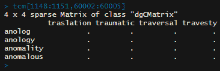

1.  接下来，我们将基于我们刚刚创建的文本共现矩阵，拟合一个**潜在狄利克雷分配**（**LDA**）模型。对于我们的模型，我们将选择创建 20 个主题，并让模型执行 500 次 Gibbs 迭代，设置`burning`值为`200`，即我们首先丢弃的样本数。我们将设置`calc_coherence`为`TRUE`以包括该度量。`coherence`是主题中术语之间的相对距离，我们将使用这个距离值来对找到的主题强度进行排名。我们通过运行以下代码来定义我们的 LDA 模型：

```py
embeddings <- FitLdaModel(dtm = tcm,
                          k = 20,
                          iterations = 500,
                          burnin = 200,
                          calc_coherence = TRUE)
```

1.  下一步，我们将为每个主题提取最重要的术语。我们将使用`phi`，它表示主题中单词的分布，以及参数`M`，用来选择每个主题集群中包含多少个术语。我们可以通过运行以下代码来获取每个主题的最重要术语：

```py
embeddings$top_terms <- GetTopTerms(phi = embeddings$phi,
                                    M = 5)
```

1.  我们将提取我们的主题和重要术语，并添加`coherence`评分以及`prevalence`评分，后者表示这些术语在我们分析的整个文本语料库中出现的频率。我们可以通过运行以下代码来构建这个摘要数据对象：

```py
embeddings$summary <- data.frame(topic = rownames(embeddings$phi),
                                 coherence = round(embeddings$coherence, 3),
                                 prevalence = round(colSums(embeddings$theta), 2),
                                 top_terms = apply(embeddings$top_terms, 2, function(x){
                                   paste(x, collapse = ", ")
                                 }),
                                 stringsAsFactors = FALSE)
```

1.  现在我们已经创建了这个摘要数据对象，我们可以根据`coherence`值查看前五个主题。我们可以通过运行以下代码，识别出哪些主题的术语相对更接近：

```py
embeddings$summary[order(embeddings$summary$coherence, decreasing = TRUE),][1:5,]
```

当我们运行前面的代码时，我们会看到文本对象中识别出的前五个主题。你将在控制台中看到以下主题：

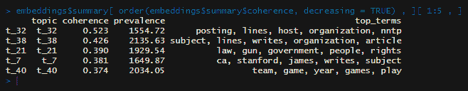

我们已经加载了文本数据，从文本中提取了术语，使用模型识别了与术语相关的信息——如命名实体细节和词性——并根据在文本中发现的主题组织了这些术语。接下来，我们将通过建模来减少我们的文本对象，以总结文档内容。

# 使用模型结果总结文档

在最后一步，在开始构建我们自己的模型之前，我们将使用`textrank`包来总结文本。该算法用于总结文本的方法是寻找一个包含最多在文本数据中其他句子中出现的词汇的句子。我们可以看到，这种类型的句子非常适合用来总结文本，因为它包含了在其他地方出现的许多词汇。为了开始，我们从我们的数据中选择一段文本：

1.  让我们通过运行以下代码来查看第`400`行的文本：

```py
twenty_newsgroups$text[400]
```

当我们运行这行代码时，我们会在控制台看到以下文本：

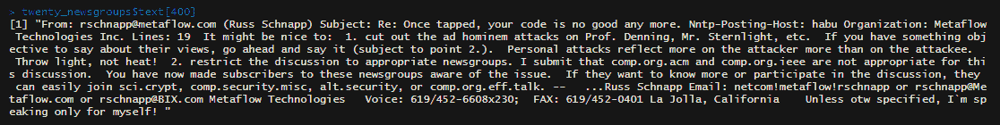

在这封邮件中，我们可以看到主题是反对他人邮件的内容，因为它与主题无关。

1.  让我们看看`textrank`算法将提取哪一句来总结文本。首先，我们将对文本进行分词处理。然而，不像之前我们创建了词汇分词，这次我们将创建句子分词。此外，我们还将使用每个提取句子的行号作为句子 ID。为了从文本中创建句子分词，我们运行以下代码：

```py
sentences <- tibble(text = twenty_newsgroups$text[400]) %>%
  unnest_tokens(sentence, text, token = "sentences") %>%
```

```py
  mutate(id = row_number()) %>%
  select(id, sentence)
```

1.  接下来，我们将像之前一样创建词汇分词。记住，创建句子和词汇分词的原因是我们需要查看哪些词汇出现在最多的句子中，而在这些词汇中，哪一个句子包含最多频繁出现的词汇。为了创建每行一个词的数据对象，我们运行以下代码：

```py
words <- sentences %>%
  unnest_tokens(word, sentence)
```

1.  接下来，我们运行`textrank_sentences`函数，它按之前描述的方式计算最佳的摘要句子。我们通过运行以下代码计算`textrank`分数，这个分数衡量哪些句子最能总结文本：

```py
article_summary <- textrank_sentences(data = sentences, terminology = words)
```

我们现在已经对句子进行了排名。如果查看摘要，我们可以看到默认显示的是前五个句子。然而，在这种情况下，让我们从排名最高的句子开始，看看它如何总结整体文本。

1.  要查看排名最高的句子，我们首先必须查看返回列表中的第一个对象，这个对象是一个包含句子及其对应`textrank`分数的数据框。接着，我们按照`textrank`分数降序排列，选择评分最高的句子。然后，我们选择顶部的行，并仅提取句子数据。为了打印基于`textrank`算法的排名最高的句子，我们运行以下代码：

```py
article_summary[["sentences"]] %>%
  arrange(desc(textrank)) %>% 
  top_n(1) %>%
  pull(sentence)
```

运行这段代码后，您将看到如下的控制台输出：

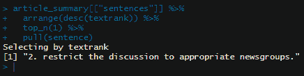

选中的句子是将讨论限制在适当的新闻组中。如果我们重新阅读整篇文本，可以看到这句话确实捕捉到了作者想要表达的核心内容。实际上，如果邮件只有这一行，它几乎能传达相同的信息。通过这种方式，我们可以确认`textrank`算法表现良好，选中的句子是整个文本的一个很好的总结。

现在我们已经介绍了一些由各种 R 包提供的基础文本分析工具，接下来我们将开始创建自己的深度学习文本模型。

# 创建 RBM

到目前为止，我们已经从文本中提取了元素，添加了元数据，并创建了术语集群来发现潜在主题。接下来，我们将通过使用一种深度学习模型——RBM（受限玻尔兹曼机）来识别潜在特征。正如你可能记得的，我们曾通过在给定的窗口大小内寻找术语共现来发现文本中的潜在主题。在这种情况下，我们将重新回到使用神经网络的方法。RBM 是典型神经网络的一半。它不是通过隐藏层将数据传递到输出层，而是仅将数据传递到隐藏层，输出就是这个隐藏层的内容。最终结果类似于因子分析或主成分分析。在这里，我们将开始查找数据集中每个 20 个新闻组的过程，并且在本章的其余部分，我们将对模型进行修改以提高其性能。

为了开始构建我们的 RBM，我们需要加载两个库。第一个库是`tm`，它用于 R 中的文本挖掘，具有创建文档-术语矩阵和执行文本清理的功能。另一个库是`deepnet`，它有一个用于 RBM 的函数。为了加载这两个库，我们运行以下代码：

```py
library(tm)
library(deepnet)
```

接下来，我们将取出我们的文本数据并创建一个语料库，在这个语料库中，每个新闻组的电子邮件内容将被放置在单独的列表元素中。然后，我们将移除一些不含有信息的元素。我们还将把所有文本转换为小写，以减少唯一术语的数量，并将相同的术语按字母大小写归类。之后，我们将把剩余的术语转换为文档-术语矩阵，其中所有术语构成矩阵的一个维度，所有文档构成另一个维度，矩阵中表示的值是该术语是否出现在文档中。我们还将使用**词频-逆文档频率**（**tf-idf**）加权。

在这种情况下，矩阵中的值将不再是二进制的，而是一个浮动值，表示术语在文档中的唯一性，减少那些在所有文档中都频繁出现的术语的权重，并增加那些仅出现在一个或一些文档中，而不是所有文档中的术语的权重。为了执行这些步骤并准备我们的文本数据输入到 RBM 模型中，我们运行以下代码：

```py
corpus <- Corpus(VectorSource(twenty_newsgroups$text))

corpus <- tm_map(corpus, content_transformer(tolower))
corpus <- tm_map(corpus, removeNumbers)
corpus <- tm_map(corpus, removePunctuation)
corpus <- tm_map(corpus, removeWords, c("the", "and", stopwords("english")))
corpus <- tm_map(corpus, stripWhitespace)

news_dtm <- DocumentTermMatrix(corpus, control = list(weighting = weightTfIdf))
news_dtm <- removeSparseTerms(news_dtm, 0.95)
```

我们将像任何建模任务一样，现在将我们的数据分割成`train`和`test`集合。在这种情况下，我们将通过运行以下代码来创建我们的`train`和`test`集合：

```py
split_ratio <- floor(0.75 * nrow(twenty_newsgroups))

set.seed(614)
train_index <- sample(seq_len(nrow(twenty_newsgroups)), size = split_ratio)

train_x <- news_dtm[train_index,]
train_y <- twenty_newsgroups$target[train_index]
test_x <- news_dtm[-train_index,]
test_y <- twenty_newsgroups$target[-train_index]
```

当数据已经按照正确的格式，并分割成`train`和`test`集合时，我们现在可以训练我们的 RBM 模型。训练模型非常直接，配置的参数并不多。暂时，我们将修改一些参数，并随着章节的进展对其他参数做出调整。首先，我们将通过运行以下代码来训练一个初步的 RBM 模型：

```py
rbm <- rbm.train(x = as.matrix(train_x), hidden = 20, numepochs = 100)
```

在前面的代码中，我们将 `hidden` 层设置为新闻组的数量，以查看是否有足够的潜在信息将文本映射到新闻组上。我们从 `100` 轮开始，其他设置保持默认。

我们现在可以探索文本中找到的潜在特征。我们使用训练好的模型来执行此任务，通过将数据作为输入，从而生成推断的隐藏单元作为输出。我们通过运行以下代码来推断 `test` 数据的隐藏单元：

```py
test_latent_features <- rbm.up(rbm, as.matrix(test_x))
```

运行这段代码后，我们已经定义了 `test` 数据的潜在特征空间。

# 定义吉布斯采样率

吉布斯采样在构建 RBM 模型中起着关键作用，因此我们在这里稍作停留，定义这一采样类型。我们将简要介绍几个快速概念，帮助理解如何执行吉布斯采样，以及为什么这种方法对这种类型的建模至关重要。在 RBM 模型中，我们首先使用神经网络将输入或可见单元映射到隐藏单元，这些可以看作是潜在特征。在训练我们的模型后，我们希望通过给定一个新的可见单元，定义它属于模型中隐藏单元的概率，或者反过来做。我们还希望这个过程在计算上是高效的，因此我们使用了蒙特卡罗方法。

蒙特卡罗方法涉及通过采样随机点来近似一个区域或分布。一个经典的例子是绘制一个 10x10 英寸的正方形，并在正方形内绘制一个圆。我们知道，直径为 10 英寸的圆的面积是 78.5 平方英寸。现在，如果我们使用随机数生成器选择 0 到 10 之间的浮动对，并进行 20 次操作并绘制这些点，我们可能会得到约 15 个点位于圆内，5 个点位于圆外。如果我们仅使用这些点，那么我们会估算该区域面积为 75 平方英寸。现在，如果我们尝试用一个不那么传统但有许多曲线和角度的形状来进行类似的操作，那么计算面积将变得更加困难。然而，我们仍然可以使用相同的方法来近似该区域。通过这种方式，当一个分布难以精确地定义或计算成本高昂时，蒙特卡罗方法会发挥很好的作用，这正是我们的 RBM 模型所面临的情况。

接下来，马尔科夫链是一种定义条件概率的技术，它仅考虑紧接在我们试图预测的事件概率之前发生的事件，而不是考虑发生在两步或更多步之前的事件。这是一种非常简单的条件概率形式。一个经典的例子用于解释这个概念的是“滑梯与梯子”游戏。在这个游戏中，有 100 个方格，玩家掷一个六面骰子来决定移动的步数，目标是到达第 100 格。在过程中，有些方格可能包含一个滑梯，玩家会倒退一定数量的方格，或者有一个梯子，玩家会向前移动一定数量的方格。

在确定停留在某个特定方格的可能性时，唯一重要的是导致玩家停留在某个方格上的上一轮掷骰子。无论是哪种掷骰子的组合将玩家带到这个点，都不会影响基于玩家当前所在方格到达某个特定方格的概率。

为了提供一些背景，我们将简要讨论这两个概念，因为它们都涉及到吉布斯采样。这种类型的采样是一种蒙特卡洛马尔可夫链方法，这意味着我们从一个初始状态开始，然后我们预测在给定另一个事件`y`的情况下，某个事件`x`发生的可能性，反之亦然。通过计算这种相互之间的条件概率，经过一定数量的样本后，我们可以高效地近似给定的`visible`单元属于某个`hidden`单元的概率。我们可以通过一些非常简单的吉布斯分布采样示例来进行实验。在这个示例中，我们将创建一个函数，使用参数`rho`作为系数值，在计算另一个变量的值时修改给定项，而在我们的 RBM 模型中，学习到的权重和偏置项执行了这个功能。让我们使用以下步骤创建一个采样器：

1.  首先，让我们定义一个非常简单的吉布斯采样器，通过运行以下代码来理解这个概念：

```py
gibbs<-function (n, rho) 
{
  mat <- matrix(ncol = 2, nrow = n)
  x <- 0
  y <- 0
  mat[1, ] <- c(x, y)
  for (i in 2:n) {
    x <- rnorm(1, rho * y, sqrt(1 - rho²))
    y <- rnorm(1, rho * x, sqrt(1 - rho²))
    mat[i, ] <- c(x, y)
  }
  mat
}
```

现在我们已经定义了函数，让我们通过选择两个不同的`rho`值来计算两个独立的 10 x 2 矩阵。

1.  我们通过以下代码计算第一个 10 x 2 矩阵，使用`0.75`作为`rho`的值：

```py
gibbs(10,0.75)
```

1.  接下来，我们使用`0.03`作为`rho`的值，通过以下代码计算一个 10 x 2 的矩阵：

```py
gibbs(10,0.03)
```

在运行完每个步骤后，你应该能在控制台看到打印出的 10 x 2 矩阵。这个函数涉及从正态分布中抽取随机值，因此你在控制台上看到的矩阵会略有不同。不过，你会看到值是如何通过使用前一个迭代的值来逐步生成当前迭代的值的。我们可以看到蒙特卡洛的随机性是如何在计算我们的值时与马尔可夫链的条件概率一起使用的。现在，通过理解吉布斯采样，我们将探讨对比发散，它是我们可以利用吉布斯采样的知识来修改我们模型的一种方式。

# 通过对比发散加速采样

在继续之前，我们需要更换使用的数据集。虽然 20 个新闻组数据集到目前为止很好地适用于所有文本分析概念，但当我们尝试真正调优模型以预测潜在特征时，它变得不再那么适用了。接下来我们所做的所有额外修改对使用 20 个新闻组数据集的模型几乎没有影响，因此我们将切换到垃圾邮件与正常邮件的数据集，它们相似。不过，与其说是新闻组的电子邮件，这里是短信文本信息。此外，目标变量不再是一个给定的新闻组，而是判断消息是否是垃圾邮件或合法短信。

对比散度是一个可以帮助我们利用吉布斯采样学习的参数。我们在模型中传递给这个参数的值将调整吉布斯采样的执行次数。换句话说，这控制着马尔可夫链的长度。值越低，每一轮模型的执行速度越快。如果值较高，那么每一轮的计算开销较大，尽管模型可能更快收敛。在接下来的步骤中，我们可以使用三个不同的对比散度值来训练模型，看看调整这个参数对模型的影响：

1.  首先，我们将使用以下代码加载垃圾邮件与正常邮件的数据集：

```py
spam_vs_ham <- read.csv("spam.csv")
```

1.  接下来，我们将目标变量移到一个向量`y`中，将预测文本数据移到变量`x`中。之后，我们将进行一些基本的文本预处理，移除特殊字符和一字或二字词，并去除任何空白字符。我们通过运行以下代码定义目标变量和预测变量，并清理文本：

```py
y <- if_else(spam_vs_ham$v1 == "spam", 1, 0)
x <- spam_vs_ham$v2 %>% 
  str_replace_all("[^a-zA-Z0-9/:-_]|\r|\n|\t", " ") %>% 
  str_replace_all("\b[a-zA-Z0-9/:-]{1,2}\b", " ") %>%
  str_trim("both") %>%
  str_squish()
```

1.  接下来，我们将这段清理后的文本转换成一个`corpus`数据对象，然后再转化为文档-词矩阵。我们通过运行以下代码，将文本数据转换为适合建模的格式：

```py
corpus <- Corpus(VectorSource(x))
dtm <- DocumentTermMatrix(corpus)
```

1.  接下来，我们将数据分成`train`和`test`两部分，就像我们在 20 个新闻组数据集上做的那样。我们使用以下代码将数据划分并准备好用于建模：

```py
split_ratio <- floor(0.75 * nrow(dtm))

set.seed(614)
train_index <- sample(seq_len(nrow(dtm)), size = split_ratio)

train_x <- dtm[train_index,]
train_y <- y[train_index]
test_x <- dtm[-train_index,]
test_y <- y[-train_index]
```

1.  现在所有数据都已准备好，让我们运行三个模型并看看它们的比较。我们运行这三个 RBM 模型的简化版，通过以下代码评估调整对比散度值对模型的影响：

```py
rbm3 <- rbm.train(x = as.matrix(train_x),hidden = 100,cd = 3,numepochs = 5)
rbm5 <- rbm.train(x = as.matrix(train_x),hidden = 100,cd = 5,numepochs = 5)
rbm1 <- rbm.train(x = as.matrix(train_x),hidden = 100,cd = 1,numepochs = 5)
```

为了衡量这个参数对模型的影响，我们将使用模型对象中的自由能值。

# 计算模型评估的自由能

RBM（受限玻尔兹曼机）属于一类基于能量的模型。它们使用的自由能方程类似于其他机器学习算法中的代价函数。就像代价函数一样，目标是最小化自由能值。较低的自由能值意味着可见单元变量更有可能被隐藏单元描述，而较高的自由能值则表示较低的可能性。

现在让我们查看我们刚刚创建的三个模型，并比较这些模型的自由能量值。我们通过运行以下代码来比较自由能量，从而识别哪个模型表现更好：

```py
rbm5$e[1:10]
rbm3$e[1:10]
rbm1$e[1:10]
```

运行此代码后，控制台将打印出类似以下的输出：

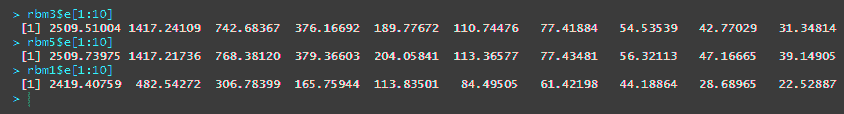

在这种情况下，只使用一轮 Gibbs 采样就能生成在最快方式下减少自由能量的最佳模型。

# 堆叠 RBM 创建深度置信网络

RBM 模型是一个只有两层的神经网络：输入层，即可见层，以及具有潜在特征的隐藏层。然而，可以添加额外的隐藏层和输出层。当在 RBM 的上下文中进行此操作时，它被称为 **深度置信网络**。因此，深度置信网络就像其他深度学习架构一样。对于深度置信网络，每个隐藏层是完全连接的，意味着它学习整个输入。

第一层是典型的 RBM，其中潜在特征是从输入单元计算得出的。在下一层中，新的隐藏层从前一个隐藏层学习潜在特征。这样，最终可以得到一个用于分类任务的输出层。

实现深度置信网络使用的语法与训练 RBM 时所用的语法相似。为了开始，我们首先对刚训练好的 RBM 的潜在特征空间进行快速检查。为了打印出模型的潜在特征空间的样本，我们使用以下代码：

```py
train_latent_features <- rbm.up(rbm1, as.matrix(train_x))
test_latent_features <- rbm.up(rbm1, as.matrix(test_x))
```

在前面的代码中，我们使用 `up` 函数通过我们刚刚拟合的模型生成潜在特征矩阵。`up` 函数以一个 RBM 模型和一个可见单元矩阵为输入，并输出一个隐藏单元矩阵。反之也可以。`down` 函数以一个隐藏单元矩阵为输入，输出可见单元。通过前面的代码，我们将看到类似以下内容的输出打印到控制台：

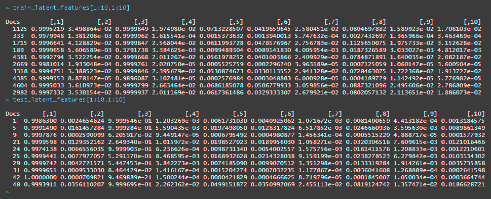

我们可以看到第一层特征空间中的方差。为了准备下一步，我们可以想象将此矩阵作为输入传递给另一个 RBM，以便进一步学习特征。通过这种方式，我们可以使用与训练 RBM 时几乎相同的语法来编码我们的深度置信网络。唯一的区别是，对于隐藏层参数，我们不再使用表示单个隐藏层单元数量的单一值，而是可以使用一个表示每个连续隐藏层单元数量的值向量。对于我们的深度置信网络，我们将从 `100` 个单元开始，就像我们的 RBM 一样。

接下来，我们将在下一层将单元数减少到`50`，在那之后的层减少到`10`。另一个不同之处是，我们现在有了一个目标变量。虽然 RBM 是一个无监督的生成模型，但我们可以利用我们的深度置信网络执行分类任务。我们使用以下代码训练深度置信网络：

```py
dbn <- dbn.dnn.train(x = as.matrix(train_x), y = train_y, hidden = c(100,50,10), cd = 1, numepochs = 5)
```

在训练好深度置信网络之后，我们现在可以使用该模型进行预测。我们执行预测任务的方式与大多数机器学习任务的预测生成方式类似。然而，在这种情况下，我们将使用`nn.predict`函数来使用训练好的神经网络预测新的测试输入是否应该被分类为垃圾邮件或合法文本。我们使用以下代码对`test`数据进行预测：

```py
predictions <- nn.predict(dbn, as.matrix(test_x))
```

我们现在已经得到了概率值，这些概率值告诉我们给定的消息是否是垃圾邮件。这些概率目前在一个受限范围内；然而，我们仍然可以使用它。让我们在概率上设置一个截断点，对于高于该阈值的概率值，我们将其标记为`1`，表示消息被预测为垃圾邮件，而低于该截断点的所有值将被赋值为`0`。在设置好这个分界线并创建一个二值化的向量后，我们可以创建混淆矩阵来查看模型的表现。我们创建了二进制变量，然后通过运行以下代码来评估模型的表现：

```py
pred_class <- if_else(predictions > 0.3, 1, 0)
table(test_y,pred_class)
```

运行上述代码后，我们将在控制台看到以下输出：

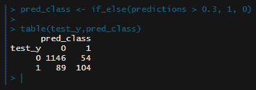

如我们所见，即使这个非常简单的深度置信网络实现也表现得相当不错。从这里开始，可以进一步修改隐藏层的数量、每层的单元数、输出激活函数、学习率、动量、丢弃率，以及对比散度和迭代次数等参数。

# 总结

在本章中，我们介绍了多种分析文本数据的方法。我们从提取文本数据中的元素技巧开始，比如将句子分解为标记并比较词频，收集主题、识别最佳摘要句子，并从文本中提取这些内容。接下来，我们使用了一些嵌入技术，为我们的数据添加更多细节，如词性标注和命名实体识别。最后，我们使用了 RBM 模型来发现输入数据中的潜在特征，并将这些 RBM 模型堆叠起来执行分类任务。在下一章中，我们将探讨如何利用深度学习处理时间序列任务，尤其是股票价格预测。
