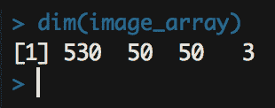

# 第九章：用于面部的生成对抗网络

在上一章中，我们在时间序列预测任务中使用了**长短期记忆**（**LSTM**）模型。在本章中，我们将创建一个生成器模型，这意味着该模型将不会输出预测结果，而是输出文件（在此案例中为图像）。我们在第七章，*深度学习与自然语言处理*中创建了生成器模型；然而，在那个案例中，我们仅生成了潜在特征。在这里，我们将描述**生成对抗网络**（**GANs**）的主要组件和应用。你将了解 GAN 的常见应用，并学习如何使用 GAN 构建面部生成模型。

在本章中，我们将探讨 GAN 的架构。GAN 由两个相互竞争的神经网络组成，其中一个被称为**生成器模型**。它接受随机数据并生成合成目标数据。GAN 的另一个部分是**判别器模型**。该模型接受两种输入——合成目标数据和真实目标数据——并判断哪一个是真实的目标数据。理解这一过程后，我们将使用 Keras 包和来自*标注面孔数据集*的图像来编写我们自己的面部识别和生成的 GAN 模型代码。

在本章中，我们将讨论以下主题：

+   GAN 概述

+   定义生成器模型

+   定义判别器模型

+   准备和预处理数据集

+   训练和评估模型

# 技术要求

你可以在以下 GitHub 链接中找到本章使用的代码文件：

[`github.com/PacktPublishing/Hands-on-Deep-Learning-with-R`](https://github.com/PacktPublishing/Hands-on-Deep-Learning-with-R)

# GAN 概述

GAN 是一种将两个神经网络相互对抗的建模算法。其中一个使用随机数据生成输出，另一个评估真实目标数据与生成的输出，并判断哪一个是实际的。随着时间的推移，第一个神经网络生成更好的伪目标数据，而第二个神经网络则继续尝试判断哪个是真实的目标数据。这两个神经网络不断竞争，模型也不断改进，以生成越来越逼真的合成数据。

解析这个术语，我们可以看到这种建模技术与其他技术的区别。首先，它是生成性的，这意味着目标是生成数据。这与其他模型（如分类或回归模型）不同，后者预测概率或数值。接下来，它是对抗性的。也就是说，存在两个模型，它们彼此对抗。通常，我们有一个模型，它在可评估的数据上进行训练，并使用各种度量来改进性能。然而，在这种情况下，我们有一个模型，旨在提高预测性能，它是判别器模型。此外，我们还有另一个模型，它创建虚假图像，试图降低判别器模型的性能。

我们通常将机器学习分为两大类：

+   **监督学习**：模型使用标注的目标数据来进行预测

+   **无监督学习**：模型在没有任何标注目标数据的情况下识别模式

然而，我们可以通过无监督学习进一步细化。GAN 属于无监督学习的一个特殊子集，它使用从未标注数据中学到的模式来生成合成数据，而不仅仅是对数据进行分类。然而，这为我们带来了一个问题。由于目标是生成数据，因此没有直接的度量可以用来评估性能。GAN 模型的相对成功或失败主要取决于对输出的主观解释。

对于这个 GAN，我们将使用图像作为输入。所有图像都可以表示为灰度图像的值矩阵，或者彩色图像的三个值矩阵。这些矩阵的值范围从`0`到`255`，对应于该位置像素值的强度。例如，像素值为`255`表示高强度或黑色（对于灰度图像），而`0`表示低强度或白色。矩阵的维度对应于图像的像素宽度和高度。彩色图像表示为三维数组。这可以看作是三个矩阵重叠，每个矩阵对应于图像的红色、绿色和蓝色像素值的强度。让我们来看一张示例图像，并查看它如何表示为值的矩阵。为此，我们将读取以下形状：


要以这种形状读取，我们将使用`OpenImageR`包。这个包将文件读取为一个四维数组。在这种情况下，我们只需要第四维，它包含灰度值。为了读取这个文件并查看一个小片段，我们运行以下代码：

```py
library(OpenImageR)

clock <- readImage("Alarms_&_Clock_icon.png")

clock[1:10,46:56,4]
```

运行此代码后，我们将看到以下内容打印到控制台：


我们可以看到这些值表示了闹钟左侧铃铛的顶部。零值是白色空间，第二行和顶行显示出梯度，呈现曲线。通过这种方式，我们可以看到图像如何作为一个介于 `0` 和 `1` 之间的值矩阵来表示。

# 定义生成器模型

生成器模型是创建合成目标数据的神经网络，通过随机输入生成。在这种情况下，我们将反向使用 **卷积神经网络** (**CNN**) 。这意味着我们将从一个数据点向量开始，创建一个全连接层，然后将数据重塑为我们希望的尺寸。作为中间步骤，我们将目标形状设为原来的一半大小，然后使用转置卷积层进行上采样。最终，我们得到一个归一化的像素值数组，其形状与我们的目标数组相同。这个数组将成为用于试图欺骗判别器模型的数据对象。这个合成值的数组将随着时间的推移被训练，使其更像目标数据对象中的值，以至于判别器模型无法以高概率预测哪个是真实的数据图像。我们将使用以下步骤定义判别器模型：

1.  首先，我们将定义我们的入口点是一个 100 维的向量。我们定义模型的所有操作都将使用 Keras 完成。所以，在此步骤中，我们加载 Keras 模型。接下来，我们将输入形状定义为一个包含 100 个值的向量。

1.  然后，我们将传递一个向量到这个模型中。在这个步骤中，我们告诉模型我们将在后续步骤中传递的内容。使用以下代码，我们声明该模型的输入将是一个包含 100 个值的向量，稍后我们会用随机值填充它：

```py
library(keras)
generator_in <- layer_input(shape = c(100))  
```

1.  运行此步骤后，我们可以看到在数据环境中有一个特殊的数据对象，称为`Tensor`。该对象包含了层的类型、名称、形状和数据类型。你的数据环境将如下图所示：


1.  在此之后，我们定义如何处理、转换和重塑我们的随机值，以创建一个与目标数组匹配的合成数组。实现这一点的代码比较长，但其中许多部分是重复的。有一些行是必需的，而其他的可以修改。`layer_dense` 层需要包含稍后在 `layer_reshape` 层中出现的单元数量。在这种情况下，我们将创建一个宽度和高度为 `25`、深度为 `128` 的形状。深度是可以修改的，但在使用一个转置卷积层时，宽度和高度必须设置为最终图像尺寸的一半，具体如下：

```py
generator_out <- generator_in %>%
   layer_dense(units = 128 * 25 * 25) %>%
   layer_reshape(target_shape = c(25, 25, 128))
```

1.  `layer_conv_2d_transpose` 层使用 2 x 2 的步幅进行上采样，并将层的形状加倍。在此步骤中，形状从 25 x 25 变为 50 x 50：

```py
generator_out <- generator_in %>%
   layer_dense(units = 128 * 25 * 25) %>%
   layer_reshape(target_shape = c(25, 25, 128)) %>%
   layer_conv_2d(filters = 512, kernel_size = 5,
                 padding = "same")
```

1.  卷积层应用了寻找模式的过滤器，而归一化步骤则对卷积结果进行标准化处理。因此，均值接近 0，标准差接近 1，ReLU 作为我们的激活函数。我们将在全连接层和卷积层后添加这些层，使用以下代码：

```py
generator_out <- generator_in %>%
   layer_dense(units = 128 * 25 * 25) %>%
   layer_batch_normalization(momentum = 0.5) %>%
   layer_activation_relu() %>%
   layer_reshape(target_shape = c(25, 25, 128)) %>%
   layer_conv_2d(filters = 512, kernel_size = 5,
                 padding = "same") %>%
   layer_batch_normalization(momentum = 0.5) %>%
   layer_activation_relu() 
```

1.  在此之后，我们可以继续使用相同的卷积、归一化和激活模式，添加额外的卷积层。在这里，我们将添加四组额外的层，使用我们刚才描述的模式：

```py
generator_out <- generator_in %>%
   layer_dense(units = 128 * 25 * 25) %>%
   layer_batch_normalization(momentum = 0.5) %>%
   layer_activation_relu() %>%
   layer_reshape(target_shape = c(25, 25, 128)) %>%
   layer_conv_2d(filters = 512, kernel_size = 5,
                 padding = "same") %>%
   layer_batch_normalization(momentum = 0.5) %>%
   layer_activation_relu() %>%
   layer_conv_2d_transpose(filters = 256, kernel_size = 4,
                           strides = 2, padding = "same") %>%
   layer_batch_normalization(momentum = 0.5) %>%
   layer_activation_relu() %>%
   layer_conv_2d(filters = 256, kernel_size = 5,
                 padding = "same") %>%
   layer_batch_normalization(momentum = 0.5) %>%
   layer_activation_relu() %>%
   layer_conv_2d(filters = 128, kernel_size = 5,
                 padding = "same") %>%
   layer_batch_normalization(momentum = 0.5) %>%
   layer_activation_relu() %>%
   layer_conv_2d(filters = 64, kernel_size = 5,
                 padding = "same") %>%
   layer_batch_normalization(momentum = 0.5) %>%
   layer_activation_relu()
```

1.  在最后一步，`filters`参数需要设置为图像的通道数——在这个例子中，对于彩色图像，它是三个通道：红色、绿色和蓝色。这完成了我们生成器模型的定义。整个生成器模型使用以下代码定义：

```py
generator_out <- generator_in %>%
   layer_dense(units = 128 * 25 * 25) %>%
   layer_batch_normalization(momentum = 0.5) %>%
   layer_activation_relu() %>%
   layer_reshape(target_shape = c(25, 25, 128)) %>%
   layer_conv_2d(filters = 512, kernel_size = 5,
                 padding = "same") %>%
   layer_batch_normalization(momentum = 0.5) %>%
   layer_activation_relu() %>%
   layer_conv_2d_transpose(filters = 256, kernel_size = 4,
                           strides = 2, padding = "same") %>%
   layer_batch_normalization(momentum = 0.5) %>%
   layer_activation_relu() %>%
   layer_conv_2d(filters = 256, kernel_size = 5,
                 padding = "same") %>%
   layer_batch_normalization(momentum = 0.5) %>%
   layer_activation_relu() %>%
   layer_conv_2d(filters = 128, kernel_size = 5,
                 padding = "same") %>%
   layer_batch_normalization(momentum = 0.5) %>%
   layer_activation_relu() %>%
   layer_conv_2d(filters = 64, kernel_size = 5,
                 padding = "same") %>%
   layer_batch_normalization(momentum = 0.5) %>%
   layer_activation_relu() %>%
   layer_conv_2d(filters = 3, kernel_size = 7,
                 activation = "tanh", padding = "same")
```

1.  运行此代码后，我们将看到环境中出现两个对象。我们已经定义了输入的连接张量和输出的连接张量。以这种方式设置张量，使得数据可以通过`keras_model`函数批量输入。此时，您的数据环境应该如下所示：


1.  接下来，我们定义输入为 100 个随机值，输出为映射到与目标图像尺寸相同的数据对象的随机值。

1.  然后我们可以定义`keras_model`，它专门接收输入和输出作为参数。此时，我们传入已定义的张量层，以完成模型的定义。

1.  在定义完模型后，我们可以在生成器模型上运行`summary`函数，帮助我们清楚地看到每一层的数据变化。我们使用以下代码定义生成器并查看其摘要：

```py
generator <- keras_model(generator_in, generator_out)
summary(generator)
```

1.  运行`summary`函数后，我们将看到模型的详细信息打印在控制台上，内容如下所示：


1.  从控制台输出中，我们可以看到，首先是一个全连接层，经过若干中间层后，我们最终得到了一个与目标图像数据形状匹配的最后一层。

我们现在已经完全定义了我们的生成器。我们看到如何插入随机值，并且这些随机值如何转化为合成图像。将数据传递给此模型的过程稍后会进行。现在，已经有了生成假图像的系统，我们接下来定义判别器模型，判别器模型将确定给定的像素数据数组是真实图像还是假图像。

# 定义判别器模型

判别器模型是神经网络，用于评估合成目标数据和真实目标数据，从而确定哪个是真实的。

在这种情况下，判别器是一个 CNN 模型；它接受一个三维数组作为输入。通常，CNN 会使用卷积层和池化层来调整输入的维度——最终连接到一个全连接层。然而，在创建 GAN 时，使用这些层来定义判别器模型时，我们在卷积层中使用 2 x 2 的步幅来调整输入的维度。最终，一个包含一个单元的全连接层会通过 sigmoid 激活函数，计算给定输入为真或假的概率。让我们按照以下代码行来定义判别器模型：

1.  与生成器模型一样，我们先定义输入的形状。虽然生成器模型从一个包含 100 个随机值的向量开始，但我们的判别器从形状为图像数据的输入开始，因为这将被传递给模型。使用以下代码，通过图像的维度来定义输入形状：

```py
discriminator_in <- layer_input(shape = c(50, 50, 3))  
```

1.  运行这段代码会向我们的数据环境中添加一个对象。你的环境面板现在会显示如下截图：


1.  接下来，我们处理并转换我们的数据。生成器将一维向量转换为我们图像数据大小的三维数组，而在这里我们将做相反的操作。我们从形状与图像数据相同的数据开始作为第一层，如以下代码所示：

```py
discriminator_out <- discriminator_in %>%
   layer_conv_2d(filters = 256, kernel_size = 3)
```

1.  我们将添加到判别器的下一个层是一个激活层。对于判别器，我们将使用 Leaky ReLU 激活函数。激活层在第一个卷积层之后添加，因此我们的代码现在如下所示：

```py
discriminator_out <- discriminator_in %>%
   layer_conv_2d(filters = 256, kernel_size = 3) %>%
   layer_activation_leaky_relu()
```

1.  在我们的下一个卷积层中，我们使用 `2` 的步幅来减半高度和宽度，同时加倍深度：

```py
discriminator_out <- discriminator_in %>%
   layer_conv_2d(filters = 256, kernel_size = 3) %>%
   layer_activation_leaky_relu() %>%
   layer_conv_2d(filters = 256, kernel_size = 5, strides = 2) 
```

1.  我们现在可以继续向 Leaky ReLU 激活层添加更多的层，使用相同的卷积层序列。约束条件是——如前所述——在每一层中，高度和宽度都会减半，而深度会加倍，因此高度和宽度的维度必须满足可以被减半且输出为整数，否则你将收到错误信息。在我们的例子中，我们将再添加三组层，因此我们的代码现在看起来如下所示：

```py
discriminator_out <- discriminator_in %>%
   layer_conv_2d(filters = 256, kernel_size = 3) %>%
   layer_activation_leaky_relu() %>%
   layer_conv_2d(filters = 256, kernel_size = 5, strides = 2) %>%   
   layer_activation_leaky_relu() %>%
   layer_conv_2d(filters = 256, kernel_size = 5, strides = 2) %>%
   layer_activation_leaky_relu() %>%
   layer_conv_2d(filters = 256, kernel_size = 3, strides = 2) %>%
   layer_activation_leaky_relu()
```

1.  现在我们需要添加一个层，将我们的值展平成一维，为最终的输出层做准备。当我们添加此层时，我们的代码将如下所示：

```py
discriminator_out <- discriminator_in %>%
   layer_conv_2d(filters = 256, kernel_size = 3) %>%
 layer_activation_leaky_relu() %>%
 layer_conv_2d(filters = 256, kernel_size = 5, strides = 2) %>% 
 layer_activation_leaky_relu() %>%
 layer_conv_2d(filters = 256, kernel_size = 5, strides = 2) %>%
 layer_activation_leaky_relu() %>%
 layer_conv_2d(filters = 256, kernel_size = 3, strides = 2) %>%
 layer_activation_leaky_relu() %>%
 layer_flatten()
```

1.  之后，我们添加了一个 `dropout` 层，它随机删除一些数据，这迫使模型更加努力地工作，并且减缓了训练速度，从而产生更好的泛化能力。添加此层后的代码如下所示：

```py
discriminator_out <- discriminator_in %>%
   layer_conv_2d(filters = 256, kernel_size = 3) %>%
 layer_activation_leaky_relu() %>%
 layer_conv_2d(filters = 256, kernel_size = 5, strides = 2) %>% 
 layer_activation_leaky_relu() %>%
 layer_conv_2d(filters = 256, kernel_size = 5, strides = 2) %>%
 layer_activation_leaky_relu() %>%
 layer_conv_2d(filters = 256, kernel_size = 3, strides = 2) %>%
 layer_activation_leaky_relu() %>%
 layer_flatten() %>%
   layer_dropout(rate = 0.5)
```

1.  最后，我们添加了一个只有 `1` 个单元的 `dense` 层，表示图像是真实还是假的概率。添加此最后一层将完成我们的判别器模型。最终的判别器模型通过以下代码定义：

```py
discriminator_out <- discriminator_in %>%
   layer_conv_2d(filters = 256, kernel_size = 3) %>%
 layer_activation_leaky_relu() %>%
 layer_conv_2d(filters = 256, kernel_size = 5, strides = 2) %>% 
 layer_activation_leaky_relu() %>%
 layer_conv_2d(filters = 256, kernel_size = 5, strides = 2) %>%
 layer_activation_leaky_relu() %>%
 layer_conv_2d(filters = 256, kernel_size = 3, strides = 2) %>%
 layer_activation_leaky_relu() %>%
 layer_flatten() %>%
   layer_dropout(rate = 0.5) %>%     
   layer_dense(units = 1, activation = "sigmoid")
```

运行代码后，在数据环境中现在有四个已定义的张量。您的数据环境将像以下截图所示：


1.  在定义输入和输出后，这两个对象作为参数传递给`keras_model`函数，就像之前的生成器模型一样。我们使用来自前面步骤的输入和输出定义来定义判别器模型，然后运行`summary`函数查看模型的详细信息，使用以下代码：

```py
discriminator <- keras_model(discriminator_in, discriminator_out)
summary(discriminator)
```

在运行上述代码后，您将在控制台中看到模型的详细信息。控制台输出将像以下截图所示：


1.  为了查看我们模型的详细信息，我们可以看到输入通过卷积层时，维度发生了变化。我们从形状与我们的图像数据相同的输入开始，在每一层，两个维度被减少，而第三个维度则增加。最终，我们得到一个全连接层。我们可以看到，如果我们再添加几个卷积层，我们将达到一个无法继续将数据减半而仍能保留完整单元的程度。

1.  在这一步中，我们还将定义优化器，优化器决定了模型如何通过反向传递数据来改进模型的未来迭代。我们将使用`binary_crossentropy`来计算性能，然后使用`adam`优化器将数据从误差率梯度反馈到模型中。我们使用以下代码定义如何评估并逐步改进我们的判别器模型：

```py
discriminator_optimizer <- optimizer_adam(
   lr = 0.0008
 )
 discriminator %>% compile(
   optimizer = discriminator_optimizer,
   loss = "binary_crossentropy"
 )
```

现在我们已经定义了生成器模型和判别器模型。这是我们 GAN 的两个主要构建块。在下一步中，我们将加载真实图像，并向您展示如何将图像转换为数字数据。这是我们组装所有内容并开始训练 GAN，生成合成图像之前需要的第三个也是最后一个步骤。

# 准备和预处理数据集

本章中，我们将使用标注的“野外面部”数据集中一小部分的图像。具体来说，我们将使用前美国总统乔治·W·布什的图像，因为这是数据集中最常出现的图像对象。使用以下代码，我们将导入图像数据，并将其转换为可以输入到模型中的格式。我们首先加载所需的库和数据文件。

# 加载库和数据文件

我们将通过以下步骤开始：

1.  首先，我们加载所有需要使用的库。我们将从这些库中使用每个库的一个函数，但每个库都需要加载才能使我们的数据格式正确。`jpeg`库将用于读取图像数据并将其存储为矩阵。`purrr`包将用于对我们的数组列表应用函数。`abind`包将用于将数组列表转换为一个数组。最后，`OpenImageR`将用于调整我们的数据大小。我们通过以下代码加载所有必要的库，以便导入图像并将其转换为正确的格式：

```py
 library(jpeg)
 library(purrr)
 library(abind)
 library(OpenImageR)
```

1.  加载完库之后，接下来的步骤是导入所有图像文件。这个过程的第一步是将工作目录更改为包含所有图像文件的文件夹，以方便操作。

1.  一旦你进入到这个文件夹，使用`list.files`函数获取所有文件名的向量。最后，我们使用`purrr`包中的`map()`函数对向量中的每个元素执行函数，并将结果传递给列表。

1.  在这种情况下，我们向量中的每个元素都是一个文件路径。我们将每个文件路径作为参数传递给`readJPEG`函数，该函数来自`jpeg`包。这个函数会为每个图像返回一个数组，所有的像素值都表示为介于`0`和`1`之间的归一化值。这非常方便，因为这是我们希望神经网络使用的格式。如前所述，像素值通常以`0`到`255`之间的整数存储；然而，将值限定在`0`和`1`之间，在将数据传递给神经网络时效果更好。我们导入图像，将所有的像素值转换为介于`0`和`1`之间的归一化值，并使用以下代码将所有格式化后的图像数据存储在一个数组列表中：

```py
 setwd('data/faces')
 filename_vector = list.files(pattern="*.jpg")
 image_list <- purrr::map(filename_vector, jpeg::readJPEG)
```

1.  运行代码后，我们现在已经在数据环境中拥有了数组列表。如果我们展开该对象，我们可以看到该数据集中图像的像素值示例。展开数据对象后，它将在你的环境中呈现如下截图：


# 调整图像大小

我们将通过以下步骤来调整图像大小：

1.  这一步是为了加速模型执行时间，特意在本书中完成的。在实际应用中，这一步可能不必要或不理想。然而，了解如何调整图像大小在任何情况下都很有帮助。我们可以通过再次使用`purrr`包中的`map`函数和`OpenImageR`包中的`resizeImage`函数来调整每个图像的大小。在这种情况下，`map`会从`image_list`对象中获取每个元素，并将其作为参数传递给`resizeImage`函数。因此，每个数组的尺寸将从 250 x 250 变为 50 x 50。我们通过运行以下代码来调整每个图像的大小：

```py
image_list <- purrr::map(image_list, ~OpenImageR::resizeImage(., width=50, height=50, method = "nearest"))
```

1.  运行此代码后，我们可以看到图像的维度发生了变化。如果`image_list`仍然在数据环境窗格中展开，那么它现在将显示如下截图：


# 合并数组

现在调整大小的工作完成了，我们将开始合并数组：

1.  在调整图像大小后，最后一步是将数据转换为正确的格式。目前，数据存储在一个数组列表中；然而，我们需要将所有数据合并为一个四维数组。以下代码将所有三维数组沿着一个新的第四维度进行合并。我们可以将所有三维数组合并为一个四维数组，然后使用以下代码查看维度：

```py
image_array <- abind::abind( image_list, along = 0)
dim(image_array)
```

1.  此代码将在控制台打印有关图像维度的详细信息，我们现在可以看到四维数组的新形状以及第四维度如何对应于我们拥有的图像对象数量。您将看到以下内容打印到控制台：



1.  数据现在已经是正确格式，我们只需要执行最后两步清理工作。我们将移除数组列表和文件路径名称向量，因为这些数据已经不再需要，并将工作目录重置回项目的根目录：

```py
rm(image_list,filename_vector)

setwd('../..')
```

1.  运行此代码后，我们得到了开始组装 GAN 模型所需的所有对象。您的数据环境将显示如下截图：


数据现在已经导入到环境中并转换为正确格式，我们现在准备将所有内容结合起来创建 GAN 模型。我们刚刚加载的数据将与判别器模型一起使用，生成器模型创建的数组也将被使用。我们现在将编写代码，将数据、生成器和判别器结合起来创建 GAN 模型。

# 训练与评估模型

现在数据已经是正确格式，并且我们已经定义了判别器和生成器，我们可以将所有部分结合起来训练我们的 GAN。最终的 GAN 模型将从目标图像数据集中获取输入，输出是输入真实图像数据和伪造图像数据到判别器后，判断这张图片是否为真实图像的概率。我们通过运行以下部分来训练我们的 GAN 模型。

# 定义 GAN 模型

我们定义 GAN 模型的代码如下：

1.  我们将执行的第一步是对判别器模型调用`freeze_weights`函数。这是为了确保判别器模型的权重在训练过程中不会更新。我们希望更新生成器的权重，而不是判别器的权重：

```py
freeze_weights(discriminator)
```

1.  下一步是定义`keras_model`的输入和输出，正如我们在生成器和鉴别器中所做的那样。在这种情况下，`keras_model`将是我们的最终 GAN 模型。请注意，输入将包含 100 个值，这与我们的生成器相同，因为输入到 GAN 模型的数据将通过生成器模型，然后继续传递给鉴别器模型，最后生成我们的模型输出。我们使用以下代码来定义 GAN 模型：

```py
gan_in <- layer_input(shape = c(100))
gan_out <- discriminator(generator(gan_in))
gan <- keras_model(gan_in, gan_out)
```

1.  运行此代码后，我们现在在数据环境中拥有以下对象。我们可以看到关于不同张量层的所有细节，这些细节展示了数据在整个 GAN 模型管道中的流动路径。你的**环境面板**将如下所示：


1.  与鉴别器模型类似，我们需要定义编译步骤。我们以与鉴别器相同的方式设置它。使用`binary_crossentropy`损失函数计算误差，并使用`adam`优化器来迭代改进模型。定义最终 GAN 模型的编译方式通过以下代码完成：

```py
gan_optimizer <- optimizer_adam(
   lr = 0.0004
 )
 gan %>% compile(
   optimizer = gan_optimizer,
   loss = "binary_crossentropy"
 )
```

# 将数据传递给 GAN 模型

现在，我们将数据传递给模型，具体如下：

1.  这样，我们的模型就准备好了，可以开始传递数据以生成合成图像。为了存储这些数据对象，我们需要在项目文件夹中创建一个目录。我们使用以下代码创建一个目录来存放我们的真实图像和假图像：

```py
image_directory <- "gan_images"
 dir.create(image_directory)
```

1.  运行此代码后，你将在主项目文件夹中看到一个名为`gan_images`的新文件夹。

# 训练 GAN 模型

现在我们已经准备好了模型，是时候使用以下步骤对其进行训练：

1.  训练我们的 GAN 模型是一个迭代过程，我们需要创建一个循环来选择并创建图像数组，然后将它们传递给我们的 GAN 模型，GAN 模型将计算每个图像数组属于目标类别的概率。然而，如果我们从这里开始一个循环，那么每行代码的效果直到整个代码执行完毕后才会看到。为此，我们将首先遍历循环中的每一行代码，然后展示完整的`for`循环代码。

1.  在进入循环之前，我们声明一个将在循环内使用的变量。以下代码为`first_row`变量设置了一个值。稍后，当我们对数组进行子集操作时，将使用这个变量。我们从四维数组中的第一个三维数组开始。当以下代码在循环中运行时，`first_row`的值将在每次迭代时变化，以确保将不同的真实图像子集传递给鉴别器模型。我们通过运行以下代码设置第一次迭代时`first_row`的值：

```py
first_row <- 1
```

# 生成随机图像

训练完成后，我们将使用模型生成随机图像，具体如下：

1.  下一步是创建一个随机变量矩阵。随机变量的数量应设置为批量大小乘以我们生成器模型的输入形状的大小。然后设置维度，使得行数等于批量大小，列数等于这里定义的输入形状的长度。在这种情况下，`20`用作批量大小，`100`用作传递给生成器模型的向量的长度。这两个值都是可修改的。增加其中一个或两个值会为模型提供更多的数据，可能会提高性能，但也会增加运行时间。我们通过以下代码从正态分布中创建我们的随机值矩阵：

```py
random_value_matrix <- matrix(rnorm(20 * 100),
                                   nrow = 20, ncol = 100)
```

1.  运行代码后，将创建一个矩阵，其中包含从正态（高斯）分布中选择的值。矩阵中的每一行将用于生成一张图像。这些图像是通过使用随机值创建的。通过在数据环境中选择对象，我们可以查看它。选择数据对象后，你将看到类似以下的内容：


1.  接下来，使用我们的随机值矩阵，我们将生成假图像。这些假图像是通过我们之前定义的生成器模型创建的。模型将随机值作为输入，输出是一个四维数组。数组的第一维对应批量大小，在本例中为`20`，其他三维对应于我们图像数据的维度。生成合成数据后，我们将抽取一些值，以展示数组已经创建并填充了随机值。我们通过运行以下代码创建数组并查看其中的一部分：

```py
fake_images <- generator %>% predict(random_value_matrix)
fake_images[1,1:5,1:5,1]
```

1.  运行前面的代码后，我们看到我们创建的数组的一小部分。由于第一维的值为`1`，第四维的值为`1`，因此我们知道这些值将用于表示第一张图像的红色强度。前面的代码会将值打印到控制台。你将看到类似以下的内容打印到控制台：


1.  之前，我们将`first_row`值设置为指示我们希望每次迭代开始时的行子集的位置。接下来，我们需要定义最后一行，它等于第一行的值加上比批量大小少一个的值。在这种情况下，批量大小是`20`，因此我们使用`19`。另外，虽然`first_row`的值从`1`开始，但它会在每次迭代中动态变化。通过运行以下代码，我们设置了用于子集数据的最后一行值：

```py
last_row <- first_row + 19
```

# 选择真实图像

现在，我们选择真实图像，如下所示：

1.  接下来，我们使用`first_row`和`last_row`的值来创建一个包含真实目标图像的数组子集。我们还将运行两行代码来从数据对象中移除属性。这不是绝对必要的，有时候你可能希望保留这里存储的数据。然而，为了演示目的，我们现在将其移除，这样我们就能在数据环境窗口中看到所有数组的维度。使用以下代码行创建一个等于批次大小的真实图像数组，该数组将在模型的一个迭代中使用：

```py
real_images <- image_array[first_row:last_row,,,]

attr(real_images, "dimnames") <- NULL
attr(image_array, "dimnames") <- NULL
```

1.  运行这些代码行后，我们现在可以看到`real_images`和`fake_images`是相同大小的数组。在您的环境窗格中展开这两个数据对象，您会看到您的环境现在看起来如下所示：


# 结合真实和假图像

在区分了真实和假图像后，我们将使用以下步骤将它们合并：

1.  在下一步中，我们创建一个包含所有`0`值的数组，其形状为真实图像堆叠在假图像上。也就是说，第一维等于批次大小的两倍，这里是`40`，其余三个维度等于我们图像数组的大小。我们通过运行以下代码创建这个零值占位符数组：

```py
combined_images <- array(0, dim = c(nrow(real_images) * 2, 50,50,3))
```

1.  运行这段代码后，我们将在环境窗口中看到一个新对象，并且可以看到它的第一维是其他两个我们创建的数组大小的两倍。此时，您的环境窗口将如下所示：


1.  接下来，我们将填充我们的占位符数组。对于数组的上半部分，我们赋值为我们生成的假图像，而对于下半部分，我们赋值为真实图像的值。我们使用以下代码将假图像和真实图像数据填充到数组中：

```py
combined_images[1:nrow(real_images),,,] <- fake_images
combined_images[(nrow(real_images)+1):(nrow(real_images)*2),,,] <- real_images
```

1.  运行这段代码后，我们会看到即使对于环境窗口中小样本数据，`combined_images`的值也已经从之前的零值变化为我们`fake_images`数组中的随机值。此时，您的环境窗口将如下所示：


# 创建目标标签

现在，我们使用以下步骤为所有图像创建目标标签：

1.  我们需要创建一个标签矩阵；这只是一个二进制值矩阵。我们添加`20`行值为`1`的行来标记假图像，并添加`20`行值为`0`的行来标记真实图像。我们使用以下代码创建标签数据矩阵：

```py
labels <- rbind(matrix(1, nrow = 20, ncol = 1),
                matrix(0, nrow = 20, ncol = 1))
```

1.  运行此代码后，让我们点击`labels`对象进行查看。我们可以看到，它确实包含了 20 行值为`1`的行和 20 行值为`0`的行。以下是您在查看此矩阵时将看到的图像：


1.  下一步是为标签添加一些噪声。就像之前使用 dropout 层时一样，我们希望在建模过程中引入一些噪声和随机性，迫使判别器进行更多的泛化，以避免过拟合。我们通过应用一个常数值到从均匀分布中选择的随机值数组（该数组与我们的标签对象长度相同），然后将其加到标签矩阵中的当前值来添加噪声。我们使用以下代码向标签中添加噪声：

```py
labels <- labels + (0.1 * array(runif(prod(dim(labels))),
                                 dim = dim(labels)))
```

1.  完成上述操作后，我们可以查看`labels`对象中的相同行子集，发现其值现在已略有修改。`labels`对象中的值将类似于以下截图所示：


# 将输入传递给判别器模型

现在，我们将通过以下步骤将输入传递给判别器模型：

1.  接下来，我们将混合了真实和伪造图像的组合图像传递给判别器模型，标签作为模型的目标变量。我们使用以下代码将独立变量和因变量传递给判别器模型的输入层和输出层：

```py
d_loss <- discriminator %>% train_on_batch(combined_images, labels)

d_loss
```

1.  运行此代码的结果是判别器的误差率。我们只需运行对象名称，就可以将该值打印到控制台。运行上述代码后，您的控制台将显示如下截图，尽管值可能略有不同：


1.  我们的下一步是创建另一个随机矩阵，作为我们 GAN 模型的输入。它会传递给生成器，再传递给判别器，按照我们在 GAN 模型定义中的设定进行处理。我们使用以下代码为 GAN 模型创建输入：

```py
 random_value_matrix <- matrix(rnorm(20 * 100),
                               nrow = 20, ncol = 100)
```

1.  在此之后，我们创建一个大小与批量相同的数组。该数组被设置为所有数据对象为真：

```py
fake_target_array <- array(0, dim = c(20, 1)) 
```

1.  我们将这个随机变量矩阵和数组传递给 GAN 模型：

```py
a_loss <- gan %>% train_on_batch(
     random_value_matrix,
     fake_target_array
   )  

a_loss
```

1.  运行此代码的结果是计算 GAN 的误差率。如果许多真实的目标图像被正确识别，那么生成器将做出更大的变化；如果生成器创建的图像被选为真实图像，则在未来的迭代中会做出较少的变化。如果我们运行仅包含对象名称的行，则会在控制台打印输出。你的控制台将类似于以下截图：


# 更新行选择器

接下来，我们将通过以下步骤更新行选择器：

1.  我们的下一步是重置`first_row`值，以便在后续迭代中获取不同的`real_image`数据子集。我们使用以下代码重置`first_row`值：

```py
  first_row <- first_row + 20
   if (first_row  > (nrow(image_array) - 20))
     first_row <- sample(1:10,1)

first_row
```

1.  运行此代码后，`first_row`的值将设置为前一个值加上批次大小`20`，或者如果该数值会导致子集超出范围，则`first_row`的值会设置为 1 到 10 之间的随机值。在这种情况下，值将设置为`21`。你将看到控制台输出，如下截图所示：


# 评估模型

最后，我们将通过以下步骤评估模型：

1.  最后一步是定期打印模型诊断信息，并展示真实图像和生成图像进行对比，以跟踪合成图像是否按预期生成。我们打印模型的迭代次数和误差率，并使用以下代码将一张真实图像和一张伪造图像保存在我们之前创建的目录中：

```py
if (i %% 100 == 0) {

     cat("step:", i, "\n")
     cat("discriminator loss:", d_loss, "\n")
     cat("adversarial loss:", a_loss, "\n")  

     image_array_save(
       fake_images[1,,,] * 255,
       path = file.path(image_directory, paste0("fake_gwb", i, ".png"))
     )

     image_array_save(
       real_images[1,,,] * 255,
       path = file.path(image_directory, paste0("real_gwb", i, ".png"))
     )
   }
```

1.  运行代码后，我们可以看到模型诊断信息打印在控制台中。你的控制台将显示如下截图：


1.  此外，我们可以在之前创建的文件夹中看到生成的图像和真实图像。任何图像要像我们真实图像集中的面孔一样逼真，需要经历大量的轮次或周期。然而，即使在早期的轮次中，我们也能看到生成对抗网络（GAN）开始识别特征。以下是我们数据集中一张原始照片：


1.  这是一张生成的图像：


这张早期的合成图像已经捕捉到了一些特征。

为了方便起见，用于迭代训练模型的整个`for`循环已包含在 GitHub 存储库中。

我们的 GAN 模型已经完成。你可以继续进行多次调整，看看它如何影响生成的合成图像。在整个模型管道创建过程中，我们记录了需要存在的值，以使模型正常工作。然而，许多部分是可以修改的。所有的修改都会导致不同的生成图像。如前所述，GAN 没有一个成功的标准。最终的效果将完全取决于最终用户对生成数据的解读。增加生成器或判别器的层数，以及调整滤波器大小、层参数和学习率，都是继续探索开发这种深度学习模型的不错选择。

# 总结

在这一章，我们创建了一个模型，可以将面部图像作为输入并生成面部图像作为输出。我们使用了“野外标注面孔”数据集中的图像。使用 GAN 模型，我们先生成一个随机值图像，然后采样得到一个实际图像。为了生成图像，我们将随机值重塑为与数据集中图像相同的尺寸。接着，我们将由随机值组成的图像与实际图像一起输入到一个模型中，该模型将数据重塑为一个简单的概率得分，表示图像是“真实”还是“伪造”的可能性。通过多次迭代，生成器被训练得能够生成更容易被判别模型分类为“真实”的图像。

在下一章，我们将学习另一种无监督深度学习技术——**强化学习**。它与生成对抗网络（GANs）类似，都是通过一个代理执行任务，并不断从失败中学习，直到能够成功完成任务。在下一章中，我们将深入探讨强化学习的细节。
