# 第十章：用于游戏的强化学习

在本章中，我们将学习强化学习。顾名思义，通过这种方法，最佳策略是通过强化或奖励某些行为并惩罚其他行为来发现的。这种类型的机器学习的基本思想是使用一个代理，在环境中执行朝着目标的动作。我们将通过使用 R 中的`ReinforcementLearning`包来计算代理的策略，从而帮助它在井字游戏中获胜，来探索这种机器学习技术。

尽管这看起来像是一个简单的游戏，但它是一个非常适合研究强化学习的环境。我们将学习如何为强化学习构建输入数据结构，这对于井字游戏和更复杂的游戏来说是相同的格式。我们将学习如何利用输入数据计算策略，以为代理提供环境的最佳策略。我们还将了解这种类型的机器学习中可用的超参数，以及调整这些值的效果。

在本章中，我们将完成以下任务：

+   理解强化学习的概念

+   准备和预处理数据

+   配置强化学习代理

+   调整超参数

# 技术要求

你可以在 GitHub 链接 [`github.com/PacktPublishing/Hands-on-Deep-Learning-with-R`](https://github.com/PacktPublishing/Hands-on-Deep-Learning-with-R) 上找到本章的代码文件。

# 理解强化学习的概念

强化学习是机器学习三大类别中的最后一个。我们已经学习过监督学习和无监督学习。强化学习是第三大类别，并在许多方面与其他两种类型有所不同。强化学习既不依赖标记数据进行训练，也不会为数据添加标签。相反，它旨在找到一个最优解，使得代理能获得最高的奖励。

环境是代理完成任务的空间。在我们的案例中，环境将是用于玩井字游戏的 3 x 3 网格。代理在环境内执行任务。在这种情况下，代理在网格上放置 X 或 O。环境还包含奖励和惩罚——也就是说，代理需要因某些行为而获得奖励，而因其他行为而受到惩罚。在井字游戏中，如果一方将标记（X 或 O）放在三格连续的空间内，不论是水平、垂直还是对角线，那么该玩家获胜，反之，另一方玩家失败。这就是该游戏的简单奖励和惩罚结构。策略是决定代理在给定一系列先前行为的情况下应采取哪些行动，以最大概率成功的策略。

为了确定最优策略，我们将使用 Q-learning。Q-learning 中的 Q 代表质量。它涉及开发一个质量矩阵来确定最佳的行动路线。这包括使用贝尔曼方程。方程的内部计算奖励值，加上未来动作的折扣最大值，再减去当前的质量评分。这个计算值会乘以学习率并加到当前的质量评分上。稍后，我们将看到如何使用 R 编写这个方程。

在本章中，我们使用 Q-learning；然而，还有其他执行强化学习的方法。另一个流行的算法叫做**演员-评论家**，它与 Q-learning 在许多方面有显著的不同。以下段落对这两者进行比较，以更好地展示它们在追求同一类型的机器学习时采取的不同方法。

Q-learning 计算一个价值函数，因此它需要一个有限的动作集合，例如井字棋。演员-评论家则适用于连续环境，并力求优化策略，而不像 Q-learning 那样使用价值函数。相反，演员-评论家有两个模型，其中一个是演员，执行动作，而另一个是评论家，计算价值函数。这一过程会针对每个动作进行，并在多个迭代中，演员学习到最佳的动作集合。虽然 Q-learning 适用于解决像井字棋这样的游戏，这类游戏有有限的空间和动作集合，但演员-评论家适用于不受约束或动态变化的环境。

在本节中，我们简要回顾了执行强化学习的不同方法。接下来，我们将开始在我们的井字棋数据上实现 Q-learning。

# 数据准备和处理

对于我们的第一个任务，我们将使用 `ReinforcementLearning` 包中的井字棋数据集。在这种情况下，数据集已经为我们构建好了；然而，我们将调查它是如何构建的，以理解如何将数据转换为适合强化学习的正确格式：

1.  首先，让我们加载井字棋数据。要加载数据集，我们首先加载 `ReinforcementLearning` 库，然后调用 `data` 函数，并将 `"tictactoe"` 作为参数传入。我们通过运行以下代码来加载数据：

```py
library(ReinforcementLearning)

data("tictactoe")
```

运行这些代码后，你将在数据**环境**面板中看到数据对象。它当前的类型是 `<Promise>`；然而，我们将在下一步中将其更改，以查看此对象包含的内容。现在，你的环境面板将显示如下截图：

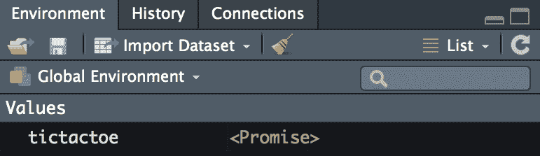

1.  现在，让我们看一下前几行，评估数据集的内容。我们将使用 `head` 函数将前几行打印到控制台，这还会将我们**环境**面板中的对象从 `<Promise>` 转换为我们可以互动并探索的对象。我们使用以下代码将前五行打印到控制台：

```py
head(tictactoe, 5)
```

运行代码后，您的控制台将显示如下内容：

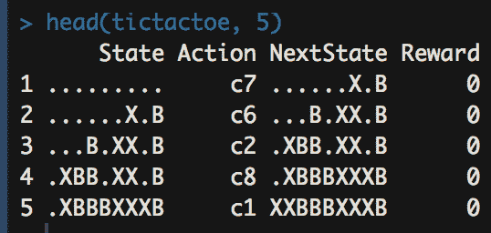

此外，环境窗格中的对象现在将显示如下内容：

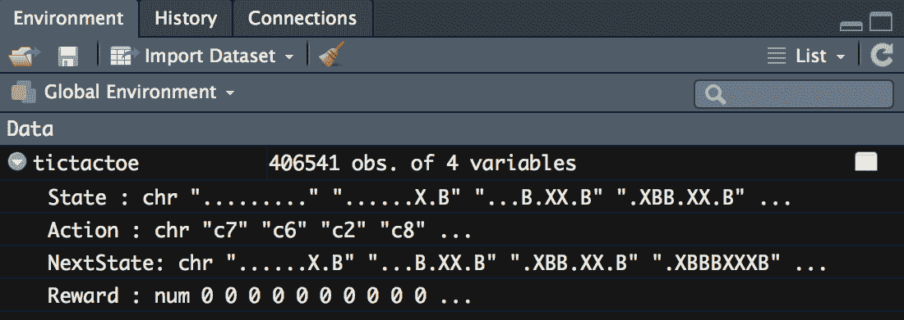

当我们查看这些图像时，我们可以看到数据是如何设置的。为了进行强化学习，我们需要将数据设置为一种格式，其中一列是当前状态，另一列是动作，然后是随后的状态，最后是奖励。让我们以第一行作为例子，详细解释这些值的含义。

`State`是`"........."`。这些点表示 3x3 棋盘上的空格，所以这个字符串代表一个空的井字游戏棋盘。`Action`是`"c7"`，意味着扮演 X 的代理将在第七个位置放置一个 X，即左下角。`NextState`是`"......X.B"`，这意味着在这个场景中，对于这一行，对手已经在右下角放置了一个 O。`Reward`是`0`，因为游戏尚未结束，`0`的奖励值表示游戏将继续的中立状态。像这样的行将存在于每个可能的`State`、`Action`、`NextState`和`Reward`的组合中**。

1.  仅使用前五行，我们可以看到所有可能的动作都是非终结的，也就是说，游戏在执行这些动作后会继续。现在让我们看一下导致游戏结束的动作：

```py
tictactoe %>%
  dplyr::filter(Reward == 1) %>%
  head()

tictactoe %>%
  dplyr::filter(Reward == -1) %>%
  head()
```

运行前面的代码后，我们将在控制台看到以下几行，表示导致胜利的动作：

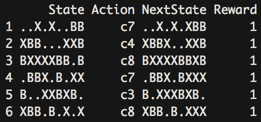

我们还会看到这些行被打印到控制台，表示导致失败的动作：

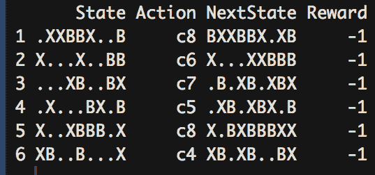

让我们看一下子集中的第一行，该行导致了胜利。在这种情况下，代理已经在游戏板的右上角和中心放置了一个 X。这里，代理将在左下角放置一个 X，这样就形成了一个斜线连续的三个 X，这意味着代理赢得了游戏，我们可以在`Reward`列中看到这一点。

1.  接下来，我们来看一个给定的状态，并查看所有可能的动作：

```py
tictactoe %>%
 dplyr::filter(State == 'XB..X.XBB') %>%
  dplyr::distinct()
```

通过这种方式对数据进行子集选择，我们从一个给定的状态开始，并查看所有可能的选项。您的控制台输出将如下所示：

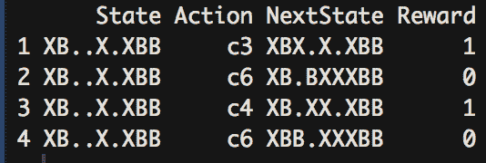

在这种情况下，游戏板上只剩下三个空位。我们可以看到两种动作会导致代理胜利。如果代理选择游戏板上的另一个空位，那么游戏板上还剩下两个空位，我们可以看到，无论对手选择哪个，游戏都会继续。

从这次调查中，我们可以看到如何为强化学习准备数据集。尽管这个数据集是由别人为我们准备的，但我们可以看到如何自己制作一个。如果我们想以不同的方式编码我们的井字棋棋盘，我们可以使用游戏《数字拼图》的值。《数字拼图》与井字棋同构，但它涉及选择数字而不是在网格上放置标记；然而，数字值与网格完美匹配，因此可以互换。游戏《数字拼图》涉及两位玩家在 1 到 15 之间选择数字，每个数字只能选择一次，获胜者是第一个选择出使数字之和为 15 的数字的人。考虑到这一点，我们可以像这样重写我们查看的第一行：

```py
State <- '0,0'
Action <- '4'
NextState <- '4,8'
Reward <- 0

numberscramble <- tibble::tibble(
  State = State,
  Action = Action,
  NextState = NextState,
  Reward = Reward
)

numberscramble
```

运行后，我们将在控制台看到以下输出：

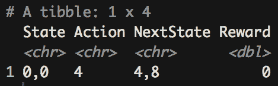

从中，我们可以看到`State`、`Action`和`NextState`的值可以以我们喜欢的任何方式进行编码，只要使用一致的约定，以便强化学习过程可以从一个状态遍历到另一个状态，从而发现通向奖励的最优路径。

现在我们知道如何设置数据，接下来我们来看一下我们的智能体将如何找到最佳的奖励路径。

# 配置强化学习智能体

让我们详细了解如何使用 Q 学习配置一个强化学习智能体。Q 学习的目标是创建一个状态-动作矩阵，其中为所有状态-动作组合分配一个值——也就是说，如果我们的智能体处于某个状态，那么提供的值将决定智能体采取的行动，以获取最大值。我们将通过创建一个值矩阵来启用智能体最佳策略的计算，该矩阵为每一个可能的移动提供一个计算值：

1.  首先，我们需要一组所有值为 0 的状态和动作对。作为最佳实践，我们将在这里使用哈希，这是一种比大型列表更高效的替代方案，可以扩展到更复杂的环境。首先，我们将加载哈希库，然后使用`for`循环填充哈希环境。`for`循环首先从数据中获取每个唯一状态，对于每个唯一状态，它将附加每个唯一动作，创建所有可能的状态-动作对，并为所有对分配一个值 0。通过运行以下代码，我们生成了这个哈希环境，它将在 Q 学习阶段保存计算出的值：

```py
library(hash)

Q <- hash()

for (i in unique(tictactoe$State)[!unique(tictactoe$State) %in% names(Q)]) {
 Q[[i]] <- hash(unique(tictactoe$Action), rep(0, length(unique(tictactoe$Action))))
}
```

运行代码后，我们会看到**环境**面板现在看起来像下图所示：

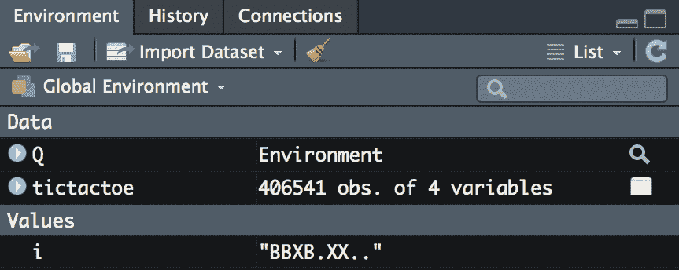

我们有一个哈希环境，`Q`，它包含每个状态-动作对。

1.  下一步是定义超参数。现在，我们将使用默认值；然而，我们很快就会调整这些值，以查看它们的影响。通过运行以下代码，我们将超参数设置为其默认值：

```py
control = list(
 alpha = 0.1, 
 gamma = 0.1, 
 epsilon = 0.1
 )
```

运行代码后，我们现在可以看到环境面板中显示了我们的超参数值列表，面板现在看起来如下：

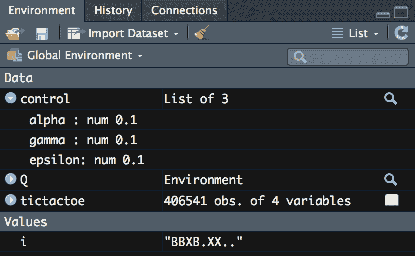

1.  接下来，我们开始填充我们的 Q 矩阵。这同样是在一个 `for` 循环内进行的；不过，我们将仅查看其中的一次独立迭代。我们首先通过以下代码将一行数据的元素提取到离散的数据对象中：

```py
  d <- tictactoe[1, ]
  state <- d$State
  action <- d$Action
  reward <- d$Reward
  nextState <- d$NextState
```

运行代码后，我们可以看到 **环境** 面板中的变化，其中现在包含了第一行中的离散元素。环境面板将如下所示：

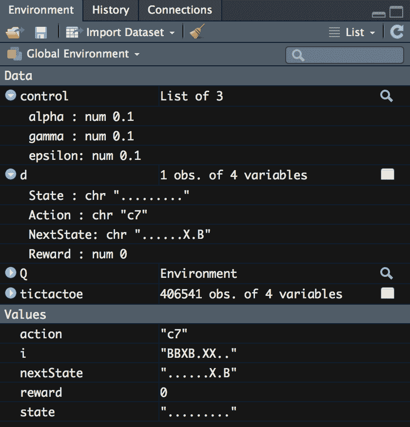

1.  接着，我们获取当前 Q 学习分数的值（如果有的话）。如果没有值，那么就将 `0` 存储为当前值。我们通过运行以下代码来设置这个初始的质量分数：

```py
  currentQ <- Q[[state]][[action]]
  if (has.key(nextState,Q)) {
    maxNextQ <- max(values(Q[[nextState]]))
  } else {
    maxNextQ <- 0
  }
```

运行此代码后，我们现在得到 `currentQ` 的值，在这种情况下它是 `0`，因为状态 `'......X.B'` 的所有 Q 值都为 `0`，因为我们已将所有值设置为 `0`；然而，在下一步中，我们将开始更新 Q 值。

1.  最后，我们通过使用 Bellman 方程更新 Q 值。这也叫做 **时序差分** **学习**。我们通过以下代码写出这一计算 R 值的步骤：

```py
  ## Bellman equation
  Q[[state]][[action]] <- currentQ + control$alpha *
    (reward + control$gamma * maxNextQ - currentQ)

q_value <- Q[[tictactoe$State[1]]][[tictactoe$Action[1]]]
```

运行以下代码后，我们可以提取这个状态-动作对的更新值；我们可以在标记为 `q_value` 的字段中看到它。您的 **环境** 面板将如下所示：

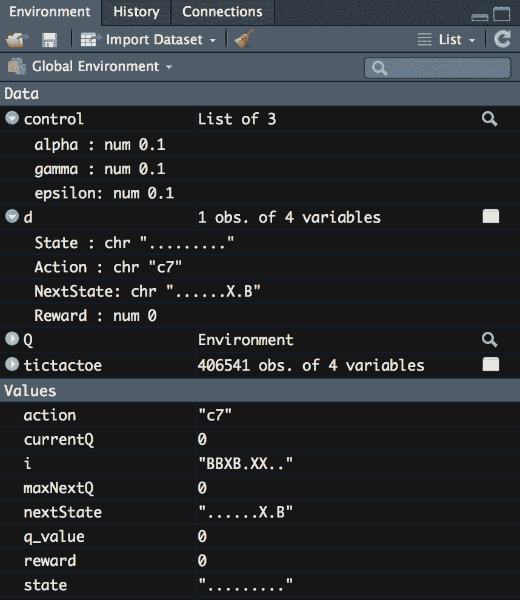

我们在这里注意到 `q_value` 仍然是 `0`。为什么会是这样呢？如果我们看一下我们的公式，我们会发现奖励是公式的一部分，而我们的奖励是 `0`，这使得整个计算值为 `0`。因此，直到我们的代码遇到具有非零奖励的行时，才会开始看到更新后的 Q 值。

1.  我们现在可以将所有这些步骤结合起来，针对每一行运行它们，来创建我们的 Q 矩阵。通过运行以下代码，我们创建了一个包含所有值的矩阵，这些值将用于选择最佳策略的决策：

```py
for (i in 1:nrow(tictactoe) {
  d <- tictactoe[i, ]
  state <- d$State
  action <- d$Action
  reward <- d$Reward
  nextState <- d$NextState

  currentQ <- Q[[state]][[action]]
  if (has.key(nextState,Q)) {
    maxNextQ <- max(values(Q[[nextState]]))
  } else {
    maxNextQ <- 0
  }
  ## Bellman equation
  Q[[state]][[action]] <- currentQ + control$alpha *
    (reward + control$gamma * maxNextQ - currentQ)
}

Q[[tictactoe$State[234543]]][[tictactoe$Action[234543]]]
```

在循环遍历所有行后，我们看到某些状态-动作对现在已经有了 Q 矩阵中的值。运行以下代码时，我们将在控制台上看到以下输出：

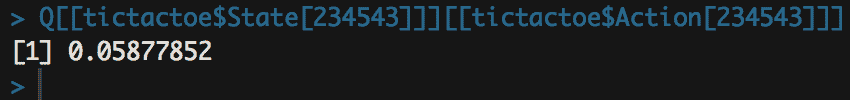

到目前为止，我们已经为 Q-learning 创建了矩阵。在这种情况下，我们将值存储在一个哈希环境中，每个键值对都有对应的值；然而，这等同于将值存储在矩阵中——只不过这种方式在之后的扩展中更为高效。现在我们有了这些值，我们可以为智能体计算一个策略，以提供通向奖励的最佳路径；然而，在我们计算这个策略之前，我们将做最后一组修改，那就是将之前设置的超参数调整回默认值。

# 调整超参数

我们已经定义了环境，并遍历了从任何给定状态下可能采取的所有行动及其结果，以计算每一步的质量值，并将这些值存储在我们的 Q 对象中。到此为止，我们现在可以开始调整这个模型的选项，看看这些调整如何影响性能。

如果我们回顾一下，强化学习有三个参数，它们分别是 alpha、gamma 和 epsilon。下面的列表描述了每个参数的作用以及调整其值的影响：

+   **Alpha**：强化学习中的 alpha 值与许多其他机器学习模型的学习率相同。它是用于控制在基于智能体采取某些行动探索奖励时，更新概率的速度的常量值。

+   **Gamma**：调整 gamma 值可以改变模型对未来奖励的重视程度。当 gamma 设置为 `1` 时，当前和未来的所有奖励被赋予相同的权重。这意味着距离当前步骤几步之遥的奖励与下一步获得的奖励具有相同的价值。实际上，这几乎从来不是我们想要的效果，因为我们希望未来的奖励更有价值，因为获得它们需要更多的努力。相比之下，设置 gamma 为 `0` 意味着只有来自下一步行动的奖励才会有任何价值，未来的奖励完全没有价值。同样，除了特殊情况外，这通常不是我们想要的效果。在调整 gamma 时，你需要在未来奖励的加权平衡中找到一种平衡，使得智能体能够做出最优的行动选择。

+   **Epsilon**：epsilon 参数用于在选择未来行动时引入随机性。将 epsilon 设置为 `0` 被称为贪婪学习。在这种情况下，智能体将始终选择成功概率最高的路径；然而，正如其他机器学习方法一样，智能体很容易陷入某些局部最小值，永远无法发现最优策略。通过引入一些随机性，在不同的迭代中将会采取不同的行动。调整此值有助于优化探索与利用之间的平衡。我们希望模型能够利用已学到的知识，选择最佳的未来行动；但我们也希望模型继续探索并不断学习。

利用我们对这些超参数的理解，接下来我们来看一下在调整这些参数时，值是如何变化的：

1.  首先，我们将调整`alpha`的值。如前所述，`alpha`值是学习率值，这是我们在学习其他机器学习主题时可能熟悉的内容。它只是一个常数值，用来控制算法调整的速度。目前，我们将`alpha`的值设置为`0.1`；然而，我们将`alpha`的值设为`0.5`。这个值高于我们通常实际希望的值，主要是为了探索更改这些值的影响。我们将需要将 Q 值重置为零并重新启动学习过程，以查看发生了什么。以下代码块将我们之前所做的一切再次执行，只不过对`alpha`进行了调整。我们调整`alpha`值并通过运行以下代码来查看其效果：

```py
Q <- hash()

for (i in unique(tictactoe$State)[!unique(tictactoe$State) %in% names(Q)]) {
  Q[[i]] <- hash(unique(tictactoe$Action), rep(0, length(unique(tictactoe$Action))))
}

control = list(
  alpha = 0.5, 
  gamma = 0.1,  
  epsilon = 0.1
)

for (i in 1:nrow(tictactoe)) {
  d <- tictactoe[i, ]
  state <- d$State
  action <- d$Action
  reward <- d$Reward
  nextState <- d$NextState

  currentQ <- Q[[state]][[action]]
  if (has.key(nextState,Q)) {
    maxNextQ <- max(values(Q[[nextState]]))
  } else {
   maxNextQ <- 0
  }
  ## Bellman equation
  Q[[state]][[action]] <- currentQ + control$alpha *
    (reward + control$gamma * maxNextQ - currentQ)
```

```py
}

Q[[tictactoe$State[234543]]][[tictactoe$Action[234543]]]
```

从这个调整中，我们可以看到在`234543`处，Q 值发生了变化。你将在控制台上看到以下输出：

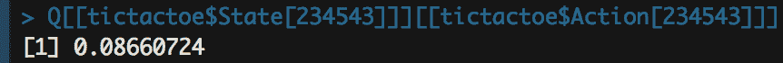

正如我们所预期的那样，由于我们提高了`alpha`的值，因此结果是，在我们之前查看的相同点上，Q 值变得更大。换句话说，我们的算法学习得更快，质量值获得了更大的权重。

1.  接下来，我们调整`gamma`的值。如果我们记得的话，调整`gamma`的值会改变代理对未来奖励的重视程度。我们当前的值设置为`0.1`，这意味着未来的奖励是有价值的，但它们被重视的程度相对较小。让我们将其提高到`0.9`，看看会发生什么。我们进行与调整`alpha`时相同的操作。首先重置 Q 哈希环境，使所有状态–动作对的值为`0`，然后通过循环遍历所有选项，应用贝尔曼方程，并对`gamma`值进行更改来重新填充该哈希环境。我们通过运行以下代码来评估更改`gamma`值时会发生什么：

```py
library(hash)

Q <- hash()

for (i in unique(tictactoe$State)[!unique(tictactoe$State) %in% names(Q)]) {
  Q[[i]] <- hash(unique(tictactoe$Action), rep(0, length(unique(tictactoe$Action))))
}

control = list(
  alpha = 0.1, 
  gamma = 0.9,  
  epsilon = 0.1
)

for (i in 1:nrow(tictactoe)) {
  d <- tictactoe[i, ]
  state <- d$State
  action <- d$Action
  reward <- d$Reward
  nextState <- d$NextState

  currentQ <- Q[[state]][[action]]
  if (has.key(nextState,Q)) {
    maxNextQ <- max(values(Q[[nextState]]))
  } else {
    maxNextQ <- 0
  }
  ## Bellman equation
  Q[[state]][[action]] <- currentQ + control$alpha *
    (reward + control$gamma * maxNextQ - currentQ)
}

Q[[tictactoe$State[234543]]][[tictactoe$Action[234543]]]
```

运行完这段代码后，你将在控制台看到以下代码输出：

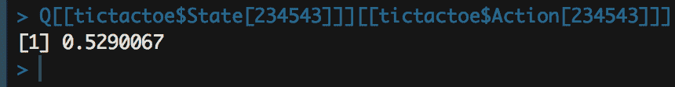

从这点出发，我们可以得出以下观察结论：

+   我们可以看到我们的值显著增加了

+   从这个状态并采取这个动作，会有一定的价值，但在考虑未来奖励时，价值会更大

+   然而，对于像井字游戏这样的游戏，我们需要考虑到，从任何状态到奖励之间的步骤通常很少；然而，我们可以看到，从这个状态和这个动作出发，获得奖励的概率会很高

1.  对于最后的调整，我们将调整`epsilon`。`epsilon`的值取决于相对于探索知识的程度，我们使用多少以前的知识。为了这个调整，我们将回到使用`ReinforcementLearning`包中的函数，因为它不仅依赖于通过贝尔曼方程循环计算，还需要在多次迭代中存储这些值以供参考。要调整`epsilon`，我们使用以下代码：

```py
# Define control object
control <- list(
alpha = 0.1, 
gamma = 0.1, 
epsilon = 0.9
)

# Perform reinforcement learning
model <- ReinforcementLearning(data = tictactoe, 
                               s = "State", 
                               a = "Action", 
                               r = "Reward", 
                               s_new = "NextState", 
                               iter = 5,
                               control = control)

model$Q_hash[[tictactoe$State[234543]]][[tictactoe$Action[234543]]]
```

运行此代码后，我们会看到我们的 Q 值发生了变化。你将看到以下值打印到控制台：

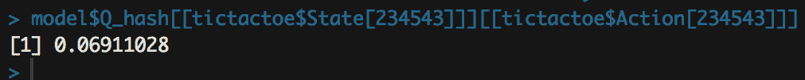

从这里我们可以得出以下观察结论：

+   我们的数值类似于使用默认参数值时的数值，但稍微大一些

+   在这种情况下，我们引入了相对较大的随机性，以强迫我们的智能体继续探索；结果，我们可以看到，在这种随机性下，我们的价值损失并不大，而且即使它导致了不同的后续行动集，这个动作仍然保持相似的价值

1.  在将参数调整到理想设置之后，我们现在可以查看给定状态的策略。首先，让我们看看**Environment**面板中的模型对象。你的**Environment**面板将如下所示：

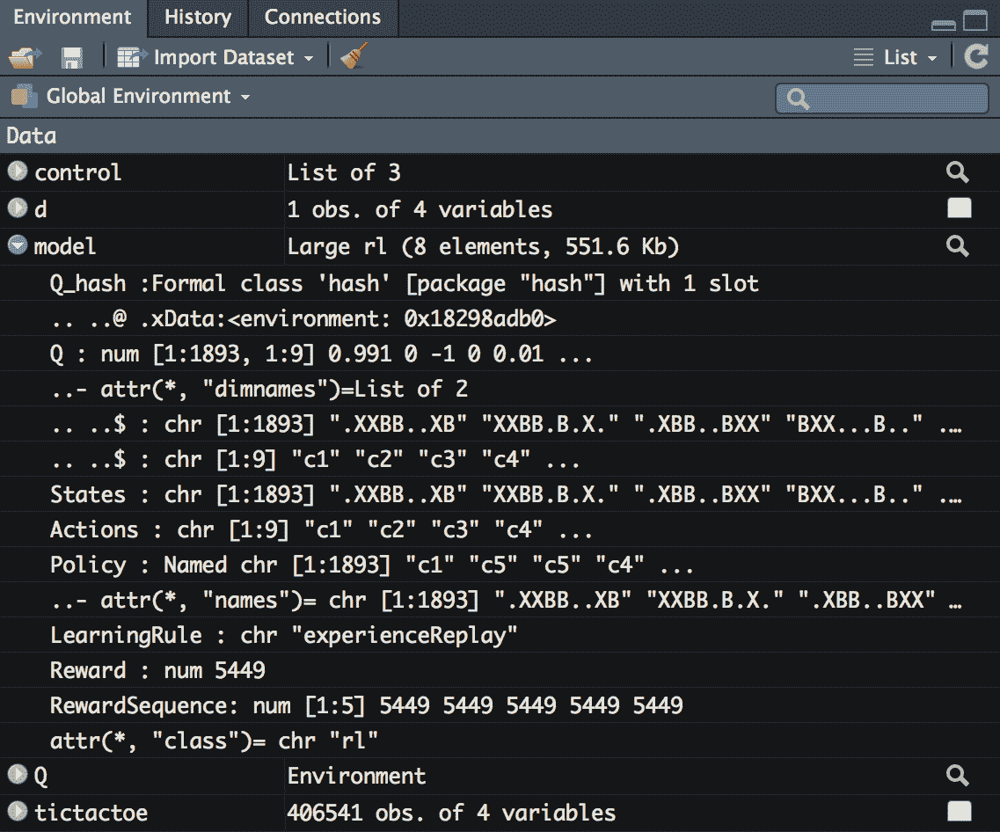

让我们更深入地了解模型对象中的每个元素：

+   `Q_hash`：哈希环境，就像我们之前创建的那样，包含每个状态–动作对及其 Q 值

+   `Q`：一个命名矩阵，包含与哈希环境相同的数据，只是以命名矩阵的形式呈现

+   `States`：我们矩阵中的命名行

+   `Actions`：我们矩阵中的命名列

+   `Policy`：一个命名向量，包含智能体应该从任何状态采取的最优动作

+   `Reward` 和 `RewardSequence`：这些是数据集中导致奖励的行数，少于导致惩罚的行数

我们可以使用这里的数值来查看在任何给定状态下所有动作的价值，并判断哪个是最好的行动。让我们从一个全新的游戏开始，看看哪个动作的价值最高。我们可以从这个状态看到每个动作的价值，并通过运行以下代码来标记哪个动作是最好的：

```py
sort(model$Q['.........',1:9], decreasing = TRUE)

model$Policy['.........']
```

运行此代码后，我们将看到以下内容打印到控制台：

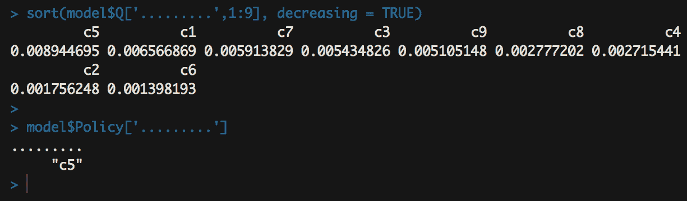

我们可以看到，第一行列出了所有可能的动作以及它们按降序排列的各自价值。我们可以看到，在这个命名向量中，动作`"c5"`，即网格中心的标记，具有最高的价值。因此，当我们查看智能体处于该状态时的策略时，我们看到它是`"c5"`。通过这种方式，我们现在可以利用强化学习的结果，从任何给定状态中选择最优的行动：

+   我们刚刚调整了所有参数，以便注意这些变量变化的影响

+   然后，在最后一步中，我们看到如何根据网格处于任何状态来选择最佳策略

+   通过尝试每种可能的行动组合，我们根据即时和未来的奖励计算了移动的价值

+   我们决定通过调整参数来权衡 Q 值，并决定一种解决游戏的方法

# 概要

在本章中，我们使用 Q-learning 编码了一个强化学习系统。我们定义了我们的环境或游戏表面，然后查看了包含每种可能状态、动作和未来状态的数据集。使用数据集，我们计算了每个状态-动作对的价值，将其存储在哈希环境和矩阵中。然后，我们将这个值矩阵作为我们策略的基础，选择具有最大价值的移动。

在我们的下一章中，我们将通过将神经网络添加到 Q-learning 中来扩展深度 Q-learning 网络。
