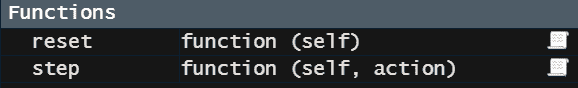
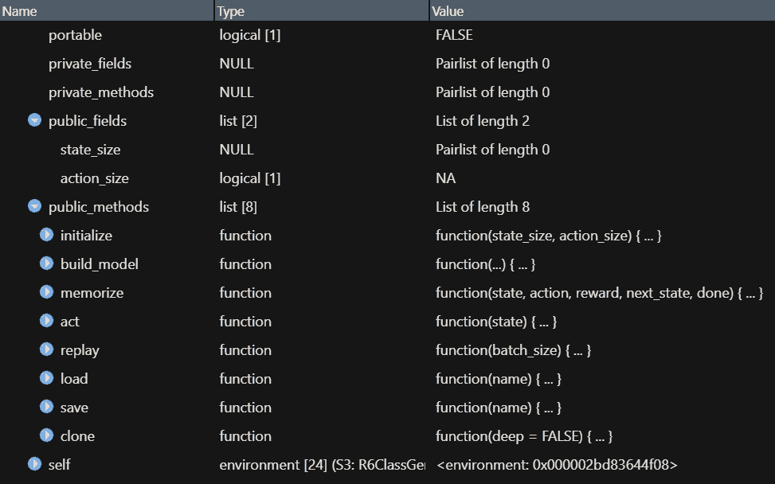
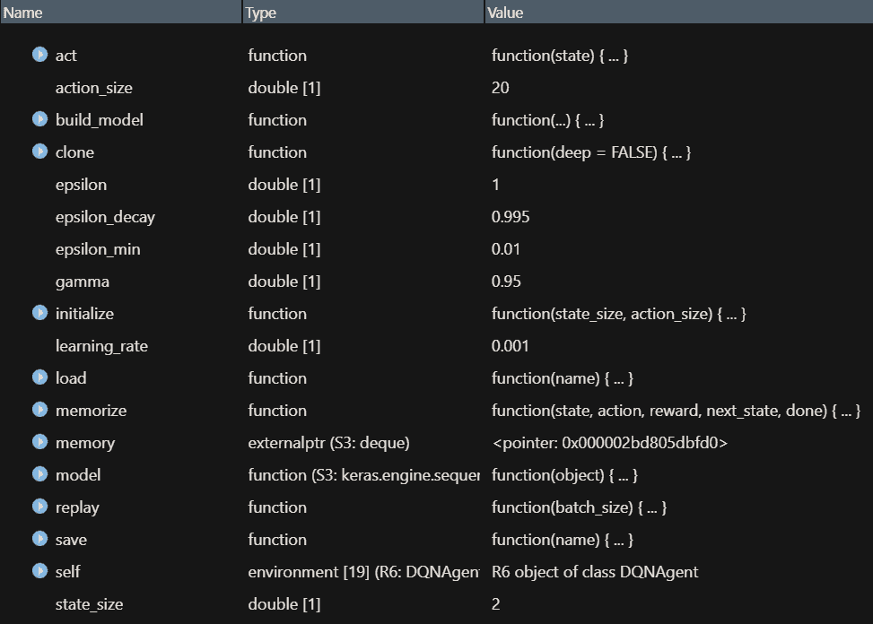
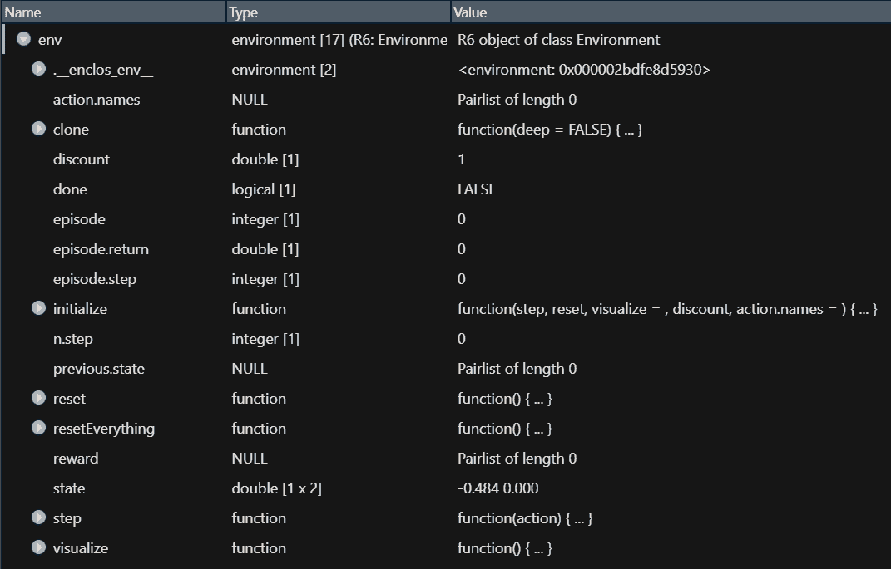
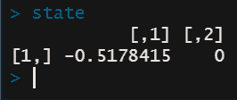
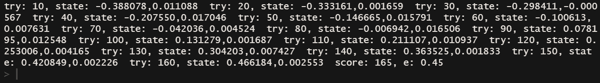

# 第十一章：深度 Q 学习在迷宫求解中的应用

在本章中，你将学习如何使用 R 来实现强化学习技术，并将其应用于迷宫环境。特别地，我们将创建一个代理，通过训练代理执行动作并从失败中学习，来解决迷宫。我们将学习如何定义迷宫环境，并配置代理使其能够穿越迷宫。我们还将把神经网络添加到 Q 学习中，这为我们提供了获取所有状态-动作对值的替代方法。我们将多次迭代我们的模型，以创建一个策略，帮助代理走出迷宫。

本章将涵盖以下主题：

+   为强化学习创建环境

+   定义一个代理来执行动作

+   构建深度 Q 学习模型

+   运行实验

+   使用策略函数提高性能

# 技术要求

你可以在 [`github.com/PacktPublishing/Hands-on-Deep-Learning-with-R`](https://github.com/PacktPublishing/Hands-on-Deep-Learning-with-R) 上找到本章使用的代码文件。

# 为强化学习创建环境

在这一节中，我们将定义一个强化学习的环境。我们可以把它想象成一个典型的迷宫，其中代理需要在二维网格空间中导航到达终点。然而，在这种情况下，我们将使用一个基于物理的迷宫。我们将使用山地车问题来表示这一点。代理处在一个山谷中，需要到达山顶；但是，它不能直接爬坡。它必须利用动量到达山顶。为此，我们需要两个函数。一个函数将启动或重置代理，将其放置在表面上的一个随机点。另一个函数将描述代理在一步之后在表面上的位置。

我们将使用以下代码来定义 `reset` 函数，为代理提供一个起始位置：

```py
reset = function(self) {
  position = runif(1, -0.6, -0.4)
  velocity = 0
  state = matrix(c(position, velocity), ncol = 2)
  state
}

```

我们可以看到，使用这个函数时，首先发生的事情是通过从 `-0.6` 到 `-0.4` 之间的均匀分布中随机选择一个值来定义 `position` 变量。这是代理将被放置在表面上的点。接下来，`velocity` 变量被设置为 `0`，因为我们的代理尚未移动。`reset` 函数仅用于将代理放置在起始点。`position` 变量和 `velocity` 变量现在被加入到一个 1 x 2 的矩阵中，这个 `matrix` 变量就是我们代理的起始位置和起始速度。

下一个函数获取每个动作的值，并计算代理将采取的下一步。为了编写这个函数，我们使用以下代码：

```py
  step = function(self, action) {
  position = self$state[1]
  velocity = self$state[2]
  velocity = (action - 1L) * 0.001 + cos(3 * position) * (-0.0025)
  velocity = min(max(velocity, -0.07), 0.07)
  position = position + velocity
  if (position < -1.2) {
    position = -1.2
    velocity = 0
  }
  state = matrix(c(position, velocity), ncol = 2)
  reward = -1
  if (position >= 0.5) {
    done = TRUE
    reward = 0
  } else {
    done = FALSE
  }
  list(state, reward, done)
}
```

在这个函数中，第一部分定义了位置和速度。在这个案例中，位置和速度是从`self`对象中获取的，接下来我们将介绍`self`。`self`变量包含有关代理的详细信息。这里，`position`和`velocity`变量是从`self`中获取的，表示代理当前在表面上的位置以及当前的速度。然后，`action`参数用于计算速度。接下来的行将`velocity`限制在`-0.7`到`0.7`之间。之后，我们通过将速度加到当前位置来计算下一个位置。然后，还有一行约束代码。如果`position`超过`-1.2`，代理就会超出边界，并且会重置到`-1.2`位置，且速度为零。最后，会进行检查，看代理是否已达到目标。如果状态值大于`0.5`，代理就算获胜；否则，代理继续移动并尝试达到目标。

当我们完成这两个代码块时，我们将看到在**环境**面板中定义了两个函数。你的**环境**面板将如以下截图所示：



这两个函数的组合定义了表面的形状、代理在表面上的位置以及目标位置在表面上的设置。`reset`函数用于代理的初始位置，`step`函数定义了每次迭代时代理的步伐。通过这两个函数，我们定义了环境的形状和边界，并且为将代理放置和移动到环境中提供了机制。接下来，我们来定义我们的代理。

# 定义一个代理来执行动作

在本节中，我们将定义用于深度 Q 学习的代理。我们已经看到前面环境函数如何定义代理的移动方式。在这里，我们定义代理本身。在上一章中，我们使用了 Q 学习，并且能够将贝尔曼方程应用到由特定动作产生的新状态。在本章中，我们将通过神经网络增强 Q 学习的这一部分，这就是将标准 Q 学习转化为深度 Q 学习的关键。

为了将这个神经网络模型添加到过程中，我们需要定义一个类。这在面向对象编程中是常见的；然而，在像 R 这样的编程语言中则不太常见。为此，我们将使用`R6`包来创建类。我们将把`R6`类的创建分解为多个部分，以便更容易理解。类提供了实例化和操作数据对象的指令。在这种情况下，我们的类将使用声明的变量来实例化数据对象，并且一系列的函数（在类的上下文中称为方法）将用于操作数据对象。在接下来的步骤中，我们将逐一查看类的各个部分，以便更容易理解我们正在创建的类的构成部分。然而，运行代码的部分会导致错误。在详细讲解所有部分之后，我们将把所有内容包装在一个函数中来创建我们的类，并且这是你将要运行的最终、较长的`R6`代码。首先，我们将使用以下代码来设置初始值：

```py
portable = FALSE,
lock_objects = FALSE,
public = list(
  state_size = NULL,
  action_size = NA, 
  initialize = function(state_size, action_size) {
      self$state_size = state_size
      self$action_size = action_size
      self$memory = deque()
      self$gamma = 0.95 
      self$epsilon = 1.0 
      self$epsilon_min = 0.01
      self$epsilon_decay = 0.995
      self$learning_rate = 0.001
      self$model = self$build_model()
  }
)
```

在使用 R 创建一个用于此目的的类时，我们首先设置两个选项。首先，我们将`portable`设置为`FALSE`，这意味着其他类不能继承此类的方法或函数。但这也意味着我们可以使用`self`关键字。其次，我们将`lock_objects`设置为`FALSE`，因为我们需要在此类中修改对象。

接下来，我们定义我们的初始值。我们在这里使用`self`，它是一个特殊的关键字，指代所创建的对象。记住，类不是对象——它是创建对象的构造器。在这里，我们将创建一个类的实例，这个对象将作为代理。该代理将使用以下值进行初始化。状态大小和动作大小将在创建环境时作为参数传入。下一个记忆是一个空的 deque。**deque**是一种特殊的对象类型，它是双端的，因此可以从两端添加或移除值。我们将使用它来存储代理在试图达成目标时所采取的步骤。Gamma 是折扣率。Epsilon 是探索率。正如我们所知道的，深度学习的目标是平衡探索与利用，因此我们从一个激进的探索率开始。然而，我们随后定义了一个 epsilon 衰减，这是探索率将被减少的程度，以及一个 epsilon 最小值，以确保探索率永远不会达到`0`。最后，学习率就是在调整权重时使用的常数值，而模型则是运行我们的神经网络模型的结果，我们将在接下来的部分介绍。

接下来，我们将通过添加一个函数来赋予类操作变量的能力。特别地，我们将添加`build_model`函数来运行神经网络：

```py
build_model = function(...){
        model = keras_model_sequential() %>% 
        layer_dense(units = 24, activation = "relu", input_shape = self$state_size) %>%
        layer_dense(units = 24, activation = "relu") %>%
        layer_dense(units = self$action_size, activation = "linear")

        compile(model, loss = "mse", optimizer = optimizer_adam(lr = self$learning_rate), metrics = "accuracy")

        return(model)
    }
```

模型将当前状态作为输入，输出将是我们在预测模型时可用的动作之一。然而，这个函数只是返回模型，因为我们将在调用时根据我们在深度 Q 学习路径中的位置，传递一个不同的状态参数给模型。模型在两种不同的场景下被调用，我们稍后会详细讲解。

接下来，我们将加入一个用于记忆的函数。这个类的记忆部分将是一个存储状态、动作、奖励和下一状态的函数，随着智能体尝试解决迷宫，我们将这些值存储在智能体的记忆中，并通过以下代码将它们添加到双端队列（deque）中：

```py
memorize = function(state, action, reward, next_state, done){
        pushback(self$memory,state)
        pushback(self$memory,action)
        pushback(self$memory,reward)
        pushback(self$memory, next_state)
        pushback(self$memory, done)
    }
```

我们使用`pushback`函数将给定的值添加到双端队列的第一个位置，并将所有现有元素向后移动一个位置。我们对状态、动作、奖励、下一状态以及显示迷宫是否已完成的标志进行此操作。这些序列存储在智能体的记忆中，因此当探索与利用公式选择利用选项时，它可以通过访问记忆中的这个序列来利用已知的内容，而不是继续进行探索。

接下来，我们将添加一些代码来选择下一个动作。为完成此任务，我们将检查衰减的 epsilon 值。根据衰减的 epsilon 是否大于从均匀分布中随机选择的值，将发生两种可能的动作之一。我们通过以下代码设置了一个决定下一个动作的函数：

```py
act = function(state){
        if (runif(1) <= self$epsilon){
            return(sample(self$action_size, 1))
            } else {
        act_values <- predict(self$model, state)
        return(which(act_values==max(act_values)))
            }
    }
```

如前所述，这个动作函数有两种可能的结果。首先，如果从均匀分布中随机选择的值小于或等于 epsilon，那么将从活动动作的全部范围中选择一个值。否则，当前状态将用于使用我们先前定义的模型预测下一个动作，这会导致加权概率来判断这些动作中哪个是正确的。选择具有最高概率的动作。这是探索与利用之间的平衡，旨在寻找正确的下一步。

在之前讨论过探索步骤后，我们现在将编写我们的`replay()`函数，该函数将利用智能体已经知道并存储在记忆中的内容。我们使用以下代码来编写这个利用函数：

```py
replay = function(batch_size){
        minibatch = sample(length(self$memory), batch_size) 
            state = minibatch[1]
            action = minibatch[2]
            target = minibatch[3]
            next_state = minibatch[4]
            done = minibatch[5]
            if (done == FALSE){
                target = (target + self$gamma *
                          max(predict(self$model, next_state)))
            target_f = predict(self$model, state)
            target_f[0][action] = target
            self$model(state, target_f, epochs=1, verbose=0)
            }
        if (self$epsilon > self$epsilon_min){
            self$epsilon = self$epsilon * self$epsilon_decay
            }
    }
```

让我们拆解这个函数，以利用智能体已经知道的内容来帮助解决难题。我们首先做的是从记忆双端队列（deque）中选择一个随机序列。接着，我们将从样本中提取的每个元素放入智能体序列中的特定部分：状态、动作、目标、下一状态和`done`标志，后者用来指示迷宫是否已解决。接下来，我们将添加一些代码来改变模型的预测方式。我们从使用序列结果中的状态来定义目标，利用我们从尝试此序列中学到的内容。

接下来，我们预测状态以获得模型可能预测的所有值。然后，我们将计算出的值插入到该向量中。当我们再次运行模型时，我们帮助模型基于经验进行训练。这也是更新 epsilon 的步骤，这将导致在未来的迭代中更多的开发（exploitation）和更少的探索（exploration）。

最后一步是添加一个保存和加载我们模型的方法或函数。我们通过以下代码为保存和加载模型提供手段：

```py
load = function(name) {
    self$model %>% load_model_tf(name)
},
save = function(name) {
    self$model %>% save_model_tf(name)
}
```

通过这些方法，我们现在能够保存之前定义的模型，并加载训练好的模型。

接下来，我们需要将我们所覆盖的所有内容放入一个总体函数中，该函数将接收所有声明的变量和函数，并用它们来创建一个 `R6` 类。为了创建我们的 `R6` 类，我们将把刚才写的所有代码整合在一起。

运行完整代码后，我们将会在环境中得到一个 `R6` 类。它将有一个 `Environment` 的类。如果你点击它，你可以看到类的所有属性。你会注意到有许多与创建类相关的属性，我们并没有特别定义；然而，看看以下截图。我们可以看到这个类不可移植，我们可以看到将要赋值的公共字段，还能看到我们定义的所有函数，这些函数在作为类的一部分时被称为方法：



通过这一步，我们已经完全创建了一个 `R6` 类，作为我们的代理。我们为它提供了基于当前状态和一定随机性的行动手段，并且还为我们的代理提供了一种方式来探索这个迷宫的表面，以找到目标位置。我们还提供了一种方式，让代理回顾它从过去经验中学到的内容，并用这些来指导未来的决策。总的来说，我们拥有了一个完整的强化学习代理，它通过试错学习，最重要的是，从过去的错误中学习，并不断地通过随机行动来学习。

# 构建深度 Q 学习模型

在这一点上，我们已经定义了环境和我们的代理，这将使得运行我们的模型变得相当简单。记住，为了使用 R 进行强化学习，我们采用了面向对象编程中的一种技巧，而这在像 R 这样的编程语言中并不常用。我们创建了一个描述对象的类，但它本身并不是一个对象。为了从类中创建对象，我们必须实例化它。我们设置了初始值，并通过以下代码使用我们的 `DQNAgent` 类实例化一个对象：

```py
state_size = 2
action_size = 20
agent = DQNAgent(state_size, action_size)

```

运行这段代码后，我们将在环境中看到一个代理对象。该代理的类为 `Environment`；然而，如果我们点击它，我们将看到类似下面的截图，其中包含与我们类的一些差异：



运行这一行代码后，我们现在拥有了一个继承了类中所有属性的对象。我们将 `2` 作为参数传入状态大小，因为对于这个环境，状态是二维的。这两个维度是位置和速度。我们可以看到我们传入的值在 `state_size` 字段旁边被反映出来。我们将 `20` 作为参数传入动作大小，因为对于这个游戏，我们将允许代理使用最多 `20` 单位的力量向前或向后推进。我们也能看到这个值。同样，我们可以看到所有的方法；不过它们不再嵌套在不同的方法下——它们现在都由 `agent` 对象继承。

为了创建我们的环境，我们使用 `reinforcelearn` 包中的 `makeEnvironment` 函数，该函数允许自定义环境创建。我们使用以下代码将 `step` 和 `reset` 函数作为参数传递，以创建代理导航的自定义环境：

```py
env = makeEnvironment(step = step, reset = reset)
```

在运行前面的代码行后，你会在 **Environment** 面板中看到一个 `env` 对象。请注意，这个对象也具有 `Environment` 类。当我们点击这个对象时，我们会看到以下内容：



前面的代码行使用了我们之前创建的函数来定义一个环境。现在我们拥有了一个环境实例，它包含了初始化游戏的方式，而 `step` 函数定义了代理每次行动时可能的动作范围。请注意，这也是一个 `R6` 类，就像我们的代理类一样。

最后，我们加入了两个额外的初始值。通过运行以下代码，我们建立了剩余的初始值，以完成我们的模型设置：

```py
done = FALSE
batch_size = 32
```

`FALSE` 作为 `done` 的第一个值表示目标尚未完成。`32` 的批量大小是代理在开始利用已知信息进行下一系列动作之前，将尝试进行的探索动作或系列动作的大小。

这是深度 Q 学习的完整模型设置。我们有一个代理实例，这是一个根据我们之前在类中定义的特征创建的对象。我们还有一个定义了我们在创建 `step` 和 `reset` 函数时设置的参数的环境。最后，我们定义了一些初始值，现在，一切都已经完成。下一步就是让代理开始行动，我们将在接下来完成这一过程。

# 运行实验

强化学习的最后一步是运行实验。为此，我们需要将代理放入环境中，然后允许代理采取步骤，直到达到目标。代理受到可用移动次数的限制，环境也施加了另一个约束——在我们的例子中，就是通过设置边界来实现。我们设置了一个`for`循环，循环通过代理尝试合法移动的回合，然后查看迷宫是否已成功完成。当代理到达目标时，循环停止。为了开始我们的实验，使用我们定义的代理和环境，我们编写了以下代码：

```py
state = reset(env)
for (j in 1:5000) {
  action = agent$act(state)
  nrd = step(env,action)
  next_state = unlist(nrd[1])
  reward = as.integer(nrd[2])
  done = as.logical(nrd[3])
  next_state = matrix(c(next_state[1],next_state[2]), ncol = 2)
  reward = dplyr::if_else(done == TRUE, reward, as.integer(-10))
  agent$memorize(state, action, reward, next_state, done)
  state = next_state
  env$state = next_state
  if (done == TRUE) {
    cat(sprintf("score: %d, e: %.2f",j,agent$epsilon))
    break
  } 
  if (length(agent$memory) > batch_size) {
    agent$replay(batch_size)
  } 
  if (j %% 10 == 0) {
    cat(sprintf("try: %d, state: %f,%f ",j,state[1],state[2])) 
  }

}
```

前面的代码运行的是设置代理运动的实验。代理的行为受我们定义的类中的值和函数的控制，并且进一步由我们创建的环境推动。如我们所见，运行实验时会进行很多步骤。我们将在这里回顾每个步骤：

1.  在运行前面的代码的第一行后，我们将看到代理的初始状态。如果查看`state`对象，它将类似于这样，其中位置值介于`-0.4`和`-0.6`之间，速度为`0`：



1.  在运行剩余的代码块后，我们将看到类似以下内容的输出打印到控制台，其中显示了每十轮的状态：



1.  当我们运行这段代码时，首先发生的事情是环境被重置，代理被放置在表面上。

1.  然后，启动循环。每一轮中的活动顺序如下：

    1.  首先，使用`agent`类中的`act`函数来执行一个动作。记住，这个函数定义了代理允许的移动。

    1.  接下来，我们将代理采取的动作传递给`step`函数，以获取结果。

    1.  输出是下一个状态，这是代理在执行动作后所到达的位置，以及基于该动作是否带来了正面结果的奖励，最后是`done`标志，表示目标是否已经成功到达。

    1.  这三个元素作为`list`对象从函数中输出。

    1.  接下来的步骤是将它们分配到各自的对象中。对于`reward`和`done`，我们仅从列表中提取它们，并将它们分别分配为整数和逻辑数据类型。至于下一个状态，这稍微复杂一些。我们首先使用`unlist`提取两个值，然后将它们放入一个 2 x 1 的矩阵中。

    1.  在将代理移动的所有元素转移到它们自己的对象后，奖励被计算出来。在我们的例子中，除非达到目标，否则没有中间成就会导致奖励，因此`reward`和`done`的操作方式相似。这里，我们看到，如果`done`标志被设置为`TRUE`，则当`reward`为`TRUE`时，`reward`被设置为`0`，如`step`函数中所定义的那样。

    1.  接下来，所有从`step`函数输出的值都将添加到`memory`队列对象中。`memorize`函数将每个值推送到队列的第一个元素位置，并将现有值推回。

    1.  在此之后，`state`对象被赋值为下一个状态。这是因为下一个状态现在成为了新的当前状态，因为智能体采取了一个新的步骤。

    1.  然后会检查智能体是否已经到达迷宫的终点。如果是，则跳出循环并打印出 epsilon 值，以查看通过探索完成了多少任务，探索和利用各占多少。对于其他回合，会有一个二次检查，打印每十步的当前状态和速度。

    1.  另一个条件是`replay`函数的触发条件。在达到阈值后，智能体从记忆队列中提取值，过程从那里继续。

这是执行强化学习实验的整个过程。通过这个过程，我们现在拥有了一种比单纯使用 Q 学习更为强大的强化学习方法。虽然在环境有限且已知时，使用 Q 学习是一个不错的解决方案，但当环境扩展或动态变化时，则需要深度 Q 学习。通过让定义好的智能体在定义好的环境中采取行动并进行迭代，我们可以看到该智能体在解决环境中提出的问题时的表现如何。

# 使用策略函数提升性能

我们已经成功地编写了一个智能体，使用神经网络深度学习架构来解决问题。现在让我们看一下可以改进模型的几种方法。与其他机器学习不同，我们无法像通常那样通过性能指标进行评估，通常我们会尝试最小化某个选择的错误率。强化学习的成功略带主观性。你可能希望智能体尽可能快地完成任务，尽可能多地获取积分，或者尽可能少地犯错。此外，根据任务的不同，我们可能能够改变智能体本身，看看它对结果有何影响。

我们将讨论三种可能的提高性能的方法：

+   **动作大小**：有时这是一个选项，有时则不是。如果你正在尝试解决一个智能体规则和环境规则在外部设置的问题，例如尝试在棋类游戏中优化性能，那么这将不是一个选项。然而，你可以想象一个问题，例如设置一个自动驾驶汽车，在这种情况下，如果在该环境下效果更好，你可以改变智能体。通过我们的实验，尝试将动作大小值从`20`更改为`10`，并且再更改为`40`，看看会发生什么。

+   **批量大小**：我们还可以调整批量大小，以观察它对性能的影响。请记住，当代理的移动次数达到批次的阈值时，代理就会从记忆中选择值，开始利用已有的知识。通过提高或降低这个阈值，我们为代理提供了一种策略，即在使用已有知识之前，应该进行更多或更少的探索。将批量大小更改为`16`、`64`和`128`，观察哪个选项能让代理最快完成任务。

+   **神经网络**：我们将讨论的最后一个需要修改的代理策略部分是神经网络。在很多方面，它是代理的“大脑”。通过修改，我们可以让代理做出更多有利于优化性能的选择。在`AgentDQN`类中，添加一些神经网络层，然后重新运行实验，看看会发生什么。接着，改变每一层的单元数量，并再次运行实验，查看结果。

除了这些变化外，我们还可以对起始的 epsilon 值、epsilon 衰减的速度以及神经网络模型的学习率进行调整。这些变化都会影响代理的策略函数。当我们更改一个值，这个值会改变动作或回放函数的输出时，我们就在修改代理用来解决问题的策略。我们可以为代理制定策略，让它探索更多或更少的动作，或者调整它在探索环境与利用当前知识之间所花费的时间，还可以调整代理从每一步中学习的速度，代理可能尝试多少次相似的动作以查看是否总是错误的，以及在采取导致失败的动作后，代理尝试调整的幅度。

与任何类型的机器学习一样，强化学习中有许多参数可以调节以优化性能。与其他问题不同，可能没有标准的度量来帮助调整这些参数，选择最合适的值可能更为主观，并且依赖于试验和错误的实验过程。

# 摘要

在这一章节中，我们编写了代码，使用深度 Q 学习进行强化学习。我们注意到，尽管 Q 学习是一种更简单的方法，但它需要一个有限且已知的环境。而应用深度 Q 学习则使我们能够在更大范围内解决问题。我们还定义了我们的智能体，这需要创建一个类。该类定义了我们的智能体，并通过实例化一个对象，将类中定义的属性应用于解决强化学习的挑战。接着，我们创建了一个自定义环境，使用函数定义了边界，以及智能体可以采取的移动范围和目标或目的。深度 Q 学习涉及在选择动作时加入神经网络，而不是像 Q 学习那样依赖 Q 矩阵。随后，我们将神经网络添加到我们的智能体类中。

最后，我们通过将智能体对象放入自定义环境，并让它采取各种行动，直到解决问题，从而将所有内容整合在一起。我们进一步讨论了一些可以采取的选择，以提高智能体的表现。有了这个框架，你已经准备好将强化学习应用于各种环境，并使用各种可能的智能体。这个过程基本上保持一致，变化将体现在智能体的编程方式以及环境中的规则。

这就完成了*Hands-On Deep Learning with R*。在本书中，你学习了多种深度学习方法。此外，我们还将这些方法应用于多种不同的任务。本书的编写偏向于实际操作。其目标是提供简洁的代码，解决实际项目中的问题。希望通过本书的学习，你已经准备好利用深度学习解决现实世界中的挑战。
