# 第一章：Apache Spark 生态系统

Apache Spark ([`spark.apache.org/`](http://spark.apache.org/)) 是一个开源的快速集群计算平台。最初由加利福尼亚大学伯克利分校的 AMPLab 创建，后来其源代码被捐赠给了 Apache 软件基金会 ([`www.apache.org/`](https://www.apache.org/))。Spark 因其计算速度非常快而广受欢迎，因为数据被加载到分布式内存（RAM）中，分布在集群中的各台机器上。数据不仅可以快速转换，还可以根据需要进行缓存，适用于多种用例。与 Hadoop MapReduce 相比，当数据能够放入内存时，Spark 的程序运行速度快达 100 倍，或者在磁盘上快 10 倍。Spark 支持四种编程语言：Java、Scala、Python 和 R。本书仅涵盖 Scala ([`www.scala-lang.org/`](https://www.scala-lang.org/)) 和 Python ([`www.python.org/`](https://www.python.org/)) 的 Spark API（以及深度学习框架）。

本章将涵盖以下主题：

+   Apache Spark 基础知识

+   获取 Spark

+   **Resilient Distributed Dataset**（**RDD**）编程

+   Spark SQL、Datasets 和 DataFrames

+   Spark Streaming

+   使用不同管理器的集群模式

# Apache Spark 基础知识

本节将介绍 Apache Spark 的基础知识。在进入下一个章节之前，熟悉这里呈现的概念非常重要，因为后续我们将探索可用的 API。

如本章导言所述，Spark 引擎在集群节点的分布式内存中处理数据。以下图表显示了一个典型 Spark 作业处理信息的逻辑结构：

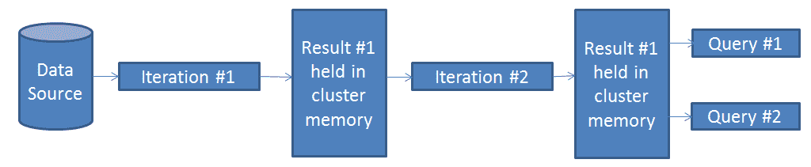

图 1.1

Spark 以以下方式执行作业：

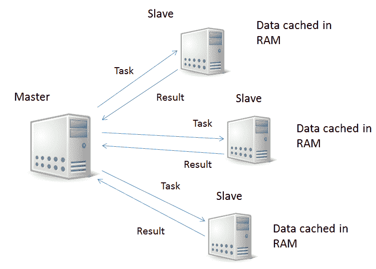

图 1.2

**Master**控制数据的分区方式，并利用数据局部性，同时跟踪所有在**Slave**机器上的分布式数据计算。如果某台 Slave 机器不可用，该机器上的数据会在其他可用机器上重新构建。在独立模式下，Master 是单点故障。章节中关于*使用不同管理器的集群模式*部分涵盖了可能的运行模式，并解释了 Spark 中的容错机制。

Spark 包含五个主要组件：

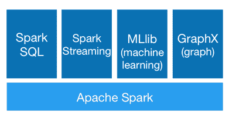

图 1.3

这些组件如下：

+   核心引擎。

+   **Spark SQL**：结构化数据处理模块。

+   **Spark Streaming**：这是对核心 Spark API 的扩展。它允许实时数据流处理。其优势包括可扩展性、高吞吐量和容错性。

+   **MLib**：Spark 机器学习库。

+   **GraphX**：图形和图并行计算算法。

Spark 可以访问存储在不同系统中的数据，如 HDFS、Cassandra、MongoDB、关系型数据库，还可以访问如 Amazon S3 和 Azure Data Lake Storage 等云存储服务。

# 获取 Spark

现在，让我们动手实践 Spark，以便深入了解核心 API 和库。在本书的所有章节中，我将引用 Spark 2.2.1 版本，然而，这里展示的多个示例应适用于 2.0 版本及更高版本。我会在示例仅适用于 2.2+ 版本时做出说明。

首先，你需要从官方网站下载 Spark（[`spark.apache.org/downloads.html`](https://spark.apache.org/downloads.html)）。下载页面应该是这样的：

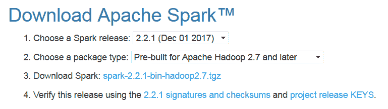

图 1.4

你需要安装 JDK 1.8+ 和 Python 2.7+ 或 3.4+（如果你需要使用这些语言进行开发）。Spark 2.2.1 支持 Scala 2.11。JDK 需要在你的用户路径系统变量中存在，或者你可以设置用户的 `JAVA_HOME` 环境变量指向 JDK 安装目录。

将下载的压缩包内容解压到任何本地目录。然后，进入 `$SPARK_HOME/bin` 目录。在那里，你会找到 Scala 和 Python 的交互式 Spark shell。它们是熟悉这个框架的最佳方式。在本章中，我将展示你可以通过这些 shell 运行的示例。

你可以使用以下命令运行一个 Scala shell：

```py
$SPARK_HOME/bin/spark-shell.sh
```

如果没有指定参数，Spark 会假设你在本地以独立模式运行。以下是控制台的预期输出：

```py
Spark context Web UI available at http://10.72.0.2:4040
Spark context available as 'sc' (master = local[*], app id = local-1518131682342).
Spark session available as 'spark'.
Welcome to
 ____              __
 / __/__  ___ _____/ /__
 _\ \/ _ \/ _ `/ __/  '_/
 /___/ .__/\_,_/_/ /_/\_\   version 2.2.1
 /_/

Using Scala version 2.11.8 (Java HotSpot(TM) 64-Bit Server VM, Java 1.8.0_91)
Type in expressions to have them evaluated.
Type :help for more information.

scala>
```

Web 用户界面可以通过以下 URL 访问：`http://<host>:4040`。

它将给你以下输出：

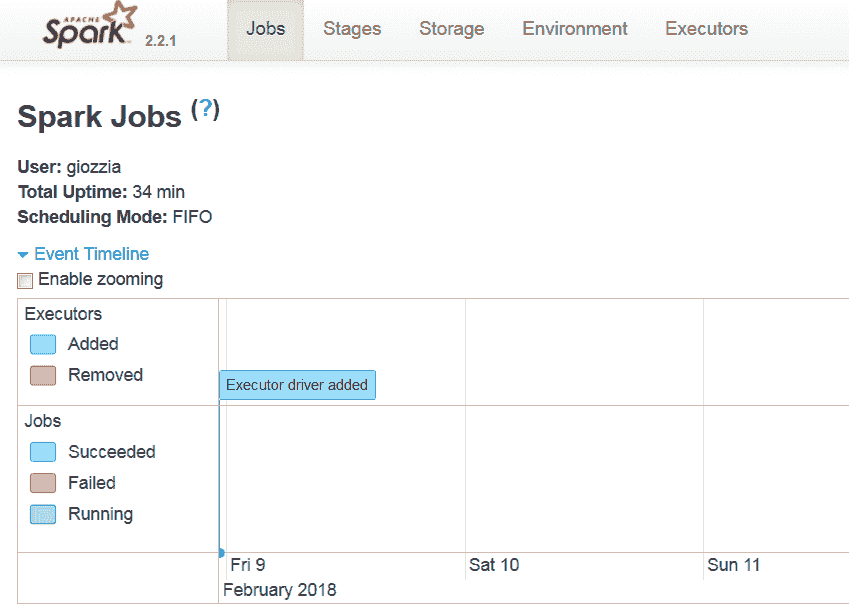

图 1.5

在这里，你可以查看作业和执行器的状态。

从控制台启动的输出中，你会注意到有两个内建变量，`sc`和`spark`是可用的。`sc`表示`SparkContext`（[`spark.apache.org/docs/latest/api/scala/index.html#org.apache.spark.SparkContext`](http://spark.apache.org/docs/latest/api/scala/index.html#org.apache.spark.SparkContext)），在 Spark < 2.0 中，这是每个应用的入口点。通过 Spark 上下文（及其专用版本），你可以从数据源获取输入数据，创建和操作 RDD（[`spark.apache.org/docs/latest/api/scala/index.html#org.apache.spark.rdd.RDD`](http://spark.apache.org/docs/latest/api/scala/index.html#org.apache.spark.rdd.RDD)），并获取 2.0 之前 Spark 的主要抽象。*RDD 编程*部分将详细介绍这一主题和其他操作。从 2.0 版本开始，引入了一个新的入口点`SparkSession`（[`spark.apache.org/docs/latest/api/scala/index.html#org.apache.spark.sql.SparkSession`](http://spark.apache.org/docs/latest/api/scala/index.html#org.apache.spark.sql.SparkSession)），以及一个新的主数据抽象——Dataset（[`spark.apache.org/docs/latest/api/scala/index.html#org.apache.spark.sql.Dataset`](http://spark.apache.org/docs/latest/api/scala/index.html#org.apache.spark.sql.Dataset)）。后续章节将介绍更多细节。`SparkContext`仍然是 Spark API 的一部分，确保与不支持 Spark 会话的现有框架兼容，但项目的方向是将开发重点转向使用`SparkSession`。

这是一个如何读取和操作文本文件，并使用 Spark shell 将其放入 Dataset 的例子（该例子使用的文件是 Spark 分发包中示例资源的一部分）：

```py
scala> spark.read.textFile("/usr/spark-2.2.1/examples/src/main/resources/people.txt")
res5: org.apache.spark.sql.Dataset[String] = [value: string]
```

结果是一个包含文件行的 Dataset 实例。你可以对这个 Dataset 进行多种操作，比如统计行数：

```py
scala> res5.count()
res6: Long = 3
```

你还可以获取 Dataset 的第一行：

```py
scala> res5.first()
res7: String = Michael, 29
```

在这个例子中，我们使用了本地文件系统中的路径。在这种情况下，所有工作节点都应该能从相同路径访问该文件，因此你需要将文件复制到所有工作节点，或者使用一个网络挂载的共享文件系统。

要关闭一个 shell，你可以输入以下命令：

```py
:quit
```

要查看所有可用的 shell 命令列表，输入以下命令：

```py
scala> :help
```

所有命令都可以缩写，例如，使用`:he`代替`:help`。

以下是命令列表：

| **命令** |  **目的** |
| --- | --- |
| `:edit <id>&#124;<line>`  | 编辑历史记录 |
| `:help [command]`  | 打印总结或命令特定的帮助 |
| `:history [num]`   | 显示历史记录（可选的`num`是要显示的命令数量） |
| `:h? <string>`     | 搜索历史记录 |
| `:imports [name name ...]`  | 显示导入历史，标识名称的来源 |
| `:implicits [-v]`           | 显示作用域中的`implicits` |
| `:javap <path&#124;class>`  | 反汇编文件或类名 |
| `:line <id>&#124;<line>`   | 将行放置在历史记录的末尾 |
| `:load <path>`  | 解释文件中的行 |
| `:paste [-raw] [path]`    | 进入粘贴模式或粘贴文件 |
| `:power`              | 启用高级用户模式 |
| `:quit`        | 退出解释器 |
| `:replay [options]`      | 重置`repl`和所有先前命令上的`replay` |
| `:require <path>`   | 将`jar`添加到类路径 |
| `:reset [options]`    | 将`repl`重置为初始状态，忘记所有会话条目 |
| `:save <path>` | 将可重放会话保存到文件中 |
| `:sh <command line>`      | 运行 Shell 命令（结果为`implicitly => List[String]`） |
| `:settings <options>`  | 更新编译器选项，如果可能的话；参见`reset` |
| `:silent`           | 禁用或启用自动打印结果 |
| `:type [-v] <expr>`     | 显示表达式的类型而不评估它 |
| `:kind [-v] <expr>` | 显示表达式的种类 |
| `:warnings`       | 显示最近一行的抑制警告 |

与 Scala 一样，Python 也有交互式 shell。您可以使用以下命令运行它：

```py
$SPARK_HOME/bin/pyspark.sh
```

内置变量名为`spark`，代表`SparkSession`可用。您可以像 Scala shell 一样做同样的事情：

```py
>>> textFileDf = spark.read.text("/usr/spark-2.2.1/examples/src/main/resources/people.txt")
>>> textFileDf.count()
3
>>> textFileDf.first()
Row(value='Michael, 29')
```

与 Java 和 Scala 不同，Python 更加动态，且类型不是强制的。因此，在 Python 中，`DataSet`是`DataSet[Row]`，但您可以称之为 DataFrame，以便与 Pandas 框架的 DataFrame 概念保持一致（[`pandas.pydata.org/`](https://pandas.pydata.org/)）。

要关闭 Python shell，您可以输入以下内容：

```py
quit()
```

在 Spark 中运行代码的选择不仅限于交互式 shell。也可以实现独立的应用程序。以下是在 Scala 中读取和操作文件的示例：

```py
import org.apache.spark.sql.SparkSession

object SimpleApp {
  def main(args: Array[String]) {
    val logFile = "/usr/spark-2.2.1/examples/src/main/resources/people.txt"
    val spark = SparkSession.builder.master("local").appName("Simple Application").getOrCreate()
    val logData = spark.read.textFile(logFile).cache()
    val numAs = logData.filter(line => line.contains("a")).count()
    val numBs = logData.filter(line => line.contains("b")).count()
    println(s"Lines with a: $numAs, Lines with b: $numBs")
    spark.stop()
  }
}
```

应用程序应该定义一个`main()`方法，而不是扩展`scala.App`。注意创建`SparkSession`的代码：

```py
val spark = SparkSession.builder.master("local").appName("Simple Application").getOrCreate()
```

它遵循生成器工厂设计模式。

在结束程序执行之前，始终显式关闭会话：

```py
spark.stop()
```

要构建应用程序，您可以使用您选择的构建工具（`Maven`、`sbt`或`Gradle`），添加来自 Spark 2.2.1 和 Scala 2.11 的依赖项。生成 JAR 文件后，您可以使用`$SPARK_HOME/bin/spark-submit`命令执行它，指定 JAR 文件名、Spark 主 URL 和一系列可选参数，包括作业名称、主类、每个执行器使用的最大内存等。

同样的独立应用也可以在 Python 中实现：

```py
from pyspark.sql import SparkSession

logFile = "YOUR_SPARK_HOME/README.md"  # Should be some file on your system
spark = SparkSession.builder().appName(appName).master(master).getOrCreate()
logData = spark.read.text(logFile).cache()

numAs = logData.filter(logData.value.contains('a')).count()
numBs = logData.filter(logData.value.contains('b')).count()

print("Lines with a: %i, lines with b: %i" % (numAs, numBs))

spark.stop()
```

这可以保存在`.py`文件中，并通过相同的`$SPARK_HOME/bin/spark-submit`命令提交以执行。

# RDD 编程

通常，每个 Spark 应用程序是一个驱动程序，运行为其实现的逻辑并在集群上执行并行操作。根据前面的定义，核心 Spark 框架提供的主要抽象是 RDD。它是一个不可变的分布式数据集合，数据在集群中的机器上进行分区。对 RDD 的操作可以并行执行。

对 RDD 有两种类型的操作：

+   转换

+   行动

**转换**（**transformation**）是对 RDD 的操作，产生另一个 RDD，而 **行动**（**action**）则是触发某些计算的操作，并将结果返回给主节点，或将结果持久化到存储系统中。转换是惰性执行的——直到调用行动才会执行。这里就是 Spark 的强大之处——Spark 的主节点和驱动程序都记住了已经应用于 RDD 的转换操作，因此如果一个分区丢失（例如，一个从节点宕机），它可以很容易地在集群的其他节点上重新构建。 |

以下表格列出了 Spark 支持的常见转换：

| **转换** | **目的** |
| --- | --- |
| `map(func)` | 通过对源 RDD 的每个数据元素应用 `func` 函数，返回一个新的 RDD。 |
| `filter(func)` | 通过选择那些 `func` 函数返回 `true` 的数据元素，返回一个新的 RDD。 |
| `flatMap(func)` | 这个转换类似于 `map`：不同之处在于，每个输入项可以映射到零个或多个输出项（应用的 `func` 函数应该返回一个 `Seq`）。 |
| `union(otherRdd)` | 返回一个新的 RDD，包含源 RDD 和 `otherRdd` 参数中元素的并集。 |
| `distinct([numPartitions])` | 返回一个新的 RDD，仅包含源 RDD 中的唯一元素。 |
| `groupByKey([numPartitions])` | 当对一个包含 (*K*, *V*) 对的 RDD 调用时，它返回一个 (*K*, *Iterable<V>*) 对的 RDD。默认情况下，输出 RDD 的并行度取决于源 RDD 的分区数。你可以传递一个可选的 `numPartitions` 参数来设置不同的分区数。 |
| `reduceByKey(func, [numPartitions])` | 当对一个包含 (*K*, *V*) 对的 RDD 调用时，它返回一个 (*K*, *V*) 对的 RDD，其中每个键的值通过给定的 `func` 函数进行聚合，该函数的类型必须为 *(V*, *V) => V*。与 `groupByKey` 转换相同，reduce 操作的分区数可以通过可选的 `numPartitions` 第二个参数进行配置。 |
| `sortByKey([ascending], [numPartitions])` | 当对一个包含 (*K*, *V*) 对的 RDD 调用时，它返回一个按键排序的 (*K*, *V*) 对的 RDD，排序顺序根据布尔值 `ascending` 参数来指定（升序或降序）。输出 RDD 的分区数量可以通过可选的 `numPartitions` 第二个参数进行配置。 |
| `join(otherRdd, [numPartitions])` | 当应用于类型为 (*K*, *V*) 和 (*K*, *W*) 的 RDD 时，它返回一个 (*K*, (*V*, *W*)) 对的 RDD，为每个键提供所有元素对。它支持左外连接、右外连接和全外连接。输出 RDD 的分区数量可以通过可选的 `numPartitions` 参数进行配置。 |

以下表格列出了 Spark 支持的一些常见操作：

| **操作** | **目的** |
| --- | --- |
| `reduce(func)` | 使用给定函数 `func` 聚合 RDD 的元素（此函数接受两个参数并返回一个结果）。为了确保计算时的正确并行性，reduce 函数 `func` 必须是交换律和结合律成立的。 |
| `collect()` | 返回 RDD 中所有元素作为一个数组传递给驱动程序。 |
| `count()` | 返回 RDD 中元素的总数。 |
| `first()` | 返回 RDD 中的第一个元素。 |
| `take(n)` | 返回一个包含 RDD 中前 *n* 个元素的数组。 |
| `foreach(func)` | 对 RDD 中的每个元素执行 `func` 函数。 |
| `saveAsTextFile(path)` | 将 RDD 的元素以文本文件的形式写入指定目录（通过 `path` 参数指定绝对路径），支持本地文件系统、HDFS 或其他 Hadoop 支持的文件系统。此功能仅适用于 Scala 和 Java。 |
| `countByKey()` | 这个操作仅适用于类型为 (*K*, *V*) 的 RDD——它返回一个 (*K*, *Int*) 对的哈希映射，其中 *K* 是源 RDD 的键，值是该键 *K* 的计数。 |

现在，让我们通过一个示例理解转换和操作的概念，该示例可以在 Scala shell 中执行——它找到输入文本文件中最常用的 *N* 个单词。以下图示展示了这一问题的潜在实现：

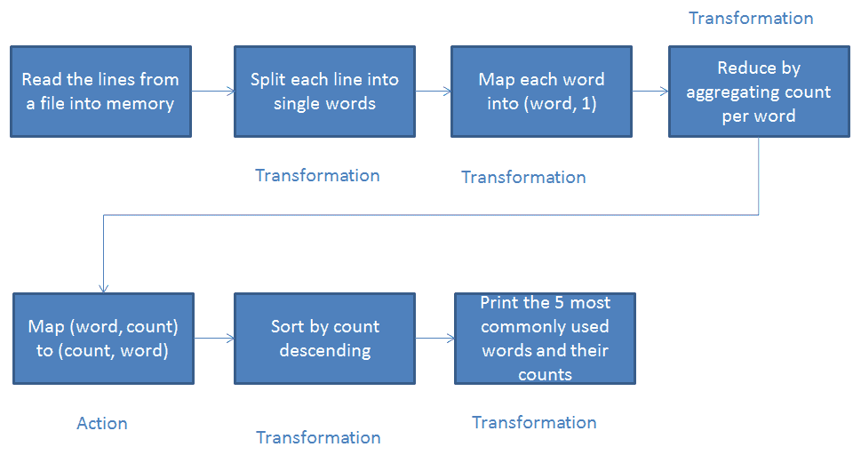

图 1.6

让我们将其转换为代码。

首先，让我们将文本文件的内容加载到一个字符串类型的 RDD 中：

```py
scala> val spiderman = sc.textFile("/usr/spark-2.2.1/tests/spiderman.txt")
spiderman: org.apache.spark.rdd.RDD[String] = /usr/spark-2.2.1/tests/spiderman.txt MapPartitionsRDD[1] at textFile at <console>:24
```

然后，我们将应用必要的转换和操作：

```py
scala> val topWordCount = spiderman.flatMap(str=>str.split(" ")).filter(!_.isEmpty).map(word=>(word,1)).reduceByKey(_+_).map{case(word, count) => (count, word)}.sortByKey(false)
topWordCount: org.apache.spark.rdd.RDD[(Int, String)] = ShuffledRDD[9] at sortByKey at <console>:26
```

这里，我们有以下内容：

+   `flatMap(str=>str.split(" "))`: 将每一行拆分为单个单词

+   `filter(!_.isEmpty)`: 移除空字符串

+   `map(word=>(word,1))`: 将每个单词映射为键值对

+   `reduceByKey(_+_)`: 聚合计数

+   `map{case(word, count) => (count, word)}`: 反转 `(word, count)` 对为 `(count, word)`

+   `sortByKey(false)`: 按降序排序

最后，将输入内容中使用频率最高的五个单词打印到控制台：

```py
scala> topWordCount.take(5).foreach(x=>println(x))
(34,the)
(28,and)
(19,of)
(19,in)
(16,Spider-Man)
```

相同的功能也可以在 Python 中通过以下方式实现：

```py
from operator import add
spiderman = spark.read.text("/usr/spark-2.2.1/tests/spiderman.txt")
lines = spiderman.rdd.map(lambda r: r[0])
counts = lines.flatMap(lambda x: x.split(' ')) \
                  .map(lambda x: (x, 1)) \
                  .reduceByKey(add) \
                  .map(lambda x: (x[1],x[0])) \
                  .sortByKey(False)
```

结果当然与 Scala 示例相同：

```py
>> counts.take(5)
[(34, 'the'), (28, 'and'), (19, 'in'), (19, 'of'), (16, 'Spider-Man')]
```

Spark 可以在执行操作时将 RDD（以及数据集）持久化到内存中。在 Spark 中，持久化和缓存是同义词。持久化 RDD 时，集群中的每个节点会将需要计算的 RDD 分区存储在内存中，并在对相同的 RDD（或通过一些转换从其派生的 RDD）进行进一步操作时重用这些分区。这就是为什么后续操作执行得更快的原因。可以通过调用 RDD 的 `persist()` 方法来标记一个 RDD 进行持久化。当第一次对它执行操作时，它会被保存在集群节点的内存中。Spark 缓存是容错的——这意味着，如果由于某种原因丢失了 RDD 的所有分区，它将通过创建它的转换重新计算这些分区。持久化的 RDD 可以使用不同的存储级别来存储。可以通过将一个 `StorageLevel` 对象传递给 RDD 的 `persist()` 方法来设置级别。以下表格列出了所有可用的存储级别及其含义：

| **存储级别** | **用途** |
| --- | --- |
| `MEMORY_ONLY` | 这是默认的存储级别。它将 RDD 存储为反序列化的 Java 对象在内存中。在 RDD 无法完全放入内存的情况下，一些分区不会被缓存，需要时会动态重新计算。 |
| `MEMORY_AND_DISK` | 它首先将 RDD 存储为反序列化的 Java 对象在内存中，但当 RDD 无法完全放入内存时，它会将部分分区存储在磁盘上（这是与 `MEMORY_ONLY` 之间的主要区别），并在需要时从磁盘中读取。 |
| `MEMORY_ONLY_SER` | 它将 RDD 存储为序列化的 Java 对象。与 `MEMORY_ONLY` 相比，这种方式更节省空间，但在读取操作时 CPU 占用更高。仅适用于 JVM 语言。 |
| `MEMORY_AND_DISK_SER` | 类似于 `MEMORY_ONLY_SER`（将 RDD 存储为序列化的 Java 对象），主要区别在于，对于无法完全放入内存的分区，它将其存储到磁盘中。仅适用于 JVM 语言。 |
| `DISK_ONLY` | 仅将 RDD 分区存储在磁盘中。 |
| `MEMORY_ONLY_2`、`MEMORY_AND_DISK_2` 等 | 与前两种级别（`MEMORY_ONLY` 和 `MEMORY_AND_DISK`）相同，但每个分区会在两个集群节点上复制。 |
| `OFF_HEAP` | 类似于 `MEMORY_ONLY_SER`，但它将数据存储在堆外内存中（假设启用了堆外内存）。使用此存储级别时需要小心，因为它仍处于实验阶段。 |

当一个函数被传递给 Spark 操作时，它会在远程集群节点上执行，该节点将处理函数中使用的所有变量的单独副本。执行完成后，这些变量将被复制到每台机器上。当变量传回驱动程序时，远程机器上的变量不会被更新。支持跨任务的一般读写共享变量是低效的。

然而，在 Spark 中有两种有限类型的共享变量可供使用，适用于两种常见的使用模式——广播变量和累加器。

Spark 编程中最常见的操作之一是对 RDD 执行连接操作，根据给定的键整合数据。在这些情况下，可能会有大量的数据集被发送到执行分区的从属节点进行连接。可以很容易地理解，这种情况会导致巨大的性能瓶颈，因为网络 I/O 的速度比内存访问慢 100 倍。为了解决这个问题，Spark 提供了广播变量，可以将其广播到从属节点。节点上的 RDD 操作可以快速访问广播变量的值。Spark 还尝试使用高效的广播算法来分发广播变量，以减少通信开销。广播变量是通过调用`SparkContext.broadcast(v)`方法从变量*v*创建的。广播变量是*v*的一个封装，其值可以通过调用`value`方法获取。以下是一个可以通过 Spark shell 运行的 Scala 示例：

```py
scala> val broadcastVar = sc.broadcast(Array(1, 2, 3))
broadcastVar: org.apache.spark.broadcast.Broadcast[Array[Int]] = Broadcast(0)

scala> broadcastVar.value
res0: Array[Int] = Array(1, 2, 3)
```

在创建后，广播变量`broadcastVar`可以在集群中执行的任何函数中使用，但初始值*v*除外，因为这可以防止*v*被多次发送到所有节点。为了确保所有节点都能获得相同的广播变量值，*v*在`broadcastVar`广播后不能被修改。

下面是相同示例的 Python 代码：

```py
>>> broadcastVar = sc.broadcast([1, 2, 3])
 <pyspark.broadcast.Broadcast object at 0x102789f10>

 >>> broadcastVar.value
 [1, 2, 3]
```

为了在 Spark 集群的执行器之间聚合信息，应该使用`accumulator`变量。由于它们通过一个结合性和交换性的操作进行添加，因此可以有效支持并行计算。Spark 本地支持数值类型的累加器——可以通过调用`SparkContext.longAccumulator()`（用于累加`Long`类型的值）或`SparkContext.doubleAccumulator()`（用于累加`Double`类型的值）方法来创建它们。

然而，也可以通过编程方式为其他类型提供支持。任何在集群上运行的任务都可以使用`add`方法向累加器添加值，但它们无法读取累加器的值——这个操作只允许驱动程序执行，它可以使用累加器的`value`方法。以下是 Scala 中的代码示例：

```py
scala> val accum = sc.longAccumulator("First Long Accumulator")
accum: org.apache.spark.util.LongAccumulator = LongAccumulator(id: 0, name: Some
(First Long Accumulator), value: 0)

scala> sc.parallelize(Array(1, 2, 3, 4)).foreach(x => accum.add(x))
[Stage 0:>                                                          (0 + 0) / 8]

scala> accum.value
res1: Long = 10
```

在这种情况下，已经创建了一个累加器，并给它分配了一个名称。可以创建没有名称的累加器，但具有名称的累加器将在修改该累加器的阶段的 Web UI 中显示：

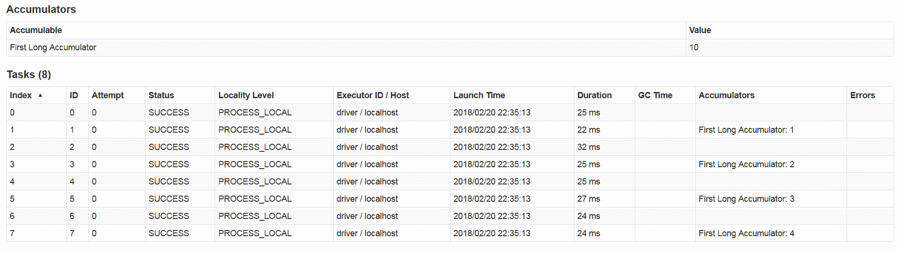

图 1.7

这对于理解运行阶段的进度很有帮助。

相同的 Python 示例如下：

```py
>>> accum = sc.accumulator(0)
>>> accum
Accumulator<id=0, value=0>

>>> sc.parallelize([1, 2, 3, 4]).foreach(lambda x: accum.add(x))
>>> accum.value
10
```

Python 不支持在 Web UI 中跟踪累加器。

请注意，Spark 仅在**action**内部更新累加器。当重新启动任务时，累加器只会更新一次。对于**transformation**，情况则不同。

# Spark SQL、Datasets 和 DataFrames

Spark SQL 是用于结构化数据处理的 Spark 模块。这个 API 和 RDD API 的主要区别在于，提供的 Spark SQL 接口可以更好地了解数据和执行计算的结构。这些额外的信息被 Spark 内部利用，通过 Catalyst 优化引擎进行额外的优化，这个执行引擎无论使用哪种 API 或编程语言，都是相同的。

Spark SQL 通常用于执行 SQL 查询（即使这不是唯一的使用方式）。无论使用 Spark 支持的哪种编程语言来封装 SQL 代码，查询的结果都会以**Dataset**的形式返回。Dataset 是一个分布式数据集合，它作为接口在 Spark 1.6 中被引入。它结合了 RDD 的优势（如强类型和应用有用的 lambda 函数的能力）与 Spark SQL 优化执行引擎（Catalyst，[`databricks.com/blog/2015/04/13/deep-dive-into-spark-sqls-catalyst-optimizer.html`](https://databricks.com/blog/2015/04/13/deep-dive-into-spark-sqls-catalyst-optimizer.html)）的优势。你可以通过从 Java/Scala 对象开始并通过常规的函数式转换来操作 Dataset。Dataset API 在 Scala 和 Java 中可用，而 Python 不支持它。然而，由于 Python 语言的动态特性，很多 Dataset API 的优势在 Python 中已经可以使用。

从 Spark 2.0 开始，DataFrame 和 Dataset API 已合并为 Dataset API，因此**DataFrame**只是一个已经被组织成命名列的 Dataset，在概念上等同于 RDBMS 中的表，但其底层优化更佳（作为 Dataset API 的一部分，Catalyst 优化引擎也在幕后为 DataFrame 工作）。你可以从不同的数据源构建 DataFrame，例如结构化数据文件、Hive 表、数据库表和 RDD 等。与 Dataset API 不同，DataFrame API 可以在任何 Spark 支持的编程语言中使用。

让我们开始动手实践，以便更好地理解 Spark SQL 背后的概念。我将展示的第一个完整示例是基于 Scala 的。启动一个 Scala Spark shell，以交互方式运行以下代码。

让我们使用`people.json`作为数据源。作为此示例的资源之一，包含在 Spark 分发包中的文件可用于创建一个 DataFrame，这是一个行的 Dataset（[`spark.apache.org/docs/latest/api/scala/index.html#org.apache.spark.sql.Row`](http://spark.apache.org/docs/latest/api/scala/index.html#org.apache.spark.sql.Row)）：

```py
val df = spark.read.json("/opt/spark/spark-2.2.1-bin-hadoop2.7/examples/src/main/resources/people.json")
```

你可以将 DataFrame 的内容打印到控制台，检查它是否符合你的预期：

```py
scala> df.show()
+----+-------+
| age| name|
+----+-------+
|null|Michael|
| 30| Andy|
| 19| Justin|
+----+-------+
```

在执行 DataFrame 操作之前，你需要导入隐式转换（例如将 RDD 转换为 DataFrame），并使用`$`符号：

```py
import spark.implicits._
```

现在，你可以以树状格式打印 DataFrame 模式：

```py
scala> df.printSchema()
root
 |-- age: long (nullable = true)
 |-- name: string (nullable = true)
```

选择单一列（例如`name`）：

```py
scala> df.select("name").show()
+-------+
|   name|
+-------+
|Michael|
|   Andy|
| Justin|
+-------+
```

过滤数据：

```py
scala> df.filter($"age" > 27).show()
+---+----+
|age|name|
+---+----+
| 30|Andy|
+---+----+
```

然后添加一个`groupBy`子句：

```py
scala> df.groupBy("age").count().show()
+----+-----+
| age|count|
+----+-----+
|  19|    1|
|null|    1|
|  30|    1|
+----+-----+
```

选择所有行并递增一个数字字段：

```py
scala> df.select($"name", $"age" + 1).show()
+-------+---------+
| name|(age + 1)|
+-------+---------+
|Michael| null|
| Andy| 31|
| Justin| 20|
+-------+---------+
```

你可以通过`SparkSession`的`sql`函数以编程方式运行 SQL 查询。该函数返回查询结果的 DataFrame，在 Scala 中是`Dataset[Row]`。让我们考虑与前面示例相同的 DataFrame：

```py
val df = spark.read.json("/opt/spark/spark-2.2.1-bin-hadoop2.7/examples/src/main/resources/people.json")
```

你可以将其注册为 SQL 临时视图：

```py
df.createOrReplaceTempView("people")
```

然后，你可以在此处执行 SQL 查询：

```py
scala> val sqlDF = spark.sql("SELECT * FROM people")
sqlDF: org.apache.spark.sql.DataFrame = [age: bigint, name: string]

scala> sqlDF.show()
+----+-------+
| age|   name|
+----+-------+
|null|Michael|
|  30|   Andy|
|  19| Justin|
+----+-------+
```

在 Python 中也可以执行相同的操作：

```py
>>> df = spark.read.json("/opt/spark/spark-2.2.1-bin-hadoop2.7/examples/src/main/resources/people.json")
```

结果如下：

```py
>> df.show()
+----+-------+
| age|   name|
+----+-------+
|null|Michael|
|  30|   Andy|
|  19| Justin|
+----+-------+

>>> df.printSchema()
root
 |-- age: long (nullable = true)
 |-- name: string (nullable = true)

>>> df.select("name").show()
+-------+
|   name|
+-------+
|Michael|
|   Andy|
| Justin|
+-------+

>>> df.filter(df['age'] > 21).show()
+---+----+
|age|name|
+---+----+
| 30|Andy|
+---+----+

>>> df.groupBy("age").count().show()
+----+-----+
| age|count|
+----+-----+
|  19|    1|
|null|    1|
|  30|    1|
+----+-----+

>>> df.select(df['name'], df['age'] + 1).show()
+-------+---------+
|   name|(age + 1)|
+-------+---------+
|Michael|     null|
|   Andy|       31|
| Justin|       20|
+-------+---------+

>>> df.createOrReplaceTempView("people")
>>> sqlDF = spark.sql("SELECT * FROM people")
>>> sqlDF.show()
+----+-------+
| age|   name|
+----+-------+
|null|Michael|
|  30|   Andy|
|  19| Justin|
+----+-------+
```

Spark SQL 和 Datasets 的其他功能（数据源、聚合、自包含应用等）将在第三章中介绍，*提取、转换、加载*。

# Spark Streaming

Spark Streaming 是另一个 Spark 模块，扩展了核心 Spark API，并提供了一种可扩展、容错和高效的方式来处理实时流数据。通过将流数据转换为*微*批次，Spark 的简单批处理编程模型也可以应用于流式用例中。这个统一的编程模型使得将批处理和交互式数据处理与流式处理相结合变得容易。支持多种数据摄取源（例如 Kafka、Kinesis、TCP 套接字、S3 或 HDFS 等流行源），并且可以使用 Spark 中任何高级函数来处理从这些源获取的数据。最终，处理过的数据可以持久化到关系数据库、NoSQL 数据库、HDFS、对象存储系统等，或通过实时仪表板进行消费。没有什么可以阻止其他高级 Spark 组件（如 MLlib 或 GraphX）应用于数据流：

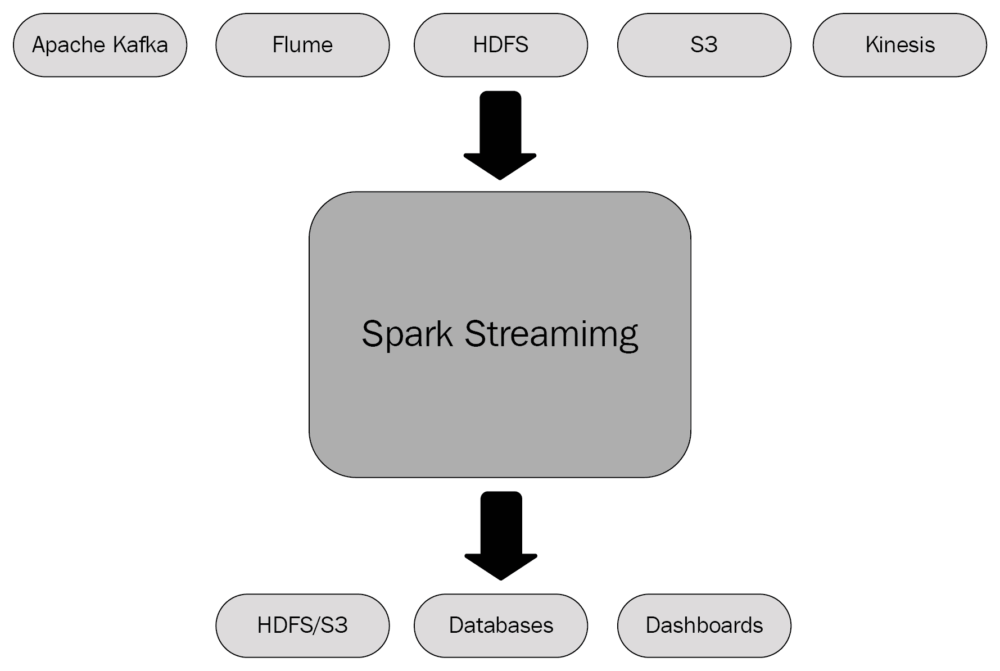

图 1.8

以下图表展示了 Spark Streaming 的内部工作原理——它接收实时输入数据流并将其划分为批次；这些批次由 Spark 引擎处理，生成最终的批量结果：

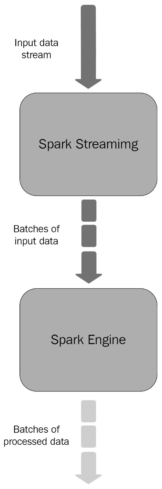

图 1.9

Spark Streaming 的高级抽象是**DStream**（**Discretized Stream**的简称），它是对连续数据流的封装。从内部来看，DStream 是作为一系列 RDD 的序列来表示的。DStream 包含它依赖的其他 DStream 的列表、将输入 RDD 转换为输出 RDD 的函数，以及调用该函数的时间间隔。DStream 可以通过操作现有的 DStream 来创建，例如应用 map 或 filter 函数（这分别内部创建了`MappedDStreams`和`FilteredDStreams`），或者通过从外部源读取数据（在这些情况下，基类是`InputDStream`）。

让我们实现一个简单的 Scala 示例——一个流式单词计数自包含应用程序。此类所用的代码可以在与 Spark 发行版一起捆绑的示例中找到。要编译和打包它，你需要将 Spark Streaming 的依赖项添加到你的`Maven`、`Gradle`或`sbt`项目描述文件中，还需要添加来自 Spark Core 和 Scala 的依赖项。

首先，我们需要从`SparkConf`和`StreamingContext`（它是任何流式功能的主要入口点）开始创建：

```py
import org.apache.spark.SparkConf
import org.apache.spark.streaming.{Seconds, StreamingContext}
val sparkConf = new SparkConf().setAppName("NetworkWordCount").setMaster("local[*]")
  val ssc = new StreamingContext(sparkConf, Seconds(1))

```

批处理间隔已设置为 1 秒。表示来自 TCP 源的流数据的 DStream 可以通过`ssc`流上下文创建；我们只需要指定源的主机名和端口，以及所需的存储级别：

```py
val lines = ssc.socketTextStream(args(0), args(1).toInt, StorageLevel.MEMORY_AND_DISK_SER)
```

返回的`lines` DStream 是将从服务器接收到的数据流。每条记录将是我们希望分割为单个单词的单行文本，从而指定空格字符作为分隔符：

```py
val words = lines.flatMap(_.split(" "))
```

然后，我们将对这些单词进行计数：

```py
val words = lines.flatMap(_.split(" "))
 val wordCounts = words.map(x => (x, 1)).reduceByKey(_ + _)
wordCounts.print()
```

`words` DStream 被映射（一个一对一的转换）为一个(*word*, *1*)对的 DStream，随后通过减少操作得到每批数据中单词的频率。最后的命令会每秒打印生成的计数。DStream 中的每个 RDD 包含来自某个时间间隔的数据——对 DStream 应用的任何操作都转换为对底层 RDD 的操作：

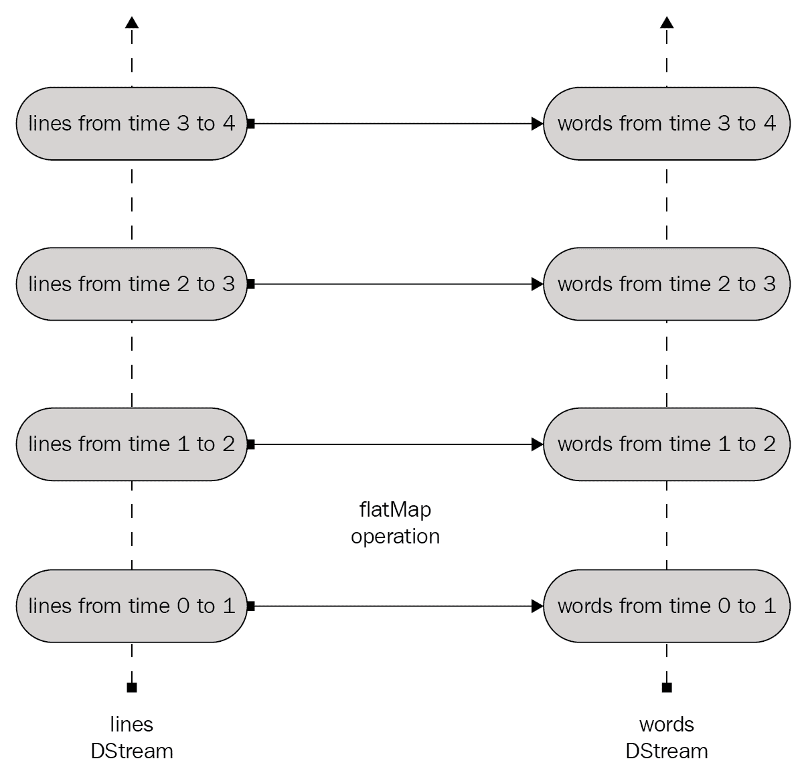

图 1.10

在设置好所有转换后，使用以下代码开始处理：

```py
ssc.start()
 ssc.awaitTermination()
```

在运行此示例之前，首先需要运行`netcat`（一个在大多数类 Unix 系统中找到的小工具）作为数据服务器：

```py
nc -lk 9999
```

然后，在另一个终端中，你可以通过传递以下参数来启动示例：

```py
localhost 9999
```

任何在终端中输入并通过`netcat`服务器运行的行都会被计数，并且每秒在应用程序屏幕上打印一次。

无论`nc`是否在运行此示例的系统中不可用，你都可以在 Scala 中实现自己的数据服务器：

```py
import java.io.DataOutputStream
import java.net.{ServerSocket, Socket}
import java.util.Scanner

object SocketWriter {
  def main(args: Array[String]) {
    val listener = new ServerSocket(9999)
    val socket = listener.accept()

    val outputStream = new DataOutputStream(socket.getOutputStream())
    System.out.println("Start writing data. Enter close when finish");
    val sc = new Scanner(System.in)
    var str = ""
    /**
     * Read content from scanner and write to socket.
     */
    while (!(str = sc.nextLine()).equals("close")) {
        outputStream.writeUTF(str);
    }
    //close connection now.
    outputStream.close()
    listener.close()
  }
}
```

相同的自包含应用程序在 Python 中可能如下所示：

```py
from __future__ import print_function

import sys

from pyspark import SparkContext
from pyspark.streaming import StreamingContext

if __name__ == "__main__":
    if len(sys.argv) != 3:
        print("Usage: network_wordcount.py <hostname> <port>", file=sys.stderr)
        exit(-1)
    sc = SparkContext(appName="PythonStreamingNetworkWordCount")
    ssc = StreamingContext(sc, 1)

    lines = ssc.socketTextStream(sys.argv[1], int(sys.argv[2]))
    counts = lines.flatMap(lambda line: line.split(" "))\
                  .map(lambda word: (word, 1))\
                  .reduceByKey(lambda a, b: a+b)
    counts.pprint()

    ssc.start()
    ssc.awaitTermination()
```

DStreams 支持 RDD 大部分可用的转换功能。这意味着输入 DStream 中的数据可以像 RDD 中的数据一样被修改。下表列出了 Spark DStreams 支持的一些常见转换：

| **转换** | **用途** |
| --- | --- |
| `map(func)` | 返回一个新的 DStream。`func`映射函数应用于源 DStream 的每个元素。 |
| `flatMap(func)` | 与`map`相同。唯一的区别是新 DStream 中的每个输入项可以映射到 0 个或多个输出项。 |
| `filter(func)` | 返回一个新的 DStream，只包含源 DStream 中`func`过滤函数返回 true 的元素。 |
| `repartition(numPartitions)` | 用于通过创建不同数量的分区来设置并行度。 |
| `union(otherStream)` | 返回一个新的 DStream。它包含源 DStream 和输入的 `otherDStream` DStream 中元素的并集。 |
| `count()` | 返回一个新的 DStream。它包含通过计算每个 RDD 中元素的数量而得到的单一元素 RDD。 |
| `reduce(func)` | 返回一个新的 DStream。它包含通过应用 `func` 函数（该函数应该是结合性和交换性的，以便支持正确的并行计算）在源中每个 RDD 上聚合得到的单一元素 RDD。 |
| `countByValue()` | 返回一个新的 DStream，包含 (*K*, *Long*) 对，其中 *K* 是源元素的类型。每个键的值表示其在源中每个 RDD 中的频率。 |
| `reduceByKey(func, [numTasks])` | 返回一个新的 DStream，包含 (*K*, *V*) 对（对于源 DStream 中的 (*K*, *V*) 对）。每个键的值通过应用 `func` 函数来进行聚合。为了进行分组，此转换使用 Spark 默认的并行任务数（在本地模式下是 2，而在集群模式下由 `config` 属性 `spark.default.parallelism` 确定），但可以通过传递可选的 `numTasks` 参数来更改此数值。 |
| `join(otherStream, [numTasks])` | 返回一个新的 DStream，包含 (*K*, (*V*, *W*)) 对，当它分别应用于两个 DStream，其中一个包含 (*K*, *V*) 对，另一个包含 (*K*, *W*) 对时。 |
| `cogroup(otherStream, [numTasks])` | 返回一个新的 DStream，包含 (*K*, *Seq[V]*, *Seq[W]*) 元组，当它分别应用于两个 DStream，其中一个包含 (*K*, *V*) 对，另一个包含 (*K*, *W*) 对时。 |
| `transform(func)` | 返回一个新的 DStream。它将 RDD 到 RDD 的 `func` 函数应用于源中的每个 RDD。 |
| `updateStateByKey(func)` | 返回一个新的状态 DStream。新 DStream 中每个键的状态通过将输入函数 `func` 应用于先前的状态和该键的新值来更新。 |

窗口计算由 Spark Streaming 提供。如以下图所示，它们允许你在滑动数据窗口上应用转换：

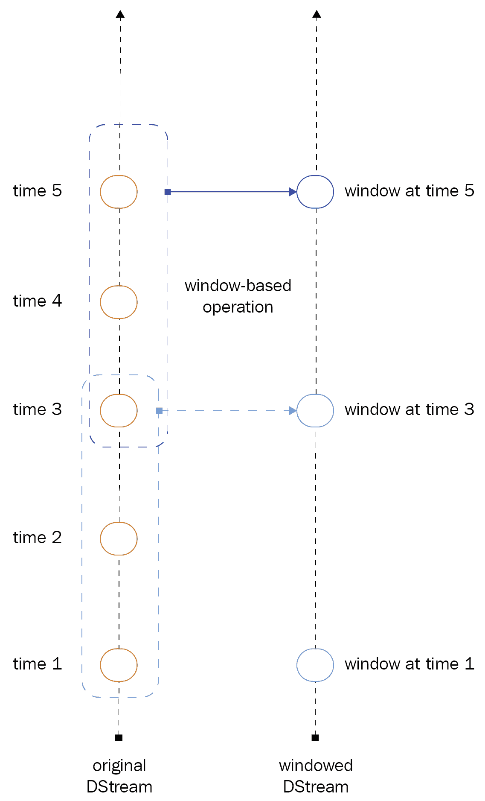

图 1.11

当一个窗口在源 DStream 上滑动时，所有在该窗口内的 RDD 都会被考虑并转换，生成返回的窗口化 DStream 的 RDD。看一下上面图示的具体例子，基于窗口的操作应用于三个时间单位的数据，并且它以两为滑动步长。任何使用的窗口操作都需要指定两个参数：

+   **窗口长度**：窗口的持续时间

+   **滑动间隔**：窗口操作执行的间隔时间

这两个参数必须是源 DStream 批次间隔的倍数。

让我们看看这个方法如何应用于本节开始时介绍的应用场景。假设你想要每隔 10 秒钟生成一次过去 60 秒数据的字数统计。需要在过去 60 秒的 DStream 中对（*word*, *1*）对应用 `reduceByKey` 操作。这可以通过 `reduceByKeyAndWindow` 操作来实现。转换为 Scala 代码如下：

```py
val windowedWordCounts = pairs.reduceByKeyAndWindow((a:Int,b:Int) => (a + b), Seconds(60), Seconds(10))
```

对于 Python，代码如下：

```py
windowedWordCounts = pairs.reduceByKeyAndWindow(lambda x, y: x + y, lambda x, y: x - y, 60, 10)
```

以下表列出了 Spark 为 DStreams 支持的一些常见窗口操作：

| **转换** | **目的** |
| --- | --- |
| `window(windowLength, slideInterval)` | 返回一个新的 DStream。它基于源数据的窗口化批次。 |
| `countByWindow(windowLength, slideInterval)` | 返回源 DStream 中元素的滑动窗口计数（基于 `windowLength` 和 `slideInterval` 参数）。 |
| `reduceByWindow(func, windowLength, slideInterval)` | 返回一个新的单元素 DStream。它是通过在滑动时间间隔内聚合源 DStream 中的元素，并应用 `func` 减少函数来创建的（为了支持正确的并行计算，`func` 必须是结合性和交换性的）。 |
| `reduceByKeyAndWindow(func, windowLength, slideInterval, [numTasks])` | 返回一个新的由（*K*, *V*）对组成的 DStream（与源 DStream 相同的 *K* 和 *V*）。每个键的值通过在滑动窗口中对批次（由 `windowLength` 和 `slideInterval` 参数定义）应用 `func` 输入函数来聚合。并行任务的数量在本地模式下为 2（默认），而在集群模式下由 Spark 配置属性 `spark.default.parallelism.numTask` 给出，这是一个可选参数，用于指定自定义任务数量。 |
| `reduceByKeyAndWindow(func, invFunc, windowLength, slideInterval, [numTasks])` | 这是 `reduceByKeyAndWindow` 转换的一个更高效版本。这次，当前窗口的减少值是通过使用前一个窗口的减少值逐步计算出来的。通过减少进入窗口的新数据，同时对离开窗口的旧数据进行逆减少，来实现这一点。请注意，这种机制只有在 `func` 函数有相应的逆减少函数 `invFunc` 时才能工作。 |
| `countByValueAndWindow(windowLength, slideInterval, [numTasks])` | 返回一个由（*K*, *Long*）对组成的 DStream（与源 DStream 组成的（*K*, *V*）对相同）。返回的 DStream 中每个键的值是其在给定滑动窗口内的频率（由 `windowLength` 和 `slideInterval` 参数定义）。`numTask` 是一个可选参数，用于指定自定义任务数量。 |

# 使用不同管理器的集群模式

以下图示展示了 Spark 应用程序在集群上如何运行。它们是由`SparkContext`对象在**Driver Program**中协调的独立进程集。`SparkContext`连接到**Cluster Manager**，后者负责在各个应用程序之间分配资源。一旦**SparkContext**连接，Spark 将在集群节点上获取执行器。

执行器是执行计算并存储给定 Spark 应用程序数据的进程。**SparkContext**将应用程序代码（Scala 的 JAR 文件或 Python 的.py 文件）发送到执行器。最后，它将运行任务发送到执行器：

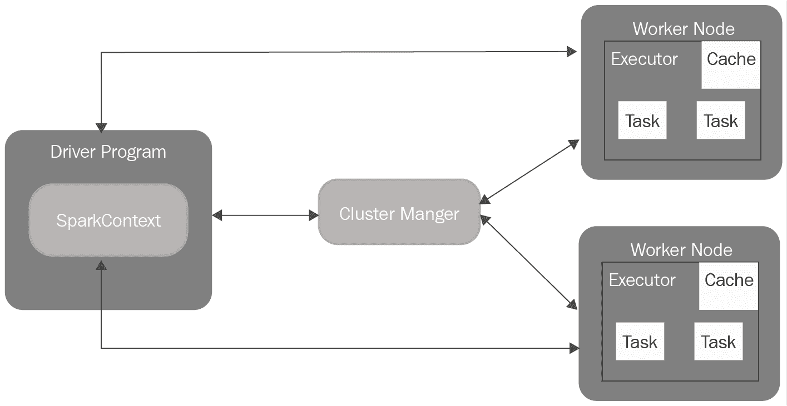

图 1.12

为了将不同的应用程序彼此隔离，每个 Spark 应用程序都会获得自己的执行进程。这些进程会在整个应用程序的运行期间保持活跃，并以多线程模式运行任务。缺点是无法在不同的 Spark 应用程序之间共享数据——为了共享数据，数据需要持久化到外部存储系统。

Spark 支持不同的集群管理器，但它与底层类型无关。

执行时，驱动程序必须能从工作节点的网络地址访问，因为它必须监听并接受来自执行器的连接请求。由于它负责在集群上调度任务，因此应尽量将其执行在接近工作节点的地方，即在同一个局域网中（如果可能）。

以下是当前在 Spark 中支持的集群管理器：

+   **Standalone**：一种简单的集群管理器，便于设置集群。它包含在 Spark 中。

+   **Apache Mesos**：一个开源项目，用于管理计算机集群，开发于加利福尼亚大学伯克利分校。

+   **Hadoop YARN**：从 Hadoop 2 版本开始提供的资源管理器。

+   **Kubernetes**：一个开源平台，提供面向容器的基础设施。Spark 中的 Kubernetes 支持仍处于实验阶段，因此可能尚未准备好用于生产环境。

# 独立模式

对于独立模式，您只需要将编译版本的 Spark 放置在集群的每个节点上。所有集群节点需要能够解析其他集群成员的主机名，并且能够相互路由。Spark 主节点的 URL 可以在所有节点的`$SPARK_HOME/conf/spark-defaults.conf`文件中进行配置：

```py
spark.master                     spark://<master_hostname_or_IP>:7077
```

然后，需要在所有节点的`$SPARK_HOME/conf/spark-env.sh`文件中指定 Spark 主节点的主机名或 IP 地址，如下所示：

```py
SPARK_MASTER_HOST,               <master_hostname_or_IP>
```

现在，可以通过执行以下脚本启动一个独立的主服务器：

```py
$SPARK_HOME/sbin/start-master.sh
```

一旦主节点完成，Web UI 将可以通过`http://<master_hostname_or_IP>:8080` URL 访问。从这里可以获得用于启动工作节点的主节点 URL。现在可以通过执行以下脚本启动一个或多个工作节点：

```py
$SPARK_HOME/sbin/start-slave.sh <master-spark-URL>
```

每个工作节点启动后都会有自己的 Web UI，其 URL 为 `http://<worker_hostname_or_IP>:8081`。

工作节点的列表，以及它们的 CPU 数量和内存等信息，可以在主节点的 Web UI 中找到。

这样做的方法是手动运行独立集群。也可以使用提供的启动脚本。需要创建一个 `$SPARK_HOME/conf/slaves` 文件作为初步步骤。该文件必须包含所有要启动 Spark 工作节点的机器的主机名，每行一个。在 Spark 主节点与 Spark 从节点之间需要启用无密码**SSH**（即**安全外壳**）以允许远程登录，从而启动和停止从节点守护进程。然后，可以使用以下 shell 脚本启动或停止集群，这些脚本位于 `$SPARK_HOME/sbin` 目录中：

+   `start-master.sh`：启动一个主节点实例

+   `start-slaves.sh`：在 `conf/slaves` 文件中指定的每台机器上启动一个从节点实例

+   `start-slave.sh`：启动单个从节点实例

+   `start-all.sh`：同时启动主节点和多个从节点

+   `stop-master.sh`：停止通过 `sbin/start-master.sh` 脚本启动的主节点

+   `stop-slaves.sh`：停止 `conf/slaves` 文件中指定节点上的所有从节点实例

+   `stop-all.sh`：停止主节点及其从节点

这些脚本必须在将运行 Spark 主节点的机器上执行。

可以通过以下方式运行一个交互式 Spark shell 对集群进行操作：

```py
$SPARK_HOME/bin/spark-shell --master <master-spark-URL>
```

可以使用 `$SPARK_HOME/bin/spark-submit` 脚本将已编译的 Spark 应用程序提交到集群。Spark 当前支持独立集群的两种部署模式：客户端模式和集群模式。在客户端模式下，驱动程序和提交应用程序的客户端在同一进程中启动，而在集群模式下，驱动程序从其中一个工作进程启动，客户端进程在提交应用程序后立即退出（无需等待应用程序完成）。

当通过 `spark-submit` 启动应用程序时，其 JAR 文件会自动分发到所有工作节点。应用程序依赖的任何附加 JAR 文件应通过 `jars` 标志指定，并使用逗号作为分隔符（例如，`jars`, `jar1`, `jar2`）。

如在*Apache Spark 基础知识*一节中提到的，独立模式下，Spark 主节点是单点故障。这意味着如果 Spark 主节点宕机，Spark 集群将停止工作，所有当前提交或正在运行的应用程序将失败，并且无法提交新的应用程序。

可以使用 Apache ZooKeeper ([`zookeeper.apache.org/`](https://zookeeper.apache.org/)) 来配置高可用性，ZooKeeper 是一个开源且高度可靠的分布式协调服务，或者可以通过 Mesos 或 YARN 部署为集群，这部分将在接下来的两节中讨论。

# Mesos 集群模式

Spark 可以在由 Apache Mesos（[`mesos.apache.org/`](http://mesos.apache.org/)）管理的集群上运行。Mesos 是一个跨平台、云提供商无关、集中式且容错的集群管理器，专为分布式计算环境设计。其主要特性包括资源管理和隔离，以及跨集群的 CPU 和内存调度。它可以将多个物理资源合并为单个虚拟资源，这与传统的虚拟化不同，传统虚拟化将单个物理资源分割为多个虚拟资源。使用 Mesos，可以构建或调度诸如 Apache Spark 之类的集群框架（尽管不仅限于此）。下图展示了 Mesos 的架构：

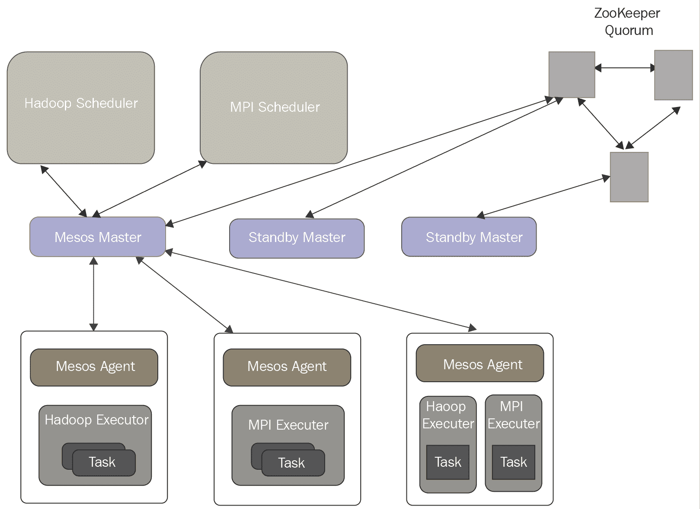

图 1.13

Mesos 由主守护程序和框架组成。主守护程序管理每个集群节点上运行的代理守护程序，而 Mesos 框架在代理上运行任务。主守护程序通过提供资源来实现对框架的细粒度资源共享（包括 CPU 和 RAM）。它根据给定的组织策略决定向每个框架提供多少可用资源。为了支持各种策略集，主使用模块化架构通过插件机制轻松添加新的分配模块。一个 Mesos 框架由两个组件组成 — 调度程序注册自己以接收主提供的资源，执行程序在代理节点上启动以执行框架的任务。尽管主决定向每个框架提供多少资源，但框架的调度程序负责选择要使用的提供的资源。框架一旦接受提供的资源，就会向 Mesos 传递它想要在这些资源上执行的任务的描述。Mesos 随后在相应的代理上启动这些任务。

使用 Mesos 部署 Spark 集群以取代 Spark Master Manager 的优势包括以下几点：

+   在 Spark 和其他框架之间进行动态分区

+   在多个 Spark 实例之间进行可扩展分区

Spark 2.2.1 设计用于与 Mesos 1.0.0+配合使用。在本节中，我不会描述部署 Mesos 集群的步骤 — 我假设 Mesos 集群已经可用并正在运行。在 Mesos 主节点的 Web UI 上，端口为`5050`，验证 Mesos 集群准备好运行 Spark：

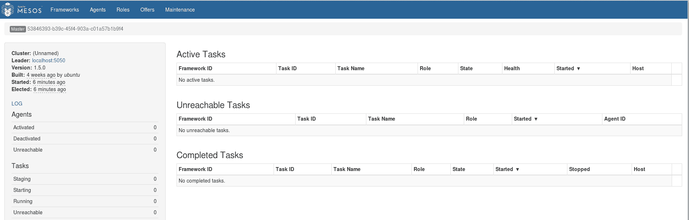

图 1.14

检查 Agents 标签中是否存在所有预期的机器。

要从 Spark 使用 Mesos，需要在 Mesos 本身可以访问的位置提供 Spark 二进制包，并且需要配置 Spark 驱动程序程序以连接到 Mesos。或者，也可以在所有 Mesos 从节点上安装 Spark，然后配置 `spark.mesos.executor.home` 属性（默认值为 `$SPARK_HOME`）以指向该位置。

Mesos 主节点的 URL 形式为 `mesos://host:5050`，对于单主节点的 Mesos 集群，或者对于使用 Zookeeper 的多主节点 Mesos 集群，形式为 `mesos://zk://host1:2181,host2:2181,host3:2181/mesos`。

以下是如何在 Mesos 集群上启动 Spark shell 的示例：

```py
$SPARK_HOME/bin/spark-shell --master mesos://127.0.0.1:5050 -c spark.mesos.executor.home=`pwd`
```

一个 Spark 应用程序可以按以下方式提交到 Mesos 管理的 Spark 集群：

```py
$SPARK_HOME/bin/spark-submit --master mesos://127.0.0.1:5050 --total-executor-cores 2 --executor-memory 3G  $SPARK_HOME/examples/src/main/python/pi.py 100
```

# YARN 集群模式

YARN ([`hadoop.apache.org/docs/stable/hadoop-yarn/hadoop-yarn-site/YARN.html`](http://hadoop.apache.org/docs/stable/hadoop-yarn/hadoop-yarn-site/YARN.html))，它是在 Apache Hadoop 2.0 中引入的，带来了在可扩展性、高可用性和对不同范式的支持方面的显著改进。在 Hadoop 版本 1 的 **MapReduce** 框架中，作业执行由几种类型的进程控制——一个名为 `JobTracker` 的单一主进程协调集群中运行的所有作业，并将 `map` 和 `reduce` 任务分配给 `TaskTrackers`，这些是运行分配任务的从属进程，并定期将进度报告给 `JobTracker`。拥有一个单一的 `JobTracker` 成为可扩展性的瓶颈。最大集群规模略超过 4000 个节点，并且并发任务数限制为 40,000。此外，`JobTracker` 是单点故障，并且唯一可用的编程模型是 **MapReduce**。

YARN 的基本思想是将资源管理和作业调度或监控的功能拆分为独立的守护进程。其思路是拥有一个全局的**ResourceManager**和每个应用程序的**ApplicationMaster**（**App Mstr**）。一个应用程序可以是一个单独的作业，也可以是作业的有向无环图（DAG）。以下是 YARN 架构的示意图：

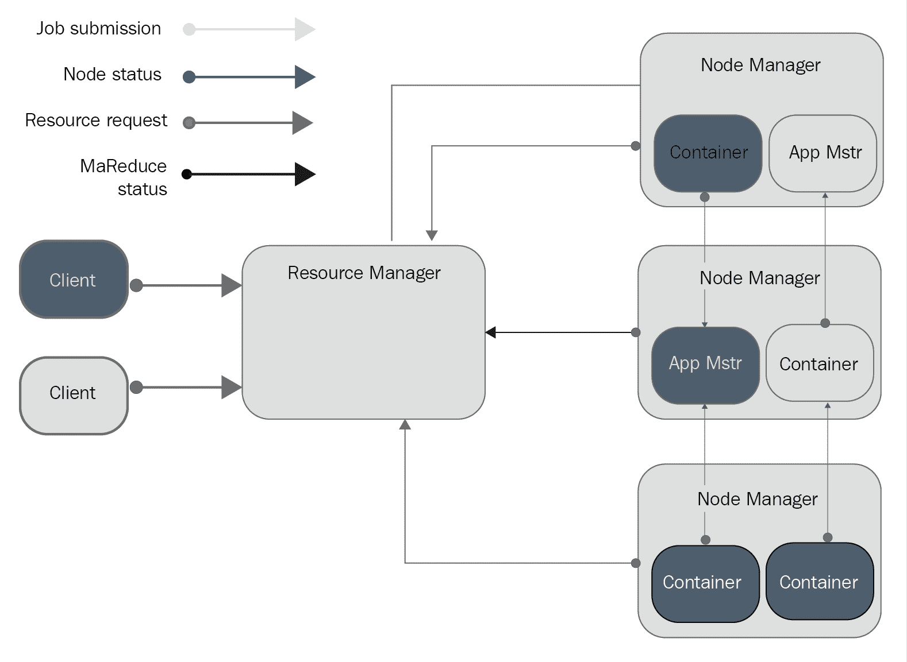

图 1.15

**ResourceManager** 和 **NodeManager** 组成了 YARN 框架。**ResourceManager** 决定所有运行应用程序的资源使用，而 **NodeManager** 是运行在集群中任何机器上的代理，负责通过监控容器的资源使用（包括 CPU 和内存）并向 **ResourceManager** 报告。**ResourceManager** 由两个组件组成——调度器和 ApplicationsManager。调度器是负责分配资源给各种正在运行的应用程序的组件，但它不对应用程序状态进行监控，也不提供重启失败任务的保证。它是根据应用程序的资源需求来进行调度的。

ApplicationsManager 接受作业提交，并提供在任何故障时重新启动 **App Mstr** 容器的服务。每个应用程序的 **App Mstr** 负责与调度程序协商适当的资源容器，并监视其状态和进度。YARN 作为通用调度程序，支持用于 Hadoop 集群的非 MapReduce 作业（如 Spark 作业）。

# 在 YARN 上提交 Spark 应用程序

要在 YARN 上启动 Spark 应用程序，需要设置 `HADOOP_CONF_DIR` 或 `YARN_CONF_DIR` 环境变量，并指向包含 Hadoop 集群客户端配置文件的目录。这些配置用于连接到 YARN ResourceManager 和写入 HDFS。此配置分发到 YARN 集群，以便 Spark 应用程序使用的所有容器具有相同的配置。在 YARN 上启动 Spark 应用程序时，有两种部署模式可用：

+   **Cluster mode**：在此情况下，Spark Driver 在由 YARN 在集群上管理的应用程序主进程内运行。客户端在启动应用程序后可以完成其执行。

+   **Client mode**：在此情况下，Driver 和客户端在同一个进程中运行。应用程序主进程仅用于从 YARN 请求资源的目的。

与其他模式不同，在 YARN 模式中，Master 的地址是从 Hadoop 配置中检索的 ResourceManager 的地址。因此，`master` 参数的值始终为 `yarn`。

您可以使用以下命令在集群模式下启动 Spark 应用程序：

```py
$SPARK_HOME/bin/spark-submit --class path.to.your.Class --master yarn --deploy-mode cluster [options] <app jar> [app options]
```

在集群模式下，由于 Driver 运行在与客户端不同的机器上，`SparkContext.addJar` 方法无法使用客户端本地的文件。唯一的选择是使用 `launch` 命令中的 `jars` 选项包含它们。

在客户端模式下启动 Spark 应用程序的方法相同——`deploy-mode` 选项值需要从 cluster 更改为 client。

# Kubernetes 集群模式

**Kubernetes** ([`kubernetes.io/`](https://kubernetes.io/)) 是一个开源系统，用于自动化部署、扩展和管理容器化应用程序。它最初由 Google 实施，于 2014 年开源。以下是 Kubernetes 的主要概念：

+   **Pod**：这是可以创建和管理的最小计算可部署单元。Pod 可以看作是一个或多个共享网络和存储空间的容器组，还包含如何运行这些容器的规范。

+   **Deployment**：这是一个抽象层，其主要目的是声明应该同时运行多少个 Pod 的副本。

+   **Ingress**：这是与在 Pod 中运行的服务通信的开放通道。

+   **Node**：这是集群中单个机器的表示。

+   **持久卷**：它提供一个文件系统，可以挂载到集群，而不与任何特定节点关联。这是 Kubernetes 持久化信息（数据、文件等）的方法。

以下图（来源：[`d33wubrfki0l68.cloudfront.net/518e18713c865fe67a5f23fc64260806d72b38f5/61d75/images/docs/post-ccm-arch.png`](https://d33wubrfki0l68.cloudfront.net/518e18713c865fe67a5f23fc64260806d72b38f5/61d75/images/docs/post-ccm-arch.png)）展示了 Kubernetes 架构：

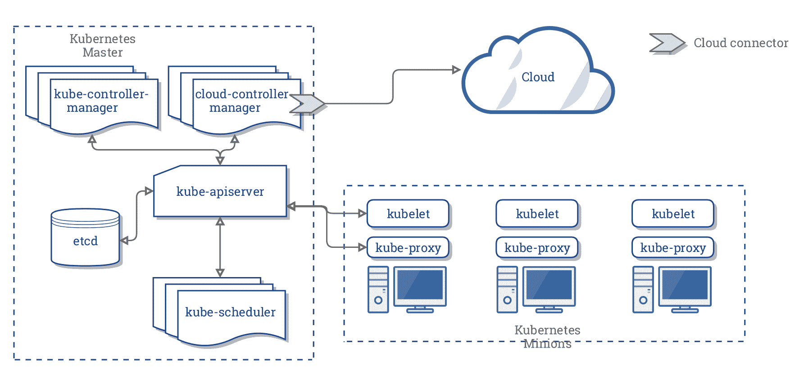

图 1.16

Kubernetes 架构的主要组件如下：

+   **云控制器管理器**：它运行 Kubernetes 控制器

+   **控制器**：共有四个——节点、路由、服务和 PersistentVolumeLabels

+   **Kubelets**：运行在节点上的主要代理

提交 Spark 作业到 Kubernetes 集群可以通过 `spark-submit` 直接完成。Kubernetes 要求我们提供可以部署到 pod 中容器的 Docker ([`www.docker.com/`](https://www.docker.com/)) 镜像。从 2.3 版本开始，Spark 提供了一个 Dockerfile (`$SPARK_HOME/kubernetes/dockerfiles/Dockerfile`，也可以根据特定应用需求进行定制) 和一个脚本 (`$SPARK_HOME/bin/docker-image-tool.sh`)，用于构建和发布将用于 Kubernetes 后端的 Docker 镜像。以下是通过提供的脚本构建 Docker 镜像的语法：

```py
$SPARK_HOME/bin/docker-image-tool.sh -r <repo> -t my-tag build
```

以下是使用相同脚本将镜像推送到 Docker 仓库的语法：

```py
$SPARK_HOME/bin/docker-image-tool.sh -r <repo> -t my-tag push
```

作业可以通过以下方式提交：

```py
$SPARK_HOME/bin/spark-submit \
 --master k8s://https://<k8s_hostname>:<k8s_port> \
 --deploy-mode cluster \
 --name <application-name> \
 --class <package>.<ClassName> \
 --conf spark.executor.instances=<instance_count> \
 --conf spark.kubernetes.container.image=<spark-image> \
 local:///path/to/<sparkjob>.jar
```

Kubernetes 要求应用程序名称仅包含小写字母数字字符、连字符和点，并且必须以字母数字字符开头和结尾。

以下图展示了提交机制的工作方式：

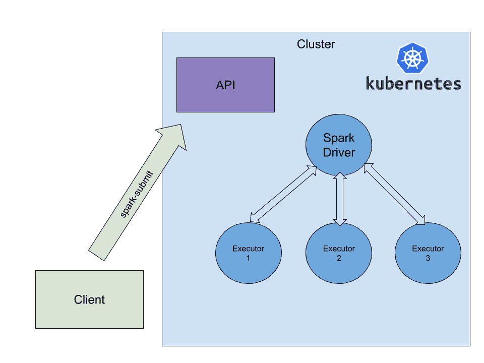

图 1.17

以下是发生的事情：

+   Spark 创建了一个在 Kubernetes pod 中运行的驱动程序

+   驱动程序创建执行器，执行器也运行在 Kubernetes pod 中，然后连接到它们并执行应用程序代码

+   执行结束时，执行器 pod 会终止并被清理，而驱动程序 pod 会继续保留日志，并保持完成状态（意味着它不再使用集群的计算或内存资源），在 Kubernetes API 中（直到最终被垃圾回收或手动删除）

# 总结

在本章中，我们熟悉了 Apache Spark 及其主要模块。我们开始使用可用的 Spark shell，并使用 Scala 和 Python 编程语言编写了第一个自包含的应用程序。最后，我们探索了在集群模式下部署和运行 Spark 的不同方法。到目前为止，我们学到的所有内容都是理解从第三章 *提取、转换、加载* 及之后主题所必需的。如果你对所呈现的任何主题有疑问，我建议你在继续之前回过头再阅读一遍本章。

在下一章，我们将探索深度学习（DL）的基础知识，重点介绍多层神经网络的某些具体实现。
