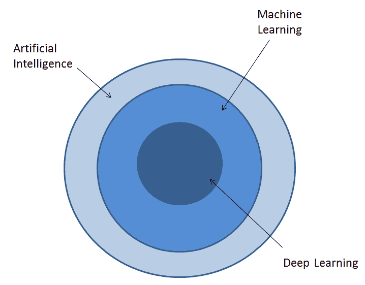
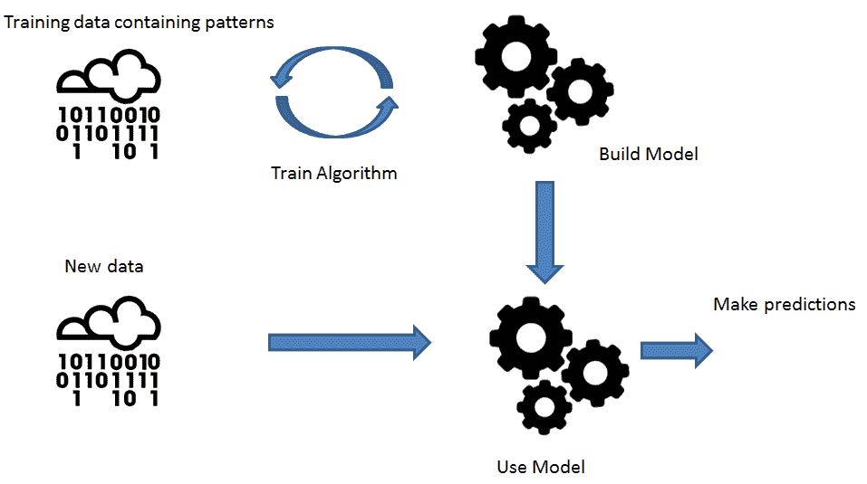
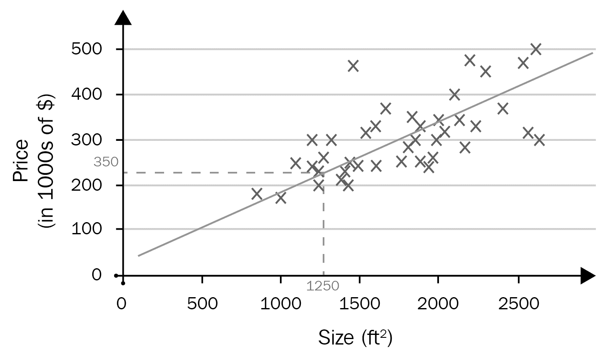
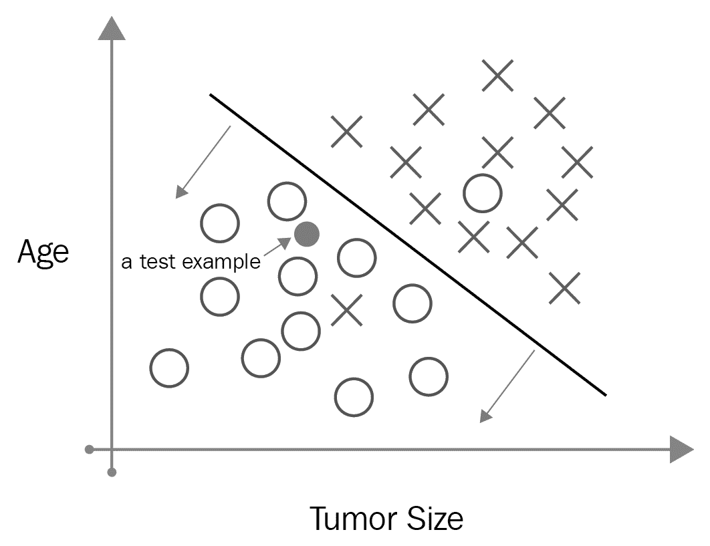
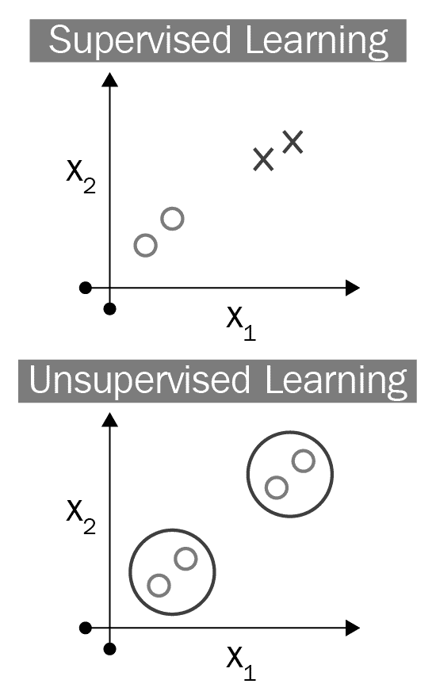
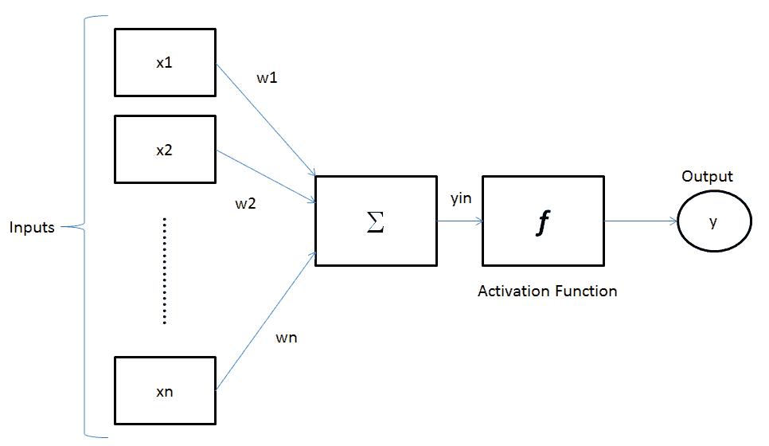
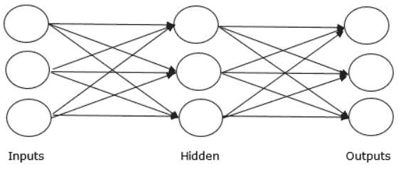
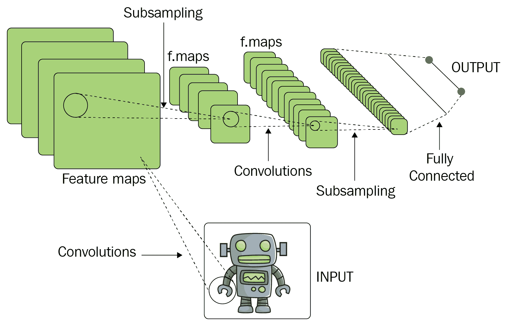
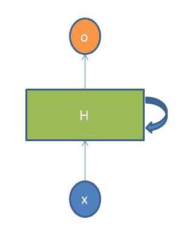
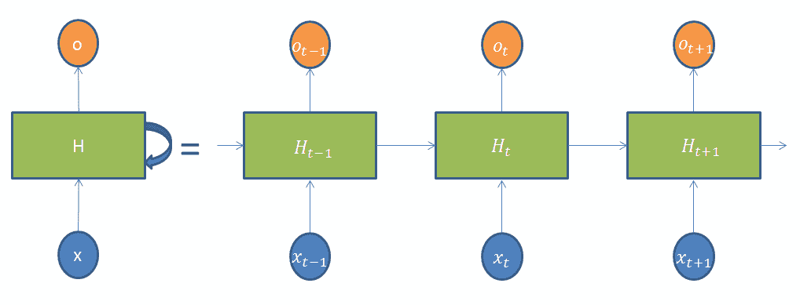

# 第二章：深度学习基础

在本章中，我将介绍**深度学习**（**DL**）的核心概念，它与**机器学习**（**ML**）和**人工智能**（**AI**）的关系，各种类型的多层神经网络，以及一些现实世界中的实际应用。我将尽量避免数学公式，并保持描述的高层次，不涉及代码示例。本章的目的是让读者了解深度学习的真正含义以及它能做什么，而接下来的章节将更详细地讲解这一内容，并提供大量 Scala 和 Python 中的实际代码示例（这些编程语言可以使用）。

本章将涵盖以下主题：

+   深度学习概念

+   **深度神经网络** (**DNNs**)

+   深度学习的实际应用

# 介绍深度学习

深度学习是机器学习（ML）的一个子集，可以解决特别困难和大规模的问题，应用领域包括**自然语言处理** (**NLP**)和图像分类。DL 这个术语有时与 ML 和 AI 互换使用，但 ML 和 DL 都是 AI 的子集。AI 是更广泛的概念，它通过 ML 来实现。DL 是实现 ML 的一种方式，涉及基于神经网络的算法：

图 2.1

人工智能（AI）被认为是机器（它可以是任何计算机控制的设备或机器人）执行通常与人类相关的任务的能力。该概念于 20 世纪 50 年代提出，目的是减少人类的互动，从而让机器完成所有工作。这个概念主要应用于开发那些通常需要人类智力过程和/或从过去经验中学习的系统。

机器学习（ML）是一种实现人工智能（AI）的方法。它是计算机科学的一个领域，使计算机系统能够从数据中学习，而不需要显式编程。基本上，它使用算法在数据中寻找模式，然后使用能够识别这些模式的模型对新数据进行预测。下图展示了训练和构建模型的典型过程：

图 2.2

机器学习可以分为三种类型：

+   有监督学习算法，使用标注数据

+   无监督学习算法，从未标注数据中发现模式

+   半监督学习，使用两者的混合（标注数据和未标注数据）

截至写作时，有监督学习是最常见的机器学习算法类型。有监督学习可以分为两类——回归和分类问题。

下图展示了一个简单的回归问题：

图 2.3

如你所见，图中有两个输入（或特征），**大小**和**价格**，它们被用来生成曲线拟合线，并对房产价格进行后续预测。

以下图表展示了一个监督分类的示例：

图 2.4

数据集标记了良性（圆圈）和恶性（叉号）肿瘤，针对乳腺癌患者。一个监督分类算法通过拟合一条直线将数据分为两类。然后，基于该直线分类，未来的数据将被分类为良性或恶性。前述图表中的情况只有两个离散输出，但也有可能存在超过两种分类的情况。

在监督学习中，带标签的数据集帮助算法确定正确答案，而在无监督学习中，算法提供未标记的数据集，依赖于算法本身来发现数据中的结构和模式。在以下图表中（右侧的图表可以在 [`leonardoaraujosantos.gitbooks.io/artificial-inteligence/content/`](https://leonardoaraujosantos.gitbooks.io/artificial-inteligence/content/Images/supervised_unsupervised.png)[Images/supervised_unsupervised.png](https://leonardoaraujosantos.gitbooks.io/artificial-inteligence/content/Images/supervised_unsupervised.png) 查看），没有提供关于每个数据点的含义信息。我们要求算法以独立于监督的方式发现数据中的结构。一个无监督学习算法可能会发现数据中有两个不同的簇，然后在它们之间进行直线分类：

图 2.5

**深度学习（DL）**是指多层神经网络的名称，这些网络由输入和输出之间的多个隐藏层节点组成。DL 是**人工神经网络（ANNs）**的细化版，模拟了人类大脑的学习方式（尽管并不完全相同）以及解决问题的方法。ANNs 由一个互联的神经元群体组成，类似于人脑中神经元的工作方式。以下图示表示 ANN 的通用模型：

图 2.6

神经元是人工神经网络（ANN）的基本单元。它接收一定数量的输入（*x[i]*），对其进行计算，然后最终将输出发送到同一网络中的其他神经元。权重（*w[j]*），或*参数*，表示输入连接的强度——它们可以是正值或负值。网络输入可以按以下公式计算：

*y[in] = x[1] X w[1] + x[2] X w[2] + x[3] X w[3] + … + x[n] X w[n]*

输出可以通过对网络输入应用激活函数来计算：

*y = f(y[in])*

激活函数使人工神经网络（ANN）能够建模复杂的非线性模式，而简单的模型可能无法正确表示这些模式。

以下图示表示一个神经网络：

图 2.7

第一层是输入层——这是将特征输入网络的地方。最后一层是输出层。任何不属于输入层或输出层的中间层都是隐藏层。之所以称为 DL，是因为神经网络中存在多个隐藏层，用来解决复杂的非线性问题。在每一层中，任何单个节点都会接收输入数据和一个权重，并将一个置信度分数输出给下一层的节点。这个过程会一直进行，直到到达输出层。这个分数的误差会在该层计算出来。然后，误差会被发送回去，调整网络的权重，从而改进模型（这被称为**反向传播**，并发生在一个叫做**梯度下降**的过程中，我们将在第六章中讨论，*循环神经网络*）。神经网络有许多变种——更多内容将在下一部分介绍。

在继续之前，最后一个观察点。你可能会想，为什么 AI、ML 和 DL 背后的大多数概念已经存在了几十年，但在过去的 4 到 5 年才被炒作起来？有几个因素加速了它们的实施，并使其从理论走向现实应用：

+   **更便宜的计算**：在过去几十年中，硬件一直是 AI/ML/DL 的制约因素。近期硬件（结合改进的工具和软件框架）以及新计算模型（包括围绕 GPU 的模型）的进步，加速了 AI/ML/DL 的采用。

+   **更大的数据可用性**：AI/ML/DL 需要大量的数据来进行学习。社会的数字化转型正在提供大量原始材料，推动快速发展。大数据如今来自多种来源，如物联网传感器、社交和移动计算、智能汽车、医疗设备等，这些数据已经或将被用于训练模型。

+   **更便宜的存储**：可用数据量的增加意味着需要更多的存储空间。硬件的进步、成本的降低和性能的提高使得新存储系统的实现成为可能，而这一切都没有传统关系型数据库的限制。

+   **更先进的算法**：更便宜的计算和存储使得更先进的算法得以开发和训练，这些算法在解决特定问题时，如图像分类和欺诈检测，展现了令人印象深刻的准确性。

+   **更多、更大规模的投资**：最后但同样重要的是，人工智能的投资不再仅仅局限于大学或研究机构，而是来自许多其他实体，如科技巨头、政府、初创公司和各行各业的大型企业。

# DNN 概述

如前一节所述，DNN 是一种在输入层和输出层之间具有多个隐藏层的人工神经网络（ANN）。通常，它们是前馈网络，其中数据从输入层流向输出层，不会回传，但 DNN 有不同的变种——其中，最具实际应用的是**卷积神经网络**（**CNNs**）和**递归神经网络**（**RNNs**）。

# CNNs

CNNs 最常见的应用场景都与图像处理相关，但并不限于其他类型的输入，无论是音频还是视频。一个典型的应用场景是图像分类——网络接收图像输入，以便对数据进行分类。例如，当你给它一张狮子图片时，它输出狮子，当你给它一张老虎图片时，它输出老虎，依此类推。之所以使用这种网络进行图像分类，是因为它相对于同领域的其他算法来说，预处理工作量较小——网络学习到的滤波器，传统算法是人工设计的。

作为一个多层神经网络，CNN 由输入层、输出层以及多个隐藏层组成。隐藏层可以是卷积层、池化层、全连接层和归一化层。卷积层对输入进行卷积运算（[`en.wikipedia.org/wiki/Convolution`](https://en.wikipedia.org/wiki/Convolution)），然后将结果传递给下一个层。这个操作模拟了个体物理神经元对视觉刺激的响应生成方式。每个卷积神经元仅处理其感受野中的数据（感受野是指个体感官神经元的感官空间中，环境变化会改变该神经元的放电情况的特定区域）。池化层负责将一个层中神经元群的输出合并成下一层的单一神经元。池化有不同的实现方式——最大池化，使用来自前一层每个群体的最大值；平均池化，使用前一层任何神经元群的平均值；等等。全连接层则顾名思义，将一层中的每个神经元与另一层中的每个神经元连接起来。

CNN 并不会一次性解析所有训练数据，但它们通常从某种输入扫描器开始。例如，考虑一张 200 x 200 像素的图像作为输入。在这种情况下，模型没有一个包含 40,000 个节点的层，而是一个 20 x 20 的扫描输入层，该层使用原始图像的前 20 x 20 像素（通常从左上角开始）。一旦我们处理完该输入（并可能用它进行训练），我们就会使用下一个 20 x 20 像素输入（这一过程将在第五章，*卷积神经网络*中更详细地解释；这个过程类似于扫描仪的移动，每次向右移动一个像素）。请注意，图像并不是被分解成 20 x 20 的块，而是扫描仪在其上移动。然后，这些输入数据会通过一个或多个卷积层。每个卷积层的节点只需要与其邻近的节点工作——并不是所有的节点都互相连接。网络越深，它的卷积层越小，通常遵循输入的可分因子（如果我们从 20 的层开始，那么下一个层很可能是 10，接下来是 5）。通常使用 2 的幂作为可分因子。

以下图（由 Aphex34 制作，CC BY-SA 4.0，[`commons.wikimedia.org/w/index.php?curid=45679374`](https://commons.wikimedia.org/w/index.php?curid=45679374)）展示了 CNN 的典型架构：

图 2.8

# RNN（循环神经网络）

RNNs 主要因许多 NLP 任务而流行（即使它们目前也被用于不同的场景，我们将在第六章，*循环神经网络*中讨论）。RNN 的独特之处是什么？它们的特点是单元之间的连接形成一个沿着序列的有向图。这意味着 RNN 可以展示给定时间序列的动态时间行为。因此，它们可以使用内部状态（记忆）来处理输入序列，而在传统神经网络中，我们假设所有输入和输出彼此独立。这使得 RNN 适用于某些场景，例如当我们想要预测句子中的下一个词时——知道它前面的词肯定更有帮助。现在，你可以理解为什么它们被称为“循环”——每个序列元素都执行相同的任务，且输出依赖于之前的计算。

RNNs 中有循环结构，允许信息保持，如下所示：

图 2.9

在前面的图示中，神经网络的一部分，`H`，接收一些输入，`x`，并输出一个值，`o`。一个循环允许信息从网络的一个步骤传递到下一个步骤。通过展开图中的 RNN，形成一个完整的网络（如以下图所示），它可以被看作是多个相同网络的副本，每个副本将信息传递给后续步骤：

图 2.10

在这里，**x[t]** 是时间步 `t` 的输入，**H[t]** 是时间步 `t` 的隐藏状态（代表网络的记忆），而 **o[t]** 是时间步 `t` 的输出。隐藏状态捕捉了所有前一步骤中发生的事情的信息。给定步骤的输出仅基于时间 `t` 的记忆进行计算。RNN 在每个步骤中共享相同的参数——这是因为每个步骤执行的是相同的任务，只是输入不同——大大减少了它需要学习的总参数数量。每个步骤的输出不是必需的，因为这取决于当前的任务。同样，并非每个时间步都需要输入。

RNN 最早在 1980 年代开发，直到最近才有了许多新的变种。以下是其中一些架构的列表：

+   **全递归**：每个元素与架构中的每个其他元素都有一个加权的单向连接，并且与自身有一个单一的反馈连接。

+   **递归**：相同的权重集在结构中递归地应用，这种结构类似于图形结构。在此过程中，结构会按拓扑排序进行遍历（[`en.wikipedia.org/wiki/Topological_sorting`](https://en.wikipedia.org/wiki/Topological_sorting)）。

+   **霍普菲尔德网络**：所有的连接都是对称的。这种网络不适用于需要处理模式序列的场景，因为它只需要静态输入。

+   **埃尔曼网络**：这是一个三层网络，横向排列，外加一组所谓的**上下文单元**。中间的隐藏层与所有这些单元连接，权重固定为 1。在每个时间步，输入被前馈，然后应用一个学习规则。由于反向连接是固定的，隐藏单元的前一值会被保存在上下文单元中。这样，网络就能保持状态。正因如此，这种类型的 RNN 允许你执行一些标准多层神经网络无法完成的任务。

+   **长短期记忆（LSTM）**：这是一种深度学习方法，防止反向传播的错误消失或梯度爆炸（这一点将在第六章，*递归神经网络*中详细讲解）。错误可以通过（理论上）无限数量的虚拟层向后流动。也就是说，LSTM 可以学习需要记住可能发生在几个时间步之前的事件的任务。

+   **双向**：通过连接两个 RNN 的输出，可以预测有限序列中的每个元素。第一个 RNN 从左到右处理序列，而第二个 RNN 则以相反的方向进行处理。

+   **递归多层感知器网络**：由级联子网络组成，每个子网络包含多个节点层。除最后一层（唯一可以有反馈连接的层）外，其他子网络都是前馈的。

第五章，*卷积神经网络*，以及第六章，*递归神经网络*，将详细讲解 CNN 和 RNN。

# 深度学习的实际应用

前两部分所介绍的深度学习概念和模型不仅仅是纯理论——实际上，已经有许多应用基于这些概念和模型得以实现。深度学习擅长识别非结构化数据中的模式；大多数应用场景与图像、声音、视频和文本等媒体相关。如今，深度学习已经应用于多个商业领域的众多场景，包括以下几种：

+   **计算机视觉**：在汽车工业、面部识别、动作检测和实时威胁检测等方面的应用。

+   **自然语言处理（NLP）**：社交媒体情感分析、金融和保险中的欺诈检测、增强搜索和日志分析。

+   **医学诊断**：异常检测、病理识别。

+   **搜索引擎**：图像搜索。

+   **物联网（IoT）**：智能家居、基于传感器数据的预测分析。

+   **制造业**：预测性维护。

+   **营销**：推荐引擎、自动化目标识别。

+   **音频分析**：语音识别、语音搜索和机器翻译。

还有许多内容在后续章节中会进一步介绍。

# 总结

本章介绍了深度学习（DL）的基础知识。这个概述保持了较高的层次，以帮助那些刚接触这一话题的读者，并为他们准备好迎接接下来章节中更详细和实践性的内容。
