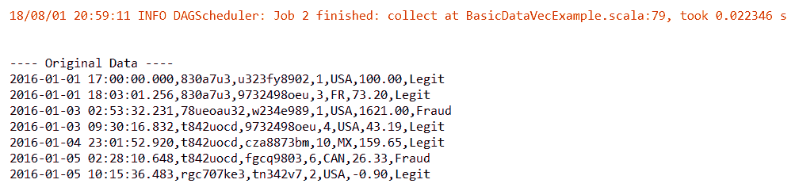
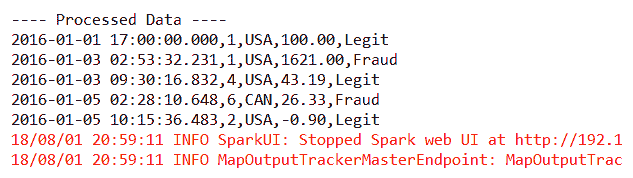
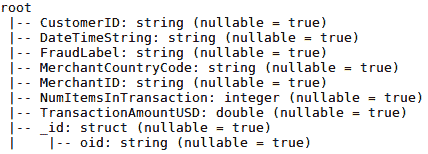
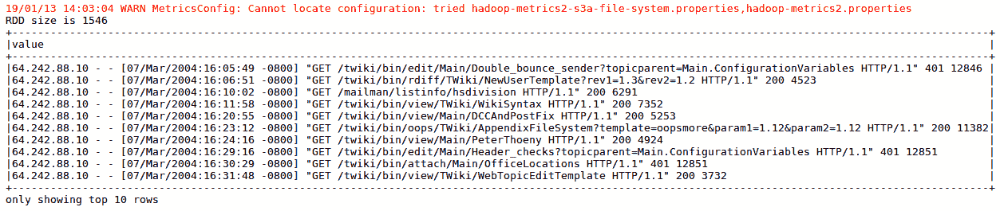

# 第三章：提取、转换、加载

训练和测试深度学习模型需要数据。数据通常存储在不同的分布式和远程存储系统中。你需要连接到数据源并执行数据检索，以便开始训练阶段，同时可能需要做一些准备工作再将数据输入模型。本章介绍了应用于深度学习的**提取**、**转换**、**加载**（**ETL**）过程的各个阶段。它涵盖了使用 DeepLearning4j 框架和 Spark 的若干用例，这些用例与批量数据摄取有关。数据流处理将在下一章介绍。

本章将涵盖以下主题：

+   通过 Spark 摄取训练数据

+   从关系型数据库中摄取数据

+   从 NoSQL 数据库摄取数据

+   从 S3 摄取数据

# 通过 Spark 摄取训练数据

本章的第一部分介绍了 DeepLearning4j 框架，并展示了使用该框架和 Apache Spark 从文件中摄取训练数据的一些用例。

# DeepLearning4j 框架

在进入第一个示例之前，我们先简单介绍一下 DeepLearning4j（[`deeplearning4j.org/`](https://deeplearning4j.org/)）框架。它是一个开源的（基于 Apache 2.0 许可证发布，[`www.apache.org/licenses/LICENSE-2.0`](https://www.apache.org/licenses/LICENSE-2.0)）分布式深度学习框架，专为 JVM 编写。自最早版本起，DeepLearning4j 便与 Hadoop 和 Spark 集成，利用这些分布式计算框架加速网络训练。该框架用 Java 编写，因此与任何其他 JVM 语言（当然也包括 Scala）兼容，而底层计算则使用低级语言（如 C、C++和 CUDA）编写。DL4J 的 API 提供了在构建深度神经网络时的灵活性。因此，可以根据需要将不同的网络实现组合在一起，部署到基于分布式 CPU 或 GPU 的生产级基础设施上。DL4J 可以通过 Keras（[`keras.io/`](https://keras.io/)）导入来自大多数主流机器学习或深度学习 Python 框架（包括 TensorFlow 和 Caffe）的神经网络模型，弥合 Python 与 JVM 生态系统之间的差距，尤其是为数据科学家提供工具，同时也适用于数据工程师和 DevOps。Keras 代表了 DL4J 的 Python API。

DL4J 是模块化的。以下是构成该框架的主要库：

+   **Deeplearning4j**：神经网络平台核心

+   **ND4J**：JVM 版 NumPy（[`www.numpy.org/`](http://www.numpy.org/)）

+   **DataVec**：用于机器学习 ETL 操作的工具

+   **Keras 导入**：导入在 Keras 中实现的预训练 Python 模型

+   **Arbiter**：用于多层神经网络超参数优化的专用库

+   **RL4J**：JVM 版深度强化学习实现

我们将从本章开始，探索 DL4J 及其库的几乎所有功能，并贯穿本书的其他章节。

本书中的 DL4J 参考版本是 0.9.1。

# 通过 DataVec 获取数据并通过 Spark 进行转化

数据可以来自多个来源，并且有多种类型，例如：

+   日志文件

+   文本文件

+   表格数据

+   图像

+   视频

在使用神经网络时，最终目标是将每种数据类型转换为多维数组中的数值集合。数据在被用于训练或测试神经网络之前，可能还需要预处理。因此，在大多数情况下，需要进行 ETL 过程，这是数据科学家在进行机器学习或深度学习时面临的一个有时被低估的挑战。这时，DL4J DataVec 库就发挥了重要作用。通过该库的 API 转换后的数据，转换为神经网络可理解的格式（向量），因此 DataVec 可以快速生成符合开放标准的向量化数据。

DataVec 开箱即用地支持所有主要类型的输入数据（文本、CSV、音频、视频、图像）及其特定的输入格式。它可以扩展以支持当前 API 版本中未涵盖的专业输入格式。你可以将 DataVec 的输入/输出格式系统与 Hadoop MapReduce 中的 `InputFormat` 实现进行类比，用于确定逻辑的 *InputSplits* 和 `RecordReaders` 实现的选择。它还提供 `RecordReaders` 来序列化数据。这个库还包括特征工程、数据清理和归一化的功能。它们可以处理静态数据和时间序列数据。所有可用的功能都可以通过 DataVec-Spark 模块在 Apache Spark 上执行。

如果你想了解更多关于前面提到的 Hadoop MapReduce 类的信息，你可以查看以下官方在线 Javadocs：

| **类名** | **链接** |
| --- | --- |
| `InputFormat` | [`hadoop.apache.org/docs/r2.7.2/api/org/apache/hadoop/mapred/InputFormat.html`](https://hadoop.apache.org/docs/r2.7.2/api/org/apache/hadoop/mapred/InputFormat.html) |
| `InputSplits` | [`hadoop.apache.org/docs/r2.7.2/api/org/apache/hadoop/mapred/InputSplit.html`](https://hadoop.apache.org/docs/r2.7.2/api/org/apache/hadoop/mapred/InputSplit.html) |
| `RecordReaders` | [`hadoop.apache.org/docs/r2.7.2/api/org/apache/hadoop/mapred/RecordReader.html`](https://hadoop.apache.org/docs/r2.7.2/api/org/apache/hadoop/mapred/RecordReader.html) |

让我们来看一个 Scala 中的实际代码示例。我们想从一个包含电子商店交易的 CSV 文件中提取数据，并且该文件包含以下列：

+   `DateTimeString`

+   `CustomerID`

+   `MerchantID`

+   `NumItemsInTransaction`

+   `MerchantCountryCode`

+   `TransactionAmountUSD`

+   `FraudLabel`

然后，我们对这些数据进行一些转化操作。

首先，我们需要导入所需的依赖项（Scala、Spark、DataVec 和 DataVec-Spark）。以下是 Maven POM 文件的完整列表（当然，您也可以使用 SBT 或 Gradle）：

```py
<properties>
      <scala.version>2.11.8</scala.version>
      <spark.version>2.2.1</spark.version>
      <dl4j.version>0.9.1</dl4j.version>
      <datavec.spark.version>0.9.1_spark_2</datavec.spark.version>
  </properties>

  <dependencies>
    <dependency>
        <groupId>org.scala-lang</groupId>
        <artifactId>scala-library</artifactId>
       <version>${scala.version}</version>
    </dependency>

    <dependency>
        <groupId>org.apache.spark</groupId>
        <artifactId>spark-core_2.11</artifactId>
        <version>${spark.version}</version>
    </dependency>

    <dependency>
        <groupId>org.datavec</groupId>
        <artifactId>datavec-api</artifactId>
        <version>${dl4j.version}</version>
    </dependency>

    <dependency>
        <groupId>org.datavec</groupId>
        <artifactId>datavec-spark_2.11</artifactId>
        <version>${datavec.spark.version}</version>
    </dependency>
   </dependencies>
```

在 Scala 应用程序中的第一步是定义输入数据模式，如下所示：

```py
val inputDataSchema = new Schema.Builder()
        .addColumnString("DateTimeString")
        .addColumnsString("CustomerID", "MerchantID")
        .addColumnInteger("NumItemsInTransaction")
        .addColumnCategorical("MerchantCountryCode", List("USA", "CAN", "FR", "MX").asJava)
         .addColumnDouble("TransactionAmountUSD", 0.0, null, false, false) //$0.0 or more, no maximum limit, no NaN and no Infinite values
        .addColumnCategorical("FraudLabel", List("Fraud", "Legit").asJava)
        .build
```

如果输入数据是数值的并且格式正确，那么可以使用`CSVRecordReader` ([`deeplearning4j.org/datavecdoc/org/datavec/api/records/reader/impl/csv/CSVRecordReader.html`](https://deeplearning4j.org/datavecdoc/org/datavec/api/records/reader/impl/csv/CSVRecordReader.html))。然而，如果输入数据包含非数值字段，则需要进行模式转换。DataVec 使用 Apache Spark 执行转换操作。一旦我们有了输入模式，我们可以定义要应用于输入数据的转换。这个例子中描述了一些转换。例如，我们可以删除一些对我们的网络不必要的列：

```py
val tp = new TransformProcess.Builder(inputDataSchema)
        .removeColumns("CustomerID", "MerchantID")
        .build 
```

过滤`MerchantCountryCode`列以获取仅与美国和加拿大相关的记录，如下所示：

```py
.filter(new ConditionFilter(
          new CategoricalColumnCondition("MerchantCountryCode", ConditionOp.NotInSet, new HashSet(Arrays.asList("USA","CAN")))))
```

在此阶段，仅定义了转换，但尚未应用（当然，我们首先需要从输入文件中获取数据）。到目前为止，我们仅使用了 DataVec 类。为了读取数据并应用定义的转换，需要使用 Spark 和 DataVec-Spark API。

让我们首先创建`SparkContext`，如下所示：

```py
val conf = new SparkConf
conf.setMaster(args[0])
conf.setAppName("DataVec Example")

val sc = new JavaSparkContext(conf)
```

现在，我们可以读取 CSV 输入文件并使用`CSVRecordReader`解析数据，如下所示：

```py
val directory = new ClassPathResource("datavec-example-data.csv").getFile.getAbsolutePath
val stringData = sc.textFile(directory)

val rr = new CSVRecordReader
val parsedInputData = stringData.map(new StringToWritablesFunction(rr))
```

然后执行先前定义的转换，如下所示：

```py
val processedData = SparkTransformExecutor.execute(parsedInputData, tp)
```

最后，让我们本地收集数据，如下所示：

```py
val processedAsString = processedData.map(new WritablesToStringFunction(","))
val processedCollected = processedAsString.collect
val inputDataCollected = stringData.collect
```

输入数据如下所示：



处理后的数据如下所示：



这个示例的完整代码包含在书籍附带的源代码中。

# 使用 Spark 从数据库中进行训练数据摄取

有时数据之前已被其他应用程序摄入并存储到数据库中，因此您需要连接到数据库以便用于训练或测试目的。本节描述了如何从关系数据库和 NoSQL 数据库获取数据。在这两种情况下，都将使用 Spark。

# 从关系数据库中摄取数据

假设数据存储在 MySQL ([`dev.mysql.com/`](https://dev.mysql.com/)) 架构名称为 `sparkdb` 的表 `sparkexample` 中。这是该表的结构：

```py
mysql> DESCRIBE sparkexample;
+-----------------------+-------------+------+-----+---------+-------+
| Field                 | Type        | Null | Key | Default | Extra |
+-----------------------+-------------+------+-----+---------+-------+
| DateTimeString        | varchar(23) | YES  |     | NULL    |       |
| CustomerID            | varchar(10) | YES  |     | NULL    |       |
| MerchantID            | varchar(10) | YES  |     | NULL    |       |
| NumItemsInTransaction | int(11)     | YES  |     | NULL    |       |
| MerchantCountryCode   | varchar(3)  | YES  |     | NULL    |       |
| TransactionAmountUSD  | float       | YES  |     | NULL    |       |
| FraudLabel            | varchar(5)  | YES  |     | NULL    |       |
+-----------------------+-------------+------+-----+---------+-------+
7 rows in set (0.00 sec)
```

它包含与 *使用 Spark 进行训练数据摄取* 中相同的数据，如下所示：

```py
mysql> select * from sparkexample;
+-------------------------+------------+------------+-----------------------+---------------------+----------------------+------------+
| DateTimeString          | CustomerID | MerchantID | NumItemsInTransaction | MerchantCountryCode | TransactionAmountUSD | FraudLabel |
+-------------------------+------------+------------+-----------------------+---------------------+----------------------+------------+
| 2016-01-01 17:00:00.000 | 830a7u3    | u323fy8902 |                     1 | USA                 |                  100 | Legit      |
| 2016-01-01 18:03:01.256 | 830a7u3    | 9732498oeu |                     3 | FR                  |                 73.2 | Legit      |
|...                      |            |            |                       |                     |                      |            |
```

添加到 Scala Spark 项目中的依赖项如下所示：

+   Apache Spark 2.2.1

+   Apache Spark SQL 2.2.1

+   用于 MySQL 数据库发布的特定 JDBC 驱动程序

现在我们来实现 Scala 中的 Spark 应用程序。为了连接到数据库，我们需要提供所有必要的参数。Spark SQL 还包括一个数据源，可以使用 JDBC 从其他数据库读取数据，因此所需的属性与通过传统 JDBC 连接到数据库时相同；例如：

```py
var jdbcUsername = "root"
  var jdbcPassword = "secretpw"

  val jdbcHostname = "mysqlhost"
  val jdbcPort = 3306
  val jdbcDatabase ="sparkdb"
  val jdbcUrl = s"jdbc:mysql://${jdbcHostname}:${jdbcPort}/${jdbcDatabase}"
```

我们需要检查 MySQL 数据库的 JDBC 驱动是否可用，如下所示：

```py
Class.forName("com.mysql.jdbc.Driver")
```

我们现在可以创建一个 `SparkSession`，如下所示：

```py
val spark = SparkSession
        .builder()
        .master("local[*]")
        .appName("Spark MySQL basic example")
        .getOrCreate()
```

导入隐式转换，如下所示：

```py
import spark.implicits._
```

最终，你可以连接到数据库并将 `sparkexample` 表中的数据加载到 DataFrame，如下所示：

```py
val jdbcDF = spark.read
        .format("jdbc")
        .option("url", jdbcUrl)
        .option("dbtable", s"${jdbcDatabase}.sparkexample")
        .option("user", jdbcUsername)
        .option("password", jdbcPassword)
        .load()
```

Spark 会自动从数据库表中读取模式，并将其类型映射回 Spark SQL 类型。对 DataFrame 执行以下方法：

```py
jdbcDF.printSchema()
```

它返回与表` sparkexample`相同的模式；例如：

```py
root
 |-- DateTimeString: string (nullable = true)
 |-- CustomerID: string (nullable = true)
 |-- MerchantID: string (nullable = true)
 |-- NumItemsInTransaction: integer (nullable = true)
 |-- MerchantCountryCode: string (nullable = true)
 |-- TransactionAmountUSD: double (nullable = true)
 |-- FraudLabel: string (nullable = true)
```

一旦数据被加载到 DataFrame 中，就可以使用特定的 DSL 执行 SQL 查询，如下例所示：

```py
jdbcDF.select("MerchantCountryCode", "TransactionAmountUSD").groupBy("MerchantCountryCode").avg("TransactionAmountUSD")
```

可以通过 JDBC 接口增加读取的并行性。我们需要根据 DataFrame 列值提供拆分边界。有四个选项可用（`columnname`，`lowerBound`，`upperBound` 和 `numPartitions`），用于指定读取时的并行性。它们是可选的，但如果提供其中任何一个，必须全部指定；例如：

```py
val jdbcDF = spark.read
        .format("jdbc")
        .option("url", jdbcUrl)
        .option("dbtable", s"${jdbcDatabase}.employees")
        .option("user", jdbcUsername)
        .option("password", jdbcPassword)
        .option("columnName", "employeeID")
        .option("lowerBound", 1L)
        .option("upperBound", 100000L)
        .option("numPartitions", 100)
        .load()
```

尽管本节中的示例参考了 MySQL 数据库，但它们适用于任何具有 JDBC 驱动的商业或开源关系型数据库。

# 从 NoSQL 数据库中获取数据

数据也可以来自 NoSQL 数据库。在本节中，我们将探讨实现代码，以便从 MongoDB ([`www.mongodb.com/`](https://www.mongodb.com/)) 数据库中消费数据。

`sparkmdb` 数据库中的 `sparkexample` 集合包含与 *通过 DataVec 获取数据和通过 Spark 转换* 以及 *从关系型数据库获取数据* 部分中的示例相同的数据，但以 BSON 文档的形式；例如：

```py
/* 1 */
{
    "_id" : ObjectId("5ae39eed144dfae14837c625"),
    "DateTimeString" : "2016-01-01 17:00:00.000",
    "CustomerID" : "830a7u3",
    "MerchantID" : "u323fy8902",
    "NumItemsInTransaction" : 1,
    "MerchantCountryCode" : "USA",
    "TransactionAmountUSD" : 100.0,
    "FraudLabel" : "Legit"
}

/* 2 */
{
    "_id" : ObjectId("5ae3a15d144dfae14837c671"),
    "DateTimeString" : "2016-01-01 18:03:01.256",
    "CustomerID" : "830a7u3",
    "MerchantID" : "9732498oeu",
    "NumItemsInTransaction" : 3,
    "MerchantCountryCode" : "FR",
    "TransactionAmountUSD" : 73.0,
    "FraudLabel" : "Legit"
}
...
```

需要添加到 Scala Spark 项目的依赖项如下：

+   Apache Spark 2.2.1

+   Apache Spark SQL 2.2.1

+   Spark 2.2.0 的 MongoDB 连接器

我们需要创建一个 Spark 会话，如下所示：

```py
val sparkSession = SparkSession.builder()
      .master("local")
      .appName("MongoSparkConnectorIntro")
      .config("spark.mongodb.input.uri", "mongodb://mdbhost:27017/sparkmdb.sparkexample")
      .config("spark.mongodb.output.uri", "mongodb://mdbhost:27017/sparkmdb.sparkexample")
      .getOrCreate()
```

指定连接到数据库的方式。在创建会话后，可以使用它通过 `com.mongodb.spark.MongoSpark` 类从 `sparkexample` 集合加载数据，如下所示：

```py
val df = MongoSpark.load(sparkSession)
```

返回的 DataFrame 具有与 `sparkexample` 集合相同的结构。使用以下指令：

```py
df.printSchema()
```

它会打印出以下输出：



当然，检索到的数据就是数据库集合中的数据，如下所示：

```py
df.collect.foreach { println }
```

它返回如下内容：

```py
[830a7u3,2016-01-01 17:00:00.000,Legit,USA,u323fy8902,1,100.0,[5ae39eed144dfae14837c625]]
[830a7u3,2016-01-01 18:03:01.256,Legit,FR,9732498oeu,3,73.0,[5ae3a15d144dfae14837c671]]
...
```

还可以在 DataFrame 上运行 SQL 查询。我们首先需要创建一个 case 类来定义 DataFrame 的模式，如下所示：

```py
case class Transaction(CustomerID: String,
                      MerchantID: String,
                      MerchantCountryCode: String,
                      DateTimeString: String,
                      NumItemsInTransaction: Int,
                      TransactionAmountUSD: Double,
                      FraudLabel: String)
```

然后我们加载数据，如下所示：

```py
val transactions = MongoSpark.loadTransaction
```

我们必须为 DataFrame 注册一个临时视图，如下所示：

```py
transactions.createOrReplaceTempView("transactions")
```

在我们执行 SQL 语句之前，例如：

```py
val filteredTransactions = sparkSession.sql("SELECT CustomerID, MerchantID FROM transactions WHERE TransactionAmountUSD = 100")
```

使用以下指令：

```py
filteredTransactions.show
```

它返回如下内容：

```py
+----------+----------+
|CustomerID|MerchantID|
+----------+----------+
|   830a7u3|u323fy8902|
+----------+----------+
```

# 从 S3 获取数据

如今，训练和测试数据很可能托管在某些云存储系统中。在本节中，我们将学习如何通过 Apache Spark 从对象存储（如 Amazon S3（[`aws.amazon.com/s3/`](https://aws.amazon.com/s3/)）或基于 S3 的存储（如 Minio，[`www.minio.io/`](https://www.minio.io/)））摄取数据。Amazon 简单存储服务（更常被称为 Amazon S3）是 AWS 云服务的一部分，提供对象存储服务。虽然 S3 可用于公共云，Minio 是一个高性能分布式对象存储服务器，兼容 S3 协议和标准，专为大规模私有云基础设施设计。

我们需要在 Scala 项目中添加 Spark 核心和 Spark SQL 依赖项，以及以下内容：

```py
groupId: com.amazonaws
 artifactId: aws-java-sdk-core
 version1.11.234

 groupId: com.amazonaws
 artifactId: aws-java-sdk-s3
 version1.11.234

 groupId: org.apache.hadoop
 artifactId: hadoop-aws
 version: 3.1.1
```

它们是 AWS Java JDK 核心库和 S3 库，以及用于 AWS 集成的 Apache Hadoop 模块。

对于这个示例，我们需要已经在 S3 或 Minio 上创建了一个现有的存储桶。对于不熟悉 S3 对象存储的读者，存储桶类似于文件系统目录，用户可以在其中存储对象（数据及其描述的元数据）。然后，我们需要在该存储桶中上传一个文件，Spark 将需要读取该文件。此示例使用的文件通常可以从 MonitorWare 网站下载（[`www.monitorware.com/en/logsamples/apache.php`](http://www.monitorware.com/en/logsamples/apache.php)）。它包含以 ASCII 格式记录的 HTTP 请求日志条目。为了这个示例，我们假设存储桶的名称是 `dl4j-bucket`，上传的文件名是 `access_log`。在我们的 Spark 程序中，首先要做的是创建一个 `SparkSession`，如下所示

```py
val sparkSession = SparkSession
    .builder
    .master(master)
    .appName("Spark Minio Example")
    .getOrCreate
```

为了减少输出中的噪音，让我们将 Spark 的日志级别设置为 `WARN`，如下所示

```py
sparkSession.sparkContext.setLogLevel("WARN")
```

现在 `SparkSession` 已创建，我们需要设置 S3 或 Minio 端点和凭据，以便 Spark 访问它，并设置其他一些属性，如下所示：

```py
sparkSession.sparkContext.hadoopConfiguration.set("fs.s3a.endpoint", "http://<host>:<port>")
sparkSession.sparkContext.hadoopConfiguration.set("fs.s3a.access.key", "access_key")
sparkSession.sparkContext.hadoopConfiguration.set("fs.s3a.secret.key", "secret")
sparkSession.sparkContext.hadoopConfiguration.set("fs.s3a.path.style.access", "true")
sparkSession.sparkContext.hadoopConfiguration.set("fs.s3a.connection.ssl.enabled", "false")
sparkSession.sparkContext.hadoopConfiguration.set("fs.s3a.impl", "org.apache.hadoop.fs.s3a.S3AFileSystem")
```

这是为最小配置设置的属性的含义：

+   `fs.s3a.endpoint`：S3 或 Minio 端点。

+   `fs.s3a.access.key`：AWS 或 Minio 访问密钥 ID。

+   `fs.s3a.secret.key`：AWS 或 Minio 秘密密钥。

+   `fs.s3a.path.style.access`：启用 S3 路径风格访问，同时禁用默认的虚拟主机行为。

+   `fs.s3a.connection.ssl.enabled`：指定是否在端点启用了 SSL。可能的值是`true`和`false`。

+   `fs.s3a.impl`：所使用的 `S3AFileSystem` 实现类。

现在我们已经准备好从 S3 或 Minio 存储桶中读取`access_log`文件（或任何其他文件），并将其内容加载到 RDD 中，如下所示：

```py
val logDataRdd = sparkSession.sparkContext.textFile("s3a://dl4j-bucket/access_log")
println("RDD size is " + logDataRdd.count)
```

还可以将 RDD 转换为 DataFrame，并按如下方式显示输出内容：

```py
import sparkSession.implicits._
val logDataDf = logDataRdd.toDF
logDataDf.show(10, false)
```

这将提供以下输出：



一旦从存储在 S3 或 Minio 桶中的对象加载数据，就可以使用 Spark 对 RDD 和数据集的任何操作。

# 使用 Spark 进行原始数据转换

数据来自一个来源时，通常是原始数据。当我们谈论原始数据时，指的是那些无法直接用于训练或测试模型的数据格式。因此，在使用之前，我们需要将其整理。清理过程通过一个或多个转换步骤完成，才能将数据作为输入提供给特定的模型。

为了数据转换的目的，DL4J 的 DataVec 库和 Spark 提供了多种功能。此部分描述的一些概念已在*通过 DataVec 进行数据摄取并通过 Spark 进行转换*部分中探讨过，但现在我们将添加一个更复杂的使用案例。

为了理解如何使用 Datavec 进行数据转换，我们来构建一个用于网站流量日志分析的 Spark 应用程序。所使用的数据集可以从 MonitorWare 网站下载（[`www.monitorware.com/en/logsamples/apache.php`](http://www.monitorware.com/en/logsamples/apache.php)）。这些数据是 ASCII 格式的 HTTP 请求日志条目，每个请求一行，包含以下列：

+   发出请求的主机。可以是主机名或互联网地址

+   一个时间戳，格式为*DD/Mon/YYYY:HH:MM:SS*，其中*DD*是日，*Mon*是月的名称，*YYYY*是年份，*HH:MM:SS*是使用 24 小时制的时间。时区为-*0800*

+   引号中的 HTTP 请求

+   HTTP 回复代码

+   回复中的字节总数

这是一个示例日志内容：

```py
64.242.88.10 - - [07/Mar/2004:16:05:49 -0800] "GET /twiki/bin/edit/Main/Double_bounce_sender?topicparent=Main.ConfigurationVariables HTTP/1.1" 401 12846
64.242.88.10 - - [07/Mar/2004:16:06:51 -0800] "GET /twiki/bin/rdiff/TWiki/NewUserTemplate?rev1=1.3&rev2=1.2 HTTP/1.1" 200 4523
64.242.88.10 - - [07/Mar/2004:16:10:02 -0800] "GET /mailman/listinfo/hsdivision HTTP/1.1" 200 6291
64.242.88.10 - - [07/Mar/2004:16:11:58 -0800] "GET /twiki/bin/view/TWiki/WikiSyntax HTTP/1.1" 200 7352
```

在我们的应用程序中，首先要做的是定义输入数据的模式，如下所示：

```py
val schema = new Schema.Builder()
      .addColumnString("host")
      .addColumnString("timestamp")
      .addColumnString("request")
      .addColumnInteger("httpReplyCode")
      .addColumnInteger("replyBytes")
      .build
```

启动一个 Spark 上下文，如下所示：

```py
val conf = new SparkConf
 conf.setMaster("local[*]")
 conf.setAppName("DataVec Log Analysis Example")
 val sc = new JavaSparkContext(conf)
```

加载文件，如下所示：

```py
val directory = new ClassPathResource("access_log").getFile.getAbsolutePath
```

一个网页日志文件可能包含一些无效的行，这些行不符合前述的模式，因此我们需要加入一些逻辑来丢弃那些对我们的分析没有用的行，例如：

```py
var logLines = sc.textFile(directory)
logLines = logLines.filter { (s: String) =>
    s.matches("(\\S+) - - \\[(\\S+ -\\d{4})\\] \"(.+)\" (\\d+) (\\d+|-)")
}
```

我们应用正则表达式来过滤出符合预期格式的日志行。现在我们可以开始使用 DataVec 的`RegexLineRecordReader`（[`deeplearning4j.org/datavecdoc/org/datavec/api/records/reader/impl/regex/RegexLineRecordReader.html`](https://deeplearning4j.org/datavecdoc/org/datavec/api/records/reader/impl/regex/RegexLineRecordReader.html)）来解析原始数据。我们需要定义一个`regex`来格式化这些行，如下所示：

```py
val regex = "(\\S+) - - \\[(\\S+ -\\d{4})\\] \"(.+)\" (\\d+) (\\d+|-)"
  val rr = new RegexLineRecordReader(regex, 0)
  val parsed = logLines.map(new StringToWritablesFunction(rr))
```

通过 DataVec-Spark 库，还可以在定义转换之前检查数据质量。我们可以使用`AnalyzeSpark`（[`deeplearning4j.org/datavecdoc/org/datavec/spark/transform/AnalyzeSpark.html`](https://deeplearning4j.org/datavecdoc/org/datavec/spark/transform/AnalyzeSpark.html)）类来实现这一目的，如下所示：

```py
val dqa = AnalyzeSpark.analyzeQuality(schema, parsed)
  println("----- Data Quality -----")
  println(dqa)
```

以下是数据质量分析产生的输出：

```py
----- Data Quality -----
 idx   name                 type           quality   details
 0     "host"               String         ok        StringQuality(countValid=1546, countInvalid=0, countMissing=0, countTotal=1546, countEmptyString=0, countAlphabetic=0, countNumerical=0, countWordCharacter=10, countWhitespace=0, countApproxUnique=170)
 1     "timestamp"          String         ok        StringQuality(countValid=1546, countInvalid=0, countMissing=0, countTotal=1546, countEmptyString=0, countAlphabetic=0, countNumerical=0, countWordCharacter=0, countWhitespace=0, countApproxUnique=1057)
 2     "request"            String         ok        StringQuality(countValid=1546, countInvalid=0, countMissing=0, countTotal=1546, countEmptyString=0, countAlphabetic=0, countNumerical=0, countWordCharacter=0, countWhitespace=0, countApproxUnique=700)
 3     "httpReplyCode"      Integer        ok        IntegerQuality(countValid=1546, countInvalid=0, countMissing=0, countTotal=1546, countNonInteger=0)
 4     "replyBytes"         Integer        FAIL      IntegerQuality(countValid=1407, countInvalid=139, countMissing=0, countTotal=1546, countNonInteger=139)
```

从中我们注意到，在`139`行（共`1546`行）中，`replyBytes`字段并不是预期的整数类型。以下是其中几行：

```py
10.0.0.153 - - [12/Mar/2004:11:01:26 -0800] "GET / HTTP/1.1" 304 -
10.0.0.153 - - [12/Mar/2004:12:23:11 -0800] "GET / HTTP/1.1" 304 -
```

因此，第一个要进行的转换是清理`replyBytes`字段，将所有非整数条目替换为`0`。我们使用`TransformProcess`类，方法与*通过 DataVec 进行数据摄取和通过 Spark 进行转换*部分中的示例相同，如下所示：

```py
val tp: TransformProcess = new TransformProcess.Builder(schema)
       .conditionalReplaceValueTransform("replyBytes", new IntWritable(0), new StringRegexColumnCondition("replyBytes", "\\D+"))
```

然后，我们可以应用其他任何转换，例如按主机分组并提取汇总指标（计算条目数量、计算唯一请求和 HTTP 回复代码的数量、对`replyBytes`字段的值求和）；例如：

```py
.reduce(new Reducer.Builder(ReduceOp.CountUnique)
         .keyColumns("host")                             
         .countColumns("timestamp")                      
         .countUniqueColumns("request", "httpReplyCode")
         .sumColumns("replyBytes")                       
         .build
       )
```

重命名若干列，如下所示：

```py
.renameColumn("count", "numRequests")
```

筛选出所有请求的字节总数少于 100 万的主机，如下所示：

```py
.filter(new ConditionFilter(new LongColumnCondition("sum(replyBytes)", ConditionOp.LessThan, 1000000)))
  .build
```

我们现在可以执行转换，如下所示：

```py
val processed = SparkTransformExecutor.execute(parsed, tp)
  processed.cache
```

我们还可以对最终数据进行一些分析，如下所示：

```py
val finalDataSchema = tp.getFinalSchema
  val finalDataCount = processed.count
  val sample = processed.take(10)
  val analysis = AnalyzeSpark.analyze(finalDataSchema, processed)
```

最终数据模式如下所示：

```py
idx   name                              type           meta data
 0     "host"                            String         StringMetaData(name="host",)
 1     "count(timestamp)"                Long           LongMetaData(name="count(timestamp)",minAllowed=0)
 2     "countunique(request)"            Long           LongMetaData(name="countunique(request)",minAllowed=0)
 3     "countunique(httpReplyCode)"      Long           LongMetaData(name="countunique(httpReplyCode)",minAllowed=0)
 4     "sum(replyBytes)"                 Integer        IntegerMetaData(name="sum(replyBytes)",)
```

以下显示结果计数为二：

```py
[10.0.0.153, 270, 43, 3, 1200145]
 [64.242.88.10, 452, 451, 2, 5745035]
```

以下代码显示了分析结果：

```py
----- Analysis -----
 idx   name                              type           analysis
 0     "host"                            String         StringAnalysis(minLen=10,maxLen=12,meanLen=11.0,sampleStDevLen=1.4142135623730951,sampleVarianceLen=2.0,count=2)
 1     "count(timestamp)"                Long           LongAnalysis(min=270,max=452,mean=361.0,sampleStDev=128.69343417595164,sampleVariance=16562.0,countZero=0,countNegative=0,countPositive=2,countMinValue=1,countMaxValue=1,count=2)
 2     "countunique(request)"            Long           LongAnalysis(min=43,max=451,mean=247.0,sampleStDev=288.4995667241114,sampleVariance=83232.0,countZero=0,countNegative=0,countPositive=2,countMinValue=1,countMaxValue=1,count=2)
 3     "countunique(httpReplyCode)"      Long           LongAnalysis(min=2,max=3,mean=2.5,sampleStDev=0.7071067811865476,sampleVariance=0.5,countZero=0,countNegative=0,countPositive=2,countMinValue=1,countMaxValue=1,count=2)
 4     "sum(replyBytes)"                 Integer        IntegerAnalysis(min=1200145,max=5745035,mean=3472590.0,sampleStDev=3213722.538746928,sampleVariance=1.032801255605E13,countZero=0,countNegative=0,countPositive=2,countMinValue=1,countMaxValue=1,count=2)
```

# 摘要

本章探讨了通过 DeepLearning4j DataVec 库和 Apache Spark（核心模块和 Spark SQL 模块）框架从文件、关系型数据库、NoSQL 数据库和基于 S3 的对象存储系统摄取数据的不同方式，并展示了一些如何转换原始数据的示例。所有呈现的示例代表了批处理方式的数据摄取和转换。

下一章将专注于摄取和转换数据，以在流模式下训练或测试您的 DL 模型。
