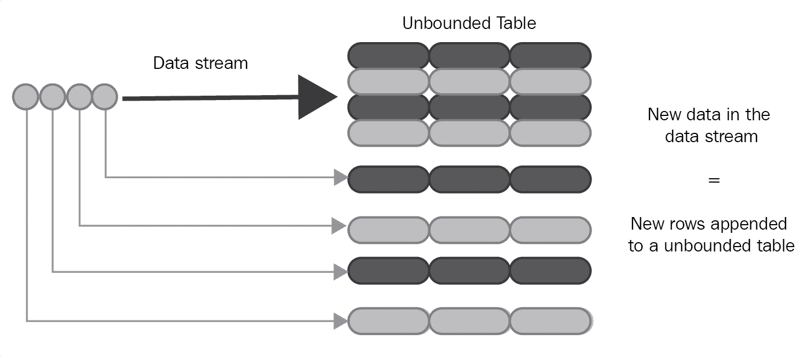
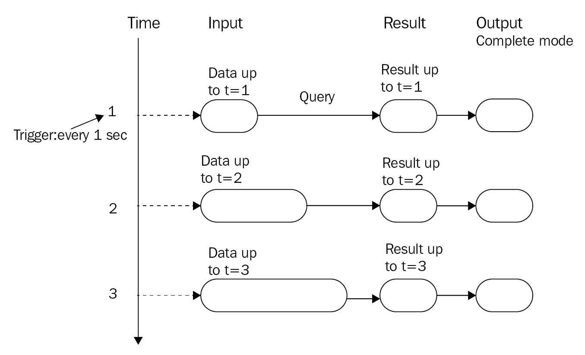
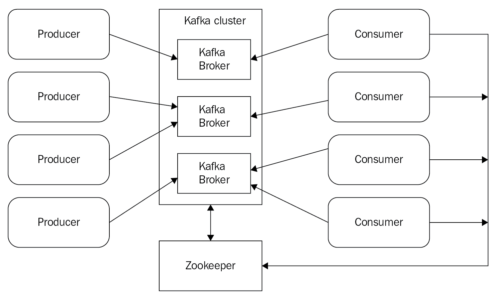

# 第四章：流处理

在上一章中，我们学习了如何使用批量 ETL 方法摄取和转换数据，以训练或评估模型。在大多数情况下，你会在训练或评估阶段使用这种方法，但在运行模型时，需要使用流式摄取。本章将介绍使用 Apache Spark、DL4J、DataVec 和 Apache Kafka 框架组合来设置流式摄取策略。与传统 ETL 方法不同，流式摄取框架不仅仅是将数据从源移动到目标。通过流式摄取，任何格式的进入数据都可以被同时摄取、转换和/或与其他结构化数据和先前存储的数据一起丰富，以供深度学习使用。

本章将涵盖以下主题：

+   使用 Apache Spark 进行流数据处理

+   使用 Kafka 和 Apache Spark 进行流数据处理

+   使用 DL4J 和 Apache Spark 进行流数据处理

# 使用 Apache Spark 进行流数据处理

在第一章《Apache Spark 生态系统》中，详细介绍了 Spark Streaming 和 DStreams。结构化流处理作为 Apache Spark 2.0.0 的 Alpha 版本首次推出，它最终从 Spark 2.2.0 开始稳定。

结构化流处理（基于 Spark SQL 引擎构建）是一个容错、可扩展的流处理引擎。流处理可以像批量计算一样进行，也就是说，在静态数据上进行计算，我们在第一章《Apache Spark 生态系统》中已经介绍过。正是 Spark SQL 引擎负责增量地和持续地运行计算，并在数据持续流入时最终更新结果。在这种情况下，端到端、精确一次和容错的保证是通过**预写日志**（**WAL**）和检查点实现的。

传统的 Spark Streaming 和结构化流处理编程模型之间的差异，有时不容易理解，尤其是对于第一次接触这个概念的有经验的 Spark 开发者来说。描述这种差异的最好方式是：你可以把它当作一种处理实时数据流的方式，将其看作一个持续追加的表（表可以被视为一个 RDBMS）。流计算被表达为一个标准的类批量查询（就像在静态表上发生的那样），但是 Spark 对这个无界表进行增量计算。

它的工作原理如下：输入数据流可以看作是输入表。每个到达数据流的数据项就像是向表中追加了一行新数据：



图 4.1：作为无界表的数据流

针对输入的查询会生成结果表。每次触发时，新的间隔行会追加到输入表中，然后更新结果表（如下图所示）。每当结果表更新时，更改后的结果行可以写入外部接收器。写入外部存储的输出有不同的模式：

+   **完整模式**：在这种模式下，整个更新后的结果表会被写入外部存储。如何将整个表写入存储系统取决于特定的连接器配置或实现。

+   **追加模式**：只有追加到结果表中的新行会被写入外部存储系统。这意味着可以在结果表中的现有行不期望更改的情况下应用此模式。

+   **更新模式**：只有在结果表中更新过的行会被写入外部存储系统。这种模式与完整模式的区别在于，它仅发送自上次触发以来发生变化的行：



图 4.2：结构化流处理的编程模型

现在，让我们实现一个简单的 Scala 示例——一个流式单词计数自包含应用程序，这是我们在第一章中使用的相同用例，*Apache Spark 生态系统*，但这次是针对结构化流处理。用于此类的代码可以在与 Spark 发行版捆绑的示例中找到。我们首先需要做的是初始化一个`SparkSession`：

```py
val spark = SparkSession
      .builder
       .appName("StructuredNetworkWordCount")
       .master(master)
       .getOrCreate()
```

然后，我们必须创建一个表示从连接到`host:port`的输入行流的 DataFrame：

```py
val lines = spark.readStream
       .format("socket")
       .option("host", host)
       .option("port", port)
       .load()
```

`lines` DataFrame 表示无界表格。它包含流式文本数据。该表的内容是一个值，即一个包含字符串的单列。每一行流入的文本都会成为一行数据。

让我们将行拆分为单词：

```py
val words = lines.as[String].flatMap(_.split(" "))
```

然后，我们需要统计单词数量：

```py
val wordCounts = words.groupBy("value").count()
```

最后，我们可以开始运行查询，将运行计数打印到控制台：

```py
val query = wordCounts.writeStream
       .outputMode("complete")
       .format("console")
       .start()
```

我们会继续运行，直到接收到终止信号：

```py
query.awaitTermination()
```

在运行此示例之前，首先需要运行 netcat 作为数据服务器（或者我们在第一章中用 Scala 实现的数据服务器，*Apache Spark 生态系统*）：

```py
nc -lk 9999 
```

然后，在另一个终端中，你可以通过传递以下参数来启动示例：

```py
localhost 9999
```

在运行 netcat 服务器时，终端中输入的任何一行都会被计数并打印到应用程序屏幕上。将会出现如下输出：

```py
hello spark
 a stream
 hands on spark
```

这将产生以下输出：

```py
-------------------------------------------
 Batch: 0
 -------------------------------------------
 +------+-----+
 | value|count|
 +------+-----+
 | hello|    1|
 | spark|    1|
 +------+-----+

 -------------------------------------------
 Batch: 1
 -------------------------------------------
 +------+-----+
 | value|count|
 +------+-----+
 | hello|    1|
 | spark|    1|
 |     a|    1|
 |stream|    1|
 +------+-----+

 -------------------------------------------
 Batch: 2
 -------------------------------------------
 +------+-----+
 | value|count|
 +------+-----+
 | hello|    1|
 | spark|    2|
 |     a|    1|
 |stream|    1|
 | hands|    1|
 |    on|    1|
 +------+-----+
```

事件时间定义为数据本身所嵌入的时间。在许多应用场景中，例如物联网（IoT）环境，当每分钟设备生成的事件数量需要被检索时，必须使用数据生成的时间，而不是 Spark 接收到它的时间。在这种编程模型中，事件时间自然地被表达——每个来自设备的事件就是表中的一行，而事件时间是该行中的列值。这种范式使得基于窗口的聚合成为对事件时间列的特殊聚合类型。这样可以保证一致性，因为基于事件时间和基于窗口的聚合查询可以在静态数据集（例如设备事件日志）和流式数据上以相同方式进行定义。

根据前面的考虑，显而易见，这种编程模型自然地处理了基于事件时间的数据，这些数据可能比预期的到达时间晚。由于是 Spark 本身更新结果表，因此它可以完全控制在有迟到数据时如何更新旧的聚合，以及通过清理旧的聚合来限制中间数据的大小。从 Spark 2.1 开始，还支持水印（watermarking），它允许你指定迟到数据的阈值，并允许底层引擎相应地清理旧状态。

# 使用 Kafka 和 Spark 进行流式数据处理

使用 Spark Streaming 与 Kafka 是数据管道中常见的技术组合。本节将展示一些使用 Spark 流式处理 Kafka 的示例。

# Apache Kafka

Apache Kafka ([`kafka.apache.org/`](http://kafka.apache.org/)) 是一个用 Scala 编写的开源消息代理。最初由 LinkedIn 开发，但它于 2011 年作为开源发布，目前由 Apache 软件基金会维护。

以下是你可能更倾向于使用 Kafka 而不是传统 JMS 消息代理的一些原因：

+   **它很快**：单个运行在普通硬件上的 Kafka 代理能够处理来自成千上万客户端的每秒数百兆字节的读写操作

+   **出色的可扩展性**：可以轻松且透明地进行扩展，且不会产生停机时间

+   **持久性与复制**：消息会被持久化存储在磁盘上，并在集群内进行复制，以防止数据丢失（通过设置适当的配置参数，你可以实现零数据丢失）

+   **性能**：每个代理能够处理数 TB 的消息而不会影响性能

+   它支持实时流处理

+   它可以轻松与其他流行的开源大数据架构系统（如 Hadoop、Spark 和 Storm）进行集成

以下是你应该熟悉的 Kafka 核心概念：

+   **主题**：这些是发布即将到来的消息的类别或源名称

+   **生产者**：任何发布消息到主题的实体

+   **消费者**：任何订阅主题并从中消费消息的实体

+   **Broker**：处理读写操作的服务

下图展示了典型的 Kafka 集群架构：



图 4.3：Kafka 架构

Kafka 在后台使用 ZooKeeper ([`zookeeper.apache.org/`](https://zookeeper.apache.org/)) 来保持其节点的同步。Kafka 提供了 ZooKeeper，因此如果主机没有安装 ZooKeeper，可以使用随 Kafka 捆绑提供的 ZooKeeper。客户端和服务器之间的通信通过一种高性能、语言无关的 TCP 协议进行。

Kafka 的典型使用场景如下：

+   消息传递

+   流处理

+   日志聚合

+   指标

+   网站活动跟踪

+   事件溯源

# Spark Streaming 和 Kafka

要将 Spark Streaming 与 Kafka 配合使用，您可以做两件事：要么使用接收器，要么直接操作。第一种选择类似于从其他来源（如文本文件和套接字）进行流式传输——从 Kafka 接收到的数据会存储在 Spark 执行器中，并通过 Spark Streaming 上下文启动的作业进行处理。这不是最佳方法——如果发生故障，可能会导致数据丢失。这意味着，直接方式（在 Spark 1.3 中引入）更好。它不是使用接收器来接收数据，而是定期查询 Kafka 以获取每个主题和分区的最新偏移量，并相应地定义每个批次处理的偏移量范围。当处理数据的作业执行时，Kafka 的简单消费者 API 会被用来读取定义的偏移量范围（几乎与从文件系统读取文件的方式相同）。直接方式带来了以下优点：

+   **简化的并行性**：不需要创建多个输入 Kafka 流然后努力将它们统一起来。Spark Streaming 会根据 Kafka 分区的数量创建相应数量的 RDD 分区，这些分区会并行地从 Kafka 读取数据。这意味着 Kafka 和 RDD 分区之间是 1:1 映射，易于理解和调整。

+   **提高效率**：按照接收器方式，为了实现零数据丢失，我们需要将数据存储在 WAL 中。然而，这种策略效率低，因为数据实际上被 Kafka 和 WAL 各自复制了一次。在直接方式中，没有接收器，因此也不需要 WAL——消息可以从 Kafka 中恢复，只要 Kafka 保留足够的时间。

+   **精确一次语义**：接收器方法使用 Kafka 的高级 API 将消费的偏移量存储在 ZooKeeper 中。尽管这种方法（结合 WAL）可以确保零数据丢失，但在发生故障时，某些记录可能会被重复消费，这有一定的可能性。数据被 Spark Streaming 可靠接收和 ZooKeeper 跟踪的偏移量之间的不一致导致了这一点。采用直接方法时，简单的 Kafka API 不使用 ZooKeeper——偏移量由 Spark Streaming 本身在其检查点内进行跟踪。这确保了即使在发生故障时，每条记录也能被 Spark Streaming 确切地接收一次。

直接方法的一个缺点是它不更新 ZooKeeper 中的偏移量——这意味着基于 ZooKeeper 的 Kafka 监控工具将不会显示任何进度。

现在，让我们实现一个简单的 Scala 示例——一个 Kafka 直接词频统计。该示例适用于 Kafka 版本 0.10.0.0 或更高版本。首先要做的是将所需的依赖项（Spark Core、Spark Streaming 和 Spark Streaming Kafka）添加到项目中：

```py
groupId = org.apache.spark
 artifactId = spark-core_2.11
 version = 2.2.1

 groupId = org.apache.spark
 artifactId = spark-streaming_2.11
 version = 2.2.1

 groupId = org.apache.spark
 artifactId = spark-streaming-kafka-0-10_2.11
 version = 2.2.1
```

此应用程序需要两个参数：

+   一个以逗号分隔的 Kafka 经纪人列表

+   一个以逗号分隔的 Kafka 主题列表，用于消费：

```py
val Array(brokers, topics) = args
```

我们需要创建 Spark Streaming 上下文。让我们选择一个 `5` 秒的批次间隔：

```py
val sparkConf = new SparkConf().setAppName("DirectKafkaWordCount").setMaster(master)
 val ssc = new StreamingContext(sparkConf, Seconds(5))
```

现在，让我们创建一个包含给定经纪人和主题的直接 Kafka 流：

```py
val topicsSet = topics.split(",").toSet
 val kafkaParams = MapString, String
 val messages = KafkaUtils.createDirectStreamString, String, StringDecoder, StringDecoder
```

我们现在可以实现词频统计，也就是从流中获取行，将其拆分成单词，统计单词数量，然后打印：

```py
val lines = messages.map(_._2)
 val words = lines.flatMap(_.split(" "))
 val wordCounts = words.map(x => (x, 1L)).reduceByKey(_ + _)
 wordCounts.print()
```

最后，让我们启动计算并保持其运行，等待终止信号：

```py
ssc.start()
 ssc.awaitTermination()
```

要运行此示例，首先需要启动一个 Kafka 集群并创建一个主题。Kafka 的二进制文件可以从官方网站下载（[`kafka.apache.org/downloads`](http://kafka.apache.org/downloads)）。下载完成后，我们可以按照以下指示操作。

首先启动一个 `zookeeper` 节点：

```py
$KAFKA_HOME/bin/zookeeper-server-start.sh $KAFKA_HOME/config/zookeeper.properties
```

它将开始监听默认端口，`2181`。

然后，启动一个 Kafka 经纪人：

```py
$KAFKA_HOME/bin/kafka-server-start.sh $KAFKA_HOME/config/server.properties
```

它将开始监听默认端口，`9092`。

创建一个名为 `packttopic` 的主题：

```py
$KAFKA_HOME/bin/kafka-topics.sh --create --zookeeper localhost:2181 --replication-factor 1 --partitions 1 --topic packttopic
```

检查主题是否已成功创建：

```py
$KAFKA_HOME/bin/kafka-topics.sh --list --zookeeper localhost:2181
```

主题名称 `packttopic` 应该出现在打印到控制台输出的列表中。

我们现在可以开始为新主题生成消息了。让我们启动一个命令行生产者：

```py
$KAFKA_HOME/bin/kafka-console-producer.sh --broker-list localhost:9092 --topic packttopic
```

在这里，我们可以向生产者控制台写入一些消息：

```py
First message
 Second message
 Third message
 Yet another message for the message consumer
```

让我们构建 Spark 应用程序，并通过 `$SPARK_HOME/bin/spark-submit` 命令执行，指定 JAR 文件名、Spark 主 URL、作业名称、主类名称、每个执行器使用的最大内存和作业参数（`localhost:9092` 和 `packttopic`）。

每条被 Spark 作业消费的消息行输出将类似于以下内容：

```py
-------------------------------------------
 Time: 1527457655000 ms
 -------------------------------------------
 (consumer,1)
 (Yet,1)
 (another,1)
 (message,2)
 (for,1)
 (the,1)
```

# 使用 DL4J 和 Spark 流式处理数据

在本节中，我们将应用 Kafka 和 Spark 进行数据流处理，以 DL4J 应用程序的使用情况场景为例。我们将使用的 DL4J 模块是 DataVec。

让我们考虑我们在*Spark Streaming 和 Kafka*部分中提出的示例。我们想要实现的是使用 Spark 进行直接 Kafka 流，并在数据到达后立即对其应用 DataVec 转换，然后在下游使用它。

让我们首先定义输入模式。这是我们从 Kafka 主题消费的消息所期望的模式。该模式结构与经典的`Iris`数据集（[`en.wikipedia.org/wiki/Iris_flower_data_set`](https://en.wikipedia.org/wiki/Iris_flower_data_set)）相同：

```py
val inputDataSchema = new Schema.Builder()
     .addColumnsDouble("Sepal length", "Sepal width", "Petal length", "Petal width")
     .addColumnInteger("Species")
     .build
```

让我们对其进行转换（我们将删除花瓣字段，因为我们将基于萼片特征进行一些分析）：

```py
val tp = new TransformProcess.Builder(inputDataSchema)
     .removeColumns("Petal length", "Petal width")
     .build
```

现在，我们可以生成新的模式（在对数据应用转换之后）：

```py
val outputSchema = tp.getFinalSchema
```

此 Scala 应用程序的下一部分与*Spark Streaming 和 Kafka*部分中的示例完全相同。在这里，创建一个流上下文，使用`5`秒的批处理间隔和直接的 Kafka 流：

```py
val sparkConf = new SparkConf().setAppName("DirectKafkaDataVec").setMaster(master)
 val ssc = new StreamingContext(sparkConf, Seconds(5))

 val topicsSet = topics.split(",").toSet
 val kafkaParams = MapString, String
 val messages = KafkaUtils.createDirectStreamString, String, StringDecoder, StringDecoder
```

让我们获取输入行：

```py
val lines = messages.map(_._2)
```

`lines`是一个`DStream[String]`。我们需要对每个 RDD 进行迭代，将其转换为`javaRdd`（DataVec 读取器所需），使用 DataVec 的`CSVRecordReader`，解析传入的逗号分隔消息，应用模式转换，并打印结果数据：

```py
lines.foreachRDD { rdd =>
   val javaRdd = rdd.toJavaRDD()
   val rr = new CSVRecordReader
   val parsedInputData = javaRdd.map(new StringToWritablesFunction(rr))

   if(!parsedInputData.isEmpty()) {
     val processedData = SparkTransformExecutor.execute(parsedInputData, tp)

     val processedAsString = processedData.map(new WritablesToStringFunction(","))
     val processedCollected = processedAsString.collect
     val inputDataCollected = javaRdd.collect

     println("\n\n---- Original Data ----")
     for (s <- inputDataCollected.asScala) println(s)

     println("\n\n---- Processed Data ----")
     for (s <- processedCollected.asScala) println(s)
   }
 }
```

最后，我们启动流上下文并保持其活动状态，等待终止信号：

```py
ssc.start()
 ssc.awaitTermination()
```

要运行此示例，我们需要启动一个 Kafka 集群，并创建一个名为`csvtopic`的新主题。步骤与*Spark Streaming 和 Kafka*部分描述的示例相同。主题创建完成后，我们可以开始在其上生产逗号分隔的消息。让我们启动一个命令行生产者：

```py
$KAFKA_HOME/bin/kafka-console-producer.sh --broker-list localhost:9092 --topic csvtopic
```

现在，我们可以将一些消息写入生产者控制台：

```py
5.1,3.5,1.4,0.2,0
 4.9,3.0,1.4,0.2,0
 4.7,3.2,1.3,0.2,0
 4.6,3.1,1.5,0.2,0
```

让我们构建 Spark 应用程序，并通过`$SPARK_HOME/bin/spark-submit`命令执行它，指定 JAR 文件名、Spark 主 URL、作业名称、主类名、每个执行程序可使用的最大内存以及作业参数（`localhost:9092`和`csvtopic`）。

每消费一行消息后，Spark 作业打印的输出将类似于以下内容：

```py
4.6,3.1,1.5,0.2,0

 ---- Processed Data ----
 4.6,3.1,0
```

此示例的完整代码可以在本书捆绑的源代码中找到，链接为[`github.com/PacktPublishing/Hands-On-Deep-Learning-with-Apache-Spark`](https://github.com/PacktPublishing/Hands-On-Deep-Learning-with-Apache-Spark)。

# 概要

为了完成我们在第三章中探索之后在训练、评估和运行深度学习模型时的数据摄入可能性的概述，*提取、转换、加载*，在本章中，我们探讨了在执行数据流处理时可用的不同选项。

本章总结了对 Apache Spark 特性的探讨。从下一章开始，重点将转向 DL4J 和其他一些深度学习框架的特性。这些特性将在不同的应用场景中使用，并将在 Spark 上进行实现。
