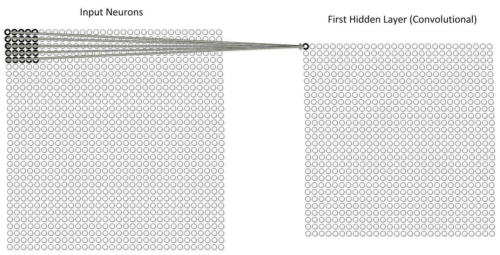
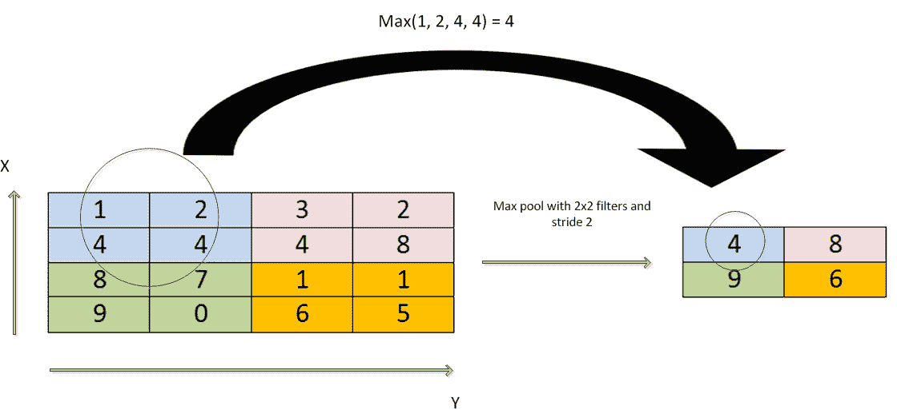
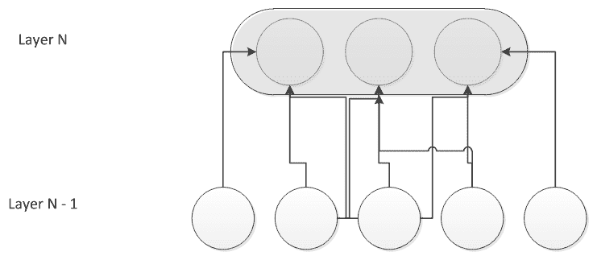
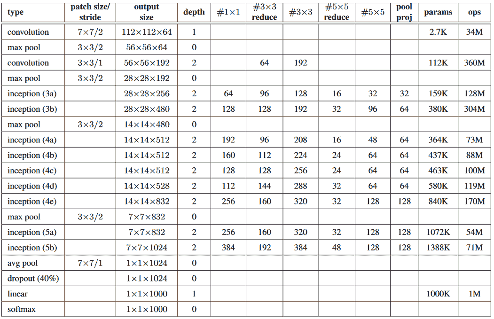
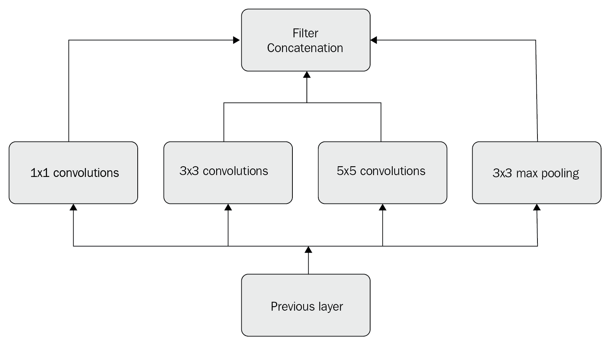
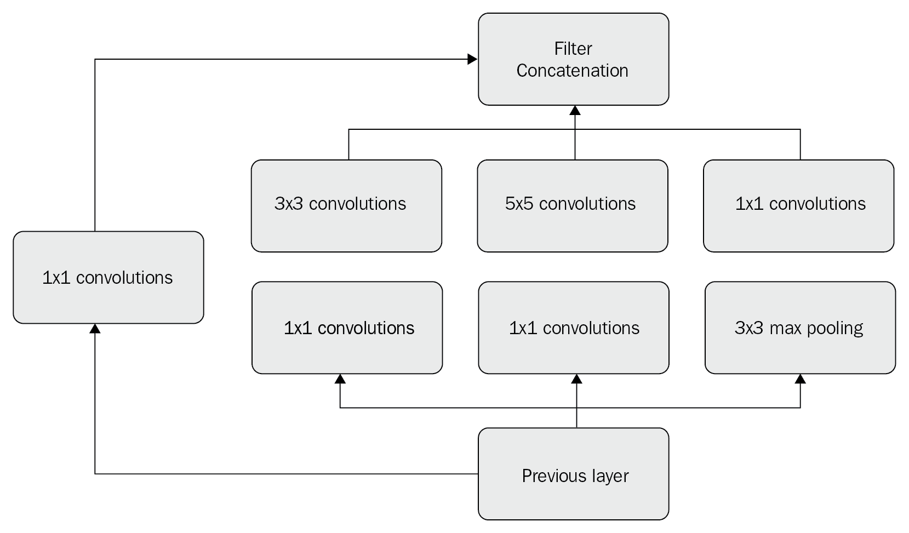

# 第五章：卷积神经网络

在第二章《*深度学习基础*》中，我们学习了关于**卷积神经网络**（**CNN**）的一个非常高层次的概述。在这一章，我们将深入了解这种类型的 CNN，更加详细地探讨它们各层的可能实现，并且我们将开始通过 DeepLearning4j 框架动手实现 CNN。本章最后也会涉及到使用 Apache Spark 的示例。CNN 的训练与评估策略将在第七章《*用 Spark 训练神经网络*》、第八章《*监控与调试神经网络训练*》以及第九章《*解释神经网络输出*》中讲解。在不同层的描述中，我尽量减少了数学概念和公式的使用，以便让没有数学或数据科学背景的开发者和数据分析师能够更容易地阅读和理解。因此，你会看到更多关于 Scala 代码实现的内容。

本章涵盖以下主题：

+   卷积层

+   池化层

+   全连接层

+   权重

+   GoogleNet Inception V3 模型

+   动手实践 CNN 与 Spark

# 卷积层

由于卷积神经网络（CNN）部分已经在第二章《深度学习基础》中讲解过，你应该知道 CNN 通常在哪些场景下使用。在该章节中，我们提到过同一 CNN 的每一层可以有不同的实现方式。本章的前三部分详细描述了可能的层实现，从卷积层开始。但首先，让我们回顾一下 CNN 如何感知图像的过程。CNN 将图像视为体积（3D 物体），而非二维画布（仅有宽度和高度）。原因如下：数字彩色图像采用**红**-**蓝**-**绿**（**RGB**）编码，正是这些颜色的混合产生了人眼能够感知的光谱。这也意味着 CNN 将图像作为三个颜色层分别处理，层与层之间是叠加的。这转化为以矩形框的形式接收彩色图像，宽度和高度可以用像素来度量，且有三个层（称为**通道**）的深度，每个通道对应一个 RGB 颜色。简而言之，输入图像被 CNN 看作一个多维数组。我们来举个实际的例子。如果我们考虑一个 480 x 480 的图像，网络会将其看作一个 480 x 480 x 3 的数组，其中每个元素的值在 0 到 255 之间。这些值描述了图像某一点的像素强度。这里是人眼与机器之间的主要区别：这些数组值是机器唯一的输入。接收到这些数值作为输入的计算机输出将是其他数字，描述图像属于某个类别的概率。CNN 的第一层总是**卷积层**。假设输入是一个 32 x 32 x 3 的像素值数组，我们试着想象一个具体的可视化，清楚简洁地解释卷积层的作用。我们可以将其想象为一个手电筒照射在图像的左上部分。

下图展示了手电筒的照射范围，覆盖了一个 5 x 5 的区域：



图 5.1：5 x 5 滤波器

然后，虚拟的滤光器开始滑动覆盖图像的其他区域。适当的术语是**滤波器**（或**神经元**或**卷积核**），而被照亮的图像区域被称为**感受野**。用数学术语来说，滤波器是一个数字数组（称为**权重**或**参数**）。滤波器的深度必须与输入的深度匹配。参考本节的示例，我们有一个维度为 5 x 5 x 3 的滤波器。滤波器覆盖的第一个位置（如前面图示所示）是输入图像的左上角。当滤波器在图像上滑动或进行卷积（来自拉丁动词*convolvere*，意为包裹）时，它会将其值与原始图像像素值相乘。所有的乘法结果会相加（在我们的示例中，总共有 75 次乘法）。最终的结果是一个数字，表示滤波器仅位于输入图像的左上角时的值。这个过程会在输入图像的每个位置重复。与第一次一样，每个唯一的位置都会产生一个数字。一旦滤波器完成在图像所有位置上的滑动过程，结果将是一个 28 x 28 x 1（假设输入图像为 32 x 32，5 x 5 的滤波器可以适应 784 个不同的位置）的数字数组，称为**激活图**（或**特征图**）。

# 池化层

在实践中（正如你将在本章的代码示例以及第七章《*使用 Spark 训练神经网络*》中看到的那样），通常会在 CNN 模型的连续卷积层之间定期插入池化层。这种层的作用是逐步减少网络的参数数量（这意味着显著降低计算成本）。事实上，空间池化（在文献中也被称为下采样或子采样）是一种减少每个特征图维度的技术，同时保留最重要的信息。存在不同类型的空间池化。最常用的是最大池化、平均池化、求和池化和 L2 范数池化。

以最大池化为例，这种技术需要定义一个空间邻域（通常是一个 2 × 2 的窗口）；然后从经过修正的特征图中取出该窗口内的最大元素。平均池化策略则要求取窗口内所有元素的平均值或和。一些论文和实际应用表明，最大池化已经证明能够比其他空间池化技术产生更好的结果。

下图展示了最大池化操作的一个示例（这里使用了一个 2 × 2 的窗口）：



图 5.2：使用 2 × 2 窗口的最大池化操作

# 全连接层

全连接层是卷积神经网络（CNN）的最后一层。全连接层在给定输入数据的情况下，输出一个多维向量。输出向量的维度与特定问题的类别数相匹配。

本章及本书中的其他章节展示了一些 CNN 实现和训练的例子，用于数字分类。在这些情况下，输出向量的维度为 10（可能的数字是 0 到 9）。10 维输出向量中的每个数字表示某个类别（数字）的概率。以下是一个用于数字分类推断的输出向量：

`[0 0 0 .1 .75 .1 .05 0 0 0]`

我们如何解读这些值？网络告诉我们，它认为输入图像是一个四，概率为 75%（在本例中是最高的），同时图像是三的概率为 10%，图像是五的概率为 10%，图像是六的概率为 5%。全连接层会查看同一网络中前一层的输出，并确定哪些特征与某一特定类别最相关。

不仅仅是在数字分类中发生这种情况。在图像分类的一个通用使用案例中，如果一个使用动物图像训练的模型预测输入图像是例如马，它将在表示特定高级特征的激活图中具有较高的值，比如四条腿或尾巴，仅举几个例子。类似地，如果该模型预测图像是另一种动物，比如鱼，它将在表示特定高级特征的激活图中具有较高的值，比如鳍或鳃。我们可以说，全连接层会查看与某一特定类别最相关的高级特征，并拥有特定的权重：这确保了在计算了权重与前一层的乘积后，能够获得每个不同类别的正确概率。

# 权重

CNN 在卷积层中共享权重。这意味着在一层中的每个感受野使用相同的滤波器，并且这些复制的单元共享相同的参数（权重向量和偏置），并形成一个特征图。

以下图示展示了一个网络中属于同一特征图的三个隐藏单元：



图 5.3：隐藏单元

前述图中较深灰色的权重是共享且相同的。这种复制使得无论特征在视觉场景中的位置如何，都能够进行特征检测。权重共享的另一个结果是：学习过程的效率通过大幅减少需要学习的自由参数数量得到显著提高。

# GoogleNet Inception V3 模型

作为卷积神经网络（CNN）的具体实现，在这一部分，我将介绍 Google 的 GoogleNet 架构（[`ai.google/research/pubs/pub43022`](https://ai.google/research/pubs/pub43022)）及其 Inception 层。该架构已在*ImageNet 大规模视觉识别挑战赛 2014*（*ILSVRC2014*，[`www.image-net.org/challenges/LSVRC/2014/`](http://www.image-net.org/challenges/LSVRC/2014/)）上展示。无需多说，它赢得了那场比赛。这个实现的显著特点如下：增加了深度和宽度，同时保持了恒定的计算预算。提高计算资源的利用率是网络设计的一部分。

下面的图表总结了在该上下文中提出的网络实现的所有层：



图 5.4：GoogleNet 层

该网络有 22 层参数（不包括池化层；如果包括池化层，总共有 27 层），其参数数量几乎是过去几届同一比赛获胜架构的 12 分之一。这个网络的设计考虑了计算效率和实用性，使得推理过程也能够在有限资源的单个设备上运行，尤其是那些内存占用较低的设备。所有卷积层都使用**修正线性单元**（**ReLU**）激活函数。感受野的大小为 224 × 224，使用的是 RGB 颜色空间（均值为零）。通过前面的图表中的表格来看，**#3 × 3**和**#5 × 5**的减少数量是位于 3 × 3 和 5 × 5 卷积层之前的 1 × 1 滤波器数量。这些减少层的激活函数同样是 ReLU。

在[`user-images.githubusercontent.com/32988039/33234276-86fa05fc-d1e9-11e7-941e-b3e62771716f.png`](https://user-images.githubusercontent.com/32988039/33234276-86fa05fc-d1e9-11e7-941e-b3e62771716f.png)中的示意图展示了网络的结构。

在这种架构中，来自前一层的每个单元都对应输入图像的一个区域——这些单元被分组到滤波器组中。在接近输入的层中，相关的单元集中在局部区域。这导致许多聚集在单一区域的簇，因此可以通过下一个层中的 1 × 1 卷积来覆盖它们。然而，也可能有较少的、更空间分散的簇，由较大块的卷积覆盖，而且随着区域增大，块的数量会减少。为了防止这些补丁对齐问题，inception 架构的实现被限制为只能使用 1 × 1、3 × 3 和 5 × 5 滤波器。建议的架构是将多个层的输出滤波器组聚合为一个单一的输出向量，这个向量代表了下一阶段的输入。此外，在每个阶段并行添加一个替代的池化路径可能会有进一步的有益效果：



图 5.5：简单版本的 inception 模块

从前面的图中可以看出，就计算成本而言，对于具有大量滤波器的层，5 × 5 卷积可能太昂贵（即使卷积数量不多）。当然，随着添加更多池化单元，这个问题会变得更严重，因为输出滤波器的数量等于前一阶段的滤波器数量。显然，将池化层的输出与卷积层的输出合并，可能不可避免地导致越来越多的输出从一个阶段传递到下一个阶段。因此，提出了 inception 架构的第二个、更具计算效率的想法。这个新想法是在计算需求可能增加过多的地方进行维度降低。但需要注意的是：低维嵌入可能包含大量关于大图块的信息，但它们以压缩形式表示这些信息，这使得处理起来变得困难。因此，一个好的折衷方法是保持表示尽可能稀疏，同时仅在真正需要大量聚合信号时，才对信号进行压缩。为此，在进行任何昂贵的 **3 × 3** 和 **5 × 5 卷积**之前，使用 **1 × 1 卷积** 来进行维度降低。

下图展示了考虑到上述问题后的新模块：



图 5.6：具有维度减少的 inception 模块

# 使用 Spark 实现的 CNN

在本章前面的部分，我们已经讨论了 CNN 的理论和 GoogleNet 架构。如果这是你第一次阅读这些概念，可能会对实现 CNN 模型、训练和评估时 Scala 代码的复杂性感到困惑。通过采用像 DL4J 这样的高层次框架，你将发现它自带了许多功能，且实现过程比预期的更简单。

在本节中，我们将通过使用 DL4J 和 Spark 框架，探索 CNN 配置和训练的真实示例。所使用的训练数据来自`MNIST`数据库（[`yann.lecun.com/exdb/mnist/`](http://yann.lecun.com/exdb/mnist/)）。它包含手写数字的图像，每张图像都由一个整数进行标记。该数据库用于评估 ML 和 DL 算法的性能。它包含 60,000 个训练样本和 10,000 个测试样本。训练集用于教算法预测正确的标签，即整数，而测试集则用于检查训练后的网络在进行预测时的准确性。

对于我们的示例，我们下载并在本地解压 `MNIST` 数据。会创建一个名为 `mnist_png` 的目录，它包含两个子目录：`training`，其中包含训练数据，以及 `testing`，其中包含评估数据。

我们先只使用 DL4J（稍后会将 Spark 添加到堆栈中）。我们需要做的第一件事是将训练数据向量化。我们使用 `ImageRecordReader` ([`deeplearning4j.org/datavecdoc/org/datavec/image/recordreader/ImageRecordReader.html`](https://deeplearning4j.org/datavecdoc/org/datavec/image/recordreader/ImageRecordReader.html)) 作为读取器，因为训练数据是图像，而使用 `RecordReaderDataSetIterator` ([`javadox.com/org.deeplearning4j/deeplearning4j-core/0.4-rc3.6/org/deeplearning4j/datasets/canova/RecordReaderDataSetIterator.html`](http://javadox.com/org.deeplearning4j/deeplearning4j-core/0.4-rc3.6/org/deeplearning4j/datasets/canova/RecordReaderDataSetIterator.html)) 来遍历数据集，方法如下：

```py
val trainData = new ClassPathResource("/mnist_png/training").getFile
val trainSplit = new FileSplit(trainData, NativeImageLoader.ALLOWED_FORMATS, randNumGen)
val labelMaker = new ParentPathLabelGenerator(); // parent path as the image label
val trainRR = new ImageRecordReader(height, width, channels, labelMaker)
trainRR.initialize(trainSplit)
val trainIter = new RecordReaderDataSetIterator(trainRR, batchSize, 1, outputNum)
```

让我们对像素值进行最小-最大缩放，将其从 0-255 缩放到 0-1，方法如下：

```py
val scaler = new ImagePreProcessingScaler(0, 1)
scaler.fit(trainIter)
trainIter.setPreProcessor(scaler)
```

对测试数据也需要进行相同的向量化处理。

让我们按照以下方式配置网络：

```py
val channels = 1
val outputNum = 10

val conf = new NeuralNetConfiguration.Builder()
      .seed(seed)
      .iterations(iterations)
      .regularization(true)
      .l2(0.0005)
      .learningRate(.01)
      .weightInit(WeightInit.XAVIER)
      .optimizationAlgo(OptimizationAlgorithm.STOCHASTIC_GRADIENT_DESCENT)
      .updater(Updater.NESTEROVS)
      .momentum(0.9)
      .list
      .layer(0, new ConvolutionLayer.Builder(5, 5)
        .nIn(channels)
        .stride(1, 1)
        .nOut(20)
        .activation(Activation.IDENTITY)
        .build)
      .layer(1, new SubsamplingLayer.Builder(SubsamplingLayer.PoolingType.MAX)
        .kernelSize(2, 2)
        .stride(2, 2)
        .build)
      .layer(2, new ConvolutionLayer.Builder(5, 5)
        .stride(1, 1)
        .nOut(50)
        .activation(Activation.IDENTITY)
        .build)
      .layer(3, new SubsamplingLayer.Builder(SubsamplingLayer.PoolingType.MAX)
        .kernelSize(2, 2)
        .stride(2, 2)
        .build)
      .layer(4, new DenseLayer.Builder()
        .activation(Activation.RELU)
        .nOut(500)
        .build)
      .layer(5, new OutputLayer.Builder(LossFunctions.LossFunction.NEGATIVELOGLIKELIHOOD)
        .nOut(outputNum)
        .activation(Activation.SOFTMAX).build)
      .setInputType(InputType.convolutionalFlat(28, 28, 1))
      .backprop(true).pretrain(false).build
```

然后，可以使用生成的 `MultiLayerConfiguration` 对象 ([`deeplearning4j.org/doc/org/deeplearning4j/nn/conf/MultiLayerConfiguration.html`](https://deeplearning4j.org/doc/org/deeplearning4j/nn/conf/MultiLayerConfiguration.html)) 来初始化模型 ([`deeplearning4j.org/doc/org/deeplearning4j/nn/multilayer/MultiLayerNetwork.html`](https://deeplearning4j.org/doc/org/deeplearning4j/nn/multilayer/MultiLayerNetwork.html))，方法如下：

```py
val model: MultiLayerNetwork = new MultiLayerNetwork(conf)
model.init()
```

我们现在可以训练（和评估）模型，方法如下：

```py
model.setListeners(new ScoreIterationListener(1))
for (i <- 0 until nEpochs) {
    model.fit(trainIter)
    println("*** Completed epoch {} ***", i)
    ...
}
```

现在让我们将 Apache Spark 引入其中。通过 Spark，可以在集群的多个节点上并行化内存中的训练和评估过程。

和往常一样，首先创建 Spark 上下文，如下所示：

```py
val sparkConf = new SparkConf
sparkConf.setMaster(master)
        .setAppName("DL4J Spark MNIST Example")
val sc = new JavaSparkContext(sparkConf)
```

然后，在将训练数据向量化后，通过 Spark 上下文将其并行化，如下所示：

```py
val trainDataList = mutable.ArrayBuffer.empty[DataSet]
while (trainIter.hasNext) {
    trainDataList += trainIter.next
}

val paralleltrainData = sc.parallelize(trainDataList)
```

测试数据也需要进行相同的处理。

配置和初始化模型后，您可以按如下方式配置 Spark 进行训练：

```py
var batchSizePerWorker: Int = 16
val tm = new ParameterAveragingTrainingMaster.Builder(batchSizePerWorker)
    .averagingFrequency(5)
    .workerPrefetchNumBatches(2)      
    .batchSizePerWorker(batchSizePerWorker)
    .build
```

创建 Spark 网络，如下所示：

```py
val sparkNet = new SparkDl4jMultiLayer(sc, conf, tm)
```

最后，用以下代码替换之前的训练代码：

```py
var numEpochs: Int = 15
var i: Int = 0
for (i <- 0 until numEpochs) {
    sparkNet.fit(paralleltrainData)
    println("Completed Epoch {}", i)
}
```

完成后，不要忘记删除临时训练文件，如下所示：

```py
tm.deleteTempFiles(sc)
```

完整示例是书籍随附的源代码的一部分。

# 总结

本章中，我们首先深入了解了 CNN 的主要概念，并探索了 Google 提供的 CNN 架构中最流行和表现最好的一个例子。接着，我们开始使用 DL4J 和 Spark 实现一些代码。

在下一章，我们将沿着类似的路线更深入地探讨 RNN。
