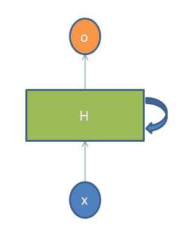
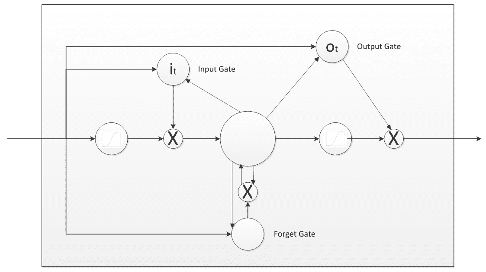

# 第六章：循环神经网络

在本章中，我们将进一步了解**循环神经网络**（**RNNs**），它们最常见的应用场景概述，以及最后通过使用 DeepLearning4j 框架进行实际操作的可能实现。本章的代码示例还涉及到 Apache Spark。如同前一章关于 CNNs 的内容所述，RNN 的训练和评估策略将在第七章，*使用 Spark 训练神经网络*，第八章，*监控与调试神经网络训练*，以及第九章，*解释神经网络输出*中详细介绍。

在本章中，我尽量减少了数学概念和公式的使用，以便让没有数学或数据科学背景的开发人员和数据分析师能够更容易地阅读和理解。

本章涵盖以下主题：

+   **长短期记忆**（**LSTM**）

+   应用场景

+   实战 RNN 与 Spark

# LSTM

RNN 是多层神经网络，用于识别数据序列中的模式。这里的数据序列可以是文本、手写字、数字时间序列（例如来自传感器的数据）、日志条目等。涉及的算法也具有时间维度：它们会考虑时间（这与 CNN 的主要区别）和序列。为了更好地理解为什么需要 RNN，我们首先要看一下前馈网络的基础。与 RNN 类似，这些网络通过一系列数学操作在网络的节点上处理信息，但它们是将信息直接传递，且每个节点不会被重复访问。网络接收输入示例，然后将其转化为输出：简而言之，它们将原始数据映射到类别。训练过程发生在有标签的输入上，直到猜测输入类别时所犯的错误最小化。这是网络学习如何对它从未见过的新数据进行分类的方式。前馈网络没有时间顺序的概念：它仅考虑当前输入，并不一定会改变它如何分类下一个输入。RNN 则接收当前示例以及它之前感知到的任何信息作为输入。可以将 RNN 视为多个前馈神经网络，将信息从一个网络传递到另一个网络。

在 RNN 的应用场景中，一个序列可能是有限的或无限的、相互依赖的数据流。CNN 在这些情况下表现不好，因为它们没有考虑前一个和下一个输入之间的相关性。根据第五章，你已经了解到，CNN 接收输入并根据训练的模型进行输出。对于给定数量的不同输入，任何一个都不会受到之前输出的影响。但如果考虑到本章最后几节提出的情况（一个句子生成的案例），其中所有生成的单词都依赖于之前生成的单词，那么就一定需要根据之前的输出进行偏置。这时，RNN 就派上用场了，因为它们能记住数据序列中之前发生的事情，这有助于它们获取上下文。理论上，RNN 可以无限回顾所有前一步骤，但实际上，出于性能考虑，它们只能回顾最后几步。

让我们深入了解 RNN 的细节。为了进行这个解释，我将从**多层感知机**（**MLP**）开始，它是一个前馈人工神经网络（ANN）类别。MLP 的最小实现至少有三层节点。但对于输入节点，每个节点是一个使用非线性激活函数的神经元。输入层当然是接收输入的部分。第一个隐藏层进行激活操作，将信息传递给下一个隐藏层，以此类推。最终，信息到达输出层，负责提供输出。所有隐藏层的行为不同，因为每一层都有不同的权重、偏置和激活函数。为了使这些层能够合并并简化这一过程，所有层需要替换为相同的权重（以及相同的偏置和激活函数）。这是将所有隐藏层合并成一个单一的循环层的唯一方法。它们开始看起来如下图所示。



图 6.1

根据前面的图示，网络`H`接收一些输入`x`并产生输出`o`。信息通过循环机制从网络的一个步骤传递到下一个步骤。在每个步骤中，输入会被提供给网络的隐藏层。RNN 的任何神经元都会存储它在所有前一步骤中接收到的输入，然后可以将这些信息与当前步骤传递给它的输入进行合并。这意味着在时间步*t-1*做出的决策会影响在时间步`t`做出的决策。

让我们用一个例子重新表述前面的解释：假设我们想预测在一系列字母之后，接下来的字母是什么。假设输入的单词是 **pizza**，它由五个字母组成。当网络尝试推测第五个字母时，会发生什么呢？前四个字母已经输入到网络中。对于隐藏层来说，会进行五次迭代。如果我们展开网络，它将变成一个五层网络，每一层对应输入单词的一个字母（参考 第二章，*深度学习基础*，*图 2.11*）。我们可以将它看作是一个重复多次（5）的普通神经网络。展开的次数与网络能够记住多远的过去有直接关系。回到 **pizza** 的例子，输入数据的词汇表是 *{p, i, z, a}*。隐藏层或 RNN 会对当前输入和前一个状态应用一个公式。在我们的例子中，单词 *pizza* 中的字母 `p` 作为第一个字母，它前面没有任何字母，所以什么也不做，然后我们可以继续处理下一个字母 `i`。在字母 `i` 和前一个状态（字母 `p`）之间，隐藏层应用公式。如果在某个时刻 `t`，输入是 `i`，那么在时刻 *t-1*，输入是 `p`。通过对 `p` 和 `i` 应用公式，我们得到一个新的状态。计算当前状态的公式可以写成如下：

*h[t] = f(h[t-1], x[t])*

其中 `hₜ` 是新的状态，*h[t-1]* 是前一个状态，`xₜ` 是当前输入。从之前的公式可以理解，当前状态是前一个输入的函数（输入神经元对前一个输入进行了变换）。任何连续的输入都会作为时间步长。在这个 *pizza* 的例子中，我们有四个输入进入网络。在每个时间步长，都会应用相同的函数和相同的权重。考虑到 RNN 的最简单实现，激活函数是 *tanh*，即双曲正切函数，其值范围在 *-1* 到 `1` 之间，这是 MLP 中最常见的 S 型激活函数之一。因此，公式如下：

*h[t] = tanh(W[hh]h[t-1] + W[xh]x[t])*

这里 `W[hh]` 是递归神经元的权重，`W[xh]` 是输入神经元的权重。这个公式意味着递归神经元会考虑到前一个状态。当然，前面的公式可以在更长的序列情况下涉及多个状态，而不仅仅是 *pizza*。一旦计算出最终状态，就可以通过以下方式获得输出 `yₜ`：

*y[t] = W[hy]h[t]*

关于误差的最后一点说明。误差通过将输出与实际输出进行比较来计算。一旦计算出误差，就通过反向传播将其传播到网络中，以更新网络的权重。

# 反向传播通过时间（BPTT）

为 RNN 提出了多种变体架构（其中一些已在第二章，*深度学习基础*，*循环神经网络*一节中列出）。在详细介绍 LSTM 实现之前，需要先简要讨论一下之前描述的通用 RNN 架构的问题。对于神经网络，一般使用前向传播技术来获得模型的输出并检查其是否正确。同样，反向传播是一种通过神经网络向后传播，找出误差对权重的偏导数的技术（这使得可以从权重中减去找到的值）。这些偏导数随后被梯度下降算法使用，梯度下降算法以迭代的方式最小化一个函数，然后对权重进行上下调整（调整的方向取决于哪个方向能减少误差）。在训练过程中，反向传播是调整模型权重的方式。BPTT 只是定义在展开的 RNN 上执行反向传播过程的一种方法。参考第二章，*深度学习基础*，*图 2.11*，在执行 BPTT 时，必须进行展开的公式化，即某一时间步的误差依赖于前一个时间步。在 BPTT 技术中，误差是从最后一个时间步反向传播到第一个时间步，同时展开所有时间步。这使得可以为每个时间步计算误差，从而更新权重。请注意，在时间步数较多的情况下，BPTT 可能会计算非常耗时。

# RNN 问题

影响 RNN 的两个主要问题是**梯度爆炸**和**梯度消失**。当算法在没有理由的情况下给模型权重赋予过高的重要性时，我们称之为梯度爆炸。但解决这个问题的方法很简单，只需要截断或压缩梯度即可。我们称之为梯度消失，是指梯度的值非常小，以至于它导致模型停止学习或学习速度过慢。如果与梯度爆炸相比，这是一个主要问题，但现在已经通过**LSTM**（长短期记忆）神经网络得到了解决。LSTM 是一种特殊类型的 RNN，能够学习长期依赖关系，1997 年由 Sepp Hochreiter（[`en.wikipedia.org/wiki/Sepp_Hochreiter`](https://en.wikipedia.org/wiki/Sepp_Hochreiter)）和 Juergen Schmidhuber（[`en.wikipedia.org/wiki/J%C3%BCrgen_Schmidhuber`](https://en.wikipedia.org/wiki/J%C3%BCrgen_Schmidhuber)）提出。

它们明确设计为具有默认的长期记忆能力。之所以能够实现这一点，是因为 LSTM 会在一个内存中保持信息，这个内存的功能类似于计算机的内存：LSTM 可以从中读取、写入和删除信息。LSTM 的内存可以被视为一个带门单元：它决定是否存储或删除信息（是否打开门），这取决于它对给定信息的重要性赋予了多少权重。赋予重要性的过程通过权重进行：因此，网络随着时间的推移学习哪些信息需要被认为是重要的，哪些不重要。LSTM 有三个门：输入门、遗忘门和输出门。**输入门**决定是否让新输入进入，**遗忘门**删除不重要的信息，**输出门**影响网络当前时间步的输出，如下图所示：



图 6.2：LSTM 的三个门

你可以将这三个门看作是传统的人工神经元，就像在前馈神经网络（MNN）中一样：它们计算一个加权和的激活（使用激活函数）。使得 LSTM 门能够进行反向传播的原因在于它们是模拟的（sigmoid 函数，其范围从零到一）。这种实现解决了梯度消失的问题，因为它保持了足够陡峭的梯度，从而使得训练能够在相对较短的时间内完成，同时保持较高的准确性。

# 使用案例

RNN 有多个使用场景。以下是最常见的几种：

+   **语言建模与文本生成**：这是一种尝试，根据一系列单词预测下一个单词的概率。这对于语言翻译非常有用：最有可能的句子通常是正确的句子。

+   **机器翻译**：这是一种尝试将文本从一种语言翻译成另一种语言的方法。

+   **时间序列中的异常检测**：研究表明，特别是 LSTM 网络非常适合学习包含未知长度的长期模式的序列，因为它们能够保持长期记忆。由于这一特性，它们在时间序列中的异常或故障检测中非常有用。实际应用案例包括日志分析和传感器数据分析。

+   **语音识别**：这是一种基于输入声波预测语音片段，然后形成单词的尝试。

+   **语义解析**：将自然语言表达转换为逻辑形式——一种机器可理解的意义表示。实际应用包括问答系统和编程语言代码生成。

+   **图像描述**：这通常涉及 CNN 和 RNN 的组合。CNN 进行图像分割，RNN 则利用 CNN 分割后的数据来重建描述。

+   **视频标注**：RNN 可以用于视频搜索，当进行逐帧视频图像说明时，RNN 可以发挥作用。

+   **图像生成**：这是一个将场景的各部分独立生成并逐步改进大致草图的过程，最终生成的图像在肉眼下无法与真实数据区分。

# 使用 Spark 动手实践 RNN

现在让我们开始动手使用 RNN。本节分为两部分——第一部分是关于使用 DL4J 实现网络，第二部分将介绍使用 DL4J 和 Spark 实现同样目标的方法。与 CNN 一样，借助 DL4J 框架，许多高级功能都可以开箱即用，因此实现过程比你想象的要容易。

# 使用 DL4J 的 RNN

本章展示的第一个示例是一个 LSTM，经过训练后，当学习字符串的第一个字符作为输入时，它将会复述接下来的字符。

这个示例的依赖项如下：

+   Scala 2.11.8

+   DL4J NN 0.9.1

+   ND4J Native 0.9.1 以及你运行该模型的机器操作系统专用分类器

+   ND4J jblas 0.4-rc3.6

假设我们有一个通过不可变变量`LEARNSTRING`指定的学习字符串，接下来我们开始创建一个由它生成的可能字符列表，如下所示：

```py
val LEARNSTRING_CHARS: util.LinkedHashSet[Character] = new util.LinkedHashSet[Character]
for (c <- LEARNSTRING) {
        LEARNSTRING_CHARS.add(c)
}
LEARNSTRING_CHARS_LIST.addAll(LEARNSTRING_CHARS)
```

让我们开始配置网络，如下所示：

```py
val builder: NeuralNetConfiguration.Builder = new NeuralNetConfiguration.Builder
builder.iterations(10)
builder.learningRate(0.001)
builder.optimizationAlgo(OptimizationAlgorithm.STOCHASTIC_GRADIENT_DESCENT)
builder.seed(123)
builder.biasInit(0)
builder.miniBatch(false)
builder.updater(Updater.RMSPROP)
builder.weightInit(WeightInit.XAVIER)
```

你会注意到，我们正在使用与上一章中 CNN 示例相同的`NeuralNetConfiguration.Builder`类。这个抽象类用于任何你需要通过 DL4J 实现的网络。使用的优化算法是随机梯度下降（[`en.wikipedia.org/wiki/Stochastic_gradient_descent`](https://en.wikipedia.org/wiki/Stochastic_gradient_descent)）。其他参数的意义将在下一章中进行讲解，该章将重点介绍训练过程。

现在让我们定义这个网络的各层。我们实现的模型基于 Alex Graves 的 LSTM RNN（[`en.wikipedia.org/wiki/Alex_Graves_(computer_scientist)`](https://en.wikipedia.org/wiki/Alex_Graves_(computer_scientist))）。在决定它们的总数并将一个值分配给不可变变量`HIDDEN_LAYER_CONT`后，我们可以定义网络的隐藏层，如下所示：

```py
val listBuilder = builder.list
for (i <- 0 until HIDDEN_LAYER_CONT) {
  val hiddenLayerBuilder: GravesLSTM.Builder = new GravesLSTM.Builder
  hiddenLayerBuilder.nIn(if (i == 0) LEARNSTRING_CHARS.size else HIDDEN_LAYER_WIDTH)
  hiddenLayerBuilder.nOut(HIDDEN_LAYER_WIDTH)
  hiddenLayerBuilder.activation(Activation.TANH)
  listBuilder.layer(i, hiddenLayerBuilder.build)
}
```

激活函数是`tanh`（双曲正切）。

然后我们需要定义`outputLayer`（选择 softmax 作为激活函数），如下所示：

```py
val outputLayerBuilder: RnnOutputLayer.Builder = new RnnOutputLayer.Builder(LossFunction.MCXENT)
outputLayerBuilder.activation(Activation.SOFTMAX)
outputLayerBuilder.nIn(HIDDEN_LAYER_WIDTH)
outputLayerBuilder.nOut(LEARNSTRING_CHARS.size)
listBuilder.layer(HIDDEN_LAYER_CONT, outputLayerBuilder.build)
```

在完成配置之前，我们必须指定该模型没有经过预训练，并且我们使用反向传播，如下所示：

```py
listBuilder.pretrain(false)
listBuilder.backprop(true)
```

网络（`MultiLayerNetwork`）可以从上述配置开始创建，如下所示：

```py
val conf = listBuilder.build
val net = new MultiLayerNetwork(conf)
net.init()
net.setListeners(new ScoreIterationListener(1))
```

一些训练数据可以通过编程方式从学习字符串字符列表生成，如下所示：

```py
val input = Nd4j.zeros(1, LEARNSTRING_CHARS_LIST.size, LEARNSTRING.length)
val labels = Nd4j.zeros(1, LEARNSTRING_CHARS_LIST.size, LEARNSTRING.length)
var samplePos = 0
for (currentChar <- LEARNSTRING) {
  val nextChar = LEARNSTRING((samplePos + 1) % (LEARNSTRING.length))
  input.putScalar(ArrayInt, samplePos), 1)
  labels.putScalar(ArrayInt, samplePos), 1)
  samplePos += 1
}
val trainingData: DataSet = new DataSet(input, labels)
```

该 RNN 训练的过程将在下一章中介绍（代码示例将在那里完成）——本节的重点是展示如何使用 DL4J API 配置和构建 RNN 网络。

# 使用 DL4J 和 Spark 进行 RNN 训练

本节中展示的示例是一个 LSTM 模型，它将被训练以一次生成一个字符的文本。训练通过 Spark 进行。

该示例的依赖项如下：

+   Scala 2.11.8

+   DL4J NN 0.9.1

+   ND4J Native 0.9.1 和适用于运行环境操作系统的特定分类器。

+   ND4J jblas 0.4-rc3.6

+   Apache Spark Core 2.11，版本 2.2.1

+   DL4J Spark 2.11，版本 0.9.1_spark_2

我们像往常一样通过 `NeuralNetConfiguration.Builder` 类开始配置网络，具体如下：

```py
val rng = new Random(12345)
val lstmLayerSize: Int = 200
val tbpttLength: Int = 50
val nSamplesToGenerate: Int = 4
val nCharactersToSample: Int = 300
val generationInitialization: String = null
val conf = new NeuralNetConfiguration.Builder()
    .optimizationAlgo(OptimizationAlgorithm.STOCHASTIC_GRADIENT_DESCENT)
    .iterations(1)
    .learningRate(0.1)
    .rmsDecay(0.95)
    .seed(12345)
    .regularization(true)
    .l2(0.001)
    .weightInit(WeightInit.XAVIER)
    .updater(Updater.RMSPROP)
    .list
    .layer(0, new GravesLSTM.Builder().nIn(SparkLSTMCharacterExample.CHAR_TO_INT.size).nOut(lstmLayerSize).activation(Activation.TANH).build())
    .layer(1, new GravesLSTM.Builder().nIn(lstmLayerSize).nOut(lstmLayerSize).activation(Activation.TANH).build())
    .layer(2, new RnnOutputLayer.Builder(LossFunction.MCXENT).activation(Activation.SOFTMAX)
      .nIn(lstmLayerSize).nOut(SparkLSTMCharacterExample.nOut).build) //MCXENT + softmax for classification
    .backpropType(BackpropType.TruncatedBPTT).tBPTTForwardLength(tbpttLength).tBPTTBackwardLength(tbpttLength)
    .pretrain(false).backprop(true)
    .build
```

关于 *RNNs with DL4J* 部分中展示的示例，这里使用的 LSTM RNN 实现是 Alex Graves 的版本。所以配置、隐藏层和输出层与前一个示例非常相似。

现在，Spark 开始发挥作用了。让我们设置 Spark 配置和上下文，如下所示：

```py
val sparkConf = new SparkConf
sparkConf.setMaster(master)
sparkConf.setAppName("LSTM Character Example")
val sc = new JavaSparkContext(sparkConf)
```

假设我们已经获得了一些训练数据，并从中创建了一个名为 `trainingData` 的 `JavaRDD[DataSet]`，我们需要为数据并行训练进行设置。特别是，我们需要设置 `TrainingMaster`（[`deeplearning4j.org/doc/org/deeplearning4j/spark/api/TrainingMaster.html`](https://deeplearning4j.org/doc/org/deeplearning4j/spark/api/TrainingMaster.html)）。

它是一个抽象，控制学习如何在 Spark 上执行，并允许使用多种不同的训练实现与 `SparkDl4jMultiLayer`（[`deeplearning4j.org/doc/org/deeplearning4j/spark/impl/multilayer/SparkDl4jMultiLayer.html`](https://deeplearning4j.org/doc/org/deeplearning4j/spark/impl/multilayer/SparkDl4jMultiLayer.html)）一起使用。为数据并行训练设置如下：

```py
val averagingFrequency: Int = 5
val batchSizePerWorker: Int = 8
val examplesPerDataSetObject = 1
val tm = new ParameterAveragingTrainingMaster.Builder(examplesPerDataSetObject)
    .workerPrefetchNumBatches(2)
    .averagingFrequency(averagingFrequency)
    .batchSizePerWorker(batchSizePerWorker)
    .build
val sparkNetwork: SparkDl4jMultiLayer = new SparkDl4jMultiLayer(sc, conf, tm)
sparkNetwork.setListeners(Collections.singletonListIterationListener))
```

目前，DL4J 框架仅实现了一个 `TrainingMaster`，即 `ParameterAveragingTrainingMaster`（[`deeplearning4j.org/doc/org/deeplearning4j/spark/impl/paramavg/ParameterAveragingTrainingMaster.html`](https://deeplearning4j.org/doc/org/deeplearning4j/spark/impl/paramavg/ParameterAveragingTrainingMaster.html)）。我们在当前示例中为其设置的参数如下：

+   `workerPrefetchNumBatches`：能够异步预取的 Spark 工作节点数量；一组 mini-batches（数据集对象），以避免等待数据加载。将该参数设置为 `0` 表示禁用预取。将其设置为 `2`（如我们的示例中）是一个较好的折中方案（在不过度使用内存的情况下，合理的默认值）。

+   `batchSizePerWorker`：这是每个 Spark 工作节点在每次参数更新时使用的示例数量。

+   `averagingFrequency`：控制参数平均和重新分发的频率，以`batchSizePerWorker`大小的迷你批次数量为单位。设置较低的平均周期可能效率较低，因为网络通信和初始化开销相较于计算较高，而设置较大的平均周期可能导致性能较差。因此，良好的折衷方案是将其值保持在`5`到`10`之间。

`SparkDl4jMultiLayer`需要的参数包括 Spark 上下文、Spark 配置和`TrainingMaster`。

现在可以开始通过 Spark 进行训练。训练过程将在下一章中详细介绍（并将在那里完成此代码示例）——本节的重点是展示如何使用 DL4J 和 Spark API 配置和构建 RNN 网络。

# 加载多个 CSV 用于 RNN 数据管道

在本章结束前，这里有一些关于如何加载多个 CSV 文件的注意事项，每个文件包含一个序列，用于 RNN 训练和测试数据。我们假设有一个由多个 CSV 文件组成的数据集，这些文件存储在集群中（可以是 HDFS 或像 Amazon S3 或 Minio 这样的对象存储），每个文件表示一个序列，文件中的每一行仅包含一个时间步的值，各个文件的行数可能不同，头行可能存在也可能缺失。

参考保存在 S3 基础对象存储中的 CSV 文件（更多细节请参考第三章，*提取、转换、加载*，*从 S3 加载数据*），Spark 上下文已如下创建：

```py
val conf = new SparkConf
conf.setMaster(master)
conf.setAppName("DataVec S3 Example")
val sparkContext = new JavaSparkContext(conf)
```

Spark 作业配置已设置为访问对象存储（如第三章，*提取、转换、加载*中所述），我们可以如下获取数据：

```py
val origData = sparkContext.binaryFiles("s3a://dl4j-bucket")
```

（`dl4j-bucket`是包含 CSV 文件的存储桶）。接下来，我们创建一个 DataVec `CSVSequenceRecordReader`，并指定所有 CSV 文件是否有头行（如果没有头行，使用值`0`；如果有头行，使用值`1`），以及值分隔符，如下所示：

```py
val numHeaderLinesEachFile = 0
val delimiter = ","
val seqRR = new CSVSequenceRecordReader(numHeaderLinesEachFile, delimiter)
```

最后，我们通过对`seqRR`中的原始数据应用`map`转换来获取序列，如下所示：

```py
val sequencesRdd = origData.map(new SequenceRecordReaderFunction(seqRR))
```

在使用非序列 CSV 文件进行 RNN 训练时也非常相似，使用`dl4j-spark`的`DataVecDataSetFunction`类并指定标签列的索引和分类的标签数，如下所示：

```py
val labelIndex = 1
val numClasses = 4
val dataSetRdd = sequencesRdd.map(new DataVecSequenceDataSetFunction(labelIndex, numClasses, false))
```

# 小结

在本章中，我们首先深入探讨了 RNN 的主要概念，然后了解了这些特定神经网络在许多实际应用中的使用案例，最后，我们开始动手实践，使用 DL4J 和 Spark 实现一些 RNN。

下一章将重点介绍 CNN 和 RNN 模型的训练技巧。训练技巧在第三章中已经提到，或者从*提取、转换、加载*跳过到本章，因为迄今为止，主要的目标是理解如何获取和准备训练数据，以及如何通过 DL4J 和 Spark 实现模型。
