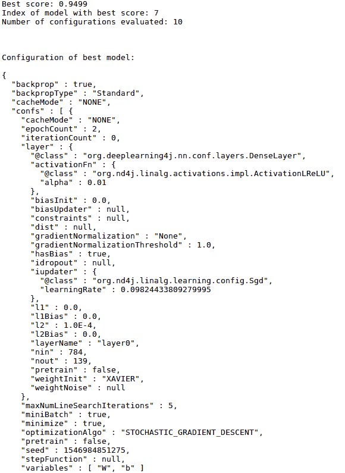
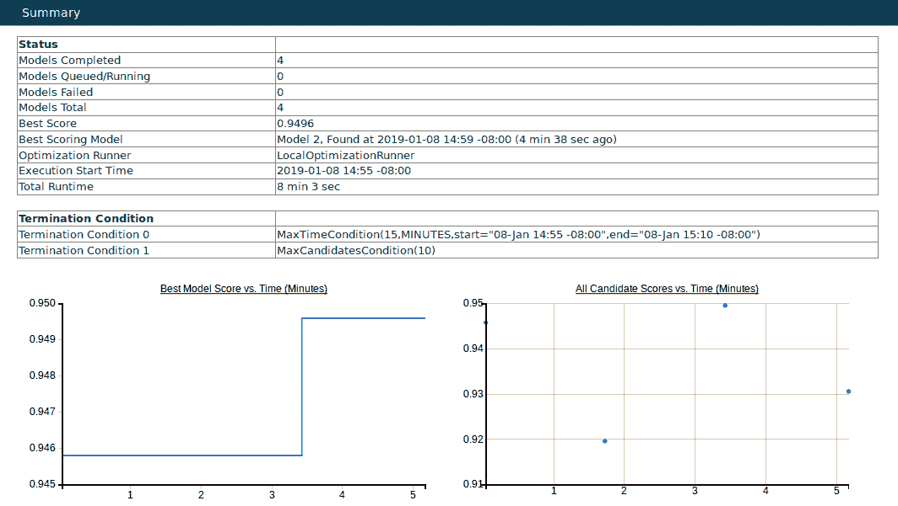
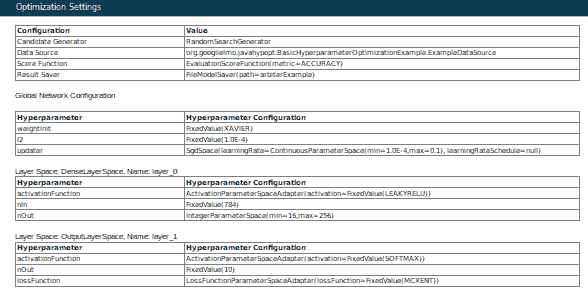
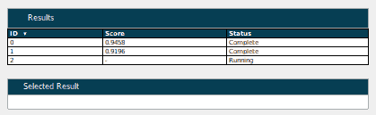
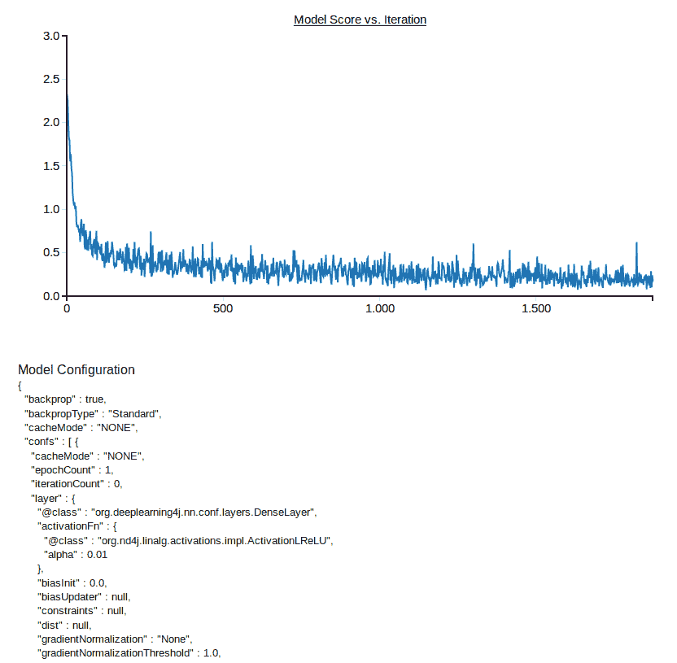

# 第七章：使用 Spark 训练神经网络

在前两章中，我们学习了如何使用**DeepLearning4j**（**DL4J**）API 在 Scala 中编程配置和构建**卷积神经网络**（**CNNs**）和**递归神经网络**（**RNNs**）。在那里提到了这些网络的训练实现，但并没有提供详细的解释。本章最终详细讲解了如何实现这两种网络的训练策略。本章还解释了为什么 Spark 在训练过程中至关重要，以及从性能角度看，DL4J 的基本作用。

本章的第二和第三部分分别聚焦于 CNN 和 RNN 的具体训练策略。第四部分还提供了关于如何正确配置 Spark 环境的建议、技巧和窍门。最后一部分介绍了如何使用 DL4J 的 Arbiter 组件进行超参数优化。

下面是本章将涵盖内容的总结：

+   使用 Spark 和 DL4J 进行 CNN 分布式训练

+   使用 Spark 和 DL4J 进行 RNN 分布式训练

+   性能考虑事项

+   超参数优化

# 使用 Spark 和 DeepLearning4j 进行分布式网络训练

**多层神经网络**（**MNNs**）的训练计算量大—它涉及庞大的数据集，并且需要尽可能快速地完成训练过程。在第一章《Apache Spark 生态系统》中，我们学习了 Apache Spark 如何在进行大规模数据处理时实现高性能。这使得 Spark 成为执行训练的完美选择，能够充分利用其并行特性。但仅有 Spark 是不够的—尽管 Spark 在 ETL 或流处理方面的性能表现优秀，但在 MNN 训练的计算背景下，一些数据转换或聚合需要使用低级语言（如 C++）来完成。

这时，DL4J 的 ND4J 模块（[`nd4j.org/index.html`](https://nd4j.org/index.html)）发挥了作用。无需学习和编程 C++，因为 ND4J 提供了 Scala API，而这些正是我们需要使用的。底层的 C++库对于使用 ND4J 的 Scala 或 Java 开发者是透明的。下面是一个使用 ND4J API 的 Scala 应用程序的简单示例（内联注释解释了代码的功能）：

```py
object Nd4JScalaSample {
  def main (args: Array[String]) {

      // Create arrays using the numpy syntax
      var arr1 = Nd4j.create(4)
      val arr2 = Nd4j.linspace(1, 10, 10)

      // Fill an array with the value 5 (equivalent to fill method in numpy)
      println(arr1.assign(5) + "Assigned value of 5 to the array")

      // Basic stats methods
      println(Nd4j.mean(arr1) + "Calculate mean of array")
      println(Nd4j.std(arr2) + "Calculate standard deviation of array")
      println(Nd4j.`var`(arr2), "Calculate variance")

     ...
```

ND4J 为 JVM 带来了一个开源、分布式、支持 GPU 的直观科学库，填补了 JVM 语言与 Python 程序员之间在强大数据分析工具可用性方面的空白。DL4J 依赖于 Spark 进行并行模型训练。大型数据集被分区，每个分区可供独立的神经网络使用，每个神经网络都在其自己的核心中运行—DL4J 会反复平均它们在中央模型中生成的参数。

为了完整信息，无论训练是否仅要求 DL4J，若在同一服务器上运行多个模型，则应使用 `ParallelWrapper` ([`deeplearning4j.org/api/v1.0.0-beta2/org/deeplearning4j/parallelism/ParallelWrapper.html`](https://deeplearning4j.org/api/v1.0.0-beta2/org/deeplearning4j/parallelism/ParallelWrapper.html))。但请注意，这个过程特别昂贵，服务器必须配备大量的 CPU（至少 64 个）或多个 GPU。

DL4J 提供了以下两个类，用于在 Spark 上训练神经网络：

+   `SparkDl4jMultiLayer` ([`deeplearning4j.org/api/v1.0.0-beta2/org/deeplearning4j/spark/impl/multilayer/SparkDl4jMultiLayer.html`](https://deeplearning4j.org/api/v1.0.0-beta2/org/deeplearning4j/spark/impl/multilayer/SparkDl4jMultiLayer.html))，是 `MultiLayerNetwork` 的封装类（这是在前几章中一些示例中使用的类）。

+   `SparkComputationGraph` ([`deeplearning4j.org/api/v1.0.0-beta2/org/deeplearning4j/spark/impl/graph/SparkComputationGraph.html`](https://deeplearning4j.org/api/v1.0.0-beta2/org/deeplearning4j/spark/impl/graph/SparkComputationGraph.html))，是 `ComputationGraph` ([`deeplearning4j.org/api/v1.0.0-beta2/org/deeplearning4j/nn/graph/ComputationGraph.html`](https://deeplearning4j.org/api/v1.0.0-beta2/org/deeplearning4j/nn/graph/ComputationGraph.html)) 的封装类，`ComputationGraph` 是一种具有任意连接结构（DAG）的神经网络，且可以有任意数量的输入和输出。

这两个类是标准单机类的封装类，因此网络配置过程在标准训练和分布式训练中是相同的。

为了通过 DL4J 在 Spark 集群上训练一个网络，你需要遵循这个标准的工作流程：

1.  通过 `MultiLayerConfiguration` ([`static.javadoc.io/org.deeplearning4j/deeplearning4j-nn/0.9.1/org/deeplearning4j/nn/conf/MultiLayerConfiguration.html`](https://static.javadoc.io/org.deeplearning4j/deeplearning4j-nn/0.9.1/org/deeplearning4j/nn/conf/MultiLayerConfiguration.html)) 类或 `ComputationGraphConfiguration` ([`static.javadoc.io/org.deeplearning4j/deeplearning4j-nn/0.9.1/org/deeplearning4j/nn/conf/ComputationGraphConfiguration.html`](https://static.javadoc.io/org.deeplearning4j/deeplearning4j-nn/0.9.1/org/deeplearning4j/nn/conf/ComputationGraphConfiguration.html)) 类指定网络配置

1.  创建一个 `TrainingMaster` 实例 ([`static.javadoc.io/org.deeplearning4j/dl4j-spark_2.11/0.9.1_spark_2/org/deeplearning4j/spark/api/TrainingMaster.html`](https://static.javadoc.io/org.deeplearning4j/dl4j-spark_2.11/0.9.1_spark_2/org/deeplearning4j/spark/api/TrainingMaster.html))，以控制分布式训练的执行方式

1.  使用网络配置和之前创建的 `TrainingMaster` 对象，创建 `SparkDl4jMultiLayer` 或 `SparkComputationGraph` 实例

1.  加载训练数据

1.  在`SparkDl4jMultiLayer`（或`SparkComputationGraph`）实例上调用适当的 fit 方法

1.  保存训练好的网络

1.  为 Spark 任务构建 JAR 文件

1.  提交 JAR 文件以执行

第五章中展示的代码示例，*卷积神经网络*，和第六章中展示的代码示例，*递归神经网络*，让你了解如何配置和构建 MNN；第三章中展示的代码示例，*提取、转换、加载*，以及第四章中展示的代码示例，*流处理*，让你了解不同方式加载训练数据的思路，而第一章中介绍的内容，*Apache Spark 生态系统*，则让你了解如何执行 Spark 任务。接下来，让我们在接下来的章节中专注于理解如何实现缺失的部分：网络训练。

目前，为了训练网络，DL4J 提供了一种单一的方法——参数平均化（[`arxiv.org/abs/1410.7455`](https://arxiv.org/abs/1410.7455)）。以下是这一过程的概念性步骤：

+   Spark 主节点开始使用网络配置和参数

+   根据`TrainingMaster`的配置，数据被划分为多个子集

+   对于每个子集：

    +   配置和参数从主节点分发到每个工作节点

    +   每个工作节点在其自身的分区上执行 fit 操作

    +   计算参数的平均值，然后将结果返回给主节点

+   训练完成后，已训练的网络副本会保存在主节点中

# 使用 Spark 和 DL4J 进行 CNN 分布式训练

让我们回到在第五章中介绍的例子，*卷积神经网络*，*Spark 实战 CNN*，关于手写数字图像分类的`MNIST`数据集。为了方便起见，下面是该处使用的网络配置的提醒：

```py
val channels = 1
 val outputNum = 10
 val conf = new NeuralNetConfiguration.Builder()
     .seed(seed)
     .iterations(iterations)
     .regularization(true)
     .l2(0.0005)
     .learningRate(.01)
     .weightInit(WeightInit.XAVIER)
     .optimizationAlgo(OptimizationAlgorithm.STOCHASTIC_GRADIENT_DESCENT)
     .updater(Updater.NESTEROVS)
     .momentum(0.9)
     .list
     .layer(0, new ConvolutionLayer.Builder(5, 5)
         .nIn(channels)
         .stride(1, 1)
         .nOut(20)
         .activation(Activation.IDENTITY)
         .build)
     .layer(1, new
     SubsamplingLayer.Builder(SubsamplingLayer.PoolingType.MAX)
         .kernelSize(2, 2)
         .stride(2, 2)
         .build)
     .layer(2, new ConvolutionLayer.Builder(5, 5)
         .stride(1, 1)
         .nOut(50)
         .activation(Activation.IDENTITY)
         .build)
     .layer(3, new
     SubsamplingLayer.Builder(SubsamplingLayer.PoolingType.MAX)
         .kernelSize(2, 2)
         .stride(2, 2)
         .build)
     .layer(4, new DenseLayer.Builder()
         .activation(Activation.RELU)
         .nOut(500)
         .build)
     .layer(5, new
     OutputLayer.Builder(LossFunctions.LossFunction.NEGATIVELOGLIKELIHOOD)
         .nOut(outputNum)
         .activation(Activation.SOFTMAX).build)
         .setInputType(InputType.convolutionalFlat(28, 28, 1))
         .backprop(true).pretrain(false).build
```

我们使用该`MultiLayerConfiguration`对象来初始化模型。拥有模型和训练数据后，可以开始训练。如前一节所述，训练通过 Spark 进行。因此，接下来的步骤是创建 Spark 上下文，如下所示：

```py
val sparkConf = new SparkConf
 sparkConf.setMaster(master)
     .setAppName("DL4J Spark MNIST Example")
 val sc = new JavaSparkContext(sparkConf)
```

然后，我们将训练数据加载到内存中后进行并行化处理，如下所示：

```py
val trainDataList = mutable.ArrayBuffer.empty[DataSet]
 while (trainIter.hasNext) {
     trainDataList += trainIter.next
 }

 val paralleltrainData = sc.parallelize(trainDataList)
```

现在是时候创建`TrainingMaster`实例，如下所示：

```py
var batchSizePerWorker: Int = 16
 val tm = new ParameterAveragingTrainingMaster.Builder(batchSizePerWorker)
     .averagingFrequency(5)
     .workerPrefetchNumBatches(2)      
     .batchSizePerWorker(batchSizePerWorker)
     .build
```

我们可以使用当前唯一可用的`TrainingMaster`接口实现——`ParameterAveragingTrainingMaster`（[`static.javadoc.io/org.deeplearning4j/dl4j-spark_2.11/0.9.1_spark_2/org/deeplearning4j/spark/impl/paramavg/ParameterAveragingTrainingMaster.html`](https://static.javadoc.io/org.deeplearning4j/dl4j-spark_2.11/0.9.1_spark_2/org/deeplearning4j/spark/impl/paramavg/ParameterAveragingTrainingMaster.html)）。在上述示例中，我们只使用了该`TrainingMaster`实现的三个配置选项，但还有更多选项：

+   `dataSetObjectSize`：指定每个`DataSet`中的示例数量。

+   `workerPrefetchNumBatches`：Spark 工作节点能够异步预取一定数量的`DataSet`对象，以避免等待数据加载。通过将此属性设置为零，可以禁用预取。如果将其设置为二（如我们的示例所示），则是一个很好的折衷方案（既不过度使用内存，又能保证合理的默认设置）。

+   `*rddTrainingApproach*`：DL4J 在从 RDD 训练时提供了两种方法——`RDDTrainingApproach.Export`和`RDDTrainingApproach.Direct`（[`static.javadoc.io/org.deeplearning4j/dl4j-spark_2.11/0.9.1_spark_2/org/deeplearning4j/spark/api/RDDTrainingApproach.html`](https://static.javadoc.io/org.deeplearning4j/dl4j-spark_2.11/0.9.1_spark_2/org/deeplearning4j/spark/api/RDDTrainingApproach.html)）。`Export`是默认方法；它首先将`RDD<DataSet>`以批量序列化的形式保存到磁盘上。然后，执行器异步加载所有`DataSet`对象。选择`Export`方法还是`Direct`方法，取决于数据集的大小。对于不适合放入内存的大型数据集以及多轮训练，`Export`方法更为优选——在这种情况下，`Direct`方法的拆分和重分区操作开销并不适用，而且内存消耗较小。

+   `exportDirectory`：临时数据文件存储的位置（仅限`Export`方法）。

+   `storageLevel`：仅在使用`Direct`方法并从`RDD<DataSet>`或`RDD<MultiDataSet>`进行训练时适用。DL4J 持久化*RDD*时的默认存储级别是`StorageLevel.MEMORY_ONLY_SER`。

+   `storageLevelStreams`：仅在使用`fitPaths(RDD<String>)`方法时适用。DL4J 持久化`RDD<String>`时的默认存储级别是`StorageLevel.MEMORY_ONLY`*。

+   `repartitionStrategy`：指定应如何进行重分区操作的策略。可能的值为`Balanced`（默认，DL4J 定义的自定义重分区策略）和`SparkDefault`（Spark 使用的标准重分区策略）。

这里可以找到完整的列表及其含义：

[`deeplearning4j.org/docs/latest/deeplearning4j-spark-training`](https://deeplearning4j.org/docs/latest/deeplearning4j-spark-training)

一旦定义了`TrainingMaster`配置和策略，就可以创建一个`SparkDl4jMultiLayer`实例，如下所示：

```py
val sparkNet = new SparkDl4jMultiLayer(sc, conf, tm)
```

然后可以开始训练，选择适当的`fit`方法，如下所示：

```py
var numEpochs: Int = 15
 var i: Int = 0
     for (i <- 0 until numEpochs) {
     sparkNet.fit(paralleltrainData)
     println("Completed Epoch {}", i)
 }
```

第八章，*监控和调试神经网络训练*，以及第九章，*解释神经网络输出*，将解释如何监控、调试和评估网络训练的结果。

# 使用 Spark 和 DL4J 进行 RNN 分布式训练

让我们重新考虑在第六章中提出的例子，*递归神经网络*，*DL4J 和 Spark 中的 RNN*部分，关于一个 LSTM 模型的训练，该模型将逐个字符地生成文本。为了方便起见，让我们回顾一下那里使用的网络配置（这是 Alex Graves 提出的模型的 LSTM RNN 实现）：

```py
val rng = new Random(12345)
 val lstmLayerSize: Int = 200
 val tbpttLength: Int = 50
 val nSamplesToGenerate: Int = 4
 val nCharactersToSample: Int = 300
 val generationInitialization: String = null
 val conf = new NeuralNetConfiguration.Builder()
     .optimizationAlgo(OptimizationAlgorithm.STOCHASTIC_GRADIENT_DESCENT)
     .iterations(1)
     .learningRate(0.1)
     .rmsDecay(0.95)
     .seed(12345)
     .regularization(true)
     .l2(0.001)
     .weightInit(WeightInit.XAVIER)
     .updater(Updater.RMSPROP)
     .list
     .layer(0, new GravesLSTM.Builder().nIn(SparkLSTMCharacterExample.CHAR_TO_INT.size).nOut(lstmLayerSize).activation(Activation.TANH).build())
     .layer(1, new GravesLSTM.Builder().nIn(lstmLayerSize).nOut(lstmLayerSize).activation(Activation.TANH).build())
     .layer(2, new RnnOutputLayer.Builder(LossFunction.MCXENT).activation(Activation.SOFTMAX)
       .nIn(lstmLayerSize).nOut(SparkLSTMCharacterExample.nOut).build) //MCXENT + softmax for classification
     .backpropType(BackpropType.TruncatedBPTT).tBPTTForwardLength(tbpttLength).tBPTTBackwardLength(tbpttLength)
     .pretrain(false).backprop(true)
     .build
```

在*使用 Spark 和 DeepLearning4j 进行 CNN 分布式训练*中提到的所有关于`TrainingMaster`实例创建和配置的考虑事项，同样适用于`SparkDl4jMultiLayer`实例的创建和配置，因此不再重复。`SparkDl4jMultiLayer`的不同之处在于，在这种情况下，我们必须为模型指定`IteratorListeners`（[`static.javadoc.io/org.deeplearning4j/deeplearning4j-nn/0.9.1/org/deeplearning4j/optimize/api/IterationListener.html`](https://static.javadoc.io/org.deeplearning4j/deeplearning4j-nn/0.9.1/org/deeplearning4j/optimize/api/IterationListener.html)），这对于监控和调试尤其有用，正如在下一章中所解释的那样。按如下方式指定迭代器监听器：

```py
val sparkNetwork: SparkDl4jMultiLayer = new SparkDl4jMultiLayer(sc, conf, tm)
 sparkNetwork.setListeners(Collections.singletonListIterationListener))
```

以下是此情况下训练的一种可能方式。定义训练的轮数，如下所示：

```py
val numEpochs: Int = 10
```

然后，对于每个，使用`sparkNetwork`应用适当的`fit`方法并采样一些字符，如下所示：

```py
(0 until numEpochs).foreach { i =>
     //Perform one epoch of training. At the end of each epoch, we are returned a copy of the trained network
     val net = sparkNetwork.fit(trainingData)

     //Sample some characters from the network (done locally)
     println("Sampling characters from network given initialization \"" +
       (if (generationInitialization == null) "" else generationInitialization) + "\"")
     val samples = ... // Implement your own sampling method

     samples.indices.foreach { j =>
       println("----- Sample " + j + " -----")
       println(samples(j))
     }
 }
```

最后，由于我们选择了`Export`训练方式，完成后需要删除临时文件，如下所示：

```py
tm.deleteTempFiles(sc)
```

第八章，*监控和调试神经网络训练*，以及第九章，*解释神经网络输出*，将解释如何监控、调试和评估该网络训练的结果。

# 性能考虑

本节将介绍一些建议，以便在 Spark 上训练时最大化 DL4J 的性能。我们从内存配置的一些考虑因素开始。首先，了解 DL4J 如何管理内存非常重要。该框架是基于 ND4J 科学库（用 C++ 编写）构建的。ND4J 使用堆外内存管理——这意味着为 `INDArrays` 分配的内存不在 JVM 堆上，如 Java 对象那样，而是分配在 JVM 外部。这种内存管理方式允许高效使用高性能本地代码进行数值操作，并且在运行于 GPU 时也对 CUDA 操作（[`developer.nvidia.com/cuda-zone`](https://developer.nvidia.com/cuda-zone)）至关重要。

通过这种方式，可以清楚地看到额外的内存和时间开销——在 JVM 堆上分配内存要求每次需要先将数据从那里复制出来，然后进行计算，最后将结果复制回去。ND4J 只是传递指针进行数值计算。堆内存（JVM）和堆外内存（通过 JavaCPP 的 ND4J ([`github.com/bytedeco/javacpp`](https://github.com/bytedeco/javacpp))) 是两个独立的内存池。在 DL4J 中，这两者的内存限制是通过 Java 命令行参数，通过以下系统属性进行控制的：

+   `Xms`：JVM 堆在应用程序启动时可以使用的内存

+   `Xmx`：JVM 堆可以使用的最大内存限制

+   `org.bytedeco.javacpp.maxbytes`：堆外最大内存限制

+   `org.bytedeco.javacpp.maxphysicalbytes`：通常设置为与 `maxbytes` 属性相同的值

第十章，*在分布式系统上的部署*，（该章节专注于训练或运行神经网络的分布式系统部署）将详细介绍内存管理。

提高性能的另一个好方法是配置 Spark 的本地性设置。这是一个可选的配置，但可以在这方面带来好处。本地性指的是数据相对于可以处理它的位置。在执行时，每当数据必须通过网络复制到空闲执行器进行处理时，Spark 需要在等待具有本地访问数据的执行器变为空闲状态和执行网络传输之间做出选择。Spark 的默认行为是在通过网络将数据传输到空闲执行器之前稍作等待。

使用 DL4J 训练神经网络计算量大，因此每个输入 `DataSet` 的计算量相对较高。因此，Spark 的默认行为并不适合最大化集群的利用率。在 Spark 训练过程中，DL4J 确保每个执行器只有一个任务——因此，最好是立即将数据传输到空闲的执行器，而不是等待另一个执行器变为空闲。计算时间会变得比任何网络传输时间都更为重要。告诉 Spark 不必等待，而是立即开始传输数据的方法很简单——提交配置时，我们需要将 `spark.locality.wait` 属性的值设置为 `0`。

Spark 在处理具有大堆外组件的 Java 对象时存在问题（例如，在 DL4J 中，`DataSet` 和 `INDArray` 对象可能会遇到此问题），特别是在缓存或持久化它们时。从第一章《Apache Spark 生态系统》一章中你了解到，Spark 提供了不同的存储级别。在这些存储级别中，`MEMORY_ONLY` 和 `MEMORY_AND_DISK` 持久化可能会导致堆外内存问题，因为 Spark 无法正确估算 RDD 中对象的大小，从而导致内存溢出问题。因此，持久化 `RDD<DataSet>` 或 `RDD<INDArray>` 时，采用 `MEMORY_ONLY_SER` 或 `MEMORY_AND_DISK_SER` 是一种好的做法。

让我们详细探讨一下这个问题。Spark 根据估算的块大小来丢弃部分 RDD。它根据选择的持久化级别来估算块的大小。在 `MEMORY_ONLY` 或 `MEMORY_AND_DISK` 的情况下，估算是通过遍历 Java 对象图来完成的。问题在于，这个过程没有考虑到 DL4J 和 ND4J 使用的堆外内存，因此 Spark 低估了对象的真实大小，比如 `DataSets` 或 `INDArrays`。

此外，在决定是否保留或丢弃块时，Spark 仅考虑了堆内存的使用情况。`DataSet` 和 `INDArray` 对象的堆内存占用非常小，因此 Spark 会保留太多此类对象，导致堆外内存耗尽，进而出现内存溢出问题。在 `MEMORY_ONLY_SER` 或 `MEMORY_AND_DISK_SER` 的情况下，Spark 将以序列化形式将块存储在 JVM 堆中。由于序列化的对象没有堆外内存，因此它们的大小可以被 Spark 准确估算——当需要时，Spark 会丢弃块，从而避免内存溢出问题。

Spark 提供了两个序列化库——Java（默认序列化）和 Kryo（[`github.com/EsotericSoftware/kryo`](https://github.com/EsotericSoftware/kryo)）。默认情况下，它使用 Java 的 `ObjectOutputStream` 进行对象序列化（[`docs.oracle.com/javase/8/docs/api/java/io/ObjectOutputStream.html`](https://docs.oracle.com/javase/8/docs/api/java/io/ObjectOutputStream.html)），并且可以与任何实现了序列化接口的类一起工作（[`docs.oracle.com/javase/8/docs/api/java/io/Serializable.html`](https://docs.oracle.com/javase/8/docs/api/java/io/Serializable.html)）。然而，它也可以使用 Kryo 库，Kryo 的序列化速度显著快于 Java 序列化，而且更紧凑。

缺点是 Kryo 并不支持所有的可序列化类型，并且与 ND4J 的堆外数据结构不兼容。因此，如果你希望在 Spark 上使用 Kryo 序列化与 ND4J 配合使用，就需要设置一些额外的配置，以跳过由于某些 `INDArray` 字段的序列化不正确而导致的潜在 `NullPointerExceptions`。要使用 Kryo，你需要将依赖项添加到项目中（以下示例是针对 Maven 的，但你也可以使用 Gradle 或 sbt 以这些构建工具特有的语法导入相同的依赖项），如下所示：

```py
<dependency>
   <groupId>org.nd4j</groupId>
   <artifactId>nd4j-kryo_2.11</artifactId>
   <version>0.9.1</version>
 </dependency>
```

然后配置 Spark 使用 Nd4J Kryo 注册器，如下所示：

```py
val sparkConf = new SparkConf
 sparkConf.set("spark.serializer", "org.apache.spark.serializer.KryoSerializer")
 sparkConf.set("spark.kryo.registrator", "org.nd4j.Nd4jRegistrator")
```

# 超参数优化

在任何训练开始之前，一般的机器学习技术，尤其是深度学习技术，都有一组必须选择的参数。这些被称为超参数。专注于深度学习时，我们可以说，其中一些（如层数及其大小）定义了神经网络的架构，而其他一些则定义了学习过程（如学习率、正则化等）。超参数优化尝试通过使用专用软件应用一些搜索策略来自动化这个过程（该过程对训练神经网络所取得的结果有显著影响）。DL4J 提供了一个名为 Arbiter 的工具，用于神经网络的超参数优化。这个工具并未完全自动化这个过程——数据科学家或开发人员需要手动介入，以指定搜索空间（超参数的有效值范围）。请注意，当前的 Arbiter 实现并不会在那些没有很好地手动定义搜索空间的情况下，阻止寻找好的模型失败。接下来的部分将介绍如何以编程方式使用 Arbiter 的详细信息。

需要将 Arbiter 依赖项添加到需要进行超参数优化的 DL4J Scala 项目中，如下所示：

```py
groupId: org.deeplearning4j
 artifactId: arbiter-deeplearning4j
 version: 0.9.1
```

设置和执行超参数优化的步骤顺序始终是相同的，如下所示：

+   定义超参数搜索空间

+   定义该超参数搜索空间的候选生成器

+   定义数据源

+   定义模型保存器

+   选择一个评分函数

+   选择一个终止条件。

+   使用之前定义的数据源、模型保存器、评分函数和终止条件来构建优化配置。

+   使用优化运行器执行该过程。

现在让我们来看看如何以编程方式实现这些步骤。超参数配置空间的设置与在 DL4J 中配置 MNN 非常相似。它通过`MultiLayerSpace`类（[`deeplearning4j.org/api/latest/org/deeplearning4j/arbiter/MultiLayerSpace.html`](https://deeplearning4j.org/api/latest/org/deeplearning4j/arbiter/MultiLayerSpace.html)）实现。`ParameterSpace<P>`（[`deeplearning4j.org/api/latest/org/deeplearning4j/arbiter/optimize/api/ParameterSpace.html`](https://deeplearning4j.org/api/latest/org/deeplearning4j/arbiter/optimize/api/ParameterSpace.html)）是 Arbiter 类，通过它可以定义给定超参数的可接受值范围。以下是一些示例：

```py
val learningRateHyperparam = new ContinuousParameterSpace(0.0001, 0.1)  
val layerSizeHyperparam = new IntegerParameterSpace(16, 256)
```

在`ParameterSpace`构造函数中指定的上下边界值包含在区间内。区间值将在给定边界之间均匀地随机生成。然后，可以构建超参数空间，如以下示例所示：

```py
val hyperparameterSpace = new MultiLayerSpace.Builder
    .weightInit(WeightInit.XAVIER)
    .l2(0.0001)
    .updater(new SgdSpace(learningRateHyperparam))
    .addLayer(new DenseLayerSpace.Builder
        .nIn(784)
        .activation(Activation.LEAKYRELU)
        .nOut(layerSizeHyperparam)
        .build())
    .addLayer(new OutputLayerSpace.Builder
        .nOut(10)
        .activation(Activation.SOFTMAX)
        .lossFunction(LossFunctions.LossFunction.MCXENT)
        .build)
    .numEpochs(2)
    .build
```

在 DL4J 中，有两个类，`MultiLayerSpace`和`ComputationGraphSpace`（[`deeplearning4j.org/api/latest/org/deeplearning4j/arbiter/ComputationGraphSpace.html`](https://deeplearning4j.org/api/latest/org/deeplearning4j/arbiter/ComputationGraphSpace.html)），可用于设置超参数搜索空间（它们代表`MultiLayerConfiguration`和`ComputationGraphConfiguration`在 MNN 配置中的作用）。

下一步是定义候选生成器。它可以是随机搜索，如以下代码行所示：

```py
val candidateGenerator:CandidateGenerator = new RandomSearchGenerator(hyperparameterSpace, null)
```

或者，它可以是网格搜索。

为了定义数据源（即用于训练和测试不同候选者的数据来源），Arbiter 中提供了`DataSource`接口（[`deeplearning4j.org/api/latest/org/deeplearning4j/arbiter/optimize/api/data/DataSource.html`](https://deeplearning4j.org/api/latest/org/deeplearning4j/arbiter/optimize/api/data/DataSource.html)），并且需要实现它（它需要一个无参构造函数）以适应给定的来源。

目前我们需要定义保存将要生成和测试的模型的位置。Arbiter 支持将模型保存到磁盘或将结果存储在内存中。以下是使用`FileModelSaver`类（[`deeplearning4j.org/api/latest/org/deeplearning4j/arbiter/saver/local/FileModelSaver.html`](https://deeplearning4j.org/api/latest/org/deeplearning4j/arbiter/saver/local/FileModelSaver.html)）保存到磁盘的示例：

```py
val baseSaveDirectory = "arbiterOutput/"
val file = new File(baseSaveDirectory)
if (file.exists) file.delete
file.mkdir
val modelSaver: ResultSaver = new FileModelSaver(baseSaveDirectory)
```

我们必须选择一个评分函数。Arbiter 提供了三种不同的选择——`EvaluationScoreFunction` ([`deeplearning4j.org/api/latest/org/deeplearning4j/arbiter/scoring/impl/EvaluationScoreFunction.html`](https://deeplearning4j.org/api/latest/org/deeplearning4j/arbiter/scoring/impl/EvaluationScoreFunction.html))，`ROCScoreFunction` ([`deeplearning4j.org/api/latest/org/deeplearning4j/arbiter/scoring/impl/ROCScoreFunction.html`](https://deeplearning4j.org/api/latest/org/deeplearning4j/arbiter/scoring/impl/ROCScoreFunction.html))，和 `RegressionScoreFunction` ([`deeplearning4j.org/api/latest/org/deeplearning4j/arbiter/scoring/impl/RegressionScoreFunction.html`](https://deeplearning4j.org/api/latest/org/deeplearning4j/arbiter/scoring/impl/RegressionScoreFunction.html))。

有关评估、ROC 和回归的更多细节将在 第九章，*解读神经网络输出* 中讨论。以下是使用 `EvaluationScoreFunction` 的示例：

```py
val scoreFunction:ScoreFunction = new EvaluationScoreFunction(Evaluation.Metric.ACCURACY)
```

最后，我们指定了一组终止条件。当前的 Arbiter 实现只提供了两个终止条件，`MaxTimeCondition` ([`deeplearning4j.org/api/latest/org/deeplearning4j/arbiter/optimize/api/termination/MaxTimeCondition.html`](https://deeplearning4j.org/api/latest/org/deeplearning4j/arbiter/optimize/api/termination/MaxTimeCondition.html)) 和 `MaxCandidatesCondition` ([`deeplearning4j.org/api/latest/org/deeplearning4j/arbiter/optimize/api/termination/MaxCandidatesCondition.html`](https://deeplearning4j.org/api/latest/org/deeplearning4j/arbiter/optimize/api/termination/MaxCandidatesCondition.html))。当超参数空间满足其中一个指定的终止条件时，搜索会停止。在以下示例中，搜索会在 15 分钟后或在达到 20 个候选项后停止（具体取决于哪个条件先满足）。

发生的第一个条件是：

```py
val terminationConditions = Array(new MaxTimeCondition(15, TimeUnit.MINUTES), new MaxCandidatesCondition(20))
```

现在，所有选项都已设置完毕，可以构建 `OptimizationConfiguration` ([`deeplearning4j.org/api/latest/org/deeplearning4j/arbiter/optimize/config/OptimizationConfiguration.html`](https://deeplearning4j.org/api/latest/org/deeplearning4j/arbiter/optimize/config/OptimizationConfiguration.html))，如下所示：

```py
val configuration: OptimizationConfiguration = new OptimizationConfiguration.Builder
    .candidateGenerator(candidateGenerator)
    .dataSource(dataSourceClass,dataSourceProperties)
    .modelSaver(modelSaver)
    .scoreFunction(scoreFunction)
    .terminationConditions(terminationConditions)
    .build
```

然后通过 `IOptimizationRunner` ([`deeplearning4j.org/api/latest/org/deeplearning4j/arbiter/optimize/runner/IOptimizationRunner.html`](https://deeplearning4j.org/api/latest/org/deeplearning4j/arbiter/optimize/runner/IOptimizationRunner.html)) 运行它，如以下示例所示：

```py
val runner = new LocalOptimizationRunner(configuration, new MultiLayerNetworkTaskCreator())
runner.execute
```

执行结束时，应用程序会将生成的候选项存储在模型保存器初步指定的基础保存目录中的不同子目录里。每个子目录都以递增的数字命名。

参考本节的示例，对于第一个候选者，它将是`./arbiterOutput/0/`，对于第二个候选者，将是`./arbiterOutput/1/`，以此类推。还会生成模型的 JSON 表示（如下图所示），并且可以将其存储以便进一步重复使用：



图 7.1：Arbiter 中的候选者 JSON 序列化

# Arbiter UI

要获取超参数优化的结果，必须等待过程执行结束，然后使用 Arbiter API 来检索它们，如以下示例所示：

```py
val indexOfBestResult: Int = runner.bestScoreCandidateIndex
val allResults = runner.getResults

val bestResult = allResults.get(indexOfBestResult).getResult
val bestModel = bestResult.getResult

println("Configuration of the best model:\n")
println(bestModel.getLayerWiseConfigurations.toJson)
```

但是，具体情况可能不同，这个过程可能会很长，甚至需要几个小时才能结束，并且结果才会变得可用。幸运的是，Arbiter 提供了一个 Web UI，可以在运行时监控它，并获取潜在问题的洞察和优化配置的调优提示，无需在等待过程中浪费时间。为了开始使用这个 Web UI，需要将以下依赖项添加到项目中：

```py
groupId: org.deeplearning4j
 artifactId: arbiter-ui_2.11
 version: 1.0.0-beta3
```

在`IOptimizationRunner`开始之前，需要配置管理 Web UI 的服务器，如下所示：

```py
val ss: StatsStorage = new FileStatsStorage(new File("arbiterUiStats.dl4j"))
runner.addListeners(new ArbiterStatusListener(ss))
UIServer.getInstance.attach(ss)
```

在前面的示例中，我们正在将 Arbiter 统计信息持久化到文件。一旦优化过程开始，Web UI 可以通过以下 URL 访问，如下所示：

```py
http://:9000/arbiter
```

它有一个单一视图，在顶部显示正在进行的优化过程的摘要，如下图所示：



图 7.2：超参数优化过程的实时总结

在其中央区域，它展示了优化设置的总结，如下图所示：



图 7.3：超参数优化设置的摘要

在底部，它显示了结果列表，如下图所示：



图 7.4：超参数优化过程的实时结果总结

通过点击一个结果 ID，显示该特定候选者的额外细节、附加图表以及模型配置，如下图所示：



图 7.5：Arbiter Web UI 中的候选者详情

Arbiter UI 使用与 DL4J UI 相同的实现和持久化策略来监控训练过程。有关这些细节将在下一章中介绍。

# 摘要

在本章中，你已了解了如何使用 DL4J、ND4J 和 Apache Spark 训练 CNN 和 RNN。你现在也了解了内存管理，改进训练过程性能的若干技巧，以及如何使用 Arbiter 进行超参数优化的细节。

下一章将重点讨论如何在 CNN 和 RNN 的训练阶段监控和调试它们。
