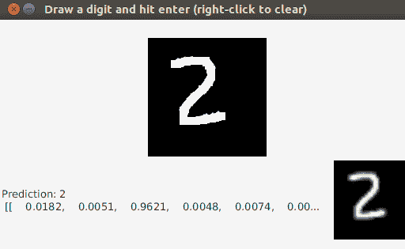
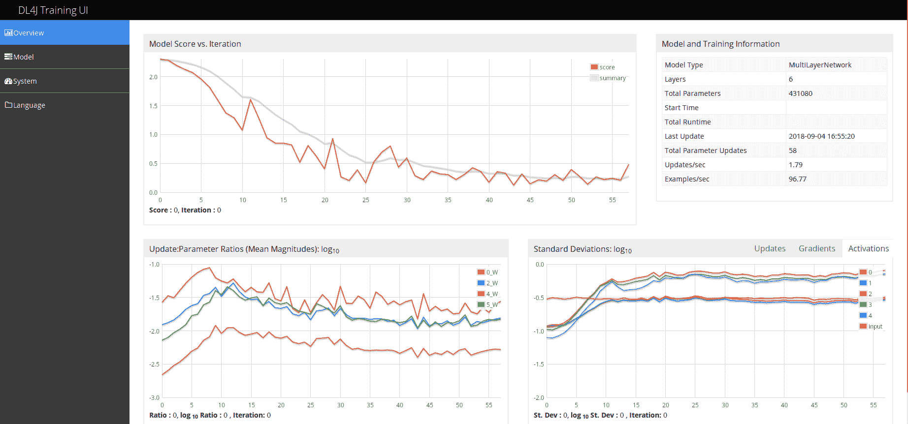
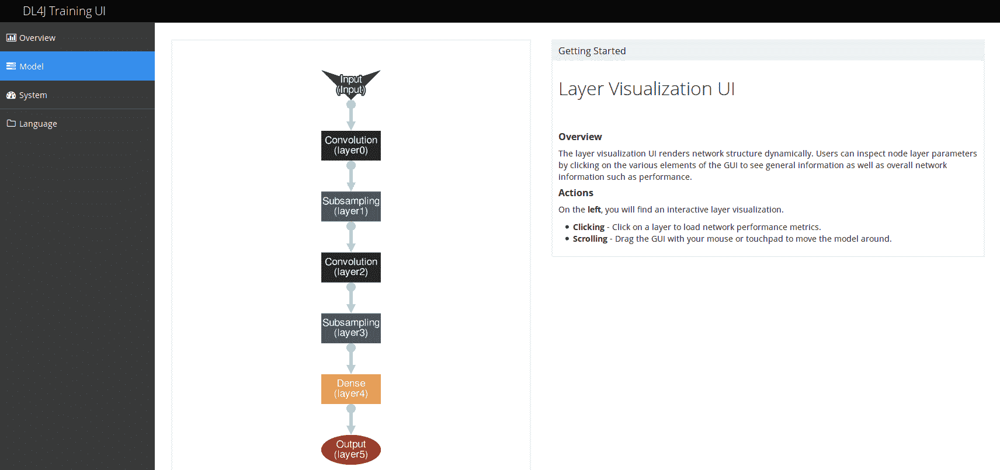
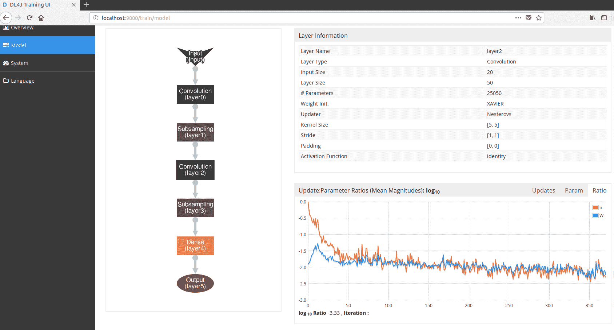
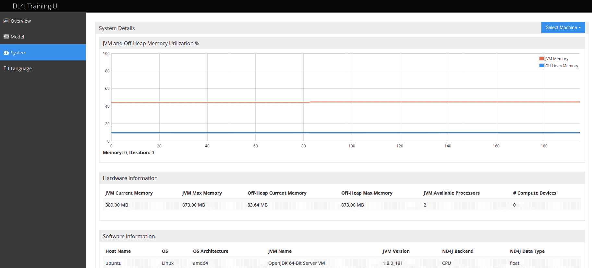
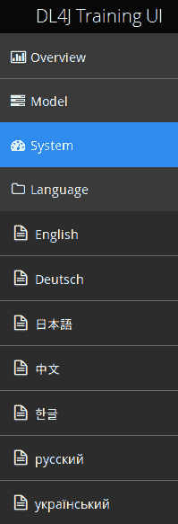
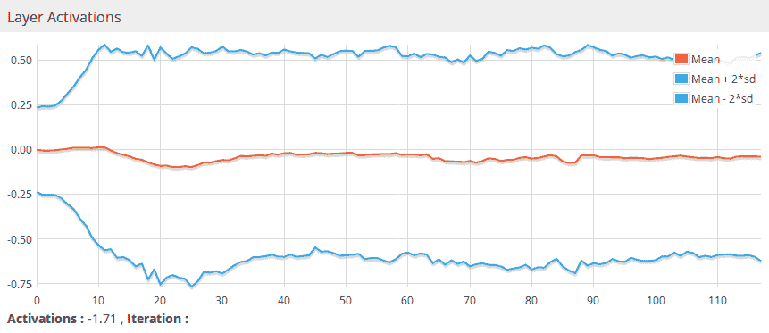
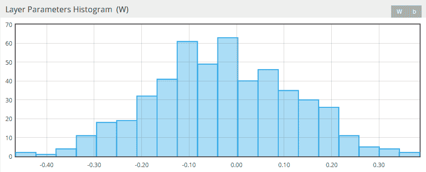
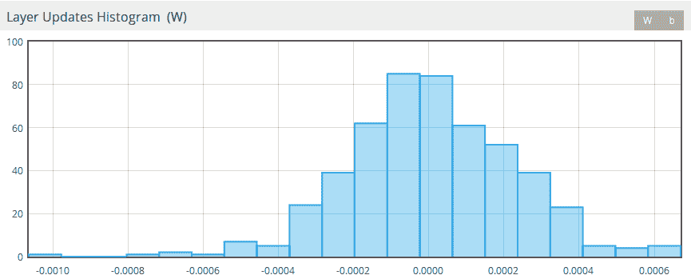

# 第八章：监控和调试神经网络训练

前一章重点介绍了**多层神经网络**（**MNNs**）的训练，并特别展示了 CNN 和 RNN 的代码示例。本章将介绍如何在训练过程中监控网络，以及如何利用这些监控信息来调整模型。DL4J 提供了用于监控和调整的 UI 功能，这将是本章的重点。这些功能也可以在 DL4J 和 Apache Spark 的训练环境中使用。将提供两种情况的示例（仅使用 DL4J 训练和 DL4J 与 Spark 结合使用）。同时，本章还将讨论一些潜在的基础步骤或网络训练的技巧。

# 在神经网络训练阶段进行监控和调试

在第五章，*卷积神经网络*，和第七章，*使用 Spark 训练神经网络*之间，提供了一个完整的例子，涉及 CNN 模型的配置和训练。这是一个图像分类的示例。所使用的训练数据来自`MNIST`数据库。训练集包含 60,000 个手写数字的例子，每张图片都带有一个整数标签。我们将使用相同的例子来展示 DL4J 提供的可视化工具，以便在训练时监控和调试网络。

在训练结束时，你可以通过编程方式将生成的模型保存为 ZIP 压缩包，并调用`ModelSerializer`类的`writeModel`方法（[`static.javadoc.io/org.deeplearning4j/deeplearning4j-nn/0.9.1/org/deeplearning4j/util/ModelSerializer.html`](https://static.javadoc.io/org.deeplearning4j/deeplearning4j-nn/0.9.1/org/deeplearning4j/util/ModelSerializer.html)）：

```py
ModelSerializer.writeModel(net, new File(System.getProperty("user.home") + "/minist-model.zip"), true)
```

生成的压缩包包含三个文件：

+   `configuration.json`：以 JSON 格式表示的模型配置

+   `coefficients.bin`：估算的系数

+   `updaterState.bin`：更新器的历史状态

例如，可以使用 JDK 的 JavaFX 功能（[`en.wikipedia.org/wiki/JavaFX`](https://en.wikipedia.org/wiki/JavaFX)）来实现一个独立的 UI，用于测试在训练网络后构建的模型。查看以下截图：



图 8.1：手写数字分类 CNN 示例的测试 UI

然而，这对于监控目的几乎没什么用处，因为在实际应用中，你可能希望实时查看当前网络状态和训练进展。DL4J 训练 UI 将满足你所有的监控需求，我们将在本章接下来的两节中详细介绍这一功能。上面截图中显示的测试 UI 的实现细节将在下一章中讨论，该章节将讲解网络评估——在阅读过这一部分之后，你会更容易理解这些实现。

# 8.1.1 DL4J 训练 UI

DL4J 框架提供了一个网页用户界面，用于实时可视化当前网络状态和训练进展。它用于帮助理解如何调整神经网络。在本节中，我们将讨论一个仅使用 DL4J 进行 CNN 训练的用例。下一节将展示通过 DL4J 和 Spark 进行训练时的不同之处。

我们首先需要做的是将以下依赖添加到项目中：

```py
groupId = org.deeplearning4j
 artifactId = deeplearning4j-ui_2.11
 version = 0.9.1
```

然后，我们可以开始添加必要的代码。

让我们为 UI 初始化后端：

```py
val uiServer = UIServer.getInstance()
```

配置在训练过程中为网络生成的信息：

```py
val statsStorage:StatsStorage = new InMemoryStatsStorage()
```

在前面的示例中，我们选择将信息存储在内存中。也可以选择将其存储在磁盘上，以便稍后加载使用：

```py
val statsStorage:StatsStorage = new FileStatsStorage(file)
```

添加监听器（[`deeplearning4j.org/api/latest/org/deeplearning4j/ui/stats/StatsListener.html`](https://deeplearning4j.org/api/latest/org/deeplearning4j/ui/stats/StatsListener.html)），这样你可以在网络训练时收集信息：

```py
val listenerFrequency = 1
net.setListeners(new StatsListener(statsStorage, listenerFrequency))
```

最后，为了实现可视化，将`StatsStorage`（[`deeplearning4j.org/api/latest/org/deeplearning4j/ui/storage/InMemoryStatsStorage.html`](https://deeplearning4j.org/api/latest/org/deeplearning4j/ui/storage/InMemoryStatsStorage.html)）实例附加到后端：

```py
uiServer.attach(statsStorage)
```

当训练开始时（执行`fit`方法），可以通过网页浏览器访问 UI，网址为：

```py
http://localhost:<ui_port>/
```

默认监听端口为`9000`。可以通过`org.deeplearning4j.ui.port`系统属性选择不同的端口，例如：

```py
-Dorg.deeplearning4j.ui.port=9999
```

UI 的登陆页面是概览页面：



图 8.2：DL4J UI 的概览页面

如前面的截图所示，页面上有四个不同的部分。在页面的左上方是“得分与迭代”图表，展示了当前小批量的损失函数。在右上方是有关模型及其训练的信息。在左下方，有一个展示所有网络中参数更新比率（按层）的图表，称为“权重与迭代”。该图表中的值以对数底数 10 展示。在右下方是一个图表，展示了更新、梯度和激活的标准差。该图表的值同样以对数底数 10 展示。

UI 的另一个页面是模型页面：



图 8.3：DL4J UI 的模型页面

它展示了神经网络的图形表示。通过点击图中的某一层，可以显示该层的详细信息：



图 8.4：DL4J UI 模型页面中的单层详细信息

在页面的右侧部分，我们可以找到一个包含所选层详细信息的表格，以及一个展示此层参数更新比例的图表（根据概述页面）。向下滚动，我们还可以在同一部分找到其他图表，展示层激活随时间变化的情况、参数的直方图，以及每种参数类型和学习率与时间的更新。

UI 的第三页是系统页面：



图 8.5：DL4J UI 的系统页面

它展示了每台进行训练的机器的系统信息（JVM 和堆外内存利用率百分比、硬件和软件详情）。

UI 的左侧菜单呈现了第四个选项，语言，它列出了此 UI 所支持的所有语言翻译：



图 8.6：DL4J UI 支持的语言列表

# 8.1.2 DL4J 训练 UI 和 Spark

当在技术栈中训练并包括 Spark 时，也可以使用 DL4J UI。与仅使用 DL4J 的情况相比，主要区别在于：一些冲突的依赖关系要求 UI 和 Spark 运行在不同的 JVM 上。这里有两个可能的替代方案：

1.  在运行时收集并保存相关的训练统计信息，然后稍后离线可视化它们。

1.  执行 DL4J UI 并在不同的 JVM（服务器）中使用远程 UI 功能。数据随后会从 Spark 主节点上传到 UI 服务器。

让我们看看如何实现*步骤 1*的替代方案。

一旦 Spark 网络创建完成，让我们参考我们在第五章中展示的 CNN 示例，*卷积神经网络*部分，在*基于 Spark 的 CNN 实战*章节中：

```py
val sparkNet = new SparkDl4jMultiLayer(sc, conf, tm)
```

我们需要创建一个`FileStatsStorage`对象，以便将结果保存到文件中并为 Spark 网络设置监听器：

```py
val ss:StatsStorage = new FileStatsStorage(new File("NetworkTrainingStats.dl4j"))
 sparkNet.setListeners(ss, Collections.singletonList(new StatsListener(null)))
```

接下来，我们可以通过实现以下步骤离线加载并显示已保存的数据：

```py
val statsStorage:StatsStorage = new FileStatsStorage("NetworkTrainingStats.dl4j")
 val uiServer = UIServer.getInstance()
 uiServer.attach(statsStorage)
```

现在，让我们探索一下*步骤 2*的替代方案。

如前所述，UI 服务器需要在单独的 JVM 上运行。从那里，我们需要启动 UI 服务器：

```py
val uiServer = UIServer.getInstance()
```

然后，我们需要启用远程监听器：

```py
uiServer.enableRemoteListener()
```

我们需要设置的依赖项与我们在*DL4J 训练 UI*部分中展示的示例相同（DL4J UI）：

```py
groupId = org.deeplearning4j
 artifactId = deeplearning4j-ui_2.11
 version = 0.9.1
```

在 Spark 应用程序中（我们仍然指的是第五章中展示的 CNN 示例，*卷积神经网络*），在创建了 Spark 网络之后，我们需要创建一个`RemoteUIStatsStorageRouter`的实例（[`static.javadoc.io/org.deeplearning4j/deeplearning4j-core/0.9.1/org/deeplearning4j/api/storage/impl/RemoteUIStatsStorageRouter.html`](https://static.javadoc.io/org.deeplearning4j/deeplearning4j-core/0.9.1/org/deeplearning4j/api/storage/impl/RemoteUIStatsStorageRouter.html)），该实例会异步地将所有更新推送到远程 UI，并最终将其设置为 Spark 网络的监听器：

```py
val sparkNet = new SparkDl4jMultiLayer(sc, conf, tm)
 val remoteUIRouter:StatsStorageRouter = new RemoteUIStatsStorageRouter("http://UI_HOST_IP:UI_HOST_PORT")
 sparkNet.setListeners(remoteUIRouter, Collections.singletonList(new StatsListener(null)))
```

`UI_HOST_IP`是 UI 服务器运行的机器的 IP 地址，`UI_HOST_PORT`是 UI 服务器的监听端口。

为了避免与 Spark 的依赖冲突，我们需要将此应用程序的依赖项添加到依赖列表中，而不是整个 DL4J UI 模型：

```py
groupId = org.deeplearning4j
 artifactId = deeplearning4j-ui-model
 version = 0.9.1
```

选择*步骤 2*的替代方案时，网络的监控发生在训练过程中，并且是实时的，而不是在训练执行完成后离线进行。

DL4J UI 页面和内容与没有 Spark 的网络训练场景中展示的相同（本章*DL4J 训练 UI*部分）。

# 8.1.3 使用可视化调优网络

现在，让我们看看如何解读 DL4J UI 中展示的可视化结果，并利用它们来调优神经网络。我们从概览页面开始。模型得分与迭代图表展示了当前小批量的损失函数，应该随着时间推移而下降（如*图 8.2*中的示例所示）。无论观察到的得分是否应持续增加，学习率可能设得太高。在这种情况下，应降低学习率，直到得分变得更稳定。得分不断增加也可能表明存在其他问题，比如数据归一化不正确。另一方面，如果得分平稳或下降非常缓慢，则表示学习率可能设置得太低，或者优化很困难。在这种情况下，应尝试使用不同的更新器重新进行训练。

在*DL4J 训练 UI*一节中展示的示例中，使用了 Nesterov 动量更新器（见*图 8.4*），并取得了良好的结果（见*图 8.2*）。你可以通过`NeuralNetConfiguration.Builder`类的`updater`方法来更改更新器：

```py
val conf = new NeuralNetConfiguration.Builder()
 ...
     .updater(Updater.NESTEROVS)
```

在这张折线图中，应该预期会有一些噪声，但如果分数在不同的运行之间变化较大，那就成了一个问题。根本原因可能是我们之前提到的一些问题（学习率、归一化）或数据洗牌。另外，将小批量大小设置为非常小的样本数量也会增加图表中的噪声——这也可能导致优化困难。

在训练过程中，其他有助于理解如何调整神经网络的重要信息来自于结合概述页和模型页的一些细节。参数（或更新）的平均幅度是指在给定时间步长下，它们绝对值的平均值。在训练运行时，平均幅度的比率由概述页（对于整个网络）和模型页（对于特定层）提供。当选择学习率时，我们可以使用这些比率值。通常的规则是，大多数网络的比率应接近 0.001（1:1000），在*log[10]*图表（如概述页和模型页中的图表）中，该比率对应于-3。当比率显著偏离此值时，意味着网络参数可能不稳定，或者它们变化太慢，无法学习到有用的特征。通过调整整个网络或一个或多个层的学习率，可以改变平均幅度的比率。

现在，让我们探索模型页中其他有助于调整过程的有用信息。

模型页中的层激活图（见下图）可以用来检测梯度消失或爆炸现象。理想情况下，这个图应该随着时间的推移趋于稳定。激活值的标准差应介于 0.5 和 2.0 之间。

值显著超出此范围表明可能存在数据未归一化、高学习率或权重初始化不当等问题：



图 8.7：模型页的层激活图

模型页中层参数直方图图（权重和偏置，见下图）仅显示最新迭代的结果，提供了其他常见的洞察：



图 8.8：层参数直方图图（权重）

在训练过程中，经过一段时间后，这些权重的直方图应该呈现近似的高斯正态分布，而偏置通常从 0 开始，并最终趋于高斯分布。参数向+/-无穷大发散通常是学习率过高或网络正则化不足的良好指示。偏置变得非常大意味着类别分布非常不平衡。

模型页中的层更新直方图图（权重和偏置，见下图）也仅显示最新迭代的结果，与层参数直方图一样，提供了其他常见的信息：



图 8.9：层更新直方图图（权重）

这与参数图相同——经过一段时间后，它们应该呈现大致的高斯正态分布。非常大的值表示网络中的梯度爆炸。在这种情况下，根本原因可能出在权重初始化、输入或标签数据的归一化，或是学习率上。

# 总结

在本章中，我们已经了解了 DL4J 为神经网络训练时的监控和调优提供的 UI 细节。我们还学习了在使用 DL4J 进行训练时，尤其是在 Apache Spark 参与的情况下，如何使用该 UI。最后，我们理解了从 DL4J UI 页面上展示的图表中可以获得哪些有用的见解，以识别潜在问题以及一些解决方法。

下一章将重点介绍如何评估神经网络，以便我们能理解模型的准确性。在深入探讨通过 DL4J API 和 Spark API 实现的实际示例之前，我们将介绍不同的评估技术。
