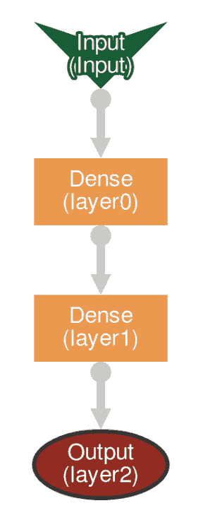

# 第九章：解释神经网络输出

在上一章中，详细描述了如何使用 DL4J UI 来监控和调试**多层神经网络**（**MNN**）。上一章的最后部分也解释了如何解读和使用 UI 图表中的实时可视化结果来调整训练。本章将解释如何在模型训练完成后、投入生产之前评估模型的准确性。对于神经网络，存在多种评估策略。本章涵盖了主要的评估策略及其所有实现，这些实现由 DL4J API 提供。

在描述不同的评估技术时，我尽量减少数学和公式的使用，尽量集中讲解如何使用 DL4J 和 Spark 进行 Scala 实现。

在本章中，我们将覆盖以下主题：

+   解释神经网络的输出

+   使用 DL4J 的评估技术，包括以下内容：

    +   分类评估

    +   在 Spark 环境下的分类评估

    +   DL4J 支持的其他类型评估

# 使用 DL4J 的评估技术

在训练时以及在部署 MNN 之前，了解模型的准确性并理解其性能非常重要。在上一章中，我们了解到，在训练阶段结束时，模型可以保存为 ZIP 归档文件。从那里，可以通过实现自定义 UI 来运行并测试模型，正如*图 8.1*所示（它是通过 JavaFX 功能实现的，示例代码是本书随附的源代码的一部分）。但是，可以利用更为重要的策略来进行评估。DL4J 提供了一个 API，可以用来评估二分类器和多分类器的性能。

本节及其子节涵盖了如何进行分类评估的所有细节（DL4J 和 Spark），而下一节则概述了其他可以进行的评估策略，所有这些策略都依赖于 DL4J API。

# 分类评估

实现评估时，核心的 DL4J 类叫做**evaluation**（[`static.javadoc.io/org.deeplearning4j/deeplearning4j-nn/0.9.1/org/deeplearning4j/eval/Evaluation.html`](https://static.javadoc.io/org.deeplearning4j/deeplearning4j-nn/0.9.1/org/deeplearning4j/eval/Evaluation.html)，是 DL4J NN 模块的一部分）。

本小节所展示的示例所用的数据集是鸢尾花数据集（可以在 [`archive.ics.uci.edu/ml/datasets/iris`](https://archive.ics.uci.edu/ml/datasets/iris) 下载）。这是一个多变量数据集，由英国统计学家和生物学家 Ronald Fisher（[`en.wikipedia.org/wiki/Ronald_Fisher`](https://en.wikipedia.org/wiki/Ronald_Fisher)）于 1936 年引入。该数据集包含 150 条记录——来自三种鸢尾花（Iris setosa、Iris virginica 和 Iris versicolor）的 50 个样本。每个样本测量了四个属性（特征）——萼片和花瓣的长度和宽度（单位：厘米）。该数据集的结构在 第四章 *流式数据* 的 *使用 DL4J 和 Spark 处理流式数据* 部分的示例中使用过。以下是该数据集中包含的一个样本数据：

```py
sepal_length,sepal_width,petal_length,petal_width,species
 5.1,3.5,1.4,0.2,0
 4.9,3.0,1.4,0.2,0
 4.7,3.2,1.3,0.2,0
 4.6,3.1,1.5,0.2,0
 5.0,3.6,1.4,0.2,0
 5.4,3.9,1.7,0.4,0
 ...
```

通常，对于像这样的监督学习情况，数据集会被分为两部分：70% 用于训练，30% 用于计算误差并在必要时修改网络。这对于本节的示例也是如此——我们将使用 70% 的数据集进行网络训练，其余 30% 用于评估。

我们需要做的第一件事是使用 `CSVRecordReader` 获取数据集（输入文件是一个由逗号分隔的记录列表）：

```py
val numLinesToSkip = 1
 val delimiter = ","
 val recordReader = new CSVRecordReader(numLinesToSkip, delimiter)
 recordReader.initialize(new FileSplit(new ClassPathResource("iris.csv").getFile))
```

现在，我们需要将将用于神经网络的数据进行转换：

```py
val labelIndex = 4
 val numClasses = 3
 val batchSize = 150

 val iterator: DataSetIterator = new RecordReaderDataSetIterator(recordReader, batchSize, labelIndex, numClasses)
 val allData: DataSet = iterator.next
 allData.shuffle()
```

输入文件的每一行包含五个值——四个输入特征，后跟一个整数标签（类别）索引。这意味着标签是第五个值（`labelIndex` 是 `4`）。数据集有三种类别，代表三种鸢尾花类型。它们的整数值分别为零（setosa）、一（versicolor）或二（virginica）。

如前所述，我们将数据集分成两部分——70% 的数据用于训练，其余部分用于评估：

```py
val iterator: DataSetIterator = new RecordReaderDataSetIterator(recordReader, batchSize, labelIndex, numClasses)
 val allData: DataSet = iterator.next
 allData.shuffle()
 val testAndTrain: SplitTestAndTrain = allData.splitTestAndTrain(0.70)

 val trainingData: DataSet = testAndTrain.getTrain
 val testData: DataSet = testAndTrain.getTest
```

数据集的拆分通过 ND4J 的 `SplitTestAndTrain` 类 ([`deeplearning4j.org/api/latest/org/nd4j/linalg/dataset/SplitTestAndTrain.html`](https://deeplearning4j.org/api/latest/org/nd4j/linalg/dataset/SplitTestAndTrain.html)) 完成。

我们还需要使用 ND4J 的 `NormalizeStandardize` 类 ([`deeplearning4j.org/api/latest/org/nd4j/linalg/dataset/api/preprocessor/NormalizerStandardize.html`](https://deeplearning4j.org/api/latest/org/nd4j/linalg/dataset/api/preprocessor/NormalizerStandardize.html)) 对输入数据（包括训练集和评估集）进行归一化处理，以便我们得到零均值和标准差为一：

```py
val normalizer: DataNormalization = new NormalizerStandardize
 normalizer.fit(trainingData)
 normalizer.transform(trainingData)
 normalizer.transform(testData)
```

我们现在可以配置并构建模型（一个简单的前馈神经网络）：

```py
val conf = new NeuralNetConfiguration.Builder()
   .seed(seed)
   .activation(Activation.TANH)
   .weightInit(WeightInit.XAVIER)
   .l2(1e-4)
   .list
   .layer(0, new DenseLayer.Builder().nIn(numInputs).nOut(3)
     .build)
   .layer(1, new DenseLayer.Builder().nIn(3).nOut(3)
     .build)
   .layer(2, new OutputLayer.Builder(LossFunctions.LossFunction.NEGATIVELOGLIKELIHOOD)
     .activation(Activation.SOFTMAX)
     .nIn(3).nOut(outputNum).build)
   .backprop(true).pretrain(false)
   .build
```

以下截图显示了本示例中网络的图形表示：



MNN 可以通过从前面的配置开始创建：

```py
val model = new MultiLayerNetwork(conf)
 model.init()
 model.setListeners(new ScoreIterationListener(100))
```

如果我们使用为训练预留的输入数据集的部分（70%），则可以开始训练：

```py
for(idx <- 0 to 2000) {
   model.fit(trainingData)
 }
```

在训练结束时，可以使用输入数据集的保留部分（30%）进行评估：

```py
val eval = new Evaluation(3)
 val output = model.output(testData.getFeatureMatrix)
 eval.eval(testData.getLabels, output)
 println(eval.stats)
```

传递给评估类构造函数的值是评估中需要考虑的类别数——这里是`3`，因为数据集中有`3`个花卉类别。`eval`方法将测试数据集中的标签数组与模型生成的标签进行比较。评估的结果最终会打印到输出中：


默认情况下，`Evaluation`类的`stats`方法会显示混淆矩阵条目（每行一个条目），准确度、精确度、召回率和 F1 分数，但也可以显示其他信息。让我们来谈谈这些`stats`是什么。

**混淆矩阵**是用于描述分类器在测试数据集上表现的表格，其中真实值是已知的。我们来考虑以下示例（对于二分类器）：

| **预测数量 = 200** | **预测为否** | **预测为是** |
| --- | --- | --- |
| 实际: 否 | 55 | 5 |
| 实际: 是 | 10 | 130 |

这些是从上述矩阵中得到的见解：

+   预测类别有两种可能，“是”和“否”

+   分类器总共做出了 200 个预测

+   在这 200 个案例中，分类器预测为是 135 次，预测为否 65 次

+   实际上，样本中有 140 个案例是“是”，60 个是“否”

当这些被翻译成适当的术语时，见解如下：

+   **真阳性** (**TP**)：这些是预测为“是”且实际上是“是”的情况

+   **真阴性** (**TN**)：预测为否，且实际上是否

+   **假阳性** (**FP**)：预测为是，但实际上是否

+   **假阴性** (**FN**)：预测为否，但实际上是是

让我们考虑以下示例：

|  | **预测为否** | **预测为是** |
| --- | --- | --- |
| 实际: 否 | 真阴性 | 假阳性 |
| 实际: 是 | 假阴性 | 真阳性 |

这是通过数字来完成的。可以从混淆矩阵中计算出一组比率。参考本节中的代码示例，它们如下所示：

+   **准确度**：表示分类器正确的频率：*(TP+TN)/总数*。

+   **精确度**：表示分类器预测为正的观测值时，分类器的正确率。

+   **召回率**：评估数据集中所有类别（标签）的平均召回率：*TP/（TP+FN）*。

+   **F1 分数**：这是精确度和召回率的加权平均值。它考虑了假阳性和假阴性：*2 * TP / (2TP + FP + FN)*。

`Evaluation`类还可以显示其他信息，例如 G-measure 或 Matthew 相关系数等等。混淆矩阵也可以显示其完整形式：

```py
println(eval.confusionToString)
```

上述命令返回以下输出：


混淆矩阵也可以直接访问并转换为 CSV 格式：

```py
eval.getConfusionMatrix.toCSV
```

上述命令返回以下输出：


它也可以转换为 HTML 格式：

```py
eval.getConfusionMatrix.toHTML
```

上述命令返回以下输出：


# 分类评估 – Spark 示例

让我们来看另一个分类评估的示例，但在一个涉及 Spark 的上下文中（分布式评估）。我们将完成在 第五章，*卷积神经网络*，在 *使用 Spark 的 CNN 实战* 部分，第七章，*使用 Spark 训练神经网络*，在 *使用 Spark 和 DL4J 的 CNN 分布式训练* 部分，以及 第八章，*监控和调试神经网络训练*，在 *DL4J 训练 UI 和 Spark* 部分展示的示例。记住，这个示例是基于 `MNIST` 数据集训练的手写数字图像分类。

在这些章节中，我们只使用了 `MNIST` 数据集的一部分进行训练，但下载的归档文件还包括一个名为 `testing` 的单独目录，包含了保留用于评估的数据集部分。评估数据集也需要像训练数据集一样进行向量化：

```py
val testData = new ClassPathResource("/mnist_png/testing").getFile
 val testSplit = new FileSplit(testData, NativeImageLoader.ALLOWED_FORMATS, randNumGen)
 val testRR = new ImageRecordReader(height, width, channels, labelMaker)
 testRR.initialize(testSplit)
 val testIter = new RecordReaderDataSetIterator(testRR, batchSize, 1, outputNum)
 testIter.setPreProcessor(scaler)
```

我们需要在评估时将其加载到内存之前进行此操作，并将其并行化：

```py
val testDataList = mutable.ArrayBuffer.empty[DataSet]
 while (testIter.hasNext) {
     testDataList += testIter.next
 }

 val paralleltesnData = sc.parallelize(testDataList)
```

然后，可以通过 `Evaluation` 类进行评估，这正是我们在前一部分示例中所做的：

```py
val sparkNet = new SparkDl4jMultiLayer(sc, conf, tm)

 var numEpochs: Int = 15
 var i: Int = 0
 for (i <- 0 until numEpochs) {
     sparkNet.fit(paralleltrainData)
     val eval = sparkNet.evaluate(parallelTestData)
     println(eval.stats)
     println("Completed Epoch {}", i)
     trainIter.reset
     testIter.reset
 }
```

`Evaluation` 类的 `stas` 方法生成的输出与通过 DL4J 训练和评估的任何其他网络实现相同。例如：


也可以使用 `SparkDl4jMultiLayer` 类的 `doEvaluation` 方法在同一轮次中执行多次评估。该方法需要三个输入参数：要评估的数据（以 `JavaRDD<org.nd4j.linalg.dataset.DataSet>` 的形式），一个空的 `Evaluation` 实例，以及表示评估批量大小的整数。它返回填充后的 `Evaluation` 对象。

# 其他类型的评估

通过 DL4J API 还可以进行其他评估。此部分列出了它们。

也可以通过 `RegressionEvaluation` 类评估执行回归的网络（[`static.javadoc.io/org.deeplearning4j/deeplearning4j-nn/1.0.0-alpha/org/deeplearning4j/eval/RegressionEvaluation.html`](https://static.javadoc.io/org.deeplearning4j/deeplearning4j-nn/1.0.0-alpha/org/deeplearning4j/eval/RegressionEvaluation.html)，DL4J NN）。参考我们在 *分类评估* 部分中使用的示例，回归评估可以按以下方式进行：

```py
val eval = new RegressionEvaluation(3)
 val output = model.output(testData.getFeatureMatrix)
 eval.eval(testData.getLabels, output)
 println(eval.stats)
```

`stats`方法的输出包括 MSE、MAE、RMSE、RSE 和 R²：


**ROC**（即**接收者操作特征**，[`en.wikipedia.org/wiki/Receiver_operating_characteristic`](https://en.wikipedia.org/wiki/Receiver_operating_characteristic)）是另一种常用的分类器评估指标。DL4J 为 ROC 提供了三种不同的实现：

+   `ROC`：[`deeplearning4j.org/api/1.0.0-beta2/org/deeplearning4j/eval/ROC.html`](https://deeplearning4j.org/api/1.0.0-beta2/org/deeplearning4j/eval/ROC.html)，适用于二分类器的实现

+   `ROCBinary`：[`deeplearning4j.org/api/1.0.0-beta2/org/deeplearning4j/eval/ROCBinary.html`](https://deeplearning4j.org/api/1.0.0-beta2/org/deeplearning4j/eval/ROCBinary.html)，适用于多任务二分类器

+   `ROCMultiClass`：[`deeplearning4j.org/api/1.0.0-beta2/org/deeplearning4j/eval/ROCMultiClass.html`](https://deeplearning4j.org/api/1.0.0-beta2/org/deeplearning4j/eval/ROCMultiClass.html)，适用于多类分类器

前面提到的三个类都有计算**ROC 曲线**（**AUROC**）和**精确度-召回曲线**（**AUPRC**）下的面积的能力，计算方法分别是`calculateAUC`和`calculateAUPRC`。这三种 ROC 实现支持两种计算模式：

+   **阈值化**：它使用更少的内存，并近似计算 AUROC 和 AUPRC。这适用于非常大的数据集。

+   **精确**：这是默认设置。它精确，但需要更多的内存。不适合非常大的数据集。

可以将 AUROC 和 AUPRC 导出为 HTML 格式，以便使用网页浏览器查看。需要使用`EvaluationTools`类的`exportRocChartsToHtmlFile`方法（[`deeplearning4j.org/api/1.0.0-beta2/org/deeplearning4j/evaluation/EvaluationTools.html`](https://deeplearning4j.org/api/1.0.0-beta2/org/deeplearning4j/evaluation/EvaluationTools.html)）进行此导出。此方法需要 ROC 实现和一个 File 对象（目标 HTML 文件）作为参数。它会将两条曲线保存在一个 HTML 文件中。

要评估具有二分类输出的网络，可以使用`EvaluationBinary`类（[`deeplearning4j.org/api/1.0.0-beta2/org/deeplearning4j/eval/EvaluationBinary.html`](https://deeplearning4j.org/api/1.0.0-beta2/org/deeplearning4j/eval/EvaluationBinary.html)）。该类为每个输出计算典型的分类指标（准确率、精确度、召回率、F1 得分等）。该类的语法如下：

```py
val size:Int = 1
 val eval: EvaluationBinary = new EvaluationBinary(size)
```

那么，时间序列评估（在 RNN 的情况下）如何呢？它与我们在本章中描述的分类评估方法非常相似。对于 DL4J 中的时间序列，评估是针对所有未被掩盖的时间步进行的。那什么是 RNN 的掩盖？RNN 要求输入具有固定长度。掩盖是一种用于处理这种情况的技术，它标记了缺失的时间步。与之前介绍的其他评估情况的唯一区别是掩盖数组的可选存在。这意味着，在许多时间序列的情况下，你可以直接使用 `MultiLayerNetwork` 类的 `evaluate` 或 `evaluateRegression` 方法——无论是否存在掩盖数组，它们都能正确处理。

DL4J 还提供了一种分析分类器校准的方法——`EvaluationCalibration` 类（[`deeplearning4j.org/api/1.0.0-beta2/org/deeplearning4j/eval/EvaluationCalibration.html`](https://deeplearning4j.org/api/1.0.0-beta2/org/deeplearning4j/eval/EvaluationCalibration.html)）。它提供了一些工具，例如：

+   每个类别的标签和预测数量

+   可靠性图（[`www.bom.gov.au/wmo/lrfvs/reliability.shtml`](http://www.bom.gov.au/wmo/lrfvs/reliability.shtml)）

+   残差图（[`www.statisticshowto.com/residual-plot/`](http://www.statisticshowto.com/residual-plot/)）

+   每个类别的概率直方图

使用此类对分类器的评估与其他评估类的方式类似。可以通过 `EvaluationTools` 类的 `exportevaluationCalibrationToHtmlFile` 方法将其图表和直方图导出为 HTML 格式。此方法需要传入 `EvaluationCalibration` 实例和文件对象（目标 HTML 文件）作为参数。

# 总结

在本章中，我们已经学习了如何使用 DL4J API 提供的不同工具来以编程方式评估模型的效率。我们已经完整地了解了使用 DL4J 和 Apache Spark 实现、训练和评估 MNN 的全过程。

下一章将为我们提供有关分发环境部署、导入和执行预训练的 Python 模型的见解，并对 DL4J 与其他 Scala 编程语言的替代深度学习框架进行比较。
