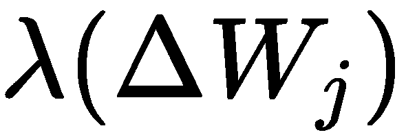

# 第十章：在分布式系统上部署

本书接下来的章节将展示我们迄今为止学到的内容，以便实现一些实际的、现实世界中的 CNN 和 RNN 用例。但在此之前，我们先考虑一下 DL4J 在生产环境中的应用。本章分为四个主要部分：

+   关于 DL4J 生产环境设置的一些考虑，特别关注内存管理、CPU 和 GPU 设置以及训练作业的提交

+   分布式训练架构细节（数据并行性和 DL4J 中实现的策略）

+   在基于 DL4J（JVM）的生产环境中导入、训练和执行 Python（Keras 和 TensorFlow）模型的实际方法

+   DL4J 与几种替代的 Scala 编程语言 DL 框架的比较（特别关注它们在生产环境中的就绪性）

# 配置一个分布式环境与 DeepLearning4j

本节解释了一些设置 DL4J 神经网络模型训练和执行的生产环境时的技巧。

# 内存管理

在第七章，*使用 Spark 训练神经网络*章节中的*性能考虑*部分，我们学习了在训练或运行模型时，DL4J 如何处理内存。由于它依赖于 ND4J，它不仅使用堆内存，还利用堆外内存。作为堆外内存，它位于 JVM 的**垃圾回收**（**GC**）机制管理的范围之外（内存分配在 JVM 外部）。在 JVM 层面，只有指向堆外内存位置的指针；这些指针可以通过 Java 本地接口（JNI， [`docs.oracle.com/javase/8/docs/technotes/guides/jni/spec/jniTOC.html`](https://docs.oracle.com/javase/8/docs/technotes/guides/jni/spec/jniTOC.html)）传递给 C++代码，用于 ND4J 操作。

在 DL4J 中，可以使用两种不同的方法来管理内存分配：

+   JVM 垃圾回收（GC）和弱引用跟踪

+   内存工作空间

本节将涵盖这两种方法。它们的思想是相同的：一旦`INDArray`不再需要，应该释放与其相关的堆外内存，以便可以重复使用。两种方法之间的区别如下：

+   **JVM 垃圾回收（GC）**：当`INDArray`被垃圾回收器回收时，它的堆外内存会被释放，假设该内存不会在其他地方使用

+   **内存工作空间**：当`INDArray`离开工作空间范围时，它的堆外内存可以被重用，而无需进行释放和重新分配

请参考第七章，*使用 Spark 训练神经网络*章节中的*性能考虑*部分，了解如何配置堆内存和堆外内存的限制。

内存工作空间的方式需要更多解释。与 JVM 垃圾回收方法相比，它在循环工作负载的性能方面提供了最佳的结果。在工作空间内，任何操作都可以与 `INDArrays` 一起进行。然后，在工作空间循环结束时，内存中所有 `INDArrays` 的内容都会失效。是否需要在工作空间外部使用 `INDArray`（当需要将结果移出工作空间时，可能会出现这种情况），可以使用 `INDArray` 本身的 `detach` 方法来创建它的独立副本。

从 DL4J 1.0.0-alpha 版本开始，工作空间默认启用。对于 DL4J 0.9.1 或更早版本，使用工作空间需要先进行激活。在 DL4J 0.9.1 中，在网络配置时，工作空间可以这样激活（用于训练）：

```py
val conf = new NeuralNetConfiguration.Builder()
     .trainingWorkspaceMode(WorkspaceMode.SEPARATE)
```

或者在推理时，可以按以下方式激活：

```py
val conf = new NeuralNetConfiguration.Builder()
     .inferenceWorkspaceMode(WorkspaceMode.SINGLE)
```

`SEPARATE` 工作空间较慢，但使用的内存较少，而 `SINGLE` 工作空间较快，但需要更多的内存。选择 `SEPARATE` 和 `SINGLE` 之间的权衡，取决于你对内存占用和性能的平衡。在启用工作空间时，训练过程中使用的所有内存都会被重用并进行跟踪，且不受 JVM 垃圾回收的干扰。只有 `output` 方法，内部使用工作空间来进行前向传播循环，才是例外，但它会将生成的 `INDArray` 从工作空间中分离出来，这样它就可以由 JVM 垃圾回收器处理。从 1.0.0-beta 版本开始，`SEPARATE` 和 `SINGLE` 模式已被弃用，现有的模式是 `ENABLED`（默认）和 `NONE`。

请记住，当训练过程使用工作空间时，为了最大限度地利用这种方法，需要禁用定期的垃圾回收调用，具体如下：

```py
Nd4j.getMemoryManager.togglePeriodicGc(false)
```

或者它们的频率需要减少，具体如下：

```py
val gcInterval = 10000 // In milliseconds
 Nd4j.getMemoryManager.setAutoGcWindow(gcInterval)
```

该设置应在调用模型的 `fit` 方法进行训练之前进行。工作空间模式也适用于 `ParallelWrapper`（在仅要求 DL4J 进行训练的情况下，在同一服务器上运行多个模型）。

在某些情况下，为了节省内存，可能需要释放在训练或评估期间创建的所有工作空间。这可以通过调用 `WorkspaceManager` 的以下方法来完成：

```py
Nd4j.getWorkspaceManager.destroyAllWorkspacesForCurrentThread
```

它会销毁调用线程中创建的所有工作空间。可以使用相同的方法在不再需要的外部线程中销毁创建的工作空间。

在 DL4J 1.0.0-alpha 版本及以后版本中，使用 `nd4j-native` 后端时，还可以使用内存映射文件代替 RAM。虽然这比较慢，但它允许以一种使用 RAM 无法实现的方式进行内存分配。这种选项主要适用于那些 `INDArrays` 无法放入 RAM 的情况。以下是如何以编程方式实现：

```py
val mmap = WorkspaceConfiguration.builder
    .initialSize(1000000000)
    .policyLocation(LocationPolicy.MMAP)
    .build

try (val ws = Nd4j.getWorkspaceManager.getAndActivateWorkspace(mmap, "M2")) {
    val ndArray = Nd4j.create(20000) //INDArray
}
```

在这个例子中，创建了一个 2 GB 的临时文件，映射了一个工作空间，并在该工作空间中创建了 `ndArray` `INDArray`。

# CPU 和 GPU 设置

正如本书前面所提到的，任何通过 DL4J 实现的应用程序都可以在 CPU 或 GPU 上执行。要从 CPU 切换到 GPU，需要更改 ND4J 的应用程序依赖。以下是 CUDA 9.2 版本（或更高版本）和支持 NVIDIA 硬件的示例（该示例适用于 Maven，但相同的依赖关系也可以用于 Gradle 或 sbt），如下所示：

```py
<dependency>
 <groupId>org.nd4j</groupId>
 <artifactId>nd4j-cuda-9.2</artifactId>
 <version>0.9.1</version>
</dependency>
```

这个依赖替代了`nd4j-native`的依赖。

当你的系统中有多个 GPU 时，是否应该限制它们的使用并强制在一个 GPU 上执行，可以通过`nd4j-cuda`库中的`CudaEnvironment`助手类([`deeplearning4j.org/api/latest/org/nd4j/jita/conf/CudaEnvironment.html`](https://deeplearning4j.org/api/latest/org/nd4j/jita/conf/CudaEnvironment.html))以编程方式进行更改。以下代码行需要作为 DL4J 应用程序入口点的第一条指令执行：

```py
CudaEnvironment.getInstance.getConfiguration.allowMultiGPU(true)
```

在第 10.1.1 节中，我们已经学习了如何在 DL4J 中配置堆内存和堆外内存。在 GPU 执行时需要考虑一些问题。需要明确的是，命令行参数`org.bytedeco.javacpp.maxbytes`和`org.bytedeco.javacpp.maxphysicalbytes`定义了 GPU 的内存限制，因为对于`INDArrays`，堆外内存被映射到 GPU 上（使用的是`nd4j-cuda`）。

同样，在 GPU 上运行时，JVM 堆内存的使用量通常较少，而堆外内存的使用量较多，因为所有的`INDArrays`都存储在堆外内存中。如果将太多内存分配给 JVM 堆内存，可能会导致堆外内存不足的风险。在进行适当设置时，在某些情况下，执行可能会导致以下异常：

```py
RuntimeException: Can't allocate [HOST] memory: [memory]; threadId: [thread_id];
```

这意味着我们的堆外内存已经用完。在这种情况下（特别是在训练过程中），我们需要考虑使用`WorkspaceConfiguration`来处理`INDArrays`的内存分配（如在*内存管理*部分所学）。如果不这样做，`INDArrays`及其堆外资源将通过 JVM GC 机制回收，这可能会显著增加延迟，并产生其他潜在的内存不足问题。

设置内存限制的命令行参数是可选的。如果没有指定，默认情况下，堆内存的限制为总系统内存的 25%，而堆外内存的限制是堆内存的两倍。我们需要根据实际情况找到最佳平衡，特别是在 GPU 执行时，考虑`INDArrays`所需的堆外内存。

通常，CPU 内存大于 GPU 内存。因此，需要监控多少内存被用作堆外内存。DL4J 会在 GPU 上分配与通过上述命令行参数指定的堆外内存相等的内存。为了提高 CPU 和 GPU 之间的通信效率，DL4J 还会在 CPU 内存上分配堆外内存。这样，CPU 就可以直接访问 `INDArray` 中的数据，而无需每次都从 GPU 获取数据。

然而，有一个警告：如果 GPU 的内存少于 2 GB，那么它可能不适合用于深度学习（DL）生产工作负载。在这种情况下，应使用 CPU。通常，深度学习工作负载至少需要 4 GB 的内存（推荐在 GPU 上使用 8 GB 的内存）。

另一个需要考虑的因素是：使用 CUDA 后端并通过工作区，也可以使用 `HOST_ONLY` 内存。从编程角度来看，可以通过以下示例进行设置：

```py
val basicConfig = WorkspaceConfiguration.builder
   .policyAllocation(AllocationPolicy.STRICT)
   .policyLearning(LearningPolicy.FIRST_LOOP)
   .policyMirroring(MirroringPolicy.HOST_ONLY)
   .policySpill(SpillPolicy.EXTERNAL)
   .build
```

这样会降低性能，但在使用 `INDArray` 的 `unsafeDuplication` 方法时，它可以作为内存缓存对来使用，`unsafeDuplication` 方法能够高效地（但不安全地）进行 `INDArray` 复制。

# 构建一个作业并提交给 Spark 进行训练

在这个阶段，我假设你已经开始浏览并尝试本书相关的 GitHub 仓库中的代码示例（[`github.com/PacktPublishing/Hands-On-Deep-Learning-with-Apache-Spark`](https://github.com/PacktPublishing/Hands-On-Deep-Learning-with-Apache-Spark)）。如果是这样，你应该已经注意到所有 Scala 示例都使用 Apache Maven（[`maven.apache.org/`](https://maven.apache.org/)）进行打包和依赖管理。在本节中，我将使用这个工具来构建一个 DL4J 作业，然后将其提交给 Spark 来训练模型。

一旦你确认开发的作业已经准备好在目标 Spark 集群中进行训练，首先要做的是构建 uber-JAR 文件（也叫 fat JAR 文件），它包含 Scala DL4J Spark 程序类和依赖项。检查项目 POM 文件中的 `<dependencies>` 块，确保所有必需的 DL4J 依赖项都已列出。确保选择了正确版本的 dl4j-Spark 库；本书中的所有示例都旨在与 Scala 2.11.x 和 Apache Spark 2.2.x 一起使用。代码应如下所示：

```py
<dependency>
     <groupId>org.deeplearning4j</groupId>
     <artifactId>dl4j-spark_2.11</artifactId>
     <version>0.9.1_spark_2</version>
</dependency>
```

如果你的项目 POM 文件以及其他依赖项包含对 Scala 和/或任何 Spark 库的引用，请将它们的作用域声明为 `provided`，因为它们已经在集群节点上可用。这样，uber-JAR 文件会更轻。

一旦检查了正确的依赖项，你需要在 POM 文件中指示如何构建 uber-JAR。构建 uber-JAR 有三种技术：unshaded、shaded 和 JAR of JARs。对于本案例，最好的方法是使用 shaded uber-JAR。与 unshaded 方法一样，它适用于 Java 默认的类加载器（因此无需捆绑额外的特殊类加载器），但它的优点是跳过某些依赖版本冲突，并且在多个 JAR 中存在相同路径的文件时，可以对其应用追加转换。Shading 可以通过 Maven 的 Shade 插件实现（[`maven.apache.org/plugins/maven-shade-plugin/`](http://maven.apache.org/plugins/maven-shade-plugin/)）。该插件需要在 POM 文件的`<plugins>`部分注册，方法如下：

```py
<plugin>
    <groupId>org.apache.maven.plugins</groupId>
    <artifactId>maven-shade-plugin</artifactId>
    <version>3.2.1</version>
    <configuration>
      <!-- put your configurations here -->
    </configuration>
    <executions>
      <execution>
        <phase>package</phase>
        <goals>
          <goal>shade</goal>
        </goals>
      </execution>
    </executions>
</plugin>
```

当发出以下命令时，本插件会执行：

```py
mvn package -DskipTests
```

在打包过程结束时，插件的最新版本会用 uber-JAR 替换精简版 JAR，并将其重命名为原始文件名。对于具有以下坐标的项目，uber-JAR 的名称将为`rnnspark-1.0.jar`*：*

```py
<groupId>org.googlielmo</groupId>
<artifactId>rnnspark</artifactId>
<version>1.0</version>
```

精简版 JAR 依然会被保留，但它会被重命名为`original-rnnspark-1.0.jar`。它们都可以在项目根目录的`target`子目录中找到。

然后，JAR 可以通过`spark-submit`脚本提交到 Spark 集群进行训练，与提交任何其他 Spark 作业的方式相同，如下所示：

```py
$SPARK_HOME/bin/spark-submit --class <package>.<class_name> --master <spark_master_url> <uber_jar>.jar
```

# Spark 分布式训练架构细节

第七章中的*分布式网络训练与 Spark 和 DeepLearning4J*部分，*使用 Spark 训练神经网络*，解释了为什么将 MNNs（神经网络模型）以分布式方式在集群中进行训练是重要的，并指出 DL4J 采用了参数平均方法进行并行训练。本节详细介绍了分布式训练方法的架构细节（参数平均和梯度共享，后者从 DL4J 框架的 1.0.0-beta 版本开始替代了参数平均方法）。虽然 DL4J 的分布式训练方式对开发者是透明的，但了解它仍然是有益的。

# 模型并行性和数据并行性

并行化/分布式训练计算可以通过**模型并行性**或**数据并行性**来实现。

在模型并行性（见下图）中，集群的不同节点负责单个 MNN（神经网络模型）中不同部分的计算（例如，每一层网络分配给不同的节点）：


图 10.1：模型并行性

在数据并行性（见下图）中，不同的集群节点拥有网络模型的完整副本，但它们获取不同子集的训练数据。然后，来自每个节点的结果会被合并，如下图所示：


图 10.2：数据并行性

这两种方法也可以结合使用，它们并不相互排斥。模型并行性在实践中效果很好，但对于分布式训练，数据并行性是首选；实施、容错和优化集群资源利用等方面（仅举几例）在数据并行性中比在模型并行性中更容易实现。

数据并行性方法需要某种方式来合并结果并同步各工作节点的模型参数。在接下来的两个小节中，我们将探讨 DL4J 中已实现的两种方法（参数平均化和梯度共享）。

# 参数平均化

参数平均化按以下方式进行：

1.  主节点首先根据模型配置初始化神经网络参数

1.  然后，它将当前参数的副本分发给每个工作节点

1.  每个工作节点使用其自己的数据子集开始训练

1.  主节点将全局参数设置为每个工作节点的平均参数

1.  在需要处理更多数据的情况下，流程将从*步骤 2*重新开始

下图展示了从*步骤 2*到*步骤 4*的表示：


图 10.3：参数平均化

在此图中，*`W`*表示网络中的参数（权重和偏置）。在 DL4J 中，这一实现使用了 Spark 的 TreeAggregate（[`umbertogriffo.gitbooks.io/apache-spark-best-practices-and-tuning/content/treereduce_and_treeaggregate_demystified.html`](https://umbertogriffo.gitbooks.io/apache-spark-best-practices-and-tuning/content/treereduce_and_treeaggregate_demystified.html)）。

参数平均化是一种简单的方法，但它带来了一些挑战。最直观的平均化方法是每次迭代后直接对参数进行平均。虽然这种方法是可行的，但增加的开销可能非常高，网络通信和同步成本可能会抵消通过增加额外节点来扩展集群的任何好处。因此，参数平均化通常会在平均周期（每个工作节点的最小批次数量）大于一时实现。如果平均周期过于稀疏，每个工作节点的局部参数可能会显著偏离，导致模型效果不佳。合适的平均周期通常是每个工作节点每 10 到 20 次最小批次中进行一次。另一个挑战与优化方法（DL4J 的更新方法）相关。已有研究表明，这些方法（[`ruder.io/optimizing-gradient-descent/`](http://ruder.io/optimizing-gradient-descent/)）能够改善神经网络训练过程中的收敛性。但它们有一个内部状态，也可能需要进行平均化。这将导致每个工作节点的收敛速度更快，但代价是网络传输的大小翻倍。

# 异步随机梯度共享

异步随机梯度共享是最新版本的 DL4J（以及未来版本）所选择的方法。异步随机梯度共享和参数平均的主要区别在于，在异步随机梯度共享中，更新而不是参数被从工作者传递到参数服务器。从架构角度来看，这与参数平均类似（参见下图）：


图 10.4：异步随机梯度共享架构

不同之处在于计算参数的公式：


在这里， 是缩放因子。通过允许将更新  在计算完成后立即应用到参数向量，从而得到异步随机梯度共享算法。

异步随机梯度共享的主要优点之一是，它可以在分布式系统中获得更高的吞吐量，而无需等待参数平均步骤完成，从而使工作者可以花更多时间进行有用的计算。另一个优点是：与同步更新的情况相比，工作者可以更早地结合来自其他工作者的参数更新。

异步随机梯度共享的一个缺点是所谓的陈旧梯度问题。梯度（更新）的计算需要时间，当一个工作者完成计算并将结果应用到全局参数向量时，参数可能已经更新了不止一次（这个问题在参数平均中看不出来，因为参数平均是同步的）。为了解决陈旧梯度问题，已经提出了几种方法。其中一种方法是根据梯度的陈旧程度，针对每次更新单独调整值 。另一种方法称为软同步：与其立即更新全局参数向量，参数服务器会等待收集来自任何学习者的一定数量的更新。然后，通过该公式更新参数：


在这里，`s` 是参数服务器等待收集的更新数量， 是与陈旧程度相关的标量缩放因子。

在 DL4J 中，尽管参数平均实现一直是容错的，但从 1.0.0-beta3 版本开始，梯度共享实现已完全具备容错能力。

# 将 Python 模型导入到 JVM 中使用 DL4J

在上一章中，我们已经学习了在配置、构建和训练多层神经网络模型时，DL4J API 是如何强大且易于使用的。仅依靠这个框架，在 Scala 或 Java 中实现新模型的可能性几乎是无穷无尽的。

但是，让我们来看一下 Google 的以下搜索结果；它们是关于网络上可用的 TensorFlow 神经网络模型：


图 10.5：关于 TensorFlow 神经网络模型的 Google 搜索结果

你可以看到，从结果来看，这是一个相当令人印象深刻的数字。而这只是一个原始搜索。将搜索精炼到更具体的模型实现时，数字会更高。但什么是 TensorFlow？TensorFlow ([`www.tensorflow.org/`](https://www.tensorflow.org/)) 是一个功能强大且全面的开源框架，专为机器学习（ML）和深度学习（DL）开发，由 Google Brain 团队研发。目前，它是数据科学家最常用的框架。因此，它拥有庞大的社区，许多共享的模型和示例可以使用。这也解释了这些庞大的数字。在这些模型中，找到一个符合你特定使用场景需求的预训练模型的几率是很高的。那么，问题在哪里呢？TensorFlow 主要是 Python。

它也支持其他编程语言，比如 Java（适用于 JVM），但是它的 Java API 目前还处于实验阶段，并且不包含在 TensorFlow 的 API 稳定性保证中。此外，TensorFlow 的 Python API 对于没有 Python 开发经验的开发者和没有或只有基础数据科学背景的软件工程师来说，学习曲线较为陡峭。那么，他们如何能从这个框架中受益呢？我们如何在基于 JVM 的环境中复用现有的有效模型？Keras ([`keras.io/`](https://keras.io/)) 来解救了我们。它是一个开源的高层神经网络库，用 Python 编写，可以用来替代 TensorFlow 的高层 API（下图展示了 TensorFlow 框架架构）：


图 10.6：TensorFlow 架构

相较于 TensorFlow，Keras 更加轻量，且更易于原型开发。它不仅可以运行在 TensorFlow 之上，还可以运行在其他后端 Python 引擎上。而且，Keras 还可以用于将 Python 模型导入到 DL4J。Keras 模型导入 DL4J 库提供了导入通过 Keras 框架配置和训练的神经网络模型的功能。

以下图示展示了一旦模型被导入到 DL4J 后，可以使用完整的生产堆栈来使用它：


图 10.7：将 Keras 模型导入 DL4J

现在，我们来详细了解这一过程。对于本节中的示例，我假设你已经在机器上安装了 Python 2.7.x 和 `pip`（[`pypi.org/project/pip/`](https://pypi.org/project/pip/)）包管理器。为了在 Keras 中实现模型，我们必须先安装 Keras 并选择一个后端（此处示例选择 TensorFlow）。必须首先安装 TensorFlow，如下所示：

```py
sudo pip install tensorflow
```

这仅适用于 CPU。如果你需要在 GPU 上运行，需要安装以下内容：

```py
sudo pip install tensorflow-gpu
```

现在，我们可以安装 Keras，如下所示：

```py
sudo pip install keras
```

Keras 使用 TensorFlow 作为默认的张量操作库，因此如果我们选择 TensorFlow 作为后端，就无需采取额外的操作。

我们从简单的开始，使用 Keras API 实现一个 MLP 模型。在进行必要的导入后，输入以下代码：

```py
from keras.models import Sequential
 from keras.layers import Dense
```

我们创建一个 `Sequential` 模型，如下所示：

```py
model = Sequential()
```

然后，我们通过 `Sequential` 的 `add` 方法添加层，如下所示：

```py
model.add(Dense(units=64, activation='relu', input_dim=100))
 model.add(Dense(units=10, activation='softmax'))
```

该模型的学习过程配置可以通过 `compile` 方法完成，如下所示：

```py
model.compile(loss='categorical_crossentropy',
               optimizer='sgd',
               metrics=['accuracy'])
```

最后，我们将模型序列化为 HDF5 格式，如下所示：

```py
model.save('basic_mlp.h5')
```

**层次数据格式** (**HDF**) 是一组文件格式（扩展名为 .hdf5 和 .h5），用于存储和管理大量数据，特别是多维数字数组。Keras 使用它来保存和加载模型。

保存这个简单程序 `basic_mlp.py` 并运行后，模型将被序列化并保存在 `basic_mlp.h5` 文件中：

```py
sudo python basic_mlp.py
```

现在，我们准备好将此模型导入到 DL4J 中。我们需要将通常的 DataVec API、DL4J 核心和 ND4J 依赖项，以及 DL4J 模型导入库添加到 Scala 项目中，如下所示：

```py
groupId: org.deeplearning4j
 artifactId: deeplearning4j-modelimport
 version: 0.9.1
```

将 `basic_mlp.h5` 文件复制到项目的资源文件夹中，然后通过编程方式获取其路径，如下所示：

```py
val basicMlp = new ClassPathResource("basic_mlp.h5").getFile.getPath
```

然后，通过 `KerasModelImport` 类的 `importKerasSequentialModelAndWeights` 方法（[`static.javadoc.io/org.deeplearning4j/deeplearning4j-modelimport/1.0.0-alpha/org/deeplearning4j/nn/modelimport/keras/KerasModelImport.html`](https://static.javadoc.io/org.deeplearning4j/deeplearning4j-modelimport/1.0.0-alpha/org/deeplearning4j/nn/modelimport/keras/KerasModelImport.html)）将模型加载为 DL4J 的 `MultiLayerNetwork`，如下所示：

```py
val model = KerasModelImport.importKerasSequentialModelAndWeights(basicMlp)
```

生成一些模拟数据，如下所示：

```py
val input = Nd4j.create(256, 100)
 var output = model.output(input)
```

现在，我们可以像往常一样在 DL4J 中训练模型，如下所示：

```py
model.fit(input, output)
```

在 第七章，《使用 Spark 训练神经网络》，第八章，《监控与调试神经网络训练》，和 第九章，《解释神经网络输出》中关于训练、监控和评估 DL4J 的内容，也适用于这里。

当然，也可以在 Keras 中训练模型（如下示例）：

```py
model.fit(x_train, y_train, epochs=5, batch_size=32)
```

在这里，`x_train` 和 `y_train` 是 NumPy ([`www.numpy.org/`](http://www.numpy.org/)) 数组，并在保存为序列化格式之前进行评估，方法如下：

`loss_and_metrics = model.evaluate(x_test, y_test, batch_size=128)`

你可以像之前所解释的那样，导入预训练模型，然后直接运行它。

与 `Sequential` 模型导入一样，DL4J 也允许导入 Keras 的 `Functional` 模型。

最新版本的 DL4J 还允许导入 TensorFlow 模型。假设你想要导入这个([`github.com/tensorflow/models/blob/master/official/mnist/mnist.py`](https://github.com/tensorflow/models/blob/master/official/mnist/mnist.py))预训练模型（一个用于`MNIST`数据库的 CNN 估算器）。在 TensorFlow 中进行训练后，你可以将模型保存为序列化格式。TensorFlow 的文件格式基于协议缓冲区（[`developers.google.com/protocol-buffers/?hl=en`](https://developers.google.com/protocol-buffers/?hl=en)），它是一种语言和平台中立的可扩展序列化机制，用于结构化数据。

将序列化的 `mnist.pb` 文件复制到 DL4J Scala 项目的资源文件夹中，然后通过编程方式获取并导入模型，方法如下：

```py
val mnistTf = new ClassPathResource("mnist.pb").getFile
 val sd = TFGraphMapper.getInstance.importGraph(mnistTf)
```

最后，给模型输入图像并开始进行预测，方法如下：

```py
for(i <- 1 to 10){
    val file = "images/img_%d.jpg"
    file = String.format(file, i)
    val prediction = predict(file) //INDArray
    val batchedArr = Nd4j.expandDims(arr, 0) //INDArray
    sd.associateArrayWithVariable(batchedArr, sd.variables().get(0))
    val out = sd.execAndEndResult //INDArray
    Nd4j.squeeze(out, 0)
    ...
}
```

# Scala 编程语言的 DL4J 替代方案

DL4J 并不是唯一为 Scala 编程语言提供的深度学习框架，还有两个开源替代方案。在本节中，我们将详细了解它们，并与 DL4J 进行对比。

# BigDL

BigDL ([`bigdl-project.github.io/0.6.0/`](https://bigdl-project.github.io/0.6.0/)) 是一个开源的分布式深度学习框架，适用于 Apache Spark，由英特尔 ([`www.intel.com`](https://www.intel.com)) 实现。它使用与 DL4J 相同的 Apache 2.0 许可证。它是用 Scala 实现的，并暴露了 Scala 和 Python 的 API。它不支持 CUDA。虽然 DL4J 允许在独立模式（包括 Android 移动设备）和分布式模式（有或没有 Spark）下跨平台执行，但 BigDL 仅设计为在 Spark 集群中执行。现有的基准测试表明，训练/运行此框架比最流行的 Python 框架（如 TensorFlow 或 Caffe）要快，因为 BigDL 使用英特尔数学核心库（MKL，[`software.intel.com/en-us/mkl`](https://software.intel.com/en-us/mkl)），前提是它运行在基于英特尔处理器的机器上。

它为神经网络提供了高级 API，并且支持从 Keras、Caffe 或 Torch 导入 Python 模型。

尽管它是用 Scala 实现的，但在编写本章时，它仅支持 Scala 2.10.x。

从这个框架的最新发展来看，英特尔似乎将提供更多对导入通过其他框架实现的 Python 模型的支持（并且也开始支持一些 TensorFlow 操作）以及 Python API 的增强，而不是 Scala API。

那么，社区和贡献方面呢？BigDL 由英特尔支持和驱动，特别关注这个框架在基于其微处理器的硬件上的使用情况。因此，在其他生产硬件环境中采用这个框架可能存在潜在风险。而 DL4J 由 Skymind（[`skymind.ai/`](https://skymind.ai/)）支持，该公司由 Adam Gibson 拥有，Adam Gibson 是该框架的作者之一。就未来发展而言，DL4J 的愿景并不局限于公司的业务。目标是使框架在功能上更全面，并尝试进一步缩小 JVM 语言与 Python 在可用数值计算和深度学习工具/功能方面的差距。同时，DL4J 的贡献者、提交和版本发布数量都在增加。

与 Scala BigDL API 相比，DL4J 对 Scala（和 Java）的 API 更高层次（某种程度的领域特定语言），这对于第一次接触深度学习的 Scala 开发者特别有帮助，因为它加快了熟悉框架的过程，并且让程序员可以更多地关注正在训练和实现的模型。

如果你的计划是留在 JVM 世界，我绝对认为 DL4J 比 BigDL 更合适。

# DeepLearning.scala

DeepLearning.scala ([`deeplearning.thoughtworks.school/`](https://deeplearning.thoughtworks.school/)) 是来自 ThoughtWorks ([`www.thoughtworks.com/`](https://www.thoughtworks.com/)) 的深度学习框架。该框架用 Scala 实现，自开始以来，其目标就是最大化地利用函数式编程和面向对象编程范式。它支持 GPU 加速的 `N` 维数组。该框架中的神经网络可以通过数学公式构建，因此可以计算公式中权重的导数。

这个框架支持插件，因此可以通过编写自定义插件来扩展它，这些插件可以与开箱即用的插件集共存（目前在模型、算法、超参数、计算功能等方面有一套相当丰富的插件）。

DeepLearning.scala 应用程序可以作为独立程序在 JVM 上运行，作为 Jupyter ([`jupyter.org/`](http://jupyter.org/)) 笔记本运行，或者作为 Ammonite ([`ammonite.io/`](http://ammonite.io/)) 脚本运行。

数值计算通过 ND4J 进行，与 DL4J 相同。

它不支持 Python，也没有导入通过 Python 深度学习框架实现的模型的功能。

这个框架与其他框架（如 DL4J 和 BigDL）之间的一个大区别如下：神经网络的结构在运行时动态确定。所有的 Scala 语言特性（函数、表达式、控制流等）都可以用于实现。神经网络是 Scala 单子（Monads），因此可以通过组合高阶函数来创建，但这不是 DeepLearning.scala 中唯一的选项；该框架还提供了一种类型类 `Applicative`（通过 Scalaz 库，[`eed3si9n.com/learning-scalaz/Applicative.html`](http://eed3si9n.com/learning-scalaz/Applicative.html)），它允许并行计算多个任务。

本章撰写时，该框架并未提供对 Spark 或 Hadoop 的原生支持。

在不需要 Apache Spark 分布式训练的环境下，DeepLearning.scala 可以是 DL4J 的一个不错替代选择，特别是在你希望使用纯 Scala 实现的情况下。在该编程语言的 API 方面，它比 DL4J 更遵循纯 Scala 编程原则，而 DL4J 的目标是所有在 JVM 上运行的语言（从 Java 开始，然后扩展到 Scala、Clojure 等，甚至包括 Android）。

这两个框架的最初愿景也不同：DL4J 开始时针对的是软件工程师，而 DeepLearning.scala 的方法则更多地面向数据科学家。它在生产环境中的稳定性和性能仍待验证，因为它比 DL4J 更年轻，并且在实际使用案例中的采用者较少。缺乏对从 Python 框架导入现有模型的支持也可能是一个限制，因为你需要从头开始构建和训练模型，而无法依赖于现有的 Python 模型，后者可能非常适合你的特定用例。在社区和发布方面，目前它当然无法与 DL4J 和 BigDL 相提并论（尽管它有可能在不久的将来增长）。最后但同样重要的是，官方文档和示例仍然有限，且尚未像 DL4J 那样成熟和全面。

# 总结

本章讨论了将 DL4J 移动到生产环境时需要考虑的一些概念。特别是，我们理解了堆内存和非堆内存管理的设置方式，了解了 GPU 配置的额外考虑因素，学习了如何准备要提交给 Spark 进行训练的作业 JAR 文件，并看到如何将 Python 模型导入并集成到现有的 DL4J JVM 基础设施中。最后，介绍了 DL4J 与另外两个针对 Scala 的深度学习框架（BigDL 和 DeepLearning.scala）之间的比较，并详细阐述了为什么从生产角度来看，DL4J 可能是一个更好的选择。

在下一章，将解释自然语言处理（NLP）的核心概念，并详细介绍使用 Apache Spark 及其 MLLib（机器学习库）实现 NLP 的完整 Scala 实现。我们将在第十二章中，*文本分析与深度学习*，介绍使用 DL4J 和/或 Keras/TensorFlow 实现相同的解决方案，并探讨这种方法的潜在局限性。
