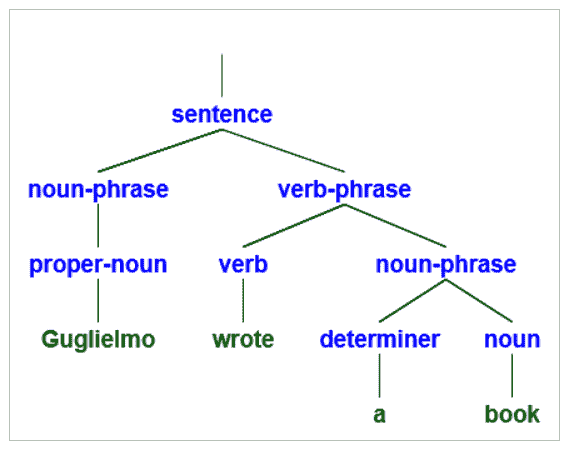
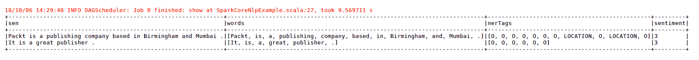
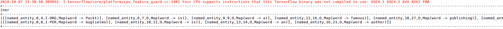
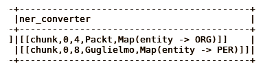
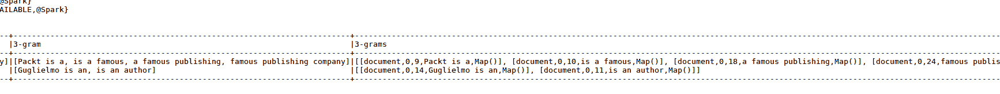
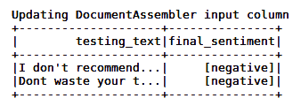

# 第十一章：自然语言处理基础

在前一章中，涉及了在 Spark 集群中进行深度学习分布式训练的多个主题。那里介绍的概念适用于任何网络模型。从本章开始，将首先讨论 RNN 或 LSTM 的具体应用场景，接着介绍 CNN 的应用。本章开始时，将介绍以下**自然语言处理**（**NLP**）的核心概念：

+   分词器

+   句子分割

+   词性标注

+   命名实体提取

+   词块分析

+   语法分析

上述概念背后的理论将被详细讲解，最后将呈现两个完整的 Scala 例子，一个使用 Apache Spark 和斯坦福核心 NLP 库，另一个使用 Spark 核心和`Spark-nlp`库（该库构建在 Apache Spark MLLib 之上）。本章的目标是让读者熟悉 NLP，然后进入基于深度学习（RNN）的实现，使用 DL4J 和/或 Keras/Tensorflow 结合 Spark，这将是下一章的核心内容。

# 自然语言处理（NLP）

自然语言处理（NLP）是利用计算机科学和人工智能处理与分析自然语言数据，使机器能够像人类一样理解这些数据的领域。在 1980 年代，当这个概念开始受到关注时，语言处理系统是通过手动编写规则来设计的。后来，随着计算能力的增加，一种主要基于统计模型的方法取代了原来的方法。随后的机器学习（ML）方法（最初是监督学习，目前也有半监督或无监督学习）在这一领域取得了进展，例如语音识别软件和人类语言翻译，并且可能会引领更复杂的场景，例如自然语言理解和生成。

下面是 NLP 的工作原理。第一个任务，称为语音转文本过程，是理解接收到的自然语言。一个内置模型执行语音识别，将自然语言转换为编程语言。这个过程通过将语音分解为非常小的单元，然后与之前输入的语音单元进行比较来实现。输出结果确定最可能被说出的单词和句子。接下来的任务，称为**词性标注**（**POS**）（在一些文献中也称为词类消歧），使用一组词汇规则识别单词的语法形式（名词、形容词、动词等）。完成这两个阶段后，机器应该能够理解输入语音的含义。NLP 过程的第三个任务可能是文本转语音转换：最终，编程语言被转换为人类可以理解的文本或语音格式。这就是 NLP 的最终目标：构建能够分析、理解并自然生成语言的软件，使计算机能够像人类一样进行交流。

给定一段文本，在实现 NLP 时，有三件事需要考虑和理解：

+   **语义信息**：单个词的具体含义。例如，考虑单词*pole*，它可能有不同的含义（磁铁的一端、一根长棍等）。在句子*极右和极左是政治系统的两个极端*中，为了理解正确的含义，了解极端的相关定义非常重要。读者可以很容易地推断出它指的是哪种含义，但机器在没有机器学习（ML）或深度学习（DL）的情况下无法做到这一点。

+   **语法信息**：短语结构。考虑句子*William 加入了拥有丰富国际经验的足球队*。根据如何解读，它有不同的含义（可能是威廉拥有丰富的国际经验，也可能是足球队拥有丰富的国际经验）。

+   **上下文信息**：词语或短语出现的上下文。例如，考虑形容词*low*。它在便利的上下文中通常是积极的（例如，*这款手机价格很低*），但在谈到供应时几乎总是消极的（例如，*饮用水供应不足*）。

以下小节将解释 NLP 监督学习的主要概念。

# 分词器

分词意味着在 NLP 机器学习算法中定义一个词是什么。给定一段文本，分词任务是将其切分成片段，称为**tokens**，同时去除特定字符（如标点符号或分隔符）。例如，给定以下英语输入句子：

`To be, or not to be, that is the question`

分词的结果将产生以下 11 个 tokens：

`To be or or not to be that is the question`

分词的一个大挑战是如何确定正确的 tokens。在前一个示例中，决定是很容易的：我们去除了空格和所有标点符号字符。但如果输入文本不是英语呢？例如中文等其他语言，没有空格，前述规则就不起作用了。因此，任何针对 NLP 的机器学习或深度学习模型训练都应考虑到特定语言的规则。

但即使仅限于单一语言，比如英语，也可能出现棘手的情况。考虑以下示例句子：

`David Anthony O'Leary 是一位爱尔兰足球经理和前球员`

如何处理撇号？在这种情况下，`O'Leary`有五种可能的分词方式，分别如下：

1.  `leary`

1.  `oleary`

1.  `o'leary`

1.  `o' leary`

1.  `o leary`

那么，哪个是期望的结果呢？一个快速想到的简单策略可能是把句子中的所有非字母数字字符去掉。因此，获取`o`和`leary`这些 tokens 是可以接受的，因为用这些 tokens 进行布尔查询搜索会匹配五个案例中的三个。但以下这个句子呢？

`Michael O'Leary 批评了在爱尔兰航空罢工的机组人员，称“他们没有被像西伯利亚盐矿工一样对待”。`

对于*aren't*，有四种可能的词元拆分方式，如下：

1.  `aren't`

1.  `arent`

1.  `are n't`

1.  `aren t`

再次强调，虽然`o`和`leary`的拆分看起来没问题，但`aren`和`t`的拆分怎么样呢？最后这个拆分看起来不太好；用这些词元做布尔查询搜索，只有四种情况中的两种能匹配。

词元化的挑战和问题是语言特定的。在这种情况下，需要深入了解输入文档的语言。

# 句子分割

句子分割是将文本拆分成句子的过程。从定义来看，这似乎是一个简单的过程，但也可能会遇到一些困难，例如，存在可能表示不同含义的标点符号：

`Streamsets 公司发布了新的 Data Collector 3.5.0 版本。新功能之一是 MongoDB 查找处理器。`

看一下前面的文本，你会发现同一个标点符号（`.`）被用来表示三种不同的意思，而不仅仅是作为句子的分隔符。某些语言，比如中文，拥有明确的句尾标记，而其他语言则没有。因此，必须制定一个策略。在像前面例子中这种情况下，找到句子结束的位置的最快且最粗暴的方法是：

+   如果是句号，那么它表示一句话的结束。

+   如果紧接句号的词元出现在预先编译的缩写词列表中，那么句号不表示句子的结束。

+   如果句号后的下一个词元是大写字母开头的，那么句号表示一句话的结束。

这个方法能正确处理超过 90%的句子，但可以做得更智能一些，比如使用基于规则的边界消歧技术（自动从标记过句子断句的输入文档中学习一组规则），或者更好的是，使用神经网络（这可以达到超过 98%的准确率）。

# 词性标注

词性标注是自然语言处理中根据单词的定义和上下文标记文本中每个单词为相应词性的过程。语言有九大类词性——名词、动词、形容词、冠词、代词、副词、连词、介词和感叹词。每一类都有子类。这个过程比词元化和句子分割更复杂。词性标注不能是通用的，因为根据上下文，相同的单词在同一文本中的句子中可能具有不同的词性标签，例如：

`请锁好门，并且不要忘记把钥匙留在锁里。`

在这里，单词 `lock` 在同一句话中被两次使用，且含义不同（作为动词和名词）。不同语言之间的差异也应该考虑在内。因此，这是一个无法手动处理的过程，应该由机器来完成。使用的算法可以是基于规则的，也可以是基于随机的。基于规则的算法，为了给未知（或至少模糊的）单词分配标签，利用上下文信息。通过分析单词的不同语言特征，如前后的单词，可以实现歧义消解。基于规则的模型从一组初始规则和数据开始训练，尝试推断出 POS 标注的执行指令。随机标注器涉及不同的方法；基本上，任何包含概率或频率的模型都可以这样标记。一种简单的随机标注器可以仅通过单词与特定标签发生的概率来消除歧义。当然，更复杂的随机标注器效率更高。最流行的之一是隐藏马尔可夫模型（[`en.wikipedia.org/wiki/Hidden_Markov_model`](https://en.wikipedia.org/wiki/Hidden_Markov_model)），这是一种统计模型，其中被建模的系统被假设为具有隐藏状态的马尔可夫过程（[`en.wikipedia.org/wiki/Markov_chain`](https://en.wikipedia.org/wiki/Markov_chain)）。

# 命名实体识别（NER）

NER 是 NLP 的一个子任务，其目标是在文本中定位和分类命名实体，并将其划分为预定义的类别。让我们举个例子。我们有以下句子：

`Guglielmo 正在为 Packt Publishing 写一本书，出版时间为 2018 年。`

对其进行 NER 处理后，得到以下注释文本：

`[Guglielmo][人名] 正在为 [Packt Publishing][组织] 写一本书，出版时间为 [2018][时间] 。`

已经检测到三个实体，一个人，`Guglielmo`，一个由两个标记组成的组织，`Packt Publishing`，以及一个时间表达，`2018`。

传统上，NER 应用于结构化文本，但最近，非结构化文本的使用案例数量有所增加。

自动化实现此过程的挑战包括大小写敏感性（早期算法经常无法识别例如 Guglielmo Iozzia 和 GUGLIELMO IOZZIA 是同一个实体）、标点符号的不同使用以及缺失的分隔符。NER 系统的实现使用了基于语言学语法的技术、统计模型和机器学习。基于语法的系统可以提供更高的精度，但在经验丰富的语言学家工作数月的成本上有很大开销，而且召回率较低。基于机器学习的系统具有较高的召回率，但需要大量手动标注的数据来进行训练。无监督方法正在崭露头角，旨在大幅减少数据标注的工作量。

这个过程的另一个挑战是上下文领域——一些研究表明，为一个领域开发的命名实体识别（NER）系统（在该领域达到较高的性能）通常在其他领域表现不佳。例如，一个已经在 Twitter 内容上训练过的 NER 系统，不能简单地应用到医疗记录中，并期望它能达到同样的性能和准确性。这适用于基于规则和统计/机器学习的系统；在新的领域中调整 NER 系统以达到在原始领域成功训练时的同样性能，需要付出相当大的努力。

# 分块

自然语言处理中的分块（Chunking）是从文本中提取短语的过程。使用分块的原因是，因为简单的词语可能无法代表所分析文本的真实含义。举个例子，考虑短语*Great Britain*；虽然这两个单独的词语有意义，但更好的做法是将*Great Britain*作为一个整体来使用。分块通常建立在词性标注（POS tagging）的基础上；通常，词性标注是输入，而分块则是它的输出。这个过程与人类大脑将信息分块以便于处理和理解的方式非常相似。想一想你记忆数字序列（例如借记卡密码、电话号码等）的方式；你通常不会把它们当作单独的数字来记，而是试图将它们分组，以便更容易记住。

分块可以向上或向下进行。向上分块更倾向于抽象化；向下分块则更倾向于寻找更具体的细节。举个例子，考虑在一个票务销售和分发公司的电话中发生的场景。接线员问：“*您想购买哪种类型的票？*”顾客的回答是：“*音乐会票*”，这属于向上分块，因为它更倾向于一个更高层次的抽象。然后，接线员提出更多问题，如：“*哪种类型*”，“*哪位艺术家或团体*”，“*哪个日期和地点*”，“*多少人*”，“*哪个区域*”等等，以获得更多细节并满足顾客的需求（这就是向下分块）。最终，你可以将分块视为一种集合的层次结构。对于一个特定的上下文，总是有一个更高层次的集合，它有子集，每个子集又可以有其他子集。例如，可以考虑编程语言作为一个更高层次的子集；然后你可以得到以下情况：

`编程语言`

`Scala（编程语言的子集）`

`Scala 2.11（Scala 的子集）`

`特性（Scala 的特定概念之一）`

`迭代器（Scala 的核心特性之一）`

# 解析

NLP 中的解析是确定文本句法结构的过程。它通过分析文本的组成词汇进行工作，并基于文本所在语言的基础语法。解析的结果是输入文本每个句子的解析树。解析树是一个有序的、带根的树，表示句子的句法结构，依据的是某种上下文无关语法（描述给定形式语言中所有可能字符串的规则集）。我们来举个例子。考虑英语语言和以下的语法示例：

`sentence -> 名词短语，动词短语`

`noun-phrase -> 专有名词`

`noun-phrase -> 决定词，名词`

`verb-phrase -> 动词，名词短语`

考虑短语 `Guglielmo wrote a book`，并对其应用解析过程。输出将是这样的解析树：



目前，自动化机器解析的方法主要是统计的、概率的或机器学习（ML）方法。

# 使用 Spark 进行 NLP 实践

在本节中，将详细介绍在 Apache Spark 中实现 NLP（以及前述核心概念）的几个示例。这些示例不包括 DL4J 或其他深度学习框架，因为多层神经网络的 NLP 将是下一章的主要内容。

虽然 Spark 的核心组件之一，MLLib，是一个机器学习库，但它并未提供 NLP 的相关功能。因此，您需要在 Spark 上使用其他 NLP 库或框架。

# 使用 Spark 和 Stanford Core NLP 进行 NLP 实践

本章的第一个示例涉及使用 Scala 包装的 Stanford Core NLP ([`github.com/stanfordnlp/CoreNLP`](https://github.com/stanfordnlp/CoreNLP)) 库，它是开源的，并以 GNU 通用公共许可证 v3 发布 ([`www.gnu.org/licenses/gpl-3.0.en.html`](https://www.gnu.org/licenses/gpl-3.0.en.html))。它是一个 Java 库，提供一套自然语言分析工具。其基本分发版提供了用于分析英语的模型文件，但该引擎也兼容其他语言的模型。它稳定且适用于生产环境，广泛应用于学术和工业领域。Spark CoreNLP ([`github.com/databricks/spark-corenlp`](https://github.com/databricks/spark-corenlp)) 是 Stanford Core NLP Java 库的 Apache Spark 封装。它已用 Scala 实现。Stanford Core NLP 注释器已作为 Spark DataFrame 封装。

spark-corenlp 库的当前版本包含一个 Scala 类函数，提供了所有高级封装方法，如下所示：

+   `cleanXml`：输入一个 XML 文档，并移除所有 XML 标签。

+   `tokenize`：将输入句子分割成单词。

+   `ssplit`：将输入文档分割成句子。

+   `pos`：生成输入句子的词性标签。

+   `lemma`：生成输入句子的词形还原。

+   `ner`：生成输入句子的命名实体标签。

+   `depparse`：生成输入句子的语义依赖关系。

+   `coref`：生成输入文档的 `coref` 链。

+   `natlog`：生成输入句子中每个词元的自然逻辑极性。可能的返回值有：up（上升）、down（下降）或 flat（平稳）。

+   `openie`：生成一组开放的 IE 三元组，表示为扁平的四元组。

+   `sentiment`：测量输入句子的情感。情感评分的范围是从零（强烈负面）到四（强烈正面）。

首先要做的是设置此示例的依赖项。它依赖于 Spark SQL 和 Stanford core NLP 3.8.0（需要通过 `Models` 分类器显式指定模型的导入），如下所示：

```py
groupId: edu.stanford.nlp
artifactId: stanford-corenlp
version: 3.8.0

groupId: edu.stanford.nlp
artifactId: stanford-corenlp
version: 3.8.0
classifier: models
```

当您只需要处理某一种语言时，例如西班牙语，您也可以选择仅导入该语言的模型，通过其特定的分类器，方式如下：

```py
groupId: edu.stanford.nlp
 artifactId: stanford-corenlp
 version: 3.8.0
 classifier: models-spanish
```

在 Maven 中央库中没有可用的 `spark-corenlp` 库。因此，您必须从 GitHub 源代码构建其 JAR 文件，然后将其添加到您的 NLP 应用程序的类路径中，或者如果您的应用程序依赖于某个工件库（例如 JFrog Artifactory（[`jfrog.com/artifactory/`](https://jfrog.com/artifactory/)）、Apache Archiva（[`archiva.apache.org/index.cgi`](https://archiva.apache.org/index.cgi)）或 Sonatype Nexus OSS（[`www.sonatype.com/nexus-repository-oss`](https://www.sonatype.com/nexus-repository-oss)）），请将 JAR 文件存储在那里，并按照与 Maven 中央库中任何其他依赖项相同的方式，将其依赖关系添加到您的项目构建文件中。

我之前提到过，`spark-corenlp` 将 Stanford core NLP 注释器封装为 DataFrame。因此，源代码中需要做的第一件事是创建一个 `SparkSession`，如下所示：

```py
val sparkSession = SparkSession
   .builder()
   .appName("spark-corenlp example")
   .master(master)
   .getOrCreate()
```

现在，创建一个 `Sequence`（[`www.scala-lang.org/api/current/scala/collection/Seq.html`](https://www.scala-lang.org/api/current/scala/collection/Seq.html)）来表示输入文本内容（XML 格式），然后将其转换为 DataFrame，如下所示：

```py
import sparkSession.implicits._

 val input = Seq(
   (1, "<xml>Packt is a publishing company based in Birmingham and Mumbai. It is a great publisher.</xml>")
 ).toDF("id", "text")
```

给定这个输入，我们可以使用 `functions` 可用的方法执行不同的 NLP 操作，例如从标签中清理输入的 XML（包含在 `input` DataFrame 的 `text` 字段中）、将每个句子拆分成单词、生成每个句子的命名实体标签，并测量每个句子的情感等操作：

```py
val output = input
     .select(cleanxml('text).as('doc))
     .select(explode(ssplit('doc)).as('sen))
     .select('sen, tokenize('sen).as('words), ner('sen).as('nerTags), sentiment('sen).as('sentiment))
```

最后，我们打印这些操作的输出（`output` 本身是一个 DataFrame），如下所示：

```py
output.show(truncate = false)
```

最后，我们需要停止并销毁 `SparkSession`，如下所示：

```py
sparkSession.stop()
```

执行此示例时，输出如下：



XML 内容已经从标签中清除，句子已按照预期拆分成单个单词，对于某些单词（如`Birmingham`、`Mumbai`），已生成命名实体标签（`LOCATION`）。并且，对于输入的两句话，情感分析结果为积极（`3`）！

这种方法是开始使用 Scala 和 Spark 进行 NLP 的好方式；该库提供的 API 简单且高层次，能够帮助人们快速理解 NLP 的核心概念，同时利用 Spark DataFrames 的强大功能。但它也有缺点。当需要实现更复杂和定制化的 NLP 解决方案时，现有的 API 过于简单，难以应对。此外，如果你的最终系统不仅仅是内部使用，而是计划销售并分发给客户，则可能会出现许可问题；斯坦福核心 NLP 库和`spark-corenlp`模型依赖于并且在完整的 GNU GPL v3 许可下发布，禁止将其作为专有软件的一部分重新分发。下一节介绍了一个更可行的 Scala 和 Spark 替代方案。

# 使用 Spark NLP 进行实践操作

另一个可与 Apache Spark 集成以进行 NLP 的替代库是 John Snow Labs 的`spark-nlp`（[`nlp.johnsnowlabs.com/`](https://nlp.johnsnowlabs.com/)）（[`www.johnsnowlabs.com/`](https://www.johnsnowlabs.com/)）。它是开源的，并且在 Apache 许可证 2.0 下发布，因此与`spark-corenlp`不同，它的许可模式使得可以将其作为商业解决方案的一部分重新分发。它是在 Scala 上实现的，基于 Apache Spark ML 模块，并且可以在 Maven 中央仓库中找到。它为机器学习流水线提供了 NLP 注释，这些注释既易于理解和使用，又具有出色的性能，并且能够在分布式环境中轻松扩展。

我在本节中提到的版本是 1.6.3（本书写作时的最新版本）。

`spark-nlp`的核心概念是 Spark ML 流水线（[`spark.apache.org/docs/2.2.1/api/java/org/apache/spark/ml/Pipeline.html`](https://spark.apache.org/docs/2.2.1/api/java/org/apache/spark/ml/Pipeline.html)）。一个流水线由一系列阶段组成。每个阶段可以是一个变换器（[`spark.apache.org/docs/2.2.1/api/java/org/apache/spark/ml/Transformer.html`](https://spark.apache.org/docs/2.2.1/api/java/org/apache/spark/ml/Transformer.html)）或一个估算器（[`spark.apache.org/docs/2.2.1/api/java/org/apache/spark/ml/Estimator.html`](https://spark.apache.org/docs/2.2.1/api/java/org/apache/spark/ml/Estimator.html)）。变换器将输入数据集转换为另一个数据集，而估算器则将模型拟合到数据上。当流水线的拟合方法被调用时，其各个阶段会按顺序执行。现有三种类型的预训练流水线：基础型、进阶型和情感型。该库还提供了多个预训练的 NLP 模型和多个标注器。但为了澄清` spark-nlp`的核心概念，让我们从一个简单的示例开始。我们尝试实现一个基于 ML 的命名实体标签提取的基本流水线。

以下示例依赖于 Spark SQL 和 MLLib 组件以及`spark-nlp`库：

```py
groupId: com.johnsnowlabs.nlp
 artifactId: spark-nlp_2.11
 version: 1.6.3
```

我们需要首先启动一个`SparkSession`，如下所示：

```py
val sparkSession: SparkSession = SparkSession
         .builder()
         .appName("Ner DL Pipeline")
         .master("local[*]")
         .getOrCreate()
```

在创建管道之前，我们需要实现其各个阶段。第一个阶段是`com.johnsnowlabs.nlp.DocumentAssembler`，用于指定应用程序输入的列以进行解析，并指定输出列名称（该列将作为下一个阶段的输入列），如下所示：

```py
val document = new DocumentAssembler()
     .setInputCol("text")
     .setOutputCol("document")
```

下一个阶段是`Tokenizer`（`com.johnsnowlabs.nlp.annotators.Tokenizer`），如下所示：

```py
val token = new Tokenizer()
     .setInputCols("document")
     .setOutputCol("token")
```

在此阶段之后，任何输入的句子应该已经被拆分成单个词语。我们需要清理这些词语，因此下一个阶段是`normalizer`（`com.johnsnowlabs.nlp.annotators.Normalizer`），如下所示：

```py
val normalizer = new Normalizer()
     .setInputCols("token")
     .setOutputCol("normal")
```

现在我们可以使用`spaek-nlp`库中的一个预训练模型来生成命名实体标签，如下所示：

```py
val ner = NerDLModel.pretrained()
     .setInputCols("normal", "document")
     .setOutputCol("ner")
```

这里我们使用了`NerDLModel`类（`com.johnsnowlabs.nlp.annotators.ner.dl.NerDLModel`），它背后使用的是一个 TensorFlow 预训练模型。该模型生成的命名实体标签采用 IOB 格式（[`en.wikipedia.org/wiki/Inside%E2%80%93outside%E2%80%93beginning_(tagging)`](https://en.wikipedia.org/wiki/Inside%E2%80%93outside%E2%80%93beginning_(tagging)))，因此我们需要将它们转换为更易读的格式。我们可以使用`NerConverter`类（`com.johnsnowlabs.nlp.annotators.ner.NerConverter`）来实现这一点，如下所示：

```py
val nerConverter = new NerConverter()
     .setInputCols("document", "normal", "ner")
     .setOutputCol("ner_converter")
```

最后一个阶段是最终化管道的输出，如下所示：

```py
val finisher = new Finisher()
     .setInputCols("ner", "ner_converter")
     .setIncludeMetadata(true)
     .setOutputAsArray(false)
     .setCleanAnnotations(false)
     .setAnnotationSplitSymbol("@")
     .setValueSplitSymbol("#")
```

为此，我们使用了`Finisher`转换器（`com.johnsnowlabs.nlp.Finisher`）。

现在我们可以使用目前创建的阶段来构建管道，如下所示：

```py
val pipeline = new Pipeline().setStages(Array(document, token, normalizer, ner, nerConverter, finisher))
```

你可能已经注意到，每个阶段的输出列是下一个阶段输入列的输入。这是因为管道的各个阶段会按它们在`setStages`方法的输入`Array`中列出的顺序依次执行。

现在让我们给应用程序输入一些句子，如下所示：

```py
val testing = Seq(
     (1, "Packt is a famous publishing company"),
     (2, "Guglielmo is an author")
 ).toDS.toDF( "_id", "text")
```

与前一节中`spaek-corenlp`的示例相同，我们为输入文本内容创建了一个`Sequence`，然后将其转换为 Spark DataFrame。

通过调用`pipeline`的`fit`方法，我们可以执行所有阶段，如下所示：

```py
val result = pipeline.fit(Seq.empty[String].toDS.toDF("text")).transform(testing)
```

然后，我们得到如下的结果 DataFrame 输出：

```py
result.select("ner", "ner_converter").show(truncate=false)
```

这将产生以下输出：



当我们仔细观察时，情况如下所示：



已为单词`Packt`生成了一个`ORGANIZATION`命名实体标签，为单词`Guglielmo`生成了一个`PERSON`命名实体标签。

`spark-nlp`还提供了一个类，`com.johnsnowlabs.util.Benchmark`，用于执行管道执行的基准测试，例如：

```py
Benchmark.time("Time to convert and show") {result.select("ner", "ner_converter").show(truncate=false)}
```

最后，我们在管道执行结束时停止`SparkSession`，如下所示：

```py
sparkSession.stop
```

现在让我们做一些更复杂的事情。这个第二个示例中的管道使用 n-grams 进行分词（[`en.wikipedia.org/wiki/N-gram`](https://en.wikipedia.org/wiki/N-gram)），它是从给定的文本或语音中提取的*n*个标记（通常是单词）的序列。此示例的依赖项与本节前面展示的示例相同——Spark SQL、Spark MLLib 和`spark-nlp`。

创建`SparkSession`并配置一些 Spark 属性，如下所示：

```py
val sparkSession: SparkSession = SparkSession
     .builder()
     .appName("Tokenize with n-gram example")
     .master("local[*]")
     .config("spark.driver.memory", "1G")
     .config("spark.kryoserializer.buffer.max","200M")
     .config("spark.serializer","org.apache.spark.serializer.KryoSerializer")
     .getOrCreate()
```

管道的前三个阶段与之前的示例相同，如下所示：

```py
val document = new DocumentAssembler()
  .setInputCol("text")
  .setOutputCol("document")

val token = new Tokenizer()
  .setInputCols("document")
  .setOutputCol("token")

val normalizer = new Normalizer()
  .setInputCols("token")
  .setOutputCol("normal")
```

在使用 n-gram 阶段之前添加一个`finisher`阶段，如下所示：

```py
val finisher = new Finisher()
     .setInputCols("normal")
```

n-gram 阶段使用了 Spark MLLib 中的`NGram`类（[`spark.apache.org/docs/2.2.1/api/scala/index.html#org.apache.spark.ml.feature.NGram`](https://spark.apache.org/docs/2.2.1/api/scala/index.html#org.apache.spark.ml.feature.NGram)），如下所示：

```py
val ngram = new NGram()
   .setN(3)
   .setInputCol("finished_normal")
   .setOutputCol("3-gram")
```

`NGram`是一个特征变换器，它将输入的字符串数组转换为 n-grams 数组。在这个示例中，选择的*n*值是`3`。现在，我们需要一个额外的`DocumentAssembler`阶段来处理 n-gram 的结果，如下所示：

```py
val gramAssembler = new DocumentAssembler()
   .setInputCol("3-gram")
   .setOutputCol("3-grams")
```

让我们实现管道，如下所示：

```py
val pipeline = new Pipeline().setStages(Array(document, token, normalizer, finisher, ngram, gramAssembler))
```

现在，用与之前示例相同的输入句子来运行应用程序：

```py
import sparkSession.implicits._
val testing = Seq(
  (1, "Packt is a famous publishing company"),
  (2, "Guglielmo is an author")
).toDS.toDF( "_id", "text")
```

然后执行管道的各个阶段，如下所示：

```py
val result = pipeline.fit(Seq.empty[String].toDS.toDF("text")).transform(testing)
```

将结果打印到屏幕上：

```py
result.show(truncate=false)
```

这会生成以下输出：



最后，我们停止`SparkSession`，如下所示：

```py
sparkSession.stop
```

最后的示例是使用 Vivek Narayanan（[`github.com/vivekn`](https://github.com/vivekn)）模型进行的机器学习情感分析。情感分析是自然语言处理的一个实际应用，它是通过计算机识别和分类文本中表达的意见，以确定其作者/讲述者对某一产品或话题的态度是积极的、消极的，还是中立的。特别地，在这个示例中，我们将训练并验证电影评论的模型。此示例的依赖项与往常一样——Spark SQL、Spark MLLib 和`spark-nlp`。

如往常一样，创建一个`SparkSession`（同时配置一些 Spark 属性），如下所示：

```py
val spark: SparkSession = SparkSession
     .builder
     .appName("Train Vivek N Sentiment Analysis")
     .master("local[*]")
     .config("spark.driver.memory", "2G")
     .config("spark.kryoserializer.buffer.max","200M")
  .config("spark.serializer","org.apache.spark.serializer.KryoSerializer")
     .getOrCreate
```

然后我们需要两个数据集，一个用于训练，一个用于测试。为了简便起见，我们将训练数据集定义为一个`Sequence`，然后将其转换为 DataFrame，其中列为评论文本和相关情感，如下所示：

```py
import spark.implicits._

val training = Seq(
  ("I really liked it!", "positive"),
  ("The cast is horrible", "negative"),
  ("Never going to watch this again or recommend it", "negative"),
  ("It's a waste of time", "negative"),
  ("I loved the main character", "positive"),
  ("The soundtrack was really good", "positive")
).toDS.toDF("train_text", "train_sentiment")

While the testing data set could be a simple Array:

val testing = Array(
  "I don't recommend this movie, it's horrible",
  "Dont waste your time!!!"
)
```

我们现在可以定义管道的各个阶段。前面三个阶段与之前示例管道中的完全相同（`DocumentAssembler`、`Tokenizer`和`Normalizer`），如下所示：

```py
val document = new DocumentAssembler()
  .setInputCol("train_text")
  .setOutputCol("document")

val token = new Tokenizer()
  .setInputCols("document")
  .setOutputCol("token")

val normalizer = new Normalizer()
  .setInputCols("token")
  .setOutputCol("normal")
```

我们现在可以使用`com.johnsnowlabs.nlp.annotators.sda.vivekn.ViveknSentimentApproach`注解器，如下所示：

```py
val vivekn = new ViveknSentimentApproach()
  .setInputCols("document", "normal")
  .setOutputCol("result_sentiment")
  .setSentimentCol("train_sentiment")

And finally we use a Finisher transformer as last stage:

val finisher = new Finisher()
  .setInputCols("result_sentiment")
  .setOutputCols("final_sentiment")
```

使用之前定义的各个阶段创建管道：

```py
val pipeline = new Pipeline().setStages(Array(document, token, normalizer, vivekn, finisher))
```

然后开始训练，如下所示：

```py
val sparkPipeline = pipeline.fit(training)
```

一旦训练完成，我们可以使用以下测试数据集进行测试：

```py
val testingDS = testing.toSeq.toDS.toDF("testing_text")
 println("Updating DocumentAssembler input column")
 document.setInputCol("testing_text")
 sparkPipeline.transform(testingDS).show()
```

输出结果如下：



测试数据集中的两个句子已经被正确标记为负面。

当然，也可以通过`spark-nlp`的`Benchmark`类来进行情感分析的基准测试，如下所示：

```py
Benchmark.time("Spark pipeline benchmark") {
   val testingDS = testing.toSeq.toDS.toDF("testing_text")
   println("Updating DocumentAssembler input column")
   document.setInputCol("testing_text")
   sparkPipeline.transform(testingDS).show()
 }
```

在本节结束时，我们可以说明`spak-nlp`提供了比`spark-corenlp`更多的功能，且与 Spark MLLib 集成良好，并且得益于其许可模型，在应用程序/系统的分发上不会出现相同的问题。它是一个稳定的库，适用于 Spark 环境中的生产环境。不幸的是，它的大部分文档缺失，现有的文档非常简略且维护不善，尽管项目仍在积极开发中。

为了理解某个功能如何工作以及如何将它们结合在一起，你必须浏览 GitHub 中的源代码。该库还使用通过 Python 框架实现的现有 ML 模型，并提供了一个 Scala 类来表示它们，将底层的模型实现细节隐藏起来，避免开发人员接触。这在多个使用场景中都能有效，但为了构建更强大和高效的模型，你可能需要自己实现神经网络模型。只有 DL4J 才能在 Scala 中为开发和训练提供那种自由度。

# 总结

本章中，我们了解了 NLP 的主要概念，并开始动手使用 Spark，探索了两个潜在有用的库，`spark-corenlp`和`spark-nlp`。

在下一章，我们将看到如何通过实现复杂的 NLP 场景在 Spark 中实现相同或更好的结果，主要是基于 RNN 的深度学习。我们将通过使用 DL4J、TensorFlow、Keras、TensorFlow 后端以及 DL4J + Keras 模型导入来探索不同的实现方式。
