# 第十二章：文本分析与深度学习

在上一章中，我们了解了**自然语言处理**（**NLP**）的核心概念，然后我们通过 Scala 和 Apache Spark 中的一些实现示例，学习了两个开源库的应用，并了解了这些解决方案的优缺点。本章将通过实际案例展示使用 DL 进行 NLP 的实现（使用 Scala 和 Spark）。以下四个案例将被覆盖：

+   DL4J

+   TensorFlow

+   Keras 与 TensorFlow 后端

+   DL4J 和 Keras 模型导入

本章涵盖了关于每种 DL 方法的优缺点的考虑，以便读者可以了解在何种情况下某个框架比其他框架更受青睐。

# 动手实践 NLP 与 DL4J

我们将要检查的第一个示例是电影评论的情感分析案例，与上一章中展示的最后一个示例（*动手实践 NLP with Spark-NLP*部分）相同。不同之处在于，这里我们将结合 Word2Vec（[`en.wikipedia.org/wiki/Word2vec`](https://en.wikipedia.org/wiki/Word2vec)）和 RNN 模型。

Word2Vec 可以看作是一个只有两层的神经网络，它接受一些文本内容作为输入，然后返回向量。它不是一个深度神经网络，但它用于将文本转换为深度神经网络能够理解的数字格式。Word2Vec 非常有用，因为它可以在向量空间中将相似词汇的向量聚集在一起。它通过数学方式实现这一点。它在没有人工干预的情况下，创建了分布式的单词特征的数值表示。表示单词的向量被称为**神经词嵌入**。Word2Vec 训练词汇与输入文本中的邻近词汇之间的关系。它通过上下文来预测目标词汇（**连续词袋模型**（**CBOW**））或使用一个词汇来预测目标上下文（跳字模型）。研究表明，当处理大型数据集时，第二种方法能够产生更精确的结果。如果分配给某个单词的特征向量不能准确预测它的上下文，那么该向量的组成部分就会发生调整。每个单词在输入文本中的上下文变成了“教师”，通过反馈错误进行调整。这样，通过上下文被认为相似的单词向量就会被推得更近。

用于训练和测试的数据集是*大型电影评论数据集*，可以在[`ai.stanford.edu/~amaas/data/sentiment/`](http://ai.stanford.edu/~amaas/data/sentiment/)下载，且免费使用。该数据集包含 25,000 条热门电影评论用于训练，另外还有 25,000 条用于测试。

本示例的依赖项包括 DL4J NN、DL4J NLP 和 ND4J。

像往常一样，使用 DL4J 的`NeuralNetConfiguration.Builder`类来设置 RNN 配置，如下所示：

```py
val conf: MultiLayerConfiguration = new NeuralNetConfiguration.Builder
   .updater(Updater.ADAM)
   .l2(1e-5)
   .weightInit(WeightInit.XAVIER)
   .gradientNormalization(GradientNormalization.ClipElementWiseAbsoluteValue)
   .gradientNormalizationThreshold(1.0)
   .list
   .layer(0, new GravesLSTM.Builder().nIn(vectorSize).nOut(256)
     .activation(Activation.TANH)
     .build)
   .layer(1, new RnnOutputLayer.Builder().activation(Activation.SOFTMAX)
     .lossFunction(LossFunctions.LossFunction.MCXENT).nIn(256).nOut(2).build)
   .pretrain(false).backprop(true).build
```

该网络由一个 Graves LSTM RNN 构成（更多细节请参见第六章，《*递归神经网络*》），加上 DL4J 特定的 RNN 输出层`RnnOutputLayer`。该输出层的激活函数是 SoftMax。

现在我们可以使用前面设置的配置来创建网络，如下所示：

```py
val net = new MultiLayerNetwork(conf)
 net.init()
 net.setListeners(new ScoreIterationListener(1))
```

在开始训练之前，我们需要准备训练集，以使其准备好供使用。为此，我们将使用 Alex Black 的`dataset iterator`，该迭代器可以在 DL4J 的 GitHub 示例中找到（[`github.com/deeplearning4j/dl4j-examples/blob/master/dl4j-examples/src/main/java/org/deeplearning4j/examples/recurrent/word2vecsentiment/SentimentExampleIterator.java`](https://github.com/deeplearning4j/dl4j-examples/blob/master/dl4j-examples/src/main/java/org/deeplearning4j/examples/recurrent/word2vecsentiment/SentimentExampleIterator.java)）。它是用 Java 编写的，因此已经被改编为 Scala 并添加到本书的源代码示例中。它实现了`DataSetIterator`接口（[`static.javadoc.io/org.nd4j/nd4j-api/1.0.0-alpha/org/nd4j/linalg/dataset/api/iterator/DataSetIterator.html`](https://static.javadoc.io/org.nd4j/nd4j-api/1.0.0-alpha/org/nd4j/linalg/dataset/api/iterator/DataSetIterator.html)），并且专门针对 IMDB 评论数据集。它的输入是原始的 IMDB 数据集（可以是训练集或测试集），以及一个`wordVectors`对象，然后生成准备好用于训练/测试的数据集。这个特定的实现使用了 Google News 300 预训练向量作为`wordVectors`对象；可以从[`github.com/mmihaltz/word2vec-GoogleNews-vectors/`](https://github.com/mmihaltz/word2vec-GoogleNews-vectors/) GitHub 库中免费下载 GZIP 格式的文件。需要解压缩后才能使用。一旦提取，模型可以通过`WordVectorSerializer`类的`loadStaticModel`方法加载（[`static.javadoc.io/org.deeplearning4j/deeplearning4j-nlp/1.0.0-alpha/org/deeplearning4j/models/embeddings/loader/WordVectorSerializer.html`](https://static.javadoc.io/org.deeplearning4j/deeplearning4j-nlp/1.0.0-alpha/org/deeplearning4j/models/embeddings/loader/WordVectorSerializer.html)），如下所示：

```py
val WORD_VECTORS_PATH: String = getClass().getClassLoader.getResource("GoogleNews-vectors-negative300.bin").getPath
 val wordVectors = WordVectorSerializer.loadStaticModel(new File(WORD_VECTORS_PATH))
```

现在可以通过自定义数据集迭代器`SentimentExampleIterator`准备训练和测试数据：

```py
val DATA_PATH: String = getClass.getClassLoader.getResource("aclImdb").getPath
 val train = new SentimentExampleIterator(DATA_PATH, wordVectors, batchSize, truncateReviewsToLength, true)
 val test = new SentimentExampleIterator(DATA_PATH, wordVectors, batchSize, truncateReviewsToLength, false)
```

然后，我们可以在 DL4J 和 Spark 中测试和评估模型，具体内容参见第六章，《*递归神经网络*》、第七章，《*使用 Spark 训练神经网络*》，以及第八章，《*监控和调试神经网络训练*》。请注意，本文中使用的 Google 模型非常大（约 3.5 GB），因此在训练该示例中的模型时，需考虑所需的资源（特别是内存）。

在这个第一个代码示例中，我们使用了 DL4J 主模块的常用 API，这些 API 通常用于不同用例场景中的不同 MNN。我们还在其中明确使用了 Word2Vec。无论如何，DL4J API 还提供了一些针对 NLP 的基础设施，这些设施是基于 ClearTK（[`cleartk.github.io/cleartk/`](https://cleartk.github.io/cleartk/)）构建的，ClearTK 是一个开源的机器学习（ML）和自然语言处理（NLP）框架，适用于 Apache UIMA（[`uima.apache.org/`](http://uima.apache.org/)）。在本节接下来展示的第二个示例中，我们将使用这些设施。

该第二个示例的依赖项是 DataVec、DL4J NLP 和 ND4J。尽管它们已通过 Maven 或 Gradle 正确加载为传递性依赖项，但以下两个库需要明确声明在项目依赖项中，以避免在运行时发生`NoClassDefFoundError`：

```py
groupId: com.google.guava
 artifactId: guava
 version: 19.0
groupId: org.apache.commons
 artifactId: commons-math3
 version: 3.4
```

一个包含大约 100,000 个通用句子的文件已作为此示例的输入。我们需要将其加载到我们的应用程序中，操作如下：

```py
val filePath: String = new ClassPathResource("rawSentences.txt").getFile.getAbsolutePath
```

DL4J NLP 库提供了`SentenceIterator`接口（[`static.javadoc.io/org.deeplearning4j/deeplearning4j-nlp/1.0.0-alpha/org/deeplearning4j/text/sentenceiterator/SentenceIterator.html`](https://static.javadoc.io/org.deeplearning4j/deeplearning4j-nlp/1.0.0-alpha/org/deeplearning4j/text/sentenceiterator/SentenceIterator.html)）以及多个实现。在这个特定的示例中，我们将使用`BasicLineIterator`实现（[`static.javadoc.io/org.deeplearning4j/deeplearning4j-nlp/1.0.0-alpha/org/deeplearning4j/text/sentenceiterator/BasicLineIterator.html`](https://static.javadoc.io/org.deeplearning4j/deeplearning4j-nlp/1.0.0-alpha/org/deeplearning4j/text/sentenceiterator/BasicLineIterator.html)），以便去除输入文本中每个句子开头和结尾的空格，具体操作如下：

```py
val iter: SentenceIterator = new BasicLineIterator(filePath)
```

我们现在需要进行分词操作，将输入文本切分成单个词语。为此，我们使用`DefaultTokenizerFactory`实现（[`static.javadoc.io/org.deeplearning4j/deeplearning4j-nlp/1.0.0-alpha/org/deeplearning4j/text/tokenization/tokenizerfactory/DefaultTokenizerFactory.html`](https://static.javadoc.io/org.deeplearning4j/deeplearning4j-nlp/1.0.0-alpha/org/deeplearning4j/text/tokenization/tokenizerfactory/DefaultTokenizerFactory.html)），并设置`CommomPreprocessor`（[`static.javadoc.io/org.deeplearning4j/deeplearning4j-nlp/1.0.0-alpha/org/deeplearning4j/text/tokenization/tokenizer/preprocessor/CommonPreprocessor.html`](https://static.javadoc.io/org.deeplearning4j/deeplearning4j-nlp/1.0.0-alpha/org/deeplearning4j/text/tokenization/tokenizer/preprocessor/CommonPreprocessor.html)）作为分词器，去除标点符号、数字和特殊字符，并将所有生成的词元强制转换为小写，具体操作如下：

```py
val tokenizerFactory: TokenizerFactory = new DefaultTokenizerFactory
 tokenizerFactory.setTokenPreProcessor(new CommonPreprocessor)
```

模型现在可以构建，如下所示：

```py
val vec = new Word2Vec.Builder()
   .minWordFrequency(5)
   .iterations(1)
   .layerSize(100)
   .seed(42)
   .windowSize(5)
   .iterate(iter)
   .tokenizerFactory(tokenizerFactory)
   .build
```

如前所述，我们使用的是 Word2Vec，因此模型是通过 `Word2Vec.Builder` 类 ([`static.javadoc.io/org.deeplearning4j/deeplearning4j-nlp/1.0.0-alpha/org/deeplearning4j/models/word2vec/Word2Vec.Builder.html`](https://static.javadoc.io/org.deeplearning4j/deeplearning4j-nlp/1.0.0-alpha/org/deeplearning4j/models/word2vec/Word2Vec.Builder.html)) 构建的，设置为先前创建的分词器工厂。

让我们开始模型拟合：

```py
vec.fit()
```

完成后，可以将词向量保存在文件中，具体如下：

```py
WordVectorSerializer.writeWordVectors(vec, "wordVectors.txt")
```

`WordVectorSerializer` 工具类 ([`static.javadoc.io/org.deeplearning4j/deeplearning4j-nlp/1.0.0-alpha/org/deeplearning4j/models/embeddings/loader/WordVectorSerializer.html`](https://static.javadoc.io/org.deeplearning4j/deeplearning4j-nlp/1.0.0-alpha/org/deeplearning4j/models/embeddings/loader/WordVectorSerializer.html)) 处理词向量的序列化和持久化。

可以通过以下方式测试模型：

```py
val lst = vec.wordsNearest("house", 10)
 println("10 Words closest to 'house': " + lst)
```

生成的输出如下：

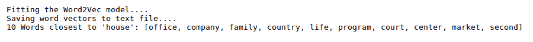

**GloVe** ([`en.wikipedia.org/wiki/GloVe_(machine_learning)`](https://en.wikipedia.org/wiki/GloVe_(machine_learning)))，与 Word2Vec 类似，是一种分布式词表示模型，但采用了不同的方法。Word2Vec 从一个旨在预测相邻词语的神经网络中提取嵌入，而 GloVe 则直接优化嵌入。这样，两个词向量的乘积等于这两个词在一起出现次数的对数。例如，如果词语 *cat* 和 *mouse* 在文本中一共出现了 20 次，那么 *(vec(cat) * vec(mouse)) = log(20)*。DL4J NLP 库也提供了 GloVe 模型的实现，`GloVe.Builder` ([`static.javadoc.io/org.deeplearning4j/deeplearning4j-nlp/1.0.0-alpha/org/deeplearning4j/models/glove/Glove.Builder.html`](https://static.javadoc.io/org.deeplearning4j/deeplearning4j-nlp/1.0.0-alpha/org/deeplearning4j/models/glove/Glove.Builder.html))。因此，这个示例可以适配到 GloVe 模型。与 Word2Vec 示例相同的包含约 100,000 个通用句子的文件作为新的输入。`SentenceIterator` 和分词方法没有变化（与 Word2Vec 示例相同）。不同之处在于构建的模型，如下所示：

```py
val glove = new Glove.Builder()
   .iterate(iter)
   .tokenizerFactory(tokenizerFactory)
   .alpha(0.75)
   .learningRate(0.1)
   .epochs(25)
   .xMax(100)
   .batchSize(1000)
   .shuffle(true)
   .symmetric(true)
   .build
```

我们可以通过调用其 `fit` 方法来拟合模型，具体如下：

```py
glove.fit()
```

拟合过程完成后，我们可以使用模型执行多项操作，例如查找两个词之间的相似度，具体如下：

```py
val simD = glove.similarity("old", "new")
 println("old/new similarity: " + simD)
```

或者，找到与给定词语最相似的 *n* 个词：

```py
val words: util.Collection[String] = glove.wordsNearest("time", 10)
 println("Nearest words to 'time': " + words)
```

产生的输出将如下所示：

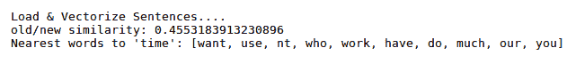

在看到这最后两个例子后，你可能会想知道到底哪个模型更好，是 Word2Vec 还是 GloVe。其实没有绝对的赢家，这完全取决于数据。你可以选择一个模型并以某种方式训练它，使得最终编码的向量变得特定于模型工作所在的用例场景的领域。

# 用 TensorFlow 进行实践中的 NLP

在本节中，我们将使用 TensorFlow（Python）进行深度学习情感分析，使用与上一节第一个示例相同的*大型电影评论数据集*。本示例的前提是 Python 2.7.x、PIP 包管理器和 TensorFlow。*在 JVM 中导入 Python 模型与 DL4J*一节位于第十章的*部署到分布式系统*部分，涵盖了设置所需工具的详细信息。我们还将使用 TensorFlow Hub 库（[`www.tensorflow.org/hub/`](https://www.tensorflow.org/hub/)），这是为可重用的机器学习模块而创建的。需要通过`pip`安装，如下所示：

```py
pip install tensorflow-hub
```

该示例还需要`pandas`（[`pandas.pydata.org/`](https://pandas.pydata.org/)）数据分析库，如下所示：

```py
pip install pandas
```

导入必要的模块：

```py
import tensorflow as tf
 import tensorflow_hub as hub
 import os
 import pandas as pd
 import re
```

接下来，我们定义一个函数，将所有文件从输入目录加载到 pandas DataFrame 中，如下所示：

```py
def load_directory_data(directory):
   data = {}
   data["sentence"] = []
   data["sentiment"] = []
   for file_path in os.listdir(directory):
     with tf.gfile.GFile(os.path.join(directory, file_path), "r") as f:
       data["sentence"].append(f.read())
       data["sentiment"].append(re.match("\d+_(\d+)\.txt", file_path).group(1))
   return pd.DataFrame.from_dict(data)
```

然后，我们定义另一个函数来合并正面和负面评论，添加一个名为`polarity`*的列*，并进行一些随机打乱，如下所示：

```py
def load_dataset(directory):
   pos_df = load_directory_data(os.path.join(directory, "pos"))
   neg_df = load_directory_data(os.path.join(directory, "neg"))
   pos_df["polarity"] = 1
   neg_df["polarity"] = 0
   return pd.concat([pos_df, neg_df]).sample(frac=1).reset_index(drop=True)
```

实现第三个函数来下载电影评论数据集，并使用`load_dataset`函数创建以下训练集和测试集 DataFrame：

```py
def download_and_load_datasets(force_download=False):
   dataset = tf.keras.utils.get_file(
       fname="aclImdb.tar.gz",
       origin="http://ai.stanford.edu/~amaas/data/sentiment/aclImdb_v1.tar.gz",
       extract=True)

   train_df = load_dataset(os.path.join(os.path.dirname(dataset),
                                        "aclImdb", "train"))
   test_df = load_dataset(os.path.join(os.path.dirname(dataset),
                                       "aclImdb", "test"))

   return train_df, test_df
```

这个函数在第一次执行代码时会下载数据集。然后，除非你删除它们，否则后续执行将从本地磁盘获取它们。

这两个 DataFrame 是通过这种方式创建的：

```py
train_df, test_df = download_and_load_datasets()
```

我们还可以将训练数据集的前几行漂亮地打印到控制台，以检查一切是否正常，如下所示：

```py
print(train_df.head())
```

示例输出如下：

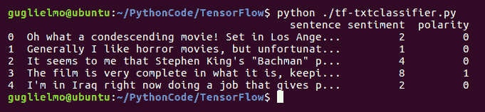

现在我们已经有了数据，可以定义模型了。我们将使用**Estimator** API（[`www.tensorflow.org/guide/estimators`](https://www.tensorflow.org/guide/estimators)），这是 TensorFlow 中的一个高级 API，旨在简化机器学习编程。*Estimator*提供了一些输入函数，作为 pandas DataFrame 的封装。所以，我们定义如下函数：`train_input_fn`，以在整个训练集上进行训练，并且不限制训练轮次：

```py
train_input_fn = tf.estimator.inputs.pandas_input_fn(
     train_df, train_df["polarity"], num_epochs=None, shuffle=True)
predict_train_input_fn 
```

对整个训练集进行预测，执行以下操作：

```py
predict_train_input_fn = tf.estimator.inputs.pandas_input_fn(
     train_df, train_df["polarity"], shuffle=False)
```

然后我们使用`predict_test_input_fn`对测试集进行预测：

```py
predict_test_input_fn = tf.estimator.inputs.pandas_input_fn(
     test_df, test_df["polarity"], shuffle=False)
```

TensorFlow hub 库提供了一个特征列，它会对给定的输入文本特征应用一个模块，该特征的值是字符串，然后将模块的输出传递到下游。在这个示例中，我们将使用`nnlm-en-dim128`模块（[`tfhub.dev/google/nnlm-en-dim128/1`](https://tfhub.dev/google/nnlm-en-dim128/1)），该模块已经在英文 Google News 200B 语料库上进行了训练。我们在代码中嵌入和使用该模块的方式如下：

```py
embedded_text_feature_column = hub.text_embedding_column(
     key="sentence",
     module_spec="https://tfhub.dev/google/nnlm-en-dim128/1")
```

出于分类目的，我们使用 TensorFlow hub 库提供的`DNNClassifier`（[`www.tensorflow.org/api_docs/python/tf/estimator/DNNClassifier`](https://www.tensorflow.org/api_docs/python/tf/estimator/DNNClassifier)）。它扩展了`Estimator`（[`www.tensorflow.org/api_docs/python/tf/estimator/Estimator`](https://www.tensorflow.org/api_docs/python/tf/estimator/Estimator)），并且是 TensorFlow DNN 模型的分类器。所以，在我们的示例中，`Estimator`是这样创建的：

```py
estimator = tf.estimator.DNNClassifier(
     hidden_units=[500, 100],
     feature_columns=[embedded_text_feature_column],
     n_classes=2,
     optimizer=tf.train.AdagradOptimizer(learning_rate=0.003))
```

请注意，我们将`embedded_text_feature_column`指定为特征列。两个隐藏层分别具有`500`和`100`个节点。`AdagradOptimizer`是`DNNClassifier`的默认优化器。

模型的训练可以通过一行代码实现，方法是调用我们的`Estimator`*的`train`方法，如下所示：

```py
estimator.train(input_fn=train_input_fn, steps=1000);
```

由于这个示例使用的训练数据集大小为 25 KB，1,000 步相当于五个 epoch（使用默认的批量大小）。

训练完成后，我们可以对训练数据集进行预测，具体如下：

```py
train_eval_result = estimator.evaluate(input_fn=predict_train_input_fn)
 print("Training set accuracy: {accuracy}".format(**train_eval_result))
```

测试数据集如下：

```py
test_eval_result = estimator.evaluate(input_fn=predict_test_input_fn)
 print("Test set accuracy: {accuracy}".format(**test_eval_result))
```

这是应用程序的输出，显示了两种预测的准确性：

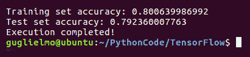

我们还可以对模型进行评估，正如在第九章中所解释的，*解释神经网络输出*，在*分类评估*部分中，计算混淆矩阵以了解错误分类的分布。首先让我们定义一个函数来获取预测值，具体如下：

```py
def get_predictions(estimator, input_fn):
   return [x["class_ids"][0] for x in estimator.predict(input_fn=input_fn)]
```

现在，从训练数据集开始创建混淆矩阵，具体如下：

```py
with tf.Graph().as_default():
   cm = tf.confusion_matrix(train_df["polarity"],
                            get_predictions(estimator, predict_train_input_fn))
   with tf.Session() as session:
     cm_out = session.run(cm)
```

然后，将其归一化，使每行的总和等于`1`，具体如下：

```py
cm_out = cm_out.astype(float) / cm_out.sum(axis=1)[:, np.newaxis]
```

屏幕上显示的混淆矩阵输出将如下所示：

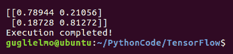

然而，你也可以使用你选择的 Python 图表库以更优雅的方式呈现它。

你可能已经注意到，尽管这段代码很简洁且不需要高级的 Python 知识，但它并不是机器学习（ML）和深度学习（DL）初学者的易入门点，因为 TensorFlow 隐式要求对 ML 概念有一定了解，才能理解其 API。与 DL4J API 比较时，你可以明显感觉到这种差异。

# 使用 Keras 和 TensorFlow 后端进行实践 NLP

如第十章《在分布式系统上部署》中所述，在*使用 DL4J 在 JVM 中导入 Python 模型*部分，当在 Python 中进行深度学习时，TensorFlow 的替代方案是 Keras。它可以作为一个高层 API，在 TensorFlow 的支持下使用。在本节中，我们将学习如何在 Keras 中进行情感分析，最后，我们将比较此实现与之前 TensorFlow 中的实现。

我们将使用与前面通过 DL4J 和 TensorFlow 实现相同的 IMDB 数据集（25,000 个训练样本和 25,000 个测试样本）。此示例的先决条件与 TensorFlow 示例相同（Python 2.7.x，PIP 包管理器和 TensorFlow），当然还需要 Keras。Keras 代码模块内置了该数据集：

```py
from keras.datasets import imdb
```

所以，我们只需要设置词汇表的大小并从那里加载数据，而不是从其他外部位置加载，如下所示：

```py
vocabulary_size = 5000

 (X_train, y_train), (X_test, y_test) = imdb.load_data(num_words = vocabulary_size)
```

下载完成后，您可以打印下载评论的样本以供检查，如下所示：

```py
print('---review---')
 print(X_train[6])
 print('---label---')
 print(y_train[6])
```

输出结果如下所示：

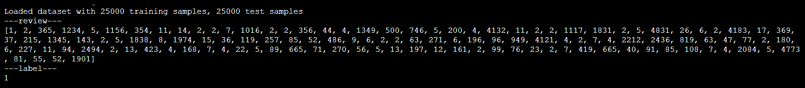

您可以看到，在这个阶段，评论已作为整数序列存储，这些整数是预先分配给单个单词的 ID。另外，标签是一个整数（0 表示负面，1 表示正面）。不过，您仍然可以通过使用`imdb.get_word_index()`方法返回的字典，将下载的评论映射回它们原始的单词，如下所示：

```py
word2id = imdb.get_word_index()
 id2word = {i: word for word, i in word2id.items()}
 print('---review with words---')
 print([id2word.get(i, ' ') for i in X_train[6]])
 print('---label---')
 print(y_train[6])
```

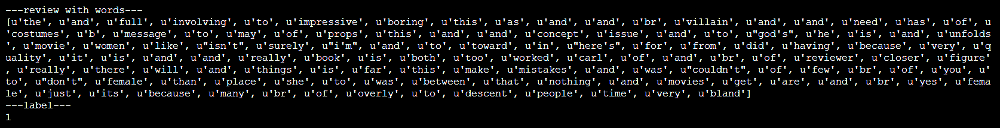

在前面的截图中，您可以看到输入评论中使用的单词的返回字典。我们将使用 RNN 模型进行此示例。为了向模型输入数据，所有输入数据的长度必须相同。通过查看下载评论的最大和最小长度（以下是获取此信息的代码及其输出）：

```py
print('Maximum review length: {}'.format(
 len(max((X_train + X_test), key=len))))
 print('Minimum review length: {}'.format(
 len(min((X_test + X_test), key=len))))
```

输出结果如下所示：

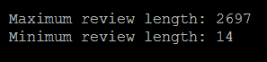

我们可以看到它们的长度不完全相同。因此，我们需要将最大评论长度限制为 500 个单词，比如通过截断较长的评论，并用零填充较短的评论。这可以通过`sequence.pad_sequences` Keras 函数实现，如下所示：

```py
from keras.preprocessing import sequence

 max_words = 500
 X_train = sequence.pad_sequences(X_train, maxlen=max_words)
 X_test = sequence.pad_sequences(X_test, maxlen=max_words)
```

让我们设计 RNN 模型，如下所示：

```py
from keras import Sequential
 from keras.layers import Embedding, LSTM, Dense, Dropout

 embedding_size=32
 model=Sequential()
 model.add(Embedding(vocabulary_size, embedding_size, input_length=max_words))
 model.add(LSTM(100))
 model.add(Dense(1, activation='sigmoid'))
```

这是一个简单的 RNN 模型，包含三层：嵌入层、LSTM 层和全连接层，如下所示：

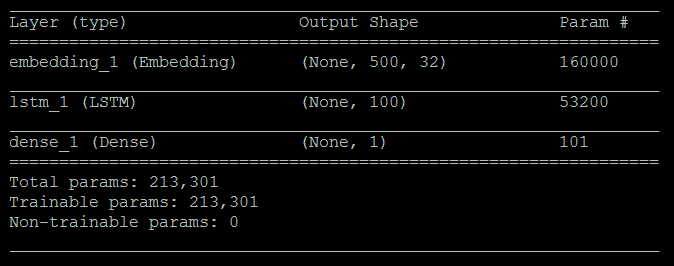

此模型的输入是一个最大长度为`500`的整数单词 ID 序列，输出是一个二进制标签（`0`或`1`）。

此模型的学习过程配置可以通过其`compile`方法来完成，如下所示：

```py
model.compile(loss='binary_crossentropy',
              optimizer='adam',
              metrics=['accuracy'])
```

在设置好批量大小和训练周期数之后，如下所示：

```py
batch_size = 64
 num_epochs = 3
```

我们可以开始训练，如下所示：

```py
X_valid, y_valid = X_train[:batch_size], y_train[:batch_size]
 X_train2, y_train2 = X_train[batch_size:], y_train[batch_size:]

 model.fit(X_train2, y_train2, validation_data=(X_valid, y_valid), batch_size=batch_size, epochs=num_epochs)
```

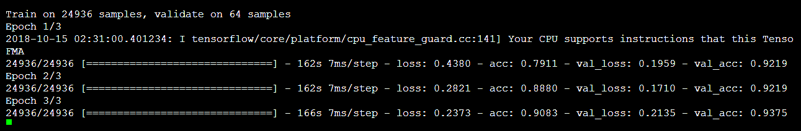

当训练完成后，我们可以使用测试数据集评估模型的准确性，方法如下：

```py
scores = model.evaluate(X_test, y_test, verbose=0)
 print('Test accuracy:', scores[1])
```

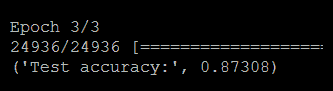

查看这个示例的代码，你应该已经注意到，相较于之前的 TensorFlow 示例，这个示例更高层次，开发时的重点主要放在特定问题模型的实现细节上，而不是其背后的机器学习/深度学习机制。

# 使用 Keras 模型导入到 DL4J 的实战 NLP

在第十章，*在分布式系统上部署*、*在 JVM 中使用 DL4J 导入 Python 模型*部分，我们学习了如何将现有的 Keras 模型导入到 DL4J 中，并在 JVM 环境中使用它们进行预测或重新训练。

这适用于我们在*使用 Keras 和 TensorFlow 后端的实战 NLP*部分中实现并训练的模型，我们使用 Keras 和 TensorFlow 作为后端。我们需要修改该示例的代码，通过以下方式将模型序列化为 HDF5 格式：

```py
model.save('sa_rnn.h5')
```

生成的`sa_rnn.h5`文件需要被复制到 Scala 项目的资源文件夹中。项目的依赖项包括 DataVec API、DL4J 核心、ND4J 以及 DL4J 模型导入库。

我们需要按照第 12.1 节中解释的方式导入并转换大型电影评论数据库，如果我们希望通过 DL4J 重新训练模型。然后，我们需要按如下方式编程导入 Keras 模型：

```py
val saRnn = new ClassPathResource("sa_rnn.h5").getFile.getPath
 val model = KerasModelImport.importKerasSequentialModelAndWeights(saRnn)
```

最后，我们可以通过调用`model`（这是`MultiLayerNetwork`的实例，和在 DL4J 中的常见做法一样）的`predict`方法，传入输入数据作为 ND4J DataSet（[`static.javadoc.io/org.nd4j/nd4j-api/1.0.0-alpha/org/nd4j/linalg/dataset/api/DataSet.html`](https://static.javadoc.io/org.nd4j/nd4j-api/1.0.0-alpha/org/nd4j/linalg/dataset/api/DataSet.html)）来进行预测。

# 总结

本章结束了对 Scala 实现过程的 NLP 解释。在本章和前一章中，我们评估了这种编程语言的不同框架，并详细列出了每种框架的优缺点。本章的重点主要放在了深度学习方法（DL）在 NLP 中的应用。为此，我们介绍了一些 Python 的替代方案，并强调了这些 Python 模型在 JVM 环境中与 DL4J 框架的潜在集成。此时，读者应该能够准确评估出哪些方案最适合他/她的特定 NLP 应用案例。

从下一章开始，我们将深入学习卷积和卷积神经网络（CNN）如何应用于图像识别问题。通过展示不同框架（包括 DL4J、Keras 和 TensorFlow）的不同实现，将解释图像识别。
