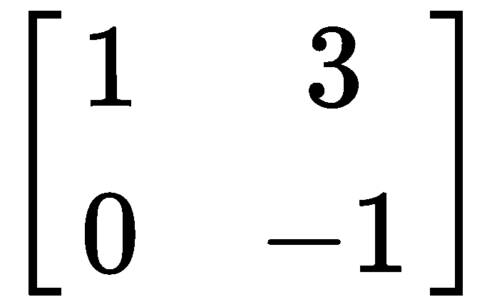

# 第十三章：卷积

前两章介绍了通过 RNN/LSTM 在 Apache Spark 中进行的 NLP 实际用例实现。在本章及接下来的章节中，我们将做类似的事情，探讨 CNN 如何应用于图像识别和分类。本章特别涉及以下主题：

+   从数学和深度学习的角度快速回顾卷积是什么

+   现实问题中物体识别的挑战与策略

+   卷积在图像识别中的应用，以及通过深度学习（卷积神经网络，CNN）实践中图像识别用例的实现，采用相同的方法，但使用以下两种不同的开源框架和编程语言：

    +   Keras（使用 TensorFlow 后端）在 Python 中的实现

    +   DL4J（及 ND4J）在 Scala 中的实现

# 卷积

第五章，*卷积神经网络*，介绍了 CNN 的理论，当然卷积也是其中的一部分。在进入物体识别之前，让我们从数学和实际的角度回顾一下这个概念。在数学中，卷积是对两个函数的操作，生成一个第三个函数，该函数是前两个函数的乘积积分结果，其中一个函数被翻转：


卷积在 2D 图像处理和信号过滤中被广泛应用。

为了更好地理解幕后发生了什么，这里是一个简单的 Python 代码示例，使用 NumPy 进行 1D 卷积（[`www.numpy.org/`](http://www.numpy.org/)）：

```py
import numpy as np

x = np.array([1, 2, 3, 4, 5])
y = np.array([1, -2, 2])
result = np.convolve(x, y)
print result
```

这会产生如下结果：


让我们看看`x`和`y`数组之间的卷积如何产生该结果。`convolve`函数首先做的事情是水平翻转`y`数组：

`[1, -2, 2]`变为`[2, -2, 1]`

然后，翻转后的`y`数组滑动在`x`数组上：


这就是如何生成`result`数组`[ 1  0  1  2  3 -2 10]`的。

2D 卷积使用类似机制发生。以下是一个简单的 Python 代码示例，使用 NumPy：

```py
import numpy as np
from scipy import signal

a = np.matrix('1 3 1; 0 -1 1; 2 2 -1')
print(a)
w = np.matrix('1 2; 0 -1')
print(w)

f = signal.convolve2d(a, w)
print(f)
```

这次，使用了 SciPy（[`www.scipy.org/`](https://www.scipy.org/)）中的`signal.convolve2d`函数来执行卷积。前面代码的结果如下：


当翻转后的矩阵完全位于输入矩阵内部时，结果被称为`valid`卷积。通过这种方式计算 2D 卷积，只获取有效结果，如下所示：

```py
f = signal.convolve2d(a, w, 'valid')
```

这将产生如下输出：


以下是这些结果的计算方式。首先，`w`数组被翻转：

变为

然后，和 1D 卷积相同，`a` 矩阵的每个窗口与翻转的 `w` 矩阵逐元素相乘，结果最终按如下方式求和：

    *(1 x -1) + (0 x 3) + (0 x 2) + (-1 x 1) = **-2***

    *(3 x -1) + (1 x 0) + (-1 x 2) + (1 x 1) = **-4***

依此类推。

# 物体识别策略

本节介绍了在数字图像中实现自动物体识别时使用的不同计算技术。首先，我们给出物体识别的定义。简而言之，它是任务：在场景的 2D 图像中找到并标记对应场景内物体的部分。以下截图展示了由人类用铅笔手动执行的物体识别示例：


图 13.1：手动物体检测示例

图像已被标记和标签化，显示可以识别为香蕉和南瓜的水果。这与计算物体识别过程完全相同；可以简单地认为它是绘制线条、勾画图像区域的过程，最后为每个结构附上与其最匹配的模型标签。

在物体识别中，必须结合多种因素，如场景上下文的语义或图像中呈现的信息。上下文在图像解读中特别重要。让我们先看看以下截图：


图 13.2：孤立物体（无上下文）

几乎不可能单独识别图像中心的物体。现在让我们看看接下来的截图，其中同一物体出现在原始图像中的位置：


图 13.3：图 13.2 中物体的原始上下文

如果不提供进一步的信息，仍然很难识别该物体，但相比于*图 13.2*，难度要小一些。给定前面截图中图像是电路板的上下文信息，初始物体更容易被识别为一个极化电容器。文化背景在正确解读场景中起着关键作用。

现在我们考虑第二个示例（如下截图所示），一个显示楼梯间的一致性 3D 图像：


图 13.4：显示楼梯间的一致性 3D 图像

通过改变该图像中的光线，最终结果可能使得眼睛（以及计算机）更难看到一致的 3D 图像（如下图所示）：


图 13.5：在图 13.4 中应用不同光线后的结果

与原始图像（*图 13.3*）相比，它的亮度和对比度已经被修改（如以下截图所示）：


图 13.6：图 13.3 中的图像，具有改变的亮度和对比度

眼睛仍然能够识别三维的阶梯。然而，使用与原始图像不同的亮度和对比度值，图像如下所示：


图 13.7：图 13.3 中的图像，具有不同的亮度和对比度

几乎无法识别出相同的图像。我们学到的是，尽管前面截图中的修饰图像保留了原始图像中的重要视觉信息（*图 13.3*），但*图 13.4*和前面的截图中的图像由于修饰去除了三维细节，变得更加难以解读。所提供的例子证明，计算机（就像人眼一样）需要合适的上下文模型才能成功完成物体识别和场景解读。

物体识别的计算策略可以根据其对复杂图像数据或复杂模型的适用性进行分类。数字图像中的数据复杂度对应于其信噪比。具有语义歧义的图像对应于复杂（或嘈杂）的数据。图像中包含完美轮廓的模型实例数据被称为简单数据。具有较差分辨率、噪声或其他类型异常数据，或容易混淆的虚假模型实例，被称为复杂数据。模型复杂度通过图像中数据结构的细节级别以及确定数据形式所需的技术来表示。如果一个模型通过简单的标准定义（例如，单一形状模板或优化一个隐式包含形状模型的单一函数），那么可能不需要其他上下文来将模型标签附加到给定的场景中。但是，在许多原子模型组件必须组合或某种方式按层次关系建立以确认所需模型实例的存在时，需要复杂的数据结构和非平凡的技术。

基于前面的定义，物体识别策略可以分为四大类，如下所示：

+   **特征向量分类**：这依赖于对象图像特征的一个简单模型。通常，它仅应用于简单数据。

+   **拟合模型到光度数据**：当简单的模型足够用，但图像的光度数据存在噪声和歧义时，应用此方法。

+   **拟合模型到符号结构**：当需要复杂的模型时应用，但可以通过简单数据准确推断可靠的符号结构。这些方法通过匹配表示全局对象部件之间关系的数据结构，来寻找对象的实例。

+   **组合策略**：在数据和所需模型实例都很复杂时应用。

本书中详细介绍的主要开源框架所提供的用于构建和训练 CNNs（卷积神经网络）进行对象识别的可用 API 实现时，已考虑到这些因素和策略。尽管这些 API 是非常高层次的，但在选择模型的适当隐藏层组合时，应该采取相同的思维方式。

# 卷积在图像识别中的应用

在这一部分，我们将通过实现一个图像识别模型来动手实践，同时考虑本章第一部分中讨论的相关事项。我们将使用两种不同的框架和编程语言实现相同的用例。

# Keras 实现

我们将要实现的第一个对象识别是在 Python 中使用 Keras 框架进行的。为了训练和评估模型，我们将使用一个名为 CIFAR-10 的公共数据集 ([`www.cs.toronto.edu/~kriz/cifar.html`](http://www.cs.toronto.edu/~kriz/cifar.html))。它包含 60,000 张（50,000 张用于训练，10,000 张用于测试）小的（32 x 32 像素）彩色图像，分为 10 类（飞机、汽车、鸟、猫、鹿、狗、青蛙、马、船和卡车）。这 10 个类别是互斥的。CIFAR-10 数据集（163 MB）可以从 [`www.cs.toronto.edu/~kriz/cifar-10-python.tar.gz`](http://www.cs.toronto.edu/~kriz/cifar-10-python.tar.gz) 免费下载。

实现此功能的前提条件是 Python 2.7.x、Keras、TensorFlow（作为 Keras 的后端使用）、NumPy 以及 `scikit-learn` ([`scikit-learn.org/stable/index.html`](http://scikit-learn.org/stable/index.html))，这是一个用于机器学习的开源工具。第十章，*在分布式系统上部署*，涵盖了为 Keras 和 TensorFlow 设置 Python 环境的详细信息。`scikit-learn` 可以按以下方式安装：

```py
sudo pip install scikit-learn
```

首先，我们需要导入所有必要的 NumPy、Keras 和 `scikit-learn` 命名空间和类，如下所示：

```py
import numpy as np
from keras.models import Sequential
from keras.layers import Dense
from keras.layers import Dropout
from keras.layers import Flatten
from keras.constraints import maxnorm
from keras.optimizers import SGD
from keras.layers.convolutional import Conv2D
from keras.layers.convolutional import MaxPooling2D
from keras.utils import np_utils
from keras.datasets import cifar10
from keras import backend as K
from sklearn.model_selection import train_test_split
```

现在，我们需要加载 CIFAR-10 数据集。不需要单独下载，Keras 提供了一个可以通过编程方式下载它的功能，如下所示：

```py
K.set_image_dim_ordering('th')
 (X_train, y_train), (X_test, y_test) = cifar10.load_data()
```

`load_data` 函数在第一次执行时会下载数据集。后续的运行将使用已下载到本地的数据集。

我们通过常量值初始化 `seed`，以确保结果是可重复的，如下所示：

```py
seed = 7
 np.random.seed(seed)
```

输入数据集的像素值范围为 0 到 255（每个 RGB 通道）。我们可以通过将值除以 `255.0` 来将数据归一化到 0 到 1 的范围，然后执行以下操作：

```py
X_train = X_train.astype('float32')
 X_test = X_test.astype('float32')

 X_train = X_train / 255.0
 X_test = X_test / 255.0
```

我们可以使用独热编码（one-hot encoding）将输出变量转换为二进制矩阵（因为它们被定义为整数向量，范围在 0 到 1 之间，针对每个 10 类），如下所示：

```py
y_train = np_utils.to_categorical(y_train)
 y_test = np_utils.to_categorical(y_test)
 num_classes = y_test.shape[1]
```

让我们开始实现模型。首先实现一个简单的 CNN，验证它的准确性，必要时我们将使模型更加复杂。以下是可能的第一次实现：

```py
model = Sequential()
model.add(Conv2D(32,(3,3), input_shape = (3,32,32), padding = 'same', activation = 'relu'))
model.add(Dropout(0.2))
model.add(Conv2D(32,(3,3), padding = 'same', activation = 'relu'))
model.add(MaxPooling2D(pool_size=(2,2)))
model.add(Conv2D(64,(3,3), padding = 'same', activation = 'relu'))
model.add(MaxPooling2D(pool_size=(2,2)))
model.add(Flatten())
model.add(Dropout(0.2))
model.add(Dense(512,activation='relu',kernel_constraint=maxnorm(3)))
model.add(Dropout(0.2))
model.add(Dense(num_classes, activation='softmax'))
```

你可以在训练开始前在控制台输出中看到模型层的详细信息（请参见以下截图）：


该模型是一个`Sequential`模型。从前面的输出可以看到，输入层是卷积层，包含 32 个大小为 3 x 3 的特征图，并使用**修正线性单元**（**ReLU**）激活函数。为了减少过拟合，对输入应用了 20% 的 dropout，接下来的层是第二个卷积层，具有与输入层相同的特征。然后，我们设置了一个大小为 2 x 2 的最大池化层。接着，添加了第三个卷积层，具有 64 个大小为 3 x 3 的特征图和 ReLU 激活函数，并设置了第二个大小为 2 x 2 的最大池化层。在第二个最大池化层后，我们加入一个 Flatten 层，并应用 20% 的 dropout，然后将输出传递到下一个层，即具有 512 个单元和 ReLU 激活函数的全连接层。在输出层之前，我们再应用一次 20% 的 dropout，输出层是另一个具有 10 个单元和 Softmax 激活函数的全连接层。

现在我们可以定义以下训练属性（训练轮数、学习率、权重衰减和优化器，在此特定情况下已设置为**随机梯度下降**（**SGD**））：

```py
epochs = 25
 lrate = 0.01
 decay = lrate/epochs
 sgd = SGD(lr=lrate, momentum=0.9, decay=decay, nesterov=False)
```

配置模型的训练过程，如下所示：

```py
model.compile(loss='categorical_crossentropy', optimizer=sgd, metrics=['accuracy'])
```

现在可以使用 CIFAR-10 训练数据开始训练，如下所示：

```py
model.fit(X_train, y_train, validation_data=(X_test, y_test), epochs=epochs, batch_size=32)
```

当完成时，可以使用 CIFAR-10 测试数据进行评估，如下所示：

```py
scores = model.evaluate(X_test,y_test,verbose=0)
 print("Accuracy: %.2f%%" % (scores[1]*100))
```

该模型的准确率大约为`75%`，如以下截图所示：


结果不是很好。我们已经在 25 个训练轮次上执行了训练，轮数比较少。因此，当训练轮次增多时，准确率会有所提高。不过，首先让我们看看通过改进 CNN 模型、使其更深，能否提高结果。添加以下两个额外的导入：

```py
from keras.layers import Activation
 from keras.layers import BatchNormalization
```

对之前实现的代码的唯一更改是网络模型。以下是新的模型：

```py
model = Sequential()
model.add(Conv2D(32, (3,3), padding='same', input_shape=x_train.shape[1:]))
model.add(Activation('elu'))
model.add(BatchNormalization())
model.add(Conv2D(32, (3,3), padding='same'))
model.add(Activation('elu'))
model.add(BatchNormalization())
model.add(MaxPooling2D(pool_size=(2,2)))
model.add(Dropout(0.2))

model.add(Conv2D(64, (3,3), padding='same'))
model.add(Activation('elu'))
model.add(BatchNormalization())
model.add(Conv2D(64, (3,3), padding='same'))
model.add(Activation('elu'))
model.add(BatchNormalization())
model.add(MaxPooling2D(pool_size=(2,2)))
model.add(Dropout(0.3))

model.add(Conv2D(128, (3,3), padding='same'))
model.add(Activation('elu'))
model.add(BatchNormalization())
model.add(Conv2D(128, (3,3), padding='same'))
model.add(Activation('elu'))
model.add(BatchNormalization())
model.add(MaxPooling2D(pool_size=(2,2)))
model.add(Dropout(0.4))

model.add(Flatten())
model.add(Dense(num_classes, activation='softmax'))
```

基本上，我们所做的就是重复相同的模式，每种模式使用不同数量的特征图（32、64 和 128）。添加层的优势在于每一层都会学习不同抽象级别的特征。在我们的例子中，训练一个 CNN 来识别物体时，我们可以看到第一层会训练自己识别基本特征（例如，物体的边缘），接下来的层会训练自己识别形状（可以认为是边缘的集合），然后的层会训练自己识别形状集合（以 CIFAR-10 数据集为例，这些可能是腿、翅膀、尾巴等），接下来的层会学习更高阶的特征（物体）。多个层更有利于因为它们能够学习从输入（原始数据）到高层分类之间的所有中间特征：


再次运行训练并进行该新模型的评估，结果是`80.57%`：


与先前的模型相比，这是一个合理的改进，考虑到我们目前只进行了 25 个 epoch 的训练。但现在，让我们看看是否可以通过图像数据增强来进一步提升性能。通过查看训练数据集，我们可以看到图像中的物体位置发生了变化。通常情况下，数据集中的图像会有不同的条件（例如亮度、方向等）。我们需要通过使用额外修改过的数据来训练神经网络来应对这些情况。考虑以下简单示例：一个仅包含两类的汽车图像训练数据集，大众甲壳虫和保时捷 Targa。假设所有的大众甲壳虫汽车都排列在左侧，如下图所示：


图 13.8：大众甲壳虫训练图像

然而，所有的保时捷 Targa 汽车都排列在右侧，如下图所示：


图 13.9：保时捷 Targa 训练图像

在完成训练并达到较高准确率（90%或 95%）后，输入以下截图所示的图像进行模型预测：


图 13.10：大众甲壳虫输入图像

这里存在一个具体的风险，可能会将这辆车误分类为 Porsche Targa。为了避免这种情况，我们需要减少训练数据集中无关特征的数量。以这辆车为例，我们可以做的一件事是将训练数据集中的图像水平翻转，使它们朝向另一侧。经过再次训练神经网络并使用这个新数据集后，模型的表现更有可能符合预期。数据增强可以在离线（适用于小数据集）或在线（适用于大数据集，因为变换应用于喂给模型的小批次数据）进行。让我们尝试在本节示例的最新模型实现中，使用 Keras 中的 `ImageDataGenerator` 类进行程序化的在线数据增强，方法如下：

```py
from keras.preprocessing.image import ImageDataGenerator

datagen = ImageDataGenerator(
    rotation_range=15,
    width_shift_range=0.1,
    height_shift_range=0.1,
    horizontal_flip=True,
    )
datagen.fit(X_train)
```

然后在拟合模型时使用它，如下所示：

```py
batch_size = 64

model.fit_generator(datagen.flow(X_train, y_train, batch_size=batch_size),\
                 steps_per_epoch=X_train.shape[0] // batch_size,epochs=125,\
                 verbose=1,validation_data=(X_test,y_test),callbacks=[LearningRateScheduler(lr_schedule)])
```

在开始训练之前，还需要做一件事，那就是对模型的卷积层应用一个核正则化器（[`keras.io/regularizers/`](https://keras.io/regularizers/)），如下所示：

```py
weight_decay = 1e-4
model = Sequential()
model.add(Conv2D(32, (3,3), padding='same', kernel_regularizer=regularizers.l2(weight_decay), input_shape=X_train.shape[1:]))
model.add(Activation('elu'))
model.add(BatchNormalization())
model.add(Conv2D(32, (3,3), padding='same', kernel_regularizer=regularizers.l2(weight_decay)))
model.add(Activation('elu'))
model.add(BatchNormalization())
model.add(MaxPooling2D(pool_size=(2,2)))
model.add(Dropout(0.2))

model.add(Conv2D(64, (3,3), padding='same', kernel_regularizer=regularizers.l2(weight_decay)))
model.add(Activation('elu'))
model.add(BatchNormalization())
model.add(Conv2D(64, (3,3), padding='same', kernel_regularizer=regularizers.l2(weight_decay)))
model.add(Activation('elu'))
model.add(BatchNormalization())
model.add(MaxPooling2D(pool_size=(2,2)))
model.add(Dropout(0.3))

model.add(Conv2D(128, (3,3), padding='same', kernel_regularizer=regularizers.l2(weight_decay)))
model.add(Activation('elu'))
model.add(BatchNormalization())
model.add(Conv2D(128, (3,3), padding='same', kernel_regularizer=regularizers.l2(weight_decay)))
model.add(Activation('elu'))
model.add(BatchNormalization())
model.add(MaxPooling2D(pool_size=(2,2)))
model.add(Dropout(0.4))

model.add(Flatten())
model.add(Dense(num_classes, activation='softmax'))
```

正则化器允许我们在网络优化过程中对层参数应用惩罚（这些惩罚会被纳入损失函数中）。

在这些代码更改后，使用相对较小的训练轮次（64）和基本的图像数据增强来训练模型。下图显示，准确率提高到了接近 84%：


通过训练更多的轮次，模型的准确率可能会增加到大约 90% 或 91%。

# DL4J 实现

我们要做的第二个物体识别实现是基于 Scala，并涉及到 DL4J 框架。为了训练和评估模型，我们仍然使用 CIFAR-10 数据集。本项目的依赖项包括 DataVec 数据图像、DL4J、NN 和 ND4J，以及 Guava 19.0 和 Apache commons math 3.4。

如果你查看 CIFAR-10 数据集下载页面（见下图），你会发现有专门为 Python、MatLab 和 C 编程语言提供的归档文件，但没有针对 Scala 或 Java 的归档文件：


图 13.11：CIFAR-10 数据集下载页面

我们不需要单独下载并转换数据集用于 Scala 应用；DL4J 数据集库提供了 `org.deeplearning4j.datasets.iterator.impl.CifarDataSetIterator` 迭代器，可以编程获取训练集和测试集，如下所示：

```py
val trainDataSetIterator =
                 new CifarDataSetIterator(2, 5000, true)
 val testDataSetIterator =
                 new CifarDataSetIterator(2, 200, false)
```

`CifarDataSetIterator` 构造函数需要三个参数：批次数、样本数以及一个布尔值，用于指定数据集是用于训练（`true`）还是测试（`false`）。

现在我们可以定义神经网络了。我们实现一个函数来配置模型，如下所示：

```py
def defineModelConfiguration(): MultiLayerConfiguration =
     new NeuralNetConfiguration.Builder()
        .seed(seed)
        .cacheMode(CacheMode.DEVICE)
        .updater(new Adam(1e-2))
        .biasUpdater(new Adam(1e-2*2))
        .gradientNormalization(GradientNormalization.RenormalizeL2PerLayer)
        .optimizationAlgo(OptimizationAlgorithm.STOCHASTIC_GRADIENT_DESCENT)
        .l1(1e-4)
        .l2(5 * 1e-4)
        .list
        .layer(0, new ConvolutionLayer.Builder(Array(4, 4), Array(1, 1), Array(0, 0)).name("cnn1").convolutionMode(ConvolutionMode.Same)
            .nIn(3).nOut(64).weightInit(WeightInit.XAVIER_UNIFORM).activation(Activation.RELU)
            .biasInit(1e-2).build)
        .layer(1, new ConvolutionLayer.Builder(Array(4, 4), Array(1, 1), Array(0, 0)).name("cnn2").convolutionMode(ConvolutionMode.Same)
            .nOut(64).weightInit(WeightInit.XAVIER_UNIFORM).activation(Activation.RELU)
            .biasInit(1e-2).build)
        .layer(2, new SubsamplingLayer.Builder(PoolingType.MAX, Array(2,2)).name("maxpool2").build())

        .layer(3, new ConvolutionLayer.Builder(Array(4, 4), Array(1, 1), Array(0, 0)).name("cnn3").convolutionMode(ConvolutionMode.Same)
            .nOut(96).weightInit(WeightInit.XAVIER_UNIFORM).activation(Activation.RELU)
            .biasInit(1e-2).build)
        .layer(4, new ConvolutionLayer.Builder(Array(4, 4), Array(1, 1), Array(0, 0)).name("cnn4").convolutionMode(ConvolutionMode.Same)
            .nOut(96).weightInit(WeightInit.XAVIER_UNIFORM).activation(Activation.RELU)
            .biasInit(1e-2).build)

        .layer(5, new ConvolutionLayer.Builder(Array(3,3), Array(1, 1), Array(0, 0)).name("cnn5").convolutionMode(ConvolutionMode.Same)
            .nOut(128).weightInit(WeightInit.XAVIER_UNIFORM).activation(Activation.RELU)
            .biasInit(1e-2).build)
        .layer(6, new ConvolutionLayer.Builder(Array(3,3), Array(1, 1), Array(0, 0)).name("cnn6").convolutionMode(ConvolutionMode.Same)
            .nOut(128).weightInit(WeightInit.XAVIER_UNIFORM).activation(Activation.RELU)
            .biasInit(1e-2).build)

        .layer(7, new ConvolutionLayer.Builder(Array(2,2), Array(1, 1), Array(0, 0)).name("cnn7").convolutionMode(ConvolutionMode.Same)
            .nOut(256).weightInit(WeightInit.XAVIER_UNIFORM).activation(Activation.RELU)
            .biasInit(1e-2).build)
        .layer(8, new ConvolutionLayer.Builder(Array(2,2), Array(1, 1), Array(0, 0)).name("cnn8").convolutionMode(ConvolutionMode.Same)
            .nOut(256).weightInit(WeightInit.XAVIER_UNIFORM).activation(Activation.RELU)
            .biasInit(1e-2).build)
        .layer(9, new SubsamplingLayer.Builder(PoolingType.MAX, Array(2,2)).name("maxpool8").build())

        .layer(10, new DenseLayer.Builder().name("ffn1").nOut(1024).updater(new Adam(1e-3)).biasInit(1e-3).biasUpdater(new Adam(1e-3*2)).build)
        .layer(11,new DropoutLayer.Builder().name("dropout1").dropOut(0.2).build)
        .layer(12, new DenseLayer.Builder().name("ffn2").nOut(1024).biasInit(1e-2).build)
        .layer(13,new DropoutLayer.Builder().name("dropout2").dropOut(0.2).build)
        .layer(14, new OutputLayer.Builder(LossFunctions.LossFunction.NEGATIVELOGLIKELIHOOD)
            .name("output")
            .nOut(numLabels)
            .activation(Activation.SOFTMAX)
            .build)
        .backprop(true)
        .pretrain(false)
        .setInputType(InputType.convolutional(height, width, channels))
        .build
```

与在*Keras 实现*部分中实现的模型完全相同的考虑因素也适用于此。因此，我们跳过所有中间步骤，直接实现一个复杂的模型，如下图所示：


图 13.12：本节示例的模型图示

下面是模型的详细信息：

| **层类型** | **输入大小** | **层大小** | **参数数量** | **权重初始化** | **更新器** | **激活函数** |
| --- | --- | --- | --- | --- | --- | --- |
| 输入层 |  |  |  |  |  |  |
| 卷积层 | 3 | 64 | 3,136 | XAVIER_UNIFORM | Adam | ReLU |
| 卷积层 | 64 | 64 | 65,600 | XAVIER_UNIFORM | Adam | ReLU |
| 下采样（最大池化） |  |  |  |  |  |  |
| 卷积层 | 64 | 96 | 98,400 | XAVIER_UNIFORM | Adam | ReLU |
| 卷积层 | 96 | 96 | 147,552 | XAVIER_UNIFORM | Adam | ReLU |
| 卷积层 | 96 | 128 | 110,720 | XAVIER_UNIFORM | Adam | ReLU |
| 卷积层 | 128 | 128 | 147,584 | XAVIER_UNIFORM | Adam | ReLU |
| 卷积层 | 128 | 256 | 131,328 | XAVIER_UNIFORM | Adam | ReLU |
| 卷积层 | 256 | 256 | 262,400 | XAVIER_UNIFORM | Adam | ReLU |
| 下采样（最大池化） |  |  |  |  |  |  |
| 全连接层 | 16,384 | 1,024 | 16,778,240 | XAVIER | Adam | Sigmoid |
| Dropout | 0 | 0 | 0 |  |  | Sigmoid |
| 全连接层 | 1,024 | 1,024 | 1,049,600 | XAVIER | Adam | Sigmoid |
| Dropout | 0 | 0 | 0 |  |  | Sigmoid |
| 输出层 | 1,024 | 10 | 10,250 | XAVIER | Adam | Softmax |

那么我们接下来初始化模型，如下所示：

```py
val conf = defineModelConfiguration
 val model = new MultiLayerNetwork(conf)
 model.init
```

然后，开始训练，如下所示：

```py
val epochs = 10
 for(idx <- 0 to epochs) {
     model.fit(trainDataSetIterator)
 }
```

最后，评估它，如下所示：

```py
val eval = new Evaluation(testDataSetIterator.getLabels)
 while(testDataSetIterator.hasNext) {
     val testDS = testDataSetIterator.next(batchSize)
     val output = model.output(testDS.getFeatures)
     eval.eval(testDS.getLabels, output)
 }
 println(eval.stats)
```

我们在这里实现的神经网络具有相当多的隐藏层，但按照前一节的建议（增加更多层，做数据增强，以及训练更多的 epoch），可以大幅提高模型的准确度。

训练当然可以使用 Spark 完成。前述代码中需要的更改，正如在第七章中详细介绍的那样，*使用 Spark 训练神经网络*，涉及 Spark 上下文初始化、训练数据并行化、`TrainingMaster` 创建，以及使用 `SparkDl4jMultiLayer` 实例执行训练，如下所示：

```py
// Init the Spark context
 val sparkConf = new SparkConf
 sparkConf.setMaster(master)
   .setAppName("Object Recognition Example")
 val sc = new JavaSparkContext(sparkConf)

 // Parallelize data
 val trainDataList = mutable.ArrayBuffer.empty[DataSet]
 while (trainDataSetIterator.hasNext) {
   trainDataList += trainDataSetIterator.next
 }
 val paralleltrainData = sc.parallelize(trainDataList)

 // Create the TrainingMaster
 var batchSizePerWorker: Int = 16
 val tm = new
   ParameterAveragingTrainingMaster.Builder(batchSizePerWorker)
   .averagingFrequency(5)
   .workerPrefetchNumBatches(2)
   .batchSizePerWorker(batchSizePerWorker)
   .build

 // Training
 val sparkNet = new SparkDl4jMultiLayer(sc, conf, tm)
 for (i <- 0 until epochs) {
   sparkNet.fit(paralleltrainData)
   println("Completed Epoch {}", i)
 }
```

# 总结

在回顾了卷积概念和物体识别策略分类之后，本章中，我们以实践的方式，使用不同的语言（Python 和 Scala）以及不同的开源框架（第一种情况下使用 Keras 和 TensorFlow，第二种情况下使用 DL4J、ND4J 和 Apache Spark），实现并训练了卷积神经网络（CNN）进行物体识别。

在下一章中，我们将实现一个完整的图像分类 web 应用程序，其背后使用了 Keras、TensorFlow、DL4J、ND4J 和 Spark 的组合。
