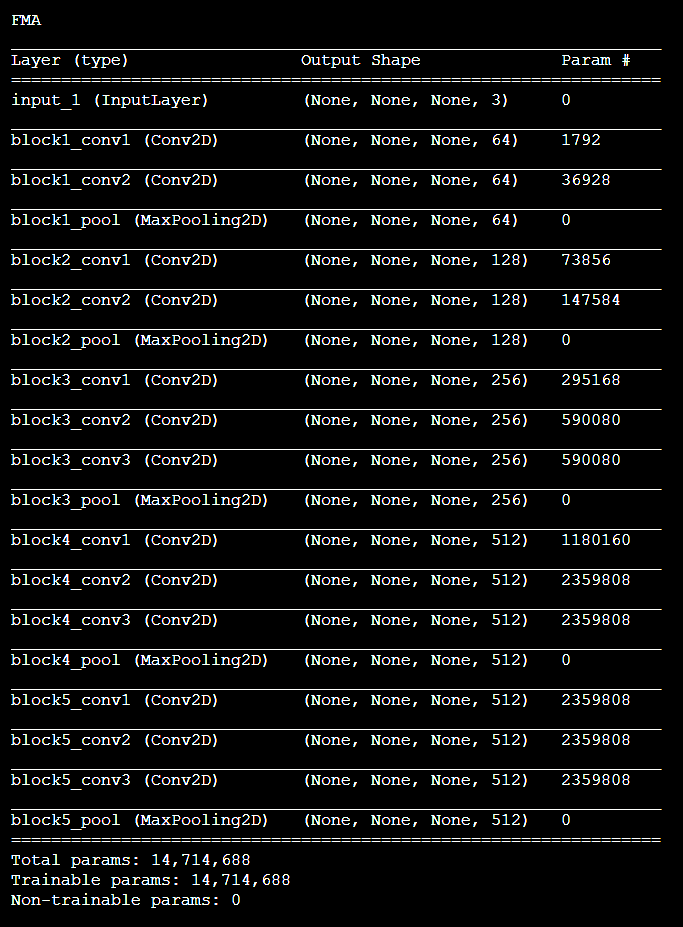
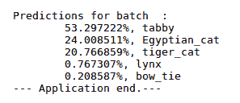
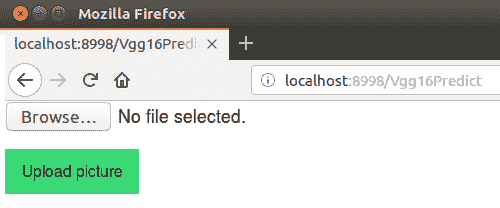
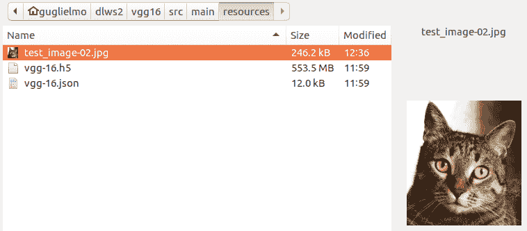
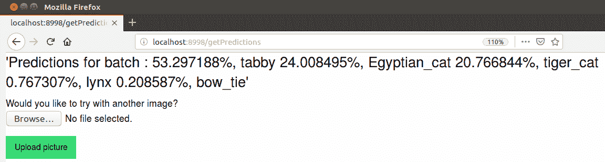
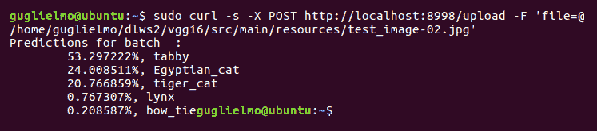
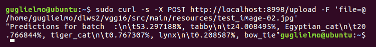

# 第十四章：图像分类

在前一章中，我们简要回顾了卷积的概念，并通过 Python（Keras）和 Scala（DL4J）的示例深入学习了物体识别的策略及更多实现细节。本章将介绍如何实现一个完整的图像分类 web 应用程序或 web 服务。这里的目标是向你展示如何将上一章的概念应用到端到端的分类系统中。

完成这一目标的步骤如下：

+   选择一个合适的 Keras（带 TensorFlow 后端）预训练 CNN 模型

+   在 DL4J（和 Spark）中加载并测试它

+   了解如何在 Apache Spark 上重新训练 Python 模型

+   实现一个使用该模型的图像分类 web 应用程序

+   实现一个使用该模型的替代图像分类 web 服务

在前几章中，我们学习使用 DL 场景时遇到的所有开源技术，都在这里的实现过程中得到了应用。

# 实现一个端到端的图像分类 web 应用程序

使用我们在本书前几章学到的所有知识，现在我们应该能够实现一个实际的 web 应用程序，允许用户上传图像并对其进行正确的分类。

# 选择一个合适的 Keras 模型

我们将使用一个现有的、预训练的 Python Keras CNN 模型。Keras 应用程序（[`keras.io/applications/`](https://keras.io/applications/)）是一组包含预训练权重的 DL 模型，作为框架的一部分提供。其中的模型包括 VGG16，这是一个由牛津大学视觉几何组在 2014 年实现的 16 层 CNN。该模型兼容 TensorFlow 后端，并且已经在 ImageNet 数据库（[`www.image-net.org/`](http://www.image-net.org/)）上进行了训练。ImageNet 数据集是一个非常适合一般图像分类的优秀训练集，但它不适合面部识别模型的训练。下面是加载和使用 Keras 中的 VGG16 模型的方法。我们使用 TensorFlow 后端。让我们导入该模型：

```py
from keras.applications.vgg16 import VGG16
```

然后，我们需要导入其他必要的依赖（包括 NumPy 和 Pillow）：

```py
from keras.preprocessing import image
from keras.applications.vgg16 import preprocess_input
import numpy as np
from PIL import Image
```

现在，我们可以创建模型的实例：

```py
model = VGG16(weights='imagenet', include_top=True)
```

预训练的权重将在第一次运行该应用程序时自动下载。后续运行将从本地 `~/.keras/models/` 目录中加载权重。

这是模型的架构：



我们可以通过加载一张图像来测试模型：

```py
img_path = 'test_image.jpg'
 img = image.load_img(img_path, target_size=(224, 224))
```

我们可以将其准备好作为模型的输入（通过将图像像素转换为 NumPy 数组并进行预处理）：

```py
x = image.img_to_array(img)
 x = np.expand_dims(x, axis=0)
 x = preprocess_input(x)
```

然后，我们可以进行预测：

```py
features = model.predict(x)
```

最后，我们保存模型配置（以 JSON 格式）：

```py
model_json = model.to_json()
 with open('vgg-16.json', 'w') as json_file:
     json_file.write(model_json)
```

我们还可以保存模型的权重，以便导入到 DL4J 中：

```py
model.save_weights("vgg-16.h5")
```

然后，我们将以下图像作为输入传递给模型：


该图像被正确分类为虎斑猫，可能性接近 64%。

# 在 DL4J 中导入并测试模型

在第十章中，*在分布式系统上部署*，我们学习了如何将预训练的 Keras 模型导入到 DL4J 中。现在我们在这里应用相同的过程。

Scala 项目的依赖项包括 DL4J DataVec、NN、模型导入、动物园和 ND4J，以及 Apache common math 3。

我们需要做的第一件事是将模型配置（来自`vgg-16.json`文件）和权重（来自`vgg-16.h5`文件）复制到项目的资源文件夹中。然后，我们可以通过`KerasModelImport`类的`importKerasModelAndWeights`方法加载它们：

```py
val vgg16Json = new ClassPathResource("vgg-16.json").getFile.getPath
 val vgg16 = new ClassPathResource("vgg-16.h5").getFile.getPath
 val model = KerasModelImport.importKerasModelAndWeights(vgg16Json, vgg16, false)
```

传递给方法的第三个参数是一个布尔值；如果为`false`，则表示该预训练模型仅用于推理，不会重新训练。

让我们使用前面截图中的图像来测试模型。我们需要将它复制到应用程序的资源目录中。然后，我们可以加载它，并将其调整为所需的大小（224 × 224 像素）：

```py
val testImage = new ClassPathResource("test_image.jpg").getFile

 val height = 224
 val width = 224
 val channels = 3
 val loader = new NativeImageLoader(height, width, channels)
```

为此，我们使用的是 DataVec 图像 API 中的`NativeImageLoader`类（[`jar-download.com/javaDoc/org.datavec/datavec-data-image/1.0.0-alpha/org/datavec/image/loader/NativeImageLoader.html`](https://jar-download.com/javaDoc/org.datavec/datavec-data-image/1.0.0-alpha/org/datavec/image/loader/NativeImageLoader.html)）。

然后，我们需要将图像转换为 NDArray 并进行预处理：

```py
val image = loader.asMatrix(testImage)
 val scaler = new VGG16ImagePreProcessor
 scaler.transform(image)
```

之后，我们需要通过模型进行推理：

```py
val output = model.output(image)
```

为了以人类可读的格式消费结果，我们使用`org.deeplearning4j.zoo.util.imagenet.ImageNetLabels`类，它在 DL4J 的动物园库中可用。该类`decodePredictions`方法的输入是从模型的`output`方法返回的 NDArray 数组：

```py
val imagNetLabels = new ImageNetLabels
 val predictions = imagNetLabels.decodePredictions(output(0))
 println(predictions)
```

以下截图展示了前面代码的输出。它呈现了上传图像的预测结果（按降序排列）。根据模型的预测，最高概率（大约 53.3%）是输入图像中的主要物体是一只虎斑猫（这是正确的）：



你应该注意到，一旦模型被导入，通过 DL4J API 加载图像并进行推理的步骤与我们在上一节中展示的 Keras 示例相同。

在模型经过测试后，最好通过`ModelSerializer`类将其保存：

```py
val modelSaveLocation = new File("Vgg-16.zip")
 ModelSerializer.writeModel(model, modelSaveLocation, true)
```

然后，我们可以通过相同的类加载它，因为与从 Keras 加载相比，这样的资源消耗更少。

# 在 Apache Spark 中重新训练模型

为了提高我们在本章使用案例中考虑的 Keras VGG16 预训练模型的准确性，我们还可以决定对其进行再训练，并应用我们从上一章学到的所有最佳实践（运行更多的 epochs、图像增强等等）。一旦模型导入到 DL4J 中，其训练可以按照 第七章《*使用 Spark 训练神经网络*》（使用 DL4J 和 Apache Spark 进行训练）中解释的方式进行。在加载后，会创建一个 `org.deeplearning4j.nn.graph.ComputationGraph` 实例，因此，训练多层网络的相同原则在这里同样适用。

为了信息的完整性，你需要知道，Keras 模型也可以在 Apache Spark 上以并行模式进行训练。这可以通过 `dist-keras` Python 框架实现（[`github.com/cerndb/dist-keras/`](https://github.com/cerndb/dist-keras/)），该框架是为 **分布式深度学习** (**DDL**) 创建的。可以通过 `pip` 安装该框架：

```py
sudo pip install dist-keras
```

它需要 TensorFlow（将作为后端使用）并且需要设置以下变量：

```py
export SPARK_HOME=/usr/lib/spark
 export PYTHONPATH="$SPARK_HOME/python/:$SPARK_HOME/python/lib/py4j-0.9-src.zip:$PYTHONPATH"
```

让我们快速看一下使用 `dist-keras` 进行分布式训练的典型流程。以下代码不是完整的工作示例；这里的目标是让你了解如何设置数据并行训练。

首先，我们需要导入 Keras、PySpark、Spark MLLib 和 `dist-keras` 所需的所有类。我们将首先导入 Keras：

```py
from keras.optimizers import *
 from keras.models import Sequential
 from keras.layers.core import Dense, Dropout, Activation
```

然后，我们可以导入 PySpark：

```py
from pyspark import SparkContext
 from pyspark import SparkConf
```

然后，我们导入 Spark MLLib：

```py
from pyspark.ml.feature import StandardScaler
 from pyspark.ml.feature import VectorAssembler
 from pyspark.ml.feature import StringIndexer
 from pyspark.ml.evaluation import MulticlassClassificationEvaluator
 from pyspark.mllib.evaluation import BinaryClassificationMetrics
```

最后，我们导入 `dist-keras`：

```py
from distkeras.trainers import *
 from distkeras.predictors import *
 from distkeras.transformers import *
 from distkeras.evaluators import *
 from distkeras.utils import *
```

然后，我们需要创建 Spark 配置，如下所示：

```py
conf = SparkConf()
 conf.set("spark.app.name", application_name)
 conf.set("spark.master", master)
 conf.set("spark.executor.cores", num_cores)
 conf.set("spark.executor.instances", num_executors)
 conf.set("spark.locality.wait", "0")
 conf.set("spark.serializer", "org.apache.spark.serializer.KryoSerializer");
```

然后我们可以使用它来创建一个 `SparkSession`：

```py
sc = SparkSession.builder.config(conf=conf) \
     .appName(application_name) \
     .getOrCreate()
```

数据集现在如下所示：

```py
raw_dataset = sc.read.format('com.databricks.spark.csv') \
                     .options(header='true', inferSchema='true').load("data/some_data.csv")
```

我们可以使用此数据集通过 Spark 核心和 Spark MLLib 提供的 API 执行数据预处理和标准化（策略取决于数据集的性质，因此在此无法展示代码）。一旦完成此阶段，我们可以使用 Keras API 来定义我们的模型。

这是一个简单的 `Sequential` 模型的示例：

```py
model = Sequential()
 model.add(Dense(500, input_shape=(nb_features,)))
 model.add(Activation('relu'))
 model.add(Dropout(0.4))
 model.add(Dense(500))
 model.add(Activation('relu'))
 model.add(Dense(nb_classes))
 model.add(Activation('softmax'))
```

最后，你可以通过选择 `dist-keras` 提供的多个优化算法之一来启动训练过程：

+   顺序训练器

+   ADAG

+   动态 SDG

+   AEASGD

+   AEAMSGD

+   DOWNPOUR

+   集成训练

+   模型平均

虽然列表中的后面几种方法性能更好，但第一个 `SingleTrainer`，通常作为基准 `trainer` 使用，在数据集过大无法完全加载到内存时，可能是一个不错的 `trainer` 选择。以下是使用 `SingleTrainer` 进行训练的代码示例：

```py
trainer = SingleTrainer(keras_model=model, worker_optimizer=optimizer,
                         loss=loss, features_col="features_normalized",
                         label_col="label", num_epoch=1, batch_size=32)
 trained_model = trainer.train(training_set)
```

# 实现 Web 应用程序

让我们回到主要任务，开始实现一个允许用户上传图片的网页应用程序，然后使用序列化的 VGG16 模型对其进行推断。JVM 上有多个框架可以用来实现网页应用程序。在这种情况下，为了最小化我们的工作量，我们将使用 SparkJava（[`sparkjava.com/`](http://sparkjava.com/)，不要与 Apache Spark 混淆），这是一个为 JVM 编程语言设计的微框架，旨在快速原型开发。与其他网页框架相比，它的模板代码最少。SparkJava 不仅仅是为网页应用程序设计的；也可以用非常少的代码行来实现 REST API（它将在下一节中用于实现我们的图像分类网页服务）。

我们必须将 SparkJava 添加到 Java 项目的依赖项列表中：

```py
groupId: com.sparkjava
 artifactId: spark-core
 version: 2.7.2
```

本示例的参考版本为`2.7.2`（在写这本书时是最新版本）。

在最简单的实现中，一个 SparkJava 网页应用程序只需在`main`方法中写一行代码：

```py
get("/hello", (req, res) -> "Hello VGG16");
```

运行应用程序后，`hello`页面可以通过以下 URL 从网页浏览器访问：

```py
http://localhost:4567/hello
```

`4567`是 SparkJava 网页应用程序的默认端口。

SparkJava 应用程序的主要构建块是路由。路由由三部分组成：一个动词（`get`、`post`、`put`、`delete`、`head`、`trace`、`connect`和`options`是可用的动词）、一个路径（在前面的代码示例中是`/hello`）和一个回调（`request`或`response`）。SparkJava API 还包括用于会话、Cookie、过滤器、重定向和自定义错误处理的类。

让我们开始实现我们的网页应用程序。项目的其他依赖项包括 DL4J 核心、DataVec、NN、模型导入和动物园（zoo），以及 ND4J。我们需要将 DL4J 的序列化模型（`Vgg-16.zip`文件）添加到项目的资源中。然后，可以通过`ModelSerializer`类在程序中加载该模型：

```py
ClassLoader classLoader = getClass().getClassLoader();
 File serializedModelFile = new File(classLoader.getResource("Vgg-16.zip").getFile());
 ComputationGraph vgg16 = ModelSerializer.restoreComputationGraph(serializedModelFile);
```

我们需要创建一个目录，用于存放用户上传的图片：

```py
File uploadDir = new File("upload");
 uploadDir.mkdir();
```

下一步是创建一个表单，让用户可以上传图片。在 SparkJava 中，可以为网页使用自定义样式。在这个例子中，我们将添加响应式的 Foundation 6 框架（[`foundation.zurb.com/`](https://foundation.zurb.com/)）和 CSS。我们将最小的 Foundation CSS 库（`foundation-float.min.css`）添加到项目资源文件夹下的一个名为`public`的子目录中。这样，网页应用程序就可以在类路径中访问它。静态文件的位置可以通过编程方式注册：

```py
staticFiles.location("/public");
```

Foundation CSS 和其他静态 CSS 文件可以在页面的头部注册。这里是为此示例实现的方法：

```py
private String buildFoundationHeader() {
     String header = "<head>\n"
           + "<link rel='stylesheet' href='foundation-float.min.css'>\n"
           + "</head>\n";

     return header;
 }
```

我们现在实现一个名为`buildUploadForm`的方法，它返回该表单的 HTML 内容：

```py
private String buildUploadForm() {
      String form =
              "<form method='post' action='getPredictions' enctype='multipart/form-data'>\n" +
              " <input type='file' name='uploadedFile'>\n" +
              " <button class='success button'>Upload picture</button>\n" +
              "</form>\n";

     return form;
 }
```

然后我们在定义上传页面路由时使用这个方法：

```py
String header = buildFoundationHeader();
 String form = buildUploadForm();
 get("Vgg16Predict", (req, res) -> header + form);
```

现在我们可以定义`post`请求：

```py
post("/doPredictions", (req, res)
```

我们这样做是为了处理图像上传和分类。在此`post`请求的主体中，我们需要执行以下操作：

1.  将图像文件上传到`upload`目录

1.  将图像转换为 NDArray

1.  删除文件（转换后不需要将其保留在 Web 服务器磁盘上）

1.  预处理图像

1.  执行推理

1.  显示结果

当转换成 Java 时，代码如下所示：

```py
// Upload the image file
Path tempFile = Files.createTempFile(uploadDir.toPath(), "", "");

req.attribute("org.eclipse.jetty.multipartConfig", new MultipartConfigElement("/temp"));

try (InputStream input = req.raw().getPart("uploadedFile").getInputStream()) {
  Files.copy(input, tempFile, StandardCopyOption.REPLACE_EXISTING);
}

// Convert file to INDArray
File file = tempFile.toFile();

NativeImageLoader loader = new NativeImageLoader(224, 224, 3);
INDArray image = loader.asMatrix(file);

// Delete the physical file
file.delete();

// Pre-processing the image to prepare it for the VGG-16 model
DataNormalization scaler = new VGG16ImagePreProcessor();
scaler.transform(image);

// Do inference
INDArray[] output = vgg16.output(false,image);

// Get the predictions
ImageNetLabels imagNetLabels = new ImageNetLabels();
String predictions = imagNetLabels.decodePredictions(output[0]);

// Return the results
return buildFoundationHeader() + "<h4> '" + predictions + "' </h4>" +
  "Would you like to try another image?" +
  form;
```

你会注意到，通过 DL4J 进行的图像准备和推理部分与独立应用程序中的完全相同。

启动应用程序后，可以通过以下 URL 访问它：

```py
http://localhost:4567/Vgg16Predict
```

可以通过编程方式设置不同的监听端口：

```py
port(8998);
```

以下截图展示了上传页面的布局：



以下截图展示了我们上传所需图像：



结果如下所示：



# 实现 Web 服务

正如我们在前一节中提到的，SparkJava 可以快速实现 REST API。我们在前一节中实现的示例 Web 应用程序是单体的，但回顾其源代码，我们可以注意到将前端与后端分离并将其移至 REST API 会变得非常容易。

提供图像提交表单的前端客户端可以通过任何 Web 前端框架实现。客户端然后会调用通过 SparkJava 实现的 REST 服务，后者使用 VGG16 模型进行推理，最终返回 JSON 格式的预测结果。让我们看看从现有的 Web 应用程序代码开始，实现这个服务有多么简单。

Web 服务是一个带有主方法作为入口点的 Java 类。我们来定义一个自定义监听端口：

```py
port(8998);
```

现在我们已经完成了这一步，我们需要定义`upload`端点：

```py
post("/upload", (req, res) -> uploadFile(req));
```

我们需要将原始`post`体中的代码移到`uploadFile`方法中（唯一的区别是返回值，它只是预测内容，而不是完整的 HTML 内容）：

```py
private String uploadFile(Request req) throws IOException, ServletException {
    // Upload the image file
    Path tempFile = Files.createTempFile(uploadDir.toPath(), "", "");

    req.attribute("org.eclipse.jetty.multipartConfig", new MultipartConfigElement("/temp"));

    try (InputStream input = req.raw().getPart("file").getInputStream()) {
      Files.copy(input, tempFile, StandardCopyOption.REPLACE_EXISTING);
    }

    // Convert file to INDArray
    File file = tempFile.toFile();

    NativeImageLoader loader = new NativeImageLoader(224, 224, 3);
    INDArray image = loader.asMatrix(file);

    // Delete the physical file
    file.delete();

    // Pre-processing the image to prepare it for the VGG-16 model
    DataNormalization scaler = new VGG16ImagePreProcessor();
    scaler.transform(image);

    // Do inference
    INDArray[] output = vgg16.output(false,image);

    // Get the predictions
    ImageNetLabels imagNetLabels = new ImageNetLabels();
    String predictions = imagNetLabels.decodePredictions(output[0]);

    // Return the results
    return predictions;
}
```

运行应用程序后，你可以通过简单的`curl`（[`curl.haxx.se/`](https://curl.haxx.se/)）命令进行测试：

```py
curl -s -X POST http://localhost:8998/upload -F 'file=@/home/guglielmo/dlws2/vgg16/src/main/resources/test_image-02.jpg'
```

输出将如下所示：



如果我们希望以 JSON 格式返回输出，这是我们需要对 Web 服务代码进行的唯一更改：

```py
Gson gson = new Gson();
 post("/upload", (req, res) -> uploadFile(req), gson::toJson);
```

我们只需要创建一个`com.google.gson.Gson`实例，并将其作为最后一个参数传递给`post`方法。我们的示例输出将如下所示：



# 总结

在本章中，我们通过结合本书前几章中学习的多个开源框架，成功实现了我们的第一个端到端图像分类 web 应用程序。读者现在应该掌握了构建块的所有知识，可以开始使用 Scala 和/或 Python 以及 DL4J 和/或 Keras 或 TensorFlow 开发自己的 DL 模型或应用程序。

本章结束了本书的实践部分。接下来的最后一章将讨论 DL 和 AI 的未来，重点讨论 DL4J 和 Apache Spark。
