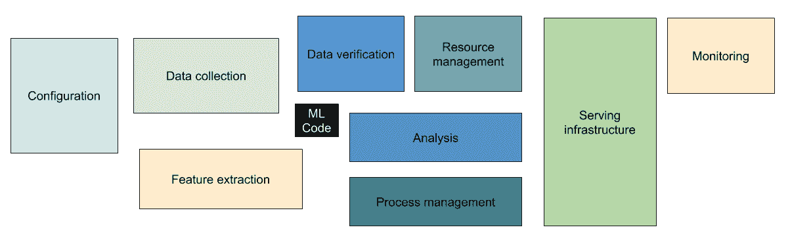
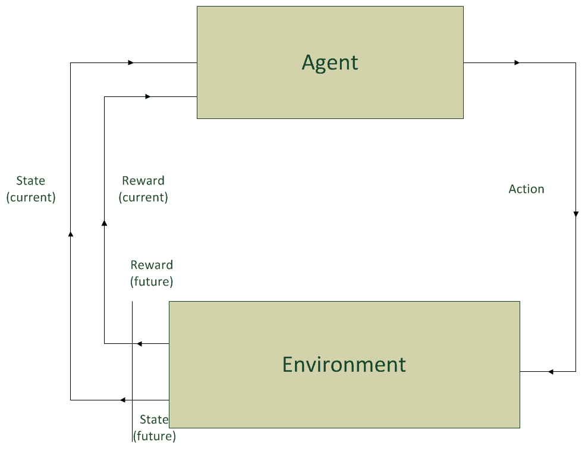
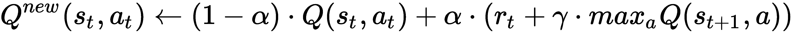
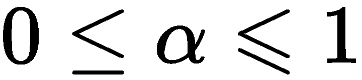
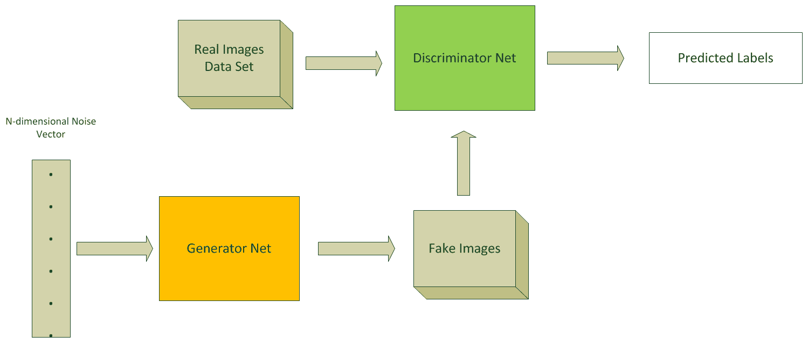

# 第十五章：深度学习的下一步是什么？

本章的最后将尝试概述**深度学习**（**DL**）的未来，以及更广泛的人工智能的未来。

本章将涵盖以下主题：

+   深度学习（DL）与人工智能（AI）

+   热点话题

+   Spark 和 **强化学习** (**RL**)

+   **生成对抗网络**（**GANs**）在 DL4J 中的支持

技术的快速进步不仅加速了现有人工智能理念的实施，还在这一领域创造了新的机会，这些机会在一两年前是不可想象的。人工智能日复一日地在各个领域发现新的实际应用，并且正在彻底改变我们在这些领域中的业务方式。因此，覆盖所有的新场景是不可能的，所以我们将专注于一些特定的领域/情境，那里我们直接或间接地有所参与。

# 对深度学习和人工智能的未来期望

如前所述，技术每天都在进步，同时计算能力的提升变得更加普及，且变得更加廉价，数据的可得性也在增加，这一切都推动着更深层次和更复杂模型的实现。因此，深度学习和人工智能的边界似乎没有上限。尝试理解我们对这些领域的期望，可能有助于我们清晰地了解短期内（2-3 年）会发生什么，但接下来可能发生的事情则较为不可预测，因为在这一领域中，任何新的想法都带来了其他的想法，并且正在推动多个行业的业务方式发生根本性的变化。因此，我将在本节中描述的是关于近期未来的内容，而非长期的变化。

深度学习在塑造人工智能的未来中发挥了关键作用。在某些领域，如图像分类和识别、物体检测和自然语言处理（NLP）中，深度学习已经超越了机器学习（ML），但这并不意味着机器学习算法已经过时。对于一些特定问题，深度学习可能有些过于复杂，因此机器学习仍然足够。在一些更复杂的情况下，深度学习与非深度学习算法的结合已经取得了显著成果；一个完美的例子是 DeepMind 团队的 AlphaGo 系统（[`deepmind.com/research/alphago/`](https://deepmind.com/research/alphago/)），它使用**蒙特卡洛树搜索**（**MCTS**）：[`mcts.ai/about/`](http://mcts.ai/about/)，结合深度学习网络来快速寻找制胜的棋步。深度学习的这一巨大进展也促成了其他更复杂和更先进的技术，如强化学习和生成对抗网络，这些将在本章的最后两节中讨论。

然而，虽然算法和模型正在取得令人惊人的快速进展，仍然存在许多障碍需要显著的人工干预（和额外的时间），才能在将数据提取并转化为机器智能之前消除它们。正如谷歌研究小组在论文*Hidden Technical Debt in Machine Learning Systems*（[`papers.nips.cc/paper/5656-hidden-technical-debt-in-machine-learning-systems.pdf`](https://papers.nips.cc/paper/5656-hidden-technical-debt-in-machine-learning-systems.pdf)）中讨论的那样，在 DL 和 ML 系统中，数据依赖的成本难以检测，并且可能轻易高于代码依赖的成本。以下图表取自同一篇谷歌研究论文，显示了 ML 或 DL 系统中 ML 或 DL 代码相对于其他依赖的比例：

图 15.1：现实世界中的大部分 ML/DL 系统只有一个很小的部分（图像中央的黑色矩形）由 ML/DL 代码组成

正如您从上述图表中可以看到的那样，诸如数据收集、设置和维护服务基础设施等事项比模型的实施和训练更为耗时和花费。因此，我期望在自动化这些任务时会有显著的改进。

# 需关注的话题

在过去的几个月中，关于所谓的可解释 AI，即不是黑匣子类型（我们只理解其基础数学原理）并且其行动或决策可以被人类轻松理解的 AI，引发了一场新的辩论。批评也已经开始（一般针对 AI，但特别是 DL），关于模型生成的结果不符合**GDPR**（即**通用数据保护条例**）的问题：[`ec.europa.eu/commission/priorities/justice-and-fundamental-rights/data-protection/2018-reform-eu-data-protection-rules_en`](https://ec.europa.eu/commission/priorities/justice-and-fundamental-rights/data-protection/2018-reform-eu-data-protection-rules_en) ，涉及欧盟公民的数据，或其他可能在全球其他地区定义的数据法规，这些法规要求有权要求解释，以防止基于不同因素的歧视效应。

尽管这是一个非常热门且不容忽视的话题，而且已有一些有趣的分析和提案（例如来自都柏林科技学院的 Luca Longo 博士的[`www.academia.edu/18088836/Defeasible_Reasoning_and_Argument-Based_Systems_in_Medical_Fields_An_Informal_Overview`](https://www.academia.edu/18088836/Defeasible_Reasoning_and_Argument-Based_Systems_in_Medical_Fields_An_Informal_Overview)以及[`ie.linkedin.com/in/drlucalongo`](https://ie.linkedin.com/in/drlucalongo)的研究），我（以及本书的读者们大概也是）有机会听取了其他一些人对深度学习（DL）未来不佳的预测观点，认为 DL 的应用将仅限于非商业性应用和游戏。在本节中，我不会对这种观点做评论，因为它通常更多是基于意见而非事实，而且有时由那些没有完全参与 DL 或机器学习（ML）领域的生产或研究项目的人提出。相反，我更愿意展示一份关于仍然有效且可以持续一段时间的实际 DL 应用列表。

医疗保健是 AI 和 DL 实际应用数量较多的行业之一。Optum（[`www.optum.com/`](https://www.optum.com/)），作为 UnitedHealth Group 的一部分，已经在其整体战略中取得了显著成果，特别是在将自然语言处理（NLP）应用于多个商业用例中。AI 理解结构化和非结构化数据的能力在医疗记录审查中起着至关重要的作用（大多数数据都是非结构化的）。Optum 的所谓临床智能 NLP 能够解锁非结构化内容，以获取结构化数据元素，如诊断、治疗过程、药物、实验室检查等，进而形成完整且准确的临床文档。

来自非结构化来源的数据通过 NLP 技术自动提取，与通过更*传统*临床模型和规则引擎获得的结构化数据互补。这种自动化水平能够准确识别诊断、相关疾病和治疗过程，以实施提供的护理，但它也有助于定义适当的报销、质量措施以及其他关键的医疗保健操作。然而，理解记录中已经记录了什么，仅仅是 NLP 在医疗领域价值的一个方面。临床智能 NLP 技术还能够识别文档中的空白；它不仅能理解记录中有什么，还能理解缺少了什么。通过这种方式，临床医生可以获得有价值的反馈，从而改善文档记录。Optum 在 AI 方面的其他显著应用还包括支付完整性、简化的人口分析和呼叫中心等。

人工智能的另一个热门话题是机器人技术。从技术角度讲，机器人学是一个独立的领域，但它与人工智能有很多交集。深度学习（DL）和强化学习（RL）的进展为机器人技术中的多个问题提供了解决方案。机器人定义为首先能够感知，然后计算传感器的输入，最后根据这些计算结果采取行动。人工智能的介入使得机器人摆脱了工业化的“步步重复”模式，使它们变得更加智能。

在这一方向上，一个成功的用户案例是德国初创公司 Kewazo（[`www.kewazo.com/`](https://www.kewazo.com/)）。他们实施了一种智能机器人脚手架运输系统，解决了人手不足、效率低下、高成本、耗时工作和工人安全等问题。人工智能使得他们能够实现一个机器人系统，通过实时传递关于整体脚手架组装过程的数据，实现持续控制和显著优化或调优。人工智能还帮助 Kewazo 的工程师识别出其他应用场景，例如屋顶或太阳能面板安装，机器人可以在这些场景中工作并帮助实现与脚手架组装相同的结果。

**物联网**（**IoT**）是人工智能日益普及的另一个领域。物联网的基本概念是日常使用的物理设备通过互联网连接，并能够相互通信以交换数据。这些收集到的数据可以被智能处理，从而使设备变得更加智能。随着连接设备数量的急剧增加（以及由这些设备生成的数据），人工智能和物联网的应用场景也在不断增长。

在这些应用场景中，我想提到人工智能在智能建筑中的潜力。过去五年，由信息技术、银行、金融和制药等行业推动的爱尔兰经济迅速增长，导致我目前工作的地区发生了根本性变化，即都柏林市中心的 Docklands 和 Grand Canal Dock 之间。为了应对新兴或扩张中的公司对办公空间日益增长的需求，数百座新建筑应运而生（还有更多在建）。所有这些新建的建筑都使用了一些人工智能技术，结合物联网，使建筑变得更智能。在以下领域取得了显著成果：

+   让建筑对人类更加舒适

+   让建筑对人类更加安全

+   改善能源节约（并有助于环保）

传统的控制器（例如温度、灯光、门等）使用有限数量的传感器自动调整设备以实现恒定的最终结果。这个范式以前忽视了一个重要的因素：建筑物是由人类居住的，但无论是否有人在场，建筑物的控制方式都是一样的。这意味着像让人们感到舒适或节省能源之类的问题，根本没有被考虑在内。物联网与人工智能相结合，可以填补这个关键的空白。因此，建筑物可以有优先级，而不仅仅是遵循严格的编程范式。

物联网和人工智能的另一个有趣的实际应用场景是农业。农业部门（特别是乳制品）是爱尔兰国内生产总值的重要组成部分，也是爱尔兰出口中不可忽视的一部分。农业面临着新的和旧的挑战（例如在相同的土地面积上生产更多的食物、满足严格的排放要求、保护种植园免受害虫侵害、考虑气候及全球气候变化、控制水流、监控大规模果园、抗击火灾、监控土壤质量、监测动物健康等等）。这意味着农民不能仅仅依赖传统的做法。人工智能、物联网和物联网支持的传感器正在帮助他们解决我们之前提到的挑战以及更多的问题。爱尔兰已经在多个实际应用中部署了智能农业（其中一些在 2018 年 Predict 大会上展示过：[`www.tssg.org/projects/precision-dairy/`](https://www.tssg.org/projects/precision-dairy/)），预计 2019 年还会有更多应用落地。

说到人工智能和物联网，边缘分析是另一个热门话题。边缘分析是传统的大数据分析的替代方案，传统大数据分析通常是在集中式方式下执行的，而边缘分析则是在系统中的某个非中心点（例如连接设备或传感器）分析数据。目前，边缘分析在工业 4.0 领域中已有多个实际应用（但不限于此）([`en.wikipedia.org/wiki/Industry_4.0`](https://en.wikipedia.org/wiki/Industry_4.0))。在数据生成的同时进行分析，可以减少决策过程中的延迟，尤其是在连接设备上。

例如，假设在某制造系统中，传感器数据指示某个特定部件可能会故障；内置在机器学习（ML）或深度学习（DL）算法中的规则可以自动在网络边缘解读这些数据，进而关闭机器并向维修经理发送警报，以便及时更换该部件。与将数据传输到集中数据位置进行处理和分析相比，这可以节省大量时间，并减少甚至避免计划外机械停机的风险。

边缘分析还带来了可伸缩性方面的好处。在那些组织中，连接设备数量增加（以及生成和收集的数据量也增加）的情况下，通过将算法推送到传感器和网络设备，可以减轻企业数据管理和集中分析系统的处理压力。在这个领域有一些值得关注的有前途的开源项目。DL4J 本身就是其中之一；其移动特性允许在 Android 设备上定义多层神经网络模型、训练和推理（由于 Android 是 JVM 框架的自然选择，其他移动平台不支持）。TensorFlow Lite ([`www.tensorflow.org/lite/`](https://www.tensorflow.org/lite/)) 可以在几种移动操作系统（包括 Android、iOS 和其他）和嵌入式设备上实现低延迟、小二进制大小的设备端 ML 推理。StreamSets 数据收集器边缘的最新版本（[`streamsets.com/products/sdc-edge`](https://streamsets.com/products/sdc-edge)）允许在设备上触发高级分析和 ML（TensorFlow）（Linux、Android、iOS、Windows 和 MacOS 是其支持的操作系统）。我期待在这个领域会有更多来自开源世界的发展。

DL 的崛起促使研究人员开发出可以直接实现神经网络架构的硬件芯片。它们设计为在硬件级别模仿人脑。在传统芯片中，数据需要在 CPU 和存储块之间传输，而在神经形态芯片中，数据既在芯片内处理又存储，并且在需要时可以生成突触。这种第二种方法不会产生时间开销，并且节省能量。因此，未来的人工智能很可能更多地基于神经形态芯片而不是基于 CPU 或 GPU。人类大脑中大约有 1000 亿个神经元密集地打包在一个小体积内，使用非常少的能量就能以闪电般的速度处理复杂计算。在过去几年中，出现了受大脑启发的算法，可以做到识别人脸、模仿声音、玩游戏等。但软件只是更大图景的一部分。我们现代的计算机实际上无法运行这些强大的算法。这就是神经形态计算进入游戏的地方。

本节中展示的场景确实证实了，在考虑到 GDPR 或其他数据法规时，深度学习和人工智能绝对不会局限于无用的应用。

# Spark 准备好接受 RL 了吗？

在本书中，我们已经理解了深度学习（DL）如何解决计算机视觉、自然语言处理和时间序列预测中的多个问题。将 DL 与强化学习（RL）结合起来，可以解决更复杂的问题，并带来更惊人的应用。那么，什么是强化学习（RL）呢？它是机器学习（ML）中的一个特定领域，在这个领域中，代理必须采取行动，以最大化给定环境中的奖励。强化学习这个术语来源于这种学习过程与孩子们通过糖果获得激励的相似性；当 RL 算法做出正确决策时会获得奖励，做出错误决策时会受到惩罚。RL 与监督学习不同，后者中的训练数据本身就带有答案，然后通过正确的答案来训练模型。在 RL 中，代理决定该做什么来完成任务，如果没有训练数据集可用，它们只能通过自己的经验来学习。

强化学习的一个主要应用领域是计算机游戏（其中最优秀且最受欢迎的成果之一是来自 Alphabet 公司 DeepMind 团队的 AlphaGo，详见[`deepmind.com/research/alphago/`](https://deepmind.com/research/alphago/)），但它也可以应用于其他领域，如机器人技术、工业自动化、聊天机器人系统、自动驾驶汽车、数据处理等。

在了解 Apache Spark 中对 RL 的支持以及它可能的发展之前，让我们先看一下强化学习的基本概念。

下面是主要的概念：

+   **代理**：它是执行动作的算法。

+   **动作**：它是代理可以采取的可能行动之一。

+   **折扣因子**：它量化了即时奖励与未来奖励在重要性上的差异。

+   **环境**：它是代理所处的世界。环境以代理的当前状态和动作作为输入，返回代理的奖励和下一个状态作为输出。

+   **状态**：它是代理所处的具体情境。

+   **奖励**：它是衡量代理行动成功或失败的反馈（该行动使得从一个状态到另一个状态的转变）。

+   **策略**：它是一个代理根据当前状态来决定其下一步动作的策略。

+   **价值**：它是当前状态下，在给定策略下的预期长期回报。

+   **Q 值**：它类似于价值，但还考虑了当前的动作。

+   **轨迹**：它是影响状态和动作的状态与动作序列。

我们可以总结强化学习（RL）如下：

图 15.2：强化学习反馈回路

一个很好的例子来解释这些概念的是流行的吃豆人视频游戏，详见[`en.wikipedia.org/wiki/Pac-Man`](https://en.wikipedia.org/wiki/Pac-Man)；请看下面的截图：

图 15.3：吃豆人视频游戏

在这里，代理是吃豆人角色，目标是在迷宫中吃掉所有食物，同时避开一些试图杀死它的鬼怪。迷宫是代理的环境。它吃到食物会获得奖励，被鬼怪杀死时则会受到惩罚（游戏结束）。状态是代理在迷宫中的位置。总累计奖励是代理赢得游戏并进入下一个关卡。开始探索后，吃豆人（代理）可能会发现迷宫四个角落附近的四颗能量豆（使它对鬼怪免疫），并决定花费所有时间利用这一发现，不断绕着迷宫的这小块区域转，永远不深入迷宫的其他部分去追求更大的奖励。为了构建一个最优策略，代理面临一个两难选择：一方面是探索新的状态，另一方面是最大化其奖励。这样，它可能错过了最终奖励（进入下一个关卡）。这被称为探索与利用的权衡。

最流行的 RL 算法是**马尔可夫决策过程**（**MDP**）：[`en.wikipedia.org/wiki/Markov_decision_process`](https://en.wikipedia.org/wiki/Markov_decision_process)，**Q 学习** ([`en.wikipedia.org/wiki/Q-learning`](https://en.wikipedia.org/wiki/Q-learning))，和**A3C** ([`arxiv.org/pdf/1602.01783.pdf`](https://arxiv.org/pdf/1602.01783.pdf))。

Q 学习广泛应用于游戏（或类似游戏的）领域。它可以用以下方程式概括（源代码来自 Q 学习的 Wikipedia 页面）：

在这里，*s[t]* 是时刻 `t` 的状态，*a[t]* 是代理采取的行动，*r[t]* 是时刻 `t` 的奖励，*s[t+1]* 是新的状态（时刻 *t+1*）， 是学习率 ()，而  是折扣因子。最后一个参数决定了未来奖励的重要性。如果它为零，代理会变得目光短浅，因为它只会考虑当前的奖励。如果其值接近 1，代理则会努力实现长期的高奖励。如果折扣因子值为 1 或更高，则行动值可能会发散。

Apache Spark 的 MLLib 组件目前没有针对 RL 的任何功能，而且在编写本书时，似乎没有计划在未来的 Spark 版本中实现对此的支持。然而，确实有一些与 Spark 集成的开源稳定 RL 项目。

DL4J 框架提供了一个专门的 RL 模块——RL4J，最初是一个独立的项目。和所有其他 DL4J 组件一样，它完全与 Apache Spark 集成。它实现了 DQN（深度 Q 学习与双 DQN）和 AC3 RL 算法。

英特尔的杨宇豪（[`www.linkedin.com/in/yuhao-yang-8a150232`](https://www.linkedin.com/in/yuhao-yang-8a150232)）做了有趣的实现，促成了 Analytics Zoo 计划的启动（[`github.com/intel-analytics/analytics-zoo`](https://github.com/intel-analytics/analytics-zoo)）。这是他在 2018 年 Spark-AI 峰会上的演讲链接（[`databricks.com/session/building-deep-reinforcement-learning-applications-on-apache-spark-using-bigdl`](https://databricks.com/session/building-deep-reinforcement-learning-applications-on-apache-spark-using-bigdl)）。Analytics Zoo 提供了一个统一的分析和 AI 平台，可以将 Spark、TensorFlow、Keras 和 BigDL 程序无缝集成到一个可以扩展到大规模 Spark 集群进行分布式训练或推理的管道中。

虽然 RL4J 作为 DL4J 的一部分，为 JVM 语言（包括 Scala）提供 API，而 BigDL 则为 Python 和 Scala 提供 API，但 Facebook 提供了一个仅支持 Python 的端到端开源平台，用于大规模强化学习。这个平台的名称是 Horizon（[`github.com/facebookresearch/Horizon`](https://github.com/facebookresearch/Horizon)）。Facebook 自己也在生产环境中使用它来优化大规模环境中的系统。它支持离散动作 DQN、参数化动作 DQN、双 DQN、DDPG（[`arxiv.org/abs/1509.02971`](https://arxiv.org/abs/1509.02971)）和 SAC（[`arxiv.org/abs/1801.01290`](https://arxiv.org/abs/1801.01290)）算法。该平台中的工作流和算法都是建立在开源框架（PyTorch 1.0、Caffe2 和 Apache Spark）上的。目前尚不支持与其他流行的 Python 机器学习框架（如 TensorFlow 和 Keras）一起使用。

RISELab（[`rise.cs.berkeley.edu/`](https://rise.cs.berkeley.edu/)）的 Ray 框架（[`ray-project.github.io/`](https://ray-project.github.io/)）值得特别提及。尽管 DL4J 和我们之前提到的其他框架是在 Apache Spark 之上以分布式模式工作，但在伯克利的研究人员眼中，Ray 是 Spark 本身的替代品，他们认为 Spark 更通用，但并不完全适合某些实际的 AI 应用。Ray 是用 Python 实现的，完全兼容最流行的 Python 深度学习框架，包括 TensorFlow 和 PyTorch；并且它允许在同一应用中使用多个框架的组合。

在强化学习（RL）的特定情况下，Ray 框架还提供了一个专门的库 RLLib（[`ray.readthedocs.io/en/latest/rllib.html`](https://ray.readthedocs.io/en/latest/rllib.html)），它实现了 AC3、DQN、进化策略（[`en.wikipedia.org/wiki/Evolution_strategy`](https://en.wikipedia.org/wiki/Evolution_strategy)）和 PPO（[`blog.openai.com/openai-baselines-ppo/`](https://blog.openai.com/openai-baselines-ppo/)）算法。写这本书时，我不知道任何真实世界的 AI 应用正在使用这个框架，但我相信值得关注它如何发展以及行业的采用程度。

# DeepLearning4J 未来对 GAN 的支持

**生成对抗网络**（**GANs**）是包括两个互相对抗的网络的深度神经网络架构（这也是名称中使用*对抗*一词的原因）。GAN 算法用于无监督机器学习。GAN 的主要焦点是从零开始生成数据。在 GAN 的最流行应用场景中，包括从文本生成图像、图像到图像的翻译、提高图像分辨率以制作更真实的图片，以及对视频的下一帧进行预测。

如前所述，GAN 由两个深度网络组成，**生成器**和**判别器**；第一个生成候选数据，第二个评估这些候选数据。让我们从很高的层次来看生成性和判别性算法是如何工作的。判别性算法尝试对输入数据进行分类，因此它们预测输入数据属于哪个标签或类别。它们唯一关心的是将特征映射到标签。生成性算法则不同，它们在给定某个标签时尝试预测特征，而不是像判别性算法那样预测标签。实际上，它们做的事情正好与判别性算法相反。

下面是 GAN 的工作原理。生成器生成新的数据实例，而判别器评估这些数据以判断其真实性。使用本书中多次举例的相同 MNIST 数据集（[`yann.lecun.com/exdb/mnist/`](http://yann.lecun.com/exdb/mnist/)），让我们通过一个场景来明确 GAN 中发生的过程。假设我们有一个生成器生成像手写数字这样的 MNIST 数据集，然后将它们传递给判别器。生成器的目标是生成看起来像手写数字的图像，而不被发现；而判别器的目标是识别出来自生成器的这些图像是假手写数字。参考下面的图示，GAN 的步骤如下：

1.  生成器网络接受一些随机数字作为输入，然后返回一张图像。

1.  生成的图像被用来喂给判别器网络，同时传入其他从训练数据集中获取的图像流。

1.  判别器在接收真实和伪造图像时，会返回概率值，这些概率值介于零和一之间。零代表伪造的预测，而一代表真实性的预测：

图 15.4：MNIST 示例 GAN 的典型流程

在实现方面，**判别器网络**是一个标准的卷积神经网络（CNN），可以对输入的图像进行分类，而**生成器网络**是一个反向卷积神经网络（CNN）。这两个网络在零和博弈中优化不同且相对立的损失函数。该模型本质上是一个演员-评论员模型（[`cs.wmich.edu/~trenary/files/cs5300/RLBook/node66.html`](https://cs.wmich.edu/~trenary/files/cs5300/RLBook/node66.html)），其中**判别器网络**会改变其行为，生成器网络也是如此，反之亦然。

在撰写本书时，DL4J 并未提供任何直接支持生成对抗网络（GAN）的 API，但它允许你导入现有的 Keras（如你可以在[`github.com/eriklindernoren/Keras-GAN`](https://github.com/eriklindernoren/Keras-GAN)找到的那样，这是我们的 GitHub 仓库）或 TensorFlow（如这个：[`github.com/aymericdamien/TensorFlow-Examples/blob/master/examples/3_NeuralNetworks/gan.py`](https://github.com/aymericdamien/TensorFlow-Examples/blob/master/examples/3_NeuralNetworks/gan.py)）的 GAN 模型，然后在 JVM 环境中（包括 Spark）使用 DL4J API 重新训练它们和/或进行预测，正如第十章《*在分布式系统上的部署*》和第十四章《*图像分类*》所解释的那样。目前，DL4J 没有针对 GAN 的直接功能，但导入 Python 模型是训练和推理的有效方法。

# 总结

本章总结了本书的内容。在本书中，我们熟悉了 Apache Spark 及其组件，随后我们开始探索深度学习（DL）的基础知识，并开始实际操作。我们通过理解如何从不同的数据源（无论是批处理还是流模式）导入训练和测试数据，并通过 DataVec 库将其转化为向量，开始了我们的 Scala 实操之旅。接着，我们探索了卷积神经网络（CNN）和递归神经网络（RNN）的细节，以及通过 DL4J 实现这些网络模型的方法，如何在分布式和基于 Spark 的环境中训练它们，如何使用 DL4J 的可视化工具监控它们并获取有用的见解，以及如何评估它们的效率并进行推理。

我们还学习了一些配置生产环境进行训练时应遵循的技巧和最佳实践，以及如何将已经在 Keras 和/或 TensorFlow 中实现的 Python 模型导入并使其在基于 JVM 的环境中运行（或重新训练）。在本书的最后部分，我们将之前学到的知识应用于先使用深度学习实现自然语言处理（NLP）应用场景，再到实现一个端到端的图像分类应用。

我希望所有阅读完本书所有章节的读者都达成了我的初衷目标：他们已经掌握了所有的构建块，可以开始在分布式系统（如 Apache Spark）中，使用 Scala 和/或 Python 处理他们自己特定的深度学习（DL）应用场景。
