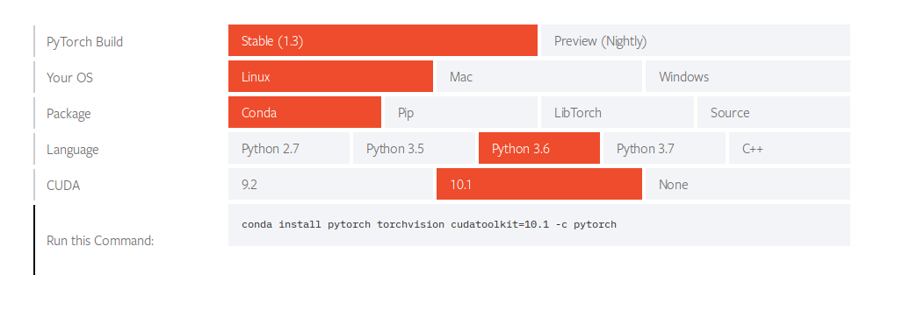

# 第二章：开始使用 PyTorch 1.3

PyTorch 1.3 终于发布了！你准备好利用它的新特性和功能，让你的研究和生产工作变得更加轻松吗？

本章将带你了解 PyTorch 中引入的重大变化，包括从 eager 模式切换到图模式。我们将探讨如何将旧代码迁移到 1.x 版本，并带你了解 PyTorch 生态系统以及云端支持。

此外，我们还将介绍如何安装 CUDA，以便你可以利用 GPU 加速来加快 PyTorch 代码的训练和评估过程。我们将展示在 Windows 10 和 Ubuntu 18.04（无论是纯 Python 环境还是 Anaconda 环境）上安装 PyTorch 的逐步过程，以及如何从源代码构建 PyTorch。

最后，作为额外内容，我们将展示如何为 PyTorch 开发配置 Microsoft VS Code，以及一些最好的扩展插件，以使你的工作更加愉快。

本章将涵盖以下主题：

+   PyTorch 1.3 的新特性是什么？

+   CUDA - 用于快速训练和评估的 GPU 加速

+   在 Windows 和 Linux 上安装 PyTorch

+   参考资料和有用的阅读书单

# PyTorch 1.3 的新特性是什么？

**PyTorch** ([`pytorch.org`](https://pytorch.org)) 是一个开源的 Python 机器学习平台。它专门为深度学习应用设计，如**卷积神经网络**（**CNNs**）、**递归神经网络**（**RNNs**）和**生成对抗网络**（**GANs**），并为这些应用提供了广泛的层定义。它内置了张量操作，旨在像 NumPy 数组一样使用，同时也经过优化，能够在 GPU 上快速计算。它提供了自动计算图机制，因此你无需手动计算导数。

经过大约 3 年的开发和改进，PyTorch 终于迎来了它的最新版本——1.3 版！新版本带来了大量的新特性和新功能。你不用担心需要重新学习这个工具；即使是全新的版本，PyTorch 一直擅长保持其核心功能的一致性。事实上，自从其 alpha 版（版本 0.1.1）发布以来，其核心模块变化不大：`torch.nn`、`torch.autograd`和`torch.optim`，这与其他一些平台不同。（没错！我们说的就是你，TensorFlow！）现在，让我们来看看 PyTorch 的一些新特性。

# 从 eager 模式到图模式的轻松切换

当 PyTorch 大约两年前首次引起人们的关注时，它相对于其他深度学习工具的一个最大优势就是支持动态计算图。可能正是这个特点促使人们放弃旧有工具，转而采用 PyTorch。正如你可能已经注意到的，最近，越来越多的最新深度学习论文的作者开始使用 PyTorch 来实现他们的实验。

然而，这并不意味着 PyTorch 不适合生产环境。在 1.0 版本中，PyTorch 提供了一个**混合前端**，可以轻松地将你的代码从动态图模式（eager mode）转换为图模式（静态图）。你可以像以前一样灵活地编写代码。当你对代码满意时，只需通过修改几行代码，它就能准备好在图模式下进行高效优化。这个过程是通过 torch.jit 编译器完成的。**JIT**（**即时**-**编译**）编译器旨在将 PyTorch 代码序列化并优化为**TorchScript**，后者可以在没有 Python 解释器的情况下运行。

这意味着现在你可以轻松地将模型导出到一个没有 Python 的环境中，或者效率极为重要的地方，并通过 C++代码调用你的模型。提供了两种方式将传统的 PyTorch 代码转换为 TorchScript：追踪和脚本化。**追踪**非常适合直接将固定输入的固定模型结构转换为图模式。

然而，如果你的模型中存在任何数据依赖的控制流（例如 RNN），**脚本化**是为这种场景设计的，其中所有可能的控制流路径都会转换为 TorchScript。请记住，至少在编写本书时，脚本化仍然存在一些局限性。

**动态图**意味着每次运行模型时都会建立计算图，并且可以在不同的运行之间进行更改。就像每个人开着自己的车在街上行驶，每次离开家时都可以去任何地方。它对研究来说非常灵活。然而，在每次运行之前建立计算图所需的额外资源开销是不可忽视的。因此，它可能对于生产环境来说效率较低。**静态图**意味着计算图必须在第一次运行之前建立，并且一旦建立就不能再更改。就像每个人都坐公共汽车上班。如果乘客想去不同的目的地，他们必须与公交车司机沟通，司机再与公共交通部门联系。然后，第二天公交路线可以进行调整。

这是如何将模型转换为图模式的示例。

假设我们已经在给定的`device`上拥有了`model`：

```py
model = Net().to(device)
```

我们只需添加这些代码行来`trace`模型：

```py
trace_input = torch.rand(BATCH_SIZE, IMG_CHANNEL, IMG_HEIGHT, IMG_WIDTH).to(device)
traced_model = torch.jit.trace(model, trace_input)
```

然后，我们可以将追踪后的模型`保存`到文件中：

```py
traced_model.save("model_jit.pth")
```

请注意，你应避免使用`torch.save(traced_model.state_dict(), "model_jit.pth")`来保存追踪后的模型，因为在编写本书时，以这种方式创建的检查点文件无法被 C++ API 正确处理。

现在，追踪模型可以像在 Python 中使用普通的 `torch.nn.Module` 一样使用，也可以被其他 C++ 代码使用，稍后我们会讲解这一点。这个示例的完整代码，包含我们训练并导出用于 MNIST 分类的 CNN，可以在代码仓库中的 `jit/mnist_jit.py` 文件中找到。你可以参考官方教程，了解更多关于混合前端的信息：[`pytorch.org/tutorials/beginner/deploy_seq2seq_hybrid_frontend_tutorial.html`](https://pytorch.org/tutorials/beginner/deploy_seq2seq_hybrid_frontend_tutorial.html)。

# C++ 前端

尽管 PyTorch 的后端主要是由 C++ 实现的，但其前端 API 一直以来都集中在 Python 上。部分原因是 Python 在数据科学家中已经非常流行，并且拥有大量开源包，帮助你专注于解决问题，而不是重新发明轮子。此外，Python 还非常易于阅读和编写。然而，Python 并不以计算和内存资源效率著称。大公司通常会用 C++ 开发自己的工具，以实现更好的性能。但小公司或个人开发者往往很难将主要精力转向开发自己的 C++ 工具。幸运的是，PyTorch 在版本 1.0 中发布了 C++ API，现在，任何人都可以利用它来构建高效的项目。

请注意，目前 PyTorch 的 C++ API 仍在开发中，未来可能会发生一些变化。事实上，v1.0.1 和 v1.0.0 之间的变化非常大，以至于 v1.0.0 的官方文档和教程无法适用于 v1.0.1。

这是如何使用 PyTorch 提供的 C++ API 的一个示例。

让我们加载之前导出的追踪模型：

```py
torch::Device device = torch::kCUDA;
std::shared_ptr<torch::jit::script::Module> module = torch::jit::load("model_jit.pth");
module->to(device);
```

接下来，让我们给模型输入一个虚拟的图片：

```py
std::vector<torch::jit::IValue> inputs;
inputs.push_back(torch::ones({BATCH_SIZE, IMG_CHANNEL, IMG_HEIGHT, IMG_WIDTH}).to(device));
at::Tensor output = module->forward(inputs).toTensor();
```

C++ 示例的完整代码可以在本章的代码仓库中的 `jit` 目录下找到，其中包括用于编译 `.cpp` 文件的 `CMakeLists.txt` 文件。你可以参考官方文档，了解更多关于 C++ API 的信息：[`pytorch.org/cppdocs`](https://pytorch.org/cppdocs)。

# 重新设计的分布式库

在 CPU 上调试多线程程序非常痛苦，而在分布式系统上设计高效的 GPU 程序则可能更为复杂。幸运的是，PyTorch 不断推出易于使用的分布式解决方案，正是为了这个目的。在版本 1.0 中，`torch.distributed` 模块是以性能为驱动，并对所有后端（包括 Gloo、NCCL 和 MPI）进行异步运行。新的分布式库旨在为单节点和多节点系统提供接近最佳的性能。它还特别针对较不先进的网络通信场景进行了优化，通过减少带宽交换，从而提升这些系统的性能。

NCCL 后端用于分布式 GPU 训练，而 Gloo 后端则用于分布式 CPU 训练。新的分布式包还提供了一个辅助工具 `torch.distributed.launch`，旨在启动单节点和多节点系统上的多个进程。以下是如何使用它进行分布式训练的示例：

+   单节点 `distributed` 训练：

```py
$ python -m torch.distributed.launch --nproc_per_node=NUM_GPUS YOUR_SCRIPT.py --YOUR_ARGUMENTS
```

+   多节点 `distributed` 训练：

```py
# Node 1
$ python -m torch.distributed.launch --nproc_per_node=NUM_GPUS --nnodes=2 --node_rank=0 --master_addr=MASTER_IP --master_port=MASTER_PORT YOUR_SCRIPT.py --YOUR_ARGUMENTS
# Node 2
$ python -m torch.distributed.launch --nproc_per_node=NUM_GPUS --nnodes=2 --node_rank=1 --master_addr=MASTER_IP --master_port=MASTER_PORT YOUR_SCRIPT.py --YOUR_ARGUMENTS
```

在上面的代码中，`MASTER_IP` 是一个包含主节点 IP 地址的字符串，例如 `192.168.1.1`。

请随时查看关于使用 PyTorch 1.3 进行分布式训练的官方教程：[`pytorch.org/docs/master/distributed.html`](https://pytorch.org/docs/master/distributed.html)，[`pytorch.org/tutorials/intermediate/dist_tuto.html`](https://pytorch.org/tutorials/intermediate/dist_tuto.html)，[`pytorch.org/tutorials/beginner/former_torchies/parallelism_tutorial.html`](https://pytorch.org/tutorials/beginner/former_torchies/parallelism_tutorial.html) 和 [`pytorch.org/tutorials/beginner/aws_distributed_training_tutorial.html`](https://pytorch.org/tutorials/beginner/aws_distributed_training_tutorial.html)。

# 更好的研究可复现性

您可能听说过关于深度学习论文中实验结果难以复现的抱怨。显然，我们需要信任评审专家，尽管他们每年必须为每个顶级会议审阅成千上万的论文。然而，这是否意味着我们不能信任自己按照论文中确切步骤进行操作的能力？现在 PyTorch 已宣布推出 torch.hub 来帮助解决研究可复现性的问题。作者现在可以通过 Torch Hub 发布他们的训练模型，用户则可以直接下载并在代码中使用它们。

这是一个如何使用 Torch Hub 发布和使用预训练模型的示例。

要发布您的模型，您需要在 GitHub 仓库中创建一个 `hubconf.py` 文件，并定义入口点（例如，命名为 `cnn`），如下所示：

```py
dependencies = ['torch']

def cnn(pretrained=True, *args, **kwargs):
    model = Net()
    checkpoint = 'models/cnn.pth'
    if pretrained:
        model.load_state_dict(torch.load(checkpoint))
    return model
```

在上面的代码中，`dependencies` 是运行您的模型所需的依赖项列表，而 `Net()` 是定义您模型的类。请注意，发布的模型必须位于特定的分支/标签下，例如 master 分支。您还可以将您的 `pretrained` 模型文件上传到其他网站，并通过这种方式下载它们：

```py
    if pretrained:
        import torch.utils.model_zoo as model_zoo
        model.load_state_dict(model_zoo.load_url(checkpoint))
```

假设我们已经将模型发布到 [`github.com/johnhany/torchhub`](https://github.com/johnhany/torchhub)。要使用已发布的模型，您只需要调用 `torch.hub`：

```py
import torch.hub as hub
model = hub.load("johnhany/torchhub:master", "cnn", force_reload=True, pretrained=True).to(device)
```

本章的 Torch Hub 示例的完整代码可以在代码库中的 `torchhub` 目录下找到。

# 其他杂项

除了我们之前提到的内容，PyTorch 新版本还带来了其他好处。在本节结束时，我们还将讨论如何将您的旧 PyTorch 代码迁移到 1.x 版本。

# PyTorch 生态系统

有许多精彩的工具和项目是基于 PyTorch 平台构建的。它们在多个领域充分挖掘了 PyTorch 的潜力。例如，**AllenNLP** ([`allennlp.org`](https://allennlp.org)) 是一个开源的自然语言处理库。你可以查看他们的演示网站，了解最前沿的 NLP 算法能够实现什么：[`demo.allennlp.org`](https://demo.allennlp.org)。**Fastai** ([`docs.fast.ai`](https://docs.fast.ai)) 提供了一个简化的 PyTorch 模型训练流程，并且在 [`course.fast.ai`](https://course.fast.ai) 上提供了实用的深度学习课程。**Translate** ([`github.com/pytorch/translate`](https://github.com/pytorch/translate)) 是一个专注于自然语言翻译的 PyTorch 库。

访问这个网站了解更多关于 PyTorch 生态系统的信息：[`pytorch.org/ecosystem`](https://pytorch.org/ecosystem)。

# 云端支持

PyTorch 完全支持主流云平台，如 Amazon AWS、Google Cloud Platform 和 Microsoft Azure。如果你目前没有支持 CUDA 的 GPU（我们将在下一节讨论此问题），可以随时租用前述平台提供的 GPU 服务器。以下是关于在 Amazon AWS 上使用 PyTorch 进行分布式训练的官方教程：[`pytorch.org/tutorials/beginner/aws_distributed_training_tutorial.html`](https://pytorch.org/tutorials/beginner/aws_distributed_training_tutorial.html)。

# 将你之前的代码迁移到 1.x

尽管 PyTorch 1.x 引入了许多破坏性变化，大部分的 API 或编码规范变化并不大。因此，如果你已经熟悉 PyTorch 0.4，那么你的代码*应该*可以大部分照常工作。从 v0.4 到 v1.3 的 API 变化可以在 Breaking Changes 中找到，链接为：[`github.com/pytorch/pytorch/releases`](https://github.com/pytorch/pytorch/releases)。

你在将旧代码迁移到 PyTorch 1.x 时，最常遇到的问题通常源于索引 0 维度的张量。比如，当你打印损失值时，需要使用 `loss.item()`，而不是 `loss[0]`。这个示例的完整代码可以在代码仓库中找到，路径为 `pytorch_test` 目录下的 `ind-0-dim.py` 文件。

如果你的代码针对的是早于 0.4 版本的 PyTorch，你或许应该首先查看 PyTorch 0.4 的迁移指南：[`pytorch.org/blog/pytorch-0_4_0-migration-guide`](https://pytorch.org/blog/pytorch-0_4_0-migration-guide)。不过，后续版本（大于 0.4）的官方迁移指南并不存在，然而，你肯定可以通过简单的网络搜索找到很多相关信息。

# CUDA – 用于快速训练和评估的 GPU 加速

NVIDIA CUDA Toolkit ([`developer.nvidia.com/cuda-toolkit`](https://developer.nvidia.com/cuda-toolkit)) 是一个完全优化的并行计算平台，用于图形处理单元（GPGPU）上的通用计算。它允许我们在 NVIDIA 显卡上进行科学计算，包括线性代数、图像和视频处理、深度学习以及图形分析。许多商业和开源软件都使用它，以便在不同领域实现 GPU 加速计算。如果我们回顾深度学习的发展，就会意识到没有 CUDA 和强大 GPU 的帮助，GAN 的最新突破几乎是不可能实现的。因此，我们强烈建议你在支持 CUDA 的 GPU 上尝试本书中的实验；否则，在 CPU 上训练神经网络的时间可能会非常漫长。

在本节中，我们将指导你在 Windows 10 和 Ubuntu 18.04 上安装 CUDA。在开始安装 CUDA 之前，你应该确保你的显卡支持 CUDA，并且你已安装了最新的显卡驱动程序。要检查你的 GPU 是否与 CUDA 兼容（或者与你想安装的具体 CUDA 版本兼容），你首先需要确保你的机器上安装了 NVIDIA 显卡。

在 Windows 上，你可以使用第三方工具，如 GPU-Z ([`www.techpowerup.com/gpuz`](https://www.techpowerup.com/gpuz)) 或 GPU Caps Viewer ([`www.ozone3d.net/gpu_caps_viewer`](http://www.ozone3d.net/gpu_caps_viewer)) 来检查显卡的规格。你也可以随时访问这个网页，查看你的显卡是否在支持列表上：[`www.geforce.com/hardware/technology/cuda/supported-gpus`](https://www.geforce.com/hardware/technology/cuda/supported-gpus)。然而，检查最新的 CUDA 是否在你的系统上完美运行的最直接且实用的方法，是按照下面小节中的安装和评估步骤，确保没有任何问题地完成安装。

在撰写本书时，CUDA 的最新版本是 10.1。

# 安装 NVIDIA 驱动程序

在 Windows 10 上，访问 [`www.nvidia.com/Download/index.aspx`](https://www.nvidia.com/Download/index.aspx)，根据你的显卡和操作系统选择产品并下载驱动程序。Windows 上的安装应该非常简单，因为它具有**图形用户界面**（**GUI**）。你可以在安装过程中保持默认设置。

在 Ubuntu 18.04 上，你可以随时从 *如何在 Ubuntu 18.04 上安装 CUDA 10.1* ([`gist.github.com/eddex/707f9cbadfaec9d419a5dfbcc2042611`](https://gist.github.com/eddex/707f9cbadfaec9d419a5dfbcc2042611)) 下载 CUDA。然而，我们建议你按以下方式安装 NVIDIA 驱动程序，这样你可以像其他软件一样更新显卡驱动。首先，打开终端，并通过输入以下命令将适当的仓库添加到你的包管理源列表中：

```py
$ sudo add-apt-repository ppa:graphics-drivers/ppa
$ sudo apt-get update
```

现在，你可以通过执行以下操作检查你的显卡型号和推荐的驱动程序版本：

```py
$ ubuntu-drivers devices
```

输出可能如下所示：

```py
== /sys/devices/pci0000:00/0000:00:01.0/0000:01:00.0 ==
modalias : pci:v000010DEd00001B06sv00001458sd00003752bc03sc00i00
vendor : NVIDIA Corporation
model : GP102 [GeForce GTX 1080 Ti]
driver : nvidia-driver-390 - third-party free
driver : nvidia-driver-396 - third-party free
driver : nvidia-driver-415 - third-party free recommended
driver : nvidia-driver-410 - third-party free
driver : xserver-xorg-video-nouveau - distro free builtin
```

然后，使用以下命令安装推荐的驱动程序：

```py
$ sudo ubuntu-drivers autoinstall
```

如果你已经安装了 CUDA，并计划安装不同版本的 CUDA，我们建议你卸载 NVIDIA 驱动程序和 CUDA 工具包，重启系统，并在重新安装 CUDA 之前安装最新的驱动程序。

安装完成后，重启你的系统。

# 安装 CUDA

这是完整的 CUDA 工具包列表：[`developer.nvidia.com/cuda-toolkit-archive`](https://developer.nvidia.com/cuda-toolkit-archive)。点击 CUDA Toolkit 10.1 来访问 CUDA 10.1 的下载页面。

在**Windows 10**上，选择 Windows | x86_64 | 10 | exe(local)，并下载基础安装程序。安装程序文件约为 2.1 GB。再次提醒，由于安装过程是基于 GUI 的，我们不会详细讨论。安装时只需保持默认设置。

确保在安装过程中也安装官方的 CUDA 示例。它们对于我们后续评估 CUDA 是否成功安装至关重要，并且对于学习 CUDA 编程非常有用（如果你有兴趣的话）。此外，如果你计划在 Windows 上安装 Microsoft Visual Studio，请确保在 CUDA 之前安装它，因为 CUDA 会自动检测 Visual Studio 并安装相应的集成工具。

在 Ubuntu 18.04 上，选择 Linux | x86_64 | Ubuntu | 18.04 | runfile(local)，并下载基础安装程序。安装程序文件大约 2.0 GB。下载完成后（可能需要一段时间，假设它下载在`~/Downloads`目录下），打开终端并输入以下命令：

```py
$ cd ~/Downloads
$ sudo chmod +x cuda_10.1.243_418.86.00_linux.run
$ sudo sh cuda_10.1.243_418.86.00_linux.run
```

在安装过程中，接受所有默认设置，除了当提示时我们不需要安装 NVIDIA 驱动程序，因为我们之前已经安装了更新版本。

在 CUDA 安装结束时，可能会有一些警告信息，例如缺少推荐的库：`libGLU.so`。只需运行`apt-get install libglu1-mesa libxi-dev libxmu-dev libglu1-mesa-dev`来安装这些可选库。

最后，将 CUDA 目录添加到你的`~/.bashrc`文件，以便其他软件可以找到你的 CUDA 库：

```py
$ export PATH=$PATH:/usr/local/cuda/bin
$ export LD_LIBRARY_PATH=$LD_LIBRARY_PATH:/usr/local/cuda/lib:/usr/local/cuda/lib64:/usr/local/cuda/extras/CUPTI/lib64
```

另外，你可以打开文件`gedit ~/.bashrc`并手动在文件末尾添加以下两行：

```py
PATH=$PATH:/usr/local/cuda/bin
LD_LIBRARY_PATH=$LD_LIBRARY_PATH:/usr/local/cuda/lib:/usr/local/cuda/lib64:/usr/local/cuda/extras/CUPTI/lib64
```

运行`sudo ldconfig`以刷新我们对 `.bashrc` 文件所做的更改。确保在运行任何其他 bash 命令之前，关闭并重新打开终端。

对于其他平台，请访问[`docs.nvidia.com/cuda/archive/10.0`](https://docs.nvidia.com/cuda/archive/10.0)并按照该页面上的说明安装 CUDA 10.0。

# 安装 cuDNN

为了启用 CUDA 为神经网络提供的快速计算能力，我们需要安装 cuDNN。**NVIDIA CUDA 深度神经网络库**（**cuDNN**）是一个为深度神经网络提供 GPU 加速的库。它本质上是一个运行在 GPU 上的低级驱动程序，提供了多个完全优化的前向和反向计算，以支持常见的神经网络操作。它已经被许多深度学习平台使用，包括 PyTorch，这样平台开发者就不需要担心实现基本的神经网络组件，而可以专注于提供更好的 API 供我们使用。

首先，我们需要从这个网站下载 cuDNN：[`developer.nvidia.com/rdp/cudnn-download`](https://developer.nvidia.com/rdp/cudnn-download)。之前的版本可以在[`developer.nvidia.com/rdp/cudnn-archive`](https://developer.nvidia.com/rdp/cudnn-archive)找到。请根据您的 CUDA 版本和操作系统选择合适的 cuDNN 版本。通常，任何版本的 cuDNN，只要大于**7.0**，都可以适用于 PyTorch。当然，您也可以始终下载最新版本。在这里，我们将从上面链接中下载**cuDNN v7.5.0 for CUDA 10.1**。请注意，您需要注册一个有效电子邮件地址的 NVIDIA 开发者账户，以成为 NVIDIA 开发者计划的成员；然后所有的 cuDNN 发布文件都可以免费下载安装。

在 Windows 10 上，点击下载 cuDNN v7.5.0（2019 年 2 月 21 日）；对于 CUDA 10.0，点击**Windows 10 的 cuDNN 库**。这将下载一个名为`cudnn-10.0-windows10-x64-v7.5.0.56.zip`的文件，大小约为 224MB。解压下载的文件并将解压后的文件复制到 CUDA 目录，如下所示：

+   `[UNZIPPED_DIR]\cuda\bin\cudnn64_7.dll -> C:\Program Files\NVIDIA GPU Computing Toolkit\CUDA\v10.0\bin\cudnn64_7.dll`

+   `[UNZIPPED_DIR]\cuda\include\cudnn.h -> C:\Program Files\NVIDIA GPU Computing Toolkit\CUDA\v10.0\include\cudnn.h`

+   `[UNZIPPED_DIR]\cuda\lib\x64\cudnn.lib -> C:\Program Files\NVIDIA GPU Computing Toolkit\CUDA\v10.0\lib\x64\cudnn.lib`

在 Ubuntu 18.04 上，点击**下载 cuDNN v7.5.0（2019 年 2 月 21 日）**；对于 CUDA 10.0，点击**Linux 的 cuDNN 库**。一个名为`cudnn-10.0-linux-x64-v7.5.0.56.tgz`的文件将被下载。文件大小约为 433MB。下载完成后，让我们打开终端并运行以下脚本（假设您的文件已下载到`~/Downloads`目录）：

解压下载的文件：

```py
$ cd ~/Downloads
$ tar -xzvf cudnn-10.0-linux-x64-v7.5.0.56.tgz
```

将文件复制到系统目录，并为所有用户授予读取权限（您可能需要先`cd`到解压文件夹）：

```py
$ sudo cp cuda/include/cudnn.h /usr/local/cuda/include
$ sudo cp cuda/lib64/libcudnn* /usr/local/cuda/lib64
$ sudo chmod a+r /usr/local/cuda/include/cudnn.h /usr/local/cuda/lib64/libcudnn*
```

在其他平台上，请参阅[`docs.nvidia.com/deeplearning/sdk/cudnn-install/index.html`](https://docs.nvidia.com/deeplearning/sdk/cudnn-install/index.html)上的说明来安装 cuDNN。

# 评估您的 CUDA 安装

让我们来看看 CUDA 在您的机器上是否正常工作。这里，我们假设您也已安装了官方的 CUDA 示例。

在此，构建和测试 CUDA 示例程序需要使用 Microsoft Visual Studio。我们在此示例中使用的是 Visual Studio Community 2017。

在 Windows 10 上，进入 CUDA 示例目录（例如，`C:\ProgramData\NVIDIA Corporation\CUDA Samples\v10.0`）。使用 Visual Studio 2017 打开 `1_Utilities\deviceQuery\deviceQuery_vs2017.sln` 解决方案文件。

在 Visual Studio 中，将 **解决方案配置** 切换为 **发布**。然后，点击构建 | 构建 deviceQuery 来构建示例代码。构建完成后，进入 `C:\ProgramData\NVIDIA Corporation\CUDA Samples\v10.0\bin\win64\Release` 目录，在该目录下打开 PowerShell。输入以下命令：

```py
> .\deviceQuery.exe
```

输出应该类似于以下内容：

```py
CUDA Device Query (Runtime API) version (CUDART static linking)

Detected 1 CUDA Capable device(s)

Device 0: "GeForce GTX 1080 Ti"
 CUDA Driver Version / Runtime Version 10.0 / 10.0
 CUDA Capability Major/Minor version number: 6.1
 Total amount of global memory: 11175 MBytes (11718230016 bytes)
...
Result = PASS
```

这表示 CUDA 10.0 已成功安装。

在 Ubuntu 18.04 上，进入 CUDA 示例目录（例如，`~/NVIDIA_CUDA-10.0_Samples`）。打开终端并输入以下内容：

```py
$ cd 1_Utilities/deviceQuery
$ make
```

这应该能够顺利编译 `deviceQuery` 程序。然后，进入构建目录并运行该程序：

```py
$ cd ../../bin/x86_64/linux/release
$ ./deviceQuery
```

输出应类似于 Windows 10 上的输出。

现在我们可以开始安装 PyTorch 1.0 了！

# 在 Windows 和 Linux 上安装 PyTorch

要安装和使用 PyTorch，我们首先需要正确设置 Python 开发环境。因此，在本节中，我们将首先讨论如何设置 Python 环境，然后介绍如何通过官方发布的二进制文件或从源代码构建来安装 PyTorch。在本节结束时，我们还会向你介绍一个轻量但非常强大的代码编辑器工具——Microsoft VS Code，并展示如何配置它用于 PyTorch 编程。

# 设置 Python 环境

在接下来的章节中，我们将逐步讲解如何在 Windows 10 和 Ubuntu 18.04 上设置 Python 环境，以及如何安装或构建 PyTorch。当然，我们假设你已经成功安装了 CUDA（例如，CUDA 10.1）。

# 安装 Python

在 Windows 10 上，访问 [`www.python.org/downloads/windows`](https://www.python.org/downloads/windows) 下载 Windows x86-64 可执行安装程序。你可以安装任何版本，本文以最新版本（撰写时为 3.7.5）为例。实际上，3.8.0 是最新版本，但最好还是停留在 3.7.x 版本轨道上。下载的 `python-3.7.5-amd64.exe` 文件约为 25 MB。在安装过程中保持默认设置，唯一需要更改的是安装路径，选择一个更容易找到的位置，即 `C:\Python37`。

安装过程中确保勾选了将 Python 3.7 添加到 PATH 选项，否则你需要手动添加环境变量：`C:\Python37\` 和 `C:\Python37\Scripts\`。关于在 Windows 10 上添加环境变量的详细过程将在本章后面介绍。

在 Ubuntu 18.04 上，Python 2.7.15 和 3.7.1 已经随系统一起安装。因此，现在不需要做任何操作。

在 Ubuntu 上，如果你计划使用系统提供的默认 Python 版本，在修改它之前（三思而后行），因为这可能会影响系统中的许多其他功能。始终确保你使用的是正确的 Python 版本（即 Python 2 或 Python 3）。有时候，跨 Python 2 和 Python 3 安装和使用包可能会有些混乱。

# 安装 Anaconda Python

在 Windows 10 上，从 [`www.anaconda.com/distribution/#windows`](https://www.anaconda.com/distribution/#windows) 下载安装程序。我们将以 Python 3.7 版本为例进行下载和安装。这将下载一个约 614 MB 的 `Anaconda3-2018.12-Windows-x86_64.exe` 文件。打开此文件安装 Anaconda，保持默认设置不变。请注意，我们不需要勾选 **Register Anaconda as the system Python 3.7** 选项，因为我们稍后会手动创建新的 Python 环境并添加相应的环境变量。

安装结束时，系统会询问是否安装 Microsoft VS Code。我们建议你安装一个用于 Python 开发的编辑器。

在 Ubuntu 18.04 上，从 [`www.anaconda.com/distribution/#linux`](https://www.anaconda.com/distribution/#linux) 下载安装程序。这里，我们以 Python 3.7 为例进行下载和安装。将会下载一个 `Anaconda3-2018.12-Linux-x86_64.sh` 文件，文件大小约为 684 MB。运行此文件进行安装（假设它位于 `~/Downloads` 目录下）：

```py
$ cd ~/Downloads
$ chmod +x Anaconda3-2018.12-Linux-x86_64.sh
$./Anaconda3-2018.12-Linux-x86_64.sh
```

在安装过程中，接受所有默认设置。安装结束时，系统会提示是否安装 Microsoft VS Code。如果你还没有安装，可以选择安装。

# 在继续之前的先决条件

在继续下一部分之前，我们需要安装一些重要的，甚至是必需的 Python 工具和库，包括：

+   **Pip** <q>(</q>必需<q>):</q> 管理 Python 包所需的工具。在 Ubuntu 上，运行 `sudo apt-get install python-pip` 安装 Python 2，或运行 `sudo apt-get install python3-pip` 安装 Python 3。在 Windows 上，通常会随着 Python 一起安装。

+   **NumPy** <q>(</q>必需<q>):</q> 一个用于张量表示、操作和计算的科学计算库，包含线性代数、傅里叶变换和随机数功能。它是安装 PyTorch 的必要库。

+   **SciPy** <q>(</q>可选<q>):</q> 一组包括信号处理、优化和统计的数值算法库。我们将主要使用它的统计功能，例如基于某种随机分布初始化参数。

+   **OpenCV** <q>(</q>可选<q>):</q> 一个跨平台的开源计算机视觉库，用于高效的实时图像处理和模式识别。我们将使用它来预处理或可视化神经网络中的数据、参数和特征图。

+   **Matplotlib** <q>(</q>可选<q>):</q> 一个高质量的绘图库。我们将使用它来展示损失曲线或其他图表。

在 Windows 10 上，你可以访问 [`www.lfd.uci.edu/~gohlke/pythonlibs`](https://www.lfd.uci.edu/~gohlke/pythonlibs) 下载这些库的 `.whl` 文件，并使用 `pip install [FILENAME]`（对于 Python 2）或 `pip3 install [FILENAME]`（对于 Python 3）进行安装。

在 Ubuntu 18.04 上，你可以使用以下命令安装这些软件包：

```py
#For Python 2
$ pip install numpy scipy opencv-python matplotlib
#For Python 3
$ pip3 install numpy scipy opencv-python matplotlib
```

安装过程中可能会由于用户权限问题导致失败。如果你是 Windows 系统的管理员用户，请确保以管理员身份打开命令提示符。如果你在 Ubuntu 上拥有 root 权限，只需在安装命令前添加 `sudo`。如果你完全没有管理员或 root 权限，可以使用 `pip3 install --user` 来安装这些软件包。

# 安装 PyTorch

你可以通过使用官方发布的二进制文件或从源代码构建的方式来安装 PyTorch。你可以直接在系统上安装 PyTorch，或者使用包管理器（例如 Anaconda）来避免与其他工具的潜在冲突。在撰写本书时，PyTorch 的最新版本是 v1.3.1。由于我们希望利用 PyTorch 提供的前沿功能，因此在本书的剩余章节中，我们将安装并使用 PyTorch 1.3。当然，你可以选择任何你希望的其他版本，或者安装比本书中使用的版本更新的版本。只需在遵循以下安装步骤时，将版本号更改为你自己的版本。

如果你使用的是 Ubuntu，我们强烈建议你通过 Anaconda 安装 PyTorch，因为它不会影响系统自带的默认 Python 环境。如果你使用的是 Windows，如果安装出了问题，你基本可以删除 Python 安装并重新安装你想要的任何版本。

# 安装官方二进制文件

不久前，安装 PyTorch 是一项大工程。然而，PyTorch.org 的开发者们已经使你在系统上安装 PyTorch 变得非常容易。前往 [`pytorch.org/get-started/locally/`](https://pytorch.org/get-started/locally/) 开始。你会在这里找到一个非常简单的点击式方法来获取正确的安装信息。

你应该从你想要安装的版本开始，然后选择操作系统。接下来，你应该确定安装 PyTorch 的方式，例如通过 Conda、pip 等。然后，选择你将使用的 Python 版本，最后，选择你使用的 CUDA 版本，或者是否不使用 GPU：



最后一步是从网格底部的框中选择并复制命令。将其粘贴到终端或命令提示符中并执行。大约一两分钟后，你就完成了安装。

你还可能想要将创建的 Python 环境设为系统的默认 Python。为此，你只需添加这些环境变量：`C:\Users\John\Anaconda3\envs\torch` 和 `C:\Users\John\Anaconda3\envs\torch\Scripts`。

如何在 Windows 10 上添加 **环境变量**： (1) 右键点击 <q>开始</q> 按钮，点击 <q>系统</q>。 (2) 在 <q>设置</q> 窗口右侧点击 <q>系统信息</q>，这将打开 <q>系统控制面板</q>（如果你使用的是比较旧版本的 Windows 10，可能不需要这一步）。 (3) 在左侧点击 <q>高级系统设置</q>，这将打开 <q>系统属性</q> 窗口。 (4) 点击 <q>环境变量</q> 按钮，打开 <q>环境变量</q> 窗口。 (5) 双击 <q>用户变量</q> 中的 <q>Path</q> 变量行。现在你可以添加或编辑指向 Anaconda 或 Python 目录的路径。每次编辑环境变量时，确保关闭 <q>环境变量</q> 窗口，并在 PowerShell 中运行此脚本：`$env:Path = [System.Environment]::GetEnvironmentVariable("Path","Machine") + ";" + [System.Environment]::GetEnvironmentVariable("Path","User")`。

就这样！现在 PyTorch 已经成功安装在你的机器上，你可以按照 *评估你的 PyTorch* 安装部分的说明，检查它是否正常工作。

# 从源代码构建 PyTorch

在这里，我们只讨论如何在 Ubuntu 18.04 上使用 Anaconda Python 从源代码构建 PyTorch，因为在 Windows 上构建过程失败的几率非常高。首先，让我们创建一个名为 `torch-nt` 的新 Python 环境，用于构建并安装夜间版本，使用命令 `conda create -n torch-nt python=3.7`，然后使用 `conda activate torch-nt` 激活它。

接下来，安装构建 PyTorch 所需的依赖：

```py
(torch-nt)$ conda install numpy pyyaml mkl mkl-include setuptools cmake cffi typing
(torch-nt)$ conda install magma-cuda100 -c pytorch
```

然后，使用 Git 下载 PyTorch 的源代码：

```py
(torch-nt)$ git clone --recursive https://github.com/pytorch/pytorch
(torch-nt)$ cd pytorch
(torch-nt)$ export CMAKE_PREFIX_PATH="/home/john/anaconda3/envs/torch-nt"
(torch-nt)$ python setup.py install
```

在这里，`CMAKE_PREFIX_PATH` 指向你的 Python 环境的根目录。所有由 Anaconda 创建的环境都位于 `~/anaconda3/envs` 文件夹下。

等待一会儿直到完成。当完成时，在终端中运行 `python`，输入 `import torch` 并按回车。如果没有错误弹出，说明 PyTorch 已成功构建并安装。

你记得吗？不要在构建 PyTorch 的同一目录下运行 `import torch`，因为 Python 会尝试从源代码文件中加载 Torch 库，而不是加载已安装的包。

# 评估你的 PyTorch 安装

从现在开始，我们将使用之前创建的名为 **torch** 的 Anaconda Python 环境作为本书的默认 Python 环境。我们还将省略脚本前的（torch）指示符。此外，本书中的所有代码默认都为 Python 3（特别是 Python 3.7）。如果你在寻找 Python 2 的实现，你可以查看 3to2（[`pypi.org/project/3to2`](https://pypi.org/project/3to2)）。

让我们编写一个使用 PyTorch 进行矩阵乘法的简短代码片段。创建一个名为 `pytorch_test.py` 的 Python 源代码文件，并将以下代码复制到该文件中：

```py
import torch

print("PyTorch version: {}".format(torch.__version__))
print("CUDA version: {}".format(torch.version.cuda))

device = torch.device("cuda" if torch.cuda.is_available() else "cpu")
print(device)

a = torch.randn(1, 10).to(device)
b = torch.randn(10, 1).to(device)
c = a @ b
print(c.item())
```

打开终端并运行以下代码段：

```py
$ conda activate torch
$ python pytorch_test.py
```

输出可能如下所示：

```py
PyTorch version: 1.3.1
CUDA version: 10.1.243
cuda
-2.18083119392395
```

最后一行完全是随机的，所以如果你得到不同的结果，不用担心。代码也可以在本章代码库中的`pytorch_test`目录下找到。

你可以随时使用前面章节中的 jit 或 torchhub 示例来验证 PyTorch 的安装。也可以随时查看官方示例：[`github.com/pytorch/examples`](https://github.com/pytorch/examples)。

还记得我们在第一章中使用 NumPy 实现的简单 GAN 吗？现在你已经安装并配置好了 PyTorch，可以考虑如何用 PyTorch 来实现它。

# 奖励：为 Python 编程配置 VS Code

**VS Code** 是微软开发的轻量级开源代码编辑器。它具有内置的语法高亮、自动补全、调试、Git 管理功能，并且拥有超过 10,000 个社区开发的扩展。它支持 Windows、macOS 和 Linux，根据 StackOverflow 的一项调查，它是软件开发人员中最受欢迎的开发工具：[`insights.stackoverflow.com/survey/2018/#technology-most-popular-development-environments`](https://insights.stackoverflow.com/survey/2018/#technology-most-popular-development-environments)。如果你主要在自己的机器上使用本书学习 GAN，我们强烈建议你使用 VS Code 进行 PyTorch 开发。

如果你经常进行远程工作，这意味着你需要在本地编写 Python 代码并在远程服务器上运行这些代码，你可以考虑使用 PyCharm 专业版（[`www.jetbrains.com/pycharm`](https://www.jetbrains.com/pycharm)）来完成这个任务。它提供的远程开发功能比免费的 VS Code 插件更加成熟。

# 为 Python 开发配置 VS Code

本质上，你只需要安装 Python 扩展 *（`ms-python.python`）* 来进行 VS Code 中的 Python 编程。

在 Windows 10 上，点击 文件 | 首选项 | 设置，点击右上角的 {} 按钮（打开设置（JSON）），然后输入以下内容：

```py
    "python.pythonPath": "C:\\Users\\John\\Anaconda3\\envs\\torch"
```

在 Ubuntu 18.04 上，点击 文件 | 首选项 | 设置，点击右上角的 {} 按钮（打开设置（JSON）），然后输入以下内容：

```py
    "python.pythonPath": "~/anaconda3/envs/torch/bin/python3"
```

现在，VS Code 将自动识别它为一个 Anaconda Python 环境，你可以开始使用它来编写 Python 代码了！

# 推荐的 VS Code 扩展

这里有一些我个人认为在 Python 开发中非常有用的 VS Code 扩展。我相信它们也能让你的工作变得更轻松。非常感谢它们的创造者！

+   **Bracket Pair Colorizer** ([coenraads.bracket-pair-colorizer](https://marketplace.visualstudio.com/items?itemName=CoenraadS.bracket-pair-colorizer)): 这个扩展为每一对括号匹配不同的颜色，让你可以轻松识别它们。

+   **Code Runner** ([formulahendry.code-runner](https://marketplace.visualstudio.com/items?itemName=formulahendry.code-runner)): 这个扩展允许你通过点击按钮运行 Python（以及其他许多语言）的代码。然而，我们不建议你用它来运行神经网络的训练代码，因为日志信息可能会非常长，一些信息可能会在 VS Code 中丢失。

+   **GitLens - Git supercharged** ([eamodio.gitlens](https://marketplace.visualstudio.com/items?itemName=eamodio.gitlens)): 如果你依赖 Git 来管理源代码，这是一个强大的工具。例如，它会在你当前查看的每一行显示 Git 历史记录，显示本地和远程的所有变更，采用树状结构展示等等。

+   **indent-switcher** ([ephoton.indent-switcher](https://marketplace.visualstudio.com/items?itemName=ephoton.indent-switcher)): 每个人的编程习惯不同。有些人喜欢使用两个空格作为缩进，而有些人喜欢四个空格。你可以通过这个扩展在两空格和四空格缩进之间切换。

+   **Partial Diff** ([ryu1kn.partial-diff](https://marketplace.visualstudio.com/items?itemName=ryu1kn.partial-diff)): 这个扩展允许你在不同文件中比较两个代码片段。

+   **Path Intellisense** ([christian-kohler.path-intellisense](https://marketplace.visualstudio.com/items?itemName=christian-kohler.path-intellisense)): 这个扩展会自动完成代码中的文件名。

+   **Search - Open All Results** ([fabiospampinato.vscode-search-open-all-results](https://marketplace.visualstudio.com/items?itemName=fabiospampinato.vscode-search-open-all-results)): 这个扩展支持跨多个源文件搜索关键词。

+   **Settings Sync** ([shan.code-settings-sync](https://marketplace.visualstudio.com/items?itemName=Shan.code-settings-sync)): 这个扩展将已安装的扩展和用户设置保存到一个 Gist 文件，并可以从该文件恢复。如果你在多台机器和系统上工作，这个工具非常有用。

# 参考资料和有用的阅读列表

1.  Udacity India. (2018, Mar 8). *为什么 Python 是机器学习中最流行的语言*。取自[`medium.com/@UdacityINDIA/why-use-python-for-machine-learning-e4b0b4457a77`](https://medium.com/@UdacityINDIA/why-use-python-for-machine-learning-e4b0b4457a77)。

1.  S Bhutani. (2018 年 10 月 7 日). *PyTorch 1.0 - PTDC '18 概要：PyTorch 1.0 预览与承诺*. 来源：[`hackernoon.com/pytorch-1-0-468332ba5163`](https://hackernoon.com/pytorch-1-0-468332ba5163).

1.  C Perone. (2018 年 10 月 2 日). *PyTorch 1.0 跟踪 JIT 和 LibTorch C++ API 以将 PyTorch 集成到 NodeJS 中*. 来源：[`blog.christianperone.com/2018/10/pytorch-1-0-tracing-jit-and-libtorch-c-api-to-integrate-pytorch-into-nodejs`](http://blog.christianperone.com/2018/10/pytorch-1-0-tracing-jit-and-libtorch-c-api-to-integrate-pytorch-into-nodejs).

1.  T Wolf. (2018 年 10 月 15 日). *在更大的批量上训练神经网络：1-GPU、Multi-GPU 和分布式设置的实用技巧*. 来源：[`medium.com/huggingface/training-larger-batches-practical-tips-on-1-gpu-multi-gpu-distributed-setups-ec88c3e51255`](https://medium.com/huggingface/training-larger-batches-practical-tips-on-1-gpu-multi-gpu-distributed-setups-ec88c3e51255).

# 摘要

哇！那真是做了很多工作和学习了大量信息。花点时间，拿杯咖啡或茶，休息一下，再回来。我等你。

让我们来看看我们做了哪些工作。

我们已经确保了 Python 安装是最新的，安装了 CUDA（假设我们有一张 NVIDIA GPU 显卡）并安装了 PyTorch。如果你和我一样，你一定是*急不可待*想开始编程了。

然而，在我们真正提高生产力之前，我们需要先定义一些基本概念，这也是我们的目标。在下一章中，我们将一起回顾一些基础知识。
