# 第三章：模型设计与训练的最佳实践

在本章中，我们将利用到目前为止所学的内容，并提供一些基本信息，帮助您向前推进。我们将研究模型架构的整体设计，以及在选择需要的卷积操作时需要遵循的步骤。我们还将学习如何调整和优化损失函数与学习率。

在本章中，我们将讨论以下内容：

+   模型设计备忘单

+   模型训练备忘单

+   高效的 Python 编程

+   对深度学习初学者的建议

# 模型设计备忘单

在本节中，我们将为您概述在设计 GAN 模型架构以及一般深度学习模型时可以做出的各种选择。直接借用论文中看到的模型架构是完全可以的。同时，了解如何根据实际问题调整模型并从零开始创建全新的模型也是至关重要的。在设计模型时，还应考虑其他因素，如 GPU 内存容量和预期的训练时间。我们将讨论以下内容：

+   整体模型架构设计

+   选择卷积操作方法

+   选择下采样操作方法

# 整体模型架构设计

深度学习模型的设计过程主要有两种，它们适用于不同的场景，您应该熟悉这两种过程：

+   直接设计整个网络，尤其适用于浅层网络。您可以轻松地在网络中添加/删除任何层。在这种方法下，您可以轻松发现网络中的任何瓶颈（例如，哪个层需要更多/更少的神经元），这在设计将在移动设备上运行的模型时尤为重要。

+   设计一个小模块/单元（包含若干层或操作），并重复这些模块多次以形成完整的网络。这种方法在非常深的网络中非常流行，特别是在**网络架构搜索**（**NAS**）中。这种方法在发现模型中的弱点时稍显困难，因为你所能做的就是调整模块，训练整个网络几个小时，然后看看你的调整是否提高了性能。

在本书的某些章节中，将使用 U-Net 形状的网络（例如，pix2pixm，我们将在第五章，*图像到图像的翻译及其应用*中介绍）和 ResNet 形状的网络（例如，SRGAN，我们将在第七章，*使用 GAN 的图像恢复*中介绍）。这两种架构都通过模块化的方式进行设计，并使用跳跃连接连接非相邻层。在神经网络中，数据流有两种不同的形式：

+   **简单网络**：网络中的任何层最多只有一个输入方向和一个输出方向。

+   **分支网络**：至少有一层连接到两个以上的其他层，例如 ResNet 和 DenseNet。

你可能已经注意到，在本书中，普通网络通常用于判别器，而分支架构常用于生成器。这是因为生成器网络通常比判别器更难训练，而分支（例如跳跃连接）在前向传递中将低级细节传递给更深层的网络，并帮助反向传递中的梯度流动。

当我们处理网络中的分支时，如何合并多个分支（以便张量能够传递到另一个大小一致的块/单元）也会对网络的性能产生重大影响。以下是推荐的方法：

+   将所有张量连接成一个列表，然后创建另一个卷积层，将该列表映射到一个较小的张量。这样，所有输入分支的信息都被保留，卷积层会学习它们之间的关系。然而，当处理非常深的网络时需要小心这种方法，因为它会消耗更多的内存，并且更多的参数意味着它更容易过拟合。

+   直接将所有输入张量求和。这种方法易于实现，但当输入分支过多时，可能会表现不佳。

+   在对分支求和之前，给每个分支分配可训练的权重因子。在这里，合并的张量将是输入张量的加权和。这使得网络能够确定应该回应哪些输入，并且如果某些分支的训练权重因子接近 0，你可以将其移除。

一般来说，如果你正在处理复杂的数据，尝试使用我们在本书中学到的经典模型。如果经典模型效果不好，试着构建一个基本模块（例如残差模块），并用它构建一个深度网络。更深的网络会带来更多的惊喜，当然，也需要更长时间的训练。

# 选择卷积操作方法

我们可以选择多种卷积操作，不同的配置会导致不同的结果。这里，我们将总结常用的卷积操作，并讨论它们的优缺点：

1.  **经典卷积**：这是 CNN 中最常见的卷积操作。与具有相同输入/输出大小的全连接层（`nn.Linear`）相比，卷积所需的参数更少，并且可以通过 im2col 快速计算（更多细节请参见第七章，*图像恢复与 GANs*）。你可以使用以下代码片段来创建一个 ReLu-Conv-BN 组（当然，可以根据需要调整三者的顺序）：

```py
class ReLUConvBN(nn.Module):
    def __init__(self, C_in, C_out, kernel_size, stride, padding, affine=True):
        super(ReLUConvBN, self).__init__()
        self.op = nn.Sequential(
            nn.ReLU(inplace=False),
            nn.Conv2d(C_in, C_out, kernel_size, stride=stride, padding=padding, bias=False),
            nn.BatchNorm2d(C_out, affine=affine)
        )

    def forward(self, x):
        return self.op(x)
```

1.  **分组卷积**：这里，输入/输出神经元之间的连接被分成了多个组。你可以通过调用`nn.Conv2d`并将`groups`参数设置为大于 1 的整数来创建一个分组卷积。通常会跟随一个卷积层，卷积核大小为 1，以便将来自不同组的信息混合在一起。只要卷积核大小大于 1，GroupConv-1x1Conv 组合的参数总是比常规卷积少。

1.  **深度可分离卷积**：这是一种分组卷积，其中组大小等于输入通道数，后面跟一个 1x1 的卷积。只要卷积核大小大于 1，它的参数总是比常规卷积少。深度可分离卷积在移动设备的微小网络和神经架构搜索（NAS）中非常流行（人们尝试在有限的硬件资源下达到最高的性能）。通常会用它来查看两个深度可分离卷积是否能一起出现并提高性能。你可以使用以下代码片段来创建一个两层深度可分离卷积操作：

```py
class SepConv(nn.Module):
    def __init__(self, C_in, C_out, kernel_size, stride, padding, affine=True):
        super(SepConv, self).__init__()
        self.op = nn.Sequential(
            nn.ReLU(inplace=False),
            nn.Conv2d(C_in, C_in, kernel_size=kernel_size, stride=stride, padding=padding, groups=C_in, bias=False),
            nn.Conv2d(C_in, C_in, kernel_size=1, padding=0, bias=False),
            nn.BatchNorm2d(C_in, affine=affine),
            nn.ReLU(inplace=False),
            nn.Conv2d(C_in, C_in, kernel_size=kernel_size, stride=1, padding=padding, groups=C_in, bias=False),
            nn.Conv2d(C_in, C_out, kernel_size=1, padding=0, bias=False),
            nn.BatchNorm2d(C_out, affine=affine)
        )
    def forward(self, x):
        return self.op(x)
```

1.  **膨胀卷积**：与常规卷积相比，膨胀卷积具有更大的感受野。例如，一个  常规卷积有一个 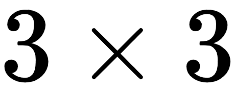 滑动窗口，而一个  膨胀卷积有一个 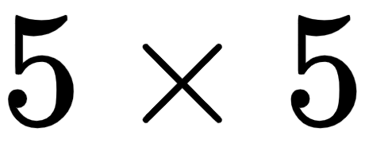 滑动窗口，其中输入像素是按每两个相邻步骤取一个样本。然而，不建议在同一个网络中将膨胀卷积与其他类型的卷积（例如深度可分离卷积）结合使用。因为膨胀卷积通常需要更小的学习步长进行训练，这将大大减慢你的训练过程。你可以使用以下代码片段来创建一个膨胀卷积操作：

```py
class DilConv(nn.Module):
    def __init__(self, C_in, C_out, kernel_size, stride, padding, dilation, affine=True):
        super(DilConv, self).__init__()
        self.op = nn.Sequential(
            nn.ReLU(inplace=False),
            nn.Conv2d(C_in, C_in, kernel_size=kernel_size, stride=stride, padding=padding, dilation=dilation, groups=C_in, bias=False),
            nn.Conv2d(C_in, C_out, kernel_size=1, padding=0, bias=False),
            nn.BatchNorm2d(C_out, affine=affine)
            )

    def forward(self, x):
        return self.op(x)
```

通常，常规卷积已经足够好。如果你的内存容量极为有限，深度可分离卷积绝对是你最佳的选择。

# 选择下采样操作方法

在网络中，增加或减少张量（特征图）大小往往是不可避免的。减小张量大小的过程称为**下采样**，而增大张量大小的过程称为**上采样**。下采样通常比上采样更棘手，因为我们不希望在较小的张量中丢失太多有用的信息。

在神经网络中，尤其是在卷积神经网络（CNN）中，有几种方法可以执行下采样。你可以根据自己的需求选择最合适的方法：

+   **最大池化**（例如，`nn.MaxPool2d`），即在滑动窗口中选择最大值。这在早期的浅层网络中非常流行，例如 LeNet-5。然而，最大值不一定是特征图中最重要的特征。例如，最小值会发生什么呢？显然，在 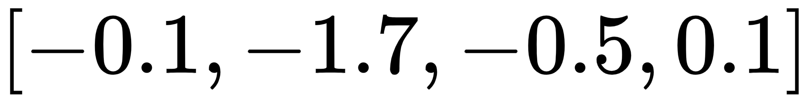 张量中的最小值（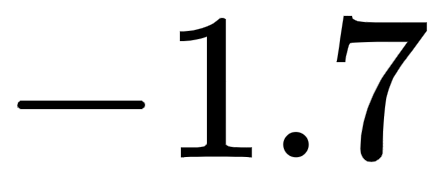）比最大值（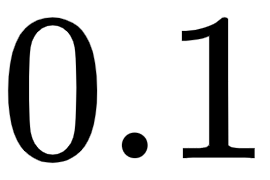）提供了更多关于这个张量包含什么模式的信息。

+   **平均池化**（例如，`nn.AvgPool2d` 或 `nn.AdaptiveAvgPool2d`），即在滑动窗口中取平均值。它比最大池化更受欢迎。如果你想进行快速降采样，应该选择平均池化而不是最大池化。

+   **跨步卷积**，即卷积的步幅大于 1。事实上，这就是本书中大多数模型用于降采样的方法，因为这种方法可以同时提取特征并减少张量大小。值得指出的是，这种方法可能会导致大量信息丢失，因为滑动窗口在计算时跳过了很多像素。特征图的尺寸减少通常伴随着通道数的增加。例如，一个迷你批量张量 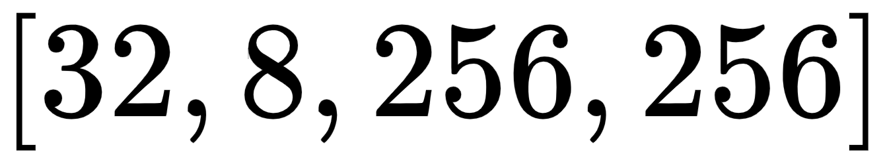（四个维度分别表示批量大小、通道数、特征图高度和特征图宽度）通常会降采样到 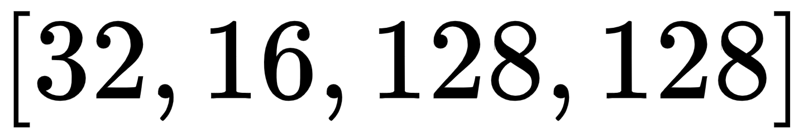，以便输出张量包含与输入张量相似的信息量。

+   **因式分解降维**，即执行两个带有轻微偏移的跨步卷积。在这种方法中，第二个卷积覆盖了第一个卷积跳过的像素。因此，更多的信息得以保留。它包含更多的参数，因此训练时间较长。你可以使用以下代码片段来执行因式分解降维：

```py
class FactorizedReduce(nn.Module):
    def __init__(self, C_in, C_out, affine=True):
        super(FactorizedReduce, self).__init__()
        assert C_out % 2 == 0
        self.relu = nn.ReLU(inplace=False)
        self.conv_1 = nn.Conv2d(C_in, C_out // 2, 1, stride=2, padding=0, bias=False)
        self.conv_2 = nn.Conv2d(C_in, C_out // 2, 1, stride=2, padding=0, bias=False)
        self.bn = nn.BatchNorm2d(C_out, affine=affine)

    def forward(self, x):
        x = self.relu(x)
        out = torch.cat([self.conv_1(x), self.conv_2(x[:,:,1:,1:])], dim=1)
        out = self.bn(out)
        return out
```

如果你有足够的 GPU 内存，可以在模型中使用因式分解降维。如果内存不足，使用跨步卷积会节省很多内存。

# 更多关于模型设计

欢迎查看 PyTorch 的官方文档 `torch.nn`，了解更多关于各种层和操作的信息：[`pytorch.org/docs/stable/nn.html`](https://pytorch.org/docs/stable/nn.html)。

# 模型训练备忘单

设计训练策略与模型设计一样重要——甚至更重要。有时候，一个好的训练策略能够让一个设计不佳的模型大放异彩。在这里，我们将讨论以下几个话题：

+   参数初始化

+   调整损失函数

+   选择优化方法

+   调整学习率

+   梯度裁剪、权重裁剪等

# 参数初始化

有时，从书籍或论文中学习优化方法并用代码实现时，最令人沮丧的事情之一就是机器学习系统的初始状态（参数的初始值）可能会对模型的最终表现产生重大影响。了解参数初始化非常重要，尤其是在处理深度网络时。好的参数初始化意味着你不必总是依赖批量归一化（Batch Normalization）来确保在训练过程中参数的一致性。引用 PyTorch 文档中的一句话，<q>"一个 PyTorch 张量基本上和一个 numpy 数组是一样的：它不知道深度学习、计算图或梯度，只是一个用于任意数值计算的通用 n 维数组。"</q>这就是为什么会有这么多方法的原因，而且未来可能还会有更多的方法。

有几种流行的参数初始化方法。由于一些方法比较直观，我们不会深入探讨。需要注意的是，均匀分布通常用于全连接层，而正态分布通常用于卷积层。现在我们来回顾一些这些方法：

+   **均匀分布** (`nn.init.uniform_(tensor, a, b)`): 它使用均匀分布初始化`tensor`！[](img/a1d9b168-6637-4d69-939a-080b4a682b7d.png)。

+   **正态分布** (`nn.init.normal_(tensor, a, b)`): 它使用正态分布初始化`tensor`！[](img/5182f483-c3db-4fbe-b93b-38a492d61d29.png)。

+   **Xavier 均匀分布** (`nn.init.xavier_uniform_(tensor)`): 它使用均匀分布初始化`tensor`！[](img/a437bc40-4715-4245-91d3-274727b03efc.png)，其公式为：

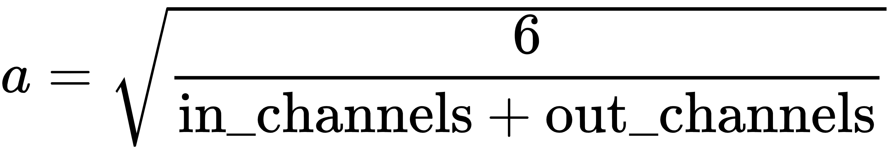

+   **Xavier 正态分布** (`nn.init.xavier_normal_(tensor)`): 它使用正态分布初始化`tensor`！[](img/bedac49b-9219-464a-9e7a-8f4daea194ea.png)，其公式为：

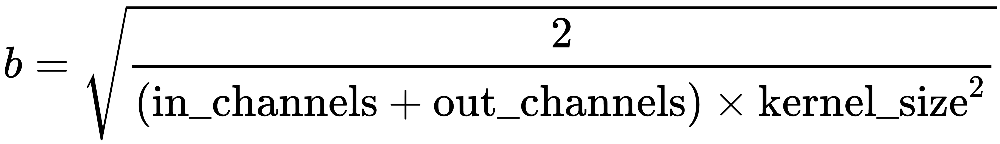

+   **He 均匀分布**（即 Kaiming 均匀分布或 MSRA 均匀分布，`nn.init.kaiming_uniform_(tensor)`）：它使用均匀分布初始化`tensor`！[](img/abb3b28b-b777-4498-ae15-ee5a8c913d40.png)，其公式为：

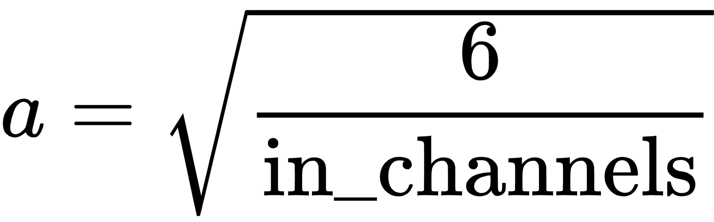

+   **He 正态分布**（即 Kaiming 正态分布或 MSRA 正态分布，`nn.init.kaiming_normal_(tensor)`）：它使用正态分布初始化`tensor`！[](img/ce9eeef0-e4de-4066-8df2-c9aa1440d577.png)，其公式为：

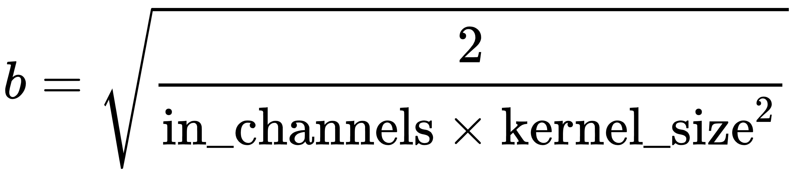

+   **截断正态分布**：在这种方法中，所有大于（或小于）两倍标准差（或负两倍标准差）的值都会被丢弃并重新生成。

除了使用 `torch.nn.init` 来初始化参数，你还可以创建自己的自定义初始化器。例如，下面是一个可以用于卷积层的初始化器，我们可以使用 `numpy` 和 `scipy.stats` 来实现：

```py
import numpy as np
from scipy import stats

def initializer_conv(shape,
                     init='he',
                     dist='truncnorm',
                     dist_scale=1.0):
    w_width = shape[3]
    w_height = shape[2]
    size_in = shape[1]
    size_out = shape[0]

    limit = 0.
    if init == 'xavier':
        limit = math.sqrt(2\. / (w_width * w_height * (size_in + size_out))) * dist_scale
    elif init == 'he':
        limit = math.sqrt(2\. / (w_width * w_height * size_in)) * dist_scale
    else:
        raise Exception('Arg `init` not recognized.')
    if dist == 'norm':
        var = np.array(stats.norm(loc=0, scale=limit).rvs(shape)).astype(np.float32)
    elif dist == 'truncnorm':
        var = np.array(stats.truncnorm(a=-2, b=2, scale=limit).rvs(shape)).astype(np.float32)
    elif dist == 'uniform':
        var = np.array(stats.uniform(loc=-limit, scale=2*limit).rvs(shape)).astype(np.float32)
    else:
        raise Exception('Arg `dist` not recognized.')
    return var

class Conv2d(nn.Conv2d):
    def __init__(self, in_channels, out_channels, kernel_size,
                 stride=1, padding=0, dilation=1, groups=1, bias=True,
                 init='he', dist='truncnorm', dist_scale=1.0):
        super(Conv2d, self).__init__(
            in_channels, out_channels, kernel_size, stride,
            padding, dilation, groups, bias)
        self.weight = nn.Parameter(torch.Tensor(
            initializer_conv([out_channels, in_channels // groups, kernel_size, kernel_size],
            init=init, dist=dist, dist_scale=dist_scale)))
```

有时不同的初始化方法对模型最终性能的影响不大，只要参数的幅度保持在相似的水平。在这种情况下，我们建议你在每一个微小的改进都重要时尝试不同的初始化方法。

# 调整损失函数

损失函数描述了训练过程的目标。我们在不同的 GAN 模型中看到了多种形式的损失函数，具体取决于它们的不同目标。设计正确的损失函数对于模型训练的成功至关重要。通常，一个 GAN 模型包含两个损失函数：一个生成器损失函数和一个判别器损失函数。当然，如果模型中有超过两个网络，还会有更多的损失函数需要处理。每个损失函数都可以有一个或多个正则化项。以下是三种最常见的形式：

+   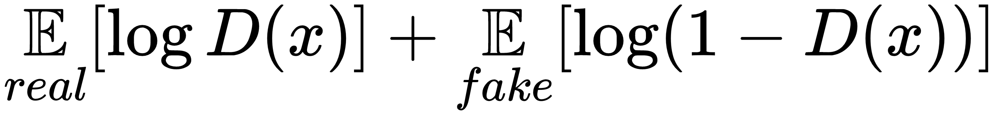

+   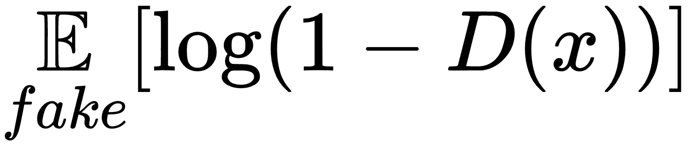

+   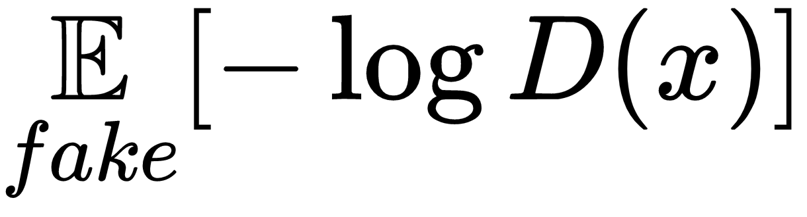

在第七章，*使用 GAN 进行图像恢复*，我们将详细讨论 GAN 中的不同损失函数形式。请查阅该章节以了解更多信息。

最常用的两种正则化项如下：

+   L1 损失，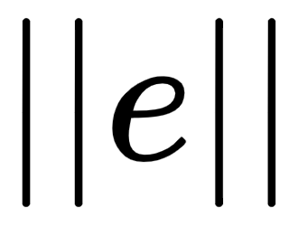

+   L2 损失，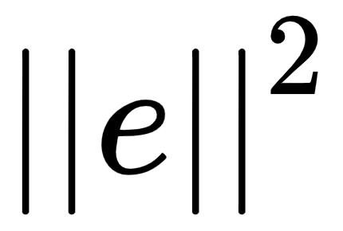

在 L1 损失和 L2 损失中，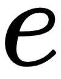可以是许多东西，例如两张图像之间的距离或图像的梯度。L2 损失往往产生更密集的结果（大多数值接近 0），而 L1 损失则产生更稀疏的结果（容忍一些大于 0 的离群值）。

值得一提的是，L2 正则化（**L2-惩罚**）对参数的作用本质上与**权重衰减**相同。原因如下：

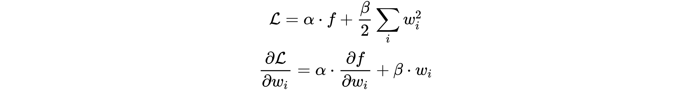

第一个方程中的第二项是 L2-惩罚，第二个方程中的第二项是权重衰减。对第一个方程两边求导得到第二个方程。因此，神经网络中的 L2-惩罚和权重衰减本质上是相同的。

损失函数也是你将算法设计付诸实践的地方。例如，如果你的数据集有额外的标签信息，可以将其添加到损失函数中。如果你希望结果尽可能接近某个目标，可以将它们的距离添加到正则化项中。如果你希望生成的图像平滑，可以将它们的梯度添加到正则化项中。

# 选择优化方法

在这里，我们只讨论基于梯度的优化方法，这些方法在 GAN 中最为常用。不同的梯度方法各有其优缺点。没有一种**通用的优化方法**可以解决所有问题。因此，在面对不同的实际问题时，我们应该明智地选择优化方法。现在，让我们来看看一些：

1.  **SGD**（当`momentum=0`且`nesterov=False`时调用`optim.SGD`）：它在浅层网络中运行得很快并且表现良好。然而，对于深层网络来说，它可能会非常慢，甚至可能无法收敛：

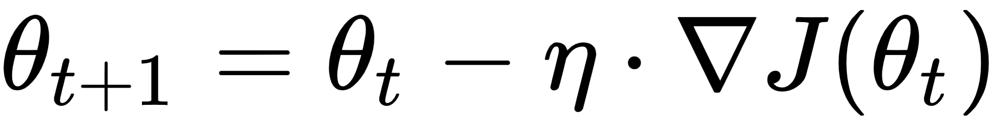

在这个方程中，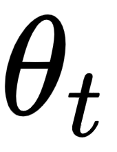是迭代步骤中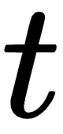的参数，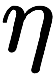是学习率，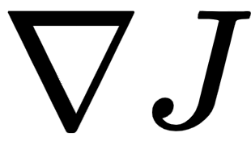是目标函数的梯度，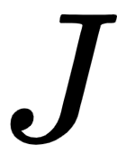。

1.  **Momentum**（当`momentum`参数大于 0 且`nestrov=False`时调用`optim.SGD`）：这是最常用的优化方法之一。该方法将前一步的更新与当前步骤的梯度相结合，从而使其比 SGD 具有更平滑的轨迹。Momentum 的训练速度通常比 SGD 快，并且一般适用于浅层和深层网络：

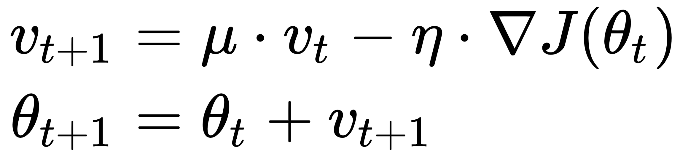

在这个方程中，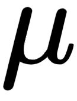 被称为**动量项**，通常设置为介于 0.5~0.9 之间的浮动值。

1.  **Nesterov**（当`momentum`参数大于 0 且`nestrov=True`时调用`optim.SGD`）；这是动量法的一个变体。它在结合动量向量和梯度向量时，计算目标函数在迭代步骤中的“预测”梯度。理论上，它比动量法具有更快的收敛速度。当你的模型在使用动量法时遇到收敛问题时，你一定要尝试一下 Nesterov：

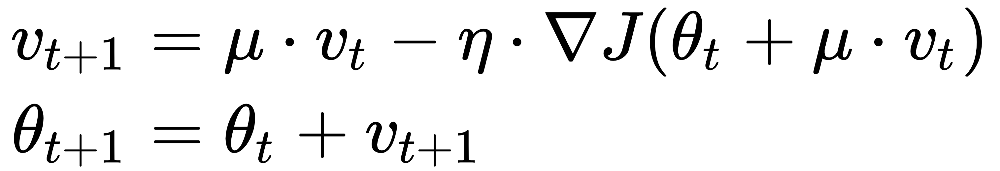

1.  **AdaGrad**（`optim.Adagrad`）：该方法用较小的学习率更新那些更新频繁的参数，用较大的学习率更新那些更新不频繁的参数。2012 年 Google 的 DistBelief 就使用了 AdaGrad。然而，由于学习率不断减小，这对于深度模型的长期训练是不利的，因此如今 AdaGrad 的使用并不广泛。

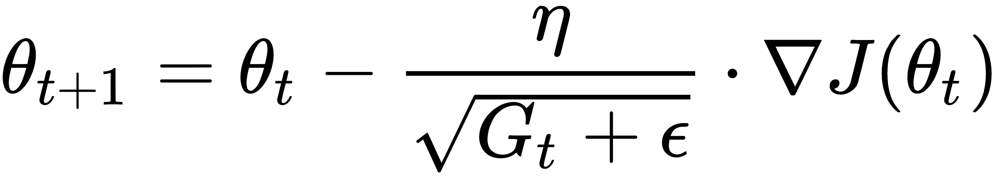

在这个方程中，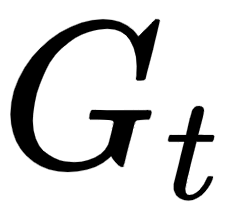 是从迭代步骤 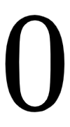 到  的梯度平方的总和，随着时间推移增加并减少学习率，而 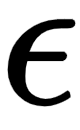 是一个非常小的值。

1.  **RMSprop** (`optim.RMSprop`): 这种方法与 AdaGrad 类似，不同之处在于它取的是梯度平方的移动平均，而不是它们的总和。这个方法在各种深度学习模型中并不常见。在第七章，《使用 GAN 进行图像恢复》中，我们明确指出在 Wasserstein GAN 中应该使用 RMSprop：

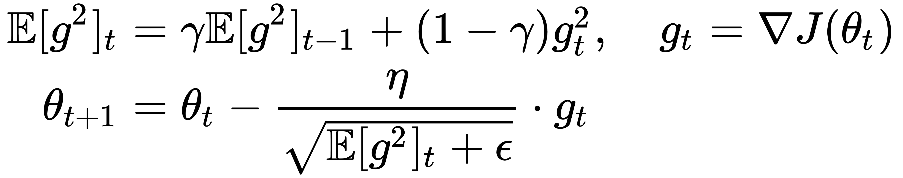

在这个方程中，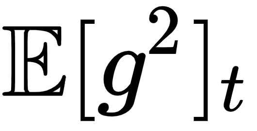 是直到迭代步骤  为止的 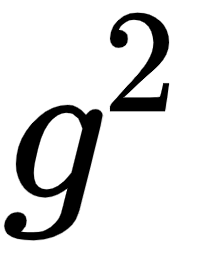 的移动平均，而 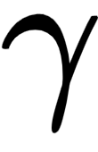 是平滑项，通常设置为非常接近 1 的值；例如，0.99 或 0.999。

1.  **Adam** (`optim.Adam`): 这种方法在某种程度上通过两个动量项结合了 Momentum 和 RMSprop。它是深度模型中最流行且最有效的优化方法之一。如果之前的所有方法在你的模型中表现不佳，Adam 是你最好的选择，特别是当你的模型非常深且参数之间的关系非常复杂时（例如，你的模型中有多个分支结构）：

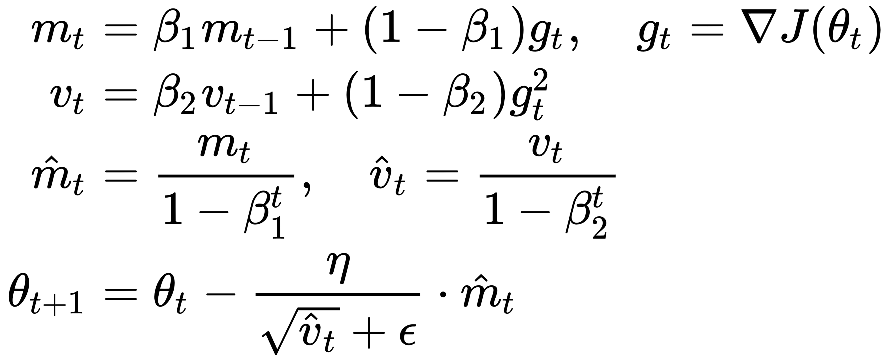

在这个方程中，动量系数（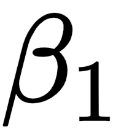 和 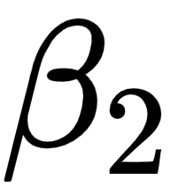）通常设置为非常接近 1 的值，例如， 和 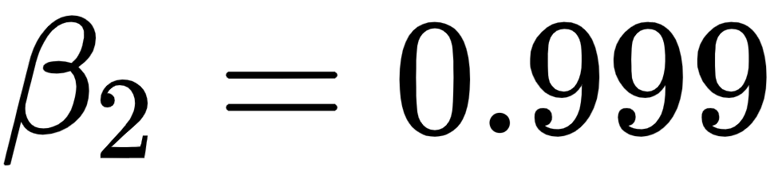。方程的第三行存在是因为我们不希望在训练的开始阶段动量项接近 0，特别是当它们在 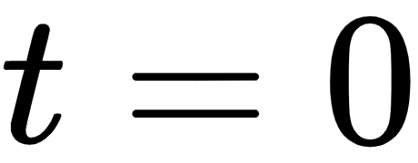 时通常初始化为零。请注意，Adam 的学习率应明显小于其他方法（如 Momentum）。

总之，当你为新模型尝试训练策略时，应该先尝试使用 Momentum，因为它具有更少的可调超参数且训练速度更快。当你对模型的表现感到满意时，总是值得尝试使用 Adam 来进一步挖掘其潜力。

# 调整学习率

现在你已经选择了优化方法，你需要为梯度方法设置合适的学习率并开始训练。通常，参数的更新在训练初期变化较大，容易察觉。经过长时间训练后，参数之间的关系已经确定，这时需要通过较小的学习率来微调参数。我们不能仅依赖优化方法（如 RMSprop 或 Adam）自动减少学习率。定期主动降低学习率，在训练过程中更为高效。

你可以使用`optim.lr_scheduler`来设置一个`scheduler`，并在每个 epoch 后调用`scheduler.step()`，如下代码所示：

```py
scheduler = optim.lr_scheduler.StepLR(optimizer, step_size=50, gamma=0.1)
for epoch in range(epochs):
    ...
    scheduler.step()
```

你还可以创建自己的自定义 scheduler，如下所示：

```py
class LRScheduleCosine(object):
    def __init__(self, optimizer, epoch=0, epoch_start=0, lr_max=0.05, lr_min=0.001, t_mul=10):
        self.optimizer = optimizer
        self.epoch = epoch
        self.lr_min = lr_min
        self.lr_max = lr_max
        self.t_start = epoch_start
        self.t_mul = t_mul
        self.lr = lr_max

    def step(self):
        self.epoch += 1
        self.lr = self.lr_min + 0.5*(self.lr_max-self.lr_min)*(1.+math.cos(math.pi*(self.epoch-self.t_start)/self.t_mul))
        if self.optimizer is not None:
            for param_group in self.optimizer.param_groups:
                param_group['lr'] = self.lr
        if self.epoch == self.t_start + self.t_mul:
            self.t_start += self.t_mul
            self.t_mul *= 2
        return self.lr
```

这是带有热重启的余弦调度的实现。要在训练中使用它，只需按以下方式调用：

```py
scheduler = LRScheduleCosine(optimizer,
                                       lr_max=0.025,
                                       lr_min=0.001,
                                       t_mul=10)
for epoch in range(epochs):
    lr = scheduler.step()
    ...
```

学习率将在前 10 个 epoch 中从 0.025 降低到 0.001，重启为 0.025 并在接下来的 10 个 epoch 中降低至 0.001，然后在接下来的 40 个 epoch 中再次重启到 0.025 并降低至 0.001，以此类推。

你可以查看 PyTorch 的官方文档，了解更多类型的 scheduler：[`pytorch.org/docs/stable/optim.html#how-to-adjust-learning-rate`](https://pytorch.org/docs/stable/optim.html#how-to-adjust-learning-rate)。

# 梯度裁剪、权重裁剪等

在本书的第一章，第一章《生成对抗网络基础》中，我们使用 NumPy 创建了一个简单的 GAN，利用梯度裁剪和权重裁剪生成正弦信号，确保训练收敛。我们来回顾一下这些技巧为何对你的模型有用：

+   **梯度裁剪**：梯度基本上告诉我们如何更新参数。通常，较大的梯度会导致对参数的更大更新。如果恰好在我们的搜索位置周围损失曲面很陡，较大的梯度值可能意味着我们将在下一次迭代中跳得很远，需要从新区域重新寻找最优解。因此，裁剪梯度并设定其最大/最小值限制，可以确保我们不会在长时间训练后破坏之前的搜索结果。你可以使用`nn.utils.clip_grad_norm_`进行梯度裁剪。

+   **梯度消失**：当梯度变化过小时，也可能会导致问题。通常，这是因为输入数据被压缩得过于紧凑，无法让系统正确学习。如果出现这种情况，可以考虑使用**ReLU**或 Leaky ReLU，我们在第一章《生成对抗网络基础》中介绍过这两种方法，*生成对抗网络的基础*。

+   **权重裁剪**：这不是一种广泛使用的技术，除了它在 Wasserstein GAN 中的应用（第七章，*基于 GAN 的图像修复*）。它是一种间接的梯度裁剪方法。因此，不必在同一个模型中同时使用这两种技术。在第一章，*生成对抗网络基础* 中的示例中，我们使用了这两者，以确保模型没有出错。

# 高效的 Python 编程

本书中你看到的大部分代码都是用 Python 编写的。几乎所有流行的深度学习工具（如 PyTorch、TensorFlow、Keras、MXNet 等）也都是用 Python 编写的。与其他**面向对象编程**（**OOP**）语言如 C++ 和 Java 相比，Python 更易学且更易用。然而，使用 Python 并不意味着我们可以懒散地编写代码。我们永远不应满足于 *它能工作*。在深度学习中，高效的代码可以为我们节省数小时的训练时间。在本节中，我们将为你提供一些关于编写高效 Python 项目的建议和技巧。

# 明智地发明轮子

创新型开发者不热衷于重新发明轮子，也就是实现项目中每一个可以轻松从 GitHub 或第三方库获取的微小组件。深度学习依赖开源，世界上任何人都可以学习并做出酷炫的事情。我们鼓励你利用任何可用的工具来解决实际问题，只要它能节省你宝贵的时间。本书中的一些模型实现来自 GitHub 上其他人的项目。想象一下，如果我们要根据已经发布的论文去弄清楚所有实现细节，可能需要花费多长时间！

以下是一些网站，当你寻找特定工具或代码片段时可能会派上用场：

+   [`github.com`](https://github.com)

+   [`stackoverflow.com`](https://stackoverflow.com)

+   [`stats.stackexchange.com`](https://stats.stackexchange.com)

+   [`discuss.pytorch.org`](https://discuss.pytorch.org)

+   [`www.reddit.com/r/MachineLearning`](https://www.reddit.com/r/MachineLearning)

+   [`www.kaggle.com/kernels`](https://www.kaggle.com/kernels)

+   最后，最重要的一点：[`www.google.com`](https://www.google.com)

# 深度学习初学者的建议

以下是深度学习初学者应该遵循的一些建议：

+   **设定合理且坚实的目标和期限**：给自己足够的时间来研究、学习和实验一个主题。从目标开始，然后创建一系列能够实现该目标的步骤。记录下你的进展。

+   **在网上查找与你正在进行的项目相关的信息**：互联网通常是收集特定主题信息的最快方式。先从简单而直接的搜索文本开始，然后逐步细化你的搜索，以获取最佳资源。

+   **小步走比大跳跃更好**：在你阅读某篇文章或章节时，将代码复制到你的集成开发环境（IDE）中并运行项目。理解输入、输出以及生成它们的代码后，才可以继续学习。

+   **尝试寻找预训练模型**：一旦你掌握了基本信息并理解了模型过程，就使用预训练模型来节省时间和硬件资源。同样，把结果记录在日志中。

+   **将你搜索到的结果进行实验**：在你进行研究和测试的过程中，可能会对该主题产生一些想法。把它们记录下来，并将你的想法与所学的内容进行对比测试。

+   **选择你能够承受的最好的硬件，而不至于超出预算**：这可能是最重要的建议。一台配备优秀显卡和 GPU 的好电脑，拥有尽可能多的内存，将可能为你的工作节省数小时。

# 总结

在本章中，我们研究了模型架构的整体设计以及在选择最佳卷积操作时所需的步骤。

在下一章中，我们将介绍一个经典的高性能 GAN 模型——DCGAN，该模型用于生成二维图像。
