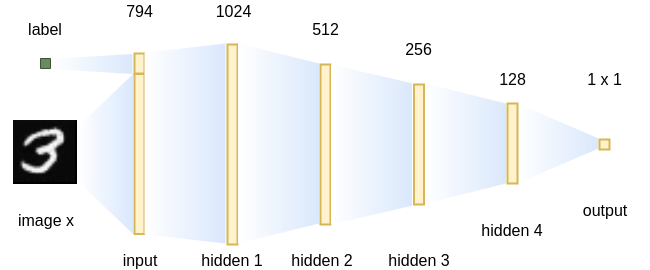

# 第六章：基于标签信息生成图像

在上一章中，我们初步体验了 GAN（生成对抗网络）学习潜在向量与生成图像之间关系的潜力，并模糊地观察到潜在向量以某种方式操控图像的属性。在本章中，我们将正式利用开放数据集中常见的标签和属性信息，正确地建立潜在向量与图像属性之间的桥梁。

在本章中，您将学习如何使用**条件 GAN**（**CGAN**）基于给定标签生成图像，以及如何通过自动编码器实现对抗性学习，并让人类面部从年轻到衰老。接下来，您将学习如何高效地组织源代码，便于调整和扩展。

阅读完本章后，您将学习到使用监督和无监督方法，通过标签和属性信息来提高 GAN 生成图像的质量。本章还介绍了本书中使用的基本源代码结构，这对您的项目将非常有用。

本章将涵盖以下主题：

+   CGAN —— 标签是如何使用的？

+   基于标签生成图像的 CGAN

+   使用 Fashion-MNIST

+   InfoGAN —— 无监督的属性提取

+   参考文献和有用的阅读书单

# CGAN —— 标签是如何使用的？

在上一章中，我们了解到，潜在向量与生成图像之间的关系可以通过 GAN 的训练过程建立，并且潜在向量的某些操作会通过生成图像的变化反映出来。但我们无法控制哪些部分或哪种类型的潜在向量会生成我们想要的属性图像。为了解决这个问题，我们将使用 CGAN 在训练过程中添加标签信息，这样我们就可以决定模型生成什么样的图像。

CGAN 的概念由 Mehdi Mirza 和 Simon Osindero 在他们的论文《Conditional Generative Adversarial Nets》中提出。其核心思想是将标签信息融入生成器和判别器网络，以使标签向量改变潜在向量的分布，从而生成具有不同属性的图像。

与传统的 GAN 模型相比，CGAN 在目标函数上做了小的改动，使得通过将真实数据  和生成数据  分别替换为  和  后，可以包含额外的信息，其中  表示辅助信息，如标签和属性：


在这个公式中，借用了描述数据在条件下如何分布的条件概率形式。为了计算新的目标函数，我们需要生成器网络能够根据某些条件生成数据，而判别器网络则判断输入的图像是否符合给定的条件。因此，在本节中，我们将讨论如何设计生成器和判别器来实现这一目标。

本章中我们将创建两个不同的模型，为了编写可重用的代码，我们将把源代码放在不同的文件中，而不是像以前一样将所有代码放在一个文件里。

# 将标签与生成器结合

CGAN 的生成器网络架构如下所示。如原始论文所述，所有数据都是通过类似 MLP 的网络生成的。然而，与原始论文不同的是，我们使用了一个更深的结构，并采用了批量归一化和 LeakyReLU 等技术，以确保获得更好的结果：


CGAN 的生成器网络架构

标签值被转换为长度为 10 的向量，并与潜在向量*z*拼接。生成器网络中的所有数据都以向量的形式存储。输出向量的长度等于生成图像的宽度和高度的乘积，MNIST 数据集的输出为 。当然，我们可以将输出图像的大小更改为我们想要的其他值（稍后我们将在源代码中将图像大小设置为 64 x 64）。

让我们将代码组织方式与之前的章节不同，并创建一个`cgan.py`文件来定义模型。

首先，我们在源代码文件的开始部分导入 PyTorch 和 NumPy 模块：

```py
import torch
import torch.nn as nn
import torch.nn.functional as F
import numpy as np
```

然后，我们定义`Generator`网络：

```py
class Generator(nn.Module):
    def __init__(self, classes, channels, img_size, latent_dim):
        super(Generator, self).__init__()
        self.classes = classes
        self.channels = channels
        self.img_size = img_size
        self.latent_dim = latent_dim
        self.img_shape = (self.channels, self.img_size, self.img_size)
        self.label_embedding = nn.Embedding(self.classes, self.classes)

        self.model = nn.Sequential(
            *self._create_layer(self.latent_dim + self.classes, 128, False),
            *self._create_layer(128, 256),
            *self._create_layer(256, 512),
            *self._create_layer(512, 1024),
            nn.Linear(1024, int(np.prod(self.img_shape))),
            nn.Tanh()
        )

    def _create_layer(self, size_in, size_out, normalize=True):
        layers = [nn.Linear(size_in, size_out)]
        if normalize:
            layers.append(nn.BatchNorm1d(size_out))
        layers.append(nn.LeakyReLU(0.2, inplace=True))
        return layers

    def forward(self, noise, labels):
        z = torch.cat((self.label_embedding(labels), noise), -1)
        x = self.model(z)
        x = x.view(x.size(0), *self.img_shape)
        return x
```

生成器网络由 5 个线性层组成，其中 3 个连接到批量归一化层，前 4 个线性层使用`LeakyReLU`激活函数，最后一个使用`Tanh`激活函数。标签信息通过`nn.Embedding`模块处理，它充当查找表。假设我们手头有 10 个用于训练样本的标签。嵌入层将这 10 个不同的标签转换为 10 个预定义的嵌入向量，这些向量默认通过正态分布初始化。标签的嵌入向量然后与随机潜在向量拼接，作为第一层的输入向量。最后，我们需要将输出向量重塑为 2D 图像作为最终结果。

# 将标签集成到判别器中

CGAN 判别器网络的架构如下所示。同样，判别器的架构与原始论文中使用的架构不同。当然，你可以根据自己的需求调整网络结构，看看你的模型是否能生成更好的结果：



CGAN 的判别器网络架构

与生成器网络类似，标签值也是 CGAN 判别器网络的输入部分。输入图像（大小为 28 x 28）被转换为一个长度为 784 的向量，因此判别器网络的输入向量的总长度为 794。判别器网络中有 4 个隐藏层。与常见的用于图像分类的 CNN 模型不同，判别器网络输出的是一个单一的值，而不是一个长度等于类别数的向量。这是因为我们已经将标签信息包含在网络输入中，且我们只希望判别器网络根据给定的标签条件告诉我们，图像与真实图像的相似度有多高。

现在，让我们在 `cgan.py` 文件中定义判别器网络：

```py
class Discriminator(nn.Module):
    def __init__(self, classes, channels, img_size, latent_dim):
        super(Discriminator, self).__init__()
        self.classes = classes
        self.channels = channels
        self.img_size = img_size
        self.latent_dim = latent_dim
        self.img_shape = (self.channels, self.img_size, self.img_size)
        self.label_embedding = nn.Embedding(self.classes, self.classes)
        self.adv_loss = torch.nn.BCELoss()

        self.model = nn.Sequential(
            *self._create_layer(self.classes + int(np.prod(self.img_shape)), 1024, False, True),
            *self._create_layer(1024, 512, True, True),
            *self._create_layer(512, 256, True, True),
            *self._create_layer(256, 128, False, False),
            *self._create_layer(128, 1, False, False),
            nn.Sigmoid()
        )

    def _create_layer(self, size_in, size_out, drop_out=True, act_func=True):
        layers = [nn.Linear(size_in, size_out)]
        if drop_out:
            layers.append(nn.Dropout(0.4))
        if act_func:
            layers.append(nn.LeakyReLU(0.2, inplace=True))
        return layers

    def forward(self, image, labels):
        x = torch.cat((image.view(image.size(0), -1), self.label_embedding(labels)), -1)
        return self.model(x)

    def loss(self, output, label):
        return self.adv_loss(output, label)
```

同样，标签通过另一个 `nn.Embedding` 模块传递，在与图像向量连接之前。判别器网络由 5 个线性层组成，其中 2 个层连接到 `Dropout` 层，以增强泛化能力。由于我们不能总是保证最后一层的输出值位于 [0, 1] 的范围内，因此我们需要一个 `Sigmoid` 激活函数来确保这一点。

`Dropout` 层的丢弃率为 0.4 意味着，在训练的每一次迭代中，每个神经元有 0.4 的概率不参与最终结果的计算。因此，在不同的训练步骤中，训练出的是不同的子模型，这使得整个模型相较于没有 `Dropout` 层的模型，更不容易过拟合训练数据。在评估过程中，`Dropout` 层通常会被停用。

哪一层使用 `Dropout` 或 `LeakyReLU` 激活函数的选择是相当主观的。你可以尝试其他组合，并找出哪个配置产生了最好的结果。

# 使用 CGAN 从标签生成图像

在上一节中，我们定义了 CGAN 的生成器和判别器网络的架构。现在，让我们编写模型训练的代码。为了方便你重现结果，我们将使用 MNIST 作为训练集，看看 CGAN 在图像生成方面的表现。我们希望完成的目标是，在模型训练完成后，它能够根据我们指定的数字生成正确的数字图像，并且具有丰富的多样性。

# 一站式模型训练 API

首先，让我们创建一个新的 `Model` 类，它作为不同模型的封装，并提供一站式训练 API。创建一个名为 `build_gan.py` 的新文件，并导入必要的模块：

```py
import os

import numpy as np
import torch
import torchvision.utils as vutils

from cgan import Generator as cganG
from cgan import Discriminator as cganD
```

然后，让我们创建`Model`类。在这个类中，我们将初始化`Generator`和`Discriminator`模块，并提供`train`和`eval`方法，以便用户可以简单地在其他地方调用`Model.train()`（或`Model.eval()`）来完成模型的训练（或评估）：

```py
class Model(object):
    def __init__(self,
                 name,
                 device,
                 data_loader,
                 classes,
                 channels,
                 img_size,
                 latent_dim):
        self.name = name
        self.device = device
        self.data_loader = data_loader
        self.classes = classes
        self.channels = channels
        self.img_size = img_size
        self.latent_dim = latent_dim
        if self.name == 'cgan':
            self.netG = cganG(self.classes, self.channels, 
              self.img_size, self.latent_dim)
        self.netG.to(self.device)
        if self.name == 'cgan':
            self.netD = cganD(self.classes, self.channels, 
              self.img_size, self.latent_dim)
        self.netD.to(self.device)
        self.optim_G = None
        self.optim_D = None
```

在这里，生成器网络`netG`和判别器网络`netD`是基于类数（`classes`）、图像通道（`channels`）、图像大小（`img_size`）和潜在向量的长度（`latent_dim`）进行初始化的。这些参数稍后会给出。目前，我们假设这些值已经是已知的。由于我们需要初始化该类中的所有张量和函数，我们需要定义模型运行的`device`（`self.device`）。`optim_G`和`optim_D`对象是两个网络的优化器，它们会用以下方式进行初始化：

```py
    def create_optim(self, lr, alpha=0.5, beta=0.999):
        self.optim_G = torch.optim.Adam(filter(lambda p: p.requires_grad,
                                        self.netG.parameters()),
                                        lr=lr,
                                        betas=(alpha, beta))
        self.optim_D = torch.optim.Adam(filter(lambda p: p.requires_grad,
                                        self.netD.parameters()),
                                        lr=lr,
                                        betas=(alpha, beta))
```

`Adam`优化器的第一个参数，`filter(lambda p: p.requires_grad, self.netG.parameters())`，用于获取所有`requires_grad`标记为`True`的`Tensor`。这在模型的一部分未训练时非常有用（例如，将一个训练好的模型迁移到新数据集后对最后一层进行微调），尽管在我们的情况下并不必要。

接下来，让我们定义一个名为`train`的方法用于模型训练。`train`的参数包括训练的轮数（`epochs`）、日志消息之间的迭代间隔（`log_interval`）、结果输出目录（`out_dir`）以及是否将训练消息打印到终端（`verbose`）：

```py
    def train(self,
              epochs,
              log_interval=100,
              out_dir='',
              verbose=True):
        self.netG.train()
        self.netD.train()
        viz_noise = torch.randn(self.data_loader.batch_size, self.latent_dim, device=self.device)
        viz_label = torch.LongTensor(np.array([num for _ in range(nrows) for num in range(8)])).to(self.device)
        for epoch in range(epochs):
            for batch_idx, (data, target) in enumerate(self.data_loader):
                data, target = data.to(self.device), target.to(self.device)
                batch_size = data.size(0)
                real_label = torch.full((batch_size, 1), 1., device=self.device)
                fake_label = torch.full((batch_size, 1), 0., device=self.device)

                # Train G
                self.netG.zero_grad()
                z_noise = torch.randn(batch_size, self.latent_dim, device=self.device)
                x_fake_labels = torch.randint(0, self.classes, (batch_size,), device=self.device)
                x_fake = self.netG(z_noise, x_fake_labels)
                y_fake_g = self.netD(x_fake, x_fake_labels)
                g_loss = self.netD.loss(y_fake_g, real_label)
                g_loss.backward()
                self.optim_G.step()

                # Train D
                self.netD.zero_grad()
                y_real = self.netD(data, target)
                d_real_loss = self.netD.loss(y_real, real_label)

                y_fake_d = self.netD(x_fake.detach(), x_fake_labels)
                d_fake_loss = self.netD.loss(y_fake_d, fake_label)
                d_loss = (d_real_loss + d_fake_loss) / 2
                d_loss.backward()
                self.optim_D.step()
```

在`train`中，我们首先将网络切换到训练模式（例如，`self.netG.train()`）。这主要影响`Dropout`和批量归一化层的行为。然后，我们定义一组固定的潜在向量（`viz_noise`）和标签（`viz_label`）。它们用于在训练过程中偶尔生成图像，以便我们能够跟踪模型的训练进度，否则我们可能只有在训练完成后才意识到训练出现了问题：

```py
                if verbose and batch_idx % log_interval == 0 and batch_idx > 0:
                    print('Epoch {} [{}/{}] loss_D: {:.4f} loss_G: {:.4f}'.format(
                          epoch, batch_idx, len(self.data_loader),
                          d_loss.mean().item(),
                          g_loss.mean().item()))
                    vutils.save_image(data, os.path.join(out_dir, 'real_samples.png'), normalize=True)
                    with torch.no_grad():
                        viz_sample = self.netG(viz_noise, viz_label)
                        vutils.save_image(viz_sample, os.path.join(out_dir, 'fake_samples_{}.png'.format(epoch)), nrow=8, normalize=True)
            self.save_to(path=out_dir, name=self.name, verbose=False)
```

在这里，我们省略了一些代码部分（包括评估 API、模型导出和加载）。你可以从本章的代码库中获取完整的源代码。

# 参数解析和模型训练

现在，我们要做的唯一事情就是为项目创建并定义主入口。在这个文件中，我们需要定义我们之前假定为已知的参数。这些超参数在创建任何网络时都至关重要，我们将优雅地解析这些值。让我们创建一个名为`main.py`的新文件，并导入必要的模块：

```py
import argparse
import os
import sys

import numpy as np
import torch
import torch.backends.cudnn as cudnn
import torch.utils.data
import torchvision.datasets as dset
import torchvision.transforms as transforms

import utils

from build_gan import Model
```

你有没有注意到，唯一与我们模型相关的 Python 模块是`build_gan.Model`？我们可以轻松创建另一个项目，并在没有重大修改的情况下复制这个文件中的大部分内容。

然后，让我们定义`main`函数：

```py
FLAGS = None

def main():
    device = torch.device("cuda:0" if FLAGS.cuda else "cpu")

    if FLAGS.train:
        print('Loading data...\n')
        dataset = dset.MNIST(root=FLAGS.data_dir, download=True,
                             transform=transforms.Compose([
                             transforms.Resize(FLAGS.img_size),
                             transforms.ToTensor(),
                             transforms.Normalize((0.5,), (0.5,))
                             ]))
        assert dataset
        dataloader = torch.utils.data.DataLoader(dataset, batch_size=FLAGS.batch_size,
                                                 shuffle=True, num_workers=4, pin_memory=True)
        print('Creating model...\n')
        model = Model(FLAGS.model, device, dataloader, FLAGS.classes, FLAGS.channels, FLAGS.img_size, FLAGS.latent_dim)
        model.create_optim(FLAGS.lr)

        # Train
        model.train(FLAGS.epochs, FLAGS.log_interval, FLAGS.out_dir, True)

        model.save_to('')
    else:
        model = Model(FLAGS.model, device, None, FLAGS.classes, FLAGS.channels, FLAGS.img_size, FLAGS.latent_dim)
        model.load_from(FLAGS.out_dir)
        model.eval(mode=0, batch_size=FLAGS.batch_size)
```

由于我们已经在单独的文件中定义了网络和训练计划，因此模型的初始化和训练只需要 3 行代码：`model = Model()`、`model.create_optim()`和`model.train()`。这样，我们的代码易于阅读、修改和维护，而且我们可以轻松地在其他项目中使用大部分代码。

`FLAGS`对象存储了定义和训练模型所需的所有参数和超参数。为了使参数配置更加用户友好，我们将使用 Python 提供的`argparse`模块。

请注意，如果你想使用不同的数据集，可以像上一章一样修改`dataset`对象的定义。

源代码的`main`入口和参数定义如下：

```py
if __name__ == '__main__':
    from utils import boolean_string
    parser = argparse.ArgumentParser(description='Hands-On GANs - Chapter 5')
    parser.add_argument('--model', type=str, default='cgan', help='one of `cgan` and `infogan`.')
    parser.add_argument('--cuda', type=boolean_string, default=True, help='enable CUDA.')
    parser.add_argument('--train', type=boolean_string, default=True, help='train mode or eval mode.')
    parser.add_argument('--data_dir', type=str, default='~/Data/mnist', help='Directory for dataset.')
    parser.add_argument('--out_dir', type=str, default='output', help='Directory for output.')
    parser.add_argument('--epochs', type=int, default=200, help='number of epochs')
    parser.add_argument('--batch_size', type=int, default=128, help='size of batches')
    parser.add_argument('--lr', type=float, default=0.0002, help='learning rate')
    parser.add_argument('--latent_dim', type=int, default=100, help='latent space dimension')
    parser.add_argument('--classes', type=int, default=10, help='number of classes')
    parser.add_argument('--img_size', type=int, default=64, help='size of images')
    parser.add_argument('--channels', type=int, default=1, help='number of image channels')
    parser.add_argument('--log_interval', type=int, default=100, help='interval between logging and image sampling')
    parser.add_argument('--seed', type=int, default=1, help='random seed')

    FLAGS = parser.parse_args()
```

通过`parser.add_argument(ARG_NAME, ARG_TYPE, DEFAULT_VALUE, HELP_MSG)`创建一个新参数，其中`ARG_NAME`是参数名称，`ARG_TYPE`是参数的值类型（例如，`int`、`float`、`bool`或`str`），`DEFAULT_VALUE`是没有给定值时的默认参数值，`HELP_MSG`是在终端中运行`python main.py --help`时打印的消息。可以通过`python main.py --ARG_NAME ARG_VALUE`来指定参数值，或者你可以在源代码中更改默认值并直接运行`python main.py`。在这里，我们的模型将训练 200 个 epoch，批次大小为 128，学习率设置为 0.0002，因为较小的学习率值适合`Adam`方法。潜在向量的长度为 100，生成图像的大小设置为 64。我们还将随机种子设置为 1，以便你可以得到与本书中相同的结果。

`boolean_string`在`utils.py`文件中定义，内容如下（更多信息请参考[`stackoverflow.com/a/44561739/3829845`](https://stackoverflow.com/a/44561739/3829845)）。否则，在终端中传递`--train False`将不会影响脚本：

```py
def boolean_string(s):
    if s not in {'False', 'True'}:
        raise ValueError('Not a valid boolean string')
    return s == 'True'
```

我们仍然需要对参数进行一些预处理：

```py
    FLAGS.cuda = FLAGS.cuda and torch.cuda.is_available()

    if FLAGS.seed is not None:
        torch.manual_seed(FLAGS.seed)
        if FLAGS.cuda:
            torch.cuda.manual_seed(FLAGS.seed)
        np.random.seed(FLAGS.seed)

    cudnn.benchmark = True

    if FLAGS.train:
        utils.clear_folder(FLAGS.out_dir)

    log_file = os.path.join(FLAGS.out_dir, 'log.txt')
    print("Logging to {}\n".format(log_file))
    sys.stdout = utils.StdOut(log_file)

    print("PyTorch version: {}".format(torch.__version__))
    print("CUDA version: {}\n".format(torch.version.cuda))

    print(" " * 9 + "Args" + " " * 9 + "| " + "Type" + \
          " | " + "Value")
    print("-" * 50)
    for arg in vars(FLAGS):
        arg_str = str(arg)
        var_str = str(getattr(FLAGS, arg))
        type_str = str(type(getattr(FLAGS, arg)).__name__)
        print(" " + arg_str + " " * (20-len(arg_str)) + "|" + \
              " " + type_str + " " * (10-len(type_str)) + "|" + \
              " " + var_str)

    main()
```

在这里，我们首先确保 CUDA 确实可用于 PyTorch。然后，我们手动设置 NumPy、PyTorch 和 CUDA 后端的随机种子。每次重新训练模型时，我们需要清理输出目录，并将所有输出消息重定向到外部文件`log.txt`。最后，我们在运行`main`函数之前打印所有的参数，以便检查是否正确配置了模型。

现在，打开终端并运行以下脚本。记得将`DATA_DIRECTORY`更改为你机器上 MNIST 数据集的路径：

```py
       $ conda activate torch
(torch)$ python main.py --model cgan --train True --data_dir DATA_DIRECTORY
```

输出信息可能如下所示（参数的顺序可能不同）：

```py
Logging to output/log.txt

PyTorch version: 1.0.1.post2
CUDA version: 10.0.130

         Args         |   Type    |   Value
--------------------------------------------------
  model               | str       | cgan
  cuda                | bool      | True
  train               | bool      | True
  data_dir            | str       | ~/Data/mnist
  out_dir             | str       | output
  epochs              | int       | 200
  batch_size          | int       | 128
  lr                  | float     | 0.0002
  latent_dim          | int       | 100
  classes             | int       | 10
  img_size            | int       | 64
  channels            | int       | 1
  log_interval        | int       | 100
  seed                | int       | 1
Loading data...

Creating model...

Epoch 0 [100/469] loss_D: 0.6747 loss_G: 0.6119
Epoch 0 [200/469] loss_D: 0.4745 loss_G: 0.8135
...
```

在 GTX 1080Ti 显卡上训练 200 个 epoch 大约需要 22 分钟，并消耗约 729 MB 的 GPU 内存。从 MNIST 数据集中生成的图像如下所示：


通过 CGAN 生成的 MNIST 图像（左：第 1 个 epoch；中：第 25 个 epoch；右：第 200 个 epoch）

我们可以看到，对于相应的标签，数字图像被正确生成，同时保持外观上的逼真多样性。由于我们将图像视为模型中的非常长的向量，因此很难在垂直和水平方向上生成平滑度，而且在训练了仅 25 个 epoch 后，生成的图像容易出现斑点噪声。然而，在训练 200 个 epoch 后，图像质量有了显著提高。

# 使用 Fashion-MNIST

所以你现在应该知道，MNIST 数据集由一堆手写数字组成。它是机器学习领域的事实标准，常用于验证流程。另一个小组决定创建一个可能是更好的替代数据集。这个项目被命名为**Fashion-MNIST**，旨在作为一个简单的替代品。您可以通过[`www.kaggle.com/zalando-research/fashionmnist/data#`](https://www.kaggle.com/zalando-research/fashionmnist/data#)深入了解该项目。

**Fashion-MNIST** 包含一个包含 60,000 张图像和标签的训练集，以及一个包含 10,000 张图像和标签的测试集。所有图像都是灰度图，大小为 28x28 像素，共有 10 个类别的图像，分别是：T 恤/上衣、裤子、套头衫、裙子、大衣、凉鞋、衬衫、运动鞋、包和 ankle boot。你可以开始看到，这个替代数据集应该能让算法更加复杂。

为了展示数据集的使用，我们将使用刚才为标准 MNIST 数据集创建的程序，并做一些修改。

1.  将 main.py 文件复制到`fashion-main.py`以保护原文件。现在，在`fashion-main.py`文件中找到以下代码部分：

```py
dataset = dset.MNIST(root=FLAGS.data_dir, download=True,
                     transform=transforms.Compose([
                     transforms.Resize(FLAGS.img_size),
                     transforms.ToTensor(),
                     transforms.Normalize((0.5,), (0.5,))
                     ]))
```

这是`main()`函数中的第四行。

1.  现在，您只需将`dset.MNIST(`更改为`dset.FashionMNIST(`，就像这样：

```py
dataset = dset.FashionMNIST(root=FLAGS.data_dir, download=True,
                            transform=transforms.Compose([
                            transforms.Resize(FLAGS.img_size),
                            transforms.ToTensor(),
                            transforms.Normalize((0.5,), (0.5,))
                            ]))
```

幸运的是，torchvision 已经为 Fashion-MNIST 提供了一个内置类。稍后我们会指出其他一些类。

1.  现在保存您的源文件。

1.  现在，为了确保您的第一个示例中的数据集安全，重新命名上次使用的 Data 文件夹。新数据集将自动下载给您。另一件事是，您应该重新命名输出文件夹，以确保它的安全。

1.  正如我们在上一个程序中所做的，我们将通过命令行输入来启动它：

```py
(torch)$ python fashion_main.py --model cgan --train True --data_dir DATA_DIRECTORY
```

终端中的输出将与上一个程序非常相似，除了显示下载新数据集信息的几行：

```py
Downloading http://fashion-mnist.s3-website.eu-central-1.amazonaws.com/train-images-idx3-ubyte.gz to ./Data/fashion/FashionMNIST/raw/train-images-idx3-ubyte.gz
26427392it [00:06, 4212673.42it/s] 
Extracting ./Data/fashion/FashionMNIST/raw/train-images-idx3-ubyte.gz to ./Data/fashion/FashionMNIST/raw
...
```

下面是你可以期待的输出图像示例：


左侧是实际的样本数据，中间是第 0 轮的结果，最后右侧是第 199 轮的结果。尽管结果并不完美，但你可以看到输出已经变得相当不错。

之前，我提到过我们将会看看 torchvision 支持的其他类。这里无法讨论所有内容，但如果你访问：[`pytorch.org/docs/stable/torchvision/datasets.html`](https://pytorch.org/docs/stable/torchvision/datasets.html)，你可以看到每个支持类及其 API 参数的详细列表。许多类可以直接与我们的代码一起使用，唯一需要修改的是代码中的数据集行，甚至可以让程序为你下载数据集。

# InfoGAN – 无监督属性提取

在前面的章节中，我们学习了如何使用数据的标签等辅助信息来提高 GAN 生成图像的质量。然而，准备训练样本的准确标签并不总是可行的。有时候，准确描述极其复杂数据的标签甚至是非常困难的。在本节中，我们将介绍来自 GAN 家族的另一个优秀模型——**InfoGAN**，它能够在训练过程中以无监督的方式提取数据的属性。InfoGAN 由 Xi Chen、Yan Duan、Rein Houthooft 等人在他们的论文《*InfoGAN: Interpretable Representation Learning by Information Maximizing Generative Adversarial Nets*》中提出。它展示了 GAN 不仅能够学习生成逼真的样本，还能够学习对样本生成至关重要的语义特征。

与 CGAN 类似，InfoGAN 也用条件分布（将辅助信息作为条件）替换了数据的原始分布。主要的区别在于，InfoGAN 不需要将标签和属性信息输入到判别器网络中；而是使用另一个分类器 Q 来衡量辅助特征的学习情况。InfoGAN 的目标函数如下所示。你可能会注意到它在公式末尾添加了另一个目标，：


在这个公式中，是生成的样本，是潜在向量，代表辅助信息。描述了的实际分布，而这通常很难找到。因此，我们使用后验分布，，来估计，这一过程通过神经网络分类器完成。

在前述公式中，  实际上是 **互信息**的近似值， ，用于表示辅助向量与生成样本之间的关系。互信息， ，描述了我们基于 *Y* 的知识能了解关于随机变量 *X* 的多少—— ，其中  是 **熵**，而  是 **条件熵**。它也可以通过 **Kullback-Leibler 散度**来描述， ，该散度描述了我们使用边缘分布来近似 *X* 和 *Y* 的联合分布时的信息损失。你可以参考原版 InfoGAN 论文来了解详细的数学推导。目前，你只需要知道，  告诉我们生成的  是否如预期那样基于  生成。

# InfoGAN 的网络定义

InfoGAN 生成器网络的架构如下所示。复现原论文中的结果相对复杂。因此，我们基于此 GitHub 仓库提供的模型架构， [`github.com/eriklindernoren/PyTorch-GAN/blob/master/implementations/infogan/infogan.py`](https://github.com/eriklindernoren/PyTorch-GAN/blob/master/implementations/infogan/infogan.py)：


InfoGAN 的生成器架构

InfoGAN 的生成器网络由 4 层隐藏层组成。第一层隐藏层将长度为 74 (*62+10+2*) 的输入向量转换为长度为 8,192 (*128*8*8*)，然后直接转换为具有 *128*8*8* 维度的张量。特征图随后逐渐放大到 32*32 的图像。特征图的缩放通过 `torch.nn.functional.interpolate` 完成。我们需要定义一个派生的 `Module` 类来进行上采样，以便将其视为其他 `torch.nn` 层。

让我们创建一个名为 `infogan.py` 的新源文件，并导入与 `cgan.py` 中相同的 Python 模块，然后按如下方式定义 `Upsample` 类：

```py
class Upsample(nn.Module):
    def __init__(self, scale_factor):
        super(Upsample, self).__init__()
        self.scale_factor = scale_factor

    def forward(self, x):
        return F.interpolate(x, scale_factor=self.scale_factor, mode='bilinear', align_corners=False)
```

我们使用 `bilinear` 方法来上采样图像，因为它相比其他选择最为合适。由于我们从 `torch.nn.Module` 派生这个类，并且仅在前向传播过程中使用 `torch` 中的函数进行计算，我们的自定义类在训练时不会出现反向传播梯度计算的问题。

在 PyTorch 1.0 中，调用 `nn.Upsample` 会给出一个弃用警告，实际上它现在是通过 `torch.nn.functional.interpolate` 来实现的。因此，我们自定义的 `Upsample` 层与 `nn.Upsample` 相同，但没有警告信息。

生成器网络定义如下：

```py
class Generator(nn.Module):
    def __init__(self, classes, channels, img_size, latent_dim, code_dim):
        super(Generator, self).__init__()
        self.classes = classes
        self.channels = channels
        self.img_size = img_size
        self.img_init_size = self.img_size // 4
        self.latent_dim = latent_dim
        self.code_dim = code_dim
        self.img_init_shape = (128, self.img_init_size, self.img_init_size)
        self.img_shape = (self.channels, self.img_size, self.img_size)
        self.stem_linear = nn.Sequential(
            nn.Linear(latent_dim + classes + code_dim,
                      int(np.prod(self.img_init_shape)))
        )
        self.model = nn.Sequential(
            nn.BatchNorm2d(128),
            *self._create_deconv_layer(128, 128, upsample=True),
            *self._create_deconv_layer(128, 64, upsample=True),
            *self._create_deconv_layer(64, self.channels, upsample=False, normalize=False),
            nn.Tanh()
        )

    def _create_deconv_layer(self, size_in, size_out, upsample=True,  
      normalize=True):
        layers = []
        if upsample:
            layers.append(Upsample(scale_factor=2))
        layers.append(nn.Conv2d(size_in, size_out, 3, stride=1, 
          padding=1))
        if normalize:
            layers.append(nn.BatchNorm2d(size_out, 0.8))
            layers.append(nn.LeakyReLU(0.2, inplace=True))
        return layers

    def forward(self, noise, labels, code):
        z = torch.cat((noise, labels, code), -1)
        z_vec = self.stem_linear(z)
        z_img = z_vec.view(z_vec.shape[0], *self.img_init_shape)
        x = self.model(z_img)
        return x
```

在这个类中，我们使用了一个辅助函数`_create_deconv_layer`来创建卷积隐藏层。由于我们将使用自定义的`Upsample`层来增加特征图的大小，因此我们只需要使用`nn.Conv2d`，其输入大小等于输出大小，而不是像上一章中的 DCGAN 那样使用`nn.ConvTranspose2d`。

在我们的 InfoGAN 配置中，`torch.nn.functional.interpolate`与`nn.Conv2d`组合比使用步幅的`nn.ConvTranspose2d`效果更好。尽管如此，您仍然可以尝试不同的配置，看看是否能得到更好的结果。

InfoGAN 判别器网络的架构如下所示。再次强调，我们使用了与原始论文中不同的结构：


InfoGAN 的判别器架构

判别器网络由 4 个隐藏层组成。如前所述，InfoGAN 使用了一个额外的分类器网络来衡量辅助向量的有效性。事实上，这个额外的分类器与判别器共享大部分权重（前 4 个隐藏层）。因此，图像的质量度量由一个 1 x 1 的张量表示，这是 4 个隐藏层末尾线性层的结果。辅助信息的度量，包括类保真度和样式保真度，是通过两组不同的线性层得到的，其中*128*2*2*特征图首先映射到 128 长度的向量，然后分别映射到长度为 10 和 2 的输出向量。

判别器在 PyTorch 代码中的定义如下：

```py
class Discriminator(nn.Module):
 def __init__(self, classes, channels, img_size, latent_dim, code_dim):
 super(Discriminator, self).__init__()
 self.classes = classes
 self.channels = channels
 self.img_size = img_size
 self.latent_dim = latent_dim
 self.code_dim = code_dim
 self.img_shape = (self.channels, self.img_size, self.img_size)
 self.model = nn.Sequential(
 *self._create_conv_layer(self.channels, 16, True, False),
 *self._create_conv_layer(16, 32, True, True),
 *self._create_conv_layer(32, 64, True, True),
 *self._create_conv_layer(64, 128, True, True),
 )
 out_linear_dim = 128 * (self.img_size // 16) * (self.img_size // 16)
 self.adv_linear = nn.Linear(out_linear_dim, 1)
 self.class_linear = nn.Sequential(
 nn.Linear(out_linear_dim, 128),
 nn.BatchNorm1d(128),
 nn.LeakyReLU(0.2, inplace=True),
 nn.Linear(128, self.classes)
 )
 self.code_linear = nn.Sequential(
 nn.Linear(out_linear_dim, 128),
 nn.BatchNorm1d(128),
 nn.LeakyReLU(0.2, inplace=True),
 nn.Linear(128, self.code_dim)
 )
 self.adv_loss = torch.nn.MSELoss()
 self.class_loss = torch.nn.CrossEntropyLoss()
 self.style_loss = torch.nn.MSELoss()

 def _create_conv_layer(self, size_in, size_out, drop_out=True, normalize=True):
 layers = [nn.Conv2d(size_in, size_out, 3, 2, 1)]
 if drop_out:
 layers.append(nn.LeakyReLU(0.2, inplace=True))
 layers.append(nn.Dropout(0.4))
 if normalize:
 layers.append(nn.BatchNorm2d(size_out, 0.8))
 return layers

 def forward(self, image):
 y_img = self.model(image)
 y_vec = y_img.view(y_img.shape[0], -1)
 y = self.adv_linear(y_vec)
 label = F.softmax(self.class_linear(y_vec), dim=1)
 code = self.code_linear(y_vec)
 return y, label, code
```

在这里，我们将质量保真度（`self.adv_loss`）视为普通 GAN 模型中的损失，类保真度（`self.class_loss`）视为分类问题（因为标签值是硬编码的，通常是独热编码），样式保真度（`self.style_loss`）则视为期望最大化问题（因为我们希望样式向量服从某种随机分布）。因此，交叉熵（`torch.nn.CrossEntropyLoss`）和均方误差（`torch.nn.MSELoss`）损失函数分别用于它们。

我们想解释为什么均方误差用于期望最大化。我们假设样式向量服从均值为 0，标准差为 1 的正态分布。在计算熵时，取随机变量的概率的对数。正态分布的**概率密度函数**（**pdf**）的对数推导为，因此，均方误差适用于此类目的。

# InfoGAN 的训练与评估

我们需要对训练 API 做一些调整，以便可以利用类向量和样式向量进行属性提取和图像生成。

首先，我们在`build_gan.py`文件中添加几个导入的模块：

```py
import itertools

from infogan import Generator as infoganG
from infogan import Discriminator as infoganD
```

PyTorch 提供的默认权重初始化容易导致饱和，因此我们需要一个自定义的`weight`初始化器：

```py
def _weights_init(m):
    classname = m.__class__.__name__
    if classname.find('Conv') != -1:
        torch.nn.init.normal_(m.weight.data, 0.0, 0.02)
    elif classname.find('BatchNorm') != -1:
        torch.nn.init.normal_(m.weight.data, 1.0, 0.02)
        torch.nn.init.constant_(m.bias.data, 0.0)
```

让我们在`Model`类的定义中添加以下几行：

```py
        self.style_dim = 2
        self.infogan = self.name == 'infogan'
        self.optim_info = None
```

我们还需要修改`self.netG`和`self.netD`的定义：

```py
        if self.name == 'cgan':
            self.netG = cganG(self.classes, self.channels, self.img_size, self.latent_dim)
        elif self.name == 'infogan':
            self.netG = infoganG(self.classes, self.channels, self.img_size, self.latent_dim, self.style_dim)
            self.netG.apply(_weights_init)
        self.netG.to(self.device)
        if self.name == 'cgan':
            self.netD = cganD(self.classes, self.channels, self.img_size, self.latent_dim)
        elif self.name == 'infogan':
            self.netD = infoganD(self.classes, self.channels, self.img_size, self.latent_dim, self.style_dim)
            self.netD.apply(_weights_init)
        self.netD.to(self.device)
```

然后，我们在`create_optim`方法的末尾添加一个用于互信息的优化器：

```py
        if self.infogan:
            self.optim_info = torch.optim.Adam(itertools.chain(self.netG.parameters(), self.netD.parameters()),
                                               lr=lr, betas=(alpha, beta))
```

接下来，我们需要对`train`方法进行一些调整，其中我们首先训练生成器和判别器网络，并基于辅助信息再次更新这两个网络。在这里，我们省略了所有的`if self.infogan`语句，只展示了 InfoGAN 的训练过程。完整的源代码可以参考本章的代码仓库。

初始化固定的潜在向量以进行结果可视化：

```py
        viz_noise = torch.randn(self.data_loader.batch_size, self.latent_dim, device=self.device)
        nrows = self.data_loader.batch_size // 8
        viz_label = torch.LongTensor(np.array([num for _ in range(nrows) for num in range(8)])).to(self.device)
        viz_onehot = self._to_onehot(viz_label, dim=self.classes)
        viz_style = torch.zeros((self.data_loader.batch_size, self.style_dim), device=self.device)
```

这里，`self._to_onehot`方法负责将标签值转换为 one-hot 编码：

```py
    def _to_onehot(self, var, dim):
        res = torch.zeros((var.shape[0], dim), device=self.device)
        res[range(var.shape[0]), var] = 1.
        return res
```

InfoGAN 的一个训练迭代包括以下内容：

+   使用伪数据训练生成器，并让判别器将它们视为真实数据

+   使用真实和伪数据训练判别器，以提高其区分能力

+   同时训练生成器和判别器，以便生成器可以基于给定的辅助信息生成高质量的样本，而判别器可以判断生成的样本是否符合给定辅助信息的分布：

```py
        for epoch in range(epochs):
            for batch_idx, (data, target) in enumerate(self.data_loader):
                data, target = data.to(self.device), target.to(self.device)
                batch_size = data.size(0)
                real_label = torch.full((batch_size, 1), 1., 
                  device=self.device)
                fake_label = torch.full((batch_size, 1), 0.,  
                  device=self.device)

                # Train G
                self.netG.zero_grad()
                z_noise = torch.randn(batch_size, self.latent_dim,  
                  device=self.device)
                x_fake_labels = torch.randint(0, self.classes, 
                  (batch_size,), device=self.device)
                labels_onehot = self._to_onehot(x_fake_labels, 
                  dim=self.classes)
                z_style = torch.zeros((batch_size, self.style_dim), 
                  device=self.device).normal_()
                x_fake = self.netG(z_noise, labels_onehot, z_style)
                y_fake_g, _, _ = self.netD(x_fake)
                g_loss = self.netD.adv_loss(y_fake_g, real_label)
                g_loss.backward()
                self.optim_G.step()

                # Train D
                self.netD.zero_grad()
                y_real, _, _ = self.netD(data)
                d_real_loss = self.netD.adv_loss(y_real, real_label)
                y_fake_d, _, _ = self.netD(x_fake.detach())
                d_fake_loss = self.netD.adv_loss(y_fake_d, fake_label)
                d_loss = (d_real_loss + d_fake_loss) / 2
                d_loss.backward()
                self.optim_D.step()

                # Update mutual information
                self.optim_info.zero_grad()
                z_noise.normal_()
                x_fake_labels = torch.randint(0, self.classes,  
                  (batch_size,), device=self.device)
                labels_onehot = self._to_onehot(x_fake_labels, 
                  dim=self.classes)
                z_style.normal_()
                x_fake = self.netG(z_noise, labels_onehot, z_style)
                _, label_fake, style_fake = self.netD(x_fake)
                info_loss = self.netD.class_loss(label_fake, 
                  x_fake_labels) +\
                            self.netD.style_loss(style_fake, z_style)
                info_loss.backward()
                self.optim_info.step()
```

我们完全不需要修改`main.py`文件，直接在终端运行以下脚本即可：

```py
(torch)$ python main.py --model infogan --latent_dim 62 --img_size 32 --batch_size 64 --data_dir DATA_DIRECTORY
```

完成 200 个 epoch 的训练大约需要 2 小时，并且在 GTX 1080Ti 显卡上消耗约 833MB 的 GPU 内存。训练过程中生成的结果如下所示：


由 CGAN 生成的 MNIST 图像（左：第 1 个 epoch；中：第 25 个 epoch；右：第 200 个 epoch）

训练完成后，运行以下脚本进行模型评估：

```py
(torch)$ python main.py --model infogan --latent_dim 62 --img_size 32 --batch_size 64 --train False
```

调用`model.eval()`并设置`mode=0`或`mode=1`将告诉我们风格向量中的两个值分别负责什么，如下所示：


第一个风格位（mode=0）控制数字的角度，第二个风格位（mode=1）控制笔画的宽度。

风格向量中的一个值负责数字的角度，另一个值负责笔画的宽度，就像原始的 InfoGAN 论文所述。想象一下，这项技术在复杂数据集和精心配置的训练下能够发挥什么作用。

我们可以用 CGAN 及类似方法做更多的事情。例如，标签不仅仅限于图像，图像中的每个像素也可以有自己的标签。在下一章中，我们将探讨 GAN 在像素级标签上的表现，做一些更有趣的事情，不仅限于手写数字和人脸。

# 参考文献和有用的阅读书单

1.  米尔扎·M 和奥辛德罗·S。 (2014)。*条件生成对抗网络*。arXiv 预印本 arXiv:1411.1784。

1.  会杰。 (2018 年 6 月 3 日)。*GAN — CGAN 与 InfoGAN（使用标签提升 GAN 性能）*。取自[`medium.com/@jonathan_hui/gan-cgan-infogan-using-labels-to-improve-gan-8ba4de5f9c3d`](https://medium.com/@jonathan_hui/gan-cgan-infogan-using-labels-to-improve-gan-8ba4de5f9c3d)。

1.  张泽、宋颖和齐宏。 (2017)。*基于条件对抗自编码器的年龄进展/回归*。CVPR。

1.  陈欣、段宇、侯福特。 (2016)。*InfoGAN：通过信息最大化生成对抗网络进行可解释的表示学习*。arXiv 预印本 arXiv:1606.03657。

# 总结

在本章中，我们发现了**条件生成对抗网络**（**CGANs**），它可以与 MNIST 和 Fashion-MNIST 数据集一起使用，我们还了解了使用 InfoGAN 模型，它同样可以与 MNIST 数据集一起使用。

在我们下一章中，我们将学习图像到图像的翻译技术，我相信你一定会觉得这非常令人兴奋，并且在今天的世界中非常相关。
