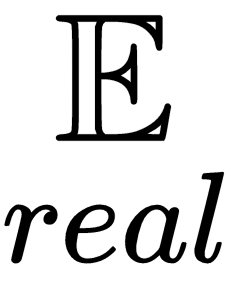
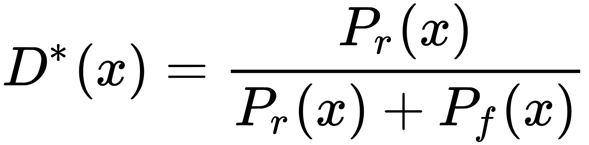
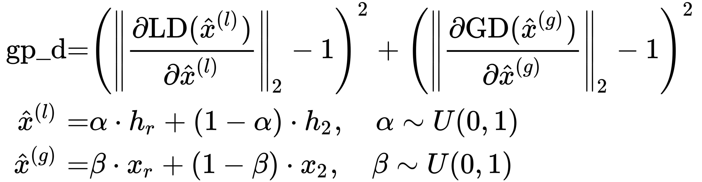

# 第八章：使用 GAN 进行图像修复

你是否曾经遇到过那种你非常喜欢的、质量差且模糊的图像（或表情包），即使是 Google 也无法帮助你找到更高分辨率的版本？除非你是那少数几位已经花费多年时间学习数学和编程的人，知道在目标方程中哪个分数阶正则化项可以通过哪种数值方法来求解，不然我们不妨尝试一下 GAN！

本章将帮助你使用 SRGAN 实现图像超分辨率，将低分辨率图像生成高分辨率图像，并使用数据预取器加速数据加载，提高训练过程中 GPU 的效率。你还将学习如何通过几种方法实现自己的卷积操作，包括直接方法、基于 FFT 的方法和 im2col 方法。稍后，我们将了解原始 GAN 损失函数的缺点，并通过使用 Wasserstein 损失（即 Wasserstein GAN）来改进它们。在本章结束时，你将学会如何训练 GAN 模型来执行图像修复，填补图像中的缺失部分。

本章将涵盖以下主题：

+   使用 SRGAN 进行图像超分辨率

+   生成式图像修复

# 使用 SRGAN 进行图像超分辨率

图像修复是一个广泛的领域，涉及到图像修复的三大主要过程：

+   图像超分辨率：将图像扩展至更高的分辨率

+   图像去模糊：将模糊的图像转化为清晰图像

+   图像修复：填补图像中的空洞或去除水印

所有这些过程都涉及从现有像素中估计像素信息。**修复**像素一词实际上是指估计它们应该呈现的样子。例如，在图像超分辨率中：为了将图像大小扩展一倍，我们需要估算三个额外的像素，以便与当前像素一起形成一个 2 x 2 区域。图像修复已经被研究人员和组织研究了几十年，开发了许多深奥的数学方法，这使得非数学背景的人很难轻松上手。现在，令人感兴趣的是，GAN 正在逐渐受到关注。

在这一节中，我们将介绍 GAN 家族的另一位成员 SRGAN，用于将图像上采样至更高的分辨率。

SRGAN（超分辨率生成对抗网络）由 Christian Ledig、Lucas Theis、Ferenc Huszar 等人提出，发表在他们的论文 *Photo-Realistic Single Image Super-Resolution Using a Generative Adversarial Network* 中。它被认为是首个成功将图像分辨率提高四倍的方法。它的结构非常简单。与许多其他 GAN 一样，它由一个生成器网络和一个判别器网络组成。它们的架构将在以下部分展示。

# 创建生成器

让我们来看一下生成器网络的组成部分：


SRGAN 的生成器架构（2X）

在前面的图示中，我们以 2 倍（到 1,024*1,024）放大一个 512*512 的图像作为例子。输入图像的大小是相当随意的，因为生成器网络中每个组件的设计与特征图的大小无关。上采样块负责将图像大小扩大一倍。如果我们想放大四倍，只需要在现有的上采样块后再添加一个上采样块。使用三个上采样块，当然可以将图像大小扩大八倍。

在生成器网络中，高级特征通过五个残差块提取，这些特征与来自原始图像的较少处理的细节信息（通过跨越残差块的长跳跃连接）结合。结合后的特征图被扩展为  通道（其中  代表尺度因子，  代表残差块中的通道数），其大小为 。上采样块将此  `Tensor`（  代表批量大小）转换为 。这一过程通过**子像素卷积**实现，这一方法由 Wenzhe Shi、Jose Caballero、Ferenc Huszár 等人在其论文《*使用高效子像素卷积神经网络进行实时单图像和视频超分辨率*》中提出。

以下是子像素卷积的示例。在低分辨率特征图中的每个  通道中，每个通道只负责高分辨率输出中  块内的一个像素。这种方法的一个大优点是，相较于普通卷积层，它只执行  的卷积操作，从而使训练更容易且更快速。

在 PyTorch 中，子像素卷积中的上采样步骤可以通过 `nn.PixelShuffle` 层完成，实际上它是重新调整输入张量的形状。你可以在这里查看 C++的源代码，[pytorch/aten/src/ATen/native/PixelShuffle.cpp](https://github.com/pytorch/pytorch/blob/517c7c98610402e2746586c78987c64c28e024aa/aten/src/ATen/native/PixelShuffle.cpp)，看看形状是如何调整的。

如何查看 PyTorch 操作的源代码？在使用 VS Code 时很容易。我们只需不断双击类名，并按 *F12* 直到我们到达 `torch` 模块下源代码树中的类定义。然后，我们查找该类中调用了哪些其他方法（通常可以在 `self.forward` 中找到），这将引导我们找到其 C++实现。

以下是实现`nn.PixelShuffle`的 C++源代码步骤：

1.  双击名称`PixelShuffle`，然后按*F12*。这会把我们带到`site-packages/torch/nn/modules/__init__.py`文件中的这一行：*

```py
from .pixelshuffle import PixelShuffle
```

1.  双击并按*F12*在这一行内的`PixelShuffle`，会将我们带到`site-packages/torch/nn/modules/pixelshuffle.py`中的`PixelShuffle`类定义。在它的`forward`方法中，我们可以看到调用了`F.pixel_shuffle`。

1.  再次双击并按*F12*在`pixel_shuffle`上。我们会到达`site-packages/torch/nn/functional.py`中的类似片段：

```py
pixel_shuffle = _add_docstr(torch.pixel_shuffle, r"""
...
""")
```

这是代码中的 C++部分作为 Python 对象注册到 PyTorch 的地方。PyTorch 操作的 C++对应物有时也会从`torch._C._nn`模块调用。在 VS Code 中，将鼠标悬停在`torch.pixel_shuffle`上会显示`pixel_shuffle(self: Tensor, upscale_factor: int) -> Tensor`，具体取决于使用的扩展。不幸的是，按*F12*没有找到任何有用的内容。

1.  要查找此`pixel_shuffle`函数的 C++实现，我们只需在 GitHub 上的 PyTorch 仓库中搜索`pixel_shuffle`关键字。如果你已将 PyTorch 源代码克隆到本地，可以在终端中输入以下命令来在`*.cpp`文件中搜索关键字：

```py
$ grep -r --include \*.cpp pixel_shuffle .
```

因此，我们可以在`pytorch/aten/src/ATen/native/PixelShuffle.cpp`中找到函数定义`Tensor pixel_shuffle(const Tensor& self, int64_t upscale_factor)`。

如果你对 PyTorch 是如何开发的，以及 C++和 Python 如何在 CPU 和 GPU 上协同工作，提供如此灵活且易于使用的接口感兴趣，可以查看 PyTorch 开发者之一 Edward Z. Yang 写的这篇长文：[`blog.ezyang.com/2019/05/pytorch-internals`](http://blog.ezyang.com/2019/05/pytorch-internals)。

现在，让我们来看看定义生成器网络的代码。我们实现的 SRGAN 大部分基于这个仓库：[`github.com/leftthomas/SRGAN`](https://github.com/leftthomas/SRGAN)。本章的代码仓库中也提供了 PyTorch 1.3 的完整工作源代码。我们将从创建一个新的 Python 文件开始，命名为`srgan.py`：

1.  定义残差块（当然，首先需要导入必要的模块）。

```py
import math
import torch
import torch.nn.functional as F
from torch import nn
import torchvision.models as models

class ResidualBlock(nn.Module):
    def __init__(self, channels):
        super(ResidualBlock, self).__init__()
        self.conv1 = nn.Conv2d(channels, channels, kernel_size=3,  
          padding=1)
        self.bn1 = nn.BatchNorm2d(channels)
        self.prelu = nn.PReLU()
        self.conv2 = nn.Conv2d(channels, channels, kernel_size=3, 
          padding=1)
        self.bn2 = nn.BatchNorm2d(channels)

    def forward(self, x):
        residual = self.conv1(x)
        residual = self.bn1(residual)
        residual = self.prelu(residual)
        residual = self.conv2(residual)
        residual = self.bn2(residual)
        return x + residual
```

在这里，**参数化 ReLU**（**PReLU**）被用作激活函数。PReLU 与 LeakyReLU 非常相似，不同之处在于负值的斜率因子是一个可学习的参数。

1.  定义上采样块：

```py
class UpsampleBLock(nn.Module):
    def __init__(self, in_channels, up_scale):
        super(UpsampleBLock, self).__init__()
        self.conv = nn.Conv2d(in_channels, in_channels * up_scale **  
          2, kernel_size=3, padding=1)
        self.pixel_shuffle = nn.PixelShuffle(up_scale)
        self.prelu = nn.PReLU()

    def forward(self, x):
        x = self.conv(x)
        x = self.pixel_shuffle(x)
        x = self.prelu(x)
        return x
```

在这里，我们使用一个`nn.Conv2d`层和一个`nn.PixelShuffle`层来执行子像素卷积，将低分辨率特征图重塑为高分辨率。这是 PyTorch 官方示例推荐的方法：[`github.com/pytorch/examples/blob/master/super_resolution/model.py`](https://github.com/pytorch/examples/blob/master/super_resolution/model.py)。

1.  定义包含残差和上采样块的生成器网络：

```py
class Generator(nn.Module):
    def __init__(self, scale_factor):
        upsample_block_num = int(math.log(scale_factor, 2))

        super(Generator, self).__init__()
        self.block1 = nn.Sequential(
            nn.Conv2d(3, 64, kernel_size=9, padding=4),
            nn.PReLU()
        )
        self.block2 = ResidualBlock(64)
        self.block3 = ResidualBlock(64)
        self.block4 = ResidualBlock(64)
        self.block5 = ResidualBlock(64)
        self.block6 = ResidualBlock(64)
        self.block7 = nn.Sequential(
            nn.Conv2d(64, 64, kernel_size=3, padding=1),
            nn.BatchNorm2d(64)
        )
        block8 = [UpsampleBLock(64, 2) for _ in 
          range(upsample_block_num)]
        block8.append(nn.Conv2d(64, 3, kernel_size=9, padding=4))
        self.block8 = nn.Sequential(*block8)

    def forward(self, x):
        block1 = self.block1(x)
        block2 = self.block2(block1)
        block3 = self.block3(block2)
        block4 = self.block4(block3)
        block5 = self.block5(block4)
        block6 = self.block6(block5)
        block7 = self.block7(block6)
        block8 = self.block8(block1 + block7)

        return (torch.tanh(block8) + 1) / 2
```

别忘了最后的长跳跃连接（`self.block8(block1 + block7)`）。最后，生成器网络的输出通过 tanh 激活函数被缩放到[0,1]的范围，原始范围是[-1,1]。这是因为训练图像的像素值位于[0,1]范围内，我们需要将其调整为有利于判别网络区分真实和伪造图像的相同范围。

我们之前没有谈到在训练 GAN 时如何注意值范围的陷阱。在之前的章节中，我们几乎总是通过`transforms.Normalize((0.5,), (0.5,))`将输入图像缩放到[-1,1]范围，进行训练数据的预处理。由于`torch.tanh`的输出也是[-1,1]，因此在将生成的样本输入到判别器网络或损失函数之前，不需要对其进行重新缩放。

# 创建判别器

判别网络的架构如下所示：


SRGAN 的判别器架构

SRGAN 的判别器采用类似 VGG 的结构，逐步减少特征图的尺寸，并扩展深度通道，希望每一层包含相似量的信息。与传统 VGG 网络不同，判别器使用池化层将最后一层 VGG 的特征图转换为 1 x 1。判别器网络的最终输出是一个单一值，表示输入图像是高分辨率还是低分辨率。

这里，我们给出了 SRGAN 判别器网络的定义代码：

```py
class Discriminator(nn.Module):
    def __init__(self):
        super(Discriminator, self).__init__()
        self.net = nn.Sequential(
            nn.Conv2d(3, 64, kernel_size=3, padding=1),
            nn.LeakyReLU(0.2),

            nn.Conv2d(64, 64, kernel_size=3, stride=2, padding=1),
            nn.BatchNorm2d(64),
            nn.LeakyReLU(0.2),

            nn.Conv2d(64, 128, kernel_size=3, padding=1),
            nn.BatchNorm2d(128),
            nn.LeakyReLU(0.2),

            nn.Conv2d(128, 128, kernel_size=3, stride=2, padding=1),
            nn.BatchNorm2d(128),
            nn.LeakyReLU(0.2),

            nn.Conv2d(128, 256, kernel_size=3, padding=1),
            nn.BatchNorm2d(256),
            nn.LeakyReLU(0.2),

            nn.Conv2d(256, 256, kernel_size=3, stride=2, padding=1),
            nn.BatchNorm2d(256),
            nn.LeakyReLU(0.2),

            nn.Conv2d(256, 512, kernel_size=3, padding=1),
            nn.BatchNorm2d(512),
            nn.LeakyReLU(0.2),

            nn.Conv2d(512, 512, kernel_size=3, stride=2, padding=1),
            nn.BatchNorm2d(512),
            nn.LeakyReLU(0.2),

            nn.AdaptiveAvgPool2d(1),
            nn.Conv2d(512, 1024, kernel_size=1),
            nn.LeakyReLU(0.2),
            nn.Conv2d(1024, 1, kernel_size=1)
        )

    def forward(self, x):
        batch_size = x.size(0)
        return torch.sigmoid(self.net(x).view(batch_size))
```

# 定义训练损失

SRGAN 的损失由 4 部分组成。这里，我们用  表示低分辨率（**LR**）图像，  表示生成器给出的超分辨率（**SR**）图像，  表示真实的高分辨率（**HR**）图像：

+   对抗损失 ，与之前的 GAN 模型类似

+   像素级内容损失 ，即超分辨率（SR）图像与高分辨率（HR）图像之间的均方误差（MSE）损失

+   VGG 损失 ，即超分辨率（SR）图像和高分辨率（HR）图像最后特征图之间的均方误差（MSE）损失

+   正则化损失 ，即像素梯度在水平方向和垂直方向上的平均 L2 范数之和

最终训练损失如下：


它被称为**感知损失**，意味着在判断超分辨率图像质量时，它会同时考虑像素级别的相似性和高层特征。

请注意，感知损失中的 L2 范数正则化项实际上会使图像变得模糊，因为它对像素梯度施加了强烈的约束。如果你对这一断言感到困惑，可以在脑海中想象一个正态分布，其中 x 轴表示像素梯度，*y*轴告诉我们像素梯度值出现在图像中的可能性。在正态分布中，，大部分元素都非常接近*y*轴，这意味着大多数像素的梯度非常小。这表明相邻像素之间的变化通常是平滑的。因此，我们不希望正则化项主导最终的损失。实际上，正则化项已从 SRGAN 论文的更新版本中删除，你也可以放心地将其去除。

这是感知`loss`函数的定义代码：

```py
class GeneratorLoss(nn.Module):
    def __init__(self):
        super(GeneratorLoss, self).__init__()
        vgg = models.vgg16(pretrained=True)
        loss_network = nn.Sequential(*list(vgg.features)[:31]).eval()
        for param in loss_network.parameters():
            param.requires_grad = False
        self.loss_network = loss_network
        self.mse_loss = nn.MSELoss()
        self.l2_loss = L2Loss()

    def forward(self, out_labels, out_images, target_images):
        # adversarial Loss
        adversarial_loss = torch.mean(1 - out_labels)
        # vgg Loss
        vgg_loss = self.mse_loss(self.loss_network(out_images), 
          self.loss_network(target_images))
        # pixel-wise Loss
        pixel_loss = self.mse_loss(out_images, target_images)
        # regularization Loss
        reg_loss = self.l2_loss(out_images)
        return pixel_loss + 0.001 * adversarial_loss + 0.006 * vgg_loss 
         + 2e-8 * reg_loss
```

正则化项计算如下：

```py
class L2Loss(nn.Module):
    def __init__(self, l2_loss_weight=1):
        super(L2Loss, self).__init__()
        self.l2_loss_weight = l2_loss_weight

    def forward(self, x):
        batch_size = x.size()[0]
        h_x = x.size()[2]
        w_x = x.size()[3]
        count_h = self.tensor_size(x[:, :, 1:, :])
        count_w = self.tensor_size(x[:, :, :, 1:])
        h_l2 = torch.pow((x[:, :, 1:, :] - x[:, :, :h_x - 1, :]), 2).sum()
        w_l2 = torch.pow((x[:, :, :, 1:] - x[:, :, :, :w_x - 1]), 2).sum()
        return self.l2_loss_weight * 2 * (h_l2 / count_h + w_l2 / count_w) 
         / batch_size

    @staticmethod
    def tensor_size(t):
        return t.size()[1] * t.size()[2] * t.size()[3]
```

现在，我们需要修改现有的`train.py`文件，以支持我们的新功能：

```py
# from loss import GeneratorLoss
# from model import Generator, Discriminator
from srgan1 import GeneratorLoss, Discriminator, Generator
```

由[`github.com/leftthomas/SRGAN`](https://github.com/leftthomas/SRGAN)提供的训练脚本在进行一些小修正后运行良好，修正方法是将每个`.data[0]`实例替换为`.item()`。

# 训练 SRGAN 以生成高分辨率图像

当然，我们需要一些数据来进行操作。我们只需从`README.md`文件中的链接下载训练图像。你可以使用任何你喜欢的图像集合，因为 SRGAN 的训练只需要低分辨率图像（这些可以通过调整大小轻松获得）以及原始图像。

创建一个名为`data`的文件夹，并将训练图像放入名为`DIV2K_train_HR`的文件夹中，将验证图像放入`DIV2K_valid_HR`文件夹中。接下来，创建一个名为`epochs`的文件夹来保存周期数据。最后，创建一个名为`training_results`的文件夹。

要训练 SRGAN，在终端中执行以下命令：

```py
$ pip install tqdm, pandas
$ python train.py
```

`leftthomas`提供的图像集合从 VOC2012 数据集采样，共包含 16,700 张图像。在 GTX 1080Ti 显卡上，批处理大小为 64 时，训练 100 个周期大约需要 6.6 小时。批处理大小为 88 时，GPU 内存使用量大约为 6433MB，批处理大小为 96 时，内存使用量为 7509MB。

然而，在训练 SRGAN 期间，GPU 使用率大多数时间都低于 10%（通过`nvtop`观察到），这表明数据的加载和预处理占用了过多时间。这个问题可以通过两种不同的解决方案来解决：

+   将数据集放置在 SSD 上（最好通过 NVMe 接口）

+   使用数据预取器在下一次迭代开始之前将数据预加载到 GPU 内存中

在这里，我们将讨论如何执行第二种解决方案。数据预取器的代码来自于 NVIDIA 的[apex](https://github.com/NVIDIA/apex)项目中的 ImageNet 示例：[`github.com/NVIDIA/apex/blob/master/examples/imagenet/main_amp.py`](https://github.com/NVIDIA/apex/blob/master/examples/imagenet/main_amp.py)。请按照以下步骤操作：

1.  在源代码树中的某个位置定义数据预取器（例如，SRGAN 中的`data_utils.py`文件）：

```py
class data_prefetcher():
 def __init__(self, loader):
 self.loader = iter(loader)
 self.stream = torch.cuda.Stream()
 self.preload()

 def preload(self):
 try:
 self.next_input, self.next_target = next(self.loader)
 except StopIteration:
 self.next_input = None
 self.next_target = None
 return
 with torch.cuda.stream(self.stream):
 self.next_input = self.next_input.cuda(non_blocking=True)
 self.next_target = self.next_target.cuda(non_blocking=True)
 self.next_input = self.next_input.float()

 def next(self):
 torch.cuda.current_stream().wait_stream(self.stream)
 input = self.next_input
 target = self.next_target
 self.preload()
 return input, target
```

1.  使用数据`prefetcher`在训练过程中加载样本：

```py
for epoch in range(1, NUM_EPOCHS + 1):
    train_bar = tqdm(train_loader)
 prefetcher = data_prefetcher(train_bar)
 data, target = prefetcher.next()
    ...
    while data is not None:
        // train D
        ...
        // train G
        ...
        data, target = prefetcher.next()
```

这里的`tqdm`模块用于在训练过程中在终端打印进度条，并且可以当作其原始的可迭代对象。在 SRGAN 的训练中，数据`prefetcher`对 GPU 效率有着巨大的提升，如下所示：


使用预取器加载图像到 GPU 内存之前和之后的 GPU 使用情况

数据预取器可以调整为另一种数据形式，这些内容也包含在本章对应仓库的源代码中。

以下展示了一些超分辨率的结果。我们可以看到 SRGAN 在锐化低分辨率图像方面表现良好。但我们也能注意到，在处理大色块之间的锐利边缘时，它会有一定的局限性（例如，第一张图中的岩石和第三张图中的树木）：


SRGAN 的超分辨率结果

# 生成图像修复

我们知道，如果训练得当，GAN 能够学习数据的潜在分布，并利用这些信息生成新的样本。GAN 的这一非凡能力使其非常适合应用于图像修复等任务，即用合理的像素填补图像中缺失的部分。

在本节中，我们将学习如何训练一个 GAN 模型来执行图像修复，基于 Jiahui Yu、Zhe Lin、Jimei Yang 等人在其论文《*Generative Image Inpainting with Contextual Attention*》中的工作。尽管他们的项目已有更新版本发布（[`jiahuiyu.com/deepfill2`](http://jiahuiyu.com/deepfill2)），但在撰写时，源代码尚未开源。因此，我们应该尝试根据其先前版本在 TensorFlow 上的源代码（[`github.com/JiahuiYu/generative_inpainting`](https://github.com/JiahuiYu/generative_inpainting)）在 PyTorch 中实现该模型。

在开始处理使用 GAN 进行图像修复之前，有几个基本概念需要理解，因为这些概念对理解该方法至关重要。

# 高效卷积 – 从 im2col 到 nn.Unfold

如果你曾经有足够的好奇心，尝试自己实现卷积神经网络（无论是使用 Python 还是 C/C++），你一定知道最痛苦的部分是梯度反向传播，而最耗时的部分是卷积操作（假设你实现的是像 LeNet 这样的简单 CNN）。

在代码中执行卷积的方法有很多种（除了直接使用深度学习工具，如 PyTorch）：

1.  按照定义直接计算卷积，这通常是最慢的方法。

1.  使用**快速傅里叶变换**（**FFT**），这对于卷积神经网络（CNN）来说并不理想，因为卷积核的大小通常相对于图像来说太小。

1.  将卷积视为矩阵乘法（换句话说，**一般矩阵乘法**或**GeMM**）使用**im2col**。这是许多软件和工具中最常用的方法，速度也快得多。

1.  使用**Winograd**方法，这在某些情况下比 GeMM 更快。

在本节中，我们将仅讨论前三种方法。如果你想了解更多关于 Winograd 方法的内容，可以查看这个项目，[`github.com/andravin/wincnn`](https://github.com/andravin/wincnn)，以及 Andrew Lavin 和 Scott Gray 的论文《*卷积神经网络的快速算法*》。在这里，我们将提供使用不同方法进行二维卷积的 Python 代码。

在继续之前，请确保通过在终端输入以下命令来安装必要的依赖项：

```py
$ pip install numpy, scipy
```

现在，让我们按照这些步骤进行：

1.  直接计算卷积。请注意，以下所有卷积实现的步幅大小为`1`，填充大小为`0`，这意味着输出大小为：

```py
import numpy as np

def conv2d_direct(x, w):
    w = np.flip(np.flip(w, 0), 1)
    rows = x.shape[0]
    cols = x.shape[1]
    kh = w.shape[0]
    kw = w.shape[1]
    rst = np.zeros((rows-kh+1, cols-kw+1))
    for i in range(rst.shape[0]):
        for j in range(rst.shape[1]):
            tmp = 0.
            for ki in range(kh):
                for kj in range(kw):
                    tmp += x[i+ki][j+kj] * w[ki][kj]
            rst[i][j] = tmp
    return rst
```

正如我们之前所说，按照定义直接计算卷积是极其慢的。以下是使用 5x5 卷积核对 512 x 512 图像进行卷积时的消耗时间：

```py
x = np.random.randn(512, 512)
w = np.random.randn(5, 5)

from timeit import default_timer as timer
start = timer()
rst1 = conv2d_direct(x, w)
end = timer()
print('Elapsed time (direct): {}'.format(end - start))
# 3.868343267000455 seconds on an Intel Core i5-4590 CPU
```

我们还需要将结果与基准进行比较（例如，`scipy.signal.convolve2d`），以确保计算正确：

```py
from scipy import signal

start = timer()
rst0 = signal.convolve2d(x, w, mode='valid')
end = timer()
print('Elapsed time (reference): {}'.format(end - start))
# 0.017827395000495017

error1 = np.max(np.abs(rst1 - rst0))
print('Error: {}'.format(error1))
# 1.0658141036401503e-14
```

现在我们知道我们的计算是正确的，问题在于如何更快地执行。

1.  使用 FFT 计算卷积：

根据这个公式，我们可以通过执行两次傅里叶变换和一次逆傅里叶变换来获得卷积结果：


由于我们处理的是数字图像，我们需要执行**离散傅里叶变换**（**DFT**），可以通过 NumPy 提供的**快速傅里叶变换**（**FFT**）方法极其快速地计算：

```py
def conv2d_fft(x, w):
    # return signal.fftconvolve(x, w, mode='valid')
    size = np.array(x.shape) + np.array(w.shape) - 1
    fsize = 2 ** np.ceil(np.log2(size)).astype(int)
    fslice = tuple([slice(kn-1, int(sz)-kn+1) for sz, kn in zip(size, w.shape)])
    x_fft = np.fft.fft2(x , fsize)
    w_fft = np.fft.fft2(w , fsize)
    rst = np.fft.ifft2(x_fft * w_fft)
    rst = rst[fslice].real
    return rst
```

这里是基于 FFT 的卷积的消耗时间和计算误差：

```py
Elapsed time (FFT): 0.17074442000011913
Error: 1.0658141036401503e-14
```

我们可以看到，使用 FFT 进行卷积比直接方法要快得多，且几乎与`scipy.signal.convolve2d`消耗的时间相同。我们能否做得更快？

1.  使用 im2col 计算卷积。

让我们停下来思考一下前两种方法。直接方法涉及 4 个`for`循环和大量随机访问矩阵元素。FFT 方法将卷积转化为矩阵乘法，但它需要进行 2 次 FFT 和 1 次逆 FFT。我们知道，低级计算工具如 BLAS 在矩阵乘法方面非常高效。那么，我们能否将原始卷积视为矩阵乘法呢？

以一个 3 x 3 的图像和 2 x 2 的卷积核为例（步长为 1，填充为 0）：


图像与 2 x 2 卷积核之间的卷积

我们可以将输入图像拉伸成一个非常长的向量（1 x 9），并将卷积核转换成一个非常大的矩阵（9 x 4），这样我们的输出将具有预期的 1 x 4 大小。当然，我们还需要根据卷积中的计算过程安排大矩阵中的元素（例如，），如下所示：


通过稀疏矩阵乘法进行卷积

这样，我们需要计算一个非常长的向量和一个大型稀疏矩阵之间的矩阵乘法（其中很多元素为零）。直接进行矩阵乘法可能非常低效（无论是从时间还是内存的角度）。虽然我们可以通过一些数值算法加速稀疏矩阵乘法，但我们不会深入探讨这种方法，因为有一种更高效的方式将卷积转换为矩阵乘法。

将稀疏矩阵乘法与具有相同输入和输出维度（且权重矩阵大小相同）的全连接层（`nn.Linear`）进行比较，我们可以看到，卷积所需的参数远少于全连接层（因为权重矩阵中有许多零，并且很多元素是可重用的）。这使得 CNN 比 MLP 更容易训练且对过拟合更具鲁棒性，这也是近年来 CNN 更受欢迎的原因之一。

考虑到卷积核的大小通常远小于图像，我们将尝试将卷积核拉伸成一个向量，并重新排列输入图像中的元素以匹配卷积核向量的维度，如下所示：


通过 im2col 进行卷积

现在，我们可以看到，我们只需要进行具有较小维度的密集矩阵乘法。我们对输入图像进行的转换叫做**im2col**。im2col 的结果很容易理解：一行中的元素表示在给定位置执行卷积所需的输入图像元素（这被称为**滑动窗口**），而第 ^(th) 行对应于第 ^(th) 输出元素（）。

这是 `im2col` 的 Python 实现：

```py
def im2col(x, stride=1):
    # https://stackoverflow.com/a/30110497/3829845
    rows = x.shape[0]
    cols = x.shape[1]
    kh = w.shape[0]
    kw = w.shape[1]
    s0, s1 = x.strides
    nrows = rows-kh+1
    ncols = cols-kw+1
    shape = kh, kw, nrows, ncols
    slides = s0, s1, s0, s1
    L = kh*kw

    x_unfold = np.lib.stride_tricks.as_strided(x, shape=shape, strides=slides)
    return x_unfold.reshape(L, -1)[:,::stride]

def conv2d_gemm(x, w, stride=1):
    w = np.flip(np.flip(w, 0), 1)
    rows = x.shape[0]
    cols = x.shape[1]
    kh = w.shape[0]
    kw = w.shape[1]
    L = kh*kw

    x_unfold = im2col(x)
    y_unfold = np.matmul(x_unfold.transpose(), w.reshape((L, 1)))
    return y_unfold.reshape(rows-kh+1, cols-kw+1)
```

这里是经过的时间和计算误差：

```py
Elapsed time (im2col): 0.014781345998926554
Error: 1.0658141036401503e-14
```

将卷积视为矩阵乘法在所有三种方法中获得了最快的计算速度。与直接方法相比，它在计算时间上实现了超过 260 倍的加速。im2col 的另一个优势是它与 CNN 完全兼容。在 CNN 中，卷积通常是在通道内执行的，这意味着我们需要计算一组独立卷积的和。例如，假设我们的输入特征图大小为 ，权重张量是 。对于每个  通道中的神经元，它是  乘以图像  和卷积核  之间的卷积操作的和。使用 im2col，给定位置的滑动窗口的卷积结果由两个向量的乘法表示（因为卷积本身是元素逐项相乘的和）。我们可以通过将所有  通道中的滑动窗口的所有元素填充到一个长向量中，从而应用这种模式，使得可以通过一次向量乘法获得一个  通道中的输出像素值。如果你想了解更多关于如何在 Python 中执行通道-wise 卷积的信息，可以查看这个 Stack Overflow 帖子：[`stackoverflow.com/q/30109068/3829845`](https://stackoverflow.com/q/30109068/3829845)。

将 4D 张量卷积转化为 3D 张量乘法是 `nn.Unfold` 派上用场的地方。以下是一个代码片段，展示了如何使用 PyTorch 显式地将卷积转换为矩阵乘法（基于官方文档：[`pytorch.org/docs/stable/nn.html?highlight=unfold#torch.nn.Unfold`](https://pytorch.org/docs/stable/nn.html?highlight=unfold#torch.nn.Unfold)）：

```py
import torch

inp = torch.randn(1, 1, 512, 512)
w = torch.randn(1, 1, 5, 5)
start = timer()
inp_unf = torch.nn.functional.unfold(inp, (5, 5))
out_unf = inp_unf.transpose(1, 2).matmul(w.view(w.size(0), -1).t()).transpose(1, 2)
out = out_unf.view(1, 1, 508, 508)
# Or using
# out = torch.nn.functional.fold(out_unf, (508, 508), (1, 1))
end = timer()
print('Elapsed time (nn.Unfold): {}'.format(end - start))
error4 = (torch.nn.functional.conv2d(inp, w) - out).abs().max()
print('Error: {}'.format(error4))
```

输出消息如下：

```py
Elapsed time (nn.Unfold): 0.021252065999760816
Error: 6.67572021484375e-06
```

很高兴看到我们的 Python im2col 实现甚至比 PyTorch 更快。我们希望这能鼓励你构建自己的深度学习工具箱！

# WGAN – 理解 Wasserstein 距离

GAN 一直以来被认为难以训练，特别是如果你曾尝试从零开始构建一个 GAN。（当然，我们希望，在阅读本书后，训练 GAN 对你来说会变得更容易！）在过去的章节中，我们已经学习了许多不同的模型设计和训练技巧，这些技巧源自许多优秀研究者的经验。在这一部分，我们将讨论如何使用更好的距离度量来改进 GAN 的训练，即 Wasserstein GAN。

**Wasserstein GAN**（**WGAN**）由 Martin Arjovsky、Soumith Chintala 和 Léon Bottou 在他们的论文《*Wasserstein GAN*》中提出。Martin Arjovsky 和 Léon Bottou 也在早期的论文《*Towards Principled Methods for Training Generative Adversarial Networks*》中奠定了基础。为了充分理解这些论文，你需要具备概率论、测度论和泛函分析的基础数学知识。我们将尽力简化数学公式，帮助你理解 WGAN 的概念。

# 分析原始 GAN 损失函数的问题

让我们回顾一下 GAN 中常用的损失函数（这些已经出现在前几章中）：

+   ，这是 GAN 损失的原始形式

+   

+   

前几章的实验结果已经表明这些损失函数在多个应用中表现良好。然而，让我们深入研究这些函数，看看当它们效果不好时可能出什么问题：

**第 1 步：** 第一个损失函数的问题：

假设生成器网络已经训练完成，我们需要找到一个最优的判别器网络 D。我们有以下公式：

。

在这个公式中， 代表真实数据的分布， 代表伪造（生成）数据的分布。 是计算  时的真实数据，计算  时的伪造数据。

我们承认这里的 表示法有点混乱。然而，如果我们考虑所有种类的数据存在于同一个数据空间中（例如，所有可能的 256 x 256 的三通道 8 位图像），并且其中一部分空间属于真实数据，另一部分属于生成数据。GAN 的训练本质上是让*伪造*部分与*真实*部分重叠，希望最终能与*真实*部分相同。

为了找到公式的最小值，我们令关于*D*的导数为零，得到以下结果：

。

因此，当 D 最优时，第一个损失函数变为如下形式：


这里， 是**Jensen–Shannon 散度**（**JS 散度**），它是**Kullback–Leibler 散度**（**KL 散度**）的对称版本：


Kullback-Leibler 散度通常用于描述两个分布之间的距离。它等于 **交叉熵**  与  之差减去  的 **熵**，这也是为什么 KL 散度有时被称为 **相对熵**。请记住，KL 散度是非对称的，因为  与  会得到 ，但  与  会得到 。因此，KL 散度严格来说不是一个距离度量。然而，Jensen-Shannon 散度是对称的，可以作为一个距离度量使用。

如果你使用过 TensorBoard 来可视化神经网络学习到的嵌入空间，你可能会发现一种叫做 **t-SNE** 的有用技术，它可以非常清晰地在二维或三维图中展示高维数据（比 PCA 更清晰）。在 t-SNE 中，KL 散度的修正版被用来将高维数据映射到低维。你可以查看这个博客来了解更多关于 t-SNE 的信息：[`distill.pub/2016/misread-tsne`](https://distill.pub/2016/misread-tsne)。此外，这个 Google Techtalk 视频对于理解 KL 散度和 t-SNE 非常有帮助：[`www.youtube.com/watch?v=RJVL80Gg3lA`](https://www.youtube.com/watch?v=RJVL80Gg3lA)。

JS 散度的一个问题是，当  与  相距很远时（几乎没有或只有很少的重叠部分），其值保持为 ，无论  与  之间相距多远。在训练的开始阶段，假设  与  之间的距离极大是合理的（因为生成器是随机初始化的，且  可能在数据空间的任何位置）。当判别器最优时，几乎常数的损失值对导数提供的信息非常有限。因此，在 GAN 中使用第一种形式的损失时，一个训练良好的判别器将会阻止生成器自我改善（**梯度消失**）。

GAN 中的梯度消失问题有时可以通过在训练过程中向判别器的输入添加退火噪声来解决。但我们稍后会讨论一种更为有原则的方法。

**步骤 2：** 其他两个损失函数的问题：

以第三种损失为例，它可以写成如下形式：


在这个公式中，最后两个项与生成器无关。然而，前两个项的目标完全相反（最小化 KL 散度的同时最大化 JS 散度）。这导致训练非常不稳定。另一方面，使用 KL 散度可能会导致**模式崩溃**。未能生成真实的样本会受到严重惩罚（当和）但仅生成少数几种真实样本则不会受到惩罚（当和）。这使得生成器更容易生成样本的多样性较少。

# Wasserstein 距离的优点

Wasserstein 距离（也叫**地球搬运距离**或**EMD**）定义如下：


如果你发现前面的公式难以理解，不用担心。它本质上描述了从所有可能的联合分布中采样的两个变量之间的最小距离。用通俗的话说，它是将一堆土（以某种分布的形式）移动到形成另一堆土（另一种分布）所需的最小成本，如下图所示：


Wasserstein 距离：两个堆之间的最优运输（图片来自 [`vincentherrmann.github.io/blog/wasserstein`](https://vincentherrmann.github.io/blog/wasserstein)）

与 JS 散度相比，Wasserstein 距离能够正确描述真实数据与假数据之间的距离，即使它们相隔较远。因此，当判别器表现良好时，可以正确计算导数来更新生成器网络。

为了找到最合适的函数，*f*，我们可以简单地训练一个神经网络来估计它（幸运的是，我们已经在训练一个判别网络）。为了确保方程的第二行成立，一个重要的条件是所有函数 *f* 都是**Lipschitz 连续**的：


在神经网络中，Lipschitz 连续性很容易实现，通过将任何大于*K*的梯度值裁剪为*K*（**梯度裁剪**），或者简单地将权重值裁剪为常数值（**权重裁剪**）。

记得在第一章中编写的简单 GAN 吗？我们应用了梯度裁剪和权重裁剪来确保训练的稳定性。如果有人问你为什么要裁剪（钳制）GAN 中的张量，你现在可以给出比*梯度爆炸*更好的答案。

最后，Wasserstein 损失写作如下：


然而，在训练非常深的神经网络时，也会出现一些梯度剪切的问题。首先，如果梯度/权重被频繁限制在[-c, c]之间，它们会在训练结束时倾向于固定在-c 或 c，而只有少数参数的值在这两个端点之间。其次，限制梯度到更大或更小的范围可能会导致“看不见”的梯度消失或爆炸。我们称之为“看不见”，因为即使梯度值非常大，它们最终仍会被限制在[-c, c]之间。但这将是完全浪费计算资源。因此，Ishaan Gulrajani、Faruk Ahmed、Martin Arjovsky 等人在他们的论文*Improved Training of Wasserstein GANs*中提出，向判别器损失中添加惩罚项——**梯度惩罚**。


惩罚梯度是根据真实数据和假数据之间的一对随机插值来计算的。

简而言之，要使用 Wasserstein 损失，你需要做以下几步：

+   去掉判别器网络最后一层的`Sigmoid`函数。

+   计算损失时不要对结果应用`log`函数。

+   使用梯度惩罚（或者直接剪切浅层神经网络中的权重）。

+   使用 RMSprop 代替 Momentum 或 Adam 来训练你的网络。

# 训练图像修复的 GAN

现在，终于到了训练一个新的图像修复 GAN 模型的时刻。你可以从[`github.com/DAA233/generative-inpainting-pytorch`](https://github.com/DAA233/generative-inpainting-pytorch)获得原始 PyTorch 实现的代码。修改原始代码以实现你自己的模型将是一项挑战。由于你已经有了`CelebA`数据集，可以将其作为本节实验的训练数据集。

# 图像修复的模型设计

图像修复的 GAN 模型由两个生成器网络（粗生成器和精细生成器）和两个判别器网络（局部判别器和全局判别器）组成，如下所示：


图像修复的 GAN 模型：图像 x 表示输入图像；x[1]和 x[2]分别表示粗生成器和精细生成器生成的图像；x[r]表示原始完整图像；m 表示图像中缺失部分的掩膜。

生成器模型采用了两阶段的粗到细架构。粗生成器是一个 17 层的编码器-解码器 CNN，在中间使用扩张卷积来扩展感受野。假设输入图像(*x*)的大小为 3 x 256 x 256，那么粗生成器的输出(*x[1]*)也是 3 x 256 x 256。

精细化生成器有两个分支。一个是 10 层 CNN，另一个被称为**上下文注意力**分支，负责在图像的另一部分找到适当的参考位置，以生成正确的像素来填充孔洞。初始输入图像*x*、粗略输出*x[1]*以及标记*x*中缺失像素的二进制掩模一起输入到精细化生成器，并通过 6 个卷积层映射到[128,64,64]的张量，然后进入上下文注意力分支。

这里展示了上下文注意力分支中的计算过程：


上下文注意力的计算：图像 b 为背景，f 为前景，m 为掩模。

由于内容长度的限制，我们不会深入讨论上下文注意力。重要步骤如前面图示所示。由于我们需要找到前景（待填充的像素）和背景（掩模孔外的剩余像素）之间最相关的部分，因此计算前景图像和背景图像中每一对图像块之间的逐像素相似度。逐一计算所有可能的对比显然效率低下。因此，使用`nn.Unfold`来创建前景和背景图像的滑动窗口版本（窗口大小为 3x3）（*x[i]*和*w[i]*）。为了减少 GPU 内存消耗，图像被调整为[128,32,32]的大小。因此，两幅图像中有*32*32=1,024*个滑动窗口，*x**[i]*和*w**[i]*之间的卷积将告诉我们每对图像块中的像素相似度。具有最高相似度的位置信息对表明在重建前景块时注意力集中在哪个位置。

为了确保对轻微注意力偏移的鲁棒性，每个像素的注意力值沿水平和垂直轴进行了平均，这也是为什么*y[i]*与单位矩阵进行两次卷积的原因。注意力得分通过缩放的 softmax 函数计算：


最后，使用原始背景的展开形式作为卷积核，对*y[i]*执行转置卷积，以重建缺失的像素。

CNN 分支和 CA 分支的两个输出大小均为[128,64,64]，这些输出被连接成一个[256,64,64]的宽张量。然后使用另外 7 个卷积层将重建的特征图逐渐映射到[3,256,256]的图像。

粗略和精细化生成器输出图像中的像素值被限制在[-1,1]范围内，以适应判别网络。

使用两个结构相似的判别器网络（局部判别器和全局判别器）来评估生成图像的质量。它们都有 4 层卷积层和 1 层全连接层。唯一的区别是局部判别器用于评估裁剪图像块（换句话说，就是原始图像中缺失的像素，大小为 3 x 128 x 128），而全局判别器用于评估整个图像（3 x 256 x 256）。

# Wasserstein 损失的实现

在这里，我们让  和  （局部判别器的输出）分别表示裁剪图像  和 的保真度置信度。我们让  和 （全局判别器的输出）分别表示整个图像  和 的保真度置信度。然后，判别器的 Wasserstein 损失定义如下：

。

判别器的梯度惩罚项定义如下：



生成器的 Wasserstein 损失定义如下：

。

缺失像素的 L1 重建损失定义如下：

。

剩余像素的 L1 重建损失定义如下（显然，我们不希望改变这些像素）：

。

最后，判别器损失如下：

。

生成器的损失定义如下：


使用批量大小为 24 的情况下，图像修复 GAN 的训练消耗约 10,097MB 的 GPU 内存，并且在生成一些不错的结果之前，需要大约 64 小时的训练（180k 次迭代）。以下是一些修复结果。


GAN 生成的图像修复结果

现在，我们已经学习了大部分需要用 GAN 生成图像的知识。

# 总结

本章我们获得了大量的实践和理论知识，包括学习图像去模糊和图像分辨率增强，从 FFA 算法到实现 Wasserstein 损失函数。

在下一章，我们将训练我们的 GAN 来突破其他模型。

# 有用的阅读列表和参考文献

+   Ledig C, Theis L, Huszar F, 等人（2017）。*基于生成对抗网络的真实单图像超分辨率重建*。CVPR。

+   Shi W, Caballero J, Huszár F, 等. (2016). *实时单图像和视频超分辨率使用高效子像素卷积神经网络*。CVPR。

+   Yang E. (2019 年 5 月). *PyTorch 内部机制*。取自 [`blog.ezyang.com/2019/05/pytorch-internals`](http://blog.ezyang.com/2019/05/pytorch-internals)。

+   Yu J, Lin Z, Yang J, 等. (2018). *基于上下文注意力的生成图像修复*。CVPR。

+   Lavin A, Gray S. (2016). *卷积神经网络的快速算法*。CVPR。

+   Warden P. (2015 年 4 月 20 日). *为什么 GEMM 是深度学习的核心*。取自 [`petewarden.com/2015/04/20/why-gemm-is-at-the-heart-of-deep-learning`](https://petewarden.com/2015/04/20/why-gemm-is-at-the-heart-of-deep-learning)。

+   Arjovsky M, Bottou L. (2017). *面向生成对抗网络的原则性训练方法*。ICLR。

+   Arjovsky M, Chintala S, Bottou L. (2017). *Wasserstein GAN*。ICML。

+   Distill. (2016). *如何有效使用 t-SNE*。取自 [`distill.pub/2016/misread-tsne`](https://distill.pub/2016/misread-tsne)。

+   Hui J. (2018 年 6 月 22 日). *GAN——为什么训练生成对抗网络如此困难！*。取自 [`medium.com/@jonathan_hui/gan-why-it-is-so-hard-to-train-generative-advisory-networks-819a86b3750b`](https://medium.com/@jonathan_hui/gan-why-it-is-so-hard-to-train-generative-advisory-networks-819a86b3750b)。

+   Weng L. (2017 年 8 月 20 日). *从 GAN 到 WGAN*。取自 [`lilianweng.github.io/lil-log/2017/08/20/from-GAN-to-WGAN.html`](https://lilianweng.github.io/lil-log/2017/08/20/from-GAN-to-WGAN.html)。

+   Herrmann V. (2017 年 2 月 24 日). *Wasserstein GAN 与 Kantorovich-Rubinstein 对偶性*。取自 [`vincentherrmann.github.io/blog/wasserstein`](https://vincentherrmann.github.io/blog/wasserstein)。

+   Gulrajani I, Ahmed F, Arjovsky M, 等. (2017). *改进的 Wasserstein GAN 训练方法*。NIPS。
