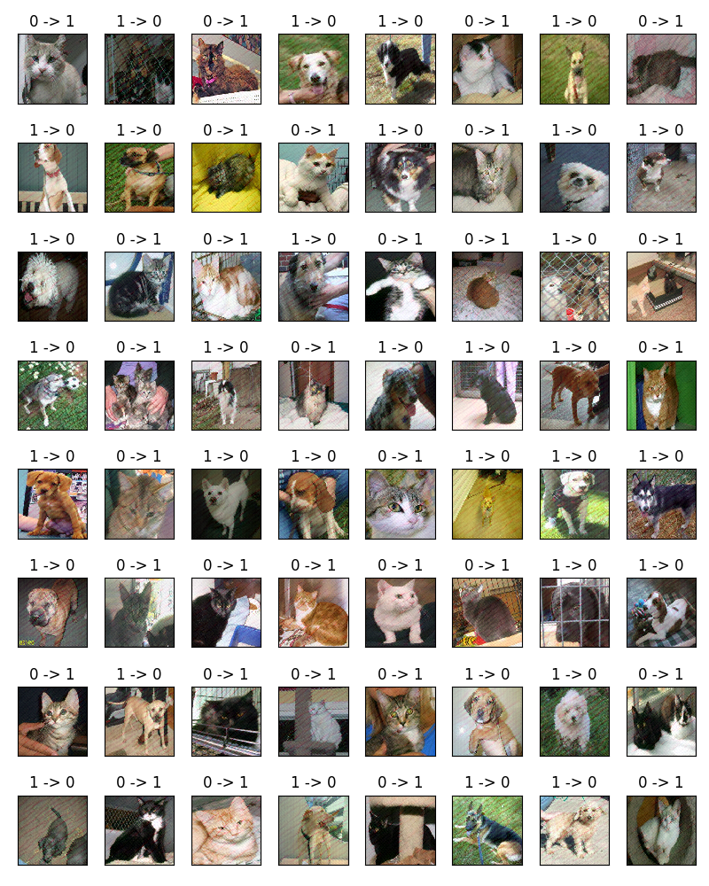

# 第九章：训练你的 GAN 模型以突破不同的模型

人们逐渐倾向于使用深度学习方法来解决计算机视觉领域的问题。你有没有见过你的同学或同事向你炫耀他们最新的图像分类器？现在，借助 GANs，你可能真的有机会通过生成对抗性样本来打破他们之前的模型，向他们展示你能做些什么。

我们将深入探讨对抗性样本的基本原理，并学习如何使用**FGSM**（**快速梯度符号方法**）攻击并迷惑 CNN 模型。我们还将学习如何通过迁移学习，在 Kaggle 的猫狗数据集上训练一个集成分类器，之后，我们将学习如何使用 accimage 库进一步加速图像加载，并训练一个 GAN 模型生成对抗性样本，从而愚弄图像分类器。

本章将涵盖以下主题：

+   对抗性样本 - 攻击深度学习模型

+   生成对抗性样本

# 对抗性样本 - 攻击深度学习模型

众所周知，使用具有大量参数的深度学习方法（有时超过千万个参数）时，人们往往难以理解它们到底学到了什么，除了它们在计算机视觉和自然语言处理领域表现异常出色这一事实。如果你身边的人感觉非常轻松地使用深度学习来解决每一个实际问题，并且毫不犹豫，那么我们即将在本章学习的内容将帮助他们意识到他们的模型可能面临的潜在风险。

# 什么是对抗性样本，它是如何创建的？

对抗性样本是一种样本（通常是基于真实数据修改的），它们很容易被机器学习系统错误分类（有时看起来对人眼是正常的）。对图像数据的修改可以是少量的噪声（[`openai.com/blog/adversarial-example-research`](https://openai.com/blog/adversarial-example-research)）或一个小的图像补丁（Tom B. Brown 等人，2017 年）。有时，将它们打印在纸上并拍照，甚至能愚弄神经网络。从几乎所有角度来看，甚至可以通过 3D 打印一个物体来愚弄神经网络（Anish Athalye 等人，2018 年）。尽管你可以创建一些看似毫无意义的随机样本，仍然能导致神经网络出错，但更有趣的是研究那些看起来对人类来说是正常的，但却被神经网络误分类的对抗性样本。

请放心，我们并没有偏离主题，讨论对抗样本。在此之前，Ian Goodfellow（被称为 GAN 之父）曾花了相当多的时间研究对抗样本。对抗样本和 GAN 可能是兄弟关系！开个玩笑，GAN 擅长生成逼真且具有说服力的样本，也能生成误导其他分类器的样本。在本章中，我们首先将讲解如何构造对抗样本，并用它来攻击一个小型模型。接着，我们将展示如何使用 GAN 生成对抗样本以攻击大型模型。

# 使用 PyTorch 进行对抗攻击

有一个非常优秀的对抗攻击、对抗防御和基准测试工具箱，叫做 CleverHans，适用于 TensorFlow，地址是[`github.com/tensorflow/cleverhans`](https://github.com/tensorflow/cleverhans)。目前，开发者正在计划支持 PyTorch，详情请见[`github.com/tensorflow/cleverhans/blob/master/tutorials/future/torch/cifar10_tutorial.py`](https://github.com/tensorflow/cleverhans/blob/master/tutorials/future/torch/cifar10_tutorial.py)。在本节中，我们需要在 PyTorch 中实现一个对抗样本。

以下代码片段基于 PyTorch 的官方教程：[`pytorch.org/tutorials/beginner/fgsm_tutorial.html`](https://pytorch.org/tutorials/beginner/fgsm_tutorial.html)。我们将稍作修改模型，并且对抗样本的创建将以批次形式进行。以一个名为`advAttackGAN.py`的空文件开始：

1.  导入模块：

```py
import torch
import torch.nn as nn
import torch.nn.functional as F
import torch.optim as optim
import matplotlib.pyplot as plt

from torchvision import datasets, transforms

print("PyTorch version: {}".format(torch.__version__))
print("CUDA version: {}\n".format(torch.version.cuda))
```

1.  定义设备和扰动因子：

```py
use_cuda = True
device = torch.device("cuda:0" if use_cuda and torch.cuda.is_available() else "cpu")

epsilons = [.05, .1, .15, .2, .25, .3]
```

1.  定义 CNN 模型，这个模型被称为 LeNet-5 模型：

```py
class Net(nn.Module):
    def __init__(self):
        super(Net, self).__init__()
        self.conv1 = nn.Conv2d(1, 20, kernel_size=5)
        self.conv2 = nn.Conv2d(20, 50, kernel_size=5)
        self.fc1 = nn.Linear(800, 500)
        self.fc2 = nn.Linear(500, 10)

    def forward(self, x):
        x = F.relu(F.max_pool2d(self.conv1(x), 2))
        x = F.relu(F.max_pool2d(self.conv2(x), 2))
        x = F.relu(self.fc1(x.view(-1, 800)))
        x = self.fc2(x)
        return x
```

1.  定义训练和测试的数据加载器。在这里，我们将使用 MNIST 数据集：

```py
batch_size = 64
train_data = datasets.MNIST('/home/john/Data/mnist', train=True, download=True,
                            transform=transforms.Compose([
                                transforms.ToTensor(),
                                # transforms.Normalize((0.1307,), (0.3081,)),
                                ]))
train_loader = torch.utils.data.DataLoader(train_data, batch_size=batch_size,
                                           shuffle=True, pin_memory=True)

test_data = datasets.MNIST('/home/john/Data/mnist', train=False, download=True,
                           transform=transforms.Compose([
                                transforms.ToTensor(),
                                # transforms.Normalize((0.1307,), (0.3081,)),
                                ]))
test_loader = torch.utils.data.DataLoader(test_data, batch_size=1000,
                                          shuffle=False, pin_memory=True)
```

注意，为了让定义的扰动因子能够适用于我们的模型，我们没有对数据进行标准化（去均值并除以标准差）。

1.  创建`model`、`optimizer`和`loss`函数：

```py
model = Net().to(device)
optimizer = optim.Adam(model.parameters(), lr=0.001, betas=(0.9, 0.999), weight_decay=3e-5)
criterion = nn.CrossEntropyLoss()
```

1.  定义`train`和`test`函数：

```py
def train(model, device, train_loader, optimizer):
    model.train()
    for batch_idx, (data, target) in enumerate(train_loader):
        data, target = data.to(device), target.to(device)
        optimizer.zero_grad()
        output = model(data)
        loss = criterion(output, target)
        loss.backward()
        optimizer.step()
        if batch_idx % 250 == 0:
            print('[{}/{}]\tLoss: {:.6f}'.format(
                batch_idx * batch_size, len(train_data), loss.item()))

def test(model, device, test_loader):
    model.eval()
    test_loss = 0
    correct = 0
    with torch.no_grad():
        for data, target in test_loader:
            data, target = data.to(device), target.to(device)
            output = model(data)
            test_loss += criterion(output, target).item()
            pred = output.max(1, keepdim=True)[1]
            correct += pred.eq(target.view_as(pred)).sum().item()
    test_loss /= len(test_loader)
    print('\nTest loss: {:.4f}, accuracy: {:.4f}%\n'.format(
        test_loss, 100\. * correct / len(test_data)))
```

1.  让我们训练这个模型，看看这个小型模型能做什么：

```py
model.train()
for epoch in range(5):
 print('Train Epoch: {}'.format(epoch))
 train(model, device, train_loader, optimizer)
 test(model, device, test_loader)
```

输出信息可能如下所示：

```py
PyTorch version: 1.3.1
CUDA version: 10.0.130

Train Epoch: 0
[0/60000] Loss: 2.307504
[16000/60000] Loss: 0.148560
...
Test loss: 0.0229, accuracy: 99.3100%
```

我们可以看到，经过仅仅 5 个训练周期后，我们的小型 CNN 模型在测试集上的准确率达到了 99.31%。

1.  现在，实施 FGSM 以创建一个来自读取样本及其导数的对抗样本：

```py
def fgsm_attack(image, epsilon, data_grad):
    sign_data_grad = data_grad.sign()
    perturbed_image = image + epsilon*sign_data_grad
    perturbed_image = torch.clamp(perturbed_image, 0, 1)
    return perturbed_image
```

1.  使用`fgsm_attack`对测试图像进行扰动，并观察会发生什么：

```py
def adv_test(model, device, test_loader, epsilon):
    model.eval()
    correct = 0
    adv_examples = []
    #* grads of params are needed
    for data, target in test_loader:
        data, target = data.to(device), target.to(device)

        # Set requires_grad attribute of tensor. Important for Attack
        data.requires_grad = True
        output = model(data)
        init_pred = output.max(1, keepdim=True)[1]
        init_pred = init_pred.view_as(target)
        loss = criterion(output, target)
        model.zero_grad()
        loss.backward()

        perturbed_data = fgsm_attack(data, epsilon, data.grad.data)
        output = model(perturbed_data)
        final_pred = output.max(1, keepdim=True)[1]
        # final_pred has shape [1000, 1], target has shape [1000]. Must reshape final_pred
        final_pred = final_pred.view_as(target)
        correct += final_pred.eq(target).sum().item()
        if len(adv_examples) < 5 and not (final_pred == target).all():
            indices = torch.arange(5)
            for i in range(indices.shape[0]):
                adv_ex = perturbed_data[indices[i]].squeeze().detach().cpu().numpy()
                adv_examples.append((init_pred[indices[i]].item(), final_pred[indices[i]].item(), adv_ex))
                if (len(adv_examples) >= 5):
                    break
    final_acc = 100\. * correct / len(test_data)
    print("Epsilon: {}\tTest Accuracy = {}/{} = {:.4f}".format(
        epsilon, correct, len(test_data), final_acc))
    return final_acc, adv_examples

accuracies = []
examples = []

# Run test for each epsilon
for eps in epsilons:
    acc, ex = adv_test(model, device, test_loader, eps)
    accuracies.append(acc)
    examples.append(ex)
```

在这里，我们将前五个测试图像保存到`adv_examples`中，以展示扰动前后预测标签。你可以随时将`indices = torch.arange(5)`这一行替换成以下代码，以仅显示那些导致模型失败的对抗样本：

```py
indices = torch.ne(final_pred.ne(target), init_pred.ne(target)).nonzero()
```

终端中的输出信息可能如下所示：

```py
Epsilon: 0.05 Test Accuracy = 9603/10000 = 96.0300
Epsilon: 0.1 Test Accuracy = 8646/10000 = 86.4600
Epsilon: 0.15 Test Accuracy = 6744/10000 = 67.4400
Epsilon: 0.2 Test Accuracy = 4573/10000 = 45.7300
Epsilon: 0.25 Test Accuracy = 2899/10000 = 28.9900
Epsilon: 0.3 Test Accuracy = 1670/10000 = 16.7000
```

我们可以看到，随着`epsilon`的增大，模型误分类的样本数量增加。在最糟糕的情况下，模型的测试准确率降至 16.7%。

1.  最后，使用`matplotlib`展示扰动后的图像：

```py
cnt = 0
plt.figure(figsize=(8,10))
for i in range(len(epsilons)):
    for j in range(len(examples[i])):
        cnt += 1
        plt.subplot(len(epsilons),len(examples[0]),cnt)
        plt.xticks([], [])
        plt.yticks([], [])
        if j == 0:
            plt.ylabel("Eps: {}".format(epsilons[i]), fontsize=14)
        orig,adv,ex = examples[i][j]
        plt.title("{} -> {}".format(orig, adv))
        plt.imshow(ex, cmap="gray")
plt.tight_layout()
plt.show()
```

下面是前五个测试图像及其在不同因子值扰动前后的预测标签：


从 MNIST 创建的对抗样本

# 生成对抗样本

在前几章中，我们一直使用 GAN 生成各种类型的图像。现在，是时候尝试用 GAN 生成对抗样本并破解一些模型了！

# 为 Kaggle 的猫狗数据集准备一个集成分类器

为了使我们的演示更接近实际场景，我们将在 Kaggle 的猫狗数据集([`www.kaggle.com/c/dogs-vs-cats`](https://www.kaggle.com/c/dogs-vs-cats))上训练一个合理的模型，然后用 GAN 生成的对抗样本来破解模型。该数据集包含 25,000 张训练图像和 12,500 张测试图像，图像内容为狗或猫。在本实验中，我们只使用 25,000 张训练图像。

为了方便，在下载数据集后，将猫和狗的图像分别放入不同的文件夹中，使文件结构如下所示：

```py
/cats-dogs-kaggle
    /cat
        /cat.0.jpg
        /cat.1.jpg
        ...
    /dog
        /dog.0.jpg
        /dog.1.jpg
        ...
```

我们在这个数据集上训练的模型由几个由 PyTorch Hub 提供的预训练模型组成([`github.com/pytorch/hub`](https://github.com/pytorch/hub))。我们还需要对这些预训练模型进行迁移训练，以适应我们的数据集：


Kaggle 猫狗数据集的集成模型

现在，我们需要加载和预处理数据，创建一个集成分类器，并训练这个模型。下面是详细步骤：

1.  创建一个名为`cats_dogs.py`的 Python 文件，并导入相关 Python 模块：

```py
import argparse
import os
import random
import sys

import matplotlib.pyplot as plt
import numpy as np
import torch
import torch.nn as nn
import torch.backends.cudnn as cudnn
import torch.utils.data
import torchvision
import torchvision.datasets as dset
import torchvision.utils as vutils

import utils
from advGAN import AdvGAN_Attack
from data_utils import data_prefetcher, _transforms_catsdogs
from model_ensemble import transfer_init, ModelEnsemble
```

这里，`advGAN`、`data_utils`和`model_ensemble`等自定义模块文件稍后将会创建。

1.  在`cats_dogs.py`中定义主入口点，在其中解析参数值并定义图像解码后端。这里仅显示部分代码行，由于篇幅原因，完整的源代码可以在本章节的代码库中的`cats_dogs`文件夹中找到：

```py
if __name__ == '__main__':
    from utils import boolean_string
    legal_models = ['resnet18', 'resnet34', 'mobilenet_v2', 'shufflenet_v2_x1_0',
                    'squeezenet1_1', 'densenet121', 'googlenet', 'resnext50_32x4d',
                    'vgg11']
    parser = argparse.ArgumentParser(description='Hands-On GANs - Chapter 8')
    parser.add_argument('--model', type=str, default='resnet18',
                        help='one of {}'.format(legal_models))
    parser.add_argument('--cuda', type=boolean_string,
                        default=True, help='enable CUDA.')
    parser.add_argument('--train_single', type=boolean_string,
                        default=True, help='train single model.')
    parser.add_argument('--train_ensemble', type=boolean_string,
                        default=True, help='train final model.')
    parser.add_argument('--data_split', type=float, default=0.8,
                        help='split ratio for train and val data')
    parser.add_argument('--data_dir', type=str,
                        default='./cats_dogs_kaggle', help='Directory for dataset.')
    parser.add_argument('--out_dir', type=str,
                        default='./output', help='Directory for output.')
    parser.add_argument('--epochs', type=int, default=60,
                        help='number of epochs')
    parser.add_argument('--batch_size', type=int,
                        default=128, help='size of batches')
    parser.add_argument('--lr', type=float, default=0.01, help='learning rate')
    parser.add_argument('--classes', type=int, default=2,
                        help='number of classes')
    parser.add_argument('--img_size', type=int,
                        default=224, help='size of images')
    parser.add_argument('--channels', type=int, default=3,
                        help='number of image channels')
    parser.add_argument('--log_interval', type=int, default=100,
                        help='interval between logging and image sampling')
    parser.add_argument('--seed', type=int, default=1, help='random seed')

    FLAGS = parser.parse_args()
    FLAGS.cuda = FLAGS.cuda and torch.cuda.is_available()

    if FLAGS.seed is not None:
        torch.manual_seed(FLAGS.seed)
        if FLAGS.cuda:
            torch.cuda.manual_seed(FLAGS.seed)
        np.random.seed(FLAGS.seed)

    cudnn.benchmark = True

    # if FLAGS.train:
    if FLAGS.train_single or FLAGS.train_ensemble:
        utils.clear_folder(FLAGS.out_dir)

    log_file = os.path.join(FLAGS.out_dir, 'log.txt')
    print("Logging to {}\n".format(log_file))
    sys.stdout = utils.StdOut(log_file)

    print("PyTorch version: {}".format(torch.__version__))
    print("CUDA version: {}\n".format(torch.version.cuda))

    print(" " * 9 + "Args" + " " * 9 + "| " + "Type" +
          " | " + "Value")
    print("-" * 50)
    for arg in vars(FLAGS):
        arg_str = str(arg)
        var_str = str(getattr(FLAGS, arg))
        type_str = str(type(getattr(FLAGS, arg)).__name__)
        print(" " + arg_str + " " * (20-len(arg_str)) + "|" +
              " " + type_str + " " * (10-len(type_str)) + "|" +
              " " + var_str)

    ...

    try:
        import accimage
        torchvision.set_image_backend('accimage')
        print('Image loader backend: accimage')
    except:
        print('Image loader backend: PIL')

    ...

    main()
```

在这里，我们使用`accimage`作为`torchvision`的图像解码后端。**Accimage** ([`github.com/pytorch/accimage`](https://github.com/pytorch/accimage))是一个为`torchvision`设计的图像解码和预处理库，它使用英特尔 IPP ([`software.intel.com/en-us/intel-ipp`](https://software.intel.com/en-us/intel-ipp))来提高处理速度。

1.  在主入口点上方，定义`main`函数，在其中我们首先加载并将训练图像拆分为训练集和验证集：

```py
FLAGS = None

def main():
    device = torch.device("cuda:0" if FLAGS.cuda else "cpu")

    print('Loading data...\n')
    train_transform, _ = _transforms_catsdogs(FLAGS)
    train_data = dset.ImageFolder(root=FLAGS.data_dir, transform=train_transform)
    assert train_data

    num_train = len(train_data)
    indices = list(range(num_train))
    random.shuffle(indices)
    split = int(np.floor(FLAGS.data_split * num_train))

    train_loader = torch.utils.data.DataLoader(
        train_data, batch_size=FLAGS.batch_size,
        sampler=torch.utils.data.sampler.SubsetRandomSampler(indices[:split]),
        num_workers=2)

    valid_loader = torch.utils.data.DataLoader(
        train_data, batch_size=FLAGS.batch_size,
        sampler=torch.utils.data.sampler.SubsetRandomSampler(indices[split:num_train]),
        num_workers=2)
```

我们将 25,000 张训练图像拆分成两个集合，其中 80%的图像随机选择形成训练集，其余 20%形成验证集。在这里，`_transforms_catsdogs`在`data_utils.py`中定义：

```py
import numpy as np
import torch
import torchvision.transforms as transforms

def _transforms_catsdogs(args):
    train_transform = transforms.Compose([
        transforms.Resize((args.img_size, args.img_size)),
        transforms.RandomHorizontalFlip(),
        transforms.ToTensor(),
    ])

    valid_transform = transforms.Compose([
        transforms.ToTensor()
        ])
    return train_transform, valid_transform
```

同样，我们没有对图像进行白化处理。然而，如果你有兴趣了解如何高效地计算数据集的均值和标准差，可以查看`mean_std.py`文件中的代码片段。

熟练使用 `multiprocessing.Pool` 来处理数据，这在 `mean_std.py` 中有演示。

1.  从 PyTorch Hub 获取预训练模型文件并开始迁移学习：

```py
    if FLAGS.train_single:
        print('Transfer training model {}...\n'.format(FLAGS.model))
        model = torch.hub.load('pytorch/vision', FLAGS.model, pretrained=True)
        for param in model.parameters():
            param.requires_grad = False

        model, param_to_train = transfer_init(model, FLAGS.model, FLAGS.classes)
        model.to(device)

        optimizer = torch.optim.SGD(
            param_to_train, FLAGS.lr,
            momentum=0.9, weight_decay=5e-4)
        scheduler = torch.optim.lr_scheduler.StepLR(optimizer, step_size=5, gamma=0.1)

        criterion = nn.CrossEntropyLoss()

        # Train
        best_acc = 0.0
        for epoch in range(25):
            model.train()
            scheduler.step()
            print('Epoch {}, lr: {}'.format(epoch, scheduler.get_lr()[0]))
            prefetcher = data_prefetcher(train_loader)
            data, target = prefetcher.next()
            batch_idx = 0
            while data is not None:
                optimizer.zero_grad()
                output = model(data)
                pred = output.max(1, keepdim=True)[1]
                loss = criterion(output, target)
                loss.backward()
                optimizer.step()
                correct = pred.eq(target.view_as(pred)).sum().item()
                if batch_idx % FLAGS.log_interval == 0:
                    print('[{}/{}]\tloss: {:.4f}\tbatch accuracy: {:.4f}%'.format(
                        batch_idx * FLAGS.batch_size, num_train,
                        loss.item(), 100 * correct / data.size(0)))
                data, target = prefetcher.next()
                batch_idx += 1
            # Eval
            ...
```

由于代码过长，评估代码已省略。这里，`transfer_init` 在 `model_ensemble.py` 中定义，负责替换每个模型倒数第二层，以便我们可以根据需要训练任意数量的类别：

```py
import os

import torch
import torch.nn as nn

def transfer_init(model, model_name, num_class):
    param_to_train = None
    if model_name in ['resnet18', 'resnet34', 'shufflenet_v2_x1_0', 'googlenet', 'resnext50_32x4d']:
        num_features = model.fc.in_features
        model.fc = nn.Linear(num_features, num_class)
        param_to_train = model.fc.parameters()
    elif model_name in ['mobilenet_v2']:
        num_features = model.classifier[1].in_features
        model.classifier[1] = nn.Linear(num_features, num_class)
        param_to_train = model.classifier[1].parameters()
    elif model_name in ['squeezenet1_1']:
        num_features = model.classifier[1].in_channels
        model.classifier[1] = nn.Conv2d(num_features, num_class, kernel_size=1)
        param_to_train = model.classifier[1].parameters()
    elif model_name in ['densenet121']:
        num_features = model.classifier.in_features
        model.classifier = nn.Linear(num_features, num_class)
        param_to_train = model.classifier.parameters()
    elif model_name in ['vgg11']:
        num_features = model.classifier[6].in_features
        model.classifier[6] = nn.Linear(num_features, num_class)
        param_to_train = model.classifier[6].parameters()
    return model, param_to_train
```

这是为什么我们可以通过简单地替换最后一层（通常是全连接层），将从一个领域（在 ImageNet 上训练）学到的知识迁移到另一个领域（猫狗分类）。CNN 中的所有卷积层负责从图像及中间特征图中提取特征。全连接层可以看作是重新组合最高层次的特征，形成原始数据的最终抽象。显然，在 ImageNet 上训练的好模型非常擅长提取特征。因此，以不同方式重新组合这些特征，很可能能够处理像猫狗分类这样较简单的数据集。

此外，`data_prefetcher` 用于加速训练过程。它在 `data_utils.py` 中定义：

```py
class data_prefetcher():
    def __init__(self, loader):
        self.loader = iter(loader)
        self.stream = torch.cuda.Stream()
        self.preload()

    def preload(self):
        try:
            self.next_input, self.next_target = next(self.loader)
        except StopIteration:
            self.next_input = None
            self.next_target = None
            return
        with torch.cuda.stream(self.stream):
            self.next_input = self.next_input.cuda(non_blocking=True)
            self.next_target = self.next_target.cuda(non_blocking=True)
            self.next_input = self.next_input.float()

    def next(self):
        torch.cuda.current_stream().wait_stream(self.stream)
        input = self.next_input
        target = self.next_target
        self.preload()
        return input, target
```

这些单独模型的训练速度可以非常快。以下是经过 25 个 epoch 的迁移学习后的 GPU 内存消耗和验证准确率：

| **模型** | **内存** | **准确率** |
| --- | --- | --- |
| MobileNet V2 | 1665MB | 98.14% |
| ResNet-18 | 1185MB | 98.24% |
| DenseNet | 1943MB | 98.76% |
| GoogleNet | 1447MB | 98.06% |
| ResNeXt-50 | 1621MB | 98.98% |

ResNet-34、ShuffleNet V2、SqueezeNet 和 VGG-11 未被选择，原因是它们的性能较低或内存消耗过高（超过 2 GB）。

使用 `torch.save(model.state_dict(), PATH)` 将模型保存到硬盘时，只会导出参数值，你需要在加载到另一个脚本时明确地定义 `model`。然而，`torch.save(model, PATH)` 会保存所有内容，包括模型定义。

1.  在 `model_ensemble.py` 中组合集成分类器：

```py
class ModelEnsemble(nn.Module):
    def __init__(self, model_names, num_class, model_path):
        super(ModelEnsemble, self).__init__()
        self.model_names = model_names
        self.num_class = num_class
        models = []
        for m in self.model_names:
            model = torch.load(os.path.join(model_path, '{}.pth'.format(m)))
            for param in model.parameters():
                param.requires_grad = False
            models.append(model)
        self.models = nn.Sequential(*models)
        self.vote_layer = nn.Linear(len(self.model_names)*self.num_class, self.num_class)

    def forward(self, input):
        raw_outputs = []
        for m in self.models:
            _out = m(input)
            raw_outputs.append(_out)
        raw_out = torch.cat(raw_outputs, dim=1)
        output = self.vote_layer(raw_out)
        return output
```

这里，将所有模型的预测结果组合在一起，在 `vote_layer` 中给出最终预测。

另外，你也可以直接将预训练模型中最后一层卷积层的特征图组合起来，训练一个单独的全连接层来预测图像标签。

1.  返回到 `cats_dogs.py` 文件并开始训练集成分类器：

```py
 elif FLAGS.train_ensemble:
 print('Loading model...\n')
 model_names = ['mobilenet_v2', 'resnet18', 'densenet121',
 'googlenet', 'resnext50_32x4d']
 model = ModelEnsemble(model_names, FLAGS.classes, FLAGS.model_dir)
 model.to(device)

 optimizer = torch.optim.SGD(
 model.vote_layer.parameters(), FLAGS.lr,
 momentum=0.9, weight_decay=5e-4)
 scheduler = torch.optim.lr_scheduler.StepLR(optimizer, step_size=1, gamma=0.1)

 criterion = nn.CrossEntropyLoss()

 # Train
 print('Training ensemble model...\n')
 for epoch in range(2):
 model.train()
 scheduler.step()
 print('Epoch {}, lr: {}'.format(epoch, scheduler.get_lr()[0]))
 prefetcher = data_prefetcher(train_loader)
 data, target = prefetcher.next()
 batch_idx = 0
 while data is not None:
 optimizer.zero_grad()
 output = model(data)
 pred = output.max(1, keepdim=True)[1]
 loss = criterion(output, target)
 loss.backward()
 optimizer.step()
 correct = pred.eq(target.view_as(pred)).sum().item()
 if batch_idx % FLAGS.log_interval == 0:
 print('[{}/{}]\tloss: {:.4f}\tbatch accuracy: {:.4f}%'.format(
 batch_idx * FLAGS.batch_size, num_train,
 loss.item(), 100 * correct / data.size(0)))
 data, target = prefetcher.next()
 batch_idx += 1
 # Eval
 ...
```

再次由于代码过长，评估代码已省略。集成分类器经过仅仅 2 个 epoch 的训练后，验证准确率达到了 99.32%。集成分类器的训练仅占用 2775 MB 的 GPU 内存，导出的模型文件大小不超过 200 MB。

# 使用 advGAN 打破分类器

我们将用于生成对抗样本的 GAN 模型主要借鉴自[`github.com/mathcbc/advGAN_pytorch`](https://github.com/mathcbc/advGAN_pytorch)。让我们创建两个文件，分别命名为`advGAN.py`和`models.py`，并将以下代码放入这些文件中：

1.  `advGAN.py`：在这个文件中，你将看到以下内容：

```py
import torch.nn as nn
import torch
import numpy as np
import models
import torch.nn.functional as F
import torchvision
import os

def weights_init(m):
    classname = m.__class__.__name__
    if classname.find('Conv') != -1:
        nn.init.normal_(m.weight.data, 0.0, 0.02)
    elif classname.find('BatchNorm') != -1:
        nn.init.normal_(m.weight.data, 1.0, 0.02)
        nn.init.constant_(m.bias.data, 0)

class AdvGAN_Attack:
    def __init__(self,
                 device,
                 model,
                 model_num_labels,
                 image_nc,
                 box_min,
                 box_max,
                 model_path):
        output_nc = image_nc
        self.device = device
        self.model_num_labels = model_num_labels
        self.model = model
        self.input_nc = image_nc
        self.output_nc = output_nc
        self.box_min = box_min
        self.box_max = box_max
        self.model_path = model_path

        self.gen_input_nc = image_nc
        self.netG = models.Generator(self.gen_input_nc, image_nc).to(device)
        self.netDisc = models.Discriminator(image_nc).to(device)

        # initialize all weights
        self.netG.apply(weights_init)
        self.netDisc.apply(weights_init)

        # initialize optimizers
        self.optimizer_G = torch.optim.Adam(self.netG.parameters(),
                                            lr=0.001)
        self.optimizer_D = torch.optim.Adam(self.netDisc.parameters(),
                                            lr=0.001)

    def train_batch(self, x, labels):
        # optimize D
        for i in range(1):
            perturbation = self.netG(x)

            adv_images = torch.clamp(perturbation, -0.3, 0.3) + x
            adv_images = torch.clamp(adv_images, self.box_min, 
              self.box_max)

            self.optimizer_D.zero_grad()
            pred_real = self.netDisc(x)
            loss_D_real = F.mse_loss(pred_real, 
              torch.ones_like(pred_real, device=self.device))
            loss_D_real.backward()

            pred_fake = self.netDisc(adv_images.detach())
            loss_D_fake = F.mse_loss(pred_fake, 
              torch.zeros_like(pred_fake, device=self.device))
            loss_D_fake.backward()
            loss_D_GAN = loss_D_fake + loss_D_real
            self.optimizer_D.step()

        # optimize G
        for i in range(1):
            self.optimizer_G.zero_grad()

            pred_fake = self.netDisc(adv_images)
            loss_G_fake = F.mse_loss(pred_fake, 
              torch.ones_like(pred_fake, device=self.device))
            loss_G_fake.backward(retain_graph=True)

            C = 0.1
            loss_perturb = torch.mean(torch.norm(perturbation.view(perturbation.shape[0], -1), 2, dim=1))

            logits_model = self.model(adv_images)
            probs_model = F.softmax(logits_model, dim=1)
            onehot_labels = torch.eye(self.model_num_labels, device=self.device)[labels]

            real = torch.sum(onehot_labels * probs_model, dim=1)
            other, _ = torch.max((1 - onehot_labels) * probs_model - onehot_labels * 10000, dim=1)
            zeros = torch.zeros_like(other)
            loss_adv = torch.max(real - other, zeros)
            loss_adv = torch.sum(loss_adv)

            adv_lambda = 10
            pert_lambda = 1
            loss_G = adv_lambda * loss_adv + pert_lambda *  
             loss_perturb
            loss_G.backward()
            self.optimizer_G.step()

        return loss_D_GAN.item(), loss_G_fake.item(), 
         loss_perturb.item(), loss_adv.item()

    def train(self, train_dataloader, epochs):
        ...

    def adv_example(self, data):
        perturbation = self.netG(data)
        adv_images = torch.clamp(perturbation, -0.3, 0.3) + data
        adv_images = torch.clamp(adv_images, self.box_min,  
          self.box_max)
        return adv_images
```

由于篇幅原因，部分代码被省略。我们可以看到，这个 GAN 模型只负责生成对抗示例中的噪声部分，生成的噪声会被限制在[-0.3, 0.3]范围内，然后加到原始图像中。在训练过程中，使用 MSE 损失来衡量判别器损失，使用 L1 损失来计算生成器的对抗损失。生成的扰动噪声的 L2 范数也包含在生成器损失中。然而，GAN 的性能与我们试图突破的分类器（`self.model`）密切相关，这意味着每次引入新的分类器时，都需要重新训练 GAN 模型。

`models.py`中的代码在这里省略，但可以在本章的代码库中找到，因为你基本上可以根据自己的需求设计判别器和生成器。这里，我们使用一个 4 层的 CNN 作为判别器网络，以及一个 14 层类似 ResNet 的 CNN 作为生成器网络。

返回`cats_dogs.py`，我们需要训练 GAN 模型来学习如何突破集成分类器。

1.  重新定义数据加载器，因为我们需要一个更小的批量大小来适应 11 GB 的 GPU 内存：

```py
        print('Training GAN for adversarial attack...\n')
        train_loader = torch.utils.data.DataLoader(
            train_data, batch_size=16,

        sampler=torch.utils.data.sampler.SubsetRandomSampler
            (indices[:split]),
            num_workers=2)
```

1.  开始训练 GAN 模型：

```py
        model.eval()
        advGAN = AdvGAN_Attack(device, model, FLAGS.classes,
                               FLAGS.channels, 0, 1, FLAGS.model_dir)
        advGAN.train(train_loader, FLAGS.epochs)
```

1.  使用 GAN 攻击集成分类器：

```py
        print('Attacking ensemble model...\n')
        test_loss = 0
        test_correct = 0
        adv_examples = []
        with torch.no_grad():
            valid_prefetcher = data_prefetcher(valid_loader)
            data, target = valid_prefetcher.next()
            while data is not None:
                output = model(data)
                init_pred = output.max(1, keepdim=True)[1]
                init_pred = init_pred.view_as(target)

                perturbed_data = advGAN.adv_example(data)
                output = model(perturbed_data)
                test_loss += criterion(output, target).item()
                final_pred = output.max(1, keepdim=True)[1]
                final_pred = final_pred.view_as(target)
                test_correct += final_pred.eq(target).sum().item()
                if len(adv_examples) < 64 and not (final_pred == target).all():
                    indices = torch.ne(final_pred.ne(target), init_pred.ne(target)).nonzero()
                    for i in range(indices.shape[0]):
                        adv_ex = perturbed_data[indices[i]].squeeze().detach().cpu().numpy()
                        adv_examples.append((init_pred[indices[i]].item(), final_pred[indices[i]].item(), adv_ex))
                        if (len(adv_examples) >= 64):
                            break
                data, target = valid_prefetcher.next()
        test_loss /= len(valid_loader)
        print('Eval loss: {:.4f}, accuracy: {:.4f}'.format(
            test_loss, 100 * test_correct / (1-FLAGS.data_split) / num_train))
```

训练 GAN 模型 60 个 epoch 大约需要 6 个小时。攻击结果可能如下所示：

```py
Attacking ensemble model...

Eval loss: 2.1465, accuracy: 10.3000
```

我们可以看到，验证准确率从 99.32%降到 10.3%，这是由于 GAN 对抗攻击的结果。

1.  使用`matplotlib`显示一些被错误分类的图像：

```py
        cnt = 0
        plt.figure(figsize=(8,10))
        for i in range(8):
            for j in range(8):
                cnt += 1
                plt.subplot(8, 8, cnt)
                plt.xticks([], [])
                plt.yticks([], [])
                orig, adv, ex = adv_examples[i*8+j]
                ex = np.transpose(ex, (1, 2, 0))
                plt.title("{} -> {}".format(orig, adv))
                plt.imshow(ex)
        plt.tight_layout()
        plt.show()
```

现在，代码中的一切都已经完成，最终我们可以真正运行程序了。我们需要多次运行程序，每次针对不同的模型。请在你的代码文件夹中创建一个名为 models 的空文件夹，用于保存模型。

我们将从命令行启动程序：

```py
$ python cats_dogs.py --model resnet34 --train_single True
$ python cats_dogs.py --model mobilenet_v2 --train_single True --data_dir ./cats-dogs-kaggle
$ python cats_dogs.py --model shufflenet_v2_x1_0 --train_single True --data_dir ./cats-dogs-kaggle
$ python cats_dogs.py --model squeezenet1_1 --train_single True --data_dir ./cats-dogs-kaggle 
$ python cats_dogs.py --model densenet121 --train_single True --data_dir ./cats-dogs-kaggle
$ python cats_dogs.py --model googlenet --train_single True --data_dir ./cats-dogs-kaggle
$ python cats_dogs.py --model resnext50_32x4d --train_single True --data_dir ./cats-dogs-kaggle
$ python cats_dogs.py --model vgg11 --train_single True --data_dir ./cats-dogs-kaggle
```

一旦所有模型都运行完毕，我们就可以最终测试我们的集成代码：

```py
$ python cats_dogs.py --train_single False --train_ensemble True
```

这里是一些由 GAN 生成的扰动图像，这些图像成功欺骗了我们的集成分类器：



GAN 生成的对抗样本

# 总结

本章内容涵盖了很多内容。你学到了快速梯度符号法（Fast Gradient Sign Methods）的基础知识，如何使用预训练模型训练分类器，如何处理迁移学习，等等。

在下一章，我们将展示如何将**NLP**（**自然语言处理**）与 GAN 结合，并从描述文本中生成图像。

# 参考文献和进一步阅读列表

1.  Goodfellow I, Papernot N, Huang S, 等（2017 年 2 月 24 日）。*通过对抗性样本攻击机器学习*。来源：[`openai.com/blog/adversarial-example-research`](https://openai.com/blog/adversarial-example-research)。

1.  Brown T, Mané D, Roy A, 等（2017）。*对抗性补丁*。NIPS。

1.  Athalye A, Engstrom L, Ilyas A.（2018）。*合成稳健的对抗性样本*。ICML。
