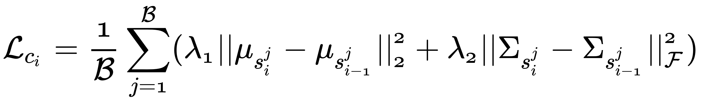

# 第十章：从描述文本生成图像

在前面的章节中，我们主要处理了图像合成和图像到图像的翻译任务。现在，是时候让我们从计算机视觉（CV）领域转向自然语言处理（NLP）领域，探索生成对抗网络（GANs）在其他应用中的潜力了。或许你已经见过一些卷积神经网络（CNN）模型被用于图像/视频描述生成。如果我们能反向操作，根据描述文本生成图像，那岂不是太棒了？

在本章中，你将了解词嵌入的基本知识及其在 NLP 领域中的应用。你还将学习如何设计一个文本到图像的 GAN 模型，从而根据一句描述文本生成图像。最后，你将了解如何堆叠两个或更多条件 GAN 模型，通过 StackGAN 和 StackGAN++进行更高分辨率的文本到图像合成。

本章将涵盖以下主题：

+   使用 GAN 进行文本到图像的合成

+   使用 StackGAN++生成逼真的照片级图像

# 使用 GAN 进行文本到图像的合成

从第四章，*使用 PyTorch 构建你的第一个 GAN*，到第八章，*训练 GAN 突破不同模型*，我们已经学习了几乎所有 GAN 在计算机视觉中的基本应用，特别是在图像合成方面。你可能会想，GAN 在其他领域（如文本或音频生成）中是如何使用的。在本章中，我们将逐步从 CV 领域转向 NLP 领域，通过结合这两个领域，尝试从描述文本中生成逼真的图像。这个过程叫做**文本到图像合成**（或文本到图像翻译）。

我们知道，几乎每个 GAN 模型都是通过在某种输入数据形式与输出数据之间建立明确的映射来生成合成数据。因此，为了根据对应的描述句子生成图像，我们需要了解如何用向量表示句子。

# 词嵌入简介

定义一种方法将句子中的单词转换为向量其实是相当简单的。我们可以简单地为所有可能的单词分配不同的值（例如，让 001 表示*I*，002 表示*eat*，003 表示*apple*），这样就可以通过向量唯一表示句子（例如，*I eat apple*将变为[001, 002, 003]）。这基本上就是计算机中单词的表示方式。然而，语言比冷冰冰的数字要复杂和灵活得多。如果不了解单词的含义（例如，名词或动词，积极或消极），几乎不可能建立单词之间的关系并理解句子的含义。此外，由于硬编码的值之间的距离无法表示相应单词之间的相似性，因此很难基于硬编码的值找到一个单词的同义词。

用于将单词、短语或句子映射到向量的方法被称为**词嵌入**。其中最成功的词嵌入技术之一叫做**word2vec**。如果你想了解更多关于 word2vec 的信息，可以随时查阅 Xin Rong 的论文《*word2vec 参数学习解释*》，[`arxiv.org/pdf/1411.2738.pdf`](https://arxiv.org/pdf/1411.2738.pdf)。

**嵌入**这个术语意味着将数据映射到一个不同的空间，以便更容易分析。你可能在一些关于卷积神经网络（CNN）的旧论文或文章中见过这个术语，在这些论文中，经过训练的全连接层的输出向量被用来可视化模型是否已正确训练。

词嵌入主要用于解决 NLP 中的两类问题：

+   **CBOW**（**连续词袋模型**），用于根据上下文中的若干个词预测单一目标词

+   Skip-Gram 模型，和 CBOW 模型相反，用于根据目标词预测上下文词

下图为我们提供了 CBOW 和 Skip-Gram 模型的概述：


两种类型的词嵌入。图像来源：Xin Rong，2014

NLP 中的另一个常见术语是**语言建模**。与词嵌入相比，语言模型预测的是句子的可能性，或者更具体地说，预测下一个词在句子中出现的可能性。由于语言建模考虑了单词的顺序，许多语言模型是基于词嵌入构建的，从而获得更好的结果。

简单来说，学习到的词嵌入是一个向量，它表示一个句子，使得机器学习算法更容易分析和理解原始句子的含义。请查看关于词嵌入的官方教程，了解如何在 PyTorch 中实现 CBOW 和 Skip-Gram 模型：[`pytorch.org/tutorials/beginner/nlp/word_embeddings_tutorial.html#sphx-glr-beginner-nlp-word-embeddings-tutorial-py`](https://pytorch.org/tutorials/beginner/nlp/word_embeddings_tutorial.html#sphx-glr-beginner-nlp-word-embeddings-tutorial-py)。

# 使用零-shot 迁移学习将文本转换为图像

在第八章，*训练你的 GAN 以打破不同的模型*中，我们了解了在图像分类任务中进行迁移学习所需的基本步骤。在更为现实的情况下，将这种学习到的知识迁移到另一个领域变得更加困难，因为可能会有许多新的数据形式是预训练模型之前没有见过的，尤其是当我们尝试根据描述文本生成图像（或者反过来，从给定图像生成描述文本）时。例如，如果模型仅在白猫的图像上进行训练，当我们要求它生成黑猫的图像时，它将无法知道该怎么做。这就是零-shot 迁移学习发挥作用的地方。

# 零-shot 学习

**零样本学习**是指机器学习过程中我们需要预测以前未见过的标签的新样本。通常通过向预训练过程提供额外信息来完成。例如，我们可以告诉模型，所谓的**白猫**具有两个属性：颜色即白色，以及猫的形状。这使得模型可以轻松知道，当我们要求它们时，用黑色替换白色将给我们*黑猫*。

类似地，机器学习过程中，新样本仅一次标记每个类（或每个类很少标记几个样本）的过程称为**单样本学习**。

为了在文本和图像之间建立零样本学习能力，我们将使用 Scott Reed、Zeynep Akata 和 Bernt Schiele 等人在其论文*Learning Deep Representations of Fine-Grained Visual Descriptions*中提出的词嵌入模型。他们的模型设计用于一个目的：基于单个查询句子从大型集合中找到最匹配的图像。

下面的图片是通过单个查询句子获得的图像搜索结果的示例：


在 CUB-200-2011 数据集上，通过单个查询句子获得的图像搜索结果示例

我们在这里不会深入讨论词嵌入方法的实现细节，而是使用作者提供的预训练的`char-CNN-RNN`结果。

# GAN 架构与训练

本节中 GAN 模型的设计基于 Scott Reed、Zeynep Akata 和 Xinchen Yan 等人在其论文*Generative Adversarial Text to Image Synthesis*中提出的文本到图像模型。在这里，我们将描述和定义生成器和判别器网络的架构以及训练过程。

生成器网络有两个输入，包括一个潜在的噪声向量，，和描述句子的嵌入向量，，长度为 1,024，由一个全连接层映射到一个长度为 128 的向量。这个向量与噪声向量连接起来形成一个大小为`[B, 228, 1, 1]`的张量（其中 B 表示批量大小，现在被省略）。使用五个转置卷积层（核大小为 4，步长为 2，填充大小为 1），逐步扩展特征图的大小（同时减小通道宽度）到`[3, 64, 64]`，这是通过`Tanh`激活函数生成的图像。隐藏层中使用批量归一化层和`ReLU`激活函数。

让我们创建一个名为`gan.py`的新文件来定义网络。以下是生成器网络的代码定义：

```py
import torch
import torch.nn as nn

class Generator(nn.Module):
    def __init__(self, channels, latent_dim=100, embed_dim=1024, embed_out_dim=128):
        super(Generator, self).__init__()
        self.channels = channels
        self.latent_dim = latent_dim
        self.embed_dim = embed_dim
        self.embed_out_dim = embed_out_dim

        self.text_embedding = nn.Sequential(
            nn.Linear(self.embed_dim, self.embed_out_dim),
            nn.BatchNorm1d(self.embed_out_dim),
            nn.LeakyReLU(0.2, inplace=True)
        )

        model = []
        model += self._create_layer(self.latent_dim + self.embed_out_dim, 512, 4, stride=1, padding=0)
        model += self._create_layer(512, 256, 4, stride=2, padding=1)
        model += self._create_layer(256, 128, 4, stride=2, padding=1)
        model += self._create_layer(128, 64, 4, stride=2, padding=1)
        model += self._create_layer(64, self.channels, 4, stride=2, padding=1, output=True)

        self.model = nn.Sequential(*model)

    def _create_layer(self, size_in, size_out, kernel_size=4, stride=2, padding=1, output=False):
        layers = [nn.ConvTranspose2d(size_in, size_out, kernel_size, stride=stride, padding=padding, bias=False)]
        if output:
            layers.append(nn.Tanh())
        else:
            layers += [nn.BatchNorm2d(size_out),
                 nn.ReLU(True)]
        return layers

    def forward(self, noise, text):
        text = self.text_embedding(text)
        text = text.view(text.shape[0], text.shape[1], 1, 1)
        z = torch.cat([text, noise], 1)
        return self.model(z)
```

判别器网络也有两个输入，一个是生成的/真实图像，，另一个是嵌入向量，。输入图像，，是一个大小为`[3, 64, 64]`的张量，通过四个卷积层映射到`[512, 4, 4]`。判别器网络有两个输出，`[512, 4, 4]`特征图也是第二个输出张量。嵌入向量，，被映射为一个长度为 128 的向量，并扩展为大小为`[128, 4, 4]`的张量，随后与图像特征图进行拼接。最终，拼接后的张量（大小为`[640, 4, 4]`）被输入到另一个卷积层，得到预测值。

判别器网络的代码定义如下：

```py
class Embedding(nn.Module):
    def __init__(self, size_in, size_out):
        super(Embedding, self).__init__()
        self.text_embedding = nn.Sequential(
            nn.Linear(size_in, size_out),
            nn.BatchNorm1d(size_out),
            nn.LeakyReLU(0.2, inplace=True)
        )

    def forward(self, x, text):
        embed_out = self.text_embedding(text)
        embed_out_resize = embed_out.repeat(4, 4, 1, 1).permute(2, 3, 0, 1)
        out = torch.cat([x, embed_out_resize], 1)
        return out

class Discriminator(nn.Module):
    def __init__(self, channels, embed_dim=1024, embed_out_dim=128):
        super(Discriminator, self).__init__()
        self.channels = channels
        self.embed_dim = embed_dim
        self.embed_out_dim = embed_out_dim

        self.model = nn.Sequential(
            *self._create_layer(self.channels, 64, 4, 2, 1, 
              normalize=False),
            *self._create_layer(64, 128, 4, 2, 1),
            *self._create_layer(128, 256, 4, 2, 1),
            *self._create_layer(256, 512, 4, 2, 1)
        )
        self.text_embedding = Embedding(self.embed_dim, self.embed_out_dim)
        self.output = nn.Sequential(
            nn.Conv2d(512 + self.embed_out_dim, 1, 4, 1, 0, bias=False),
            nn.Sigmoid()
        )

    def _create_layer(self, size_in, size_out, kernel_size=4, stride=2,  
      padding=1, normalize=True):
        layers = [nn.Conv2d(size_in, size_out, kernel_size=kernel_size, 
          stride=stride, padding=padding)]
        if normalize:
            layers.append(nn.BatchNorm2d(size_out))
        layers.append(nn.LeakyReLU(0.2, inplace=True))
        return layers

    def forward(self, x, text):
        x_out = self.model(x)
        out = self.text_embedding(x_out, text)
        out = self.output(out)
        return out.squeeze(), x_out
```

两个网络的训练过程可以在下图中看到。我们可以看到，训练文本到图像的 GAN 与普通的 GAN 非常相似，唯一的不同是，判别器从真实和生成图像中得到的中间输出（第二个输出张量）用于计算 L1 损失，而真实/生成图像则用于计算 L2 损失：


一个文本到图像的生成对抗网络（GAN）的训练过程，其中 *x* 代表真实图像，*x* 代表生成的图像，*t* 代表文本嵌入向量，*z* 代表潜在噪声向量。来自判别器 *D* 的虚线箭头表示中间输出张量。

在介绍以下代码时，内容将以一种非线性的方式呈现。这是为了确保你能够理解每个环节涉及的过程。

让我们创建一个名为 `build_gan.py` 的新文件，并创建一个一站式的训练/评估 API，就像我们在之前的章节中做的那样。我们将只展示训练过程中的关键部分。你可以自行填充空白作为练习，或者参考代码仓库 `text2image` 文件夹中的完整源代码：

```py
import os
import time

import torch
import torchvision.utils as vutils

from gan import Generator as netG
from gan import Discriminator as netD

def _weights_init(m):
    # init weights in conv and batchnorm layers
    ...

class Model(object):
    def __init__(self, name, device, data_loader, channels, l1_coef, l2_coef):
        # parse argument values
        ...
        self.netG = netG(self.channels)
        self.netG.apply(_weights_init)
        self.netG.to(self.device)
        self.netD = netD(self.channels)
        self.netD.apply(_weights_init)
        self.netD.to(self.device)
        self.loss_adv = torch.nn.BCELoss()
        self.loss_l1 = torch.nn.L1Loss()
        self.loss_l2 = torch.nn.MSELoss()
        self.l1_coef = l1_coef
        self.l2_coef = l2_coef
```

现在，让我们来进行训练过程的工作（该过程在`Model.train()`中定义）：

```py
    def train(self, epochs, log_interval=100, out_dir='', verbose=True):
        self.netG.train()
        self.netD.train()
        for epoch in range(epochs):
            for batch_idx, data in enumerate(self.data_loader):
                image = data['right_images'].to(self.device)
                embed = data['right_embed'].to(self.device)

                real_label = torch.ones((image.shape[0]), 
                 device=self.device)
                fake_label = torch.zeros((image.shape[0]), 
                 device=self.device)

                # Train D
                self.optim_D.zero_grad()

                out_real, _ = self.netD(image, embed)
                loss_d_real = self.loss_adv(out_real, real_label)

                noise = torch.randn((image.shape[0], 100, 1, 1), 
                 device=self.device)
                image_fake = self.netG(noise, embed)
                out_fake, _ = self.netD(image_fake, embed)
                loss_d_fake = self.loss_adv(out_fake, fake_label)

                d_loss = loss_d_real + loss_d_fake
                d_loss.backward()
                self.optim_D.step()

                # Train G
                self.optim_G.zero_grad()
                noise = torch.randn((image.shape[0], 100, 1, 1), 
                 device=self.device)
                image_fake = self.netG(noise, embed)
                out_fake, act_fake = self.netD(image_fake, embed)
                _, act_real = self.netD(image, embed)

                l1_loss = self.loss_l1(torch.mean(act_fake, 0), 
                 torch.mean(act_real, 0).detach())
                g_loss = self.loss_adv(out_fake, real_label) + \
                    self.l1_coef * l1_loss + \
                    self.l2_coef * self.loss_l2(image_fake, image)
                g_loss.backward()
                self.optim_G.step()
```

这里我们使用的是 Caltech-UCSD 鸟类数据集（**CUB-200-2011**），该数据集包含 11,788 张标注的鸟类图像。我们不会自己处理鸟类图像和训练词向量，而是直接使用作者提供的预训练嵌入（[`github.com/reedscot/icml2016`](https://github.com/reedscot/icml2016)）。在 GitHub 仓库（[`github.com/aelnouby/Text-to-Image-Synthesis`](https://github.com/aelnouby/Text-to-Image-Synthesis)）中，提供了一个包含图像文件、嵌入向量和原始描述文本的 HDF5 数据库文件。

让我们从提供的 Google Drive 链接中下载数据库文件（大小约为 5.7 GB）（[`drive.google.com/open?id=1mNhn6MYpBb-JwE86GC1kk0VJsYj-Pn5j`](https://drive.google.com/open?id=1mNhn6MYpBb-JwE86GC1kk0VJsYj-Pn5j)），并将其放在一个文件夹中（例如，`/media/john/DataAsgard/text2image/birds`）。我们还需要下载自定义数据集类（[`github.com/aelnouby/Text-to-Image-Synthesis/blob/master/txt2image_dataset.py`](https://github.com/aelnouby/Text-to-Image-Synthesis/blob/master/txt2image_dataset.py)），因为将导出的 HDF5 数据库元素正确地转化为 PyTorch 张量有点复杂。这也意味着我们在运行脚本之前需要安装`h5py`库，使用命令`pip install h5py`进行安装。

最后，让我们创建一个`main.py`文件，并填写参数解析代码，正如我们已经做过多次一样，并从中调用`Model.train()`。再次强调，我们省略了`main.py`中的大部分代码。如果您需要任何帮助，可以参考本章的代码仓库中的完整源代码：

```py
import argparse
import os
import sys

import numpy as np
import torch
import torch.backends.cudnn as cudnn
import utils

from torch.utils.data import DataLoader
from build_gan import Model
from txt2image_dataset import Text2ImageDataset

FLAGS = None

def main():
    ...
    device = torch.device("cuda:0" if FLAGS.cuda else "cpu")

    print('Loading data...\n')
    dataloader = DataLoader(Text2ImageDataset(os.path.join(FLAGS.data_dir, '{}.hdf5'.format(FLAGS.dataset)), split=0),
        batch_size=FLAGS.batch_size, shuffle=True, num_workers=8)

    print('Creating model...\n')
    model = Model(FLAGS.model, device, dataloader, FLAGS.channels, FLAGS.l1_coef, FLAGS.l2_coef)

    if FLAGS.train:
        model.create_optim(FLAGS.lr)

        print('Training...\n')
        model.train(FLAGS.epochs, FLAGS.log_interval, FLAGS.out_dir, True)

        model.save_to('')
    else:
        ...
```

完成 200 个 epoch 的训练大约需要 2 个半小时，使用 256 的 batch size 时，GPU 内存消耗大约为 1,753 MB。训练结束时，一些结果如下所示：


使用文本到图像的 GAN 在 CUB-200-2011 数据集上生成的图像

我们在本节中使用的方法是 3 年前提出的，因此生成的图像质量不如今天应该达到的水平。因此，我们将向您介绍 StackGAN 和 StackGAN++，以便您能够生成高分辨率的结果。

# 使用 StackGAN++生成逼真的照片级图像

从描述文本生成图像可以视为一个**条件 GAN**（**CGAN**）过程，其中描述句子的嵌入向量作为附加标签信息。幸运的是，我们已经知道如何使用 CGAN 模型生成令人信服的图像。现在，我们需要弄清楚如何使用 CGAN 生成大尺寸图像。

你还记得我们如何在第七章《使用 GAN 进行图像修复》中，利用两个生成器和两个判别器填补图像中的缺失部分（图像修复）吗？同样，我们也可以将两个 CGAN 堆叠在一起，从而获得高质量的图像。这正是 StackGAN 所做的。

# 使用 StackGAN 进行高分辨率文本到图像合成

**StackGAN**是由 Han Zhang、Tao Xu 和 Hongsheng Li 等人在他们的论文《*StackGAN：基于堆叠生成对抗网络的文本到逼真图像合成*》中提出的。

描述句子的嵌入向量，，经过条件增强步骤处理，生成一个条件向量，。在条件增强中，一对均值，，和标准差，，向量是从嵌入向量，，计算得出，用于生成基于高斯分布的条件向量，，。这个过程使我们能够从有限的文本嵌入生成更多独特的条件向量，并确保所有的条件变量遵循相同的高斯分布。同时，和被限制，使得它们不会偏离太远。这是通过在生成器的损失函数中加入 Kullback-Leibler 散度（**KL 散度**）项来实现的。

一个潜在向量，（它是从采样的），与条件向量，，结合，作为**Stage-I 生成器**的输入。第一个生成器网络生成一个低分辨率的图像，大小为 64 x 64。低分辨率图像被传递到**Stage-I 判别器**，后者同样将嵌入向量，，作为输入来预测低分辨率图像的真实性。Stage-I 生成器和判别器的损失函数如下：


在前面的方程中，中的是 Stage-I 生成器的输出，，其中，是条件向量，表示 KL 散度。

然后，低分辨率图像被输入到**Stage-II 生成器**。同样，嵌入向量，，也传递到第二个生成器，帮助生成大小为 256 x 256 的高分辨率图像。高分辨率图像的质量由**Stage-II 判别器**判断，后者同样接收作为输入。第二阶段的损失函数与第一阶段类似，如下所示：


在上述方程中， 在  中是 Stage-II 生成器的输出，，其中 是 Stage-I 生成器的输出， 是条件向量。

由 StackGAN 生成的一些图像将在接下来的章节中提供。如果你有兴趣尝试 StackGAN，论文的作者已经在这里开源了一个 PyTorch 版本：[`github.com/hanzhanggit/StackGAN-Pytorch`](https://github.com/hanzhanggit/StackGAN-Pytorch)。

# 从 StackGAN 到 StackGAN++

**StackGAN++**（也叫 StackGAN v2）是 StackGAN 的改进版本，由 Han Zhang、Tao Xu 和 Hongsheng Li 等人在他们的论文《StackGAN++: Realistic Image Synthesis with Stacked Generative Adversarial Networks》中提出。与 StackGAN 相比，StackGAN++在设计上有三个主要的区别，具体如下：

+   **多尺度图像合成**：它使用一种树形结构（如下图所示），其中每个分支代表一个独立的生成器网络，随着树的高度增加，生成图像的尺寸也会增大。每个分支生成的图像质量是由不同的判别器网络来估算的。

+   **采用无条件损失**：除了使用标签信息（通过文本嵌入计算）来估算图像的保真度外，还向每个生成器和判别器的损失函数中添加了额外的损失项，这些损失项仅使用图像作为输入（如下式所示）。

判别器和生成器在  第 th 分支的损失函数定义如下：


在上述方程中，每个损失函数的第一行叫做条件损失，第二行叫做无条件损失。它们是通过**JCU 判别器**计算的，该判别器在之前的图中已有说明。

+   **颜色一致性约束**：由于树形结构中可能有多个分支，因此确保不同分支生成的图像彼此相似是很重要的。因此，一个颜色一致性正则化项被添加到生成器的损失函数中（当然，还会有一个比例因子）。

颜色一致性正则化定义如下：



在上述公式中，代表批量大小，而和代表由第个图像生成的第个生成器的均值和协方差。这确保由相邻分支生成的图像具有相似的颜色结构。

# 训练 StackGAN++生成更高质量的图像

StackGAN++的作者已经很好地开源了完整的源代码：[`github.com/hanzhanggit/StackGAN-v2`](https://github.com/hanzhanggit/StackGAN-v2)。按照这些步骤在 CUB-200-2011 数据集上训练 StackGAN++。确保你已经在 Anaconda 中创建了一个**Python 2.7**环境，并安装了 PyTorch，因为在加载预训练文本嵌入时会从`pickle`中出现解码错误。你可以参考第二章，*开始使用 PyTorch 1.3*，来创建一个新的环境：

1.  在你的终端中通过运行以下命令安装先决条件：

```py
$ pip install pyyaml tensorboard-pytorch scipy python-dateutil easydict pandas torchfile
```

确保你的 Python 2.7 环境中没有安装`tensorboard`，因为 StackGAN++调用`FileWriter`将日志信息写入 TensorBoard，而`FileWriter`已在最新版本的 TensorBoard 中移除。如果你不想卸载 TensorBoard，可以通过运行`pip install tensorboard==1.0.0a6`来降级它。

1.  下载 StackGAN++的源代码：

```py
$ git clone https://github.com/hanzhanggit/StackGAN-v2 && cd StackGAN-v2
```

1.  从[`www.vision.caltech.edu/visipedia/CUB-200-2011.html`](http://www.vision.caltech.edu/visipedia/CUB-200-2011.html)下载 CUB-200-2011 数据集，并将`CUB_200_2011`文件夹放置在`data/birds`目录下，以便图像位于类似于`data/birds/CUB_200_2011/images/001.Black_footed_Albatross/Black_Footed_Albatross_0001_796111.jpg`的路径中。需要下载的压缩文件大小约为 1.1 GB。

1.  从[`drive.google.com/open?id=0B3y_msrWZaXLT1BZdVdycDY5TEE`](https://drive.google.com/open?id=0B3y_msrWZaXLT1BZdVdycDY5TEE)下载预训练的文本嵌入，并将其中的三个文件夹移动到`data/birds`。确保将`text_c10`文件夹重命名为`text`。

1.  导航到代码文件夹并开始训练过程：

```py
$ cd code && python main.py --cfg cfg/birds_3stages.yml --gpu 0
```

你只需对 StackGAN++的源代码进行少量修改，以便其可以在 PyTorch 1.1 下运行；例如，你可以在`trainer.py`中将所有的`.data[0]`替换为`.item()`。还有几个弃用警告需要我们修复。你可以参考本书本章的`stackgan-v2`文件夹中的源代码库获取更多信息。

1.  （可选）测试你训练好的模型。在`code/cfg/eval_birds.yml`文件中指定模型文件：

```py
 NET_G: '../output/birds_3stages_2019_07_16_23_57_11/Model/netG_220800.pth'
```

然后，在你的终端中运行以下脚本来开始评估过程：

```py
$ python main.py --cfg cfg/eval_birds.yml --gpu 0
```

评估大约需要 7,819 MB 的 GPU 内存，并且需要 12 分钟才能完成。生成的图像将位于`output/birds_3stages_2019_07_16_23_57_11/Model/iteration220800/single_samples/valid`文件夹中。

在 GTX 1080Ti 显卡上完成 600 个训练周期大约需要 48 小时，并且大约消耗 10,155 MB 的 GPU 内存。以下是训练结束时生成的部分图像：


图像由 StackGAN++生成

尽管这个过程需要非常长的时间和大量的 GPU 内存，但你可以看到生成的结果非常出色。

# 总结

本章中，我们学习了如何根据描述文本生成低分辨率和高分辨率图像。

在下一章中，我们将重点介绍如何使用 GAN 直接生成序列数据，如文本和音频。

# 进一步阅读

1.  Rong X.（2014）。*word2vec 参数学习解析*。arXiv:1411.2738。

1.  Reed S, Akata Z, Schiele B 等（2016）。*深度学习细粒度视觉描述的表示方法*。CVPR。

1.  Reed S, Akata Z, Yan X 等（2016）。*生成对抗文本到图像合成*。ICML。

1.  Zhang H, Xu T, Li H 等（2017）。*StackGAN：基于堆叠生成对抗网络的文本到照片级真实图像合成*。ICCV。

1.  Zhang H, Xu T, Li H 等（2018）。*StackGAN++：基于堆叠生成对抗网络的真实图像合成*。IEEE 模式分析与机器智能杂志。
