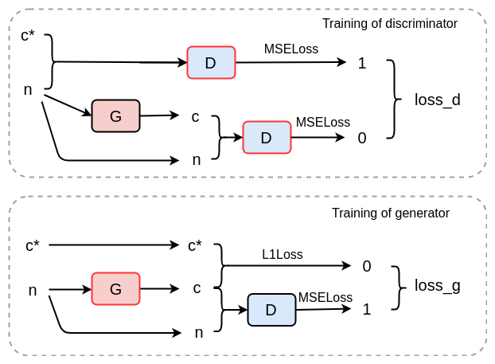

# 第十一章：使用 GAN 进行序列合成

在本章中，我们将研究能够直接生成序列数据（如文本和音频）的 GAN。与此同时，我们将回顾之前所学的图像生成模型，以便让你更快地熟悉 NLP 模型。

在本章中，你将了解 NLP 领域常用的技术，如 RNN 和 LSTM。你还将了解**强化学习**（**RL**）的一些基本概念，以及它与监督学习（如基于 SGD 的 CNN）的区别。接下来，我们将学习如何从文本集合中构建自定义词汇表，以便训练自己的 NLP 模型，并学习如何训练 SeqGAN，使其能够生成简短的英语笑话。你还将学习如何使用 SEGAN 去除背景噪音并增强语音音频的质量。

本章将涵盖以下主题：

+   通过 SeqGAN 进行文本生成 – 教授 GAN 如何讲笑话

+   使用 SEGAN 进行语音质量增强

# 通过 SeqGAN 进行文本生成 – 教授 GAN 如何讲笑话

在上一章中，我们学习了如何通过 GAN 根据描述文本生成高质量图像。现在，我们将继续研究如何使用各种 GAN 模型进行序列数据合成，如文本和音频。

在文本生成方面，与图像生成的最大区别在于，文本数据是离散的，而图像像素值则更为连续，尽管数字图像和文本本质上都是离散的。一个像素通常有 256 个值，而像素的微小变化通常不会影响我们对图像的理解。然而，句子中的微小变化——即使是一个字母（例如，将*we*改成*he*）——也可能改变整个句子的意思。而且，我们通常对合成图像的容忍度要高于文本。例如，如果生成的狗的图像中有 90%的像素几乎完美无缺，我们通常能轻松识别出狗，因为我们的大脑足够聪明，能自动填补缺失的像素。然而，如果你阅读的新闻中每 10 个单词中就有一个不合逻辑，你肯定会觉得很难享受阅读。这就是为什么文本生成很困难，而且相较于图像合成，文本生成的进展较慢的原因。

SeqGAN 是首批成功尝试使用对抗学习生成文本的模型之一。它由 Lantao Yu、Weinan Zhang、Jun Wang 等人在他们的论文《*SeqGAN: Sequence Generative Adversarial Nets with Policy Gradient*》中提出。在这一节中，我们将带你了解 SeqGAN 的设计，如何为 NLP 任务创建自己的词汇表，以及如何训练 SeqGAN，使其能够生成简短的笑话。

# SeqGAN 的设计 – GAN、LSTM 和 RL

与其他 GAN 模型类似，SeqGAN 基于对抗学习的思想构建。为了使其适应 NLP 任务，需要进行一些重大更改。例如，生成网络是用 LSTM 而不是 CNNs 构建的，类似于我们在前几章中看到的一些其他 GAN。此外，强化学习被用来优化离散目标，这与之前 GAN 模型中使用的 SGD 系列方法不同。

在这里，我们将简要介绍 LSTM 和 RL。但由于我们希望专注于模型的对抗学习部分，因此不会深入探讨这些话题。

# 快速介绍 RNN 和 LSTM

**递归神经网络**（**RNNs**）被设计用来处理顺序数据，如文本和音频。它们与 CNNs 的最大区别在于，隐藏层中的权重（即某些函数）在多个输入上反复使用，并且输入的顺序会影响函数的最终结果。RNN 的典型设计可以在下图中看到：


图 10.1 递归神经网络的基本计算单元

正如我们所看到的，RNN 单元最显著的特点是隐藏状态  有一个指向自身的输出连接。这种自环是“递归”一词的来源。假设自环执行了三次，扩展版的计算单元如右图所示。计算过程如下：


因此，在适当训练后，这个 RNN 单元能够处理最大长度为 3 的顺序数据。

RNNs 广泛应用于语音识别、自然语言翻译、语言建模和图像标注。然而，RNN 仍然存在一个关键缺陷，我们需要通过 LSTM 来解决。

RNN 模型假设只有相邻的输入之间存在强连接（例如， 和 ，如上图所示），并且输入之间的远距离连接被忽略（例如， 和 ）。当我们试图将一个长句子翻译成具有完全不同语法规则的另一种语言时，就会变得麻烦，这时我们需要浏览句子的所有部分才能理解其含义。

**LSTM**（**长短期记忆**）是由 Sepp Hochreiter 和 Jürgen Schmidhuber 于 1997 年提出的，用于保留顺序数据的长期记忆并解决 RNN 中的梯度爆炸和梯度消失问题。其计算过程在下图中展示：


图 10.2 LSTM 的计算过程

如我们所见，一个附加项  被引入，以帮助我们选择应该记住的长期信息。详细的计算过程如下：

1.   和  被传递通过忘记门，用来决定应该忘记哪些信息：


1.  相同的输入也通过输入门，以便我们在下一步计算更新后的 ：


1.  更新后的  和  通过输出门计算得出：


然后，新的  和  被用来计算下一对  和 。虽然 LSTM 单元的结构比普通的 RNN 单元复杂得多，但由于三大门（忘记门、输入门和输出门）的精妙设计，LSTM 可以在过去几年几乎所有的里程碑式 NLP 模型中看到。如果你想深入了解 LSTM 及其变体，可以查看 [`colah.github.io/posts/2015-08-Understanding-LSTMs`](https://colah.github.io/posts/2015-08-Understanding-LSTMs) 和 [`towardsdatascience.com/illustrated-guide-to-lstms-and-gru-s-a-step-by-step-explanation-44e9eb85bf21`](https://towardsdatascience.com/illustrated-guide-to-lstms-and-gru-s-a-step-by-step-explanation-44e9eb85bf21)。

# 强化学习与监督学习

强化学习 是机器学习中的另一种优化方法。它通常用于模型试图解决的任务很难提供标准的正确答案，特别是当解决方案涉及 *自由探索* 并且任务的最终目标相比模型需要做出的具体决策更为 *模糊* 时。

例如，如果我们想教一个机器人走路，我们可以使用强化学习让机器人自己学会走路。我们不需要告诉机器人在什么时间如何移动哪个身体部位。我们只告诉它，最终目标是*把自己带到前方 10 米的那个位置*，然后让它随机地移动四肢。某个时刻，机器人的腿部某种组合的动作会让机器人前进一步，而机器人手臂的某种动作组合则确保它不会失去平衡。同样，强化学习也被用来教机器玩围棋（[`www.alphago-games.com`](https://www.alphago-games.com)）和视频游戏（[`openai.com/blog/openai-five`](https://openai.com/blog/openai-five)）。

基于 SGD 的优化方法通常用于监督学习（它们曾用于前几章的模型，在这些模型中总是使用真实数据来衡量合成数据的质量），而在无监督学习中，优化策略则完全不同。

目前，策略梯度（Policy Gradients）和 Q 学习（Q-Learning）是强化学习（RL）中最常用的两种方法。我们简要解释一下它们：

1.  **策略梯度（Policy Gradient）**是一种基于策略的方法。模型直接根据当前状态（输入）给出动作（输出）。它在评估策略（基于状态采取行动）和更新策略（更新状态和动作之间的映射）之间交替进行。它通常用于大的连续动作空间。

1.  **Q 学习（Q-Learning）**是一种基于价值的方法。它维护一个 Q 表，记录各种动作的奖励。它选择导致最大奖励值的动作，然后根据该动作带来的新环境更新 Q 表。与策略梯度方法相比，它的训练速度较快，通常用于简单任务和小的动作空间。

那么，当强化学习和监督学习（如 CNN 中的 SGD 方法）都可用时，我们该如何选择呢？一个简单的经验法则是**搜索空间的连续性**和目标函数的**可微性**。如果目标函数是可微的，并且搜索空间是连续的，那么最好使用 SGD 方法。如果搜索空间是离散的，或者目标函数是不可微的，我们需要坚持使用强化学习。然而，如果搜索空间不是特别大，并且你有多余的计算能力，那么**进化搜索（Evolutionary Search，ES）**方法也是一个不错的选择。当你的变量假定服从高斯分布时，你可以尝试 CMA-ES 方法（[`cma.gforge.inria.fr`](http://cma.gforge.inria.fr)）。

如果你想深入了解策略梯度，这里有两篇额外的阅读材料：

+   [`medium.com/@jonathan_hui/rl-policy-gradients-explained-9b13b688b146`](https://medium.com/@jonathan_hui/rl-policy-gradients-explained-9b13b688b146)

+   [`lilianweng.github.io/lil-log/2018/04/08/policy-gradient-algorithms.html`](https://lilianweng.github.io/lil-log/2018/04/08/policy-gradient-algorithms.html)

# SeqGAN 的架构

SeqGAN 的核心思想是让它解决原始 GAN 无法解决的问题，因为原始 GAN 擅长合成离散数据，而判别器网络无法处理具有不同长度的序列数据。为了解决第一个问题，使用了策略梯度方法来更新生成器网络。第二个问题则通过 **蒙特卡洛树搜索**（**MCTS**）方法生成剩余数据来解决。

SeqGAN 中的强化学习策略设计如下。假设在时刻 ，生成的序列表示为 ，当前的动作  需要由生成器网络  给出，其中  为初始状态。基于  生成  是通过 LSTM（或其变体）完成的。生成器的目标是最大化累积奖励：


在这里，  为累积奖励，  为待优化的参数（即  中的参数），  被称为 **动作价值函数**。动作价值函数  给出了通过遵循策略  从初始状态  开始采取动作  时的奖励。

通常，我们期望使用判别器网络来给出奖励值。然而，判别器不能直接用于计算累积奖励，因为它只能评估完整的序列 。在时刻 ，我们只有 。那么，我们如何获得剩余的序列呢？

在 SeqGAN 中，剩余的序列  是通过 MCTS 方法生成的。MCTS 是一种基于树的搜索方法，广泛应用于象棋和扑克程序以及视频游戏 AI 算法中。所有可以执行的动作都由树中非常大的节点表示。要在蒙特卡洛树中完成一次完整的搜索，需经过以下四个步骤：

1.  **选择**，即从根节点到叶节点选择一条路径。通常，现有节点的选择是基于**上置信界限**（**UCB**）。得分较高的节点更有可能被选择，而那些之前没有被选择过很多次的节点更有可能被选中。这是**探索与利用**之间的平衡。

1.  **扩展**，即在选定的叶节点上添加新的子节点。

1.  **模拟**，即评估新添加的节点并获得最终结果（奖励）。

1.  **反向传播**，即更新所选路径上所有节点的得分和计数统计。

实际上，只有第三步——模拟，才是用来生成剩余序列的，它通过多次执行模拟（生成剩余序列，使用 ）来生成并获得平均奖励。

因此， 的定义如下：


生成器网络是一个 LSTM 网络，输入层是一个嵌入层，输出层是一个线性层。判别器网络由一个嵌入层、一个卷积层、一个最大池化层和一个 softmax 层组成。本文作者发布的代码是为 TensorFlow 编写的。幸运的是，在 GitHub 上可以找到 PyTorch 版本，链接为 [`github.com/suragnair/seqGAN`](https://github.com/suragnair/seqGAN)。在这个版本中，有两个需要注意的区别：首先，蒙特卡洛模拟只执行一次；其次，判别器网络也是一个递归网络，并且在两个网络中使用了一种叫做 **门控递归单元**（**GRU**）的 LSTM 变体。您可以自由地调整网络架构，尝试我们在本书前几章中学到的技巧和方法。我们修改后的代码也可以在本章的代码库中的 `seqgan` 文件夹下找到。

# 创建您自己的词汇表用于训练

阅读别人写的 GitHub 上的代码是很容易的。我们需要做的最重要的事情是将我们已知的模型应用到新的应用中，并创建我们自己的样本。在这里，我们将通过一些基本步骤来创建一个从大量文本中提取的词汇表，并用它来训练我们的 NLP 模型。

在 NLP 模型中，词汇集通常是一个表，将每个单词或符号映射到一个唯一的标记（通常是 `int` 值），这样任何句子都可以通过一个 `int` 向量来表示。

首先，让我们找一些数据来处理。为了开始，以下是 GitHub 上可用的 NLP 数据集列表：[`github.com/niderhoff/nlp-datasets`](https://github.com/niderhoff/nlp-datasets)。在这个列表中，你会找到一个包含英语笑话数据集（[`github.com/taivop/joke-dataset`](https://github.com/taivop/joke-dataset)），该数据集包含超过 200,000 条从 Reddit（[`www.reddit.com/r/jokes`](https://www.reddit.com/r/jokes)）、Stupid Stuff（[stupidstuff.org](http://stupidstuff.org/)）和 Wocka（[wocka.com](http://wocka.com/)）提取的笑话。笑话文本会分布在三个不同的文件中（`reddit_jokes.json`、`stupidstuff.json`和`wocka.json`）。请注意，我们对这些笑话的内容不负任何责任！

现在，让我们创建我们的词汇表。首先，在项目的代码文件夹中创建一个名为`data`的文件夹，并将之前提到的文件复制到其中。

现在，让我们创建一个小程序，以便我们能解析 JSON 文件并将其转换为 CSV 格式。我们称之为`parse_jokes.py`：

```py
import sys
import platform
import os
import json
import csv
import re

datapath = './data'
redditfile = 'reddit_jokes.json'
stupidfile = 'stupidstuff.json'
wockafile = 'wocka.json'
outfile = 'jokes.csv'
headers = ['row', 'Joke', 'Title', 'Body', 'ID',
           'Score', 'Category', 'Other', 'Source']
```

我相信导入部分的条目是显而易见的。常量的定义也应该相当清晰。`headers`变量只是我们在创建 CSV 文件时使用的列名列表。

我们希望将所有的笑话存储为纯文本格式。为此，首先去除所有非字母符号。这个操作是通过使用`clean_str()`来清理文本完成的，`clean_str()`使用了 Python 的`str_translate`参数，具体如下所示：

```py
def clean_str(text):
    fileters = '"#$%&()*+-/;<=>@[\\]^_`{|}~\t\n\r\"'
    trans_map = str.maketrans(fileters, " " * len(fileters))
    text = text.translate(trans_map)
    re.sub(r'[^a-zA-Z,. ]+', '', text)
    return text
```

随意调整`filters`字符串，以便可以添加或删除任何特殊字符。下一个函数将读取我们三个 JSON 文件中的一个，并将其返回为 JSON 对象。我将其做得相当通用，因此它只需要知道要处理的文件名：

```py
def get_data(fn):
    with open(fn, 'r') as f:
        extracted = json.load(f)
    return extracted
```

接下来，我们将创建三个函数，用来处理将这三个 JSON 对象转换为 CSV 文件。需要注意的是，三个 JSON 文件的结构都不同。因此，我们会让这三个处理函数大致相似，并在处理它们之间的差异时同时进行调整。每个函数都会接收由`get_data`函数创建的 JSON 对象以及一个名为`startcount`的整数值。这个值为 CSV 文件提供行号，并会在每一行中递增。然后，我们会将每一条数据转换为字典，并写入 CSV 文件。最后，我们会返回计数器，以便下一个函数知道行号应该是多少。这是处理 Reddit 文件的函数：

```py
def handle_reddit(rawdata, startcount):
    global writer
    print(f'Reddit file has {len(rawdata)} items...')
    cntr = startcount
    with open(outfile, mode='a') as csv_file:
        writer = csv.DictWriter(csv_file, fieldnames=headers)
        for d in rawdata:
            title = clean_str(d['title'])
            body = clean_str(d['body'])
            id = d['id']
            score = d['score']
            category = ''
            other = ''
            dict = {}
            dict['row'] = cntr
            dict['Joke'] = title + ' ' + body
            dict['Title'] = title
            dict['Body'] = body
            dict['ID'] = id
            dict['Category'] = category
            dict['Score'] = score
            dict['Other'] = other
            dict['Source'] = 'Reddit'
            writer.writerow(dict)
            cntr += 1
            if cntr % 10000 == 0:
                print(cntr)
    return cntr
```

接下来，我们有另外两个函数：一个用于处理`StupidStuff`文件，另一个用于处理`Wocka`文件：

```py
def handle_stupidstuff(rawdata, startcount):
    global writer
    print(f'StupidStuff file has {len(rawdata)} items...')
    with open(outfile, mode='a') as csv_file:
        writer = csv.DictWriter(csv_file, fieldnames=headers)
        cntr = startcount
        for d in rawdata:
            body = clean_str(d['body'])
            id = d['id']
            score = d['rating']
            category = d['category']
            other = ''
            dict = {}
            dict['row'] = cntr
            dict['Joke'] = body
            dict['Title'] = ''
            dict['Body'] = body
            dict['ID'] = id
            dict['Category'] = category
            dict['Score'] = score
            dict['Other'] = other
            dict['Source'] = 'StupidStuff'
            writer.writerow(dict)
            cntr += 1
            if cntr % 1000 == 0:
                print(cntr)
    return cntr

def handle_wocka(rawdata, startcount):
    global writer
    print(f'Wocka file has {len(rawdata)} items...')
    with open(outfile, mode='a') as csv_file:
        writer = csv.DictWriter(csv_file, fieldnames=headers)
        cntr = startcount
        for d in rawdata:
            other = clean_str(d['title'])
            title = ''
            body = clean_str(d['body'])
            id = d['id']
            category = d['category']
            score = ''
            other = ''
            dict = {}
            dict['row'] = cntr
            dict['Joke'] = body
            dict['Title'] = title
            dict['Body'] = body
            dict['ID'] = id
            dict['Category'] = category
            dict['Score'] = score
            dict['Other'] = other
            dict['Source'] = 'Wocka'
            writer.writerow(dict)
            cntr += 1
            if cntr % 1000 == 0:
                print(cntr)
    return cntr
```

倒数第二个函数将创建实际的 CSV 文件并写入表头：

```py
def prep_CVS():
    global writer
    with open(outfile, mode='a') as csv_file:
        writer = csv.DictWriter(csv_file, fieldnames=headers)
        writer.writeheader()
```

最后，我们有程序的主函数和入口点。在这里，我们可以按任何顺序调用之前的函数：

```py
def main():
    pv = platform.python_version()
    print(f"Running under Python {pv}")
    path1 = os.getcwd()
    print(path1)
    prep_CVS()
    print('Dealing with Reddit file')
    extracted = get_data(datapath + "/" + redditfile)
    count = handle_reddit(extracted, 0)
    print('Dealing with StupidStuff file')
    extracted = get_data(datapath + "/" + stupidfile)
    count = handle_stupidstuff(extracted, count)
    print('Dealing with Wocka file')
    extracted = get_data(datapath + "/" + wockafile)
    count = handle_wocka(extracted, count)
    print(f'Finished processing! Total items processed: {count}')

if __name__ == '__main__':
    main()
```

现在，我们要做的就是运行脚本：

```py
$ python parse_jokes.py
```

完成后，笑话文本将存储在`jokes.csv`文件中。现在，我们需要使用 TorchText 来构建词汇表。TorchText（[`github.com/pytorch/text`](https://github.com/pytorch/text)）是一个直接与 PyTorch 配合使用的 NLP 数据加载工具。

**Windows 10 用户注意**：

在写这本书时，`torchtext\utils.py`似乎存在一个问题。如果你直接从 PyPi 安装`torchtext`包，你可能会在执行某些代码时遇到错误。

最好的解决方法是访问 GitHub 源代码仓库（[`github.com/pytorch/text`](https://github.com/pytorch/text)），并下载源代码。然后，将代码解压到一个安全的文件夹中。在命令提示符中，导航到包含源代码的文件夹，并输入以下命令安装库：

`pip install -e .`

这将直接从源代码安装 torchtext。

对于其他操作系统，你可以使用以下命令安装：

```py
$ pip install torchtext
```

请确保你已安装`torchtext`的最新版本（本书撰写时为 0.4.0）；否则，我们稍后使用的代码可能无法正常工作。如果`pip`无法为你安装最新版本，你可以在[`pypi.org/project/torchtext/#files`](https://pypi.org/project/torchtext/#files)找到`whl`文件，并手动安装。

我们将使用`torchtext`提供的默认词汇工具来实现这一点。如果你希望为更复杂的 NLP 任务构建词汇表，也可以尝试使用`spaCy`（[`spacy.io`](https://spacy.io)）。创建一个新文件并命名为`mymain.py`。首先在其中添加以下代码：

```py
import torchtext as tt
import numpy as np
import torch
from datetime import datetime

VOCAB_SIZE = 5000
MAX_SEQ_LEN = 30
BATCH_SIZE = 32

src = tt.data.Field(tokenize=tt.data.utils.get_tokenizer("basic_english"),
                    fix_length=MAX_SEQ_LEN,
                    lower=True)

datafields = [('row', None),
              ('Joke', src),
              ('Title', None),
              ('Body', None),
              ('ID', None),
              ('Score', None),
              ('Category', None),
              ('Other', None),
              ('Source', None)]
```

`datafields`结构描述了我们刚刚创建的 CSV 文件。文件中的每一列都会被描述，而我们希望`torchtext`库关注的唯一列是`'Joke'`列，因此我们将其标记为`'src'`，其他所有列标记为`'None'`。

现在，我们将创建数据集对象并开始构建词汇表对象：

```py
dataset = tt.data.TabularDataset(path='jokes.csv', format='csv',
                                 fields=[('id', None), 
                                         ('text', src)])

src.build_vocab(dataset, max_size=VOCAB_SIZE)
```

我们将使用`torchtext`库中的`BucketIterator`来遍历数据集中的数据，并创建相同长度的序列：

```py
src_itr = tt.data.BucketIterator(dataset=dataset,
                                 batch_size=BATCH_SIZE,
                                 sort_key=lambda x: len(x.text),
                                 device=torch.device("cuda:0"))
```

现在我们已经构建了词汇表，接下来我们需要构建一个小型数据加载器，在训练过程中将批量数据输入到 SeqGAN 中：

```py
class BatchLoader:
    def __init__(self, dl, x_field):
        self.dl, self.x_field = dl, x_field

    def __len__(self):
        return len(self.dl)

    def __iter__(self):
        for batch in self.dl:
            x = getattr(batch, self.x_field)
            yield x.t()

train_loader = BatchLoader(src_itr, 'text')
```

我们还需要一个从标记到单词的映射，以便在训练过程完成后看到生成的文本：

```py
vocab_max = 0
for i, batch in enumerate(train_loader):
    _max = torch.max(batch)
    if _max > vocab_max:
        vocab_max = _max

VOCAB_SIZE = vocab_max.item() + 1

inv_vocab = {v: k for k, v in src.vocab.stoi.items()}
```

这里，我们的词汇表存储在`src.vocab`中。`src.vocab.stoi`是一个 Python 的`defaultdict`，它将单词映射到`int`值。在前面的代码片段中的最后一行，字典被反转，并将从`int`值到单词的映射存储在`inv_vocab`中。

你可以通过以下代码测试词汇表：

```py
sentence = ['a', 'man', 'walks', 'into', 'a', 'bar']
for w in sentence:
    v = src.vocab[w]
    print(v)
    print(inv_vocab[v])
```

如果你有兴趣，可以通过在前面代码后添加以下代码来查看`inv_vocab`的内容：

```py
for i in inv_vocab:
    print(f'Counter: {i} inv_vocab: {inv_vocab[i]}')
```

但是，记住大约会打印出 5000 行，所以它将是一个很长的列表：

```py
$ python mymain.py
```

现在，我们需要处理 SeqGAN 程序的其余部分。这包括生成器和判别器。正如我们在*SeqGAN 架构*部分提到的，这些模块可以在[`github.com/suragnair/seqGAN`](https://github.com/suragnair/seqGAN)找到。下载源代码并将其解压到工作目录中的一个文件夹里。

要训练 SeqGAN，请在代码文件夹下运行以下脚本：

```py
$ python main.py
```

生成器网络通过**最大似然估计**（**MLE**）与真实数据进行预训练，训练 100 个周期，以便它在后续训练中更快。然后，判别器网络对真实数据和一些生成的数据进行 150 个周期的预训练，其中生成的数据每三个周期保持相同，以便判别器熟悉假数据。最后，两个网络以对抗方式共同训练 50 个周期，在这个过程中，判别器网络的训练次数是生成器网络的 15 倍。在一张 GTX 1080Ti 显卡上，预训练过程大约需要**33 小时**，最终训练的 17 个周期可能需要**48 小时**才能完成。GPU 内存消耗大约是 4,143 MB。

以下是一些由 SeqGAN 生成的笑话。不幸的是，由于模式崩溃（这意味着在一个批次的句子中，相同的随机单词会出现在任何地方），大多数句子都没有意义。

现在，让我们看一下。请注意，短于`MAX_SEQ_LEN`的句子会在末尾填充`<pad>`，并在此处省略：

+   "你有没有像番茄一样讲笑话？。他们会把蔬菜叫出来！"

+   "爱国者队没有被邀请去露营！因为我宁愿出生在帐篷里。"

+   "学员们。它是为圣诞口袋准备的火车"

+   "当你把袋鼠和犀牛混在一起会得到什么？。西班牙语"

以下句子是由模型生成的：

+   "我忍不住笑话。。。这都是。。。"

+   "我看不见一个新笑话。"

我们的模型还生成了一些过于不合适的笑话，无法发布，这也有趣地展示了它模仿人类幽默的尝试！

# 使用 SEGAN 进行语音质量增强

在第七章，*使用 GAN 进行图像恢复*中，我们探讨了 GAN 如何恢复图像中的一些像素。研究人员在自然语言处理领域发现了类似的应用，GAN 可以训练去除音频中的噪声，从而增强录音演讲的质量。在本节中，我们将学习如何使用 SEGAN 减少音频中的背景噪声，并使嘈杂音频中的人声更加清晰可听。

# SEGAN 架构

**语音增强 GAN** (**SEGAN**) 是由 Santiago Pascual、Antonio Bonafonte 和 Joan Serrà 在他们的论文《*SEGAN: 语音增强生成对抗网络*》中提出的。它使用一维卷积成功去除语音音频中的噪声。你可以在这里查看与其他方法相比的噪声去除结果：[`veu.talp.cat/segan`](http://veu.talp.cat/segan)。此外，还有一个升级版，可以在[`veu.talp.cat/seganp`](http://veu.talp.cat/seganp)找到。

图像是二维的，而声音是一维的。考虑到 GAN 在合成二维图像方面非常出色，因此显而易见的是，为了利用 GAN 在音频数据合成方面的优势，应考虑使用一维卷积层而非二维卷积层。这正是 SEGAN 的构建方式。

SEGAN 中的生成器网络采用带有跳跃连接的**编码器-解码器**架构，你可能已经对这种架构比较熟悉，因为我们之前遇到过使用类似架构的其他 GAN（如 `pix2pixHD`）。生成器网络的架构如下所示：


图 10.3 SEGAN 中生成器网络的架构

首先，音频样本被裁剪为固定长度 16,384，并通过五个一维卷积层进行处理，卷积核大小为 31，步幅大小为 4。压缩后的 1,024 x 16 向量（忽略批次通道）与潜在向量（大小为 1,024 x 16）连接在一起，以便通过另外五个反卷积层进行处理。镜像卷积层和反卷积层中形状相同的特征图通过跳跃连接连接在一起。这是因为噪声音频和干净音频的基本结构非常相似，跳跃连接可以帮助生成器更快地重构增强后的音频结构。最后，生成一个长度为 16,384 的去噪音频样本。

然而，SEGAN 的判别器网络是一个单一的编码器网络，因为我们从判别器中需要的只是输入音频的保真度得分。判别器网络的架构如下所示：


图 10.4 SEGAN 中判别器网络的架构

噪声音频和干净（真实数据或合成数据）音频被连接在一起，形成一个 2 x 16,384 的张量，然后通过五个卷积层和三个全连接层得到最终输出，指示干净音频是来自真实数据还是合成数据。在两个网络中，**参数化 ReLU** (**PReLU**) 被用作隐藏层的激活函数。

# 训练 SEGAN 提升语音质量

训练 SEGAN 与训练普通的图像合成 GAN 并没有太大区别。SEGAN 的训练过程如下：



图 10.5 SEGAN 的训练过程。每个阶段更新的网络用红色边框标出。这里，`c*`表示真实的清晰音频，`n`表示噪声音频，`c`表示合成的清晰音频。

首先，将来自训练数据的清晰音频和噪声音频输入到判别网络中以计算 MSE 损失。由生成器生成的合成音频以及噪声音频也会输入到判别网络。在这一阶段，判别网络将被训练得更好，以便区分真实音频和合成的清晰音频。然后，生成的音频被用来欺骗判别器（通过最小化 MSE 损失以接近 1），以使得我们的生成器网络在合成真实清晰音频方面表现得更好。同时，计算合成音频(`c*`)和真实音频之间的 L1 损失（乘以 100 的缩放因子），以强制这两者具有相似的基本结构。使用 RMSprop 作为优化方法，并将学习率设置为非常小的值（例如，)。

现在，让我们获取一些音频数据，看看 SEGAN 能做什么。这里有一个配对的清晰-噪声音频数据集：[`datashare.is.ed.ac.uk/handle/10283/1942`](https://datashare.is.ed.ac.uk/handle/10283/1942)。我们需要下载清晰和噪声的 48 kHz 语音训练集。`clean`数据集大小约为 822 MB，而`noisy`数据集大小约为 913 MB。两个数据集内共有 11,572 段语音，大多数是人类说的单句英语。`noisy`音频是由几个人同时说话造成的噪音污染。

SEGAN 的 PyTorch 源代码已由论文的作者提供：[`github.com/santi-pdp/segan_pytorch`](https://github.com/santi-pdp/segan_pytorch)。按照以下步骤准备代码并开始训练 SEGAN：

1.  运行以下脚本以获取代码并安装所需的依赖：

```py
$ git clone https://github.com/santi-pdp/segan_pytorch.git
$ pip install soundfile scipy librosa h5py numba matplotlib pyfftw tensorboardX
```

1.  还需要一个额外的工具`ahoproc_tools`（[`github.com/santi-pdp/ahoproc_tools`](https://github.com/santi-pdp/ahoproc_tools)）。我们需要下载`ahoproc_tools`的源代码，并将其中的`ahoproc_tools`复制到`segan_pytorch`的根文件夹中。或者，你也可以直接访问本章代码库中的完整源代码。你需要运行以下脚本以确保所有子模块已被下载：

```py
$ git submodule update --init --recursive
```

1.  从下载的`.zip`数据集文件中提取`.wav`文件，并将它们分别移动到`data/clean_trainset_wav`和`data/noisy_trainset_wav`文件夹中。

1.  最后，运行以下脚本以开始训练过程：

```py
$ python train.py --save_path ckpt_segan+ --batch_size 300 --clean_trainset data/clean_trainset_wav --noisy_trainset data/noisy_trainset_wav --cache_dir data/cache
```

首先，训练脚本将创建一个缓存文件夹（`data/cache`），并将音频文件的切片结果临时存储在其中（因为我们希望两个网络的输入长度为 16,384）。

在批量大小为 300 时，使用一块 GTX 1080Ti 显卡完成 100 个 epoch 的训练大约需要 10.7 小时，并消耗约 10,137 MB 的 GPU 内存。

训练过程完成后，运行以下脚本测试训练好的模型，并从放入 `data/noisy_testset` 文件夹中的任何音频文件中去除背景噪声：

```py
$ python clean.py --g_pretrained_ckpt ckpt_segan+/weights_EOE_G-Generator-16301.ckpt --cfg_file ckpt_segan+/train.opts --synthesis_path enhanced_results --test_files data/noisy_testset --soundfile
```

# 总结

在这一章中，我们学习了如何使用 SeqGAN 生成纯文本，并使用 SEGAN 去除语音音频中的背景噪声。我们还尝试了如何从一组句子中构建自定义词汇表，以应对 NLP 任务。

在下一章中，我们将学习如何训练 GANs，以便直接生成 3D 模型。

# 进一步阅读

1.  Yu L, Zhang W, Wang J. (2017). *SeqGAN：带策略梯度的序列生成对抗网络*. AAAI。

1.  Hochreiter S 和 Schmidhuber J. (1997). *长短期记忆。神经计算*. 9. 1735-80. 10.1162/neco.1997.9.8.1735。

1.  Olah C. (2015 年 8 月 27 日). *理解 LSTM 网络*. 取自 [`colah.github.io/posts/2015-08-Understanding-LSTMs`](https://colah.github.io/posts/2015-08-Understanding-LSTMs)。

1.  Nguyen M. (2018 年 9 月 25 日). *LSTMs 和 GRUs 插图指南：一步一步的解释*. 取自 [`towardsdatascience.com/illustrated-guide-to-lstms-and-gru-s-a-step-by-step-explanation-44e9eb85bf21`](https://towardsdatascience.com/illustrated-guide-to-lstms-and-gru-s-a-step-by-step-explanation-44e9eb85bf21)。

1.  Hui J. (2018 年 9 月 12 日). *RL - 策略梯度解释*. 取自 [`medium.com/@jonathan_hui/rl-policy-gradients-explained-9b13b688b146`](https://medium.com/@jonathan_hui/rl-policy-gradients-explained-9b13b688b146)。

1.  Weng L. (2018 年 4 月 8 日). *策略梯度算法*. 取自 [`lilianweng.github.io/lil-log/2018/04/08/policy-gradient-algorithms.html`](https://lilianweng.github.io/lil-log/2018/04/08/policy-gradient-algorithms.html)。

1.  Pascual S, Bonafonte A 和 Serrà J. (2017). *SEGAN：语音增强生成对抗网络*. INTERSPEECH。
